cola Report for Consensus Partitioning
==================

**Date**: 2019-12-04 12:03:35 CET, **cola version**: 1.3.2

----------------------------------------------------------------

<style type='text/css'>

body, td, th {
   font-family: Arial,Helvetica,sans-serif;
   background-color: white;
   font-size: 13px;
  max-width: 800px;
  margin: auto;
  margin-left:210px;
  padding: 0px 10px 0px 10px;
  border-left: 1px solid #EEEEEE;
  line-height: 150%;
}

tt, code, pre {
   font-family: 'DejaVu Sans Mono', 'Droid Sans Mono', 'Lucida Console', Consolas, Monaco, 

monospace;
}

h1 {
   font-size:2.2em;
}

h2 {
   font-size:1.8em;
}

h3 {
   font-size:1.4em;
}

h4 {
   font-size:1.0em;
}

h5 {
   font-size:0.9em;
}

h6 {
   font-size:0.8em;
}

a {
  text-decoration: none;
  color: #0366d6;
}

a:hover {
  text-decoration: underline;
}

a:visited {
   color: #0366d6;
}

pre, img {
  max-width: 100%;
}
pre {
  overflow-x: auto;
}
pre code {
   display: block; padding: 0.5em;
}

code {
  font-size: 92%;
  border: 1px solid #ccc;
}

code[class] {
  background-color: #F8F8F8;
}

table, td, th {
  border: 1px solid #ccc;
}

blockquote {
   color:#666666;
   margin:0;
   padding-left: 1em;
   border-left: 0.5em #EEE solid;
}

hr {
   height: 0px;
   border-bottom: none;
   border-top-width: thin;
   border-top-style: dotted;
   border-top-color: #999999;
}

@media print {
   * {
      background: transparent !important;
      color: black !important;
      filter:none !important;
      -ms-filter: none !important;
   }

   body {
      font-size:12pt;
      max-width:100%;
   }

   a, a:visited {
      text-decoration: underline;
   }

   hr {
      visibility: hidden;
      page-break-before: always;
   }

   pre, blockquote {
      padding-right: 1em;
      page-break-inside: avoid;
   }

   tr, img {
      page-break-inside: avoid;
   }

   img {
      max-width: 100% !important;
   }

   @page :left {
      margin: 15mm 20mm 15mm 10mm;
   }

   @page :right {
      margin: 15mm 10mm 15mm 20mm;
   }

   p, h2, h3 {
      orphans: 3; widows: 3;
   }

   h2, h3 {
      page-break-after: avoid;
   }
}
</style>


## Summary


All available functions which can be applied to this `res_list` object:


```r
res_list
```

```
#> A 'ConsensusPartitionList' object with 24 methods.
#>   On a matrix with 8394 rows and 194 columns.
#>   Top rows are extracted by 'SD, CV, MAD, ATC' methods.
#>   Subgroups are detected by 'hclust, kmeans, skmeans, pam, mclust, NMF' method.
#>   Number of partitions are tried for k = 2, 3, 4, 5, 6.
#>   Performed in total 30000 partitions by row resampling.
#> 
#> Following methods can be applied to this 'ConsensusPartitionList' object:
#>  [1] "cola_report"           "collect_classes"       "collect_plots"         "collect_stats"        
#>  [5] "colnames"              "functional_enrichment" "get_anno_col"          "get_anno"             
#>  [9] "get_classes"           "get_matrix"            "get_membership"        "get_stats"            
#> [13] "is_best_k"             "is_stable_k"           "ncol"                  "nrow"                 
#> [17] "rownames"              "show"                  "suggest_best_k"        "test_to_known_factors"
#> [21] "top_rows_heatmap"      "top_rows_overlap"     
#> 
#> You can get result for a single method by, e.g. object["SD", "hclust"] or object["SD:hclust"]
#> or a subset of methods by object[c("SD", "CV")], c("hclust", "kmeans")]
```

The call of `run_all_consensus_partition_methods()` was:


```
#> run_all_consensus_partition_methods(data = mat, mc.cores = 4)
```

Dimension of the input matrix:


```r
mat = get_matrix(res_list)
dim(mat)
```

```
#> [1] 8394  194
```

### Density distribution

The density distribution for each sample is visualized as in one column in the
following heatmap. The clustering is based on the distance which is the
Kolmogorov-Smirnov statistic between two distributions.


```r
library(ComplexHeatmap)
densityHeatmap(mat, ylab = "value", cluster_columns = TRUE, show_column_names = FALSE,
    mc.cores = 4)
```


### Suggest the best k


Folowing table shows the best `k` (number of partitions) for each combination
of top-value methods and partition methods. Clicking on the method name in
the table goes to the section for a single combination of methods.

[The cola vignette](http://bioconductor.org/packages/devel/bioc/vignettes/cola/inst/doc/cola.html#toc_13)
explains the definition of the metrics used for determining the best
number of partitions.


```r
suggest_best_k(res_list)
```


|                            | The best k| 1-PAC| Mean silhouette| Concordance|   |Optional k |
|:---------------------------|----------:|-----:|---------------:|-----------:|:--|:----------|
|[SD:hclust](#SD-hclust)     |          2| 1.000|           1.000|       1.000|** |           |
|[SD:skmeans](#SD-skmeans)   |          2| 1.000|           0.995|       0.998|** |           |
|[SD:pam](#SD-pam)           |          2| 1.000|           1.000|       1.000|** |           |
|[SD:mclust](#SD-mclust)     |          2| 1.000|           0.991|       0.995|** |           |
|[SD:NMF](#SD-NMF)           |          2| 1.000|           0.998|       0.999|** |           |
|[CV:kmeans](#CV-kmeans)     |          2| 1.000|           0.992|       0.993|** |           |
|[CV:mclust](#CV-mclust)     |          2| 1.000|           1.000|       1.000|** |           |
|[MAD:hclust](#MAD-hclust)   |          2| 1.000|           0.986|       0.995|** |           |
|[MAD:kmeans](#MAD-kmeans)   |          2| 1.000|           0.994|       0.995|** |           |
|[MAD:skmeans](#MAD-skmeans) |          2| 1.000|           0.963|       0.985|** |           |
|[MAD:pam](#MAD-pam)         |          2| 1.000|           0.987|       0.994|** |           |
|[MAD:mclust](#MAD-mclust)   |          2| 1.000|           1.000|       1.000|** |           |
|[MAD:NMF](#MAD-NMF)         |          2| 1.000|           0.976|       0.986|** |           |
|[ATC:hclust](#ATC-hclust)   |          2| 1.000|           1.000|       1.000|** |           |
|[ATC:skmeans](#ATC-skmeans) |          2| 1.000|           0.999|       1.000|** |           |
|[ATC:pam](#ATC-pam)         |          2| 1.000|           1.000|       1.000|** |           |
|[ATC:mclust](#ATC-mclust)   |          2| 1.000|           0.990|       0.995|** |           |
|[ATC:NMF](#ATC-NMF)         |          3| 0.966|           0.948|       0.977|** |2          |
|[ATC:kmeans](#ATC-kmeans)   |          3| 0.963|           0.977|       0.987|** |2          |
|[SD:kmeans](#SD-kmeans)     |          3| 0.939|           0.956|       0.973|*  |2          |
|[CV:skmeans](#CV-skmeans)   |          3| 0.379|           0.584|       0.757|   |           |
|[CV:pam](#CV-pam)           |          3| 0.362|           0.590|       0.809|   |           |
|[CV:NMF](#CV-NMF)           |          4| 0.333|           0.554|       0.675|   |           |
|[CV:hclust](#CV-hclust)     |          3| 0.255|           0.598|       0.796|   |           |

\*\*: 1-PAC > 0.95, \*: 1-PAC > 0.9


### CDF of consensus matrices

Cumulative distribution function curves of consensus matrix for all methods.


```r
collect_plots(res_list, fun = plot_ecdf)
```


### Consensus heatmap

Consensus heatmaps for all methods. ([What is a consensus heatmap?](http://bioconductor.org/packages/devel/bioc/vignettes/cola/inst/doc/cola.html#toc_9))


<style type='text/css'>


.ui-helper-hidden {
	display: none;
}
.ui-helper-hidden-accessible {
	border: 0;
	clip: rect(0 0 0 0);
	height: 1px;
	margin: -1px;
	overflow: hidden;
	padding: 0;
	position: absolute;
	width: 1px;
}
.ui-helper-reset {
	margin: 0;
	padding: 0;
	border: 0;
	outline: 0;
	line-height: 1.3;
	text-decoration: none;
	font-size: 100%;
	list-style: none;
}
.ui-helper-clearfix:before,
.ui-helper-clearfix:after {
	content: "";
	display: table;
	border-collapse: collapse;
}
.ui-helper-clearfix:after {
	clear: both;
}
.ui-helper-zfix {
	width: 100%;
	height: 100%;
	top: 0;
	left: 0;
	position: absolute;
	opacity: 0;
	filter:Alpha(Opacity=0); 
}

.ui-front {
	z-index: 100;
}


.ui-state-disabled {
	cursor: default !important;
	pointer-events: none;
}


.ui-icon {
	display: inline-block;
	vertical-align: middle;
	margin-top: -.25em;
	position: relative;
	text-indent: -99999px;
	overflow: hidden;
	background-repeat: no-repeat;
}

.ui-widget-icon-block {
	left: 50%;
	margin-left: -8px;
	display: block;
}


.ui-widget-overlay {
	position: fixed;
	top: 0;
	left: 0;
	width: 100%;
	height: 100%;
}
.ui-accordion .ui-accordion-header {
	display: block;
	cursor: pointer;
	position: relative;
	margin: 2px 0 0 0;
	padding: .5em .5em .5em .7em;
	font-size: 100%;
}
.ui-accordion .ui-accordion-content {
	padding: 1em 2.2em;
	border-top: 0;
	overflow: auto;
}
.ui-autocomplete {
	position: absolute;
	top: 0;
	left: 0;
	cursor: default;
}
.ui-menu {
	list-style: none;
	padding: 0;
	margin: 0;
	display: block;
	outline: 0;
}
.ui-menu .ui-menu {
	position: absolute;
}
.ui-menu .ui-menu-item {
	margin: 0;
	cursor: pointer;
	
	list-style-image: url("data:image/gif;base64,R0lGODlhAQABAIAAAAAAAP///yH5BAEAAAAALAAAAAABAAEAAAIBRAA7");
}
.ui-menu .ui-menu-item-wrapper {
	position: relative;
	padding: 3px 1em 3px .4em;
}
.ui-menu .ui-menu-divider {
	margin: 5px 0;
	height: 0;
	font-size: 0;
	line-height: 0;
	border-width: 1px 0 0 0;
}
.ui-menu .ui-state-focus,
.ui-menu .ui-state-active {
	margin: -1px;
}


.ui-menu-icons {
	position: relative;
}
.ui-menu-icons .ui-menu-item-wrapper {
	padding-left: 2em;
}


.ui-menu .ui-icon {
	position: absolute;
	top: 0;
	bottom: 0;
	left: .2em;
	margin: auto 0;
}


.ui-menu .ui-menu-icon {
	left: auto;
	right: 0;
}
.ui-button {
	padding: .4em 1em;
	display: inline-block;
	position: relative;
	line-height: normal;
	margin-right: .1em;
	cursor: pointer;
	vertical-align: middle;
	text-align: center;
	-webkit-user-select: none;
	-moz-user-select: none;
	-ms-user-select: none;
	user-select: none;

	
	overflow: visible;
}

.ui-button,
.ui-button:link,
.ui-button:visited,
.ui-button:hover,
.ui-button:active {
	text-decoration: none;
}


.ui-button-icon-only {
	width: 2em;
	box-sizing: border-box;
	text-indent: -9999px;
	white-space: nowrap;
}


input.ui-button.ui-button-icon-only {
	text-indent: 0;
}


.ui-button-icon-only .ui-icon {
	position: absolute;
	top: 50%;
	left: 50%;
	margin-top: -8px;
	margin-left: -8px;
}

.ui-button.ui-icon-notext .ui-icon {
	padding: 0;
	width: 2.1em;
	height: 2.1em;
	text-indent: -9999px;
	white-space: nowrap;

}

input.ui-button.ui-icon-notext .ui-icon {
	width: auto;
	height: auto;
	text-indent: 0;
	white-space: normal;
	padding: .4em 1em;
}


input.ui-button::-moz-focus-inner,
button.ui-button::-moz-focus-inner {
	border: 0;
	padding: 0;
}
.ui-controlgroup {
	vertical-align: middle;
	display: inline-block;
}
.ui-controlgroup > .ui-controlgroup-item {
	float: left;
	margin-left: 0;
	margin-right: 0;
}
.ui-controlgroup > .ui-controlgroup-item:focus,
.ui-controlgroup > .ui-controlgroup-item.ui-visual-focus {
	z-index: 9999;
}
.ui-controlgroup-vertical > .ui-controlgroup-item {
	display: block;
	float: none;
	width: 100%;
	margin-top: 0;
	margin-bottom: 0;
	text-align: left;
}
.ui-controlgroup-vertical .ui-controlgroup-item {
	box-sizing: border-box;
}
.ui-controlgroup .ui-controlgroup-label {
	padding: .4em 1em;
}
.ui-controlgroup .ui-controlgroup-label span {
	font-size: 80%;
}
.ui-controlgroup-horizontal .ui-controlgroup-label + .ui-controlgroup-item {
	border-left: none;
}
.ui-controlgroup-vertical .ui-controlgroup-label + .ui-controlgroup-item {
	border-top: none;
}
.ui-controlgroup-horizontal .ui-controlgroup-label.ui-widget-content {
	border-right: none;
}
.ui-controlgroup-vertical .ui-controlgroup-label.ui-widget-content {
	border-bottom: none;
}


.ui-controlgroup-vertical .ui-spinner-input {

	
	width: 75%;
	width: calc( 100% - 2.4em );
}
.ui-controlgroup-vertical .ui-spinner .ui-spinner-up {
	border-top-style: solid;
}

.ui-checkboxradio-label .ui-icon-background {
	box-shadow: inset 1px 1px 1px #ccc;
	border-radius: .12em;
	border: none;
}
.ui-checkboxradio-radio-label .ui-icon-background {
	width: 16px;
	height: 16px;
	border-radius: 1em;
	overflow: visible;
	border: none;
}
.ui-checkboxradio-radio-label.ui-checkboxradio-checked .ui-icon,
.ui-checkboxradio-radio-label.ui-checkboxradio-checked:hover .ui-icon {
	background-image: none;
	width: 8px;
	height: 8px;
	border-width: 4px;
	border-style: solid;
}
.ui-checkboxradio-disabled {
	pointer-events: none;
}
.ui-datepicker {
	width: 17em;
	padding: .2em .2em 0;
	display: none;
}
.ui-datepicker .ui-datepicker-header {
	position: relative;
	padding: .2em 0;
}
.ui-datepicker .ui-datepicker-prev,
.ui-datepicker .ui-datepicker-next {
	position: absolute;
	top: 2px;
	width: 1.8em;
	height: 1.8em;
}
.ui-datepicker .ui-datepicker-prev-hover,
.ui-datepicker .ui-datepicker-next-hover {
	top: 1px;
}
.ui-datepicker .ui-datepicker-prev {
	left: 2px;
}
.ui-datepicker .ui-datepicker-next {
	right: 2px;
}
.ui-datepicker .ui-datepicker-prev-hover {
	left: 1px;
}
.ui-datepicker .ui-datepicker-next-hover {
	right: 1px;
}
.ui-datepicker .ui-datepicker-prev span,
.ui-datepicker .ui-datepicker-next span {
	display: block;
	position: absolute;
	left: 50%;
	margin-left: -8px;
	top: 50%;
	margin-top: -8px;
}
.ui-datepicker .ui-datepicker-title {
	margin: 0 2.3em;
	line-height: 1.8em;
	text-align: center;
}
.ui-datepicker .ui-datepicker-title select {
	font-size: 1em;
	margin: 1px 0;
}
.ui-datepicker select.ui-datepicker-month,
.ui-datepicker select.ui-datepicker-year {
	width: 45%;
}
.ui-datepicker table {
	width: 100%;
	font-size: .9em;
	border-collapse: collapse;
	margin: 0 0 .4em;
}
.ui-datepicker th {
	padding: .7em .3em;
	text-align: center;
	font-weight: bold;
	border: 0;
}
.ui-datepicker td {
	border: 0;
	padding: 1px;
}
.ui-datepicker td span,
.ui-datepicker td a {
	display: block;
	padding: .2em;
	text-align: right;
	text-decoration: none;
}
.ui-datepicker .ui-datepicker-buttonpane {
	background-image: none;
	margin: .7em 0 0 0;
	padding: 0 .2em;
	border-left: 0;
	border-right: 0;
	border-bottom: 0;
}
.ui-datepicker .ui-datepicker-buttonpane button {
	float: right;
	margin: .5em .2em .4em;
	cursor: pointer;
	padding: .2em .6em .3em .6em;
	width: auto;
	overflow: visible;
}
.ui-datepicker .ui-datepicker-buttonpane button.ui-datepicker-current {
	float: left;
}


.ui-datepicker.ui-datepicker-multi {
	width: auto;
}
.ui-datepicker-multi .ui-datepicker-group {
	float: left;
}
.ui-datepicker-multi .ui-datepicker-group table {
	width: 95%;
	margin: 0 auto .4em;
}
.ui-datepicker-multi-2 .ui-datepicker-group {
	width: 50%;
}
.ui-datepicker-multi-3 .ui-datepicker-group {
	width: 33.3%;
}
.ui-datepicker-multi-4 .ui-datepicker-group {
	width: 25%;
}
.ui-datepicker-multi .ui-datepicker-group-last .ui-datepicker-header,
.ui-datepicker-multi .ui-datepicker-group-middle .ui-datepicker-header {
	border-left-width: 0;
}
.ui-datepicker-multi .ui-datepicker-buttonpane {
	clear: left;
}
.ui-datepicker-row-break {
	clear: both;
	width: 100%;
	font-size: 0;
}


.ui-datepicker-rtl {
	direction: rtl;
}
.ui-datepicker-rtl .ui-datepicker-prev {
	right: 2px;
	left: auto;
}
.ui-datepicker-rtl .ui-datepicker-next {
	left: 2px;
	right: auto;
}
.ui-datepicker-rtl .ui-datepicker-prev:hover {
	right: 1px;
	left: auto;
}
.ui-datepicker-rtl .ui-datepicker-next:hover {
	left: 1px;
	right: auto;
}
.ui-datepicker-rtl .ui-datepicker-buttonpane {
	clear: right;
}
.ui-datepicker-rtl .ui-datepicker-buttonpane button {
	float: left;
}
.ui-datepicker-rtl .ui-datepicker-buttonpane button.ui-datepicker-current,
.ui-datepicker-rtl .ui-datepicker-group {
	float: right;
}
.ui-datepicker-rtl .ui-datepicker-group-last .ui-datepicker-header,
.ui-datepicker-rtl .ui-datepicker-group-middle .ui-datepicker-header {
	border-right-width: 0;
	border-left-width: 1px;
}


.ui-datepicker .ui-icon {
	display: block;
	text-indent: -99999px;
	overflow: hidden;
	background-repeat: no-repeat;
	left: .5em;
	top: .3em;
}
.ui-dialog {
	position: absolute;
	top: 0;
	left: 0;
	padding: .2em;
	outline: 0;
}
.ui-dialog .ui-dialog-titlebar {
	padding: .4em 1em;
	position: relative;
}
.ui-dialog .ui-dialog-title {
	float: left;
	margin: .1em 0;
	white-space: nowrap;
	width: 90%;
	overflow: hidden;
	text-overflow: ellipsis;
}
.ui-dialog .ui-dialog-titlebar-close {
	position: absolute;
	right: .3em;
	top: 50%;
	width: 20px;
	margin: -10px 0 0 0;
	padding: 1px;
	height: 20px;
}
.ui-dialog .ui-dialog-content {
	position: relative;
	border: 0;
	padding: .5em 1em;
	background: none;
	overflow: auto;
}
.ui-dialog .ui-dialog-buttonpane {
	text-align: left;
	border-width: 1px 0 0 0;
	background-image: none;
	margin-top: .5em;
	padding: .3em 1em .5em .4em;
}
.ui-dialog .ui-dialog-buttonpane .ui-dialog-buttonset {
	float: right;
}
.ui-dialog .ui-dialog-buttonpane button {
	margin: .5em .4em .5em 0;
	cursor: pointer;
}
.ui-dialog .ui-resizable-n {
	height: 2px;
	top: 0;
}
.ui-dialog .ui-resizable-e {
	width: 2px;
	right: 0;
}
.ui-dialog .ui-resizable-s {
	height: 2px;
	bottom: 0;
}
.ui-dialog .ui-resizable-w {
	width: 2px;
	left: 0;
}
.ui-dialog .ui-resizable-se,
.ui-dialog .ui-resizable-sw,
.ui-dialog .ui-resizable-ne,
.ui-dialog .ui-resizable-nw {
	width: 7px;
	height: 7px;
}
.ui-dialog .ui-resizable-se {
	right: 0;
	bottom: 0;
}
.ui-dialog .ui-resizable-sw {
	left: 0;
	bottom: 0;
}
.ui-dialog .ui-resizable-ne {
	right: 0;
	top: 0;
}
.ui-dialog .ui-resizable-nw {
	left: 0;
	top: 0;
}
.ui-draggable .ui-dialog-titlebar {
	cursor: move;
}
.ui-draggable-handle {
	-ms-touch-action: none;
	touch-action: none;
}
.ui-resizable {
	position: relative;
}
.ui-resizable-handle {
	position: absolute;
	font-size: 0.1px;
	display: block;
	-ms-touch-action: none;
	touch-action: none;
}
.ui-resizable-disabled .ui-resizable-handle,
.ui-resizable-autohide .ui-resizable-handle {
	display: none;
}
.ui-resizable-n {
	cursor: n-resize;
	height: 7px;
	width: 100%;
	top: -5px;
	left: 0;
}
.ui-resizable-s {
	cursor: s-resize;
	height: 7px;
	width: 100%;
	bottom: -5px;
	left: 0;
}
.ui-resizable-e {
	cursor: e-resize;
	width: 7px;
	right: -5px;
	top: 0;
	height: 100%;
}
.ui-resizable-w {
	cursor: w-resize;
	width: 7px;
	left: -5px;
	top: 0;
	height: 100%;
}
.ui-resizable-se {
	cursor: se-resize;
	width: 12px;
	height: 12px;
	right: 1px;
	bottom: 1px;
}
.ui-resizable-sw {
	cursor: sw-resize;
	width: 9px;
	height: 9px;
	left: -5px;
	bottom: -5px;
}
.ui-resizable-nw {
	cursor: nw-resize;
	width: 9px;
	height: 9px;
	left: -5px;
	top: -5px;
}
.ui-resizable-ne {
	cursor: ne-resize;
	width: 9px;
	height: 9px;
	right: -5px;
	top: -5px;
}
.ui-progressbar {
	height: 2em;
	text-align: left;
	overflow: hidden;
}
.ui-progressbar .ui-progressbar-value {
	margin: -1px;
	height: 100%;
}
.ui-progressbar .ui-progressbar-overlay {
	background: url("data:image/gif;base64,R0lGODlhKAAoAIABAAAAAP///yH/C05FVFNDQVBFMi4wAwEAAAAh+QQJAQABACwAAAAAKAAoAAACkYwNqXrdC52DS06a7MFZI+4FHBCKoDeWKXqymPqGqxvJrXZbMx7Ttc+w9XgU2FB3lOyQRWET2IFGiU9m1frDVpxZZc6bfHwv4c1YXP6k1Vdy292Fb6UkuvFtXpvWSzA+HycXJHUXiGYIiMg2R6W459gnWGfHNdjIqDWVqemH2ekpObkpOlppWUqZiqr6edqqWQAAIfkECQEAAQAsAAAAACgAKAAAApSMgZnGfaqcg1E2uuzDmmHUBR8Qil95hiPKqWn3aqtLsS18y7G1SzNeowWBENtQd+T1JktP05nzPTdJZlR6vUxNWWjV+vUWhWNkWFwxl9VpZRedYcflIOLafaa28XdsH/ynlcc1uPVDZxQIR0K25+cICCmoqCe5mGhZOfeYSUh5yJcJyrkZWWpaR8doJ2o4NYq62lAAACH5BAkBAAEALAAAAAAoACgAAAKVDI4Yy22ZnINRNqosw0Bv7i1gyHUkFj7oSaWlu3ovC8GxNso5fluz3qLVhBVeT/Lz7ZTHyxL5dDalQWPVOsQWtRnuwXaFTj9jVVh8pma9JjZ4zYSj5ZOyma7uuolffh+IR5aW97cHuBUXKGKXlKjn+DiHWMcYJah4N0lYCMlJOXipGRr5qdgoSTrqWSq6WFl2ypoaUAAAIfkECQEAAQAsAAAAACgAKAAAApaEb6HLgd/iO7FNWtcFWe+ufODGjRfoiJ2akShbueb0wtI50zm02pbvwfWEMWBQ1zKGlLIhskiEPm9R6vRXxV4ZzWT2yHOGpWMyorblKlNp8HmHEb/lCXjcW7bmtXP8Xt229OVWR1fod2eWqNfHuMjXCPkIGNileOiImVmCOEmoSfn3yXlJWmoHGhqp6ilYuWYpmTqKUgAAIfkECQEAAQAsAAAAACgAKAAAApiEH6kb58biQ3FNWtMFWW3eNVcojuFGfqnZqSebuS06w5V80/X02pKe8zFwP6EFWOT1lDFk8rGERh1TTNOocQ61Hm4Xm2VexUHpzjymViHrFbiELsefVrn6XKfnt2Q9G/+Xdie499XHd2g4h7ioOGhXGJboGAnXSBnoBwKYyfioubZJ2Hn0RuRZaflZOil56Zp6iioKSXpUAAAh+QQJAQABACwAAAAAKAAoAAACkoQRqRvnxuI7kU1a1UU5bd5tnSeOZXhmn5lWK3qNTWvRdQxP8qvaC+/yaYQzXO7BMvaUEmJRd3TsiMAgswmNYrSgZdYrTX6tSHGZO73ezuAw2uxuQ+BbeZfMxsexY35+/Qe4J1inV0g4x3WHuMhIl2jXOKT2Q+VU5fgoSUI52VfZyfkJGkha6jmY+aaYdirq+lQAACH5BAkBAAEALAAAAAAoACgAAAKWBIKpYe0L3YNKToqswUlvznigd4wiR4KhZrKt9Upqip61i9E3vMvxRdHlbEFiEXfk9YARYxOZZD6VQ2pUunBmtRXo1Lf8hMVVcNl8JafV38aM2/Fu5V16Bn63r6xt97j09+MXSFi4BniGFae3hzbH9+hYBzkpuUh5aZmHuanZOZgIuvbGiNeomCnaxxap2upaCZsq+1kAACH5BAkBAAEALAAAAAAoACgAAAKXjI8By5zf4kOxTVrXNVlv1X0d8IGZGKLnNpYtm8Lr9cqVeuOSvfOW79D9aDHizNhDJidFZhNydEahOaDH6nomtJjp1tutKoNWkvA6JqfRVLHU/QUfau9l2x7G54d1fl995xcIGAdXqMfBNadoYrhH+Mg2KBlpVpbluCiXmMnZ2Sh4GBqJ+ckIOqqJ6LmKSllZmsoq6wpQAAAh+QQJAQABACwAAAAAKAAoAAAClYx/oLvoxuJDkU1a1YUZbJ59nSd2ZXhWqbRa2/gF8Gu2DY3iqs7yrq+xBYEkYvFSM8aSSObE+ZgRl1BHFZNr7pRCavZ5BW2142hY3AN/zWtsmf12p9XxxFl2lpLn1rseztfXZjdIWIf2s5dItwjYKBgo9yg5pHgzJXTEeGlZuenpyPmpGQoKOWkYmSpaSnqKileI2FAAACH5BAkBAAEALAAAAAAoACgAAAKVjB+gu+jG4kORTVrVhRlsnn2dJ3ZleFaptFrb+CXmO9OozeL5VfP99HvAWhpiUdcwkpBH3825AwYdU8xTqlLGhtCosArKMpvfa1mMRae9VvWZfeB2XfPkeLmm18lUcBj+p5dnN8jXZ3YIGEhYuOUn45aoCDkp16hl5IjYJvjWKcnoGQpqyPlpOhr3aElaqrq56Bq7VAAAOw==");
	height: 100%;
	filter: alpha(opacity=25); 
	opacity: 0.25;
}
.ui-progressbar-indeterminate .ui-progressbar-value {
	background-image: none;
}
.ui-selectable {
	-ms-touch-action: none;
	touch-action: none;
}
.ui-selectable-helper {
	position: absolute;
	z-index: 100;
	border: 1px dotted black;
}
.ui-selectmenu-menu {
	padding: 0;
	margin: 0;
	position: absolute;
	top: 0;
	left: 0;
	display: none;
}
.ui-selectmenu-menu .ui-menu {
	overflow: auto;
	overflow-x: hidden;
	padding-bottom: 1px;
}
.ui-selectmenu-menu .ui-menu .ui-selectmenu-optgroup {
	font-size: 1em;
	font-weight: bold;
	line-height: 1.5;
	padding: 2px 0.4em;
	margin: 0.5em 0 0 0;
	height: auto;
	border: 0;
}
.ui-selectmenu-open {
	display: block;
}
.ui-selectmenu-text {
	display: block;
	margin-right: 20px;
	overflow: hidden;
	text-overflow: ellipsis;
}
.ui-selectmenu-button.ui-button {
	text-align: left;
	white-space: nowrap;
	width: 14em;
}
.ui-selectmenu-icon.ui-icon {
	float: right;
	margin-top: 0;
}
.ui-slider {
	position: relative;
	text-align: left;
}
.ui-slider .ui-slider-handle {
	position: absolute;
	z-index: 2;
	width: 1.2em;
	height: 1.2em;
	cursor: default;
	-ms-touch-action: none;
	touch-action: none;
}
.ui-slider .ui-slider-range {
	position: absolute;
	z-index: 1;
	font-size: .7em;
	display: block;
	border: 0;
	background-position: 0 0;
}


.ui-slider.ui-state-disabled .ui-slider-handle,
.ui-slider.ui-state-disabled .ui-slider-range {
	filter: inherit;
}

.ui-slider-horizontal {
	height: .8em;
}
.ui-slider-horizontal .ui-slider-handle {
	top: -.3em;
	margin-left: -.6em;
}
.ui-slider-horizontal .ui-slider-range {
	top: 0;
	height: 100%;
}
.ui-slider-horizontal .ui-slider-range-min {
	left: 0;
}
.ui-slider-horizontal .ui-slider-range-max {
	right: 0;
}

.ui-slider-vertical {
	width: .8em;
	height: 100px;
}
.ui-slider-vertical .ui-slider-handle {
	left: -.3em;
	margin-left: 0;
	margin-bottom: -.6em;
}
.ui-slider-vertical .ui-slider-range {
	left: 0;
	width: 100%;
}
.ui-slider-vertical .ui-slider-range-min {
	bottom: 0;
}
.ui-slider-vertical .ui-slider-range-max {
	top: 0;
}
.ui-sortable-handle {
	-ms-touch-action: none;
	touch-action: none;
}
.ui-spinner {
	position: relative;
	display: inline-block;
	overflow: hidden;
	padding: 0;
	vertical-align: middle;
}
.ui-spinner-input {
	border: none;
	background: none;
	color: inherit;
	padding: .222em 0;
	margin: .2em 0;
	vertical-align: middle;
	margin-left: .4em;
	margin-right: 2em;
}
.ui-spinner-button {
	width: 1.6em;
	height: 50%;
	font-size: .5em;
	padding: 0;
	margin: 0;
	text-align: center;
	position: absolute;
	cursor: default;
	display: block;
	overflow: hidden;
	right: 0;
}

.ui-spinner a.ui-spinner-button {
	border-top-style: none;
	border-bottom-style: none;
	border-right-style: none;
}
.ui-spinner-up {
	top: 0;
}
.ui-spinner-down {
	bottom: 0;
}
.ui-tabs {
	position: relative;
	padding: .2em;
}
.ui-tabs .ui-tabs-nav {
	margin: 0;
	padding: .2em .2em 0;
}
.ui-tabs .ui-tabs-nav li {
	list-style: none;
	float: left;
	position: relative;
	top: 0;
	margin: 1px .2em 0 0;
	border-bottom-width: 0;
	padding: 0;
	white-space: nowrap;
}
.ui-tabs .ui-tabs-nav .ui-tabs-anchor {
	float: left;
	padding: .5em 1em;
	text-decoration: none;
}
.ui-tabs .ui-tabs-nav li.ui-tabs-active {
	margin-bottom: -1px;
	padding-bottom: 1px;
}
.ui-tabs .ui-tabs-nav li.ui-tabs-active .ui-tabs-anchor,
.ui-tabs .ui-tabs-nav li.ui-state-disabled .ui-tabs-anchor,
.ui-tabs .ui-tabs-nav li.ui-tabs-loading .ui-tabs-anchor {
	cursor: text;
}
.ui-tabs-collapsible .ui-tabs-nav li.ui-tabs-active .ui-tabs-anchor {
	cursor: pointer;
}
.ui-tabs .ui-tabs-panel {
	display: block;
	border-width: 0;
	padding: 1em 1.4em;
	background: none;
}
.ui-tooltip {
	padding: 8px;
	position: absolute;
	z-index: 9999;
	max-width: 300px;
}
body .ui-tooltip {
	border-width: 2px;
}

.ui-widget {
	font-family: Arial,Helvetica,sans-serif;
	font-size: 1em;
}
.ui-widget .ui-widget {
	font-size: 1em;
}
.ui-widget input,
.ui-widget select,
.ui-widget textarea,
.ui-widget button {
	font-family: Arial,Helvetica,sans-serif;
	font-size: 1em;
}
.ui-widget.ui-widget-content {
	border: 1px solid #c5c5c5;
}
.ui-widget-content {
	border: 1px solid #dddddd;
	background: #ffffff;
	color: #333333;
}
.ui-widget-content a {
	color: #333333;
}
.ui-widget-header {
	border: 1px solid #dddddd;
	background: #e9e9e9;
	color: #333333;
	font-weight: bold;
}
.ui-widget-header a {
	color: #333333;
}


.ui-state-default,
.ui-widget-content .ui-state-default,
.ui-widget-header .ui-state-default,
.ui-button,


html .ui-button.ui-state-disabled:hover,
html .ui-button.ui-state-disabled:active {
	border: 1px solid #c5c5c5;
	background: #f6f6f6;
	font-weight: normal;
	color: #454545;
}
.ui-state-default a,
.ui-state-default a:link,
.ui-state-default a:visited,
a.ui-button,
a:link.ui-button,
a:visited.ui-button,
.ui-button {
	color: #454545;
	text-decoration: none;
}
.ui-state-hover,
.ui-widget-content .ui-state-hover,
.ui-widget-header .ui-state-hover,
.ui-state-focus,
.ui-widget-content .ui-state-focus,
.ui-widget-header .ui-state-focus,
.ui-button:hover,
.ui-button:focus {
	border: 1px solid #cccccc;
	background: #ededed;
	font-weight: normal;
	color: #2b2b2b;
}
.ui-state-hover a,
.ui-state-hover a:hover,
.ui-state-hover a:link,
.ui-state-hover a:visited,
.ui-state-focus a,
.ui-state-focus a:hover,
.ui-state-focus a:link,
.ui-state-focus a:visited,
a.ui-button:hover,
a.ui-button:focus {
	color: #2b2b2b;
	text-decoration: none;
}

.ui-visual-focus {
	box-shadow: 0 0 3px 1px rgb(94, 158, 214);
}
.ui-state-active,
.ui-widget-content .ui-state-active,
.ui-widget-header .ui-state-active,
a.ui-button:active,
.ui-button:active,
.ui-button.ui-state-active:hover {
	border: 1px solid #003eff;
	background: #007fff;
	font-weight: normal;
	color: #ffffff;
}
.ui-icon-background,
.ui-state-active .ui-icon-background {
	border: #003eff;
	background-color: #ffffff;
}
.ui-state-active a,
.ui-state-active a:link,
.ui-state-active a:visited {
	color: #ffffff;
	text-decoration: none;
}


.ui-state-highlight,
.ui-widget-content .ui-state-highlight,
.ui-widget-header .ui-state-highlight {
	border: 1px solid #dad55e;
	background: #fffa90;
	color: #777620;
}
.ui-state-checked {
	border: 1px solid #dad55e;
	background: #fffa90;
}
.ui-state-highlight a,
.ui-widget-content .ui-state-highlight a,
.ui-widget-header .ui-state-highlight a {
	color: #777620;
}
.ui-state-error,
.ui-widget-content .ui-state-error,
.ui-widget-header .ui-state-error {
	border: 1px solid #f1a899;
	background: #fddfdf;
	color: #5f3f3f;
}
.ui-state-error a,
.ui-widget-content .ui-state-error a,
.ui-widget-header .ui-state-error a {
	color: #5f3f3f;
}
.ui-state-error-text,
.ui-widget-content .ui-state-error-text,
.ui-widget-header .ui-state-error-text {
	color: #5f3f3f;
}
.ui-priority-primary,
.ui-widget-content .ui-priority-primary,
.ui-widget-header .ui-priority-primary {
	font-weight: bold;
}
.ui-priority-secondary,
.ui-widget-content .ui-priority-secondary,
.ui-widget-header .ui-priority-secondary {
	opacity: .7;
	filter:Alpha(Opacity=70); 
	font-weight: normal;
}
.ui-state-disabled,
.ui-widget-content .ui-state-disabled,
.ui-widget-header .ui-state-disabled {
	opacity: .35;
	filter:Alpha(Opacity=35); 
	background-image: none;
}
.ui-state-disabled .ui-icon {
	filter:Alpha(Opacity=35); 
}


.ui-icon {
	width: 16px;
	height: 16px;
}
.ui-icon,
.ui-widget-content .ui-icon {
	background-image: url("images/ui-icons_444444_256x240.png");
}
.ui-widget-header .ui-icon {
	background-image: url("images/ui-icons_444444_256x240.png");
}
.ui-state-hover .ui-icon,
.ui-state-focus .ui-icon,
.ui-button:hover .ui-icon,
.ui-button:focus .ui-icon {
	background-image: url("images/ui-icons_555555_256x240.png");
}
.ui-state-active .ui-icon,
.ui-button:active .ui-icon {
	background-image: url("images/ui-icons_ffffff_256x240.png");
}
.ui-state-highlight .ui-icon,
.ui-button .ui-state-highlight.ui-icon {
	background-image: url("images/ui-icons_777620_256x240.png");
}
.ui-state-error .ui-icon,
.ui-state-error-text .ui-icon {
	background-image: url("images/ui-icons_cc0000_256x240.png");
}
.ui-button .ui-icon {
	background-image: url("images/ui-icons_777777_256x240.png");
}


.ui-icon-blank { background-position: 16px 16px; }
.ui-icon-caret-1-n { background-position: 0 0; }
.ui-icon-caret-1-ne { background-position: -16px 0; }
.ui-icon-caret-1-e { background-position: -32px 0; }
.ui-icon-caret-1-se { background-position: -48px 0; }
.ui-icon-caret-1-s { background-position: -65px 0; }
.ui-icon-caret-1-sw { background-position: -80px 0; }
.ui-icon-caret-1-w { background-position: -96px 0; }
.ui-icon-caret-1-nw { background-position: -112px 0; }
.ui-icon-caret-2-n-s { background-position: -128px 0; }
.ui-icon-caret-2-e-w { background-position: -144px 0; }
.ui-icon-triangle-1-n { background-position: 0 -16px; }
.ui-icon-triangle-1-ne { background-position: -16px -16px; }
.ui-icon-triangle-1-e { background-position: -32px -16px; }
.ui-icon-triangle-1-se { background-position: -48px -16px; }
.ui-icon-triangle-1-s { background-position: -65px -16px; }
.ui-icon-triangle-1-sw { background-position: -80px -16px; }
.ui-icon-triangle-1-w { background-position: -96px -16px; }
.ui-icon-triangle-1-nw { background-position: -112px -16px; }
.ui-icon-triangle-2-n-s { background-position: -128px -16px; }
.ui-icon-triangle-2-e-w { background-position: -144px -16px; }
.ui-icon-arrow-1-n { background-position: 0 -32px; }
.ui-icon-arrow-1-ne { background-position: -16px -32px; }
.ui-icon-arrow-1-e { background-position: -32px -32px; }
.ui-icon-arrow-1-se { background-position: -48px -32px; }
.ui-icon-arrow-1-s { background-position: -65px -32px; }
.ui-icon-arrow-1-sw { background-position: -80px -32px; }
.ui-icon-arrow-1-w { background-position: -96px -32px; }
.ui-icon-arrow-1-nw { background-position: -112px -32px; }
.ui-icon-arrow-2-n-s { background-position: -128px -32px; }
.ui-icon-arrow-2-ne-sw { background-position: -144px -32px; }
.ui-icon-arrow-2-e-w { background-position: -160px -32px; }
.ui-icon-arrow-2-se-nw { background-position: -176px -32px; }
.ui-icon-arrowstop-1-n { background-position: -192px -32px; }
.ui-icon-arrowstop-1-e { background-position: -208px -32px; }
.ui-icon-arrowstop-1-s { background-position: -224px -32px; }
.ui-icon-arrowstop-1-w { background-position: -240px -32px; }
.ui-icon-arrowthick-1-n { background-position: 1px -48px; }
.ui-icon-arrowthick-1-ne { background-position: -16px -48px; }
.ui-icon-arrowthick-1-e { background-position: -32px -48px; }
.ui-icon-arrowthick-1-se { background-position: -48px -48px; }
.ui-icon-arrowthick-1-s { background-position: -64px -48px; }
.ui-icon-arrowthick-1-sw { background-position: -80px -48px; }
.ui-icon-arrowthick-1-w { background-position: -96px -48px; }
.ui-icon-arrowthick-1-nw { background-position: -112px -48px; }
.ui-icon-arrowthick-2-n-s { background-position: -128px -48px; }
.ui-icon-arrowthick-2-ne-sw { background-position: -144px -48px; }
.ui-icon-arrowthick-2-e-w { background-position: -160px -48px; }
.ui-icon-arrowthick-2-se-nw { background-position: -176px -48px; }
.ui-icon-arrowthickstop-1-n { background-position: -192px -48px; }
.ui-icon-arrowthickstop-1-e { background-position: -208px -48px; }
.ui-icon-arrowthickstop-1-s { background-position: -224px -48px; }
.ui-icon-arrowthickstop-1-w { background-position: -240px -48px; }
.ui-icon-arrowreturnthick-1-w { background-position: 0 -64px; }
.ui-icon-arrowreturnthick-1-n { background-position: -16px -64px; }
.ui-icon-arrowreturnthick-1-e { background-position: -32px -64px; }
.ui-icon-arrowreturnthick-1-s { background-position: -48px -64px; }
.ui-icon-arrowreturn-1-w { background-position: -64px -64px; }
.ui-icon-arrowreturn-1-n { background-position: -80px -64px; }
.ui-icon-arrowreturn-1-e { background-position: -96px -64px; }
.ui-icon-arrowreturn-1-s { background-position: -112px -64px; }
.ui-icon-arrowrefresh-1-w { background-position: -128px -64px; }
.ui-icon-arrowrefresh-1-n { background-position: -144px -64px; }
.ui-icon-arrowrefresh-1-e { background-position: -160px -64px; }
.ui-icon-arrowrefresh-1-s { background-position: -176px -64px; }
.ui-icon-arrow-4 { background-position: 0 -80px; }
.ui-icon-arrow-4-diag { background-position: -16px -80px; }
.ui-icon-extlink { background-position: -32px -80px; }
.ui-icon-newwin { background-position: -48px -80px; }
.ui-icon-refresh { background-position: -64px -80px; }
.ui-icon-shuffle { background-position: -80px -80px; }
.ui-icon-transfer-e-w { background-position: -96px -80px; }
.ui-icon-transferthick-e-w { background-position: -112px -80px; }
.ui-icon-folder-collapsed { background-position: 0 -96px; }
.ui-icon-folder-open { background-position: -16px -96px; }
.ui-icon-document { background-position: -32px -96px; }
.ui-icon-document-b { background-position: -48px -96px; }
.ui-icon-note { background-position: -64px -96px; }
.ui-icon-mail-closed { background-position: -80px -96px; }
.ui-icon-mail-open { background-position: -96px -96px; }
.ui-icon-suitcase { background-position: -112px -96px; }
.ui-icon-comment { background-position: -128px -96px; }
.ui-icon-person { background-position: -144px -96px; }
.ui-icon-print { background-position: -160px -96px; }
.ui-icon-trash { background-position: -176px -96px; }
.ui-icon-locked { background-position: -192px -96px; }
.ui-icon-unlocked { background-position: -208px -96px; }
.ui-icon-bookmark { background-position: -224px -96px; }
.ui-icon-tag { background-position: -240px -96px; }
.ui-icon-home { background-position: 0 -112px; }
.ui-icon-flag { background-position: -16px -112px; }
.ui-icon-calendar { background-position: -32px -112px; }
.ui-icon-cart { background-position: -48px -112px; }
.ui-icon-pencil { background-position: -64px -112px; }
.ui-icon-clock { background-position: -80px -112px; }
.ui-icon-disk { background-position: -96px -112px; }
.ui-icon-calculator { background-position: -112px -112px; }
.ui-icon-zoomin { background-position: -128px -112px; }
.ui-icon-zoomout { background-position: -144px -112px; }
.ui-icon-search { background-position: -160px -112px; }
.ui-icon-wrench { background-position: -176px -112px; }
.ui-icon-gear { background-position: -192px -112px; }
.ui-icon-heart { background-position: -208px -112px; }
.ui-icon-star { background-position: -224px -112px; }
.ui-icon-link { background-position: -240px -112px; }
.ui-icon-cancel { background-position: 0 -128px; }
.ui-icon-plus { background-position: -16px -128px; }
.ui-icon-plusthick { background-position: -32px -128px; }
.ui-icon-minus { background-position: -48px -128px; }
.ui-icon-minusthick { background-position: -64px -128px; }
.ui-icon-close { background-position: -80px -128px; }
.ui-icon-closethick { background-position: -96px -128px; }
.ui-icon-key { background-position: -112px -128px; }
.ui-icon-lightbulb { background-position: -128px -128px; }
.ui-icon-scissors { background-position: -144px -128px; }
.ui-icon-clipboard { background-position: -160px -128px; }
.ui-icon-copy { background-position: -176px -128px; }
.ui-icon-contact { background-position: -192px -128px; }
.ui-icon-image { background-position: -208px -128px; }
.ui-icon-video { background-position: -224px -128px; }
.ui-icon-script { background-position: -240px -128px; }
.ui-icon-alert { background-position: 0 -144px; }
.ui-icon-info { background-position: -16px -144px; }
.ui-icon-notice { background-position: -32px -144px; }
.ui-icon-help { background-position: -48px -144px; }
.ui-icon-check { background-position: -64px -144px; }
.ui-icon-bullet { background-position: -80px -144px; }
.ui-icon-radio-on { background-position: -96px -144px; }
.ui-icon-radio-off { background-position: -112px -144px; }
.ui-icon-pin-w { background-position: -128px -144px; }
.ui-icon-pin-s { background-position: -144px -144px; }
.ui-icon-play { background-position: 0 -160px; }
.ui-icon-pause { background-position: -16px -160px; }
.ui-icon-seek-next { background-position: -32px -160px; }
.ui-icon-seek-prev { background-position: -48px -160px; }
.ui-icon-seek-end { background-position: -64px -160px; }
.ui-icon-seek-start { background-position: -80px -160px; }

.ui-icon-seek-first { background-position: -80px -160px; }
.ui-icon-stop { background-position: -96px -160px; }
.ui-icon-eject { background-position: -112px -160px; }
.ui-icon-volume-off { background-position: -128px -160px; }
.ui-icon-volume-on { background-position: -144px -160px; }
.ui-icon-power { background-position: 0 -176px; }
.ui-icon-signal-diag { background-position: -16px -176px; }
.ui-icon-signal { background-position: -32px -176px; }
.ui-icon-battery-0 { background-position: -48px -176px; }
.ui-icon-battery-1 { background-position: -64px -176px; }
.ui-icon-battery-2 { background-position: -80px -176px; }
.ui-icon-battery-3 { background-position: -96px -176px; }
.ui-icon-circle-plus { background-position: 0 -192px; }
.ui-icon-circle-minus { background-position: -16px -192px; }
.ui-icon-circle-close { background-position: -32px -192px; }
.ui-icon-circle-triangle-e { background-position: -48px -192px; }
.ui-icon-circle-triangle-s { background-position: -64px -192px; }
.ui-icon-circle-triangle-w { background-position: -80px -192px; }
.ui-icon-circle-triangle-n { background-position: -96px -192px; }
.ui-icon-circle-arrow-e { background-position: -112px -192px; }
.ui-icon-circle-arrow-s { background-position: -128px -192px; }
.ui-icon-circle-arrow-w { background-position: -144px -192px; }
.ui-icon-circle-arrow-n { background-position: -160px -192px; }
.ui-icon-circle-zoomin { background-position: -176px -192px; }
.ui-icon-circle-zoomout { background-position: -192px -192px; }
.ui-icon-circle-check { background-position: -208px -192px; }
.ui-icon-circlesmall-plus { background-position: 0 -208px; }
.ui-icon-circlesmall-minus { background-position: -16px -208px; }
.ui-icon-circlesmall-close { background-position: -32px -208px; }
.ui-icon-squaresmall-plus { background-position: -48px -208px; }
.ui-icon-squaresmall-minus { background-position: -64px -208px; }
.ui-icon-squaresmall-close { background-position: -80px -208px; }
.ui-icon-grip-dotted-vertical { background-position: 0 -224px; }
.ui-icon-grip-dotted-horizontal { background-position: -16px -224px; }
.ui-icon-grip-solid-vertical { background-position: -32px -224px; }
.ui-icon-grip-solid-horizontal { background-position: -48px -224px; }
.ui-icon-gripsmall-diagonal-se { background-position: -64px -224px; }
.ui-icon-grip-diagonal-se { background-position: -80px -224px; }


.ui-corner-all,
.ui-corner-top,
.ui-corner-left,
.ui-corner-tl {
	border-top-left-radius: 3px;
}
.ui-corner-all,
.ui-corner-top,
.ui-corner-right,
.ui-corner-tr {
	border-top-right-radius: 3px;
}
.ui-corner-all,
.ui-corner-bottom,
.ui-corner-left,
.ui-corner-bl {
	border-bottom-left-radius: 3px;
}
.ui-corner-all,
.ui-corner-bottom,
.ui-corner-right,
.ui-corner-br {
	border-bottom-right-radius: 3px;
}


.ui-widget-overlay {
	background: #aaaaaa;
	opacity: .3;
	filter: Alpha(Opacity=30); 
}
.ui-widget-shadow {
	-webkit-box-shadow: 0px 0px 5px #666666;
	box-shadow: 0px 0px 5px #666666;
} 
</style>
<script src='js/jquery-1.12.4.js'></script>
<script src='js/jquery-ui.js'></script>

<script>
$( function() {
	$( '#tabs-collect-consensus-heatmap' ).tabs();
} );
</script>
<div id='tabs-collect-consensus-heatmap'>
<ul>
<li><a href='#tab-collect-consensus-heatmap-1'>k = 2</a></li>
<li><a href='#tab-collect-consensus-heatmap-2'>k = 3</a></li>
<li><a href='#tab-collect-consensus-heatmap-3'>k = 4</a></li>
<li><a href='#tab-collect-consensus-heatmap-4'>k = 5</a></li>
<li><a href='#tab-collect-consensus-heatmap-5'>k = 6</a></li>
</ul>
<div id='tab-collect-consensus-heatmap-1'>
<pre><code class="r">collect_plots(res_list, k = 2, fun = consensus_heatmap, mc.cores = 4)
</code></pre>

<p></p>

</div>
<div id='tab-collect-consensus-heatmap-2'>
<pre><code class="r">collect_plots(res_list, k = 3, fun = consensus_heatmap, mc.cores = 4)
</code></pre>

<p></p>

</div>
<div id='tab-collect-consensus-heatmap-3'>
<pre><code class="r">collect_plots(res_list, k = 4, fun = consensus_heatmap, mc.cores = 4)
</code></pre>

<p></p>

</div>
<div id='tab-collect-consensus-heatmap-4'>
<pre><code class="r">collect_plots(res_list, k = 5, fun = consensus_heatmap, mc.cores = 4)
</code></pre>

<p></p>

</div>
<div id='tab-collect-consensus-heatmap-5'>
<pre><code class="r">collect_plots(res_list, k = 6, fun = consensus_heatmap, mc.cores = 4)
</code></pre>

<p></p>

</div>
</div>


### Membership heatmap

Membership heatmaps for all methods. ([What is a membership heatmap?](http://bioconductor.org/packages/devel/bioc/vignettes/cola/inst/doc/cola.html#toc_12))


<script>
$( function() {
	$( '#tabs-collect-membership-heatmap' ).tabs();
} );
</script>
<div id='tabs-collect-membership-heatmap'>
<ul>
<li><a href='#tab-collect-membership-heatmap-1'>k = 2</a></li>
<li><a href='#tab-collect-membership-heatmap-2'>k = 3</a></li>
<li><a href='#tab-collect-membership-heatmap-3'>k = 4</a></li>
<li><a href='#tab-collect-membership-heatmap-4'>k = 5</a></li>
<li><a href='#tab-collect-membership-heatmap-5'>k = 6</a></li>
</ul>
<div id='tab-collect-membership-heatmap-1'>
<pre><code class="r">collect_plots(res_list, k = 2, fun = membership_heatmap, mc.cores = 4)
</code></pre>

<p></p>

</div>
<div id='tab-collect-membership-heatmap-2'>
<pre><code class="r">collect_plots(res_list, k = 3, fun = membership_heatmap, mc.cores = 4)
</code></pre>

<p></p>

</div>
<div id='tab-collect-membership-heatmap-3'>
<pre><code class="r">collect_plots(res_list, k = 4, fun = membership_heatmap, mc.cores = 4)
</code></pre>

<p></p>

</div>
<div id='tab-collect-membership-heatmap-4'>
<pre><code class="r">collect_plots(res_list, k = 5, fun = membership_heatmap, mc.cores = 4)
</code></pre>

<p></p>

</div>
<div id='tab-collect-membership-heatmap-5'>
<pre><code class="r">collect_plots(res_list, k = 6, fun = membership_heatmap, mc.cores = 4)
</code></pre>

<p>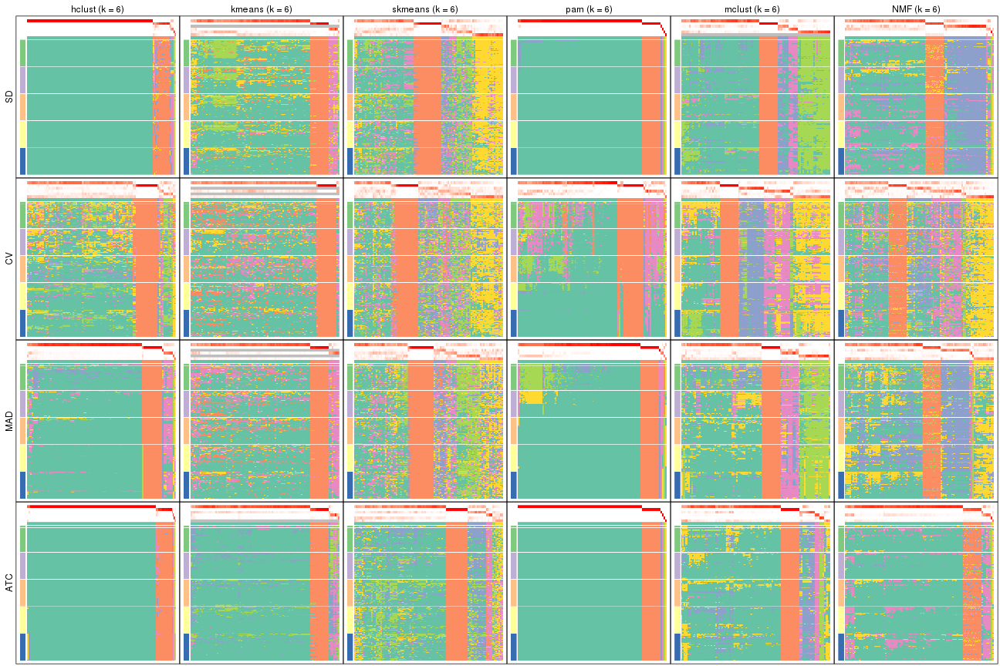</p>

</div>
</div>


### Signature heatmap

Signature heatmaps for all methods. ([What is a signature heatmap?](http://bioconductor.org/packages/devel/bioc/vignettes/cola/inst/doc/cola.html#toc_22))


Note in following heatmaps, rows are scaled.


<script>
$( function() {
	$( '#tabs-collect-get-signatures' ).tabs();
} );
</script>
<div id='tabs-collect-get-signatures'>
<ul>
<li><a href='#tab-collect-get-signatures-1'>k = 2</a></li>
<li><a href='#tab-collect-get-signatures-2'>k = 3</a></li>
<li><a href='#tab-collect-get-signatures-3'>k = 4</a></li>
<li><a href='#tab-collect-get-signatures-4'>k = 5</a></li>
<li><a href='#tab-collect-get-signatures-5'>k = 6</a></li>
</ul>
<div id='tab-collect-get-signatures-1'>
<pre><code class="r">collect_plots(res_list, k = 2, fun = get_signatures, mc.cores = 4)
</code></pre>

<p></p>

</div>
<div id='tab-collect-get-signatures-2'>
<pre><code class="r">collect_plots(res_list, k = 3, fun = get_signatures, mc.cores = 4)
</code></pre>

<p></p>

</div>
<div id='tab-collect-get-signatures-3'>
<pre><code class="r">collect_plots(res_list, k = 4, fun = get_signatures, mc.cores = 4)
</code></pre>

<p></p>

</div>
<div id='tab-collect-get-signatures-4'>
<pre><code class="r">collect_plots(res_list, k = 5, fun = get_signatures, mc.cores = 4)
</code></pre>

<p>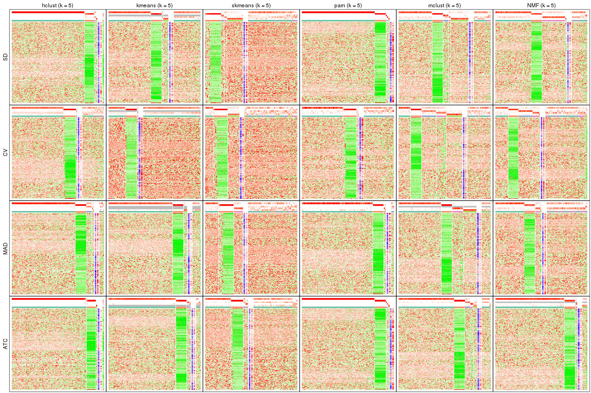</p>

</div>
<div id='tab-collect-get-signatures-5'>
<pre><code class="r">collect_plots(res_list, k = 6, fun = get_signatures, mc.cores = 4)
</code></pre>

<p></p>

</div>
</div>


### Statistics table

The statistics used for measuring the stability of consensus partitioning.
([How are they
defined?](http://bioconductor.org/packages/devel/bioc/vignettes/cola/inst/doc/cola.html#toc_13))


<script>
$( function() {
	$( '#tabs-get-stats-from-consensus-partition-list' ).tabs();
} );
</script>
<div id='tabs-get-stats-from-consensus-partition-list'>
<ul>
<li><a href='#tab-get-stats-from-consensus-partition-list-1'>k = 2</a></li>
<li><a href='#tab-get-stats-from-consensus-partition-list-2'>k = 3</a></li>
<li><a href='#tab-get-stats-from-consensus-partition-list-3'>k = 4</a></li>
<li><a href='#tab-get-stats-from-consensus-partition-list-4'>k = 5</a></li>
<li><a href='#tab-get-stats-from-consensus-partition-list-5'>k = 6</a></li>
</ul>
<div id='tab-get-stats-from-consensus-partition-list-1'>
<pre><code class="r">get_stats(res_list, k = 2)
</code></pre>

<pre><code>#&gt;             k 1-PAC mean_silhouette concordance area_increased  Rand Jaccard
#&gt; SD:NMF      2 1.000           0.998       0.999          0.220 0.782   0.782
#&gt; CV:NMF      2 0.545           0.893       0.918          0.305 0.767   0.767
#&gt; MAD:NMF     2 1.000           0.976       0.986          0.232 0.767   0.767
#&gt; ATC:NMF     2 1.000           1.000       1.000          0.219 0.782   0.782
#&gt; SD:skmeans  2 1.000           0.995       0.998          0.315 0.683   0.683
#&gt; CV:skmeans  2 0.854           0.904       0.960          0.415 0.579   0.579
#&gt; MAD:skmeans 2 1.000           0.963       0.985          0.367 0.636   0.636
#&gt; ATC:skmeans 2 1.000           0.999       1.000          0.305 0.696   0.696
#&gt; SD:mclust   2 1.000           0.991       0.995          0.337 0.659   0.659
#&gt; CV:mclust   2 1.000           1.000       1.000          0.219 0.782   0.782
#&gt; MAD:mclust  2 1.000           1.000       1.000          0.219 0.782   0.782
#&gt; ATC:mclust  2 1.000           0.990       0.995          0.310 0.696   0.696
#&gt; SD:kmeans   2 1.000           0.993       0.997          0.230 0.767   0.767
#&gt; CV:kmeans   2 1.000           0.992       0.993          0.232 0.767   0.767
#&gt; MAD:kmeans  2 1.000           0.994       0.995          0.227 0.767   0.767
#&gt; ATC:kmeans  2 1.000           1.000       1.000          0.219 0.782   0.782
#&gt; SD:pam      2 1.000           1.000       1.000          0.219 0.782   0.782
#&gt; CV:pam      2 0.740           0.848       0.938          0.340 0.671   0.671
#&gt; MAD:pam     2 1.000           0.987       0.994          0.243 0.767   0.767
#&gt; ATC:pam     2 1.000           1.000       1.000          0.219 0.782   0.782
#&gt; SD:hclust   2 1.000           1.000       1.000          0.219 0.782   0.782
#&gt; CV:hclust   2 0.661           0.883       0.919          0.327 0.723   0.723
#&gt; MAD:hclust  2 1.000           0.986       0.995          0.241 0.767   0.767
#&gt; ATC:hclust  2 1.000           1.000       1.000          0.219 0.782   0.782
</code></pre>

</div>
<div id='tab-get-stats-from-consensus-partition-list-2'>
<pre><code class="r">get_stats(res_list, k = 3)
</code></pre>

<pre><code>#&gt;             k 1-PAC mean_silhouette concordance area_increased  Rand Jaccard
#&gt; SD:NMF      3 0.664           0.846       0.915         0.5775 0.931   0.911
#&gt; CV:NMF      3 0.193           0.542       0.668         0.8315 0.713   0.626
#&gt; MAD:NMF     3 0.335           0.780       0.858         0.7004 0.962   0.950
#&gt; ATC:NMF     3 0.966           0.948       0.977         0.2544 0.947   0.933
#&gt; SD:skmeans  3 0.483           0.830       0.875         0.8769 0.730   0.604
#&gt; CV:skmeans  3 0.379           0.584       0.757         0.5543 0.695   0.508
#&gt; MAD:skmeans 3 0.401           0.663       0.802         0.6574 0.740   0.598
#&gt; ATC:skmeans 3 0.567           0.851       0.904         0.4495 0.916   0.880
#&gt; SD:mclust   3 0.748           0.912       0.943         0.1759 0.977   0.965
#&gt; CV:mclust   3 0.296           0.529       0.702         1.3895 0.618   0.512
#&gt; MAD:mclust  3 0.748           0.912       0.938         1.0142 0.813   0.761
#&gt; ATC:mclust  3 1.000           0.935       0.972         0.1499 0.967   0.952
#&gt; SD:kmeans   3 0.939           0.956       0.973         0.4682 0.912   0.885
#&gt; CV:kmeans   3 0.266           0.887       0.823         0.8854 1.000   1.000
#&gt; MAD:kmeans  3 0.507           0.778       0.884         0.7241 0.928   0.906
#&gt; ATC:kmeans  3 0.963           0.977       0.987         0.4272 0.899   0.871
#&gt; SD:pam      3 1.000           0.993       0.997         0.1065 0.982   0.977
#&gt; CV:pam      3 0.362           0.590       0.809         0.4870 0.827   0.745
#&gt; MAD:pam     3 0.869           0.902       0.954         0.2442 0.982   0.977
#&gt; ATC:pam     3 1.000           1.000       1.000         0.0820 0.982   0.977
#&gt; SD:hclust   3 1.000           0.999       1.000         0.0844 0.982   0.977
#&gt; CV:hclust   3 0.255           0.598       0.796         0.4993 0.963   0.949
#&gt; MAD:hclust  3 0.992           0.975       0.971         0.1828 0.982   0.977
#&gt; ATC:hclust  3 1.000           1.000       1.000         0.0820 0.982   0.977
</code></pre>

</div>
<div id='tab-get-stats-from-consensus-partition-list-3'>
<pre><code class="r">get_stats(res_list, k = 4)
</code></pre>

<pre><code>#&gt;             k 1-PAC mean_silhouette concordance area_increased  Rand Jaccard
#&gt; SD:NMF      4 0.390           0.724       0.819         0.2755 0.964   0.950
#&gt; CV:NMF      4 0.333           0.554       0.675         0.2321 0.748   0.500
#&gt; MAD:NMF     4 0.279           0.586       0.740         0.3085 0.916   0.885
#&gt; ATC:NMF     4 0.823           0.895       0.933         0.2435 0.966   0.953
#&gt; SD:skmeans  4 0.479           0.645       0.780         0.1871 0.920   0.809
#&gt; CV:skmeans  4 0.397           0.522       0.703         0.1446 0.835   0.576
#&gt; MAD:skmeans 4 0.402           0.560       0.728         0.1632 0.864   0.678
#&gt; ATC:skmeans 4 0.376           0.588       0.783         0.3085 0.943   0.908
#&gt; SD:mclust   4 0.525           0.797       0.836         0.4880 0.761   0.624
#&gt; CV:mclust   4 0.364           0.624       0.759         0.2238 0.774   0.547
#&gt; MAD:mclust  4 0.472           0.801       0.847         0.4192 0.792   0.651
#&gt; ATC:mclust  4 0.669           0.865       0.925         0.1801 0.980   0.970
#&gt; SD:kmeans   4 0.405           0.858       0.854         0.3895 1.000   1.000
#&gt; CV:kmeans   4 0.263           0.831       0.732         0.2296 1.000   1.000
#&gt; MAD:kmeans  4 0.273           0.749       0.823         0.2244 0.931   0.901
#&gt; ATC:kmeans  4 0.695           0.906       0.915         0.2696 1.000   1.000
#&gt; SD:pam      4 1.000           0.998       0.999         0.0579 0.982   0.977
#&gt; CV:pam      4 0.327           0.510       0.770         0.0905 0.949   0.904
#&gt; MAD:pam     4 0.657           0.887       0.921         0.1564 0.997   0.997
#&gt; ATC:pam     4 1.000           1.000       1.000         0.0749 0.982   0.977
#&gt; SD:hclust   4 0.998           0.959       0.979         0.0794 1.000   1.000
#&gt; CV:hclust   4 0.268           0.576       0.742         0.1577 0.896   0.851
#&gt; MAD:hclust  4 0.814           0.833       0.936         0.1698 0.982   0.977
#&gt; ATC:hclust  4 1.000           0.978       0.992         0.0342 0.999   0.998
</code></pre>

</div>
<div id='tab-get-stats-from-consensus-partition-list-4'>
<pre><code class="r">get_stats(res_list, k = 5)
</code></pre>

<pre><code>#&gt;             k 1-PAC mean_silhouette concordance area_increased  Rand Jaccard
#&gt; SD:NMF      5 0.299           0.664       0.730        0.30899 0.650   0.507
#&gt; CV:NMF      5 0.408           0.489       0.638        0.09623 0.964   0.876
#&gt; MAD:NMF     5 0.280           0.496       0.674        0.20484 0.675   0.523
#&gt; ATC:NMF     5 0.582           0.860       0.892        0.14996 0.982   0.975
#&gt; SD:skmeans  5 0.498           0.507       0.705        0.08062 0.921   0.775
#&gt; CV:skmeans  5 0.440           0.415       0.615        0.07281 0.924   0.722
#&gt; MAD:skmeans 5 0.443           0.461       0.663        0.08783 0.928   0.775
#&gt; ATC:skmeans 5 0.383           0.450       0.684        0.13532 0.897   0.818
#&gt; SD:mclust   5 0.462           0.670       0.778        0.15314 0.945   0.863
#&gt; CV:mclust   5 0.426           0.593       0.686        0.13795 0.822   0.532
#&gt; MAD:mclust  5 0.541           0.749       0.806        0.09810 0.962   0.905
#&gt; ATC:mclust  5 0.531           0.759       0.858        0.26279 0.902   0.849
#&gt; SD:kmeans   5 0.356           0.425       0.781        0.16415 0.983   0.976
#&gt; CV:kmeans   5 0.262           0.439       0.655        0.12738 0.932   0.911
#&gt; MAD:kmeans  5 0.271           0.730       0.773        0.12020 0.982   0.972
#&gt; ATC:kmeans  5 0.361           0.831       0.850        0.16995 0.998   0.997
#&gt; SD:pam      5 1.000           0.998       0.998        0.06856 0.982   0.977
#&gt; CV:pam      5 0.319           0.512       0.761        0.02069 0.997   0.995
#&gt; MAD:pam     5 0.638           0.858       0.914        0.07520 0.965   0.954
#&gt; ATC:pam     5 0.982           0.996       0.997        0.06881 0.982   0.977
#&gt; SD:hclust   5 0.960           0.968       0.973        0.02071 0.964   0.953
#&gt; CV:hclust   5 0.291           0.552       0.696        0.09469 0.984   0.973
#&gt; MAD:hclust  5 0.708           0.853       0.904        0.20810 0.888   0.847
#&gt; ATC:hclust  5 1.000           0.960       0.987        0.00708 0.999   0.998
</code></pre>

</div>
<div id='tab-get-stats-from-consensus-partition-list-5'>
<pre><code class="r">get_stats(res_list, k = 6)
</code></pre>

<pre><code>#&gt;             k 1-PAC mean_silhouette concordance area_increased  Rand Jaccard
#&gt; SD:NMF      6 0.357           0.548       0.729        0.15111 0.891   0.754
#&gt; CV:NMF      6 0.463           0.346       0.564        0.06145 0.835   0.477
#&gt; MAD:NMF     6 0.334           0.432       0.595        0.11258 0.694   0.408
#&gt; ATC:NMF     6 0.417           0.779       0.855        0.12753 0.965   0.948
#&gt; SD:skmeans  6 0.535           0.450       0.652        0.04984 0.934   0.779
#&gt; CV:skmeans  6 0.484           0.369       0.565        0.04482 0.921   0.667
#&gt; MAD:skmeans 6 0.498           0.399       0.600        0.05306 0.899   0.650
#&gt; ATC:skmeans 6 0.405           0.443       0.657        0.07847 0.907   0.812
#&gt; SD:mclust   6 0.486           0.653       0.753        0.05922 0.988   0.966
#&gt; CV:mclust   6 0.476           0.525       0.688        0.06970 0.937   0.735
#&gt; MAD:mclust  6 0.561           0.529       0.734        0.06898 0.986   0.962
#&gt; ATC:mclust  6 0.436           0.604       0.799        0.14438 0.916   0.848
#&gt; SD:kmeans   6 0.349           0.490       0.744        0.05768 1.000   1.000
#&gt; CV:kmeans   6 0.262           0.447       0.628        0.06362 0.965   0.952
#&gt; MAD:kmeans  6 0.276           0.698       0.735        0.07091 0.982   0.973
#&gt; ATC:kmeans  6 0.352           0.705       0.813        0.07199 0.982   0.973
#&gt; SD:pam      6 1.000           0.988       0.993        0.09079 0.983   0.976
#&gt; CV:pam      6 0.323           0.504       0.759        0.01493 0.986   0.973
#&gt; MAD:pam     6 0.627           0.823       0.908        0.04487 0.983   0.976
#&gt; ATC:pam     6 1.000           1.000       1.000        0.06359 0.983   0.976
#&gt; SD:hclust   6 0.958           0.934       0.967        0.01697 0.999   0.998
#&gt; CV:hclust   6 0.322           0.511       0.649        0.07271 0.950   0.914
#&gt; MAD:hclust  6 0.650           0.872       0.904        0.07897 0.999   0.998
#&gt; ATC:hclust  6 1.000           0.955       0.985        0.00659 0.999   0.999
</code></pre>

</div>
</div>

Following heatmap plots the partition for each combination of methods and the
lightness correspond to the silhouette scores for samples in each method. On
top the consensus subgroup is inferred from all methods by taking the mean
silhouette scores as weight.


<script>
$( function() {
	$( '#tabs-collect-stats-from-consensus-partition-list' ).tabs();
} );
</script>
<div id='tabs-collect-stats-from-consensus-partition-list'>
<ul>
<li><a href='#tab-collect-stats-from-consensus-partition-list-1'>k = 2</a></li>
<li><a href='#tab-collect-stats-from-consensus-partition-list-2'>k = 3</a></li>
<li><a href='#tab-collect-stats-from-consensus-partition-list-3'>k = 4</a></li>
<li><a href='#tab-collect-stats-from-consensus-partition-list-4'>k = 5</a></li>
<li><a href='#tab-collect-stats-from-consensus-partition-list-5'>k = 6</a></li>
</ul>
<div id='tab-collect-stats-from-consensus-partition-list-1'>
<pre><code class="r">collect_stats(res_list, k = 2)
</code></pre>

<p></p>

</div>
<div id='tab-collect-stats-from-consensus-partition-list-2'>
<pre><code class="r">collect_stats(res_list, k = 3)
</code></pre>

<p></p>

</div>
<div id='tab-collect-stats-from-consensus-partition-list-3'>
<pre><code class="r">collect_stats(res_list, k = 4)
</code></pre>

<p></p>

</div>
<div id='tab-collect-stats-from-consensus-partition-list-4'>
<pre><code class="r">collect_stats(res_list, k = 5)
</code></pre>

<p></p>

</div>
<div id='tab-collect-stats-from-consensus-partition-list-5'>
<pre><code class="r">collect_stats(res_list, k = 6)
</code></pre>

<p></p>

</div>
</div>

### Partition from all methods


Collect partitions from all methods:


<script>
$( function() {
	$( '#tabs-collect-classes-from-consensus-partition-list' ).tabs();
} );
</script>
<div id='tabs-collect-classes-from-consensus-partition-list'>
<ul>
<li><a href='#tab-collect-classes-from-consensus-partition-list-1'>k = 2</a></li>
<li><a href='#tab-collect-classes-from-consensus-partition-list-2'>k = 3</a></li>
<li><a href='#tab-collect-classes-from-consensus-partition-list-3'>k = 4</a></li>
<li><a href='#tab-collect-classes-from-consensus-partition-list-4'>k = 5</a></li>
<li><a href='#tab-collect-classes-from-consensus-partition-list-5'>k = 6</a></li>
</ul>
<div id='tab-collect-classes-from-consensus-partition-list-1'>
<pre><code class="r">collect_classes(res_list, k = 2)
</code></pre>

<p></p>

</div>
<div id='tab-collect-classes-from-consensus-partition-list-2'>
<pre><code class="r">collect_classes(res_list, k = 3)
</code></pre>

<p></p>

</div>
<div id='tab-collect-classes-from-consensus-partition-list-3'>
<pre><code class="r">collect_classes(res_list, k = 4)
</code></pre>

<p></p>

</div>
<div id='tab-collect-classes-from-consensus-partition-list-4'>
<pre><code class="r">collect_classes(res_list, k = 5)
</code></pre>

<p></p>

</div>
<div id='tab-collect-classes-from-consensus-partition-list-5'>
<pre><code class="r">collect_classes(res_list, k = 6)
</code></pre>

<p></p>

</div>
</div>


### Top rows overlap


Overlap of top rows from different top-row methods:


<script>
$( function() {
	$( '#tabs-top-rows-overlap-by-euler' ).tabs();
} );
</script>
<div id='tabs-top-rows-overlap-by-euler'>
<ul>
<li><a href='#tab-top-rows-overlap-by-euler-1'>top_n = 839</a></li>
<li><a href='#tab-top-rows-overlap-by-euler-2'>top_n = 1678</a></li>
<li><a href='#tab-top-rows-overlap-by-euler-3'>top_n = 2518</a></li>
<li><a href='#tab-top-rows-overlap-by-euler-4'>top_n = 3358</a></li>
<li><a href='#tab-top-rows-overlap-by-euler-5'>top_n = 4197</a></li>
</ul>
<div id='tab-top-rows-overlap-by-euler-1'>
<pre><code class="r">top_rows_overlap(res_list, top_n = 839, method = &quot;euler&quot;)
</code></pre>

<p></p>

</div>
<div id='tab-top-rows-overlap-by-euler-2'>
<pre><code class="r">top_rows_overlap(res_list, top_n = 1678, method = &quot;euler&quot;)
</code></pre>

<p></p>

</div>
<div id='tab-top-rows-overlap-by-euler-3'>
<pre><code class="r">top_rows_overlap(res_list, top_n = 2518, method = &quot;euler&quot;)
</code></pre>

<p></p>

</div>
<div id='tab-top-rows-overlap-by-euler-4'>
<pre><code class="r">top_rows_overlap(res_list, top_n = 3358, method = &quot;euler&quot;)
</code></pre>

<p>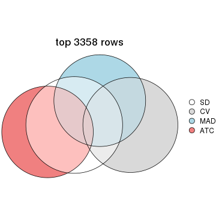</p>

</div>
<div id='tab-top-rows-overlap-by-euler-5'>
<pre><code class="r">top_rows_overlap(res_list, top_n = 4197, method = &quot;euler&quot;)
</code></pre>

<p>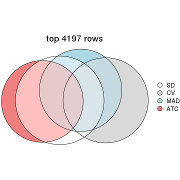</p>

</div>
</div>

Also visualize the correspondance of rankings between different top-row methods:


<script>
$( function() {
	$( '#tabs-top-rows-overlap-by-correspondance' ).tabs();
} );
</script>
<div id='tabs-top-rows-overlap-by-correspondance'>
<ul>
<li><a href='#tab-top-rows-overlap-by-correspondance-1'>top_n = 839</a></li>
<li><a href='#tab-top-rows-overlap-by-correspondance-2'>top_n = 1678</a></li>
<li><a href='#tab-top-rows-overlap-by-correspondance-3'>top_n = 2518</a></li>
<li><a href='#tab-top-rows-overlap-by-correspondance-4'>top_n = 3358</a></li>
<li><a href='#tab-top-rows-overlap-by-correspondance-5'>top_n = 4197</a></li>
</ul>
<div id='tab-top-rows-overlap-by-correspondance-1'>
<pre><code class="r">top_rows_overlap(res_list, top_n = 839, method = &quot;correspondance&quot;)
</code></pre>

<p></p>

</div>
<div id='tab-top-rows-overlap-by-correspondance-2'>
<pre><code class="r">top_rows_overlap(res_list, top_n = 1678, method = &quot;correspondance&quot;)
</code></pre>

<p></p>

</div>
<div id='tab-top-rows-overlap-by-correspondance-3'>
<pre><code class="r">top_rows_overlap(res_list, top_n = 2518, method = &quot;correspondance&quot;)
</code></pre>

<p></p>

</div>
<div id='tab-top-rows-overlap-by-correspondance-4'>
<pre><code class="r">top_rows_overlap(res_list, top_n = 3358, method = &quot;correspondance&quot;)
</code></pre>

<p></p>

</div>
<div id='tab-top-rows-overlap-by-correspondance-5'>
<pre><code class="r">top_rows_overlap(res_list, top_n = 4197, method = &quot;correspondance&quot;)
</code></pre>

<p></p>

</div>
</div>


Heatmaps of the top rows:


<script>
$( function() {
	$( '#tabs-top-rows-heatmap' ).tabs();
} );
</script>
<div id='tabs-top-rows-heatmap'>
<ul>
<li><a href='#tab-top-rows-heatmap-1'>top_n = 839</a></li>
<li><a href='#tab-top-rows-heatmap-2'>top_n = 1678</a></li>
<li><a href='#tab-top-rows-heatmap-3'>top_n = 2518</a></li>
<li><a href='#tab-top-rows-heatmap-4'>top_n = 3358</a></li>
<li><a href='#tab-top-rows-heatmap-5'>top_n = 4197</a></li>
</ul>
<div id='tab-top-rows-heatmap-1'>
<pre><code class="r">top_rows_heatmap(res_list, top_n = 839)
</code></pre>

<p></p>

</div>
<div id='tab-top-rows-heatmap-2'>
<pre><code class="r">top_rows_heatmap(res_list, top_n = 1678)
</code></pre>

<p></p>

</div>
<div id='tab-top-rows-heatmap-3'>
<pre><code class="r">top_rows_heatmap(res_list, top_n = 2518)
</code></pre>

<p></p>

</div>
<div id='tab-top-rows-heatmap-4'>
<pre><code class="r">top_rows_heatmap(res_list, top_n = 3358)
</code></pre>

<p></p>

</div>
<div id='tab-top-rows-heatmap-5'>
<pre><code class="r">top_rows_heatmap(res_list, top_n = 4197)
</code></pre>

<p></p>

</div>
</div>


 
## Results for each method


---------------------------------------------------


### SD:hclust**


The object with results only for a single top-value method and a single partition method 
can be extracted as:

```r
res = res_list["SD", "hclust"]
# you can also extract it by
# res = res_list["SD:hclust"]
```

A summary of `res` and all the functions that can be applied to it:

```r
res
```

```
#> A 'ConsensusPartition' object with k = 2, 3, 4, 5, 6.
#>   On a matrix with 8394 rows and 194 columns.
#>   Top rows (839, 1678, 2518, 3358, 4197) are extracted by 'SD' method.
#>   Subgroups are detected by 'hclust' method.
#>   Performed in total 1250 partitions by row resampling.
#>   Best k for subgroups seems to be 2.
#> 
#> Following methods can be applied to this 'ConsensusPartition' object:
#>  [1] "cola_report"             "collect_classes"         "collect_plots"          
#>  [4] "collect_stats"           "colnames"                "compare_signatures"     
#>  [7] "consensus_heatmap"       "dimension_reduction"     "functional_enrichment"  
#> [10] "get_anno_col"            "get_anno"                "get_classes"            
#> [13] "get_consensus"           "get_matrix"              "get_membership"         
#> [16] "get_param"               "get_signatures"          "get_stats"              
#> [19] "is_best_k"               "is_stable_k"             "membership_heatmap"     
#> [22] "ncol"                    "nrow"                    "plot_ecdf"              
#> [25] "rownames"                "select_partition_number" "show"                   
#> [28] "suggest_best_k"          "test_to_known_factors"
```

`collect_plots()` function collects all the plots made from `res` for all `k` (number of partitions)
into one single page to provide an easy and fast comparison between different `k`.

```r
collect_plots(res)
```


The plots are:

- The first row: a plot of the ECDF (Empirical cumulative distribution
  function) curves of the consensus matrix for each `k` and the heatmap of
  predicted classes for each `k`.
- The second row: heatmaps of the consensus matrix for each `k`.
- The third row: heatmaps of the membership matrix for each `k`.
- The fouth row: heatmaps of the signatures for each `k`.

All the plots in panels can be made by individual functions and they are
plotted later in this section.

`select_partition_number()` produces several plots showing different
statistics for choosing "optimized" `k`. There are following statistics:

- ECDF curves of the consensus matrix for each `k`;
- 1-PAC. [The PAC
  score](https://en.wikipedia.org/wiki/Consensus_clustering#Over-interpretation_potential_of_consensus_clustering)
  measures the proportion of the ambiguous subgrouping.
- Mean silhouette score.
- Concordance. The mean probability of fiting the consensus class ids in all
  partitions.
- Area increased. Denote $A_k$ as the area under the ECDF curve for current
  `k`, the area increased is defined as $A_k - A_{k-1}$.
- Rand index. The percent of pairs of samples that are both in a same cluster
  or both are not in a same cluster in the partition of k and k-1.
- Jaccard index. The ratio of pairs of samples are both in a same cluster in
  the partition of k and k-1 and the pairs of samples are both in a same
  cluster in the partition k or k-1.

The detailed explanations of these statistics can be found in [the cola
vignette](http://bioconductor.org/packages/devel/bioc/vignettes/cola/inst/doc/cola.html#toc_13).

Generally speaking, lower PAC score, higher mean silhouette score or higher
concordance corresponds to better partition. Rand index and Jaccard index
measure how similar the current partition is compared to partition with `k-1`.
If they are too similar, we won't accept `k` is better than `k-1`.

```r
select_partition_number(res)
```

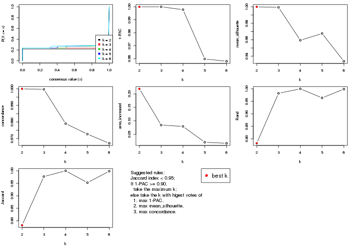

The numeric values for all these statistics can be obtained by `get_stats()`.

```r
get_stats(res)
```

```
#>   k 1-PAC mean_silhouette concordance area_increased  Rand Jaccard
#> 2 2 1.000           1.000       1.000         0.2187 0.782   0.782
#> 3 3 1.000           0.999       1.000         0.0844 0.982   0.977
#> 4 4 0.998           0.959       0.979         0.0794 1.000   1.000
#> 5 5 0.960           0.968       0.973         0.0207 0.964   0.953
#> 6 6 0.958           0.934       0.967         0.0170 0.999   0.998
```

`suggest_best_k()` suggests the best $k$ based on these statistics. The rules are as follows:

- All $k$ with Jaccard index larger than 0.95 are removed because the increase of
  the partition number does not provides enough extra information. If all $k$ are removed,
  the best $k$ is assigned by `NA`.
- For $k$ with 1-PAC larger than 0.9, the maximal $k$ is taken as the "best k". Other $k$ is called "optional k".
- If it does not fit the second rule. The $k$ with the highest vote of highest
  1-PAC, mean silhouette and concordance is taken as the "best k".

```r
suggest_best_k(res)
```

```
#> [1] 2
```


Following shows the table of the partitions (You need to click the **show/hide
code output** link to see it). The membership matrix (columns with name `p*`)
is inferred by
[`clue::cl_consensus()`](https://www.rdocumentation.org/link/cl_consensus?package=clue)
function with the `SE` method. Basically the value in the membership matrix
represents the probability to belong to a certain group. The finall class
label for an item is determined with the group with highest probability it
belongs to.

In `get_classes()` function, the entropy is calculated from the membership
matrix and the silhouette score is calculated from the consensus matrix.


<script>
$( function() {
	$( '#tabs-SD-hclust-get-classes' ).tabs();
} );
</script>
<div id='tabs-SD-hclust-get-classes'>
<ul>
<li><a href='#tab-SD-hclust-get-classes-1'>k = 2</a></li>
<li><a href='#tab-SD-hclust-get-classes-2'>k = 3</a></li>
<li><a href='#tab-SD-hclust-get-classes-3'>k = 4</a></li>
<li><a href='#tab-SD-hclust-get-classes-4'>k = 5</a></li>
<li><a href='#tab-SD-hclust-get-classes-5'>k = 6</a></li>
</ul>

<div id='tab-SD-hclust-get-classes-1'>
<p><a id='tab-SD-hclust-get-classes-1-a' style='color:#0366d6' href='#'>show/hide code output</a></p>
<pre><code class="r">cbind(get_classes(res, k = 2), get_membership(res, k = 2))
</code></pre>

<pre><code>#&gt;           class entropy silhouette p1 p2
#&gt; ERR467487     1       0          1  1  0
#&gt; ERR467498     1       0          1  1  0
#&gt; ERR658998     1       0          1  1  0
#&gt; ERR659094     1       0          1  1  0
#&gt; ERR658999     1       0          1  1  0
#&gt; ERR659095     1       0          1  1  0
#&gt; ERR659000     1       0          1  1  0
#&gt; ERR659096     1       0          1  1  0
#&gt; ERR659001     1       0          1  1  0
#&gt; ERR659097     1       0          1  1  0
#&gt; ERR659002     1       0          1  1  0
#&gt; ERR659098     1       0          1  1  0
#&gt; ERR659003     1       0          1  1  0
#&gt; ERR659099     1       0          1  1  0
#&gt; ERR659004     1       0          1  1  0
#&gt; ERR659100     1       0          1  1  0
#&gt; ERR659005     1       0          1  1  0
#&gt; ERR659101     1       0          1  1  0
#&gt; ERR659006     1       0          1  1  0
#&gt; ERR659102     1       0          1  1  0
#&gt; ERR659007     1       0          1  1  0
#&gt; ERR659103     1       0          1  1  0
#&gt; ERR659008     2       0          1  0  1
#&gt; ERR659104     2       0          1  0  1
#&gt; ERR659009     1       0          1  1  0
#&gt; ERR659105     1       0          1  1  0
#&gt; ERR659010     1       0          1  1  0
#&gt; ERR659106     1       0          1  1  0
#&gt; ERR659011     1       0          1  1  0
#&gt; ERR659107     1       0          1  1  0
#&gt; ERR659012     1       0          1  1  0
#&gt; ERR659108     1       0          1  1  0
#&gt; ERR659013     1       0          1  1  0
#&gt; ERR659109     1       0          1  1  0
#&gt; ERR659014     2       0          1  0  1
#&gt; ERR659110     2       0          1  0  1
#&gt; ERR659015     1       0          1  1  0
#&gt; ERR659111     1       0          1  1  0
#&gt; ERR659016     1       0          1  1  0
#&gt; ERR659112     1       0          1  1  0
#&gt; ERR659017     2       0          1  0  1
#&gt; ERR659113     2       0          1  0  1
#&gt; ERR659018     1       0          1  1  0
#&gt; ERR659114     1       0          1  1  0
#&gt; ERR659019     1       0          1  1  0
#&gt; ERR659115     1       0          1  1  0
#&gt; ERR659020     1       0          1  1  0
#&gt; ERR659116     1       0          1  1  0
#&gt; ERR659021     1       0          1  1  0
#&gt; ERR659117     1       0          1  1  0
#&gt; ERR659022     1       0          1  1  0
#&gt; ERR659118     1       0          1  1  0
#&gt; ERR659023     1       0          1  1  0
#&gt; ERR659119     1       0          1  1  0
#&gt; ERR659024     1       0          1  1  0
#&gt; ERR659120     1       0          1  1  0
#&gt; ERR659025     1       0          1  1  0
#&gt; ERR659121     1       0          1  1  0
#&gt; ERR659026     1       0          1  1  0
#&gt; ERR659122     1       0          1  1  0
#&gt; ERR659027     1       0          1  1  0
#&gt; ERR659123     1       0          1  1  0
#&gt; ERR659028     1       0          1  1  0
#&gt; ERR659124     1       0          1  1  0
#&gt; ERR659029     1       0          1  1  0
#&gt; ERR659125     1       0          1  1  0
#&gt; ERR659030     1       0          1  1  0
#&gt; ERR659126     1       0          1  1  0
#&gt; ERR659031     1       0          1  1  0
#&gt; ERR659127     1       0          1  1  0
#&gt; ERR659032     1       0          1  1  0
#&gt; ERR659128     1       0          1  1  0
#&gt; ERR659033     1       0          1  1  0
#&gt; ERR659129     1       0          1  1  0
#&gt; ERR659034     2       0          1  0  1
#&gt; ERR659130     2       0          1  0  1
#&gt; ERR659035     1       0          1  1  0
#&gt; ERR659131     1       0          1  1  0
#&gt; ERR659036     1       0          1  1  0
#&gt; ERR659132     1       0          1  1  0
#&gt; ERR659037     1       0          1  1  0
#&gt; ERR659133     1       0          1  1  0
#&gt; ERR659038     1       0          1  1  0
#&gt; ERR659134     1       0          1  1  0
#&gt; ERR659039     1       0          1  1  0
#&gt; ERR659135     1       0          1  1  0
#&gt; ERR659040     1       0          1  1  0
#&gt; ERR659136     1       0          1  1  0
#&gt; ERR659041     1       0          1  1  0
#&gt; ERR659137     1       0          1  1  0
#&gt; ERR659042     1       0          1  1  0
#&gt; ERR659138     1       0          1  1  0
#&gt; ERR659043     1       0          1  1  0
#&gt; ERR659139     1       0          1  1  0
#&gt; ERR659044     2       0          1  0  1
#&gt; ERR659140     2       0          1  0  1
#&gt; ERR659045     1       0          1  1  0
#&gt; ERR659141     1       0          1  1  0
#&gt; ERR659046     1       0          1  1  0
#&gt; ERR659142     1       0          1  1  0
#&gt; ERR659047     1       0          1  1  0
#&gt; ERR659143     1       0          1  1  0
#&gt; ERR659048     1       0          1  1  0
#&gt; ERR659144     1       0          1  1  0
#&gt; ERR659049     1       0          1  1  0
#&gt; ERR659145     1       0          1  1  0
#&gt; ERR659050     1       0          1  1  0
#&gt; ERR659146     1       0          1  1  0
#&gt; ERR659051     1       0          1  1  0
#&gt; ERR659147     1       0          1  1  0
#&gt; ERR659052     1       0          1  1  0
#&gt; ERR659148     1       0          1  1  0
#&gt; ERR659053     1       0          1  1  0
#&gt; ERR659149     1       0          1  1  0
#&gt; ERR659054     2       0          1  0  1
#&gt; ERR659150     2       0          1  0  1
#&gt; ERR659055     1       0          1  1  0
#&gt; ERR659151     1       0          1  1  0
#&gt; ERR659056     1       0          1  1  0
#&gt; ERR659152     1       0          1  1  0
#&gt; ERR659057     1       0          1  1  0
#&gt; ERR659153     1       0          1  1  0
#&gt; ERR659058     1       0          1  1  0
#&gt; ERR659154     1       0          1  1  0
#&gt; ERR659059     1       0          1  1  0
#&gt; ERR659155     1       0          1  1  0
#&gt; ERR659060     1       0          1  1  0
#&gt; ERR659156     1       0          1  1  0
#&gt; ERR659061     1       0          1  1  0
#&gt; ERR659157     1       0          1  1  0
#&gt; ERR659062     1       0          1  1  0
#&gt; ERR659158     1       0          1  1  0
#&gt; ERR659063     1       0          1  1  0
#&gt; ERR659159     1       0          1  1  0
#&gt; ERR659064     1       0          1  1  0
#&gt; ERR659160     1       0          1  1  0
#&gt; ERR659065     2       0          1  0  1
#&gt; ERR659161     2       0          1  0  1
#&gt; ERR659066     1       0          1  1  0
#&gt; ERR659162     1       0          1  1  0
#&gt; ERR659067     1       0          1  1  0
#&gt; ERR659163     1       0          1  1  0
#&gt; ERR659068     2       0          1  0  1
#&gt; ERR659164     2       0          1  0  1
#&gt; ERR659069     1       0          1  1  0
#&gt; ERR659165     1       0          1  1  0
#&gt; ERR659070     1       0          1  1  0
#&gt; ERR659166     1       0          1  1  0
#&gt; ERR659071     1       0          1  1  0
#&gt; ERR659167     1       0          1  1  0
#&gt; ERR659072     1       0          1  1  0
#&gt; ERR659168     1       0          1  1  0
#&gt; ERR659073     1       0          1  1  0
#&gt; ERR659169     1       0          1  1  0
#&gt; ERR659074     2       0          1  0  1
#&gt; ERR659170     2       0          1  0  1
#&gt; ERR659075     1       0          1  1  0
#&gt; ERR659171     1       0          1  1  0
#&gt; ERR659076     2       0          1  0  1
#&gt; ERR659172     2       0          1  0  1
#&gt; ERR659077     1       0          1  1  0
#&gt; ERR659173     1       0          1  1  0
#&gt; ERR659078     1       0          1  1  0
#&gt; ERR659174     1       0          1  1  0
#&gt; ERR659079     1       0          1  1  0
#&gt; ERR659175     1       0          1  1  0
#&gt; ERR659080     1       0          1  1  0
#&gt; ERR659176     1       0          1  1  0
#&gt; ERR659081     1       0          1  1  0
#&gt; ERR659177     1       0          1  1  0
#&gt; ERR659082     1       0          1  1  0
#&gt; ERR659178     1       0          1  1  0
#&gt; ERR659083     2       0          1  0  1
#&gt; ERR659179     2       0          1  0  1
#&gt; ERR659084     2       0          1  0  1
#&gt; ERR659180     2       0          1  0  1
#&gt; ERR659085     1       0          1  1  0
#&gt; ERR659181     1       0          1  1  0
#&gt; ERR659086     1       0          1  1  0
#&gt; ERR659182     1       0          1  1  0
#&gt; ERR659087     1       0          1  1  0
#&gt; ERR659183     1       0          1  1  0
#&gt; ERR659088     1       0          1  1  0
#&gt; ERR659184     1       0          1  1  0
#&gt; ERR659089     1       0          1  1  0
#&gt; ERR659185     1       0          1  1  0
#&gt; ERR659090     1       0          1  1  0
#&gt; ERR659186     1       0          1  1  0
#&gt; ERR659091     1       0          1  1  0
#&gt; ERR659187     1       0          1  1  0
#&gt; ERR659092     1       0          1  1  0
#&gt; ERR659188     1       0          1  1  0
#&gt; ERR659093     1       0          1  1  0
#&gt; ERR659189     1       0          1  1  0
</code></pre>

<script>
$('#tab-SD-hclust-get-classes-1-a').parent().next().next().hide();
$('#tab-SD-hclust-get-classes-1-a').click(function(){
  $('#tab-SD-hclust-get-classes-1-a').parent().next().next().toggle();
  return(false);
});
</script>
</div>

<div id='tab-SD-hclust-get-classes-2'>
<p><a id='tab-SD-hclust-get-classes-2-a' style='color:#0366d6' href='#'>show/hide code output</a></p>
<pre><code class="r">cbind(get_classes(res, k = 3), get_membership(res, k = 3))
</code></pre>

<pre><code>#&gt;           class entropy silhouette    p1 p2    p3
#&gt; ERR467487     1  0.0747      0.984 0.984  0 0.016
#&gt; ERR467498     1  0.0747      0.984 0.984  0 0.016
#&gt; ERR658998     1  0.0000      1.000 1.000  0 0.000
#&gt; ERR659094     1  0.0000      1.000 1.000  0 0.000
#&gt; ERR658999     1  0.0000      1.000 1.000  0 0.000
#&gt; ERR659095     1  0.0000      1.000 1.000  0 0.000
#&gt; ERR659000     1  0.0000      1.000 1.000  0 0.000
#&gt; ERR659096     1  0.0000      1.000 1.000  0 0.000
#&gt; ERR659001     1  0.0000      1.000 1.000  0 0.000
#&gt; ERR659097     1  0.0000      1.000 1.000  0 0.000
#&gt; ERR659002     1  0.0000      1.000 1.000  0 0.000
#&gt; ERR659098     1  0.0000      1.000 1.000  0 0.000
#&gt; ERR659003     1  0.0000      1.000 1.000  0 0.000
#&gt; ERR659099     1  0.0000      1.000 1.000  0 0.000
#&gt; ERR659004     1  0.0000      1.000 1.000  0 0.000
#&gt; ERR659100     1  0.0000      1.000 1.000  0 0.000
#&gt; ERR659005     1  0.0000      1.000 1.000  0 0.000
#&gt; ERR659101     1  0.0000      1.000 1.000  0 0.000
#&gt; ERR659006     1  0.0000      1.000 1.000  0 0.000
#&gt; ERR659102     1  0.0000      1.000 1.000  0 0.000
#&gt; ERR659007     1  0.0000      1.000 1.000  0 0.000
#&gt; ERR659103     1  0.0000      1.000 1.000  0 0.000
#&gt; ERR659008     2  0.0000      1.000 0.000  1 0.000
#&gt; ERR659104     2  0.0000      1.000 0.000  1 0.000
#&gt; ERR659009     1  0.0000      1.000 1.000  0 0.000
#&gt; ERR659105     1  0.0000      1.000 1.000  0 0.000
#&gt; ERR659010     1  0.0000      1.000 1.000  0 0.000
#&gt; ERR659106     1  0.0000      1.000 1.000  0 0.000
#&gt; ERR659011     1  0.0000      1.000 1.000  0 0.000
#&gt; ERR659107     1  0.0000      1.000 1.000  0 0.000
#&gt; ERR659012     1  0.0000      1.000 1.000  0 0.000
#&gt; ERR659108     1  0.0000      1.000 1.000  0 0.000
#&gt; ERR659013     1  0.0000      1.000 1.000  0 0.000
#&gt; ERR659109     1  0.0000      1.000 1.000  0 0.000
#&gt; ERR659014     2  0.0000      1.000 0.000  1 0.000
#&gt; ERR659110     2  0.0000      1.000 0.000  1 0.000
#&gt; ERR659015     1  0.0000      1.000 1.000  0 0.000
#&gt; ERR659111     1  0.0000      1.000 1.000  0 0.000
#&gt; ERR659016     1  0.0000      1.000 1.000  0 0.000
#&gt; ERR659112     1  0.0000      1.000 1.000  0 0.000
#&gt; ERR659017     2  0.0000      1.000 0.000  1 0.000
#&gt; ERR659113     2  0.0000      1.000 0.000  1 0.000
#&gt; ERR659018     1  0.0000      1.000 1.000  0 0.000
#&gt; ERR659114     1  0.0000      1.000 1.000  0 0.000
#&gt; ERR659019     1  0.0000      1.000 1.000  0 0.000
#&gt; ERR659115     1  0.0000      1.000 1.000  0 0.000
#&gt; ERR659020     1  0.0000      1.000 1.000  0 0.000
#&gt; ERR659116     1  0.0000      1.000 1.000  0 0.000
#&gt; ERR659021     1  0.0000      1.000 1.000  0 0.000
#&gt; ERR659117     1  0.0000      1.000 1.000  0 0.000
#&gt; ERR659022     1  0.0000      1.000 1.000  0 0.000
#&gt; ERR659118     1  0.0000      1.000 1.000  0 0.000
#&gt; ERR659023     1  0.0000      1.000 1.000  0 0.000
#&gt; ERR659119     1  0.0000      1.000 1.000  0 0.000
#&gt; ERR659024     1  0.0000      1.000 1.000  0 0.000
#&gt; ERR659120     1  0.0000      1.000 1.000  0 0.000
#&gt; ERR659025     1  0.0000      1.000 1.000  0 0.000
#&gt; ERR659121     1  0.0000      1.000 1.000  0 0.000
#&gt; ERR659026     1  0.0000      1.000 1.000  0 0.000
#&gt; ERR659122     1  0.0000      1.000 1.000  0 0.000
#&gt; ERR659027     1  0.0000      1.000 1.000  0 0.000
#&gt; ERR659123     1  0.0000      1.000 1.000  0 0.000
#&gt; ERR659028     1  0.0000      1.000 1.000  0 0.000
#&gt; ERR659124     1  0.0000      1.000 1.000  0 0.000
#&gt; ERR659029     1  0.0000      1.000 1.000  0 0.000
#&gt; ERR659125     1  0.0000      1.000 1.000  0 0.000
#&gt; ERR659030     1  0.0000      1.000 1.000  0 0.000
#&gt; ERR659126     1  0.0000      1.000 1.000  0 0.000
#&gt; ERR659031     1  0.0000      1.000 1.000  0 0.000
#&gt; ERR659127     1  0.0000      1.000 1.000  0 0.000
#&gt; ERR659032     1  0.0000      1.000 1.000  0 0.000
#&gt; ERR659128     1  0.0000      1.000 1.000  0 0.000
#&gt; ERR659033     1  0.0000      1.000 1.000  0 0.000
#&gt; ERR659129     1  0.0000      1.000 1.000  0 0.000
#&gt; ERR659034     2  0.0000      1.000 0.000  1 0.000
#&gt; ERR659130     2  0.0000      1.000 0.000  1 0.000
#&gt; ERR659035     1  0.0000      1.000 1.000  0 0.000
#&gt; ERR659131     1  0.0000      1.000 1.000  0 0.000
#&gt; ERR659036     1  0.0000      1.000 1.000  0 0.000
#&gt; ERR659132     1  0.0000      1.000 1.000  0 0.000
#&gt; ERR659037     1  0.0000      1.000 1.000  0 0.000
#&gt; ERR659133     1  0.0000      1.000 1.000  0 0.000
#&gt; ERR659038     1  0.0000      1.000 1.000  0 0.000
#&gt; ERR659134     1  0.0000      1.000 1.000  0 0.000
#&gt; ERR659039     1  0.0000      1.000 1.000  0 0.000
#&gt; ERR659135     1  0.0000      1.000 1.000  0 0.000
#&gt; ERR659040     1  0.0000      1.000 1.000  0 0.000
#&gt; ERR659136     1  0.0000      1.000 1.000  0 0.000
#&gt; ERR659041     1  0.0000      1.000 1.000  0 0.000
#&gt; ERR659137     1  0.0000      1.000 1.000  0 0.000
#&gt; ERR659042     1  0.0000      1.000 1.000  0 0.000
#&gt; ERR659138     1  0.0000      1.000 1.000  0 0.000
#&gt; ERR659043     1  0.0000      1.000 1.000  0 0.000
#&gt; ERR659139     1  0.0000      1.000 1.000  0 0.000
#&gt; ERR659044     2  0.0000      1.000 0.000  1 0.000
#&gt; ERR659140     2  0.0000      1.000 0.000  1 0.000
#&gt; ERR659045     1  0.0000      1.000 1.000  0 0.000
#&gt; ERR659141     1  0.0000      1.000 1.000  0 0.000
#&gt; ERR659046     1  0.0000      1.000 1.000  0 0.000
#&gt; ERR659142     1  0.0000      1.000 1.000  0 0.000
#&gt; ERR659047     1  0.0000      1.000 1.000  0 0.000
#&gt; ERR659143     1  0.0000      1.000 1.000  0 0.000
#&gt; ERR659048     1  0.0000      1.000 1.000  0 0.000
#&gt; ERR659144     1  0.0000      1.000 1.000  0 0.000
#&gt; ERR659049     1  0.0000      1.000 1.000  0 0.000
#&gt; ERR659145     1  0.0000      1.000 1.000  0 0.000
#&gt; ERR659050     1  0.0000      1.000 1.000  0 0.000
#&gt; ERR659146     1  0.0000      1.000 1.000  0 0.000
#&gt; ERR659051     1  0.0747      0.984 0.984  0 0.016
#&gt; ERR659147     1  0.0747      0.984 0.984  0 0.016
#&gt; ERR659052     1  0.0000      1.000 1.000  0 0.000
#&gt; ERR659148     1  0.0000      1.000 1.000  0 0.000
#&gt; ERR659053     1  0.0000      1.000 1.000  0 0.000
#&gt; ERR659149     1  0.0000      1.000 1.000  0 0.000
#&gt; ERR659054     2  0.0000      1.000 0.000  1 0.000
#&gt; ERR659150     2  0.0000      1.000 0.000  1 0.000
#&gt; ERR659055     1  0.0000      1.000 1.000  0 0.000
#&gt; ERR659151     1  0.0000      1.000 1.000  0 0.000
#&gt; ERR659056     1  0.0000      1.000 1.000  0 0.000
#&gt; ERR659152     1  0.0000      1.000 1.000  0 0.000
#&gt; ERR659057     1  0.0000      1.000 1.000  0 0.000
#&gt; ERR659153     1  0.0000      1.000 1.000  0 0.000
#&gt; ERR659058     1  0.0000      1.000 1.000  0 0.000
#&gt; ERR659154     1  0.0000      1.000 1.000  0 0.000
#&gt; ERR659059     1  0.0000      1.000 1.000  0 0.000
#&gt; ERR659155     1  0.0000      1.000 1.000  0 0.000
#&gt; ERR659060     1  0.0000      1.000 1.000  0 0.000
#&gt; ERR659156     1  0.0000      1.000 1.000  0 0.000
#&gt; ERR659061     1  0.0000      1.000 1.000  0 0.000
#&gt; ERR659157     1  0.0000      1.000 1.000  0 0.000
#&gt; ERR659062     1  0.0000      1.000 1.000  0 0.000
#&gt; ERR659158     1  0.0000      1.000 1.000  0 0.000
#&gt; ERR659063     1  0.0000      1.000 1.000  0 0.000
#&gt; ERR659159     1  0.0000      1.000 1.000  0 0.000
#&gt; ERR659064     1  0.0000      1.000 1.000  0 0.000
#&gt; ERR659160     1  0.0000      1.000 1.000  0 0.000
#&gt; ERR659065     2  0.0000      1.000 0.000  1 0.000
#&gt; ERR659161     2  0.0000      1.000 0.000  1 0.000
#&gt; ERR659066     1  0.0000      1.000 1.000  0 0.000
#&gt; ERR659162     1  0.0000      1.000 1.000  0 0.000
#&gt; ERR659067     1  0.0000      1.000 1.000  0 0.000
#&gt; ERR659163     1  0.0000      1.000 1.000  0 0.000
#&gt; ERR659068     2  0.0000      1.000 0.000  1 0.000
#&gt; ERR659164     2  0.0000      1.000 0.000  1 0.000
#&gt; ERR659069     1  0.0000      1.000 1.000  0 0.000
#&gt; ERR659165     1  0.0000      1.000 1.000  0 0.000
#&gt; ERR659070     1  0.0000      1.000 1.000  0 0.000
#&gt; ERR659166     1  0.0000      1.000 1.000  0 0.000
#&gt; ERR659071     1  0.0000      1.000 1.000  0 0.000
#&gt; ERR659167     1  0.0000      1.000 1.000  0 0.000
#&gt; ERR659072     1  0.0000      1.000 1.000  0 0.000
#&gt; ERR659168     1  0.0000      1.000 1.000  0 0.000
#&gt; ERR659073     1  0.0000      1.000 1.000  0 0.000
#&gt; ERR659169     1  0.0000      1.000 1.000  0 0.000
#&gt; ERR659074     2  0.0000      1.000 0.000  1 0.000
#&gt; ERR659170     2  0.0000      1.000 0.000  1 0.000
#&gt; ERR659075     3  0.0000      1.000 0.000  0 1.000
#&gt; ERR659171     3  0.0000      1.000 0.000  0 1.000
#&gt; ERR659076     2  0.0000      1.000 0.000  1 0.000
#&gt; ERR659172     2  0.0000      1.000 0.000  1 0.000
#&gt; ERR659077     1  0.0000      1.000 1.000  0 0.000
#&gt; ERR659173     1  0.0000      1.000 1.000  0 0.000
#&gt; ERR659078     1  0.0000      1.000 1.000  0 0.000
#&gt; ERR659174     1  0.0000      1.000 1.000  0 0.000
#&gt; ERR659079     1  0.0000      1.000 1.000  0 0.000
#&gt; ERR659175     1  0.0000      1.000 1.000  0 0.000
#&gt; ERR659080     1  0.0000      1.000 1.000  0 0.000
#&gt; ERR659176     1  0.0000      1.000 1.000  0 0.000
#&gt; ERR659081     1  0.0000      1.000 1.000  0 0.000
#&gt; ERR659177     1  0.0000      1.000 1.000  0 0.000
#&gt; ERR659082     1  0.0000      1.000 1.000  0 0.000
#&gt; ERR659178     1  0.0000      1.000 1.000  0 0.000
#&gt; ERR659083     2  0.0000      1.000 0.000  1 0.000
#&gt; ERR659179     2  0.0000      1.000 0.000  1 0.000
#&gt; ERR659084     2  0.0000      1.000 0.000  1 0.000
#&gt; ERR659180     2  0.0000      1.000 0.000  1 0.000
#&gt; ERR659085     1  0.0000      1.000 1.000  0 0.000
#&gt; ERR659181     1  0.0000      1.000 1.000  0 0.000
#&gt; ERR659086     1  0.0000      1.000 1.000  0 0.000
#&gt; ERR659182     1  0.0000      1.000 1.000  0 0.000
#&gt; ERR659087     1  0.0000      1.000 1.000  0 0.000
#&gt; ERR659183     1  0.0000      1.000 1.000  0 0.000
#&gt; ERR659088     1  0.0000      1.000 1.000  0 0.000
#&gt; ERR659184     1  0.0000      1.000 1.000  0 0.000
#&gt; ERR659089     1  0.0000      1.000 1.000  0 0.000
#&gt; ERR659185     1  0.0000      1.000 1.000  0 0.000
#&gt; ERR659090     1  0.0000      1.000 1.000  0 0.000
#&gt; ERR659186     1  0.0000      1.000 1.000  0 0.000
#&gt; ERR659091     1  0.0000      1.000 1.000  0 0.000
#&gt; ERR659187     1  0.0000      1.000 1.000  0 0.000
#&gt; ERR659092     1  0.0000      1.000 1.000  0 0.000
#&gt; ERR659188     1  0.0000      1.000 1.000  0 0.000
#&gt; ERR659093     1  0.0000      1.000 1.000  0 0.000
#&gt; ERR659189     1  0.0000      1.000 1.000  0 0.000
</code></pre>

<script>
$('#tab-SD-hclust-get-classes-2-a').parent().next().next().hide();
$('#tab-SD-hclust-get-classes-2-a').click(function(){
  $('#tab-SD-hclust-get-classes-2-a').parent().next().next().toggle();
  return(false);
});
</script>
</div>

<div id='tab-SD-hclust-get-classes-3'>
<p><a id='tab-SD-hclust-get-classes-3-a' style='color:#0366d6' href='#'>show/hide code output</a></p>
<pre><code class="r">cbind(get_classes(res, k = 4), get_membership(res, k = 4))
</code></pre>

<pre><code>#&gt;           class entropy silhouette    p1    p2    p3 p4
#&gt; ERR467487     1  0.4999     0.0968 0.508 0.000 0.492 NA
#&gt; ERR467498     1  0.4999     0.0968 0.508 0.000 0.492 NA
#&gt; ERR658998     1  0.0000     0.9881 1.000 0.000 0.000 NA
#&gt; ERR659094     1  0.0000     0.9881 1.000 0.000 0.000 NA
#&gt; ERR658999     1  0.0000     0.9881 1.000 0.000 0.000 NA
#&gt; ERR659095     1  0.0000     0.9881 1.000 0.000 0.000 NA
#&gt; ERR659000     1  0.0000     0.9881 1.000 0.000 0.000 NA
#&gt; ERR659096     1  0.0000     0.9881 1.000 0.000 0.000 NA
#&gt; ERR659001     1  0.0000     0.9881 1.000 0.000 0.000 NA
#&gt; ERR659097     1  0.0000     0.9881 1.000 0.000 0.000 NA
#&gt; ERR659002     1  0.0000     0.9881 1.000 0.000 0.000 NA
#&gt; ERR659098     1  0.0000     0.9881 1.000 0.000 0.000 NA
#&gt; ERR659003     1  0.0000     0.9881 1.000 0.000 0.000 NA
#&gt; ERR659099     1  0.0000     0.9881 1.000 0.000 0.000 NA
#&gt; ERR659004     1  0.0000     0.9881 1.000 0.000 0.000 NA
#&gt; ERR659100     1  0.0000     0.9881 1.000 0.000 0.000 NA
#&gt; ERR659005     1  0.0000     0.9881 1.000 0.000 0.000 NA
#&gt; ERR659101     1  0.0000     0.9881 1.000 0.000 0.000 NA
#&gt; ERR659006     1  0.0000     0.9881 1.000 0.000 0.000 NA
#&gt; ERR659102     1  0.0000     0.9881 1.000 0.000 0.000 NA
#&gt; ERR659007     1  0.0000     0.9881 1.000 0.000 0.000 NA
#&gt; ERR659103     1  0.0000     0.9881 1.000 0.000 0.000 NA
#&gt; ERR659008     2  0.0921     0.9337 0.000 0.972 0.000 NA
#&gt; ERR659104     2  0.0469     0.9328 0.000 0.988 0.000 NA
#&gt; ERR659009     1  0.0000     0.9881 1.000 0.000 0.000 NA
#&gt; ERR659105     1  0.0000     0.9881 1.000 0.000 0.000 NA
#&gt; ERR659010     1  0.0000     0.9881 1.000 0.000 0.000 NA
#&gt; ERR659106     1  0.0000     0.9881 1.000 0.000 0.000 NA
#&gt; ERR659011     1  0.0000     0.9881 1.000 0.000 0.000 NA
#&gt; ERR659107     1  0.0000     0.9881 1.000 0.000 0.000 NA
#&gt; ERR659012     1  0.0000     0.9881 1.000 0.000 0.000 NA
#&gt; ERR659108     1  0.0000     0.9881 1.000 0.000 0.000 NA
#&gt; ERR659013     1  0.0000     0.9881 1.000 0.000 0.000 NA
#&gt; ERR659109     1  0.0000     0.9881 1.000 0.000 0.000 NA
#&gt; ERR659014     2  0.1022     0.9332 0.000 0.968 0.000 NA
#&gt; ERR659110     2  0.2760     0.9087 0.000 0.872 0.000 NA
#&gt; ERR659015     1  0.0000     0.9881 1.000 0.000 0.000 NA
#&gt; ERR659111     1  0.0000     0.9881 1.000 0.000 0.000 NA
#&gt; ERR659016     1  0.0000     0.9881 1.000 0.000 0.000 NA
#&gt; ERR659112     1  0.0000     0.9881 1.000 0.000 0.000 NA
#&gt; ERR659017     2  0.1389     0.9328 0.000 0.952 0.000 NA
#&gt; ERR659113     2  0.1557     0.9301 0.000 0.944 0.000 NA
#&gt; ERR659018     1  0.0000     0.9881 1.000 0.000 0.000 NA
#&gt; ERR659114     1  0.0000     0.9881 1.000 0.000 0.000 NA
#&gt; ERR659019     1  0.0000     0.9881 1.000 0.000 0.000 NA
#&gt; ERR659115     1  0.0000     0.9881 1.000 0.000 0.000 NA
#&gt; ERR659020     1  0.0000     0.9881 1.000 0.000 0.000 NA
#&gt; ERR659116     1  0.0000     0.9881 1.000 0.000 0.000 NA
#&gt; ERR659021     1  0.0000     0.9881 1.000 0.000 0.000 NA
#&gt; ERR659117     1  0.0000     0.9881 1.000 0.000 0.000 NA
#&gt; ERR659022     1  0.0000     0.9881 1.000 0.000 0.000 NA
#&gt; ERR659118     1  0.0000     0.9881 1.000 0.000 0.000 NA
#&gt; ERR659023     1  0.0000     0.9881 1.000 0.000 0.000 NA
#&gt; ERR659119     1  0.0000     0.9881 1.000 0.000 0.000 NA
#&gt; ERR659024     1  0.0000     0.9881 1.000 0.000 0.000 NA
#&gt; ERR659120     1  0.0000     0.9881 1.000 0.000 0.000 NA
#&gt; ERR659025     1  0.0000     0.9881 1.000 0.000 0.000 NA
#&gt; ERR659121     1  0.0000     0.9881 1.000 0.000 0.000 NA
#&gt; ERR659026     1  0.0000     0.9881 1.000 0.000 0.000 NA
#&gt; ERR659122     1  0.0000     0.9881 1.000 0.000 0.000 NA
#&gt; ERR659027     1  0.0000     0.9881 1.000 0.000 0.000 NA
#&gt; ERR659123     1  0.0000     0.9881 1.000 0.000 0.000 NA
#&gt; ERR659028     1  0.0000     0.9881 1.000 0.000 0.000 NA
#&gt; ERR659124     1  0.0000     0.9881 1.000 0.000 0.000 NA
#&gt; ERR659029     1  0.0000     0.9881 1.000 0.000 0.000 NA
#&gt; ERR659125     1  0.0000     0.9881 1.000 0.000 0.000 NA
#&gt; ERR659030     1  0.0000     0.9881 1.000 0.000 0.000 NA
#&gt; ERR659126     1  0.0000     0.9881 1.000 0.000 0.000 NA
#&gt; ERR659031     1  0.0000     0.9881 1.000 0.000 0.000 NA
#&gt; ERR659127     1  0.0000     0.9881 1.000 0.000 0.000 NA
#&gt; ERR659032     1  0.0000     0.9881 1.000 0.000 0.000 NA
#&gt; ERR659128     1  0.0000     0.9881 1.000 0.000 0.000 NA
#&gt; ERR659033     1  0.0000     0.9881 1.000 0.000 0.000 NA
#&gt; ERR659129     1  0.0000     0.9881 1.000 0.000 0.000 NA
#&gt; ERR659034     2  0.1302     0.9336 0.000 0.956 0.000 NA
#&gt; ERR659130     2  0.1211     0.9333 0.000 0.960 0.000 NA
#&gt; ERR659035     1  0.0000     0.9881 1.000 0.000 0.000 NA
#&gt; ERR659131     1  0.0000     0.9881 1.000 0.000 0.000 NA
#&gt; ERR659036     1  0.0000     0.9881 1.000 0.000 0.000 NA
#&gt; ERR659132     1  0.0000     0.9881 1.000 0.000 0.000 NA
#&gt; ERR659037     1  0.0000     0.9881 1.000 0.000 0.000 NA
#&gt; ERR659133     1  0.0000     0.9881 1.000 0.000 0.000 NA
#&gt; ERR659038     1  0.0000     0.9881 1.000 0.000 0.000 NA
#&gt; ERR659134     1  0.0000     0.9881 1.000 0.000 0.000 NA
#&gt; ERR659039     1  0.0000     0.9881 1.000 0.000 0.000 NA
#&gt; ERR659135     1  0.0000     0.9881 1.000 0.000 0.000 NA
#&gt; ERR659040     1  0.0000     0.9881 1.000 0.000 0.000 NA
#&gt; ERR659136     1  0.0000     0.9881 1.000 0.000 0.000 NA
#&gt; ERR659041     1  0.0000     0.9881 1.000 0.000 0.000 NA
#&gt; ERR659137     1  0.0000     0.9881 1.000 0.000 0.000 NA
#&gt; ERR659042     1  0.0000     0.9881 1.000 0.000 0.000 NA
#&gt; ERR659138     1  0.0000     0.9881 1.000 0.000 0.000 NA
#&gt; ERR659043     1  0.0000     0.9881 1.000 0.000 0.000 NA
#&gt; ERR659139     1  0.0000     0.9881 1.000 0.000 0.000 NA
#&gt; ERR659044     2  0.0592     0.9329 0.000 0.984 0.000 NA
#&gt; ERR659140     2  0.1302     0.9327 0.000 0.956 0.000 NA
#&gt; ERR659045     1  0.0000     0.9881 1.000 0.000 0.000 NA
#&gt; ERR659141     1  0.0000     0.9881 1.000 0.000 0.000 NA
#&gt; ERR659046     1  0.0000     0.9881 1.000 0.000 0.000 NA
#&gt; ERR659142     1  0.0000     0.9881 1.000 0.000 0.000 NA
#&gt; ERR659047     1  0.0000     0.9881 1.000 0.000 0.000 NA
#&gt; ERR659143     1  0.0000     0.9881 1.000 0.000 0.000 NA
#&gt; ERR659048     1  0.0000     0.9881 1.000 0.000 0.000 NA
#&gt; ERR659144     1  0.0000     0.9881 1.000 0.000 0.000 NA
#&gt; ERR659049     1  0.0000     0.9881 1.000 0.000 0.000 NA
#&gt; ERR659145     1  0.0000     0.9881 1.000 0.000 0.000 NA
#&gt; ERR659050     1  0.0000     0.9881 1.000 0.000 0.000 NA
#&gt; ERR659146     1  0.0000     0.9881 1.000 0.000 0.000 NA
#&gt; ERR659051     1  0.5000     0.0696 0.500 0.000 0.500 NA
#&gt; ERR659147     1  0.5000     0.0696 0.500 0.000 0.500 NA
#&gt; ERR659052     1  0.0000     0.9881 1.000 0.000 0.000 NA
#&gt; ERR659148     1  0.0000     0.9881 1.000 0.000 0.000 NA
#&gt; ERR659053     1  0.0000     0.9881 1.000 0.000 0.000 NA
#&gt; ERR659149     1  0.0000     0.9881 1.000 0.000 0.000 NA
#&gt; ERR659054     2  0.4406     0.7182 0.000 0.700 0.000 NA
#&gt; ERR659150     2  0.3266     0.8790 0.000 0.832 0.000 NA
#&gt; ERR659055     1  0.0000     0.9881 1.000 0.000 0.000 NA
#&gt; ERR659151     1  0.0000     0.9881 1.000 0.000 0.000 NA
#&gt; ERR659056     1  0.0000     0.9881 1.000 0.000 0.000 NA
#&gt; ERR659152     1  0.0000     0.9881 1.000 0.000 0.000 NA
#&gt; ERR659057     1  0.0000     0.9881 1.000 0.000 0.000 NA
#&gt; ERR659153     1  0.0000     0.9881 1.000 0.000 0.000 NA
#&gt; ERR659058     1  0.0000     0.9881 1.000 0.000 0.000 NA
#&gt; ERR659154     1  0.0000     0.9881 1.000 0.000 0.000 NA
#&gt; ERR659059     1  0.0000     0.9881 1.000 0.000 0.000 NA
#&gt; ERR659155     1  0.0000     0.9881 1.000 0.000 0.000 NA
#&gt; ERR659060     1  0.0000     0.9881 1.000 0.000 0.000 NA
#&gt; ERR659156     1  0.0000     0.9881 1.000 0.000 0.000 NA
#&gt; ERR659061     1  0.0000     0.9881 1.000 0.000 0.000 NA
#&gt; ERR659157     1  0.0000     0.9881 1.000 0.000 0.000 NA
#&gt; ERR659062     1  0.0000     0.9881 1.000 0.000 0.000 NA
#&gt; ERR659158     1  0.0000     0.9881 1.000 0.000 0.000 NA
#&gt; ERR659063     1  0.0000     0.9881 1.000 0.000 0.000 NA
#&gt; ERR659159     1  0.0000     0.9881 1.000 0.000 0.000 NA
#&gt; ERR659064     1  0.0000     0.9881 1.000 0.000 0.000 NA
#&gt; ERR659160     1  0.0000     0.9881 1.000 0.000 0.000 NA
#&gt; ERR659065     2  0.3486     0.8638 0.000 0.812 0.000 NA
#&gt; ERR659161     2  0.3688     0.8471 0.000 0.792 0.000 NA
#&gt; ERR659066     1  0.0000     0.9881 1.000 0.000 0.000 NA
#&gt; ERR659162     1  0.0000     0.9881 1.000 0.000 0.000 NA
#&gt; ERR659067     1  0.0000     0.9881 1.000 0.000 0.000 NA
#&gt; ERR659163     1  0.0000     0.9881 1.000 0.000 0.000 NA
#&gt; ERR659068     2  0.1867     0.9301 0.000 0.928 0.000 NA
#&gt; ERR659164     2  0.0707     0.9340 0.000 0.980 0.000 NA
#&gt; ERR659069     1  0.0000     0.9881 1.000 0.000 0.000 NA
#&gt; ERR659165     1  0.0000     0.9881 1.000 0.000 0.000 NA
#&gt; ERR659070     1  0.0000     0.9881 1.000 0.000 0.000 NA
#&gt; ERR659166     1  0.0000     0.9881 1.000 0.000 0.000 NA
#&gt; ERR659071     1  0.0000     0.9881 1.000 0.000 0.000 NA
#&gt; ERR659167     1  0.0000     0.9881 1.000 0.000 0.000 NA
#&gt; ERR659072     1  0.0000     0.9881 1.000 0.000 0.000 NA
#&gt; ERR659168     1  0.0000     0.9881 1.000 0.000 0.000 NA
#&gt; ERR659073     1  0.0000     0.9881 1.000 0.000 0.000 NA
#&gt; ERR659169     1  0.0000     0.9881 1.000 0.000 0.000 NA
#&gt; ERR659074     2  0.0469     0.9338 0.000 0.988 0.000 NA
#&gt; ERR659170     2  0.0336     0.9333 0.000 0.992 0.000 NA
#&gt; ERR659075     3  0.4996     1.0000 0.000 0.000 0.516 NA
#&gt; ERR659171     3  0.4996     1.0000 0.000 0.000 0.516 NA
#&gt; ERR659076     2  0.3975     0.7954 0.000 0.760 0.000 NA
#&gt; ERR659172     2  0.2647     0.9054 0.000 0.880 0.000 NA
#&gt; ERR659077     1  0.0000     0.9881 1.000 0.000 0.000 NA
#&gt; ERR659173     1  0.0000     0.9881 1.000 0.000 0.000 NA
#&gt; ERR659078     1  0.0000     0.9881 1.000 0.000 0.000 NA
#&gt; ERR659174     1  0.0000     0.9881 1.000 0.000 0.000 NA
#&gt; ERR659079     1  0.0000     0.9881 1.000 0.000 0.000 NA
#&gt; ERR659175     1  0.0000     0.9881 1.000 0.000 0.000 NA
#&gt; ERR659080     1  0.0000     0.9881 1.000 0.000 0.000 NA
#&gt; ERR659176     1  0.0000     0.9881 1.000 0.000 0.000 NA
#&gt; ERR659081     1  0.0000     0.9881 1.000 0.000 0.000 NA
#&gt; ERR659177     1  0.0000     0.9881 1.000 0.000 0.000 NA
#&gt; ERR659082     1  0.0000     0.9881 1.000 0.000 0.000 NA
#&gt; ERR659178     1  0.0000     0.9881 1.000 0.000 0.000 NA
#&gt; ERR659083     2  0.1302     0.9333 0.000 0.956 0.000 NA
#&gt; ERR659179     2  0.1474     0.9350 0.000 0.948 0.000 NA
#&gt; ERR659084     2  0.2647     0.9050 0.000 0.880 0.000 NA
#&gt; ERR659180     2  0.2081     0.9234 0.000 0.916 0.000 NA
#&gt; ERR659085     1  0.0000     0.9881 1.000 0.000 0.000 NA
#&gt; ERR659181     1  0.0000     0.9881 1.000 0.000 0.000 NA
#&gt; ERR659086     1  0.0000     0.9881 1.000 0.000 0.000 NA
#&gt; ERR659182     1  0.0000     0.9881 1.000 0.000 0.000 NA
#&gt; ERR659087     1  0.0000     0.9881 1.000 0.000 0.000 NA
#&gt; ERR659183     1  0.0000     0.9881 1.000 0.000 0.000 NA
#&gt; ERR659088     1  0.0000     0.9881 1.000 0.000 0.000 NA
#&gt; ERR659184     1  0.0000     0.9881 1.000 0.000 0.000 NA
#&gt; ERR659089     1  0.0000     0.9881 1.000 0.000 0.000 NA
#&gt; ERR659185     1  0.0000     0.9881 1.000 0.000 0.000 NA
#&gt; ERR659090     1  0.0000     0.9881 1.000 0.000 0.000 NA
#&gt; ERR659186     1  0.0000     0.9881 1.000 0.000 0.000 NA
#&gt; ERR659091     1  0.0000     0.9881 1.000 0.000 0.000 NA
#&gt; ERR659187     1  0.0000     0.9881 1.000 0.000 0.000 NA
#&gt; ERR659092     1  0.0000     0.9881 1.000 0.000 0.000 NA
#&gt; ERR659188     1  0.0000     0.9881 1.000 0.000 0.000 NA
#&gt; ERR659093     1  0.0000     0.9881 1.000 0.000 0.000 NA
#&gt; ERR659189     1  0.0000     0.9881 1.000 0.000 0.000 NA
</code></pre>

<script>
$('#tab-SD-hclust-get-classes-3-a').parent().next().next().hide();
$('#tab-SD-hclust-get-classes-3-a').click(function(){
  $('#tab-SD-hclust-get-classes-3-a').parent().next().next().toggle();
  return(false);
});
</script>
</div>

<div id='tab-SD-hclust-get-classes-4'>
<p><a id='tab-SD-hclust-get-classes-4-a' style='color:#0366d6' href='#'>show/hide code output</a></p>
<pre><code class="r">cbind(get_classes(res, k = 5), get_membership(res, k = 5))
</code></pre>

<pre><code>#&gt;           class entropy silhouette    p1    p2    p3    p4    p5
#&gt; ERR467487     4  0.4621      0.988 0.412 0.000 0.004 0.576 0.008
#&gt; ERR467498     4  0.4621      0.988 0.412 0.000 0.004 0.576 0.008
#&gt; ERR658998     1  0.0000      1.000 1.000 0.000 0.000 0.000 0.000
#&gt; ERR659094     1  0.0000      1.000 1.000 0.000 0.000 0.000 0.000
#&gt; ERR658999     1  0.0000      1.000 1.000 0.000 0.000 0.000 0.000
#&gt; ERR659095     1  0.0000      1.000 1.000 0.000 0.000 0.000 0.000
#&gt; ERR659000     1  0.0000      1.000 1.000 0.000 0.000 0.000 0.000
#&gt; ERR659096     1  0.0000      1.000 1.000 0.000 0.000 0.000 0.000
#&gt; ERR659001     1  0.0000      1.000 1.000 0.000 0.000 0.000 0.000
#&gt; ERR659097     1  0.0000      1.000 1.000 0.000 0.000 0.000 0.000
#&gt; ERR659002     1  0.0000      1.000 1.000 0.000 0.000 0.000 0.000
#&gt; ERR659098     1  0.0000      1.000 1.000 0.000 0.000 0.000 0.000
#&gt; ERR659003     1  0.0000      1.000 1.000 0.000 0.000 0.000 0.000
#&gt; ERR659099     1  0.0000      1.000 1.000 0.000 0.000 0.000 0.000
#&gt; ERR659004     1  0.0000      1.000 1.000 0.000 0.000 0.000 0.000
#&gt; ERR659100     1  0.0000      1.000 1.000 0.000 0.000 0.000 0.000
#&gt; ERR659005     1  0.0000      1.000 1.000 0.000 0.000 0.000 0.000
#&gt; ERR659101     1  0.0000      1.000 1.000 0.000 0.000 0.000 0.000
#&gt; ERR659006     1  0.0000      1.000 1.000 0.000 0.000 0.000 0.000
#&gt; ERR659102     1  0.0000      1.000 1.000 0.000 0.000 0.000 0.000
#&gt; ERR659007     1  0.0000      1.000 1.000 0.000 0.000 0.000 0.000
#&gt; ERR659103     1  0.0000      1.000 1.000 0.000 0.000 0.000 0.000
#&gt; ERR659008     2  0.1310      0.855 0.000 0.956 0.024 0.020 0.000
#&gt; ERR659104     2  0.1117      0.855 0.000 0.964 0.016 0.020 0.000
#&gt; ERR659009     1  0.0000      1.000 1.000 0.000 0.000 0.000 0.000
#&gt; ERR659105     1  0.0000      1.000 1.000 0.000 0.000 0.000 0.000
#&gt; ERR659010     1  0.0000      1.000 1.000 0.000 0.000 0.000 0.000
#&gt; ERR659106     1  0.0000      1.000 1.000 0.000 0.000 0.000 0.000
#&gt; ERR659011     1  0.0000      1.000 1.000 0.000 0.000 0.000 0.000
#&gt; ERR659107     1  0.0000      1.000 1.000 0.000 0.000 0.000 0.000
#&gt; ERR659012     1  0.0000      1.000 1.000 0.000 0.000 0.000 0.000
#&gt; ERR659108     1  0.0000      1.000 1.000 0.000 0.000 0.000 0.000
#&gt; ERR659013     1  0.0000      1.000 1.000 0.000 0.000 0.000 0.000
#&gt; ERR659109     1  0.0000      1.000 1.000 0.000 0.000 0.000 0.000
#&gt; ERR659014     2  0.1386      0.855 0.000 0.952 0.016 0.032 0.000
#&gt; ERR659110     2  0.4402      0.732 0.000 0.740 0.204 0.056 0.000
#&gt; ERR659015     1  0.0000      1.000 1.000 0.000 0.000 0.000 0.000
#&gt; ERR659111     1  0.0000      1.000 1.000 0.000 0.000 0.000 0.000
#&gt; ERR659016     1  0.0000      1.000 1.000 0.000 0.000 0.000 0.000
#&gt; ERR659112     1  0.0000      1.000 1.000 0.000 0.000 0.000 0.000
#&gt; ERR659017     2  0.1907      0.854 0.000 0.928 0.028 0.044 0.000
#&gt; ERR659113     2  0.2843      0.832 0.000 0.876 0.076 0.048 0.000
#&gt; ERR659018     1  0.0000      1.000 1.000 0.000 0.000 0.000 0.000
#&gt; ERR659114     1  0.0000      1.000 1.000 0.000 0.000 0.000 0.000
#&gt; ERR659019     1  0.0000      1.000 1.000 0.000 0.000 0.000 0.000
#&gt; ERR659115     1  0.0000      1.000 1.000 0.000 0.000 0.000 0.000
#&gt; ERR659020     1  0.0000      1.000 1.000 0.000 0.000 0.000 0.000
#&gt; ERR659116     1  0.0000      1.000 1.000 0.000 0.000 0.000 0.000
#&gt; ERR659021     1  0.0000      1.000 1.000 0.000 0.000 0.000 0.000
#&gt; ERR659117     1  0.0000      1.000 1.000 0.000 0.000 0.000 0.000
#&gt; ERR659022     1  0.0000      1.000 1.000 0.000 0.000 0.000 0.000
#&gt; ERR659118     1  0.0000      1.000 1.000 0.000 0.000 0.000 0.000
#&gt; ERR659023     1  0.0000      1.000 1.000 0.000 0.000 0.000 0.000
#&gt; ERR659119     1  0.0000      1.000 1.000 0.000 0.000 0.000 0.000
#&gt; ERR659024     1  0.0000      1.000 1.000 0.000 0.000 0.000 0.000
#&gt; ERR659120     1  0.0000      1.000 1.000 0.000 0.000 0.000 0.000
#&gt; ERR659025     1  0.0000      1.000 1.000 0.000 0.000 0.000 0.000
#&gt; ERR659121     1  0.0000      1.000 1.000 0.000 0.000 0.000 0.000
#&gt; ERR659026     1  0.0000      1.000 1.000 0.000 0.000 0.000 0.000
#&gt; ERR659122     1  0.0000      1.000 1.000 0.000 0.000 0.000 0.000
#&gt; ERR659027     1  0.0000      1.000 1.000 0.000 0.000 0.000 0.000
#&gt; ERR659123     1  0.0000      1.000 1.000 0.000 0.000 0.000 0.000
#&gt; ERR659028     1  0.0000      1.000 1.000 0.000 0.000 0.000 0.000
#&gt; ERR659124     1  0.0000      1.000 1.000 0.000 0.000 0.000 0.000
#&gt; ERR659029     1  0.0000      1.000 1.000 0.000 0.000 0.000 0.000
#&gt; ERR659125     1  0.0000      1.000 1.000 0.000 0.000 0.000 0.000
#&gt; ERR659030     1  0.0000      1.000 1.000 0.000 0.000 0.000 0.000
#&gt; ERR659126     1  0.0000      1.000 1.000 0.000 0.000 0.000 0.000
#&gt; ERR659031     1  0.0000      1.000 1.000 0.000 0.000 0.000 0.000
#&gt; ERR659127     1  0.0000      1.000 1.000 0.000 0.000 0.000 0.000
#&gt; ERR659032     1  0.0000      1.000 1.000 0.000 0.000 0.000 0.000
#&gt; ERR659128     1  0.0000      1.000 1.000 0.000 0.000 0.000 0.000
#&gt; ERR659033     1  0.0000      1.000 1.000 0.000 0.000 0.000 0.000
#&gt; ERR659129     1  0.0000      1.000 1.000 0.000 0.000 0.000 0.000
#&gt; ERR659034     2  0.1493      0.854 0.000 0.948 0.028 0.024 0.000
#&gt; ERR659130     2  0.1741      0.855 0.000 0.936 0.024 0.040 0.000
#&gt; ERR659035     1  0.0000      1.000 1.000 0.000 0.000 0.000 0.000
#&gt; ERR659131     1  0.0000      1.000 1.000 0.000 0.000 0.000 0.000
#&gt; ERR659036     1  0.0000      1.000 1.000 0.000 0.000 0.000 0.000
#&gt; ERR659132     1  0.0000      1.000 1.000 0.000 0.000 0.000 0.000
#&gt; ERR659037     1  0.0000      1.000 1.000 0.000 0.000 0.000 0.000
#&gt; ERR659133     1  0.0000      1.000 1.000 0.000 0.000 0.000 0.000
#&gt; ERR659038     1  0.0000      1.000 1.000 0.000 0.000 0.000 0.000
#&gt; ERR659134     1  0.0000      1.000 1.000 0.000 0.000 0.000 0.000
#&gt; ERR659039     1  0.0000      1.000 1.000 0.000 0.000 0.000 0.000
#&gt; ERR659135     1  0.0000      1.000 1.000 0.000 0.000 0.000 0.000
#&gt; ERR659040     1  0.0000      1.000 1.000 0.000 0.000 0.000 0.000
#&gt; ERR659136     1  0.0000      1.000 1.000 0.000 0.000 0.000 0.000
#&gt; ERR659041     1  0.0000      1.000 1.000 0.000 0.000 0.000 0.000
#&gt; ERR659137     1  0.0000      1.000 1.000 0.000 0.000 0.000 0.000
#&gt; ERR659042     1  0.0000      1.000 1.000 0.000 0.000 0.000 0.000
#&gt; ERR659138     1  0.0000      1.000 1.000 0.000 0.000 0.000 0.000
#&gt; ERR659043     1  0.0000      1.000 1.000 0.000 0.000 0.000 0.000
#&gt; ERR659139     1  0.0000      1.000 1.000 0.000 0.000 0.000 0.000
#&gt; ERR659044     2  0.1310      0.855 0.000 0.956 0.020 0.024 0.000
#&gt; ERR659140     2  0.1918      0.851 0.000 0.928 0.036 0.036 0.000
#&gt; ERR659045     1  0.0000      1.000 1.000 0.000 0.000 0.000 0.000
#&gt; ERR659141     1  0.0000      1.000 1.000 0.000 0.000 0.000 0.000
#&gt; ERR659046     1  0.0000      1.000 1.000 0.000 0.000 0.000 0.000
#&gt; ERR659142     1  0.0000      1.000 1.000 0.000 0.000 0.000 0.000
#&gt; ERR659047     1  0.0000      1.000 1.000 0.000 0.000 0.000 0.000
#&gt; ERR659143     1  0.0000      1.000 1.000 0.000 0.000 0.000 0.000
#&gt; ERR659048     1  0.0000      1.000 1.000 0.000 0.000 0.000 0.000
#&gt; ERR659144     1  0.0000      1.000 1.000 0.000 0.000 0.000 0.000
#&gt; ERR659049     1  0.0000      1.000 1.000 0.000 0.000 0.000 0.000
#&gt; ERR659145     1  0.0000      1.000 1.000 0.000 0.000 0.000 0.000
#&gt; ERR659050     1  0.0000      1.000 1.000 0.000 0.000 0.000 0.000
#&gt; ERR659146     1  0.0000      1.000 1.000 0.000 0.000 0.000 0.000
#&gt; ERR659051     4  0.4455      0.988 0.404 0.000 0.000 0.588 0.008
#&gt; ERR659147     4  0.4455      0.988 0.404 0.000 0.000 0.588 0.008
#&gt; ERR659052     1  0.0000      1.000 1.000 0.000 0.000 0.000 0.000
#&gt; ERR659148     1  0.0000      1.000 1.000 0.000 0.000 0.000 0.000
#&gt; ERR659053     1  0.0000      1.000 1.000 0.000 0.000 0.000 0.000
#&gt; ERR659149     1  0.0000      1.000 1.000 0.000 0.000 0.000 0.000
#&gt; ERR659054     3  0.2929      0.000 0.000 0.180 0.820 0.000 0.000
#&gt; ERR659150     2  0.5867      0.466 0.000 0.604 0.180 0.216 0.000
#&gt; ERR659055     1  0.0000      1.000 1.000 0.000 0.000 0.000 0.000
#&gt; ERR659151     1  0.0000      1.000 1.000 0.000 0.000 0.000 0.000
#&gt; ERR659056     1  0.0000      1.000 1.000 0.000 0.000 0.000 0.000
#&gt; ERR659152     1  0.0000      1.000 1.000 0.000 0.000 0.000 0.000
#&gt; ERR659057     1  0.0000      1.000 1.000 0.000 0.000 0.000 0.000
#&gt; ERR659153     1  0.0000      1.000 1.000 0.000 0.000 0.000 0.000
#&gt; ERR659058     1  0.0000      1.000 1.000 0.000 0.000 0.000 0.000
#&gt; ERR659154     1  0.0000      1.000 1.000 0.000 0.000 0.000 0.000
#&gt; ERR659059     1  0.0000      1.000 1.000 0.000 0.000 0.000 0.000
#&gt; ERR659155     1  0.0000      1.000 1.000 0.000 0.000 0.000 0.000
#&gt; ERR659060     1  0.0000      1.000 1.000 0.000 0.000 0.000 0.000
#&gt; ERR659156     1  0.0000      1.000 1.000 0.000 0.000 0.000 0.000
#&gt; ERR659061     1  0.0000      1.000 1.000 0.000 0.000 0.000 0.000
#&gt; ERR659157     1  0.0000      1.000 1.000 0.000 0.000 0.000 0.000
#&gt; ERR659062     1  0.0000      1.000 1.000 0.000 0.000 0.000 0.000
#&gt; ERR659158     1  0.0000      1.000 1.000 0.000 0.000 0.000 0.000
#&gt; ERR659063     1  0.0000      1.000 1.000 0.000 0.000 0.000 0.000
#&gt; ERR659159     1  0.0000      1.000 1.000 0.000 0.000 0.000 0.000
#&gt; ERR659064     1  0.0000      1.000 1.000 0.000 0.000 0.000 0.000
#&gt; ERR659160     1  0.0000      1.000 1.000 0.000 0.000 0.000 0.000
#&gt; ERR659065     2  0.5387      0.637 0.000 0.688 0.136 0.168 0.008
#&gt; ERR659161     2  0.5749      0.599 0.000 0.648 0.176 0.168 0.008
#&gt; ERR659066     1  0.0000      1.000 1.000 0.000 0.000 0.000 0.000
#&gt; ERR659162     1  0.0000      1.000 1.000 0.000 0.000 0.000 0.000
#&gt; ERR659067     1  0.0000      1.000 1.000 0.000 0.000 0.000 0.000
#&gt; ERR659163     1  0.0000      1.000 1.000 0.000 0.000 0.000 0.000
#&gt; ERR659068     2  0.2144      0.849 0.000 0.912 0.020 0.068 0.000
#&gt; ERR659164     2  0.1012      0.856 0.000 0.968 0.012 0.020 0.000
#&gt; ERR659069     1  0.0000      1.000 1.000 0.000 0.000 0.000 0.000
#&gt; ERR659165     1  0.0000      1.000 1.000 0.000 0.000 0.000 0.000
#&gt; ERR659070     1  0.0000      1.000 1.000 0.000 0.000 0.000 0.000
#&gt; ERR659166     1  0.0000      1.000 1.000 0.000 0.000 0.000 0.000
#&gt; ERR659071     1  0.0000      1.000 1.000 0.000 0.000 0.000 0.000
#&gt; ERR659167     1  0.0000      1.000 1.000 0.000 0.000 0.000 0.000
#&gt; ERR659072     1  0.0000      1.000 1.000 0.000 0.000 0.000 0.000
#&gt; ERR659168     1  0.0000      1.000 1.000 0.000 0.000 0.000 0.000
#&gt; ERR659073     1  0.0000      1.000 1.000 0.000 0.000 0.000 0.000
#&gt; ERR659169     1  0.0000      1.000 1.000 0.000 0.000 0.000 0.000
#&gt; ERR659074     2  0.0566      0.856 0.000 0.984 0.012 0.004 0.000
#&gt; ERR659170     2  0.0671      0.855 0.000 0.980 0.016 0.004 0.000
#&gt; ERR659075     5  0.0290      1.000 0.000 0.000 0.000 0.008 0.992
#&gt; ERR659171     5  0.0290      1.000 0.000 0.000 0.000 0.008 0.992
#&gt; ERR659076     2  0.5958      0.250 0.000 0.568 0.288 0.144 0.000
#&gt; ERR659172     2  0.4343      0.746 0.000 0.768 0.136 0.096 0.000
#&gt; ERR659077     1  0.0000      1.000 1.000 0.000 0.000 0.000 0.000
#&gt; ERR659173     1  0.0000      1.000 1.000 0.000 0.000 0.000 0.000
#&gt; ERR659078     1  0.0000      1.000 1.000 0.000 0.000 0.000 0.000
#&gt; ERR659174     1  0.0000      1.000 1.000 0.000 0.000 0.000 0.000
#&gt; ERR659079     1  0.0000      1.000 1.000 0.000 0.000 0.000 0.000
#&gt; ERR659175     1  0.0000      1.000 1.000 0.000 0.000 0.000 0.000
#&gt; ERR659080     1  0.0000      1.000 1.000 0.000 0.000 0.000 0.000
#&gt; ERR659176     1  0.0000      1.000 1.000 0.000 0.000 0.000 0.000
#&gt; ERR659081     1  0.0000      1.000 1.000 0.000 0.000 0.000 0.000
#&gt; ERR659177     1  0.0000      1.000 1.000 0.000 0.000 0.000 0.000
#&gt; ERR659082     1  0.0000      1.000 1.000 0.000 0.000 0.000 0.000
#&gt; ERR659178     1  0.0000      1.000 1.000 0.000 0.000 0.000 0.000
#&gt; ERR659083     2  0.2153      0.852 0.000 0.916 0.044 0.040 0.000
#&gt; ERR659179     2  0.1907      0.857 0.000 0.928 0.028 0.044 0.000
#&gt; ERR659084     2  0.3877      0.721 0.000 0.764 0.212 0.024 0.000
#&gt; ERR659180     2  0.3464      0.810 0.000 0.836 0.068 0.096 0.000
#&gt; ERR659085     1  0.0000      1.000 1.000 0.000 0.000 0.000 0.000
#&gt; ERR659181     1  0.0000      1.000 1.000 0.000 0.000 0.000 0.000
#&gt; ERR659086     1  0.0000      1.000 1.000 0.000 0.000 0.000 0.000
#&gt; ERR659182     1  0.0000      1.000 1.000 0.000 0.000 0.000 0.000
#&gt; ERR659087     1  0.0000      1.000 1.000 0.000 0.000 0.000 0.000
#&gt; ERR659183     1  0.0000      1.000 1.000 0.000 0.000 0.000 0.000
#&gt; ERR659088     1  0.0000      1.000 1.000 0.000 0.000 0.000 0.000
#&gt; ERR659184     1  0.0000      1.000 1.000 0.000 0.000 0.000 0.000
#&gt; ERR659089     1  0.0000      1.000 1.000 0.000 0.000 0.000 0.000
#&gt; ERR659185     1  0.0000      1.000 1.000 0.000 0.000 0.000 0.000
#&gt; ERR659090     1  0.0000      1.000 1.000 0.000 0.000 0.000 0.000
#&gt; ERR659186     1  0.0000      1.000 1.000 0.000 0.000 0.000 0.000
#&gt; ERR659091     1  0.0000      1.000 1.000 0.000 0.000 0.000 0.000
#&gt; ERR659187     1  0.0000      1.000 1.000 0.000 0.000 0.000 0.000
#&gt; ERR659092     1  0.0000      1.000 1.000 0.000 0.000 0.000 0.000
#&gt; ERR659188     1  0.0000      1.000 1.000 0.000 0.000 0.000 0.000
#&gt; ERR659093     1  0.0000      1.000 1.000 0.000 0.000 0.000 0.000
#&gt; ERR659189     1  0.0000      1.000 1.000 0.000 0.000 0.000 0.000
</code></pre>

<script>
$('#tab-SD-hclust-get-classes-4-a').parent().next().next().hide();
$('#tab-SD-hclust-get-classes-4-a').click(function(){
  $('#tab-SD-hclust-get-classes-4-a').parent().next().next().toggle();
  return(false);
});
</script>
</div>

<div id='tab-SD-hclust-get-classes-5'>
<p><a id='tab-SD-hclust-get-classes-5-a' style='color:#0366d6' href='#'>show/hide code output</a></p>
<pre><code class="r">cbind(get_classes(res, k = 6), get_membership(res, k = 6))
</code></pre>

<pre><code>#&gt;           class entropy silhouette    p1    p2    p3    p4    p5    p6
#&gt; ERR467487     4  0.3515      0.959 0.324 0.000 0.000 0.676 0.000 0.000
#&gt; ERR467498     4  0.3515      0.959 0.324 0.000 0.000 0.676 0.000 0.000
#&gt; ERR658998     1  0.0000      1.000 1.000 0.000 0.000 0.000 0.000 0.000
#&gt; ERR659094     1  0.0000      1.000 1.000 0.000 0.000 0.000 0.000 0.000
#&gt; ERR658999     1  0.0000      1.000 1.000 0.000 0.000 0.000 0.000 0.000
#&gt; ERR659095     1  0.0000      1.000 1.000 0.000 0.000 0.000 0.000 0.000
#&gt; ERR659000     1  0.0000      1.000 1.000 0.000 0.000 0.000 0.000 0.000
#&gt; ERR659096     1  0.0000      1.000 1.000 0.000 0.000 0.000 0.000 0.000
#&gt; ERR659001     1  0.0000      1.000 1.000 0.000 0.000 0.000 0.000 0.000
#&gt; ERR659097     1  0.0000      1.000 1.000 0.000 0.000 0.000 0.000 0.000
#&gt; ERR659002     1  0.0000      1.000 1.000 0.000 0.000 0.000 0.000 0.000
#&gt; ERR659098     1  0.0000      1.000 1.000 0.000 0.000 0.000 0.000 0.000
#&gt; ERR659003     1  0.0000      1.000 1.000 0.000 0.000 0.000 0.000 0.000
#&gt; ERR659099     1  0.0000      1.000 1.000 0.000 0.000 0.000 0.000 0.000
#&gt; ERR659004     1  0.0000      1.000 1.000 0.000 0.000 0.000 0.000 0.000
#&gt; ERR659100     1  0.0000      1.000 1.000 0.000 0.000 0.000 0.000 0.000
#&gt; ERR659005     1  0.0000      1.000 1.000 0.000 0.000 0.000 0.000 0.000
#&gt; ERR659101     1  0.0000      1.000 1.000 0.000 0.000 0.000 0.000 0.000
#&gt; ERR659006     1  0.0000      1.000 1.000 0.000 0.000 0.000 0.000 0.000
#&gt; ERR659102     1  0.0000      1.000 1.000 0.000 0.000 0.000 0.000 0.000
#&gt; ERR659007     1  0.0000      1.000 1.000 0.000 0.000 0.000 0.000 0.000
#&gt; ERR659103     1  0.0000      1.000 1.000 0.000 0.000 0.000 0.000 0.000
#&gt; ERR659008     2  0.1269      0.736 0.000 0.956 0.020 0.012 0.000 0.012
#&gt; ERR659104     2  0.0922      0.735 0.000 0.968 0.024 0.004 0.000 0.004
#&gt; ERR659009     1  0.0000      1.000 1.000 0.000 0.000 0.000 0.000 0.000
#&gt; ERR659105     1  0.0000      1.000 1.000 0.000 0.000 0.000 0.000 0.000
#&gt; ERR659010     1  0.0000      1.000 1.000 0.000 0.000 0.000 0.000 0.000
#&gt; ERR659106     1  0.0000      1.000 1.000 0.000 0.000 0.000 0.000 0.000
#&gt; ERR659011     1  0.0000      1.000 1.000 0.000 0.000 0.000 0.000 0.000
#&gt; ERR659107     1  0.0000      1.000 1.000 0.000 0.000 0.000 0.000 0.000
#&gt; ERR659012     1  0.0000      1.000 1.000 0.000 0.000 0.000 0.000 0.000
#&gt; ERR659108     1  0.0000      1.000 1.000 0.000 0.000 0.000 0.000 0.000
#&gt; ERR659013     1  0.0000      1.000 1.000 0.000 0.000 0.000 0.000 0.000
#&gt; ERR659109     1  0.0000      1.000 1.000 0.000 0.000 0.000 0.000 0.000
#&gt; ERR659014     2  0.1755      0.727 0.000 0.932 0.032 0.028 0.000 0.008
#&gt; ERR659110     2  0.5167      0.357 0.000 0.668 0.140 0.020 0.000 0.172
#&gt; ERR659015     1  0.0000      1.000 1.000 0.000 0.000 0.000 0.000 0.000
#&gt; ERR659111     1  0.0000      1.000 1.000 0.000 0.000 0.000 0.000 0.000
#&gt; ERR659016     1  0.0000      1.000 1.000 0.000 0.000 0.000 0.000 0.000
#&gt; ERR659112     1  0.0000      1.000 1.000 0.000 0.000 0.000 0.000 0.000
#&gt; ERR659017     2  0.2085      0.723 0.000 0.912 0.056 0.024 0.000 0.008
#&gt; ERR659113     2  0.3263      0.645 0.000 0.836 0.112 0.024 0.000 0.028
#&gt; ERR659018     1  0.0000      1.000 1.000 0.000 0.000 0.000 0.000 0.000
#&gt; ERR659114     1  0.0000      1.000 1.000 0.000 0.000 0.000 0.000 0.000
#&gt; ERR659019     1  0.0000      1.000 1.000 0.000 0.000 0.000 0.000 0.000
#&gt; ERR659115     1  0.0000      1.000 1.000 0.000 0.000 0.000 0.000 0.000
#&gt; ERR659020     1  0.0000      1.000 1.000 0.000 0.000 0.000 0.000 0.000
#&gt; ERR659116     1  0.0000      1.000 1.000 0.000 0.000 0.000 0.000 0.000
#&gt; ERR659021     1  0.0000      1.000 1.000 0.000 0.000 0.000 0.000 0.000
#&gt; ERR659117     1  0.0000      1.000 1.000 0.000 0.000 0.000 0.000 0.000
#&gt; ERR659022     1  0.0000      1.000 1.000 0.000 0.000 0.000 0.000 0.000
#&gt; ERR659118     1  0.0000      1.000 1.000 0.000 0.000 0.000 0.000 0.000
#&gt; ERR659023     1  0.0000      1.000 1.000 0.000 0.000 0.000 0.000 0.000
#&gt; ERR659119     1  0.0000      1.000 1.000 0.000 0.000 0.000 0.000 0.000
#&gt; ERR659024     1  0.0000      1.000 1.000 0.000 0.000 0.000 0.000 0.000
#&gt; ERR659120     1  0.0000      1.000 1.000 0.000 0.000 0.000 0.000 0.000
#&gt; ERR659025     1  0.0000      1.000 1.000 0.000 0.000 0.000 0.000 0.000
#&gt; ERR659121     1  0.0000      1.000 1.000 0.000 0.000 0.000 0.000 0.000
#&gt; ERR659026     1  0.0000      1.000 1.000 0.000 0.000 0.000 0.000 0.000
#&gt; ERR659122     1  0.0000      1.000 1.000 0.000 0.000 0.000 0.000 0.000
#&gt; ERR659027     1  0.0000      1.000 1.000 0.000 0.000 0.000 0.000 0.000
#&gt; ERR659123     1  0.0000      1.000 1.000 0.000 0.000 0.000 0.000 0.000
#&gt; ERR659028     1  0.0000      1.000 1.000 0.000 0.000 0.000 0.000 0.000
#&gt; ERR659124     1  0.0000      1.000 1.000 0.000 0.000 0.000 0.000 0.000
#&gt; ERR659029     1  0.0000      1.000 1.000 0.000 0.000 0.000 0.000 0.000
#&gt; ERR659125     1  0.0000      1.000 1.000 0.000 0.000 0.000 0.000 0.000
#&gt; ERR659030     1  0.0000      1.000 1.000 0.000 0.000 0.000 0.000 0.000
#&gt; ERR659126     1  0.0000      1.000 1.000 0.000 0.000 0.000 0.000 0.000
#&gt; ERR659031     1  0.0000      1.000 1.000 0.000 0.000 0.000 0.000 0.000
#&gt; ERR659127     1  0.0000      1.000 1.000 0.000 0.000 0.000 0.000 0.000
#&gt; ERR659032     1  0.0000      1.000 1.000 0.000 0.000 0.000 0.000 0.000
#&gt; ERR659128     1  0.0000      1.000 1.000 0.000 0.000 0.000 0.000 0.000
#&gt; ERR659033     1  0.0000      1.000 1.000 0.000 0.000 0.000 0.000 0.000
#&gt; ERR659129     1  0.0000      1.000 1.000 0.000 0.000 0.000 0.000 0.000
#&gt; ERR659034     2  0.1680      0.735 0.000 0.940 0.024 0.012 0.004 0.020
#&gt; ERR659130     2  0.1887      0.727 0.000 0.924 0.048 0.016 0.000 0.012
#&gt; ERR659035     1  0.0000      1.000 1.000 0.000 0.000 0.000 0.000 0.000
#&gt; ERR659131     1  0.0000      1.000 1.000 0.000 0.000 0.000 0.000 0.000
#&gt; ERR659036     1  0.0000      1.000 1.000 0.000 0.000 0.000 0.000 0.000
#&gt; ERR659132     1  0.0000      1.000 1.000 0.000 0.000 0.000 0.000 0.000
#&gt; ERR659037     1  0.0000      1.000 1.000 0.000 0.000 0.000 0.000 0.000
#&gt; ERR659133     1  0.0000      1.000 1.000 0.000 0.000 0.000 0.000 0.000
#&gt; ERR659038     1  0.0000      1.000 1.000 0.000 0.000 0.000 0.000 0.000
#&gt; ERR659134     1  0.0000      1.000 1.000 0.000 0.000 0.000 0.000 0.000
#&gt; ERR659039     1  0.0000      1.000 1.000 0.000 0.000 0.000 0.000 0.000
#&gt; ERR659135     1  0.0000      1.000 1.000 0.000 0.000 0.000 0.000 0.000
#&gt; ERR659040     1  0.0000      1.000 1.000 0.000 0.000 0.000 0.000 0.000
#&gt; ERR659136     1  0.0000      1.000 1.000 0.000 0.000 0.000 0.000 0.000
#&gt; ERR659041     1  0.0000      1.000 1.000 0.000 0.000 0.000 0.000 0.000
#&gt; ERR659137     1  0.0000      1.000 1.000 0.000 0.000 0.000 0.000 0.000
#&gt; ERR659042     1  0.0000      1.000 1.000 0.000 0.000 0.000 0.000 0.000
#&gt; ERR659138     1  0.0000      1.000 1.000 0.000 0.000 0.000 0.000 0.000
#&gt; ERR659043     1  0.0000      1.000 1.000 0.000 0.000 0.000 0.000 0.000
#&gt; ERR659139     1  0.0000      1.000 1.000 0.000 0.000 0.000 0.000 0.000
#&gt; ERR659044     2  0.1116      0.734 0.000 0.960 0.028 0.004 0.000 0.008
#&gt; ERR659140     2  0.1917      0.730 0.000 0.928 0.036 0.016 0.004 0.016
#&gt; ERR659045     1  0.0000      1.000 1.000 0.000 0.000 0.000 0.000 0.000
#&gt; ERR659141     1  0.0000      1.000 1.000 0.000 0.000 0.000 0.000 0.000
#&gt; ERR659046     1  0.0000      1.000 1.000 0.000 0.000 0.000 0.000 0.000
#&gt; ERR659142     1  0.0000      1.000 1.000 0.000 0.000 0.000 0.000 0.000
#&gt; ERR659047     1  0.0000      1.000 1.000 0.000 0.000 0.000 0.000 0.000
#&gt; ERR659143     1  0.0000      1.000 1.000 0.000 0.000 0.000 0.000 0.000
#&gt; ERR659048     1  0.0000      1.000 1.000 0.000 0.000 0.000 0.000 0.000
#&gt; ERR659144     1  0.0000      1.000 1.000 0.000 0.000 0.000 0.000 0.000
#&gt; ERR659049     1  0.0000      1.000 1.000 0.000 0.000 0.000 0.000 0.000
#&gt; ERR659145     1  0.0000      1.000 1.000 0.000 0.000 0.000 0.000 0.000
#&gt; ERR659050     1  0.0000      1.000 1.000 0.000 0.000 0.000 0.000 0.000
#&gt; ERR659146     1  0.0000      1.000 1.000 0.000 0.000 0.000 0.000 0.000
#&gt; ERR659051     4  0.5421      0.958 0.316 0.000 0.124 0.556 0.000 0.004
#&gt; ERR659147     4  0.5421      0.958 0.316 0.000 0.124 0.556 0.000 0.004
#&gt; ERR659052     1  0.0000      1.000 1.000 0.000 0.000 0.000 0.000 0.000
#&gt; ERR659148     1  0.0000      1.000 1.000 0.000 0.000 0.000 0.000 0.000
#&gt; ERR659053     1  0.0000      1.000 1.000 0.000 0.000 0.000 0.000 0.000
#&gt; ERR659149     1  0.0000      1.000 1.000 0.000 0.000 0.000 0.000 0.000
#&gt; ERR659054     6  0.1267      0.000 0.000 0.060 0.000 0.000 0.000 0.940
#&gt; ERR659150     3  0.5619      0.000 0.000 0.392 0.508 0.036 0.000 0.064
#&gt; ERR659055     1  0.0000      1.000 1.000 0.000 0.000 0.000 0.000 0.000
#&gt; ERR659151     1  0.0000      1.000 1.000 0.000 0.000 0.000 0.000 0.000
#&gt; ERR659056     1  0.0000      1.000 1.000 0.000 0.000 0.000 0.000 0.000
#&gt; ERR659152     1  0.0000      1.000 1.000 0.000 0.000 0.000 0.000 0.000
#&gt; ERR659057     1  0.0000      1.000 1.000 0.000 0.000 0.000 0.000 0.000
#&gt; ERR659153     1  0.0000      1.000 1.000 0.000 0.000 0.000 0.000 0.000
#&gt; ERR659058     1  0.0000      1.000 1.000 0.000 0.000 0.000 0.000 0.000
#&gt; ERR659154     1  0.0000      1.000 1.000 0.000 0.000 0.000 0.000 0.000
#&gt; ERR659059     1  0.0000      1.000 1.000 0.000 0.000 0.000 0.000 0.000
#&gt; ERR659155     1  0.0000      1.000 1.000 0.000 0.000 0.000 0.000 0.000
#&gt; ERR659060     1  0.0000      1.000 1.000 0.000 0.000 0.000 0.000 0.000
#&gt; ERR659156     1  0.0000      1.000 1.000 0.000 0.000 0.000 0.000 0.000
#&gt; ERR659061     1  0.0000      1.000 1.000 0.000 0.000 0.000 0.000 0.000
#&gt; ERR659157     1  0.0000      1.000 1.000 0.000 0.000 0.000 0.000 0.000
#&gt; ERR659062     1  0.0000      1.000 1.000 0.000 0.000 0.000 0.000 0.000
#&gt; ERR659158     1  0.0000      1.000 1.000 0.000 0.000 0.000 0.000 0.000
#&gt; ERR659063     1  0.0000      1.000 1.000 0.000 0.000 0.000 0.000 0.000
#&gt; ERR659159     1  0.0000      1.000 1.000 0.000 0.000 0.000 0.000 0.000
#&gt; ERR659064     1  0.0000      1.000 1.000 0.000 0.000 0.000 0.000 0.000
#&gt; ERR659160     1  0.0000      1.000 1.000 0.000 0.000 0.000 0.000 0.000
#&gt; ERR659065     2  0.5887     -0.405 0.000 0.504 0.372 0.092 0.004 0.028
#&gt; ERR659161     2  0.5577     -0.397 0.000 0.484 0.416 0.012 0.004 0.084
#&gt; ERR659066     1  0.0000      1.000 1.000 0.000 0.000 0.000 0.000 0.000
#&gt; ERR659162     1  0.0000      1.000 1.000 0.000 0.000 0.000 0.000 0.000
#&gt; ERR659067     1  0.0000      1.000 1.000 0.000 0.000 0.000 0.000 0.000
#&gt; ERR659163     1  0.0000      1.000 1.000 0.000 0.000 0.000 0.000 0.000
#&gt; ERR659068     2  0.2736      0.700 0.000 0.880 0.052 0.048 0.000 0.020
#&gt; ERR659164     2  0.1269      0.732 0.000 0.956 0.020 0.012 0.000 0.012
#&gt; ERR659069     1  0.0000      1.000 1.000 0.000 0.000 0.000 0.000 0.000
#&gt; ERR659165     1  0.0000      1.000 1.000 0.000 0.000 0.000 0.000 0.000
#&gt; ERR659070     1  0.0000      1.000 1.000 0.000 0.000 0.000 0.000 0.000
#&gt; ERR659166     1  0.0000      1.000 1.000 0.000 0.000 0.000 0.000 0.000
#&gt; ERR659071     1  0.0000      1.000 1.000 0.000 0.000 0.000 0.000 0.000
#&gt; ERR659167     1  0.0000      1.000 1.000 0.000 0.000 0.000 0.000 0.000
#&gt; ERR659072     1  0.0000      1.000 1.000 0.000 0.000 0.000 0.000 0.000
#&gt; ERR659168     1  0.0000      1.000 1.000 0.000 0.000 0.000 0.000 0.000
#&gt; ERR659073     1  0.0000      1.000 1.000 0.000 0.000 0.000 0.000 0.000
#&gt; ERR659169     1  0.0000      1.000 1.000 0.000 0.000 0.000 0.000 0.000
#&gt; ERR659074     2  0.0820      0.736 0.000 0.972 0.012 0.000 0.000 0.016
#&gt; ERR659170     2  0.0767      0.735 0.000 0.976 0.008 0.004 0.000 0.012
#&gt; ERR659075     5  0.0458      1.000 0.000 0.000 0.000 0.016 0.984 0.000
#&gt; ERR659171     5  0.0458      1.000 0.000 0.000 0.000 0.016 0.984 0.000
#&gt; ERR659076     2  0.7315     -0.277 0.000 0.444 0.208 0.224 0.008 0.116
#&gt; ERR659172     2  0.4929      0.234 0.000 0.644 0.280 0.024 0.000 0.052
#&gt; ERR659077     1  0.0000      1.000 1.000 0.000 0.000 0.000 0.000 0.000
#&gt; ERR659173     1  0.0000      1.000 1.000 0.000 0.000 0.000 0.000 0.000
#&gt; ERR659078     1  0.0000      1.000 1.000 0.000 0.000 0.000 0.000 0.000
#&gt; ERR659174     1  0.0000      1.000 1.000 0.000 0.000 0.000 0.000 0.000
#&gt; ERR659079     1  0.0000      1.000 1.000 0.000 0.000 0.000 0.000 0.000
#&gt; ERR659175     1  0.0000      1.000 1.000 0.000 0.000 0.000 0.000 0.000
#&gt; ERR659080     1  0.0000      1.000 1.000 0.000 0.000 0.000 0.000 0.000
#&gt; ERR659176     1  0.0000      1.000 1.000 0.000 0.000 0.000 0.000 0.000
#&gt; ERR659081     1  0.0000      1.000 1.000 0.000 0.000 0.000 0.000 0.000
#&gt; ERR659177     1  0.0000      1.000 1.000 0.000 0.000 0.000 0.000 0.000
#&gt; ERR659082     1  0.0000      1.000 1.000 0.000 0.000 0.000 0.000 0.000
#&gt; ERR659178     1  0.0000      1.000 1.000 0.000 0.000 0.000 0.000 0.000
#&gt; ERR659083     2  0.2637      0.719 0.000 0.892 0.040 0.036 0.004 0.028
#&gt; ERR659179     2  0.2183      0.731 0.000 0.912 0.040 0.028 0.000 0.020
#&gt; ERR659084     2  0.4869      0.385 0.000 0.688 0.044 0.028 0.008 0.232
#&gt; ERR659180     2  0.4200      0.586 0.000 0.772 0.112 0.100 0.008 0.008
#&gt; ERR659085     1  0.0000      1.000 1.000 0.000 0.000 0.000 0.000 0.000
#&gt; ERR659181     1  0.0000      1.000 1.000 0.000 0.000 0.000 0.000 0.000
#&gt; ERR659086     1  0.0000      1.000 1.000 0.000 0.000 0.000 0.000 0.000
#&gt; ERR659182     1  0.0000      1.000 1.000 0.000 0.000 0.000 0.000 0.000
#&gt; ERR659087     1  0.0000      1.000 1.000 0.000 0.000 0.000 0.000 0.000
#&gt; ERR659183     1  0.0000      1.000 1.000 0.000 0.000 0.000 0.000 0.000
#&gt; ERR659088     1  0.0000      1.000 1.000 0.000 0.000 0.000 0.000 0.000
#&gt; ERR659184     1  0.0000      1.000 1.000 0.000 0.000 0.000 0.000 0.000
#&gt; ERR659089     1  0.0000      1.000 1.000 0.000 0.000 0.000 0.000 0.000
#&gt; ERR659185     1  0.0000      1.000 1.000 0.000 0.000 0.000 0.000 0.000
#&gt; ERR659090     1  0.0000      1.000 1.000 0.000 0.000 0.000 0.000 0.000
#&gt; ERR659186     1  0.0000      1.000 1.000 0.000 0.000 0.000 0.000 0.000
#&gt; ERR659091     1  0.0000      1.000 1.000 0.000 0.000 0.000 0.000 0.000
#&gt; ERR659187     1  0.0000      1.000 1.000 0.000 0.000 0.000 0.000 0.000
#&gt; ERR659092     1  0.0000      1.000 1.000 0.000 0.000 0.000 0.000 0.000
#&gt; ERR659188     1  0.0000      1.000 1.000 0.000 0.000 0.000 0.000 0.000
#&gt; ERR659093     1  0.0000      1.000 1.000 0.000 0.000 0.000 0.000 0.000
#&gt; ERR659189     1  0.0000      1.000 1.000 0.000 0.000 0.000 0.000 0.000
</code></pre>

<script>
$('#tab-SD-hclust-get-classes-5-a').parent().next().next().hide();
$('#tab-SD-hclust-get-classes-5-a').click(function(){
  $('#tab-SD-hclust-get-classes-5-a').parent().next().next().toggle();
  return(false);
});
</script>
</div>
</div>

Heatmaps for the consensus matrix. It visualizes the probability of two
samples to be in a same group.


<script>
$( function() {
	$( '#tabs-SD-hclust-consensus-heatmap' ).tabs();
} );
</script>
<div id='tabs-SD-hclust-consensus-heatmap'>
<ul>
<li><a href='#tab-SD-hclust-consensus-heatmap-1'>k = 2</a></li>
<li><a href='#tab-SD-hclust-consensus-heatmap-2'>k = 3</a></li>
<li><a href='#tab-SD-hclust-consensus-heatmap-3'>k = 4</a></li>
<li><a href='#tab-SD-hclust-consensus-heatmap-4'>k = 5</a></li>
<li><a href='#tab-SD-hclust-consensus-heatmap-5'>k = 6</a></li>
</ul>
<div id='tab-SD-hclust-consensus-heatmap-1'>
<pre><code class="r">consensus_heatmap(res, k = 2)
</code></pre>

<p></p>

</div>
<div id='tab-SD-hclust-consensus-heatmap-2'>
<pre><code class="r">consensus_heatmap(res, k = 3)
</code></pre>

<p></p>

</div>
<div id='tab-SD-hclust-consensus-heatmap-3'>
<pre><code class="r">consensus_heatmap(res, k = 4)
</code></pre>

<p></p>

</div>
<div id='tab-SD-hclust-consensus-heatmap-4'>
<pre><code class="r">consensus_heatmap(res, k = 5)
</code></pre>

<p></p>

</div>
<div id='tab-SD-hclust-consensus-heatmap-5'>
<pre><code class="r">consensus_heatmap(res, k = 6)
</code></pre>

<p></p>

</div>
</div>

Heatmaps for the membership of samples in all partitions to see how consistent they are:


<script>
$( function() {
	$( '#tabs-SD-hclust-membership-heatmap' ).tabs();
} );
</script>
<div id='tabs-SD-hclust-membership-heatmap'>
<ul>
<li><a href='#tab-SD-hclust-membership-heatmap-1'>k = 2</a></li>
<li><a href='#tab-SD-hclust-membership-heatmap-2'>k = 3</a></li>
<li><a href='#tab-SD-hclust-membership-heatmap-3'>k = 4</a></li>
<li><a href='#tab-SD-hclust-membership-heatmap-4'>k = 5</a></li>
<li><a href='#tab-SD-hclust-membership-heatmap-5'>k = 6</a></li>
</ul>
<div id='tab-SD-hclust-membership-heatmap-1'>
<pre><code class="r">membership_heatmap(res, k = 2)
</code></pre>

<p></p>

</div>
<div id='tab-SD-hclust-membership-heatmap-2'>
<pre><code class="r">membership_heatmap(res, k = 3)
</code></pre>

<p></p>

</div>
<div id='tab-SD-hclust-membership-heatmap-3'>
<pre><code class="r">membership_heatmap(res, k = 4)
</code></pre>

<p></p>

</div>
<div id='tab-SD-hclust-membership-heatmap-4'>
<pre><code class="r">membership_heatmap(res, k = 5)
</code></pre>

<p></p>

</div>
<div id='tab-SD-hclust-membership-heatmap-5'>
<pre><code class="r">membership_heatmap(res, k = 6)
</code></pre>

<p></p>

</div>
</div>

As soon as we have had the classes for columns, we can look for signatures
which are significantly different between classes which can be candidate marks
for certain classes. Following are the heatmaps for signatures.


Signature heatmaps where rows are scaled:


<script>
$( function() {
	$( '#tabs-SD-hclust-get-signatures' ).tabs();
} );
</script>
<div id='tabs-SD-hclust-get-signatures'>
<ul>
<li><a href='#tab-SD-hclust-get-signatures-1'>k = 2</a></li>
<li><a href='#tab-SD-hclust-get-signatures-2'>k = 3</a></li>
<li><a href='#tab-SD-hclust-get-signatures-3'>k = 4</a></li>
<li><a href='#tab-SD-hclust-get-signatures-4'>k = 5</a></li>
<li><a href='#tab-SD-hclust-get-signatures-5'>k = 6</a></li>
</ul>
<div id='tab-SD-hclust-get-signatures-1'>
<pre><code class="r">get_signatures(res, k = 2)
</code></pre>

<p></p>

</div>
<div id='tab-SD-hclust-get-signatures-2'>
<pre><code class="r">get_signatures(res, k = 3)
</code></pre>

<p></p>

</div>
<div id='tab-SD-hclust-get-signatures-3'>
<pre><code class="r">get_signatures(res, k = 4)
</code></pre>

<p></p>

</div>
<div id='tab-SD-hclust-get-signatures-4'>
<pre><code class="r">get_signatures(res, k = 5)
</code></pre>

<p></p>

</div>
<div id='tab-SD-hclust-get-signatures-5'>
<pre><code class="r">get_signatures(res, k = 6)
</code></pre>

<p></p>

</div>
</div>


Signature heatmaps where rows are not scaled:


<script>
$( function() {
	$( '#tabs-SD-hclust-get-signatures-no-scale' ).tabs();
} );
</script>
<div id='tabs-SD-hclust-get-signatures-no-scale'>
<ul>
<li><a href='#tab-SD-hclust-get-signatures-no-scale-1'>k = 2</a></li>
<li><a href='#tab-SD-hclust-get-signatures-no-scale-2'>k = 3</a></li>
<li><a href='#tab-SD-hclust-get-signatures-no-scale-3'>k = 4</a></li>
<li><a href='#tab-SD-hclust-get-signatures-no-scale-4'>k = 5</a></li>
<li><a href='#tab-SD-hclust-get-signatures-no-scale-5'>k = 6</a></li>
</ul>
<div id='tab-SD-hclust-get-signatures-no-scale-1'>
<pre><code class="r">get_signatures(res, k = 2, scale_rows = FALSE)
</code></pre>

<p></p>

</div>
<div id='tab-SD-hclust-get-signatures-no-scale-2'>
<pre><code class="r">get_signatures(res, k = 3, scale_rows = FALSE)
</code></pre>

<p></p>

</div>
<div id='tab-SD-hclust-get-signatures-no-scale-3'>
<pre><code class="r">get_signatures(res, k = 4, scale_rows = FALSE)
</code></pre>

<p></p>

</div>
<div id='tab-SD-hclust-get-signatures-no-scale-4'>
<pre><code class="r">get_signatures(res, k = 5, scale_rows = FALSE)
</code></pre>

<p></p>

</div>
<div id='tab-SD-hclust-get-signatures-no-scale-5'>
<pre><code class="r">get_signatures(res, k = 6, scale_rows = FALSE)
</code></pre>

<p></p>

</div>
</div>


Compare the overlap of signatures from different k:

```r
compare_signatures(res)
```


`get_signature()` returns a data frame invisibly. TO get the list of signatures, the function
call should be assigned to a variable explicitly. In following code, if `plot` argument is set
to `FALSE`, no heatmap is plotted while only the differential analysis is performed.

```r
# code only for demonstration
tb = get_signature(res, k = ..., plot = FALSE)
```

An example of the output of `tb` is:

```
#>   which_row         fdr    mean_1    mean_2 scaled_mean_1 scaled_mean_2 km
#> 1        38 0.042760348  8.373488  9.131774    -0.5533452     0.5164555  1
#> 2        40 0.018707592  7.106213  8.469186    -0.6173731     0.5762149  1
#> 3        55 0.019134737 10.221463 11.207825    -0.6159697     0.5749050  1
#> 4        59 0.006059896  5.921854  7.869574    -0.6899429     0.6439467  1
#> 5        60 0.018055526  8.928898 10.211722    -0.6204761     0.5791110  1
#> 6        98 0.009384629 15.714769 14.887706     0.6635654    -0.6193277  2
...
```

The columns in `tb` are:

1. `which_row`: row indices corresponding to the input matrix.
2. `fdr`: FDR for the differential test. 
3. `mean_x`: The mean value in group x.
4. `scaled_mean_x`: The mean value in group x after rows are scaled.
5. `km`: Row groups if k-means clustering is applied to rows.


UMAP plot which shows how samples are separated.


<script>
$( function() {
	$( '#tabs-SD-hclust-dimension-reduction' ).tabs();
} );
</script>
<div id='tabs-SD-hclust-dimension-reduction'>
<ul>
<li><a href='#tab-SD-hclust-dimension-reduction-1'>k = 2</a></li>
<li><a href='#tab-SD-hclust-dimension-reduction-2'>k = 3</a></li>
<li><a href='#tab-SD-hclust-dimension-reduction-3'>k = 4</a></li>
<li><a href='#tab-SD-hclust-dimension-reduction-4'>k = 5</a></li>
<li><a href='#tab-SD-hclust-dimension-reduction-5'>k = 6</a></li>
</ul>
<div id='tab-SD-hclust-dimension-reduction-1'>
<pre><code class="r">dimension_reduction(res, k = 2, method = &quot;UMAP&quot;)
</code></pre>

<p></p>

</div>
<div id='tab-SD-hclust-dimension-reduction-2'>
<pre><code class="r">dimension_reduction(res, k = 3, method = &quot;UMAP&quot;)
</code></pre>

<p></p>

</div>
<div id='tab-SD-hclust-dimension-reduction-3'>
<pre><code class="r">dimension_reduction(res, k = 4, method = &quot;UMAP&quot;)
</code></pre>

<p></p>

</div>
<div id='tab-SD-hclust-dimension-reduction-4'>
<pre><code class="r">dimension_reduction(res, k = 5, method = &quot;UMAP&quot;)
</code></pre>

<p></p>

</div>
<div id='tab-SD-hclust-dimension-reduction-5'>
<pre><code class="r">dimension_reduction(res, k = 6, method = &quot;UMAP&quot;)
</code></pre>

<p></p>

</div>
</div>


Following heatmap shows how subgroups are split when increasing `k`:

```r
collect_classes(res)
```


If matrix rows can be associated to genes, consider to use `GO_Enrichment(res,
...)` to perform function enrichment for the signature genes.


 

---------------------------------------------------


### SD:kmeans*


The object with results only for a single top-value method and a single partition method 
can be extracted as:

```r
res = res_list["SD", "kmeans"]
# you can also extract it by
# res = res_list["SD:kmeans"]
```

A summary of `res` and all the functions that can be applied to it:

```r
res
```

```
#> A 'ConsensusPartition' object with k = 2, 3, 4, 5, 6.
#>   On a matrix with 8394 rows and 194 columns.
#>   Top rows (839, 1678, 2518, 3358, 4197) are extracted by 'SD' method.
#>   Subgroups are detected by 'kmeans' method.
#>   Performed in total 1250 partitions by row resampling.
#>   Best k for subgroups seems to be 3.
#> 
#> Following methods can be applied to this 'ConsensusPartition' object:
#>  [1] "cola_report"             "collect_classes"         "collect_plots"          
#>  [4] "collect_stats"           "colnames"                "compare_signatures"     
#>  [7] "consensus_heatmap"       "dimension_reduction"     "functional_enrichment"  
#> [10] "get_anno_col"            "get_anno"                "get_classes"            
#> [13] "get_consensus"           "get_matrix"              "get_membership"         
#> [16] "get_param"               "get_signatures"          "get_stats"              
#> [19] "is_best_k"               "is_stable_k"             "membership_heatmap"     
#> [22] "ncol"                    "nrow"                    "plot_ecdf"              
#> [25] "rownames"                "select_partition_number" "show"                   
#> [28] "suggest_best_k"          "test_to_known_factors"
```

`collect_plots()` function collects all the plots made from `res` for all `k` (number of partitions)
into one single page to provide an easy and fast comparison between different `k`.

```r
collect_plots(res)
```


The plots are:

- The first row: a plot of the ECDF (Empirical cumulative distribution
  function) curves of the consensus matrix for each `k` and the heatmap of
  predicted classes for each `k`.
- The second row: heatmaps of the consensus matrix for each `k`.
- The third row: heatmaps of the membership matrix for each `k`.
- The fouth row: heatmaps of the signatures for each `k`.

All the plots in panels can be made by individual functions and they are
plotted later in this section.

`select_partition_number()` produces several plots showing different
statistics for choosing "optimized" `k`. There are following statistics:

- ECDF curves of the consensus matrix for each `k`;
- 1-PAC. [The PAC
  score](https://en.wikipedia.org/wiki/Consensus_clustering#Over-interpretation_potential_of_consensus_clustering)
  measures the proportion of the ambiguous subgrouping.
- Mean silhouette score.
- Concordance. The mean probability of fiting the consensus class ids in all
  partitions.
- Area increased. Denote $A_k$ as the area under the ECDF curve for current
  `k`, the area increased is defined as $A_k - A_{k-1}$.
- Rand index. The percent of pairs of samples that are both in a same cluster
  or both are not in a same cluster in the partition of k and k-1.
- Jaccard index. The ratio of pairs of samples are both in a same cluster in
  the partition of k and k-1 and the pairs of samples are both in a same
  cluster in the partition k or k-1.

The detailed explanations of these statistics can be found in [the cola
vignette](http://bioconductor.org/packages/devel/bioc/vignettes/cola/inst/doc/cola.html#toc_13).

Generally speaking, lower PAC score, higher mean silhouette score or higher
concordance corresponds to better partition. Rand index and Jaccard index
measure how similar the current partition is compared to partition with `k-1`.
If they are too similar, we won't accept `k` is better than `k-1`.

```r
select_partition_number(res)
```


The numeric values for all these statistics can be obtained by `get_stats()`.

```r
get_stats(res)
```

```
#>   k 1-PAC mean_silhouette concordance area_increased  Rand Jaccard
#> 2 2 1.000           0.993       0.997         0.2295 0.767   0.767
#> 3 3 0.939           0.956       0.973         0.4682 0.912   0.885
#> 4 4 0.405           0.858       0.854         0.3895 1.000   1.000
#> 5 5 0.356           0.425       0.781         0.1642 0.983   0.976
#> 6 6 0.349           0.490       0.744         0.0577 1.000   1.000
```

`suggest_best_k()` suggests the best $k$ based on these statistics. The rules are as follows:

- All $k$ with Jaccard index larger than 0.95 are removed because the increase of
  the partition number does not provides enough extra information. If all $k$ are removed,
  the best $k$ is assigned by `NA`.
- For $k$ with 1-PAC larger than 0.9, the maximal $k$ is taken as the "best k". Other $k$ is called "optional k".
- If it does not fit the second rule. The $k$ with the highest vote of highest
  1-PAC, mean silhouette and concordance is taken as the "best k".

```r
suggest_best_k(res)
```

```
#> [1] 3
#> attr(,"optional")
#> [1] 2
```

There is also optional best $k$ = 2 that is worth to check.

Following shows the table of the partitions (You need to click the **show/hide
code output** link to see it). The membership matrix (columns with name `p*`)
is inferred by
[`clue::cl_consensus()`](https://www.rdocumentation.org/link/cl_consensus?package=clue)
function with the `SE` method. Basically the value in the membership matrix
represents the probability to belong to a certain group. The finall class
label for an item is determined with the group with highest probability it
belongs to.

In `get_classes()` function, the entropy is calculated from the membership
matrix and the silhouette score is calculated from the consensus matrix.


<script>
$( function() {
	$( '#tabs-SD-kmeans-get-classes' ).tabs();
} );
</script>
<div id='tabs-SD-kmeans-get-classes'>
<ul>
<li><a href='#tab-SD-kmeans-get-classes-1'>k = 2</a></li>
<li><a href='#tab-SD-kmeans-get-classes-2'>k = 3</a></li>
<li><a href='#tab-SD-kmeans-get-classes-3'>k = 4</a></li>
<li><a href='#tab-SD-kmeans-get-classes-4'>k = 5</a></li>
<li><a href='#tab-SD-kmeans-get-classes-5'>k = 6</a></li>
</ul>

<div id='tab-SD-kmeans-get-classes-1'>
<p><a id='tab-SD-kmeans-get-classes-1-a' style='color:#0366d6' href='#'>show/hide code output</a></p>
<pre><code class="r">cbind(get_classes(res, k = 2), get_membership(res, k = 2))
</code></pre>

<pre><code>#&gt;           class entropy silhouette    p1    p2
#&gt; ERR467487     1   0.000      1.000 1.000 0.000
#&gt; ERR467498     1   0.000      1.000 1.000 0.000
#&gt; ERR658998     1   0.000      1.000 1.000 0.000
#&gt; ERR659094     1   0.000      1.000 1.000 0.000
#&gt; ERR658999     1   0.000      1.000 1.000 0.000
#&gt; ERR659095     1   0.000      1.000 1.000 0.000
#&gt; ERR659000     1   0.000      1.000 1.000 0.000
#&gt; ERR659096     1   0.000      1.000 1.000 0.000
#&gt; ERR659001     1   0.000      1.000 1.000 0.000
#&gt; ERR659097     1   0.000      1.000 1.000 0.000
#&gt; ERR659002     1   0.000      1.000 1.000 0.000
#&gt; ERR659098     1   0.000      1.000 1.000 0.000
#&gt; ERR659003     1   0.000      1.000 1.000 0.000
#&gt; ERR659099     1   0.000      1.000 1.000 0.000
#&gt; ERR659004     1   0.000      1.000 1.000 0.000
#&gt; ERR659100     1   0.000      1.000 1.000 0.000
#&gt; ERR659005     1   0.000      1.000 1.000 0.000
#&gt; ERR659101     1   0.000      1.000 1.000 0.000
#&gt; ERR659006     1   0.000      1.000 1.000 0.000
#&gt; ERR659102     1   0.000      1.000 1.000 0.000
#&gt; ERR659007     1   0.000      1.000 1.000 0.000
#&gt; ERR659103     1   0.000      1.000 1.000 0.000
#&gt; ERR659008     2   0.000      0.976 0.000 1.000
#&gt; ERR659104     2   0.000      0.976 0.000 1.000
#&gt; ERR659009     1   0.000      1.000 1.000 0.000
#&gt; ERR659105     1   0.000      1.000 1.000 0.000
#&gt; ERR659010     1   0.000      1.000 1.000 0.000
#&gt; ERR659106     1   0.000      1.000 1.000 0.000
#&gt; ERR659011     1   0.000      1.000 1.000 0.000
#&gt; ERR659107     1   0.000      1.000 1.000 0.000
#&gt; ERR659012     1   0.000      1.000 1.000 0.000
#&gt; ERR659108     1   0.000      1.000 1.000 0.000
#&gt; ERR659013     1   0.000      1.000 1.000 0.000
#&gt; ERR659109     1   0.000      1.000 1.000 0.000
#&gt; ERR659014     2   0.000      0.976 0.000 1.000
#&gt; ERR659110     2   0.000      0.976 0.000 1.000
#&gt; ERR659015     1   0.000      1.000 1.000 0.000
#&gt; ERR659111     1   0.000      1.000 1.000 0.000
#&gt; ERR659016     1   0.000      1.000 1.000 0.000
#&gt; ERR659112     1   0.000      1.000 1.000 0.000
#&gt; ERR659017     2   0.000      0.976 0.000 1.000
#&gt; ERR659113     2   0.000      0.976 0.000 1.000
#&gt; ERR659018     1   0.000      1.000 1.000 0.000
#&gt; ERR659114     1   0.000      1.000 1.000 0.000
#&gt; ERR659019     1   0.000      1.000 1.000 0.000
#&gt; ERR659115     1   0.000      1.000 1.000 0.000
#&gt; ERR659020     1   0.000      1.000 1.000 0.000
#&gt; ERR659116     1   0.000      1.000 1.000 0.000
#&gt; ERR659021     1   0.000      1.000 1.000 0.000
#&gt; ERR659117     1   0.000      1.000 1.000 0.000
#&gt; ERR659022     1   0.000      1.000 1.000 0.000
#&gt; ERR659118     1   0.000      1.000 1.000 0.000
#&gt; ERR659023     1   0.000      1.000 1.000 0.000
#&gt; ERR659119     1   0.000      1.000 1.000 0.000
#&gt; ERR659024     1   0.000      1.000 1.000 0.000
#&gt; ERR659120     1   0.000      1.000 1.000 0.000
#&gt; ERR659025     1   0.000      1.000 1.000 0.000
#&gt; ERR659121     1   0.000      1.000 1.000 0.000
#&gt; ERR659026     1   0.000      1.000 1.000 0.000
#&gt; ERR659122     1   0.000      1.000 1.000 0.000
#&gt; ERR659027     1   0.000      1.000 1.000 0.000
#&gt; ERR659123     1   0.000      1.000 1.000 0.000
#&gt; ERR659028     1   0.000      1.000 1.000 0.000
#&gt; ERR659124     1   0.000      1.000 1.000 0.000
#&gt; ERR659029     1   0.000      1.000 1.000 0.000
#&gt; ERR659125     1   0.000      1.000 1.000 0.000
#&gt; ERR659030     1   0.000      1.000 1.000 0.000
#&gt; ERR659126     1   0.000      1.000 1.000 0.000
#&gt; ERR659031     1   0.000      1.000 1.000 0.000
#&gt; ERR659127     1   0.000      1.000 1.000 0.000
#&gt; ERR659032     1   0.000      1.000 1.000 0.000
#&gt; ERR659128     1   0.000      1.000 1.000 0.000
#&gt; ERR659033     1   0.000      1.000 1.000 0.000
#&gt; ERR659129     1   0.000      1.000 1.000 0.000
#&gt; ERR659034     2   0.000      0.976 0.000 1.000
#&gt; ERR659130     2   0.000      0.976 0.000 1.000
#&gt; ERR659035     1   0.000      1.000 1.000 0.000
#&gt; ERR659131     1   0.000      1.000 1.000 0.000
#&gt; ERR659036     1   0.000      1.000 1.000 0.000
#&gt; ERR659132     1   0.000      1.000 1.000 0.000
#&gt; ERR659037     1   0.000      1.000 1.000 0.000
#&gt; ERR659133     1   0.000      1.000 1.000 0.000
#&gt; ERR659038     1   0.000      1.000 1.000 0.000
#&gt; ERR659134     1   0.000      1.000 1.000 0.000
#&gt; ERR659039     1   0.000      1.000 1.000 0.000
#&gt; ERR659135     1   0.000      1.000 1.000 0.000
#&gt; ERR659040     1   0.000      1.000 1.000 0.000
#&gt; ERR659136     1   0.000      1.000 1.000 0.000
#&gt; ERR659041     1   0.000      1.000 1.000 0.000
#&gt; ERR659137     1   0.000      1.000 1.000 0.000
#&gt; ERR659042     1   0.000      1.000 1.000 0.000
#&gt; ERR659138     1   0.000      1.000 1.000 0.000
#&gt; ERR659043     1   0.000      1.000 1.000 0.000
#&gt; ERR659139     1   0.000      1.000 1.000 0.000
#&gt; ERR659044     2   0.000      0.976 0.000 1.000
#&gt; ERR659140     2   0.000      0.976 0.000 1.000
#&gt; ERR659045     1   0.000      1.000 1.000 0.000
#&gt; ERR659141     1   0.000      1.000 1.000 0.000
#&gt; ERR659046     1   0.000      1.000 1.000 0.000
#&gt; ERR659142     1   0.000      1.000 1.000 0.000
#&gt; ERR659047     1   0.000      1.000 1.000 0.000
#&gt; ERR659143     1   0.000      1.000 1.000 0.000
#&gt; ERR659048     1   0.000      1.000 1.000 0.000
#&gt; ERR659144     1   0.000      1.000 1.000 0.000
#&gt; ERR659049     1   0.000      1.000 1.000 0.000
#&gt; ERR659145     1   0.000      1.000 1.000 0.000
#&gt; ERR659050     1   0.000      1.000 1.000 0.000
#&gt; ERR659146     1   0.000      1.000 1.000 0.000
#&gt; ERR659051     1   0.000      1.000 1.000 0.000
#&gt; ERR659147     1   0.000      1.000 1.000 0.000
#&gt; ERR659052     1   0.000      1.000 1.000 0.000
#&gt; ERR659148     1   0.000      1.000 1.000 0.000
#&gt; ERR659053     1   0.000      1.000 1.000 0.000
#&gt; ERR659149     1   0.000      1.000 1.000 0.000
#&gt; ERR659054     2   0.000      0.976 0.000 1.000
#&gt; ERR659150     2   0.000      0.976 0.000 1.000
#&gt; ERR659055     1   0.000      1.000 1.000 0.000
#&gt; ERR659151     1   0.000      1.000 1.000 0.000
#&gt; ERR659056     1   0.000      1.000 1.000 0.000
#&gt; ERR659152     1   0.000      1.000 1.000 0.000
#&gt; ERR659057     1   0.000      1.000 1.000 0.000
#&gt; ERR659153     1   0.000      1.000 1.000 0.000
#&gt; ERR659058     1   0.000      1.000 1.000 0.000
#&gt; ERR659154     1   0.000      1.000 1.000 0.000
#&gt; ERR659059     1   0.000      1.000 1.000 0.000
#&gt; ERR659155     1   0.000      1.000 1.000 0.000
#&gt; ERR659060     1   0.000      1.000 1.000 0.000
#&gt; ERR659156     1   0.000      1.000 1.000 0.000
#&gt; ERR659061     1   0.000      1.000 1.000 0.000
#&gt; ERR659157     1   0.000      1.000 1.000 0.000
#&gt; ERR659062     1   0.000      1.000 1.000 0.000
#&gt; ERR659158     1   0.000      1.000 1.000 0.000
#&gt; ERR659063     1   0.000      1.000 1.000 0.000
#&gt; ERR659159     1   0.000      1.000 1.000 0.000
#&gt; ERR659064     1   0.000      1.000 1.000 0.000
#&gt; ERR659160     1   0.000      1.000 1.000 0.000
#&gt; ERR659065     2   0.000      0.976 0.000 1.000
#&gt; ERR659161     2   0.000      0.976 0.000 1.000
#&gt; ERR659066     1   0.000      1.000 1.000 0.000
#&gt; ERR659162     1   0.000      1.000 1.000 0.000
#&gt; ERR659067     1   0.000      1.000 1.000 0.000
#&gt; ERR659163     1   0.000      1.000 1.000 0.000
#&gt; ERR659068     2   0.000      0.976 0.000 1.000
#&gt; ERR659164     2   0.000      0.976 0.000 1.000
#&gt; ERR659069     1   0.000      1.000 1.000 0.000
#&gt; ERR659165     1   0.000      1.000 1.000 0.000
#&gt; ERR659070     1   0.000      1.000 1.000 0.000
#&gt; ERR659166     1   0.000      1.000 1.000 0.000
#&gt; ERR659071     1   0.000      1.000 1.000 0.000
#&gt; ERR659167     1   0.000      1.000 1.000 0.000
#&gt; ERR659072     1   0.000      1.000 1.000 0.000
#&gt; ERR659168     1   0.000      1.000 1.000 0.000
#&gt; ERR659073     1   0.000      1.000 1.000 0.000
#&gt; ERR659169     1   0.000      1.000 1.000 0.000
#&gt; ERR659074     2   0.000      0.976 0.000 1.000
#&gt; ERR659170     2   0.000      0.976 0.000 1.000
#&gt; ERR659075     2   0.876      0.596 0.296 0.704
#&gt; ERR659171     2   0.876      0.596 0.296 0.704
#&gt; ERR659076     2   0.000      0.976 0.000 1.000
#&gt; ERR659172     2   0.000      0.976 0.000 1.000
#&gt; ERR659077     1   0.000      1.000 1.000 0.000
#&gt; ERR659173     1   0.000      1.000 1.000 0.000
#&gt; ERR659078     1   0.000      1.000 1.000 0.000
#&gt; ERR659174     1   0.000      1.000 1.000 0.000
#&gt; ERR659079     1   0.000      1.000 1.000 0.000
#&gt; ERR659175     1   0.000      1.000 1.000 0.000
#&gt; ERR659080     1   0.000      1.000 1.000 0.000
#&gt; ERR659176     1   0.000      1.000 1.000 0.000
#&gt; ERR659081     1   0.000      1.000 1.000 0.000
#&gt; ERR659177     1   0.000      1.000 1.000 0.000
#&gt; ERR659082     1   0.000      1.000 1.000 0.000
#&gt; ERR659178     1   0.000      1.000 1.000 0.000
#&gt; ERR659083     2   0.000      0.976 0.000 1.000
#&gt; ERR659179     2   0.000      0.976 0.000 1.000
#&gt; ERR659084     2   0.000      0.976 0.000 1.000
#&gt; ERR659180     2   0.000      0.976 0.000 1.000
#&gt; ERR659085     1   0.000      1.000 1.000 0.000
#&gt; ERR659181     1   0.000      1.000 1.000 0.000
#&gt; ERR659086     1   0.000      1.000 1.000 0.000
#&gt; ERR659182     1   0.000      1.000 1.000 0.000
#&gt; ERR659087     1   0.000      1.000 1.000 0.000
#&gt; ERR659183     1   0.000      1.000 1.000 0.000
#&gt; ERR659088     1   0.000      1.000 1.000 0.000
#&gt; ERR659184     1   0.000      1.000 1.000 0.000
#&gt; ERR659089     1   0.000      1.000 1.000 0.000
#&gt; ERR659185     1   0.000      1.000 1.000 0.000
#&gt; ERR659090     1   0.000      1.000 1.000 0.000
#&gt; ERR659186     1   0.000      1.000 1.000 0.000
#&gt; ERR659091     1   0.000      1.000 1.000 0.000
#&gt; ERR659187     1   0.000      1.000 1.000 0.000
#&gt; ERR659092     1   0.000      1.000 1.000 0.000
#&gt; ERR659188     1   0.000      1.000 1.000 0.000
#&gt; ERR659093     1   0.000      1.000 1.000 0.000
#&gt; ERR659189     1   0.000      1.000 1.000 0.000
</code></pre>

<script>
$('#tab-SD-kmeans-get-classes-1-a').parent().next().next().hide();
$('#tab-SD-kmeans-get-classes-1-a').click(function(){
  $('#tab-SD-kmeans-get-classes-1-a').parent().next().next().toggle();
  return(false);
});
</script>
</div>

<div id='tab-SD-kmeans-get-classes-2'>
<p><a id='tab-SD-kmeans-get-classes-2-a' style='color:#0366d6' href='#'>show/hide code output</a></p>
<pre><code class="r">cbind(get_classes(res, k = 3), get_membership(res, k = 3))
</code></pre>

<pre><code>#&gt;           class entropy silhouette    p1   p2    p3
#&gt; ERR467487     3  0.3038      0.949 0.104 0.00 0.896
#&gt; ERR467498     3  0.3038      0.949 0.104 0.00 0.896
#&gt; ERR658998     1  0.0592      0.972 0.988 0.00 0.012
#&gt; ERR659094     1  0.0592      0.972 0.988 0.00 0.012
#&gt; ERR658999     1  0.1411      0.961 0.964 0.00 0.036
#&gt; ERR659095     1  0.1411      0.961 0.964 0.00 0.036
#&gt; ERR659000     1  0.4555      0.731 0.800 0.00 0.200
#&gt; ERR659096     1  0.4555      0.731 0.800 0.00 0.200
#&gt; ERR659001     1  0.1289      0.963 0.968 0.00 0.032
#&gt; ERR659097     1  0.1289      0.963 0.968 0.00 0.032
#&gt; ERR659002     1  0.0000      0.973 1.000 0.00 0.000
#&gt; ERR659098     1  0.0000      0.973 1.000 0.00 0.000
#&gt; ERR659003     1  0.0237      0.973 0.996 0.00 0.004
#&gt; ERR659099     1  0.0237      0.973 0.996 0.00 0.004
#&gt; ERR659004     1  0.1289      0.963 0.968 0.00 0.032
#&gt; ERR659100     1  0.1289      0.963 0.968 0.00 0.032
#&gt; ERR659005     1  0.0424      0.972 0.992 0.00 0.008
#&gt; ERR659101     1  0.0424      0.972 0.992 0.00 0.008
#&gt; ERR659006     1  0.1289      0.963 0.968 0.00 0.032
#&gt; ERR659102     1  0.1289      0.963 0.968 0.00 0.032
#&gt; ERR659007     1  0.0237      0.973 0.996 0.00 0.004
#&gt; ERR659103     1  0.0237      0.973 0.996 0.00 0.004
#&gt; ERR659008     2  0.0000      1.000 0.000 1.00 0.000
#&gt; ERR659104     2  0.0000      1.000 0.000 1.00 0.000
#&gt; ERR659009     1  0.1643      0.956 0.956 0.00 0.044
#&gt; ERR659105     1  0.1643      0.956 0.956 0.00 0.044
#&gt; ERR659010     1  0.1411      0.961 0.964 0.00 0.036
#&gt; ERR659106     1  0.1411      0.961 0.964 0.00 0.036
#&gt; ERR659011     1  0.1411      0.961 0.964 0.00 0.036
#&gt; ERR659107     1  0.1411      0.961 0.964 0.00 0.036
#&gt; ERR659012     1  0.1529      0.958 0.960 0.00 0.040
#&gt; ERR659108     1  0.1529      0.958 0.960 0.00 0.040
#&gt; ERR659013     1  0.0237      0.973 0.996 0.00 0.004
#&gt; ERR659109     1  0.0237      0.973 0.996 0.00 0.004
#&gt; ERR659014     2  0.0000      1.000 0.000 1.00 0.000
#&gt; ERR659110     2  0.0000      1.000 0.000 1.00 0.000
#&gt; ERR659015     1  0.0000      0.973 1.000 0.00 0.000
#&gt; ERR659111     1  0.0000      0.973 1.000 0.00 0.000
#&gt; ERR659016     1  0.4931      0.677 0.768 0.00 0.232
#&gt; ERR659112     1  0.4931      0.677 0.768 0.00 0.232
#&gt; ERR659017     2  0.0000      1.000 0.000 1.00 0.000
#&gt; ERR659113     2  0.0000      1.000 0.000 1.00 0.000
#&gt; ERR659018     1  0.0747      0.970 0.984 0.00 0.016
#&gt; ERR659114     1  0.0747      0.970 0.984 0.00 0.016
#&gt; ERR659019     1  0.1411      0.961 0.964 0.00 0.036
#&gt; ERR659115     1  0.1411      0.961 0.964 0.00 0.036
#&gt; ERR659020     1  0.0892      0.968 0.980 0.00 0.020
#&gt; ERR659116     1  0.0892      0.968 0.980 0.00 0.020
#&gt; ERR659021     1  0.0237      0.973 0.996 0.00 0.004
#&gt; ERR659117     1  0.0237      0.973 0.996 0.00 0.004
#&gt; ERR659022     1  0.0237      0.972 0.996 0.00 0.004
#&gt; ERR659118     1  0.0237      0.972 0.996 0.00 0.004
#&gt; ERR659023     1  0.0237      0.973 0.996 0.00 0.004
#&gt; ERR659119     1  0.0237      0.973 0.996 0.00 0.004
#&gt; ERR659024     1  0.0237      0.973 0.996 0.00 0.004
#&gt; ERR659120     1  0.0237      0.973 0.996 0.00 0.004
#&gt; ERR659025     1  0.0237      0.973 0.996 0.00 0.004
#&gt; ERR659121     1  0.0237      0.973 0.996 0.00 0.004
#&gt; ERR659026     1  0.0892      0.969 0.980 0.00 0.020
#&gt; ERR659122     1  0.0892      0.969 0.980 0.00 0.020
#&gt; ERR659027     1  0.5968      0.362 0.636 0.00 0.364
#&gt; ERR659123     1  0.5968      0.362 0.636 0.00 0.364
#&gt; ERR659028     1  0.0237      0.973 0.996 0.00 0.004
#&gt; ERR659124     1  0.0237      0.973 0.996 0.00 0.004
#&gt; ERR659029     1  0.0237      0.973 0.996 0.00 0.004
#&gt; ERR659125     1  0.0237      0.973 0.996 0.00 0.004
#&gt; ERR659030     1  0.0592      0.971 0.988 0.00 0.012
#&gt; ERR659126     1  0.0592      0.971 0.988 0.00 0.012
#&gt; ERR659031     1  0.0237      0.973 0.996 0.00 0.004
#&gt; ERR659127     1  0.0237      0.973 0.996 0.00 0.004
#&gt; ERR659032     1  0.0237      0.973 0.996 0.00 0.004
#&gt; ERR659128     1  0.0237      0.973 0.996 0.00 0.004
#&gt; ERR659033     1  0.0424      0.972 0.992 0.00 0.008
#&gt; ERR659129     1  0.0424      0.972 0.992 0.00 0.008
#&gt; ERR659034     2  0.0000      1.000 0.000 1.00 0.000
#&gt; ERR659130     2  0.0000      1.000 0.000 1.00 0.000
#&gt; ERR659035     1  0.0237      0.973 0.996 0.00 0.004
#&gt; ERR659131     1  0.0237      0.973 0.996 0.00 0.004
#&gt; ERR659036     1  0.0424      0.973 0.992 0.00 0.008
#&gt; ERR659132     1  0.0424      0.973 0.992 0.00 0.008
#&gt; ERR659037     1  0.0237      0.973 0.996 0.00 0.004
#&gt; ERR659133     1  0.0237      0.973 0.996 0.00 0.004
#&gt; ERR659038     1  0.1411      0.961 0.964 0.00 0.036
#&gt; ERR659134     1  0.1411      0.961 0.964 0.00 0.036
#&gt; ERR659039     1  0.1411      0.961 0.964 0.00 0.036
#&gt; ERR659135     1  0.1411      0.961 0.964 0.00 0.036
#&gt; ERR659040     1  0.0237      0.973 0.996 0.00 0.004
#&gt; ERR659136     1  0.0237      0.973 0.996 0.00 0.004
#&gt; ERR659041     1  0.4121      0.783 0.832 0.00 0.168
#&gt; ERR659137     1  0.4121      0.783 0.832 0.00 0.168
#&gt; ERR659042     1  0.0237      0.973 0.996 0.00 0.004
#&gt; ERR659138     1  0.0237      0.973 0.996 0.00 0.004
#&gt; ERR659043     1  0.0237      0.973 0.996 0.00 0.004
#&gt; ERR659139     1  0.0237      0.973 0.996 0.00 0.004
#&gt; ERR659044     2  0.0000      1.000 0.000 1.00 0.000
#&gt; ERR659140     2  0.0000      1.000 0.000 1.00 0.000
#&gt; ERR659045     1  0.1289      0.963 0.968 0.00 0.032
#&gt; ERR659141     1  0.1289      0.963 0.968 0.00 0.032
#&gt; ERR659046     1  0.0237      0.973 0.996 0.00 0.004
#&gt; ERR659142     1  0.0237      0.973 0.996 0.00 0.004
#&gt; ERR659047     1  0.0237      0.973 0.996 0.00 0.004
#&gt; ERR659143     1  0.0237      0.973 0.996 0.00 0.004
#&gt; ERR659048     1  0.0237      0.973 0.996 0.00 0.004
#&gt; ERR659144     1  0.0237      0.973 0.996 0.00 0.004
#&gt; ERR659049     1  0.0592      0.972 0.988 0.00 0.012
#&gt; ERR659145     1  0.0592      0.972 0.988 0.00 0.012
#&gt; ERR659050     1  0.0237      0.973 0.996 0.00 0.004
#&gt; ERR659146     1  0.0237      0.973 0.996 0.00 0.004
#&gt; ERR659051     3  0.3038      0.949 0.104 0.00 0.896
#&gt; ERR659147     3  0.3038      0.949 0.104 0.00 0.896
#&gt; ERR659052     1  0.1289      0.963 0.968 0.00 0.032
#&gt; ERR659148     1  0.1289      0.963 0.968 0.00 0.032
#&gt; ERR659053     1  0.0237      0.973 0.996 0.00 0.004
#&gt; ERR659149     1  0.0237      0.973 0.996 0.00 0.004
#&gt; ERR659054     2  0.0000      1.000 0.000 1.00 0.000
#&gt; ERR659150     2  0.0000      1.000 0.000 1.00 0.000
#&gt; ERR659055     1  0.1163      0.965 0.972 0.00 0.028
#&gt; ERR659151     1  0.1163      0.965 0.972 0.00 0.028
#&gt; ERR659056     3  0.3038      0.949 0.104 0.00 0.896
#&gt; ERR659152     3  0.3038      0.949 0.104 0.00 0.896
#&gt; ERR659057     1  0.0000      0.973 1.000 0.00 0.000
#&gt; ERR659153     1  0.0000      0.973 1.000 0.00 0.000
#&gt; ERR659058     1  0.1289      0.963 0.968 0.00 0.032
#&gt; ERR659154     1  0.1289      0.963 0.968 0.00 0.032
#&gt; ERR659059     1  0.0000      0.973 1.000 0.00 0.000
#&gt; ERR659155     1  0.0000      0.973 1.000 0.00 0.000
#&gt; ERR659060     1  0.0237      0.973 0.996 0.00 0.004
#&gt; ERR659156     1  0.0237      0.973 0.996 0.00 0.004
#&gt; ERR659061     1  0.0237      0.973 0.996 0.00 0.004
#&gt; ERR659157     1  0.0237      0.973 0.996 0.00 0.004
#&gt; ERR659062     1  0.0747      0.971 0.984 0.00 0.016
#&gt; ERR659158     1  0.0747      0.971 0.984 0.00 0.016
#&gt; ERR659063     1  0.0424      0.973 0.992 0.00 0.008
#&gt; ERR659159     1  0.0424      0.973 0.992 0.00 0.008
#&gt; ERR659064     1  0.0424      0.972 0.992 0.00 0.008
#&gt; ERR659160     1  0.0424      0.972 0.992 0.00 0.008
#&gt; ERR659065     2  0.0000      1.000 0.000 1.00 0.000
#&gt; ERR659161     2  0.0000      1.000 0.000 1.00 0.000
#&gt; ERR659066     1  0.1289      0.963 0.968 0.00 0.032
#&gt; ERR659162     1  0.1289      0.963 0.968 0.00 0.032
#&gt; ERR659067     1  0.1411      0.961 0.964 0.00 0.036
#&gt; ERR659163     1  0.1411      0.961 0.964 0.00 0.036
#&gt; ERR659068     2  0.0000      1.000 0.000 1.00 0.000
#&gt; ERR659164     2  0.0000      1.000 0.000 1.00 0.000
#&gt; ERR659069     1  0.1529      0.959 0.960 0.00 0.040
#&gt; ERR659165     1  0.1529      0.959 0.960 0.00 0.040
#&gt; ERR659070     1  0.0237      0.973 0.996 0.00 0.004
#&gt; ERR659166     1  0.0237      0.973 0.996 0.00 0.004
#&gt; ERR659071     1  0.0237      0.973 0.996 0.00 0.004
#&gt; ERR659167     1  0.0237      0.973 0.996 0.00 0.004
#&gt; ERR659072     1  0.1411      0.961 0.964 0.00 0.036
#&gt; ERR659168     1  0.1411      0.961 0.964 0.00 0.036
#&gt; ERR659073     1  0.1163      0.965 0.972 0.00 0.028
#&gt; ERR659169     1  0.1163      0.965 0.972 0.00 0.028
#&gt; ERR659074     2  0.0000      1.000 0.000 1.00 0.000
#&gt; ERR659170     2  0.0000      1.000 0.000 1.00 0.000
#&gt; ERR659075     3  0.2116      0.799 0.012 0.04 0.948
#&gt; ERR659171     3  0.2116      0.799 0.012 0.04 0.948
#&gt; ERR659076     2  0.0000      1.000 0.000 1.00 0.000
#&gt; ERR659172     2  0.0000      1.000 0.000 1.00 0.000
#&gt; ERR659077     1  0.0237      0.973 0.996 0.00 0.004
#&gt; ERR659173     1  0.0237      0.973 0.996 0.00 0.004
#&gt; ERR659078     1  0.0424      0.973 0.992 0.00 0.008
#&gt; ERR659174     1  0.0424      0.973 0.992 0.00 0.008
#&gt; ERR659079     1  0.0237      0.973 0.996 0.00 0.004
#&gt; ERR659175     1  0.0237      0.973 0.996 0.00 0.004
#&gt; ERR659080     3  0.3192      0.943 0.112 0.00 0.888
#&gt; ERR659176     3  0.3192      0.943 0.112 0.00 0.888
#&gt; ERR659081     1  0.0424      0.972 0.992 0.00 0.008
#&gt; ERR659177     1  0.0424      0.972 0.992 0.00 0.008
#&gt; ERR659082     1  0.0237      0.973 0.996 0.00 0.004
#&gt; ERR659178     1  0.0237      0.973 0.996 0.00 0.004
#&gt; ERR659083     2  0.0000      1.000 0.000 1.00 0.000
#&gt; ERR659179     2  0.0000      1.000 0.000 1.00 0.000
#&gt; ERR659084     2  0.0000      1.000 0.000 1.00 0.000
#&gt; ERR659180     2  0.0000      1.000 0.000 1.00 0.000
#&gt; ERR659085     1  0.0747      0.969 0.984 0.00 0.016
#&gt; ERR659181     1  0.0747      0.969 0.984 0.00 0.016
#&gt; ERR659086     1  0.0237      0.973 0.996 0.00 0.004
#&gt; ERR659182     1  0.0237      0.973 0.996 0.00 0.004
#&gt; ERR659087     1  0.1411      0.961 0.964 0.00 0.036
#&gt; ERR659183     1  0.1411      0.961 0.964 0.00 0.036
#&gt; ERR659088     3  0.3686      0.902 0.140 0.00 0.860
#&gt; ERR659184     3  0.3686      0.902 0.140 0.00 0.860
#&gt; ERR659089     1  0.0237      0.973 0.996 0.00 0.004
#&gt; ERR659185     1  0.0237      0.973 0.996 0.00 0.004
#&gt; ERR659090     1  0.0237      0.973 0.996 0.00 0.004
#&gt; ERR659186     1  0.0237      0.973 0.996 0.00 0.004
#&gt; ERR659091     1  0.0592      0.971 0.988 0.00 0.012
#&gt; ERR659187     1  0.0592      0.971 0.988 0.00 0.012
#&gt; ERR659092     1  0.0424      0.972 0.992 0.00 0.008
#&gt; ERR659188     1  0.0424      0.972 0.992 0.00 0.008
#&gt; ERR659093     1  0.0237      0.973 0.996 0.00 0.004
#&gt; ERR659189     1  0.0237      0.973 0.996 0.00 0.004
</code></pre>

<script>
$('#tab-SD-kmeans-get-classes-2-a').parent().next().next().hide();
$('#tab-SD-kmeans-get-classes-2-a').click(function(){
  $('#tab-SD-kmeans-get-classes-2-a').parent().next().next().toggle();
  return(false);
});
</script>
</div>

<div id='tab-SD-kmeans-get-classes-3'>
<p><a id='tab-SD-kmeans-get-classes-3-a' style='color:#0366d6' href='#'>show/hide code output</a></p>
<pre><code class="r">cbind(get_classes(res, k = 4), get_membership(res, k = 4))
</code></pre>

<pre><code>#&gt;           class entropy silhouette    p1    p2    p3 p4
#&gt; ERR467487     3  0.2142      0.905 0.016 0.000 0.928 NA
#&gt; ERR467498     3  0.2142      0.905 0.016 0.000 0.928 NA
#&gt; ERR658998     1  0.2973      0.870 0.856 0.000 0.000 NA
#&gt; ERR659094     1  0.2973      0.870 0.856 0.000 0.000 NA
#&gt; ERR658999     1  0.3791      0.813 0.796 0.000 0.004 NA
#&gt; ERR659095     1  0.3791      0.813 0.796 0.000 0.004 NA
#&gt; ERR659000     1  0.6911      0.531 0.560 0.000 0.136 NA
#&gt; ERR659096     1  0.6911      0.531 0.560 0.000 0.136 NA
#&gt; ERR659001     1  0.2973      0.853 0.856 0.000 0.000 NA
#&gt; ERR659097     1  0.2973      0.853 0.856 0.000 0.000 NA
#&gt; ERR659002     1  0.2593      0.881 0.892 0.000 0.004 NA
#&gt; ERR659098     1  0.2593      0.881 0.892 0.000 0.004 NA
#&gt; ERR659003     1  0.2530      0.880 0.888 0.000 0.000 NA
#&gt; ERR659099     1  0.2530      0.880 0.888 0.000 0.000 NA
#&gt; ERR659004     1  0.5306      0.704 0.632 0.000 0.020 NA
#&gt; ERR659100     1  0.5306      0.704 0.632 0.000 0.020 NA
#&gt; ERR659005     1  0.2408      0.876 0.896 0.000 0.000 NA
#&gt; ERR659101     1  0.2408      0.876 0.896 0.000 0.000 NA
#&gt; ERR659006     1  0.4072      0.797 0.748 0.000 0.000 NA
#&gt; ERR659102     1  0.4072      0.797 0.748 0.000 0.000 NA
#&gt; ERR659007     1  0.1302      0.876 0.956 0.000 0.000 NA
#&gt; ERR659103     1  0.1302      0.876 0.956 0.000 0.000 NA
#&gt; ERR659008     2  0.0188      0.986 0.000 0.996 0.000 NA
#&gt; ERR659104     2  0.0188      0.986 0.000 0.996 0.000 NA
#&gt; ERR659009     1  0.4500      0.762 0.684 0.000 0.000 NA
#&gt; ERR659105     1  0.4500      0.762 0.684 0.000 0.000 NA
#&gt; ERR659010     1  0.3837      0.809 0.776 0.000 0.000 NA
#&gt; ERR659106     1  0.3837      0.809 0.776 0.000 0.000 NA
#&gt; ERR659011     1  0.4018      0.806 0.772 0.000 0.004 NA
#&gt; ERR659107     1  0.4018      0.806 0.772 0.000 0.004 NA
#&gt; ERR659012     1  0.4372      0.787 0.728 0.000 0.004 NA
#&gt; ERR659108     1  0.4372      0.787 0.728 0.000 0.004 NA
#&gt; ERR659013     1  0.4319      0.821 0.760 0.000 0.012 NA
#&gt; ERR659109     1  0.4319      0.821 0.760 0.000 0.012 NA
#&gt; ERR659014     2  0.0188      0.986 0.000 0.996 0.000 NA
#&gt; ERR659110     2  0.1211      0.978 0.000 0.960 0.000 NA
#&gt; ERR659015     1  0.1557      0.879 0.944 0.000 0.000 NA
#&gt; ERR659111     1  0.1557      0.879 0.944 0.000 0.000 NA
#&gt; ERR659016     1  0.6790      0.575 0.604 0.000 0.168 NA
#&gt; ERR659112     1  0.6790      0.575 0.604 0.000 0.168 NA
#&gt; ERR659017     2  0.0000      0.986 0.000 1.000 0.000 NA
#&gt; ERR659113     2  0.0336      0.986 0.000 0.992 0.000 NA
#&gt; ERR659018     1  0.2334      0.876 0.908 0.000 0.004 NA
#&gt; ERR659114     1  0.2334      0.876 0.908 0.000 0.004 NA
#&gt; ERR659019     1  0.3870      0.815 0.788 0.000 0.004 NA
#&gt; ERR659115     1  0.3870      0.815 0.788 0.000 0.004 NA
#&gt; ERR659020     1  0.1902      0.872 0.932 0.000 0.004 NA
#&gt; ERR659116     1  0.1902      0.872 0.932 0.000 0.004 NA
#&gt; ERR659021     1  0.1940      0.878 0.924 0.000 0.000 NA
#&gt; ERR659117     1  0.1940      0.878 0.924 0.000 0.000 NA
#&gt; ERR659022     1  0.2053      0.880 0.924 0.000 0.004 NA
#&gt; ERR659118     1  0.2053      0.880 0.924 0.000 0.004 NA
#&gt; ERR659023     1  0.2011      0.880 0.920 0.000 0.000 NA
#&gt; ERR659119     1  0.2011      0.880 0.920 0.000 0.000 NA
#&gt; ERR659024     1  0.2345      0.882 0.900 0.000 0.000 NA
#&gt; ERR659120     1  0.2345      0.882 0.900 0.000 0.000 NA
#&gt; ERR659025     1  0.3448      0.846 0.828 0.000 0.004 NA
#&gt; ERR659121     1  0.3448      0.846 0.828 0.000 0.004 NA
#&gt; ERR659026     1  0.3356      0.868 0.824 0.000 0.000 NA
#&gt; ERR659122     1  0.3356      0.868 0.824 0.000 0.000 NA
#&gt; ERR659027     1  0.7059      0.468 0.568 0.000 0.248 NA
#&gt; ERR659123     1  0.7059      0.468 0.568 0.000 0.248 NA
#&gt; ERR659028     1  0.2647      0.872 0.880 0.000 0.000 NA
#&gt; ERR659124     1  0.2647      0.872 0.880 0.000 0.000 NA
#&gt; ERR659029     1  0.3074      0.869 0.848 0.000 0.000 NA
#&gt; ERR659125     1  0.3074      0.869 0.848 0.000 0.000 NA
#&gt; ERR659030     1  0.2011      0.880 0.920 0.000 0.000 NA
#&gt; ERR659126     1  0.2011      0.880 0.920 0.000 0.000 NA
#&gt; ERR659031     1  0.3306      0.875 0.840 0.000 0.004 NA
#&gt; ERR659127     1  0.3306      0.875 0.840 0.000 0.004 NA
#&gt; ERR659032     1  0.2647      0.876 0.880 0.000 0.000 NA
#&gt; ERR659128     1  0.2647      0.876 0.880 0.000 0.000 NA
#&gt; ERR659033     1  0.2011      0.880 0.920 0.000 0.000 NA
#&gt; ERR659129     1  0.2011      0.880 0.920 0.000 0.000 NA
#&gt; ERR659034     2  0.0336      0.986 0.000 0.992 0.000 NA
#&gt; ERR659130     2  0.0188      0.986 0.000 0.996 0.000 NA
#&gt; ERR659035     1  0.3105      0.874 0.856 0.000 0.004 NA
#&gt; ERR659131     1  0.3105      0.874 0.856 0.000 0.004 NA
#&gt; ERR659036     1  0.4253      0.828 0.776 0.000 0.016 NA
#&gt; ERR659132     1  0.4253      0.828 0.776 0.000 0.016 NA
#&gt; ERR659037     1  0.2647      0.879 0.880 0.000 0.000 NA
#&gt; ERR659133     1  0.2647      0.879 0.880 0.000 0.000 NA
#&gt; ERR659038     1  0.4155      0.803 0.756 0.000 0.004 NA
#&gt; ERR659134     1  0.4155      0.803 0.756 0.000 0.004 NA
#&gt; ERR659039     1  0.3908      0.812 0.784 0.000 0.004 NA
#&gt; ERR659135     1  0.3908      0.812 0.784 0.000 0.004 NA
#&gt; ERR659040     1  0.3208      0.866 0.848 0.000 0.004 NA
#&gt; ERR659136     1  0.3208      0.866 0.848 0.000 0.004 NA
#&gt; ERR659041     1  0.6835      0.583 0.576 0.000 0.136 NA
#&gt; ERR659137     1  0.6835      0.583 0.576 0.000 0.136 NA
#&gt; ERR659042     1  0.4562      0.814 0.764 0.000 0.028 NA
#&gt; ERR659138     1  0.4562      0.814 0.764 0.000 0.028 NA
#&gt; ERR659043     1  0.3908      0.832 0.784 0.000 0.004 NA
#&gt; ERR659139     1  0.3908      0.832 0.784 0.000 0.004 NA
#&gt; ERR659044     2  0.0336      0.986 0.000 0.992 0.000 NA
#&gt; ERR659140     2  0.0336      0.986 0.000 0.992 0.000 NA
#&gt; ERR659045     1  0.3710      0.829 0.804 0.000 0.004 NA
#&gt; ERR659141     1  0.3710      0.829 0.804 0.000 0.004 NA
#&gt; ERR659046     1  0.1792      0.880 0.932 0.000 0.000 NA
#&gt; ERR659142     1  0.1792      0.880 0.932 0.000 0.000 NA
#&gt; ERR659047     1  0.2011      0.882 0.920 0.000 0.000 NA
#&gt; ERR659143     1  0.2011      0.882 0.920 0.000 0.000 NA
#&gt; ERR659048     1  0.2704      0.871 0.876 0.000 0.000 NA
#&gt; ERR659144     1  0.2704      0.871 0.876 0.000 0.000 NA
#&gt; ERR659049     1  0.4122      0.836 0.760 0.000 0.004 NA
#&gt; ERR659145     1  0.4122      0.836 0.760 0.000 0.004 NA
#&gt; ERR659050     1  0.2647      0.873 0.880 0.000 0.000 NA
#&gt; ERR659146     1  0.2647      0.873 0.880 0.000 0.000 NA
#&gt; ERR659051     3  0.3160      0.906 0.020 0.000 0.872 NA
#&gt; ERR659147     3  0.3160      0.906 0.020 0.000 0.872 NA
#&gt; ERR659052     1  0.3873      0.823 0.772 0.000 0.000 NA
#&gt; ERR659148     1  0.3873      0.823 0.772 0.000 0.000 NA
#&gt; ERR659053     1  0.2081      0.876 0.916 0.000 0.000 NA
#&gt; ERR659149     1  0.2081      0.876 0.916 0.000 0.000 NA
#&gt; ERR659054     2  0.1474      0.970 0.000 0.948 0.000 NA
#&gt; ERR659150     2  0.1389      0.970 0.000 0.952 0.000 NA
#&gt; ERR659055     1  0.2888      0.857 0.872 0.000 0.004 NA
#&gt; ERR659151     1  0.2888      0.857 0.872 0.000 0.004 NA
#&gt; ERR659056     3  0.1833      0.909 0.024 0.000 0.944 NA
#&gt; ERR659152     3  0.1833      0.909 0.024 0.000 0.944 NA
#&gt; ERR659057     1  0.1792      0.881 0.932 0.000 0.000 NA
#&gt; ERR659153     1  0.1792      0.881 0.932 0.000 0.000 NA
#&gt; ERR659058     1  0.3870      0.821 0.788 0.000 0.004 NA
#&gt; ERR659154     1  0.3870      0.821 0.788 0.000 0.004 NA
#&gt; ERR659059     1  0.1716      0.878 0.936 0.000 0.000 NA
#&gt; ERR659155     1  0.1716      0.878 0.936 0.000 0.000 NA
#&gt; ERR659060     1  0.3257      0.858 0.844 0.000 0.004 NA
#&gt; ERR659156     1  0.3257      0.858 0.844 0.000 0.004 NA
#&gt; ERR659061     1  0.3105      0.872 0.856 0.000 0.004 NA
#&gt; ERR659157     1  0.3105      0.872 0.856 0.000 0.004 NA
#&gt; ERR659062     1  0.2814      0.879 0.868 0.000 0.000 NA
#&gt; ERR659158     1  0.2814      0.879 0.868 0.000 0.000 NA
#&gt; ERR659063     1  0.2530      0.881 0.896 0.000 0.004 NA
#&gt; ERR659159     1  0.2530      0.881 0.896 0.000 0.004 NA
#&gt; ERR659064     1  0.1940      0.879 0.924 0.000 0.000 NA
#&gt; ERR659160     1  0.1940      0.879 0.924 0.000 0.000 NA
#&gt; ERR659065     2  0.1474      0.969 0.000 0.948 0.000 NA
#&gt; ERR659161     2  0.1474      0.970 0.000 0.948 0.000 NA
#&gt; ERR659066     1  0.3873      0.816 0.772 0.000 0.000 NA
#&gt; ERR659162     1  0.3873      0.816 0.772 0.000 0.000 NA
#&gt; ERR659067     1  0.3751      0.818 0.800 0.000 0.004 NA
#&gt; ERR659163     1  0.3751      0.818 0.800 0.000 0.004 NA
#&gt; ERR659068     2  0.0188      0.986 0.000 0.996 0.000 NA
#&gt; ERR659164     2  0.0336      0.986 0.000 0.992 0.000 NA
#&gt; ERR659069     1  0.3908      0.815 0.784 0.000 0.004 NA
#&gt; ERR659165     1  0.3908      0.815 0.784 0.000 0.004 NA
#&gt; ERR659070     1  0.2999      0.863 0.864 0.000 0.004 NA
#&gt; ERR659166     1  0.2999      0.863 0.864 0.000 0.004 NA
#&gt; ERR659071     1  0.2530      0.874 0.888 0.000 0.000 NA
#&gt; ERR659167     1  0.2530      0.874 0.888 0.000 0.000 NA
#&gt; ERR659072     1  0.3945      0.812 0.780 0.000 0.004 NA
#&gt; ERR659168     1  0.3945      0.812 0.780 0.000 0.004 NA
#&gt; ERR659073     1  0.3873      0.843 0.772 0.000 0.000 NA
#&gt; ERR659169     1  0.3873      0.843 0.772 0.000 0.000 NA
#&gt; ERR659074     2  0.0336      0.986 0.000 0.992 0.000 NA
#&gt; ERR659170     2  0.0336      0.986 0.000 0.992 0.000 NA
#&gt; ERR659075     3  0.2281      0.864 0.000 0.000 0.904 NA
#&gt; ERR659171     3  0.2281      0.864 0.000 0.000 0.904 NA
#&gt; ERR659076     2  0.1211      0.975 0.000 0.960 0.000 NA
#&gt; ERR659172     2  0.1118      0.977 0.000 0.964 0.000 NA
#&gt; ERR659077     1  0.3105      0.871 0.856 0.000 0.004 NA
#&gt; ERR659173     1  0.3105      0.871 0.856 0.000 0.004 NA
#&gt; ERR659078     1  0.2530      0.882 0.888 0.000 0.000 NA
#&gt; ERR659174     1  0.2530      0.882 0.888 0.000 0.000 NA
#&gt; ERR659079     1  0.2999      0.869 0.864 0.000 0.004 NA
#&gt; ERR659175     1  0.2999      0.869 0.864 0.000 0.004 NA
#&gt; ERR659080     3  0.3758      0.887 0.048 0.000 0.848 NA
#&gt; ERR659176     3  0.3758      0.887 0.048 0.000 0.848 NA
#&gt; ERR659081     1  0.1792      0.879 0.932 0.000 0.000 NA
#&gt; ERR659177     1  0.1792      0.879 0.932 0.000 0.000 NA
#&gt; ERR659082     1  0.2345      0.877 0.900 0.000 0.000 NA
#&gt; ERR659178     1  0.2345      0.877 0.900 0.000 0.000 NA
#&gt; ERR659083     2  0.0336      0.986 0.000 0.992 0.000 NA
#&gt; ERR659179     2  0.0336      0.986 0.000 0.992 0.000 NA
#&gt; ERR659084     2  0.0707      0.983 0.000 0.980 0.000 NA
#&gt; ERR659180     2  0.0188      0.986 0.000 0.996 0.000 NA
#&gt; ERR659085     1  0.2654      0.877 0.888 0.000 0.004 NA
#&gt; ERR659181     1  0.2654      0.877 0.888 0.000 0.004 NA
#&gt; ERR659086     1  0.2466      0.884 0.900 0.000 0.004 NA
#&gt; ERR659182     1  0.2466      0.884 0.900 0.000 0.004 NA
#&gt; ERR659087     1  0.4331      0.782 0.712 0.000 0.000 NA
#&gt; ERR659183     1  0.4331      0.782 0.712 0.000 0.000 NA
#&gt; ERR659088     3  0.4549      0.820 0.096 0.000 0.804 NA
#&gt; ERR659184     3  0.4549      0.820 0.096 0.000 0.804 NA
#&gt; ERR659089     1  0.3448      0.871 0.828 0.000 0.004 NA
#&gt; ERR659185     1  0.3448      0.871 0.828 0.000 0.004 NA
#&gt; ERR659090     1  0.1902      0.881 0.932 0.000 0.004 NA
#&gt; ERR659186     1  0.1902      0.881 0.932 0.000 0.004 NA
#&gt; ERR659091     1  0.2081      0.876 0.916 0.000 0.000 NA
#&gt; ERR659187     1  0.2081      0.876 0.916 0.000 0.000 NA
#&gt; ERR659092     1  0.2973      0.868 0.856 0.000 0.000 NA
#&gt; ERR659188     1  0.2973      0.868 0.856 0.000 0.000 NA
#&gt; ERR659093     1  0.1902      0.879 0.932 0.000 0.004 NA
#&gt; ERR659189     1  0.1902      0.879 0.932 0.000 0.004 NA
</code></pre>

<script>
$('#tab-SD-kmeans-get-classes-3-a').parent().next().next().hide();
$('#tab-SD-kmeans-get-classes-3-a').click(function(){
  $('#tab-SD-kmeans-get-classes-3-a').parent().next().next().toggle();
  return(false);
});
</script>
</div>

<div id='tab-SD-kmeans-get-classes-4'>
<p><a id='tab-SD-kmeans-get-classes-4-a' style='color:#0366d6' href='#'>show/hide code output</a></p>
<pre><code class="r">cbind(get_classes(res, k = 5), get_membership(res, k = 5))
</code></pre>

<pre><code>#&gt;           class entropy silhouette    p1    p2 p3    p4    p5
#&gt; ERR467487     5  0.2983     0.8927 0.000 0.000 NA 0.040 0.864
#&gt; ERR467498     5  0.2983     0.8927 0.000 0.000 NA 0.040 0.864
#&gt; ERR658998     1  0.4411     0.5013 0.764 0.000 NA 0.116 0.000
#&gt; ERR659094     1  0.4411     0.5013 0.764 0.000 NA 0.116 0.000
#&gt; ERR658999     1  0.4310    -0.3920 0.604 0.000 NA 0.392 0.000
#&gt; ERR659095     1  0.4310    -0.3920 0.604 0.000 NA 0.392 0.000
#&gt; ERR659000     1  0.7170    -0.0134 0.472 0.000 NA 0.080 0.100
#&gt; ERR659096     1  0.7170    -0.0134 0.472 0.000 NA 0.080 0.100
#&gt; ERR659001     1  0.3456     0.3879 0.800 0.000 NA 0.184 0.000
#&gt; ERR659097     1  0.3456     0.3879 0.800 0.000 NA 0.184 0.000
#&gt; ERR659002     1  0.3644     0.5884 0.824 0.000 NA 0.080 0.000
#&gt; ERR659098     1  0.3644     0.5884 0.824 0.000 NA 0.080 0.000
#&gt; ERR659003     1  0.2992     0.5785 0.868 0.000 NA 0.068 0.000
#&gt; ERR659099     1  0.2992     0.5785 0.868 0.000 NA 0.068 0.000
#&gt; ERR659004     4  0.6134     1.0000 0.440 0.000 NA 0.472 0.032
#&gt; ERR659100     4  0.6134     1.0000 0.440 0.000 NA 0.472 0.032
#&gt; ERR659005     1  0.2769     0.5854 0.876 0.000 NA 0.032 0.000
#&gt; ERR659101     1  0.2769     0.5854 0.876 0.000 NA 0.032 0.000
#&gt; ERR659006     1  0.5096    -0.6796 0.520 0.000 NA 0.444 0.000
#&gt; ERR659102     1  0.5096    -0.6796 0.520 0.000 NA 0.444 0.000
#&gt; ERR659007     1  0.0912     0.5853 0.972 0.000 NA 0.016 0.000
#&gt; ERR659103     1  0.0912     0.5853 0.972 0.000 NA 0.016 0.000
#&gt; ERR659008     2  0.0000     0.9762 0.000 1.000 NA 0.000 0.000
#&gt; ERR659104     2  0.0162     0.9760 0.000 0.996 NA 0.000 0.000
#&gt; ERR659009     1  0.5341    -0.6192 0.504 0.000 NA 0.444 0.000
#&gt; ERR659105     1  0.5341    -0.6192 0.504 0.000 NA 0.444 0.000
#&gt; ERR659010     1  0.4527    -0.3815 0.596 0.000 NA 0.392 0.000
#&gt; ERR659106     1  0.4527    -0.3815 0.596 0.000 NA 0.392 0.000
#&gt; ERR659011     1  0.4707    -0.4520 0.588 0.000 NA 0.392 0.000
#&gt; ERR659107     1  0.4707    -0.4520 0.588 0.000 NA 0.392 0.000
#&gt; ERR659012     1  0.5157    -0.6291 0.520 0.000 NA 0.440 0.000
#&gt; ERR659108     1  0.5157    -0.6291 0.520 0.000 NA 0.440 0.000
#&gt; ERR659013     1  0.5611     0.3154 0.656 0.000 NA 0.092 0.016
#&gt; ERR659109     1  0.5611     0.3154 0.656 0.000 NA 0.092 0.016
#&gt; ERR659014     2  0.0510     0.9761 0.000 0.984 NA 0.000 0.000
#&gt; ERR659110     2  0.1877     0.9538 0.000 0.924 NA 0.012 0.000
#&gt; ERR659015     1  0.2770     0.5949 0.880 0.000 NA 0.044 0.000
#&gt; ERR659111     1  0.2770     0.5949 0.880 0.000 NA 0.044 0.000
#&gt; ERR659016     1  0.7189     0.0625 0.548 0.000 NA 0.096 0.132
#&gt; ERR659112     1  0.7189     0.0625 0.548 0.000 NA 0.096 0.132
#&gt; ERR659017     2  0.0290     0.9763 0.000 0.992 NA 0.000 0.000
#&gt; ERR659113     2  0.0324     0.9765 0.000 0.992 NA 0.004 0.000
#&gt; ERR659018     1  0.3099     0.5212 0.848 0.000 NA 0.124 0.000
#&gt; ERR659114     1  0.3099     0.5212 0.848 0.000 NA 0.124 0.000
#&gt; ERR659019     1  0.4354    -0.3134 0.624 0.000 NA 0.368 0.000
#&gt; ERR659115     1  0.4354    -0.3134 0.624 0.000 NA 0.368 0.000
#&gt; ERR659020     1  0.2625     0.5446 0.876 0.000 NA 0.108 0.000
#&gt; ERR659116     1  0.2625     0.5446 0.876 0.000 NA 0.108 0.000
#&gt; ERR659021     1  0.2580     0.5924 0.892 0.000 NA 0.044 0.000
#&gt; ERR659117     1  0.2580     0.5924 0.892 0.000 NA 0.044 0.000
#&gt; ERR659022     1  0.3033     0.5834 0.864 0.000 NA 0.052 0.000
#&gt; ERR659118     1  0.3033     0.5834 0.864 0.000 NA 0.052 0.000
#&gt; ERR659023     1  0.2722     0.5958 0.872 0.000 NA 0.020 0.000
#&gt; ERR659119     1  0.2722     0.5958 0.872 0.000 NA 0.020 0.000
#&gt; ERR659024     1  0.2761     0.5880 0.872 0.000 NA 0.024 0.000
#&gt; ERR659120     1  0.2761     0.5880 0.872 0.000 NA 0.024 0.000
#&gt; ERR659025     1  0.4221     0.5120 0.780 0.000 NA 0.052 0.008
#&gt; ERR659121     1  0.4221     0.5120 0.780 0.000 NA 0.052 0.008
#&gt; ERR659026     1  0.5128     0.1152 0.656 0.000 NA 0.268 0.000
#&gt; ERR659122     1  0.5128     0.1152 0.656 0.000 NA 0.268 0.000
#&gt; ERR659027     1  0.7813    -0.1464 0.436 0.000 NA 0.096 0.280
#&gt; ERR659123     1  0.7813    -0.1464 0.436 0.000 NA 0.096 0.280
#&gt; ERR659028     1  0.4075     0.5353 0.780 0.000 NA 0.060 0.000
#&gt; ERR659124     1  0.4075     0.5353 0.780 0.000 NA 0.060 0.000
#&gt; ERR659029     1  0.3681     0.5575 0.808 0.000 NA 0.044 0.000
#&gt; ERR659125     1  0.3681     0.5575 0.808 0.000 NA 0.044 0.000
#&gt; ERR659030     1  0.2654     0.5791 0.888 0.000 NA 0.064 0.000
#&gt; ERR659126     1  0.2654     0.5791 0.888 0.000 NA 0.064 0.000
#&gt; ERR659031     1  0.4155     0.5217 0.780 0.000 NA 0.144 0.000
#&gt; ERR659127     1  0.4155     0.5217 0.780 0.000 NA 0.144 0.000
#&gt; ERR659032     1  0.3608     0.5874 0.824 0.000 NA 0.064 0.000
#&gt; ERR659128     1  0.3608     0.5874 0.824 0.000 NA 0.064 0.000
#&gt; ERR659033     1  0.3226     0.5682 0.852 0.000 NA 0.088 0.000
#&gt; ERR659129     1  0.3226     0.5682 0.852 0.000 NA 0.088 0.000
#&gt; ERR659034     2  0.0000     0.9762 0.000 1.000 NA 0.000 0.000
#&gt; ERR659130     2  0.0162     0.9760 0.000 0.996 NA 0.000 0.000
#&gt; ERR659035     1  0.4025     0.5613 0.792 0.000 NA 0.076 0.000
#&gt; ERR659131     1  0.4025     0.5613 0.792 0.000 NA 0.076 0.000
#&gt; ERR659036     1  0.5505     0.4132 0.704 0.000 NA 0.092 0.036
#&gt; ERR659132     1  0.5505     0.4132 0.704 0.000 NA 0.092 0.036
#&gt; ERR659037     1  0.3840     0.5511 0.808 0.000 NA 0.116 0.000
#&gt; ERR659133     1  0.3840     0.5511 0.808 0.000 NA 0.116 0.000
#&gt; ERR659038     1  0.4658    -0.4737 0.576 0.000 NA 0.408 0.000
#&gt; ERR659134     1  0.4658    -0.4737 0.576 0.000 NA 0.408 0.000
#&gt; ERR659039     1  0.4101    -0.3248 0.628 0.000 NA 0.372 0.000
#&gt; ERR659135     1  0.4101    -0.3248 0.628 0.000 NA 0.372 0.000
#&gt; ERR659040     1  0.3769     0.5352 0.788 0.000 NA 0.032 0.000
#&gt; ERR659136     1  0.3769     0.5352 0.788 0.000 NA 0.032 0.000
#&gt; ERR659041     1  0.8019    -0.1750 0.444 0.000 NA 0.188 0.148
#&gt; ERR659137     1  0.8019    -0.1750 0.444 0.000 NA 0.188 0.148
#&gt; ERR659042     1  0.5442     0.3809 0.684 0.000 NA 0.068 0.028
#&gt; ERR659138     1  0.5442     0.3809 0.684 0.000 NA 0.068 0.028
#&gt; ERR659043     1  0.4355     0.4786 0.732 0.000 NA 0.044 0.000
#&gt; ERR659139     1  0.4355     0.4786 0.732 0.000 NA 0.044 0.000
#&gt; ERR659044     2  0.0000     0.9762 0.000 1.000 NA 0.000 0.000
#&gt; ERR659140     2  0.0162     0.9760 0.000 0.996 NA 0.000 0.000
#&gt; ERR659045     1  0.4114     0.1122 0.712 0.000 NA 0.272 0.000
#&gt; ERR659141     1  0.4114     0.1122 0.712 0.000 NA 0.272 0.000
#&gt; ERR659046     1  0.2708     0.5923 0.884 0.000 NA 0.044 0.000
#&gt; ERR659142     1  0.2708     0.5923 0.884 0.000 NA 0.044 0.000
#&gt; ERR659047     1  0.2927     0.5938 0.872 0.000 NA 0.068 0.000
#&gt; ERR659143     1  0.2927     0.5938 0.872 0.000 NA 0.068 0.000
#&gt; ERR659048     1  0.3012     0.5889 0.860 0.000 NA 0.036 0.000
#&gt; ERR659144     1  0.3012     0.5889 0.860 0.000 NA 0.036 0.000
#&gt; ERR659049     1  0.5301     0.3637 0.676 0.000 NA 0.176 0.000
#&gt; ERR659145     1  0.5301     0.3637 0.676 0.000 NA 0.176 0.000
#&gt; ERR659050     1  0.3752     0.5789 0.812 0.000 NA 0.064 0.000
#&gt; ERR659146     1  0.3752     0.5789 0.812 0.000 NA 0.064 0.000
#&gt; ERR659051     5  0.3804     0.8890 0.000 0.000 NA 0.044 0.796
#&gt; ERR659147     5  0.3804     0.8890 0.000 0.000 NA 0.044 0.796
#&gt; ERR659052     1  0.5202    -0.3468 0.596 0.000 NA 0.348 0.000
#&gt; ERR659148     1  0.5202    -0.3468 0.596 0.000 NA 0.348 0.000
#&gt; ERR659053     1  0.3075     0.5873 0.860 0.000 NA 0.048 0.000
#&gt; ERR659149     1  0.3075     0.5873 0.860 0.000 NA 0.048 0.000
#&gt; ERR659054     2  0.2270     0.9430 0.000 0.904 NA 0.020 0.000
#&gt; ERR659150     2  0.2172     0.9458 0.000 0.908 NA 0.016 0.000
#&gt; ERR659055     1  0.3476     0.4228 0.804 0.000 NA 0.176 0.000
#&gt; ERR659151     1  0.3476     0.4228 0.804 0.000 NA 0.176 0.000
#&gt; ERR659056     5  0.1393     0.9028 0.008 0.000 NA 0.012 0.956
#&gt; ERR659152     5  0.1393     0.9028 0.008 0.000 NA 0.012 0.956
#&gt; ERR659057     1  0.2813     0.5756 0.876 0.000 NA 0.084 0.000
#&gt; ERR659153     1  0.2813     0.5756 0.876 0.000 NA 0.084 0.000
#&gt; ERR659058     1  0.4820    -0.2718 0.632 0.000 NA 0.332 0.000
#&gt; ERR659154     1  0.4820    -0.2718 0.632 0.000 NA 0.332 0.000
#&gt; ERR659059     1  0.2569     0.5972 0.892 0.000 NA 0.040 0.000
#&gt; ERR659155     1  0.2569     0.5972 0.892 0.000 NA 0.040 0.000
#&gt; ERR659060     1  0.3840     0.5504 0.808 0.000 NA 0.076 0.000
#&gt; ERR659156     1  0.3840     0.5504 0.808 0.000 NA 0.076 0.000
#&gt; ERR659061     1  0.4072     0.5540 0.792 0.000 NA 0.108 0.000
#&gt; ERR659157     1  0.4072     0.5540 0.792 0.000 NA 0.108 0.000
#&gt; ERR659062     1  0.4394     0.5100 0.764 0.000 NA 0.136 0.000
#&gt; ERR659158     1  0.4394     0.5100 0.764 0.000 NA 0.136 0.000
#&gt; ERR659063     1  0.2871     0.5985 0.872 0.000 NA 0.040 0.000
#&gt; ERR659159     1  0.2871     0.5985 0.872 0.000 NA 0.040 0.000
#&gt; ERR659064     1  0.2645     0.5846 0.888 0.000 NA 0.044 0.000
#&gt; ERR659160     1  0.2645     0.5846 0.888 0.000 NA 0.044 0.000
#&gt; ERR659065     2  0.2270     0.9449 0.000 0.904 NA 0.020 0.000
#&gt; ERR659161     2  0.2144     0.9473 0.000 0.912 NA 0.020 0.000
#&gt; ERR659066     1  0.4425    -0.4342 0.600 0.000 NA 0.392 0.000
#&gt; ERR659162     1  0.4425    -0.4342 0.600 0.000 NA 0.392 0.000
#&gt; ERR659067     1  0.4356    -0.2472 0.648 0.000 NA 0.340 0.000
#&gt; ERR659163     1  0.4356    -0.2472 0.648 0.000 NA 0.340 0.000
#&gt; ERR659068     2  0.0162     0.9760 0.000 0.996 NA 0.000 0.000
#&gt; ERR659164     2  0.0290     0.9765 0.000 0.992 NA 0.000 0.000
#&gt; ERR659069     1  0.4380    -0.3791 0.616 0.000 NA 0.376 0.000
#&gt; ERR659165     1  0.4380    -0.3791 0.616 0.000 NA 0.376 0.000
#&gt; ERR659070     1  0.3639     0.5450 0.812 0.000 NA 0.044 0.000
#&gt; ERR659166     1  0.3639     0.5450 0.812 0.000 NA 0.044 0.000
#&gt; ERR659071     1  0.3657     0.5680 0.820 0.000 NA 0.064 0.000
#&gt; ERR659167     1  0.3657     0.5680 0.820 0.000 NA 0.064 0.000
#&gt; ERR659072     1  0.4582    -0.4695 0.572 0.000 NA 0.416 0.000
#&gt; ERR659168     1  0.4582    -0.4695 0.572 0.000 NA 0.416 0.000
#&gt; ERR659073     1  0.4863     0.2306 0.672 0.000 NA 0.272 0.000
#&gt; ERR659169     1  0.4863     0.2306 0.672 0.000 NA 0.272 0.000
#&gt; ERR659074     2  0.0162     0.9760 0.000 0.996 NA 0.000 0.000
#&gt; ERR659170     2  0.0290     0.9758 0.000 0.992 NA 0.000 0.000
#&gt; ERR659075     5  0.3359     0.8792 0.000 0.000 NA 0.072 0.844
#&gt; ERR659171     5  0.3359     0.8792 0.000 0.000 NA 0.072 0.844
#&gt; ERR659076     2  0.1981     0.9546 0.000 0.920 NA 0.016 0.000
#&gt; ERR659172     2  0.1364     0.9674 0.000 0.952 NA 0.012 0.000
#&gt; ERR659077     1  0.4123     0.5312 0.788 0.000 NA 0.104 0.000
#&gt; ERR659173     1  0.4123     0.5312 0.788 0.000 NA 0.104 0.000
#&gt; ERR659078     1  0.2989     0.5851 0.868 0.000 NA 0.060 0.000
#&gt; ERR659174     1  0.2989     0.5851 0.868 0.000 NA 0.060 0.000
#&gt; ERR659079     1  0.4121     0.5230 0.788 0.000 NA 0.100 0.000
#&gt; ERR659175     1  0.4121     0.5230 0.788 0.000 NA 0.100 0.000
#&gt; ERR659080     5  0.3272     0.8899 0.016 0.000 NA 0.016 0.848
#&gt; ERR659176     5  0.3272     0.8899 0.016 0.000 NA 0.016 0.848
#&gt; ERR659081     1  0.2438     0.5807 0.900 0.000 NA 0.040 0.000
#&gt; ERR659177     1  0.2438     0.5807 0.900 0.000 NA 0.040 0.000
#&gt; ERR659082     1  0.3169     0.5821 0.856 0.000 NA 0.060 0.000
#&gt; ERR659178     1  0.3169     0.5821 0.856 0.000 NA 0.060 0.000
#&gt; ERR659083     2  0.0451     0.9758 0.000 0.988 NA 0.004 0.000
#&gt; ERR659179     2  0.0162     0.9760 0.000 0.996 NA 0.000 0.000
#&gt; ERR659084     2  0.1502     0.9627 0.000 0.940 NA 0.004 0.000
#&gt; ERR659180     2  0.0912     0.9742 0.000 0.972 NA 0.012 0.000
#&gt; ERR659085     1  0.3608     0.5259 0.812 0.000 NA 0.148 0.000
#&gt; ERR659181     1  0.3608     0.5259 0.812 0.000 NA 0.148 0.000
#&gt; ERR659086     1  0.3181     0.5771 0.856 0.000 NA 0.072 0.000
#&gt; ERR659182     1  0.3181     0.5771 0.856 0.000 NA 0.072 0.000
#&gt; ERR659087     1  0.4894    -0.3066 0.612 0.000 NA 0.352 0.000
#&gt; ERR659183     1  0.4894    -0.3066 0.612 0.000 NA 0.352 0.000
#&gt; ERR659088     5  0.4517     0.8370 0.056 0.000 NA 0.064 0.796
#&gt; ERR659184     5  0.4517     0.8370 0.056 0.000 NA 0.064 0.796
#&gt; ERR659089     1  0.4121     0.5045 0.788 0.000 NA 0.112 0.000
#&gt; ERR659185     1  0.4121     0.5045 0.788 0.000 NA 0.112 0.000
#&gt; ERR659090     1  0.2570     0.5969 0.888 0.000 NA 0.028 0.000
#&gt; ERR659186     1  0.2570     0.5969 0.888 0.000 NA 0.028 0.000
#&gt; ERR659091     1  0.3119     0.5736 0.860 0.000 NA 0.068 0.000
#&gt; ERR659187     1  0.3119     0.5736 0.860 0.000 NA 0.068 0.000
#&gt; ERR659092     1  0.3862     0.5360 0.808 0.000 NA 0.088 0.000
#&gt; ERR659188     1  0.3862     0.5360 0.808 0.000 NA 0.088 0.000
#&gt; ERR659093     1  0.2708     0.5943 0.884 0.000 NA 0.044 0.000
#&gt; ERR659189     1  0.2708     0.5943 0.884 0.000 NA 0.044 0.000
</code></pre>

<script>
$('#tab-SD-kmeans-get-classes-4-a').parent().next().next().hide();
$('#tab-SD-kmeans-get-classes-4-a').click(function(){
  $('#tab-SD-kmeans-get-classes-4-a').parent().next().next().toggle();
  return(false);
});
</script>
</div>

<div id='tab-SD-kmeans-get-classes-5'>
<p><a id='tab-SD-kmeans-get-classes-5-a' style='color:#0366d6' href='#'>show/hide code output</a></p>
<pre><code class="r">cbind(get_classes(res, k = 6), get_membership(res, k = 6))
</code></pre>

<pre><code>#&gt;           class entropy silhouette    p1    p2 p3    p4    p5    p6
#&gt; ERR467487     4  0.3924     0.8223 0.000 0.000 NA 0.720 0.012 0.016
#&gt; ERR467498     4  0.3924     0.8223 0.000 0.000 NA 0.720 0.012 0.016
#&gt; ERR658998     1  0.5198     0.4772 0.696 0.000 NA 0.000 0.124 0.124
#&gt; ERR659094     1  0.5198     0.4772 0.696 0.000 NA 0.000 0.124 0.124
#&gt; ERR658999     1  0.4366     0.0693 0.596 0.000 NA 0.000 0.380 0.012
#&gt; ERR659095     1  0.4366     0.0693 0.596 0.000 NA 0.000 0.380 0.012
#&gt; ERR659000     1  0.7603    -0.2188 0.380 0.000 NA 0.096 0.056 0.360
#&gt; ERR659096     1  0.7603    -0.2188 0.380 0.000 NA 0.096 0.056 0.360
#&gt; ERR659001     1  0.3906     0.4526 0.744 0.000 NA 0.000 0.216 0.032
#&gt; ERR659097     1  0.3906     0.4526 0.744 0.000 NA 0.000 0.216 0.032
#&gt; ERR659002     1  0.3860     0.6071 0.792 0.000 NA 0.000 0.056 0.132
#&gt; ERR659098     1  0.3860     0.6071 0.792 0.000 NA 0.000 0.056 0.132
#&gt; ERR659003     1  0.2954     0.6070 0.852 0.000 NA 0.000 0.048 0.096
#&gt; ERR659099     1  0.2954     0.6070 0.852 0.000 NA 0.000 0.048 0.096
#&gt; ERR659004     5  0.6940     1.0000 0.332 0.000 NA 0.036 0.452 0.144
#&gt; ERR659100     5  0.6940     1.0000 0.332 0.000 NA 0.036 0.452 0.144
#&gt; ERR659005     1  0.2933     0.6045 0.848 0.000 NA 0.000 0.020 0.120
#&gt; ERR659101     1  0.2933     0.6045 0.848 0.000 NA 0.000 0.020 0.120
#&gt; ERR659006     1  0.5526    -0.4748 0.476 0.000 NA 0.000 0.436 0.044
#&gt; ERR659102     1  0.5526    -0.4748 0.476 0.000 NA 0.000 0.436 0.044
#&gt; ERR659007     1  0.1367     0.6116 0.944 0.000 NA 0.000 0.012 0.044
#&gt; ERR659103     1  0.1367     0.6116 0.944 0.000 NA 0.000 0.012 0.044
#&gt; ERR659008     2  0.0000     0.9672 0.000 1.000 NA 0.000 0.000 0.000
#&gt; ERR659104     2  0.0000     0.9672 0.000 1.000 NA 0.000 0.000 0.000
#&gt; ERR659009     1  0.5679    -0.3208 0.492 0.000 NA 0.000 0.404 0.068
#&gt; ERR659105     1  0.5679    -0.3208 0.492 0.000 NA 0.000 0.404 0.068
#&gt; ERR659010     1  0.4661     0.0167 0.584 0.000 NA 0.000 0.376 0.028
#&gt; ERR659106     1  0.4661     0.0167 0.584 0.000 NA 0.000 0.376 0.028
#&gt; ERR659011     1  0.4569    -0.0255 0.572 0.000 NA 0.000 0.396 0.016
#&gt; ERR659107     1  0.4569    -0.0255 0.572 0.000 NA 0.000 0.396 0.016
#&gt; ERR659012     1  0.5016    -0.3390 0.488 0.000 NA 0.000 0.456 0.044
#&gt; ERR659108     1  0.5016    -0.3390 0.488 0.000 NA 0.000 0.456 0.044
#&gt; ERR659013     1  0.6148     0.2409 0.568 0.000 NA 0.012 0.060 0.280
#&gt; ERR659109     1  0.6148     0.2409 0.568 0.000 NA 0.012 0.060 0.280
#&gt; ERR659014     2  0.0000     0.9672 0.000 1.000 NA 0.000 0.000 0.000
#&gt; ERR659110     2  0.1765     0.9394 0.000 0.924 NA 0.000 0.024 0.000
#&gt; ERR659015     1  0.2833     0.6231 0.860 0.000 NA 0.000 0.024 0.104
#&gt; ERR659111     1  0.2833     0.6231 0.860 0.000 NA 0.000 0.024 0.104
#&gt; ERR659016     1  0.7115    -0.1493 0.432 0.000 NA 0.104 0.036 0.356
#&gt; ERR659112     1  0.7115    -0.1493 0.432 0.000 NA 0.104 0.036 0.356
#&gt; ERR659017     2  0.0000     0.9672 0.000 1.000 NA 0.000 0.000 0.000
#&gt; ERR659113     2  0.0405     0.9637 0.000 0.988 NA 0.000 0.004 0.000
#&gt; ERR659018     1  0.3323     0.5665 0.824 0.000 NA 0.000 0.128 0.036
#&gt; ERR659114     1  0.3323     0.5665 0.824 0.000 NA 0.000 0.128 0.036
#&gt; ERR659019     1  0.4523     0.0691 0.592 0.000 NA 0.000 0.376 0.016
#&gt; ERR659115     1  0.4523     0.0691 0.592 0.000 NA 0.000 0.376 0.016
#&gt; ERR659020     1  0.3351     0.5663 0.820 0.000 NA 0.000 0.136 0.028
#&gt; ERR659116     1  0.3351     0.5663 0.820 0.000 NA 0.000 0.136 0.028
#&gt; ERR659021     1  0.2450     0.6108 0.868 0.000 NA 0.000 0.016 0.116
#&gt; ERR659117     1  0.2450     0.6108 0.868 0.000 NA 0.000 0.016 0.116
#&gt; ERR659022     1  0.3148     0.6109 0.840 0.000 NA 0.000 0.020 0.116
#&gt; ERR659118     1  0.3148     0.6109 0.840 0.000 NA 0.000 0.020 0.116
#&gt; ERR659023     1  0.2531     0.6171 0.860 0.000 NA 0.000 0.008 0.128
#&gt; ERR659119     1  0.2531     0.6171 0.860 0.000 NA 0.000 0.008 0.128
#&gt; ERR659024     1  0.3273     0.6047 0.832 0.000 NA 0.000 0.024 0.120
#&gt; ERR659120     1  0.3273     0.6047 0.832 0.000 NA 0.000 0.024 0.120
#&gt; ERR659025     1  0.4398     0.5079 0.716 0.000 NA 0.004 0.024 0.228
#&gt; ERR659121     1  0.4398     0.5079 0.716 0.000 NA 0.004 0.024 0.228
#&gt; ERR659026     1  0.5440     0.3677 0.648 0.000 NA 0.000 0.196 0.120
#&gt; ERR659122     1  0.5440     0.3677 0.648 0.000 NA 0.000 0.196 0.120
#&gt; ERR659027     1  0.7616    -0.2400 0.376 0.000 NA 0.220 0.068 0.300
#&gt; ERR659123     1  0.7616    -0.2400 0.376 0.000 NA 0.220 0.068 0.300
#&gt; ERR659028     1  0.3926     0.5829 0.780 0.000 NA 0.000 0.036 0.156
#&gt; ERR659124     1  0.3926     0.5829 0.780 0.000 NA 0.000 0.036 0.156
#&gt; ERR659029     1  0.3881     0.5822 0.784 0.000 NA 0.000 0.024 0.152
#&gt; ERR659125     1  0.3881     0.5822 0.784 0.000 NA 0.000 0.024 0.152
#&gt; ERR659030     1  0.2928     0.6024 0.856 0.000 NA 0.000 0.084 0.056
#&gt; ERR659126     1  0.2928     0.6024 0.856 0.000 NA 0.000 0.084 0.056
#&gt; ERR659031     1  0.4272     0.5362 0.756 0.000 NA 0.000 0.152 0.072
#&gt; ERR659127     1  0.4272     0.5362 0.756 0.000 NA 0.000 0.152 0.072
#&gt; ERR659032     1  0.3580     0.6092 0.808 0.000 NA 0.000 0.036 0.136
#&gt; ERR659128     1  0.3580     0.6092 0.808 0.000 NA 0.000 0.036 0.136
#&gt; ERR659033     1  0.4286     0.5724 0.764 0.000 NA 0.000 0.088 0.124
#&gt; ERR659129     1  0.4286     0.5724 0.764 0.000 NA 0.000 0.088 0.124
#&gt; ERR659034     2  0.0000     0.9672 0.000 1.000 NA 0.000 0.000 0.000
#&gt; ERR659130     2  0.0000     0.9672 0.000 1.000 NA 0.000 0.000 0.000
#&gt; ERR659035     1  0.3667     0.6045 0.788 0.000 NA 0.000 0.036 0.164
#&gt; ERR659131     1  0.3667     0.6045 0.788 0.000 NA 0.000 0.036 0.164
#&gt; ERR659036     1  0.5358     0.4197 0.652 0.000 NA 0.020 0.044 0.248
#&gt; ERR659132     1  0.5358     0.4197 0.652 0.000 NA 0.020 0.044 0.248
#&gt; ERR659037     1  0.3633     0.5842 0.796 0.000 NA 0.000 0.064 0.136
#&gt; ERR659133     1  0.3633     0.5842 0.796 0.000 NA 0.000 0.064 0.136
#&gt; ERR659038     1  0.4189    -0.0901 0.552 0.000 NA 0.000 0.436 0.008
#&gt; ERR659134     1  0.4189    -0.0901 0.552 0.000 NA 0.000 0.436 0.008
#&gt; ERR659039     1  0.4356     0.0715 0.600 0.000 NA 0.000 0.376 0.012
#&gt; ERR659135     1  0.4356     0.0715 0.600 0.000 NA 0.000 0.376 0.012
#&gt; ERR659040     1  0.3816     0.5623 0.760 0.000 NA 0.000 0.012 0.200
#&gt; ERR659136     1  0.3816     0.5623 0.760 0.000 NA 0.000 0.012 0.200
#&gt; ERR659041     1  0.7750    -0.2998 0.364 0.000 NA 0.116 0.140 0.340
#&gt; ERR659137     1  0.7750    -0.2998 0.364 0.000 NA 0.116 0.140 0.340
#&gt; ERR659042     1  0.5122     0.3510 0.644 0.000 NA 0.024 0.032 0.280
#&gt; ERR659138     1  0.5122     0.3510 0.644 0.000 NA 0.024 0.032 0.280
#&gt; ERR659043     1  0.4964     0.4548 0.676 0.000 NA 0.000 0.028 0.224
#&gt; ERR659139     1  0.4964     0.4548 0.676 0.000 NA 0.000 0.028 0.224
#&gt; ERR659044     2  0.0000     0.9672 0.000 1.000 NA 0.000 0.000 0.000
#&gt; ERR659140     2  0.0000     0.9672 0.000 1.000 NA 0.000 0.000 0.000
#&gt; ERR659045     1  0.4031     0.2740 0.652 0.000 NA 0.000 0.332 0.008
#&gt; ERR659141     1  0.4031     0.2740 0.652 0.000 NA 0.000 0.332 0.008
#&gt; ERR659046     1  0.2687     0.6185 0.872 0.000 NA 0.000 0.024 0.092
#&gt; ERR659142     1  0.2687     0.6185 0.872 0.000 NA 0.000 0.024 0.092
#&gt; ERR659047     1  0.3236     0.6156 0.840 0.000 NA 0.000 0.036 0.104
#&gt; ERR659143     1  0.3236     0.6156 0.840 0.000 NA 0.000 0.036 0.104
#&gt; ERR659048     1  0.3062     0.6110 0.844 0.000 NA 0.000 0.016 0.116
#&gt; ERR659144     1  0.3062     0.6110 0.844 0.000 NA 0.000 0.016 0.116
#&gt; ERR659049     1  0.5821     0.2815 0.604 0.000 NA 0.008 0.168 0.200
#&gt; ERR659145     1  0.5821     0.2815 0.604 0.000 NA 0.008 0.168 0.200
#&gt; ERR659050     1  0.3387     0.6187 0.836 0.000 NA 0.000 0.044 0.092
#&gt; ERR659146     1  0.3387     0.6187 0.836 0.000 NA 0.000 0.044 0.092
#&gt; ERR659051     4  0.5412     0.8150 0.000 0.000 NA 0.580 0.016 0.096
#&gt; ERR659147     4  0.5412     0.8150 0.000 0.000 NA 0.580 0.016 0.096
#&gt; ERR659052     1  0.4979     0.0439 0.584 0.000 NA 0.000 0.356 0.032
#&gt; ERR659148     1  0.4979     0.0439 0.584 0.000 NA 0.000 0.356 0.032
#&gt; ERR659053     1  0.2225     0.6144 0.892 0.000 NA 0.000 0.008 0.092
#&gt; ERR659149     1  0.2225     0.6144 0.892 0.000 NA 0.000 0.008 0.092
#&gt; ERR659054     2  0.3105     0.8933 0.000 0.844 NA 0.000 0.036 0.012
#&gt; ERR659150     2  0.2964     0.8962 0.000 0.848 NA 0.000 0.040 0.004
#&gt; ERR659055     1  0.3786     0.4706 0.748 0.000 NA 0.000 0.220 0.024
#&gt; ERR659151     1  0.3786     0.4706 0.748 0.000 NA 0.000 0.220 0.024
#&gt; ERR659056     4  0.1823     0.8488 0.004 0.000 NA 0.932 0.016 0.036
#&gt; ERR659152     4  0.1823     0.8488 0.004 0.000 NA 0.932 0.016 0.036
#&gt; ERR659057     1  0.3376     0.6034 0.836 0.000 NA 0.000 0.084 0.060
#&gt; ERR659153     1  0.3376     0.6034 0.836 0.000 NA 0.000 0.084 0.060
#&gt; ERR659058     1  0.4603     0.2167 0.628 0.000 NA 0.000 0.324 0.040
#&gt; ERR659154     1  0.4603     0.2167 0.628 0.000 NA 0.000 0.324 0.040
#&gt; ERR659059     1  0.2971     0.6207 0.864 0.000 NA 0.000 0.032 0.076
#&gt; ERR659155     1  0.2971     0.6207 0.864 0.000 NA 0.000 0.032 0.076
#&gt; ERR659060     1  0.4111     0.5389 0.736 0.000 NA 0.000 0.048 0.208
#&gt; ERR659156     1  0.4111     0.5389 0.736 0.000 NA 0.000 0.048 0.208
#&gt; ERR659061     1  0.4073     0.5546 0.760 0.000 NA 0.000 0.072 0.160
#&gt; ERR659157     1  0.4073     0.5546 0.760 0.000 NA 0.000 0.072 0.160
#&gt; ERR659062     1  0.4138     0.5632 0.772 0.000 NA 0.000 0.112 0.100
#&gt; ERR659158     1  0.4138     0.5632 0.772 0.000 NA 0.000 0.112 0.100
#&gt; ERR659063     1  0.3171     0.6214 0.844 0.000 NA 0.000 0.024 0.104
#&gt; ERR659159     1  0.3171     0.6214 0.844 0.000 NA 0.000 0.024 0.104
#&gt; ERR659064     1  0.3080     0.6093 0.848 0.000 NA 0.000 0.040 0.100
#&gt; ERR659160     1  0.3080     0.6093 0.848 0.000 NA 0.000 0.040 0.100
#&gt; ERR659065     2  0.2752     0.9070 0.000 0.864 NA 0.000 0.036 0.004
#&gt; ERR659161     2  0.2772     0.9073 0.000 0.864 NA 0.000 0.040 0.004
#&gt; ERR659066     1  0.5161    -0.0648 0.568 0.000 NA 0.000 0.352 0.068
#&gt; ERR659162     1  0.5161    -0.0648 0.568 0.000 NA 0.000 0.352 0.068
#&gt; ERR659067     1  0.4148     0.2009 0.636 0.000 NA 0.000 0.344 0.016
#&gt; ERR659163     1  0.4148     0.2009 0.636 0.000 NA 0.000 0.344 0.016
#&gt; ERR659068     2  0.0000     0.9672 0.000 1.000 NA 0.000 0.000 0.000
#&gt; ERR659164     2  0.0000     0.9672 0.000 1.000 NA 0.000 0.000 0.000
#&gt; ERR659069     1  0.4607     0.0416 0.580 0.000 NA 0.000 0.380 0.036
#&gt; ERR659165     1  0.4607     0.0416 0.580 0.000 NA 0.000 0.380 0.036
#&gt; ERR659070     1  0.3767     0.5507 0.780 0.000 NA 0.000 0.028 0.172
#&gt; ERR659166     1  0.3767     0.5507 0.780 0.000 NA 0.000 0.028 0.172
#&gt; ERR659071     1  0.3930     0.5835 0.780 0.000 NA 0.000 0.020 0.152
#&gt; ERR659167     1  0.3930     0.5835 0.780 0.000 NA 0.000 0.020 0.152
#&gt; ERR659072     1  0.5011    -0.0305 0.564 0.000 NA 0.000 0.376 0.040
#&gt; ERR659168     1  0.5011    -0.0305 0.564 0.000 NA 0.000 0.376 0.040
#&gt; ERR659073     1  0.5587     0.2852 0.616 0.000 NA 0.000 0.224 0.132
#&gt; ERR659169     1  0.5587     0.2852 0.616 0.000 NA 0.000 0.224 0.132
#&gt; ERR659074     2  0.0000     0.9672 0.000 1.000 NA 0.000 0.000 0.000
#&gt; ERR659170     2  0.0000     0.9672 0.000 1.000 NA 0.000 0.000 0.000
#&gt; ERR659075     4  0.3147     0.8209 0.000 0.000 NA 0.828 0.016 0.016
#&gt; ERR659171     4  0.3095     0.8209 0.000 0.000 NA 0.828 0.016 0.012
#&gt; ERR659076     2  0.2492     0.9217 0.000 0.888 NA 0.000 0.036 0.008
#&gt; ERR659172     2  0.1578     0.9446 0.000 0.936 NA 0.000 0.012 0.004
#&gt; ERR659077     1  0.4856     0.5133 0.696 0.000 NA 0.000 0.076 0.200
#&gt; ERR659173     1  0.4856     0.5133 0.696 0.000 NA 0.000 0.076 0.200
#&gt; ERR659078     1  0.3500     0.6093 0.820 0.000 NA 0.000 0.064 0.104
#&gt; ERR659174     1  0.3500     0.6093 0.820 0.000 NA 0.000 0.064 0.104
#&gt; ERR659079     1  0.4232     0.5772 0.772 0.000 NA 0.000 0.052 0.132
#&gt; ERR659175     1  0.4232     0.5772 0.772 0.000 NA 0.000 0.052 0.132
#&gt; ERR659080     4  0.5260     0.8278 0.028 0.000 NA 0.704 0.036 0.168
#&gt; ERR659176     4  0.5260     0.8278 0.028 0.000 NA 0.704 0.036 0.168
#&gt; ERR659081     1  0.2790     0.6104 0.868 0.000 NA 0.000 0.032 0.088
#&gt; ERR659177     1  0.2790     0.6104 0.868 0.000 NA 0.000 0.032 0.088
#&gt; ERR659082     1  0.2868     0.6129 0.840 0.000 NA 0.000 0.028 0.132
#&gt; ERR659178     1  0.2868     0.6129 0.840 0.000 NA 0.000 0.028 0.132
#&gt; ERR659083     2  0.0000     0.9672 0.000 1.000 NA 0.000 0.000 0.000
#&gt; ERR659179     2  0.0000     0.9672 0.000 1.000 NA 0.000 0.000 0.000
#&gt; ERR659084     2  0.1549     0.9447 0.000 0.936 NA 0.000 0.020 0.000
#&gt; ERR659180     2  0.0146     0.9662 0.000 0.996 NA 0.000 0.000 0.000
#&gt; ERR659085     1  0.4255     0.5385 0.756 0.000 NA 0.000 0.148 0.080
#&gt; ERR659181     1  0.4255     0.5385 0.756 0.000 NA 0.000 0.148 0.080
#&gt; ERR659086     1  0.3812     0.6025 0.800 0.000 NA 0.000 0.084 0.100
#&gt; ERR659182     1  0.3812     0.6025 0.800 0.000 NA 0.000 0.084 0.100
#&gt; ERR659087     1  0.5526     0.0284 0.572 0.000 NA 0.000 0.320 0.076
#&gt; ERR659183     1  0.5526     0.0284 0.572 0.000 NA 0.000 0.320 0.076
#&gt; ERR659088     4  0.5623     0.7957 0.048 0.000 NA 0.676 0.060 0.180
#&gt; ERR659184     4  0.5623     0.7957 0.048 0.000 NA 0.676 0.060 0.180
#&gt; ERR659089     1  0.5111     0.4552 0.672 0.000 NA 0.000 0.124 0.184
#&gt; ERR659185     1  0.5111     0.4552 0.672 0.000 NA 0.000 0.124 0.184
#&gt; ERR659090     1  0.2828     0.6208 0.868 0.000 NA 0.000 0.040 0.080
#&gt; ERR659186     1  0.2828     0.6208 0.868 0.000 NA 0.000 0.040 0.080
#&gt; ERR659091     1  0.2806     0.6090 0.872 0.000 NA 0.000 0.056 0.060
#&gt; ERR659187     1  0.2806     0.6090 0.872 0.000 NA 0.000 0.056 0.060
#&gt; ERR659092     1  0.4442     0.5500 0.752 0.000 NA 0.000 0.044 0.148
#&gt; ERR659188     1  0.4442     0.5500 0.752 0.000 NA 0.000 0.044 0.148
#&gt; ERR659093     1  0.2527     0.6174 0.880 0.000 NA 0.000 0.032 0.084
#&gt; ERR659189     1  0.2527     0.6174 0.880 0.000 NA 0.000 0.032 0.084
</code></pre>

<script>
$('#tab-SD-kmeans-get-classes-5-a').parent().next().next().hide();
$('#tab-SD-kmeans-get-classes-5-a').click(function(){
  $('#tab-SD-kmeans-get-classes-5-a').parent().next().next().toggle();
  return(false);
});
</script>
</div>
</div>

Heatmaps for the consensus matrix. It visualizes the probability of two
samples to be in a same group.


<script>
$( function() {
	$( '#tabs-SD-kmeans-consensus-heatmap' ).tabs();
} );
</script>
<div id='tabs-SD-kmeans-consensus-heatmap'>
<ul>
<li><a href='#tab-SD-kmeans-consensus-heatmap-1'>k = 2</a></li>
<li><a href='#tab-SD-kmeans-consensus-heatmap-2'>k = 3</a></li>
<li><a href='#tab-SD-kmeans-consensus-heatmap-3'>k = 4</a></li>
<li><a href='#tab-SD-kmeans-consensus-heatmap-4'>k = 5</a></li>
<li><a href='#tab-SD-kmeans-consensus-heatmap-5'>k = 6</a></li>
</ul>
<div id='tab-SD-kmeans-consensus-heatmap-1'>
<pre><code class="r">consensus_heatmap(res, k = 2)
</code></pre>

<p></p>

</div>
<div id='tab-SD-kmeans-consensus-heatmap-2'>
<pre><code class="r">consensus_heatmap(res, k = 3)
</code></pre>

<p></p>

</div>
<div id='tab-SD-kmeans-consensus-heatmap-3'>
<pre><code class="r">consensus_heatmap(res, k = 4)
</code></pre>

<p></p>

</div>
<div id='tab-SD-kmeans-consensus-heatmap-4'>
<pre><code class="r">consensus_heatmap(res, k = 5)
</code></pre>

<p></p>

</div>
<div id='tab-SD-kmeans-consensus-heatmap-5'>
<pre><code class="r">consensus_heatmap(res, k = 6)
</code></pre>

<p></p>

</div>
</div>

Heatmaps for the membership of samples in all partitions to see how consistent they are:


<script>
$( function() {
	$( '#tabs-SD-kmeans-membership-heatmap' ).tabs();
} );
</script>
<div id='tabs-SD-kmeans-membership-heatmap'>
<ul>
<li><a href='#tab-SD-kmeans-membership-heatmap-1'>k = 2</a></li>
<li><a href='#tab-SD-kmeans-membership-heatmap-2'>k = 3</a></li>
<li><a href='#tab-SD-kmeans-membership-heatmap-3'>k = 4</a></li>
<li><a href='#tab-SD-kmeans-membership-heatmap-4'>k = 5</a></li>
<li><a href='#tab-SD-kmeans-membership-heatmap-5'>k = 6</a></li>
</ul>
<div id='tab-SD-kmeans-membership-heatmap-1'>
<pre><code class="r">membership_heatmap(res, k = 2)
</code></pre>

<p></p>

</div>
<div id='tab-SD-kmeans-membership-heatmap-2'>
<pre><code class="r">membership_heatmap(res, k = 3)
</code></pre>

<p></p>

</div>
<div id='tab-SD-kmeans-membership-heatmap-3'>
<pre><code class="r">membership_heatmap(res, k = 4)
</code></pre>

<p></p>

</div>
<div id='tab-SD-kmeans-membership-heatmap-4'>
<pre><code class="r">membership_heatmap(res, k = 5)
</code></pre>

<p></p>

</div>
<div id='tab-SD-kmeans-membership-heatmap-5'>
<pre><code class="r">membership_heatmap(res, k = 6)
</code></pre>

<p></p>

</div>
</div>

As soon as we have had the classes for columns, we can look for signatures
which are significantly different between classes which can be candidate marks
for certain classes. Following are the heatmaps for signatures.


Signature heatmaps where rows are scaled:


<script>
$( function() {
	$( '#tabs-SD-kmeans-get-signatures' ).tabs();
} );
</script>
<div id='tabs-SD-kmeans-get-signatures'>
<ul>
<li><a href='#tab-SD-kmeans-get-signatures-1'>k = 2</a></li>
<li><a href='#tab-SD-kmeans-get-signatures-2'>k = 3</a></li>
<li><a href='#tab-SD-kmeans-get-signatures-3'>k = 4</a></li>
<li><a href='#tab-SD-kmeans-get-signatures-4'>k = 5</a></li>
<li><a href='#tab-SD-kmeans-get-signatures-5'>k = 6</a></li>
</ul>
<div id='tab-SD-kmeans-get-signatures-1'>
<pre><code class="r">get_signatures(res, k = 2)
</code></pre>

<p></p>

</div>
<div id='tab-SD-kmeans-get-signatures-2'>
<pre><code class="r">get_signatures(res, k = 3)
</code></pre>

<p></p>

</div>
<div id='tab-SD-kmeans-get-signatures-3'>
<pre><code class="r">get_signatures(res, k = 4)
</code></pre>

<p></p>

</div>
<div id='tab-SD-kmeans-get-signatures-4'>
<pre><code class="r">get_signatures(res, k = 5)
</code></pre>

<p></p>

</div>
<div id='tab-SD-kmeans-get-signatures-5'>
<pre><code class="r">get_signatures(res, k = 6)
</code></pre>

<p></p>

</div>
</div>


Signature heatmaps where rows are not scaled:


<script>
$( function() {
	$( '#tabs-SD-kmeans-get-signatures-no-scale' ).tabs();
} );
</script>
<div id='tabs-SD-kmeans-get-signatures-no-scale'>
<ul>
<li><a href='#tab-SD-kmeans-get-signatures-no-scale-1'>k = 2</a></li>
<li><a href='#tab-SD-kmeans-get-signatures-no-scale-2'>k = 3</a></li>
<li><a href='#tab-SD-kmeans-get-signatures-no-scale-3'>k = 4</a></li>
<li><a href='#tab-SD-kmeans-get-signatures-no-scale-4'>k = 5</a></li>
<li><a href='#tab-SD-kmeans-get-signatures-no-scale-5'>k = 6</a></li>
</ul>
<div id='tab-SD-kmeans-get-signatures-no-scale-1'>
<pre><code class="r">get_signatures(res, k = 2, scale_rows = FALSE)
</code></pre>

<p></p>

</div>
<div id='tab-SD-kmeans-get-signatures-no-scale-2'>
<pre><code class="r">get_signatures(res, k = 3, scale_rows = FALSE)
</code></pre>

<p></p>

</div>
<div id='tab-SD-kmeans-get-signatures-no-scale-3'>
<pre><code class="r">get_signatures(res, k = 4, scale_rows = FALSE)
</code></pre>

<p></p>

</div>
<div id='tab-SD-kmeans-get-signatures-no-scale-4'>
<pre><code class="r">get_signatures(res, k = 5, scale_rows = FALSE)
</code></pre>

<p></p>

</div>
<div id='tab-SD-kmeans-get-signatures-no-scale-5'>
<pre><code class="r">get_signatures(res, k = 6, scale_rows = FALSE)
</code></pre>

<p></p>

</div>
</div>


Compare the overlap of signatures from different k:

```r
compare_signatures(res)
```


`get_signature()` returns a data frame invisibly. TO get the list of signatures, the function
call should be assigned to a variable explicitly. In following code, if `plot` argument is set
to `FALSE`, no heatmap is plotted while only the differential analysis is performed.

```r
# code only for demonstration
tb = get_signature(res, k = ..., plot = FALSE)
```

An example of the output of `tb` is:

```
#>   which_row         fdr    mean_1    mean_2 scaled_mean_1 scaled_mean_2 km
#> 1        38 0.042760348  8.373488  9.131774    -0.5533452     0.5164555  1
#> 2        40 0.018707592  7.106213  8.469186    -0.6173731     0.5762149  1
#> 3        55 0.019134737 10.221463 11.207825    -0.6159697     0.5749050  1
#> 4        59 0.006059896  5.921854  7.869574    -0.6899429     0.6439467  1
#> 5        60 0.018055526  8.928898 10.211722    -0.6204761     0.5791110  1
#> 6        98 0.009384629 15.714769 14.887706     0.6635654    -0.6193277  2
...
```

The columns in `tb` are:

1. `which_row`: row indices corresponding to the input matrix.
2. `fdr`: FDR for the differential test. 
3. `mean_x`: The mean value in group x.
4. `scaled_mean_x`: The mean value in group x after rows are scaled.
5. `km`: Row groups if k-means clustering is applied to rows.


UMAP plot which shows how samples are separated.


<script>
$( function() {
	$( '#tabs-SD-kmeans-dimension-reduction' ).tabs();
} );
</script>
<div id='tabs-SD-kmeans-dimension-reduction'>
<ul>
<li><a href='#tab-SD-kmeans-dimension-reduction-1'>k = 2</a></li>
<li><a href='#tab-SD-kmeans-dimension-reduction-2'>k = 3</a></li>
<li><a href='#tab-SD-kmeans-dimension-reduction-3'>k = 4</a></li>
<li><a href='#tab-SD-kmeans-dimension-reduction-4'>k = 5</a></li>
<li><a href='#tab-SD-kmeans-dimension-reduction-5'>k = 6</a></li>
</ul>
<div id='tab-SD-kmeans-dimension-reduction-1'>
<pre><code class="r">dimension_reduction(res, k = 2, method = &quot;UMAP&quot;)
</code></pre>

<p></p>

</div>
<div id='tab-SD-kmeans-dimension-reduction-2'>
<pre><code class="r">dimension_reduction(res, k = 3, method = &quot;UMAP&quot;)
</code></pre>

<p></p>

</div>
<div id='tab-SD-kmeans-dimension-reduction-3'>
<pre><code class="r">dimension_reduction(res, k = 4, method = &quot;UMAP&quot;)
</code></pre>

<p></p>

</div>
<div id='tab-SD-kmeans-dimension-reduction-4'>
<pre><code class="r">dimension_reduction(res, k = 5, method = &quot;UMAP&quot;)
</code></pre>

<p></p>

</div>
<div id='tab-SD-kmeans-dimension-reduction-5'>
<pre><code class="r">dimension_reduction(res, k = 6, method = &quot;UMAP&quot;)
</code></pre>

<p></p>

</div>
</div>


Following heatmap shows how subgroups are split when increasing `k`:

```r
collect_classes(res)
```


If matrix rows can be associated to genes, consider to use `GO_Enrichment(res,
...)` to perform function enrichment for the signature genes.


 

---------------------------------------------------


### SD:skmeans**


The object with results only for a single top-value method and a single partition method 
can be extracted as:

```r
res = res_list["SD", "skmeans"]
# you can also extract it by
# res = res_list["SD:skmeans"]
```

A summary of `res` and all the functions that can be applied to it:

```r
res
```

```
#> A 'ConsensusPartition' object with k = 2, 3, 4, 5, 6.
#>   On a matrix with 8394 rows and 194 columns.
#>   Top rows (839, 1678, 2518, 3358, 4197) are extracted by 'SD' method.
#>   Subgroups are detected by 'skmeans' method.
#>   Performed in total 1250 partitions by row resampling.
#>   Best k for subgroups seems to be 2.
#> 
#> Following methods can be applied to this 'ConsensusPartition' object:
#>  [1] "cola_report"             "collect_classes"         "collect_plots"          
#>  [4] "collect_stats"           "colnames"                "compare_signatures"     
#>  [7] "consensus_heatmap"       "dimension_reduction"     "functional_enrichment"  
#> [10] "get_anno_col"            "get_anno"                "get_classes"            
#> [13] "get_consensus"           "get_matrix"              "get_membership"         
#> [16] "get_param"               "get_signatures"          "get_stats"              
#> [19] "is_best_k"               "is_stable_k"             "membership_heatmap"     
#> [22] "ncol"                    "nrow"                    "plot_ecdf"              
#> [25] "rownames"                "select_partition_number" "show"                   
#> [28] "suggest_best_k"          "test_to_known_factors"
```

`collect_plots()` function collects all the plots made from `res` for all `k` (number of partitions)
into one single page to provide an easy and fast comparison between different `k`.

```r
collect_plots(res)
```


The plots are:

- The first row: a plot of the ECDF (Empirical cumulative distribution
  function) curves of the consensus matrix for each `k` and the heatmap of
  predicted classes for each `k`.
- The second row: heatmaps of the consensus matrix for each `k`.
- The third row: heatmaps of the membership matrix for each `k`.
- The fouth row: heatmaps of the signatures for each `k`.

All the plots in panels can be made by individual functions and they are
plotted later in this section.

`select_partition_number()` produces several plots showing different
statistics for choosing "optimized" `k`. There are following statistics:

- ECDF curves of the consensus matrix for each `k`;
- 1-PAC. [The PAC
  score](https://en.wikipedia.org/wiki/Consensus_clustering#Over-interpretation_potential_of_consensus_clustering)
  measures the proportion of the ambiguous subgrouping.
- Mean silhouette score.
- Concordance. The mean probability of fiting the consensus class ids in all
  partitions.
- Area increased. Denote $A_k$ as the area under the ECDF curve for current
  `k`, the area increased is defined as $A_k - A_{k-1}$.
- Rand index. The percent of pairs of samples that are both in a same cluster
  or both are not in a same cluster in the partition of k and k-1.
- Jaccard index. The ratio of pairs of samples are both in a same cluster in
  the partition of k and k-1 and the pairs of samples are both in a same
  cluster in the partition k or k-1.

The detailed explanations of these statistics can be found in [the cola
vignette](http://bioconductor.org/packages/devel/bioc/vignettes/cola/inst/doc/cola.html#toc_13).

Generally speaking, lower PAC score, higher mean silhouette score or higher
concordance corresponds to better partition. Rand index and Jaccard index
measure how similar the current partition is compared to partition with `k-1`.
If they are too similar, we won't accept `k` is better than `k-1`.

```r
select_partition_number(res)
```


The numeric values for all these statistics can be obtained by `get_stats()`.

```r
get_stats(res)
```

```
#>   k 1-PAC mean_silhouette concordance area_increased  Rand Jaccard
#> 2 2 1.000           0.995       0.998         0.3147 0.683   0.683
#> 3 3 0.483           0.830       0.875         0.8769 0.730   0.604
#> 4 4 0.479           0.645       0.780         0.1871 0.920   0.809
#> 5 5 0.498           0.507       0.705         0.0806 0.921   0.775
#> 6 6 0.535           0.450       0.652         0.0498 0.934   0.779
```

`suggest_best_k()` suggests the best $k$ based on these statistics. The rules are as follows:

- All $k$ with Jaccard index larger than 0.95 are removed because the increase of
  the partition number does not provides enough extra information. If all $k$ are removed,
  the best $k$ is assigned by `NA`.
- For $k$ with 1-PAC larger than 0.9, the maximal $k$ is taken as the "best k". Other $k$ is called "optional k".
- If it does not fit the second rule. The $k$ with the highest vote of highest
  1-PAC, mean silhouette and concordance is taken as the "best k".

```r
suggest_best_k(res)
```

```
#> [1] 2
```


Following shows the table of the partitions (You need to click the **show/hide
code output** link to see it). The membership matrix (columns with name `p*`)
is inferred by
[`clue::cl_consensus()`](https://www.rdocumentation.org/link/cl_consensus?package=clue)
function with the `SE` method. Basically the value in the membership matrix
represents the probability to belong to a certain group. The finall class
label for an item is determined with the group with highest probability it
belongs to.

In `get_classes()` function, the entropy is calculated from the membership
matrix and the silhouette score is calculated from the consensus matrix.


<script>
$( function() {
	$( '#tabs-SD-skmeans-get-classes' ).tabs();
} );
</script>
<div id='tabs-SD-skmeans-get-classes'>
<ul>
<li><a href='#tab-SD-skmeans-get-classes-1'>k = 2</a></li>
<li><a href='#tab-SD-skmeans-get-classes-2'>k = 3</a></li>
<li><a href='#tab-SD-skmeans-get-classes-3'>k = 4</a></li>
<li><a href='#tab-SD-skmeans-get-classes-4'>k = 5</a></li>
<li><a href='#tab-SD-skmeans-get-classes-5'>k = 6</a></li>
</ul>

<div id='tab-SD-skmeans-get-classes-1'>
<p><a id='tab-SD-skmeans-get-classes-1-a' style='color:#0366d6' href='#'>show/hide code output</a></p>
<pre><code class="r">cbind(get_classes(res, k = 2), get_membership(res, k = 2))
</code></pre>

<pre><code>#&gt;           class entropy silhouette    p1    p2
#&gt; ERR467487     2  0.0000      0.989 0.000 1.000
#&gt; ERR467498     2  0.0000      0.989 0.000 1.000
#&gt; ERR658998     1  0.0000      1.000 1.000 0.000
#&gt; ERR659094     1  0.0000      1.000 1.000 0.000
#&gt; ERR658999     1  0.0000      1.000 1.000 0.000
#&gt; ERR659095     1  0.0000      1.000 1.000 0.000
#&gt; ERR659000     1  0.0376      0.996 0.996 0.004
#&gt; ERR659096     1  0.0376      0.996 0.996 0.004
#&gt; ERR659001     1  0.0000      1.000 1.000 0.000
#&gt; ERR659097     1  0.0000      1.000 1.000 0.000
#&gt; ERR659002     1  0.0000      1.000 1.000 0.000
#&gt; ERR659098     1  0.0000      1.000 1.000 0.000
#&gt; ERR659003     1  0.0000      1.000 1.000 0.000
#&gt; ERR659099     1  0.0000      1.000 1.000 0.000
#&gt; ERR659004     1  0.0000      1.000 1.000 0.000
#&gt; ERR659100     1  0.0000      1.000 1.000 0.000
#&gt; ERR659005     1  0.0000      1.000 1.000 0.000
#&gt; ERR659101     1  0.0000      1.000 1.000 0.000
#&gt; ERR659006     1  0.0000      1.000 1.000 0.000
#&gt; ERR659102     1  0.0000      1.000 1.000 0.000
#&gt; ERR659007     1  0.0000      1.000 1.000 0.000
#&gt; ERR659103     1  0.0000      1.000 1.000 0.000
#&gt; ERR659008     2  0.0000      0.989 0.000 1.000
#&gt; ERR659104     2  0.0000      0.989 0.000 1.000
#&gt; ERR659009     1  0.0000      1.000 1.000 0.000
#&gt; ERR659105     1  0.0000      1.000 1.000 0.000
#&gt; ERR659010     1  0.0000      1.000 1.000 0.000
#&gt; ERR659106     1  0.0000      1.000 1.000 0.000
#&gt; ERR659011     1  0.0000      1.000 1.000 0.000
#&gt; ERR659107     1  0.0000      1.000 1.000 0.000
#&gt; ERR659012     1  0.0000      1.000 1.000 0.000
#&gt; ERR659108     1  0.0000      1.000 1.000 0.000
#&gt; ERR659013     1  0.0000      1.000 1.000 0.000
#&gt; ERR659109     1  0.0000      1.000 1.000 0.000
#&gt; ERR659014     2  0.0000      0.989 0.000 1.000
#&gt; ERR659110     2  0.0000      0.989 0.000 1.000
#&gt; ERR659015     1  0.0000      1.000 1.000 0.000
#&gt; ERR659111     1  0.0000      1.000 1.000 0.000
#&gt; ERR659016     1  0.0376      0.996 0.996 0.004
#&gt; ERR659112     1  0.0376      0.996 0.996 0.004
#&gt; ERR659017     2  0.0000      0.989 0.000 1.000
#&gt; ERR659113     2  0.0000      0.989 0.000 1.000
#&gt; ERR659018     1  0.0000      1.000 1.000 0.000
#&gt; ERR659114     1  0.0000      1.000 1.000 0.000
#&gt; ERR659019     1  0.0000      1.000 1.000 0.000
#&gt; ERR659115     1  0.0000      1.000 1.000 0.000
#&gt; ERR659020     1  0.0000      1.000 1.000 0.000
#&gt; ERR659116     1  0.0000      1.000 1.000 0.000
#&gt; ERR659021     1  0.0000      1.000 1.000 0.000
#&gt; ERR659117     1  0.0000      1.000 1.000 0.000
#&gt; ERR659022     1  0.0000      1.000 1.000 0.000
#&gt; ERR659118     1  0.0000      1.000 1.000 0.000
#&gt; ERR659023     1  0.0000      1.000 1.000 0.000
#&gt; ERR659119     1  0.0000      1.000 1.000 0.000
#&gt; ERR659024     1  0.0000      1.000 1.000 0.000
#&gt; ERR659120     1  0.0000      1.000 1.000 0.000
#&gt; ERR659025     1  0.0000      1.000 1.000 0.000
#&gt; ERR659121     1  0.0000      1.000 1.000 0.000
#&gt; ERR659026     1  0.0000      1.000 1.000 0.000
#&gt; ERR659122     1  0.0000      1.000 1.000 0.000
#&gt; ERR659027     2  0.7453      0.738 0.212 0.788
#&gt; ERR659123     2  0.7453      0.738 0.212 0.788
#&gt; ERR659028     1  0.0000      1.000 1.000 0.000
#&gt; ERR659124     1  0.0000      1.000 1.000 0.000
#&gt; ERR659029     1  0.0000      1.000 1.000 0.000
#&gt; ERR659125     1  0.0000      1.000 1.000 0.000
#&gt; ERR659030     1  0.0000      1.000 1.000 0.000
#&gt; ERR659126     1  0.0000      1.000 1.000 0.000
#&gt; ERR659031     1  0.0000      1.000 1.000 0.000
#&gt; ERR659127     1  0.0000      1.000 1.000 0.000
#&gt; ERR659032     1  0.0000      1.000 1.000 0.000
#&gt; ERR659128     1  0.0000      1.000 1.000 0.000
#&gt; ERR659033     1  0.0000      1.000 1.000 0.000
#&gt; ERR659129     1  0.0000      1.000 1.000 0.000
#&gt; ERR659034     2  0.0000      0.989 0.000 1.000
#&gt; ERR659130     2  0.0000      0.989 0.000 1.000
#&gt; ERR659035     1  0.0000      1.000 1.000 0.000
#&gt; ERR659131     1  0.0000      1.000 1.000 0.000
#&gt; ERR659036     1  0.0000      1.000 1.000 0.000
#&gt; ERR659132     1  0.0000      1.000 1.000 0.000
#&gt; ERR659037     1  0.0000      1.000 1.000 0.000
#&gt; ERR659133     1  0.0000      1.000 1.000 0.000
#&gt; ERR659038     1  0.0000      1.000 1.000 0.000
#&gt; ERR659134     1  0.0000      1.000 1.000 0.000
#&gt; ERR659039     1  0.0000      1.000 1.000 0.000
#&gt; ERR659135     1  0.0000      1.000 1.000 0.000
#&gt; ERR659040     1  0.0000      1.000 1.000 0.000
#&gt; ERR659136     1  0.0000      1.000 1.000 0.000
#&gt; ERR659041     1  0.0000      1.000 1.000 0.000
#&gt; ERR659137     1  0.0000      1.000 1.000 0.000
#&gt; ERR659042     1  0.0000      1.000 1.000 0.000
#&gt; ERR659138     1  0.0000      1.000 1.000 0.000
#&gt; ERR659043     1  0.0000      1.000 1.000 0.000
#&gt; ERR659139     1  0.0000      1.000 1.000 0.000
#&gt; ERR659044     2  0.0000      0.989 0.000 1.000
#&gt; ERR659140     2  0.0000      0.989 0.000 1.000
#&gt; ERR659045     1  0.0000      1.000 1.000 0.000
#&gt; ERR659141     1  0.0000      1.000 1.000 0.000
#&gt; ERR659046     1  0.0000      1.000 1.000 0.000
#&gt; ERR659142     1  0.0000      1.000 1.000 0.000
#&gt; ERR659047     1  0.0000      1.000 1.000 0.000
#&gt; ERR659143     1  0.0000      1.000 1.000 0.000
#&gt; ERR659048     1  0.0000      1.000 1.000 0.000
#&gt; ERR659144     1  0.0000      1.000 1.000 0.000
#&gt; ERR659049     1  0.0000      1.000 1.000 0.000
#&gt; ERR659145     1  0.0000      1.000 1.000 0.000
#&gt; ERR659050     1  0.0000      1.000 1.000 0.000
#&gt; ERR659146     1  0.0000      1.000 1.000 0.000
#&gt; ERR659051     2  0.0000      0.989 0.000 1.000
#&gt; ERR659147     2  0.0000      0.989 0.000 1.000
#&gt; ERR659052     1  0.0000      1.000 1.000 0.000
#&gt; ERR659148     1  0.0000      1.000 1.000 0.000
#&gt; ERR659053     1  0.0000      1.000 1.000 0.000
#&gt; ERR659149     1  0.0000      1.000 1.000 0.000
#&gt; ERR659054     2  0.0000      0.989 0.000 1.000
#&gt; ERR659150     2  0.0000      0.989 0.000 1.000
#&gt; ERR659055     1  0.0000      1.000 1.000 0.000
#&gt; ERR659151     1  0.0000      1.000 1.000 0.000
#&gt; ERR659056     2  0.0000      0.989 0.000 1.000
#&gt; ERR659152     2  0.0000      0.989 0.000 1.000
#&gt; ERR659057     1  0.0000      1.000 1.000 0.000
#&gt; ERR659153     1  0.0000      1.000 1.000 0.000
#&gt; ERR659058     1  0.0000      1.000 1.000 0.000
#&gt; ERR659154     1  0.0000      1.000 1.000 0.000
#&gt; ERR659059     1  0.0000      1.000 1.000 0.000
#&gt; ERR659155     1  0.0000      1.000 1.000 0.000
#&gt; ERR659060     1  0.0000      1.000 1.000 0.000
#&gt; ERR659156     1  0.0000      1.000 1.000 0.000
#&gt; ERR659061     1  0.0000      1.000 1.000 0.000
#&gt; ERR659157     1  0.0000      1.000 1.000 0.000
#&gt; ERR659062     1  0.0000      1.000 1.000 0.000
#&gt; ERR659158     1  0.0000      1.000 1.000 0.000
#&gt; ERR659063     1  0.0000      1.000 1.000 0.000
#&gt; ERR659159     1  0.0000      1.000 1.000 0.000
#&gt; ERR659064     1  0.0000      1.000 1.000 0.000
#&gt; ERR659160     1  0.0000      1.000 1.000 0.000
#&gt; ERR659065     2  0.0000      0.989 0.000 1.000
#&gt; ERR659161     2  0.0000      0.989 0.000 1.000
#&gt; ERR659066     1  0.0000      1.000 1.000 0.000
#&gt; ERR659162     1  0.0000      1.000 1.000 0.000
#&gt; ERR659067     1  0.0000      1.000 1.000 0.000
#&gt; ERR659163     1  0.0000      1.000 1.000 0.000
#&gt; ERR659068     2  0.0000      0.989 0.000 1.000
#&gt; ERR659164     2  0.0000      0.989 0.000 1.000
#&gt; ERR659069     1  0.0000      1.000 1.000 0.000
#&gt; ERR659165     1  0.0000      1.000 1.000 0.000
#&gt; ERR659070     1  0.0000      1.000 1.000 0.000
#&gt; ERR659166     1  0.0000      1.000 1.000 0.000
#&gt; ERR659071     1  0.0000      1.000 1.000 0.000
#&gt; ERR659167     1  0.0000      1.000 1.000 0.000
#&gt; ERR659072     1  0.0000      1.000 1.000 0.000
#&gt; ERR659168     1  0.0000      1.000 1.000 0.000
#&gt; ERR659073     1  0.0000      1.000 1.000 0.000
#&gt; ERR659169     1  0.0000      1.000 1.000 0.000
#&gt; ERR659074     2  0.0000      0.989 0.000 1.000
#&gt; ERR659170     2  0.0000      0.989 0.000 1.000
#&gt; ERR659075     2  0.0000      0.989 0.000 1.000
#&gt; ERR659171     2  0.0000      0.989 0.000 1.000
#&gt; ERR659076     2  0.0000      0.989 0.000 1.000
#&gt; ERR659172     2  0.0000      0.989 0.000 1.000
#&gt; ERR659077     1  0.0000      1.000 1.000 0.000
#&gt; ERR659173     1  0.0000      1.000 1.000 0.000
#&gt; ERR659078     1  0.0000      1.000 1.000 0.000
#&gt; ERR659174     1  0.0000      1.000 1.000 0.000
#&gt; ERR659079     1  0.0000      1.000 1.000 0.000
#&gt; ERR659175     1  0.0000      1.000 1.000 0.000
#&gt; ERR659080     2  0.0000      0.989 0.000 1.000
#&gt; ERR659176     2  0.0000      0.989 0.000 1.000
#&gt; ERR659081     1  0.0000      1.000 1.000 0.000
#&gt; ERR659177     1  0.0000      1.000 1.000 0.000
#&gt; ERR659082     1  0.0000      1.000 1.000 0.000
#&gt; ERR659178     1  0.0000      1.000 1.000 0.000
#&gt; ERR659083     2  0.0000      0.989 0.000 1.000
#&gt; ERR659179     2  0.0000      0.989 0.000 1.000
#&gt; ERR659084     2  0.0000      0.989 0.000 1.000
#&gt; ERR659180     2  0.0000      0.989 0.000 1.000
#&gt; ERR659085     1  0.0000      1.000 1.000 0.000
#&gt; ERR659181     1  0.0000      1.000 1.000 0.000
#&gt; ERR659086     1  0.0000      1.000 1.000 0.000
#&gt; ERR659182     1  0.0000      1.000 1.000 0.000
#&gt; ERR659087     1  0.0000      1.000 1.000 0.000
#&gt; ERR659183     1  0.0000      1.000 1.000 0.000
#&gt; ERR659088     2  0.0000      0.989 0.000 1.000
#&gt; ERR659184     2  0.0000      0.989 0.000 1.000
#&gt; ERR659089     1  0.0000      1.000 1.000 0.000
#&gt; ERR659185     1  0.0000      1.000 1.000 0.000
#&gt; ERR659090     1  0.0000      1.000 1.000 0.000
#&gt; ERR659186     1  0.0000      1.000 1.000 0.000
#&gt; ERR659091     1  0.0000      1.000 1.000 0.000
#&gt; ERR659187     1  0.0000      1.000 1.000 0.000
#&gt; ERR659092     1  0.0000      1.000 1.000 0.000
#&gt; ERR659188     1  0.0000      1.000 1.000 0.000
#&gt; ERR659093     1  0.0000      1.000 1.000 0.000
#&gt; ERR659189     1  0.0000      1.000 1.000 0.000
</code></pre>

<script>
$('#tab-SD-skmeans-get-classes-1-a').parent().next().next().hide();
$('#tab-SD-skmeans-get-classes-1-a').click(function(){
  $('#tab-SD-skmeans-get-classes-1-a').parent().next().next().toggle();
  return(false);
});
</script>
</div>

<div id='tab-SD-skmeans-get-classes-2'>
<p><a id='tab-SD-skmeans-get-classes-2-a' style='color:#0366d6' href='#'>show/hide code output</a></p>
<pre><code class="r">cbind(get_classes(res, k = 3), get_membership(res, k = 3))
</code></pre>

<pre><code>#&gt;           class entropy silhouette    p1    p2    p3
#&gt; ERR467487     2   0.000      0.969 0.000 1.000 0.000
#&gt; ERR467498     2   0.000      0.969 0.000 1.000 0.000
#&gt; ERR658998     1   0.489      0.767 0.772 0.000 0.228
#&gt; ERR659094     1   0.489      0.767 0.772 0.000 0.228
#&gt; ERR658999     3   0.348      0.897 0.128 0.000 0.872
#&gt; ERR659095     3   0.348      0.897 0.128 0.000 0.872
#&gt; ERR659000     1   0.382      0.788 0.852 0.000 0.148
#&gt; ERR659096     1   0.382      0.788 0.852 0.000 0.148
#&gt; ERR659001     1   0.604      0.463 0.620 0.000 0.380
#&gt; ERR659097     1   0.604      0.463 0.620 0.000 0.380
#&gt; ERR659002     1   0.319      0.861 0.888 0.000 0.112
#&gt; ERR659098     1   0.319      0.861 0.888 0.000 0.112
#&gt; ERR659003     1   0.296      0.864 0.900 0.000 0.100
#&gt; ERR659099     1   0.296      0.864 0.900 0.000 0.100
#&gt; ERR659004     3   0.116      0.834 0.028 0.000 0.972
#&gt; ERR659100     3   0.116      0.834 0.028 0.000 0.972
#&gt; ERR659005     1   0.153      0.864 0.960 0.000 0.040
#&gt; ERR659101     1   0.153      0.864 0.960 0.000 0.040
#&gt; ERR659006     3   0.271      0.881 0.088 0.000 0.912
#&gt; ERR659102     3   0.271      0.881 0.088 0.000 0.912
#&gt; ERR659007     1   0.245      0.864 0.924 0.000 0.076
#&gt; ERR659103     1   0.245      0.864 0.924 0.000 0.076
#&gt; ERR659008     2   0.000      0.969 0.000 1.000 0.000
#&gt; ERR659104     2   0.000      0.969 0.000 1.000 0.000
#&gt; ERR659009     3   0.327      0.896 0.116 0.000 0.884
#&gt; ERR659105     3   0.327      0.896 0.116 0.000 0.884
#&gt; ERR659010     3   0.334      0.898 0.120 0.000 0.880
#&gt; ERR659106     3   0.334      0.898 0.120 0.000 0.880
#&gt; ERR659011     3   0.334      0.897 0.120 0.000 0.880
#&gt; ERR659107     3   0.334      0.897 0.120 0.000 0.880
#&gt; ERR659012     3   0.319      0.896 0.112 0.000 0.888
#&gt; ERR659108     3   0.319      0.896 0.112 0.000 0.888
#&gt; ERR659013     1   0.518      0.740 0.744 0.000 0.256
#&gt; ERR659109     1   0.518      0.740 0.744 0.000 0.256
#&gt; ERR659014     2   0.000      0.969 0.000 1.000 0.000
#&gt; ERR659110     2   0.000      0.969 0.000 1.000 0.000
#&gt; ERR659015     1   0.280      0.864 0.908 0.000 0.092
#&gt; ERR659111     1   0.280      0.864 0.908 0.000 0.092
#&gt; ERR659016     1   0.382      0.798 0.852 0.000 0.148
#&gt; ERR659112     1   0.382      0.798 0.852 0.000 0.148
#&gt; ERR659017     2   0.000      0.969 0.000 1.000 0.000
#&gt; ERR659113     2   0.000      0.969 0.000 1.000 0.000
#&gt; ERR659018     1   0.579      0.577 0.668 0.000 0.332
#&gt; ERR659114     1   0.579      0.577 0.668 0.000 0.332
#&gt; ERR659019     3   0.369      0.896 0.140 0.000 0.860
#&gt; ERR659115     3   0.369      0.896 0.140 0.000 0.860
#&gt; ERR659020     1   0.543      0.674 0.716 0.000 0.284
#&gt; ERR659116     1   0.543      0.674 0.716 0.000 0.284
#&gt; ERR659021     1   0.175      0.866 0.952 0.000 0.048
#&gt; ERR659117     1   0.175      0.866 0.952 0.000 0.048
#&gt; ERR659022     1   0.141      0.856 0.964 0.000 0.036
#&gt; ERR659118     1   0.141      0.856 0.964 0.000 0.036
#&gt; ERR659023     1   0.153      0.862 0.960 0.000 0.040
#&gt; ERR659119     1   0.153      0.862 0.960 0.000 0.040
#&gt; ERR659024     1   0.254      0.866 0.920 0.000 0.080
#&gt; ERR659120     1   0.254      0.866 0.920 0.000 0.080
#&gt; ERR659025     1   0.327      0.794 0.884 0.000 0.116
#&gt; ERR659121     1   0.327      0.794 0.884 0.000 0.116
#&gt; ERR659026     3   0.595      0.561 0.360 0.000 0.640
#&gt; ERR659122     3   0.595      0.561 0.360 0.000 0.640
#&gt; ERR659027     2   0.932      0.142 0.388 0.448 0.164
#&gt; ERR659123     2   0.932      0.142 0.388 0.448 0.164
#&gt; ERR659028     1   0.355      0.846 0.868 0.000 0.132
#&gt; ERR659124     1   0.355      0.846 0.868 0.000 0.132
#&gt; ERR659029     1   0.207      0.864 0.940 0.000 0.060
#&gt; ERR659125     1   0.207      0.864 0.940 0.000 0.060
#&gt; ERR659030     1   0.460      0.780 0.796 0.000 0.204
#&gt; ERR659126     1   0.460      0.780 0.796 0.000 0.204
#&gt; ERR659031     1   0.625      0.234 0.556 0.000 0.444
#&gt; ERR659127     1   0.625      0.234 0.556 0.000 0.444
#&gt; ERR659032     1   0.341      0.856 0.876 0.000 0.124
#&gt; ERR659128     1   0.341      0.856 0.876 0.000 0.124
#&gt; ERR659033     1   0.382      0.841 0.852 0.000 0.148
#&gt; ERR659129     1   0.382      0.841 0.852 0.000 0.148
#&gt; ERR659034     2   0.000      0.969 0.000 1.000 0.000
#&gt; ERR659130     2   0.000      0.969 0.000 1.000 0.000
#&gt; ERR659035     1   0.400      0.838 0.840 0.000 0.160
#&gt; ERR659131     1   0.400      0.838 0.840 0.000 0.160
#&gt; ERR659036     1   0.288      0.825 0.904 0.000 0.096
#&gt; ERR659132     1   0.288      0.825 0.904 0.000 0.096
#&gt; ERR659037     1   0.400      0.844 0.840 0.000 0.160
#&gt; ERR659133     1   0.400      0.844 0.840 0.000 0.160
#&gt; ERR659038     3   0.334      0.897 0.120 0.000 0.880
#&gt; ERR659134     3   0.334      0.897 0.120 0.000 0.880
#&gt; ERR659039     3   0.369      0.895 0.140 0.000 0.860
#&gt; ERR659135     3   0.369      0.895 0.140 0.000 0.860
#&gt; ERR659040     1   0.280      0.827 0.908 0.000 0.092
#&gt; ERR659136     1   0.280      0.827 0.908 0.000 0.092
#&gt; ERR659041     3   0.536      0.585 0.276 0.000 0.724
#&gt; ERR659137     3   0.536      0.585 0.276 0.000 0.724
#&gt; ERR659042     1   0.406      0.774 0.836 0.000 0.164
#&gt; ERR659138     1   0.406      0.774 0.836 0.000 0.164
#&gt; ERR659043     1   0.216      0.830 0.936 0.000 0.064
#&gt; ERR659139     1   0.216      0.830 0.936 0.000 0.064
#&gt; ERR659044     2   0.000      0.969 0.000 1.000 0.000
#&gt; ERR659140     2   0.000      0.969 0.000 1.000 0.000
#&gt; ERR659045     3   0.455      0.849 0.200 0.000 0.800
#&gt; ERR659141     3   0.455      0.849 0.200 0.000 0.800
#&gt; ERR659046     1   0.207      0.868 0.940 0.000 0.060
#&gt; ERR659142     1   0.207      0.868 0.940 0.000 0.060
#&gt; ERR659047     1   0.196      0.870 0.944 0.000 0.056
#&gt; ERR659143     1   0.196      0.870 0.944 0.000 0.056
#&gt; ERR659048     1   0.153      0.862 0.960 0.000 0.040
#&gt; ERR659144     1   0.153      0.862 0.960 0.000 0.040
#&gt; ERR659049     3   0.518      0.653 0.256 0.000 0.744
#&gt; ERR659145     3   0.518      0.653 0.256 0.000 0.744
#&gt; ERR659050     1   0.254      0.866 0.920 0.000 0.080
#&gt; ERR659146     1   0.254      0.866 0.920 0.000 0.080
#&gt; ERR659051     2   0.000      0.969 0.000 1.000 0.000
#&gt; ERR659147     2   0.000      0.969 0.000 1.000 0.000
#&gt; ERR659052     3   0.334      0.872 0.120 0.000 0.880
#&gt; ERR659148     3   0.334      0.872 0.120 0.000 0.880
#&gt; ERR659053     1   0.116      0.862 0.972 0.000 0.028
#&gt; ERR659149     1   0.116      0.862 0.972 0.000 0.028
#&gt; ERR659054     2   0.000      0.969 0.000 1.000 0.000
#&gt; ERR659150     2   0.000      0.969 0.000 1.000 0.000
#&gt; ERR659055     3   0.568      0.666 0.316 0.000 0.684
#&gt; ERR659151     3   0.568      0.666 0.316 0.000 0.684
#&gt; ERR659056     2   0.000      0.969 0.000 1.000 0.000
#&gt; ERR659152     2   0.000      0.969 0.000 1.000 0.000
#&gt; ERR659057     1   0.489      0.760 0.772 0.000 0.228
#&gt; ERR659153     1   0.489      0.760 0.772 0.000 0.228
#&gt; ERR659058     3   0.400      0.888 0.160 0.000 0.840
#&gt; ERR659154     3   0.400      0.888 0.160 0.000 0.840
#&gt; ERR659059     1   0.263      0.864 0.916 0.000 0.084
#&gt; ERR659155     1   0.263      0.864 0.916 0.000 0.084
#&gt; ERR659060     1   0.271      0.826 0.912 0.000 0.088
#&gt; ERR659156     1   0.271      0.826 0.912 0.000 0.088
#&gt; ERR659061     1   0.312      0.857 0.892 0.000 0.108
#&gt; ERR659157     1   0.312      0.857 0.892 0.000 0.108
#&gt; ERR659062     1   0.588      0.563 0.652 0.000 0.348
#&gt; ERR659158     1   0.588      0.563 0.652 0.000 0.348
#&gt; ERR659063     1   0.216      0.869 0.936 0.000 0.064
#&gt; ERR659159     1   0.216      0.869 0.936 0.000 0.064
#&gt; ERR659064     1   0.196      0.867 0.944 0.000 0.056
#&gt; ERR659160     1   0.196      0.867 0.944 0.000 0.056
#&gt; ERR659065     2   0.000      0.969 0.000 1.000 0.000
#&gt; ERR659161     2   0.000      0.969 0.000 1.000 0.000
#&gt; ERR659066     3   0.245      0.870 0.076 0.000 0.924
#&gt; ERR659162     3   0.245      0.870 0.076 0.000 0.924
#&gt; ERR659067     3   0.400      0.885 0.160 0.000 0.840
#&gt; ERR659163     3   0.400      0.885 0.160 0.000 0.840
#&gt; ERR659068     2   0.000      0.969 0.000 1.000 0.000
#&gt; ERR659164     2   0.000      0.969 0.000 1.000 0.000
#&gt; ERR659069     3   0.369      0.897 0.140 0.000 0.860
#&gt; ERR659165     3   0.369      0.897 0.140 0.000 0.860
#&gt; ERR659070     1   0.263      0.840 0.916 0.000 0.084
#&gt; ERR659166     1   0.271      0.838 0.912 0.000 0.088
#&gt; ERR659071     1   0.271      0.864 0.912 0.000 0.088
#&gt; ERR659167     1   0.271      0.864 0.912 0.000 0.088
#&gt; ERR659072     3   0.327      0.897 0.116 0.000 0.884
#&gt; ERR659168     3   0.327      0.897 0.116 0.000 0.884
#&gt; ERR659073     3   0.568      0.616 0.316 0.000 0.684
#&gt; ERR659169     3   0.568      0.616 0.316 0.000 0.684
#&gt; ERR659074     2   0.000      0.969 0.000 1.000 0.000
#&gt; ERR659170     2   0.000      0.969 0.000 1.000 0.000
#&gt; ERR659075     2   0.000      0.969 0.000 1.000 0.000
#&gt; ERR659171     2   0.000      0.969 0.000 1.000 0.000
#&gt; ERR659076     2   0.000      0.969 0.000 1.000 0.000
#&gt; ERR659172     2   0.000      0.969 0.000 1.000 0.000
#&gt; ERR659077     1   0.369      0.850 0.860 0.000 0.140
#&gt; ERR659173     1   0.369      0.850 0.860 0.000 0.140
#&gt; ERR659078     1   0.369      0.850 0.860 0.000 0.140
#&gt; ERR659174     1   0.369      0.850 0.860 0.000 0.140
#&gt; ERR659079     1   0.327      0.854 0.884 0.000 0.116
#&gt; ERR659175     1   0.327      0.854 0.884 0.000 0.116
#&gt; ERR659080     2   0.000      0.969 0.000 1.000 0.000
#&gt; ERR659176     2   0.000      0.969 0.000 1.000 0.000
#&gt; ERR659081     1   0.245      0.865 0.924 0.000 0.076
#&gt; ERR659177     1   0.245      0.865 0.924 0.000 0.076
#&gt; ERR659082     1   0.207      0.867 0.940 0.000 0.060
#&gt; ERR659178     1   0.207      0.867 0.940 0.000 0.060
#&gt; ERR659083     2   0.000      0.969 0.000 1.000 0.000
#&gt; ERR659179     2   0.000      0.969 0.000 1.000 0.000
#&gt; ERR659084     2   0.000      0.969 0.000 1.000 0.000
#&gt; ERR659180     2   0.000      0.969 0.000 1.000 0.000
#&gt; ERR659085     1   0.593      0.540 0.644 0.000 0.356
#&gt; ERR659181     1   0.593      0.540 0.644 0.000 0.356
#&gt; ERR659086     1   0.412      0.825 0.832 0.000 0.168
#&gt; ERR659182     1   0.412      0.825 0.832 0.000 0.168
#&gt; ERR659087     3   0.388      0.891 0.152 0.000 0.848
#&gt; ERR659183     3   0.388      0.891 0.152 0.000 0.848
#&gt; ERR659088     2   0.000      0.969 0.000 1.000 0.000
#&gt; ERR659184     2   0.000      0.969 0.000 1.000 0.000
#&gt; ERR659089     1   0.608      0.465 0.612 0.000 0.388
#&gt; ERR659185     1   0.608      0.465 0.612 0.000 0.388
#&gt; ERR659090     1   0.254      0.869 0.920 0.000 0.080
#&gt; ERR659186     1   0.254      0.869 0.920 0.000 0.080
#&gt; ERR659091     1   0.418      0.822 0.828 0.000 0.172
#&gt; ERR659187     1   0.418      0.822 0.828 0.000 0.172
#&gt; ERR659092     1   0.369      0.845 0.860 0.000 0.140
#&gt; ERR659188     1   0.369      0.845 0.860 0.000 0.140
#&gt; ERR659093     1   0.271      0.863 0.912 0.000 0.088
#&gt; ERR659189     1   0.271      0.863 0.912 0.000 0.088
</code></pre>

<script>
$('#tab-SD-skmeans-get-classes-2-a').parent().next().next().hide();
$('#tab-SD-skmeans-get-classes-2-a').click(function(){
  $('#tab-SD-skmeans-get-classes-2-a').parent().next().next().toggle();
  return(false);
});
</script>
</div>

<div id='tab-SD-skmeans-get-classes-3'>
<p><a id='tab-SD-skmeans-get-classes-3-a' style='color:#0366d6' href='#'>show/hide code output</a></p>
<pre><code class="r">cbind(get_classes(res, k = 4), get_membership(res, k = 4))
</code></pre>

<pre><code>#&gt;           class entropy silhouette    p1    p2    p3    p4
#&gt; ERR467487     2  0.0000     0.9952 0.000 1.000 0.000 0.000
#&gt; ERR467498     2  0.0000     0.9952 0.000 1.000 0.000 0.000
#&gt; ERR658998     1  0.5902     0.5864 0.700 0.000 0.160 0.140
#&gt; ERR659094     1  0.5902     0.5864 0.700 0.000 0.160 0.140
#&gt; ERR658999     3  0.1302     0.8337 0.044 0.000 0.956 0.000
#&gt; ERR659095     3  0.1302     0.8337 0.044 0.000 0.956 0.000
#&gt; ERR659000     4  0.3836     0.5935 0.168 0.000 0.016 0.816
#&gt; ERR659096     4  0.3836     0.5935 0.168 0.000 0.016 0.816
#&gt; ERR659001     1  0.5517     0.3816 0.568 0.000 0.412 0.020
#&gt; ERR659097     1  0.5517     0.3816 0.568 0.000 0.412 0.020
#&gt; ERR659002     1  0.5833     0.5905 0.692 0.000 0.096 0.212
#&gt; ERR659098     1  0.5833     0.5905 0.692 0.000 0.096 0.212
#&gt; ERR659003     1  0.5429     0.5926 0.720 0.000 0.072 0.208
#&gt; ERR659099     1  0.5429     0.5926 0.720 0.000 0.072 0.208
#&gt; ERR659004     3  0.3306     0.7152 0.004 0.000 0.840 0.156
#&gt; ERR659100     3  0.3306     0.7152 0.004 0.000 0.840 0.156
#&gt; ERR659005     1  0.4636     0.6056 0.772 0.000 0.040 0.188
#&gt; ERR659101     1  0.4636     0.6056 0.772 0.000 0.040 0.188
#&gt; ERR659006     3  0.2335     0.8023 0.020 0.000 0.920 0.060
#&gt; ERR659102     3  0.2335     0.8023 0.020 0.000 0.920 0.060
#&gt; ERR659007     1  0.3312     0.6592 0.876 0.000 0.072 0.052
#&gt; ERR659103     1  0.3312     0.6592 0.876 0.000 0.072 0.052
#&gt; ERR659008     2  0.0000     0.9952 0.000 1.000 0.000 0.000
#&gt; ERR659104     2  0.0000     0.9952 0.000 1.000 0.000 0.000
#&gt; ERR659009     3  0.1929     0.8115 0.036 0.000 0.940 0.024
#&gt; ERR659105     3  0.1929     0.8115 0.036 0.000 0.940 0.024
#&gt; ERR659010     3  0.1557     0.8332 0.056 0.000 0.944 0.000
#&gt; ERR659106     3  0.1557     0.8332 0.056 0.000 0.944 0.000
#&gt; ERR659011     3  0.1902     0.8347 0.064 0.000 0.932 0.004
#&gt; ERR659107     3  0.1902     0.8347 0.064 0.000 0.932 0.004
#&gt; ERR659012     3  0.1297     0.8187 0.016 0.000 0.964 0.020
#&gt; ERR659108     3  0.1297     0.8187 0.016 0.000 0.964 0.020
#&gt; ERR659013     4  0.6887     0.1072 0.444 0.000 0.104 0.452
#&gt; ERR659109     4  0.6887     0.1072 0.444 0.000 0.104 0.452
#&gt; ERR659014     2  0.0000     0.9952 0.000 1.000 0.000 0.000
#&gt; ERR659110     2  0.0000     0.9952 0.000 1.000 0.000 0.000
#&gt; ERR659015     1  0.3764     0.6602 0.852 0.000 0.072 0.076
#&gt; ERR659111     1  0.3764     0.6602 0.852 0.000 0.072 0.076
#&gt; ERR659016     4  0.4468     0.6039 0.232 0.000 0.016 0.752
#&gt; ERR659112     4  0.4468     0.6039 0.232 0.000 0.016 0.752
#&gt; ERR659017     2  0.0000     0.9952 0.000 1.000 0.000 0.000
#&gt; ERR659113     2  0.0000     0.9952 0.000 1.000 0.000 0.000
#&gt; ERR659018     1  0.5527     0.4593 0.616 0.000 0.356 0.028
#&gt; ERR659114     1  0.5527     0.4593 0.616 0.000 0.356 0.028
#&gt; ERR659019     3  0.2611     0.8218 0.096 0.000 0.896 0.008
#&gt; ERR659115     3  0.2611     0.8218 0.096 0.000 0.896 0.008
#&gt; ERR659020     1  0.5489     0.5841 0.700 0.000 0.240 0.060
#&gt; ERR659116     1  0.5489     0.5841 0.700 0.000 0.240 0.060
#&gt; ERR659021     1  0.3421     0.6533 0.868 0.000 0.044 0.088
#&gt; ERR659117     1  0.3421     0.6533 0.868 0.000 0.044 0.088
#&gt; ERR659022     1  0.5195     0.5328 0.692 0.000 0.032 0.276
#&gt; ERR659118     1  0.5195     0.5328 0.692 0.000 0.032 0.276
#&gt; ERR659023     1  0.3810     0.6165 0.804 0.000 0.008 0.188
#&gt; ERR659119     1  0.3810     0.6165 0.804 0.000 0.008 0.188
#&gt; ERR659024     1  0.3842     0.6130 0.836 0.000 0.036 0.128
#&gt; ERR659120     1  0.3842     0.6130 0.836 0.000 0.036 0.128
#&gt; ERR659025     4  0.5408     0.3361 0.408 0.000 0.016 0.576
#&gt; ERR659121     4  0.5408     0.3361 0.408 0.000 0.016 0.576
#&gt; ERR659026     3  0.6554     0.2188 0.376 0.000 0.540 0.084
#&gt; ERR659122     3  0.6554     0.2188 0.376 0.000 0.540 0.084
#&gt; ERR659027     4  0.6080     0.6044 0.140 0.092 0.036 0.732
#&gt; ERR659123     4  0.6080     0.6044 0.140 0.092 0.036 0.732
#&gt; ERR659028     1  0.5968     0.4303 0.664 0.000 0.084 0.252
#&gt; ERR659124     1  0.5968     0.4303 0.664 0.000 0.084 0.252
#&gt; ERR659029     1  0.4781     0.5478 0.752 0.000 0.036 0.212
#&gt; ERR659125     1  0.4868     0.5468 0.748 0.000 0.040 0.212
#&gt; ERR659030     1  0.5489     0.5707 0.700 0.000 0.240 0.060
#&gt; ERR659126     1  0.5489     0.5707 0.700 0.000 0.240 0.060
#&gt; ERR659031     1  0.7906    -0.2131 0.356 0.000 0.300 0.344
#&gt; ERR659127     1  0.7909    -0.2162 0.356 0.000 0.304 0.340
#&gt; ERR659032     1  0.5807     0.3791 0.596 0.000 0.040 0.364
#&gt; ERR659128     1  0.5807     0.3791 0.596 0.000 0.040 0.364
#&gt; ERR659033     1  0.5758     0.6134 0.712 0.000 0.128 0.160
#&gt; ERR659129     1  0.5758     0.6134 0.712 0.000 0.128 0.160
#&gt; ERR659034     2  0.0000     0.9952 0.000 1.000 0.000 0.000
#&gt; ERR659130     2  0.0000     0.9952 0.000 1.000 0.000 0.000
#&gt; ERR659035     1  0.6182     0.3900 0.636 0.000 0.088 0.276
#&gt; ERR659131     1  0.6182     0.3900 0.636 0.000 0.088 0.276
#&gt; ERR659036     1  0.6214    -0.1279 0.480 0.000 0.052 0.468
#&gt; ERR659132     1  0.6214    -0.1279 0.480 0.000 0.052 0.468
#&gt; ERR659037     1  0.6074     0.5000 0.648 0.000 0.084 0.268
#&gt; ERR659133     1  0.6074     0.5000 0.648 0.000 0.084 0.268
#&gt; ERR659038     3  0.1398     0.8326 0.040 0.000 0.956 0.004
#&gt; ERR659134     3  0.1398     0.8326 0.040 0.000 0.956 0.004
#&gt; ERR659039     3  0.1743     0.8355 0.056 0.000 0.940 0.004
#&gt; ERR659135     3  0.1743     0.8355 0.056 0.000 0.940 0.004
#&gt; ERR659040     1  0.5408     0.2566 0.576 0.000 0.016 0.408
#&gt; ERR659136     1  0.5408     0.2566 0.576 0.000 0.016 0.408
#&gt; ERR659041     4  0.5247     0.6097 0.100 0.000 0.148 0.752
#&gt; ERR659137     4  0.5247     0.6097 0.100 0.000 0.148 0.752
#&gt; ERR659042     4  0.4567     0.5793 0.276 0.000 0.008 0.716
#&gt; ERR659138     4  0.4567     0.5793 0.276 0.000 0.008 0.716
#&gt; ERR659043     1  0.4655     0.4362 0.684 0.000 0.004 0.312
#&gt; ERR659139     1  0.4655     0.4362 0.684 0.000 0.004 0.312
#&gt; ERR659044     2  0.0000     0.9952 0.000 1.000 0.000 0.000
#&gt; ERR659140     2  0.0000     0.9952 0.000 1.000 0.000 0.000
#&gt; ERR659045     3  0.3937     0.7255 0.188 0.000 0.800 0.012
#&gt; ERR659141     3  0.3937     0.7255 0.188 0.000 0.800 0.012
#&gt; ERR659046     1  0.3370     0.6534 0.872 0.000 0.048 0.080
#&gt; ERR659142     1  0.3370     0.6534 0.872 0.000 0.048 0.080
#&gt; ERR659047     1  0.4740     0.6405 0.788 0.000 0.080 0.132
#&gt; ERR659143     1  0.4740     0.6405 0.788 0.000 0.080 0.132
#&gt; ERR659048     1  0.4050     0.6121 0.808 0.000 0.024 0.168
#&gt; ERR659144     1  0.4050     0.6121 0.808 0.000 0.024 0.168
#&gt; ERR659049     4  0.7390     0.4950 0.204 0.000 0.284 0.512
#&gt; ERR659145     4  0.7390     0.4950 0.204 0.000 0.284 0.512
#&gt; ERR659050     1  0.4833     0.5645 0.740 0.000 0.032 0.228
#&gt; ERR659146     1  0.4833     0.5645 0.740 0.000 0.032 0.228
#&gt; ERR659051     2  0.0188     0.9925 0.000 0.996 0.000 0.004
#&gt; ERR659147     2  0.0188     0.9925 0.000 0.996 0.000 0.004
#&gt; ERR659052     3  0.3617     0.7872 0.076 0.000 0.860 0.064
#&gt; ERR659148     3  0.3617     0.7872 0.076 0.000 0.860 0.064
#&gt; ERR659053     1  0.4500     0.6018 0.776 0.000 0.032 0.192
#&gt; ERR659149     1  0.4500     0.6018 0.776 0.000 0.032 0.192
#&gt; ERR659054     2  0.0000     0.9952 0.000 1.000 0.000 0.000
#&gt; ERR659150     2  0.0000     0.9952 0.000 1.000 0.000 0.000
#&gt; ERR659055     3  0.5476     0.2571 0.396 0.000 0.584 0.020
#&gt; ERR659151     3  0.5476     0.2571 0.396 0.000 0.584 0.020
#&gt; ERR659056     2  0.0000     0.9952 0.000 1.000 0.000 0.000
#&gt; ERR659152     2  0.0000     0.9952 0.000 1.000 0.000 0.000
#&gt; ERR659057     1  0.4761     0.6172 0.764 0.000 0.192 0.044
#&gt; ERR659153     1  0.4761     0.6172 0.764 0.000 0.192 0.044
#&gt; ERR659058     3  0.2988     0.8075 0.112 0.000 0.876 0.012
#&gt; ERR659154     3  0.2988     0.8075 0.112 0.000 0.876 0.012
#&gt; ERR659059     1  0.3398     0.6569 0.872 0.000 0.068 0.060
#&gt; ERR659155     1  0.3398     0.6569 0.872 0.000 0.068 0.060
#&gt; ERR659060     1  0.5268     0.2688 0.592 0.000 0.012 0.396
#&gt; ERR659156     1  0.5268     0.2688 0.592 0.000 0.012 0.396
#&gt; ERR659061     1  0.6078     0.4414 0.620 0.000 0.068 0.312
#&gt; ERR659157     1  0.6078     0.4414 0.620 0.000 0.068 0.312
#&gt; ERR659062     1  0.7175     0.3945 0.556 0.000 0.220 0.224
#&gt; ERR659158     1  0.7175     0.3945 0.556 0.000 0.220 0.224
#&gt; ERR659063     1  0.4444     0.6576 0.808 0.000 0.072 0.120
#&gt; ERR659159     1  0.4444     0.6576 0.808 0.000 0.072 0.120
#&gt; ERR659064     1  0.5257     0.6243 0.752 0.000 0.104 0.144
#&gt; ERR659160     1  0.5257     0.6243 0.752 0.000 0.104 0.144
#&gt; ERR659065     2  0.0000     0.9952 0.000 1.000 0.000 0.000
#&gt; ERR659161     2  0.0000     0.9952 0.000 1.000 0.000 0.000
#&gt; ERR659066     3  0.3107     0.7899 0.036 0.000 0.884 0.080
#&gt; ERR659162     3  0.3107     0.7899 0.036 0.000 0.884 0.080
#&gt; ERR659067     3  0.2654     0.8103 0.108 0.000 0.888 0.004
#&gt; ERR659163     3  0.2654     0.8103 0.108 0.000 0.888 0.004
#&gt; ERR659068     2  0.0000     0.9952 0.000 1.000 0.000 0.000
#&gt; ERR659164     2  0.0000     0.9952 0.000 1.000 0.000 0.000
#&gt; ERR659069     3  0.2142     0.8321 0.056 0.000 0.928 0.016
#&gt; ERR659165     3  0.2142     0.8321 0.056 0.000 0.928 0.016
#&gt; ERR659070     1  0.5660     0.2937 0.576 0.000 0.028 0.396
#&gt; ERR659166     1  0.5660     0.2937 0.576 0.000 0.028 0.396
#&gt; ERR659071     1  0.4541     0.6135 0.796 0.000 0.060 0.144
#&gt; ERR659167     1  0.4541     0.6135 0.796 0.000 0.060 0.144
#&gt; ERR659072     3  0.1624     0.8225 0.028 0.000 0.952 0.020
#&gt; ERR659168     3  0.1624     0.8225 0.028 0.000 0.952 0.020
#&gt; ERR659073     3  0.7269     0.0984 0.296 0.000 0.524 0.180
#&gt; ERR659169     3  0.7269     0.0984 0.296 0.000 0.524 0.180
#&gt; ERR659074     2  0.0000     0.9952 0.000 1.000 0.000 0.000
#&gt; ERR659170     2  0.0000     0.9952 0.000 1.000 0.000 0.000
#&gt; ERR659075     2  0.0000     0.9952 0.000 1.000 0.000 0.000
#&gt; ERR659171     2  0.0000     0.9952 0.000 1.000 0.000 0.000
#&gt; ERR659076     2  0.0000     0.9952 0.000 1.000 0.000 0.000
#&gt; ERR659172     2  0.0000     0.9952 0.000 1.000 0.000 0.000
#&gt; ERR659077     1  0.6869     0.4608 0.564 0.000 0.132 0.304
#&gt; ERR659173     1  0.6869     0.4608 0.564 0.000 0.132 0.304
#&gt; ERR659078     1  0.6327     0.5769 0.648 0.000 0.124 0.228
#&gt; ERR659174     1  0.6327     0.5769 0.648 0.000 0.124 0.228
#&gt; ERR659079     1  0.5395     0.6031 0.736 0.000 0.092 0.172
#&gt; ERR659175     1  0.5395     0.6031 0.736 0.000 0.092 0.172
#&gt; ERR659080     2  0.0921     0.9748 0.000 0.972 0.000 0.028
#&gt; ERR659176     2  0.0921     0.9748 0.000 0.972 0.000 0.028
#&gt; ERR659081     1  0.5351     0.6205 0.744 0.000 0.104 0.152
#&gt; ERR659177     1  0.5351     0.6205 0.744 0.000 0.104 0.152
#&gt; ERR659082     1  0.5598     0.5720 0.704 0.000 0.076 0.220
#&gt; ERR659178     1  0.5598     0.5720 0.704 0.000 0.076 0.220
#&gt; ERR659083     2  0.0000     0.9952 0.000 1.000 0.000 0.000
#&gt; ERR659179     2  0.0000     0.9952 0.000 1.000 0.000 0.000
#&gt; ERR659084     2  0.0000     0.9952 0.000 1.000 0.000 0.000
#&gt; ERR659180     2  0.0000     0.9952 0.000 1.000 0.000 0.000
#&gt; ERR659085     1  0.6542     0.5310 0.620 0.000 0.252 0.128
#&gt; ERR659181     1  0.6542     0.5310 0.620 0.000 0.252 0.128
#&gt; ERR659086     1  0.6121     0.6061 0.680 0.000 0.156 0.164
#&gt; ERR659182     1  0.6121     0.6061 0.680 0.000 0.156 0.164
#&gt; ERR659087     3  0.3581     0.7776 0.116 0.000 0.852 0.032
#&gt; ERR659183     3  0.3581     0.7776 0.116 0.000 0.852 0.032
#&gt; ERR659088     2  0.1637     0.9462 0.000 0.940 0.000 0.060
#&gt; ERR659184     2  0.1637     0.9462 0.000 0.940 0.000 0.060
#&gt; ERR659089     4  0.7573     0.3054 0.332 0.000 0.208 0.460
#&gt; ERR659185     4  0.7559     0.3036 0.336 0.000 0.204 0.460
#&gt; ERR659090     1  0.6359     0.5868 0.648 0.000 0.132 0.220
#&gt; ERR659186     1  0.6359     0.5868 0.648 0.000 0.132 0.220
#&gt; ERR659091     1  0.5113     0.6269 0.760 0.000 0.152 0.088
#&gt; ERR659187     1  0.5113     0.6269 0.760 0.000 0.152 0.088
#&gt; ERR659092     1  0.5140     0.6045 0.760 0.000 0.096 0.144
#&gt; ERR659188     1  0.5140     0.6045 0.760 0.000 0.096 0.144
#&gt; ERR659093     1  0.4724     0.6471 0.792 0.000 0.112 0.096
#&gt; ERR659189     1  0.4724     0.6471 0.792 0.000 0.112 0.096
</code></pre>

<script>
$('#tab-SD-skmeans-get-classes-3-a').parent().next().next().hide();
$('#tab-SD-skmeans-get-classes-3-a').click(function(){
  $('#tab-SD-skmeans-get-classes-3-a').parent().next().next().toggle();
  return(false);
});
</script>
</div>

<div id='tab-SD-skmeans-get-classes-4'>
<p><a id='tab-SD-skmeans-get-classes-4-a' style='color:#0366d6' href='#'>show/hide code output</a></p>
<pre><code class="r">cbind(get_classes(res, k = 5), get_membership(res, k = 5))
</code></pre>

<pre><code>#&gt;           class entropy silhouette    p1    p2    p3    p4    p5
#&gt; ERR467487     2  0.0000     0.9808 0.000 1.000 0.000 0.000 0.000
#&gt; ERR467498     2  0.0000     0.9808 0.000 1.000 0.000 0.000 0.000
#&gt; ERR658998     1  0.6498     0.1347 0.544 0.000 0.032 0.316 0.108
#&gt; ERR659094     1  0.6498     0.1347 0.544 0.000 0.032 0.316 0.108
#&gt; ERR658999     5  0.2293     0.7927 0.084 0.000 0.000 0.016 0.900
#&gt; ERR659095     5  0.2293     0.7927 0.084 0.000 0.000 0.016 0.900
#&gt; ERR659000     3  0.5535     0.4142 0.056 0.000 0.504 0.436 0.004
#&gt; ERR659096     3  0.5535     0.4142 0.056 0.000 0.504 0.436 0.004
#&gt; ERR659001     1  0.6224     0.2606 0.556 0.000 0.016 0.112 0.316
#&gt; ERR659097     1  0.6224     0.2606 0.556 0.000 0.016 0.112 0.316
#&gt; ERR659002     1  0.6978     0.3027 0.580 0.000 0.144 0.188 0.088
#&gt; ERR659098     1  0.6978     0.3027 0.580 0.000 0.144 0.188 0.088
#&gt; ERR659003     1  0.4788     0.4731 0.768 0.000 0.128 0.064 0.040
#&gt; ERR659099     1  0.4788     0.4731 0.768 0.000 0.128 0.064 0.040
#&gt; ERR659004     5  0.4598     0.5766 0.008 0.000 0.240 0.036 0.716
#&gt; ERR659100     5  0.4598     0.5766 0.008 0.000 0.240 0.036 0.716
#&gt; ERR659005     1  0.4561     0.4559 0.776 0.000 0.128 0.076 0.020
#&gt; ERR659101     1  0.4561     0.4559 0.776 0.000 0.128 0.076 0.020
#&gt; ERR659006     5  0.3257     0.7261 0.012 0.000 0.112 0.024 0.852
#&gt; ERR659102     5  0.3257     0.7261 0.012 0.000 0.112 0.024 0.852
#&gt; ERR659007     1  0.2804     0.4765 0.884 0.000 0.004 0.068 0.044
#&gt; ERR659103     1  0.2867     0.4751 0.880 0.000 0.004 0.072 0.044
#&gt; ERR659008     2  0.0000     0.9808 0.000 1.000 0.000 0.000 0.000
#&gt; ERR659104     2  0.0000     0.9808 0.000 1.000 0.000 0.000 0.000
#&gt; ERR659009     5  0.2833     0.7636 0.024 0.000 0.020 0.068 0.888
#&gt; ERR659105     5  0.2833     0.7636 0.024 0.000 0.020 0.068 0.888
#&gt; ERR659010     5  0.2644     0.7894 0.060 0.000 0.008 0.036 0.896
#&gt; ERR659106     5  0.2644     0.7894 0.060 0.000 0.008 0.036 0.896
#&gt; ERR659011     5  0.2642     0.7925 0.104 0.000 0.008 0.008 0.880
#&gt; ERR659107     5  0.2642     0.7925 0.104 0.000 0.008 0.008 0.880
#&gt; ERR659012     5  0.1974     0.7685 0.016 0.000 0.036 0.016 0.932
#&gt; ERR659108     5  0.1974     0.7685 0.016 0.000 0.036 0.016 0.932
#&gt; ERR659013     4  0.5906     0.4257 0.156 0.000 0.096 0.684 0.064
#&gt; ERR659109     4  0.5906     0.4257 0.156 0.000 0.096 0.684 0.064
#&gt; ERR659014     2  0.0000     0.9808 0.000 1.000 0.000 0.000 0.000
#&gt; ERR659110     2  0.0000     0.9808 0.000 1.000 0.000 0.000 0.000
#&gt; ERR659015     1  0.4787     0.4206 0.744 0.000 0.040 0.184 0.032
#&gt; ERR659111     1  0.4787     0.4206 0.744 0.000 0.040 0.184 0.032
#&gt; ERR659016     3  0.4652     0.5523 0.144 0.000 0.756 0.092 0.008
#&gt; ERR659112     3  0.4652     0.5523 0.144 0.000 0.756 0.092 0.008
#&gt; ERR659017     2  0.0000     0.9808 0.000 1.000 0.000 0.000 0.000
#&gt; ERR659113     2  0.0000     0.9808 0.000 1.000 0.000 0.000 0.000
#&gt; ERR659018     1  0.5685     0.3679 0.656 0.000 0.024 0.084 0.236
#&gt; ERR659114     1  0.5685     0.3679 0.656 0.000 0.024 0.084 0.236
#&gt; ERR659019     5  0.3993     0.7642 0.160 0.000 0.020 0.024 0.796
#&gt; ERR659115     5  0.3993     0.7642 0.160 0.000 0.020 0.024 0.796
#&gt; ERR659020     1  0.4703     0.4770 0.768 0.000 0.028 0.068 0.136
#&gt; ERR659116     1  0.4703     0.4770 0.768 0.000 0.028 0.068 0.136
#&gt; ERR659021     1  0.4022     0.4418 0.808 0.000 0.048 0.128 0.016
#&gt; ERR659117     1  0.4022     0.4418 0.808 0.000 0.048 0.128 0.016
#&gt; ERR659022     1  0.5651     0.3855 0.668 0.000 0.216 0.092 0.024
#&gt; ERR659118     1  0.5651     0.3855 0.668 0.000 0.216 0.092 0.024
#&gt; ERR659023     1  0.5336     0.2115 0.632 0.000 0.052 0.304 0.012
#&gt; ERR659119     1  0.5336     0.2115 0.632 0.000 0.052 0.304 0.012
#&gt; ERR659024     1  0.5501     0.0556 0.576 0.000 0.024 0.368 0.032
#&gt; ERR659120     1  0.5501     0.0556 0.576 0.000 0.024 0.368 0.032
#&gt; ERR659025     3  0.6461     0.2808 0.344 0.000 0.496 0.152 0.008
#&gt; ERR659121     3  0.6461     0.2808 0.344 0.000 0.496 0.152 0.008
#&gt; ERR659026     5  0.7395     0.1753 0.284 0.000 0.048 0.212 0.456
#&gt; ERR659122     5  0.7395     0.1753 0.284 0.000 0.048 0.212 0.456
#&gt; ERR659027     3  0.5736     0.5083 0.064 0.008 0.668 0.232 0.028
#&gt; ERR659123     3  0.5736     0.5083 0.064 0.008 0.668 0.232 0.028
#&gt; ERR659028     4  0.5621     0.5312 0.320 0.000 0.028 0.608 0.044
#&gt; ERR659124     4  0.5621     0.5312 0.320 0.000 0.028 0.608 0.044
#&gt; ERR659029     4  0.5426     0.2992 0.472 0.000 0.024 0.484 0.020
#&gt; ERR659125     4  0.5426     0.2992 0.472 0.000 0.024 0.484 0.020
#&gt; ERR659030     1  0.5810     0.4227 0.684 0.000 0.040 0.136 0.140
#&gt; ERR659126     1  0.5810     0.4227 0.684 0.000 0.040 0.136 0.140
#&gt; ERR659031     1  0.8551    -0.1789 0.312 0.000 0.220 0.236 0.232
#&gt; ERR659127     1  0.8551    -0.1789 0.312 0.000 0.220 0.236 0.232
#&gt; ERR659032     4  0.6677     0.3418 0.408 0.000 0.124 0.444 0.024
#&gt; ERR659128     4  0.6677     0.3418 0.408 0.000 0.124 0.444 0.024
#&gt; ERR659033     1  0.5399     0.4600 0.732 0.000 0.112 0.092 0.064
#&gt; ERR659129     1  0.5399     0.4600 0.732 0.000 0.112 0.092 0.064
#&gt; ERR659034     2  0.0000     0.9808 0.000 1.000 0.000 0.000 0.000
#&gt; ERR659130     2  0.0000     0.9808 0.000 1.000 0.000 0.000 0.000
#&gt; ERR659035     4  0.7206     0.3944 0.368 0.000 0.084 0.452 0.096
#&gt; ERR659131     4  0.7206     0.3944 0.368 0.000 0.084 0.452 0.096
#&gt; ERR659036     4  0.7463     0.0163 0.256 0.000 0.324 0.384 0.036
#&gt; ERR659132     4  0.7463     0.0163 0.256 0.000 0.324 0.384 0.036
#&gt; ERR659037     1  0.6168     0.3751 0.648 0.000 0.172 0.136 0.044
#&gt; ERR659133     1  0.6168     0.3751 0.648 0.000 0.172 0.136 0.044
#&gt; ERR659038     5  0.2580     0.7920 0.064 0.000 0.020 0.016 0.900
#&gt; ERR659134     5  0.2580     0.7920 0.064 0.000 0.020 0.016 0.900
#&gt; ERR659039     5  0.2974     0.7929 0.080 0.000 0.000 0.052 0.868
#&gt; ERR659135     5  0.2974     0.7929 0.080 0.000 0.000 0.052 0.868
#&gt; ERR659040     4  0.5954     0.5657 0.296 0.000 0.112 0.584 0.008
#&gt; ERR659136     4  0.5971     0.5647 0.300 0.000 0.112 0.580 0.008
#&gt; ERR659041     3  0.5662     0.5145 0.032 0.000 0.680 0.196 0.092
#&gt; ERR659137     3  0.5662     0.5145 0.032 0.000 0.680 0.196 0.092
#&gt; ERR659042     3  0.6223     0.4393 0.160 0.000 0.572 0.260 0.008
#&gt; ERR659138     3  0.6223     0.4393 0.160 0.000 0.572 0.260 0.008
#&gt; ERR659043     4  0.5587     0.5595 0.296 0.000 0.072 0.620 0.012
#&gt; ERR659139     4  0.5587     0.5595 0.296 0.000 0.072 0.620 0.012
#&gt; ERR659044     2  0.0000     0.9808 0.000 1.000 0.000 0.000 0.000
#&gt; ERR659140     2  0.0000     0.9808 0.000 1.000 0.000 0.000 0.000
#&gt; ERR659045     5  0.5714     0.6400 0.236 0.000 0.040 0.064 0.660
#&gt; ERR659141     5  0.5689     0.6445 0.232 0.000 0.040 0.064 0.664
#&gt; ERR659046     1  0.4863     0.4032 0.740 0.000 0.040 0.184 0.036
#&gt; ERR659142     1  0.4863     0.4032 0.740 0.000 0.040 0.184 0.036
#&gt; ERR659047     1  0.6011     0.3952 0.664 0.000 0.076 0.192 0.068
#&gt; ERR659143     1  0.6011     0.3952 0.664 0.000 0.076 0.192 0.068
#&gt; ERR659048     1  0.5046     0.2040 0.632 0.000 0.020 0.328 0.020
#&gt; ERR659144     1  0.5046     0.2040 0.632 0.000 0.020 0.328 0.020
#&gt; ERR659049     3  0.8050     0.3891 0.164 0.000 0.440 0.224 0.172
#&gt; ERR659145     3  0.8050     0.3891 0.164 0.000 0.440 0.224 0.172
#&gt; ERR659050     1  0.6301    -0.2514 0.460 0.000 0.064 0.440 0.036
#&gt; ERR659146     1  0.6301    -0.2514 0.460 0.000 0.064 0.440 0.036
#&gt; ERR659051     2  0.1386     0.9511 0.000 0.952 0.032 0.016 0.000
#&gt; ERR659147     2  0.1386     0.9511 0.000 0.952 0.032 0.016 0.000
#&gt; ERR659052     5  0.4947     0.6865 0.044 0.000 0.064 0.136 0.756
#&gt; ERR659148     5  0.4947     0.6865 0.044 0.000 0.064 0.136 0.756
#&gt; ERR659053     1  0.4894     0.4296 0.748 0.000 0.120 0.116 0.016
#&gt; ERR659149     1  0.4894     0.4296 0.748 0.000 0.120 0.116 0.016
#&gt; ERR659054     2  0.0000     0.9808 0.000 1.000 0.000 0.000 0.000
#&gt; ERR659150     2  0.0000     0.9808 0.000 1.000 0.000 0.000 0.000
#&gt; ERR659055     1  0.6363     0.0485 0.456 0.000 0.024 0.088 0.432
#&gt; ERR659151     1  0.6364     0.0318 0.452 0.000 0.024 0.088 0.436
#&gt; ERR659056     2  0.0898     0.9648 0.000 0.972 0.020 0.008 0.000
#&gt; ERR659152     2  0.0898     0.9648 0.000 0.972 0.020 0.008 0.000
#&gt; ERR659057     1  0.5362     0.4056 0.712 0.000 0.024 0.152 0.112
#&gt; ERR659153     1  0.5362     0.4056 0.712 0.000 0.024 0.152 0.112
#&gt; ERR659058     5  0.4664     0.7500 0.144 0.000 0.028 0.060 0.768
#&gt; ERR659154     5  0.4664     0.7500 0.144 0.000 0.028 0.060 0.768
#&gt; ERR659059     1  0.5550     0.3903 0.668 0.000 0.028 0.236 0.068
#&gt; ERR659155     1  0.5550     0.3903 0.668 0.000 0.028 0.236 0.068
#&gt; ERR659060     1  0.6249     0.2226 0.540 0.000 0.336 0.108 0.016
#&gt; ERR659156     1  0.6249     0.2226 0.540 0.000 0.336 0.108 0.016
#&gt; ERR659061     1  0.6292     0.3289 0.616 0.000 0.212 0.140 0.032
#&gt; ERR659157     1  0.6292     0.3289 0.616 0.000 0.212 0.140 0.032
#&gt; ERR659062     1  0.7403     0.1586 0.516 0.000 0.120 0.248 0.116
#&gt; ERR659158     1  0.7421     0.1523 0.512 0.000 0.120 0.252 0.116
#&gt; ERR659063     1  0.6234     0.3616 0.628 0.000 0.072 0.232 0.068
#&gt; ERR659159     1  0.6234     0.3616 0.628 0.000 0.072 0.232 0.068
#&gt; ERR659064     1  0.5475     0.4435 0.720 0.000 0.136 0.092 0.052
#&gt; ERR659160     1  0.5475     0.4435 0.720 0.000 0.136 0.092 0.052
#&gt; ERR659065     2  0.0000     0.9808 0.000 1.000 0.000 0.000 0.000
#&gt; ERR659161     2  0.0000     0.9808 0.000 1.000 0.000 0.000 0.000
#&gt; ERR659066     5  0.4552     0.7144 0.056 0.000 0.132 0.032 0.780
#&gt; ERR659162     5  0.4552     0.7144 0.056 0.000 0.132 0.032 0.780
#&gt; ERR659067     5  0.3909     0.7558 0.148 0.000 0.004 0.048 0.800
#&gt; ERR659163     5  0.3909     0.7558 0.148 0.000 0.004 0.048 0.800
#&gt; ERR659068     2  0.0000     0.9808 0.000 1.000 0.000 0.000 0.000
#&gt; ERR659164     2  0.0000     0.9808 0.000 1.000 0.000 0.000 0.000
#&gt; ERR659069     5  0.2981     0.7895 0.084 0.000 0.016 0.024 0.876
#&gt; ERR659165     5  0.2981     0.7895 0.084 0.000 0.016 0.024 0.876
#&gt; ERR659070     1  0.6446     0.1803 0.516 0.000 0.340 0.128 0.016
#&gt; ERR659166     1  0.6446     0.1803 0.516 0.000 0.340 0.128 0.016
#&gt; ERR659071     1  0.5486    -0.1864 0.508 0.000 0.020 0.444 0.028
#&gt; ERR659167     1  0.5486    -0.1864 0.508 0.000 0.020 0.444 0.028
#&gt; ERR659072     5  0.3138     0.7764 0.060 0.000 0.032 0.032 0.876
#&gt; ERR659168     5  0.3138     0.7764 0.060 0.000 0.032 0.032 0.876
#&gt; ERR659073     5  0.7784    -0.1199 0.376 0.000 0.132 0.116 0.376
#&gt; ERR659169     5  0.7784    -0.1199 0.376 0.000 0.132 0.116 0.376
#&gt; ERR659074     2  0.0000     0.9808 0.000 1.000 0.000 0.000 0.000
#&gt; ERR659170     2  0.0000     0.9808 0.000 1.000 0.000 0.000 0.000
#&gt; ERR659075     2  0.0000     0.9808 0.000 1.000 0.000 0.000 0.000
#&gt; ERR659171     2  0.0000     0.9808 0.000 1.000 0.000 0.000 0.000
#&gt; ERR659076     2  0.0000     0.9808 0.000 1.000 0.000 0.000 0.000
#&gt; ERR659172     2  0.0000     0.9808 0.000 1.000 0.000 0.000 0.000
#&gt; ERR659077     1  0.7118    -0.1431 0.448 0.000 0.104 0.380 0.068
#&gt; ERR659173     1  0.7118    -0.1431 0.448 0.000 0.104 0.380 0.068
#&gt; ERR659078     1  0.6226     0.4137 0.656 0.000 0.128 0.152 0.064
#&gt; ERR659174     1  0.6226     0.4137 0.656 0.000 0.128 0.152 0.064
#&gt; ERR659079     1  0.6173     0.0154 0.528 0.000 0.036 0.376 0.060
#&gt; ERR659175     1  0.6173     0.0154 0.528 0.000 0.036 0.376 0.060
#&gt; ERR659080     2  0.2570     0.8983 0.000 0.888 0.084 0.028 0.000
#&gt; ERR659176     2  0.2570     0.8983 0.000 0.888 0.084 0.028 0.000
#&gt; ERR659081     1  0.4752     0.4679 0.776 0.000 0.112 0.056 0.056
#&gt; ERR659177     1  0.4752     0.4679 0.776 0.000 0.112 0.056 0.056
#&gt; ERR659082     1  0.6296     0.3439 0.644 0.000 0.160 0.140 0.056
#&gt; ERR659178     1  0.6296     0.3439 0.644 0.000 0.160 0.140 0.056
#&gt; ERR659083     2  0.0000     0.9808 0.000 1.000 0.000 0.000 0.000
#&gt; ERR659179     2  0.0000     0.9808 0.000 1.000 0.000 0.000 0.000
#&gt; ERR659084     2  0.0000     0.9808 0.000 1.000 0.000 0.000 0.000
#&gt; ERR659180     2  0.0000     0.9808 0.000 1.000 0.000 0.000 0.000
#&gt; ERR659085     1  0.5796     0.4466 0.696 0.000 0.076 0.080 0.148
#&gt; ERR659181     1  0.5796     0.4466 0.696 0.000 0.076 0.080 0.148
#&gt; ERR659086     1  0.5888     0.4460 0.688 0.000 0.064 0.144 0.104
#&gt; ERR659182     1  0.5888     0.4460 0.688 0.000 0.064 0.144 0.104
#&gt; ERR659087     5  0.4911     0.6920 0.080 0.000 0.044 0.112 0.764
#&gt; ERR659183     5  0.4911     0.6920 0.080 0.000 0.044 0.112 0.764
#&gt; ERR659088     2  0.3484     0.8263 0.000 0.820 0.152 0.024 0.004
#&gt; ERR659184     2  0.3484     0.8263 0.000 0.820 0.152 0.024 0.004
#&gt; ERR659089     3  0.7889     0.2384 0.344 0.000 0.384 0.104 0.168
#&gt; ERR659185     3  0.7889     0.2384 0.344 0.000 0.384 0.104 0.168
#&gt; ERR659090     1  0.7127     0.2067 0.540 0.000 0.124 0.252 0.084
#&gt; ERR659186     1  0.7127     0.2067 0.540 0.000 0.124 0.252 0.084
#&gt; ERR659091     1  0.5970     0.2887 0.612 0.000 0.008 0.232 0.148
#&gt; ERR659187     1  0.5970     0.2887 0.612 0.000 0.008 0.232 0.148
#&gt; ERR659092     1  0.5803    -0.1423 0.484 0.000 0.008 0.440 0.068
#&gt; ERR659188     1  0.5803    -0.1423 0.484 0.000 0.008 0.440 0.068
#&gt; ERR659093     1  0.3960     0.4819 0.828 0.000 0.032 0.080 0.060
#&gt; ERR659189     1  0.3960     0.4819 0.828 0.000 0.032 0.080 0.060
</code></pre>

<script>
$('#tab-SD-skmeans-get-classes-4-a').parent().next().next().hide();
$('#tab-SD-skmeans-get-classes-4-a').click(function(){
  $('#tab-SD-skmeans-get-classes-4-a').parent().next().next().toggle();
  return(false);
});
</script>
</div>

<div id='tab-SD-skmeans-get-classes-5'>
<p><a id='tab-SD-skmeans-get-classes-5-a' style='color:#0366d6' href='#'>show/hide code output</a></p>
<pre><code class="r">cbind(get_classes(res, k = 6), get_membership(res, k = 6))
</code></pre>

<pre><code>#&gt;           class entropy silhouette    p1    p2    p3    p4    p5    p6
#&gt; ERR467487     2   0.000    0.96381 0.000 1.000 0.000 0.000 0.000 0.000
#&gt; ERR467498     2   0.000    0.96381 0.000 1.000 0.000 0.000 0.000 0.000
#&gt; ERR658998     1   0.706    0.06038 0.452 0.000 0.012 0.156 0.300 0.080
#&gt; ERR659094     1   0.706    0.06038 0.452 0.000 0.012 0.156 0.300 0.080
#&gt; ERR658999     6   0.207    0.75959 0.064 0.000 0.004 0.016 0.004 0.912
#&gt; ERR659095     6   0.207    0.75959 0.064 0.000 0.004 0.016 0.004 0.912
#&gt; ERR659000     3   0.636    0.46785 0.028 0.000 0.468 0.200 0.304 0.000
#&gt; ERR659096     3   0.636    0.46785 0.028 0.000 0.468 0.200 0.304 0.000
#&gt; ERR659001     1   0.616    0.22349 0.472 0.000 0.000 0.056 0.092 0.380
#&gt; ERR659097     1   0.616    0.22349 0.472 0.000 0.000 0.056 0.092 0.380
#&gt; ERR659002     1   0.713    0.22611 0.516 0.000 0.056 0.212 0.168 0.048
#&gt; ERR659098     1   0.713    0.22611 0.516 0.000 0.056 0.212 0.168 0.048
#&gt; ERR659003     1   0.501    0.28854 0.656 0.000 0.024 0.272 0.028 0.020
#&gt; ERR659099     1   0.501    0.28854 0.656 0.000 0.024 0.272 0.028 0.020
#&gt; ERR659004     6   0.626    0.44157 0.012 0.000 0.236 0.136 0.044 0.572
#&gt; ERR659100     6   0.626    0.44157 0.012 0.000 0.236 0.136 0.044 0.572
#&gt; ERR659005     1   0.499    0.29726 0.648 0.000 0.016 0.280 0.044 0.012
#&gt; ERR659101     1   0.499    0.29726 0.648 0.000 0.016 0.280 0.044 0.012
#&gt; ERR659006     6   0.470    0.67744 0.032 0.000 0.108 0.096 0.012 0.752
#&gt; ERR659102     6   0.470    0.67744 0.032 0.000 0.108 0.096 0.012 0.752
#&gt; ERR659007     1   0.357    0.46531 0.836 0.000 0.004 0.044 0.064 0.052
#&gt; ERR659103     1   0.357    0.46531 0.836 0.000 0.004 0.044 0.064 0.052
#&gt; ERR659008     2   0.000    0.96381 0.000 1.000 0.000 0.000 0.000 0.000
#&gt; ERR659104     2   0.000    0.96381 0.000 1.000 0.000 0.000 0.000 0.000
#&gt; ERR659009     6   0.406    0.70690 0.032 0.000 0.008 0.064 0.096 0.800
#&gt; ERR659105     6   0.406    0.70690 0.032 0.000 0.008 0.064 0.096 0.800
#&gt; ERR659010     6   0.314    0.74797 0.040 0.000 0.012 0.044 0.036 0.868
#&gt; ERR659106     6   0.314    0.74797 0.040 0.000 0.012 0.044 0.036 0.868
#&gt; ERR659011     6   0.272    0.75964 0.072 0.000 0.004 0.044 0.004 0.876
#&gt; ERR659107     6   0.272    0.75964 0.072 0.000 0.004 0.044 0.004 0.876
#&gt; ERR659012     6   0.414    0.70146 0.012 0.000 0.068 0.064 0.052 0.804
#&gt; ERR659108     6   0.414    0.70146 0.012 0.000 0.068 0.064 0.052 0.804
#&gt; ERR659013     5   0.588    0.18757 0.044 0.000 0.140 0.116 0.664 0.036
#&gt; ERR659109     5   0.588    0.18757 0.044 0.000 0.140 0.116 0.664 0.036
#&gt; ERR659014     2   0.000    0.96381 0.000 1.000 0.000 0.000 0.000 0.000
#&gt; ERR659110     2   0.000    0.96381 0.000 1.000 0.000 0.000 0.000 0.000
#&gt; ERR659015     1   0.546    0.39678 0.660 0.000 0.008 0.144 0.164 0.024
#&gt; ERR659111     1   0.546    0.39678 0.660 0.000 0.008 0.144 0.164 0.024
#&gt; ERR659016     3   0.603    0.41416 0.068 0.000 0.496 0.368 0.068 0.000
#&gt; ERR659112     3   0.603    0.41416 0.068 0.000 0.496 0.368 0.068 0.000
#&gt; ERR659017     2   0.000    0.96381 0.000 1.000 0.000 0.000 0.000 0.000
#&gt; ERR659113     2   0.000    0.96381 0.000 1.000 0.000 0.000 0.000 0.000
#&gt; ERR659018     1   0.608    0.34788 0.576 0.000 0.012 0.092 0.048 0.272
#&gt; ERR659114     1   0.608    0.34788 0.576 0.000 0.012 0.092 0.048 0.272
#&gt; ERR659019     6   0.382    0.73218 0.136 0.000 0.008 0.052 0.008 0.796
#&gt; ERR659115     6   0.382    0.73218 0.136 0.000 0.008 0.052 0.008 0.796
#&gt; ERR659020     1   0.503    0.42873 0.708 0.000 0.008 0.096 0.028 0.160
#&gt; ERR659116     1   0.503    0.42873 0.708 0.000 0.008 0.096 0.028 0.160
#&gt; ERR659021     1   0.425    0.43849 0.772 0.000 0.004 0.068 0.132 0.024
#&gt; ERR659117     1   0.425    0.43849 0.772 0.000 0.004 0.068 0.132 0.024
#&gt; ERR659022     1   0.587    0.17608 0.548 0.000 0.040 0.332 0.072 0.008
#&gt; ERR659118     1   0.587    0.17608 0.548 0.000 0.040 0.332 0.072 0.008
#&gt; ERR659023     1   0.602    0.26016 0.560 0.000 0.012 0.148 0.264 0.016
#&gt; ERR659119     1   0.602    0.26016 0.560 0.000 0.012 0.148 0.264 0.016
#&gt; ERR659024     1   0.586    0.06463 0.500 0.000 0.012 0.044 0.396 0.048
#&gt; ERR659120     1   0.586    0.06463 0.500 0.000 0.012 0.044 0.396 0.048
#&gt; ERR659025     4   0.705    0.35830 0.284 0.000 0.192 0.428 0.096 0.000
#&gt; ERR659121     4   0.705    0.35830 0.284 0.000 0.192 0.428 0.096 0.000
#&gt; ERR659026     6   0.817   -0.03966 0.260 0.000 0.052 0.152 0.176 0.360
#&gt; ERR659122     6   0.817   -0.03966 0.260 0.000 0.052 0.152 0.176 0.360
#&gt; ERR659027     3   0.507    0.53897 0.036 0.012 0.740 0.088 0.112 0.012
#&gt; ERR659123     3   0.507    0.53897 0.036 0.012 0.740 0.088 0.112 0.012
#&gt; ERR659028     5   0.507    0.48356 0.212 0.000 0.048 0.024 0.692 0.024
#&gt; ERR659124     5   0.507    0.48356 0.212 0.000 0.048 0.024 0.692 0.024
#&gt; ERR659029     5   0.586    0.20458 0.396 0.000 0.028 0.068 0.496 0.012
#&gt; ERR659125     5   0.586    0.20458 0.396 0.000 0.028 0.068 0.496 0.012
#&gt; ERR659030     1   0.656    0.35716 0.592 0.000 0.028 0.108 0.088 0.184
#&gt; ERR659126     1   0.656    0.35716 0.592 0.000 0.028 0.108 0.088 0.184
#&gt; ERR659031     5   0.886    0.04949 0.216 0.000 0.164 0.212 0.264 0.144
#&gt; ERR659127     5   0.886    0.04949 0.216 0.000 0.164 0.212 0.264 0.144
#&gt; ERR659032     5   0.764    0.18873 0.284 0.000 0.140 0.172 0.388 0.016
#&gt; ERR659128     5   0.764    0.18873 0.284 0.000 0.140 0.172 0.388 0.016
#&gt; ERR659033     1   0.591    0.28222 0.568 0.000 0.016 0.308 0.036 0.072
#&gt; ERR659129     1   0.591    0.28222 0.568 0.000 0.016 0.308 0.036 0.072
#&gt; ERR659034     2   0.000    0.96381 0.000 1.000 0.000 0.000 0.000 0.000
#&gt; ERR659130     2   0.000    0.96381 0.000 1.000 0.000 0.000 0.000 0.000
#&gt; ERR659035     5   0.694    0.37613 0.232 0.000 0.060 0.152 0.524 0.032
#&gt; ERR659131     5   0.694    0.37613 0.232 0.000 0.060 0.152 0.524 0.032
#&gt; ERR659036     5   0.817    0.02542 0.188 0.000 0.244 0.216 0.320 0.032
#&gt; ERR659132     5   0.817    0.02542 0.188 0.000 0.244 0.216 0.320 0.032
#&gt; ERR659037     1   0.612    0.21044 0.612 0.000 0.080 0.224 0.060 0.024
#&gt; ERR659133     1   0.612    0.21044 0.612 0.000 0.080 0.224 0.060 0.024
#&gt; ERR659038     6   0.230    0.75076 0.028 0.000 0.028 0.024 0.008 0.912
#&gt; ERR659134     6   0.230    0.75076 0.028 0.000 0.028 0.024 0.008 0.912
#&gt; ERR659039     6   0.255    0.75700 0.068 0.000 0.000 0.024 0.020 0.888
#&gt; ERR659135     6   0.255    0.75700 0.068 0.000 0.000 0.024 0.020 0.888
#&gt; ERR659040     5   0.655    0.43124 0.192 0.000 0.144 0.100 0.560 0.004
#&gt; ERR659136     5   0.655    0.43124 0.192 0.000 0.144 0.100 0.560 0.004
#&gt; ERR659041     3   0.591    0.52789 0.024 0.000 0.644 0.172 0.120 0.040
#&gt; ERR659137     3   0.591    0.52789 0.024 0.000 0.644 0.172 0.120 0.040
#&gt; ERR659042     3   0.732    0.35431 0.144 0.000 0.424 0.268 0.160 0.004
#&gt; ERR659138     3   0.732    0.35431 0.144 0.000 0.424 0.268 0.160 0.004
#&gt; ERR659043     5   0.624    0.42649 0.244 0.000 0.060 0.104 0.580 0.012
#&gt; ERR659139     5   0.622    0.42741 0.248 0.000 0.060 0.100 0.580 0.012
#&gt; ERR659044     2   0.000    0.96381 0.000 1.000 0.000 0.000 0.000 0.000
#&gt; ERR659140     2   0.000    0.96381 0.000 1.000 0.000 0.000 0.000 0.000
#&gt; ERR659045     6   0.536    0.60006 0.240 0.000 0.012 0.064 0.032 0.652
#&gt; ERR659141     6   0.536    0.60006 0.240 0.000 0.012 0.064 0.032 0.652
#&gt; ERR659046     1   0.510    0.35174 0.672 0.000 0.016 0.056 0.236 0.020
#&gt; ERR659142     1   0.510    0.35174 0.672 0.000 0.016 0.056 0.236 0.020
#&gt; ERR659047     1   0.641    0.35929 0.576 0.000 0.020 0.196 0.164 0.044
#&gt; ERR659143     1   0.641    0.35929 0.576 0.000 0.020 0.196 0.164 0.044
#&gt; ERR659048     1   0.543    0.18249 0.576 0.000 0.024 0.048 0.340 0.012
#&gt; ERR659144     1   0.543    0.18249 0.576 0.000 0.024 0.048 0.340 0.012
#&gt; ERR659049     4   0.815   -0.17883 0.120 0.000 0.312 0.356 0.120 0.092
#&gt; ERR659145     4   0.815   -0.17883 0.120 0.000 0.312 0.356 0.120 0.092
#&gt; ERR659050     1   0.653   -0.14516 0.432 0.000 0.072 0.116 0.380 0.000
#&gt; ERR659146     1   0.653   -0.14516 0.432 0.000 0.072 0.116 0.380 0.000
#&gt; ERR659051     2   0.196    0.90051 0.000 0.908 0.080 0.008 0.004 0.000
#&gt; ERR659147     2   0.196    0.90051 0.000 0.908 0.080 0.008 0.004 0.000
#&gt; ERR659052     6   0.679    0.49962 0.048 0.000 0.096 0.080 0.204 0.572
#&gt; ERR659148     6   0.679    0.49962 0.048 0.000 0.096 0.080 0.204 0.572
#&gt; ERR659053     1   0.544    0.37138 0.672 0.000 0.020 0.188 0.096 0.024
#&gt; ERR659149     1   0.544    0.37138 0.672 0.000 0.020 0.188 0.096 0.024
#&gt; ERR659054     2   0.000    0.96381 0.000 1.000 0.000 0.000 0.000 0.000
#&gt; ERR659150     2   0.000    0.96381 0.000 1.000 0.000 0.000 0.000 0.000
#&gt; ERR659055     6   0.593    0.12411 0.412 0.000 0.008 0.064 0.040 0.476
#&gt; ERR659151     6   0.593    0.12411 0.412 0.000 0.008 0.064 0.040 0.476
#&gt; ERR659056     2   0.101    0.93924 0.000 0.960 0.036 0.004 0.000 0.000
#&gt; ERR659152     2   0.101    0.93924 0.000 0.960 0.036 0.004 0.000 0.000
#&gt; ERR659057     1   0.601    0.38012 0.624 0.000 0.012 0.056 0.188 0.120
#&gt; ERR659153     1   0.601    0.38012 0.624 0.000 0.012 0.056 0.188 0.120
#&gt; ERR659058     6   0.491    0.69131 0.116 0.000 0.008 0.092 0.048 0.736
#&gt; ERR659154     6   0.491    0.69131 0.116 0.000 0.008 0.092 0.048 0.736
#&gt; ERR659059     1   0.526    0.35025 0.636 0.000 0.000 0.064 0.260 0.040
#&gt; ERR659155     1   0.526    0.35025 0.636 0.000 0.000 0.064 0.260 0.040
#&gt; ERR659060     1   0.646   -0.19425 0.436 0.000 0.100 0.396 0.064 0.004
#&gt; ERR659156     1   0.646   -0.19425 0.436 0.000 0.100 0.396 0.064 0.004
#&gt; ERR659061     1   0.639    0.10325 0.528 0.000 0.076 0.308 0.076 0.012
#&gt; ERR659157     1   0.639    0.10325 0.528 0.000 0.076 0.308 0.076 0.012
#&gt; ERR659062     1   0.779    0.05583 0.416 0.000 0.052 0.264 0.176 0.092
#&gt; ERR659158     1   0.779    0.05583 0.416 0.000 0.052 0.264 0.176 0.092
#&gt; ERR659063     1   0.671    0.30473 0.544 0.000 0.028 0.200 0.184 0.044
#&gt; ERR659159     1   0.671    0.30473 0.544 0.000 0.028 0.200 0.184 0.044
#&gt; ERR659064     1   0.629    0.27072 0.548 0.000 0.012 0.292 0.064 0.084
#&gt; ERR659160     1   0.629    0.27072 0.548 0.000 0.012 0.292 0.064 0.084
#&gt; ERR659065     2   0.000    0.96381 0.000 1.000 0.000 0.000 0.000 0.000
#&gt; ERR659161     2   0.000    0.96381 0.000 1.000 0.000 0.000 0.000 0.000
#&gt; ERR659066     6   0.544    0.65021 0.048 0.000 0.104 0.148 0.012 0.688
#&gt; ERR659162     6   0.544    0.65021 0.048 0.000 0.104 0.148 0.012 0.688
#&gt; ERR659067     6   0.342    0.73845 0.116 0.000 0.000 0.044 0.016 0.824
#&gt; ERR659163     6   0.342    0.73845 0.116 0.000 0.000 0.044 0.016 0.824
#&gt; ERR659068     2   0.000    0.96381 0.000 1.000 0.000 0.000 0.000 0.000
#&gt; ERR659164     2   0.000    0.96381 0.000 1.000 0.000 0.000 0.000 0.000
#&gt; ERR659069     6   0.298    0.75354 0.064 0.000 0.012 0.036 0.016 0.872
#&gt; ERR659165     6   0.298    0.75354 0.064 0.000 0.012 0.036 0.016 0.872
#&gt; ERR659070     4   0.647    0.26731 0.404 0.000 0.100 0.432 0.056 0.008
#&gt; ERR659166     4   0.647    0.26731 0.404 0.000 0.100 0.432 0.056 0.008
#&gt; ERR659071     1   0.583    0.00772 0.480 0.000 0.004 0.064 0.412 0.040
#&gt; ERR659167     1   0.583    0.00772 0.480 0.000 0.004 0.064 0.412 0.040
#&gt; ERR659072     6   0.443    0.73060 0.068 0.000 0.036 0.060 0.044 0.792
#&gt; ERR659168     6   0.443    0.73060 0.068 0.000 0.036 0.060 0.044 0.792
#&gt; ERR659073     1   0.783   -0.08581 0.316 0.000 0.052 0.276 0.060 0.296
#&gt; ERR659169     1   0.783   -0.08581 0.316 0.000 0.052 0.276 0.060 0.296
#&gt; ERR659074     2   0.000    0.96381 0.000 1.000 0.000 0.000 0.000 0.000
#&gt; ERR659170     2   0.000    0.96381 0.000 1.000 0.000 0.000 0.000 0.000
#&gt; ERR659075     2   0.000    0.96381 0.000 1.000 0.000 0.000 0.000 0.000
#&gt; ERR659171     2   0.000    0.96381 0.000 1.000 0.000 0.000 0.000 0.000
#&gt; ERR659076     2   0.000    0.96381 0.000 1.000 0.000 0.000 0.000 0.000
#&gt; ERR659172     2   0.000    0.96381 0.000 1.000 0.000 0.000 0.000 0.000
#&gt; ERR659077     4   0.754    0.01708 0.308 0.000 0.036 0.316 0.292 0.048
#&gt; ERR659173     4   0.754    0.01708 0.308 0.000 0.036 0.316 0.292 0.048
#&gt; ERR659078     1   0.645    0.19684 0.556 0.000 0.028 0.268 0.100 0.048
#&gt; ERR659174     1   0.645    0.19684 0.556 0.000 0.028 0.268 0.100 0.048
#&gt; ERR659079     1   0.655   -0.04226 0.424 0.000 0.008 0.160 0.376 0.032
#&gt; ERR659175     1   0.655   -0.04226 0.424 0.000 0.008 0.160 0.376 0.032
#&gt; ERR659080     2   0.311    0.78213 0.000 0.792 0.196 0.012 0.000 0.000
#&gt; ERR659176     2   0.311    0.78213 0.000 0.792 0.196 0.012 0.000 0.000
#&gt; ERR659081     1   0.534    0.31304 0.632 0.000 0.016 0.276 0.028 0.048
#&gt; ERR659177     1   0.534    0.31304 0.632 0.000 0.016 0.276 0.028 0.048
#&gt; ERR659082     1   0.725    0.17634 0.496 0.000 0.068 0.244 0.144 0.048
#&gt; ERR659178     1   0.728    0.18494 0.496 0.000 0.068 0.244 0.140 0.052
#&gt; ERR659083     2   0.000    0.96381 0.000 1.000 0.000 0.000 0.000 0.000
#&gt; ERR659179     2   0.000    0.96381 0.000 1.000 0.000 0.000 0.000 0.000
#&gt; ERR659084     2   0.000    0.96381 0.000 1.000 0.000 0.000 0.000 0.000
#&gt; ERR659180     2   0.000    0.96381 0.000 1.000 0.000 0.000 0.000 0.000
#&gt; ERR659085     1   0.569    0.38271 0.656 0.000 0.020 0.160 0.028 0.136
#&gt; ERR659181     1   0.569    0.38271 0.656 0.000 0.020 0.160 0.028 0.136
#&gt; ERR659086     1   0.630    0.35518 0.616 0.000 0.024 0.180 0.080 0.100
#&gt; ERR659182     1   0.630    0.35518 0.616 0.000 0.024 0.180 0.080 0.100
#&gt; ERR659087     6   0.603    0.62177 0.092 0.000 0.024 0.108 0.120 0.656
#&gt; ERR659183     6   0.603    0.62177 0.092 0.000 0.024 0.108 0.120 0.656
#&gt; ERR659088     2   0.427    0.61859 0.000 0.676 0.292 0.012 0.016 0.004
#&gt; ERR659184     2   0.427    0.61859 0.000 0.676 0.292 0.012 0.016 0.004
#&gt; ERR659089     4   0.755    0.29139 0.188 0.000 0.148 0.500 0.084 0.080
#&gt; ERR659185     4   0.755    0.29139 0.188 0.000 0.148 0.500 0.084 0.080
#&gt; ERR659090     1   0.752   -0.03527 0.400 0.000 0.032 0.300 0.196 0.072
#&gt; ERR659186     1   0.752   -0.03527 0.400 0.000 0.032 0.300 0.196 0.072
#&gt; ERR659091     1   0.649    0.29271 0.532 0.000 0.000 0.084 0.244 0.140
#&gt; ERR659187     1   0.649    0.29271 0.532 0.000 0.000 0.084 0.244 0.140
#&gt; ERR659092     5   0.620    0.11384 0.408 0.000 0.000 0.112 0.436 0.044
#&gt; ERR659188     5   0.620    0.11384 0.408 0.000 0.000 0.112 0.436 0.044
#&gt; ERR659093     1   0.443    0.46089 0.780 0.000 0.008 0.072 0.072 0.068
#&gt; ERR659189     1   0.443    0.46089 0.780 0.000 0.008 0.072 0.072 0.068
</code></pre>

<script>
$('#tab-SD-skmeans-get-classes-5-a').parent().next().next().hide();
$('#tab-SD-skmeans-get-classes-5-a').click(function(){
  $('#tab-SD-skmeans-get-classes-5-a').parent().next().next().toggle();
  return(false);
});
</script>
</div>
</div>

Heatmaps for the consensus matrix. It visualizes the probability of two
samples to be in a same group.


<script>
$( function() {
	$( '#tabs-SD-skmeans-consensus-heatmap' ).tabs();
} );
</script>
<div id='tabs-SD-skmeans-consensus-heatmap'>
<ul>
<li><a href='#tab-SD-skmeans-consensus-heatmap-1'>k = 2</a></li>
<li><a href='#tab-SD-skmeans-consensus-heatmap-2'>k = 3</a></li>
<li><a href='#tab-SD-skmeans-consensus-heatmap-3'>k = 4</a></li>
<li><a href='#tab-SD-skmeans-consensus-heatmap-4'>k = 5</a></li>
<li><a href='#tab-SD-skmeans-consensus-heatmap-5'>k = 6</a></li>
</ul>
<div id='tab-SD-skmeans-consensus-heatmap-1'>
<pre><code class="r">consensus_heatmap(res, k = 2)
</code></pre>

<p></p>

</div>
<div id='tab-SD-skmeans-consensus-heatmap-2'>
<pre><code class="r">consensus_heatmap(res, k = 3)
</code></pre>

<p></p>

</div>
<div id='tab-SD-skmeans-consensus-heatmap-3'>
<pre><code class="r">consensus_heatmap(res, k = 4)
</code></pre>

<p></p>

</div>
<div id='tab-SD-skmeans-consensus-heatmap-4'>
<pre><code class="r">consensus_heatmap(res, k = 5)
</code></pre>

<p></p>

</div>
<div id='tab-SD-skmeans-consensus-heatmap-5'>
<pre><code class="r">consensus_heatmap(res, k = 6)
</code></pre>

<p></p>

</div>
</div>

Heatmaps for the membership of samples in all partitions to see how consistent they are:


<script>
$( function() {
	$( '#tabs-SD-skmeans-membership-heatmap' ).tabs();
} );
</script>
<div id='tabs-SD-skmeans-membership-heatmap'>
<ul>
<li><a href='#tab-SD-skmeans-membership-heatmap-1'>k = 2</a></li>
<li><a href='#tab-SD-skmeans-membership-heatmap-2'>k = 3</a></li>
<li><a href='#tab-SD-skmeans-membership-heatmap-3'>k = 4</a></li>
<li><a href='#tab-SD-skmeans-membership-heatmap-4'>k = 5</a></li>
<li><a href='#tab-SD-skmeans-membership-heatmap-5'>k = 6</a></li>
</ul>
<div id='tab-SD-skmeans-membership-heatmap-1'>
<pre><code class="r">membership_heatmap(res, k = 2)
</code></pre>

<p></p>

</div>
<div id='tab-SD-skmeans-membership-heatmap-2'>
<pre><code class="r">membership_heatmap(res, k = 3)
</code></pre>

<p></p>

</div>
<div id='tab-SD-skmeans-membership-heatmap-3'>
<pre><code class="r">membership_heatmap(res, k = 4)
</code></pre>

<p></p>

</div>
<div id='tab-SD-skmeans-membership-heatmap-4'>
<pre><code class="r">membership_heatmap(res, k = 5)
</code></pre>

<p></p>

</div>
<div id='tab-SD-skmeans-membership-heatmap-5'>
<pre><code class="r">membership_heatmap(res, k = 6)
</code></pre>

<p>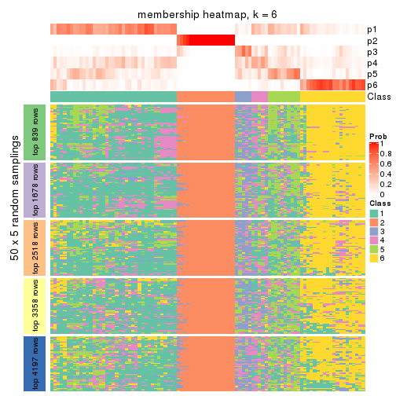</p>

</div>
</div>

As soon as we have had the classes for columns, we can look for signatures
which are significantly different between classes which can be candidate marks
for certain classes. Following are the heatmaps for signatures.


Signature heatmaps where rows are scaled:


<script>
$( function() {
	$( '#tabs-SD-skmeans-get-signatures' ).tabs();
} );
</script>
<div id='tabs-SD-skmeans-get-signatures'>
<ul>
<li><a href='#tab-SD-skmeans-get-signatures-1'>k = 2</a></li>
<li><a href='#tab-SD-skmeans-get-signatures-2'>k = 3</a></li>
<li><a href='#tab-SD-skmeans-get-signatures-3'>k = 4</a></li>
<li><a href='#tab-SD-skmeans-get-signatures-4'>k = 5</a></li>
<li><a href='#tab-SD-skmeans-get-signatures-5'>k = 6</a></li>
</ul>
<div id='tab-SD-skmeans-get-signatures-1'>
<pre><code class="r">get_signatures(res, k = 2)
</code></pre>

<p></p>

</div>
<div id='tab-SD-skmeans-get-signatures-2'>
<pre><code class="r">get_signatures(res, k = 3)
</code></pre>

<p></p>

</div>
<div id='tab-SD-skmeans-get-signatures-3'>
<pre><code class="r">get_signatures(res, k = 4)
</code></pre>

<p></p>

</div>
<div id='tab-SD-skmeans-get-signatures-4'>
<pre><code class="r">get_signatures(res, k = 5)
</code></pre>

<p></p>

</div>
<div id='tab-SD-skmeans-get-signatures-5'>
<pre><code class="r">get_signatures(res, k = 6)
</code></pre>

<p></p>

</div>
</div>


Signature heatmaps where rows are not scaled:


<script>
$( function() {
	$( '#tabs-SD-skmeans-get-signatures-no-scale' ).tabs();
} );
</script>
<div id='tabs-SD-skmeans-get-signatures-no-scale'>
<ul>
<li><a href='#tab-SD-skmeans-get-signatures-no-scale-1'>k = 2</a></li>
<li><a href='#tab-SD-skmeans-get-signatures-no-scale-2'>k = 3</a></li>
<li><a href='#tab-SD-skmeans-get-signatures-no-scale-3'>k = 4</a></li>
<li><a href='#tab-SD-skmeans-get-signatures-no-scale-4'>k = 5</a></li>
<li><a href='#tab-SD-skmeans-get-signatures-no-scale-5'>k = 6</a></li>
</ul>
<div id='tab-SD-skmeans-get-signatures-no-scale-1'>
<pre><code class="r">get_signatures(res, k = 2, scale_rows = FALSE)
</code></pre>

<p></p>

</div>
<div id='tab-SD-skmeans-get-signatures-no-scale-2'>
<pre><code class="r">get_signatures(res, k = 3, scale_rows = FALSE)
</code></pre>

<p></p>

</div>
<div id='tab-SD-skmeans-get-signatures-no-scale-3'>
<pre><code class="r">get_signatures(res, k = 4, scale_rows = FALSE)
</code></pre>

<p></p>

</div>
<div id='tab-SD-skmeans-get-signatures-no-scale-4'>
<pre><code class="r">get_signatures(res, k = 5, scale_rows = FALSE)
</code></pre>

<p></p>

</div>
<div id='tab-SD-skmeans-get-signatures-no-scale-5'>
<pre><code class="r">get_signatures(res, k = 6, scale_rows = FALSE)
</code></pre>

<p></p>

</div>
</div>


Compare the overlap of signatures from different k:

```r
compare_signatures(res)
```


`get_signature()` returns a data frame invisibly. TO get the list of signatures, the function
call should be assigned to a variable explicitly. In following code, if `plot` argument is set
to `FALSE`, no heatmap is plotted while only the differential analysis is performed.

```r
# code only for demonstration
tb = get_signature(res, k = ..., plot = FALSE)
```

An example of the output of `tb` is:

```
#>   which_row         fdr    mean_1    mean_2 scaled_mean_1 scaled_mean_2 km
#> 1        38 0.042760348  8.373488  9.131774    -0.5533452     0.5164555  1
#> 2        40 0.018707592  7.106213  8.469186    -0.6173731     0.5762149  1
#> 3        55 0.019134737 10.221463 11.207825    -0.6159697     0.5749050  1
#> 4        59 0.006059896  5.921854  7.869574    -0.6899429     0.6439467  1
#> 5        60 0.018055526  8.928898 10.211722    -0.6204761     0.5791110  1
#> 6        98 0.009384629 15.714769 14.887706     0.6635654    -0.6193277  2
...
```

The columns in `tb` are:

1. `which_row`: row indices corresponding to the input matrix.
2. `fdr`: FDR for the differential test. 
3. `mean_x`: The mean value in group x.
4. `scaled_mean_x`: The mean value in group x after rows are scaled.
5. `km`: Row groups if k-means clustering is applied to rows.


UMAP plot which shows how samples are separated.


<script>
$( function() {
	$( '#tabs-SD-skmeans-dimension-reduction' ).tabs();
} );
</script>
<div id='tabs-SD-skmeans-dimension-reduction'>
<ul>
<li><a href='#tab-SD-skmeans-dimension-reduction-1'>k = 2</a></li>
<li><a href='#tab-SD-skmeans-dimension-reduction-2'>k = 3</a></li>
<li><a href='#tab-SD-skmeans-dimension-reduction-3'>k = 4</a></li>
<li><a href='#tab-SD-skmeans-dimension-reduction-4'>k = 5</a></li>
<li><a href='#tab-SD-skmeans-dimension-reduction-5'>k = 6</a></li>
</ul>
<div id='tab-SD-skmeans-dimension-reduction-1'>
<pre><code class="r">dimension_reduction(res, k = 2, method = &quot;UMAP&quot;)
</code></pre>

<p></p>

</div>
<div id='tab-SD-skmeans-dimension-reduction-2'>
<pre><code class="r">dimension_reduction(res, k = 3, method = &quot;UMAP&quot;)
</code></pre>

<p></p>

</div>
<div id='tab-SD-skmeans-dimension-reduction-3'>
<pre><code class="r">dimension_reduction(res, k = 4, method = &quot;UMAP&quot;)
</code></pre>

<p></p>

</div>
<div id='tab-SD-skmeans-dimension-reduction-4'>
<pre><code class="r">dimension_reduction(res, k = 5, method = &quot;UMAP&quot;)
</code></pre>

<p></p>

</div>
<div id='tab-SD-skmeans-dimension-reduction-5'>
<pre><code class="r">dimension_reduction(res, k = 6, method = &quot;UMAP&quot;)
</code></pre>

<p></p>

</div>
</div>


Following heatmap shows how subgroups are split when increasing `k`:

```r
collect_classes(res)
```


If matrix rows can be associated to genes, consider to use `GO_Enrichment(res,
...)` to perform function enrichment for the signature genes.


 

---------------------------------------------------


### SD:pam**


The object with results only for a single top-value method and a single partition method 
can be extracted as:

```r
res = res_list["SD", "pam"]
# you can also extract it by
# res = res_list["SD:pam"]
```

A summary of `res` and all the functions that can be applied to it:

```r
res
```

```
#> A 'ConsensusPartition' object with k = 2, 3, 4, 5, 6.
#>   On a matrix with 8394 rows and 194 columns.
#>   Top rows (839, 1678, 2518, 3358, 4197) are extracted by 'SD' method.
#>   Subgroups are detected by 'pam' method.
#>   Performed in total 1250 partitions by row resampling.
#>   Best k for subgroups seems to be 2.
#> 
#> Following methods can be applied to this 'ConsensusPartition' object:
#>  [1] "cola_report"             "collect_classes"         "collect_plots"          
#>  [4] "collect_stats"           "colnames"                "compare_signatures"     
#>  [7] "consensus_heatmap"       "dimension_reduction"     "functional_enrichment"  
#> [10] "get_anno_col"            "get_anno"                "get_classes"            
#> [13] "get_consensus"           "get_matrix"              "get_membership"         
#> [16] "get_param"               "get_signatures"          "get_stats"              
#> [19] "is_best_k"               "is_stable_k"             "membership_heatmap"     
#> [22] "ncol"                    "nrow"                    "plot_ecdf"              
#> [25] "rownames"                "select_partition_number" "show"                   
#> [28] "suggest_best_k"          "test_to_known_factors"
```

`collect_plots()` function collects all the plots made from `res` for all `k` (number of partitions)
into one single page to provide an easy and fast comparison between different `k`.

```r
collect_plots(res)
```


The plots are:

- The first row: a plot of the ECDF (Empirical cumulative distribution
  function) curves of the consensus matrix for each `k` and the heatmap of
  predicted classes for each `k`.
- The second row: heatmaps of the consensus matrix for each `k`.
- The third row: heatmaps of the membership matrix for each `k`.
- The fouth row: heatmaps of the signatures for each `k`.

All the plots in panels can be made by individual functions and they are
plotted later in this section.

`select_partition_number()` produces several plots showing different
statistics for choosing "optimized" `k`. There are following statistics:

- ECDF curves of the consensus matrix for each `k`;
- 1-PAC. [The PAC
  score](https://en.wikipedia.org/wiki/Consensus_clustering#Over-interpretation_potential_of_consensus_clustering)
  measures the proportion of the ambiguous subgrouping.
- Mean silhouette score.
- Concordance. The mean probability of fiting the consensus class ids in all
  partitions.
- Area increased. Denote $A_k$ as the area under the ECDF curve for current
  `k`, the area increased is defined as $A_k - A_{k-1}$.
- Rand index. The percent of pairs of samples that are both in a same cluster
  or both are not in a same cluster in the partition of k and k-1.
- Jaccard index. The ratio of pairs of samples are both in a same cluster in
  the partition of k and k-1 and the pairs of samples are both in a same
  cluster in the partition k or k-1.

The detailed explanations of these statistics can be found in [the cola
vignette](http://bioconductor.org/packages/devel/bioc/vignettes/cola/inst/doc/cola.html#toc_13).

Generally speaking, lower PAC score, higher mean silhouette score or higher
concordance corresponds to better partition. Rand index and Jaccard index
measure how similar the current partition is compared to partition with `k-1`.
If they are too similar, we won't accept `k` is better than `k-1`.

```r
select_partition_number(res)
```


The numeric values for all these statistics can be obtained by `get_stats()`.

```r
get_stats(res)
```

```
#>   k 1-PAC mean_silhouette concordance area_increased  Rand Jaccard
#> 2 2     1           1.000       1.000         0.2187 0.782   0.782
#> 3 3     1           0.993       0.997         0.1065 0.982   0.977
#> 4 4     1           0.998       0.999         0.0579 0.982   0.977
#> 5 5     1           0.998       0.998         0.0686 0.982   0.977
#> 6 6     1           0.988       0.993         0.0908 0.983   0.976
```

`suggest_best_k()` suggests the best $k$ based on these statistics. The rules are as follows:

- All $k$ with Jaccard index larger than 0.95 are removed because the increase of
  the partition number does not provides enough extra information. If all $k$ are removed,
  the best $k$ is assigned by `NA`.
- For $k$ with 1-PAC larger than 0.9, the maximal $k$ is taken as the "best k". Other $k$ is called "optional k".
- If it does not fit the second rule. The $k$ with the highest vote of highest
  1-PAC, mean silhouette and concordance is taken as the "best k".

```r
suggest_best_k(res)
```

```
#> [1] 2
```


Following shows the table of the partitions (You need to click the **show/hide
code output** link to see it). The membership matrix (columns with name `p*`)
is inferred by
[`clue::cl_consensus()`](https://www.rdocumentation.org/link/cl_consensus?package=clue)
function with the `SE` method. Basically the value in the membership matrix
represents the probability to belong to a certain group. The finall class
label for an item is determined with the group with highest probability it
belongs to.

In `get_classes()` function, the entropy is calculated from the membership
matrix and the silhouette score is calculated from the consensus matrix.


<script>
$( function() {
	$( '#tabs-SD-pam-get-classes' ).tabs();
} );
</script>
<div id='tabs-SD-pam-get-classes'>
<ul>
<li><a href='#tab-SD-pam-get-classes-1'>k = 2</a></li>
<li><a href='#tab-SD-pam-get-classes-2'>k = 3</a></li>
<li><a href='#tab-SD-pam-get-classes-3'>k = 4</a></li>
<li><a href='#tab-SD-pam-get-classes-4'>k = 5</a></li>
<li><a href='#tab-SD-pam-get-classes-5'>k = 6</a></li>
</ul>

<div id='tab-SD-pam-get-classes-1'>
<p><a id='tab-SD-pam-get-classes-1-a' style='color:#0366d6' href='#'>show/hide code output</a></p>
<pre><code class="r">cbind(get_classes(res, k = 2), get_membership(res, k = 2))
</code></pre>

<pre><code>#&gt;           class entropy silhouette p1 p2
#&gt; ERR467487     1       0          1  1  0
#&gt; ERR467498     1       0          1  1  0
#&gt; ERR658998     1       0          1  1  0
#&gt; ERR659094     1       0          1  1  0
#&gt; ERR658999     1       0          1  1  0
#&gt; ERR659095     1       0          1  1  0
#&gt; ERR659000     1       0          1  1  0
#&gt; ERR659096     1       0          1  1  0
#&gt; ERR659001     1       0          1  1  0
#&gt; ERR659097     1       0          1  1  0
#&gt; ERR659002     1       0          1  1  0
#&gt; ERR659098     1       0          1  1  0
#&gt; ERR659003     1       0          1  1  0
#&gt; ERR659099     1       0          1  1  0
#&gt; ERR659004     1       0          1  1  0
#&gt; ERR659100     1       0          1  1  0
#&gt; ERR659005     1       0          1  1  0
#&gt; ERR659101     1       0          1  1  0
#&gt; ERR659006     1       0          1  1  0
#&gt; ERR659102     1       0          1  1  0
#&gt; ERR659007     1       0          1  1  0
#&gt; ERR659103     1       0          1  1  0
#&gt; ERR659008     2       0          1  0  1
#&gt; ERR659104     2       0          1  0  1
#&gt; ERR659009     1       0          1  1  0
#&gt; ERR659105     1       0          1  1  0
#&gt; ERR659010     1       0          1  1  0
#&gt; ERR659106     1       0          1  1  0
#&gt; ERR659011     1       0          1  1  0
#&gt; ERR659107     1       0          1  1  0
#&gt; ERR659012     1       0          1  1  0
#&gt; ERR659108     1       0          1  1  0
#&gt; ERR659013     1       0          1  1  0
#&gt; ERR659109     1       0          1  1  0
#&gt; ERR659014     2       0          1  0  1
#&gt; ERR659110     2       0          1  0  1
#&gt; ERR659015     1       0          1  1  0
#&gt; ERR659111     1       0          1  1  0
#&gt; ERR659016     1       0          1  1  0
#&gt; ERR659112     1       0          1  1  0
#&gt; ERR659017     2       0          1  0  1
#&gt; ERR659113     2       0          1  0  1
#&gt; ERR659018     1       0          1  1  0
#&gt; ERR659114     1       0          1  1  0
#&gt; ERR659019     1       0          1  1  0
#&gt; ERR659115     1       0          1  1  0
#&gt; ERR659020     1       0          1  1  0
#&gt; ERR659116     1       0          1  1  0
#&gt; ERR659021     1       0          1  1  0
#&gt; ERR659117     1       0          1  1  0
#&gt; ERR659022     1       0          1  1  0
#&gt; ERR659118     1       0          1  1  0
#&gt; ERR659023     1       0          1  1  0
#&gt; ERR659119     1       0          1  1  0
#&gt; ERR659024     1       0          1  1  0
#&gt; ERR659120     1       0          1  1  0
#&gt; ERR659025     1       0          1  1  0
#&gt; ERR659121     1       0          1  1  0
#&gt; ERR659026     1       0          1  1  0
#&gt; ERR659122     1       0          1  1  0
#&gt; ERR659027     1       0          1  1  0
#&gt; ERR659123     1       0          1  1  0
#&gt; ERR659028     1       0          1  1  0
#&gt; ERR659124     1       0          1  1  0
#&gt; ERR659029     1       0          1  1  0
#&gt; ERR659125     1       0          1  1  0
#&gt; ERR659030     1       0          1  1  0
#&gt; ERR659126     1       0          1  1  0
#&gt; ERR659031     1       0          1  1  0
#&gt; ERR659127     1       0          1  1  0
#&gt; ERR659032     1       0          1  1  0
#&gt; ERR659128     1       0          1  1  0
#&gt; ERR659033     1       0          1  1  0
#&gt; ERR659129     1       0          1  1  0
#&gt; ERR659034     2       0          1  0  1
#&gt; ERR659130     2       0          1  0  1
#&gt; ERR659035     1       0          1  1  0
#&gt; ERR659131     1       0          1  1  0
#&gt; ERR659036     1       0          1  1  0
#&gt; ERR659132     1       0          1  1  0
#&gt; ERR659037     1       0          1  1  0
#&gt; ERR659133     1       0          1  1  0
#&gt; ERR659038     1       0          1  1  0
#&gt; ERR659134     1       0          1  1  0
#&gt; ERR659039     1       0          1  1  0
#&gt; ERR659135     1       0          1  1  0
#&gt; ERR659040     1       0          1  1  0
#&gt; ERR659136     1       0          1  1  0
#&gt; ERR659041     1       0          1  1  0
#&gt; ERR659137     1       0          1  1  0
#&gt; ERR659042     1       0          1  1  0
#&gt; ERR659138     1       0          1  1  0
#&gt; ERR659043     1       0          1  1  0
#&gt; ERR659139     1       0          1  1  0
#&gt; ERR659044     2       0          1  0  1
#&gt; ERR659140     2       0          1  0  1
#&gt; ERR659045     1       0          1  1  0
#&gt; ERR659141     1       0          1  1  0
#&gt; ERR659046     1       0          1  1  0
#&gt; ERR659142     1       0          1  1  0
#&gt; ERR659047     1       0          1  1  0
#&gt; ERR659143     1       0          1  1  0
#&gt; ERR659048     1       0          1  1  0
#&gt; ERR659144     1       0          1  1  0
#&gt; ERR659049     1       0          1  1  0
#&gt; ERR659145     1       0          1  1  0
#&gt; ERR659050     1       0          1  1  0
#&gt; ERR659146     1       0          1  1  0
#&gt; ERR659051     1       0          1  1  0
#&gt; ERR659147     1       0          1  1  0
#&gt; ERR659052     1       0          1  1  0
#&gt; ERR659148     1       0          1  1  0
#&gt; ERR659053     1       0          1  1  0
#&gt; ERR659149     1       0          1  1  0
#&gt; ERR659054     2       0          1  0  1
#&gt; ERR659150     2       0          1  0  1
#&gt; ERR659055     1       0          1  1  0
#&gt; ERR659151     1       0          1  1  0
#&gt; ERR659056     1       0          1  1  0
#&gt; ERR659152     1       0          1  1  0
#&gt; ERR659057     1       0          1  1  0
#&gt; ERR659153     1       0          1  1  0
#&gt; ERR659058     1       0          1  1  0
#&gt; ERR659154     1       0          1  1  0
#&gt; ERR659059     1       0          1  1  0
#&gt; ERR659155     1       0          1  1  0
#&gt; ERR659060     1       0          1  1  0
#&gt; ERR659156     1       0          1  1  0
#&gt; ERR659061     1       0          1  1  0
#&gt; ERR659157     1       0          1  1  0
#&gt; ERR659062     1       0          1  1  0
#&gt; ERR659158     1       0          1  1  0
#&gt; ERR659063     1       0          1  1  0
#&gt; ERR659159     1       0          1  1  0
#&gt; ERR659064     1       0          1  1  0
#&gt; ERR659160     1       0          1  1  0
#&gt; ERR659065     2       0          1  0  1
#&gt; ERR659161     2       0          1  0  1
#&gt; ERR659066     1       0          1  1  0
#&gt; ERR659162     1       0          1  1  0
#&gt; ERR659067     1       0          1  1  0
#&gt; ERR659163     1       0          1  1  0
#&gt; ERR659068     2       0          1  0  1
#&gt; ERR659164     2       0          1  0  1
#&gt; ERR659069     1       0          1  1  0
#&gt; ERR659165     1       0          1  1  0
#&gt; ERR659070     1       0          1  1  0
#&gt; ERR659166     1       0          1  1  0
#&gt; ERR659071     1       0          1  1  0
#&gt; ERR659167     1       0          1  1  0
#&gt; ERR659072     1       0          1  1  0
#&gt; ERR659168     1       0          1  1  0
#&gt; ERR659073     1       0          1  1  0
#&gt; ERR659169     1       0          1  1  0
#&gt; ERR659074     2       0          1  0  1
#&gt; ERR659170     2       0          1  0  1
#&gt; ERR659075     1       0          1  1  0
#&gt; ERR659171     1       0          1  1  0
#&gt; ERR659076     2       0          1  0  1
#&gt; ERR659172     2       0          1  0  1
#&gt; ERR659077     1       0          1  1  0
#&gt; ERR659173     1       0          1  1  0
#&gt; ERR659078     1       0          1  1  0
#&gt; ERR659174     1       0          1  1  0
#&gt; ERR659079     1       0          1  1  0
#&gt; ERR659175     1       0          1  1  0
#&gt; ERR659080     1       0          1  1  0
#&gt; ERR659176     1       0          1  1  0
#&gt; ERR659081     1       0          1  1  0
#&gt; ERR659177     1       0          1  1  0
#&gt; ERR659082     1       0          1  1  0
#&gt; ERR659178     1       0          1  1  0
#&gt; ERR659083     2       0          1  0  1
#&gt; ERR659179     2       0          1  0  1
#&gt; ERR659084     2       0          1  0  1
#&gt; ERR659180     2       0          1  0  1
#&gt; ERR659085     1       0          1  1  0
#&gt; ERR659181     1       0          1  1  0
#&gt; ERR659086     1       0          1  1  0
#&gt; ERR659182     1       0          1  1  0
#&gt; ERR659087     1       0          1  1  0
#&gt; ERR659183     1       0          1  1  0
#&gt; ERR659088     1       0          1  1  0
#&gt; ERR659184     1       0          1  1  0
#&gt; ERR659089     1       0          1  1  0
#&gt; ERR659185     1       0          1  1  0
#&gt; ERR659090     1       0          1  1  0
#&gt; ERR659186     1       0          1  1  0
#&gt; ERR659091     1       0          1  1  0
#&gt; ERR659187     1       0          1  1  0
#&gt; ERR659092     1       0          1  1  0
#&gt; ERR659188     1       0          1  1  0
#&gt; ERR659093     1       0          1  1  0
#&gt; ERR659189     1       0          1  1  0
</code></pre>

<script>
$('#tab-SD-pam-get-classes-1-a').parent().next().next().hide();
$('#tab-SD-pam-get-classes-1-a').click(function(){
  $('#tab-SD-pam-get-classes-1-a').parent().next().next().toggle();
  return(false);
});
</script>
</div>

<div id='tab-SD-pam-get-classes-2'>
<p><a id='tab-SD-pam-get-classes-2-a' style='color:#0366d6' href='#'>show/hide code output</a></p>
<pre><code class="r">cbind(get_classes(res, k = 3), get_membership(res, k = 3))
</code></pre>

<pre><code>#&gt;           class entropy silhouette    p1 p2    p3
#&gt; ERR467487     1  0.3551      0.853 0.868  0 0.132
#&gt; ERR467498     1  0.3551      0.853 0.868  0 0.132
#&gt; ERR658998     1  0.0000      0.996 1.000  0 0.000
#&gt; ERR659094     1  0.0000      0.996 1.000  0 0.000
#&gt; ERR658999     1  0.0000      0.996 1.000  0 0.000
#&gt; ERR659095     1  0.0000      0.996 1.000  0 0.000
#&gt; ERR659000     1  0.0000      0.996 1.000  0 0.000
#&gt; ERR659096     1  0.0000      0.996 1.000  0 0.000
#&gt; ERR659001     1  0.0000      0.996 1.000  0 0.000
#&gt; ERR659097     1  0.0000      0.996 1.000  0 0.000
#&gt; ERR659002     1  0.0000      0.996 1.000  0 0.000
#&gt; ERR659098     1  0.0000      0.996 1.000  0 0.000
#&gt; ERR659003     1  0.0000      0.996 1.000  0 0.000
#&gt; ERR659099     1  0.0000      0.996 1.000  0 0.000
#&gt; ERR659004     1  0.0000      0.996 1.000  0 0.000
#&gt; ERR659100     1  0.0000      0.996 1.000  0 0.000
#&gt; ERR659005     1  0.0000      0.996 1.000  0 0.000
#&gt; ERR659101     1  0.0000      0.996 1.000  0 0.000
#&gt; ERR659006     1  0.0000      0.996 1.000  0 0.000
#&gt; ERR659102     1  0.0000      0.996 1.000  0 0.000
#&gt; ERR659007     1  0.0000      0.996 1.000  0 0.000
#&gt; ERR659103     1  0.0000      0.996 1.000  0 0.000
#&gt; ERR659008     2  0.0000      1.000 0.000  1 0.000
#&gt; ERR659104     2  0.0000      1.000 0.000  1 0.000
#&gt; ERR659009     1  0.0000      0.996 1.000  0 0.000
#&gt; ERR659105     1  0.0000      0.996 1.000  0 0.000
#&gt; ERR659010     1  0.0000      0.996 1.000  0 0.000
#&gt; ERR659106     1  0.0000      0.996 1.000  0 0.000
#&gt; ERR659011     1  0.0000      0.996 1.000  0 0.000
#&gt; ERR659107     1  0.0000      0.996 1.000  0 0.000
#&gt; ERR659012     1  0.0000      0.996 1.000  0 0.000
#&gt; ERR659108     1  0.0000      0.996 1.000  0 0.000
#&gt; ERR659013     1  0.0000      0.996 1.000  0 0.000
#&gt; ERR659109     1  0.0000      0.996 1.000  0 0.000
#&gt; ERR659014     2  0.0000      1.000 0.000  1 0.000
#&gt; ERR659110     2  0.0000      1.000 0.000  1 0.000
#&gt; ERR659015     1  0.0000      0.996 1.000  0 0.000
#&gt; ERR659111     1  0.0000      0.996 1.000  0 0.000
#&gt; ERR659016     1  0.0000      0.996 1.000  0 0.000
#&gt; ERR659112     1  0.0000      0.996 1.000  0 0.000
#&gt; ERR659017     2  0.0000      1.000 0.000  1 0.000
#&gt; ERR659113     2  0.0000      1.000 0.000  1 0.000
#&gt; ERR659018     1  0.0000      0.996 1.000  0 0.000
#&gt; ERR659114     1  0.0000      0.996 1.000  0 0.000
#&gt; ERR659019     1  0.0000      0.996 1.000  0 0.000
#&gt; ERR659115     1  0.0000      0.996 1.000  0 0.000
#&gt; ERR659020     1  0.0000      0.996 1.000  0 0.000
#&gt; ERR659116     1  0.0000      0.996 1.000  0 0.000
#&gt; ERR659021     1  0.0000      0.996 1.000  0 0.000
#&gt; ERR659117     1  0.0000      0.996 1.000  0 0.000
#&gt; ERR659022     1  0.0000      0.996 1.000  0 0.000
#&gt; ERR659118     1  0.0000      0.996 1.000  0 0.000
#&gt; ERR659023     1  0.0000      0.996 1.000  0 0.000
#&gt; ERR659119     1  0.0000      0.996 1.000  0 0.000
#&gt; ERR659024     1  0.0000      0.996 1.000  0 0.000
#&gt; ERR659120     1  0.0000      0.996 1.000  0 0.000
#&gt; ERR659025     1  0.0000      0.996 1.000  0 0.000
#&gt; ERR659121     1  0.0000      0.996 1.000  0 0.000
#&gt; ERR659026     1  0.0000      0.996 1.000  0 0.000
#&gt; ERR659122     1  0.0000      0.996 1.000  0 0.000
#&gt; ERR659027     1  0.0000      0.996 1.000  0 0.000
#&gt; ERR659123     1  0.0000      0.996 1.000  0 0.000
#&gt; ERR659028     1  0.0000      0.996 1.000  0 0.000
#&gt; ERR659124     1  0.0000      0.996 1.000  0 0.000
#&gt; ERR659029     1  0.0000      0.996 1.000  0 0.000
#&gt; ERR659125     1  0.0000      0.996 1.000  0 0.000
#&gt; ERR659030     1  0.0000      0.996 1.000  0 0.000
#&gt; ERR659126     1  0.0000      0.996 1.000  0 0.000
#&gt; ERR659031     1  0.0000      0.996 1.000  0 0.000
#&gt; ERR659127     1  0.0000      0.996 1.000  0 0.000
#&gt; ERR659032     1  0.0000      0.996 1.000  0 0.000
#&gt; ERR659128     1  0.0000      0.996 1.000  0 0.000
#&gt; ERR659033     1  0.0000      0.996 1.000  0 0.000
#&gt; ERR659129     1  0.0000      0.996 1.000  0 0.000
#&gt; ERR659034     2  0.0000      1.000 0.000  1 0.000
#&gt; ERR659130     2  0.0000      1.000 0.000  1 0.000
#&gt; ERR659035     1  0.0000      0.996 1.000  0 0.000
#&gt; ERR659131     1  0.0000      0.996 1.000  0 0.000
#&gt; ERR659036     1  0.0000      0.996 1.000  0 0.000
#&gt; ERR659132     1  0.0000      0.996 1.000  0 0.000
#&gt; ERR659037     1  0.0000      0.996 1.000  0 0.000
#&gt; ERR659133     1  0.0000      0.996 1.000  0 0.000
#&gt; ERR659038     1  0.0000      0.996 1.000  0 0.000
#&gt; ERR659134     1  0.0000      0.996 1.000  0 0.000
#&gt; ERR659039     1  0.0000      0.996 1.000  0 0.000
#&gt; ERR659135     1  0.0000      0.996 1.000  0 0.000
#&gt; ERR659040     1  0.0000      0.996 1.000  0 0.000
#&gt; ERR659136     1  0.0000      0.996 1.000  0 0.000
#&gt; ERR659041     1  0.0000      0.996 1.000  0 0.000
#&gt; ERR659137     1  0.0000      0.996 1.000  0 0.000
#&gt; ERR659042     1  0.0000      0.996 1.000  0 0.000
#&gt; ERR659138     1  0.0000      0.996 1.000  0 0.000
#&gt; ERR659043     1  0.0000      0.996 1.000  0 0.000
#&gt; ERR659139     1  0.0000      0.996 1.000  0 0.000
#&gt; ERR659044     2  0.0000      1.000 0.000  1 0.000
#&gt; ERR659140     2  0.0000      1.000 0.000  1 0.000
#&gt; ERR659045     1  0.0000      0.996 1.000  0 0.000
#&gt; ERR659141     1  0.0000      0.996 1.000  0 0.000
#&gt; ERR659046     1  0.0000      0.996 1.000  0 0.000
#&gt; ERR659142     1  0.0000      0.996 1.000  0 0.000
#&gt; ERR659047     1  0.0000      0.996 1.000  0 0.000
#&gt; ERR659143     1  0.0000      0.996 1.000  0 0.000
#&gt; ERR659048     1  0.0000      0.996 1.000  0 0.000
#&gt; ERR659144     1  0.0000      0.996 1.000  0 0.000
#&gt; ERR659049     1  0.0000      0.996 1.000  0 0.000
#&gt; ERR659145     1  0.0000      0.996 1.000  0 0.000
#&gt; ERR659050     1  0.0000      0.996 1.000  0 0.000
#&gt; ERR659146     1  0.0000      0.996 1.000  0 0.000
#&gt; ERR659051     1  0.0237      0.993 0.996  0 0.004
#&gt; ERR659147     1  0.0237      0.993 0.996  0 0.004
#&gt; ERR659052     1  0.0000      0.996 1.000  0 0.000
#&gt; ERR659148     1  0.0000      0.996 1.000  0 0.000
#&gt; ERR659053     1  0.0000      0.996 1.000  0 0.000
#&gt; ERR659149     1  0.0000      0.996 1.000  0 0.000
#&gt; ERR659054     2  0.0000      1.000 0.000  1 0.000
#&gt; ERR659150     2  0.0000      1.000 0.000  1 0.000
#&gt; ERR659055     1  0.0000      0.996 1.000  0 0.000
#&gt; ERR659151     1  0.0000      0.996 1.000  0 0.000
#&gt; ERR659056     1  0.3340      0.868 0.880  0 0.120
#&gt; ERR659152     1  0.3340      0.868 0.880  0 0.120
#&gt; ERR659057     1  0.0000      0.996 1.000  0 0.000
#&gt; ERR659153     1  0.0000      0.996 1.000  0 0.000
#&gt; ERR659058     1  0.0000      0.996 1.000  0 0.000
#&gt; ERR659154     1  0.0000      0.996 1.000  0 0.000
#&gt; ERR659059     1  0.0000      0.996 1.000  0 0.000
#&gt; ERR659155     1  0.0000      0.996 1.000  0 0.000
#&gt; ERR659060     1  0.0000      0.996 1.000  0 0.000
#&gt; ERR659156     1  0.0000      0.996 1.000  0 0.000
#&gt; ERR659061     1  0.0000      0.996 1.000  0 0.000
#&gt; ERR659157     1  0.0000      0.996 1.000  0 0.000
#&gt; ERR659062     1  0.0000      0.996 1.000  0 0.000
#&gt; ERR659158     1  0.0000      0.996 1.000  0 0.000
#&gt; ERR659063     1  0.0000      0.996 1.000  0 0.000
#&gt; ERR659159     1  0.0000      0.996 1.000  0 0.000
#&gt; ERR659064     1  0.0000      0.996 1.000  0 0.000
#&gt; ERR659160     1  0.0000      0.996 1.000  0 0.000
#&gt; ERR659065     2  0.0000      1.000 0.000  1 0.000
#&gt; ERR659161     2  0.0000      1.000 0.000  1 0.000
#&gt; ERR659066     1  0.0000      0.996 1.000  0 0.000
#&gt; ERR659162     1  0.0000      0.996 1.000  0 0.000
#&gt; ERR659067     1  0.0000      0.996 1.000  0 0.000
#&gt; ERR659163     1  0.0000      0.996 1.000  0 0.000
#&gt; ERR659068     2  0.0000      1.000 0.000  1 0.000
#&gt; ERR659164     2  0.0000      1.000 0.000  1 0.000
#&gt; ERR659069     1  0.0000      0.996 1.000  0 0.000
#&gt; ERR659165     1  0.0000      0.996 1.000  0 0.000
#&gt; ERR659070     1  0.0000      0.996 1.000  0 0.000
#&gt; ERR659166     1  0.0000      0.996 1.000  0 0.000
#&gt; ERR659071     1  0.0000      0.996 1.000  0 0.000
#&gt; ERR659167     1  0.0000      0.996 1.000  0 0.000
#&gt; ERR659072     1  0.0000      0.996 1.000  0 0.000
#&gt; ERR659168     1  0.0000      0.996 1.000  0 0.000
#&gt; ERR659073     1  0.0000      0.996 1.000  0 0.000
#&gt; ERR659169     1  0.0000      0.996 1.000  0 0.000
#&gt; ERR659074     2  0.0000      1.000 0.000  1 0.000
#&gt; ERR659170     2  0.0000      1.000 0.000  1 0.000
#&gt; ERR659075     3  0.0000      1.000 0.000  0 1.000
#&gt; ERR659171     3  0.0000      1.000 0.000  0 1.000
#&gt; ERR659076     2  0.0000      1.000 0.000  1 0.000
#&gt; ERR659172     2  0.0000      1.000 0.000  1 0.000
#&gt; ERR659077     1  0.0000      0.996 1.000  0 0.000
#&gt; ERR659173     1  0.0000      0.996 1.000  0 0.000
#&gt; ERR659078     1  0.0000      0.996 1.000  0 0.000
#&gt; ERR659174     1  0.0000      0.996 1.000  0 0.000
#&gt; ERR659079     1  0.0000      0.996 1.000  0 0.000
#&gt; ERR659175     1  0.0000      0.996 1.000  0 0.000
#&gt; ERR659080     1  0.1643      0.953 0.956  0 0.044
#&gt; ERR659176     1  0.2356      0.923 0.928  0 0.072
#&gt; ERR659081     1  0.0000      0.996 1.000  0 0.000
#&gt; ERR659177     1  0.0000      0.996 1.000  0 0.000
#&gt; ERR659082     1  0.0000      0.996 1.000  0 0.000
#&gt; ERR659178     1  0.0000      0.996 1.000  0 0.000
#&gt; ERR659083     2  0.0000      1.000 0.000  1 0.000
#&gt; ERR659179     2  0.0000      1.000 0.000  1 0.000
#&gt; ERR659084     2  0.0000      1.000 0.000  1 0.000
#&gt; ERR659180     2  0.0000      1.000 0.000  1 0.000
#&gt; ERR659085     1  0.0000      0.996 1.000  0 0.000
#&gt; ERR659181     1  0.0000      0.996 1.000  0 0.000
#&gt; ERR659086     1  0.0000      0.996 1.000  0 0.000
#&gt; ERR659182     1  0.0000      0.996 1.000  0 0.000
#&gt; ERR659087     1  0.0000      0.996 1.000  0 0.000
#&gt; ERR659183     1  0.0000      0.996 1.000  0 0.000
#&gt; ERR659088     1  0.0237      0.993 0.996  0 0.004
#&gt; ERR659184     1  0.0000      0.996 1.000  0 0.000
#&gt; ERR659089     1  0.0000      0.996 1.000  0 0.000
#&gt; ERR659185     1  0.0000      0.996 1.000  0 0.000
#&gt; ERR659090     1  0.0000      0.996 1.000  0 0.000
#&gt; ERR659186     1  0.0000      0.996 1.000  0 0.000
#&gt; ERR659091     1  0.0000      0.996 1.000  0 0.000
#&gt; ERR659187     1  0.0000      0.996 1.000  0 0.000
#&gt; ERR659092     1  0.0000      0.996 1.000  0 0.000
#&gt; ERR659188     1  0.0000      0.996 1.000  0 0.000
#&gt; ERR659093     1  0.0000      0.996 1.000  0 0.000
#&gt; ERR659189     1  0.0000      0.996 1.000  0 0.000
</code></pre>

<script>
$('#tab-SD-pam-get-classes-2-a').parent().next().next().hide();
$('#tab-SD-pam-get-classes-2-a').click(function(){
  $('#tab-SD-pam-get-classes-2-a').parent().next().next().toggle();
  return(false);
});
</script>
</div>

<div id='tab-SD-pam-get-classes-3'>
<p><a id='tab-SD-pam-get-classes-3-a' style='color:#0366d6' href='#'>show/hide code output</a></p>
<pre><code class="r">cbind(get_classes(res, k = 4), get_membership(res, k = 4))
</code></pre>

<pre><code>#&gt;           class entropy silhouette    p1 p2    p3    p4
#&gt; ERR467487     4  0.0188      1.000 0.000  0 0.004 0.996
#&gt; ERR467498     4  0.0188      1.000 0.000  0 0.004 0.996
#&gt; ERR658998     1  0.0000      0.999 1.000  0 0.000 0.000
#&gt; ERR659094     1  0.0000      0.999 1.000  0 0.000 0.000
#&gt; ERR658999     1  0.0188      0.996 0.996  0 0.004 0.000
#&gt; ERR659095     1  0.0188      0.996 0.996  0 0.004 0.000
#&gt; ERR659000     1  0.0000      0.999 1.000  0 0.000 0.000
#&gt; ERR659096     1  0.0000      0.999 1.000  0 0.000 0.000
#&gt; ERR659001     1  0.0000      0.999 1.000  0 0.000 0.000
#&gt; ERR659097     1  0.0000      0.999 1.000  0 0.000 0.000
#&gt; ERR659002     1  0.0000      0.999 1.000  0 0.000 0.000
#&gt; ERR659098     1  0.0000      0.999 1.000  0 0.000 0.000
#&gt; ERR659003     1  0.0000      0.999 1.000  0 0.000 0.000
#&gt; ERR659099     1  0.0000      0.999 1.000  0 0.000 0.000
#&gt; ERR659004     1  0.0188      0.996 0.996  0 0.004 0.000
#&gt; ERR659100     1  0.0188      0.996 0.996  0 0.004 0.000
#&gt; ERR659005     1  0.0000      0.999 1.000  0 0.000 0.000
#&gt; ERR659101     1  0.0000      0.999 1.000  0 0.000 0.000
#&gt; ERR659006     1  0.0188      0.996 0.996  0 0.004 0.000
#&gt; ERR659102     1  0.0188      0.996 0.996  0 0.004 0.000
#&gt; ERR659007     1  0.0000      0.999 1.000  0 0.000 0.000
#&gt; ERR659103     1  0.0000      0.999 1.000  0 0.000 0.000
#&gt; ERR659008     2  0.0000      1.000 0.000  1 0.000 0.000
#&gt; ERR659104     2  0.0000      1.000 0.000  1 0.000 0.000
#&gt; ERR659009     1  0.0188      0.996 0.996  0 0.004 0.000
#&gt; ERR659105     1  0.0188      0.996 0.996  0 0.004 0.000
#&gt; ERR659010     1  0.0188      0.996 0.996  0 0.004 0.000
#&gt; ERR659106     1  0.0188      0.996 0.996  0 0.004 0.000
#&gt; ERR659011     1  0.0188      0.996 0.996  0 0.004 0.000
#&gt; ERR659107     1  0.0188      0.996 0.996  0 0.004 0.000
#&gt; ERR659012     1  0.0188      0.996 0.996  0 0.004 0.000
#&gt; ERR659108     1  0.0188      0.996 0.996  0 0.004 0.000
#&gt; ERR659013     1  0.0000      0.999 1.000  0 0.000 0.000
#&gt; ERR659109     1  0.0000      0.999 1.000  0 0.000 0.000
#&gt; ERR659014     2  0.0000      1.000 0.000  1 0.000 0.000
#&gt; ERR659110     2  0.0000      1.000 0.000  1 0.000 0.000
#&gt; ERR659015     1  0.0000      0.999 1.000  0 0.000 0.000
#&gt; ERR659111     1  0.0000      0.999 1.000  0 0.000 0.000
#&gt; ERR659016     1  0.0000      0.999 1.000  0 0.000 0.000
#&gt; ERR659112     1  0.0000      0.999 1.000  0 0.000 0.000
#&gt; ERR659017     2  0.0000      1.000 0.000  1 0.000 0.000
#&gt; ERR659113     2  0.0000      1.000 0.000  1 0.000 0.000
#&gt; ERR659018     1  0.0000      0.999 1.000  0 0.000 0.000
#&gt; ERR659114     1  0.0000      0.999 1.000  0 0.000 0.000
#&gt; ERR659019     1  0.0188      0.996 0.996  0 0.004 0.000
#&gt; ERR659115     1  0.0188      0.996 0.996  0 0.004 0.000
#&gt; ERR659020     1  0.0000      0.999 1.000  0 0.000 0.000
#&gt; ERR659116     1  0.0000      0.999 1.000  0 0.000 0.000
#&gt; ERR659021     1  0.0000      0.999 1.000  0 0.000 0.000
#&gt; ERR659117     1  0.0000      0.999 1.000  0 0.000 0.000
#&gt; ERR659022     1  0.0000      0.999 1.000  0 0.000 0.000
#&gt; ERR659118     1  0.0000      0.999 1.000  0 0.000 0.000
#&gt; ERR659023     1  0.0000      0.999 1.000  0 0.000 0.000
#&gt; ERR659119     1  0.0000      0.999 1.000  0 0.000 0.000
#&gt; ERR659024     1  0.0000      0.999 1.000  0 0.000 0.000
#&gt; ERR659120     1  0.0000      0.999 1.000  0 0.000 0.000
#&gt; ERR659025     1  0.0000      0.999 1.000  0 0.000 0.000
#&gt; ERR659121     1  0.0000      0.999 1.000  0 0.000 0.000
#&gt; ERR659026     1  0.0000      0.999 1.000  0 0.000 0.000
#&gt; ERR659122     1  0.0000      0.999 1.000  0 0.000 0.000
#&gt; ERR659027     1  0.0000      0.999 1.000  0 0.000 0.000
#&gt; ERR659123     1  0.0000      0.999 1.000  0 0.000 0.000
#&gt; ERR659028     1  0.0000      0.999 1.000  0 0.000 0.000
#&gt; ERR659124     1  0.0000      0.999 1.000  0 0.000 0.000
#&gt; ERR659029     1  0.0000      0.999 1.000  0 0.000 0.000
#&gt; ERR659125     1  0.0000      0.999 1.000  0 0.000 0.000
#&gt; ERR659030     1  0.0000      0.999 1.000  0 0.000 0.000
#&gt; ERR659126     1  0.0000      0.999 1.000  0 0.000 0.000
#&gt; ERR659031     1  0.0000      0.999 1.000  0 0.000 0.000
#&gt; ERR659127     1  0.0000      0.999 1.000  0 0.000 0.000
#&gt; ERR659032     1  0.0000      0.999 1.000  0 0.000 0.000
#&gt; ERR659128     1  0.0000      0.999 1.000  0 0.000 0.000
#&gt; ERR659033     1  0.0000      0.999 1.000  0 0.000 0.000
#&gt; ERR659129     1  0.0000      0.999 1.000  0 0.000 0.000
#&gt; ERR659034     2  0.0000      1.000 0.000  1 0.000 0.000
#&gt; ERR659130     2  0.0000      1.000 0.000  1 0.000 0.000
#&gt; ERR659035     1  0.0000      0.999 1.000  0 0.000 0.000
#&gt; ERR659131     1  0.0000      0.999 1.000  0 0.000 0.000
#&gt; ERR659036     1  0.0000      0.999 1.000  0 0.000 0.000
#&gt; ERR659132     1  0.0000      0.999 1.000  0 0.000 0.000
#&gt; ERR659037     1  0.0000      0.999 1.000  0 0.000 0.000
#&gt; ERR659133     1  0.0000      0.999 1.000  0 0.000 0.000
#&gt; ERR659038     1  0.0188      0.996 0.996  0 0.004 0.000
#&gt; ERR659134     1  0.0188      0.996 0.996  0 0.004 0.000
#&gt; ERR659039     1  0.0000      0.999 1.000  0 0.000 0.000
#&gt; ERR659135     1  0.0000      0.999 1.000  0 0.000 0.000
#&gt; ERR659040     1  0.0000      0.999 1.000  0 0.000 0.000
#&gt; ERR659136     1  0.0000      0.999 1.000  0 0.000 0.000
#&gt; ERR659041     1  0.0000      0.999 1.000  0 0.000 0.000
#&gt; ERR659137     1  0.0000      0.999 1.000  0 0.000 0.000
#&gt; ERR659042     1  0.0000      0.999 1.000  0 0.000 0.000
#&gt; ERR659138     1  0.0000      0.999 1.000  0 0.000 0.000
#&gt; ERR659043     1  0.0000      0.999 1.000  0 0.000 0.000
#&gt; ERR659139     1  0.0000      0.999 1.000  0 0.000 0.000
#&gt; ERR659044     2  0.0000      1.000 0.000  1 0.000 0.000
#&gt; ERR659140     2  0.0000      1.000 0.000  1 0.000 0.000
#&gt; ERR659045     1  0.0000      0.999 1.000  0 0.000 0.000
#&gt; ERR659141     1  0.0000      0.999 1.000  0 0.000 0.000
#&gt; ERR659046     1  0.0000      0.999 1.000  0 0.000 0.000
#&gt; ERR659142     1  0.0000      0.999 1.000  0 0.000 0.000
#&gt; ERR659047     1  0.0000      0.999 1.000  0 0.000 0.000
#&gt; ERR659143     1  0.0000      0.999 1.000  0 0.000 0.000
#&gt; ERR659048     1  0.0000      0.999 1.000  0 0.000 0.000
#&gt; ERR659144     1  0.0000      0.999 1.000  0 0.000 0.000
#&gt; ERR659049     1  0.0188      0.996 0.996  0 0.004 0.000
#&gt; ERR659145     1  0.0188      0.996 0.996  0 0.004 0.000
#&gt; ERR659050     1  0.0000      0.999 1.000  0 0.000 0.000
#&gt; ERR659146     1  0.0000      0.999 1.000  0 0.000 0.000
#&gt; ERR659051     1  0.1389      0.951 0.952  0 0.000 0.048
#&gt; ERR659147     1  0.1302      0.955 0.956  0 0.000 0.044
#&gt; ERR659052     1  0.0188      0.996 0.996  0 0.004 0.000
#&gt; ERR659148     1  0.0188      0.996 0.996  0 0.004 0.000
#&gt; ERR659053     1  0.0000      0.999 1.000  0 0.000 0.000
#&gt; ERR659149     1  0.0000      0.999 1.000  0 0.000 0.000
#&gt; ERR659054     2  0.0000      1.000 0.000  1 0.000 0.000
#&gt; ERR659150     2  0.0000      1.000 0.000  1 0.000 0.000
#&gt; ERR659055     1  0.0000      0.999 1.000  0 0.000 0.000
#&gt; ERR659151     1  0.0000      0.999 1.000  0 0.000 0.000
#&gt; ERR659056     1  0.0376      0.993 0.992  0 0.004 0.004
#&gt; ERR659152     1  0.0779      0.981 0.980  0 0.004 0.016
#&gt; ERR659057     1  0.0000      0.999 1.000  0 0.000 0.000
#&gt; ERR659153     1  0.0000      0.999 1.000  0 0.000 0.000
#&gt; ERR659058     1  0.0188      0.996 0.996  0 0.004 0.000
#&gt; ERR659154     1  0.0188      0.996 0.996  0 0.004 0.000
#&gt; ERR659059     1  0.0000      0.999 1.000  0 0.000 0.000
#&gt; ERR659155     1  0.0000      0.999 1.000  0 0.000 0.000
#&gt; ERR659060     1  0.0000      0.999 1.000  0 0.000 0.000
#&gt; ERR659156     1  0.0000      0.999 1.000  0 0.000 0.000
#&gt; ERR659061     1  0.0000      0.999 1.000  0 0.000 0.000
#&gt; ERR659157     1  0.0000      0.999 1.000  0 0.000 0.000
#&gt; ERR659062     1  0.0000      0.999 1.000  0 0.000 0.000
#&gt; ERR659158     1  0.0000      0.999 1.000  0 0.000 0.000
#&gt; ERR659063     1  0.0000      0.999 1.000  0 0.000 0.000
#&gt; ERR659159     1  0.0000      0.999 1.000  0 0.000 0.000
#&gt; ERR659064     1  0.0000      0.999 1.000  0 0.000 0.000
#&gt; ERR659160     1  0.0000      0.999 1.000  0 0.000 0.000
#&gt; ERR659065     2  0.0000      1.000 0.000  1 0.000 0.000
#&gt; ERR659161     2  0.0000      1.000 0.000  1 0.000 0.000
#&gt; ERR659066     1  0.0000      0.999 1.000  0 0.000 0.000
#&gt; ERR659162     1  0.0000      0.999 1.000  0 0.000 0.000
#&gt; ERR659067     1  0.0188      0.996 0.996  0 0.004 0.000
#&gt; ERR659163     1  0.0188      0.996 0.996  0 0.004 0.000
#&gt; ERR659068     2  0.0000      1.000 0.000  1 0.000 0.000
#&gt; ERR659164     2  0.0000      1.000 0.000  1 0.000 0.000
#&gt; ERR659069     1  0.0188      0.996 0.996  0 0.004 0.000
#&gt; ERR659165     1  0.0188      0.996 0.996  0 0.004 0.000
#&gt; ERR659070     1  0.0000      0.999 1.000  0 0.000 0.000
#&gt; ERR659166     1  0.0000      0.999 1.000  0 0.000 0.000
#&gt; ERR659071     1  0.0000      0.999 1.000  0 0.000 0.000
#&gt; ERR659167     1  0.0000      0.999 1.000  0 0.000 0.000
#&gt; ERR659072     1  0.0000      0.999 1.000  0 0.000 0.000
#&gt; ERR659168     1  0.0000      0.999 1.000  0 0.000 0.000
#&gt; ERR659073     1  0.0000      0.999 1.000  0 0.000 0.000
#&gt; ERR659169     1  0.0000      0.999 1.000  0 0.000 0.000
#&gt; ERR659074     2  0.0000      1.000 0.000  1 0.000 0.000
#&gt; ERR659170     2  0.0000      1.000 0.000  1 0.000 0.000
#&gt; ERR659075     3  0.0188      1.000 0.000  0 0.996 0.004
#&gt; ERR659171     3  0.0188      1.000 0.000  0 0.996 0.004
#&gt; ERR659076     2  0.0000      1.000 0.000  1 0.000 0.000
#&gt; ERR659172     2  0.0000      1.000 0.000  1 0.000 0.000
#&gt; ERR659077     1  0.0000      0.999 1.000  0 0.000 0.000
#&gt; ERR659173     1  0.0000      0.999 1.000  0 0.000 0.000
#&gt; ERR659078     1  0.0000      0.999 1.000  0 0.000 0.000
#&gt; ERR659174     1  0.0000      0.999 1.000  0 0.000 0.000
#&gt; ERR659079     1  0.0000      0.999 1.000  0 0.000 0.000
#&gt; ERR659175     1  0.0000      0.999 1.000  0 0.000 0.000
#&gt; ERR659080     1  0.0188      0.996 0.996  0 0.004 0.000
#&gt; ERR659176     1  0.0188      0.996 0.996  0 0.004 0.000
#&gt; ERR659081     1  0.0000      0.999 1.000  0 0.000 0.000
#&gt; ERR659177     1  0.0000      0.999 1.000  0 0.000 0.000
#&gt; ERR659082     1  0.0000      0.999 1.000  0 0.000 0.000
#&gt; ERR659178     1  0.0000      0.999 1.000  0 0.000 0.000
#&gt; ERR659083     2  0.0000      1.000 0.000  1 0.000 0.000
#&gt; ERR659179     2  0.0000      1.000 0.000  1 0.000 0.000
#&gt; ERR659084     2  0.0000      1.000 0.000  1 0.000 0.000
#&gt; ERR659180     2  0.0000      1.000 0.000  1 0.000 0.000
#&gt; ERR659085     1  0.0000      0.999 1.000  0 0.000 0.000
#&gt; ERR659181     1  0.0000      0.999 1.000  0 0.000 0.000
#&gt; ERR659086     1  0.0000      0.999 1.000  0 0.000 0.000
#&gt; ERR659182     1  0.0000      0.999 1.000  0 0.000 0.000
#&gt; ERR659087     1  0.0000      0.999 1.000  0 0.000 0.000
#&gt; ERR659183     1  0.0000      0.999 1.000  0 0.000 0.000
#&gt; ERR659088     1  0.0000      0.999 1.000  0 0.000 0.000
#&gt; ERR659184     1  0.0000      0.999 1.000  0 0.000 0.000
#&gt; ERR659089     1  0.0000      0.999 1.000  0 0.000 0.000
#&gt; ERR659185     1  0.0000      0.999 1.000  0 0.000 0.000
#&gt; ERR659090     1  0.0000      0.999 1.000  0 0.000 0.000
#&gt; ERR659186     1  0.0000      0.999 1.000  0 0.000 0.000
#&gt; ERR659091     1  0.0000      0.999 1.000  0 0.000 0.000
#&gt; ERR659187     1  0.0000      0.999 1.000  0 0.000 0.000
#&gt; ERR659092     1  0.0000      0.999 1.000  0 0.000 0.000
#&gt; ERR659188     1  0.0000      0.999 1.000  0 0.000 0.000
#&gt; ERR659093     1  0.0000      0.999 1.000  0 0.000 0.000
#&gt; ERR659189     1  0.0000      0.999 1.000  0 0.000 0.000
</code></pre>

<script>
$('#tab-SD-pam-get-classes-3-a').parent().next().next().hide();
$('#tab-SD-pam-get-classes-3-a').click(function(){
  $('#tab-SD-pam-get-classes-3-a').parent().next().next().toggle();
  return(false);
});
</script>
</div>

<div id='tab-SD-pam-get-classes-4'>
<p><a id='tab-SD-pam-get-classes-4-a' style='color:#0366d6' href='#'>show/hide code output</a></p>
<pre><code class="r">cbind(get_classes(res, k = 5), get_membership(res, k = 5))
</code></pre>

<pre><code>#&gt;           class entropy silhouette    p1 p2    p3    p4 p5
#&gt; ERR467487     3  0.0000      1.000 0.000  0 1.000 0.000  0
#&gt; ERR467498     3  0.0000      1.000 0.000  0 1.000 0.000  0
#&gt; ERR658998     1  0.0000      0.998 1.000  0 0.000 0.000  0
#&gt; ERR659094     1  0.0000      0.998 1.000  0 0.000 0.000  0
#&gt; ERR658999     1  0.0290      0.995 0.992  0 0.000 0.008  0
#&gt; ERR659095     1  0.0290      0.995 0.992  0 0.000 0.008  0
#&gt; ERR659000     1  0.0000      0.998 1.000  0 0.000 0.000  0
#&gt; ERR659096     1  0.0000      0.998 1.000  0 0.000 0.000  0
#&gt; ERR659001     1  0.0162      0.997 0.996  0 0.000 0.004  0
#&gt; ERR659097     1  0.0162      0.997 0.996  0 0.000 0.004  0
#&gt; ERR659002     1  0.0000      0.998 1.000  0 0.000 0.000  0
#&gt; ERR659098     1  0.0000      0.998 1.000  0 0.000 0.000  0
#&gt; ERR659003     1  0.0000      0.998 1.000  0 0.000 0.000  0
#&gt; ERR659099     1  0.0000      0.998 1.000  0 0.000 0.000  0
#&gt; ERR659004     1  0.0162      0.996 0.996  0 0.000 0.004  0
#&gt; ERR659100     1  0.0162      0.996 0.996  0 0.000 0.004  0
#&gt; ERR659005     1  0.0000      0.998 1.000  0 0.000 0.000  0
#&gt; ERR659101     1  0.0000      0.998 1.000  0 0.000 0.000  0
#&gt; ERR659006     1  0.0290      0.995 0.992  0 0.000 0.008  0
#&gt; ERR659102     1  0.0290      0.995 0.992  0 0.000 0.008  0
#&gt; ERR659007     1  0.0000      0.998 1.000  0 0.000 0.000  0
#&gt; ERR659103     1  0.0000      0.998 1.000  0 0.000 0.000  0
#&gt; ERR659008     2  0.0000      1.000 0.000  1 0.000 0.000  0
#&gt; ERR659104     2  0.0000      1.000 0.000  1 0.000 0.000  0
#&gt; ERR659009     1  0.0290      0.995 0.992  0 0.000 0.008  0
#&gt; ERR659105     1  0.0290      0.995 0.992  0 0.000 0.008  0
#&gt; ERR659010     1  0.0290      0.995 0.992  0 0.000 0.008  0
#&gt; ERR659106     1  0.0290      0.995 0.992  0 0.000 0.008  0
#&gt; ERR659011     1  0.0290      0.995 0.992  0 0.000 0.008  0
#&gt; ERR659107     1  0.0290      0.995 0.992  0 0.000 0.008  0
#&gt; ERR659012     1  0.0290      0.995 0.992  0 0.000 0.008  0
#&gt; ERR659108     1  0.0290      0.995 0.992  0 0.000 0.008  0
#&gt; ERR659013     1  0.0000      0.998 1.000  0 0.000 0.000  0
#&gt; ERR659109     1  0.0000      0.998 1.000  0 0.000 0.000  0
#&gt; ERR659014     2  0.0000      1.000 0.000  1 0.000 0.000  0
#&gt; ERR659110     2  0.0000      1.000 0.000  1 0.000 0.000  0
#&gt; ERR659015     1  0.0000      0.998 1.000  0 0.000 0.000  0
#&gt; ERR659111     1  0.0000      0.998 1.000  0 0.000 0.000  0
#&gt; ERR659016     1  0.0000      0.998 1.000  0 0.000 0.000  0
#&gt; ERR659112     1  0.0000      0.998 1.000  0 0.000 0.000  0
#&gt; ERR659017     2  0.0000      1.000 0.000  1 0.000 0.000  0
#&gt; ERR659113     2  0.0000      1.000 0.000  1 0.000 0.000  0
#&gt; ERR659018     1  0.0162      0.997 0.996  0 0.000 0.004  0
#&gt; ERR659114     1  0.0162      0.997 0.996  0 0.000 0.004  0
#&gt; ERR659019     1  0.0290      0.995 0.992  0 0.000 0.008  0
#&gt; ERR659115     1  0.0290      0.995 0.992  0 0.000 0.008  0
#&gt; ERR659020     1  0.0000      0.998 1.000  0 0.000 0.000  0
#&gt; ERR659116     1  0.0000      0.998 1.000  0 0.000 0.000  0
#&gt; ERR659021     1  0.0000      0.998 1.000  0 0.000 0.000  0
#&gt; ERR659117     1  0.0000      0.998 1.000  0 0.000 0.000  0
#&gt; ERR659022     1  0.0162      0.997 0.996  0 0.000 0.004  0
#&gt; ERR659118     1  0.0162      0.997 0.996  0 0.000 0.004  0
#&gt; ERR659023     1  0.0000      0.998 1.000  0 0.000 0.000  0
#&gt; ERR659119     1  0.0000      0.998 1.000  0 0.000 0.000  0
#&gt; ERR659024     1  0.0000      0.998 1.000  0 0.000 0.000  0
#&gt; ERR659120     1  0.0000      0.998 1.000  0 0.000 0.000  0
#&gt; ERR659025     1  0.0000      0.998 1.000  0 0.000 0.000  0
#&gt; ERR659121     1  0.0000      0.998 1.000  0 0.000 0.000  0
#&gt; ERR659026     1  0.0000      0.998 1.000  0 0.000 0.000  0
#&gt; ERR659122     1  0.0000      0.998 1.000  0 0.000 0.000  0
#&gt; ERR659027     1  0.0000      0.998 1.000  0 0.000 0.000  0
#&gt; ERR659123     1  0.0000      0.998 1.000  0 0.000 0.000  0
#&gt; ERR659028     1  0.0000      0.998 1.000  0 0.000 0.000  0
#&gt; ERR659124     1  0.0000      0.998 1.000  0 0.000 0.000  0
#&gt; ERR659029     1  0.0000      0.998 1.000  0 0.000 0.000  0
#&gt; ERR659125     1  0.0000      0.998 1.000  0 0.000 0.000  0
#&gt; ERR659030     1  0.0000      0.998 1.000  0 0.000 0.000  0
#&gt; ERR659126     1  0.0000      0.998 1.000  0 0.000 0.000  0
#&gt; ERR659031     1  0.0000      0.998 1.000  0 0.000 0.000  0
#&gt; ERR659127     1  0.0000      0.998 1.000  0 0.000 0.000  0
#&gt; ERR659032     1  0.0000      0.998 1.000  0 0.000 0.000  0
#&gt; ERR659128     1  0.0000      0.998 1.000  0 0.000 0.000  0
#&gt; ERR659033     1  0.0162      0.997 0.996  0 0.000 0.004  0
#&gt; ERR659129     1  0.0162      0.997 0.996  0 0.000 0.004  0
#&gt; ERR659034     2  0.0000      1.000 0.000  1 0.000 0.000  0
#&gt; ERR659130     2  0.0000      1.000 0.000  1 0.000 0.000  0
#&gt; ERR659035     1  0.0000      0.998 1.000  0 0.000 0.000  0
#&gt; ERR659131     1  0.0000      0.998 1.000  0 0.000 0.000  0
#&gt; ERR659036     1  0.0000      0.998 1.000  0 0.000 0.000  0
#&gt; ERR659132     1  0.0000      0.998 1.000  0 0.000 0.000  0
#&gt; ERR659037     1  0.0000      0.998 1.000  0 0.000 0.000  0
#&gt; ERR659133     1  0.0000      0.998 1.000  0 0.000 0.000  0
#&gt; ERR659038     1  0.0290      0.995 0.992  0 0.000 0.008  0
#&gt; ERR659134     1  0.0290      0.995 0.992  0 0.000 0.008  0
#&gt; ERR659039     1  0.0000      0.998 1.000  0 0.000 0.000  0
#&gt; ERR659135     1  0.0000      0.998 1.000  0 0.000 0.000  0
#&gt; ERR659040     1  0.0000      0.998 1.000  0 0.000 0.000  0
#&gt; ERR659136     1  0.0000      0.998 1.000  0 0.000 0.000  0
#&gt; ERR659041     1  0.0000      0.998 1.000  0 0.000 0.000  0
#&gt; ERR659137     1  0.0000      0.998 1.000  0 0.000 0.000  0
#&gt; ERR659042     1  0.0000      0.998 1.000  0 0.000 0.000  0
#&gt; ERR659138     1  0.0000      0.998 1.000  0 0.000 0.000  0
#&gt; ERR659043     1  0.0000      0.998 1.000  0 0.000 0.000  0
#&gt; ERR659139     1  0.0000      0.998 1.000  0 0.000 0.000  0
#&gt; ERR659044     2  0.0000      1.000 0.000  1 0.000 0.000  0
#&gt; ERR659140     2  0.0000      1.000 0.000  1 0.000 0.000  0
#&gt; ERR659045     1  0.0162      0.997 0.996  0 0.000 0.004  0
#&gt; ERR659141     1  0.0162      0.997 0.996  0 0.000 0.004  0
#&gt; ERR659046     1  0.0000      0.998 1.000  0 0.000 0.000  0
#&gt; ERR659142     1  0.0000      0.998 1.000  0 0.000 0.000  0
#&gt; ERR659047     1  0.0000      0.998 1.000  0 0.000 0.000  0
#&gt; ERR659143     1  0.0000      0.998 1.000  0 0.000 0.000  0
#&gt; ERR659048     1  0.0000      0.998 1.000  0 0.000 0.000  0
#&gt; ERR659144     1  0.0000      0.998 1.000  0 0.000 0.000  0
#&gt; ERR659049     1  0.0162      0.996 0.996  0 0.000 0.004  0
#&gt; ERR659145     1  0.0162      0.996 0.996  0 0.000 0.004  0
#&gt; ERR659050     1  0.0000      0.998 1.000  0 0.000 0.000  0
#&gt; ERR659146     1  0.0000      0.998 1.000  0 0.000 0.000  0
#&gt; ERR659051     4  0.0290      1.000 0.008  0 0.000 0.992  0
#&gt; ERR659147     4  0.0290      1.000 0.008  0 0.000 0.992  0
#&gt; ERR659052     1  0.0290      0.995 0.992  0 0.000 0.008  0
#&gt; ERR659148     1  0.0290      0.995 0.992  0 0.000 0.008  0
#&gt; ERR659053     1  0.0000      0.998 1.000  0 0.000 0.000  0
#&gt; ERR659149     1  0.0000      0.998 1.000  0 0.000 0.000  0
#&gt; ERR659054     2  0.0000      1.000 0.000  1 0.000 0.000  0
#&gt; ERR659150     2  0.0000      1.000 0.000  1 0.000 0.000  0
#&gt; ERR659055     1  0.0000      0.998 1.000  0 0.000 0.000  0
#&gt; ERR659151     1  0.0000      0.998 1.000  0 0.000 0.000  0
#&gt; ERR659056     1  0.0000      0.998 1.000  0 0.000 0.000  0
#&gt; ERR659152     1  0.0404      0.988 0.988  0 0.012 0.000  0
#&gt; ERR659057     1  0.0162      0.997 0.996  0 0.000 0.004  0
#&gt; ERR659153     1  0.0162      0.997 0.996  0 0.000 0.004  0
#&gt; ERR659058     1  0.0162      0.996 0.996  0 0.000 0.004  0
#&gt; ERR659154     1  0.0162      0.996 0.996  0 0.000 0.004  0
#&gt; ERR659059     1  0.0162      0.997 0.996  0 0.000 0.004  0
#&gt; ERR659155     1  0.0162      0.997 0.996  0 0.000 0.004  0
#&gt; ERR659060     1  0.0000      0.998 1.000  0 0.000 0.000  0
#&gt; ERR659156     1  0.0000      0.998 1.000  0 0.000 0.000  0
#&gt; ERR659061     1  0.0000      0.998 1.000  0 0.000 0.000  0
#&gt; ERR659157     1  0.0000      0.998 1.000  0 0.000 0.000  0
#&gt; ERR659062     1  0.0000      0.998 1.000  0 0.000 0.000  0
#&gt; ERR659158     1  0.0000      0.998 1.000  0 0.000 0.000  0
#&gt; ERR659063     1  0.0000      0.998 1.000  0 0.000 0.000  0
#&gt; ERR659159     1  0.0000      0.998 1.000  0 0.000 0.000  0
#&gt; ERR659064     1  0.0162      0.997 0.996  0 0.000 0.004  0
#&gt; ERR659160     1  0.0162      0.997 0.996  0 0.000 0.004  0
#&gt; ERR659065     2  0.0000      1.000 0.000  1 0.000 0.000  0
#&gt; ERR659161     2  0.0000      1.000 0.000  1 0.000 0.000  0
#&gt; ERR659066     1  0.0162      0.997 0.996  0 0.000 0.004  0
#&gt; ERR659162     1  0.0162      0.997 0.996  0 0.000 0.004  0
#&gt; ERR659067     1  0.0290      0.995 0.992  0 0.000 0.008  0
#&gt; ERR659163     1  0.0290      0.995 0.992  0 0.000 0.008  0
#&gt; ERR659068     2  0.0000      1.000 0.000  1 0.000 0.000  0
#&gt; ERR659164     2  0.0000      1.000 0.000  1 0.000 0.000  0
#&gt; ERR659069     1  0.0290      0.995 0.992  0 0.000 0.008  0
#&gt; ERR659165     1  0.0290      0.995 0.992  0 0.000 0.008  0
#&gt; ERR659070     1  0.0000      0.998 1.000  0 0.000 0.000  0
#&gt; ERR659166     1  0.0000      0.998 1.000  0 0.000 0.000  0
#&gt; ERR659071     1  0.0162      0.997 0.996  0 0.000 0.004  0
#&gt; ERR659167     1  0.0162      0.997 0.996  0 0.000 0.004  0
#&gt; ERR659072     1  0.0000      0.998 1.000  0 0.000 0.000  0
#&gt; ERR659168     1  0.0000      0.998 1.000  0 0.000 0.000  0
#&gt; ERR659073     1  0.0162      0.997 0.996  0 0.000 0.004  0
#&gt; ERR659169     1  0.0162      0.997 0.996  0 0.000 0.004  0
#&gt; ERR659074     2  0.0000      1.000 0.000  1 0.000 0.000  0
#&gt; ERR659170     2  0.0000      1.000 0.000  1 0.000 0.000  0
#&gt; ERR659075     5  0.0000      1.000 0.000  0 0.000 0.000  1
#&gt; ERR659171     5  0.0000      1.000 0.000  0 0.000 0.000  1
#&gt; ERR659076     2  0.0000      1.000 0.000  1 0.000 0.000  0
#&gt; ERR659172     2  0.0000      1.000 0.000  1 0.000 0.000  0
#&gt; ERR659077     1  0.0000      0.998 1.000  0 0.000 0.000  0
#&gt; ERR659173     1  0.0000      0.998 1.000  0 0.000 0.000  0
#&gt; ERR659078     1  0.0162      0.997 0.996  0 0.000 0.004  0
#&gt; ERR659174     1  0.0162      0.997 0.996  0 0.000 0.004  0
#&gt; ERR659079     1  0.0000      0.998 1.000  0 0.000 0.000  0
#&gt; ERR659175     1  0.0000      0.998 1.000  0 0.000 0.000  0
#&gt; ERR659080     1  0.0000      0.998 1.000  0 0.000 0.000  0
#&gt; ERR659176     1  0.0000      0.998 1.000  0 0.000 0.000  0
#&gt; ERR659081     1  0.0000      0.998 1.000  0 0.000 0.000  0
#&gt; ERR659177     1  0.0000      0.998 1.000  0 0.000 0.000  0
#&gt; ERR659082     1  0.0000      0.998 1.000  0 0.000 0.000  0
#&gt; ERR659178     1  0.0000      0.998 1.000  0 0.000 0.000  0
#&gt; ERR659083     2  0.0000      1.000 0.000  1 0.000 0.000  0
#&gt; ERR659179     2  0.0000      1.000 0.000  1 0.000 0.000  0
#&gt; ERR659084     2  0.0000      1.000 0.000  1 0.000 0.000  0
#&gt; ERR659180     2  0.0000      1.000 0.000  1 0.000 0.000  0
#&gt; ERR659085     1  0.0000      0.998 1.000  0 0.000 0.000  0
#&gt; ERR659181     1  0.0000      0.998 1.000  0 0.000 0.000  0
#&gt; ERR659086     1  0.0000      0.998 1.000  0 0.000 0.000  0
#&gt; ERR659182     1  0.0000      0.998 1.000  0 0.000 0.000  0
#&gt; ERR659087     1  0.0162      0.997 0.996  0 0.000 0.004  0
#&gt; ERR659183     1  0.0162      0.997 0.996  0 0.000 0.004  0
#&gt; ERR659088     1  0.0000      0.998 1.000  0 0.000 0.000  0
#&gt; ERR659184     1  0.0000      0.998 1.000  0 0.000 0.000  0
#&gt; ERR659089     1  0.0162      0.997 0.996  0 0.000 0.004  0
#&gt; ERR659185     1  0.0162      0.997 0.996  0 0.000 0.004  0
#&gt; ERR659090     1  0.0162      0.997 0.996  0 0.000 0.004  0
#&gt; ERR659186     1  0.0162      0.997 0.996  0 0.000 0.004  0
#&gt; ERR659091     1  0.0162      0.997 0.996  0 0.000 0.004  0
#&gt; ERR659187     1  0.0162      0.997 0.996  0 0.000 0.004  0
#&gt; ERR659092     1  0.0162      0.997 0.996  0 0.000 0.004  0
#&gt; ERR659188     1  0.0162      0.997 0.996  0 0.000 0.004  0
#&gt; ERR659093     1  0.0000      0.998 1.000  0 0.000 0.000  0
#&gt; ERR659189     1  0.0000      0.998 1.000  0 0.000 0.000  0
</code></pre>

<script>
$('#tab-SD-pam-get-classes-4-a').parent().next().next().hide();
$('#tab-SD-pam-get-classes-4-a').click(function(){
  $('#tab-SD-pam-get-classes-4-a').parent().next().next().toggle();
  return(false);
});
</script>
</div>

<div id='tab-SD-pam-get-classes-5'>
<p><a id='tab-SD-pam-get-classes-5-a' style='color:#0366d6' href='#'>show/hide code output</a></p>
<pre><code class="r">cbind(get_classes(res, k = 6), get_membership(res, k = 6))
</code></pre>

<pre><code>#&gt;           class entropy silhouette    p1 p2    p3 p4 p5 p6
#&gt; ERR467487     4  0.0000      1.000 0.000  0 0.000  1  0  0
#&gt; ERR467498     4  0.0000      1.000 0.000  0 0.000  1  0  0
#&gt; ERR658998     1  0.0000      0.992 1.000  0 0.000  0  0  0
#&gt; ERR659094     1  0.0000      0.992 1.000  0 0.000  0  0  0
#&gt; ERR658999     1  0.0547      0.983 0.980  0 0.020  0  0  0
#&gt; ERR659095     1  0.0547      0.983 0.980  0 0.020  0  0  0
#&gt; ERR659000     1  0.0000      0.992 1.000  0 0.000  0  0  0
#&gt; ERR659096     1  0.0000      0.992 1.000  0 0.000  0  0  0
#&gt; ERR659001     1  0.0260      0.990 0.992  0 0.008  0  0  0
#&gt; ERR659097     1  0.0260      0.990 0.992  0 0.008  0  0  0
#&gt; ERR659002     1  0.0146      0.991 0.996  0 0.004  0  0  0
#&gt; ERR659098     1  0.0000      0.992 1.000  0 0.000  0  0  0
#&gt; ERR659003     1  0.0000      0.992 1.000  0 0.000  0  0  0
#&gt; ERR659099     1  0.0000      0.992 1.000  0 0.000  0  0  0
#&gt; ERR659004     1  0.0363      0.986 0.988  0 0.012  0  0  0
#&gt; ERR659100     1  0.0363      0.986 0.988  0 0.012  0  0  0
#&gt; ERR659005     1  0.0000      0.992 1.000  0 0.000  0  0  0
#&gt; ERR659101     1  0.0000      0.992 1.000  0 0.000  0  0  0
#&gt; ERR659006     1  0.0547      0.983 0.980  0 0.020  0  0  0
#&gt; ERR659102     1  0.0547      0.983 0.980  0 0.020  0  0  0
#&gt; ERR659007     1  0.0000      0.992 1.000  0 0.000  0  0  0
#&gt; ERR659103     1  0.0000      0.992 1.000  0 0.000  0  0  0
#&gt; ERR659008     2  0.0000      1.000 0.000  1 0.000  0  0  0
#&gt; ERR659104     2  0.0000      1.000 0.000  1 0.000  0  0  0
#&gt; ERR659009     1  0.0547      0.983 0.980  0 0.020  0  0  0
#&gt; ERR659105     1  0.0547      0.983 0.980  0 0.020  0  0  0
#&gt; ERR659010     1  0.0547      0.983 0.980  0 0.020  0  0  0
#&gt; ERR659106     1  0.0547      0.983 0.980  0 0.020  0  0  0
#&gt; ERR659011     1  0.0547      0.983 0.980  0 0.020  0  0  0
#&gt; ERR659107     1  0.0547      0.983 0.980  0 0.020  0  0  0
#&gt; ERR659012     1  0.0458      0.985 0.984  0 0.016  0  0  0
#&gt; ERR659108     1  0.0458      0.985 0.984  0 0.016  0  0  0
#&gt; ERR659013     1  0.0000      0.992 1.000  0 0.000  0  0  0
#&gt; ERR659109     1  0.0000      0.992 1.000  0 0.000  0  0  0
#&gt; ERR659014     2  0.0000      1.000 0.000  1 0.000  0  0  0
#&gt; ERR659110     2  0.0000      1.000 0.000  1 0.000  0  0  0
#&gt; ERR659015     1  0.0000      0.992 1.000  0 0.000  0  0  0
#&gt; ERR659111     1  0.0000      0.992 1.000  0 0.000  0  0  0
#&gt; ERR659016     1  0.0000      0.992 1.000  0 0.000  0  0  0
#&gt; ERR659112     1  0.0000      0.992 1.000  0 0.000  0  0  0
#&gt; ERR659017     2  0.0000      1.000 0.000  1 0.000  0  0  0
#&gt; ERR659113     2  0.0000      1.000 0.000  1 0.000  0  0  0
#&gt; ERR659018     1  0.0260      0.990 0.992  0 0.008  0  0  0
#&gt; ERR659114     1  0.0260      0.990 0.992  0 0.008  0  0  0
#&gt; ERR659019     1  0.0458      0.985 0.984  0 0.016  0  0  0
#&gt; ERR659115     1  0.0458      0.985 0.984  0 0.016  0  0  0
#&gt; ERR659020     1  0.0000      0.992 1.000  0 0.000  0  0  0
#&gt; ERR659116     1  0.0000      0.992 1.000  0 0.000  0  0  0
#&gt; ERR659021     1  0.0000      0.992 1.000  0 0.000  0  0  0
#&gt; ERR659117     1  0.0000      0.992 1.000  0 0.000  0  0  0
#&gt; ERR659022     1  0.0260      0.990 0.992  0 0.008  0  0  0
#&gt; ERR659118     1  0.0260      0.990 0.992  0 0.008  0  0  0
#&gt; ERR659023     1  0.0000      0.992 1.000  0 0.000  0  0  0
#&gt; ERR659119     1  0.0000      0.992 1.000  0 0.000  0  0  0
#&gt; ERR659024     1  0.0000      0.992 1.000  0 0.000  0  0  0
#&gt; ERR659120     1  0.0000      0.992 1.000  0 0.000  0  0  0
#&gt; ERR659025     1  0.0000      0.992 1.000  0 0.000  0  0  0
#&gt; ERR659121     1  0.0000      0.992 1.000  0 0.000  0  0  0
#&gt; ERR659026     1  0.0000      0.992 1.000  0 0.000  0  0  0
#&gt; ERR659122     1  0.0146      0.991 0.996  0 0.004  0  0  0
#&gt; ERR659027     1  0.0000      0.992 1.000  0 0.000  0  0  0
#&gt; ERR659123     1  0.0000      0.992 1.000  0 0.000  0  0  0
#&gt; ERR659028     1  0.0146      0.991 0.996  0 0.004  0  0  0
#&gt; ERR659124     1  0.0146      0.991 0.996  0 0.004  0  0  0
#&gt; ERR659029     1  0.0000      0.992 1.000  0 0.000  0  0  0
#&gt; ERR659125     1  0.0000      0.992 1.000  0 0.000  0  0  0
#&gt; ERR659030     1  0.0146      0.991 0.996  0 0.004  0  0  0
#&gt; ERR659126     1  0.0146      0.991 0.996  0 0.004  0  0  0
#&gt; ERR659031     1  0.0000      0.992 1.000  0 0.000  0  0  0
#&gt; ERR659127     1  0.0000      0.992 1.000  0 0.000  0  0  0
#&gt; ERR659032     1  0.0000      0.992 1.000  0 0.000  0  0  0
#&gt; ERR659128     1  0.0000      0.992 1.000  0 0.000  0  0  0
#&gt; ERR659033     1  0.0146      0.991 0.996  0 0.004  0  0  0
#&gt; ERR659129     1  0.0146      0.991 0.996  0 0.004  0  0  0
#&gt; ERR659034     2  0.0000      1.000 0.000  1 0.000  0  0  0
#&gt; ERR659130     2  0.0000      1.000 0.000  1 0.000  0  0  0
#&gt; ERR659035     1  0.0000      0.992 1.000  0 0.000  0  0  0
#&gt; ERR659131     1  0.0000      0.992 1.000  0 0.000  0  0  0
#&gt; ERR659036     1  0.0000      0.992 1.000  0 0.000  0  0  0
#&gt; ERR659132     1  0.0000      0.992 1.000  0 0.000  0  0  0
#&gt; ERR659037     1  0.0000      0.992 1.000  0 0.000  0  0  0
#&gt; ERR659133     1  0.0000      0.992 1.000  0 0.000  0  0  0
#&gt; ERR659038     1  0.0547      0.983 0.980  0 0.020  0  0  0
#&gt; ERR659134     1  0.0547      0.983 0.980  0 0.020  0  0  0
#&gt; ERR659039     1  0.0000      0.992 1.000  0 0.000  0  0  0
#&gt; ERR659135     1  0.0000      0.992 1.000  0 0.000  0  0  0
#&gt; ERR659040     1  0.0000      0.992 1.000  0 0.000  0  0  0
#&gt; ERR659136     1  0.0000      0.992 1.000  0 0.000  0  0  0
#&gt; ERR659041     1  0.0000      0.992 1.000  0 0.000  0  0  0
#&gt; ERR659137     1  0.0000      0.992 1.000  0 0.000  0  0  0
#&gt; ERR659042     1  0.0000      0.992 1.000  0 0.000  0  0  0
#&gt; ERR659138     1  0.0000      0.992 1.000  0 0.000  0  0  0
#&gt; ERR659043     1  0.0000      0.992 1.000  0 0.000  0  0  0
#&gt; ERR659139     1  0.0000      0.992 1.000  0 0.000  0  0  0
#&gt; ERR659044     2  0.0000      1.000 0.000  1 0.000  0  0  0
#&gt; ERR659140     2  0.0000      1.000 0.000  1 0.000  0  0  0
#&gt; ERR659045     1  0.0260      0.990 0.992  0 0.008  0  0  0
#&gt; ERR659141     1  0.0260      0.990 0.992  0 0.008  0  0  0
#&gt; ERR659046     1  0.0146      0.991 0.996  0 0.004  0  0  0
#&gt; ERR659142     1  0.0146      0.991 0.996  0 0.004  0  0  0
#&gt; ERR659047     1  0.0000      0.992 1.000  0 0.000  0  0  0
#&gt; ERR659143     1  0.0000      0.992 1.000  0 0.000  0  0  0
#&gt; ERR659048     1  0.0000      0.992 1.000  0 0.000  0  0  0
#&gt; ERR659144     1  0.0000      0.992 1.000  0 0.000  0  0  0
#&gt; ERR659049     1  0.0146      0.991 0.996  0 0.004  0  0  0
#&gt; ERR659145     1  0.0146      0.991 0.996  0 0.004  0  0  0
#&gt; ERR659050     1  0.0000      0.992 1.000  0 0.000  0  0  0
#&gt; ERR659146     1  0.0000      0.992 1.000  0 0.000  0  0  0
#&gt; ERR659051     6  0.0000      1.000 0.000  0 0.000  0  0  1
#&gt; ERR659147     6  0.0000      1.000 0.000  0 0.000  0  0  1
#&gt; ERR659052     1  0.0458      0.985 0.984  0 0.016  0  0  0
#&gt; ERR659148     1  0.0458      0.985 0.984  0 0.016  0  0  0
#&gt; ERR659053     1  0.0000      0.992 1.000  0 0.000  0  0  0
#&gt; ERR659149     1  0.0000      0.992 1.000  0 0.000  0  0  0
#&gt; ERR659054     2  0.0000      1.000 0.000  1 0.000  0  0  0
#&gt; ERR659150     2  0.0000      1.000 0.000  1 0.000  0  0  0
#&gt; ERR659055     1  0.0000      0.992 1.000  0 0.000  0  0  0
#&gt; ERR659151     1  0.0000      0.992 1.000  0 0.000  0  0  0
#&gt; ERR659056     3  0.0547      1.000 0.020  0 0.980  0  0  0
#&gt; ERR659152     3  0.0547      1.000 0.020  0 0.980  0  0  0
#&gt; ERR659057     1  0.0260      0.990 0.992  0 0.008  0  0  0
#&gt; ERR659153     1  0.0146      0.991 0.996  0 0.004  0  0  0
#&gt; ERR659058     1  0.0363      0.986 0.988  0 0.012  0  0  0
#&gt; ERR659154     1  0.0363      0.986 0.988  0 0.012  0  0  0
#&gt; ERR659059     1  0.0146      0.991 0.996  0 0.004  0  0  0
#&gt; ERR659155     1  0.0146      0.991 0.996  0 0.004  0  0  0
#&gt; ERR659060     1  0.0000      0.992 1.000  0 0.000  0  0  0
#&gt; ERR659156     1  0.0000      0.992 1.000  0 0.000  0  0  0
#&gt; ERR659061     1  0.0000      0.992 1.000  0 0.000  0  0  0
#&gt; ERR659157     1  0.0000      0.992 1.000  0 0.000  0  0  0
#&gt; ERR659062     1  0.0000      0.992 1.000  0 0.000  0  0  0
#&gt; ERR659158     1  0.0000      0.992 1.000  0 0.000  0  0  0
#&gt; ERR659063     1  0.0146      0.991 0.996  0 0.004  0  0  0
#&gt; ERR659159     1  0.0146      0.991 0.996  0 0.004  0  0  0
#&gt; ERR659064     1  0.0260      0.990 0.992  0 0.008  0  0  0
#&gt; ERR659160     1  0.0260      0.990 0.992  0 0.008  0  0  0
#&gt; ERR659065     2  0.0000      1.000 0.000  1 0.000  0  0  0
#&gt; ERR659161     2  0.0000      1.000 0.000  1 0.000  0  0  0
#&gt; ERR659066     1  0.0260      0.990 0.992  0 0.008  0  0  0
#&gt; ERR659162     1  0.0260      0.990 0.992  0 0.008  0  0  0
#&gt; ERR659067     1  0.0547      0.983 0.980  0 0.020  0  0  0
#&gt; ERR659163     1  0.0547      0.983 0.980  0 0.020  0  0  0
#&gt; ERR659068     2  0.0000      1.000 0.000  1 0.000  0  0  0
#&gt; ERR659164     2  0.0000      1.000 0.000  1 0.000  0  0  0
#&gt; ERR659069     1  0.0547      0.983 0.980  0 0.020  0  0  0
#&gt; ERR659165     1  0.0547      0.983 0.980  0 0.020  0  0  0
#&gt; ERR659070     1  0.0000      0.992 1.000  0 0.000  0  0  0
#&gt; ERR659166     1  0.0000      0.992 1.000  0 0.000  0  0  0
#&gt; ERR659071     1  0.0260      0.990 0.992  0 0.008  0  0  0
#&gt; ERR659167     1  0.0260      0.990 0.992  0 0.008  0  0  0
#&gt; ERR659072     1  0.0260      0.989 0.992  0 0.008  0  0  0
#&gt; ERR659168     1  0.0363      0.987 0.988  0 0.012  0  0  0
#&gt; ERR659073     1  0.0146      0.991 0.996  0 0.004  0  0  0
#&gt; ERR659169     1  0.0146      0.991 0.996  0 0.004  0  0  0
#&gt; ERR659074     2  0.0000      1.000 0.000  1 0.000  0  0  0
#&gt; ERR659170     2  0.0000      1.000 0.000  1 0.000  0  0  0
#&gt; ERR659075     5  0.0000      1.000 0.000  0 0.000  0  1  0
#&gt; ERR659171     5  0.0000      1.000 0.000  0 0.000  0  1  0
#&gt; ERR659076     2  0.0000      1.000 0.000  1 0.000  0  0  0
#&gt; ERR659172     2  0.0000      1.000 0.000  1 0.000  0  0  0
#&gt; ERR659077     1  0.0000      0.992 1.000  0 0.000  0  0  0
#&gt; ERR659173     1  0.0000      0.992 1.000  0 0.000  0  0  0
#&gt; ERR659078     1  0.0146      0.991 0.996  0 0.004  0  0  0
#&gt; ERR659174     1  0.0146      0.991 0.996  0 0.004  0  0  0
#&gt; ERR659079     1  0.0000      0.992 1.000  0 0.000  0  0  0
#&gt; ERR659175     1  0.0000      0.992 1.000  0 0.000  0  0  0
#&gt; ERR659080     1  0.2793      0.751 0.800  0 0.200  0  0  0
#&gt; ERR659176     1  0.2793      0.751 0.800  0 0.200  0  0  0
#&gt; ERR659081     1  0.0000      0.992 1.000  0 0.000  0  0  0
#&gt; ERR659177     1  0.0000      0.992 1.000  0 0.000  0  0  0
#&gt; ERR659082     1  0.0000      0.992 1.000  0 0.000  0  0  0
#&gt; ERR659178     1  0.0000      0.992 1.000  0 0.000  0  0  0
#&gt; ERR659083     2  0.0000      1.000 0.000  1 0.000  0  0  0
#&gt; ERR659179     2  0.0000      1.000 0.000  1 0.000  0  0  0
#&gt; ERR659084     2  0.0000      1.000 0.000  1 0.000  0  0  0
#&gt; ERR659180     2  0.0000      1.000 0.000  1 0.000  0  0  0
#&gt; ERR659085     1  0.0000      0.992 1.000  0 0.000  0  0  0
#&gt; ERR659181     1  0.0000      0.992 1.000  0 0.000  0  0  0
#&gt; ERR659086     1  0.0000      0.992 1.000  0 0.000  0  0  0
#&gt; ERR659182     1  0.0000      0.992 1.000  0 0.000  0  0  0
#&gt; ERR659087     1  0.0260      0.990 0.992  0 0.008  0  0  0
#&gt; ERR659183     1  0.0260      0.990 0.992  0 0.008  0  0  0
#&gt; ERR659088     1  0.2178      0.848 0.868  0 0.132  0  0  0
#&gt; ERR659184     1  0.1714      0.898 0.908  0 0.092  0  0  0
#&gt; ERR659089     1  0.0146      0.991 0.996  0 0.004  0  0  0
#&gt; ERR659185     1  0.0146      0.991 0.996  0 0.004  0  0  0
#&gt; ERR659090     1  0.0146      0.991 0.996  0 0.004  0  0  0
#&gt; ERR659186     1  0.0146      0.991 0.996  0 0.004  0  0  0
#&gt; ERR659091     1  0.0146      0.991 0.996  0 0.004  0  0  0
#&gt; ERR659187     1  0.0146      0.991 0.996  0 0.004  0  0  0
#&gt; ERR659092     1  0.0260      0.990 0.992  0 0.008  0  0  0
#&gt; ERR659188     1  0.0260      0.990 0.992  0 0.008  0  0  0
#&gt; ERR659093     1  0.0000      0.992 1.000  0 0.000  0  0  0
#&gt; ERR659189     1  0.0000      0.992 1.000  0 0.000  0  0  0
</code></pre>

<script>
$('#tab-SD-pam-get-classes-5-a').parent().next().next().hide();
$('#tab-SD-pam-get-classes-5-a').click(function(){
  $('#tab-SD-pam-get-classes-5-a').parent().next().next().toggle();
  return(false);
});
</script>
</div>
</div>

Heatmaps for the consensus matrix. It visualizes the probability of two
samples to be in a same group.


<script>
$( function() {
	$( '#tabs-SD-pam-consensus-heatmap' ).tabs();
} );
</script>
<div id='tabs-SD-pam-consensus-heatmap'>
<ul>
<li><a href='#tab-SD-pam-consensus-heatmap-1'>k = 2</a></li>
<li><a href='#tab-SD-pam-consensus-heatmap-2'>k = 3</a></li>
<li><a href='#tab-SD-pam-consensus-heatmap-3'>k = 4</a></li>
<li><a href='#tab-SD-pam-consensus-heatmap-4'>k = 5</a></li>
<li><a href='#tab-SD-pam-consensus-heatmap-5'>k = 6</a></li>
</ul>
<div id='tab-SD-pam-consensus-heatmap-1'>
<pre><code class="r">consensus_heatmap(res, k = 2)
</code></pre>

<p></p>

</div>
<div id='tab-SD-pam-consensus-heatmap-2'>
<pre><code class="r">consensus_heatmap(res, k = 3)
</code></pre>

<p></p>

</div>
<div id='tab-SD-pam-consensus-heatmap-3'>
<pre><code class="r">consensus_heatmap(res, k = 4)
</code></pre>

<p></p>

</div>
<div id='tab-SD-pam-consensus-heatmap-4'>
<pre><code class="r">consensus_heatmap(res, k = 5)
</code></pre>

<p></p>

</div>
<div id='tab-SD-pam-consensus-heatmap-5'>
<pre><code class="r">consensus_heatmap(res, k = 6)
</code></pre>

<p></p>

</div>
</div>

Heatmaps for the membership of samples in all partitions to see how consistent they are:


<script>
$( function() {
	$( '#tabs-SD-pam-membership-heatmap' ).tabs();
} );
</script>
<div id='tabs-SD-pam-membership-heatmap'>
<ul>
<li><a href='#tab-SD-pam-membership-heatmap-1'>k = 2</a></li>
<li><a href='#tab-SD-pam-membership-heatmap-2'>k = 3</a></li>
<li><a href='#tab-SD-pam-membership-heatmap-3'>k = 4</a></li>
<li><a href='#tab-SD-pam-membership-heatmap-4'>k = 5</a></li>
<li><a href='#tab-SD-pam-membership-heatmap-5'>k = 6</a></li>
</ul>
<div id='tab-SD-pam-membership-heatmap-1'>
<pre><code class="r">membership_heatmap(res, k = 2)
</code></pre>

<p></p>

</div>
<div id='tab-SD-pam-membership-heatmap-2'>
<pre><code class="r">membership_heatmap(res, k = 3)
</code></pre>

<p></p>

</div>
<div id='tab-SD-pam-membership-heatmap-3'>
<pre><code class="r">membership_heatmap(res, k = 4)
</code></pre>

<p></p>

</div>
<div id='tab-SD-pam-membership-heatmap-4'>
<pre><code class="r">membership_heatmap(res, k = 5)
</code></pre>

<p></p>

</div>
<div id='tab-SD-pam-membership-heatmap-5'>
<pre><code class="r">membership_heatmap(res, k = 6)
</code></pre>

<p></p>

</div>
</div>

As soon as we have had the classes for columns, we can look for signatures
which are significantly different between classes which can be candidate marks
for certain classes. Following are the heatmaps for signatures.


Signature heatmaps where rows are scaled:


<script>
$( function() {
	$( '#tabs-SD-pam-get-signatures' ).tabs();
} );
</script>
<div id='tabs-SD-pam-get-signatures'>
<ul>
<li><a href='#tab-SD-pam-get-signatures-1'>k = 2</a></li>
<li><a href='#tab-SD-pam-get-signatures-2'>k = 3</a></li>
<li><a href='#tab-SD-pam-get-signatures-3'>k = 4</a></li>
<li><a href='#tab-SD-pam-get-signatures-4'>k = 5</a></li>
<li><a href='#tab-SD-pam-get-signatures-5'>k = 6</a></li>
</ul>
<div id='tab-SD-pam-get-signatures-1'>
<pre><code class="r">get_signatures(res, k = 2)
</code></pre>

<p></p>

</div>
<div id='tab-SD-pam-get-signatures-2'>
<pre><code class="r">get_signatures(res, k = 3)
</code></pre>

<p></p>

</div>
<div id='tab-SD-pam-get-signatures-3'>
<pre><code class="r">get_signatures(res, k = 4)
</code></pre>

<p></p>

</div>
<div id='tab-SD-pam-get-signatures-4'>
<pre><code class="r">get_signatures(res, k = 5)
</code></pre>

<p></p>

</div>
<div id='tab-SD-pam-get-signatures-5'>
<pre><code class="r">get_signatures(res, k = 6)
</code></pre>

<p></p>

</div>
</div>


Signature heatmaps where rows are not scaled:


<script>
$( function() {
	$( '#tabs-SD-pam-get-signatures-no-scale' ).tabs();
} );
</script>
<div id='tabs-SD-pam-get-signatures-no-scale'>
<ul>
<li><a href='#tab-SD-pam-get-signatures-no-scale-1'>k = 2</a></li>
<li><a href='#tab-SD-pam-get-signatures-no-scale-2'>k = 3</a></li>
<li><a href='#tab-SD-pam-get-signatures-no-scale-3'>k = 4</a></li>
<li><a href='#tab-SD-pam-get-signatures-no-scale-4'>k = 5</a></li>
<li><a href='#tab-SD-pam-get-signatures-no-scale-5'>k = 6</a></li>
</ul>
<div id='tab-SD-pam-get-signatures-no-scale-1'>
<pre><code class="r">get_signatures(res, k = 2, scale_rows = FALSE)
</code></pre>

<p></p>

</div>
<div id='tab-SD-pam-get-signatures-no-scale-2'>
<pre><code class="r">get_signatures(res, k = 3, scale_rows = FALSE)
</code></pre>

<p></p>

</div>
<div id='tab-SD-pam-get-signatures-no-scale-3'>
<pre><code class="r">get_signatures(res, k = 4, scale_rows = FALSE)
</code></pre>

<p></p>

</div>
<div id='tab-SD-pam-get-signatures-no-scale-4'>
<pre><code class="r">get_signatures(res, k = 5, scale_rows = FALSE)
</code></pre>

<p></p>

</div>
<div id='tab-SD-pam-get-signatures-no-scale-5'>
<pre><code class="r">get_signatures(res, k = 6, scale_rows = FALSE)
</code></pre>

<p></p>

</div>
</div>


Compare the overlap of signatures from different k:

```r
compare_signatures(res)
```


`get_signature()` returns a data frame invisibly. TO get the list of signatures, the function
call should be assigned to a variable explicitly. In following code, if `plot` argument is set
to `FALSE`, no heatmap is plotted while only the differential analysis is performed.

```r
# code only for demonstration
tb = get_signature(res, k = ..., plot = FALSE)
```

An example of the output of `tb` is:

```
#>   which_row         fdr    mean_1    mean_2 scaled_mean_1 scaled_mean_2 km
#> 1        38 0.042760348  8.373488  9.131774    -0.5533452     0.5164555  1
#> 2        40 0.018707592  7.106213  8.469186    -0.6173731     0.5762149  1
#> 3        55 0.019134737 10.221463 11.207825    -0.6159697     0.5749050  1
#> 4        59 0.006059896  5.921854  7.869574    -0.6899429     0.6439467  1
#> 5        60 0.018055526  8.928898 10.211722    -0.6204761     0.5791110  1
#> 6        98 0.009384629 15.714769 14.887706     0.6635654    -0.6193277  2
...
```

The columns in `tb` are:

1. `which_row`: row indices corresponding to the input matrix.
2. `fdr`: FDR for the differential test. 
3. `mean_x`: The mean value in group x.
4. `scaled_mean_x`: The mean value in group x after rows are scaled.
5. `km`: Row groups if k-means clustering is applied to rows.


UMAP plot which shows how samples are separated.


<script>
$( function() {
	$( '#tabs-SD-pam-dimension-reduction' ).tabs();
} );
</script>
<div id='tabs-SD-pam-dimension-reduction'>
<ul>
<li><a href='#tab-SD-pam-dimension-reduction-1'>k = 2</a></li>
<li><a href='#tab-SD-pam-dimension-reduction-2'>k = 3</a></li>
<li><a href='#tab-SD-pam-dimension-reduction-3'>k = 4</a></li>
<li><a href='#tab-SD-pam-dimension-reduction-4'>k = 5</a></li>
<li><a href='#tab-SD-pam-dimension-reduction-5'>k = 6</a></li>
</ul>
<div id='tab-SD-pam-dimension-reduction-1'>
<pre><code class="r">dimension_reduction(res, k = 2, method = &quot;UMAP&quot;)
</code></pre>

<p></p>

</div>
<div id='tab-SD-pam-dimension-reduction-2'>
<pre><code class="r">dimension_reduction(res, k = 3, method = &quot;UMAP&quot;)
</code></pre>

<p></p>

</div>
<div id='tab-SD-pam-dimension-reduction-3'>
<pre><code class="r">dimension_reduction(res, k = 4, method = &quot;UMAP&quot;)
</code></pre>

<p></p>

</div>
<div id='tab-SD-pam-dimension-reduction-4'>
<pre><code class="r">dimension_reduction(res, k = 5, method = &quot;UMAP&quot;)
</code></pre>

<p></p>

</div>
<div id='tab-SD-pam-dimension-reduction-5'>
<pre><code class="r">dimension_reduction(res, k = 6, method = &quot;UMAP&quot;)
</code></pre>

<p></p>

</div>
</div>


Following heatmap shows how subgroups are split when increasing `k`:

```r
collect_classes(res)
```


If matrix rows can be associated to genes, consider to use `GO_Enrichment(res,
...)` to perform function enrichment for the signature genes.


 

---------------------------------------------------


### SD:mclust**


The object with results only for a single top-value method and a single partition method 
can be extracted as:

```r
res = res_list["SD", "mclust"]
# you can also extract it by
# res = res_list["SD:mclust"]
```

A summary of `res` and all the functions that can be applied to it:

```r
res
```

```
#> A 'ConsensusPartition' object with k = 2, 3, 4, 5, 6.
#>   On a matrix with 8394 rows and 194 columns.
#>   Top rows (839, 1678, 2518, 3358, 4197) are extracted by 'SD' method.
#>   Subgroups are detected by 'mclust' method.
#>   Performed in total 1250 partitions by row resampling.
#>   Best k for subgroups seems to be 2.
#> 
#> Following methods can be applied to this 'ConsensusPartition' object:
#>  [1] "cola_report"             "collect_classes"         "collect_plots"          
#>  [4] "collect_stats"           "colnames"                "compare_signatures"     
#>  [7] "consensus_heatmap"       "dimension_reduction"     "functional_enrichment"  
#> [10] "get_anno_col"            "get_anno"                "get_classes"            
#> [13] "get_consensus"           "get_matrix"              "get_membership"         
#> [16] "get_param"               "get_signatures"          "get_stats"              
#> [19] "is_best_k"               "is_stable_k"             "membership_heatmap"     
#> [22] "ncol"                    "nrow"                    "plot_ecdf"              
#> [25] "rownames"                "select_partition_number" "show"                   
#> [28] "suggest_best_k"          "test_to_known_factors"
```

`collect_plots()` function collects all the plots made from `res` for all `k` (number of partitions)
into one single page to provide an easy and fast comparison between different `k`.

```r
collect_plots(res)
```


The plots are:

- The first row: a plot of the ECDF (Empirical cumulative distribution
  function) curves of the consensus matrix for each `k` and the heatmap of
  predicted classes for each `k`.
- The second row: heatmaps of the consensus matrix for each `k`.
- The third row: heatmaps of the membership matrix for each `k`.
- The fouth row: heatmaps of the signatures for each `k`.

All the plots in panels can be made by individual functions and they are
plotted later in this section.

`select_partition_number()` produces several plots showing different
statistics for choosing "optimized" `k`. There are following statistics:

- ECDF curves of the consensus matrix for each `k`;
- 1-PAC. [The PAC
  score](https://en.wikipedia.org/wiki/Consensus_clustering#Over-interpretation_potential_of_consensus_clustering)
  measures the proportion of the ambiguous subgrouping.
- Mean silhouette score.
- Concordance. The mean probability of fiting the consensus class ids in all
  partitions.
- Area increased. Denote $A_k$ as the area under the ECDF curve for current
  `k`, the area increased is defined as $A_k - A_{k-1}$.
- Rand index. The percent of pairs of samples that are both in a same cluster
  or both are not in a same cluster in the partition of k and k-1.
- Jaccard index. The ratio of pairs of samples are both in a same cluster in
  the partition of k and k-1 and the pairs of samples are both in a same
  cluster in the partition k or k-1.

The detailed explanations of these statistics can be found in [the cola
vignette](http://bioconductor.org/packages/devel/bioc/vignettes/cola/inst/doc/cola.html#toc_13).

Generally speaking, lower PAC score, higher mean silhouette score or higher
concordance corresponds to better partition. Rand index and Jaccard index
measure how similar the current partition is compared to partition with `k-1`.
If they are too similar, we won't accept `k` is better than `k-1`.

```r
select_partition_number(res)
```

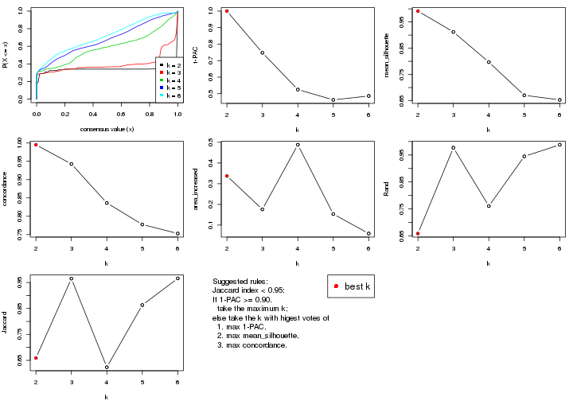

The numeric values for all these statistics can be obtained by `get_stats()`.

```r
get_stats(res)
```

```
#>   k 1-PAC mean_silhouette concordance area_increased  Rand Jaccard
#> 2 2 1.000           0.991       0.995         0.3374 0.659   0.659
#> 3 3 0.748           0.912       0.943         0.1759 0.977   0.965
#> 4 4 0.525           0.797       0.836         0.4880 0.761   0.624
#> 5 5 0.462           0.670       0.778         0.1531 0.945   0.863
#> 6 6 0.486           0.653       0.753         0.0592 0.988   0.966
```

`suggest_best_k()` suggests the best $k$ based on these statistics. The rules are as follows:

- All $k$ with Jaccard index larger than 0.95 are removed because the increase of
  the partition number does not provides enough extra information. If all $k$ are removed,
  the best $k$ is assigned by `NA`.
- For $k$ with 1-PAC larger than 0.9, the maximal $k$ is taken as the "best k". Other $k$ is called "optional k".
- If it does not fit the second rule. The $k$ with the highest vote of highest
  1-PAC, mean silhouette and concordance is taken as the "best k".

```r
suggest_best_k(res)
```

```
#> [1] 2
```


Following shows the table of the partitions (You need to click the **show/hide
code output** link to see it). The membership matrix (columns with name `p*`)
is inferred by
[`clue::cl_consensus()`](https://www.rdocumentation.org/link/cl_consensus?package=clue)
function with the `SE` method. Basically the value in the membership matrix
represents the probability to belong to a certain group. The finall class
label for an item is determined with the group with highest probability it
belongs to.

In `get_classes()` function, the entropy is calculated from the membership
matrix and the silhouette score is calculated from the consensus matrix.


<script>
$( function() {
	$( '#tabs-SD-mclust-get-classes' ).tabs();
} );
</script>
<div id='tabs-SD-mclust-get-classes'>
<ul>
<li><a href='#tab-SD-mclust-get-classes-1'>k = 2</a></li>
<li><a href='#tab-SD-mclust-get-classes-2'>k = 3</a></li>
<li><a href='#tab-SD-mclust-get-classes-3'>k = 4</a></li>
<li><a href='#tab-SD-mclust-get-classes-4'>k = 5</a></li>
<li><a href='#tab-SD-mclust-get-classes-5'>k = 6</a></li>
</ul>

<div id='tab-SD-mclust-get-classes-1'>
<p><a id='tab-SD-mclust-get-classes-1-a' style='color:#0366d6' href='#'>show/hide code output</a></p>
<pre><code class="r">cbind(get_classes(res, k = 2), get_membership(res, k = 2))
</code></pre>

<pre><code>#&gt;           class entropy silhouette    p1    p2
#&gt; ERR467487     2   0.118      0.977 0.016 0.984
#&gt; ERR467498     2   0.118      0.977 0.016 0.984
#&gt; ERR658998     1   0.000      0.999 1.000 0.000
#&gt; ERR659094     1   0.000      0.999 1.000 0.000
#&gt; ERR658999     1   0.000      0.999 1.000 0.000
#&gt; ERR659095     1   0.000      0.999 1.000 0.000
#&gt; ERR659000     2   0.430      0.915 0.088 0.912
#&gt; ERR659096     2   0.430      0.915 0.088 0.912
#&gt; ERR659001     1   0.000      0.999 1.000 0.000
#&gt; ERR659097     1   0.000      0.999 1.000 0.000
#&gt; ERR659002     1   0.000      0.999 1.000 0.000
#&gt; ERR659098     1   0.000      0.999 1.000 0.000
#&gt; ERR659003     1   0.000      0.999 1.000 0.000
#&gt; ERR659099     1   0.000      0.999 1.000 0.000
#&gt; ERR659004     1   0.184      0.971 0.972 0.028
#&gt; ERR659100     1   0.184      0.971 0.972 0.028
#&gt; ERR659005     1   0.000      0.999 1.000 0.000
#&gt; ERR659101     1   0.000      0.999 1.000 0.000
#&gt; ERR659006     1   0.000      0.999 1.000 0.000
#&gt; ERR659102     1   0.000      0.999 1.000 0.000
#&gt; ERR659007     1   0.000      0.999 1.000 0.000
#&gt; ERR659103     1   0.000      0.999 1.000 0.000
#&gt; ERR659008     2   0.000      0.980 0.000 1.000
#&gt; ERR659104     2   0.000      0.980 0.000 1.000
#&gt; ERR659009     1   0.000      0.999 1.000 0.000
#&gt; ERR659105     1   0.000      0.999 1.000 0.000
#&gt; ERR659010     1   0.000      0.999 1.000 0.000
#&gt; ERR659106     1   0.000      0.999 1.000 0.000
#&gt; ERR659011     1   0.000      0.999 1.000 0.000
#&gt; ERR659107     1   0.000      0.999 1.000 0.000
#&gt; ERR659012     1   0.000      0.999 1.000 0.000
#&gt; ERR659108     1   0.000      0.999 1.000 0.000
#&gt; ERR659013     1   0.000      0.999 1.000 0.000
#&gt; ERR659109     1   0.000      0.999 1.000 0.000
#&gt; ERR659014     2   0.000      0.980 0.000 1.000
#&gt; ERR659110     2   0.000      0.980 0.000 1.000
#&gt; ERR659015     1   0.000      0.999 1.000 0.000
#&gt; ERR659111     1   0.000      0.999 1.000 0.000
#&gt; ERR659016     2   0.595      0.849 0.144 0.856
#&gt; ERR659112     2   0.706      0.783 0.192 0.808
#&gt; ERR659017     2   0.000      0.980 0.000 1.000
#&gt; ERR659113     2   0.000      0.980 0.000 1.000
#&gt; ERR659018     1   0.000      0.999 1.000 0.000
#&gt; ERR659114     1   0.000      0.999 1.000 0.000
#&gt; ERR659019     1   0.000      0.999 1.000 0.000
#&gt; ERR659115     1   0.000      0.999 1.000 0.000
#&gt; ERR659020     1   0.000      0.999 1.000 0.000
#&gt; ERR659116     1   0.000      0.999 1.000 0.000
#&gt; ERR659021     1   0.000      0.999 1.000 0.000
#&gt; ERR659117     1   0.000      0.999 1.000 0.000
#&gt; ERR659022     1   0.000      0.999 1.000 0.000
#&gt; ERR659118     1   0.000      0.999 1.000 0.000
#&gt; ERR659023     1   0.000      0.999 1.000 0.000
#&gt; ERR659119     1   0.000      0.999 1.000 0.000
#&gt; ERR659024     1   0.000      0.999 1.000 0.000
#&gt; ERR659120     1   0.000      0.999 1.000 0.000
#&gt; ERR659025     1   0.000      0.999 1.000 0.000
#&gt; ERR659121     1   0.000      0.999 1.000 0.000
#&gt; ERR659026     1   0.000      0.999 1.000 0.000
#&gt; ERR659122     1   0.000      0.999 1.000 0.000
#&gt; ERR659027     2   0.311      0.946 0.056 0.944
#&gt; ERR659123     2   0.311      0.946 0.056 0.944
#&gt; ERR659028     1   0.000      0.999 1.000 0.000
#&gt; ERR659124     1   0.000      0.999 1.000 0.000
#&gt; ERR659029     1   0.000      0.999 1.000 0.000
#&gt; ERR659125     1   0.000      0.999 1.000 0.000
#&gt; ERR659030     1   0.000      0.999 1.000 0.000
#&gt; ERR659126     1   0.000      0.999 1.000 0.000
#&gt; ERR659031     1   0.000      0.999 1.000 0.000
#&gt; ERR659127     1   0.000      0.999 1.000 0.000
#&gt; ERR659032     1   0.000      0.999 1.000 0.000
#&gt; ERR659128     1   0.000      0.999 1.000 0.000
#&gt; ERR659033     1   0.000      0.999 1.000 0.000
#&gt; ERR659129     1   0.000      0.999 1.000 0.000
#&gt; ERR659034     2   0.000      0.980 0.000 1.000
#&gt; ERR659130     2   0.000      0.980 0.000 1.000
#&gt; ERR659035     1   0.000      0.999 1.000 0.000
#&gt; ERR659131     1   0.000      0.999 1.000 0.000
#&gt; ERR659036     1   0.163      0.975 0.976 0.024
#&gt; ERR659132     1   0.163      0.975 0.976 0.024
#&gt; ERR659037     1   0.000      0.999 1.000 0.000
#&gt; ERR659133     1   0.000      0.999 1.000 0.000
#&gt; ERR659038     1   0.000      0.999 1.000 0.000
#&gt; ERR659134     1   0.000      0.999 1.000 0.000
#&gt; ERR659039     1   0.000      0.999 1.000 0.000
#&gt; ERR659135     1   0.000      0.999 1.000 0.000
#&gt; ERR659040     1   0.000      0.999 1.000 0.000
#&gt; ERR659136     1   0.000      0.999 1.000 0.000
#&gt; ERR659041     1   0.141      0.980 0.980 0.020
#&gt; ERR659137     1   0.118      0.984 0.984 0.016
#&gt; ERR659042     1   0.000      0.999 1.000 0.000
#&gt; ERR659138     1   0.000      0.999 1.000 0.000
#&gt; ERR659043     1   0.000      0.999 1.000 0.000
#&gt; ERR659139     1   0.000      0.999 1.000 0.000
#&gt; ERR659044     2   0.000      0.980 0.000 1.000
#&gt; ERR659140     2   0.000      0.980 0.000 1.000
#&gt; ERR659045     1   0.000      0.999 1.000 0.000
#&gt; ERR659141     1   0.000      0.999 1.000 0.000
#&gt; ERR659046     1   0.000      0.999 1.000 0.000
#&gt; ERR659142     1   0.000      0.999 1.000 0.000
#&gt; ERR659047     1   0.000      0.999 1.000 0.000
#&gt; ERR659143     1   0.000      0.999 1.000 0.000
#&gt; ERR659048     1   0.000      0.999 1.000 0.000
#&gt; ERR659144     1   0.000      0.999 1.000 0.000
#&gt; ERR659049     1   0.000      0.999 1.000 0.000
#&gt; ERR659145     1   0.000      0.999 1.000 0.000
#&gt; ERR659050     1   0.000      0.999 1.000 0.000
#&gt; ERR659146     1   0.000      0.999 1.000 0.000
#&gt; ERR659051     2   0.118      0.977 0.016 0.984
#&gt; ERR659147     2   0.118      0.977 0.016 0.984
#&gt; ERR659052     1   0.000      0.999 1.000 0.000
#&gt; ERR659148     1   0.000      0.999 1.000 0.000
#&gt; ERR659053     1   0.000      0.999 1.000 0.000
#&gt; ERR659149     1   0.000      0.999 1.000 0.000
#&gt; ERR659054     2   0.000      0.980 0.000 1.000
#&gt; ERR659150     2   0.000      0.980 0.000 1.000
#&gt; ERR659055     1   0.000      0.999 1.000 0.000
#&gt; ERR659151     1   0.000      0.999 1.000 0.000
#&gt; ERR659056     2   0.118      0.977 0.016 0.984
#&gt; ERR659152     2   0.118      0.977 0.016 0.984
#&gt; ERR659057     1   0.000      0.999 1.000 0.000
#&gt; ERR659153     1   0.000      0.999 1.000 0.000
#&gt; ERR659058     1   0.000      0.999 1.000 0.000
#&gt; ERR659154     1   0.000      0.999 1.000 0.000
#&gt; ERR659059     1   0.000      0.999 1.000 0.000
#&gt; ERR659155     1   0.000      0.999 1.000 0.000
#&gt; ERR659060     1   0.000      0.999 1.000 0.000
#&gt; ERR659156     1   0.000      0.999 1.000 0.000
#&gt; ERR659061     1   0.000      0.999 1.000 0.000
#&gt; ERR659157     1   0.000      0.999 1.000 0.000
#&gt; ERR659062     1   0.000      0.999 1.000 0.000
#&gt; ERR659158     1   0.000      0.999 1.000 0.000
#&gt; ERR659063     1   0.000      0.999 1.000 0.000
#&gt; ERR659159     1   0.000      0.999 1.000 0.000
#&gt; ERR659064     1   0.000      0.999 1.000 0.000
#&gt; ERR659160     1   0.000      0.999 1.000 0.000
#&gt; ERR659065     2   0.000      0.980 0.000 1.000
#&gt; ERR659161     2   0.000      0.980 0.000 1.000
#&gt; ERR659066     1   0.000      0.999 1.000 0.000
#&gt; ERR659162     1   0.000      0.999 1.000 0.000
#&gt; ERR659067     1   0.000      0.999 1.000 0.000
#&gt; ERR659163     1   0.000      0.999 1.000 0.000
#&gt; ERR659068     2   0.000      0.980 0.000 1.000
#&gt; ERR659164     2   0.000      0.980 0.000 1.000
#&gt; ERR659069     1   0.000      0.999 1.000 0.000
#&gt; ERR659165     1   0.000      0.999 1.000 0.000
#&gt; ERR659070     1   0.000      0.999 1.000 0.000
#&gt; ERR659166     1   0.000      0.999 1.000 0.000
#&gt; ERR659071     1   0.000      0.999 1.000 0.000
#&gt; ERR659167     1   0.000      0.999 1.000 0.000
#&gt; ERR659072     1   0.000      0.999 1.000 0.000
#&gt; ERR659168     1   0.000      0.999 1.000 0.000
#&gt; ERR659073     1   0.000      0.999 1.000 0.000
#&gt; ERR659169     1   0.000      0.999 1.000 0.000
#&gt; ERR659074     2   0.000      0.980 0.000 1.000
#&gt; ERR659170     2   0.000      0.980 0.000 1.000
#&gt; ERR659075     2   0.118      0.977 0.016 0.984
#&gt; ERR659171     2   0.118      0.977 0.016 0.984
#&gt; ERR659076     2   0.000      0.980 0.000 1.000
#&gt; ERR659172     2   0.000      0.980 0.000 1.000
#&gt; ERR659077     1   0.000      0.999 1.000 0.000
#&gt; ERR659173     1   0.000      0.999 1.000 0.000
#&gt; ERR659078     1   0.000      0.999 1.000 0.000
#&gt; ERR659174     1   0.000      0.999 1.000 0.000
#&gt; ERR659079     1   0.000      0.999 1.000 0.000
#&gt; ERR659175     1   0.000      0.999 1.000 0.000
#&gt; ERR659080     2   0.118      0.977 0.016 0.984
#&gt; ERR659176     2   0.118      0.977 0.016 0.984
#&gt; ERR659081     1   0.000      0.999 1.000 0.000
#&gt; ERR659177     1   0.000      0.999 1.000 0.000
#&gt; ERR659082     1   0.000      0.999 1.000 0.000
#&gt; ERR659178     1   0.000      0.999 1.000 0.000
#&gt; ERR659083     2   0.000      0.980 0.000 1.000
#&gt; ERR659179     2   0.000      0.980 0.000 1.000
#&gt; ERR659084     2   0.000      0.980 0.000 1.000
#&gt; ERR659180     2   0.000      0.980 0.000 1.000
#&gt; ERR659085     1   0.000      0.999 1.000 0.000
#&gt; ERR659181     1   0.000      0.999 1.000 0.000
#&gt; ERR659086     1   0.000      0.999 1.000 0.000
#&gt; ERR659182     1   0.000      0.999 1.000 0.000
#&gt; ERR659087     1   0.000      0.999 1.000 0.000
#&gt; ERR659183     1   0.000      0.999 1.000 0.000
#&gt; ERR659088     2   0.118      0.977 0.016 0.984
#&gt; ERR659184     2   0.118      0.977 0.016 0.984
#&gt; ERR659089     1   0.000      0.999 1.000 0.000
#&gt; ERR659185     1   0.000      0.999 1.000 0.000
#&gt; ERR659090     1   0.000      0.999 1.000 0.000
#&gt; ERR659186     1   0.000      0.999 1.000 0.000
#&gt; ERR659091     1   0.000      0.999 1.000 0.000
#&gt; ERR659187     1   0.000      0.999 1.000 0.000
#&gt; ERR659092     1   0.000      0.999 1.000 0.000
#&gt; ERR659188     1   0.000      0.999 1.000 0.000
#&gt; ERR659093     1   0.000      0.999 1.000 0.000
#&gt; ERR659189     1   0.000      0.999 1.000 0.000
</code></pre>

<script>
$('#tab-SD-mclust-get-classes-1-a').parent().next().next().hide();
$('#tab-SD-mclust-get-classes-1-a').click(function(){
  $('#tab-SD-mclust-get-classes-1-a').parent().next().next().toggle();
  return(false);
});
</script>
</div>

<div id='tab-SD-mclust-get-classes-2'>
<p><a id='tab-SD-mclust-get-classes-2-a' style='color:#0366d6' href='#'>show/hide code output</a></p>
<pre><code class="r">cbind(get_classes(res, k = 3), get_membership(res, k = 3))
</code></pre>

<pre><code>#&gt;           class entropy silhouette    p1    p2    p3
#&gt; ERR467487     3  0.5905      0.625 0.000 0.352 0.648
#&gt; ERR467498     3  0.5905      0.625 0.000 0.352 0.648
#&gt; ERR658998     1  0.0747      0.949 0.984 0.000 0.016
#&gt; ERR659094     1  0.0747      0.949 0.984 0.000 0.016
#&gt; ERR658999     1  0.3412      0.891 0.876 0.000 0.124
#&gt; ERR659095     1  0.3412      0.891 0.876 0.000 0.124
#&gt; ERR659000     3  0.7372      0.657 0.168 0.128 0.704
#&gt; ERR659096     3  0.7372      0.657 0.168 0.128 0.704
#&gt; ERR659001     1  0.1031      0.946 0.976 0.000 0.024
#&gt; ERR659097     1  0.1163      0.944 0.972 0.000 0.028
#&gt; ERR659002     1  0.0000      0.952 1.000 0.000 0.000
#&gt; ERR659098     1  0.0000      0.952 1.000 0.000 0.000
#&gt; ERR659003     1  0.0237      0.953 0.996 0.000 0.004
#&gt; ERR659099     1  0.0237      0.953 0.996 0.000 0.004
#&gt; ERR659004     1  0.6339      0.523 0.632 0.008 0.360
#&gt; ERR659100     1  0.6297      0.541 0.640 0.008 0.352
#&gt; ERR659005     1  0.0237      0.953 0.996 0.000 0.004
#&gt; ERR659101     1  0.0237      0.953 0.996 0.000 0.004
#&gt; ERR659006     1  0.3644      0.888 0.872 0.004 0.124
#&gt; ERR659102     1  0.3644      0.888 0.872 0.004 0.124
#&gt; ERR659007     1  0.0237      0.953 0.996 0.000 0.004
#&gt; ERR659103     1  0.0237      0.953 0.996 0.000 0.004
#&gt; ERR659008     2  0.0000      1.000 0.000 1.000 0.000
#&gt; ERR659104     2  0.0000      1.000 0.000 1.000 0.000
#&gt; ERR659009     1  0.3412      0.891 0.876 0.000 0.124
#&gt; ERR659105     1  0.3412      0.891 0.876 0.000 0.124
#&gt; ERR659010     1  0.3412      0.891 0.876 0.000 0.124
#&gt; ERR659106     1  0.3412      0.891 0.876 0.000 0.124
#&gt; ERR659011     1  0.3412      0.891 0.876 0.000 0.124
#&gt; ERR659107     1  0.3412      0.891 0.876 0.000 0.124
#&gt; ERR659012     1  0.3644      0.888 0.872 0.004 0.124
#&gt; ERR659108     1  0.3644      0.888 0.872 0.004 0.124
#&gt; ERR659013     1  0.0424      0.951 0.992 0.000 0.008
#&gt; ERR659109     1  0.0424      0.951 0.992 0.000 0.008
#&gt; ERR659014     2  0.0000      1.000 0.000 1.000 0.000
#&gt; ERR659110     2  0.0000      1.000 0.000 1.000 0.000
#&gt; ERR659015     1  0.0237      0.953 0.996 0.000 0.004
#&gt; ERR659111     1  0.0237      0.953 0.996 0.000 0.004
#&gt; ERR659016     3  0.8196      0.508 0.284 0.108 0.608
#&gt; ERR659112     3  0.8196      0.508 0.284 0.108 0.608
#&gt; ERR659017     2  0.0000      1.000 0.000 1.000 0.000
#&gt; ERR659113     2  0.0000      1.000 0.000 1.000 0.000
#&gt; ERR659018     1  0.0747      0.949 0.984 0.000 0.016
#&gt; ERR659114     1  0.0747      0.949 0.984 0.000 0.016
#&gt; ERR659019     1  0.3412      0.891 0.876 0.000 0.124
#&gt; ERR659115     1  0.3412      0.891 0.876 0.000 0.124
#&gt; ERR659020     1  0.0592      0.950 0.988 0.000 0.012
#&gt; ERR659116     1  0.0592      0.950 0.988 0.000 0.012
#&gt; ERR659021     1  0.0237      0.953 0.996 0.000 0.004
#&gt; ERR659117     1  0.0237      0.953 0.996 0.000 0.004
#&gt; ERR659022     1  0.0237      0.953 0.996 0.000 0.004
#&gt; ERR659118     1  0.0237      0.953 0.996 0.000 0.004
#&gt; ERR659023     1  0.0237      0.953 0.996 0.000 0.004
#&gt; ERR659119     1  0.0237      0.953 0.996 0.000 0.004
#&gt; ERR659024     1  0.0237      0.953 0.996 0.000 0.004
#&gt; ERR659120     1  0.0237      0.953 0.996 0.000 0.004
#&gt; ERR659025     1  0.0237      0.953 0.996 0.000 0.004
#&gt; ERR659121     1  0.0237      0.953 0.996 0.000 0.004
#&gt; ERR659026     1  0.1031      0.946 0.976 0.000 0.024
#&gt; ERR659122     1  0.1031      0.946 0.976 0.000 0.024
#&gt; ERR659027     3  0.4807      0.778 0.060 0.092 0.848
#&gt; ERR659123     3  0.4830      0.770 0.068 0.084 0.848
#&gt; ERR659028     1  0.0424      0.951 0.992 0.000 0.008
#&gt; ERR659124     1  0.0237      0.953 0.996 0.000 0.004
#&gt; ERR659029     1  0.0237      0.953 0.996 0.000 0.004
#&gt; ERR659125     1  0.0237      0.953 0.996 0.000 0.004
#&gt; ERR659030     1  0.0592      0.950 0.988 0.000 0.012
#&gt; ERR659126     1  0.0592      0.950 0.988 0.000 0.012
#&gt; ERR659031     1  0.0592      0.950 0.988 0.000 0.012
#&gt; ERR659127     1  0.0424      0.951 0.992 0.000 0.008
#&gt; ERR659032     1  0.0237      0.953 0.996 0.000 0.004
#&gt; ERR659128     1  0.0237      0.953 0.996 0.000 0.004
#&gt; ERR659033     1  0.0000      0.952 1.000 0.000 0.000
#&gt; ERR659129     1  0.0000      0.952 1.000 0.000 0.000
#&gt; ERR659034     2  0.0000      1.000 0.000 1.000 0.000
#&gt; ERR659130     2  0.0000      1.000 0.000 1.000 0.000
#&gt; ERR659035     1  0.0237      0.953 0.996 0.000 0.004
#&gt; ERR659131     1  0.0237      0.953 0.996 0.000 0.004
#&gt; ERR659036     1  0.4504      0.743 0.804 0.000 0.196
#&gt; ERR659132     1  0.4452      0.750 0.808 0.000 0.192
#&gt; ERR659037     1  0.0237      0.953 0.996 0.000 0.004
#&gt; ERR659133     1  0.0237      0.953 0.996 0.000 0.004
#&gt; ERR659038     1  0.3412      0.891 0.876 0.000 0.124
#&gt; ERR659134     1  0.3412      0.891 0.876 0.000 0.124
#&gt; ERR659039     1  0.3412      0.891 0.876 0.000 0.124
#&gt; ERR659135     1  0.3412      0.891 0.876 0.000 0.124
#&gt; ERR659040     1  0.0237      0.953 0.996 0.000 0.004
#&gt; ERR659136     1  0.0237      0.953 0.996 0.000 0.004
#&gt; ERR659041     1  0.6483      0.277 0.600 0.008 0.392
#&gt; ERR659137     1  0.6451      0.302 0.608 0.008 0.384
#&gt; ERR659042     1  0.1964      0.916 0.944 0.000 0.056
#&gt; ERR659138     1  0.1964      0.916 0.944 0.000 0.056
#&gt; ERR659043     1  0.0000      0.952 1.000 0.000 0.000
#&gt; ERR659139     1  0.0000      0.952 1.000 0.000 0.000
#&gt; ERR659044     2  0.0000      1.000 0.000 1.000 0.000
#&gt; ERR659140     2  0.0000      1.000 0.000 1.000 0.000
#&gt; ERR659045     1  0.3267      0.896 0.884 0.000 0.116
#&gt; ERR659141     1  0.3267      0.896 0.884 0.000 0.116
#&gt; ERR659046     1  0.0237      0.953 0.996 0.000 0.004
#&gt; ERR659142     1  0.0237      0.953 0.996 0.000 0.004
#&gt; ERR659047     1  0.0237      0.953 0.996 0.000 0.004
#&gt; ERR659143     1  0.0237      0.953 0.996 0.000 0.004
#&gt; ERR659048     1  0.0000      0.952 1.000 0.000 0.000
#&gt; ERR659144     1  0.0000      0.952 1.000 0.000 0.000
#&gt; ERR659049     1  0.0424      0.951 0.992 0.000 0.008
#&gt; ERR659145     1  0.0424      0.951 0.992 0.000 0.008
#&gt; ERR659050     1  0.0237      0.953 0.996 0.000 0.004
#&gt; ERR659146     1  0.0237      0.953 0.996 0.000 0.004
#&gt; ERR659051     3  0.4733      0.784 0.004 0.196 0.800
#&gt; ERR659147     3  0.4733      0.784 0.004 0.196 0.800
#&gt; ERR659052     1  0.3412      0.891 0.876 0.000 0.124
#&gt; ERR659148     1  0.3412      0.891 0.876 0.000 0.124
#&gt; ERR659053     1  0.0000      0.952 1.000 0.000 0.000
#&gt; ERR659149     1  0.0000      0.952 1.000 0.000 0.000
#&gt; ERR659054     2  0.0000      1.000 0.000 1.000 0.000
#&gt; ERR659150     2  0.0000      1.000 0.000 1.000 0.000
#&gt; ERR659055     1  0.2165      0.926 0.936 0.000 0.064
#&gt; ERR659151     1  0.2165      0.926 0.936 0.000 0.064
#&gt; ERR659056     3  0.3752      0.802 0.000 0.144 0.856
#&gt; ERR659152     3  0.3752      0.802 0.000 0.144 0.856
#&gt; ERR659057     1  0.0237      0.952 0.996 0.000 0.004
#&gt; ERR659153     1  0.0000      0.952 1.000 0.000 0.000
#&gt; ERR659058     1  0.3412      0.891 0.876 0.000 0.124
#&gt; ERR659154     1  0.3412      0.891 0.876 0.000 0.124
#&gt; ERR659059     1  0.0237      0.953 0.996 0.000 0.004
#&gt; ERR659155     1  0.0237      0.953 0.996 0.000 0.004
#&gt; ERR659060     1  0.0424      0.952 0.992 0.000 0.008
#&gt; ERR659156     1  0.0424      0.952 0.992 0.000 0.008
#&gt; ERR659061     1  0.0424      0.952 0.992 0.000 0.008
#&gt; ERR659157     1  0.0424      0.952 0.992 0.000 0.008
#&gt; ERR659062     1  0.0592      0.950 0.988 0.000 0.012
#&gt; ERR659158     1  0.0592      0.950 0.988 0.000 0.012
#&gt; ERR659063     1  0.0000      0.952 1.000 0.000 0.000
#&gt; ERR659159     1  0.0000      0.952 1.000 0.000 0.000
#&gt; ERR659064     1  0.0237      0.953 0.996 0.000 0.004
#&gt; ERR659160     1  0.0237      0.953 0.996 0.000 0.004
#&gt; ERR659065     2  0.0000      1.000 0.000 1.000 0.000
#&gt; ERR659161     2  0.0000      1.000 0.000 1.000 0.000
#&gt; ERR659066     1  0.3412      0.891 0.876 0.000 0.124
#&gt; ERR659162     1  0.3412      0.891 0.876 0.000 0.124
#&gt; ERR659067     1  0.3412      0.891 0.876 0.000 0.124
#&gt; ERR659163     1  0.3340      0.894 0.880 0.000 0.120
#&gt; ERR659068     2  0.0000      1.000 0.000 1.000 0.000
#&gt; ERR659164     2  0.0000      1.000 0.000 1.000 0.000
#&gt; ERR659069     1  0.3412      0.891 0.876 0.000 0.124
#&gt; ERR659165     1  0.3412      0.891 0.876 0.000 0.124
#&gt; ERR659070     1  0.0237      0.953 0.996 0.000 0.004
#&gt; ERR659166     1  0.0237      0.953 0.996 0.000 0.004
#&gt; ERR659071     1  0.0237      0.953 0.996 0.000 0.004
#&gt; ERR659167     1  0.0237      0.953 0.996 0.000 0.004
#&gt; ERR659072     1  0.3412      0.891 0.876 0.000 0.124
#&gt; ERR659168     1  0.3412      0.891 0.876 0.000 0.124
#&gt; ERR659073     1  0.1529      0.940 0.960 0.000 0.040
#&gt; ERR659169     1  0.1643      0.939 0.956 0.000 0.044
#&gt; ERR659074     2  0.0000      1.000 0.000 1.000 0.000
#&gt; ERR659170     2  0.0000      1.000 0.000 1.000 0.000
#&gt; ERR659075     3  0.4887      0.764 0.000 0.228 0.772
#&gt; ERR659171     3  0.4887      0.764 0.000 0.228 0.772
#&gt; ERR659076     2  0.0000      1.000 0.000 1.000 0.000
#&gt; ERR659172     2  0.0000      1.000 0.000 1.000 0.000
#&gt; ERR659077     1  0.0237      0.953 0.996 0.000 0.004
#&gt; ERR659173     1  0.0237      0.953 0.996 0.000 0.004
#&gt; ERR659078     1  0.0237      0.953 0.996 0.000 0.004
#&gt; ERR659174     1  0.0237      0.953 0.996 0.000 0.004
#&gt; ERR659079     1  0.0237      0.953 0.996 0.000 0.004
#&gt; ERR659175     1  0.0237      0.953 0.996 0.000 0.004
#&gt; ERR659080     3  0.3619      0.802 0.000 0.136 0.864
#&gt; ERR659176     3  0.3619      0.802 0.000 0.136 0.864
#&gt; ERR659081     1  0.0237      0.953 0.996 0.000 0.004
#&gt; ERR659177     1  0.0237      0.953 0.996 0.000 0.004
#&gt; ERR659082     1  0.0747      0.947 0.984 0.000 0.016
#&gt; ERR659178     1  0.0747      0.947 0.984 0.000 0.016
#&gt; ERR659083     2  0.0000      1.000 0.000 1.000 0.000
#&gt; ERR659179     2  0.0000      1.000 0.000 1.000 0.000
#&gt; ERR659084     2  0.0000      1.000 0.000 1.000 0.000
#&gt; ERR659180     2  0.0000      1.000 0.000 1.000 0.000
#&gt; ERR659085     1  0.0000      0.952 1.000 0.000 0.000
#&gt; ERR659181     1  0.0000      0.952 1.000 0.000 0.000
#&gt; ERR659086     1  0.0000      0.952 1.000 0.000 0.000
#&gt; ERR659182     1  0.0000      0.952 1.000 0.000 0.000
#&gt; ERR659087     1  0.3412      0.891 0.876 0.000 0.124
#&gt; ERR659183     1  0.3412      0.891 0.876 0.000 0.124
#&gt; ERR659088     3  0.3551      0.802 0.000 0.132 0.868
#&gt; ERR659184     3  0.3551      0.802 0.000 0.132 0.868
#&gt; ERR659089     1  0.0592      0.950 0.988 0.000 0.012
#&gt; ERR659185     1  0.0592      0.950 0.988 0.000 0.012
#&gt; ERR659090     1  0.0000      0.952 1.000 0.000 0.000
#&gt; ERR659186     1  0.0000      0.952 1.000 0.000 0.000
#&gt; ERR659091     1  0.0237      0.952 0.996 0.000 0.004
#&gt; ERR659187     1  0.0237      0.952 0.996 0.000 0.004
#&gt; ERR659092     1  0.0237      0.953 0.996 0.000 0.004
#&gt; ERR659188     1  0.0237      0.953 0.996 0.000 0.004
#&gt; ERR659093     1  0.0237      0.953 0.996 0.000 0.004
#&gt; ERR659189     1  0.0237      0.953 0.996 0.000 0.004
</code></pre>

<script>
$('#tab-SD-mclust-get-classes-2-a').parent().next().next().hide();
$('#tab-SD-mclust-get-classes-2-a').click(function(){
  $('#tab-SD-mclust-get-classes-2-a').parent().next().next().toggle();
  return(false);
});
</script>
</div>

<div id='tab-SD-mclust-get-classes-3'>
<p><a id='tab-SD-mclust-get-classes-3-a' style='color:#0366d6' href='#'>show/hide code output</a></p>
<pre><code class="r">cbind(get_classes(res, k = 4), get_membership(res, k = 4))
</code></pre>

<pre><code>#&gt;           class entropy silhouette    p1    p2    p3    p4
#&gt; ERR467487     3  0.2737    0.86553 0.000 0.008 0.888 0.104
#&gt; ERR467498     3  0.2737    0.86553 0.000 0.008 0.888 0.104
#&gt; ERR658998     1  0.4356    0.43873 0.708 0.000 0.000 0.292
#&gt; ERR659094     1  0.4331    0.44995 0.712 0.000 0.000 0.288
#&gt; ERR658999     4  0.4072    0.91389 0.252 0.000 0.000 0.748
#&gt; ERR659095     4  0.4072    0.91389 0.252 0.000 0.000 0.748
#&gt; ERR659000     3  0.4405    0.75738 0.152 0.000 0.800 0.048
#&gt; ERR659096     3  0.4452    0.75286 0.156 0.000 0.796 0.048
#&gt; ERR659001     1  0.2999    0.77146 0.864 0.000 0.004 0.132
#&gt; ERR659097     1  0.2831    0.78754 0.876 0.000 0.004 0.120
#&gt; ERR659002     1  0.2149    0.81912 0.912 0.000 0.000 0.088
#&gt; ERR659098     1  0.1716    0.83452 0.936 0.000 0.000 0.064
#&gt; ERR659003     1  0.1022    0.84650 0.968 0.000 0.000 0.032
#&gt; ERR659099     1  0.1022    0.84650 0.968 0.000 0.000 0.032
#&gt; ERR659004     4  0.7551    0.58714 0.240 0.000 0.272 0.488
#&gt; ERR659100     4  0.7530    0.59017 0.236 0.000 0.272 0.492
#&gt; ERR659005     1  0.2011    0.84340 0.920 0.000 0.000 0.080
#&gt; ERR659101     1  0.2011    0.84340 0.920 0.000 0.000 0.080
#&gt; ERR659006     4  0.5757    0.88017 0.240 0.000 0.076 0.684
#&gt; ERR659102     4  0.5757    0.88017 0.240 0.000 0.076 0.684
#&gt; ERR659007     1  0.0592    0.84432 0.984 0.000 0.000 0.016
#&gt; ERR659103     1  0.0469    0.84499 0.988 0.000 0.000 0.012
#&gt; ERR659008     2  0.0000    1.00000 0.000 1.000 0.000 0.000
#&gt; ERR659104     2  0.0000    1.00000 0.000 1.000 0.000 0.000
#&gt; ERR659009     4  0.3907    0.90621 0.232 0.000 0.000 0.768
#&gt; ERR659105     4  0.3907    0.90621 0.232 0.000 0.000 0.768
#&gt; ERR659010     4  0.4008    0.91311 0.244 0.000 0.000 0.756
#&gt; ERR659106     4  0.4008    0.91311 0.244 0.000 0.000 0.756
#&gt; ERR659011     4  0.3975    0.91136 0.240 0.000 0.000 0.760
#&gt; ERR659107     4  0.3975    0.91136 0.240 0.000 0.000 0.760
#&gt; ERR659012     4  0.5279    0.88836 0.232 0.000 0.052 0.716
#&gt; ERR659108     4  0.5279    0.88836 0.232 0.000 0.052 0.716
#&gt; ERR659013     1  0.4514    0.70136 0.800 0.000 0.064 0.136
#&gt; ERR659109     1  0.4514    0.70180 0.800 0.000 0.064 0.136
#&gt; ERR659014     2  0.0000    1.00000 0.000 1.000 0.000 0.000
#&gt; ERR659110     2  0.0000    1.00000 0.000 1.000 0.000 0.000
#&gt; ERR659015     1  0.0336    0.84499 0.992 0.000 0.000 0.008
#&gt; ERR659111     1  0.0336    0.84499 0.992 0.000 0.000 0.008
#&gt; ERR659016     3  0.5170    0.66628 0.228 0.000 0.724 0.048
#&gt; ERR659112     3  0.5298    0.64620 0.244 0.000 0.708 0.048
#&gt; ERR659017     2  0.0000    1.00000 0.000 1.000 0.000 0.000
#&gt; ERR659113     2  0.0000    1.00000 0.000 1.000 0.000 0.000
#&gt; ERR659018     1  0.4830    0.00356 0.608 0.000 0.000 0.392
#&gt; ERR659114     1  0.4730    0.13917 0.636 0.000 0.000 0.364
#&gt; ERR659019     4  0.4040    0.91359 0.248 0.000 0.000 0.752
#&gt; ERR659115     4  0.4040    0.91359 0.248 0.000 0.000 0.752
#&gt; ERR659020     1  0.3873    0.60687 0.772 0.000 0.000 0.228
#&gt; ERR659116     1  0.3569    0.67320 0.804 0.000 0.000 0.196
#&gt; ERR659021     1  0.0707    0.84529 0.980 0.000 0.000 0.020
#&gt; ERR659117     1  0.0707    0.84529 0.980 0.000 0.000 0.020
#&gt; ERR659022     1  0.1792    0.81972 0.932 0.000 0.000 0.068
#&gt; ERR659118     1  0.1792    0.81961 0.932 0.000 0.000 0.068
#&gt; ERR659023     1  0.1716    0.82589 0.936 0.000 0.000 0.064
#&gt; ERR659119     1  0.1792    0.82377 0.932 0.000 0.000 0.068
#&gt; ERR659024     1  0.0592    0.84465 0.984 0.000 0.000 0.016
#&gt; ERR659120     1  0.0592    0.84465 0.984 0.000 0.000 0.016
#&gt; ERR659025     1  0.3390    0.75999 0.852 0.000 0.016 0.132
#&gt; ERR659121     1  0.3390    0.75999 0.852 0.000 0.016 0.132
#&gt; ERR659026     4  0.4999    0.44806 0.492 0.000 0.000 0.508
#&gt; ERR659122     4  0.4999    0.44806 0.492 0.000 0.000 0.508
#&gt; ERR659027     3  0.2002    0.85736 0.044 0.000 0.936 0.020
#&gt; ERR659123     3  0.2256    0.84774 0.056 0.000 0.924 0.020
#&gt; ERR659028     1  0.2918    0.80474 0.876 0.000 0.008 0.116
#&gt; ERR659124     1  0.2714    0.80969 0.884 0.000 0.004 0.112
#&gt; ERR659029     1  0.1118    0.84736 0.964 0.000 0.000 0.036
#&gt; ERR659125     1  0.1211    0.84705 0.960 0.000 0.000 0.040
#&gt; ERR659030     1  0.4933   -0.18599 0.568 0.000 0.000 0.432
#&gt; ERR659126     1  0.4830    0.00884 0.608 0.000 0.000 0.392
#&gt; ERR659031     1  0.2921    0.79227 0.860 0.000 0.000 0.140
#&gt; ERR659127     1  0.2973    0.78816 0.856 0.000 0.000 0.144
#&gt; ERR659032     1  0.2081    0.81317 0.916 0.000 0.000 0.084
#&gt; ERR659128     1  0.2149    0.81044 0.912 0.000 0.000 0.088
#&gt; ERR659033     1  0.1022    0.84262 0.968 0.000 0.000 0.032
#&gt; ERR659129     1  0.1022    0.84262 0.968 0.000 0.000 0.032
#&gt; ERR659034     2  0.0000    1.00000 0.000 1.000 0.000 0.000
#&gt; ERR659130     2  0.0000    1.00000 0.000 1.000 0.000 0.000
#&gt; ERR659035     1  0.1716    0.83199 0.936 0.000 0.000 0.064
#&gt; ERR659131     1  0.1637    0.83134 0.940 0.000 0.000 0.060
#&gt; ERR659036     1  0.6595    0.44400 0.604 0.000 0.276 0.120
#&gt; ERR659132     1  0.6595    0.44400 0.604 0.000 0.276 0.120
#&gt; ERR659037     1  0.1302    0.84179 0.956 0.000 0.000 0.044
#&gt; ERR659133     1  0.1211    0.84286 0.960 0.000 0.000 0.040
#&gt; ERR659038     4  0.3975    0.91136 0.240 0.000 0.000 0.760
#&gt; ERR659134     4  0.3975    0.91136 0.240 0.000 0.000 0.760
#&gt; ERR659039     4  0.4008    0.91311 0.244 0.000 0.000 0.756
#&gt; ERR659135     4  0.4008    0.91311 0.244 0.000 0.000 0.756
#&gt; ERR659040     1  0.3161    0.77165 0.864 0.000 0.012 0.124
#&gt; ERR659136     1  0.3032    0.77537 0.868 0.000 0.008 0.124
#&gt; ERR659041     1  0.7323    0.16708 0.484 0.000 0.352 0.164
#&gt; ERR659137     1  0.7332    0.15715 0.480 0.000 0.356 0.164
#&gt; ERR659042     1  0.5326    0.63817 0.748 0.000 0.116 0.136
#&gt; ERR659138     1  0.5326    0.63817 0.748 0.000 0.116 0.136
#&gt; ERR659043     1  0.3778    0.77620 0.848 0.000 0.052 0.100
#&gt; ERR659139     1  0.3840    0.77233 0.844 0.000 0.052 0.104
#&gt; ERR659044     2  0.0000    1.00000 0.000 1.000 0.000 0.000
#&gt; ERR659140     2  0.0000    1.00000 0.000 1.000 0.000 0.000
#&gt; ERR659045     4  0.4222    0.90428 0.272 0.000 0.000 0.728
#&gt; ERR659141     4  0.4222    0.90428 0.272 0.000 0.000 0.728
#&gt; ERR659046     1  0.0817    0.84546 0.976 0.000 0.000 0.024
#&gt; ERR659142     1  0.0817    0.84546 0.976 0.000 0.000 0.024
#&gt; ERR659047     1  0.2281    0.80591 0.904 0.000 0.000 0.096
#&gt; ERR659143     1  0.2216    0.80904 0.908 0.000 0.000 0.092
#&gt; ERR659048     1  0.0707    0.84513 0.980 0.000 0.000 0.020
#&gt; ERR659144     1  0.0707    0.84513 0.980 0.000 0.000 0.020
#&gt; ERR659049     1  0.3791    0.73873 0.796 0.000 0.004 0.200
#&gt; ERR659145     1  0.3831    0.73809 0.792 0.000 0.004 0.204
#&gt; ERR659050     1  0.2466    0.80168 0.900 0.000 0.004 0.096
#&gt; ERR659146     1  0.2466    0.80168 0.900 0.000 0.004 0.096
#&gt; ERR659051     3  0.2530    0.86717 0.000 0.000 0.888 0.112
#&gt; ERR659147     3  0.2530    0.86717 0.000 0.000 0.888 0.112
#&gt; ERR659052     4  0.4356    0.89084 0.292 0.000 0.000 0.708
#&gt; ERR659148     4  0.4304    0.89792 0.284 0.000 0.000 0.716
#&gt; ERR659053     1  0.1118    0.84483 0.964 0.000 0.000 0.036
#&gt; ERR659149     1  0.1118    0.84483 0.964 0.000 0.000 0.036
#&gt; ERR659054     2  0.0000    1.00000 0.000 1.000 0.000 0.000
#&gt; ERR659150     2  0.0000    1.00000 0.000 1.000 0.000 0.000
#&gt; ERR659055     4  0.4961    0.59462 0.448 0.000 0.000 0.552
#&gt; ERR659151     4  0.4961    0.59462 0.448 0.000 0.000 0.552
#&gt; ERR659056     3  0.0000    0.87946 0.000 0.000 1.000 0.000
#&gt; ERR659152     3  0.0000    0.87946 0.000 0.000 1.000 0.000
#&gt; ERR659057     1  0.2216    0.81472 0.908 0.000 0.000 0.092
#&gt; ERR659153     1  0.2149    0.81788 0.912 0.000 0.000 0.088
#&gt; ERR659058     4  0.4103    0.91273 0.256 0.000 0.000 0.744
#&gt; ERR659154     4  0.4072    0.91344 0.252 0.000 0.000 0.748
#&gt; ERR659059     1  0.1022    0.84462 0.968 0.000 0.000 0.032
#&gt; ERR659155     1  0.1022    0.84462 0.968 0.000 0.000 0.032
#&gt; ERR659060     1  0.2124    0.83400 0.924 0.000 0.008 0.068
#&gt; ERR659156     1  0.2271    0.82948 0.916 0.000 0.008 0.076
#&gt; ERR659061     1  0.1557    0.83821 0.944 0.000 0.000 0.056
#&gt; ERR659157     1  0.1637    0.83616 0.940 0.000 0.000 0.060
#&gt; ERR659062     1  0.2647    0.79452 0.880 0.000 0.000 0.120
#&gt; ERR659158     1  0.2530    0.80036 0.888 0.000 0.000 0.112
#&gt; ERR659063     1  0.0817    0.84488 0.976 0.000 0.000 0.024
#&gt; ERR659159     1  0.0817    0.84488 0.976 0.000 0.000 0.024
#&gt; ERR659064     1  0.2469    0.79157 0.892 0.000 0.000 0.108
#&gt; ERR659160     1  0.2469    0.79157 0.892 0.000 0.000 0.108
#&gt; ERR659065     2  0.0000    1.00000 0.000 1.000 0.000 0.000
#&gt; ERR659161     2  0.0000    1.00000 0.000 1.000 0.000 0.000
#&gt; ERR659066     4  0.4431    0.87114 0.304 0.000 0.000 0.696
#&gt; ERR659162     4  0.4431    0.87114 0.304 0.000 0.000 0.696
#&gt; ERR659067     4  0.4222    0.90613 0.272 0.000 0.000 0.728
#&gt; ERR659163     4  0.4222    0.90613 0.272 0.000 0.000 0.728
#&gt; ERR659068     2  0.0000    1.00000 0.000 1.000 0.000 0.000
#&gt; ERR659164     2  0.0000    1.00000 0.000 1.000 0.000 0.000
#&gt; ERR659069     4  0.4103    0.91273 0.256 0.000 0.000 0.744
#&gt; ERR659165     4  0.4103    0.91273 0.256 0.000 0.000 0.744
#&gt; ERR659070     1  0.1867    0.82118 0.928 0.000 0.000 0.072
#&gt; ERR659166     1  0.1792    0.82336 0.932 0.000 0.000 0.068
#&gt; ERR659071     1  0.0921    0.84532 0.972 0.000 0.000 0.028
#&gt; ERR659167     1  0.0921    0.84532 0.972 0.000 0.000 0.028
#&gt; ERR659072     4  0.3975    0.91136 0.240 0.000 0.000 0.760
#&gt; ERR659168     4  0.3975    0.91136 0.240 0.000 0.000 0.760
#&gt; ERR659073     1  0.5408   -0.42599 0.500 0.000 0.012 0.488
#&gt; ERR659169     1  0.5408   -0.42599 0.500 0.000 0.012 0.488
#&gt; ERR659074     2  0.0000    1.00000 0.000 1.000 0.000 0.000
#&gt; ERR659170     2  0.0000    1.00000 0.000 1.000 0.000 0.000
#&gt; ERR659075     3  0.2408    0.86753 0.000 0.000 0.896 0.104
#&gt; ERR659171     3  0.2408    0.86753 0.000 0.000 0.896 0.104
#&gt; ERR659076     2  0.0000    1.00000 0.000 1.000 0.000 0.000
#&gt; ERR659172     2  0.0000    1.00000 0.000 1.000 0.000 0.000
#&gt; ERR659077     1  0.1118    0.84715 0.964 0.000 0.000 0.036
#&gt; ERR659173     1  0.1118    0.84715 0.964 0.000 0.000 0.036
#&gt; ERR659078     1  0.0921    0.84359 0.972 0.000 0.000 0.028
#&gt; ERR659174     1  0.0921    0.84359 0.972 0.000 0.000 0.028
#&gt; ERR659079     1  0.0921    0.84359 0.972 0.000 0.000 0.028
#&gt; ERR659175     1  0.0817    0.84488 0.976 0.000 0.000 0.024
#&gt; ERR659080     3  0.0000    0.87946 0.000 0.000 1.000 0.000
#&gt; ERR659176     3  0.0000    0.87946 0.000 0.000 1.000 0.000
#&gt; ERR659081     1  0.1940    0.82006 0.924 0.000 0.000 0.076
#&gt; ERR659177     1  0.1940    0.82006 0.924 0.000 0.000 0.076
#&gt; ERR659082     1  0.3808    0.70872 0.812 0.000 0.012 0.176
#&gt; ERR659178     1  0.3852    0.70158 0.808 0.000 0.012 0.180
#&gt; ERR659083     2  0.0000    1.00000 0.000 1.000 0.000 0.000
#&gt; ERR659179     2  0.0000    1.00000 0.000 1.000 0.000 0.000
#&gt; ERR659084     2  0.0000    1.00000 0.000 1.000 0.000 0.000
#&gt; ERR659180     2  0.0000    1.00000 0.000 1.000 0.000 0.000
#&gt; ERR659085     1  0.3688    0.66191 0.792 0.000 0.000 0.208
#&gt; ERR659181     1  0.3569    0.67961 0.804 0.000 0.000 0.196
#&gt; ERR659086     1  0.1940    0.82659 0.924 0.000 0.000 0.076
#&gt; ERR659182     1  0.1940    0.82647 0.924 0.000 0.000 0.076
#&gt; ERR659087     4  0.4713    0.78821 0.360 0.000 0.000 0.640
#&gt; ERR659183     4  0.4713    0.78821 0.360 0.000 0.000 0.640
#&gt; ERR659088     3  0.0188    0.87947 0.000 0.000 0.996 0.004
#&gt; ERR659184     3  0.0188    0.87947 0.000 0.000 0.996 0.004
#&gt; ERR659089     1  0.3402    0.78087 0.832 0.000 0.004 0.164
#&gt; ERR659185     1  0.3636    0.77178 0.820 0.000 0.008 0.172
#&gt; ERR659090     1  0.1867    0.82138 0.928 0.000 0.000 0.072
#&gt; ERR659186     1  0.1637    0.83196 0.940 0.000 0.000 0.060
#&gt; ERR659091     1  0.0707    0.84505 0.980 0.000 0.000 0.020
#&gt; ERR659187     1  0.0707    0.84505 0.980 0.000 0.000 0.020
#&gt; ERR659092     1  0.0707    0.84548 0.980 0.000 0.000 0.020
#&gt; ERR659188     1  0.0817    0.84546 0.976 0.000 0.000 0.024
#&gt; ERR659093     1  0.2868    0.76220 0.864 0.000 0.000 0.136
#&gt; ERR659189     1  0.2814    0.76753 0.868 0.000 0.000 0.132
</code></pre>

<script>
$('#tab-SD-mclust-get-classes-3-a').parent().next().next().hide();
$('#tab-SD-mclust-get-classes-3-a').click(function(){
  $('#tab-SD-mclust-get-classes-3-a').parent().next().next().toggle();
  return(false);
});
</script>
</div>

<div id='tab-SD-mclust-get-classes-4'>
<p><a id='tab-SD-mclust-get-classes-4-a' style='color:#0366d6' href='#'>show/hide code output</a></p>
<pre><code class="r">cbind(get_classes(res, k = 5), get_membership(res, k = 5))
</code></pre>

<pre><code>#&gt;           class entropy silhouette    p1    p2    p3    p4    p5
#&gt; ERR467487     3  0.1822     0.7913 0.000 0.004 0.936 0.024 0.036
#&gt; ERR467498     3  0.1822     0.7913 0.000 0.004 0.936 0.024 0.036
#&gt; ERR658998     1  0.4663     0.3876 0.604 0.000 0.000 0.020 0.376
#&gt; ERR659094     1  0.4707     0.3398 0.588 0.000 0.000 0.020 0.392
#&gt; ERR658999     5  0.1764     0.8800 0.064 0.000 0.000 0.008 0.928
#&gt; ERR659095     5  0.1764     0.8800 0.064 0.000 0.000 0.008 0.928
#&gt; ERR659000     4  0.7020     0.3134 0.212 0.000 0.384 0.388 0.016
#&gt; ERR659096     4  0.7020     0.3134 0.212 0.000 0.384 0.388 0.016
#&gt; ERR659001     1  0.5644     0.2769 0.484 0.000 0.000 0.076 0.440
#&gt; ERR659097     1  0.5638     0.2912 0.492 0.000 0.000 0.076 0.432
#&gt; ERR659002     1  0.3506     0.6876 0.824 0.000 0.000 0.044 0.132
#&gt; ERR659098     1  0.3365     0.6919 0.836 0.000 0.000 0.044 0.120
#&gt; ERR659003     1  0.3355     0.6838 0.832 0.000 0.000 0.132 0.036
#&gt; ERR659099     1  0.3366     0.6820 0.828 0.000 0.000 0.140 0.032
#&gt; ERR659004     5  0.5871     0.5637 0.068 0.000 0.212 0.056 0.664
#&gt; ERR659100     5  0.5780     0.5761 0.068 0.000 0.208 0.052 0.672
#&gt; ERR659005     1  0.3825     0.6933 0.804 0.000 0.000 0.136 0.060
#&gt; ERR659101     1  0.3593     0.6989 0.824 0.000 0.000 0.116 0.060
#&gt; ERR659006     5  0.3080     0.8559 0.060 0.000 0.060 0.008 0.872
#&gt; ERR659102     5  0.3080     0.8559 0.060 0.000 0.060 0.008 0.872
#&gt; ERR659007     1  0.2769     0.7112 0.876 0.000 0.000 0.032 0.092
#&gt; ERR659103     1  0.2946     0.7105 0.868 0.000 0.000 0.044 0.088
#&gt; ERR659008     2  0.0000     1.0000 0.000 1.000 0.000 0.000 0.000
#&gt; ERR659104     2  0.0000     1.0000 0.000 1.000 0.000 0.000 0.000
#&gt; ERR659009     5  0.1430     0.8741 0.052 0.000 0.000 0.004 0.944
#&gt; ERR659105     5  0.1557     0.8733 0.052 0.000 0.000 0.008 0.940
#&gt; ERR659010     5  0.1831     0.8889 0.076 0.000 0.000 0.004 0.920
#&gt; ERR659106     5  0.1831     0.8889 0.076 0.000 0.000 0.004 0.920
#&gt; ERR659011     5  0.1768     0.8882 0.072 0.000 0.000 0.004 0.924
#&gt; ERR659107     5  0.1768     0.8882 0.072 0.000 0.000 0.004 0.924
#&gt; ERR659012     5  0.2331     0.8814 0.064 0.000 0.024 0.004 0.908
#&gt; ERR659108     5  0.2331     0.8814 0.064 0.000 0.024 0.004 0.908
#&gt; ERR659013     1  0.4740    -0.0766 0.516 0.000 0.000 0.468 0.016
#&gt; ERR659109     1  0.4818    -0.0519 0.520 0.000 0.000 0.460 0.020
#&gt; ERR659014     2  0.0000     1.0000 0.000 1.000 0.000 0.000 0.000
#&gt; ERR659110     2  0.0000     1.0000 0.000 1.000 0.000 0.000 0.000
#&gt; ERR659015     1  0.1836     0.7033 0.932 0.000 0.000 0.032 0.036
#&gt; ERR659111     1  0.1668     0.7009 0.940 0.000 0.000 0.032 0.028
#&gt; ERR659016     4  0.7271     0.4900 0.284 0.000 0.340 0.356 0.020
#&gt; ERR659112     4  0.7271     0.4900 0.284 0.000 0.340 0.356 0.020
#&gt; ERR659017     2  0.0000     1.0000 0.000 1.000 0.000 0.000 0.000
#&gt; ERR659113     2  0.0000     1.0000 0.000 1.000 0.000 0.000 0.000
#&gt; ERR659018     1  0.5341     0.1075 0.504 0.000 0.000 0.052 0.444
#&gt; ERR659114     1  0.5267     0.1850 0.524 0.000 0.000 0.048 0.428
#&gt; ERR659019     5  0.2390     0.8894 0.084 0.000 0.000 0.020 0.896
#&gt; ERR659115     5  0.2423     0.8893 0.080 0.000 0.000 0.024 0.896
#&gt; ERR659020     1  0.5094     0.4453 0.600 0.000 0.000 0.048 0.352
#&gt; ERR659116     1  0.4950     0.4694 0.612 0.000 0.000 0.040 0.348
#&gt; ERR659021     1  0.2077     0.6922 0.920 0.000 0.000 0.040 0.040
#&gt; ERR659117     1  0.2230     0.6919 0.912 0.000 0.000 0.044 0.044
#&gt; ERR659022     1  0.3123     0.6440 0.828 0.000 0.000 0.160 0.012
#&gt; ERR659118     1  0.3203     0.6368 0.820 0.000 0.000 0.168 0.012
#&gt; ERR659023     1  0.2411     0.6827 0.884 0.000 0.000 0.108 0.008
#&gt; ERR659119     1  0.2574     0.6863 0.876 0.000 0.000 0.112 0.012
#&gt; ERR659024     1  0.1661     0.7017 0.940 0.000 0.000 0.024 0.036
#&gt; ERR659120     1  0.1830     0.7033 0.932 0.000 0.000 0.028 0.040
#&gt; ERR659025     1  0.4494     0.2834 0.608 0.000 0.000 0.380 0.012
#&gt; ERR659121     1  0.4527     0.2504 0.596 0.000 0.000 0.392 0.012
#&gt; ERR659026     5  0.5052     0.4978 0.340 0.000 0.000 0.048 0.612
#&gt; ERR659122     5  0.5052     0.4978 0.340 0.000 0.000 0.048 0.612
#&gt; ERR659027     4  0.4954    -0.2702 0.028 0.000 0.336 0.628 0.008
#&gt; ERR659123     4  0.4954    -0.2702 0.028 0.000 0.336 0.628 0.008
#&gt; ERR659028     1  0.5074     0.6559 0.700 0.000 0.000 0.168 0.132
#&gt; ERR659124     1  0.5032     0.6589 0.704 0.000 0.000 0.168 0.128
#&gt; ERR659029     1  0.2969     0.6846 0.852 0.000 0.000 0.128 0.020
#&gt; ERR659125     1  0.3099     0.6886 0.848 0.000 0.000 0.124 0.028
#&gt; ERR659030     1  0.5334     0.1407 0.512 0.000 0.000 0.052 0.436
#&gt; ERR659126     1  0.5408     0.2466 0.532 0.000 0.000 0.060 0.408
#&gt; ERR659031     1  0.5289     0.5103 0.652 0.000 0.000 0.252 0.096
#&gt; ERR659127     1  0.5289     0.5029 0.652 0.000 0.000 0.252 0.096
#&gt; ERR659032     1  0.4251     0.4541 0.672 0.000 0.000 0.316 0.012
#&gt; ERR659128     1  0.4251     0.4519 0.672 0.000 0.000 0.316 0.012
#&gt; ERR659033     1  0.2278     0.7000 0.908 0.000 0.000 0.060 0.032
#&gt; ERR659129     1  0.2278     0.7000 0.908 0.000 0.000 0.060 0.032
#&gt; ERR659034     2  0.0000     1.0000 0.000 1.000 0.000 0.000 0.000
#&gt; ERR659130     2  0.0000     1.0000 0.000 1.000 0.000 0.000 0.000
#&gt; ERR659035     1  0.4622     0.5290 0.692 0.000 0.000 0.264 0.044
#&gt; ERR659131     1  0.4552     0.5289 0.696 0.000 0.000 0.264 0.040
#&gt; ERR659036     4  0.5132     0.5959 0.276 0.000 0.048 0.664 0.012
#&gt; ERR659132     4  0.5132     0.5959 0.276 0.000 0.048 0.664 0.012
#&gt; ERR659037     1  0.4127     0.6822 0.784 0.000 0.000 0.136 0.080
#&gt; ERR659133     1  0.3980     0.6869 0.796 0.000 0.000 0.128 0.076
#&gt; ERR659038     5  0.2362     0.8884 0.076 0.000 0.000 0.024 0.900
#&gt; ERR659134     5  0.2362     0.8884 0.076 0.000 0.000 0.024 0.900
#&gt; ERR659039     5  0.1892     0.8887 0.080 0.000 0.000 0.004 0.916
#&gt; ERR659135     5  0.1892     0.8887 0.080 0.000 0.000 0.004 0.916
#&gt; ERR659040     1  0.4527     0.2365 0.596 0.000 0.000 0.392 0.012
#&gt; ERR659136     1  0.4505     0.2583 0.604 0.000 0.000 0.384 0.012
#&gt; ERR659041     4  0.5745     0.5865 0.280 0.000 0.064 0.628 0.028
#&gt; ERR659137     4  0.5745     0.5865 0.280 0.000 0.064 0.628 0.028
#&gt; ERR659042     4  0.5230     0.2963 0.436 0.000 0.024 0.528 0.012
#&gt; ERR659138     4  0.5235     0.2839 0.440 0.000 0.024 0.524 0.012
#&gt; ERR659043     1  0.4919     0.3052 0.604 0.000 0.016 0.368 0.012
#&gt; ERR659139     1  0.4906     0.3158 0.608 0.000 0.016 0.364 0.012
#&gt; ERR659044     2  0.0000     1.0000 0.000 1.000 0.000 0.000 0.000
#&gt; ERR659140     2  0.0000     1.0000 0.000 1.000 0.000 0.000 0.000
#&gt; ERR659045     5  0.2740     0.8840 0.096 0.000 0.000 0.028 0.876
#&gt; ERR659141     5  0.2740     0.8840 0.096 0.000 0.000 0.028 0.876
#&gt; ERR659046     1  0.2514     0.6969 0.896 0.000 0.000 0.044 0.060
#&gt; ERR659142     1  0.2504     0.6976 0.896 0.000 0.000 0.040 0.064
#&gt; ERR659047     1  0.4088     0.6632 0.776 0.000 0.000 0.056 0.168
#&gt; ERR659143     1  0.4088     0.6647 0.776 0.000 0.000 0.056 0.168
#&gt; ERR659048     1  0.2694     0.7049 0.884 0.000 0.000 0.076 0.040
#&gt; ERR659144     1  0.2514     0.7056 0.896 0.000 0.000 0.060 0.044
#&gt; ERR659049     1  0.6372     0.2288 0.492 0.000 0.000 0.324 0.184
#&gt; ERR659145     1  0.6273     0.2322 0.500 0.000 0.000 0.336 0.164
#&gt; ERR659050     1  0.3596     0.5964 0.776 0.000 0.000 0.212 0.012
#&gt; ERR659146     1  0.3519     0.5884 0.776 0.000 0.000 0.216 0.008
#&gt; ERR659051     3  0.0404     0.8033 0.000 0.000 0.988 0.012 0.000
#&gt; ERR659147     3  0.0404     0.8033 0.000 0.000 0.988 0.012 0.000
#&gt; ERR659052     5  0.2864     0.8749 0.112 0.000 0.000 0.024 0.864
#&gt; ERR659148     5  0.2915     0.8720 0.116 0.000 0.000 0.024 0.860
#&gt; ERR659053     1  0.3236     0.6595 0.828 0.000 0.000 0.152 0.020
#&gt; ERR659149     1  0.3326     0.6619 0.824 0.000 0.000 0.152 0.024
#&gt; ERR659054     2  0.0000     1.0000 0.000 1.000 0.000 0.000 0.000
#&gt; ERR659150     2  0.0000     1.0000 0.000 1.000 0.000 0.000 0.000
#&gt; ERR659055     5  0.4927     0.5807 0.296 0.000 0.000 0.052 0.652
#&gt; ERR659151     5  0.4989     0.5743 0.296 0.000 0.000 0.056 0.648
#&gt; ERR659056     3  0.4235     0.8105 0.000 0.000 0.656 0.336 0.008
#&gt; ERR659152     3  0.4235     0.8105 0.000 0.000 0.656 0.336 0.008
#&gt; ERR659057     1  0.3929     0.6407 0.764 0.000 0.000 0.028 0.208
#&gt; ERR659153     1  0.3687     0.6638 0.792 0.000 0.000 0.028 0.180
#&gt; ERR659058     5  0.2616     0.8874 0.076 0.000 0.000 0.036 0.888
#&gt; ERR659154     5  0.2616     0.8874 0.076 0.000 0.000 0.036 0.888
#&gt; ERR659059     1  0.2438     0.7014 0.900 0.000 0.000 0.040 0.060
#&gt; ERR659155     1  0.2514     0.7002 0.896 0.000 0.000 0.044 0.060
#&gt; ERR659060     1  0.4847     0.6033 0.692 0.000 0.000 0.240 0.068
#&gt; ERR659156     1  0.4877     0.6122 0.692 0.000 0.000 0.236 0.072
#&gt; ERR659061     1  0.4584     0.6189 0.716 0.000 0.000 0.228 0.056
#&gt; ERR659157     1  0.4555     0.6235 0.720 0.000 0.000 0.224 0.056
#&gt; ERR659062     1  0.5093     0.6349 0.696 0.000 0.000 0.124 0.180
#&gt; ERR659158     1  0.5093     0.6367 0.696 0.000 0.000 0.124 0.180
#&gt; ERR659063     1  0.3075     0.7058 0.860 0.000 0.000 0.048 0.092
#&gt; ERR659159     1  0.2889     0.7080 0.872 0.000 0.000 0.044 0.084
#&gt; ERR659064     1  0.4096     0.6759 0.784 0.000 0.000 0.072 0.144
#&gt; ERR659160     1  0.4254     0.6738 0.772 0.000 0.000 0.080 0.148
#&gt; ERR659065     2  0.0000     1.0000 0.000 1.000 0.000 0.000 0.000
#&gt; ERR659161     2  0.0000     1.0000 0.000 1.000 0.000 0.000 0.000
#&gt; ERR659066     5  0.3236     0.8434 0.152 0.000 0.000 0.020 0.828
#&gt; ERR659162     5  0.3106     0.8538 0.140 0.000 0.000 0.020 0.840
#&gt; ERR659067     5  0.2448     0.8884 0.088 0.000 0.000 0.020 0.892
#&gt; ERR659163     5  0.2448     0.8884 0.088 0.000 0.000 0.020 0.892
#&gt; ERR659068     2  0.0000     1.0000 0.000 1.000 0.000 0.000 0.000
#&gt; ERR659164     2  0.0000     1.0000 0.000 1.000 0.000 0.000 0.000
#&gt; ERR659069     5  0.2735     0.8866 0.084 0.000 0.000 0.036 0.880
#&gt; ERR659165     5  0.2735     0.8866 0.084 0.000 0.000 0.036 0.880
#&gt; ERR659070     1  0.3807     0.5579 0.748 0.000 0.000 0.240 0.012
#&gt; ERR659166     1  0.3779     0.5631 0.752 0.000 0.000 0.236 0.012
#&gt; ERR659071     1  0.2450     0.7045 0.900 0.000 0.000 0.048 0.052
#&gt; ERR659167     1  0.2522     0.7031 0.896 0.000 0.000 0.052 0.052
#&gt; ERR659072     5  0.1956     0.8891 0.076 0.000 0.000 0.008 0.916
#&gt; ERR659168     5  0.1956     0.8891 0.076 0.000 0.000 0.008 0.916
#&gt; ERR659073     5  0.5707     0.5234 0.280 0.000 0.008 0.096 0.616
#&gt; ERR659169     5  0.5707     0.5234 0.280 0.000 0.008 0.096 0.616
#&gt; ERR659074     2  0.0000     1.0000 0.000 1.000 0.000 0.000 0.000
#&gt; ERR659170     2  0.0000     1.0000 0.000 1.000 0.000 0.000 0.000
#&gt; ERR659075     3  0.1341     0.8172 0.000 0.000 0.944 0.056 0.000
#&gt; ERR659171     3  0.1341     0.8172 0.000 0.000 0.944 0.056 0.000
#&gt; ERR659076     2  0.0000     1.0000 0.000 1.000 0.000 0.000 0.000
#&gt; ERR659172     2  0.0000     1.0000 0.000 1.000 0.000 0.000 0.000
#&gt; ERR659077     1  0.3752     0.6852 0.804 0.000 0.000 0.148 0.048
#&gt; ERR659173     1  0.3835     0.6803 0.796 0.000 0.000 0.156 0.048
#&gt; ERR659078     1  0.2843     0.6964 0.876 0.000 0.000 0.048 0.076
#&gt; ERR659174     1  0.2790     0.6974 0.880 0.000 0.000 0.052 0.068
#&gt; ERR659079     1  0.2654     0.7068 0.888 0.000 0.000 0.048 0.064
#&gt; ERR659175     1  0.2654     0.7068 0.888 0.000 0.000 0.048 0.064
#&gt; ERR659080     3  0.4402     0.8025 0.000 0.000 0.636 0.352 0.012
#&gt; ERR659176     3  0.4402     0.8025 0.000 0.000 0.636 0.352 0.012
#&gt; ERR659081     1  0.4035     0.6688 0.784 0.000 0.000 0.060 0.156
#&gt; ERR659177     1  0.4010     0.6693 0.784 0.000 0.000 0.056 0.160
#&gt; ERR659082     1  0.6430     0.3569 0.480 0.000 0.000 0.328 0.192
#&gt; ERR659178     1  0.6444     0.3767 0.484 0.000 0.000 0.316 0.200
#&gt; ERR659083     2  0.0000     1.0000 0.000 1.000 0.000 0.000 0.000
#&gt; ERR659179     2  0.0000     1.0000 0.000 1.000 0.000 0.000 0.000
#&gt; ERR659084     2  0.0000     1.0000 0.000 1.000 0.000 0.000 0.000
#&gt; ERR659180     2  0.0000     1.0000 0.000 1.000 0.000 0.000 0.000
#&gt; ERR659085     1  0.5478     0.2671 0.516 0.000 0.000 0.064 0.420
#&gt; ERR659181     1  0.5506     0.3078 0.528 0.000 0.000 0.068 0.404
#&gt; ERR659086     1  0.4096     0.6743 0.784 0.000 0.000 0.072 0.144
#&gt; ERR659182     1  0.4138     0.6730 0.780 0.000 0.000 0.072 0.148
#&gt; ERR659087     5  0.3530     0.7845 0.204 0.000 0.000 0.012 0.784
#&gt; ERR659183     5  0.3530     0.7845 0.204 0.000 0.000 0.012 0.784
#&gt; ERR659088     3  0.4283     0.8075 0.000 0.000 0.644 0.348 0.008
#&gt; ERR659184     3  0.4283     0.8075 0.000 0.000 0.644 0.348 0.008
#&gt; ERR659089     1  0.4770     0.4035 0.644 0.000 0.000 0.320 0.036
#&gt; ERR659185     1  0.4804     0.3972 0.636 0.000 0.000 0.328 0.036
#&gt; ERR659090     1  0.3053     0.6459 0.828 0.000 0.000 0.164 0.008
#&gt; ERR659186     1  0.3123     0.6528 0.828 0.000 0.000 0.160 0.012
#&gt; ERR659091     1  0.3412     0.6834 0.820 0.000 0.000 0.028 0.152
#&gt; ERR659187     1  0.3535     0.6773 0.808 0.000 0.000 0.028 0.164
#&gt; ERR659092     1  0.2149     0.6988 0.916 0.000 0.000 0.036 0.048
#&gt; ERR659188     1  0.2228     0.6980 0.912 0.000 0.000 0.040 0.048
#&gt; ERR659093     1  0.4495     0.5984 0.712 0.000 0.000 0.044 0.244
#&gt; ERR659189     1  0.4468     0.6019 0.716 0.000 0.000 0.044 0.240
</code></pre>

<script>
$('#tab-SD-mclust-get-classes-4-a').parent().next().next().hide();
$('#tab-SD-mclust-get-classes-4-a').click(function(){
  $('#tab-SD-mclust-get-classes-4-a').parent().next().next().toggle();
  return(false);
});
</script>
</div>

<div id='tab-SD-mclust-get-classes-5'>
<p><a id='tab-SD-mclust-get-classes-5-a' style='color:#0366d6' href='#'>show/hide code output</a></p>
<pre><code class="r">cbind(get_classes(res, k = 6), get_membership(res, k = 6))
</code></pre>

<pre><code>#&gt;           class entropy silhouette    p1    p2    p3    p4    p5 p6
#&gt; ERR467487     4  0.4456      0.688 0.000 0.004 0.008 0.492 0.008 NA
#&gt; ERR467498     4  0.4456      0.688 0.000 0.004 0.008 0.492 0.008 NA
#&gt; ERR658998     1  0.5798      0.353 0.548 0.000 0.036 0.000 0.320 NA
#&gt; ERR659094     1  0.5711      0.380 0.560 0.000 0.032 0.000 0.312 NA
#&gt; ERR658999     5  0.2563      0.787 0.036 0.000 0.028 0.000 0.892 NA
#&gt; ERR659095     5  0.2638      0.787 0.036 0.000 0.032 0.000 0.888 NA
#&gt; ERR659000     3  0.6602      0.212 0.136 0.000 0.436 0.376 0.012 NA
#&gt; ERR659096     3  0.6602      0.212 0.136 0.000 0.436 0.376 0.012 NA
#&gt; ERR659001     1  0.6643      0.279 0.464 0.000 0.088 0.008 0.352 NA
#&gt; ERR659097     1  0.6598      0.298 0.472 0.000 0.084 0.008 0.348 NA
#&gt; ERR659002     1  0.4006      0.696 0.792 0.000 0.028 0.000 0.084 NA
#&gt; ERR659098     1  0.3880      0.698 0.804 0.000 0.032 0.000 0.076 NA
#&gt; ERR659003     1  0.3414      0.705 0.836 0.000 0.084 0.000 0.028 NA
#&gt; ERR659099     1  0.3402      0.704 0.836 0.000 0.088 0.000 0.028 NA
#&gt; ERR659004     5  0.6427      0.506 0.064 0.000 0.056 0.128 0.628 NA
#&gt; ERR659100     5  0.6422      0.510 0.068 0.000 0.052 0.128 0.628 NA
#&gt; ERR659005     1  0.4771      0.698 0.732 0.000 0.156 0.004 0.060 NA
#&gt; ERR659101     1  0.4761      0.700 0.736 0.000 0.148 0.004 0.060 NA
#&gt; ERR659006     5  0.3131      0.781 0.052 0.000 0.024 0.040 0.868 NA
#&gt; ERR659102     5  0.3218      0.778 0.052 0.000 0.024 0.040 0.864 NA
#&gt; ERR659007     1  0.3162      0.715 0.856 0.000 0.040 0.000 0.064 NA
#&gt; ERR659103     1  0.3357      0.714 0.844 0.000 0.040 0.000 0.064 NA
#&gt; ERR659008     2  0.0000      1.000 0.000 1.000 0.000 0.000 0.000 NA
#&gt; ERR659104     2  0.0000      1.000 0.000 1.000 0.000 0.000 0.000 NA
#&gt; ERR659009     5  0.2519      0.784 0.044 0.000 0.016 0.000 0.892 NA
#&gt; ERR659105     5  0.2390      0.782 0.044 0.000 0.008 0.000 0.896 NA
#&gt; ERR659010     5  0.1297      0.805 0.040 0.000 0.000 0.000 0.948 NA
#&gt; ERR659106     5  0.1297      0.805 0.040 0.000 0.000 0.000 0.948 NA
#&gt; ERR659011     5  0.1010      0.804 0.036 0.000 0.000 0.000 0.960 NA
#&gt; ERR659107     5  0.1010      0.804 0.036 0.000 0.000 0.000 0.960 NA
#&gt; ERR659012     5  0.2258      0.785 0.032 0.000 0.020 0.004 0.912 NA
#&gt; ERR659108     5  0.2258      0.785 0.032 0.000 0.020 0.004 0.912 NA
#&gt; ERR659013     3  0.4903      0.293 0.396 0.000 0.556 0.004 0.012 NA
#&gt; ERR659109     3  0.4798      0.228 0.412 0.000 0.544 0.000 0.012 NA
#&gt; ERR659014     2  0.0000      1.000 0.000 1.000 0.000 0.000 0.000 NA
#&gt; ERR659110     2  0.0000      1.000 0.000 1.000 0.000 0.000 0.000 NA
#&gt; ERR659015     1  0.2736      0.705 0.880 0.000 0.052 0.000 0.020 NA
#&gt; ERR659111     1  0.2490      0.704 0.892 0.000 0.052 0.000 0.012 NA
#&gt; ERR659016     3  0.6443      0.372 0.164 0.000 0.504 0.292 0.012 NA
#&gt; ERR659112     3  0.6443      0.372 0.164 0.000 0.504 0.292 0.012 NA
#&gt; ERR659017     2  0.0000      1.000 0.000 1.000 0.000 0.000 0.000 NA
#&gt; ERR659113     2  0.0000      1.000 0.000 1.000 0.000 0.000 0.000 NA
#&gt; ERR659018     1  0.6513      0.203 0.444 0.000 0.032 0.000 0.300 NA
#&gt; ERR659114     1  0.6490      0.251 0.456 0.000 0.032 0.000 0.284 NA
#&gt; ERR659019     5  0.3127      0.808 0.060 0.000 0.024 0.000 0.856 NA
#&gt; ERR659115     5  0.3185      0.807 0.060 0.000 0.024 0.000 0.852 NA
#&gt; ERR659020     1  0.6068      0.507 0.576 0.000 0.056 0.000 0.236 NA
#&gt; ERR659116     1  0.5959      0.526 0.592 0.000 0.056 0.000 0.228 NA
#&gt; ERR659021     1  0.2016      0.711 0.920 0.000 0.016 0.000 0.040 NA
#&gt; ERR659117     1  0.1851      0.711 0.928 0.000 0.012 0.000 0.036 NA
#&gt; ERR659022     1  0.3920      0.648 0.768 0.000 0.168 0.000 0.008 NA
#&gt; ERR659118     1  0.3845      0.645 0.768 0.000 0.172 0.000 0.004 NA
#&gt; ERR659023     1  0.3623      0.699 0.820 0.000 0.108 0.004 0.020 NA
#&gt; ERR659119     1  0.3466      0.702 0.832 0.000 0.100 0.004 0.020 NA
#&gt; ERR659024     1  0.1901      0.709 0.924 0.000 0.028 0.000 0.008 NA
#&gt; ERR659120     1  0.1980      0.711 0.920 0.000 0.036 0.000 0.008 NA
#&gt; ERR659025     1  0.4868      0.384 0.580 0.000 0.372 0.004 0.016 NA
#&gt; ERR659121     1  0.5015      0.347 0.564 0.000 0.380 0.004 0.016 NA
#&gt; ERR659026     5  0.5817      0.488 0.268 0.000 0.020 0.000 0.560 NA
#&gt; ERR659122     5  0.5845      0.483 0.268 0.000 0.020 0.000 0.556 NA
#&gt; ERR659027     3  0.4799     -0.235 0.020 0.000 0.504 0.456 0.000 NA
#&gt; ERR659123     3  0.4797     -0.226 0.020 0.000 0.508 0.452 0.000 NA
#&gt; ERR659028     1  0.5759      0.583 0.648 0.000 0.188 0.008 0.080 NA
#&gt; ERR659124     1  0.5711      0.589 0.652 0.000 0.188 0.008 0.080 NA
#&gt; ERR659029     1  0.4020      0.648 0.764 0.000 0.160 0.000 0.008 NA
#&gt; ERR659125     1  0.4020      0.651 0.764 0.000 0.160 0.000 0.008 NA
#&gt; ERR659030     1  0.6321      0.222 0.456 0.000 0.020 0.000 0.300 NA
#&gt; ERR659126     1  0.6396      0.267 0.468 0.000 0.028 0.000 0.284 NA
#&gt; ERR659031     1  0.5461      0.557 0.632 0.000 0.244 0.000 0.068 NA
#&gt; ERR659127     1  0.5476      0.551 0.628 0.000 0.248 0.000 0.072 NA
#&gt; ERR659032     1  0.4603      0.508 0.628 0.000 0.324 0.000 0.008 NA
#&gt; ERR659128     1  0.4588      0.515 0.632 0.000 0.320 0.000 0.008 NA
#&gt; ERR659033     1  0.2854      0.713 0.872 0.000 0.036 0.000 0.024 NA
#&gt; ERR659129     1  0.2714      0.713 0.880 0.000 0.036 0.000 0.020 NA
#&gt; ERR659034     2  0.0000      1.000 0.000 1.000 0.000 0.000 0.000 NA
#&gt; ERR659130     2  0.0000      1.000 0.000 1.000 0.000 0.000 0.000 NA
#&gt; ERR659035     1  0.4959      0.615 0.680 0.000 0.224 0.000 0.044 NA
#&gt; ERR659131     1  0.4922      0.612 0.680 0.000 0.228 0.000 0.040 NA
#&gt; ERR659036     3  0.6346      0.501 0.212 0.000 0.576 0.120 0.004 NA
#&gt; ERR659132     3  0.6346      0.501 0.212 0.000 0.576 0.120 0.004 NA
#&gt; ERR659037     1  0.4128      0.694 0.788 0.000 0.096 0.000 0.044 NA
#&gt; ERR659133     1  0.4080      0.694 0.792 0.000 0.092 0.000 0.044 NA
#&gt; ERR659038     5  0.3179      0.799 0.032 0.000 0.028 0.000 0.848 NA
#&gt; ERR659134     5  0.3179      0.799 0.032 0.000 0.028 0.000 0.848 NA
#&gt; ERR659039     5  0.1801      0.811 0.056 0.000 0.004 0.000 0.924 NA
#&gt; ERR659135     5  0.1801      0.811 0.056 0.000 0.004 0.000 0.924 NA
#&gt; ERR659040     1  0.4672      0.285 0.532 0.000 0.432 0.000 0.008 NA
#&gt; ERR659136     1  0.4644      0.338 0.552 0.000 0.412 0.000 0.008 NA
#&gt; ERR659041     3  0.6078      0.471 0.124 0.000 0.632 0.136 0.008 NA
#&gt; ERR659137     3  0.6149      0.486 0.136 0.000 0.624 0.132 0.008 NA
#&gt; ERR659042     3  0.4591      0.445 0.320 0.000 0.640 0.012 0.012 NA
#&gt; ERR659138     3  0.4575      0.453 0.316 0.000 0.644 0.012 0.012 NA
#&gt; ERR659043     1  0.5961      0.261 0.524 0.000 0.348 0.024 0.012 NA
#&gt; ERR659139     1  0.5961      0.261 0.524 0.000 0.348 0.024 0.012 NA
#&gt; ERR659044     2  0.0000      1.000 0.000 1.000 0.000 0.000 0.000 NA
#&gt; ERR659140     2  0.0000      1.000 0.000 1.000 0.000 0.000 0.000 NA
#&gt; ERR659045     5  0.4054      0.793 0.084 0.000 0.036 0.000 0.792 NA
#&gt; ERR659141     5  0.4003      0.795 0.080 0.000 0.036 0.000 0.796 NA
#&gt; ERR659046     1  0.2672      0.708 0.884 0.000 0.020 0.000 0.048 NA
#&gt; ERR659142     1  0.2767      0.709 0.880 0.000 0.028 0.000 0.048 NA
#&gt; ERR659047     1  0.5399      0.601 0.676 0.000 0.064 0.000 0.108 NA
#&gt; ERR659143     1  0.5237      0.614 0.692 0.000 0.064 0.000 0.096 NA
#&gt; ERR659048     1  0.3003      0.696 0.852 0.000 0.104 0.000 0.016 NA
#&gt; ERR659144     1  0.2933      0.697 0.860 0.000 0.092 0.000 0.016 NA
#&gt; ERR659049     1  0.7083      0.153 0.432 0.000 0.324 0.008 0.104 NA
#&gt; ERR659145     1  0.7102      0.137 0.428 0.000 0.324 0.008 0.100 NA
#&gt; ERR659050     1  0.4509      0.598 0.704 0.000 0.236 0.004 0.020 NA
#&gt; ERR659146     1  0.4484      0.601 0.708 0.000 0.232 0.004 0.020 NA
#&gt; ERR659051     4  0.4083      0.734 0.000 0.000 0.028 0.668 0.000 NA
#&gt; ERR659147     4  0.4083      0.734 0.000 0.000 0.028 0.668 0.000 NA
#&gt; ERR659052     5  0.4505      0.748 0.148 0.000 0.056 0.000 0.748 NA
#&gt; ERR659148     5  0.4540      0.744 0.152 0.000 0.056 0.000 0.744 NA
#&gt; ERR659053     1  0.3527      0.668 0.792 0.000 0.164 0.000 0.004 NA
#&gt; ERR659149     1  0.3671      0.671 0.784 0.000 0.168 0.000 0.008 NA
#&gt; ERR659054     2  0.0000      1.000 0.000 1.000 0.000 0.000 0.000 NA
#&gt; ERR659150     2  0.0000      1.000 0.000 1.000 0.000 0.000 0.000 NA
#&gt; ERR659055     5  0.6340      0.475 0.244 0.000 0.032 0.000 0.500 NA
#&gt; ERR659151     5  0.6309      0.462 0.252 0.000 0.028 0.000 0.496 NA
#&gt; ERR659056     4  0.2266      0.757 0.000 0.000 0.108 0.880 0.000 NA
#&gt; ERR659152     4  0.2266      0.757 0.000 0.000 0.108 0.880 0.000 NA
#&gt; ERR659057     1  0.4391      0.676 0.768 0.000 0.048 0.000 0.100 NA
#&gt; ERR659153     1  0.4391      0.676 0.768 0.000 0.048 0.000 0.100 NA
#&gt; ERR659058     5  0.3417      0.795 0.044 0.000 0.020 0.000 0.828 NA
#&gt; ERR659154     5  0.3417      0.795 0.044 0.000 0.020 0.000 0.828 NA
#&gt; ERR659059     1  0.2897      0.709 0.872 0.000 0.028 0.000 0.052 NA
#&gt; ERR659155     1  0.2833      0.710 0.876 0.000 0.028 0.000 0.048 NA
#&gt; ERR659060     1  0.5906      0.602 0.616 0.000 0.244 0.020 0.056 NA
#&gt; ERR659156     1  0.5906      0.602 0.616 0.000 0.244 0.020 0.056 NA
#&gt; ERR659061     1  0.5144      0.666 0.692 0.000 0.184 0.004 0.044 NA
#&gt; ERR659157     1  0.5114      0.669 0.696 0.000 0.180 0.004 0.044 NA
#&gt; ERR659062     1  0.5891      0.610 0.632 0.000 0.156 0.000 0.108 NA
#&gt; ERR659158     1  0.5779      0.622 0.644 0.000 0.152 0.000 0.100 NA
#&gt; ERR659063     1  0.3780      0.707 0.816 0.000 0.048 0.000 0.068 NA
#&gt; ERR659159     1  0.3780      0.707 0.816 0.000 0.048 0.000 0.068 NA
#&gt; ERR659064     1  0.5290      0.627 0.696 0.000 0.100 0.000 0.096 NA
#&gt; ERR659160     1  0.5291      0.626 0.696 0.000 0.104 0.000 0.096 NA
#&gt; ERR659065     2  0.0146      0.996 0.000 0.996 0.000 0.000 0.000 NA
#&gt; ERR659161     2  0.0000      1.000 0.000 1.000 0.000 0.000 0.000 NA
#&gt; ERR659066     5  0.4525      0.719 0.196 0.000 0.040 0.000 0.724 NA
#&gt; ERR659162     5  0.4741      0.712 0.200 0.000 0.048 0.000 0.708 NA
#&gt; ERR659067     5  0.4208      0.786 0.112 0.000 0.024 0.000 0.772 NA
#&gt; ERR659163     5  0.4040      0.792 0.104 0.000 0.020 0.000 0.784 NA
#&gt; ERR659068     2  0.0000      1.000 0.000 1.000 0.000 0.000 0.000 NA
#&gt; ERR659164     2  0.0000      1.000 0.000 1.000 0.000 0.000 0.000 NA
#&gt; ERR659069     5  0.4051      0.773 0.056 0.000 0.020 0.000 0.772 NA
#&gt; ERR659165     5  0.4144      0.770 0.060 0.000 0.020 0.000 0.764 NA
#&gt; ERR659070     1  0.4323      0.625 0.724 0.000 0.212 0.000 0.016 NA
#&gt; ERR659166     1  0.4383      0.627 0.720 0.000 0.212 0.000 0.016 NA
#&gt; ERR659071     1  0.2183      0.714 0.912 0.000 0.020 0.000 0.040 NA
#&gt; ERR659167     1  0.2195      0.713 0.912 0.000 0.024 0.000 0.036 NA
#&gt; ERR659072     5  0.1672      0.807 0.048 0.000 0.004 0.000 0.932 NA
#&gt; ERR659168     5  0.1605      0.805 0.044 0.000 0.004 0.000 0.936 NA
#&gt; ERR659073     5  0.6158      0.491 0.260 0.000 0.088 0.008 0.576 NA
#&gt; ERR659169     5  0.6158      0.491 0.260 0.000 0.088 0.008 0.576 NA
#&gt; ERR659074     2  0.0000      1.000 0.000 1.000 0.000 0.000 0.000 NA
#&gt; ERR659170     2  0.0000      1.000 0.000 1.000 0.000 0.000 0.000 NA
#&gt; ERR659075     4  0.2838      0.767 0.000 0.000 0.004 0.808 0.000 NA
#&gt; ERR659171     4  0.2838      0.767 0.000 0.000 0.004 0.808 0.000 NA
#&gt; ERR659076     2  0.0000      1.000 0.000 1.000 0.000 0.000 0.000 NA
#&gt; ERR659172     2  0.0000      1.000 0.000 1.000 0.000 0.000 0.000 NA
#&gt; ERR659077     1  0.4260      0.691 0.772 0.000 0.120 0.000 0.036 NA
#&gt; ERR659173     1  0.4353      0.687 0.764 0.000 0.124 0.000 0.036 NA
#&gt; ERR659078     1  0.2959      0.710 0.868 0.000 0.028 0.000 0.048 NA
#&gt; ERR659174     1  0.2959      0.710 0.868 0.000 0.028 0.000 0.048 NA
#&gt; ERR659079     1  0.3470      0.709 0.828 0.000 0.024 0.000 0.048 NA
#&gt; ERR659175     1  0.3500      0.710 0.828 0.000 0.028 0.000 0.048 NA
#&gt; ERR659080     4  0.3062      0.736 0.000 0.000 0.160 0.816 0.000 NA
#&gt; ERR659176     4  0.3062      0.736 0.000 0.000 0.160 0.816 0.000 NA
#&gt; ERR659081     1  0.4191      0.656 0.780 0.000 0.048 0.000 0.056 NA
#&gt; ERR659177     1  0.4209      0.659 0.780 0.000 0.052 0.000 0.056 NA
#&gt; ERR659082     1  0.7372      0.164 0.436 0.000 0.300 0.024 0.128 NA
#&gt; ERR659178     1  0.7424      0.183 0.440 0.000 0.284 0.024 0.128 NA
#&gt; ERR659083     2  0.0000      1.000 0.000 1.000 0.000 0.000 0.000 NA
#&gt; ERR659179     2  0.0000      1.000 0.000 1.000 0.000 0.000 0.000 NA
#&gt; ERR659084     2  0.0000      1.000 0.000 1.000 0.000 0.000 0.000 NA
#&gt; ERR659180     2  0.0000      1.000 0.000 1.000 0.000 0.000 0.000 NA
#&gt; ERR659085     1  0.5964      0.367 0.512 0.000 0.060 0.000 0.356 NA
#&gt; ERR659181     1  0.6020      0.401 0.520 0.000 0.064 0.000 0.340 NA
#&gt; ERR659086     1  0.4019      0.698 0.796 0.000 0.040 0.000 0.088 NA
#&gt; ERR659182     1  0.4085      0.698 0.792 0.000 0.044 0.000 0.088 NA
#&gt; ERR659087     5  0.5099      0.655 0.220 0.000 0.044 0.000 0.672 NA
#&gt; ERR659183     5  0.5148      0.647 0.228 0.000 0.044 0.000 0.664 NA
#&gt; ERR659088     4  0.3572      0.713 0.000 0.000 0.204 0.764 0.000 NA
#&gt; ERR659184     4  0.3500      0.712 0.000 0.000 0.204 0.768 0.000 NA
#&gt; ERR659089     1  0.4969      0.485 0.608 0.000 0.332 0.004 0.024 NA
#&gt; ERR659185     1  0.4969      0.485 0.608 0.000 0.332 0.004 0.024 NA
#&gt; ERR659090     1  0.3351      0.666 0.808 0.000 0.152 0.000 0.004 NA
#&gt; ERR659186     1  0.3280      0.671 0.812 0.000 0.152 0.000 0.004 NA
#&gt; ERR659091     1  0.3972      0.684 0.788 0.000 0.020 0.000 0.076 NA
#&gt; ERR659187     1  0.4298      0.677 0.764 0.000 0.024 0.000 0.096 NA
#&gt; ERR659092     1  0.2313      0.706 0.904 0.000 0.016 0.000 0.036 NA
#&gt; ERR659188     1  0.2358      0.705 0.900 0.000 0.012 0.000 0.040 NA
#&gt; ERR659093     1  0.5095      0.606 0.692 0.000 0.036 0.000 0.160 NA
#&gt; ERR659189     1  0.5068      0.610 0.696 0.000 0.036 0.000 0.152 NA
</code></pre>

<script>
$('#tab-SD-mclust-get-classes-5-a').parent().next().next().hide();
$('#tab-SD-mclust-get-classes-5-a').click(function(){
  $('#tab-SD-mclust-get-classes-5-a').parent().next().next().toggle();
  return(false);
});
</script>
</div>
</div>

Heatmaps for the consensus matrix. It visualizes the probability of two
samples to be in a same group.


<script>
$( function() {
	$( '#tabs-SD-mclust-consensus-heatmap' ).tabs();
} );
</script>
<div id='tabs-SD-mclust-consensus-heatmap'>
<ul>
<li><a href='#tab-SD-mclust-consensus-heatmap-1'>k = 2</a></li>
<li><a href='#tab-SD-mclust-consensus-heatmap-2'>k = 3</a></li>
<li><a href='#tab-SD-mclust-consensus-heatmap-3'>k = 4</a></li>
<li><a href='#tab-SD-mclust-consensus-heatmap-4'>k = 5</a></li>
<li><a href='#tab-SD-mclust-consensus-heatmap-5'>k = 6</a></li>
</ul>
<div id='tab-SD-mclust-consensus-heatmap-1'>
<pre><code class="r">consensus_heatmap(res, k = 2)
</code></pre>

<p></p>

</div>
<div id='tab-SD-mclust-consensus-heatmap-2'>
<pre><code class="r">consensus_heatmap(res, k = 3)
</code></pre>

<p></p>

</div>
<div id='tab-SD-mclust-consensus-heatmap-3'>
<pre><code class="r">consensus_heatmap(res, k = 4)
</code></pre>

<p></p>

</div>
<div id='tab-SD-mclust-consensus-heatmap-4'>
<pre><code class="r">consensus_heatmap(res, k = 5)
</code></pre>

<p></p>

</div>
<div id='tab-SD-mclust-consensus-heatmap-5'>
<pre><code class="r">consensus_heatmap(res, k = 6)
</code></pre>

<p></p>

</div>
</div>

Heatmaps for the membership of samples in all partitions to see how consistent they are:


<script>
$( function() {
	$( '#tabs-SD-mclust-membership-heatmap' ).tabs();
} );
</script>
<div id='tabs-SD-mclust-membership-heatmap'>
<ul>
<li><a href='#tab-SD-mclust-membership-heatmap-1'>k = 2</a></li>
<li><a href='#tab-SD-mclust-membership-heatmap-2'>k = 3</a></li>
<li><a href='#tab-SD-mclust-membership-heatmap-3'>k = 4</a></li>
<li><a href='#tab-SD-mclust-membership-heatmap-4'>k = 5</a></li>
<li><a href='#tab-SD-mclust-membership-heatmap-5'>k = 6</a></li>
</ul>
<div id='tab-SD-mclust-membership-heatmap-1'>
<pre><code class="r">membership_heatmap(res, k = 2)
</code></pre>

<p></p>

</div>
<div id='tab-SD-mclust-membership-heatmap-2'>
<pre><code class="r">membership_heatmap(res, k = 3)
</code></pre>

<p></p>

</div>
<div id='tab-SD-mclust-membership-heatmap-3'>
<pre><code class="r">membership_heatmap(res, k = 4)
</code></pre>

<p></p>

</div>
<div id='tab-SD-mclust-membership-heatmap-4'>
<pre><code class="r">membership_heatmap(res, k = 5)
</code></pre>

<p></p>

</div>
<div id='tab-SD-mclust-membership-heatmap-5'>
<pre><code class="r">membership_heatmap(res, k = 6)
</code></pre>

<p></p>

</div>
</div>

As soon as we have had the classes for columns, we can look for signatures
which are significantly different between classes which can be candidate marks
for certain classes. Following are the heatmaps for signatures.


Signature heatmaps where rows are scaled:


<script>
$( function() {
	$( '#tabs-SD-mclust-get-signatures' ).tabs();
} );
</script>
<div id='tabs-SD-mclust-get-signatures'>
<ul>
<li><a href='#tab-SD-mclust-get-signatures-1'>k = 2</a></li>
<li><a href='#tab-SD-mclust-get-signatures-2'>k = 3</a></li>
<li><a href='#tab-SD-mclust-get-signatures-3'>k = 4</a></li>
<li><a href='#tab-SD-mclust-get-signatures-4'>k = 5</a></li>
<li><a href='#tab-SD-mclust-get-signatures-5'>k = 6</a></li>
</ul>
<div id='tab-SD-mclust-get-signatures-1'>
<pre><code class="r">get_signatures(res, k = 2)
</code></pre>

<p></p>

</div>
<div id='tab-SD-mclust-get-signatures-2'>
<pre><code class="r">get_signatures(res, k = 3)
</code></pre>

<p></p>

</div>
<div id='tab-SD-mclust-get-signatures-3'>
<pre><code class="r">get_signatures(res, k = 4)
</code></pre>

<p></p>

</div>
<div id='tab-SD-mclust-get-signatures-4'>
<pre><code class="r">get_signatures(res, k = 5)
</code></pre>

<p></p>

</div>
<div id='tab-SD-mclust-get-signatures-5'>
<pre><code class="r">get_signatures(res, k = 6)
</code></pre>

<p></p>

</div>
</div>


Signature heatmaps where rows are not scaled:


<script>
$( function() {
	$( '#tabs-SD-mclust-get-signatures-no-scale' ).tabs();
} );
</script>
<div id='tabs-SD-mclust-get-signatures-no-scale'>
<ul>
<li><a href='#tab-SD-mclust-get-signatures-no-scale-1'>k = 2</a></li>
<li><a href='#tab-SD-mclust-get-signatures-no-scale-2'>k = 3</a></li>
<li><a href='#tab-SD-mclust-get-signatures-no-scale-3'>k = 4</a></li>
<li><a href='#tab-SD-mclust-get-signatures-no-scale-4'>k = 5</a></li>
<li><a href='#tab-SD-mclust-get-signatures-no-scale-5'>k = 6</a></li>
</ul>
<div id='tab-SD-mclust-get-signatures-no-scale-1'>
<pre><code class="r">get_signatures(res, k = 2, scale_rows = FALSE)
</code></pre>

<p></p>

</div>
<div id='tab-SD-mclust-get-signatures-no-scale-2'>
<pre><code class="r">get_signatures(res, k = 3, scale_rows = FALSE)
</code></pre>

<p>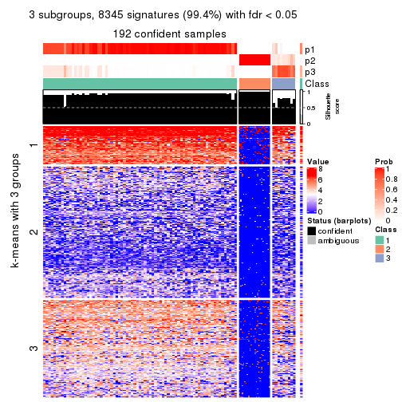</p>

</div>
<div id='tab-SD-mclust-get-signatures-no-scale-3'>
<pre><code class="r">get_signatures(res, k = 4, scale_rows = FALSE)
</code></pre>

<p></p>

</div>
<div id='tab-SD-mclust-get-signatures-no-scale-4'>
<pre><code class="r">get_signatures(res, k = 5, scale_rows = FALSE)
</code></pre>

<p></p>

</div>
<div id='tab-SD-mclust-get-signatures-no-scale-5'>
<pre><code class="r">get_signatures(res, k = 6, scale_rows = FALSE)
</code></pre>

<p></p>

</div>
</div>


Compare the overlap of signatures from different k:

```r
compare_signatures(res)
```


`get_signature()` returns a data frame invisibly. TO get the list of signatures, the function
call should be assigned to a variable explicitly. In following code, if `plot` argument is set
to `FALSE`, no heatmap is plotted while only the differential analysis is performed.

```r
# code only for demonstration
tb = get_signature(res, k = ..., plot = FALSE)
```

An example of the output of `tb` is:

```
#>   which_row         fdr    mean_1    mean_2 scaled_mean_1 scaled_mean_2 km
#> 1        38 0.042760348  8.373488  9.131774    -0.5533452     0.5164555  1
#> 2        40 0.018707592  7.106213  8.469186    -0.6173731     0.5762149  1
#> 3        55 0.019134737 10.221463 11.207825    -0.6159697     0.5749050  1
#> 4        59 0.006059896  5.921854  7.869574    -0.6899429     0.6439467  1
#> 5        60 0.018055526  8.928898 10.211722    -0.6204761     0.5791110  1
#> 6        98 0.009384629 15.714769 14.887706     0.6635654    -0.6193277  2
...
```

The columns in `tb` are:

1. `which_row`: row indices corresponding to the input matrix.
2. `fdr`: FDR for the differential test. 
3. `mean_x`: The mean value in group x.
4. `scaled_mean_x`: The mean value in group x after rows are scaled.
5. `km`: Row groups if k-means clustering is applied to rows.


UMAP plot which shows how samples are separated.


<script>
$( function() {
	$( '#tabs-SD-mclust-dimension-reduction' ).tabs();
} );
</script>
<div id='tabs-SD-mclust-dimension-reduction'>
<ul>
<li><a href='#tab-SD-mclust-dimension-reduction-1'>k = 2</a></li>
<li><a href='#tab-SD-mclust-dimension-reduction-2'>k = 3</a></li>
<li><a href='#tab-SD-mclust-dimension-reduction-3'>k = 4</a></li>
<li><a href='#tab-SD-mclust-dimension-reduction-4'>k = 5</a></li>
<li><a href='#tab-SD-mclust-dimension-reduction-5'>k = 6</a></li>
</ul>
<div id='tab-SD-mclust-dimension-reduction-1'>
<pre><code class="r">dimension_reduction(res, k = 2, method = &quot;UMAP&quot;)
</code></pre>

<p></p>

</div>
<div id='tab-SD-mclust-dimension-reduction-2'>
<pre><code class="r">dimension_reduction(res, k = 3, method = &quot;UMAP&quot;)
</code></pre>

<p></p>

</div>
<div id='tab-SD-mclust-dimension-reduction-3'>
<pre><code class="r">dimension_reduction(res, k = 4, method = &quot;UMAP&quot;)
</code></pre>

<p>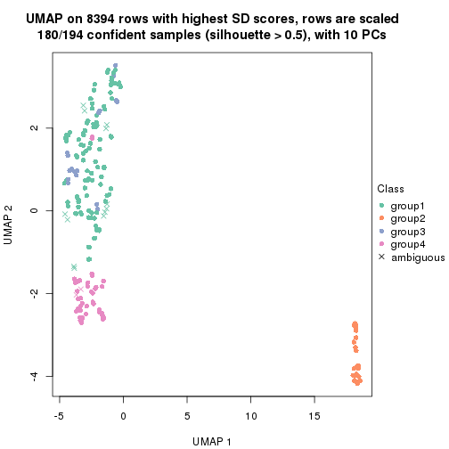</p>

</div>
<div id='tab-SD-mclust-dimension-reduction-4'>
<pre><code class="r">dimension_reduction(res, k = 5, method = &quot;UMAP&quot;)
</code></pre>

<p></p>

</div>
<div id='tab-SD-mclust-dimension-reduction-5'>
<pre><code class="r">dimension_reduction(res, k = 6, method = &quot;UMAP&quot;)
</code></pre>

<p></p>

</div>
</div>


Following heatmap shows how subgroups are split when increasing `k`:

```r
collect_classes(res)
```


If matrix rows can be associated to genes, consider to use `GO_Enrichment(res,
...)` to perform function enrichment for the signature genes.


 

---------------------------------------------------


### SD:NMF**


The object with results only for a single top-value method and a single partition method 
can be extracted as:

```r
res = res_list["SD", "NMF"]
# you can also extract it by
# res = res_list["SD:NMF"]
```

A summary of `res` and all the functions that can be applied to it:

```r
res
```

```
#> A 'ConsensusPartition' object with k = 2, 3, 4, 5, 6.
#>   On a matrix with 8394 rows and 194 columns.
#>   Top rows (839, 1678, 2518, 3358, 4197) are extracted by 'SD' method.
#>   Subgroups are detected by 'NMF' method.
#>   Performed in total 1250 partitions by row resampling.
#>   Best k for subgroups seems to be 2.
#> 
#> Following methods can be applied to this 'ConsensusPartition' object:
#>  [1] "cola_report"             "collect_classes"         "collect_plots"          
#>  [4] "collect_stats"           "colnames"                "compare_signatures"     
#>  [7] "consensus_heatmap"       "dimension_reduction"     "functional_enrichment"  
#> [10] "get_anno_col"            "get_anno"                "get_classes"            
#> [13] "get_consensus"           "get_matrix"              "get_membership"         
#> [16] "get_param"               "get_signatures"          "get_stats"              
#> [19] "is_best_k"               "is_stable_k"             "membership_heatmap"     
#> [22] "ncol"                    "nrow"                    "plot_ecdf"              
#> [25] "rownames"                "select_partition_number" "show"                   
#> [28] "suggest_best_k"          "test_to_known_factors"
```

`collect_plots()` function collects all the plots made from `res` for all `k` (number of partitions)
into one single page to provide an easy and fast comparison between different `k`.

```r
collect_plots(res)
```

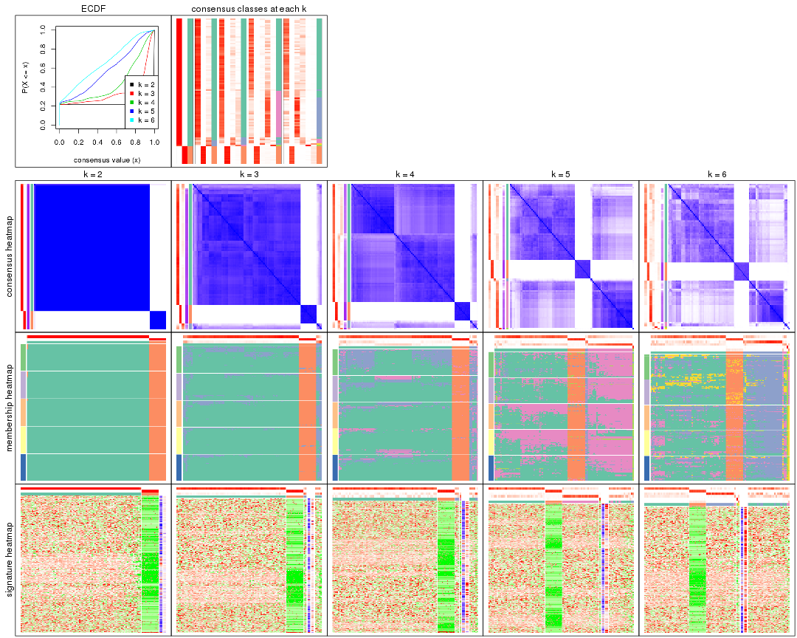

The plots are:

- The first row: a plot of the ECDF (Empirical cumulative distribution
  function) curves of the consensus matrix for each `k` and the heatmap of
  predicted classes for each `k`.
- The second row: heatmaps of the consensus matrix for each `k`.
- The third row: heatmaps of the membership matrix for each `k`.
- The fouth row: heatmaps of the signatures for each `k`.

All the plots in panels can be made by individual functions and they are
plotted later in this section.

`select_partition_number()` produces several plots showing different
statistics for choosing "optimized" `k`. There are following statistics:

- ECDF curves of the consensus matrix for each `k`;
- 1-PAC. [The PAC
  score](https://en.wikipedia.org/wiki/Consensus_clustering#Over-interpretation_potential_of_consensus_clustering)
  measures the proportion of the ambiguous subgrouping.
- Mean silhouette score.
- Concordance. The mean probability of fiting the consensus class ids in all
  partitions.
- Area increased. Denote $A_k$ as the area under the ECDF curve for current
  `k`, the area increased is defined as $A_k - A_{k-1}$.
- Rand index. The percent of pairs of samples that are both in a same cluster
  or both are not in a same cluster in the partition of k and k-1.
- Jaccard index. The ratio of pairs of samples are both in a same cluster in
  the partition of k and k-1 and the pairs of samples are both in a same
  cluster in the partition k or k-1.

The detailed explanations of these statistics can be found in [the cola
vignette](http://bioconductor.org/packages/devel/bioc/vignettes/cola/inst/doc/cola.html#toc_13).

Generally speaking, lower PAC score, higher mean silhouette score or higher
concordance corresponds to better partition. Rand index and Jaccard index
measure how similar the current partition is compared to partition with `k-1`.
If they are too similar, we won't accept `k` is better than `k-1`.

```r
select_partition_number(res)
```


The numeric values for all these statistics can be obtained by `get_stats()`.

```r
get_stats(res)
```

```
#>   k 1-PAC mean_silhouette concordance area_increased  Rand Jaccard
#> 2 2 1.000           0.998       0.999          0.220 0.782   0.782
#> 3 3 0.664           0.846       0.915          0.578 0.931   0.911
#> 4 4 0.390           0.724       0.819          0.275 0.964   0.950
#> 5 5 0.299           0.664       0.730          0.309 0.650   0.507
#> 6 6 0.357           0.548       0.729          0.151 0.891   0.754
```

`suggest_best_k()` suggests the best $k$ based on these statistics. The rules are as follows:

- All $k$ with Jaccard index larger than 0.95 are removed because the increase of
  the partition number does not provides enough extra information. If all $k$ are removed,
  the best $k$ is assigned by `NA`.
- For $k$ with 1-PAC larger than 0.9, the maximal $k$ is taken as the "best k". Other $k$ is called "optional k".
- If it does not fit the second rule. The $k$ with the highest vote of highest
  1-PAC, mean silhouette and concordance is taken as the "best k".

```r
suggest_best_k(res)
```

```
#> [1] 2
```


Following shows the table of the partitions (You need to click the **show/hide
code output** link to see it). The membership matrix (columns with name `p*`)
is inferred by
[`clue::cl_consensus()`](https://www.rdocumentation.org/link/cl_consensus?package=clue)
function with the `SE` method. Basically the value in the membership matrix
represents the probability to belong to a certain group. The finall class
label for an item is determined with the group with highest probability it
belongs to.

In `get_classes()` function, the entropy is calculated from the membership
matrix and the silhouette score is calculated from the consensus matrix.


<script>
$( function() {
	$( '#tabs-SD-NMF-get-classes' ).tabs();
} );
</script>
<div id='tabs-SD-NMF-get-classes'>
<ul>
<li><a href='#tab-SD-NMF-get-classes-1'>k = 2</a></li>
<li><a href='#tab-SD-NMF-get-classes-2'>k = 3</a></li>
<li><a href='#tab-SD-NMF-get-classes-3'>k = 4</a></li>
<li><a href='#tab-SD-NMF-get-classes-4'>k = 5</a></li>
<li><a href='#tab-SD-NMF-get-classes-5'>k = 6</a></li>
</ul>

<div id='tab-SD-NMF-get-classes-1'>
<p><a id='tab-SD-NMF-get-classes-1-a' style='color:#0366d6' href='#'>show/hide code output</a></p>
<pre><code class="r">cbind(get_classes(res, k = 2), get_membership(res, k = 2))
</code></pre>

<pre><code>#&gt;           class entropy silhouette    p1    p2
#&gt; ERR467487     1   0.000      0.999 1.000 0.000
#&gt; ERR467498     1   0.000      0.999 1.000 0.000
#&gt; ERR658998     1   0.000      0.999 1.000 0.000
#&gt; ERR659094     1   0.000      0.999 1.000 0.000
#&gt; ERR658999     1   0.000      0.999 1.000 0.000
#&gt; ERR659095     1   0.000      0.999 1.000 0.000
#&gt; ERR659000     1   0.000      0.999 1.000 0.000
#&gt; ERR659096     1   0.000      0.999 1.000 0.000
#&gt; ERR659001     1   0.000      0.999 1.000 0.000
#&gt; ERR659097     1   0.000      0.999 1.000 0.000
#&gt; ERR659002     1   0.000      0.999 1.000 0.000
#&gt; ERR659098     1   0.000      0.999 1.000 0.000
#&gt; ERR659003     1   0.000      0.999 1.000 0.000
#&gt; ERR659099     1   0.000      0.999 1.000 0.000
#&gt; ERR659004     1   0.000      0.999 1.000 0.000
#&gt; ERR659100     1   0.000      0.999 1.000 0.000
#&gt; ERR659005     1   0.000      0.999 1.000 0.000
#&gt; ERR659101     1   0.000      0.999 1.000 0.000
#&gt; ERR659006     1   0.000      0.999 1.000 0.000
#&gt; ERR659102     1   0.000      0.999 1.000 0.000
#&gt; ERR659007     1   0.000      0.999 1.000 0.000
#&gt; ERR659103     1   0.000      0.999 1.000 0.000
#&gt; ERR659008     2   0.000      1.000 0.000 1.000
#&gt; ERR659104     2   0.000      1.000 0.000 1.000
#&gt; ERR659009     1   0.000      0.999 1.000 0.000
#&gt; ERR659105     1   0.000      0.999 1.000 0.000
#&gt; ERR659010     1   0.000      0.999 1.000 0.000
#&gt; ERR659106     1   0.000      0.999 1.000 0.000
#&gt; ERR659011     1   0.000      0.999 1.000 0.000
#&gt; ERR659107     1   0.000      0.999 1.000 0.000
#&gt; ERR659012     1   0.000      0.999 1.000 0.000
#&gt; ERR659108     1   0.000      0.999 1.000 0.000
#&gt; ERR659013     1   0.000      0.999 1.000 0.000
#&gt; ERR659109     1   0.000      0.999 1.000 0.000
#&gt; ERR659014     2   0.000      1.000 0.000 1.000
#&gt; ERR659110     2   0.000      1.000 0.000 1.000
#&gt; ERR659015     1   0.000      0.999 1.000 0.000
#&gt; ERR659111     1   0.000      0.999 1.000 0.000
#&gt; ERR659016     1   0.000      0.999 1.000 0.000
#&gt; ERR659112     1   0.000      0.999 1.000 0.000
#&gt; ERR659017     2   0.000      1.000 0.000 1.000
#&gt; ERR659113     2   0.000      1.000 0.000 1.000
#&gt; ERR659018     1   0.000      0.999 1.000 0.000
#&gt; ERR659114     1   0.000      0.999 1.000 0.000
#&gt; ERR659019     1   0.000      0.999 1.000 0.000
#&gt; ERR659115     1   0.000      0.999 1.000 0.000
#&gt; ERR659020     1   0.000      0.999 1.000 0.000
#&gt; ERR659116     1   0.000      0.999 1.000 0.000
#&gt; ERR659021     1   0.000      0.999 1.000 0.000
#&gt; ERR659117     1   0.000      0.999 1.000 0.000
#&gt; ERR659022     1   0.000      0.999 1.000 0.000
#&gt; ERR659118     1   0.000      0.999 1.000 0.000
#&gt; ERR659023     1   0.000      0.999 1.000 0.000
#&gt; ERR659119     1   0.000      0.999 1.000 0.000
#&gt; ERR659024     1   0.000      0.999 1.000 0.000
#&gt; ERR659120     1   0.000      0.999 1.000 0.000
#&gt; ERR659025     1   0.000      0.999 1.000 0.000
#&gt; ERR659121     1   0.000      0.999 1.000 0.000
#&gt; ERR659026     1   0.000      0.999 1.000 0.000
#&gt; ERR659122     1   0.000      0.999 1.000 0.000
#&gt; ERR659027     1   0.000      0.999 1.000 0.000
#&gt; ERR659123     1   0.000      0.999 1.000 0.000
#&gt; ERR659028     1   0.000      0.999 1.000 0.000
#&gt; ERR659124     1   0.000      0.999 1.000 0.000
#&gt; ERR659029     1   0.000      0.999 1.000 0.000
#&gt; ERR659125     1   0.000      0.999 1.000 0.000
#&gt; ERR659030     1   0.000      0.999 1.000 0.000
#&gt; ERR659126     1   0.000      0.999 1.000 0.000
#&gt; ERR659031     1   0.000      0.999 1.000 0.000
#&gt; ERR659127     1   0.000      0.999 1.000 0.000
#&gt; ERR659032     1   0.000      0.999 1.000 0.000
#&gt; ERR659128     1   0.000      0.999 1.000 0.000
#&gt; ERR659033     1   0.000      0.999 1.000 0.000
#&gt; ERR659129     1   0.000      0.999 1.000 0.000
#&gt; ERR659034     2   0.000      1.000 0.000 1.000
#&gt; ERR659130     2   0.000      1.000 0.000 1.000
#&gt; ERR659035     1   0.000      0.999 1.000 0.000
#&gt; ERR659131     1   0.000      0.999 1.000 0.000
#&gt; ERR659036     1   0.000      0.999 1.000 0.000
#&gt; ERR659132     1   0.000      0.999 1.000 0.000
#&gt; ERR659037     1   0.000      0.999 1.000 0.000
#&gt; ERR659133     1   0.000      0.999 1.000 0.000
#&gt; ERR659038     1   0.000      0.999 1.000 0.000
#&gt; ERR659134     1   0.000      0.999 1.000 0.000
#&gt; ERR659039     1   0.000      0.999 1.000 0.000
#&gt; ERR659135     1   0.000      0.999 1.000 0.000
#&gt; ERR659040     1   0.000      0.999 1.000 0.000
#&gt; ERR659136     1   0.000      0.999 1.000 0.000
#&gt; ERR659041     1   0.000      0.999 1.000 0.000
#&gt; ERR659137     1   0.000      0.999 1.000 0.000
#&gt; ERR659042     1   0.000      0.999 1.000 0.000
#&gt; ERR659138     1   0.000      0.999 1.000 0.000
#&gt; ERR659043     1   0.000      0.999 1.000 0.000
#&gt; ERR659139     1   0.000      0.999 1.000 0.000
#&gt; ERR659044     2   0.000      1.000 0.000 1.000
#&gt; ERR659140     2   0.000      1.000 0.000 1.000
#&gt; ERR659045     1   0.000      0.999 1.000 0.000
#&gt; ERR659141     1   0.000      0.999 1.000 0.000
#&gt; ERR659046     1   0.000      0.999 1.000 0.000
#&gt; ERR659142     1   0.000      0.999 1.000 0.000
#&gt; ERR659047     1   0.000      0.999 1.000 0.000
#&gt; ERR659143     1   0.000      0.999 1.000 0.000
#&gt; ERR659048     1   0.000      0.999 1.000 0.000
#&gt; ERR659144     1   0.000      0.999 1.000 0.000
#&gt; ERR659049     1   0.000      0.999 1.000 0.000
#&gt; ERR659145     1   0.000      0.999 1.000 0.000
#&gt; ERR659050     1   0.000      0.999 1.000 0.000
#&gt; ERR659146     1   0.000      0.999 1.000 0.000
#&gt; ERR659051     1   0.000      0.999 1.000 0.000
#&gt; ERR659147     1   0.000      0.999 1.000 0.000
#&gt; ERR659052     1   0.000      0.999 1.000 0.000
#&gt; ERR659148     1   0.000      0.999 1.000 0.000
#&gt; ERR659053     1   0.000      0.999 1.000 0.000
#&gt; ERR659149     1   0.000      0.999 1.000 0.000
#&gt; ERR659054     2   0.000      1.000 0.000 1.000
#&gt; ERR659150     2   0.000      1.000 0.000 1.000
#&gt; ERR659055     1   0.000      0.999 1.000 0.000
#&gt; ERR659151     1   0.000      0.999 1.000 0.000
#&gt; ERR659056     1   0.000      0.999 1.000 0.000
#&gt; ERR659152     1   0.000      0.999 1.000 0.000
#&gt; ERR659057     1   0.000      0.999 1.000 0.000
#&gt; ERR659153     1   0.000      0.999 1.000 0.000
#&gt; ERR659058     1   0.000      0.999 1.000 0.000
#&gt; ERR659154     1   0.000      0.999 1.000 0.000
#&gt; ERR659059     1   0.000      0.999 1.000 0.000
#&gt; ERR659155     1   0.000      0.999 1.000 0.000
#&gt; ERR659060     1   0.000      0.999 1.000 0.000
#&gt; ERR659156     1   0.000      0.999 1.000 0.000
#&gt; ERR659061     1   0.000      0.999 1.000 0.000
#&gt; ERR659157     1   0.000      0.999 1.000 0.000
#&gt; ERR659062     1   0.000      0.999 1.000 0.000
#&gt; ERR659158     1   0.000      0.999 1.000 0.000
#&gt; ERR659063     1   0.000      0.999 1.000 0.000
#&gt; ERR659159     1   0.000      0.999 1.000 0.000
#&gt; ERR659064     1   0.000      0.999 1.000 0.000
#&gt; ERR659160     1   0.000      0.999 1.000 0.000
#&gt; ERR659065     2   0.000      1.000 0.000 1.000
#&gt; ERR659161     2   0.000      1.000 0.000 1.000
#&gt; ERR659066     1   0.000      0.999 1.000 0.000
#&gt; ERR659162     1   0.000      0.999 1.000 0.000
#&gt; ERR659067     1   0.000      0.999 1.000 0.000
#&gt; ERR659163     1   0.000      0.999 1.000 0.000
#&gt; ERR659068     2   0.000      1.000 0.000 1.000
#&gt; ERR659164     2   0.000      1.000 0.000 1.000
#&gt; ERR659069     1   0.000      0.999 1.000 0.000
#&gt; ERR659165     1   0.000      0.999 1.000 0.000
#&gt; ERR659070     1   0.000      0.999 1.000 0.000
#&gt; ERR659166     1   0.000      0.999 1.000 0.000
#&gt; ERR659071     1   0.000      0.999 1.000 0.000
#&gt; ERR659167     1   0.000      0.999 1.000 0.000
#&gt; ERR659072     1   0.000      0.999 1.000 0.000
#&gt; ERR659168     1   0.000      0.999 1.000 0.000
#&gt; ERR659073     1   0.000      0.999 1.000 0.000
#&gt; ERR659169     1   0.000      0.999 1.000 0.000
#&gt; ERR659074     2   0.000      1.000 0.000 1.000
#&gt; ERR659170     2   0.000      1.000 0.000 1.000
#&gt; ERR659075     1   0.443      0.899 0.908 0.092
#&gt; ERR659171     1   0.469      0.890 0.900 0.100
#&gt; ERR659076     2   0.000      1.000 0.000 1.000
#&gt; ERR659172     2   0.000      1.000 0.000 1.000
#&gt; ERR659077     1   0.000      0.999 1.000 0.000
#&gt; ERR659173     1   0.000      0.999 1.000 0.000
#&gt; ERR659078     1   0.000      0.999 1.000 0.000
#&gt; ERR659174     1   0.000      0.999 1.000 0.000
#&gt; ERR659079     1   0.000      0.999 1.000 0.000
#&gt; ERR659175     1   0.000      0.999 1.000 0.000
#&gt; ERR659080     1   0.000      0.999 1.000 0.000
#&gt; ERR659176     1   0.000      0.999 1.000 0.000
#&gt; ERR659081     1   0.000      0.999 1.000 0.000
#&gt; ERR659177     1   0.000      0.999 1.000 0.000
#&gt; ERR659082     1   0.000      0.999 1.000 0.000
#&gt; ERR659178     1   0.000      0.999 1.000 0.000
#&gt; ERR659083     2   0.000      1.000 0.000 1.000
#&gt; ERR659179     2   0.000      1.000 0.000 1.000
#&gt; ERR659084     2   0.000      1.000 0.000 1.000
#&gt; ERR659180     2   0.000      1.000 0.000 1.000
#&gt; ERR659085     1   0.000      0.999 1.000 0.000
#&gt; ERR659181     1   0.000      0.999 1.000 0.000
#&gt; ERR659086     1   0.000      0.999 1.000 0.000
#&gt; ERR659182     1   0.000      0.999 1.000 0.000
#&gt; ERR659087     1   0.000      0.999 1.000 0.000
#&gt; ERR659183     1   0.000      0.999 1.000 0.000
#&gt; ERR659088     1   0.000      0.999 1.000 0.000
#&gt; ERR659184     1   0.000      0.999 1.000 0.000
#&gt; ERR659089     1   0.000      0.999 1.000 0.000
#&gt; ERR659185     1   0.000      0.999 1.000 0.000
#&gt; ERR659090     1   0.000      0.999 1.000 0.000
#&gt; ERR659186     1   0.000      0.999 1.000 0.000
#&gt; ERR659091     1   0.000      0.999 1.000 0.000
#&gt; ERR659187     1   0.000      0.999 1.000 0.000
#&gt; ERR659092     1   0.000      0.999 1.000 0.000
#&gt; ERR659188     1   0.000      0.999 1.000 0.000
#&gt; ERR659093     1   0.000      0.999 1.000 0.000
#&gt; ERR659189     1   0.000      0.999 1.000 0.000
</code></pre>

<script>
$('#tab-SD-NMF-get-classes-1-a').parent().next().next().hide();
$('#tab-SD-NMF-get-classes-1-a').click(function(){
  $('#tab-SD-NMF-get-classes-1-a').parent().next().next().toggle();
  return(false);
});
</script>
</div>

<div id='tab-SD-NMF-get-classes-2'>
<p><a id='tab-SD-NMF-get-classes-2-a' style='color:#0366d6' href='#'>show/hide code output</a></p>
<pre><code class="r">cbind(get_classes(res, k = 3), get_membership(res, k = 3))
</code></pre>

<pre><code>#&gt;           class entropy silhouette    p1    p2    p3
#&gt; ERR467487     1  0.6045    -0.0443 0.620 0.000 0.380
#&gt; ERR467498     1  0.6095    -0.1135 0.608 0.000 0.392
#&gt; ERR658998     1  0.0592     0.9036 0.988 0.000 0.012
#&gt; ERR659094     1  0.0592     0.9036 0.988 0.000 0.012
#&gt; ERR658999     1  0.2959     0.8788 0.900 0.000 0.100
#&gt; ERR659095     1  0.2878     0.8812 0.904 0.000 0.096
#&gt; ERR659000     1  0.4062     0.7425 0.836 0.000 0.164
#&gt; ERR659096     1  0.4062     0.7423 0.836 0.000 0.164
#&gt; ERR659001     1  0.1753     0.9009 0.952 0.000 0.048
#&gt; ERR659097     1  0.1643     0.9017 0.956 0.000 0.044
#&gt; ERR659002     1  0.0237     0.9030 0.996 0.000 0.004
#&gt; ERR659098     1  0.0424     0.9010 0.992 0.000 0.008
#&gt; ERR659003     1  0.1411     0.9028 0.964 0.000 0.036
#&gt; ERR659099     1  0.1529     0.9007 0.960 0.000 0.040
#&gt; ERR659004     1  0.2066     0.8934 0.940 0.000 0.060
#&gt; ERR659100     1  0.2066     0.8934 0.940 0.000 0.060
#&gt; ERR659005     1  0.2165     0.8801 0.936 0.000 0.064
#&gt; ERR659101     1  0.2066     0.8849 0.940 0.000 0.060
#&gt; ERR659006     1  0.2066     0.8967 0.940 0.000 0.060
#&gt; ERR659102     1  0.2165     0.8949 0.936 0.000 0.064
#&gt; ERR659007     1  0.1289     0.9010 0.968 0.000 0.032
#&gt; ERR659103     1  0.0892     0.8981 0.980 0.000 0.020
#&gt; ERR659008     2  0.0237     0.9931 0.000 0.996 0.004
#&gt; ERR659104     2  0.0592     0.9926 0.000 0.988 0.012
#&gt; ERR659009     1  0.2066     0.8941 0.940 0.000 0.060
#&gt; ERR659105     1  0.2066     0.8950 0.940 0.000 0.060
#&gt; ERR659010     1  0.2448     0.8915 0.924 0.000 0.076
#&gt; ERR659106     1  0.2537     0.8901 0.920 0.000 0.080
#&gt; ERR659011     1  0.2261     0.8948 0.932 0.000 0.068
#&gt; ERR659107     1  0.2261     0.8948 0.932 0.000 0.068
#&gt; ERR659012     1  0.2625     0.8901 0.916 0.000 0.084
#&gt; ERR659108     1  0.2625     0.8901 0.916 0.000 0.084
#&gt; ERR659013     1  0.4235     0.7297 0.824 0.000 0.176
#&gt; ERR659109     1  0.3941     0.7689 0.844 0.000 0.156
#&gt; ERR659014     2  0.0747     0.9926 0.000 0.984 0.016
#&gt; ERR659110     2  0.0892     0.9933 0.000 0.980 0.020
#&gt; ERR659015     1  0.1964     0.9004 0.944 0.000 0.056
#&gt; ERR659111     1  0.1964     0.9004 0.944 0.000 0.056
#&gt; ERR659016     1  0.6280    -0.4545 0.540 0.000 0.460
#&gt; ERR659112     1  0.6280    -0.4516 0.540 0.000 0.460
#&gt; ERR659017     2  0.0592     0.9932 0.000 0.988 0.012
#&gt; ERR659113     2  0.0424     0.9929 0.000 0.992 0.008
#&gt; ERR659018     1  0.2711     0.8862 0.912 0.000 0.088
#&gt; ERR659114     1  0.2711     0.8862 0.912 0.000 0.088
#&gt; ERR659019     1  0.2796     0.8866 0.908 0.000 0.092
#&gt; ERR659115     1  0.2959     0.8825 0.900 0.000 0.100
#&gt; ERR659020     1  0.2537     0.8918 0.920 0.000 0.080
#&gt; ERR659116     1  0.2448     0.8935 0.924 0.000 0.076
#&gt; ERR659021     1  0.1643     0.8940 0.956 0.000 0.044
#&gt; ERR659117     1  0.1411     0.8974 0.964 0.000 0.036
#&gt; ERR659022     1  0.1643     0.9003 0.956 0.000 0.044
#&gt; ERR659118     1  0.1529     0.8994 0.960 0.000 0.040
#&gt; ERR659023     1  0.1643     0.9016 0.956 0.000 0.044
#&gt; ERR659119     1  0.1860     0.8949 0.948 0.000 0.052
#&gt; ERR659024     1  0.1163     0.8989 0.972 0.000 0.028
#&gt; ERR659120     1  0.1163     0.8989 0.972 0.000 0.028
#&gt; ERR659025     1  0.2356     0.8732 0.928 0.000 0.072
#&gt; ERR659121     1  0.2356     0.8732 0.928 0.000 0.072
#&gt; ERR659026     1  0.2165     0.8977 0.936 0.000 0.064
#&gt; ERR659122     1  0.2261     0.8959 0.932 0.000 0.068
#&gt; ERR659027     1  0.5178     0.5994 0.744 0.000 0.256
#&gt; ERR659123     1  0.5058     0.6328 0.756 0.000 0.244
#&gt; ERR659028     1  0.2796     0.8904 0.908 0.000 0.092
#&gt; ERR659124     1  0.2796     0.8904 0.908 0.000 0.092
#&gt; ERR659029     1  0.3192     0.8736 0.888 0.000 0.112
#&gt; ERR659125     1  0.3116     0.8749 0.892 0.000 0.108
#&gt; ERR659030     1  0.3267     0.8590 0.884 0.000 0.116
#&gt; ERR659126     1  0.3267     0.8590 0.884 0.000 0.116
#&gt; ERR659031     1  0.1860     0.8927 0.948 0.000 0.052
#&gt; ERR659127     1  0.1860     0.8936 0.948 0.000 0.052
#&gt; ERR659032     1  0.2711     0.8891 0.912 0.000 0.088
#&gt; ERR659128     1  0.2711     0.8865 0.912 0.000 0.088
#&gt; ERR659033     1  0.1289     0.9065 0.968 0.000 0.032
#&gt; ERR659129     1  0.1289     0.9065 0.968 0.000 0.032
#&gt; ERR659034     2  0.0892     0.9926 0.000 0.980 0.020
#&gt; ERR659130     2  0.0892     0.9915 0.000 0.980 0.020
#&gt; ERR659035     1  0.1529     0.8954 0.960 0.000 0.040
#&gt; ERR659131     1  0.1643     0.8948 0.956 0.000 0.044
#&gt; ERR659036     1  0.3038     0.8710 0.896 0.000 0.104
#&gt; ERR659132     1  0.2878     0.8784 0.904 0.000 0.096
#&gt; ERR659037     1  0.1753     0.8967 0.952 0.000 0.048
#&gt; ERR659133     1  0.1643     0.8962 0.956 0.000 0.044
#&gt; ERR659038     1  0.3412     0.8598 0.876 0.000 0.124
#&gt; ERR659134     1  0.3340     0.8637 0.880 0.000 0.120
#&gt; ERR659039     1  0.2537     0.8895 0.920 0.000 0.080
#&gt; ERR659135     1  0.2356     0.8936 0.928 0.000 0.072
#&gt; ERR659040     1  0.2711     0.8818 0.912 0.000 0.088
#&gt; ERR659136     1  0.2711     0.8812 0.912 0.000 0.088
#&gt; ERR659041     1  0.2711     0.8995 0.912 0.000 0.088
#&gt; ERR659137     1  0.2448     0.9043 0.924 0.000 0.076
#&gt; ERR659042     1  0.3482     0.8205 0.872 0.000 0.128
#&gt; ERR659138     1  0.3551     0.8191 0.868 0.000 0.132
#&gt; ERR659043     1  0.3192     0.8639 0.888 0.000 0.112
#&gt; ERR659139     1  0.3116     0.8677 0.892 0.000 0.108
#&gt; ERR659044     2  0.0592     0.9926 0.000 0.988 0.012
#&gt; ERR659140     2  0.1031     0.9925 0.000 0.976 0.024
#&gt; ERR659045     1  0.2711     0.8863 0.912 0.000 0.088
#&gt; ERR659141     1  0.2796     0.8841 0.908 0.000 0.092
#&gt; ERR659046     1  0.1860     0.9026 0.948 0.000 0.052
#&gt; ERR659142     1  0.1753     0.9034 0.952 0.000 0.048
#&gt; ERR659047     1  0.2356     0.8905 0.928 0.000 0.072
#&gt; ERR659143     1  0.2261     0.8920 0.932 0.000 0.068
#&gt; ERR659048     1  0.2066     0.8974 0.940 0.000 0.060
#&gt; ERR659144     1  0.1964     0.8988 0.944 0.000 0.056
#&gt; ERR659049     1  0.1753     0.8988 0.952 0.000 0.048
#&gt; ERR659145     1  0.1753     0.8988 0.952 0.000 0.048
#&gt; ERR659050     1  0.1964     0.8983 0.944 0.000 0.056
#&gt; ERR659146     1  0.2066     0.8966 0.940 0.000 0.060
#&gt; ERR659051     3  0.6267     0.5987 0.452 0.000 0.548
#&gt; ERR659147     3  0.6267     0.5987 0.452 0.000 0.548
#&gt; ERR659052     1  0.2261     0.8956 0.932 0.000 0.068
#&gt; ERR659148     1  0.2448     0.8935 0.924 0.000 0.076
#&gt; ERR659053     1  0.1753     0.8995 0.952 0.000 0.048
#&gt; ERR659149     1  0.1964     0.8994 0.944 0.000 0.056
#&gt; ERR659054     2  0.0747     0.9924 0.000 0.984 0.016
#&gt; ERR659150     2  0.0424     0.9934 0.000 0.992 0.008
#&gt; ERR659055     1  0.3038     0.8728 0.896 0.000 0.104
#&gt; ERR659151     1  0.3038     0.8728 0.896 0.000 0.104
#&gt; ERR659056     3  0.5098     0.6539 0.248 0.000 0.752
#&gt; ERR659152     3  0.5016     0.6478 0.240 0.000 0.760
#&gt; ERR659057     1  0.0892     0.9043 0.980 0.000 0.020
#&gt; ERR659153     1  0.0747     0.9028 0.984 0.000 0.016
#&gt; ERR659058     1  0.3038     0.8760 0.896 0.000 0.104
#&gt; ERR659154     1  0.3038     0.8760 0.896 0.000 0.104
#&gt; ERR659059     1  0.0592     0.9034 0.988 0.000 0.012
#&gt; ERR659155     1  0.0592     0.9034 0.988 0.000 0.012
#&gt; ERR659060     1  0.2066     0.8844 0.940 0.000 0.060
#&gt; ERR659156     1  0.2066     0.8844 0.940 0.000 0.060
#&gt; ERR659061     1  0.2356     0.8812 0.928 0.000 0.072
#&gt; ERR659157     1  0.2448     0.8771 0.924 0.000 0.076
#&gt; ERR659062     1  0.1411     0.9017 0.964 0.000 0.036
#&gt; ERR659158     1  0.1411     0.9017 0.964 0.000 0.036
#&gt; ERR659063     1  0.1289     0.9007 0.968 0.000 0.032
#&gt; ERR659159     1  0.1289     0.9007 0.968 0.000 0.032
#&gt; ERR659064     1  0.3116     0.8713 0.892 0.000 0.108
#&gt; ERR659160     1  0.3192     0.8733 0.888 0.000 0.112
#&gt; ERR659065     2  0.0592     0.9922 0.000 0.988 0.012
#&gt; ERR659161     2  0.0747     0.9927 0.000 0.984 0.016
#&gt; ERR659066     1  0.2165     0.8970 0.936 0.000 0.064
#&gt; ERR659162     1  0.2165     0.8970 0.936 0.000 0.064
#&gt; ERR659067     1  0.2711     0.8862 0.912 0.000 0.088
#&gt; ERR659163     1  0.2711     0.8862 0.912 0.000 0.088
#&gt; ERR659068     2  0.0747     0.9922 0.000 0.984 0.016
#&gt; ERR659164     2  0.0424     0.9925 0.000 0.992 0.008
#&gt; ERR659069     1  0.3482     0.8569 0.872 0.000 0.128
#&gt; ERR659165     1  0.3482     0.8569 0.872 0.000 0.128
#&gt; ERR659070     1  0.1289     0.8960 0.968 0.000 0.032
#&gt; ERR659166     1  0.1411     0.8963 0.964 0.000 0.036
#&gt; ERR659071     1  0.1643     0.8951 0.956 0.000 0.044
#&gt; ERR659167     1  0.1753     0.8933 0.952 0.000 0.048
#&gt; ERR659072     1  0.2448     0.8925 0.924 0.000 0.076
#&gt; ERR659168     1  0.2261     0.8942 0.932 0.000 0.068
#&gt; ERR659073     1  0.1753     0.8934 0.952 0.000 0.048
#&gt; ERR659169     1  0.1753     0.8934 0.952 0.000 0.048
#&gt; ERR659074     2  0.1031     0.9925 0.000 0.976 0.024
#&gt; ERR659170     2  0.0747     0.9930 0.000 0.984 0.016
#&gt; ERR659075     3  0.4007     0.4047 0.084 0.036 0.880
#&gt; ERR659171     3  0.4007     0.4047 0.084 0.036 0.880
#&gt; ERR659076     2  0.0747     0.9920 0.000 0.984 0.016
#&gt; ERR659172     2  0.0592     0.9928 0.000 0.988 0.012
#&gt; ERR659077     1  0.1964     0.8863 0.944 0.000 0.056
#&gt; ERR659173     1  0.1964     0.8863 0.944 0.000 0.056
#&gt; ERR659078     1  0.1031     0.9049 0.976 0.000 0.024
#&gt; ERR659174     1  0.1031     0.9033 0.976 0.000 0.024
#&gt; ERR659079     1  0.1643     0.8919 0.956 0.000 0.044
#&gt; ERR659175     1  0.1753     0.8905 0.952 0.000 0.048
#&gt; ERR659080     3  0.6309     0.4849 0.496 0.000 0.504
#&gt; ERR659176     3  0.6309     0.4769 0.500 0.000 0.500
#&gt; ERR659081     1  0.2796     0.8834 0.908 0.000 0.092
#&gt; ERR659177     1  0.2796     0.8834 0.908 0.000 0.092
#&gt; ERR659082     1  0.3267     0.8704 0.884 0.000 0.116
#&gt; ERR659178     1  0.3340     0.8664 0.880 0.000 0.120
#&gt; ERR659083     2  0.1031     0.9925 0.000 0.976 0.024
#&gt; ERR659179     2  0.0892     0.9926 0.000 0.980 0.020
#&gt; ERR659084     2  0.0747     0.9919 0.000 0.984 0.016
#&gt; ERR659180     2  0.0424     0.9932 0.000 0.992 0.008
#&gt; ERR659085     1  0.1860     0.9021 0.948 0.000 0.052
#&gt; ERR659181     1  0.1860     0.9021 0.948 0.000 0.052
#&gt; ERR659086     1  0.1031     0.9016 0.976 0.000 0.024
#&gt; ERR659182     1  0.1289     0.9004 0.968 0.000 0.032
#&gt; ERR659087     1  0.1753     0.8950 0.952 0.000 0.048
#&gt; ERR659183     1  0.1753     0.8950 0.952 0.000 0.048
#&gt; ERR659088     1  0.6309    -0.3238 0.504 0.000 0.496
#&gt; ERR659184     1  0.6286    -0.1904 0.536 0.000 0.464
#&gt; ERR659089     1  0.2165     0.8882 0.936 0.000 0.064
#&gt; ERR659185     1  0.2261     0.8848 0.932 0.000 0.068
#&gt; ERR659090     1  0.1031     0.9000 0.976 0.000 0.024
#&gt; ERR659186     1  0.1031     0.9000 0.976 0.000 0.024
#&gt; ERR659091     1  0.2066     0.8975 0.940 0.000 0.060
#&gt; ERR659187     1  0.1964     0.8972 0.944 0.000 0.056
#&gt; ERR659092     1  0.1753     0.9002 0.952 0.000 0.048
#&gt; ERR659188     1  0.1753     0.9030 0.952 0.000 0.048
#&gt; ERR659093     1  0.2711     0.8887 0.912 0.000 0.088
#&gt; ERR659189     1  0.2711     0.8887 0.912 0.000 0.088
</code></pre>

<script>
$('#tab-SD-NMF-get-classes-2-a').parent().next().next().hide();
$('#tab-SD-NMF-get-classes-2-a').click(function(){
  $('#tab-SD-NMF-get-classes-2-a').parent().next().next().toggle();
  return(false);
});
</script>
</div>

<div id='tab-SD-NMF-get-classes-3'>
<p><a id='tab-SD-NMF-get-classes-3-a' style='color:#0366d6' href='#'>show/hide code output</a></p>
<pre><code class="r">cbind(get_classes(res, k = 4), get_membership(res, k = 4))
</code></pre>

<pre><code>#&gt;           class entropy silhouette    p1    p2    p3    p4
#&gt; ERR467487     3  0.6248      0.372 0.212 0.000 0.660 0.128
#&gt; ERR467498     3  0.6248      0.372 0.212 0.000 0.660 0.128
#&gt; ERR658998     1  0.2949      0.773 0.888 0.000 0.024 0.088
#&gt; ERR659094     1  0.2882      0.773 0.892 0.000 0.024 0.084
#&gt; ERR658999     1  0.4088      0.696 0.764 0.000 0.004 0.232
#&gt; ERR659095     1  0.3942      0.696 0.764 0.000 0.000 0.236
#&gt; ERR659000     1  0.4936      0.192 0.624 0.000 0.372 0.004
#&gt; ERR659096     1  0.4950      0.183 0.620 0.000 0.376 0.004
#&gt; ERR659001     1  0.3991      0.727 0.808 0.000 0.020 0.172
#&gt; ERR659097     1  0.3806      0.736 0.824 0.000 0.020 0.156
#&gt; ERR659002     1  0.1635      0.778 0.948 0.000 0.044 0.008
#&gt; ERR659098     1  0.1722      0.778 0.944 0.000 0.048 0.008
#&gt; ERR659003     1  0.3156      0.781 0.884 0.000 0.068 0.048
#&gt; ERR659099     1  0.3301      0.779 0.876 0.000 0.076 0.048
#&gt; ERR659004     1  0.4741      0.677 0.744 0.000 0.028 0.228
#&gt; ERR659100     1  0.4741      0.677 0.744 0.000 0.028 0.228
#&gt; ERR659005     1  0.3569      0.664 0.804 0.000 0.196 0.000
#&gt; ERR659101     1  0.3528      0.670 0.808 0.000 0.192 0.000
#&gt; ERR659006     1  0.4399      0.694 0.760 0.000 0.016 0.224
#&gt; ERR659102     1  0.4399      0.694 0.760 0.000 0.016 0.224
#&gt; ERR659007     1  0.1867      0.762 0.928 0.000 0.072 0.000
#&gt; ERR659103     1  0.1557      0.770 0.944 0.000 0.056 0.000
#&gt; ERR659008     2  0.0779      0.983 0.000 0.980 0.004 0.016
#&gt; ERR659104     2  0.0524      0.985 0.000 0.988 0.008 0.004
#&gt; ERR659009     1  0.4327      0.697 0.768 0.000 0.016 0.216
#&gt; ERR659105     1  0.4290      0.700 0.772 0.000 0.016 0.212
#&gt; ERR659010     1  0.3873      0.701 0.772 0.000 0.000 0.228
#&gt; ERR659106     1  0.3873      0.701 0.772 0.000 0.000 0.228
#&gt; ERR659011     1  0.4123      0.699 0.772 0.000 0.008 0.220
#&gt; ERR659107     1  0.4123      0.699 0.772 0.000 0.008 0.220
#&gt; ERR659012     1  0.4122      0.690 0.760 0.000 0.004 0.236
#&gt; ERR659108     1  0.4122      0.690 0.760 0.000 0.004 0.236
#&gt; ERR659013     1  0.5328      0.520 0.704 0.000 0.248 0.048
#&gt; ERR659109     1  0.5213      0.560 0.724 0.000 0.224 0.052
#&gt; ERR659014     2  0.0779      0.985 0.000 0.980 0.004 0.016
#&gt; ERR659110     2  0.1004      0.984 0.000 0.972 0.004 0.024
#&gt; ERR659015     1  0.1929      0.779 0.940 0.000 0.036 0.024
#&gt; ERR659111     1  0.2021      0.780 0.936 0.000 0.040 0.024
#&gt; ERR659016     3  0.5865      0.558 0.412 0.000 0.552 0.036
#&gt; ERR659112     3  0.5847      0.575 0.404 0.000 0.560 0.036
#&gt; ERR659017     2  0.1151      0.983 0.000 0.968 0.008 0.024
#&gt; ERR659113     2  0.1174      0.983 0.000 0.968 0.012 0.020
#&gt; ERR659018     1  0.2888      0.758 0.872 0.000 0.004 0.124
#&gt; ERR659114     1  0.2469      0.764 0.892 0.000 0.000 0.108
#&gt; ERR659019     1  0.4123      0.700 0.772 0.000 0.008 0.220
#&gt; ERR659115     1  0.4086      0.705 0.776 0.000 0.008 0.216
#&gt; ERR659020     1  0.3681      0.730 0.816 0.000 0.008 0.176
#&gt; ERR659116     1  0.3681      0.730 0.816 0.000 0.008 0.176
#&gt; ERR659021     1  0.2760      0.728 0.872 0.000 0.128 0.000
#&gt; ERR659117     1  0.2760      0.728 0.872 0.000 0.128 0.000
#&gt; ERR659022     1  0.2928      0.761 0.880 0.000 0.108 0.012
#&gt; ERR659118     1  0.2867      0.763 0.884 0.000 0.104 0.012
#&gt; ERR659023     1  0.2714      0.746 0.884 0.000 0.112 0.004
#&gt; ERR659119     1  0.2888      0.736 0.872 0.000 0.124 0.004
#&gt; ERR659024     1  0.2563      0.775 0.908 0.000 0.072 0.020
#&gt; ERR659120     1  0.2563      0.775 0.908 0.000 0.072 0.020
#&gt; ERR659025     1  0.3908      0.633 0.784 0.000 0.212 0.004
#&gt; ERR659121     1  0.3945      0.626 0.780 0.000 0.216 0.004
#&gt; ERR659026     1  0.2918      0.760 0.876 0.000 0.008 0.116
#&gt; ERR659122     1  0.2976      0.759 0.872 0.000 0.008 0.120
#&gt; ERR659027     1  0.6301      0.312 0.636 0.000 0.260 0.104
#&gt; ERR659123     1  0.6084      0.369 0.660 0.000 0.244 0.096
#&gt; ERR659028     1  0.2413      0.775 0.916 0.000 0.064 0.020
#&gt; ERR659124     1  0.2300      0.772 0.920 0.000 0.064 0.016
#&gt; ERR659029     1  0.2741      0.753 0.892 0.000 0.096 0.012
#&gt; ERR659125     1  0.2676      0.756 0.896 0.000 0.092 0.012
#&gt; ERR659030     1  0.2706      0.771 0.900 0.000 0.020 0.080
#&gt; ERR659126     1  0.2623      0.774 0.908 0.000 0.028 0.064
#&gt; ERR659031     1  0.4410      0.745 0.808 0.000 0.064 0.128
#&gt; ERR659127     1  0.4388      0.744 0.808 0.000 0.060 0.132
#&gt; ERR659032     1  0.3105      0.751 0.868 0.000 0.120 0.012
#&gt; ERR659128     1  0.3335      0.747 0.856 0.000 0.128 0.016
#&gt; ERR659033     1  0.1936      0.779 0.940 0.000 0.028 0.032
#&gt; ERR659129     1  0.2131      0.779 0.932 0.000 0.032 0.036
#&gt; ERR659034     2  0.0817      0.983 0.000 0.976 0.000 0.024
#&gt; ERR659130     2  0.1004      0.983 0.000 0.972 0.004 0.024
#&gt; ERR659035     1  0.2742      0.776 0.900 0.000 0.076 0.024
#&gt; ERR659131     1  0.2843      0.773 0.892 0.000 0.088 0.020
#&gt; ERR659036     1  0.4079      0.664 0.800 0.000 0.180 0.020
#&gt; ERR659132     1  0.4079      0.664 0.800 0.000 0.180 0.020
#&gt; ERR659037     1  0.4127      0.743 0.824 0.000 0.124 0.052
#&gt; ERR659133     1  0.4123      0.731 0.820 0.000 0.136 0.044
#&gt; ERR659038     1  0.3975      0.693 0.760 0.000 0.000 0.240
#&gt; ERR659134     1  0.3975      0.693 0.760 0.000 0.000 0.240
#&gt; ERR659039     1  0.4018      0.702 0.772 0.000 0.004 0.224
#&gt; ERR659135     1  0.4018      0.702 0.772 0.000 0.004 0.224
#&gt; ERR659040     1  0.3942      0.597 0.764 0.000 0.236 0.000
#&gt; ERR659136     1  0.3907      0.604 0.768 0.000 0.232 0.000
#&gt; ERR659041     1  0.5256      0.614 0.732 0.000 0.204 0.064
#&gt; ERR659137     1  0.5212      0.638 0.740 0.000 0.192 0.068
#&gt; ERR659042     1  0.4957      0.431 0.668 0.000 0.320 0.012
#&gt; ERR659138     1  0.5271      0.361 0.640 0.000 0.340 0.020
#&gt; ERR659043     1  0.4281      0.647 0.792 0.000 0.180 0.028
#&gt; ERR659139     1  0.4281      0.647 0.792 0.000 0.180 0.028
#&gt; ERR659044     2  0.0592      0.985 0.000 0.984 0.000 0.016
#&gt; ERR659140     2  0.1151      0.981 0.000 0.968 0.008 0.024
#&gt; ERR659045     1  0.3870      0.711 0.788 0.000 0.004 0.208
#&gt; ERR659141     1  0.3870      0.711 0.788 0.000 0.004 0.208
#&gt; ERR659046     1  0.1716      0.768 0.936 0.000 0.064 0.000
#&gt; ERR659142     1  0.1637      0.769 0.940 0.000 0.060 0.000
#&gt; ERR659047     1  0.2032      0.778 0.936 0.000 0.028 0.036
#&gt; ERR659143     1  0.1936      0.778 0.940 0.000 0.028 0.032
#&gt; ERR659048     1  0.3105      0.717 0.856 0.000 0.140 0.004
#&gt; ERR659144     1  0.2704      0.733 0.876 0.000 0.124 0.000
#&gt; ERR659049     1  0.4174      0.751 0.816 0.000 0.044 0.140
#&gt; ERR659145     1  0.4337      0.750 0.808 0.000 0.052 0.140
#&gt; ERR659050     1  0.3099      0.753 0.876 0.000 0.104 0.020
#&gt; ERR659146     1  0.2987      0.750 0.880 0.000 0.104 0.016
#&gt; ERR659051     3  0.3948     -0.386 0.036 0.000 0.828 0.136
#&gt; ERR659147     3  0.3948     -0.386 0.036 0.000 0.828 0.136
#&gt; ERR659052     1  0.4053      0.700 0.768 0.000 0.004 0.228
#&gt; ERR659148     1  0.4053      0.700 0.768 0.000 0.004 0.228
#&gt; ERR659053     1  0.3123      0.708 0.844 0.000 0.156 0.000
#&gt; ERR659149     1  0.3123      0.708 0.844 0.000 0.156 0.000
#&gt; ERR659054     2  0.0921      0.983 0.000 0.972 0.000 0.028
#&gt; ERR659150     2  0.0817      0.984 0.000 0.976 0.000 0.024
#&gt; ERR659055     1  0.3444      0.733 0.816 0.000 0.000 0.184
#&gt; ERR659151     1  0.3444      0.733 0.816 0.000 0.000 0.184
#&gt; ERR659056     3  0.7711      0.595 0.340 0.000 0.428 0.232
#&gt; ERR659152     3  0.7738      0.588 0.336 0.000 0.424 0.240
#&gt; ERR659057     1  0.2928      0.759 0.880 0.000 0.012 0.108
#&gt; ERR659153     1  0.2546      0.765 0.900 0.000 0.008 0.092
#&gt; ERR659058     1  0.4018      0.705 0.772 0.000 0.004 0.224
#&gt; ERR659154     1  0.3837      0.708 0.776 0.000 0.000 0.224
#&gt; ERR659059     1  0.1807      0.773 0.940 0.000 0.052 0.008
#&gt; ERR659155     1  0.1305      0.776 0.960 0.000 0.036 0.004
#&gt; ERR659060     1  0.4158      0.620 0.768 0.000 0.224 0.008
#&gt; ERR659156     1  0.4123      0.624 0.772 0.000 0.220 0.008
#&gt; ERR659061     1  0.4244      0.709 0.804 0.000 0.160 0.036
#&gt; ERR659157     1  0.4290      0.704 0.800 0.000 0.164 0.036
#&gt; ERR659062     1  0.4199      0.736 0.804 0.000 0.032 0.164
#&gt; ERR659158     1  0.3958      0.739 0.816 0.000 0.024 0.160
#&gt; ERR659063     1  0.2473      0.771 0.908 0.000 0.080 0.012
#&gt; ERR659159     1  0.2197      0.767 0.916 0.000 0.080 0.004
#&gt; ERR659064     1  0.2644      0.776 0.908 0.000 0.060 0.032
#&gt; ERR659160     1  0.2739      0.775 0.904 0.000 0.060 0.036
#&gt; ERR659065     2  0.1398      0.974 0.000 0.956 0.004 0.040
#&gt; ERR659161     2  0.0336      0.985 0.000 0.992 0.000 0.008
#&gt; ERR659066     1  0.4248      0.698 0.768 0.000 0.012 0.220
#&gt; ERR659162     1  0.4248      0.698 0.768 0.000 0.012 0.220
#&gt; ERR659067     1  0.3726      0.712 0.788 0.000 0.000 0.212
#&gt; ERR659163     1  0.3726      0.714 0.788 0.000 0.000 0.212
#&gt; ERR659068     2  0.1584      0.979 0.000 0.952 0.012 0.036
#&gt; ERR659164     2  0.1059      0.982 0.000 0.972 0.012 0.016
#&gt; ERR659069     1  0.4295      0.690 0.752 0.000 0.008 0.240
#&gt; ERR659165     1  0.4262      0.692 0.756 0.000 0.008 0.236
#&gt; ERR659070     1  0.3219      0.697 0.836 0.000 0.164 0.000
#&gt; ERR659166     1  0.3172      0.701 0.840 0.000 0.160 0.000
#&gt; ERR659071     1  0.2345      0.755 0.900 0.000 0.100 0.000
#&gt; ERR659167     1  0.2593      0.755 0.892 0.000 0.104 0.004
#&gt; ERR659072     1  0.4284      0.694 0.764 0.000 0.012 0.224
#&gt; ERR659168     1  0.4284      0.694 0.764 0.000 0.012 0.224
#&gt; ERR659073     1  0.4677      0.712 0.776 0.000 0.048 0.176
#&gt; ERR659169     1  0.4677      0.712 0.776 0.000 0.048 0.176
#&gt; ERR659074     2  0.0469      0.985 0.000 0.988 0.000 0.012
#&gt; ERR659170     2  0.0657      0.984 0.000 0.984 0.004 0.012
#&gt; ERR659075     4  0.4739      1.000 0.012 0.008 0.240 0.740
#&gt; ERR659171     4  0.4739      1.000 0.012 0.008 0.240 0.740
#&gt; ERR659076     2  0.1677      0.966 0.000 0.948 0.012 0.040
#&gt; ERR659172     2  0.0707      0.985 0.000 0.980 0.000 0.020
#&gt; ERR659077     1  0.3074      0.711 0.848 0.000 0.152 0.000
#&gt; ERR659173     1  0.3123      0.707 0.844 0.000 0.156 0.000
#&gt; ERR659078     1  0.2542      0.769 0.904 0.000 0.084 0.012
#&gt; ERR659174     1  0.2676      0.765 0.896 0.000 0.092 0.012
#&gt; ERR659079     1  0.2530      0.760 0.896 0.000 0.100 0.004
#&gt; ERR659175     1  0.2530      0.760 0.896 0.000 0.100 0.004
#&gt; ERR659080     3  0.6483      0.629 0.392 0.000 0.532 0.076
#&gt; ERR659176     3  0.6474      0.638 0.388 0.000 0.536 0.076
#&gt; ERR659081     1  0.1807      0.775 0.940 0.000 0.052 0.008
#&gt; ERR659177     1  0.1722      0.775 0.944 0.000 0.048 0.008
#&gt; ERR659082     1  0.3606      0.721 0.840 0.000 0.140 0.020
#&gt; ERR659178     1  0.3441      0.739 0.856 0.000 0.120 0.024
#&gt; ERR659083     2  0.0336      0.985 0.000 0.992 0.000 0.008
#&gt; ERR659179     2  0.0336      0.985 0.000 0.992 0.000 0.008
#&gt; ERR659084     2  0.0927      0.984 0.000 0.976 0.008 0.016
#&gt; ERR659180     2  0.0895      0.984 0.000 0.976 0.004 0.020
#&gt; ERR659085     1  0.3577      0.738 0.832 0.000 0.012 0.156
#&gt; ERR659181     1  0.3479      0.742 0.840 0.000 0.012 0.148
#&gt; ERR659086     1  0.2256      0.778 0.924 0.000 0.056 0.020
#&gt; ERR659182     1  0.2466      0.780 0.916 0.000 0.056 0.028
#&gt; ERR659087     1  0.4485      0.702 0.772 0.000 0.028 0.200
#&gt; ERR659183     1  0.4485      0.702 0.772 0.000 0.028 0.200
#&gt; ERR659088     1  0.6773      0.250 0.588 0.000 0.136 0.276
#&gt; ERR659184     1  0.6571      0.314 0.612 0.000 0.124 0.264
#&gt; ERR659089     1  0.5222      0.722 0.756 0.000 0.132 0.112
#&gt; ERR659185     1  0.5222      0.719 0.756 0.000 0.132 0.112
#&gt; ERR659090     1  0.2542      0.772 0.904 0.000 0.084 0.012
#&gt; ERR659186     1  0.2473      0.773 0.908 0.000 0.080 0.012
#&gt; ERR659091     1  0.2334      0.769 0.908 0.000 0.004 0.088
#&gt; ERR659187     1  0.2466      0.767 0.900 0.000 0.004 0.096
#&gt; ERR659092     1  0.2101      0.771 0.928 0.000 0.060 0.012
#&gt; ERR659188     1  0.1854      0.774 0.940 0.000 0.048 0.012
#&gt; ERR659093     1  0.2081      0.759 0.916 0.000 0.084 0.000
#&gt; ERR659189     1  0.2149      0.757 0.912 0.000 0.088 0.000
</code></pre>

<script>
$('#tab-SD-NMF-get-classes-3-a').parent().next().next().hide();
$('#tab-SD-NMF-get-classes-3-a').click(function(){
  $('#tab-SD-NMF-get-classes-3-a').parent().next().next().toggle();
  return(false);
});
</script>
</div>

<div id='tab-SD-NMF-get-classes-4'>
<p><a id='tab-SD-NMF-get-classes-4-a' style='color:#0366d6' href='#'>show/hide code output</a></p>
<pre><code class="r">cbind(get_classes(res, k = 5), get_membership(res, k = 5))
</code></pre>

<pre><code>#&gt;           class entropy silhouette    p1    p2    p3    p4    p5
#&gt; ERR467487     3   0.610    0.48728 0.176 0.000 0.560 0.264 0.000
#&gt; ERR467498     3   0.605    0.49234 0.172 0.000 0.568 0.260 0.000
#&gt; ERR658998     4   0.495    0.22229 0.448 0.000 0.020 0.528 0.004
#&gt; ERR659094     4   0.497    0.15675 0.464 0.000 0.020 0.512 0.004
#&gt; ERR658999     4   0.277    0.80264 0.124 0.000 0.008 0.864 0.004
#&gt; ERR659095     4   0.265    0.80247 0.124 0.000 0.004 0.868 0.004
#&gt; ERR659000     1   0.334    0.60174 0.836 0.000 0.124 0.040 0.000
#&gt; ERR659096     1   0.339    0.59726 0.832 0.000 0.128 0.040 0.000
#&gt; ERR659001     4   0.409    0.69613 0.284 0.000 0.012 0.704 0.000
#&gt; ERR659097     4   0.426    0.68573 0.288 0.000 0.012 0.696 0.004
#&gt; ERR659002     1   0.433    0.62076 0.672 0.000 0.016 0.312 0.000
#&gt; ERR659098     1   0.433    0.62076 0.672 0.000 0.016 0.312 0.000
#&gt; ERR659003     1   0.400    0.52256 0.656 0.000 0.000 0.344 0.000
#&gt; ERR659099     1   0.412    0.54363 0.660 0.000 0.004 0.336 0.000
#&gt; ERR659004     4   0.351    0.72932 0.120 0.000 0.052 0.828 0.000
#&gt; ERR659100     4   0.351    0.72932 0.120 0.000 0.052 0.828 0.000
#&gt; ERR659005     1   0.189    0.71978 0.916 0.000 0.004 0.080 0.000
#&gt; ERR659101     1   0.189    0.71978 0.916 0.000 0.004 0.080 0.000
#&gt; ERR659006     4   0.316    0.77312 0.116 0.000 0.036 0.848 0.000
#&gt; ERR659102     4   0.311    0.77585 0.112 0.000 0.036 0.852 0.000
#&gt; ERR659007     1   0.343    0.69997 0.776 0.000 0.004 0.220 0.000
#&gt; ERR659103     1   0.366    0.67557 0.744 0.000 0.004 0.252 0.000
#&gt; ERR659008     2   0.179    0.95968 0.000 0.940 0.012 0.032 0.016
#&gt; ERR659104     2   0.181    0.95957 0.000 0.940 0.024 0.016 0.020
#&gt; ERR659009     4   0.306    0.80254 0.136 0.000 0.020 0.844 0.000
#&gt; ERR659105     4   0.297    0.80277 0.136 0.000 0.016 0.848 0.000
#&gt; ERR659010     4   0.303    0.80129 0.128 0.000 0.016 0.852 0.004
#&gt; ERR659106     4   0.303    0.80129 0.128 0.000 0.016 0.852 0.004
#&gt; ERR659011     4   0.297    0.80189 0.128 0.000 0.020 0.852 0.000
#&gt; ERR659107     4   0.297    0.80189 0.128 0.000 0.020 0.852 0.000
#&gt; ERR659012     4   0.303    0.78852 0.112 0.000 0.032 0.856 0.000
#&gt; ERR659108     4   0.286    0.79192 0.112 0.000 0.024 0.864 0.000
#&gt; ERR659013     1   0.522    0.67284 0.700 0.000 0.108 0.184 0.008
#&gt; ERR659109     1   0.527    0.66565 0.692 0.000 0.104 0.196 0.008
#&gt; ERR659014     2   0.183    0.95907 0.000 0.936 0.028 0.032 0.004
#&gt; ERR659110     2   0.197    0.95791 0.000 0.932 0.020 0.036 0.012
#&gt; ERR659015     1   0.394    0.67537 0.736 0.000 0.008 0.252 0.004
#&gt; ERR659111     1   0.396    0.67248 0.732 0.000 0.008 0.256 0.004
#&gt; ERR659016     1   0.469    0.34248 0.720 0.000 0.228 0.040 0.012
#&gt; ERR659112     1   0.484    0.32174 0.712 0.000 0.232 0.036 0.020
#&gt; ERR659017     2   0.187    0.95802 0.000 0.936 0.012 0.036 0.016
#&gt; ERR659113     2   0.160    0.95771 0.000 0.948 0.028 0.012 0.012
#&gt; ERR659018     4   0.497    0.30795 0.436 0.000 0.016 0.540 0.008
#&gt; ERR659114     4   0.499    0.22312 0.456 0.000 0.016 0.520 0.008
#&gt; ERR659019     4   0.271    0.80347 0.132 0.000 0.008 0.860 0.000
#&gt; ERR659115     4   0.271    0.80347 0.132 0.000 0.008 0.860 0.000
#&gt; ERR659020     4   0.401    0.70307 0.284 0.000 0.004 0.708 0.004
#&gt; ERR659116     4   0.418    0.68658 0.292 0.000 0.008 0.696 0.004
#&gt; ERR659021     1   0.318    0.72588 0.828 0.000 0.016 0.156 0.000
#&gt; ERR659117     1   0.310    0.72618 0.836 0.000 0.016 0.148 0.000
#&gt; ERR659022     1   0.377    0.71407 0.780 0.000 0.012 0.200 0.008
#&gt; ERR659118     1   0.384    0.71269 0.780 0.000 0.016 0.196 0.008
#&gt; ERR659023     1   0.309    0.72827 0.828 0.000 0.004 0.164 0.004
#&gt; ERR659119     1   0.309    0.72827 0.828 0.000 0.004 0.164 0.004
#&gt; ERR659024     1   0.483    0.60430 0.660 0.000 0.036 0.300 0.004
#&gt; ERR659120     1   0.495    0.55317 0.632 0.000 0.036 0.328 0.004
#&gt; ERR659025     1   0.177    0.67927 0.940 0.000 0.032 0.020 0.008
#&gt; ERR659121     1   0.185    0.67481 0.936 0.000 0.036 0.020 0.008
#&gt; ERR659026     4   0.485    0.54365 0.352 0.000 0.020 0.620 0.008
#&gt; ERR659122     4   0.485    0.54201 0.352 0.000 0.020 0.620 0.008
#&gt; ERR659027     1   0.431    0.51615 0.808 0.000 0.088 0.056 0.048
#&gt; ERR659123     1   0.428    0.51599 0.808 0.000 0.092 0.060 0.040
#&gt; ERR659028     1   0.438    0.66937 0.720 0.000 0.028 0.248 0.004
#&gt; ERR659124     1   0.430    0.68259 0.732 0.000 0.028 0.236 0.004
#&gt; ERR659029     1   0.330    0.72633 0.828 0.000 0.016 0.152 0.004
#&gt; ERR659125     1   0.330    0.72633 0.828 0.000 0.016 0.152 0.004
#&gt; ERR659030     1   0.480    0.36647 0.584 0.000 0.012 0.396 0.008
#&gt; ERR659126     1   0.477    0.41824 0.596 0.000 0.012 0.384 0.008
#&gt; ERR659031     4   0.495    0.34530 0.436 0.000 0.028 0.536 0.000
#&gt; ERR659127     4   0.493    0.39232 0.424 0.000 0.028 0.548 0.000
#&gt; ERR659032     1   0.348    0.73083 0.812 0.000 0.008 0.168 0.012
#&gt; ERR659128     1   0.369    0.73072 0.804 0.000 0.012 0.168 0.016
#&gt; ERR659033     1   0.446    0.46553 0.620 0.000 0.012 0.368 0.000
#&gt; ERR659129     1   0.448    0.43917 0.612 0.000 0.012 0.376 0.000
#&gt; ERR659034     2   0.199    0.95935 0.000 0.932 0.016 0.032 0.020
#&gt; ERR659130     2   0.210    0.95754 0.000 0.928 0.024 0.028 0.020
#&gt; ERR659035     1   0.516    0.37197 0.568 0.000 0.036 0.392 0.004
#&gt; ERR659131     1   0.508    0.45472 0.596 0.000 0.036 0.364 0.004
#&gt; ERR659036     1   0.216    0.70662 0.916 0.000 0.012 0.064 0.008
#&gt; ERR659132     1   0.240    0.70993 0.904 0.000 0.016 0.072 0.008
#&gt; ERR659037     1   0.472    0.49980 0.628 0.000 0.028 0.344 0.000
#&gt; ERR659133     1   0.464    0.56811 0.660 0.000 0.032 0.308 0.000
#&gt; ERR659038     4   0.278    0.79722 0.116 0.000 0.012 0.868 0.004
#&gt; ERR659134     4   0.283    0.79926 0.120 0.000 0.012 0.864 0.004
#&gt; ERR659039     4   0.293    0.80484 0.152 0.000 0.008 0.840 0.000
#&gt; ERR659135     4   0.304    0.80505 0.148 0.000 0.008 0.840 0.004
#&gt; ERR659040     1   0.160    0.67841 0.940 0.000 0.048 0.012 0.000
#&gt; ERR659136     1   0.163    0.68210 0.940 0.000 0.044 0.016 0.000
#&gt; ERR659041     1   0.524    0.34264 0.632 0.000 0.060 0.304 0.004
#&gt; ERR659137     1   0.520    0.33517 0.632 0.000 0.056 0.308 0.004
#&gt; ERR659042     1   0.374    0.60520 0.828 0.000 0.096 0.068 0.008
#&gt; ERR659138     1   0.382    0.58961 0.824 0.000 0.108 0.056 0.012
#&gt; ERR659043     1   0.258    0.70716 0.900 0.000 0.040 0.052 0.008
#&gt; ERR659139     1   0.251    0.70896 0.904 0.000 0.036 0.052 0.008
#&gt; ERR659044     2   0.269    0.95556 0.000 0.900 0.024 0.040 0.036
#&gt; ERR659140     2   0.285    0.95524 0.000 0.892 0.032 0.048 0.028
#&gt; ERR659045     4   0.281    0.79989 0.168 0.000 0.000 0.832 0.000
#&gt; ERR659141     4   0.281    0.80090 0.168 0.000 0.000 0.832 0.000
#&gt; ERR659046     1   0.349    0.70924 0.780 0.000 0.008 0.212 0.000
#&gt; ERR659142     1   0.364    0.69844 0.760 0.000 0.008 0.232 0.000
#&gt; ERR659047     1   0.454    0.61065 0.676 0.000 0.016 0.300 0.008
#&gt; ERR659143     1   0.438    0.63589 0.692 0.000 0.012 0.288 0.008
#&gt; ERR659048     1   0.278    0.72488 0.872 0.000 0.016 0.108 0.004
#&gt; ERR659144     1   0.278    0.72488 0.872 0.000 0.016 0.108 0.004
#&gt; ERR659049     4   0.431    0.58045 0.328 0.000 0.012 0.660 0.000
#&gt; ERR659145     4   0.437    0.55980 0.344 0.000 0.012 0.644 0.000
#&gt; ERR659050     1   0.339    0.73225 0.824 0.000 0.020 0.152 0.004
#&gt; ERR659146     1   0.331    0.73092 0.832 0.000 0.020 0.144 0.004
#&gt; ERR659051     3   0.380    0.10237 0.044 0.000 0.836 0.032 0.088
#&gt; ERR659147     3   0.380    0.10237 0.044 0.000 0.836 0.032 0.088
#&gt; ERR659052     4   0.313    0.77708 0.120 0.000 0.032 0.848 0.000
#&gt; ERR659148     4   0.310    0.78414 0.124 0.000 0.028 0.848 0.000
#&gt; ERR659053     1   0.217    0.71737 0.904 0.000 0.004 0.088 0.004
#&gt; ERR659149     1   0.217    0.71737 0.904 0.000 0.004 0.088 0.004
#&gt; ERR659054     2   0.234    0.95888 0.000 0.916 0.032 0.036 0.016
#&gt; ERR659150     2   0.191    0.95877 0.000 0.936 0.024 0.024 0.016
#&gt; ERR659055     4   0.406    0.71435 0.272 0.000 0.008 0.716 0.004
#&gt; ERR659151     4   0.409    0.70952 0.276 0.000 0.008 0.712 0.004
#&gt; ERR659056     1   0.677    0.05389 0.604 0.000 0.112 0.096 0.188
#&gt; ERR659152     1   0.672    0.07055 0.608 0.000 0.108 0.096 0.188
#&gt; ERR659057     4   0.488    0.45705 0.392 0.000 0.016 0.584 0.008
#&gt; ERR659153     4   0.492    0.40771 0.408 0.000 0.016 0.568 0.008
#&gt; ERR659058     4   0.367    0.79074 0.188 0.000 0.012 0.792 0.008
#&gt; ERR659154     4   0.371    0.78829 0.192 0.000 0.012 0.788 0.008
#&gt; ERR659059     1   0.410    0.68826 0.744 0.000 0.020 0.232 0.004
#&gt; ERR659155     1   0.432    0.66769 0.720 0.000 0.024 0.252 0.004
#&gt; ERR659060     1   0.274    0.69973 0.880 0.000 0.036 0.084 0.000
#&gt; ERR659156     1   0.268    0.69764 0.884 0.000 0.036 0.080 0.000
#&gt; ERR659061     1   0.406    0.69945 0.772 0.000 0.048 0.180 0.000
#&gt; ERR659157     1   0.410    0.69918 0.772 0.000 0.052 0.176 0.000
#&gt; ERR659062     4   0.403    0.65476 0.316 0.000 0.004 0.680 0.000
#&gt; ERR659158     4   0.407    0.64435 0.324 0.000 0.004 0.672 0.000
#&gt; ERR659063     1   0.417    0.63125 0.688 0.000 0.012 0.300 0.000
#&gt; ERR659159     1   0.417    0.63125 0.688 0.000 0.012 0.300 0.000
#&gt; ERR659064     1   0.380    0.69573 0.756 0.000 0.008 0.232 0.004
#&gt; ERR659160     1   0.374    0.69763 0.764 0.000 0.008 0.224 0.004
#&gt; ERR659065     2   0.278    0.94832 0.000 0.896 0.036 0.028 0.040
#&gt; ERR659161     2   0.228    0.95849 0.000 0.920 0.028 0.028 0.024
#&gt; ERR659066     4   0.292    0.77606 0.124 0.000 0.020 0.856 0.000
#&gt; ERR659162     4   0.292    0.77606 0.124 0.000 0.020 0.856 0.000
#&gt; ERR659067     4   0.340    0.79451 0.184 0.000 0.008 0.804 0.004
#&gt; ERR659163     4   0.340    0.79384 0.184 0.000 0.008 0.804 0.004
#&gt; ERR659068     2   0.293    0.93787 0.000 0.888 0.036 0.028 0.048
#&gt; ERR659164     2   0.272    0.94773 0.000 0.896 0.016 0.052 0.036
#&gt; ERR659069     4   0.339    0.79847 0.140 0.000 0.020 0.832 0.008
#&gt; ERR659165     4   0.339    0.79847 0.140 0.000 0.020 0.832 0.008
#&gt; ERR659070     1   0.191    0.69177 0.932 0.000 0.028 0.036 0.004
#&gt; ERR659166     1   0.174    0.68978 0.940 0.000 0.028 0.028 0.004
#&gt; ERR659071     1   0.433    0.69429 0.740 0.000 0.036 0.220 0.004
#&gt; ERR659167     1   0.436    0.69212 0.736 0.000 0.036 0.224 0.004
#&gt; ERR659072     4   0.273    0.79674 0.116 0.000 0.016 0.868 0.000
#&gt; ERR659168     4   0.282    0.79589 0.116 0.000 0.020 0.864 0.000
#&gt; ERR659073     4   0.392    0.78329 0.188 0.000 0.036 0.776 0.000
#&gt; ERR659169     4   0.402    0.77821 0.200 0.000 0.036 0.764 0.000
#&gt; ERR659074     2   0.219    0.95768 0.000 0.924 0.024 0.028 0.024
#&gt; ERR659170     2   0.217    0.95819 0.000 0.924 0.020 0.036 0.020
#&gt; ERR659075     5   0.170    0.98724 0.008 0.000 0.044 0.008 0.940
#&gt; ERR659171     5   0.164    0.98730 0.008 0.000 0.048 0.004 0.940
#&gt; ERR659076     2   0.364    0.90851 0.000 0.844 0.028 0.040 0.088
#&gt; ERR659172     2   0.270    0.95866 0.000 0.900 0.036 0.036 0.028
#&gt; ERR659077     1   0.390    0.71471 0.776 0.000 0.024 0.196 0.004
#&gt; ERR659173     1   0.407    0.71425 0.768 0.000 0.032 0.196 0.004
#&gt; ERR659078     1   0.386    0.67391 0.728 0.000 0.008 0.264 0.000
#&gt; ERR659174     1   0.381    0.68184 0.736 0.000 0.008 0.256 0.000
#&gt; ERR659079     1   0.472    0.63465 0.680 0.000 0.036 0.280 0.004
#&gt; ERR659175     1   0.461    0.66074 0.700 0.000 0.036 0.260 0.004
#&gt; ERR659080     1   0.609    0.16200 0.612 0.000 0.232 0.140 0.016
#&gt; ERR659176     1   0.608    0.15751 0.612 0.000 0.236 0.136 0.016
#&gt; ERR659081     1   0.352    0.70666 0.780 0.000 0.004 0.212 0.004
#&gt; ERR659177     1   0.349    0.70890 0.784 0.000 0.004 0.208 0.004
#&gt; ERR659082     1   0.297    0.70140 0.876 0.000 0.028 0.084 0.012
#&gt; ERR659178     1   0.308    0.70591 0.868 0.000 0.028 0.092 0.012
#&gt; ERR659083     2   0.190    0.95815 0.000 0.936 0.020 0.028 0.016
#&gt; ERR659179     2   0.223    0.95869 0.000 0.920 0.012 0.040 0.028
#&gt; ERR659084     2   0.252    0.95820 0.000 0.908 0.028 0.040 0.024
#&gt; ERR659180     2   0.269    0.95512 0.000 0.900 0.028 0.044 0.028
#&gt; ERR659085     4   0.409    0.75312 0.240 0.000 0.024 0.736 0.000
#&gt; ERR659181     4   0.416    0.72854 0.264 0.000 0.020 0.716 0.000
#&gt; ERR659086     1   0.443    0.48932 0.628 0.000 0.012 0.360 0.000
#&gt; ERR659182     1   0.444    0.47849 0.624 0.000 0.012 0.364 0.000
#&gt; ERR659087     4   0.365    0.79427 0.176 0.000 0.028 0.796 0.000
#&gt; ERR659183     4   0.381    0.79085 0.184 0.000 0.032 0.784 0.000
#&gt; ERR659088     1   0.680    0.00587 0.468 0.000 0.068 0.392 0.072
#&gt; ERR659184     1   0.672   -0.04907 0.452 0.000 0.072 0.416 0.060
#&gt; ERR659089     1   0.529    0.25569 0.560 0.000 0.044 0.392 0.004
#&gt; ERR659185     1   0.523    0.25105 0.564 0.000 0.040 0.392 0.004
#&gt; ERR659090     1   0.393    0.65092 0.716 0.000 0.008 0.276 0.000
#&gt; ERR659186     1   0.413    0.63996 0.704 0.000 0.008 0.284 0.004
#&gt; ERR659091     4   0.497    0.04884 0.488 0.000 0.020 0.488 0.004
#&gt; ERR659187     4   0.497    0.06901 0.484 0.000 0.020 0.492 0.004
#&gt; ERR659092     1   0.480    0.64790 0.684 0.000 0.044 0.268 0.004
#&gt; ERR659188     1   0.483    0.60359 0.660 0.000 0.036 0.300 0.004
#&gt; ERR659093     1   0.347    0.71941 0.796 0.000 0.008 0.192 0.004
#&gt; ERR659189     1   0.317    0.72518 0.820 0.000 0.004 0.172 0.004
</code></pre>

<script>
$('#tab-SD-NMF-get-classes-4-a').parent().next().next().hide();
$('#tab-SD-NMF-get-classes-4-a').click(function(){
  $('#tab-SD-NMF-get-classes-4-a').parent().next().next().toggle();
  return(false);
});
</script>
</div>

<div id='tab-SD-NMF-get-classes-5'>
<p><a id='tab-SD-NMF-get-classes-5-a' style='color:#0366d6' href='#'>show/hide code output</a></p>
<pre><code class="r">cbind(get_classes(res, k = 6), get_membership(res, k = 6))
</code></pre>

<pre><code>#&gt;           class entropy silhouette    p1    p2    p3    p4    p5    p6
#&gt; ERR467487     4  0.7714   -0.25317 0.148 0.000 0.172 0.356 0.016 0.308
#&gt; ERR467498     4  0.7660   -0.28009 0.136 0.000 0.172 0.356 0.016 0.320
#&gt; ERR658998     1  0.5711    0.15483 0.472 0.000 0.392 0.128 0.000 0.008
#&gt; ERR659094     1  0.5651    0.16938 0.480 0.000 0.392 0.120 0.000 0.008
#&gt; ERR658999     3  0.0713    0.75321 0.028 0.000 0.972 0.000 0.000 0.000
#&gt; ERR659095     3  0.0713    0.75321 0.028 0.000 0.972 0.000 0.000 0.000
#&gt; ERR659000     1  0.4800    0.14960 0.636 0.000 0.032 0.304 0.000 0.028
#&gt; ERR659096     1  0.4800    0.15360 0.636 0.000 0.028 0.304 0.000 0.032
#&gt; ERR659001     3  0.5301    0.42151 0.324 0.000 0.576 0.088 0.000 0.012
#&gt; ERR659097     3  0.5390    0.37616 0.340 0.000 0.556 0.092 0.000 0.012
#&gt; ERR659002     1  0.4923    0.57224 0.676 0.000 0.184 0.132 0.000 0.008
#&gt; ERR659098     1  0.4894    0.56935 0.680 0.000 0.180 0.132 0.000 0.008
#&gt; ERR659003     1  0.4985    0.55581 0.644 0.000 0.240 0.112 0.000 0.004
#&gt; ERR659099     1  0.5300    0.53248 0.612 0.000 0.252 0.128 0.000 0.008
#&gt; ERR659004     3  0.2308    0.70476 0.016 0.000 0.896 0.076 0.000 0.012
#&gt; ERR659100     3  0.2252    0.70699 0.016 0.000 0.900 0.072 0.000 0.012
#&gt; ERR659005     1  0.3423    0.52643 0.808 0.000 0.036 0.148 0.000 0.008
#&gt; ERR659101     1  0.3491    0.53177 0.804 0.000 0.040 0.148 0.000 0.008
#&gt; ERR659006     3  0.1801    0.72360 0.016 0.000 0.924 0.056 0.000 0.004
#&gt; ERR659102     3  0.1738    0.72573 0.016 0.000 0.928 0.052 0.000 0.004
#&gt; ERR659007     1  0.3204    0.63312 0.820 0.000 0.144 0.032 0.000 0.004
#&gt; ERR659103     1  0.3351    0.63048 0.808 0.000 0.152 0.036 0.000 0.004
#&gt; ERR659008     2  0.2613    0.92840 0.000 0.848 0.000 0.000 0.012 0.140
#&gt; ERR659104     2  0.2003    0.93338 0.000 0.884 0.000 0.000 0.000 0.116
#&gt; ERR659009     3  0.2113    0.75540 0.060 0.000 0.908 0.028 0.000 0.004
#&gt; ERR659105     3  0.2307    0.75418 0.068 0.000 0.896 0.032 0.000 0.004
#&gt; ERR659010     3  0.1176    0.75058 0.024 0.000 0.956 0.020 0.000 0.000
#&gt; ERR659106     3  0.0993    0.75253 0.024 0.000 0.964 0.012 0.000 0.000
#&gt; ERR659011     3  0.1370    0.75648 0.036 0.000 0.948 0.012 0.000 0.004
#&gt; ERR659107     3  0.1370    0.75648 0.036 0.000 0.948 0.012 0.000 0.004
#&gt; ERR659012     3  0.1370    0.73323 0.012 0.000 0.948 0.036 0.000 0.004
#&gt; ERR659108     3  0.1370    0.73323 0.012 0.000 0.948 0.036 0.000 0.004
#&gt; ERR659013     1  0.5529    0.49406 0.652 0.000 0.116 0.196 0.012 0.024
#&gt; ERR659109     1  0.5465    0.50123 0.656 0.000 0.120 0.192 0.012 0.020
#&gt; ERR659014     2  0.2320    0.93071 0.000 0.864 0.000 0.000 0.004 0.132
#&gt; ERR659110     2  0.2389    0.93064 0.000 0.864 0.000 0.008 0.000 0.128
#&gt; ERR659015     1  0.4224    0.61619 0.744 0.000 0.156 0.096 0.000 0.004
#&gt; ERR659111     1  0.3909    0.62339 0.772 0.000 0.148 0.076 0.000 0.004
#&gt; ERR659016     1  0.5588   -0.14560 0.556 0.000 0.028 0.356 0.020 0.040
#&gt; ERR659112     1  0.5519   -0.14223 0.560 0.000 0.024 0.356 0.020 0.040
#&gt; ERR659017     2  0.2053    0.93002 0.000 0.888 0.000 0.000 0.004 0.108
#&gt; ERR659113     2  0.1806    0.93088 0.000 0.908 0.000 0.000 0.004 0.088
#&gt; ERR659018     1  0.5420    0.14965 0.500 0.000 0.392 0.104 0.000 0.004
#&gt; ERR659114     1  0.5408    0.18065 0.508 0.000 0.384 0.104 0.000 0.004
#&gt; ERR659019     3  0.1124    0.75534 0.036 0.000 0.956 0.008 0.000 0.000
#&gt; ERR659115     3  0.1196    0.75627 0.040 0.000 0.952 0.008 0.000 0.000
#&gt; ERR659020     3  0.4999    0.40683 0.344 0.000 0.584 0.064 0.000 0.008
#&gt; ERR659116     3  0.5022    0.38644 0.352 0.000 0.576 0.064 0.000 0.008
#&gt; ERR659021     1  0.3204    0.60114 0.836 0.000 0.068 0.092 0.000 0.004
#&gt; ERR659117     1  0.3260    0.60091 0.832 0.000 0.072 0.092 0.000 0.004
#&gt; ERR659022     1  0.4103    0.58593 0.764 0.000 0.092 0.136 0.000 0.008
#&gt; ERR659118     1  0.4055    0.59271 0.768 0.000 0.088 0.136 0.000 0.008
#&gt; ERR659023     1  0.2965    0.62586 0.848 0.000 0.080 0.072 0.000 0.000
#&gt; ERR659119     1  0.2912    0.62228 0.852 0.000 0.076 0.072 0.000 0.000
#&gt; ERR659024     1  0.4351    0.61478 0.720 0.000 0.172 0.108 0.000 0.000
#&gt; ERR659120     1  0.4596    0.60142 0.692 0.000 0.188 0.120 0.000 0.000
#&gt; ERR659025     1  0.3835    0.23927 0.668 0.000 0.012 0.320 0.000 0.000
#&gt; ERR659121     1  0.4018    0.21291 0.656 0.000 0.020 0.324 0.000 0.000
#&gt; ERR659026     1  0.5646   -0.06499 0.440 0.000 0.436 0.116 0.000 0.008
#&gt; ERR659122     3  0.5675    0.05438 0.432 0.000 0.440 0.120 0.000 0.008
#&gt; ERR659027     1  0.5503   -0.19750 0.520 0.000 0.044 0.396 0.036 0.004
#&gt; ERR659123     1  0.5551   -0.20092 0.520 0.000 0.048 0.392 0.036 0.004
#&gt; ERR659028     1  0.4406    0.60605 0.728 0.000 0.152 0.116 0.000 0.004
#&gt; ERR659124     1  0.4339    0.60742 0.736 0.000 0.140 0.120 0.000 0.004
#&gt; ERR659029     1  0.3118    0.60666 0.836 0.000 0.072 0.092 0.000 0.000
#&gt; ERR659125     1  0.3308    0.60689 0.828 0.000 0.072 0.096 0.000 0.004
#&gt; ERR659030     1  0.5028    0.53148 0.636 0.000 0.248 0.112 0.000 0.004
#&gt; ERR659126     1  0.4843    0.56234 0.668 0.000 0.216 0.112 0.000 0.004
#&gt; ERR659031     3  0.5403    0.14345 0.420 0.000 0.484 0.088 0.000 0.008
#&gt; ERR659127     3  0.5377    0.23270 0.396 0.000 0.508 0.088 0.000 0.008
#&gt; ERR659032     1  0.3603    0.61305 0.812 0.000 0.080 0.100 0.004 0.004
#&gt; ERR659128     1  0.3415    0.61163 0.820 0.000 0.080 0.096 0.004 0.000
#&gt; ERR659033     1  0.4991    0.56041 0.656 0.000 0.204 0.136 0.000 0.004
#&gt; ERR659129     1  0.5026    0.55708 0.652 0.000 0.204 0.140 0.000 0.004
#&gt; ERR659034     2  0.2377    0.92984 0.000 0.868 0.000 0.004 0.004 0.124
#&gt; ERR659130     2  0.2445    0.92666 0.000 0.872 0.000 0.000 0.020 0.108
#&gt; ERR659035     1  0.5286    0.52375 0.604 0.000 0.272 0.116 0.000 0.008
#&gt; ERR659131     1  0.5248    0.53379 0.616 0.000 0.256 0.120 0.000 0.008
#&gt; ERR659036     1  0.3245    0.50691 0.796 0.000 0.016 0.184 0.000 0.004
#&gt; ERR659132     1  0.3154    0.50328 0.800 0.000 0.012 0.184 0.000 0.004
#&gt; ERR659037     1  0.6054    0.00462 0.444 0.000 0.324 0.228 0.000 0.004
#&gt; ERR659133     1  0.5981    0.07203 0.480 0.000 0.280 0.236 0.000 0.004
#&gt; ERR659038     3  0.1232    0.74495 0.024 0.000 0.956 0.016 0.000 0.004
#&gt; ERR659134     3  0.1138    0.74555 0.024 0.000 0.960 0.012 0.000 0.004
#&gt; ERR659039     3  0.2653    0.75215 0.100 0.000 0.868 0.028 0.000 0.004
#&gt; ERR659135     3  0.2554    0.75328 0.092 0.000 0.876 0.028 0.000 0.004
#&gt; ERR659040     1  0.3081    0.40766 0.776 0.000 0.000 0.220 0.000 0.004
#&gt; ERR659136     1  0.3052    0.41471 0.780 0.000 0.000 0.216 0.000 0.004
#&gt; ERR659041     1  0.6401   -0.41993 0.368 0.000 0.304 0.316 0.000 0.012
#&gt; ERR659137     1  0.6402   -0.41819 0.368 0.000 0.308 0.312 0.000 0.012
#&gt; ERR659042     1  0.5245   -0.01037 0.580 0.000 0.060 0.340 0.004 0.016
#&gt; ERR659138     1  0.5453   -0.02198 0.572 0.000 0.060 0.336 0.004 0.028
#&gt; ERR659043     1  0.3087    0.47821 0.808 0.000 0.012 0.176 0.000 0.004
#&gt; ERR659139     1  0.3087    0.47821 0.808 0.000 0.012 0.176 0.000 0.004
#&gt; ERR659044     2  0.2553    0.92440 0.000 0.848 0.000 0.000 0.008 0.144
#&gt; ERR659140     2  0.2706    0.92835 0.000 0.832 0.000 0.000 0.008 0.160
#&gt; ERR659045     3  0.2723    0.74773 0.120 0.000 0.856 0.020 0.000 0.004
#&gt; ERR659141     3  0.2804    0.74703 0.120 0.000 0.852 0.024 0.000 0.004
#&gt; ERR659046     1  0.3361    0.63148 0.816 0.000 0.108 0.076 0.000 0.000
#&gt; ERR659142     1  0.3501    0.63230 0.804 0.000 0.116 0.080 0.000 0.000
#&gt; ERR659047     1  0.4010    0.61648 0.764 0.000 0.148 0.084 0.000 0.004
#&gt; ERR659143     1  0.3820    0.62221 0.780 0.000 0.144 0.072 0.000 0.004
#&gt; ERR659048     1  0.3168    0.58418 0.828 0.000 0.056 0.116 0.000 0.000
#&gt; ERR659144     1  0.3092    0.59270 0.836 0.000 0.060 0.104 0.000 0.000
#&gt; ERR659049     3  0.5037    0.44303 0.224 0.000 0.652 0.116 0.000 0.008
#&gt; ERR659145     3  0.4991    0.42500 0.252 0.000 0.644 0.096 0.000 0.008
#&gt; ERR659050     1  0.3174    0.59910 0.836 0.000 0.056 0.104 0.000 0.004
#&gt; ERR659146     1  0.3237    0.60195 0.836 0.000 0.056 0.100 0.000 0.008
#&gt; ERR659051     6  0.5497    1.00000 0.008 0.000 0.012 0.312 0.088 0.580
#&gt; ERR659147     6  0.5497    1.00000 0.008 0.000 0.012 0.312 0.088 0.580
#&gt; ERR659052     3  0.1592    0.74306 0.032 0.000 0.940 0.020 0.000 0.008
#&gt; ERR659148     3  0.1515    0.74121 0.028 0.000 0.944 0.020 0.000 0.008
#&gt; ERR659053     1  0.3485    0.47450 0.784 0.000 0.028 0.184 0.000 0.004
#&gt; ERR659149     1  0.3485    0.47450 0.784 0.000 0.028 0.184 0.000 0.004
#&gt; ERR659054     2  0.1910    0.92993 0.000 0.892 0.000 0.000 0.000 0.108
#&gt; ERR659150     2  0.2006    0.93248 0.000 0.892 0.000 0.004 0.000 0.104
#&gt; ERR659055     3  0.5109    0.49523 0.308 0.000 0.608 0.072 0.004 0.008
#&gt; ERR659151     3  0.5018    0.46962 0.324 0.000 0.604 0.060 0.004 0.008
#&gt; ERR659056     4  0.6221    0.47366 0.412 0.000 0.064 0.452 0.064 0.008
#&gt; ERR659152     4  0.6264    0.47808 0.412 0.000 0.064 0.448 0.068 0.008
#&gt; ERR659057     1  0.5217    0.14256 0.504 0.000 0.412 0.080 0.000 0.004
#&gt; ERR659153     1  0.5190    0.20116 0.524 0.000 0.392 0.080 0.000 0.004
#&gt; ERR659058     3  0.3691    0.70219 0.192 0.000 0.768 0.036 0.000 0.004
#&gt; ERR659154     3  0.3758    0.69667 0.192 0.000 0.764 0.040 0.000 0.004
#&gt; ERR659059     1  0.3782    0.62236 0.784 0.000 0.140 0.072 0.000 0.004
#&gt; ERR659155     1  0.3997    0.62096 0.764 0.000 0.152 0.080 0.000 0.004
#&gt; ERR659060     1  0.4536    0.30356 0.664 0.000 0.048 0.280 0.000 0.008
#&gt; ERR659156     1  0.4436    0.31805 0.676 0.000 0.044 0.272 0.000 0.008
#&gt; ERR659061     1  0.4967    0.42536 0.644 0.000 0.108 0.244 0.000 0.004
#&gt; ERR659157     1  0.5061    0.42503 0.636 0.000 0.120 0.240 0.000 0.004
#&gt; ERR659062     3  0.5138    0.35179 0.360 0.000 0.560 0.072 0.000 0.008
#&gt; ERR659158     3  0.5237    0.33840 0.364 0.000 0.552 0.072 0.000 0.012
#&gt; ERR659063     1  0.4662    0.59744 0.716 0.000 0.168 0.100 0.000 0.016
#&gt; ERR659159     1  0.4551    0.60141 0.728 0.000 0.160 0.096 0.000 0.016
#&gt; ERR659064     1  0.4490    0.57653 0.716 0.000 0.108 0.172 0.000 0.004
#&gt; ERR659160     1  0.4582    0.56823 0.704 0.000 0.108 0.184 0.000 0.004
#&gt; ERR659065     2  0.3306    0.90499 0.000 0.820 0.000 0.008 0.036 0.136
#&gt; ERR659161     2  0.2378    0.92894 0.000 0.848 0.000 0.000 0.000 0.152
#&gt; ERR659066     3  0.1863    0.72274 0.016 0.000 0.920 0.060 0.000 0.004
#&gt; ERR659162     3  0.1863    0.72274 0.016 0.000 0.920 0.060 0.000 0.004
#&gt; ERR659067     3  0.3314    0.73636 0.128 0.000 0.820 0.048 0.000 0.004
#&gt; ERR659163     3  0.3768    0.72602 0.136 0.000 0.796 0.056 0.004 0.008
#&gt; ERR659068     2  0.2876    0.91400 0.000 0.844 0.000 0.008 0.016 0.132
#&gt; ERR659164     2  0.2692    0.92529 0.000 0.840 0.000 0.000 0.012 0.148
#&gt; ERR659069     3  0.2436    0.74589 0.088 0.000 0.880 0.032 0.000 0.000
#&gt; ERR659165     3  0.2294    0.74744 0.072 0.000 0.892 0.036 0.000 0.000
#&gt; ERR659070     1  0.3721    0.36039 0.728 0.000 0.016 0.252 0.000 0.004
#&gt; ERR659166     1  0.3908    0.37572 0.724 0.000 0.028 0.244 0.000 0.004
#&gt; ERR659071     1  0.4016    0.62002 0.768 0.000 0.120 0.108 0.000 0.004
#&gt; ERR659167     1  0.3920    0.62051 0.768 0.000 0.120 0.112 0.000 0.000
#&gt; ERR659072     3  0.1749    0.73936 0.024 0.000 0.932 0.036 0.000 0.008
#&gt; ERR659168     3  0.1749    0.73936 0.024 0.000 0.932 0.036 0.000 0.008
#&gt; ERR659073     3  0.3227    0.74021 0.096 0.000 0.840 0.052 0.000 0.012
#&gt; ERR659169     3  0.3620    0.72924 0.120 0.000 0.808 0.060 0.000 0.012
#&gt; ERR659074     2  0.2234    0.92757 0.000 0.872 0.000 0.004 0.000 0.124
#&gt; ERR659170     2  0.2053    0.93120 0.000 0.888 0.000 0.000 0.004 0.108
#&gt; ERR659075     5  0.0260    1.00000 0.000 0.000 0.000 0.008 0.992 0.000
#&gt; ERR659171     5  0.0260    1.00000 0.000 0.000 0.000 0.008 0.992 0.000
#&gt; ERR659076     2  0.3370    0.89122 0.000 0.804 0.000 0.000 0.048 0.148
#&gt; ERR659172     2  0.2402    0.93201 0.000 0.856 0.000 0.000 0.004 0.140
#&gt; ERR659077     1  0.4093    0.58958 0.764 0.000 0.088 0.140 0.000 0.008
#&gt; ERR659173     1  0.4093    0.59218 0.764 0.000 0.088 0.140 0.000 0.008
#&gt; ERR659078     1  0.4379    0.60878 0.732 0.000 0.140 0.124 0.000 0.004
#&gt; ERR659174     1  0.4339    0.60691 0.736 0.000 0.140 0.120 0.000 0.004
#&gt; ERR659079     1  0.4804    0.59299 0.700 0.000 0.140 0.148 0.000 0.012
#&gt; ERR659175     1  0.4836    0.59447 0.696 0.000 0.136 0.156 0.000 0.012
#&gt; ERR659080     4  0.5847    0.54255 0.364 0.000 0.104 0.508 0.004 0.020
#&gt; ERR659176     4  0.5861    0.53813 0.372 0.000 0.104 0.500 0.004 0.020
#&gt; ERR659081     1  0.3958    0.61044 0.764 0.000 0.108 0.128 0.000 0.000
#&gt; ERR659177     1  0.3828    0.61122 0.776 0.000 0.100 0.124 0.000 0.000
#&gt; ERR659082     1  0.4139    0.36960 0.700 0.000 0.036 0.260 0.000 0.004
#&gt; ERR659178     1  0.4222    0.39279 0.700 0.000 0.044 0.252 0.000 0.004
#&gt; ERR659083     2  0.1806    0.93170 0.000 0.908 0.000 0.000 0.004 0.088
#&gt; ERR659179     2  0.2135    0.92808 0.000 0.872 0.000 0.000 0.000 0.128
#&gt; ERR659084     2  0.2504    0.92657 0.000 0.856 0.000 0.004 0.004 0.136
#&gt; ERR659180     2  0.2278    0.93082 0.000 0.868 0.000 0.000 0.004 0.128
#&gt; ERR659085     3  0.4604    0.62451 0.220 0.000 0.700 0.064 0.000 0.016
#&gt; ERR659181     3  0.4568    0.59345 0.244 0.000 0.684 0.064 0.000 0.008
#&gt; ERR659086     1  0.4628    0.58987 0.684 0.000 0.204 0.112 0.000 0.000
#&gt; ERR659182     1  0.4490    0.59623 0.700 0.000 0.196 0.104 0.000 0.000
#&gt; ERR659087     3  0.4197    0.68839 0.176 0.000 0.748 0.064 0.000 0.012
#&gt; ERR659183     3  0.4197    0.68839 0.176 0.000 0.748 0.064 0.000 0.012
#&gt; ERR659088     3  0.7181   -0.34661 0.248 0.000 0.360 0.332 0.040 0.020
#&gt; ERR659184     3  0.7136   -0.29759 0.232 0.000 0.384 0.324 0.040 0.020
#&gt; ERR659089     1  0.6382    0.04881 0.412 0.000 0.320 0.252 0.000 0.016
#&gt; ERR659185     1  0.6400    0.03602 0.396 0.000 0.336 0.252 0.000 0.016
#&gt; ERR659090     1  0.4881    0.60408 0.684 0.000 0.156 0.152 0.000 0.008
#&gt; ERR659186     1  0.4843    0.60277 0.688 0.000 0.164 0.140 0.000 0.008
#&gt; ERR659091     1  0.5621    0.27294 0.512 0.000 0.344 0.140 0.000 0.004
#&gt; ERR659187     1  0.5595    0.23470 0.504 0.000 0.360 0.132 0.000 0.004
#&gt; ERR659092     1  0.4700    0.60277 0.704 0.000 0.160 0.128 0.000 0.008
#&gt; ERR659188     1  0.4833    0.59157 0.688 0.000 0.172 0.132 0.000 0.008
#&gt; ERR659093     1  0.3565    0.62293 0.808 0.000 0.096 0.092 0.000 0.004
#&gt; ERR659189     1  0.3612    0.61934 0.804 0.000 0.092 0.100 0.000 0.004
</code></pre>

<script>
$('#tab-SD-NMF-get-classes-5-a').parent().next().next().hide();
$('#tab-SD-NMF-get-classes-5-a').click(function(){
  $('#tab-SD-NMF-get-classes-5-a').parent().next().next().toggle();
  return(false);
});
</script>
</div>
</div>

Heatmaps for the consensus matrix. It visualizes the probability of two
samples to be in a same group.


<script>
$( function() {
	$( '#tabs-SD-NMF-consensus-heatmap' ).tabs();
} );
</script>
<div id='tabs-SD-NMF-consensus-heatmap'>
<ul>
<li><a href='#tab-SD-NMF-consensus-heatmap-1'>k = 2</a></li>
<li><a href='#tab-SD-NMF-consensus-heatmap-2'>k = 3</a></li>
<li><a href='#tab-SD-NMF-consensus-heatmap-3'>k = 4</a></li>
<li><a href='#tab-SD-NMF-consensus-heatmap-4'>k = 5</a></li>
<li><a href='#tab-SD-NMF-consensus-heatmap-5'>k = 6</a></li>
</ul>
<div id='tab-SD-NMF-consensus-heatmap-1'>
<pre><code class="r">consensus_heatmap(res, k = 2)
</code></pre>

<p></p>

</div>
<div id='tab-SD-NMF-consensus-heatmap-2'>
<pre><code class="r">consensus_heatmap(res, k = 3)
</code></pre>

<p></p>

</div>
<div id='tab-SD-NMF-consensus-heatmap-3'>
<pre><code class="r">consensus_heatmap(res, k = 4)
</code></pre>

<p></p>

</div>
<div id='tab-SD-NMF-consensus-heatmap-4'>
<pre><code class="r">consensus_heatmap(res, k = 5)
</code></pre>

<p></p>

</div>
<div id='tab-SD-NMF-consensus-heatmap-5'>
<pre><code class="r">consensus_heatmap(res, k = 6)
</code></pre>

<p></p>

</div>
</div>

Heatmaps for the membership of samples in all partitions to see how consistent they are:


<script>
$( function() {
	$( '#tabs-SD-NMF-membership-heatmap' ).tabs();
} );
</script>
<div id='tabs-SD-NMF-membership-heatmap'>
<ul>
<li><a href='#tab-SD-NMF-membership-heatmap-1'>k = 2</a></li>
<li><a href='#tab-SD-NMF-membership-heatmap-2'>k = 3</a></li>
<li><a href='#tab-SD-NMF-membership-heatmap-3'>k = 4</a></li>
<li><a href='#tab-SD-NMF-membership-heatmap-4'>k = 5</a></li>
<li><a href='#tab-SD-NMF-membership-heatmap-5'>k = 6</a></li>
</ul>
<div id='tab-SD-NMF-membership-heatmap-1'>
<pre><code class="r">membership_heatmap(res, k = 2)
</code></pre>

<p></p>

</div>
<div id='tab-SD-NMF-membership-heatmap-2'>
<pre><code class="r">membership_heatmap(res, k = 3)
</code></pre>

<p></p>

</div>
<div id='tab-SD-NMF-membership-heatmap-3'>
<pre><code class="r">membership_heatmap(res, k = 4)
</code></pre>

<p></p>

</div>
<div id='tab-SD-NMF-membership-heatmap-4'>
<pre><code class="r">membership_heatmap(res, k = 5)
</code></pre>

<p></p>

</div>
<div id='tab-SD-NMF-membership-heatmap-5'>
<pre><code class="r">membership_heatmap(res, k = 6)
</code></pre>

<p></p>

</div>
</div>

As soon as we have had the classes for columns, we can look for signatures
which are significantly different between classes which can be candidate marks
for certain classes. Following are the heatmaps for signatures.


Signature heatmaps where rows are scaled:


<script>
$( function() {
	$( '#tabs-SD-NMF-get-signatures' ).tabs();
} );
</script>
<div id='tabs-SD-NMF-get-signatures'>
<ul>
<li><a href='#tab-SD-NMF-get-signatures-1'>k = 2</a></li>
<li><a href='#tab-SD-NMF-get-signatures-2'>k = 3</a></li>
<li><a href='#tab-SD-NMF-get-signatures-3'>k = 4</a></li>
<li><a href='#tab-SD-NMF-get-signatures-4'>k = 5</a></li>
<li><a href='#tab-SD-NMF-get-signatures-5'>k = 6</a></li>
</ul>
<div id='tab-SD-NMF-get-signatures-1'>
<pre><code class="r">get_signatures(res, k = 2)
</code></pre>

<p></p>

</div>
<div id='tab-SD-NMF-get-signatures-2'>
<pre><code class="r">get_signatures(res, k = 3)
</code></pre>

<p></p>

</div>
<div id='tab-SD-NMF-get-signatures-3'>
<pre><code class="r">get_signatures(res, k = 4)
</code></pre>

<p></p>

</div>
<div id='tab-SD-NMF-get-signatures-4'>
<pre><code class="r">get_signatures(res, k = 5)
</code></pre>

<p></p>

</div>
<div id='tab-SD-NMF-get-signatures-5'>
<pre><code class="r">get_signatures(res, k = 6)
</code></pre>

<p></p>

</div>
</div>


Signature heatmaps where rows are not scaled:


<script>
$( function() {
	$( '#tabs-SD-NMF-get-signatures-no-scale' ).tabs();
} );
</script>
<div id='tabs-SD-NMF-get-signatures-no-scale'>
<ul>
<li><a href='#tab-SD-NMF-get-signatures-no-scale-1'>k = 2</a></li>
<li><a href='#tab-SD-NMF-get-signatures-no-scale-2'>k = 3</a></li>
<li><a href='#tab-SD-NMF-get-signatures-no-scale-3'>k = 4</a></li>
<li><a href='#tab-SD-NMF-get-signatures-no-scale-4'>k = 5</a></li>
<li><a href='#tab-SD-NMF-get-signatures-no-scale-5'>k = 6</a></li>
</ul>
<div id='tab-SD-NMF-get-signatures-no-scale-1'>
<pre><code class="r">get_signatures(res, k = 2, scale_rows = FALSE)
</code></pre>

<p></p>

</div>
<div id='tab-SD-NMF-get-signatures-no-scale-2'>
<pre><code class="r">get_signatures(res, k = 3, scale_rows = FALSE)
</code></pre>

<p></p>

</div>
<div id='tab-SD-NMF-get-signatures-no-scale-3'>
<pre><code class="r">get_signatures(res, k = 4, scale_rows = FALSE)
</code></pre>

<p></p>

</div>
<div id='tab-SD-NMF-get-signatures-no-scale-4'>
<pre><code class="r">get_signatures(res, k = 5, scale_rows = FALSE)
</code></pre>

<p></p>

</div>
<div id='tab-SD-NMF-get-signatures-no-scale-5'>
<pre><code class="r">get_signatures(res, k = 6, scale_rows = FALSE)
</code></pre>

<p></p>

</div>
</div>


Compare the overlap of signatures from different k:

```r
compare_signatures(res)
```


`get_signature()` returns a data frame invisibly. TO get the list of signatures, the function
call should be assigned to a variable explicitly. In following code, if `plot` argument is set
to `FALSE`, no heatmap is plotted while only the differential analysis is performed.

```r
# code only for demonstration
tb = get_signature(res, k = ..., plot = FALSE)
```

An example of the output of `tb` is:

```
#>   which_row         fdr    mean_1    mean_2 scaled_mean_1 scaled_mean_2 km
#> 1        38 0.042760348  8.373488  9.131774    -0.5533452     0.5164555  1
#> 2        40 0.018707592  7.106213  8.469186    -0.6173731     0.5762149  1
#> 3        55 0.019134737 10.221463 11.207825    -0.6159697     0.5749050  1
#> 4        59 0.006059896  5.921854  7.869574    -0.6899429     0.6439467  1
#> 5        60 0.018055526  8.928898 10.211722    -0.6204761     0.5791110  1
#> 6        98 0.009384629 15.714769 14.887706     0.6635654    -0.6193277  2
...
```

The columns in `tb` are:

1. `which_row`: row indices corresponding to the input matrix.
2. `fdr`: FDR for the differential test. 
3. `mean_x`: The mean value in group x.
4. `scaled_mean_x`: The mean value in group x after rows are scaled.
5. `km`: Row groups if k-means clustering is applied to rows.


UMAP plot which shows how samples are separated.


<script>
$( function() {
	$( '#tabs-SD-NMF-dimension-reduction' ).tabs();
} );
</script>
<div id='tabs-SD-NMF-dimension-reduction'>
<ul>
<li><a href='#tab-SD-NMF-dimension-reduction-1'>k = 2</a></li>
<li><a href='#tab-SD-NMF-dimension-reduction-2'>k = 3</a></li>
<li><a href='#tab-SD-NMF-dimension-reduction-3'>k = 4</a></li>
<li><a href='#tab-SD-NMF-dimension-reduction-4'>k = 5</a></li>
<li><a href='#tab-SD-NMF-dimension-reduction-5'>k = 6</a></li>
</ul>
<div id='tab-SD-NMF-dimension-reduction-1'>
<pre><code class="r">dimension_reduction(res, k = 2, method = &quot;UMAP&quot;)
</code></pre>

<p></p>

</div>
<div id='tab-SD-NMF-dimension-reduction-2'>
<pre><code class="r">dimension_reduction(res, k = 3, method = &quot;UMAP&quot;)
</code></pre>

<p></p>

</div>
<div id='tab-SD-NMF-dimension-reduction-3'>
<pre><code class="r">dimension_reduction(res, k = 4, method = &quot;UMAP&quot;)
</code></pre>

<p></p>

</div>
<div id='tab-SD-NMF-dimension-reduction-4'>
<pre><code class="r">dimension_reduction(res, k = 5, method = &quot;UMAP&quot;)
</code></pre>

<p></p>

</div>
<div id='tab-SD-NMF-dimension-reduction-5'>
<pre><code class="r">dimension_reduction(res, k = 6, method = &quot;UMAP&quot;)
</code></pre>

<p></p>

</div>
</div>


Following heatmap shows how subgroups are split when increasing `k`:

```r
collect_classes(res)
```


If matrix rows can be associated to genes, consider to use `GO_Enrichment(res,
...)` to perform function enrichment for the signature genes.


 

---------------------------------------------------


### CV:hclust


The object with results only for a single top-value method and a single partition method 
can be extracted as:

```r
res = res_list["CV", "hclust"]
# you can also extract it by
# res = res_list["CV:hclust"]
```

A summary of `res` and all the functions that can be applied to it:

```r
res
```

```
#> A 'ConsensusPartition' object with k = 2, 3, 4, 5, 6.
#>   On a matrix with 8394 rows and 194 columns.
#>   Top rows (839, 1678, 2518, 3358, 4197) are extracted by 'CV' method.
#>   Subgroups are detected by 'hclust' method.
#>   Performed in total 1250 partitions by row resampling.
#>   Best k for subgroups seems to be 3.
#> 
#> Following methods can be applied to this 'ConsensusPartition' object:
#>  [1] "cola_report"             "collect_classes"         "collect_plots"          
#>  [4] "collect_stats"           "colnames"                "compare_signatures"     
#>  [7] "consensus_heatmap"       "dimension_reduction"     "functional_enrichment"  
#> [10] "get_anno_col"            "get_anno"                "get_classes"            
#> [13] "get_consensus"           "get_matrix"              "get_membership"         
#> [16] "get_param"               "get_signatures"          "get_stats"              
#> [19] "is_best_k"               "is_stable_k"             "membership_heatmap"     
#> [22] "ncol"                    "nrow"                    "plot_ecdf"              
#> [25] "rownames"                "select_partition_number" "show"                   
#> [28] "suggest_best_k"          "test_to_known_factors"
```

`collect_plots()` function collects all the plots made from `res` for all `k` (number of partitions)
into one single page to provide an easy and fast comparison between different `k`.

```r
collect_plots(res)
```


The plots are:

- The first row: a plot of the ECDF (Empirical cumulative distribution
  function) curves of the consensus matrix for each `k` and the heatmap of
  predicted classes for each `k`.
- The second row: heatmaps of the consensus matrix for each `k`.
- The third row: heatmaps of the membership matrix for each `k`.
- The fouth row: heatmaps of the signatures for each `k`.

All the plots in panels can be made by individual functions and they are
plotted later in this section.

`select_partition_number()` produces several plots showing different
statistics for choosing "optimized" `k`. There are following statistics:

- ECDF curves of the consensus matrix for each `k`;
- 1-PAC. [The PAC
  score](https://en.wikipedia.org/wiki/Consensus_clustering#Over-interpretation_potential_of_consensus_clustering)
  measures the proportion of the ambiguous subgrouping.
- Mean silhouette score.
- Concordance. The mean probability of fiting the consensus class ids in all
  partitions.
- Area increased. Denote $A_k$ as the area under the ECDF curve for current
  `k`, the area increased is defined as $A_k - A_{k-1}$.
- Rand index. The percent of pairs of samples that are both in a same cluster
  or both are not in a same cluster in the partition of k and k-1.
- Jaccard index. The ratio of pairs of samples are both in a same cluster in
  the partition of k and k-1 and the pairs of samples are both in a same
  cluster in the partition k or k-1.

The detailed explanations of these statistics can be found in [the cola
vignette](http://bioconductor.org/packages/devel/bioc/vignettes/cola/inst/doc/cola.html#toc_13).

Generally speaking, lower PAC score, higher mean silhouette score or higher
concordance corresponds to better partition. Rand index and Jaccard index
measure how similar the current partition is compared to partition with `k-1`.
If they are too similar, we won't accept `k` is better than `k-1`.

```r
select_partition_number(res)
```


The numeric values for all these statistics can be obtained by `get_stats()`.

```r
get_stats(res)
```

```
#>   k 1-PAC mean_silhouette concordance area_increased  Rand Jaccard
#> 2 2 0.661           0.883       0.919         0.3266 0.723   0.723
#> 3 3 0.255           0.598       0.796         0.4993 0.963   0.949
#> 4 4 0.268           0.576       0.742         0.1577 0.896   0.851
#> 5 5 0.291           0.552       0.696         0.0947 0.984   0.973
#> 6 6 0.322           0.511       0.649         0.0727 0.950   0.914
```

`suggest_best_k()` suggests the best $k$ based on these statistics. The rules are as follows:

- All $k$ with Jaccard index larger than 0.95 are removed because the increase of
  the partition number does not provides enough extra information. If all $k$ are removed,
  the best $k$ is assigned by `NA`.
- For $k$ with 1-PAC larger than 0.9, the maximal $k$ is taken as the "best k". Other $k$ is called "optional k".
- If it does not fit the second rule. The $k$ with the highest vote of highest
  1-PAC, mean silhouette and concordance is taken as the "best k".

```r
suggest_best_k(res)
```

```
#> [1] 3
```


Following shows the table of the partitions (You need to click the **show/hide
code output** link to see it). The membership matrix (columns with name `p*`)
is inferred by
[`clue::cl_consensus()`](https://www.rdocumentation.org/link/cl_consensus?package=clue)
function with the `SE` method. Basically the value in the membership matrix
represents the probability to belong to a certain group. The finall class
label for an item is determined with the group with highest probability it
belongs to.

In `get_classes()` function, the entropy is calculated from the membership
matrix and the silhouette score is calculated from the consensus matrix.


<script>
$( function() {
	$( '#tabs-CV-hclust-get-classes' ).tabs();
} );
</script>
<div id='tabs-CV-hclust-get-classes'>
<ul>
<li><a href='#tab-CV-hclust-get-classes-1'>k = 2</a></li>
<li><a href='#tab-CV-hclust-get-classes-2'>k = 3</a></li>
<li><a href='#tab-CV-hclust-get-classes-3'>k = 4</a></li>
<li><a href='#tab-CV-hclust-get-classes-4'>k = 5</a></li>
<li><a href='#tab-CV-hclust-get-classes-5'>k = 6</a></li>
</ul>

<div id='tab-CV-hclust-get-classes-1'>
<p><a id='tab-CV-hclust-get-classes-1-a' style='color:#0366d6' href='#'>show/hide code output</a></p>
<pre><code class="r">cbind(get_classes(res, k = 2), get_membership(res, k = 2))
</code></pre>

<pre><code>#&gt;           class entropy silhouette    p1    p2
#&gt; ERR467487     1  0.8443     0.6849 0.728 0.272
#&gt; ERR467498     1  0.8443     0.6849 0.728 0.272
#&gt; ERR658998     1  0.2603     0.9346 0.956 0.044
#&gt; ERR659094     1  0.2603     0.9346 0.956 0.044
#&gt; ERR658999     1  0.2236     0.9239 0.964 0.036
#&gt; ERR659095     1  0.2236     0.9239 0.964 0.036
#&gt; ERR659000     1  0.9881     0.3033 0.564 0.436
#&gt; ERR659096     1  0.9881     0.3033 0.564 0.436
#&gt; ERR659001     1  0.1633     0.9336 0.976 0.024
#&gt; ERR659097     1  0.1633     0.9336 0.976 0.024
#&gt; ERR659002     1  0.2423     0.9356 0.960 0.040
#&gt; ERR659098     1  0.2423     0.9356 0.960 0.040
#&gt; ERR659003     1  0.1414     0.9337 0.980 0.020
#&gt; ERR659099     1  0.1414     0.9337 0.980 0.020
#&gt; ERR659004     1  0.6438     0.8607 0.836 0.164
#&gt; ERR659100     1  0.6438     0.8607 0.836 0.164
#&gt; ERR659005     1  0.1633     0.9331 0.976 0.024
#&gt; ERR659101     1  0.1633     0.9331 0.976 0.024
#&gt; ERR659006     1  0.4562     0.9142 0.904 0.096
#&gt; ERR659102     1  0.4562     0.9142 0.904 0.096
#&gt; ERR659007     1  0.2423     0.9349 0.960 0.040
#&gt; ERR659103     1  0.2423     0.9349 0.960 0.040
#&gt; ERR659008     2  0.2043     0.9373 0.032 0.968
#&gt; ERR659104     2  0.2043     0.9373 0.032 0.968
#&gt; ERR659009     1  0.4161     0.9272 0.916 0.084
#&gt; ERR659105     1  0.4161     0.9272 0.916 0.084
#&gt; ERR659010     1  0.2948     0.9347 0.948 0.052
#&gt; ERR659106     1  0.2948     0.9347 0.948 0.052
#&gt; ERR659011     1  0.3114     0.9259 0.944 0.056
#&gt; ERR659107     1  0.3114     0.9259 0.944 0.056
#&gt; ERR659012     1  0.5408     0.9045 0.876 0.124
#&gt; ERR659108     1  0.5408     0.9045 0.876 0.124
#&gt; ERR659013     1  0.9491     0.4871 0.632 0.368
#&gt; ERR659109     1  0.9491     0.4871 0.632 0.368
#&gt; ERR659014     2  0.2043     0.9373 0.032 0.968
#&gt; ERR659110     2  0.2043     0.9373 0.032 0.968
#&gt; ERR659015     1  0.2236     0.9350 0.964 0.036
#&gt; ERR659111     1  0.2236     0.9350 0.964 0.036
#&gt; ERR659016     2  0.9815     0.2708 0.420 0.580
#&gt; ERR659112     2  0.9815     0.2708 0.420 0.580
#&gt; ERR659017     2  0.2043     0.9373 0.032 0.968
#&gt; ERR659113     2  0.2043     0.9373 0.032 0.968
#&gt; ERR659018     1  0.0938     0.9310 0.988 0.012
#&gt; ERR659114     1  0.0938     0.9310 0.988 0.012
#&gt; ERR659019     1  0.2778     0.9230 0.952 0.048
#&gt; ERR659115     1  0.2778     0.9230 0.952 0.048
#&gt; ERR659020     1  0.2043     0.9333 0.968 0.032
#&gt; ERR659116     1  0.2043     0.9333 0.968 0.032
#&gt; ERR659021     1  0.1843     0.9343 0.972 0.028
#&gt; ERR659117     1  0.1843     0.9343 0.972 0.028
#&gt; ERR659022     1  0.1414     0.9348 0.980 0.020
#&gt; ERR659118     1  0.1414     0.9348 0.980 0.020
#&gt; ERR659023     1  0.4161     0.9221 0.916 0.084
#&gt; ERR659119     1  0.4161     0.9221 0.916 0.084
#&gt; ERR659024     1  0.4161     0.9201 0.916 0.084
#&gt; ERR659120     1  0.4161     0.9201 0.916 0.084
#&gt; ERR659025     1  0.3114     0.9328 0.944 0.056
#&gt; ERR659121     1  0.3114     0.9328 0.944 0.056
#&gt; ERR659026     1  0.1414     0.9323 0.980 0.020
#&gt; ERR659122     1  0.1414     0.9323 0.980 0.020
#&gt; ERR659027     1  0.7219     0.7941 0.800 0.200
#&gt; ERR659123     1  0.7219     0.7941 0.800 0.200
#&gt; ERR659028     1  0.4690     0.9107 0.900 0.100
#&gt; ERR659124     1  0.4690     0.9107 0.900 0.100
#&gt; ERR659029     1  0.3584     0.9249 0.932 0.068
#&gt; ERR659125     1  0.3584     0.9249 0.932 0.068
#&gt; ERR659030     1  0.0672     0.9300 0.992 0.008
#&gt; ERR659126     1  0.0672     0.9300 0.992 0.008
#&gt; ERR659031     1  0.4022     0.9205 0.920 0.080
#&gt; ERR659127     1  0.4022     0.9205 0.920 0.080
#&gt; ERR659032     1  0.4562     0.9122 0.904 0.096
#&gt; ERR659128     1  0.4562     0.9122 0.904 0.096
#&gt; ERR659033     1  0.0938     0.9293 0.988 0.012
#&gt; ERR659129     1  0.0938     0.9293 0.988 0.012
#&gt; ERR659034     2  0.2043     0.9373 0.032 0.968
#&gt; ERR659130     2  0.2043     0.9373 0.032 0.968
#&gt; ERR659035     1  0.3114     0.9341 0.944 0.056
#&gt; ERR659131     1  0.3114     0.9341 0.944 0.056
#&gt; ERR659036     1  0.4431     0.9140 0.908 0.092
#&gt; ERR659132     1  0.4431     0.9140 0.908 0.092
#&gt; ERR659037     1  0.3114     0.9334 0.944 0.056
#&gt; ERR659133     1  0.3114     0.9334 0.944 0.056
#&gt; ERR659038     1  0.2778     0.9264 0.952 0.048
#&gt; ERR659134     1  0.2778     0.9264 0.952 0.048
#&gt; ERR659039     1  0.2778     0.9317 0.952 0.048
#&gt; ERR659135     1  0.2778     0.9317 0.952 0.048
#&gt; ERR659040     1  0.6247     0.8636 0.844 0.156
#&gt; ERR659136     1  0.6247     0.8636 0.844 0.156
#&gt; ERR659041     1  0.8813     0.6531 0.700 0.300
#&gt; ERR659137     1  0.8813     0.6531 0.700 0.300
#&gt; ERR659042     1  0.9881     0.2923 0.564 0.436
#&gt; ERR659138     1  0.9881     0.2923 0.564 0.436
#&gt; ERR659043     1  0.4431     0.9083 0.908 0.092
#&gt; ERR659139     1  0.4431     0.9083 0.908 0.092
#&gt; ERR659044     2  0.2043     0.9373 0.032 0.968
#&gt; ERR659140     2  0.2043     0.9373 0.032 0.968
#&gt; ERR659045     1  0.2236     0.9239 0.964 0.036
#&gt; ERR659141     1  0.2236     0.9239 0.964 0.036
#&gt; ERR659046     1  0.1843     0.9353 0.972 0.028
#&gt; ERR659142     1  0.1843     0.9353 0.972 0.028
#&gt; ERR659047     1  0.1414     0.9327 0.980 0.020
#&gt; ERR659143     1  0.1414     0.9327 0.980 0.020
#&gt; ERR659048     1  0.3431     0.9302 0.936 0.064
#&gt; ERR659144     1  0.3431     0.9302 0.936 0.064
#&gt; ERR659049     1  0.5059     0.9106 0.888 0.112
#&gt; ERR659145     1  0.5059     0.9106 0.888 0.112
#&gt; ERR659050     1  0.4298     0.9174 0.912 0.088
#&gt; ERR659146     1  0.4298     0.9174 0.912 0.088
#&gt; ERR659051     2  0.2043     0.9373 0.032 0.968
#&gt; ERR659147     2  0.2043     0.9373 0.032 0.968
#&gt; ERR659052     1  0.5946     0.8794 0.856 0.144
#&gt; ERR659148     1  0.5946     0.8794 0.856 0.144
#&gt; ERR659053     1  0.2423     0.9359 0.960 0.040
#&gt; ERR659149     1  0.2423     0.9359 0.960 0.040
#&gt; ERR659054     2  0.2043     0.9373 0.032 0.968
#&gt; ERR659150     2  0.2043     0.9373 0.032 0.968
#&gt; ERR659055     1  0.2603     0.9311 0.956 0.044
#&gt; ERR659151     1  0.2603     0.9311 0.956 0.044
#&gt; ERR659056     2  0.9983     0.0421 0.476 0.524
#&gt; ERR659152     2  0.9983     0.0421 0.476 0.524
#&gt; ERR659057     1  0.3114     0.9322 0.944 0.056
#&gt; ERR659153     1  0.3114     0.9322 0.944 0.056
#&gt; ERR659058     1  0.2236     0.9239 0.964 0.036
#&gt; ERR659154     1  0.2236     0.9239 0.964 0.036
#&gt; ERR659059     1  0.2603     0.9356 0.956 0.044
#&gt; ERR659155     1  0.2603     0.9356 0.956 0.044
#&gt; ERR659060     1  0.3733     0.9260 0.928 0.072
#&gt; ERR659156     1  0.3733     0.9260 0.928 0.072
#&gt; ERR659061     1  0.3274     0.9334 0.940 0.060
#&gt; ERR659157     1  0.3274     0.9334 0.940 0.060
#&gt; ERR659062     1  0.4022     0.9266 0.920 0.080
#&gt; ERR659158     1  0.4022     0.9266 0.920 0.080
#&gt; ERR659063     1  0.3114     0.9334 0.944 0.056
#&gt; ERR659159     1  0.3114     0.9334 0.944 0.056
#&gt; ERR659064     1  0.0672     0.9285 0.992 0.008
#&gt; ERR659160     1  0.0672     0.9285 0.992 0.008
#&gt; ERR659065     2  0.2043     0.9373 0.032 0.968
#&gt; ERR659161     2  0.2043     0.9373 0.032 0.968
#&gt; ERR659066     1  0.3431     0.9238 0.936 0.064
#&gt; ERR659162     1  0.3431     0.9238 0.936 0.064
#&gt; ERR659067     1  0.3733     0.9312 0.928 0.072
#&gt; ERR659163     1  0.3733     0.9312 0.928 0.072
#&gt; ERR659068     2  0.2043     0.9373 0.032 0.968
#&gt; ERR659164     2  0.2043     0.9373 0.032 0.968
#&gt; ERR659069     1  0.3584     0.9314 0.932 0.068
#&gt; ERR659165     1  0.3584     0.9314 0.932 0.068
#&gt; ERR659070     1  0.0938     0.9286 0.988 0.012
#&gt; ERR659166     1  0.0938     0.9286 0.988 0.012
#&gt; ERR659071     1  0.2043     0.9342 0.968 0.032
#&gt; ERR659167     1  0.2043     0.9342 0.968 0.032
#&gt; ERR659072     1  0.3431     0.9288 0.936 0.064
#&gt; ERR659168     1  0.3431     0.9288 0.936 0.064
#&gt; ERR659073     1  0.3114     0.9320 0.944 0.056
#&gt; ERR659169     1  0.3114     0.9320 0.944 0.056
#&gt; ERR659074     2  0.2043     0.9373 0.032 0.968
#&gt; ERR659170     2  0.2043     0.9373 0.032 0.968
#&gt; ERR659075     2  0.2043     0.9373 0.032 0.968
#&gt; ERR659171     2  0.2043     0.9373 0.032 0.968
#&gt; ERR659076     2  0.2043     0.9373 0.032 0.968
#&gt; ERR659172     2  0.2043     0.9373 0.032 0.968
#&gt; ERR659077     1  0.2423     0.9351 0.960 0.040
#&gt; ERR659173     1  0.2423     0.9351 0.960 0.040
#&gt; ERR659078     1  0.1843     0.9337 0.972 0.028
#&gt; ERR659174     1  0.1843     0.9337 0.972 0.028
#&gt; ERR659079     1  0.2948     0.9317 0.948 0.052
#&gt; ERR659175     1  0.2948     0.9317 0.948 0.052
#&gt; ERR659080     1  0.9427     0.5293 0.640 0.360
#&gt; ERR659176     1  0.9427     0.5293 0.640 0.360
#&gt; ERR659081     1  0.0672     0.9300 0.992 0.008
#&gt; ERR659177     1  0.0672     0.9300 0.992 0.008
#&gt; ERR659082     1  0.0672     0.9311 0.992 0.008
#&gt; ERR659178     1  0.0672     0.9311 0.992 0.008
#&gt; ERR659083     2  0.2043     0.9373 0.032 0.968
#&gt; ERR659179     2  0.2043     0.9373 0.032 0.968
#&gt; ERR659084     2  0.2043     0.9373 0.032 0.968
#&gt; ERR659180     2  0.2043     0.9373 0.032 0.968
#&gt; ERR659085     1  0.0938     0.9310 0.988 0.012
#&gt; ERR659181     1  0.0938     0.9310 0.988 0.012
#&gt; ERR659086     1  0.1414     0.9338 0.980 0.020
#&gt; ERR659182     1  0.1414     0.9338 0.980 0.020
#&gt; ERR659087     1  0.3733     0.9309 0.928 0.072
#&gt; ERR659183     1  0.3733     0.9309 0.928 0.072
#&gt; ERR659088     1  0.6623     0.8319 0.828 0.172
#&gt; ERR659184     1  0.6623     0.8319 0.828 0.172
#&gt; ERR659089     1  0.2423     0.9316 0.960 0.040
#&gt; ERR659185     1  0.2423     0.9316 0.960 0.040
#&gt; ERR659090     1  0.2603     0.9360 0.956 0.044
#&gt; ERR659186     1  0.2603     0.9360 0.956 0.044
#&gt; ERR659091     1  0.2236     0.9357 0.964 0.036
#&gt; ERR659187     1  0.2236     0.9357 0.964 0.036
#&gt; ERR659092     1  0.3733     0.9270 0.928 0.072
#&gt; ERR659188     1  0.3733     0.9270 0.928 0.072
#&gt; ERR659093     1  0.0938     0.9302 0.988 0.012
#&gt; ERR659189     1  0.0938     0.9302 0.988 0.012
</code></pre>

<script>
$('#tab-CV-hclust-get-classes-1-a').parent().next().next().hide();
$('#tab-CV-hclust-get-classes-1-a').click(function(){
  $('#tab-CV-hclust-get-classes-1-a').parent().next().next().toggle();
  return(false);
});
</script>
</div>

<div id='tab-CV-hclust-get-classes-2'>
<p><a id='tab-CV-hclust-get-classes-2-a' style='color:#0366d6' href='#'>show/hide code output</a></p>
<pre><code class="r">cbind(get_classes(res, k = 3), get_membership(res, k = 3))
</code></pre>

<pre><code>#&gt;           class entropy silhouette    p1    p2    p3
#&gt; ERR467487     1  0.7565    0.31295 0.660 0.256 0.084
#&gt; ERR467498     1  0.7565    0.31295 0.660 0.256 0.084
#&gt; ERR658998     1  0.4324    0.71093 0.860 0.028 0.112
#&gt; ERR659094     1  0.4324    0.71093 0.860 0.028 0.112
#&gt; ERR658999     1  0.4399    0.64230 0.812 0.000 0.188
#&gt; ERR659095     1  0.4399    0.64230 0.812 0.000 0.188
#&gt; ERR659000     2  0.9962   -0.00102 0.304 0.376 0.320
#&gt; ERR659096     2  0.9962   -0.00102 0.304 0.376 0.320
#&gt; ERR659001     1  0.4802    0.68068 0.824 0.020 0.156
#&gt; ERR659097     1  0.4802    0.68068 0.824 0.020 0.156
#&gt; ERR659002     1  0.5331    0.69620 0.792 0.024 0.184
#&gt; ERR659098     1  0.5331    0.69620 0.792 0.024 0.184
#&gt; ERR659003     1  0.4345    0.71793 0.848 0.016 0.136
#&gt; ERR659099     1  0.4345    0.71793 0.848 0.016 0.136
#&gt; ERR659004     1  0.8475   -0.10142 0.568 0.112 0.320
#&gt; ERR659100     1  0.8475   -0.10142 0.568 0.112 0.320
#&gt; ERR659005     1  0.3846    0.72031 0.876 0.016 0.108
#&gt; ERR659101     1  0.3846    0.72031 0.876 0.016 0.108
#&gt; ERR659006     3  0.7245    1.00000 0.368 0.036 0.596
#&gt; ERR659102     3  0.7245    1.00000 0.368 0.036 0.596
#&gt; ERR659007     1  0.4551    0.68641 0.840 0.020 0.140
#&gt; ERR659103     1  0.4551    0.68641 0.840 0.020 0.140
#&gt; ERR659008     2  0.0424    0.89492 0.008 0.992 0.000
#&gt; ERR659104     2  0.0424    0.89492 0.008 0.992 0.000
#&gt; ERR659009     1  0.6001    0.64941 0.772 0.052 0.176
#&gt; ERR659105     1  0.6001    0.64941 0.772 0.052 0.176
#&gt; ERR659010     1  0.5223    0.67300 0.800 0.024 0.176
#&gt; ERR659106     1  0.5223    0.67300 0.800 0.024 0.176
#&gt; ERR659011     1  0.6518   -0.49234 0.512 0.004 0.484
#&gt; ERR659107     1  0.6518   -0.49234 0.512 0.004 0.484
#&gt; ERR659012     1  0.7798    0.31035 0.624 0.080 0.296
#&gt; ERR659108     1  0.7798    0.31035 0.624 0.080 0.296
#&gt; ERR659013     1  0.9887   -0.14322 0.408 0.304 0.288
#&gt; ERR659109     1  0.9887   -0.14322 0.408 0.304 0.288
#&gt; ERR659014     2  0.0424    0.89492 0.008 0.992 0.000
#&gt; ERR659110     2  0.0424    0.89492 0.008 0.992 0.000
#&gt; ERR659015     1  0.3832    0.71728 0.880 0.020 0.100
#&gt; ERR659111     1  0.3832    0.71728 0.880 0.020 0.100
#&gt; ERR659016     2  0.9053    0.37633 0.224 0.556 0.220
#&gt; ERR659112     2  0.9053    0.37633 0.224 0.556 0.220
#&gt; ERR659017     2  0.0424    0.89492 0.008 0.992 0.000
#&gt; ERR659113     2  0.0424    0.89492 0.008 0.992 0.000
#&gt; ERR659018     1  0.3539    0.70853 0.888 0.012 0.100
#&gt; ERR659114     1  0.3539    0.70853 0.888 0.012 0.100
#&gt; ERR659019     1  0.6079   -0.04202 0.612 0.000 0.388
#&gt; ERR659115     1  0.6079   -0.04202 0.612 0.000 0.388
#&gt; ERR659020     1  0.4782    0.67283 0.820 0.016 0.164
#&gt; ERR659116     1  0.4782    0.67283 0.820 0.016 0.164
#&gt; ERR659021     1  0.3886    0.71224 0.880 0.024 0.096
#&gt; ERR659117     1  0.3886    0.71224 0.880 0.024 0.096
#&gt; ERR659022     1  0.4514    0.71604 0.832 0.012 0.156
#&gt; ERR659118     1  0.4514    0.71604 0.832 0.012 0.156
#&gt; ERR659023     1  0.5285    0.69150 0.824 0.064 0.112
#&gt; ERR659119     1  0.5285    0.69150 0.824 0.064 0.112
#&gt; ERR659024     1  0.5243    0.70089 0.828 0.072 0.100
#&gt; ERR659120     1  0.5243    0.70089 0.828 0.072 0.100
#&gt; ERR659025     1  0.5298    0.68817 0.804 0.032 0.164
#&gt; ERR659121     1  0.5298    0.68817 0.804 0.032 0.164
#&gt; ERR659026     1  0.3295    0.71671 0.896 0.008 0.096
#&gt; ERR659122     1  0.3295    0.71671 0.896 0.008 0.096
#&gt; ERR659027     1  0.8398    0.32111 0.624 0.184 0.192
#&gt; ERR659123     1  0.8398    0.32111 0.624 0.184 0.192
#&gt; ERR659028     1  0.5863    0.66970 0.796 0.084 0.120
#&gt; ERR659124     1  0.5863    0.66970 0.796 0.084 0.120
#&gt; ERR659029     1  0.5330    0.68369 0.812 0.044 0.144
#&gt; ERR659125     1  0.5330    0.68369 0.812 0.044 0.144
#&gt; ERR659030     1  0.3120    0.71040 0.908 0.012 0.080
#&gt; ERR659126     1  0.3120    0.71040 0.908 0.012 0.080
#&gt; ERR659031     1  0.6062    0.67637 0.776 0.064 0.160
#&gt; ERR659127     1  0.6062    0.67637 0.776 0.064 0.160
#&gt; ERR659032     1  0.5851    0.67099 0.792 0.068 0.140
#&gt; ERR659128     1  0.5851    0.67099 0.792 0.068 0.140
#&gt; ERR659033     1  0.3826    0.71123 0.868 0.008 0.124
#&gt; ERR659129     1  0.3826    0.71123 0.868 0.008 0.124
#&gt; ERR659034     2  0.0424    0.89492 0.008 0.992 0.000
#&gt; ERR659130     2  0.0424    0.89492 0.008 0.992 0.000
#&gt; ERR659035     1  0.5069    0.71168 0.828 0.044 0.128
#&gt; ERR659131     1  0.5069    0.71168 0.828 0.044 0.128
#&gt; ERR659036     1  0.5944    0.64948 0.784 0.064 0.152
#&gt; ERR659132     1  0.5944    0.64948 0.784 0.064 0.152
#&gt; ERR659037     1  0.6054    0.65536 0.768 0.052 0.180
#&gt; ERR659133     1  0.6054    0.65536 0.768 0.052 0.180
#&gt; ERR659038     1  0.5070    0.58174 0.772 0.004 0.224
#&gt; ERR659134     1  0.5070    0.58174 0.772 0.004 0.224
#&gt; ERR659039     1  0.5202    0.60879 0.772 0.008 0.220
#&gt; ERR659135     1  0.5202    0.60879 0.772 0.008 0.220
#&gt; ERR659040     1  0.7163    0.58774 0.720 0.136 0.144
#&gt; ERR659136     1  0.7163    0.58774 0.720 0.136 0.144
#&gt; ERR659041     1  0.9489   -0.13588 0.464 0.196 0.340
#&gt; ERR659137     1  0.9489   -0.13588 0.464 0.196 0.340
#&gt; ERR659042     1  0.9626   -0.14925 0.404 0.392 0.204
#&gt; ERR659138     1  0.9626   -0.14925 0.404 0.392 0.204
#&gt; ERR659043     1  0.5947    0.59758 0.776 0.052 0.172
#&gt; ERR659139     1  0.5947    0.59758 0.776 0.052 0.172
#&gt; ERR659044     2  0.0424    0.89492 0.008 0.992 0.000
#&gt; ERR659140     2  0.0424    0.89492 0.008 0.992 0.000
#&gt; ERR659045     1  0.4452    0.65513 0.808 0.000 0.192
#&gt; ERR659141     1  0.4452    0.65513 0.808 0.000 0.192
#&gt; ERR659046     1  0.4469    0.71486 0.852 0.028 0.120
#&gt; ERR659142     1  0.4469    0.71486 0.852 0.028 0.120
#&gt; ERR659047     1  0.2711    0.71467 0.912 0.000 0.088
#&gt; ERR659143     1  0.2711    0.71467 0.912 0.000 0.088
#&gt; ERR659048     1  0.3797    0.71949 0.892 0.056 0.052
#&gt; ERR659144     1  0.3797    0.71949 0.892 0.056 0.052
#&gt; ERR659049     1  0.6452    0.66708 0.760 0.088 0.152
#&gt; ERR659145     1  0.6452    0.66708 0.760 0.088 0.152
#&gt; ERR659050     1  0.5538    0.67820 0.808 0.060 0.132
#&gt; ERR659146     1  0.5538    0.67820 0.808 0.060 0.132
#&gt; ERR659051     2  0.0848    0.88961 0.008 0.984 0.008
#&gt; ERR659147     2  0.0848    0.88961 0.008 0.984 0.008
#&gt; ERR659052     1  0.7431    0.53855 0.696 0.116 0.188
#&gt; ERR659148     1  0.7431    0.53855 0.696 0.116 0.188
#&gt; ERR659053     1  0.4092    0.71905 0.876 0.036 0.088
#&gt; ERR659149     1  0.4092    0.71905 0.876 0.036 0.088
#&gt; ERR659054     2  0.0424    0.89492 0.008 0.992 0.000
#&gt; ERR659150     2  0.0424    0.89492 0.008 0.992 0.000
#&gt; ERR659055     1  0.4099    0.67405 0.852 0.008 0.140
#&gt; ERR659151     1  0.4099    0.67405 0.852 0.008 0.140
#&gt; ERR659056     2  0.9320    0.16578 0.320 0.496 0.184
#&gt; ERR659152     2  0.9320    0.16578 0.320 0.496 0.184
#&gt; ERR659057     1  0.4526    0.71888 0.856 0.040 0.104
#&gt; ERR659153     1  0.4526    0.71888 0.856 0.040 0.104
#&gt; ERR659058     1  0.4452    0.63795 0.808 0.000 0.192
#&gt; ERR659154     1  0.4452    0.63795 0.808 0.000 0.192
#&gt; ERR659059     1  0.4371    0.71949 0.860 0.032 0.108
#&gt; ERR659155     1  0.4371    0.71949 0.860 0.032 0.108
#&gt; ERR659060     1  0.6633    0.51283 0.700 0.040 0.260
#&gt; ERR659156     1  0.6633    0.51283 0.700 0.040 0.260
#&gt; ERR659061     1  0.5159    0.71360 0.820 0.040 0.140
#&gt; ERR659157     1  0.5159    0.71360 0.820 0.040 0.140
#&gt; ERR659062     1  0.5334    0.69768 0.820 0.060 0.120
#&gt; ERR659158     1  0.5334    0.69768 0.820 0.060 0.120
#&gt; ERR659063     1  0.5166    0.71243 0.828 0.056 0.116
#&gt; ERR659159     1  0.5166    0.71243 0.828 0.056 0.116
#&gt; ERR659064     1  0.3826    0.70054 0.868 0.008 0.124
#&gt; ERR659160     1  0.3826    0.70054 0.868 0.008 0.124
#&gt; ERR659065     2  0.0424    0.89492 0.008 0.992 0.000
#&gt; ERR659161     2  0.0424    0.89492 0.008 0.992 0.000
#&gt; ERR659066     1  0.6647   -0.36608 0.540 0.008 0.452
#&gt; ERR659162     1  0.6647   -0.36608 0.540 0.008 0.452
#&gt; ERR659067     1  0.5072    0.63054 0.792 0.012 0.196
#&gt; ERR659163     1  0.5072    0.63054 0.792 0.012 0.196
#&gt; ERR659068     2  0.0424    0.89492 0.008 0.992 0.000
#&gt; ERR659164     2  0.0424    0.89492 0.008 0.992 0.000
#&gt; ERR659069     1  0.5012    0.62690 0.788 0.008 0.204
#&gt; ERR659165     1  0.5012    0.62690 0.788 0.008 0.204
#&gt; ERR659070     1  0.4968    0.68202 0.800 0.012 0.188
#&gt; ERR659166     1  0.4968    0.68202 0.800 0.012 0.188
#&gt; ERR659071     1  0.3987    0.71331 0.872 0.020 0.108
#&gt; ERR659167     1  0.3987    0.71331 0.872 0.020 0.108
#&gt; ERR659072     1  0.6217    0.51285 0.712 0.024 0.264
#&gt; ERR659168     1  0.6217    0.51285 0.712 0.024 0.264
#&gt; ERR659073     1  0.6507    0.48079 0.688 0.028 0.284
#&gt; ERR659169     1  0.6507    0.48079 0.688 0.028 0.284
#&gt; ERR659074     2  0.0424    0.89492 0.008 0.992 0.000
#&gt; ERR659170     2  0.0424    0.89492 0.008 0.992 0.000
#&gt; ERR659075     2  0.0424    0.89492 0.008 0.992 0.000
#&gt; ERR659171     2  0.0424    0.89492 0.008 0.992 0.000
#&gt; ERR659076     2  0.0424    0.89492 0.008 0.992 0.000
#&gt; ERR659172     2  0.0424    0.89492 0.008 0.992 0.000
#&gt; ERR659077     1  0.3921    0.72104 0.872 0.016 0.112
#&gt; ERR659173     1  0.3921    0.72104 0.872 0.016 0.112
#&gt; ERR659078     1  0.4349    0.71285 0.852 0.020 0.128
#&gt; ERR659174     1  0.4349    0.71285 0.852 0.020 0.128
#&gt; ERR659079     1  0.4270    0.71186 0.860 0.024 0.116
#&gt; ERR659175     1  0.4270    0.71186 0.860 0.024 0.116
#&gt; ERR659080     1  0.9926   -0.14787 0.388 0.284 0.328
#&gt; ERR659176     1  0.9926   -0.14787 0.388 0.284 0.328
#&gt; ERR659081     1  0.3845    0.70793 0.872 0.012 0.116
#&gt; ERR659177     1  0.3845    0.70793 0.872 0.012 0.116
#&gt; ERR659082     1  0.3459    0.71144 0.892 0.012 0.096
#&gt; ERR659178     1  0.3459    0.71144 0.892 0.012 0.096
#&gt; ERR659083     2  0.0424    0.89492 0.008 0.992 0.000
#&gt; ERR659179     2  0.0424    0.89492 0.008 0.992 0.000
#&gt; ERR659084     2  0.0424    0.89492 0.008 0.992 0.000
#&gt; ERR659180     2  0.0424    0.89492 0.008 0.992 0.000
#&gt; ERR659085     1  0.3771    0.71061 0.876 0.012 0.112
#&gt; ERR659181     1  0.3771    0.71061 0.876 0.012 0.112
#&gt; ERR659086     1  0.3769    0.72201 0.880 0.016 0.104
#&gt; ERR659182     1  0.3769    0.72201 0.880 0.016 0.104
#&gt; ERR659087     1  0.5355    0.68288 0.804 0.036 0.160
#&gt; ERR659183     1  0.5355    0.68288 0.804 0.036 0.160
#&gt; ERR659088     1  0.8285    0.24517 0.600 0.112 0.288
#&gt; ERR659184     1  0.8285    0.24517 0.600 0.112 0.288
#&gt; ERR659089     1  0.6804   -0.30832 0.528 0.012 0.460
#&gt; ERR659185     1  0.6804   -0.30832 0.528 0.012 0.460
#&gt; ERR659090     1  0.4731    0.71836 0.840 0.032 0.128
#&gt; ERR659186     1  0.4731    0.71836 0.840 0.032 0.128
#&gt; ERR659091     1  0.4068    0.71051 0.864 0.016 0.120
#&gt; ERR659187     1  0.4068    0.71051 0.864 0.016 0.120
#&gt; ERR659092     1  0.5136    0.69541 0.824 0.044 0.132
#&gt; ERR659188     1  0.5136    0.69541 0.824 0.044 0.132
#&gt; ERR659093     1  0.3043    0.71230 0.908 0.008 0.084
#&gt; ERR659189     1  0.3043    0.71230 0.908 0.008 0.084
</code></pre>

<script>
$('#tab-CV-hclust-get-classes-2-a').parent().next().next().hide();
$('#tab-CV-hclust-get-classes-2-a').click(function(){
  $('#tab-CV-hclust-get-classes-2-a').parent().next().next().toggle();
  return(false);
});
</script>
</div>

<div id='tab-CV-hclust-get-classes-3'>
<p><a id='tab-CV-hclust-get-classes-3-a' style='color:#0366d6' href='#'>show/hide code output</a></p>
<pre><code class="r">cbind(get_classes(res, k = 4), get_membership(res, k = 4))
</code></pre>

<pre><code>#&gt;           class entropy silhouette    p1    p2    p3    p4
#&gt; ERR467487     1  0.7793     0.2434 0.564 0.248 0.148 0.040
#&gt; ERR467498     1  0.7793     0.2434 0.564 0.248 0.148 0.040
#&gt; ERR658998     1  0.5040     0.6710 0.796 0.020 0.096 0.088
#&gt; ERR659094     1  0.5040     0.6710 0.796 0.020 0.096 0.088
#&gt; ERR658999     1  0.5035     0.5824 0.744 0.000 0.052 0.204
#&gt; ERR659095     1  0.5035     0.5824 0.744 0.000 0.052 0.204
#&gt; ERR659000     3  0.8013     0.6724 0.140 0.292 0.524 0.044
#&gt; ERR659096     3  0.8013     0.6724 0.140 0.292 0.524 0.044
#&gt; ERR659001     1  0.5495     0.6313 0.752 0.012 0.084 0.152
#&gt; ERR659097     1  0.5495     0.6313 0.752 0.012 0.084 0.152
#&gt; ERR659002     1  0.6701     0.5770 0.652 0.012 0.188 0.148
#&gt; ERR659098     1  0.6701     0.5770 0.652 0.012 0.188 0.148
#&gt; ERR659003     1  0.5157     0.6596 0.784 0.016 0.084 0.116
#&gt; ERR659099     1  0.5157     0.6596 0.784 0.016 0.084 0.116
#&gt; ERR659004     1  0.8641    -0.3789 0.440 0.080 0.132 0.348
#&gt; ERR659100     1  0.8641    -0.3789 0.440 0.080 0.132 0.348
#&gt; ERR659005     1  0.4999     0.6849 0.792 0.012 0.096 0.100
#&gt; ERR659101     1  0.4999     0.6849 0.792 0.012 0.096 0.100
#&gt; ERR659006     4  0.5864     0.5521 0.248 0.004 0.068 0.680
#&gt; ERR659102     4  0.5864     0.5521 0.248 0.004 0.068 0.680
#&gt; ERR659007     1  0.4984     0.6520 0.788 0.012 0.068 0.132
#&gt; ERR659103     1  0.4984     0.6520 0.788 0.012 0.068 0.132
#&gt; ERR659008     2  0.0188     0.8670 0.004 0.996 0.000 0.000
#&gt; ERR659104     2  0.0188     0.8670 0.004 0.996 0.000 0.000
#&gt; ERR659009     1  0.6800     0.5890 0.684 0.048 0.120 0.148
#&gt; ERR659105     1  0.6800     0.5890 0.684 0.048 0.120 0.148
#&gt; ERR659010     1  0.5837     0.6181 0.724 0.012 0.092 0.172
#&gt; ERR659106     1  0.5837     0.6181 0.724 0.012 0.092 0.172
#&gt; ERR659011     4  0.5738     0.5351 0.432 0.000 0.028 0.540
#&gt; ERR659107     4  0.5738     0.5351 0.432 0.000 0.028 0.540
#&gt; ERR659012     1  0.8380    -0.0439 0.492 0.060 0.148 0.300
#&gt; ERR659108     1  0.8380    -0.0439 0.492 0.060 0.148 0.300
#&gt; ERR659013     3  0.8480     0.7097 0.248 0.232 0.476 0.044
#&gt; ERR659109     3  0.8480     0.7097 0.248 0.232 0.476 0.044
#&gt; ERR659014     2  0.0188     0.8670 0.004 0.996 0.000 0.000
#&gt; ERR659110     2  0.0188     0.8670 0.004 0.996 0.000 0.000
#&gt; ERR659015     1  0.4496     0.6838 0.816 0.008 0.116 0.060
#&gt; ERR659111     1  0.4496     0.6838 0.816 0.008 0.116 0.060
#&gt; ERR659016     2  0.8378     0.1181 0.084 0.528 0.256 0.132
#&gt; ERR659112     2  0.8378     0.1181 0.084 0.528 0.256 0.132
#&gt; ERR659017     2  0.0188     0.8670 0.004 0.996 0.000 0.000
#&gt; ERR659113     2  0.0188     0.8670 0.004 0.996 0.000 0.000
#&gt; ERR659018     1  0.3948     0.6799 0.852 0.008 0.072 0.068
#&gt; ERR659114     1  0.3948     0.6799 0.852 0.008 0.072 0.068
#&gt; ERR659019     1  0.5643    -0.1649 0.548 0.000 0.024 0.428
#&gt; ERR659115     1  0.5643    -0.1649 0.548 0.000 0.024 0.428
#&gt; ERR659020     1  0.4985     0.6422 0.780 0.008 0.064 0.148
#&gt; ERR659116     1  0.4985     0.6422 0.780 0.008 0.064 0.148
#&gt; ERR659021     1  0.3996     0.6814 0.852 0.016 0.088 0.044
#&gt; ERR659117     1  0.3996     0.6814 0.852 0.016 0.088 0.044
#&gt; ERR659022     1  0.5363     0.6585 0.760 0.008 0.136 0.096
#&gt; ERR659118     1  0.5363     0.6585 0.760 0.008 0.136 0.096
#&gt; ERR659023     1  0.6120     0.6405 0.732 0.056 0.148 0.064
#&gt; ERR659119     1  0.6120     0.6405 0.732 0.056 0.148 0.064
#&gt; ERR659024     1  0.5940     0.6448 0.736 0.064 0.160 0.040
#&gt; ERR659120     1  0.5940     0.6448 0.736 0.064 0.160 0.040
#&gt; ERR659025     1  0.6389     0.5762 0.680 0.016 0.200 0.104
#&gt; ERR659121     1  0.6389     0.5762 0.680 0.016 0.200 0.104
#&gt; ERR659026     1  0.4716     0.6791 0.796 0.004 0.132 0.068
#&gt; ERR659122     1  0.4716     0.6791 0.796 0.004 0.132 0.068
#&gt; ERR659027     1  0.8413     0.2099 0.548 0.176 0.184 0.092
#&gt; ERR659123     1  0.8413     0.2099 0.548 0.176 0.184 0.092
#&gt; ERR659028     1  0.6050     0.6125 0.708 0.068 0.200 0.024
#&gt; ERR659124     1  0.6050     0.6125 0.708 0.068 0.200 0.024
#&gt; ERR659029     1  0.5946     0.6168 0.712 0.032 0.208 0.048
#&gt; ERR659125     1  0.5946     0.6168 0.712 0.032 0.208 0.048
#&gt; ERR659030     1  0.3538     0.6791 0.868 0.004 0.084 0.044
#&gt; ERR659126     1  0.3538     0.6791 0.868 0.004 0.084 0.044
#&gt; ERR659031     1  0.6677     0.5868 0.684 0.060 0.188 0.068
#&gt; ERR659127     1  0.6677     0.5868 0.684 0.060 0.188 0.068
#&gt; ERR659032     1  0.6453     0.6112 0.704 0.060 0.172 0.064
#&gt; ERR659128     1  0.6453     0.6112 0.704 0.060 0.172 0.064
#&gt; ERR659033     1  0.4215     0.6707 0.824 0.000 0.104 0.072
#&gt; ERR659129     1  0.4215     0.6707 0.824 0.000 0.104 0.072
#&gt; ERR659034     2  0.0188     0.8670 0.004 0.996 0.000 0.000
#&gt; ERR659130     2  0.0188     0.8670 0.004 0.996 0.000 0.000
#&gt; ERR659035     1  0.5632     0.6714 0.748 0.032 0.168 0.052
#&gt; ERR659131     1  0.5632     0.6714 0.748 0.032 0.168 0.052
#&gt; ERR659036     1  0.6514     0.5516 0.672 0.056 0.228 0.044
#&gt; ERR659132     1  0.6514     0.5516 0.672 0.056 0.228 0.044
#&gt; ERR659037     1  0.6253     0.6065 0.708 0.028 0.092 0.172
#&gt; ERR659133     1  0.6253     0.6065 0.708 0.028 0.092 0.172
#&gt; ERR659038     1  0.4986     0.5429 0.724 0.004 0.024 0.248
#&gt; ERR659134     1  0.4986     0.5429 0.724 0.004 0.024 0.248
#&gt; ERR659039     1  0.5508     0.5371 0.692 0.000 0.056 0.252
#&gt; ERR659135     1  0.5508     0.5371 0.692 0.000 0.056 0.252
#&gt; ERR659040     1  0.7510     0.4677 0.596 0.128 0.236 0.040
#&gt; ERR659136     1  0.7510     0.4677 0.596 0.128 0.236 0.040
#&gt; ERR659041     3  0.8883     0.5242 0.260 0.144 0.480 0.116
#&gt; ERR659137     3  0.8883     0.5242 0.260 0.144 0.480 0.116
#&gt; ERR659042     2  0.9027    -0.5588 0.240 0.372 0.324 0.064
#&gt; ERR659138     2  0.9027    -0.5588 0.240 0.372 0.324 0.064
#&gt; ERR659043     1  0.5968     0.4746 0.640 0.020 0.312 0.028
#&gt; ERR659139     1  0.5968     0.4746 0.640 0.020 0.312 0.028
#&gt; ERR659044     2  0.0188     0.8670 0.004 0.996 0.000 0.000
#&gt; ERR659140     2  0.0188     0.8670 0.004 0.996 0.000 0.000
#&gt; ERR659045     1  0.4679     0.6164 0.772 0.000 0.044 0.184
#&gt; ERR659141     1  0.4679     0.6164 0.772 0.000 0.044 0.184
#&gt; ERR659046     1  0.5006     0.6710 0.780 0.020 0.160 0.040
#&gt; ERR659142     1  0.5006     0.6710 0.780 0.020 0.160 0.040
#&gt; ERR659047     1  0.3687     0.6902 0.856 0.000 0.080 0.064
#&gt; ERR659143     1  0.3687     0.6902 0.856 0.000 0.080 0.064
#&gt; ERR659048     1  0.4125     0.6861 0.848 0.048 0.084 0.020
#&gt; ERR659144     1  0.4125     0.6861 0.848 0.048 0.084 0.020
#&gt; ERR659049     1  0.6954     0.6090 0.684 0.076 0.112 0.128
#&gt; ERR659145     1  0.6954     0.6090 0.684 0.076 0.112 0.128
#&gt; ERR659050     1  0.6053     0.6258 0.724 0.052 0.176 0.048
#&gt; ERR659146     1  0.6053     0.6258 0.724 0.052 0.176 0.048
#&gt; ERR659051     2  0.0967     0.8494 0.004 0.976 0.016 0.004
#&gt; ERR659147     2  0.0967     0.8494 0.004 0.976 0.016 0.004
#&gt; ERR659052     1  0.7574     0.5005 0.636 0.104 0.108 0.152
#&gt; ERR659148     1  0.7574     0.5005 0.636 0.104 0.108 0.152
#&gt; ERR659053     1  0.4327     0.6837 0.836 0.028 0.100 0.036
#&gt; ERR659149     1  0.4327     0.6837 0.836 0.028 0.100 0.036
#&gt; ERR659054     2  0.0188     0.8670 0.004 0.996 0.000 0.000
#&gt; ERR659150     2  0.0188     0.8670 0.004 0.996 0.000 0.000
#&gt; ERR659055     1  0.4173     0.6375 0.804 0.004 0.020 0.172
#&gt; ERR659151     1  0.4173     0.6375 0.804 0.004 0.020 0.172
#&gt; ERR659056     2  0.8509    -0.3508 0.212 0.476 0.264 0.048
#&gt; ERR659152     2  0.8509    -0.3508 0.212 0.476 0.264 0.048
#&gt; ERR659057     1  0.5106     0.6828 0.796 0.036 0.112 0.056
#&gt; ERR659153     1  0.5106     0.6828 0.796 0.036 0.112 0.056
#&gt; ERR659058     1  0.4914     0.6006 0.748 0.000 0.044 0.208
#&gt; ERR659154     1  0.4914     0.6006 0.748 0.000 0.044 0.208
#&gt; ERR659059     1  0.4781     0.6875 0.812 0.024 0.104 0.060
#&gt; ERR659155     1  0.4781     0.6875 0.812 0.024 0.104 0.060
#&gt; ERR659060     1  0.7654     0.2325 0.564 0.024 0.228 0.184
#&gt; ERR659156     1  0.7654     0.2325 0.564 0.024 0.228 0.184
#&gt; ERR659061     1  0.6079     0.6442 0.728 0.036 0.156 0.080
#&gt; ERR659157     1  0.6079     0.6442 0.728 0.036 0.156 0.080
#&gt; ERR659062     1  0.5802     0.6645 0.760 0.048 0.096 0.096
#&gt; ERR659158     1  0.5802     0.6645 0.760 0.048 0.096 0.096
#&gt; ERR659063     1  0.5511     0.6658 0.744 0.036 0.188 0.032
#&gt; ERR659159     1  0.5511     0.6658 0.744 0.036 0.188 0.032
#&gt; ERR659064     1  0.3948     0.6610 0.840 0.000 0.064 0.096
#&gt; ERR659160     1  0.3948     0.6610 0.840 0.000 0.064 0.096
#&gt; ERR659065     2  0.0188     0.8670 0.004 0.996 0.000 0.000
#&gt; ERR659161     2  0.0188     0.8670 0.004 0.996 0.000 0.000
#&gt; ERR659066     1  0.5695    -0.3892 0.500 0.000 0.024 0.476
#&gt; ERR659162     1  0.5695    -0.3892 0.500 0.000 0.024 0.476
#&gt; ERR659067     1  0.5317     0.5927 0.740 0.008 0.052 0.200
#&gt; ERR659163     1  0.5317     0.5927 0.740 0.008 0.052 0.200
#&gt; ERR659068     2  0.0188     0.8670 0.004 0.996 0.000 0.000
#&gt; ERR659164     2  0.0188     0.8670 0.004 0.996 0.000 0.000
#&gt; ERR659069     1  0.5466     0.5895 0.732 0.008 0.060 0.200
#&gt; ERR659165     1  0.5466     0.5895 0.732 0.008 0.060 0.200
#&gt; ERR659070     1  0.6423     0.4943 0.648 0.000 0.196 0.156
#&gt; ERR659166     1  0.6423     0.4943 0.648 0.000 0.196 0.156
#&gt; ERR659071     1  0.4745     0.6709 0.784 0.008 0.168 0.040
#&gt; ERR659167     1  0.4745     0.6709 0.784 0.008 0.168 0.040
#&gt; ERR659072     1  0.6356     0.4397 0.636 0.012 0.068 0.284
#&gt; ERR659168     1  0.6356     0.4397 0.636 0.012 0.068 0.284
#&gt; ERR659073     1  0.6491     0.4022 0.620 0.004 0.096 0.280
#&gt; ERR659169     1  0.6491     0.4022 0.620 0.004 0.096 0.280
#&gt; ERR659074     2  0.0188     0.8670 0.004 0.996 0.000 0.000
#&gt; ERR659170     2  0.0188     0.8670 0.004 0.996 0.000 0.000
#&gt; ERR659075     2  0.0188     0.8670 0.004 0.996 0.000 0.000
#&gt; ERR659171     2  0.0188     0.8670 0.004 0.996 0.000 0.000
#&gt; ERR659076     2  0.0188     0.8670 0.004 0.996 0.000 0.000
#&gt; ERR659172     2  0.0188     0.8670 0.004 0.996 0.000 0.000
#&gt; ERR659077     1  0.5050     0.6773 0.784 0.008 0.108 0.100
#&gt; ERR659173     1  0.5050     0.6773 0.784 0.008 0.108 0.100
#&gt; ERR659078     1  0.5547     0.6444 0.752 0.012 0.100 0.136
#&gt; ERR659174     1  0.5547     0.6444 0.752 0.012 0.100 0.136
#&gt; ERR659079     1  0.4675     0.6744 0.800 0.012 0.144 0.044
#&gt; ERR659175     1  0.4675     0.6744 0.800 0.012 0.144 0.044
#&gt; ERR659080     3  0.9147     0.6889 0.224 0.228 0.444 0.104
#&gt; ERR659176     3  0.9147     0.6889 0.224 0.228 0.444 0.104
#&gt; ERR659081     1  0.4083     0.6682 0.840 0.004 0.072 0.084
#&gt; ERR659177     1  0.4083     0.6682 0.840 0.004 0.072 0.084
#&gt; ERR659082     1  0.4424     0.6724 0.812 0.000 0.088 0.100
#&gt; ERR659178     1  0.4424     0.6724 0.812 0.000 0.088 0.100
#&gt; ERR659083     2  0.0188     0.8670 0.004 0.996 0.000 0.000
#&gt; ERR659179     2  0.0188     0.8670 0.004 0.996 0.000 0.000
#&gt; ERR659084     2  0.0188     0.8670 0.004 0.996 0.000 0.000
#&gt; ERR659180     2  0.0188     0.8670 0.004 0.996 0.000 0.000
#&gt; ERR659085     1  0.4261     0.6762 0.832 0.008 0.060 0.100
#&gt; ERR659181     1  0.4261     0.6762 0.832 0.008 0.060 0.100
#&gt; ERR659086     1  0.4480     0.6851 0.820 0.008 0.100 0.072
#&gt; ERR659182     1  0.4480     0.6851 0.820 0.008 0.100 0.072
#&gt; ERR659087     1  0.6293     0.6247 0.712 0.028 0.128 0.132
#&gt; ERR659183     1  0.6293     0.6247 0.712 0.028 0.128 0.132
#&gt; ERR659088     1  0.8524    -0.0957 0.476 0.088 0.320 0.116
#&gt; ERR659184     1  0.8524    -0.0957 0.476 0.088 0.320 0.116
#&gt; ERR659089     4  0.7506     0.5900 0.376 0.000 0.184 0.440
#&gt; ERR659185     4  0.7506     0.5900 0.376 0.000 0.184 0.440
#&gt; ERR659090     1  0.5720     0.6728 0.748 0.020 0.100 0.132
#&gt; ERR659186     1  0.5720     0.6728 0.748 0.020 0.100 0.132
#&gt; ERR659091     1  0.4353     0.6769 0.820 0.004 0.060 0.116
#&gt; ERR659187     1  0.4353     0.6769 0.820 0.004 0.060 0.116
#&gt; ERR659092     1  0.5690     0.6553 0.744 0.024 0.164 0.068
#&gt; ERR659188     1  0.5690     0.6553 0.744 0.024 0.164 0.068
#&gt; ERR659093     1  0.3349     0.6798 0.880 0.004 0.064 0.052
#&gt; ERR659189     1  0.3349     0.6798 0.880 0.004 0.064 0.052
</code></pre>

<script>
$('#tab-CV-hclust-get-classes-3-a').parent().next().next().hide();
$('#tab-CV-hclust-get-classes-3-a').click(function(){
  $('#tab-CV-hclust-get-classes-3-a').parent().next().next().toggle();
  return(false);
});
</script>
</div>

<div id='tab-CV-hclust-get-classes-4'>
<p><a id='tab-CV-hclust-get-classes-4-a' style='color:#0366d6' href='#'>show/hide code output</a></p>
<pre><code class="r">cbind(get_classes(res, k = 5), get_membership(res, k = 5))
</code></pre>

<pre><code>#&gt;           class entropy silhouette    p1    p2    p3    p4    p5
#&gt; ERR467487     1  0.7424     0.2547 0.520 0.240 0.044 0.180 0.016
#&gt; ERR467498     1  0.7424     0.2547 0.520 0.240 0.044 0.180 0.016
#&gt; ERR658998     1  0.4860     0.6437 0.720 0.020 0.004 0.224 0.032
#&gt; ERR659094     1  0.4860     0.6437 0.720 0.020 0.004 0.224 0.032
#&gt; ERR658999     1  0.5495     0.5647 0.700 0.000 0.024 0.152 0.124
#&gt; ERR659095     1  0.5495     0.5647 0.700 0.000 0.024 0.152 0.124
#&gt; ERR659000     3  0.7227     0.5263 0.072 0.224 0.532 0.172 0.000
#&gt; ERR659096     3  0.7227     0.5263 0.072 0.224 0.532 0.172 0.000
#&gt; ERR659001     1  0.5425     0.6074 0.704 0.008 0.024 0.200 0.064
#&gt; ERR659097     1  0.5425     0.6074 0.704 0.008 0.024 0.200 0.064
#&gt; ERR659002     1  0.6594     0.5312 0.592 0.004 0.068 0.260 0.076
#&gt; ERR659098     1  0.6594     0.5312 0.592 0.004 0.068 0.260 0.076
#&gt; ERR659003     1  0.5148     0.6283 0.732 0.016 0.028 0.188 0.036
#&gt; ERR659099     1  0.5148     0.6283 0.732 0.016 0.028 0.188 0.036
#&gt; ERR659004     1  0.9018    -0.3679 0.356 0.044 0.152 0.176 0.272
#&gt; ERR659100     1  0.9018    -0.3679 0.356 0.044 0.152 0.176 0.272
#&gt; ERR659005     1  0.4977     0.6531 0.720 0.012 0.028 0.220 0.020
#&gt; ERR659101     1  0.4977     0.6531 0.720 0.012 0.028 0.220 0.020
#&gt; ERR659006     5  0.4761     0.4921 0.176 0.000 0.024 0.052 0.748
#&gt; ERR659102     5  0.4761     0.4921 0.176 0.000 0.024 0.052 0.748
#&gt; ERR659007     1  0.5042     0.6269 0.756 0.008 0.032 0.140 0.064
#&gt; ERR659103     1  0.5042     0.6269 0.756 0.008 0.032 0.140 0.064
#&gt; ERR659008     2  0.0162     0.8723 0.004 0.996 0.000 0.000 0.000
#&gt; ERR659104     2  0.0162     0.8723 0.004 0.996 0.000 0.000 0.000
#&gt; ERR659009     1  0.6793     0.5469 0.624 0.028 0.068 0.208 0.072
#&gt; ERR659105     1  0.6793     0.5469 0.624 0.028 0.068 0.208 0.072
#&gt; ERR659010     1  0.6035     0.5855 0.672 0.008 0.044 0.188 0.088
#&gt; ERR659106     1  0.6035     0.5855 0.672 0.008 0.044 0.188 0.088
#&gt; ERR659011     5  0.6634     0.4830 0.376 0.000 0.020 0.132 0.472
#&gt; ERR659107     5  0.6634     0.4830 0.376 0.000 0.020 0.132 0.472
#&gt; ERR659012     1  0.8702    -0.0950 0.416 0.032 0.148 0.228 0.176
#&gt; ERR659108     1  0.8702    -0.0950 0.416 0.032 0.148 0.228 0.176
#&gt; ERR659013     3  0.7982     0.4821 0.152 0.168 0.448 0.232 0.000
#&gt; ERR659109     3  0.7982     0.4821 0.152 0.168 0.448 0.232 0.000
#&gt; ERR659014     2  0.0162     0.8723 0.004 0.996 0.000 0.000 0.000
#&gt; ERR659110     2  0.0162     0.8723 0.004 0.996 0.000 0.000 0.000
#&gt; ERR659015     1  0.4243     0.6620 0.776 0.008 0.028 0.180 0.008
#&gt; ERR659111     1  0.4243     0.6620 0.776 0.008 0.028 0.180 0.008
#&gt; ERR659016     2  0.8063     0.1421 0.028 0.504 0.116 0.216 0.136
#&gt; ERR659112     2  0.8063     0.1421 0.028 0.504 0.116 0.216 0.136
#&gt; ERR659017     2  0.0162     0.8723 0.004 0.996 0.000 0.000 0.000
#&gt; ERR659113     2  0.0162     0.8723 0.004 0.996 0.000 0.000 0.000
#&gt; ERR659018     1  0.4064     0.6564 0.808 0.004 0.032 0.136 0.020
#&gt; ERR659114     1  0.4064     0.6564 0.808 0.004 0.032 0.136 0.020
#&gt; ERR659019     1  0.6533    -0.1345 0.488 0.000 0.016 0.132 0.364
#&gt; ERR659115     1  0.6533    -0.1345 0.488 0.000 0.016 0.132 0.364
#&gt; ERR659020     1  0.5370     0.6282 0.736 0.008 0.032 0.120 0.104
#&gt; ERR659116     1  0.5370     0.6282 0.736 0.008 0.032 0.120 0.104
#&gt; ERR659021     1  0.4382     0.6634 0.792 0.012 0.032 0.144 0.020
#&gt; ERR659117     1  0.4382     0.6634 0.792 0.012 0.032 0.144 0.020
#&gt; ERR659022     1  0.5630     0.6074 0.676 0.012 0.044 0.236 0.032
#&gt; ERR659118     1  0.5630     0.6074 0.676 0.012 0.044 0.236 0.032
#&gt; ERR659023     1  0.5603     0.6177 0.676 0.052 0.024 0.236 0.012
#&gt; ERR659119     1  0.5603     0.6177 0.676 0.052 0.024 0.236 0.012
#&gt; ERR659024     1  0.5731     0.6175 0.680 0.064 0.028 0.216 0.012
#&gt; ERR659120     1  0.5731     0.6175 0.680 0.064 0.028 0.216 0.012
#&gt; ERR659025     1  0.6574     0.5305 0.616 0.012 0.088 0.232 0.052
#&gt; ERR659121     1  0.6574     0.5305 0.616 0.012 0.088 0.232 0.052
#&gt; ERR659026     1  0.5036     0.6458 0.708 0.000 0.060 0.216 0.016
#&gt; ERR659122     1  0.5036     0.6458 0.708 0.000 0.060 0.216 0.016
#&gt; ERR659027     1  0.8142     0.1037 0.480 0.176 0.068 0.236 0.040
#&gt; ERR659123     1  0.8142     0.1037 0.480 0.176 0.068 0.236 0.040
#&gt; ERR659028     1  0.5854     0.5964 0.656 0.068 0.048 0.228 0.000
#&gt; ERR659124     1  0.5854     0.5964 0.656 0.068 0.048 0.228 0.000
#&gt; ERR659029     1  0.5637     0.5903 0.644 0.024 0.068 0.264 0.000
#&gt; ERR659125     1  0.5637     0.5903 0.644 0.024 0.068 0.264 0.000
#&gt; ERR659030     1  0.3891     0.6594 0.792 0.000 0.028 0.172 0.008
#&gt; ERR659126     1  0.3891     0.6594 0.792 0.000 0.028 0.172 0.008
#&gt; ERR659031     1  0.6552     0.5631 0.608 0.056 0.040 0.264 0.032
#&gt; ERR659127     1  0.6552     0.5631 0.608 0.056 0.040 0.264 0.032
#&gt; ERR659032     1  0.5864     0.5834 0.644 0.056 0.032 0.260 0.008
#&gt; ERR659128     1  0.5864     0.5834 0.644 0.056 0.032 0.260 0.008
#&gt; ERR659033     1  0.4720     0.6431 0.768 0.004 0.040 0.152 0.036
#&gt; ERR659129     1  0.4720     0.6431 0.768 0.004 0.040 0.152 0.036
#&gt; ERR659034     2  0.0162     0.8723 0.004 0.996 0.000 0.000 0.000
#&gt; ERR659130     2  0.0162     0.8723 0.004 0.996 0.000 0.000 0.000
#&gt; ERR659035     1  0.5408     0.6486 0.684 0.028 0.028 0.244 0.016
#&gt; ERR659131     1  0.5408     0.6486 0.684 0.028 0.028 0.244 0.016
#&gt; ERR659036     1  0.6646     0.4939 0.580 0.052 0.096 0.268 0.004
#&gt; ERR659132     1  0.6646     0.4939 0.580 0.052 0.096 0.268 0.004
#&gt; ERR659037     1  0.6311     0.6057 0.656 0.024 0.024 0.176 0.120
#&gt; ERR659133     1  0.6311     0.6057 0.656 0.024 0.024 0.176 0.120
#&gt; ERR659038     1  0.5821     0.5162 0.668 0.000 0.032 0.108 0.192
#&gt; ERR659134     1  0.5821     0.5162 0.668 0.000 0.032 0.108 0.192
#&gt; ERR659039     1  0.5998     0.5182 0.652 0.000 0.028 0.164 0.156
#&gt; ERR659135     1  0.5998     0.5182 0.652 0.000 0.028 0.164 0.156
#&gt; ERR659040     1  0.7037     0.4426 0.540 0.124 0.072 0.264 0.000
#&gt; ERR659136     1  0.7037     0.4426 0.540 0.124 0.072 0.264 0.000
#&gt; ERR659041     3  0.8520     0.3253 0.148 0.080 0.476 0.216 0.080
#&gt; ERR659137     3  0.8520     0.3253 0.148 0.080 0.476 0.216 0.080
#&gt; ERR659042     2  0.9274    -0.4508 0.164 0.356 0.196 0.220 0.064
#&gt; ERR659138     2  0.9274    -0.4508 0.164 0.356 0.196 0.220 0.064
#&gt; ERR659043     1  0.6117     0.4535 0.588 0.008 0.152 0.252 0.000
#&gt; ERR659139     1  0.6117     0.4535 0.588 0.008 0.152 0.252 0.000
#&gt; ERR659044     2  0.0162     0.8723 0.004 0.996 0.000 0.000 0.000
#&gt; ERR659140     2  0.0162     0.8723 0.004 0.996 0.000 0.000 0.000
#&gt; ERR659045     1  0.5476     0.5972 0.696 0.000 0.020 0.164 0.120
#&gt; ERR659141     1  0.5476     0.5972 0.696 0.000 0.020 0.164 0.120
#&gt; ERR659046     1  0.5050     0.6480 0.708 0.012 0.032 0.232 0.016
#&gt; ERR659142     1  0.5050     0.6480 0.708 0.012 0.032 0.232 0.016
#&gt; ERR659047     1  0.3653     0.6716 0.808 0.000 0.016 0.164 0.012
#&gt; ERR659143     1  0.3653     0.6716 0.808 0.000 0.016 0.164 0.012
#&gt; ERR659048     1  0.4545     0.6614 0.768 0.040 0.020 0.168 0.004
#&gt; ERR659144     1  0.4545     0.6614 0.768 0.040 0.020 0.168 0.004
#&gt; ERR659049     1  0.7028     0.5769 0.612 0.072 0.060 0.208 0.048
#&gt; ERR659145     1  0.7028     0.5769 0.612 0.072 0.060 0.208 0.048
#&gt; ERR659050     1  0.5591     0.6061 0.668 0.048 0.028 0.248 0.008
#&gt; ERR659146     1  0.5591     0.6061 0.668 0.048 0.028 0.248 0.008
#&gt; ERR659051     2  0.1243     0.8396 0.004 0.960 0.028 0.008 0.000
#&gt; ERR659147     2  0.1243     0.8396 0.004 0.960 0.028 0.008 0.000
#&gt; ERR659052     1  0.7670     0.4605 0.548 0.100 0.024 0.200 0.128
#&gt; ERR659148     1  0.7670     0.4605 0.548 0.100 0.024 0.200 0.128
#&gt; ERR659053     1  0.4631     0.6631 0.776 0.024 0.036 0.152 0.012
#&gt; ERR659149     1  0.4631     0.6631 0.776 0.024 0.036 0.152 0.012
#&gt; ERR659054     2  0.0162     0.8723 0.004 0.996 0.000 0.000 0.000
#&gt; ERR659150     2  0.0162     0.8723 0.004 0.996 0.000 0.000 0.000
#&gt; ERR659055     1  0.4930     0.6081 0.764 0.004 0.028 0.100 0.104
#&gt; ERR659151     1  0.4930     0.6081 0.764 0.004 0.028 0.100 0.104
#&gt; ERR659056     2  0.8751    -0.2074 0.144 0.460 0.168 0.164 0.064
#&gt; ERR659152     2  0.8751    -0.2074 0.144 0.460 0.168 0.164 0.064
#&gt; ERR659057     1  0.4798     0.6568 0.732 0.032 0.008 0.212 0.016
#&gt; ERR659153     1  0.4798     0.6568 0.732 0.032 0.008 0.212 0.016
#&gt; ERR659058     1  0.5666     0.5775 0.680 0.000 0.024 0.176 0.120
#&gt; ERR659154     1  0.5666     0.5775 0.680 0.000 0.024 0.176 0.120
#&gt; ERR659059     1  0.4399     0.6642 0.756 0.016 0.012 0.204 0.012
#&gt; ERR659155     1  0.4399     0.6642 0.756 0.016 0.012 0.204 0.012
#&gt; ERR659060     1  0.8074     0.1835 0.488 0.016 0.144 0.212 0.140
#&gt; ERR659156     1  0.8074     0.1835 0.488 0.016 0.144 0.212 0.140
#&gt; ERR659061     1  0.5947     0.6190 0.676 0.028 0.096 0.188 0.012
#&gt; ERR659157     1  0.5947     0.6190 0.676 0.028 0.096 0.188 0.012
#&gt; ERR659062     1  0.5707     0.6391 0.704 0.044 0.028 0.188 0.036
#&gt; ERR659158     1  0.5707     0.6391 0.704 0.044 0.028 0.188 0.036
#&gt; ERR659063     1  0.5443     0.6375 0.680 0.024 0.056 0.236 0.004
#&gt; ERR659159     1  0.5443     0.6375 0.680 0.024 0.056 0.236 0.004
#&gt; ERR659064     1  0.3943     0.6335 0.796 0.000 0.020 0.164 0.020
#&gt; ERR659160     1  0.3943     0.6335 0.796 0.000 0.020 0.164 0.020
#&gt; ERR659065     2  0.0162     0.8723 0.004 0.996 0.000 0.000 0.000
#&gt; ERR659161     2  0.0162     0.8723 0.004 0.996 0.000 0.000 0.000
#&gt; ERR659066     1  0.6466    -0.3198 0.436 0.000 0.008 0.140 0.416
#&gt; ERR659162     1  0.6466    -0.3198 0.436 0.000 0.008 0.140 0.416
#&gt; ERR659067     1  0.5790     0.5559 0.688 0.000 0.044 0.148 0.120
#&gt; ERR659163     1  0.5790     0.5559 0.688 0.000 0.044 0.148 0.120
#&gt; ERR659068     2  0.0162     0.8723 0.004 0.996 0.000 0.000 0.000
#&gt; ERR659164     2  0.0162     0.8723 0.004 0.996 0.000 0.000 0.000
#&gt; ERR659069     1  0.5895     0.5567 0.680 0.000 0.048 0.152 0.120
#&gt; ERR659165     1  0.5895     0.5567 0.680 0.000 0.048 0.152 0.120
#&gt; ERR659070     1  0.6801     0.3661 0.560 0.000 0.132 0.256 0.052
#&gt; ERR659166     1  0.6801     0.3661 0.560 0.000 0.132 0.256 0.052
#&gt; ERR659071     1  0.4724     0.6473 0.728 0.004 0.044 0.216 0.008
#&gt; ERR659167     1  0.4724     0.6473 0.728 0.004 0.044 0.216 0.008
#&gt; ERR659072     1  0.6792     0.4526 0.588 0.008 0.036 0.176 0.192
#&gt; ERR659168     1  0.6792     0.4526 0.588 0.008 0.036 0.176 0.192
#&gt; ERR659073     1  0.6637     0.4323 0.568 0.008 0.016 0.168 0.240
#&gt; ERR659169     1  0.6637     0.4323 0.568 0.008 0.016 0.168 0.240
#&gt; ERR659074     2  0.0162     0.8723 0.004 0.996 0.000 0.000 0.000
#&gt; ERR659170     2  0.0162     0.8723 0.004 0.996 0.000 0.000 0.000
#&gt; ERR659075     2  0.0162     0.8723 0.004 0.996 0.000 0.000 0.000
#&gt; ERR659171     2  0.0162     0.8723 0.004 0.996 0.000 0.000 0.000
#&gt; ERR659076     2  0.0162     0.8723 0.004 0.996 0.000 0.000 0.000
#&gt; ERR659172     2  0.0162     0.8723 0.004 0.996 0.000 0.000 0.000
#&gt; ERR659077     1  0.4967     0.6449 0.736 0.008 0.024 0.192 0.040
#&gt; ERR659173     1  0.4967     0.6449 0.736 0.008 0.024 0.192 0.040
#&gt; ERR659078     1  0.5706     0.6100 0.684 0.012 0.048 0.216 0.040
#&gt; ERR659174     1  0.5706     0.6100 0.684 0.012 0.048 0.216 0.040
#&gt; ERR659079     1  0.4622     0.6475 0.736 0.008 0.040 0.212 0.004
#&gt; ERR659175     1  0.4622     0.6475 0.736 0.008 0.040 0.212 0.004
#&gt; ERR659080     4  0.9089     0.0992 0.120 0.172 0.320 0.324 0.064
#&gt; ERR659176     4  0.9089     0.0992 0.120 0.172 0.320 0.324 0.064
#&gt; ERR659081     1  0.3977     0.6381 0.792 0.000 0.024 0.168 0.016
#&gt; ERR659177     1  0.3977     0.6381 0.792 0.000 0.024 0.168 0.016
#&gt; ERR659082     1  0.4437     0.6477 0.780 0.000 0.044 0.148 0.028
#&gt; ERR659178     1  0.4437     0.6477 0.780 0.000 0.044 0.148 0.028
#&gt; ERR659083     2  0.0162     0.8723 0.004 0.996 0.000 0.000 0.000
#&gt; ERR659179     2  0.0162     0.8723 0.004 0.996 0.000 0.000 0.000
#&gt; ERR659084     2  0.0162     0.8723 0.004 0.996 0.000 0.000 0.000
#&gt; ERR659180     2  0.0162     0.8723 0.004 0.996 0.000 0.000 0.000
#&gt; ERR659085     1  0.4597     0.6559 0.784 0.004 0.032 0.128 0.052
#&gt; ERR659181     1  0.4597     0.6559 0.784 0.004 0.032 0.128 0.052
#&gt; ERR659086     1  0.4271     0.6657 0.768 0.008 0.044 0.180 0.000
#&gt; ERR659182     1  0.4271     0.6657 0.768 0.008 0.044 0.180 0.000
#&gt; ERR659087     1  0.6048     0.5799 0.644 0.012 0.044 0.248 0.052
#&gt; ERR659183     1  0.6048     0.5799 0.644 0.012 0.044 0.248 0.052
#&gt; ERR659088     4  0.8613     0.4230 0.340 0.060 0.160 0.368 0.072
#&gt; ERR659184     4  0.8613     0.4230 0.340 0.060 0.160 0.368 0.072
#&gt; ERR659089     5  0.8171     0.4917 0.276 0.004 0.092 0.260 0.368
#&gt; ERR659185     5  0.8171     0.4917 0.276 0.004 0.092 0.260 0.368
#&gt; ERR659090     1  0.5460     0.6447 0.704 0.016 0.032 0.208 0.040
#&gt; ERR659186     1  0.5460     0.6447 0.704 0.016 0.032 0.208 0.040
#&gt; ERR659091     1  0.4312     0.6530 0.772 0.000 0.020 0.176 0.032
#&gt; ERR659187     1  0.4312     0.6530 0.772 0.000 0.020 0.176 0.032
#&gt; ERR659092     1  0.5468     0.6316 0.692 0.016 0.048 0.224 0.020
#&gt; ERR659188     1  0.5468     0.6316 0.692 0.016 0.048 0.224 0.020
#&gt; ERR659093     1  0.3739     0.6609 0.820 0.000 0.024 0.136 0.020
#&gt; ERR659189     1  0.3739     0.6609 0.820 0.000 0.024 0.136 0.020
</code></pre>

<script>
$('#tab-CV-hclust-get-classes-4-a').parent().next().next().hide();
$('#tab-CV-hclust-get-classes-4-a').click(function(){
  $('#tab-CV-hclust-get-classes-4-a').parent().next().next().toggle();
  return(false);
});
</script>
</div>

<div id='tab-CV-hclust-get-classes-5'>
<p><a id='tab-CV-hclust-get-classes-5-a' style='color:#0366d6' href='#'>show/hide code output</a></p>
<pre><code class="r">cbind(get_classes(res, k = 6), get_membership(res, k = 6))
</code></pre>

<pre><code>#&gt;           class entropy silhouette    p1    p2    p3    p4    p5    p6
#&gt; ERR467487     1   0.746     0.2324 0.456 0.244 0.052 0.012 0.028 0.208
#&gt; ERR467498     1   0.746     0.2324 0.456 0.244 0.052 0.012 0.028 0.208
#&gt; ERR658998     1   0.551     0.5425 0.648 0.008 0.008 0.020 0.088 0.228
#&gt; ERR659094     1   0.551     0.5425 0.648 0.008 0.008 0.020 0.088 0.228
#&gt; ERR658999     1   0.527     0.4652 0.672 0.000 0.012 0.016 0.192 0.108
#&gt; ERR659095     1   0.527     0.4652 0.672 0.000 0.012 0.016 0.192 0.108
#&gt; ERR659000     6   0.815     0.7144 0.032 0.208 0.112 0.156 0.040 0.452
#&gt; ERR659096     6   0.815     0.7144 0.032 0.208 0.112 0.156 0.040 0.452
#&gt; ERR659001     1   0.563     0.5315 0.684 0.008 0.036 0.016 0.112 0.144
#&gt; ERR659097     1   0.563     0.5315 0.684 0.008 0.036 0.016 0.112 0.144
#&gt; ERR659002     1   0.722     0.4363 0.536 0.004 0.140 0.036 0.100 0.184
#&gt; ERR659098     1   0.722     0.4363 0.536 0.004 0.140 0.036 0.100 0.184
#&gt; ERR659003     1   0.615     0.5133 0.628 0.012 0.140 0.000 0.088 0.132
#&gt; ERR659099     1   0.615     0.5133 0.628 0.012 0.140 0.000 0.088 0.132
#&gt; ERR659004     5   0.895     0.3886 0.248 0.044 0.080 0.140 0.348 0.140
#&gt; ERR659100     5   0.895     0.3886 0.248 0.044 0.080 0.140 0.348 0.140
#&gt; ERR659005     1   0.614     0.5663 0.632 0.008 0.108 0.004 0.092 0.156
#&gt; ERR659101     1   0.614     0.5663 0.632 0.008 0.108 0.004 0.092 0.156
#&gt; ERR659006     5   0.573     0.2346 0.120 0.000 0.112 0.076 0.676 0.016
#&gt; ERR659102     5   0.573     0.2346 0.120 0.000 0.112 0.076 0.676 0.016
#&gt; ERR659007     1   0.511     0.5462 0.740 0.012 0.036 0.016 0.108 0.088
#&gt; ERR659103     1   0.511     0.5462 0.740 0.012 0.036 0.016 0.108 0.088
#&gt; ERR659008     2   0.000     0.8376 0.000 1.000 0.000 0.000 0.000 0.000
#&gt; ERR659104     2   0.000     0.8376 0.000 1.000 0.000 0.000 0.000 0.000
#&gt; ERR659009     1   0.691     0.4212 0.548 0.012 0.016 0.076 0.124 0.224
#&gt; ERR659105     1   0.691     0.4212 0.548 0.012 0.016 0.076 0.124 0.224
#&gt; ERR659010     1   0.614     0.4959 0.612 0.008 0.020 0.024 0.136 0.200
#&gt; ERR659106     1   0.614     0.4959 0.612 0.008 0.020 0.024 0.136 0.200
#&gt; ERR659011     5   0.478     0.5821 0.316 0.000 0.032 0.008 0.632 0.012
#&gt; ERR659107     5   0.478     0.5821 0.316 0.000 0.032 0.008 0.632 0.012
#&gt; ERR659012     1   0.888    -0.2988 0.320 0.024 0.084 0.140 0.260 0.172
#&gt; ERR659108     1   0.888    -0.2988 0.320 0.024 0.084 0.140 0.260 0.172
#&gt; ERR659013     6   0.799     0.6953 0.092 0.148 0.048 0.188 0.036 0.488
#&gt; ERR659109     6   0.799     0.6953 0.092 0.148 0.048 0.188 0.036 0.488
#&gt; ERR659014     2   0.000     0.8376 0.000 1.000 0.000 0.000 0.000 0.000
#&gt; ERR659110     2   0.000     0.8376 0.000 1.000 0.000 0.000 0.000 0.000
#&gt; ERR659015     1   0.445     0.6033 0.724 0.000 0.024 0.012 0.024 0.216
#&gt; ERR659111     1   0.445     0.6033 0.724 0.000 0.024 0.012 0.024 0.216
#&gt; ERR659016     3   0.564     1.0000 0.016 0.444 0.480 0.020 0.012 0.028
#&gt; ERR659112     3   0.564     1.0000 0.016 0.444 0.480 0.020 0.012 0.028
#&gt; ERR659017     2   0.000     0.8376 0.000 1.000 0.000 0.000 0.000 0.000
#&gt; ERR659113     2   0.000     0.8376 0.000 1.000 0.000 0.000 0.000 0.000
#&gt; ERR659018     1   0.484     0.5842 0.764 0.008 0.048 0.016 0.080 0.084
#&gt; ERR659114     1   0.484     0.5842 0.764 0.008 0.048 0.016 0.080 0.084
#&gt; ERR659019     5   0.515     0.3806 0.428 0.000 0.004 0.016 0.512 0.040
#&gt; ERR659115     5   0.515     0.3806 0.428 0.000 0.004 0.016 0.512 0.040
#&gt; ERR659020     1   0.556     0.5199 0.684 0.012 0.040 0.020 0.188 0.056
#&gt; ERR659116     1   0.556     0.5199 0.684 0.012 0.040 0.020 0.188 0.056
#&gt; ERR659021     1   0.498     0.5978 0.736 0.016 0.052 0.004 0.048 0.144
#&gt; ERR659117     1   0.498     0.5978 0.736 0.016 0.052 0.004 0.048 0.144
#&gt; ERR659022     1   0.611     0.5184 0.616 0.004 0.152 0.000 0.084 0.144
#&gt; ERR659118     1   0.611     0.5184 0.616 0.004 0.152 0.000 0.084 0.144
#&gt; ERR659023     1   0.599     0.5397 0.600 0.048 0.008 0.024 0.044 0.276
#&gt; ERR659119     1   0.599     0.5397 0.600 0.048 0.008 0.024 0.044 0.276
#&gt; ERR659024     1   0.580     0.5561 0.624 0.064 0.012 0.024 0.020 0.256
#&gt; ERR659120     1   0.580     0.5561 0.624 0.064 0.012 0.024 0.020 0.256
#&gt; ERR659025     1   0.718     0.4291 0.540 0.008 0.180 0.028 0.092 0.152
#&gt; ERR659121     1   0.718     0.4291 0.540 0.008 0.180 0.028 0.092 0.152
#&gt; ERR659026     1   0.557     0.5643 0.672 0.000 0.036 0.048 0.048 0.196
#&gt; ERR659122     1   0.557     0.5643 0.672 0.000 0.036 0.048 0.048 0.196
#&gt; ERR659027     1   0.871     0.0899 0.412 0.168 0.064 0.080 0.076 0.200
#&gt; ERR659123     1   0.871     0.0899 0.412 0.168 0.064 0.080 0.076 0.200
#&gt; ERR659028     1   0.546     0.5455 0.596 0.056 0.012 0.012 0.008 0.316
#&gt; ERR659124     1   0.546     0.5455 0.596 0.056 0.012 0.012 0.008 0.316
#&gt; ERR659029     1   0.550     0.5339 0.604 0.016 0.036 0.016 0.016 0.312
#&gt; ERR659125     1   0.550     0.5339 0.604 0.016 0.036 0.016 0.016 0.312
#&gt; ERR659030     1   0.401     0.5958 0.784 0.000 0.048 0.000 0.032 0.136
#&gt; ERR659126     1   0.401     0.5958 0.784 0.000 0.048 0.000 0.032 0.136
#&gt; ERR659031     1   0.704     0.4740 0.532 0.056 0.088 0.008 0.056 0.260
#&gt; ERR659127     1   0.704     0.4740 0.532 0.056 0.088 0.008 0.056 0.260
#&gt; ERR659032     1   0.585     0.5123 0.584 0.052 0.008 0.024 0.024 0.308
#&gt; ERR659128     1   0.585     0.5123 0.584 0.052 0.008 0.024 0.024 0.308
#&gt; ERR659033     1   0.516     0.5683 0.724 0.000 0.108 0.012 0.084 0.072
#&gt; ERR659129     1   0.516     0.5683 0.724 0.000 0.108 0.012 0.084 0.072
#&gt; ERR659034     2   0.000     0.8376 0.000 1.000 0.000 0.000 0.000 0.000
#&gt; ERR659130     2   0.000     0.8376 0.000 1.000 0.000 0.000 0.000 0.000
#&gt; ERR659035     1   0.579     0.5918 0.640 0.024 0.044 0.012 0.040 0.240
#&gt; ERR659131     1   0.579     0.5918 0.640 0.024 0.044 0.012 0.040 0.240
#&gt; ERR659036     1   0.723     0.4448 0.540 0.052 0.084 0.060 0.024 0.240
#&gt; ERR659132     1   0.723     0.4448 0.540 0.052 0.084 0.060 0.024 0.240
#&gt; ERR659037     1   0.641     0.5415 0.640 0.024 0.036 0.036 0.140 0.124
#&gt; ERR659133     1   0.641     0.5415 0.640 0.024 0.036 0.036 0.140 0.124
#&gt; ERR659038     1   0.555     0.4069 0.628 0.000 0.008 0.036 0.252 0.076
#&gt; ERR659134     1   0.555     0.4069 0.628 0.000 0.008 0.036 0.252 0.076
#&gt; ERR659039     1   0.574     0.4180 0.624 0.000 0.008 0.028 0.204 0.136
#&gt; ERR659135     1   0.574     0.4180 0.624 0.000 0.008 0.028 0.204 0.136
#&gt; ERR659040     1   0.694     0.4178 0.504 0.120 0.036 0.032 0.012 0.296
#&gt; ERR659136     1   0.694     0.4178 0.504 0.120 0.036 0.032 0.012 0.296
#&gt; ERR659041     4   0.904     0.1011 0.088 0.064 0.236 0.292 0.068 0.252
#&gt; ERR659137     4   0.904     0.1011 0.088 0.064 0.236 0.292 0.068 0.252
#&gt; ERR659042     2   0.838    -0.4536 0.120 0.348 0.212 0.024 0.032 0.264
#&gt; ERR659138     2   0.838    -0.4536 0.120 0.348 0.212 0.024 0.032 0.264
#&gt; ERR659043     1   0.601     0.3898 0.508 0.008 0.036 0.060 0.008 0.380
#&gt; ERR659139     1   0.601     0.3898 0.508 0.008 0.036 0.060 0.008 0.380
#&gt; ERR659044     2   0.000     0.8376 0.000 1.000 0.000 0.000 0.000 0.000
#&gt; ERR659140     2   0.000     0.8376 0.000 1.000 0.000 0.000 0.000 0.000
#&gt; ERR659045     1   0.519     0.5022 0.664 0.000 0.008 0.012 0.208 0.108
#&gt; ERR659141     1   0.519     0.5022 0.664 0.000 0.008 0.012 0.208 0.108
#&gt; ERR659046     1   0.534     0.5919 0.664 0.008 0.064 0.012 0.020 0.232
#&gt; ERR659142     1   0.534     0.5919 0.664 0.008 0.064 0.012 0.020 0.232
#&gt; ERR659047     1   0.463     0.6122 0.752 0.004 0.044 0.004 0.052 0.144
#&gt; ERR659143     1   0.463     0.6122 0.752 0.004 0.044 0.004 0.052 0.144
#&gt; ERR659048     1   0.485     0.6064 0.708 0.044 0.028 0.004 0.008 0.208
#&gt; ERR659144     1   0.485     0.6064 0.708 0.044 0.028 0.004 0.008 0.208
#&gt; ERR659049     1   0.767     0.4127 0.536 0.072 0.060 0.040 0.112 0.180
#&gt; ERR659145     1   0.767     0.4127 0.536 0.072 0.060 0.040 0.112 0.180
#&gt; ERR659050     1   0.570     0.5373 0.616 0.044 0.008 0.028 0.024 0.280
#&gt; ERR659146     1   0.570     0.5373 0.616 0.044 0.008 0.028 0.024 0.280
#&gt; ERR659051     2   0.210     0.6989 0.000 0.916 0.004 0.052 0.016 0.012
#&gt; ERR659147     2   0.210     0.6989 0.000 0.916 0.004 0.052 0.016 0.012
#&gt; ERR659052     1   0.803     0.3059 0.468 0.096 0.060 0.020 0.156 0.200
#&gt; ERR659148     1   0.803     0.3059 0.468 0.096 0.060 0.020 0.156 0.200
#&gt; ERR659053     1   0.526     0.5944 0.712 0.028 0.052 0.004 0.040 0.164
#&gt; ERR659149     1   0.526     0.5944 0.712 0.028 0.052 0.004 0.040 0.164
#&gt; ERR659054     2   0.000     0.8376 0.000 1.000 0.000 0.000 0.000 0.000
#&gt; ERR659150     2   0.000     0.8376 0.000 1.000 0.000 0.000 0.000 0.000
#&gt; ERR659055     1   0.470     0.5251 0.736 0.004 0.012 0.012 0.160 0.076
#&gt; ERR659151     1   0.470     0.5251 0.736 0.004 0.012 0.012 0.160 0.076
#&gt; ERR659056     2   0.826    -0.4705 0.092 0.456 0.148 0.064 0.036 0.204
#&gt; ERR659152     2   0.826    -0.4705 0.092 0.456 0.148 0.064 0.036 0.204
#&gt; ERR659057     1   0.531     0.6017 0.700 0.036 0.028 0.008 0.040 0.188
#&gt; ERR659153     1   0.531     0.6017 0.700 0.036 0.028 0.008 0.040 0.188
#&gt; ERR659058     1   0.556     0.4504 0.640 0.000 0.012 0.020 0.212 0.116
#&gt; ERR659154     1   0.556     0.4504 0.640 0.000 0.012 0.020 0.212 0.116
#&gt; ERR659059     1   0.482     0.6076 0.732 0.012 0.032 0.012 0.032 0.180
#&gt; ERR659155     1   0.482     0.6076 0.732 0.012 0.032 0.012 0.032 0.180
#&gt; ERR659060     1   0.817     0.1237 0.440 0.016 0.220 0.072 0.156 0.096
#&gt; ERR659156     1   0.817     0.1237 0.440 0.016 0.220 0.072 0.156 0.096
#&gt; ERR659061     1   0.709     0.5278 0.588 0.024 0.112 0.064 0.052 0.160
#&gt; ERR659157     1   0.709     0.5278 0.588 0.024 0.112 0.064 0.052 0.160
#&gt; ERR659062     1   0.625     0.5472 0.628 0.036 0.012 0.040 0.080 0.204
#&gt; ERR659158     1   0.625     0.5472 0.628 0.036 0.012 0.040 0.080 0.204
#&gt; ERR659063     1   0.572     0.5785 0.624 0.016 0.076 0.016 0.012 0.256
#&gt; ERR659159     1   0.572     0.5785 0.624 0.016 0.076 0.016 0.012 0.256
#&gt; ERR659064     1   0.483     0.5453 0.744 0.000 0.080 0.004 0.096 0.076
#&gt; ERR659160     1   0.483     0.5453 0.744 0.000 0.080 0.004 0.096 0.076
#&gt; ERR659065     2   0.000     0.8376 0.000 1.000 0.000 0.000 0.000 0.000
#&gt; ERR659161     2   0.000     0.8376 0.000 1.000 0.000 0.000 0.000 0.000
#&gt; ERR659066     5   0.547     0.4927 0.376 0.000 0.028 0.012 0.544 0.040
#&gt; ERR659162     5   0.547     0.4927 0.376 0.000 0.028 0.012 0.544 0.040
#&gt; ERR659067     1   0.553     0.4661 0.660 0.000 0.016 0.024 0.184 0.116
#&gt; ERR659163     1   0.553     0.4661 0.660 0.000 0.016 0.024 0.184 0.116
#&gt; ERR659068     2   0.000     0.8376 0.000 1.000 0.000 0.000 0.000 0.000
#&gt; ERR659164     2   0.000     0.8376 0.000 1.000 0.000 0.000 0.000 0.000
#&gt; ERR659069     1   0.566     0.4665 0.648 0.000 0.016 0.024 0.176 0.136
#&gt; ERR659165     1   0.566     0.4665 0.648 0.000 0.016 0.024 0.176 0.136
#&gt; ERR659070     1   0.701     0.1772 0.468 0.000 0.300 0.016 0.136 0.080
#&gt; ERR659166     1   0.701     0.1772 0.468 0.000 0.300 0.016 0.136 0.080
#&gt; ERR659071     1   0.483     0.5885 0.672 0.004 0.020 0.020 0.016 0.268
#&gt; ERR659167     1   0.483     0.5885 0.672 0.004 0.020 0.020 0.016 0.268
#&gt; ERR659072     1   0.640     0.2905 0.544 0.004 0.016 0.044 0.292 0.100
#&gt; ERR659168     1   0.640     0.2905 0.544 0.004 0.016 0.044 0.292 0.100
#&gt; ERR659073     1   0.732     0.2825 0.512 0.004 0.064 0.052 0.216 0.152
#&gt; ERR659169     1   0.732     0.2825 0.512 0.004 0.064 0.052 0.216 0.152
#&gt; ERR659074     2   0.000     0.8376 0.000 1.000 0.000 0.000 0.000 0.000
#&gt; ERR659170     2   0.000     0.8376 0.000 1.000 0.000 0.000 0.000 0.000
#&gt; ERR659075     2   0.000     0.8376 0.000 1.000 0.000 0.000 0.000 0.000
#&gt; ERR659171     2   0.000     0.8376 0.000 1.000 0.000 0.000 0.000 0.000
#&gt; ERR659076     2   0.000     0.8376 0.000 1.000 0.000 0.000 0.000 0.000
#&gt; ERR659172     2   0.000     0.8376 0.000 1.000 0.000 0.000 0.000 0.000
#&gt; ERR659077     1   0.598     0.5588 0.652 0.008 0.040 0.036 0.072 0.192
#&gt; ERR659173     1   0.598     0.5588 0.652 0.008 0.040 0.036 0.072 0.192
#&gt; ERR659078     1   0.691     0.4742 0.568 0.008 0.124 0.016 0.132 0.152
#&gt; ERR659174     1   0.691     0.4742 0.568 0.008 0.124 0.016 0.132 0.152
#&gt; ERR659079     1   0.492     0.5744 0.664 0.004 0.016 0.020 0.024 0.272
#&gt; ERR659175     1   0.492     0.5744 0.664 0.004 0.016 0.020 0.024 0.272
#&gt; ERR659080     4   0.675     0.1554 0.068 0.160 0.036 0.596 0.008 0.132
#&gt; ERR659176     4   0.675     0.1554 0.068 0.160 0.036 0.596 0.008 0.132
#&gt; ERR659081     1   0.455     0.5555 0.760 0.000 0.080 0.000 0.080 0.080
#&gt; ERR659177     1   0.455     0.5555 0.760 0.000 0.080 0.000 0.080 0.080
#&gt; ERR659082     1   0.496     0.5659 0.732 0.000 0.068 0.004 0.096 0.100
#&gt; ERR659178     1   0.496     0.5659 0.732 0.000 0.068 0.004 0.096 0.100
#&gt; ERR659083     2   0.000     0.8376 0.000 1.000 0.000 0.000 0.000 0.000
#&gt; ERR659179     2   0.000     0.8376 0.000 1.000 0.000 0.000 0.000 0.000
#&gt; ERR659084     2   0.000     0.8376 0.000 1.000 0.000 0.000 0.000 0.000
#&gt; ERR659180     2   0.000     0.8376 0.000 1.000 0.000 0.000 0.000 0.000
#&gt; ERR659085     1   0.530     0.5803 0.724 0.008 0.060 0.012 0.104 0.092
#&gt; ERR659181     1   0.530     0.5803 0.724 0.008 0.060 0.012 0.104 0.092
#&gt; ERR659086     1   0.577     0.5882 0.684 0.008 0.056 0.036 0.056 0.160
#&gt; ERR659182     1   0.577     0.5882 0.684 0.008 0.056 0.036 0.056 0.160
#&gt; ERR659087     1   0.659     0.4835 0.568 0.008 0.040 0.040 0.088 0.256
#&gt; ERR659183     1   0.659     0.4835 0.568 0.008 0.040 0.040 0.088 0.256
#&gt; ERR659088     4   0.836     0.3222 0.264 0.056 0.036 0.380 0.064 0.200
#&gt; ERR659184     4   0.836     0.3222 0.264 0.056 0.036 0.380 0.064 0.200
#&gt; ERR659089     5   0.781     0.3257 0.220 0.000 0.308 0.068 0.352 0.052
#&gt; ERR659185     5   0.781     0.3257 0.220 0.000 0.308 0.068 0.352 0.052
#&gt; ERR659090     1   0.654     0.5516 0.616 0.016 0.100 0.016 0.088 0.164
#&gt; ERR659186     1   0.654     0.5516 0.616 0.016 0.100 0.016 0.088 0.164
#&gt; ERR659091     1   0.465     0.5815 0.760 0.004 0.036 0.008 0.072 0.120
#&gt; ERR659187     1   0.465     0.5815 0.760 0.004 0.036 0.008 0.072 0.120
#&gt; ERR659092     1   0.578     0.5631 0.628 0.008 0.016 0.052 0.044 0.252
#&gt; ERR659188     1   0.578     0.5631 0.628 0.008 0.016 0.052 0.044 0.252
#&gt; ERR659093     1   0.413     0.5969 0.796 0.004 0.036 0.004 0.052 0.108
#&gt; ERR659189     1   0.413     0.5969 0.796 0.004 0.036 0.004 0.052 0.108
</code></pre>

<script>
$('#tab-CV-hclust-get-classes-5-a').parent().next().next().hide();
$('#tab-CV-hclust-get-classes-5-a').click(function(){
  $('#tab-CV-hclust-get-classes-5-a').parent().next().next().toggle();
  return(false);
});
</script>
</div>
</div>

Heatmaps for the consensus matrix. It visualizes the probability of two
samples to be in a same group.


<script>
$( function() {
	$( '#tabs-CV-hclust-consensus-heatmap' ).tabs();
} );
</script>
<div id='tabs-CV-hclust-consensus-heatmap'>
<ul>
<li><a href='#tab-CV-hclust-consensus-heatmap-1'>k = 2</a></li>
<li><a href='#tab-CV-hclust-consensus-heatmap-2'>k = 3</a></li>
<li><a href='#tab-CV-hclust-consensus-heatmap-3'>k = 4</a></li>
<li><a href='#tab-CV-hclust-consensus-heatmap-4'>k = 5</a></li>
<li><a href='#tab-CV-hclust-consensus-heatmap-5'>k = 6</a></li>
</ul>
<div id='tab-CV-hclust-consensus-heatmap-1'>
<pre><code class="r">consensus_heatmap(res, k = 2)
</code></pre>

<p></p>

</div>
<div id='tab-CV-hclust-consensus-heatmap-2'>
<pre><code class="r">consensus_heatmap(res, k = 3)
</code></pre>

<p></p>

</div>
<div id='tab-CV-hclust-consensus-heatmap-3'>
<pre><code class="r">consensus_heatmap(res, k = 4)
</code></pre>

<p></p>

</div>
<div id='tab-CV-hclust-consensus-heatmap-4'>
<pre><code class="r">consensus_heatmap(res, k = 5)
</code></pre>

<p></p>

</div>
<div id='tab-CV-hclust-consensus-heatmap-5'>
<pre><code class="r">consensus_heatmap(res, k = 6)
</code></pre>

<p></p>

</div>
</div>

Heatmaps for the membership of samples in all partitions to see how consistent they are:


<script>
$( function() {
	$( '#tabs-CV-hclust-membership-heatmap' ).tabs();
} );
</script>
<div id='tabs-CV-hclust-membership-heatmap'>
<ul>
<li><a href='#tab-CV-hclust-membership-heatmap-1'>k = 2</a></li>
<li><a href='#tab-CV-hclust-membership-heatmap-2'>k = 3</a></li>
<li><a href='#tab-CV-hclust-membership-heatmap-3'>k = 4</a></li>
<li><a href='#tab-CV-hclust-membership-heatmap-4'>k = 5</a></li>
<li><a href='#tab-CV-hclust-membership-heatmap-5'>k = 6</a></li>
</ul>
<div id='tab-CV-hclust-membership-heatmap-1'>
<pre><code class="r">membership_heatmap(res, k = 2)
</code></pre>

<p></p>

</div>
<div id='tab-CV-hclust-membership-heatmap-2'>
<pre><code class="r">membership_heatmap(res, k = 3)
</code></pre>

<p></p>

</div>
<div id='tab-CV-hclust-membership-heatmap-3'>
<pre><code class="r">membership_heatmap(res, k = 4)
</code></pre>

<p></p>

</div>
<div id='tab-CV-hclust-membership-heatmap-4'>
<pre><code class="r">membership_heatmap(res, k = 5)
</code></pre>

<p></p>

</div>
<div id='tab-CV-hclust-membership-heatmap-5'>
<pre><code class="r">membership_heatmap(res, k = 6)
</code></pre>

<p>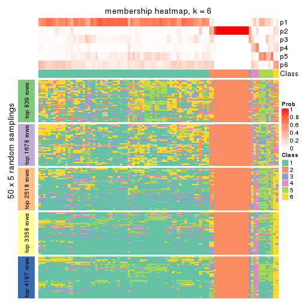</p>

</div>
</div>

As soon as we have had the classes for columns, we can look for signatures
which are significantly different between classes which can be candidate marks
for certain classes. Following are the heatmaps for signatures.


Signature heatmaps where rows are scaled:


<script>
$( function() {
	$( '#tabs-CV-hclust-get-signatures' ).tabs();
} );
</script>
<div id='tabs-CV-hclust-get-signatures'>
<ul>
<li><a href='#tab-CV-hclust-get-signatures-1'>k = 2</a></li>
<li><a href='#tab-CV-hclust-get-signatures-2'>k = 3</a></li>
<li><a href='#tab-CV-hclust-get-signatures-3'>k = 4</a></li>
<li><a href='#tab-CV-hclust-get-signatures-4'>k = 5</a></li>
<li><a href='#tab-CV-hclust-get-signatures-5'>k = 6</a></li>
</ul>
<div id='tab-CV-hclust-get-signatures-1'>
<pre><code class="r">get_signatures(res, k = 2)
</code></pre>

<p></p>

</div>
<div id='tab-CV-hclust-get-signatures-2'>
<pre><code class="r">get_signatures(res, k = 3)
</code></pre>

<p></p>

</div>
<div id='tab-CV-hclust-get-signatures-3'>
<pre><code class="r">get_signatures(res, k = 4)
</code></pre>

<p></p>

</div>
<div id='tab-CV-hclust-get-signatures-4'>
<pre><code class="r">get_signatures(res, k = 5)
</code></pre>

<p></p>

</div>
<div id='tab-CV-hclust-get-signatures-5'>
<pre><code class="r">get_signatures(res, k = 6)
</code></pre>

<p></p>

</div>
</div>


Signature heatmaps where rows are not scaled:


<script>
$( function() {
	$( '#tabs-CV-hclust-get-signatures-no-scale' ).tabs();
} );
</script>
<div id='tabs-CV-hclust-get-signatures-no-scale'>
<ul>
<li><a href='#tab-CV-hclust-get-signatures-no-scale-1'>k = 2</a></li>
<li><a href='#tab-CV-hclust-get-signatures-no-scale-2'>k = 3</a></li>
<li><a href='#tab-CV-hclust-get-signatures-no-scale-3'>k = 4</a></li>
<li><a href='#tab-CV-hclust-get-signatures-no-scale-4'>k = 5</a></li>
<li><a href='#tab-CV-hclust-get-signatures-no-scale-5'>k = 6</a></li>
</ul>
<div id='tab-CV-hclust-get-signatures-no-scale-1'>
<pre><code class="r">get_signatures(res, k = 2, scale_rows = FALSE)
</code></pre>

<p></p>

</div>
<div id='tab-CV-hclust-get-signatures-no-scale-2'>
<pre><code class="r">get_signatures(res, k = 3, scale_rows = FALSE)
</code></pre>

<p></p>

</div>
<div id='tab-CV-hclust-get-signatures-no-scale-3'>
<pre><code class="r">get_signatures(res, k = 4, scale_rows = FALSE)
</code></pre>

<p></p>

</div>
<div id='tab-CV-hclust-get-signatures-no-scale-4'>
<pre><code class="r">get_signatures(res, k = 5, scale_rows = FALSE)
</code></pre>

<p></p>

</div>
<div id='tab-CV-hclust-get-signatures-no-scale-5'>
<pre><code class="r">get_signatures(res, k = 6, scale_rows = FALSE)
</code></pre>

<p></p>

</div>
</div>


Compare the overlap of signatures from different k:

```r
compare_signatures(res)
```


`get_signature()` returns a data frame invisibly. TO get the list of signatures, the function
call should be assigned to a variable explicitly. In following code, if `plot` argument is set
to `FALSE`, no heatmap is plotted while only the differential analysis is performed.

```r
# code only for demonstration
tb = get_signature(res, k = ..., plot = FALSE)
```

An example of the output of `tb` is:

```
#>   which_row         fdr    mean_1    mean_2 scaled_mean_1 scaled_mean_2 km
#> 1        38 0.042760348  8.373488  9.131774    -0.5533452     0.5164555  1
#> 2        40 0.018707592  7.106213  8.469186    -0.6173731     0.5762149  1
#> 3        55 0.019134737 10.221463 11.207825    -0.6159697     0.5749050  1
#> 4        59 0.006059896  5.921854  7.869574    -0.6899429     0.6439467  1
#> 5        60 0.018055526  8.928898 10.211722    -0.6204761     0.5791110  1
#> 6        98 0.009384629 15.714769 14.887706     0.6635654    -0.6193277  2
...
```

The columns in `tb` are:

1. `which_row`: row indices corresponding to the input matrix.
2. `fdr`: FDR for the differential test. 
3. `mean_x`: The mean value in group x.
4. `scaled_mean_x`: The mean value in group x after rows are scaled.
5. `km`: Row groups if k-means clustering is applied to rows.


UMAP plot which shows how samples are separated.


<script>
$( function() {
	$( '#tabs-CV-hclust-dimension-reduction' ).tabs();
} );
</script>
<div id='tabs-CV-hclust-dimension-reduction'>
<ul>
<li><a href='#tab-CV-hclust-dimension-reduction-1'>k = 2</a></li>
<li><a href='#tab-CV-hclust-dimension-reduction-2'>k = 3</a></li>
<li><a href='#tab-CV-hclust-dimension-reduction-3'>k = 4</a></li>
<li><a href='#tab-CV-hclust-dimension-reduction-4'>k = 5</a></li>
<li><a href='#tab-CV-hclust-dimension-reduction-5'>k = 6</a></li>
</ul>
<div id='tab-CV-hclust-dimension-reduction-1'>
<pre><code class="r">dimension_reduction(res, k = 2, method = &quot;UMAP&quot;)
</code></pre>

<p></p>

</div>
<div id='tab-CV-hclust-dimension-reduction-2'>
<pre><code class="r">dimension_reduction(res, k = 3, method = &quot;UMAP&quot;)
</code></pre>

<p></p>

</div>
<div id='tab-CV-hclust-dimension-reduction-3'>
<pre><code class="r">dimension_reduction(res, k = 4, method = &quot;UMAP&quot;)
</code></pre>

<p></p>

</div>
<div id='tab-CV-hclust-dimension-reduction-4'>
<pre><code class="r">dimension_reduction(res, k = 5, method = &quot;UMAP&quot;)
</code></pre>

<p></p>

</div>
<div id='tab-CV-hclust-dimension-reduction-5'>
<pre><code class="r">dimension_reduction(res, k = 6, method = &quot;UMAP&quot;)
</code></pre>

<p></p>

</div>
</div>


Following heatmap shows how subgroups are split when increasing `k`:

```r
collect_classes(res)
```


If matrix rows can be associated to genes, consider to use `GO_Enrichment(res,
...)` to perform function enrichment for the signature genes.


 

---------------------------------------------------


### CV:kmeans**


The object with results only for a single top-value method and a single partition method 
can be extracted as:

```r
res = res_list["CV", "kmeans"]
# you can also extract it by
# res = res_list["CV:kmeans"]
```

A summary of `res` and all the functions that can be applied to it:

```r
res
```

```
#> A 'ConsensusPartition' object with k = 2, 3, 4, 5, 6.
#>   On a matrix with 8394 rows and 194 columns.
#>   Top rows (839, 1678, 2518, 3358, 4197) are extracted by 'CV' method.
#>   Subgroups are detected by 'kmeans' method.
#>   Performed in total 1250 partitions by row resampling.
#>   Best k for subgroups seems to be 2.
#> 
#> Following methods can be applied to this 'ConsensusPartition' object:
#>  [1] "cola_report"             "collect_classes"         "collect_plots"          
#>  [4] "collect_stats"           "colnames"                "compare_signatures"     
#>  [7] "consensus_heatmap"       "dimension_reduction"     "functional_enrichment"  
#> [10] "get_anno_col"            "get_anno"                "get_classes"            
#> [13] "get_consensus"           "get_matrix"              "get_membership"         
#> [16] "get_param"               "get_signatures"          "get_stats"              
#> [19] "is_best_k"               "is_stable_k"             "membership_heatmap"     
#> [22] "ncol"                    "nrow"                    "plot_ecdf"              
#> [25] "rownames"                "select_partition_number" "show"                   
#> [28] "suggest_best_k"          "test_to_known_factors"
```

`collect_plots()` function collects all the plots made from `res` for all `k` (number of partitions)
into one single page to provide an easy and fast comparison between different `k`.

```r
collect_plots(res)
```


The plots are:

- The first row: a plot of the ECDF (Empirical cumulative distribution
  function) curves of the consensus matrix for each `k` and the heatmap of
  predicted classes for each `k`.
- The second row: heatmaps of the consensus matrix for each `k`.
- The third row: heatmaps of the membership matrix for each `k`.
- The fouth row: heatmaps of the signatures for each `k`.

All the plots in panels can be made by individual functions and they are
plotted later in this section.

`select_partition_number()` produces several plots showing different
statistics for choosing "optimized" `k`. There are following statistics:

- ECDF curves of the consensus matrix for each `k`;
- 1-PAC. [The PAC
  score](https://en.wikipedia.org/wiki/Consensus_clustering#Over-interpretation_potential_of_consensus_clustering)
  measures the proportion of the ambiguous subgrouping.
- Mean silhouette score.
- Concordance. The mean probability of fiting the consensus class ids in all
  partitions.
- Area increased. Denote $A_k$ as the area under the ECDF curve for current
  `k`, the area increased is defined as $A_k - A_{k-1}$.
- Rand index. The percent of pairs of samples that are both in a same cluster
  or both are not in a same cluster in the partition of k and k-1.
- Jaccard index. The ratio of pairs of samples are both in a same cluster in
  the partition of k and k-1 and the pairs of samples are both in a same
  cluster in the partition k or k-1.

The detailed explanations of these statistics can be found in [the cola
vignette](http://bioconductor.org/packages/devel/bioc/vignettes/cola/inst/doc/cola.html#toc_13).

Generally speaking, lower PAC score, higher mean silhouette score or higher
concordance corresponds to better partition. Rand index and Jaccard index
measure how similar the current partition is compared to partition with `k-1`.
If they are too similar, we won't accept `k` is better than `k-1`.

```r
select_partition_number(res)
```


The numeric values for all these statistics can be obtained by `get_stats()`.

```r
get_stats(res)
```

```
#>   k 1-PAC mean_silhouette concordance area_increased  Rand Jaccard
#> 2 2 1.000           0.992       0.993         0.2323 0.767   0.767
#> 3 3 0.266           0.887       0.823         0.8854 1.000   1.000
#> 4 4 0.263           0.831       0.732         0.2296 1.000   1.000
#> 5 5 0.262           0.439       0.655         0.1274 0.932   0.911
#> 6 6 0.262           0.447       0.628         0.0636 0.965   0.952
```

`suggest_best_k()` suggests the best $k$ based on these statistics. The rules are as follows:

- All $k$ with Jaccard index larger than 0.95 are removed because the increase of
  the partition number does not provides enough extra information. If all $k$ are removed,
  the best $k$ is assigned by `NA`.
- For $k$ with 1-PAC larger than 0.9, the maximal $k$ is taken as the "best k". Other $k$ is called "optional k".
- If it does not fit the second rule. The $k$ with the highest vote of highest
  1-PAC, mean silhouette and concordance is taken as the "best k".

```r
suggest_best_k(res)
```

```
#> [1] 2
```


Following shows the table of the partitions (You need to click the **show/hide
code output** link to see it). The membership matrix (columns with name `p*`)
is inferred by
[`clue::cl_consensus()`](https://www.rdocumentation.org/link/cl_consensus?package=clue)
function with the `SE` method. Basically the value in the membership matrix
represents the probability to belong to a certain group. The finall class
label for an item is determined with the group with highest probability it
belongs to.

In `get_classes()` function, the entropy is calculated from the membership
matrix and the silhouette score is calculated from the consensus matrix.


<script>
$( function() {
	$( '#tabs-CV-kmeans-get-classes' ).tabs();
} );
</script>
<div id='tabs-CV-kmeans-get-classes'>
<ul>
<li><a href='#tab-CV-kmeans-get-classes-1'>k = 2</a></li>
<li><a href='#tab-CV-kmeans-get-classes-2'>k = 3</a></li>
<li><a href='#tab-CV-kmeans-get-classes-3'>k = 4</a></li>
<li><a href='#tab-CV-kmeans-get-classes-4'>k = 5</a></li>
<li><a href='#tab-CV-kmeans-get-classes-5'>k = 6</a></li>
</ul>

<div id='tab-CV-kmeans-get-classes-1'>
<p><a id='tab-CV-kmeans-get-classes-1-a' style='color:#0366d6' href='#'>show/hide code output</a></p>
<pre><code class="r">cbind(get_classes(res, k = 2), get_membership(res, k = 2))
</code></pre>

<pre><code>#&gt;           class entropy silhouette    p1    p2
#&gt; ERR467487     1  0.0000      0.996 1.000 0.000
#&gt; ERR467498     1  0.0000      0.996 1.000 0.000
#&gt; ERR658998     1  0.0000      0.996 1.000 0.000
#&gt; ERR659094     1  0.0000      0.996 1.000 0.000
#&gt; ERR658999     1  0.0000      0.996 1.000 0.000
#&gt; ERR659095     1  0.0000      0.996 1.000 0.000
#&gt; ERR659000     1  0.0000      0.996 1.000 0.000
#&gt; ERR659096     1  0.0000      0.996 1.000 0.000
#&gt; ERR659001     1  0.0000      0.996 1.000 0.000
#&gt; ERR659097     1  0.0000      0.996 1.000 0.000
#&gt; ERR659002     1  0.0672      0.989 0.992 0.008
#&gt; ERR659098     1  0.0672      0.989 0.992 0.008
#&gt; ERR659003     1  0.0000      0.996 1.000 0.000
#&gt; ERR659099     1  0.0000      0.996 1.000 0.000
#&gt; ERR659004     1  0.0000      0.996 1.000 0.000
#&gt; ERR659100     1  0.0000      0.996 1.000 0.000
#&gt; ERR659005     1  0.0000      0.996 1.000 0.000
#&gt; ERR659101     1  0.0000      0.996 1.000 0.000
#&gt; ERR659006     1  0.0000      0.996 1.000 0.000
#&gt; ERR659102     1  0.0000      0.996 1.000 0.000
#&gt; ERR659007     1  0.0000      0.996 1.000 0.000
#&gt; ERR659103     1  0.0000      0.996 1.000 0.000
#&gt; ERR659008     2  0.1843      0.998 0.028 0.972
#&gt; ERR659104     2  0.1843      0.998 0.028 0.972
#&gt; ERR659009     1  0.0672      0.989 0.992 0.008
#&gt; ERR659105     1  0.0672      0.989 0.992 0.008
#&gt; ERR659010     1  0.0376      0.993 0.996 0.004
#&gt; ERR659106     1  0.0376      0.993 0.996 0.004
#&gt; ERR659011     1  0.0376      0.993 0.996 0.004
#&gt; ERR659107     1  0.0376      0.993 0.996 0.004
#&gt; ERR659012     1  0.0376      0.993 0.996 0.004
#&gt; ERR659108     1  0.0376      0.993 0.996 0.004
#&gt; ERR659013     1  0.0000      0.996 1.000 0.000
#&gt; ERR659109     1  0.0000      0.996 1.000 0.000
#&gt; ERR659014     2  0.1843      0.998 0.028 0.972
#&gt; ERR659110     2  0.1843      0.998 0.028 0.972
#&gt; ERR659015     1  0.0000      0.996 1.000 0.000
#&gt; ERR659111     1  0.0000      0.996 1.000 0.000
#&gt; ERR659016     1  0.0000      0.996 1.000 0.000
#&gt; ERR659112     1  0.0000      0.996 1.000 0.000
#&gt; ERR659017     2  0.1843      0.998 0.028 0.972
#&gt; ERR659113     2  0.1843      0.998 0.028 0.972
#&gt; ERR659018     1  0.0000      0.996 1.000 0.000
#&gt; ERR659114     1  0.0000      0.996 1.000 0.000
#&gt; ERR659019     1  0.0000      0.996 1.000 0.000
#&gt; ERR659115     1  0.0000      0.996 1.000 0.000
#&gt; ERR659020     1  0.0000      0.996 1.000 0.000
#&gt; ERR659116     1  0.0000      0.996 1.000 0.000
#&gt; ERR659021     1  0.0000      0.996 1.000 0.000
#&gt; ERR659117     1  0.0000      0.996 1.000 0.000
#&gt; ERR659022     1  0.0000      0.996 1.000 0.000
#&gt; ERR659118     1  0.0000      0.996 1.000 0.000
#&gt; ERR659023     1  0.0000      0.996 1.000 0.000
#&gt; ERR659119     1  0.0000      0.996 1.000 0.000
#&gt; ERR659024     1  0.0000      0.996 1.000 0.000
#&gt; ERR659120     1  0.0000      0.996 1.000 0.000
#&gt; ERR659025     1  0.0000      0.996 1.000 0.000
#&gt; ERR659121     1  0.0000      0.996 1.000 0.000
#&gt; ERR659026     1  0.0376      0.993 0.996 0.004
#&gt; ERR659122     1  0.0376      0.993 0.996 0.004
#&gt; ERR659027     1  0.0000      0.996 1.000 0.000
#&gt; ERR659123     1  0.0000      0.996 1.000 0.000
#&gt; ERR659028     1  0.0000      0.996 1.000 0.000
#&gt; ERR659124     1  0.0000      0.996 1.000 0.000
#&gt; ERR659029     1  0.0000      0.996 1.000 0.000
#&gt; ERR659125     1  0.0000      0.996 1.000 0.000
#&gt; ERR659030     1  0.0000      0.996 1.000 0.000
#&gt; ERR659126     1  0.0000      0.996 1.000 0.000
#&gt; ERR659031     1  0.0000      0.996 1.000 0.000
#&gt; ERR659127     1  0.0000      0.996 1.000 0.000
#&gt; ERR659032     1  0.0000      0.996 1.000 0.000
#&gt; ERR659128     1  0.0000      0.996 1.000 0.000
#&gt; ERR659033     1  0.0000      0.996 1.000 0.000
#&gt; ERR659129     1  0.0000      0.996 1.000 0.000
#&gt; ERR659034     2  0.1843      0.998 0.028 0.972
#&gt; ERR659130     2  0.1843      0.998 0.028 0.972
#&gt; ERR659035     1  0.0000      0.996 1.000 0.000
#&gt; ERR659131     1  0.0000      0.996 1.000 0.000
#&gt; ERR659036     1  0.0000      0.996 1.000 0.000
#&gt; ERR659132     1  0.0000      0.996 1.000 0.000
#&gt; ERR659037     1  0.0000      0.996 1.000 0.000
#&gt; ERR659133     1  0.0000      0.996 1.000 0.000
#&gt; ERR659038     1  0.0000      0.996 1.000 0.000
#&gt; ERR659134     1  0.0000      0.996 1.000 0.000
#&gt; ERR659039     1  0.0000      0.996 1.000 0.000
#&gt; ERR659135     1  0.0000      0.996 1.000 0.000
#&gt; ERR659040     1  0.0000      0.996 1.000 0.000
#&gt; ERR659136     1  0.0000      0.996 1.000 0.000
#&gt; ERR659041     1  0.0376      0.993 0.996 0.004
#&gt; ERR659137     1  0.0376      0.993 0.996 0.004
#&gt; ERR659042     1  0.0000      0.996 1.000 0.000
#&gt; ERR659138     1  0.0000      0.996 1.000 0.000
#&gt; ERR659043     1  0.0000      0.996 1.000 0.000
#&gt; ERR659139     1  0.0000      0.996 1.000 0.000
#&gt; ERR659044     2  0.1843      0.998 0.028 0.972
#&gt; ERR659140     2  0.1843      0.998 0.028 0.972
#&gt; ERR659045     1  0.0000      0.996 1.000 0.000
#&gt; ERR659141     1  0.0000      0.996 1.000 0.000
#&gt; ERR659046     1  0.0000      0.996 1.000 0.000
#&gt; ERR659142     1  0.0000      0.996 1.000 0.000
#&gt; ERR659047     1  0.0000      0.996 1.000 0.000
#&gt; ERR659143     1  0.0000      0.996 1.000 0.000
#&gt; ERR659048     1  0.0000      0.996 1.000 0.000
#&gt; ERR659144     1  0.0000      0.996 1.000 0.000
#&gt; ERR659049     1  0.0000      0.996 1.000 0.000
#&gt; ERR659145     1  0.0000      0.996 1.000 0.000
#&gt; ERR659050     1  0.0000      0.996 1.000 0.000
#&gt; ERR659146     1  0.0000      0.996 1.000 0.000
#&gt; ERR659051     1  0.8386      0.621 0.732 0.268
#&gt; ERR659147     1  0.8386      0.621 0.732 0.268
#&gt; ERR659052     1  0.0000      0.996 1.000 0.000
#&gt; ERR659148     1  0.0000      0.996 1.000 0.000
#&gt; ERR659053     1  0.0000      0.996 1.000 0.000
#&gt; ERR659149     1  0.0000      0.996 1.000 0.000
#&gt; ERR659054     2  0.1843      0.998 0.028 0.972
#&gt; ERR659150     2  0.1843      0.998 0.028 0.972
#&gt; ERR659055     1  0.0000      0.996 1.000 0.000
#&gt; ERR659151     1  0.0000      0.996 1.000 0.000
#&gt; ERR659056     1  0.0000      0.996 1.000 0.000
#&gt; ERR659152     1  0.0000      0.996 1.000 0.000
#&gt; ERR659057     1  0.0000      0.996 1.000 0.000
#&gt; ERR659153     1  0.0000      0.996 1.000 0.000
#&gt; ERR659058     1  0.0000      0.996 1.000 0.000
#&gt; ERR659154     1  0.0000      0.996 1.000 0.000
#&gt; ERR659059     1  0.0000      0.996 1.000 0.000
#&gt; ERR659155     1  0.0000      0.996 1.000 0.000
#&gt; ERR659060     1  0.0000      0.996 1.000 0.000
#&gt; ERR659156     1  0.0000      0.996 1.000 0.000
#&gt; ERR659061     1  0.0000      0.996 1.000 0.000
#&gt; ERR659157     1  0.0000      0.996 1.000 0.000
#&gt; ERR659062     1  0.0000      0.996 1.000 0.000
#&gt; ERR659158     1  0.0000      0.996 1.000 0.000
#&gt; ERR659063     1  0.0000      0.996 1.000 0.000
#&gt; ERR659159     1  0.0000      0.996 1.000 0.000
#&gt; ERR659064     1  0.0000      0.996 1.000 0.000
#&gt; ERR659160     1  0.0000      0.996 1.000 0.000
#&gt; ERR659065     2  0.1843      0.998 0.028 0.972
#&gt; ERR659161     2  0.1843      0.998 0.028 0.972
#&gt; ERR659066     1  0.0376      0.993 0.996 0.004
#&gt; ERR659162     1  0.0376      0.993 0.996 0.004
#&gt; ERR659067     1  0.0000      0.996 1.000 0.000
#&gt; ERR659163     1  0.0000      0.996 1.000 0.000
#&gt; ERR659068     2  0.1843      0.998 0.028 0.972
#&gt; ERR659164     2  0.1843      0.998 0.028 0.972
#&gt; ERR659069     1  0.0376      0.993 0.996 0.004
#&gt; ERR659165     1  0.0376      0.993 0.996 0.004
#&gt; ERR659070     1  0.0000      0.996 1.000 0.000
#&gt; ERR659166     1  0.0000      0.996 1.000 0.000
#&gt; ERR659071     1  0.0000      0.996 1.000 0.000
#&gt; ERR659167     1  0.0000      0.996 1.000 0.000
#&gt; ERR659072     1  0.0000      0.996 1.000 0.000
#&gt; ERR659168     1  0.0000      0.996 1.000 0.000
#&gt; ERR659073     1  0.0000      0.996 1.000 0.000
#&gt; ERR659169     1  0.0000      0.996 1.000 0.000
#&gt; ERR659074     2  0.1843      0.998 0.028 0.972
#&gt; ERR659170     2  0.1843      0.998 0.028 0.972
#&gt; ERR659075     2  0.3114      0.971 0.056 0.944
#&gt; ERR659171     2  0.3114      0.971 0.056 0.944
#&gt; ERR659076     2  0.1843      0.998 0.028 0.972
#&gt; ERR659172     2  0.1843      0.998 0.028 0.972
#&gt; ERR659077     1  0.0376      0.993 0.996 0.004
#&gt; ERR659173     1  0.0376      0.993 0.996 0.004
#&gt; ERR659078     1  0.0000      0.996 1.000 0.000
#&gt; ERR659174     1  0.0000      0.996 1.000 0.000
#&gt; ERR659079     1  0.0000      0.996 1.000 0.000
#&gt; ERR659175     1  0.0000      0.996 1.000 0.000
#&gt; ERR659080     1  0.0000      0.996 1.000 0.000
#&gt; ERR659176     1  0.0000      0.996 1.000 0.000
#&gt; ERR659081     1  0.0000      0.996 1.000 0.000
#&gt; ERR659177     1  0.0000      0.996 1.000 0.000
#&gt; ERR659082     1  0.0376      0.993 0.996 0.004
#&gt; ERR659178     1  0.0376      0.993 0.996 0.004
#&gt; ERR659083     2  0.1843      0.998 0.028 0.972
#&gt; ERR659179     2  0.1843      0.998 0.028 0.972
#&gt; ERR659084     2  0.1843      0.998 0.028 0.972
#&gt; ERR659180     2  0.1843      0.998 0.028 0.972
#&gt; ERR659085     1  0.0000      0.996 1.000 0.000
#&gt; ERR659181     1  0.0000      0.996 1.000 0.000
#&gt; ERR659086     1  0.0000      0.996 1.000 0.000
#&gt; ERR659182     1  0.0000      0.996 1.000 0.000
#&gt; ERR659087     1  0.0376      0.993 0.996 0.004
#&gt; ERR659183     1  0.0376      0.993 0.996 0.004
#&gt; ERR659088     1  0.0000      0.996 1.000 0.000
#&gt; ERR659184     1  0.0000      0.996 1.000 0.000
#&gt; ERR659089     1  0.0000      0.996 1.000 0.000
#&gt; ERR659185     1  0.0000      0.996 1.000 0.000
#&gt; ERR659090     1  0.0000      0.996 1.000 0.000
#&gt; ERR659186     1  0.0000      0.996 1.000 0.000
#&gt; ERR659091     1  0.0000      0.996 1.000 0.000
#&gt; ERR659187     1  0.0000      0.996 1.000 0.000
#&gt; ERR659092     1  0.0000      0.996 1.000 0.000
#&gt; ERR659188     1  0.0000      0.996 1.000 0.000
#&gt; ERR659093     1  0.0000      0.996 1.000 0.000
#&gt; ERR659189     1  0.0000      0.996 1.000 0.000
</code></pre>

<script>
$('#tab-CV-kmeans-get-classes-1-a').parent().next().next().hide();
$('#tab-CV-kmeans-get-classes-1-a').click(function(){
  $('#tab-CV-kmeans-get-classes-1-a').parent().next().next().toggle();
  return(false);
});
</script>
</div>

<div id='tab-CV-kmeans-get-classes-2'>
<p><a id='tab-CV-kmeans-get-classes-2-a' style='color:#0366d6' href='#'>show/hide code output</a></p>
<pre><code class="r">cbind(get_classes(res, k = 3), get_membership(res, k = 3))
</code></pre>

<pre><code>#&gt;           class entropy silhouette    p1    p2    p3
#&gt; ERR467487     1  0.5327      0.813 0.728 0.000 0.272
#&gt; ERR467498     1  0.5327      0.813 0.728 0.000 0.272
#&gt; ERR658998     1  0.4235      0.892 0.824 0.000 0.176
#&gt; ERR659094     1  0.4235      0.892 0.824 0.000 0.176
#&gt; ERR658999     1  0.5560      0.835 0.700 0.000 0.300
#&gt; ERR659095     1  0.5560      0.835 0.700 0.000 0.300
#&gt; ERR659000     1  0.5138      0.834 0.748 0.000 0.252
#&gt; ERR659096     1  0.5138      0.834 0.748 0.000 0.252
#&gt; ERR659001     1  0.4842      0.878 0.776 0.000 0.224
#&gt; ERR659097     1  0.4842      0.878 0.776 0.000 0.224
#&gt; ERR659002     1  0.4504      0.895 0.804 0.000 0.196
#&gt; ERR659098     1  0.4504      0.895 0.804 0.000 0.196
#&gt; ERR659003     1  0.4178      0.893 0.828 0.000 0.172
#&gt; ERR659099     1  0.4178      0.893 0.828 0.000 0.172
#&gt; ERR659004     1  0.5785      0.826 0.668 0.000 0.332
#&gt; ERR659100     1  0.5785      0.826 0.668 0.000 0.332
#&gt; ERR659005     1  0.4178      0.892 0.828 0.000 0.172
#&gt; ERR659101     1  0.4178      0.892 0.828 0.000 0.172
#&gt; ERR659006     1  0.5621      0.825 0.692 0.000 0.308
#&gt; ERR659102     1  0.5621      0.825 0.692 0.000 0.308
#&gt; ERR659007     1  0.3816      0.884 0.852 0.000 0.148
#&gt; ERR659103     1  0.3816      0.884 0.852 0.000 0.148
#&gt; ERR659008     2  0.0237      0.995 0.004 0.996 0.000
#&gt; ERR659104     2  0.0237      0.995 0.004 0.996 0.000
#&gt; ERR659009     1  0.5098      0.873 0.752 0.000 0.248
#&gt; ERR659105     1  0.5098      0.873 0.752 0.000 0.248
#&gt; ERR659010     1  0.4702      0.880 0.788 0.000 0.212
#&gt; ERR659106     1  0.4702      0.880 0.788 0.000 0.212
#&gt; ERR659011     1  0.5678      0.832 0.684 0.000 0.316
#&gt; ERR659107     1  0.5678      0.832 0.684 0.000 0.316
#&gt; ERR659012     1  0.5016      0.870 0.760 0.000 0.240
#&gt; ERR659108     1  0.5016      0.870 0.760 0.000 0.240
#&gt; ERR659013     1  0.4504      0.865 0.804 0.000 0.196
#&gt; ERR659109     1  0.4504      0.865 0.804 0.000 0.196
#&gt; ERR659014     2  0.0237      0.995 0.004 0.996 0.000
#&gt; ERR659110     2  0.0237      0.995 0.004 0.996 0.000
#&gt; ERR659015     1  0.3267      0.894 0.884 0.000 0.116
#&gt; ERR659111     1  0.3267      0.894 0.884 0.000 0.116
#&gt; ERR659016     1  0.4974      0.835 0.764 0.000 0.236
#&gt; ERR659112     1  0.4974      0.835 0.764 0.000 0.236
#&gt; ERR659017     2  0.0237      0.995 0.004 0.996 0.000
#&gt; ERR659113     2  0.0237      0.995 0.004 0.996 0.000
#&gt; ERR659018     1  0.4235      0.886 0.824 0.000 0.176
#&gt; ERR659114     1  0.4235      0.886 0.824 0.000 0.176
#&gt; ERR659019     1  0.5465      0.837 0.712 0.000 0.288
#&gt; ERR659115     1  0.5465      0.837 0.712 0.000 0.288
#&gt; ERR659020     1  0.4750      0.879 0.784 0.000 0.216
#&gt; ERR659116     1  0.4750      0.879 0.784 0.000 0.216
#&gt; ERR659021     1  0.3551      0.897 0.868 0.000 0.132
#&gt; ERR659117     1  0.3551      0.897 0.868 0.000 0.132
#&gt; ERR659022     1  0.4399      0.896 0.812 0.000 0.188
#&gt; ERR659118     1  0.4399      0.896 0.812 0.000 0.188
#&gt; ERR659023     1  0.3619      0.888 0.864 0.000 0.136
#&gt; ERR659119     1  0.3619      0.888 0.864 0.000 0.136
#&gt; ERR659024     1  0.3192      0.891 0.888 0.000 0.112
#&gt; ERR659120     1  0.3192      0.891 0.888 0.000 0.112
#&gt; ERR659025     1  0.4291      0.881 0.820 0.000 0.180
#&gt; ERR659121     1  0.4291      0.881 0.820 0.000 0.180
#&gt; ERR659026     1  0.4931      0.876 0.768 0.000 0.232
#&gt; ERR659122     1  0.4931      0.876 0.768 0.000 0.232
#&gt; ERR659027     1  0.4452      0.880 0.808 0.000 0.192
#&gt; ERR659123     1  0.4452      0.880 0.808 0.000 0.192
#&gt; ERR659028     1  0.3412      0.889 0.876 0.000 0.124
#&gt; ERR659124     1  0.3412      0.889 0.876 0.000 0.124
#&gt; ERR659029     1  0.3267      0.893 0.884 0.000 0.116
#&gt; ERR659125     1  0.3267      0.893 0.884 0.000 0.116
#&gt; ERR659030     1  0.4842      0.879 0.776 0.000 0.224
#&gt; ERR659126     1  0.4842      0.879 0.776 0.000 0.224
#&gt; ERR659031     1  0.3686      0.889 0.860 0.000 0.140
#&gt; ERR659127     1  0.3686      0.889 0.860 0.000 0.140
#&gt; ERR659032     1  0.3619      0.891 0.864 0.000 0.136
#&gt; ERR659128     1  0.3619      0.891 0.864 0.000 0.136
#&gt; ERR659033     1  0.4842      0.890 0.776 0.000 0.224
#&gt; ERR659129     1  0.4842      0.890 0.776 0.000 0.224
#&gt; ERR659034     2  0.0237      0.995 0.004 0.996 0.000
#&gt; ERR659130     2  0.0237      0.995 0.004 0.996 0.000
#&gt; ERR659035     1  0.3192      0.892 0.888 0.000 0.112
#&gt; ERR659131     1  0.3192      0.892 0.888 0.000 0.112
#&gt; ERR659036     1  0.4062      0.891 0.836 0.000 0.164
#&gt; ERR659132     1  0.4062      0.891 0.836 0.000 0.164
#&gt; ERR659037     1  0.4002      0.896 0.840 0.000 0.160
#&gt; ERR659133     1  0.4002      0.896 0.840 0.000 0.160
#&gt; ERR659038     1  0.5178      0.857 0.744 0.000 0.256
#&gt; ERR659134     1  0.5178      0.857 0.744 0.000 0.256
#&gt; ERR659039     1  0.5560      0.848 0.700 0.000 0.300
#&gt; ERR659135     1  0.5560      0.848 0.700 0.000 0.300
#&gt; ERR659040     1  0.4235      0.871 0.824 0.000 0.176
#&gt; ERR659136     1  0.4235      0.871 0.824 0.000 0.176
#&gt; ERR659041     1  0.5363      0.834 0.724 0.000 0.276
#&gt; ERR659137     1  0.5363      0.834 0.724 0.000 0.276
#&gt; ERR659042     1  0.4842      0.844 0.776 0.000 0.224
#&gt; ERR659138     1  0.4842      0.844 0.776 0.000 0.224
#&gt; ERR659043     1  0.3752      0.886 0.856 0.000 0.144
#&gt; ERR659139     1  0.3752      0.886 0.856 0.000 0.144
#&gt; ERR659044     2  0.0237      0.995 0.004 0.996 0.000
#&gt; ERR659140     2  0.0237      0.995 0.004 0.996 0.000
#&gt; ERR659045     1  0.4605      0.880 0.796 0.000 0.204
#&gt; ERR659141     1  0.4605      0.880 0.796 0.000 0.204
#&gt; ERR659046     1  0.3412      0.895 0.876 0.000 0.124
#&gt; ERR659142     1  0.3412      0.895 0.876 0.000 0.124
#&gt; ERR659047     1  0.4062      0.896 0.836 0.000 0.164
#&gt; ERR659143     1  0.4062      0.896 0.836 0.000 0.164
#&gt; ERR659048     1  0.3267      0.891 0.884 0.000 0.116
#&gt; ERR659144     1  0.3267      0.891 0.884 0.000 0.116
#&gt; ERR659049     1  0.4555      0.884 0.800 0.000 0.200
#&gt; ERR659145     1  0.4555      0.884 0.800 0.000 0.200
#&gt; ERR659050     1  0.3816      0.890 0.852 0.000 0.148
#&gt; ERR659146     1  0.3816      0.890 0.852 0.000 0.148
#&gt; ERR659051     1  0.9410      0.468 0.504 0.220 0.276
#&gt; ERR659147     1  0.9410      0.468 0.504 0.220 0.276
#&gt; ERR659052     1  0.4654      0.884 0.792 0.000 0.208
#&gt; ERR659148     1  0.4654      0.884 0.792 0.000 0.208
#&gt; ERR659053     1  0.3482      0.893 0.872 0.000 0.128
#&gt; ERR659149     1  0.3482      0.893 0.872 0.000 0.128
#&gt; ERR659054     2  0.0237      0.995 0.004 0.996 0.000
#&gt; ERR659150     2  0.0237      0.995 0.004 0.996 0.000
#&gt; ERR659055     1  0.4931      0.870 0.768 0.000 0.232
#&gt; ERR659151     1  0.4931      0.870 0.768 0.000 0.232
#&gt; ERR659056     1  0.5098      0.825 0.752 0.000 0.248
#&gt; ERR659152     1  0.5098      0.825 0.752 0.000 0.248
#&gt; ERR659057     1  0.3551      0.896 0.868 0.000 0.132
#&gt; ERR659153     1  0.3551      0.896 0.868 0.000 0.132
#&gt; ERR659058     1  0.4750      0.873 0.784 0.000 0.216
#&gt; ERR659154     1  0.4750      0.873 0.784 0.000 0.216
#&gt; ERR659059     1  0.3412      0.895 0.876 0.000 0.124
#&gt; ERR659155     1  0.3412      0.895 0.876 0.000 0.124
#&gt; ERR659060     1  0.4887      0.877 0.772 0.000 0.228
#&gt; ERR659156     1  0.4887      0.877 0.772 0.000 0.228
#&gt; ERR659061     1  0.4291      0.894 0.820 0.000 0.180
#&gt; ERR659157     1  0.4291      0.894 0.820 0.000 0.180
#&gt; ERR659062     1  0.3941      0.883 0.844 0.000 0.156
#&gt; ERR659158     1  0.3941      0.883 0.844 0.000 0.156
#&gt; ERR659063     1  0.3551      0.897 0.868 0.000 0.132
#&gt; ERR659159     1  0.3551      0.897 0.868 0.000 0.132
#&gt; ERR659064     1  0.4796      0.879 0.780 0.000 0.220
#&gt; ERR659160     1  0.4796      0.879 0.780 0.000 0.220
#&gt; ERR659065     2  0.0237      0.995 0.004 0.996 0.000
#&gt; ERR659161     2  0.0237      0.995 0.004 0.996 0.000
#&gt; ERR659066     1  0.5621      0.844 0.692 0.000 0.308
#&gt; ERR659162     1  0.5621      0.844 0.692 0.000 0.308
#&gt; ERR659067     1  0.5178      0.859 0.744 0.000 0.256
#&gt; ERR659163     1  0.5178      0.859 0.744 0.000 0.256
#&gt; ERR659068     2  0.0237      0.995 0.004 0.996 0.000
#&gt; ERR659164     2  0.0237      0.995 0.004 0.996 0.000
#&gt; ERR659069     1  0.5529      0.853 0.704 0.000 0.296
#&gt; ERR659165     1  0.5529      0.853 0.704 0.000 0.296
#&gt; ERR659070     1  0.5244      0.873 0.756 0.004 0.240
#&gt; ERR659166     1  0.5244      0.873 0.756 0.004 0.240
#&gt; ERR659071     1  0.2959      0.891 0.900 0.000 0.100
#&gt; ERR659167     1  0.2959      0.891 0.900 0.000 0.100
#&gt; ERR659072     1  0.5363      0.855 0.724 0.000 0.276
#&gt; ERR659168     1  0.5363      0.855 0.724 0.000 0.276
#&gt; ERR659073     1  0.5098      0.879 0.752 0.000 0.248
#&gt; ERR659169     1  0.5098      0.879 0.752 0.000 0.248
#&gt; ERR659074     2  0.0237      0.995 0.004 0.996 0.000
#&gt; ERR659170     2  0.0237      0.995 0.004 0.996 0.000
#&gt; ERR659075     2  0.3832      0.931 0.020 0.880 0.100
#&gt; ERR659171     2  0.3832      0.931 0.020 0.880 0.100
#&gt; ERR659076     2  0.0237      0.995 0.004 0.996 0.000
#&gt; ERR659172     2  0.0237      0.995 0.004 0.996 0.000
#&gt; ERR659077     1  0.3941      0.898 0.844 0.000 0.156
#&gt; ERR659173     1  0.3941      0.898 0.844 0.000 0.156
#&gt; ERR659078     1  0.4346      0.896 0.816 0.000 0.184
#&gt; ERR659174     1  0.4346      0.896 0.816 0.000 0.184
#&gt; ERR659079     1  0.4002      0.888 0.840 0.000 0.160
#&gt; ERR659175     1  0.4002      0.888 0.840 0.000 0.160
#&gt; ERR659080     1  0.4796      0.853 0.780 0.000 0.220
#&gt; ERR659176     1  0.4796      0.853 0.780 0.000 0.220
#&gt; ERR659081     1  0.4555      0.882 0.800 0.000 0.200
#&gt; ERR659177     1  0.4555      0.882 0.800 0.000 0.200
#&gt; ERR659082     1  0.4796      0.877 0.780 0.000 0.220
#&gt; ERR659178     1  0.4796      0.877 0.780 0.000 0.220
#&gt; ERR659083     2  0.0237      0.995 0.004 0.996 0.000
#&gt; ERR659179     2  0.0237      0.995 0.004 0.996 0.000
#&gt; ERR659084     2  0.0237      0.995 0.004 0.996 0.000
#&gt; ERR659180     2  0.0237      0.995 0.004 0.996 0.000
#&gt; ERR659085     1  0.3752      0.896 0.856 0.000 0.144
#&gt; ERR659181     1  0.3752      0.896 0.856 0.000 0.144
#&gt; ERR659086     1  0.4346      0.894 0.816 0.000 0.184
#&gt; ERR659182     1  0.4346      0.894 0.816 0.000 0.184
#&gt; ERR659087     1  0.4399      0.885 0.812 0.000 0.188
#&gt; ERR659183     1  0.4399      0.885 0.812 0.000 0.188
#&gt; ERR659088     1  0.4654      0.887 0.792 0.000 0.208
#&gt; ERR659184     1  0.4654      0.887 0.792 0.000 0.208
#&gt; ERR659089     1  0.5397      0.863 0.720 0.000 0.280
#&gt; ERR659185     1  0.5397      0.863 0.720 0.000 0.280
#&gt; ERR659090     1  0.4605      0.895 0.796 0.000 0.204
#&gt; ERR659186     1  0.4605      0.895 0.796 0.000 0.204
#&gt; ERR659091     1  0.3619      0.895 0.864 0.000 0.136
#&gt; ERR659187     1  0.3619      0.895 0.864 0.000 0.136
#&gt; ERR659092     1  0.3412      0.895 0.876 0.000 0.124
#&gt; ERR659188     1  0.3412      0.895 0.876 0.000 0.124
#&gt; ERR659093     1  0.4121      0.891 0.832 0.000 0.168
#&gt; ERR659189     1  0.4121      0.891 0.832 0.000 0.168
</code></pre>

<script>
$('#tab-CV-kmeans-get-classes-2-a').parent().next().next().hide();
$('#tab-CV-kmeans-get-classes-2-a').click(function(){
  $('#tab-CV-kmeans-get-classes-2-a').parent().next().next().toggle();
  return(false);
});
</script>
</div>

<div id='tab-CV-kmeans-get-classes-3'>
<p><a id='tab-CV-kmeans-get-classes-3-a' style='color:#0366d6' href='#'>show/hide code output</a></p>
<pre><code class="r">cbind(get_classes(res, k = 4), get_membership(res, k = 4))
</code></pre>

<pre><code>#&gt;           class entropy silhouette    p1    p2 p3    p4
#&gt; ERR467487     1   0.699      0.745 0.564 0.000 NA 0.280
#&gt; ERR467498     1   0.699      0.745 0.564 0.000 NA 0.280
#&gt; ERR658998     1   0.573      0.837 0.704 0.000 NA 0.200
#&gt; ERR659094     1   0.573      0.837 0.704 0.000 NA 0.200
#&gt; ERR658999     1   0.551      0.776 0.660 0.000 NA 0.300
#&gt; ERR659095     1   0.551      0.776 0.660 0.000 NA 0.300
#&gt; ERR659000     1   0.728      0.719 0.536 0.000 NA 0.256
#&gt; ERR659096     1   0.728      0.719 0.536 0.000 NA 0.256
#&gt; ERR659001     1   0.507      0.828 0.736 0.000 NA 0.216
#&gt; ERR659097     1   0.507      0.828 0.736 0.000 NA 0.216
#&gt; ERR659002     1   0.556      0.846 0.720 0.000 NA 0.188
#&gt; ERR659098     1   0.556      0.846 0.720 0.000 NA 0.188
#&gt; ERR659003     1   0.529      0.835 0.740 0.000 NA 0.180
#&gt; ERR659099     1   0.529      0.835 0.740 0.000 NA 0.180
#&gt; ERR659004     1   0.708      0.743 0.536 0.000 NA 0.316
#&gt; ERR659100     1   0.708      0.743 0.536 0.000 NA 0.316
#&gt; ERR659005     1   0.545      0.835 0.732 0.000 NA 0.172
#&gt; ERR659101     1   0.545      0.835 0.732 0.000 NA 0.172
#&gt; ERR659006     1   0.712      0.722 0.524 0.000 NA 0.328
#&gt; ERR659102     1   0.712      0.722 0.524 0.000 NA 0.328
#&gt; ERR659007     1   0.381      0.825 0.812 0.000 NA 0.176
#&gt; ERR659103     1   0.381      0.825 0.812 0.000 NA 0.176
#&gt; ERR659008     2   0.000      0.988 0.000 1.000 NA 0.000
#&gt; ERR659104     2   0.000      0.988 0.000 1.000 NA 0.000
#&gt; ERR659009     1   0.645      0.787 0.616 0.000 NA 0.276
#&gt; ERR659105     1   0.645      0.787 0.616 0.000 NA 0.276
#&gt; ERR659010     1   0.531      0.829 0.712 0.000 NA 0.236
#&gt; ERR659106     1   0.531      0.829 0.712 0.000 NA 0.236
#&gt; ERR659011     1   0.640      0.748 0.576 0.000 NA 0.344
#&gt; ERR659107     1   0.640      0.748 0.576 0.000 NA 0.344
#&gt; ERR659012     1   0.604      0.812 0.648 0.000 NA 0.272
#&gt; ERR659108     1   0.604      0.812 0.648 0.000 NA 0.272
#&gt; ERR659013     1   0.635      0.777 0.632 0.000 NA 0.260
#&gt; ERR659109     1   0.635      0.777 0.632 0.000 NA 0.260
#&gt; ERR659014     2   0.000      0.988 0.000 1.000 NA 0.000
#&gt; ERR659110     2   0.000      0.988 0.000 1.000 NA 0.000
#&gt; ERR659015     1   0.462      0.838 0.784 0.000 NA 0.164
#&gt; ERR659111     1   0.462      0.838 0.784 0.000 NA 0.164
#&gt; ERR659016     1   0.659      0.787 0.628 0.000 NA 0.216
#&gt; ERR659112     1   0.659      0.787 0.628 0.000 NA 0.216
#&gt; ERR659017     2   0.000      0.988 0.000 1.000 NA 0.000
#&gt; ERR659113     2   0.000      0.988 0.000 1.000 NA 0.000
#&gt; ERR659018     1   0.542      0.807 0.676 0.000 NA 0.284
#&gt; ERR659114     1   0.542      0.807 0.676 0.000 NA 0.284
#&gt; ERR659019     1   0.597      0.768 0.624 0.000 NA 0.316
#&gt; ERR659115     1   0.597      0.768 0.624 0.000 NA 0.316
#&gt; ERR659020     1   0.528      0.810 0.696 0.000 NA 0.264
#&gt; ERR659116     1   0.528      0.810 0.696 0.000 NA 0.264
#&gt; ERR659021     1   0.507      0.836 0.736 0.000 NA 0.216
#&gt; ERR659117     1   0.507      0.836 0.736 0.000 NA 0.216
#&gt; ERR659022     1   0.599      0.830 0.656 0.000 NA 0.264
#&gt; ERR659118     1   0.599      0.830 0.656 0.000 NA 0.264
#&gt; ERR659023     1   0.595      0.823 0.688 0.000 NA 0.200
#&gt; ERR659119     1   0.595      0.823 0.688 0.000 NA 0.200
#&gt; ERR659024     1   0.460      0.834 0.796 0.000 NA 0.132
#&gt; ERR659120     1   0.460      0.834 0.796 0.000 NA 0.132
#&gt; ERR659025     1   0.594      0.818 0.672 0.000 NA 0.240
#&gt; ERR659121     1   0.594      0.818 0.672 0.000 NA 0.240
#&gt; ERR659026     1   0.540      0.818 0.716 0.000 NA 0.220
#&gt; ERR659122     1   0.540      0.818 0.716 0.000 NA 0.220
#&gt; ERR659027     1   0.632      0.809 0.660 0.000 NA 0.184
#&gt; ERR659123     1   0.632      0.809 0.660 0.000 NA 0.184
#&gt; ERR659028     1   0.538      0.820 0.728 0.000 NA 0.196
#&gt; ERR659124     1   0.538      0.820 0.728 0.000 NA 0.196
#&gt; ERR659029     1   0.536      0.826 0.728 0.000 NA 0.200
#&gt; ERR659125     1   0.536      0.826 0.728 0.000 NA 0.200
#&gt; ERR659030     1   0.526      0.818 0.700 0.000 NA 0.260
#&gt; ERR659126     1   0.526      0.818 0.700 0.000 NA 0.260
#&gt; ERR659031     1   0.625      0.815 0.660 0.000 NA 0.212
#&gt; ERR659127     1   0.625      0.815 0.660 0.000 NA 0.212
#&gt; ERR659032     1   0.573      0.832 0.712 0.000 NA 0.172
#&gt; ERR659128     1   0.573      0.832 0.712 0.000 NA 0.172
#&gt; ERR659033     1   0.518      0.835 0.732 0.000 NA 0.212
#&gt; ERR659129     1   0.518      0.835 0.732 0.000 NA 0.212
#&gt; ERR659034     2   0.000      0.988 0.000 1.000 NA 0.000
#&gt; ERR659130     2   0.000      0.988 0.000 1.000 NA 0.000
#&gt; ERR659035     1   0.489      0.836 0.768 0.000 NA 0.168
#&gt; ERR659131     1   0.489      0.836 0.768 0.000 NA 0.168
#&gt; ERR659036     1   0.556      0.837 0.708 0.000 NA 0.216
#&gt; ERR659132     1   0.556      0.837 0.708 0.000 NA 0.216
#&gt; ERR659037     1   0.476      0.840 0.780 0.000 NA 0.156
#&gt; ERR659133     1   0.476      0.840 0.780 0.000 NA 0.156
#&gt; ERR659038     1   0.599      0.775 0.620 0.000 NA 0.320
#&gt; ERR659134     1   0.599      0.775 0.620 0.000 NA 0.320
#&gt; ERR659039     1   0.554      0.779 0.644 0.000 NA 0.320
#&gt; ERR659135     1   0.554      0.779 0.644 0.000 NA 0.320
#&gt; ERR659040     1   0.580      0.805 0.704 0.000 NA 0.184
#&gt; ERR659136     1   0.580      0.805 0.704 0.000 NA 0.184
#&gt; ERR659041     1   0.674      0.778 0.600 0.000 NA 0.256
#&gt; ERR659137     1   0.674      0.778 0.600 0.000 NA 0.256
#&gt; ERR659042     1   0.697      0.751 0.576 0.000 NA 0.256
#&gt; ERR659138     1   0.697      0.751 0.576 0.000 NA 0.256
#&gt; ERR659043     1   0.560      0.812 0.700 0.000 NA 0.228
#&gt; ERR659139     1   0.560      0.812 0.700 0.000 NA 0.228
#&gt; ERR659044     2   0.000      0.988 0.000 1.000 NA 0.000
#&gt; ERR659140     2   0.000      0.988 0.000 1.000 NA 0.000
#&gt; ERR659045     1   0.510      0.831 0.748 0.000 NA 0.188
#&gt; ERR659141     1   0.510      0.831 0.748 0.000 NA 0.188
#&gt; ERR659046     1   0.485      0.838 0.772 0.000 NA 0.164
#&gt; ERR659142     1   0.485      0.838 0.772 0.000 NA 0.164
#&gt; ERR659047     1   0.462      0.844 0.784 0.000 NA 0.164
#&gt; ERR659143     1   0.462      0.844 0.784 0.000 NA 0.164
#&gt; ERR659048     1   0.528      0.834 0.736 0.000 NA 0.192
#&gt; ERR659144     1   0.528      0.834 0.736 0.000 NA 0.192
#&gt; ERR659049     1   0.613      0.832 0.660 0.000 NA 0.236
#&gt; ERR659145     1   0.613      0.832 0.660 0.000 NA 0.236
#&gt; ERR659050     1   0.553      0.825 0.720 0.000 NA 0.192
#&gt; ERR659146     1   0.553      0.825 0.720 0.000 NA 0.192
#&gt; ERR659051     1   0.964      0.452 0.388 0.176 NA 0.224
#&gt; ERR659147     1   0.964      0.452 0.388 0.176 NA 0.224
#&gt; ERR659052     1   0.625      0.806 0.640 0.000 NA 0.260
#&gt; ERR659148     1   0.625      0.806 0.640 0.000 NA 0.260
#&gt; ERR659053     1   0.484      0.841 0.764 0.000 NA 0.184
#&gt; ERR659149     1   0.484      0.841 0.764 0.000 NA 0.184
#&gt; ERR659054     2   0.000      0.988 0.000 1.000 NA 0.000
#&gt; ERR659150     2   0.000      0.988 0.000 1.000 NA 0.000
#&gt; ERR659055     1   0.464      0.813 0.756 0.000 NA 0.216
#&gt; ERR659151     1   0.464      0.813 0.756 0.000 NA 0.216
#&gt; ERR659056     1   0.708      0.732 0.564 0.000 NA 0.252
#&gt; ERR659152     1   0.708      0.732 0.564 0.000 NA 0.252
#&gt; ERR659057     1   0.446      0.846 0.804 0.000 NA 0.132
#&gt; ERR659153     1   0.446      0.846 0.804 0.000 NA 0.132
#&gt; ERR659058     1   0.502      0.813 0.724 0.000 NA 0.240
#&gt; ERR659154     1   0.502      0.813 0.724 0.000 NA 0.240
#&gt; ERR659059     1   0.432      0.842 0.816 0.000 NA 0.116
#&gt; ERR659155     1   0.432      0.842 0.816 0.000 NA 0.116
#&gt; ERR659060     1   0.617      0.816 0.668 0.000 NA 0.208
#&gt; ERR659156     1   0.617      0.816 0.668 0.000 NA 0.208
#&gt; ERR659061     1   0.570      0.838 0.692 0.000 NA 0.232
#&gt; ERR659157     1   0.570      0.838 0.692 0.000 NA 0.232
#&gt; ERR659062     1   0.619      0.815 0.656 0.000 NA 0.236
#&gt; ERR659158     1   0.619      0.815 0.656 0.000 NA 0.236
#&gt; ERR659063     1   0.488      0.836 0.752 0.000 NA 0.204
#&gt; ERR659159     1   0.488      0.836 0.752 0.000 NA 0.204
#&gt; ERR659064     1   0.544      0.808 0.688 0.000 NA 0.264
#&gt; ERR659160     1   0.544      0.808 0.688 0.000 NA 0.264
#&gt; ERR659065     2   0.000      0.988 0.000 1.000 NA 0.000
#&gt; ERR659161     2   0.000      0.988 0.000 1.000 NA 0.000
#&gt; ERR659066     1   0.561      0.805 0.684 0.000 NA 0.256
#&gt; ERR659162     1   0.561      0.805 0.684 0.000 NA 0.256
#&gt; ERR659067     1   0.543      0.801 0.708 0.000 NA 0.232
#&gt; ERR659163     1   0.543      0.801 0.708 0.000 NA 0.232
#&gt; ERR659068     2   0.000      0.988 0.000 1.000 NA 0.000
#&gt; ERR659164     2   0.000      0.988 0.000 1.000 NA 0.000
#&gt; ERR659069     1   0.586      0.786 0.644 0.000 NA 0.296
#&gt; ERR659165     1   0.586      0.786 0.644 0.000 NA 0.296
#&gt; ERR659070     1   0.611      0.804 0.656 0.000 NA 0.248
#&gt; ERR659166     1   0.611      0.804 0.656 0.000 NA 0.248
#&gt; ERR659071     1   0.415      0.842 0.820 0.000 NA 0.132
#&gt; ERR659167     1   0.415      0.842 0.820 0.000 NA 0.132
#&gt; ERR659072     1   0.564      0.808 0.680 0.000 NA 0.260
#&gt; ERR659168     1   0.564      0.808 0.680 0.000 NA 0.260
#&gt; ERR659073     1   0.617      0.822 0.648 0.000 NA 0.256
#&gt; ERR659169     1   0.617      0.822 0.648 0.000 NA 0.256
#&gt; ERR659074     2   0.000      0.988 0.000 1.000 NA 0.000
#&gt; ERR659170     2   0.000      0.988 0.000 1.000 NA 0.000
#&gt; ERR659075     2   0.521      0.846 0.032 0.784 NA 0.052
#&gt; ERR659171     2   0.521      0.846 0.032 0.784 NA 0.052
#&gt; ERR659076     2   0.000      0.988 0.000 1.000 NA 0.000
#&gt; ERR659172     2   0.000      0.988 0.000 1.000 NA 0.000
#&gt; ERR659077     1   0.555      0.840 0.716 0.000 NA 0.200
#&gt; ERR659173     1   0.555      0.840 0.716 0.000 NA 0.200
#&gt; ERR659078     1   0.546      0.839 0.728 0.000 NA 0.184
#&gt; ERR659174     1   0.546      0.839 0.728 0.000 NA 0.184
#&gt; ERR659079     1   0.556      0.821 0.696 0.000 NA 0.240
#&gt; ERR659175     1   0.556      0.821 0.696 0.000 NA 0.240
#&gt; ERR659080     1   0.664      0.781 0.616 0.000 NA 0.240
#&gt; ERR659176     1   0.664      0.781 0.616 0.000 NA 0.240
#&gt; ERR659081     1   0.490      0.818 0.744 0.000 NA 0.216
#&gt; ERR659177     1   0.490      0.818 0.744 0.000 NA 0.216
#&gt; ERR659082     1   0.526      0.801 0.692 0.000 NA 0.272
#&gt; ERR659178     1   0.526      0.801 0.692 0.000 NA 0.272
#&gt; ERR659083     2   0.000      0.988 0.000 1.000 NA 0.000
#&gt; ERR659179     2   0.000      0.988 0.000 1.000 NA 0.000
#&gt; ERR659084     2   0.000      0.988 0.000 1.000 NA 0.000
#&gt; ERR659180     2   0.000      0.988 0.000 1.000 NA 0.000
#&gt; ERR659085     1   0.529      0.837 0.732 0.000 NA 0.200
#&gt; ERR659181     1   0.529      0.837 0.732 0.000 NA 0.200
#&gt; ERR659086     1   0.515      0.840 0.740 0.000 NA 0.200
#&gt; ERR659182     1   0.515      0.840 0.740 0.000 NA 0.200
#&gt; ERR659087     1   0.560      0.828 0.696 0.000 NA 0.236
#&gt; ERR659183     1   0.560      0.828 0.696 0.000 NA 0.236
#&gt; ERR659088     1   0.550      0.839 0.728 0.000 NA 0.176
#&gt; ERR659184     1   0.550      0.839 0.728 0.000 NA 0.176
#&gt; ERR659089     1   0.633      0.816 0.652 0.000 NA 0.216
#&gt; ERR659185     1   0.633      0.816 0.652 0.000 NA 0.216
#&gt; ERR659090     1   0.485      0.846 0.772 0.000 NA 0.164
#&gt; ERR659186     1   0.485      0.846 0.772 0.000 NA 0.164
#&gt; ERR659091     1   0.400      0.836 0.812 0.000 NA 0.164
#&gt; ERR659187     1   0.400      0.836 0.812 0.000 NA 0.164
#&gt; ERR659092     1   0.459      0.841 0.784 0.000 NA 0.168
#&gt; ERR659188     1   0.459      0.841 0.784 0.000 NA 0.168
#&gt; ERR659093     1   0.464      0.829 0.756 0.000 NA 0.216
#&gt; ERR659189     1   0.464      0.829 0.756 0.000 NA 0.216
</code></pre>

<script>
$('#tab-CV-kmeans-get-classes-3-a').parent().next().next().hide();
$('#tab-CV-kmeans-get-classes-3-a').click(function(){
  $('#tab-CV-kmeans-get-classes-3-a').parent().next().next().toggle();
  return(false);
});
</script>
</div>

<div id='tab-CV-kmeans-get-classes-4'>
<p><a id='tab-CV-kmeans-get-classes-4-a' style='color:#0366d6' href='#'>show/hide code output</a></p>
<pre><code class="r">cbind(get_classes(res, k = 5), get_membership(res, k = 5))
</code></pre>

<pre><code>#&gt;           class entropy silhouette    p1    p2 p3    p4    p5
#&gt; ERR467487     4  0.6417     0.4739 0.416 0.000 NA 0.476 0.048
#&gt; ERR467498     4  0.6417     0.4739 0.416 0.000 NA 0.476 0.048
#&gt; ERR658998     1  0.6718     0.3510 0.580 0.000 NA 0.236 0.056
#&gt; ERR659094     1  0.6718     0.3510 0.580 0.000 NA 0.236 0.056
#&gt; ERR658999     1  0.5296     0.4433 0.600 0.000 NA 0.028 0.020
#&gt; ERR659095     1  0.5296     0.4433 0.600 0.000 NA 0.028 0.020
#&gt; ERR659000     4  0.6325     0.4568 0.440 0.000 NA 0.460 0.052
#&gt; ERR659096     4  0.6325     0.4568 0.440 0.000 NA 0.460 0.052
#&gt; ERR659001     1  0.5456     0.5227 0.712 0.000 NA 0.100 0.036
#&gt; ERR659097     1  0.5456     0.5227 0.712 0.000 NA 0.100 0.036
#&gt; ERR659002     1  0.6692     0.3062 0.588 0.000 NA 0.228 0.060
#&gt; ERR659098     1  0.6692     0.3062 0.588 0.000 NA 0.228 0.060
#&gt; ERR659003     1  0.5516     0.5001 0.712 0.000 NA 0.132 0.040
#&gt; ERR659099     1  0.5516     0.5001 0.712 0.000 NA 0.132 0.040
#&gt; ERR659004     1  0.7360     0.1820 0.436 0.000 NA 0.152 0.060
#&gt; ERR659100     1  0.7360     0.1820 0.436 0.000 NA 0.152 0.060
#&gt; ERR659005     1  0.5759     0.4701 0.680 0.000 NA 0.192 0.048
#&gt; ERR659101     1  0.5759     0.4701 0.680 0.000 NA 0.192 0.048
#&gt; ERR659006     1  0.7069     0.3215 0.488 0.000 NA 0.112 0.064
#&gt; ERR659102     1  0.7069     0.3215 0.488 0.000 NA 0.112 0.064
#&gt; ERR659007     1  0.4028     0.5285 0.816 0.000 NA 0.084 0.016
#&gt; ERR659103     1  0.4028     0.5285 0.816 0.000 NA 0.084 0.016
#&gt; ERR659008     2  0.0000     0.9817 0.000 1.000 NA 0.000 0.000
#&gt; ERR659104     2  0.0000     0.9817 0.000 1.000 NA 0.000 0.000
#&gt; ERR659009     1  0.7350     0.1876 0.468 0.000 NA 0.208 0.048
#&gt; ERR659105     1  0.7350     0.1876 0.468 0.000 NA 0.208 0.048
#&gt; ERR659010     1  0.6418     0.4142 0.572 0.000 NA 0.152 0.020
#&gt; ERR659106     1  0.6418     0.4142 0.572 0.000 NA 0.152 0.020
#&gt; ERR659011     1  0.6157     0.4106 0.560 0.000 NA 0.052 0.048
#&gt; ERR659107     1  0.6157     0.4106 0.560 0.000 NA 0.052 0.048
#&gt; ERR659012     1  0.7138     0.2411 0.476 0.000 NA 0.212 0.032
#&gt; ERR659108     1  0.7138     0.2411 0.476 0.000 NA 0.212 0.032
#&gt; ERR659013     1  0.6805    -0.2565 0.472 0.000 NA 0.384 0.052
#&gt; ERR659109     1  0.6805    -0.2565 0.472 0.000 NA 0.384 0.052
#&gt; ERR659014     2  0.0000     0.9817 0.000 1.000 NA 0.000 0.000
#&gt; ERR659110     2  0.0000     0.9817 0.000 1.000 NA 0.000 0.000
#&gt; ERR659015     1  0.5041     0.4770 0.736 0.000 NA 0.168 0.032
#&gt; ERR659111     1  0.5041     0.4770 0.736 0.000 NA 0.168 0.032
#&gt; ERR659016     1  0.6081    -0.2195 0.492 0.000 NA 0.420 0.064
#&gt; ERR659112     1  0.6081    -0.2195 0.492 0.000 NA 0.420 0.064
#&gt; ERR659017     2  0.0000     0.9817 0.000 1.000 NA 0.000 0.000
#&gt; ERR659113     2  0.0000     0.9817 0.000 1.000 NA 0.000 0.000
#&gt; ERR659018     1  0.4249     0.5396 0.800 0.000 NA 0.056 0.024
#&gt; ERR659114     1  0.4249     0.5396 0.800 0.000 NA 0.056 0.024
#&gt; ERR659019     1  0.5300     0.4647 0.632 0.000 NA 0.024 0.032
#&gt; ERR659115     1  0.5300     0.4647 0.632 0.000 NA 0.024 0.032
#&gt; ERR659020     1  0.4930     0.5325 0.740 0.000 NA 0.076 0.020
#&gt; ERR659116     1  0.4930     0.5325 0.740 0.000 NA 0.076 0.020
#&gt; ERR659021     1  0.4996     0.5016 0.748 0.000 NA 0.132 0.028
#&gt; ERR659117     1  0.4996     0.5016 0.748 0.000 NA 0.132 0.028
#&gt; ERR659022     1  0.6309     0.3884 0.612 0.000 NA 0.244 0.048
#&gt; ERR659118     1  0.6309     0.3884 0.612 0.000 NA 0.244 0.048
#&gt; ERR659023     1  0.5276     0.3128 0.624 0.000 NA 0.324 0.024
#&gt; ERR659119     1  0.5276     0.3128 0.624 0.000 NA 0.324 0.024
#&gt; ERR659024     1  0.6306     0.2651 0.576 0.000 NA 0.304 0.048
#&gt; ERR659120     1  0.6306     0.2651 0.576 0.000 NA 0.304 0.048
#&gt; ERR659025     1  0.6556     0.1572 0.564 0.000 NA 0.296 0.064
#&gt; ERR659121     1  0.6556     0.1572 0.564 0.000 NA 0.296 0.064
#&gt; ERR659026     1  0.5959     0.5085 0.668 0.000 NA 0.088 0.056
#&gt; ERR659122     1  0.5959     0.5085 0.668 0.000 NA 0.088 0.056
#&gt; ERR659027     1  0.5872     0.2484 0.620 0.000 NA 0.284 0.044
#&gt; ERR659123     1  0.5872     0.2484 0.620 0.000 NA 0.284 0.044
#&gt; ERR659028     1  0.5652     0.2839 0.616 0.000 NA 0.308 0.036
#&gt; ERR659124     1  0.5652     0.2839 0.616 0.000 NA 0.308 0.036
#&gt; ERR659029     1  0.5486     0.3766 0.648 0.000 NA 0.268 0.016
#&gt; ERR659125     1  0.5486     0.3766 0.648 0.000 NA 0.268 0.016
#&gt; ERR659030     1  0.4954     0.5250 0.756 0.000 NA 0.104 0.032
#&gt; ERR659126     1  0.4954     0.5250 0.756 0.000 NA 0.104 0.032
#&gt; ERR659031     1  0.6534     0.1088 0.548 0.000 NA 0.304 0.032
#&gt; ERR659127     1  0.6534     0.1088 0.548 0.000 NA 0.304 0.032
#&gt; ERR659032     1  0.5302     0.4009 0.688 0.000 NA 0.232 0.036
#&gt; ERR659128     1  0.5302     0.4009 0.688 0.000 NA 0.232 0.036
#&gt; ERR659033     1  0.6022     0.5085 0.676 0.000 NA 0.104 0.068
#&gt; ERR659129     1  0.6022     0.5085 0.676 0.000 NA 0.104 0.068
#&gt; ERR659034     2  0.0000     0.9817 0.000 1.000 NA 0.000 0.000
#&gt; ERR659130     2  0.0000     0.9817 0.000 1.000 NA 0.000 0.000
#&gt; ERR659035     1  0.5444     0.3445 0.648 0.000 NA 0.276 0.020
#&gt; ERR659131     1  0.5444     0.3445 0.648 0.000 NA 0.276 0.020
#&gt; ERR659036     1  0.6067     0.4337 0.660 0.000 NA 0.192 0.072
#&gt; ERR659132     1  0.6067     0.4337 0.660 0.000 NA 0.192 0.072
#&gt; ERR659037     1  0.5737     0.4749 0.688 0.000 NA 0.132 0.036
#&gt; ERR659133     1  0.5737     0.4749 0.688 0.000 NA 0.132 0.036
#&gt; ERR659038     1  0.5343     0.4424 0.592 0.000 NA 0.068 0.000
#&gt; ERR659134     1  0.5343     0.4424 0.592 0.000 NA 0.068 0.000
#&gt; ERR659039     1  0.5840     0.4424 0.584 0.000 NA 0.084 0.012
#&gt; ERR659135     1  0.5840     0.4424 0.584 0.000 NA 0.084 0.012
#&gt; ERR659040     1  0.5909    -0.0664 0.524 0.000 NA 0.400 0.028
#&gt; ERR659136     1  0.5909    -0.0664 0.524 0.000 NA 0.400 0.028
#&gt; ERR659041     1  0.7673    -0.3613 0.412 0.000 NA 0.348 0.092
#&gt; ERR659137     1  0.7673    -0.3613 0.412 0.000 NA 0.348 0.092
#&gt; ERR659042     1  0.6184    -0.3185 0.472 0.000 NA 0.436 0.060
#&gt; ERR659138     1  0.6184    -0.3185 0.472 0.000 NA 0.436 0.060
#&gt; ERR659043     1  0.6441    -0.0878 0.524 0.000 NA 0.360 0.056
#&gt; ERR659139     1  0.6441    -0.0878 0.524 0.000 NA 0.360 0.056
#&gt; ERR659044     2  0.0000     0.9817 0.000 1.000 NA 0.000 0.000
#&gt; ERR659140     2  0.0000     0.9817 0.000 1.000 NA 0.000 0.000
#&gt; ERR659045     1  0.5546     0.5143 0.680 0.000 NA 0.100 0.020
#&gt; ERR659141     1  0.5546     0.5143 0.680 0.000 NA 0.100 0.020
#&gt; ERR659046     1  0.5139     0.4140 0.688 0.000 NA 0.236 0.012
#&gt; ERR659142     1  0.5139     0.4140 0.688 0.000 NA 0.236 0.012
#&gt; ERR659047     1  0.5065     0.5387 0.744 0.000 NA 0.112 0.028
#&gt; ERR659143     1  0.5065     0.5387 0.744 0.000 NA 0.112 0.028
#&gt; ERR659048     1  0.5546     0.3422 0.644 0.000 NA 0.276 0.052
#&gt; ERR659144     1  0.5546     0.3422 0.644 0.000 NA 0.276 0.052
#&gt; ERR659049     1  0.6438     0.3387 0.608 0.000 NA 0.220 0.044
#&gt; ERR659145     1  0.6438     0.3387 0.608 0.000 NA 0.220 0.044
#&gt; ERR659050     1  0.5695     0.3254 0.636 0.000 NA 0.276 0.036
#&gt; ERR659146     1  0.5695     0.3254 0.636 0.000 NA 0.276 0.036
#&gt; ERR659051     4  0.8431     0.4388 0.188 0.184 NA 0.448 0.160
#&gt; ERR659147     4  0.8431     0.4388 0.188 0.184 NA 0.448 0.160
#&gt; ERR659052     1  0.7291     0.1017 0.496 0.000 NA 0.272 0.060
#&gt; ERR659148     1  0.7291     0.1017 0.496 0.000 NA 0.272 0.060
#&gt; ERR659053     1  0.4722     0.4904 0.764 0.000 NA 0.148 0.032
#&gt; ERR659149     1  0.4722     0.4904 0.764 0.000 NA 0.148 0.032
#&gt; ERR659054     2  0.0162     0.9796 0.000 0.996 NA 0.000 0.000
#&gt; ERR659150     2  0.0000     0.9817 0.000 1.000 NA 0.000 0.000
#&gt; ERR659055     1  0.4676     0.5184 0.728 0.000 NA 0.032 0.020
#&gt; ERR659151     1  0.4676     0.5184 0.728 0.000 NA 0.032 0.020
#&gt; ERR659056     4  0.5927     0.5090 0.412 0.000 NA 0.512 0.048
#&gt; ERR659152     4  0.5927     0.5090 0.412 0.000 NA 0.512 0.048
#&gt; ERR659057     1  0.5036     0.5000 0.732 0.000 NA 0.180 0.036
#&gt; ERR659153     1  0.5036     0.5000 0.732 0.000 NA 0.180 0.036
#&gt; ERR659058     1  0.5607     0.4899 0.640 0.000 NA 0.056 0.028
#&gt; ERR659154     1  0.5607     0.4899 0.640 0.000 NA 0.056 0.028
#&gt; ERR659059     1  0.4729     0.4823 0.752 0.000 NA 0.168 0.020
#&gt; ERR659155     1  0.4729     0.4823 0.752 0.000 NA 0.168 0.020
#&gt; ERR659060     1  0.6487     0.3800 0.620 0.000 NA 0.200 0.064
#&gt; ERR659156     1  0.6487     0.3800 0.620 0.000 NA 0.200 0.064
#&gt; ERR659061     1  0.6171     0.3882 0.652 0.000 NA 0.192 0.072
#&gt; ERR659157     1  0.6171     0.3882 0.652 0.000 NA 0.192 0.072
#&gt; ERR659062     1  0.6147     0.2013 0.568 0.000 NA 0.320 0.024
#&gt; ERR659158     1  0.6147     0.2013 0.568 0.000 NA 0.320 0.024
#&gt; ERR659063     1  0.5667     0.2999 0.636 0.000 NA 0.276 0.028
#&gt; ERR659159     1  0.5667     0.2999 0.636 0.000 NA 0.276 0.028
#&gt; ERR659064     1  0.5691     0.5099 0.704 0.000 NA 0.088 0.064
#&gt; ERR659160     1  0.5691     0.5099 0.704 0.000 NA 0.088 0.064
#&gt; ERR659065     2  0.0000     0.9817 0.000 1.000 NA 0.000 0.000
#&gt; ERR659161     2  0.0162     0.9796 0.000 0.996 NA 0.000 0.000
#&gt; ERR659066     1  0.5781     0.4746 0.628 0.000 NA 0.068 0.028
#&gt; ERR659162     1  0.5781     0.4746 0.628 0.000 NA 0.068 0.028
#&gt; ERR659067     1  0.5987     0.4694 0.600 0.000 NA 0.084 0.024
#&gt; ERR659163     1  0.5987     0.4694 0.600 0.000 NA 0.084 0.024
#&gt; ERR659068     2  0.0000     0.9817 0.000 1.000 NA 0.000 0.000
#&gt; ERR659164     2  0.0000     0.9817 0.000 1.000 NA 0.000 0.000
#&gt; ERR659069     1  0.6063     0.4290 0.556 0.000 NA 0.100 0.012
#&gt; ERR659165     1  0.6063     0.4290 0.556 0.000 NA 0.100 0.012
#&gt; ERR659070     1  0.6446     0.4391 0.644 0.000 NA 0.128 0.136
#&gt; ERR659166     1  0.6446     0.4391 0.644 0.000 NA 0.128 0.136
#&gt; ERR659071     1  0.5744     0.4168 0.636 0.000 NA 0.272 0.040
#&gt; ERR659167     1  0.5744     0.4168 0.636 0.000 NA 0.272 0.040
#&gt; ERR659072     1  0.6163     0.4545 0.608 0.000 NA 0.108 0.028
#&gt; ERR659168     1  0.6163     0.4545 0.608 0.000 NA 0.108 0.028
#&gt; ERR659073     1  0.6981     0.3505 0.560 0.000 NA 0.204 0.060
#&gt; ERR659169     1  0.6981     0.3505 0.560 0.000 NA 0.204 0.060
#&gt; ERR659074     2  0.0000     0.9817 0.000 1.000 NA 0.000 0.000
#&gt; ERR659170     2  0.0000     0.9817 0.000 1.000 NA 0.000 0.000
#&gt; ERR659075     2  0.5608     0.7383 0.012 0.712 NA 0.148 0.104
#&gt; ERR659171     2  0.5608     0.7383 0.012 0.712 NA 0.148 0.104
#&gt; ERR659076     2  0.0000     0.9817 0.000 1.000 NA 0.000 0.000
#&gt; ERR659172     2  0.0000     0.9817 0.000 1.000 NA 0.000 0.000
#&gt; ERR659077     1  0.6107     0.3809 0.628 0.000 NA 0.240 0.040
#&gt; ERR659173     1  0.6107     0.3809 0.628 0.000 NA 0.240 0.040
#&gt; ERR659078     1  0.6070     0.4416 0.648 0.000 NA 0.200 0.040
#&gt; ERR659174     1  0.6070     0.4416 0.648 0.000 NA 0.200 0.040
#&gt; ERR659079     1  0.6256     0.2548 0.588 0.000 NA 0.292 0.048
#&gt; ERR659175     1  0.6256     0.2548 0.588 0.000 NA 0.292 0.048
#&gt; ERR659080     1  0.6283    -0.2204 0.524 0.000 NA 0.372 0.064
#&gt; ERR659176     1  0.6283    -0.2204 0.524 0.000 NA 0.372 0.064
#&gt; ERR659081     1  0.5304     0.5196 0.724 0.000 NA 0.088 0.036
#&gt; ERR659177     1  0.5304     0.5196 0.724 0.000 NA 0.088 0.036
#&gt; ERR659082     1  0.5709     0.5158 0.700 0.000 NA 0.096 0.056
#&gt; ERR659178     1  0.5709     0.5158 0.700 0.000 NA 0.096 0.056
#&gt; ERR659083     2  0.0000     0.9817 0.000 1.000 NA 0.000 0.000
#&gt; ERR659179     2  0.0000     0.9817 0.000 1.000 NA 0.000 0.000
#&gt; ERR659084     2  0.0000     0.9817 0.000 1.000 NA 0.000 0.000
#&gt; ERR659180     2  0.0000     0.9817 0.000 1.000 NA 0.000 0.000
#&gt; ERR659085     1  0.5357     0.5230 0.724 0.000 NA 0.116 0.036
#&gt; ERR659181     1  0.5357     0.5230 0.724 0.000 NA 0.116 0.036
#&gt; ERR659086     1  0.5371     0.4988 0.716 0.000 NA 0.140 0.028
#&gt; ERR659182     1  0.5371     0.4988 0.716 0.000 NA 0.140 0.028
#&gt; ERR659087     1  0.6880     0.3199 0.556 0.000 NA 0.192 0.044
#&gt; ERR659183     1  0.6880     0.3199 0.556 0.000 NA 0.192 0.044
#&gt; ERR659088     1  0.6532     0.4055 0.624 0.000 NA 0.180 0.072
#&gt; ERR659184     1  0.6532     0.4055 0.624 0.000 NA 0.180 0.072
#&gt; ERR659089     1  0.7295     0.3969 0.552 0.000 NA 0.164 0.116
#&gt; ERR659185     1  0.7295     0.3969 0.552 0.000 NA 0.164 0.116
#&gt; ERR659090     1  0.5401     0.5050 0.708 0.000 NA 0.168 0.028
#&gt; ERR659186     1  0.5401     0.5050 0.708 0.000 NA 0.168 0.028
#&gt; ERR659091     1  0.4840     0.5365 0.752 0.000 NA 0.104 0.016
#&gt; ERR659187     1  0.4840     0.5365 0.752 0.000 NA 0.104 0.016
#&gt; ERR659092     1  0.6065     0.4230 0.644 0.000 NA 0.220 0.048
#&gt; ERR659188     1  0.6065     0.4230 0.644 0.000 NA 0.220 0.048
#&gt; ERR659093     1  0.4558     0.5257 0.784 0.000 NA 0.068 0.032
#&gt; ERR659189     1  0.4558     0.5257 0.784 0.000 NA 0.068 0.032
</code></pre>

<script>
$('#tab-CV-kmeans-get-classes-4-a').parent().next().next().hide();
$('#tab-CV-kmeans-get-classes-4-a').click(function(){
  $('#tab-CV-kmeans-get-classes-4-a').parent().next().next().toggle();
  return(false);
});
</script>
</div>

<div id='tab-CV-kmeans-get-classes-5'>
<p><a id='tab-CV-kmeans-get-classes-5-a' style='color:#0366d6' href='#'>show/hide code output</a></p>
<pre><code class="r">cbind(get_classes(res, k = 6), get_membership(res, k = 6))
</code></pre>

<pre><code>#&gt;           class entropy silhouette    p1    p2 p3    p4 p5    p6
#&gt; ERR467487     1   0.615    -0.2621 0.484 0.000 NA 0.388 NA 0.012
#&gt; ERR467498     1   0.615    -0.2621 0.484 0.000 NA 0.388 NA 0.012
#&gt; ERR658998     1   0.673     0.3825 0.552 0.000 NA 0.224 NA 0.064
#&gt; ERR659094     1   0.673     0.3825 0.552 0.000 NA 0.224 NA 0.064
#&gt; ERR658999     1   0.571     0.4226 0.488 0.000 NA 0.016 NA 0.080
#&gt; ERR659095     1   0.571     0.4226 0.488 0.000 NA 0.016 NA 0.080
#&gt; ERR659000     1   0.670    -0.3170 0.420 0.000 NA 0.416 NA 0.052
#&gt; ERR659096     1   0.670    -0.3170 0.420 0.000 NA 0.416 NA 0.052
#&gt; ERR659001     1   0.540     0.5306 0.680 0.000 NA 0.048 NA 0.056
#&gt; ERR659097     1   0.540     0.5306 0.680 0.000 NA 0.048 NA 0.056
#&gt; ERR659002     1   0.656     0.4136 0.604 0.000 NA 0.172 NA 0.068
#&gt; ERR659098     1   0.656     0.4136 0.604 0.000 NA 0.172 NA 0.068
#&gt; ERR659003     1   0.599     0.4867 0.624 0.000 NA 0.080 NA 0.052
#&gt; ERR659099     1   0.599     0.4867 0.624 0.000 NA 0.080 NA 0.052
#&gt; ERR659004     1   0.774     0.1897 0.372 0.000 NA 0.176 NA 0.092
#&gt; ERR659100     1   0.774     0.1897 0.372 0.000 NA 0.176 NA 0.092
#&gt; ERR659005     1   0.604     0.4734 0.632 0.000 NA 0.128 NA 0.044
#&gt; ERR659101     1   0.604     0.4734 0.632 0.000 NA 0.128 NA 0.044
#&gt; ERR659006     1   0.738     0.2564 0.424 0.000 NA 0.080 NA 0.160
#&gt; ERR659102     1   0.738     0.2564 0.424 0.000 NA 0.080 NA 0.160
#&gt; ERR659007     1   0.491     0.5283 0.680 0.000 NA 0.056 NA 0.036
#&gt; ERR659103     1   0.491     0.5283 0.680 0.000 NA 0.056 NA 0.036
#&gt; ERR659008     2   0.000     0.9790 0.000 1.000 NA 0.000 NA 0.000
#&gt; ERR659104     2   0.000     0.9790 0.000 1.000 NA 0.000 NA 0.000
#&gt; ERR659009     1   0.734     0.2759 0.472 0.000 NA 0.180 NA 0.124
#&gt; ERR659105     1   0.734     0.2759 0.472 0.000 NA 0.180 NA 0.124
#&gt; ERR659010     1   0.645     0.4443 0.552 0.000 NA 0.112 NA 0.076
#&gt; ERR659106     1   0.645     0.4443 0.552 0.000 NA 0.112 NA 0.076
#&gt; ERR659011     1   0.656     0.3793 0.456 0.000 NA 0.032 NA 0.152
#&gt; ERR659107     1   0.656     0.3793 0.456 0.000 NA 0.032 NA 0.152
#&gt; ERR659012     1   0.738     0.3425 0.480 0.000 NA 0.136 NA 0.088
#&gt; ERR659108     1   0.738     0.3425 0.480 0.000 NA 0.136 NA 0.088
#&gt; ERR659013     1   0.655    -0.1507 0.456 0.000 NA 0.392 NA 0.068
#&gt; ERR659109     1   0.655    -0.1507 0.456 0.000 NA 0.392 NA 0.068
#&gt; ERR659014     2   0.000     0.9790 0.000 1.000 NA 0.000 NA 0.000
#&gt; ERR659110     2   0.000     0.9790 0.000 1.000 NA 0.000 NA 0.000
#&gt; ERR659015     1   0.596     0.4784 0.652 0.000 NA 0.156 NA 0.096
#&gt; ERR659111     1   0.596     0.4784 0.652 0.000 NA 0.156 NA 0.096
#&gt; ERR659016     1   0.648    -0.0404 0.516 0.000 NA 0.324 NA 0.024
#&gt; ERR659112     1   0.648    -0.0404 0.516 0.000 NA 0.324 NA 0.024
#&gt; ERR659017     2   0.000     0.9790 0.000 1.000 NA 0.000 NA 0.000
#&gt; ERR659113     2   0.000     0.9790 0.000 1.000 NA 0.000 NA 0.000
#&gt; ERR659018     1   0.585     0.5098 0.600 0.000 NA 0.048 NA 0.072
#&gt; ERR659114     1   0.585     0.5098 0.600 0.000 NA 0.048 NA 0.072
#&gt; ERR659019     1   0.545     0.4471 0.500 0.000 NA 0.016 NA 0.056
#&gt; ERR659115     1   0.545     0.4471 0.500 0.000 NA 0.016 NA 0.056
#&gt; ERR659020     1   0.553     0.5198 0.608 0.000 NA 0.044 NA 0.052
#&gt; ERR659116     1   0.553     0.5198 0.608 0.000 NA 0.044 NA 0.052
#&gt; ERR659021     1   0.529     0.5094 0.704 0.000 NA 0.092 NA 0.052
#&gt; ERR659117     1   0.529     0.5094 0.704 0.000 NA 0.092 NA 0.052
#&gt; ERR659022     1   0.614     0.4487 0.648 0.000 NA 0.136 NA 0.040
#&gt; ERR659118     1   0.614     0.4487 0.648 0.000 NA 0.136 NA 0.040
#&gt; ERR659023     1   0.526     0.3603 0.648 0.000 NA 0.260 NA 0.020
#&gt; ERR659119     1   0.526     0.3603 0.648 0.000 NA 0.260 NA 0.020
#&gt; ERR659024     1   0.663     0.3490 0.576 0.000 NA 0.204 NA 0.048
#&gt; ERR659120     1   0.663     0.3490 0.576 0.000 NA 0.204 NA 0.048
#&gt; ERR659025     1   0.683     0.2162 0.532 0.000 NA 0.260 NA 0.060
#&gt; ERR659121     1   0.683     0.2162 0.532 0.000 NA 0.260 NA 0.060
#&gt; ERR659026     1   0.642     0.5039 0.600 0.000 NA 0.092 NA 0.072
#&gt; ERR659122     1   0.642     0.5039 0.600 0.000 NA 0.092 NA 0.072
#&gt; ERR659027     1   0.622     0.1492 0.568 0.000 NA 0.272 NA 0.036
#&gt; ERR659123     1   0.622     0.1492 0.568 0.000 NA 0.272 NA 0.036
#&gt; ERR659028     1   0.593     0.3209 0.612 0.000 NA 0.240 NA 0.032
#&gt; ERR659124     1   0.593     0.3209 0.612 0.000 NA 0.240 NA 0.032
#&gt; ERR659029     1   0.607     0.3538 0.604 0.000 NA 0.232 NA 0.036
#&gt; ERR659125     1   0.607     0.3538 0.604 0.000 NA 0.232 NA 0.036
#&gt; ERR659030     1   0.520     0.5141 0.636 0.000 NA 0.056 NA 0.040
#&gt; ERR659126     1   0.520     0.5141 0.636 0.000 NA 0.056 NA 0.040
#&gt; ERR659031     1   0.611     0.3117 0.608 0.000 NA 0.240 NA 0.036
#&gt; ERR659127     1   0.611     0.3117 0.608 0.000 NA 0.240 NA 0.036
#&gt; ERR659032     1   0.561     0.4001 0.648 0.000 NA 0.216 NA 0.044
#&gt; ERR659128     1   0.561     0.4001 0.648 0.000 NA 0.216 NA 0.044
#&gt; ERR659033     1   0.677     0.4604 0.556 0.000 NA 0.112 NA 0.076
#&gt; ERR659129     1   0.677     0.4604 0.556 0.000 NA 0.112 NA 0.076
#&gt; ERR659034     2   0.000     0.9790 0.000 1.000 NA 0.000 NA 0.000
#&gt; ERR659130     2   0.000     0.9790 0.000 1.000 NA 0.000 NA 0.000
#&gt; ERR659035     1   0.540     0.3860 0.672 0.000 NA 0.204 NA 0.036
#&gt; ERR659131     1   0.540     0.3860 0.672 0.000 NA 0.204 NA 0.036
#&gt; ERR659036     1   0.659     0.3749 0.592 0.000 NA 0.188 NA 0.060
#&gt; ERR659132     1   0.659     0.3749 0.592 0.000 NA 0.188 NA 0.060
#&gt; ERR659037     1   0.633     0.4791 0.596 0.000 NA 0.084 NA 0.084
#&gt; ERR659133     1   0.633     0.4791 0.596 0.000 NA 0.084 NA 0.084
#&gt; ERR659038     1   0.585     0.4202 0.496 0.000 NA 0.036 NA 0.064
#&gt; ERR659134     1   0.585     0.4202 0.496 0.000 NA 0.036 NA 0.064
#&gt; ERR659039     1   0.599     0.4222 0.504 0.000 NA 0.048 NA 0.056
#&gt; ERR659135     1   0.599     0.4222 0.504 0.000 NA 0.048 NA 0.056
#&gt; ERR659040     1   0.614     0.1484 0.568 0.000 NA 0.288 NA 0.048
#&gt; ERR659136     1   0.614     0.1484 0.568 0.000 NA 0.288 NA 0.048
#&gt; ERR659041     1   0.713    -0.2371 0.448 0.000 NA 0.332 NA 0.032
#&gt; ERR659137     1   0.713    -0.2371 0.448 0.000 NA 0.332 NA 0.032
#&gt; ERR659042     1   0.610    -0.3164 0.472 0.000 NA 0.408 NA 0.016
#&gt; ERR659138     1   0.610    -0.3164 0.472 0.000 NA 0.408 NA 0.016
#&gt; ERR659043     1   0.636     0.2227 0.556 0.000 NA 0.276 NA 0.068
#&gt; ERR659139     1   0.636     0.2227 0.556 0.000 NA 0.276 NA 0.068
#&gt; ERR659044     2   0.000     0.9790 0.000 1.000 NA 0.000 NA 0.000
#&gt; ERR659140     2   0.000     0.9790 0.000 1.000 NA 0.000 NA 0.000
#&gt; ERR659045     1   0.508     0.5152 0.648 0.000 NA 0.040 NA 0.020
#&gt; ERR659141     1   0.508     0.5152 0.648 0.000 NA 0.040 NA 0.020
#&gt; ERR659046     1   0.554     0.4676 0.696 0.000 NA 0.136 NA 0.072
#&gt; ERR659142     1   0.554     0.4676 0.696 0.000 NA 0.136 NA 0.072
#&gt; ERR659047     1   0.554     0.5124 0.672 0.000 NA 0.100 NA 0.028
#&gt; ERR659143     1   0.554     0.5124 0.672 0.000 NA 0.100 NA 0.028
#&gt; ERR659048     1   0.624     0.3432 0.584 0.000 NA 0.252 NA 0.044
#&gt; ERR659144     1   0.624     0.3432 0.584 0.000 NA 0.252 NA 0.044
#&gt; ERR659049     1   0.660     0.3878 0.608 0.000 NA 0.164 NA 0.068
#&gt; ERR659145     1   0.660     0.3878 0.608 0.000 NA 0.164 NA 0.068
#&gt; ERR659050     1   0.569     0.3854 0.628 0.000 NA 0.216 NA 0.024
#&gt; ERR659146     1   0.569     0.3854 0.628 0.000 NA 0.216 NA 0.024
#&gt; ERR659051     4   0.729     0.6394 0.252 0.128 NA 0.452 NA 0.004
#&gt; ERR659147     4   0.729     0.6394 0.252 0.128 NA 0.452 NA 0.004
#&gt; ERR659052     1   0.675     0.3115 0.532 0.000 NA 0.232 NA 0.040
#&gt; ERR659148     1   0.675     0.3115 0.532 0.000 NA 0.232 NA 0.040
#&gt; ERR659053     1   0.552     0.4751 0.672 0.000 NA 0.132 NA 0.036
#&gt; ERR659149     1   0.552     0.4751 0.672 0.000 NA 0.132 NA 0.036
#&gt; ERR659054     2   0.000     0.9790 0.000 1.000 NA 0.000 NA 0.000
#&gt; ERR659150     2   0.000     0.9790 0.000 1.000 NA 0.000 NA 0.000
#&gt; ERR659055     1   0.501     0.5112 0.624 0.000 NA 0.024 NA 0.040
#&gt; ERR659151     1   0.501     0.5112 0.624 0.000 NA 0.024 NA 0.040
#&gt; ERR659056     4   0.640     0.5011 0.416 0.000 NA 0.444 NA 0.028
#&gt; ERR659152     4   0.640     0.5011 0.416 0.000 NA 0.444 NA 0.028
#&gt; ERR659057     1   0.530     0.4808 0.700 0.000 NA 0.136 NA 0.028
#&gt; ERR659153     1   0.530     0.4808 0.700 0.000 NA 0.136 NA 0.028
#&gt; ERR659058     1   0.620     0.4641 0.536 0.000 NA 0.060 NA 0.072
#&gt; ERR659154     1   0.620     0.4641 0.536 0.000 NA 0.060 NA 0.072
#&gt; ERR659059     1   0.510     0.4832 0.712 0.000 NA 0.144 NA 0.040
#&gt; ERR659155     1   0.510     0.4832 0.712 0.000 NA 0.144 NA 0.040
#&gt; ERR659060     1   0.684     0.3840 0.580 0.000 NA 0.152 NA 0.048
#&gt; ERR659156     1   0.684     0.3840 0.580 0.000 NA 0.152 NA 0.048
#&gt; ERR659061     1   0.686     0.3895 0.572 0.000 NA 0.176 NA 0.056
#&gt; ERR659157     1   0.686     0.3895 0.572 0.000 NA 0.176 NA 0.056
#&gt; ERR659062     1   0.565     0.3338 0.616 0.000 NA 0.264 NA 0.056
#&gt; ERR659158     1   0.565     0.3338 0.616 0.000 NA 0.264 NA 0.056
#&gt; ERR659063     1   0.520     0.3906 0.672 0.000 NA 0.232 NA 0.032
#&gt; ERR659159     1   0.520     0.3906 0.672 0.000 NA 0.232 NA 0.032
#&gt; ERR659064     1   0.639     0.4436 0.548 0.000 NA 0.052 NA 0.088
#&gt; ERR659160     1   0.639     0.4436 0.548 0.000 NA 0.052 NA 0.088
#&gt; ERR659065     2   0.000     0.9790 0.000 1.000 NA 0.000 NA 0.000
#&gt; ERR659161     2   0.000     0.9790 0.000 1.000 NA 0.000 NA 0.000
#&gt; ERR659066     1   0.674     0.4027 0.480 0.000 NA 0.064 NA 0.068
#&gt; ERR659162     1   0.674     0.4027 0.480 0.000 NA 0.064 NA 0.068
#&gt; ERR659067     1   0.573     0.4774 0.560 0.000 NA 0.028 NA 0.060
#&gt; ERR659163     1   0.573     0.4774 0.560 0.000 NA 0.028 NA 0.060
#&gt; ERR659068     2   0.000     0.9790 0.000 1.000 NA 0.000 NA 0.000
#&gt; ERR659164     2   0.000     0.9790 0.000 1.000 NA 0.000 NA 0.000
#&gt; ERR659069     1   0.633     0.4081 0.508 0.000 NA 0.044 NA 0.084
#&gt; ERR659165     1   0.633     0.4081 0.508 0.000 NA 0.044 NA 0.084
#&gt; ERR659070     1   0.650     0.4464 0.576 0.000 NA 0.088 NA 0.056
#&gt; ERR659166     1   0.650     0.4464 0.576 0.000 NA 0.088 NA 0.056
#&gt; ERR659071     1   0.550     0.4144 0.680 0.000 NA 0.176 NA 0.056
#&gt; ERR659167     1   0.550     0.4144 0.680 0.000 NA 0.176 NA 0.056
#&gt; ERR659072     1   0.574     0.4508 0.540 0.000 NA 0.032 NA 0.076
#&gt; ERR659168     1   0.574     0.4508 0.540 0.000 NA 0.032 NA 0.076
#&gt; ERR659073     1   0.728     0.3613 0.516 0.000 NA 0.148 NA 0.080
#&gt; ERR659169     1   0.728     0.3613 0.516 0.000 NA 0.148 NA 0.080
#&gt; ERR659074     2   0.000     0.9790 0.000 1.000 NA 0.000 NA 0.000
#&gt; ERR659170     2   0.000     0.9790 0.000 1.000 NA 0.000 NA 0.000
#&gt; ERR659075     2   0.509     0.6835 0.008 0.692 NA 0.144 NA 0.008
#&gt; ERR659171     2   0.509     0.6835 0.008 0.692 NA 0.144 NA 0.008
#&gt; ERR659076     2   0.000     0.9790 0.000 1.000 NA 0.000 NA 0.000
#&gt; ERR659172     2   0.000     0.9790 0.000 1.000 NA 0.000 NA 0.000
#&gt; ERR659077     1   0.656     0.3829 0.584 0.000 NA 0.188 NA 0.088
#&gt; ERR659173     1   0.656     0.3829 0.584 0.000 NA 0.188 NA 0.088
#&gt; ERR659078     1   0.642     0.4971 0.608 0.000 NA 0.140 NA 0.060
#&gt; ERR659174     1   0.642     0.4971 0.608 0.000 NA 0.140 NA 0.060
#&gt; ERR659079     1   0.614     0.3580 0.616 0.000 NA 0.208 NA 0.056
#&gt; ERR659175     1   0.614     0.3580 0.616 0.000 NA 0.208 NA 0.056
#&gt; ERR659080     1   0.609     0.0021 0.524 0.000 NA 0.352 NA 0.020
#&gt; ERR659176     1   0.609     0.0021 0.524 0.000 NA 0.352 NA 0.020
#&gt; ERR659081     1   0.533     0.4922 0.628 0.000 NA 0.064 NA 0.032
#&gt; ERR659177     1   0.533     0.4922 0.628 0.000 NA 0.064 NA 0.032
#&gt; ERR659082     1   0.607     0.5025 0.588 0.000 NA 0.056 NA 0.076
#&gt; ERR659178     1   0.607     0.5025 0.588 0.000 NA 0.056 NA 0.076
#&gt; ERR659083     2   0.000     0.9790 0.000 1.000 NA 0.000 NA 0.000
#&gt; ERR659179     2   0.000     0.9790 0.000 1.000 NA 0.000 NA 0.000
#&gt; ERR659084     2   0.000     0.9790 0.000 1.000 NA 0.000 NA 0.000
#&gt; ERR659180     2   0.000     0.9790 0.000 1.000 NA 0.000 NA 0.000
#&gt; ERR659085     1   0.583     0.5277 0.652 0.000 NA 0.084 NA 0.060
#&gt; ERR659181     1   0.583     0.5277 0.652 0.000 NA 0.084 NA 0.060
#&gt; ERR659086     1   0.625     0.5056 0.628 0.000 NA 0.088 NA 0.088
#&gt; ERR659182     1   0.625     0.5056 0.628 0.000 NA 0.088 NA 0.088
#&gt; ERR659087     1   0.661     0.4055 0.572 0.000 NA 0.136 NA 0.076
#&gt; ERR659183     1   0.661     0.4055 0.572 0.000 NA 0.136 NA 0.076
#&gt; ERR659088     1   0.648     0.3860 0.592 0.000 NA 0.188 NA 0.060
#&gt; ERR659184     1   0.648     0.3860 0.592 0.000 NA 0.188 NA 0.060
#&gt; ERR659089     1   0.732     0.3642 0.500 0.000 NA 0.092 NA 0.124
#&gt; ERR659185     1   0.732     0.3642 0.500 0.000 NA 0.092 NA 0.124
#&gt; ERR659090     1   0.633     0.4914 0.608 0.000 NA 0.132 NA 0.068
#&gt; ERR659186     1   0.633     0.4914 0.608 0.000 NA 0.132 NA 0.068
#&gt; ERR659091     1   0.536     0.5246 0.668 0.000 NA 0.084 NA 0.036
#&gt; ERR659187     1   0.536     0.5246 0.668 0.000 NA 0.084 NA 0.036
#&gt; ERR659092     1   0.578     0.4484 0.644 0.000 NA 0.188 NA 0.060
#&gt; ERR659188     1   0.578     0.4484 0.644 0.000 NA 0.188 NA 0.060
#&gt; ERR659093     1   0.506     0.5242 0.700 0.000 NA 0.060 NA 0.052
#&gt; ERR659189     1   0.506     0.5242 0.700 0.000 NA 0.060 NA 0.052
</code></pre>

<script>
$('#tab-CV-kmeans-get-classes-5-a').parent().next().next().hide();
$('#tab-CV-kmeans-get-classes-5-a').click(function(){
  $('#tab-CV-kmeans-get-classes-5-a').parent().next().next().toggle();
  return(false);
});
</script>
</div>
</div>

Heatmaps for the consensus matrix. It visualizes the probability of two
samples to be in a same group.


<script>
$( function() {
	$( '#tabs-CV-kmeans-consensus-heatmap' ).tabs();
} );
</script>
<div id='tabs-CV-kmeans-consensus-heatmap'>
<ul>
<li><a href='#tab-CV-kmeans-consensus-heatmap-1'>k = 2</a></li>
<li><a href='#tab-CV-kmeans-consensus-heatmap-2'>k = 3</a></li>
<li><a href='#tab-CV-kmeans-consensus-heatmap-3'>k = 4</a></li>
<li><a href='#tab-CV-kmeans-consensus-heatmap-4'>k = 5</a></li>
<li><a href='#tab-CV-kmeans-consensus-heatmap-5'>k = 6</a></li>
</ul>
<div id='tab-CV-kmeans-consensus-heatmap-1'>
<pre><code class="r">consensus_heatmap(res, k = 2)
</code></pre>

<p></p>

</div>
<div id='tab-CV-kmeans-consensus-heatmap-2'>
<pre><code class="r">consensus_heatmap(res, k = 3)
</code></pre>

<p></p>

</div>
<div id='tab-CV-kmeans-consensus-heatmap-3'>
<pre><code class="r">consensus_heatmap(res, k = 4)
</code></pre>

<p></p>

</div>
<div id='tab-CV-kmeans-consensus-heatmap-4'>
<pre><code class="r">consensus_heatmap(res, k = 5)
</code></pre>

<p></p>

</div>
<div id='tab-CV-kmeans-consensus-heatmap-5'>
<pre><code class="r">consensus_heatmap(res, k = 6)
</code></pre>

<p></p>

</div>
</div>

Heatmaps for the membership of samples in all partitions to see how consistent they are:


<script>
$( function() {
	$( '#tabs-CV-kmeans-membership-heatmap' ).tabs();
} );
</script>
<div id='tabs-CV-kmeans-membership-heatmap'>
<ul>
<li><a href='#tab-CV-kmeans-membership-heatmap-1'>k = 2</a></li>
<li><a href='#tab-CV-kmeans-membership-heatmap-2'>k = 3</a></li>
<li><a href='#tab-CV-kmeans-membership-heatmap-3'>k = 4</a></li>
<li><a href='#tab-CV-kmeans-membership-heatmap-4'>k = 5</a></li>
<li><a href='#tab-CV-kmeans-membership-heatmap-5'>k = 6</a></li>
</ul>
<div id='tab-CV-kmeans-membership-heatmap-1'>
<pre><code class="r">membership_heatmap(res, k = 2)
</code></pre>

<p></p>

</div>
<div id='tab-CV-kmeans-membership-heatmap-2'>
<pre><code class="r">membership_heatmap(res, k = 3)
</code></pre>

<p></p>

</div>
<div id='tab-CV-kmeans-membership-heatmap-3'>
<pre><code class="r">membership_heatmap(res, k = 4)
</code></pre>

<p></p>

</div>
<div id='tab-CV-kmeans-membership-heatmap-4'>
<pre><code class="r">membership_heatmap(res, k = 5)
</code></pre>

<p></p>

</div>
<div id='tab-CV-kmeans-membership-heatmap-5'>
<pre><code class="r">membership_heatmap(res, k = 6)
</code></pre>

<p></p>

</div>
</div>

As soon as we have had the classes for columns, we can look for signatures
which are significantly different between classes which can be candidate marks
for certain classes. Following are the heatmaps for signatures.


Signature heatmaps where rows are scaled:


<script>
$( function() {
	$( '#tabs-CV-kmeans-get-signatures' ).tabs();
} );
</script>
<div id='tabs-CV-kmeans-get-signatures'>
<ul>
<li><a href='#tab-CV-kmeans-get-signatures-1'>k = 2</a></li>
<li><a href='#tab-CV-kmeans-get-signatures-2'>k = 3</a></li>
<li><a href='#tab-CV-kmeans-get-signatures-3'>k = 4</a></li>
<li><a href='#tab-CV-kmeans-get-signatures-4'>k = 5</a></li>
<li><a href='#tab-CV-kmeans-get-signatures-5'>k = 6</a></li>
</ul>
<div id='tab-CV-kmeans-get-signatures-1'>
<pre><code class="r">get_signatures(res, k = 2)
</code></pre>

<p></p>

</div>
<div id='tab-CV-kmeans-get-signatures-2'>
<pre><code class="r">get_signatures(res, k = 3)
</code></pre>

<p></p>

</div>
<div id='tab-CV-kmeans-get-signatures-3'>
<pre><code class="r">get_signatures(res, k = 4)
</code></pre>

<p></p>

</div>
<div id='tab-CV-kmeans-get-signatures-4'>
<pre><code class="r">get_signatures(res, k = 5)
</code></pre>

<p></p>

</div>
<div id='tab-CV-kmeans-get-signatures-5'>
<pre><code class="r">get_signatures(res, k = 6)
</code></pre>

<p></p>

</div>
</div>


Signature heatmaps where rows are not scaled:


<script>
$( function() {
	$( '#tabs-CV-kmeans-get-signatures-no-scale' ).tabs();
} );
</script>
<div id='tabs-CV-kmeans-get-signatures-no-scale'>
<ul>
<li><a href='#tab-CV-kmeans-get-signatures-no-scale-1'>k = 2</a></li>
<li><a href='#tab-CV-kmeans-get-signatures-no-scale-2'>k = 3</a></li>
<li><a href='#tab-CV-kmeans-get-signatures-no-scale-3'>k = 4</a></li>
<li><a href='#tab-CV-kmeans-get-signatures-no-scale-4'>k = 5</a></li>
<li><a href='#tab-CV-kmeans-get-signatures-no-scale-5'>k = 6</a></li>
</ul>
<div id='tab-CV-kmeans-get-signatures-no-scale-1'>
<pre><code class="r">get_signatures(res, k = 2, scale_rows = FALSE)
</code></pre>

<p></p>

</div>
<div id='tab-CV-kmeans-get-signatures-no-scale-2'>
<pre><code class="r">get_signatures(res, k = 3, scale_rows = FALSE)
</code></pre>

<p></p>

</div>
<div id='tab-CV-kmeans-get-signatures-no-scale-3'>
<pre><code class="r">get_signatures(res, k = 4, scale_rows = FALSE)
</code></pre>

<p></p>

</div>
<div id='tab-CV-kmeans-get-signatures-no-scale-4'>
<pre><code class="r">get_signatures(res, k = 5, scale_rows = FALSE)
</code></pre>

<p></p>

</div>
<div id='tab-CV-kmeans-get-signatures-no-scale-5'>
<pre><code class="r">get_signatures(res, k = 6, scale_rows = FALSE)
</code></pre>

<p></p>

</div>
</div>


Compare the overlap of signatures from different k:

```r
compare_signatures(res)
```


`get_signature()` returns a data frame invisibly. TO get the list of signatures, the function
call should be assigned to a variable explicitly. In following code, if `plot` argument is set
to `FALSE`, no heatmap is plotted while only the differential analysis is performed.

```r
# code only for demonstration
tb = get_signature(res, k = ..., plot = FALSE)
```

An example of the output of `tb` is:

```
#>   which_row         fdr    mean_1    mean_2 scaled_mean_1 scaled_mean_2 km
#> 1        38 0.042760348  8.373488  9.131774    -0.5533452     0.5164555  1
#> 2        40 0.018707592  7.106213  8.469186    -0.6173731     0.5762149  1
#> 3        55 0.019134737 10.221463 11.207825    -0.6159697     0.5749050  1
#> 4        59 0.006059896  5.921854  7.869574    -0.6899429     0.6439467  1
#> 5        60 0.018055526  8.928898 10.211722    -0.6204761     0.5791110  1
#> 6        98 0.009384629 15.714769 14.887706     0.6635654    -0.6193277  2
...
```

The columns in `tb` are:

1. `which_row`: row indices corresponding to the input matrix.
2. `fdr`: FDR for the differential test. 
3. `mean_x`: The mean value in group x.
4. `scaled_mean_x`: The mean value in group x after rows are scaled.
5. `km`: Row groups if k-means clustering is applied to rows.


UMAP plot which shows how samples are separated.


<script>
$( function() {
	$( '#tabs-CV-kmeans-dimension-reduction' ).tabs();
} );
</script>
<div id='tabs-CV-kmeans-dimension-reduction'>
<ul>
<li><a href='#tab-CV-kmeans-dimension-reduction-1'>k = 2</a></li>
<li><a href='#tab-CV-kmeans-dimension-reduction-2'>k = 3</a></li>
<li><a href='#tab-CV-kmeans-dimension-reduction-3'>k = 4</a></li>
<li><a href='#tab-CV-kmeans-dimension-reduction-4'>k = 5</a></li>
<li><a href='#tab-CV-kmeans-dimension-reduction-5'>k = 6</a></li>
</ul>
<div id='tab-CV-kmeans-dimension-reduction-1'>
<pre><code class="r">dimension_reduction(res, k = 2, method = &quot;UMAP&quot;)
</code></pre>

<p></p>

</div>
<div id='tab-CV-kmeans-dimension-reduction-2'>
<pre><code class="r">dimension_reduction(res, k = 3, method = &quot;UMAP&quot;)
</code></pre>

<p></p>

</div>
<div id='tab-CV-kmeans-dimension-reduction-3'>
<pre><code class="r">dimension_reduction(res, k = 4, method = &quot;UMAP&quot;)
</code></pre>

<p></p>

</div>
<div id='tab-CV-kmeans-dimension-reduction-4'>
<pre><code class="r">dimension_reduction(res, k = 5, method = &quot;UMAP&quot;)
</code></pre>

<p></p>

</div>
<div id='tab-CV-kmeans-dimension-reduction-5'>
<pre><code class="r">dimension_reduction(res, k = 6, method = &quot;UMAP&quot;)
</code></pre>

<p></p>

</div>
</div>


Following heatmap shows how subgroups are split when increasing `k`:

```r
collect_classes(res)
```

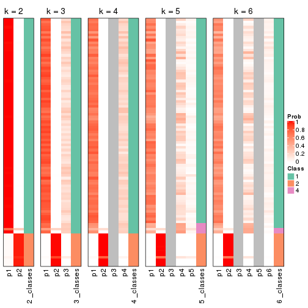


If matrix rows can be associated to genes, consider to use `GO_Enrichment(res,
...)` to perform function enrichment for the signature genes.


 

---------------------------------------------------


### CV:skmeans


The object with results only for a single top-value method and a single partition method 
can be extracted as:

```r
res = res_list["CV", "skmeans"]
# you can also extract it by
# res = res_list["CV:skmeans"]
```

A summary of `res` and all the functions that can be applied to it:

```r
res
```

```
#> A 'ConsensusPartition' object with k = 2, 3, 4, 5, 6.
#>   On a matrix with 8394 rows and 194 columns.
#>   Top rows (839, 1678, 2518, 3358, 4197) are extracted by 'CV' method.
#>   Subgroups are detected by 'skmeans' method.
#>   Performed in total 1250 partitions by row resampling.
#>   Best k for subgroups seems to be 3.
#> 
#> Following methods can be applied to this 'ConsensusPartition' object:
#>  [1] "cola_report"             "collect_classes"         "collect_plots"          
#>  [4] "collect_stats"           "colnames"                "compare_signatures"     
#>  [7] "consensus_heatmap"       "dimension_reduction"     "functional_enrichment"  
#> [10] "get_anno_col"            "get_anno"                "get_classes"            
#> [13] "get_consensus"           "get_matrix"              "get_membership"         
#> [16] "get_param"               "get_signatures"          "get_stats"              
#> [19] "is_best_k"               "is_stable_k"             "membership_heatmap"     
#> [22] "ncol"                    "nrow"                    "plot_ecdf"              
#> [25] "rownames"                "select_partition_number" "show"                   
#> [28] "suggest_best_k"          "test_to_known_factors"
```

`collect_plots()` function collects all the plots made from `res` for all `k` (number of partitions)
into one single page to provide an easy and fast comparison between different `k`.

```r
collect_plots(res)
```


The plots are:

- The first row: a plot of the ECDF (Empirical cumulative distribution
  function) curves of the consensus matrix for each `k` and the heatmap of
  predicted classes for each `k`.
- The second row: heatmaps of the consensus matrix for each `k`.
- The third row: heatmaps of the membership matrix for each `k`.
- The fouth row: heatmaps of the signatures for each `k`.

All the plots in panels can be made by individual functions and they are
plotted later in this section.

`select_partition_number()` produces several plots showing different
statistics for choosing "optimized" `k`. There are following statistics:

- ECDF curves of the consensus matrix for each `k`;
- 1-PAC. [The PAC
  score](https://en.wikipedia.org/wiki/Consensus_clustering#Over-interpretation_potential_of_consensus_clustering)
  measures the proportion of the ambiguous subgrouping.
- Mean silhouette score.
- Concordance. The mean probability of fiting the consensus class ids in all
  partitions.
- Area increased. Denote $A_k$ as the area under the ECDF curve for current
  `k`, the area increased is defined as $A_k - A_{k-1}$.
- Rand index. The percent of pairs of samples that are both in a same cluster
  or both are not in a same cluster in the partition of k and k-1.
- Jaccard index. The ratio of pairs of samples are both in a same cluster in
  the partition of k and k-1 and the pairs of samples are both in a same
  cluster in the partition k or k-1.

The detailed explanations of these statistics can be found in [the cola
vignette](http://bioconductor.org/packages/devel/bioc/vignettes/cola/inst/doc/cola.html#toc_13).

Generally speaking, lower PAC score, higher mean silhouette score or higher
concordance corresponds to better partition. Rand index and Jaccard index
measure how similar the current partition is compared to partition with `k-1`.
If they are too similar, we won't accept `k` is better than `k-1`.

```r
select_partition_number(res)
```


The numeric values for all these statistics can be obtained by `get_stats()`.

```r
get_stats(res)
```

```
#>   k 1-PAC mean_silhouette concordance area_increased  Rand Jaccard
#> 2 2 0.854           0.904       0.960         0.4155 0.579   0.579
#> 3 3 0.379           0.584       0.757         0.5543 0.695   0.508
#> 4 4 0.397           0.522       0.703         0.1446 0.835   0.576
#> 5 5 0.440           0.415       0.615         0.0728 0.924   0.722
#> 6 6 0.484           0.369       0.565         0.0448 0.921   0.667
```

`suggest_best_k()` suggests the best $k$ based on these statistics. The rules are as follows:

- All $k$ with Jaccard index larger than 0.95 are removed because the increase of
  the partition number does not provides enough extra information. If all $k$ are removed,
  the best $k$ is assigned by `NA`.
- For $k$ with 1-PAC larger than 0.9, the maximal $k$ is taken as the "best k". Other $k$ is called "optional k".
- If it does not fit the second rule. The $k$ with the highest vote of highest
  1-PAC, mean silhouette and concordance is taken as the "best k".

```r
suggest_best_k(res)
```

```
#> [1] 3
```


Following shows the table of the partitions (You need to click the **show/hide
code output** link to see it). The membership matrix (columns with name `p*`)
is inferred by
[`clue::cl_consensus()`](https://www.rdocumentation.org/link/cl_consensus?package=clue)
function with the `SE` method. Basically the value in the membership matrix
represents the probability to belong to a certain group. The finall class
label for an item is determined with the group with highest probability it
belongs to.

In `get_classes()` function, the entropy is calculated from the membership
matrix and the silhouette score is calculated from the consensus matrix.


<script>
$( function() {
	$( '#tabs-CV-skmeans-get-classes' ).tabs();
} );
</script>
<div id='tabs-CV-skmeans-get-classes'>
<ul>
<li><a href='#tab-CV-skmeans-get-classes-1'>k = 2</a></li>
<li><a href='#tab-CV-skmeans-get-classes-2'>k = 3</a></li>
<li><a href='#tab-CV-skmeans-get-classes-3'>k = 4</a></li>
<li><a href='#tab-CV-skmeans-get-classes-4'>k = 5</a></li>
<li><a href='#tab-CV-skmeans-get-classes-5'>k = 6</a></li>
</ul>

<div id='tab-CV-skmeans-get-classes-1'>
<p><a id='tab-CV-skmeans-get-classes-1-a' style='color:#0366d6' href='#'>show/hide code output</a></p>
<pre><code class="r">cbind(get_classes(res, k = 2), get_membership(res, k = 2))
</code></pre>

<pre><code>#&gt;           class entropy silhouette    p1    p2
#&gt; ERR467487     2  0.0000      0.920 0.000 1.000
#&gt; ERR467498     2  0.0000      0.920 0.000 1.000
#&gt; ERR658998     1  0.0000      0.973 1.000 0.000
#&gt; ERR659094     1  0.0000      0.973 1.000 0.000
#&gt; ERR658999     1  0.0000      0.973 1.000 0.000
#&gt; ERR659095     1  0.0000      0.973 1.000 0.000
#&gt; ERR659000     2  0.0000      0.920 0.000 1.000
#&gt; ERR659096     2  0.0000      0.920 0.000 1.000
#&gt; ERR659001     1  0.0000      0.973 1.000 0.000
#&gt; ERR659097     1  0.0000      0.973 1.000 0.000
#&gt; ERR659002     1  0.0000      0.973 1.000 0.000
#&gt; ERR659098     1  0.0000      0.973 1.000 0.000
#&gt; ERR659003     1  0.0000      0.973 1.000 0.000
#&gt; ERR659099     1  0.0000      0.973 1.000 0.000
#&gt; ERR659004     2  0.9522      0.463 0.372 0.628
#&gt; ERR659100     2  0.9522      0.463 0.372 0.628
#&gt; ERR659005     1  0.0000      0.973 1.000 0.000
#&gt; ERR659101     1  0.0000      0.973 1.000 0.000
#&gt; ERR659006     1  0.0000      0.973 1.000 0.000
#&gt; ERR659102     1  0.0000      0.973 1.000 0.000
#&gt; ERR659007     1  0.0000      0.973 1.000 0.000
#&gt; ERR659103     1  0.0000      0.973 1.000 0.000
#&gt; ERR659008     2  0.0000      0.920 0.000 1.000
#&gt; ERR659104     2  0.0000      0.920 0.000 1.000
#&gt; ERR659009     1  0.0000      0.973 1.000 0.000
#&gt; ERR659105     1  0.0000      0.973 1.000 0.000
#&gt; ERR659010     1  0.0000      0.973 1.000 0.000
#&gt; ERR659106     1  0.0000      0.973 1.000 0.000
#&gt; ERR659011     1  0.0000      0.973 1.000 0.000
#&gt; ERR659107     1  0.0000      0.973 1.000 0.000
#&gt; ERR659012     1  0.8144      0.642 0.748 0.252
#&gt; ERR659108     1  0.8144      0.642 0.748 0.252
#&gt; ERR659013     2  0.2236      0.897 0.036 0.964
#&gt; ERR659109     2  0.2236      0.897 0.036 0.964
#&gt; ERR659014     2  0.0000      0.920 0.000 1.000
#&gt; ERR659110     2  0.0000      0.920 0.000 1.000
#&gt; ERR659015     1  0.0000      0.973 1.000 0.000
#&gt; ERR659111     1  0.0000      0.973 1.000 0.000
#&gt; ERR659016     2  0.0000      0.920 0.000 1.000
#&gt; ERR659112     2  0.0000      0.920 0.000 1.000
#&gt; ERR659017     2  0.0000      0.920 0.000 1.000
#&gt; ERR659113     2  0.0000      0.920 0.000 1.000
#&gt; ERR659018     1  0.0000      0.973 1.000 0.000
#&gt; ERR659114     1  0.0000      0.973 1.000 0.000
#&gt; ERR659019     1  0.0000      0.973 1.000 0.000
#&gt; ERR659115     1  0.0000      0.973 1.000 0.000
#&gt; ERR659020     1  0.0000      0.973 1.000 0.000
#&gt; ERR659116     1  0.0000      0.973 1.000 0.000
#&gt; ERR659021     1  0.0000      0.973 1.000 0.000
#&gt; ERR659117     1  0.0000      0.973 1.000 0.000
#&gt; ERR659022     1  0.0000      0.973 1.000 0.000
#&gt; ERR659118     1  0.0000      0.973 1.000 0.000
#&gt; ERR659023     1  0.9732      0.270 0.596 0.404
#&gt; ERR659119     1  0.9732      0.270 0.596 0.404
#&gt; ERR659024     1  0.2778      0.929 0.952 0.048
#&gt; ERR659120     1  0.2778      0.929 0.952 0.048
#&gt; ERR659025     1  0.3431      0.912 0.936 0.064
#&gt; ERR659121     1  0.3431      0.912 0.936 0.064
#&gt; ERR659026     1  0.0000      0.973 1.000 0.000
#&gt; ERR659122     1  0.0000      0.973 1.000 0.000
#&gt; ERR659027     2  0.0000      0.920 0.000 1.000
#&gt; ERR659123     2  0.0000      0.920 0.000 1.000
#&gt; ERR659028     1  0.6712      0.772 0.824 0.176
#&gt; ERR659124     1  0.6712      0.772 0.824 0.176
#&gt; ERR659029     1  0.0000      0.973 1.000 0.000
#&gt; ERR659125     1  0.0000      0.973 1.000 0.000
#&gt; ERR659030     1  0.0000      0.973 1.000 0.000
#&gt; ERR659126     1  0.0000      0.973 1.000 0.000
#&gt; ERR659031     2  0.9087      0.565 0.324 0.676
#&gt; ERR659127     2  0.9087      0.565 0.324 0.676
#&gt; ERR659032     1  0.5408      0.843 0.876 0.124
#&gt; ERR659128     1  0.5408      0.843 0.876 0.124
#&gt; ERR659033     1  0.0000      0.973 1.000 0.000
#&gt; ERR659129     1  0.0000      0.973 1.000 0.000
#&gt; ERR659034     2  0.0000      0.920 0.000 1.000
#&gt; ERR659130     2  0.0000      0.920 0.000 1.000
#&gt; ERR659035     1  0.0000      0.973 1.000 0.000
#&gt; ERR659131     1  0.0000      0.973 1.000 0.000
#&gt; ERR659036     1  0.1184      0.959 0.984 0.016
#&gt; ERR659132     1  0.1184      0.959 0.984 0.016
#&gt; ERR659037     1  0.0000      0.973 1.000 0.000
#&gt; ERR659133     1  0.0000      0.973 1.000 0.000
#&gt; ERR659038     1  0.0000      0.973 1.000 0.000
#&gt; ERR659134     1  0.0000      0.973 1.000 0.000
#&gt; ERR659039     1  0.0000      0.973 1.000 0.000
#&gt; ERR659135     1  0.0000      0.973 1.000 0.000
#&gt; ERR659040     2  0.9933      0.247 0.452 0.548
#&gt; ERR659136     2  0.9933      0.247 0.452 0.548
#&gt; ERR659041     2  0.1184      0.911 0.016 0.984
#&gt; ERR659137     2  0.1184      0.911 0.016 0.984
#&gt; ERR659042     2  0.0000      0.920 0.000 1.000
#&gt; ERR659138     2  0.0000      0.920 0.000 1.000
#&gt; ERR659043     1  0.0000      0.973 1.000 0.000
#&gt; ERR659139     1  0.0000      0.973 1.000 0.000
#&gt; ERR659044     2  0.0000      0.920 0.000 1.000
#&gt; ERR659140     2  0.0000      0.920 0.000 1.000
#&gt; ERR659045     1  0.0000      0.973 1.000 0.000
#&gt; ERR659141     1  0.0000      0.973 1.000 0.000
#&gt; ERR659046     1  0.0000      0.973 1.000 0.000
#&gt; ERR659142     1  0.0000      0.973 1.000 0.000
#&gt; ERR659047     1  0.0000      0.973 1.000 0.000
#&gt; ERR659143     1  0.0000      0.973 1.000 0.000
#&gt; ERR659048     1  0.0376      0.970 0.996 0.004
#&gt; ERR659144     1  0.0376      0.970 0.996 0.004
#&gt; ERR659049     2  0.9635      0.437 0.388 0.612
#&gt; ERR659145     2  0.9635      0.437 0.388 0.612
#&gt; ERR659050     2  0.9909      0.278 0.444 0.556
#&gt; ERR659146     2  0.9909      0.278 0.444 0.556
#&gt; ERR659051     2  0.0000      0.920 0.000 1.000
#&gt; ERR659147     2  0.0000      0.920 0.000 1.000
#&gt; ERR659052     1  0.9795      0.227 0.584 0.416
#&gt; ERR659148     1  0.9795      0.227 0.584 0.416
#&gt; ERR659053     1  0.0000      0.973 1.000 0.000
#&gt; ERR659149     1  0.0000      0.973 1.000 0.000
#&gt; ERR659054     2  0.0000      0.920 0.000 1.000
#&gt; ERR659150     2  0.0000      0.920 0.000 1.000
#&gt; ERR659055     1  0.0000      0.973 1.000 0.000
#&gt; ERR659151     1  0.0000      0.973 1.000 0.000
#&gt; ERR659056     2  0.0000      0.920 0.000 1.000
#&gt; ERR659152     2  0.0000      0.920 0.000 1.000
#&gt; ERR659057     1  0.0000      0.973 1.000 0.000
#&gt; ERR659153     1  0.0000      0.973 1.000 0.000
#&gt; ERR659058     1  0.0000      0.973 1.000 0.000
#&gt; ERR659154     1  0.0000      0.973 1.000 0.000
#&gt; ERR659059     1  0.0000      0.973 1.000 0.000
#&gt; ERR659155     1  0.0000      0.973 1.000 0.000
#&gt; ERR659060     1  0.0000      0.973 1.000 0.000
#&gt; ERR659156     1  0.0000      0.973 1.000 0.000
#&gt; ERR659061     1  0.0000      0.973 1.000 0.000
#&gt; ERR659157     1  0.0000      0.973 1.000 0.000
#&gt; ERR659062     2  0.6148      0.796 0.152 0.848
#&gt; ERR659158     2  0.6148      0.796 0.152 0.848
#&gt; ERR659063     1  0.0000      0.973 1.000 0.000
#&gt; ERR659159     1  0.0000      0.973 1.000 0.000
#&gt; ERR659064     1  0.0000      0.973 1.000 0.000
#&gt; ERR659160     1  0.0000      0.973 1.000 0.000
#&gt; ERR659065     2  0.0000      0.920 0.000 1.000
#&gt; ERR659161     2  0.0000      0.920 0.000 1.000
#&gt; ERR659066     1  0.0000      0.973 1.000 0.000
#&gt; ERR659162     1  0.0000      0.973 1.000 0.000
#&gt; ERR659067     1  0.0000      0.973 1.000 0.000
#&gt; ERR659163     1  0.0000      0.973 1.000 0.000
#&gt; ERR659068     2  0.0000      0.920 0.000 1.000
#&gt; ERR659164     2  0.0000      0.920 0.000 1.000
#&gt; ERR659069     1  0.0000      0.973 1.000 0.000
#&gt; ERR659165     1  0.0000      0.973 1.000 0.000
#&gt; ERR659070     1  0.0000      0.973 1.000 0.000
#&gt; ERR659166     1  0.0000      0.973 1.000 0.000
#&gt; ERR659071     1  0.0000      0.973 1.000 0.000
#&gt; ERR659167     1  0.0000      0.973 1.000 0.000
#&gt; ERR659072     1  0.0000      0.973 1.000 0.000
#&gt; ERR659168     1  0.0000      0.973 1.000 0.000
#&gt; ERR659073     1  0.0000      0.973 1.000 0.000
#&gt; ERR659169     1  0.0000      0.973 1.000 0.000
#&gt; ERR659074     2  0.0000      0.920 0.000 1.000
#&gt; ERR659170     2  0.0000      0.920 0.000 1.000
#&gt; ERR659075     2  0.0000      0.920 0.000 1.000
#&gt; ERR659171     2  0.0000      0.920 0.000 1.000
#&gt; ERR659076     2  0.0000      0.920 0.000 1.000
#&gt; ERR659172     2  0.0000      0.920 0.000 1.000
#&gt; ERR659077     1  0.0000      0.973 1.000 0.000
#&gt; ERR659173     1  0.0000      0.973 1.000 0.000
#&gt; ERR659078     1  0.0000      0.973 1.000 0.000
#&gt; ERR659174     1  0.0000      0.973 1.000 0.000
#&gt; ERR659079     1  0.0000      0.973 1.000 0.000
#&gt; ERR659175     1  0.0000      0.973 1.000 0.000
#&gt; ERR659080     2  0.0672      0.916 0.008 0.992
#&gt; ERR659176     2  0.0672      0.916 0.008 0.992
#&gt; ERR659081     1  0.0000      0.973 1.000 0.000
#&gt; ERR659177     1  0.0000      0.973 1.000 0.000
#&gt; ERR659082     1  0.0000      0.973 1.000 0.000
#&gt; ERR659178     1  0.0000      0.973 1.000 0.000
#&gt; ERR659083     2  0.0000      0.920 0.000 1.000
#&gt; ERR659179     2  0.0000      0.920 0.000 1.000
#&gt; ERR659084     2  0.0000      0.920 0.000 1.000
#&gt; ERR659180     2  0.0000      0.920 0.000 1.000
#&gt; ERR659085     1  0.0000      0.973 1.000 0.000
#&gt; ERR659181     1  0.0000      0.973 1.000 0.000
#&gt; ERR659086     1  0.0000      0.973 1.000 0.000
#&gt; ERR659182     1  0.0000      0.973 1.000 0.000
#&gt; ERR659087     1  0.0000      0.973 1.000 0.000
#&gt; ERR659183     1  0.0000      0.973 1.000 0.000
#&gt; ERR659088     1  0.5946      0.820 0.856 0.144
#&gt; ERR659184     1  0.5946      0.820 0.856 0.144
#&gt; ERR659089     1  0.0000      0.973 1.000 0.000
#&gt; ERR659185     1  0.0000      0.973 1.000 0.000
#&gt; ERR659090     1  0.0000      0.973 1.000 0.000
#&gt; ERR659186     1  0.0000      0.973 1.000 0.000
#&gt; ERR659091     1  0.0000      0.973 1.000 0.000
#&gt; ERR659187     1  0.0000      0.973 1.000 0.000
#&gt; ERR659092     1  0.0000      0.973 1.000 0.000
#&gt; ERR659188     1  0.0000      0.973 1.000 0.000
#&gt; ERR659093     1  0.0000      0.973 1.000 0.000
#&gt; ERR659189     1  0.0000      0.973 1.000 0.000
</code></pre>

<script>
$('#tab-CV-skmeans-get-classes-1-a').parent().next().next().hide();
$('#tab-CV-skmeans-get-classes-1-a').click(function(){
  $('#tab-CV-skmeans-get-classes-1-a').parent().next().next().toggle();
  return(false);
});
</script>
</div>

<div id='tab-CV-skmeans-get-classes-2'>
<p><a id='tab-CV-skmeans-get-classes-2-a' style='color:#0366d6' href='#'>show/hide code output</a></p>
<pre><code class="r">cbind(get_classes(res, k = 3), get_membership(res, k = 3))
</code></pre>

<pre><code>#&gt;           class entropy silhouette    p1    p2    p3
#&gt; ERR467487     2   0.343   0.893124 0.064 0.904 0.032
#&gt; ERR467498     2   0.343   0.893124 0.064 0.904 0.032
#&gt; ERR658998     1   0.631  -0.039213 0.512 0.000 0.488
#&gt; ERR659094     1   0.631  -0.040957 0.508 0.000 0.492
#&gt; ERR658999     3   0.254   0.655573 0.080 0.000 0.920
#&gt; ERR659095     3   0.254   0.655573 0.080 0.000 0.920
#&gt; ERR659000     2   0.406   0.864446 0.112 0.868 0.020
#&gt; ERR659096     2   0.406   0.864446 0.112 0.868 0.020
#&gt; ERR659001     3   0.518   0.534446 0.256 0.000 0.744
#&gt; ERR659097     3   0.518   0.534446 0.256 0.000 0.744
#&gt; ERR659002     1   0.620   0.347065 0.576 0.000 0.424
#&gt; ERR659098     1   0.620   0.347065 0.576 0.000 0.424
#&gt; ERR659003     1   0.565   0.603625 0.688 0.000 0.312
#&gt; ERR659099     1   0.565   0.603625 0.688 0.000 0.312
#&gt; ERR659004     3   0.462   0.571452 0.024 0.136 0.840
#&gt; ERR659100     3   0.462   0.571452 0.024 0.136 0.840
#&gt; ERR659005     1   0.450   0.634165 0.804 0.000 0.196
#&gt; ERR659101     1   0.450   0.634165 0.804 0.000 0.196
#&gt; ERR659006     3   0.175   0.662622 0.048 0.000 0.952
#&gt; ERR659102     3   0.175   0.662622 0.048 0.000 0.952
#&gt; ERR659007     1   0.604   0.551316 0.620 0.000 0.380
#&gt; ERR659103     1   0.604   0.551316 0.620 0.000 0.380
#&gt; ERR659008     2   0.000   0.950728 0.000 1.000 0.000
#&gt; ERR659104     2   0.000   0.950728 0.000 1.000 0.000
#&gt; ERR659009     3   0.480   0.537705 0.220 0.000 0.780
#&gt; ERR659105     3   0.480   0.537705 0.220 0.000 0.780
#&gt; ERR659010     3   0.334   0.617153 0.120 0.000 0.880
#&gt; ERR659106     3   0.334   0.617153 0.120 0.000 0.880
#&gt; ERR659011     3   0.319   0.642897 0.112 0.000 0.888
#&gt; ERR659107     3   0.319   0.642897 0.112 0.000 0.888
#&gt; ERR659012     3   0.392   0.602041 0.140 0.004 0.856
#&gt; ERR659108     3   0.392   0.602041 0.140 0.004 0.856
#&gt; ERR659013     2   0.960   0.175865 0.364 0.432 0.204
#&gt; ERR659109     2   0.960   0.175865 0.364 0.432 0.204
#&gt; ERR659014     2   0.000   0.950728 0.000 1.000 0.000
#&gt; ERR659110     2   0.000   0.950728 0.000 1.000 0.000
#&gt; ERR659015     1   0.382   0.611473 0.852 0.000 0.148
#&gt; ERR659111     1   0.382   0.611473 0.852 0.000 0.148
#&gt; ERR659016     2   0.223   0.917787 0.044 0.944 0.012
#&gt; ERR659112     2   0.223   0.917787 0.044 0.944 0.012
#&gt; ERR659017     2   0.000   0.950728 0.000 1.000 0.000
#&gt; ERR659113     2   0.000   0.950728 0.000 1.000 0.000
#&gt; ERR659018     3   0.621  -0.120492 0.428 0.000 0.572
#&gt; ERR659114     3   0.621  -0.120492 0.428 0.000 0.572
#&gt; ERR659019     3   0.394   0.597985 0.156 0.000 0.844
#&gt; ERR659115     3   0.394   0.597985 0.156 0.000 0.844
#&gt; ERR659020     3   0.614   0.005569 0.404 0.000 0.596
#&gt; ERR659116     3   0.615  -0.011137 0.408 0.000 0.592
#&gt; ERR659021     1   0.583   0.594223 0.660 0.000 0.340
#&gt; ERR659117     1   0.583   0.594223 0.660 0.000 0.340
#&gt; ERR659022     1   0.546   0.620237 0.712 0.000 0.288
#&gt; ERR659118     1   0.546   0.620237 0.712 0.000 0.288
#&gt; ERR659023     1   0.855   0.256257 0.552 0.336 0.112
#&gt; ERR659119     1   0.855   0.256257 0.552 0.336 0.112
#&gt; ERR659024     1   0.491   0.562690 0.796 0.008 0.196
#&gt; ERR659120     1   0.491   0.562690 0.796 0.008 0.196
#&gt; ERR659025     1   0.451   0.635930 0.832 0.012 0.156
#&gt; ERR659121     1   0.451   0.635930 0.832 0.012 0.156
#&gt; ERR659026     3   0.581   0.310590 0.336 0.000 0.664
#&gt; ERR659122     3   0.581   0.310590 0.336 0.000 0.664
#&gt; ERR659027     2   0.162   0.932923 0.024 0.964 0.012
#&gt; ERR659123     2   0.162   0.932923 0.024 0.964 0.012
#&gt; ERR659028     1   0.623   0.488286 0.740 0.040 0.220
#&gt; ERR659124     1   0.623   0.488286 0.740 0.040 0.220
#&gt; ERR659029     1   0.502   0.501339 0.776 0.004 0.220
#&gt; ERR659125     1   0.502   0.501339 0.776 0.004 0.220
#&gt; ERR659030     1   0.615   0.516897 0.592 0.000 0.408
#&gt; ERR659126     1   0.615   0.516897 0.592 0.000 0.408
#&gt; ERR659031     3   0.912   0.265358 0.340 0.156 0.504
#&gt; ERR659127     3   0.912   0.265358 0.340 0.156 0.504
#&gt; ERR659032     1   0.666   0.362124 0.668 0.028 0.304
#&gt; ERR659128     1   0.666   0.362124 0.668 0.028 0.304
#&gt; ERR659033     1   0.601   0.573320 0.628 0.000 0.372
#&gt; ERR659129     1   0.601   0.573320 0.628 0.000 0.372
#&gt; ERR659034     2   0.000   0.950728 0.000 1.000 0.000
#&gt; ERR659130     2   0.000   0.950728 0.000 1.000 0.000
#&gt; ERR659035     1   0.606   0.266741 0.616 0.000 0.384
#&gt; ERR659131     1   0.606   0.266741 0.616 0.000 0.384
#&gt; ERR659036     1   0.506   0.632002 0.756 0.000 0.244
#&gt; ERR659132     1   0.506   0.632002 0.756 0.000 0.244
#&gt; ERR659037     1   0.631   0.347063 0.508 0.000 0.492
#&gt; ERR659133     1   0.631   0.347063 0.508 0.000 0.492
#&gt; ERR659038     3   0.153   0.663220 0.040 0.000 0.960
#&gt; ERR659134     3   0.153   0.663220 0.040 0.000 0.960
#&gt; ERR659039     3   0.348   0.660580 0.128 0.000 0.872
#&gt; ERR659135     3   0.348   0.660580 0.128 0.000 0.872
#&gt; ERR659040     1   0.817   0.298371 0.640 0.212 0.148
#&gt; ERR659136     1   0.813   0.302146 0.644 0.208 0.148
#&gt; ERR659041     2   0.404   0.855998 0.024 0.872 0.104
#&gt; ERR659137     2   0.404   0.855998 0.024 0.872 0.104
#&gt; ERR659042     2   0.000   0.950728 0.000 1.000 0.000
#&gt; ERR659138     2   0.000   0.950728 0.000 1.000 0.000
#&gt; ERR659043     1   0.196   0.567431 0.944 0.000 0.056
#&gt; ERR659139     1   0.196   0.567431 0.944 0.000 0.056
#&gt; ERR659044     2   0.000   0.950728 0.000 1.000 0.000
#&gt; ERR659140     2   0.000   0.950728 0.000 1.000 0.000
#&gt; ERR659045     3   0.334   0.655181 0.120 0.000 0.880
#&gt; ERR659141     3   0.334   0.655181 0.120 0.000 0.880
#&gt; ERR659046     1   0.418   0.631540 0.828 0.000 0.172
#&gt; ERR659142     1   0.418   0.631540 0.828 0.000 0.172
#&gt; ERR659047     1   0.565   0.613681 0.688 0.000 0.312
#&gt; ERR659143     1   0.565   0.613681 0.688 0.000 0.312
#&gt; ERR659048     1   0.435   0.635968 0.816 0.000 0.184
#&gt; ERR659144     1   0.435   0.635968 0.816 0.000 0.184
#&gt; ERR659049     3   0.753   0.427664 0.252 0.084 0.664
#&gt; ERR659145     3   0.757   0.420173 0.256 0.084 0.660
#&gt; ERR659050     1   0.857   0.246820 0.588 0.140 0.272
#&gt; ERR659146     1   0.857   0.246820 0.588 0.140 0.272
#&gt; ERR659051     2   0.000   0.950728 0.000 1.000 0.000
#&gt; ERR659147     2   0.000   0.950728 0.000 1.000 0.000
#&gt; ERR659052     3   0.628   0.501057 0.224 0.040 0.736
#&gt; ERR659148     3   0.628   0.501057 0.224 0.040 0.736
#&gt; ERR659053     1   0.518   0.626798 0.744 0.000 0.256
#&gt; ERR659149     1   0.518   0.626798 0.744 0.000 0.256
#&gt; ERR659054     2   0.000   0.950728 0.000 1.000 0.000
#&gt; ERR659150     2   0.000   0.950728 0.000 1.000 0.000
#&gt; ERR659055     3   0.429   0.584109 0.180 0.000 0.820
#&gt; ERR659151     3   0.429   0.584109 0.180 0.000 0.820
#&gt; ERR659056     2   0.000   0.950728 0.000 1.000 0.000
#&gt; ERR659152     2   0.000   0.950728 0.000 1.000 0.000
#&gt; ERR659057     1   0.629   0.288624 0.532 0.000 0.468
#&gt; ERR659153     1   0.629   0.288624 0.532 0.000 0.468
#&gt; ERR659058     3   0.271   0.656017 0.088 0.000 0.912
#&gt; ERR659154     3   0.271   0.656017 0.088 0.000 0.912
#&gt; ERR659059     1   0.506   0.601363 0.756 0.000 0.244
#&gt; ERR659155     1   0.506   0.601363 0.756 0.000 0.244
#&gt; ERR659060     1   0.579   0.591868 0.668 0.000 0.332
#&gt; ERR659156     1   0.579   0.591868 0.668 0.000 0.332
#&gt; ERR659061     1   0.565   0.609774 0.688 0.000 0.312
#&gt; ERR659157     1   0.565   0.609774 0.688 0.000 0.312
#&gt; ERR659062     3   0.986   0.139470 0.256 0.352 0.392
#&gt; ERR659158     3   0.986   0.139470 0.256 0.352 0.392
#&gt; ERR659063     1   0.288   0.603752 0.904 0.000 0.096
#&gt; ERR659159     1   0.288   0.603752 0.904 0.000 0.096
#&gt; ERR659064     1   0.597   0.569735 0.636 0.000 0.364
#&gt; ERR659160     1   0.597   0.569735 0.636 0.000 0.364
#&gt; ERR659065     2   0.000   0.950728 0.000 1.000 0.000
#&gt; ERR659161     2   0.000   0.950728 0.000 1.000 0.000
#&gt; ERR659066     3   0.312   0.638359 0.108 0.000 0.892
#&gt; ERR659162     3   0.312   0.638359 0.108 0.000 0.892
#&gt; ERR659067     3   0.288   0.664723 0.096 0.000 0.904
#&gt; ERR659163     3   0.288   0.664723 0.096 0.000 0.904
#&gt; ERR659068     2   0.000   0.950728 0.000 1.000 0.000
#&gt; ERR659164     2   0.000   0.950728 0.000 1.000 0.000
#&gt; ERR659069     3   0.312   0.662799 0.108 0.000 0.892
#&gt; ERR659165     3   0.312   0.662799 0.108 0.000 0.892
#&gt; ERR659070     1   0.565   0.594473 0.688 0.000 0.312
#&gt; ERR659166     1   0.565   0.594473 0.688 0.000 0.312
#&gt; ERR659071     1   0.435   0.603307 0.816 0.000 0.184
#&gt; ERR659167     1   0.435   0.603307 0.816 0.000 0.184
#&gt; ERR659072     3   0.186   0.661111 0.052 0.000 0.948
#&gt; ERR659168     3   0.186   0.661111 0.052 0.000 0.948
#&gt; ERR659073     3   0.581   0.384971 0.336 0.000 0.664
#&gt; ERR659169     3   0.581   0.384971 0.336 0.000 0.664
#&gt; ERR659074     2   0.000   0.950728 0.000 1.000 0.000
#&gt; ERR659170     2   0.000   0.950728 0.000 1.000 0.000
#&gt; ERR659075     2   0.000   0.950728 0.000 1.000 0.000
#&gt; ERR659171     2   0.000   0.950728 0.000 1.000 0.000
#&gt; ERR659076     2   0.000   0.950728 0.000 1.000 0.000
#&gt; ERR659172     2   0.000   0.950728 0.000 1.000 0.000
#&gt; ERR659077     1   0.540   0.514420 0.720 0.000 0.280
#&gt; ERR659173     1   0.540   0.514420 0.720 0.000 0.280
#&gt; ERR659078     1   0.619   0.422232 0.580 0.000 0.420
#&gt; ERR659174     1   0.619   0.422232 0.580 0.000 0.420
#&gt; ERR659079     1   0.455   0.499682 0.800 0.000 0.200
#&gt; ERR659175     1   0.455   0.499682 0.800 0.000 0.200
#&gt; ERR659080     2   0.468   0.826445 0.132 0.840 0.028
#&gt; ERR659176     2   0.468   0.826445 0.132 0.840 0.028
#&gt; ERR659081     1   0.599   0.557358 0.632 0.000 0.368
#&gt; ERR659177     1   0.599   0.557358 0.632 0.000 0.368
#&gt; ERR659082     1   0.613   0.537427 0.600 0.000 0.400
#&gt; ERR659178     1   0.613   0.537427 0.600 0.000 0.400
#&gt; ERR659083     2   0.000   0.950728 0.000 1.000 0.000
#&gt; ERR659179     2   0.000   0.950728 0.000 1.000 0.000
#&gt; ERR659084     2   0.000   0.950728 0.000 1.000 0.000
#&gt; ERR659180     2   0.000   0.950728 0.000 1.000 0.000
#&gt; ERR659085     3   0.619  -0.062143 0.420 0.000 0.580
#&gt; ERR659181     3   0.619  -0.062143 0.420 0.000 0.580
#&gt; ERR659086     1   0.603   0.557785 0.624 0.000 0.376
#&gt; ERR659182     1   0.603   0.557785 0.624 0.000 0.376
#&gt; ERR659087     3   0.546   0.503863 0.288 0.000 0.712
#&gt; ERR659183     3   0.546   0.503863 0.288 0.000 0.712
#&gt; ERR659088     3   0.681   0.388570 0.372 0.020 0.608
#&gt; ERR659184     3   0.681   0.388570 0.372 0.020 0.608
#&gt; ERR659089     3   0.618   0.020644 0.416 0.000 0.584
#&gt; ERR659185     3   0.619   0.000908 0.420 0.000 0.580
#&gt; ERR659090     1   0.581   0.583167 0.664 0.000 0.336
#&gt; ERR659186     1   0.581   0.583167 0.664 0.000 0.336
#&gt; ERR659091     1   0.624   0.264501 0.560 0.000 0.440
#&gt; ERR659187     1   0.624   0.264501 0.560 0.000 0.440
#&gt; ERR659092     1   0.579   0.381380 0.668 0.000 0.332
#&gt; ERR659188     1   0.579   0.381380 0.668 0.000 0.332
#&gt; ERR659093     1   0.613   0.529119 0.600 0.000 0.400
#&gt; ERR659189     1   0.613   0.529119 0.600 0.000 0.400
</code></pre>

<script>
$('#tab-CV-skmeans-get-classes-2-a').parent().next().next().hide();
$('#tab-CV-skmeans-get-classes-2-a').click(function(){
  $('#tab-CV-skmeans-get-classes-2-a').parent().next().next().toggle();
  return(false);
});
</script>
</div>

<div id='tab-CV-skmeans-get-classes-3'>
<p><a id='tab-CV-skmeans-get-classes-3-a' style='color:#0366d6' href='#'>show/hide code output</a></p>
<pre><code class="r">cbind(get_classes(res, k = 4), get_membership(res, k = 4))
</code></pre>

<pre><code>#&gt;           class entropy silhouette    p1    p2    p3    p4
#&gt; ERR467487     2   0.547     0.7295 0.048 0.772 0.048 0.132
#&gt; ERR467498     2   0.547     0.7295 0.048 0.772 0.048 0.132
#&gt; ERR658998     4   0.746     0.4796 0.224 0.000 0.272 0.504
#&gt; ERR659094     4   0.746     0.4796 0.224 0.000 0.272 0.504
#&gt; ERR658999     3   0.363     0.6280 0.184 0.000 0.812 0.004
#&gt; ERR659095     3   0.358     0.6300 0.180 0.000 0.816 0.004
#&gt; ERR659000     2   0.780     0.1923 0.096 0.484 0.044 0.376
#&gt; ERR659096     2   0.780     0.1923 0.096 0.484 0.044 0.376
#&gt; ERR659001     3   0.674     0.3857 0.304 0.000 0.576 0.120
#&gt; ERR659097     3   0.672     0.3962 0.300 0.000 0.580 0.120
#&gt; ERR659002     1   0.744     0.2363 0.512 0.000 0.244 0.244
#&gt; ERR659098     1   0.742     0.2431 0.516 0.000 0.240 0.244
#&gt; ERR659003     1   0.471     0.5946 0.792 0.000 0.120 0.088
#&gt; ERR659099     1   0.471     0.5946 0.792 0.000 0.120 0.088
#&gt; ERR659004     3   0.494     0.5467 0.044 0.076 0.812 0.068
#&gt; ERR659100     3   0.494     0.5467 0.044 0.076 0.812 0.068
#&gt; ERR659005     1   0.507     0.4971 0.748 0.000 0.060 0.192
#&gt; ERR659101     1   0.507     0.4971 0.748 0.000 0.060 0.192
#&gt; ERR659006     3   0.371     0.6444 0.112 0.000 0.848 0.040
#&gt; ERR659102     3   0.371     0.6444 0.112 0.000 0.848 0.040
#&gt; ERR659007     1   0.484     0.5939 0.756 0.000 0.200 0.044
#&gt; ERR659103     1   0.484     0.5939 0.756 0.000 0.200 0.044
#&gt; ERR659008     2   0.000     0.9023 0.000 1.000 0.000 0.000
#&gt; ERR659104     2   0.000     0.9023 0.000 1.000 0.000 0.000
#&gt; ERR659009     3   0.514     0.4775 0.040 0.000 0.716 0.244
#&gt; ERR659105     3   0.514     0.4775 0.040 0.000 0.716 0.244
#&gt; ERR659010     3   0.395     0.6077 0.036 0.000 0.828 0.136
#&gt; ERR659106     3   0.395     0.6077 0.036 0.000 0.828 0.136
#&gt; ERR659011     3   0.412     0.6055 0.220 0.000 0.772 0.008
#&gt; ERR659107     3   0.412     0.6055 0.220 0.000 0.772 0.008
#&gt; ERR659012     3   0.456     0.5121 0.028 0.000 0.764 0.208
#&gt; ERR659108     3   0.456     0.5121 0.028 0.000 0.764 0.208
#&gt; ERR659013     4   0.629     0.5787 0.048 0.132 0.096 0.724
#&gt; ERR659109     4   0.629     0.5787 0.048 0.132 0.096 0.724
#&gt; ERR659014     2   0.000     0.9023 0.000 1.000 0.000 0.000
#&gt; ERR659110     2   0.000     0.9023 0.000 1.000 0.000 0.000
#&gt; ERR659015     1   0.645    -0.1264 0.480 0.000 0.068 0.452
#&gt; ERR659111     1   0.645    -0.1264 0.480 0.000 0.068 0.452
#&gt; ERR659016     2   0.552     0.7173 0.108 0.760 0.016 0.116
#&gt; ERR659112     2   0.552     0.7173 0.108 0.760 0.016 0.116
#&gt; ERR659017     2   0.000     0.9023 0.000 1.000 0.000 0.000
#&gt; ERR659113     2   0.000     0.9023 0.000 1.000 0.000 0.000
#&gt; ERR659018     1   0.634     0.2900 0.528 0.000 0.408 0.064
#&gt; ERR659114     1   0.634     0.2900 0.528 0.000 0.408 0.064
#&gt; ERR659019     3   0.456     0.4444 0.328 0.000 0.672 0.000
#&gt; ERR659115     3   0.456     0.4444 0.328 0.000 0.672 0.000
#&gt; ERR659020     1   0.566     0.3411 0.576 0.000 0.396 0.028
#&gt; ERR659116     1   0.566     0.3411 0.576 0.000 0.396 0.028
#&gt; ERR659021     1   0.646     0.5568 0.644 0.000 0.196 0.160
#&gt; ERR659117     1   0.646     0.5568 0.644 0.000 0.196 0.160
#&gt; ERR659022     1   0.548     0.5249 0.736 0.000 0.136 0.128
#&gt; ERR659118     1   0.548     0.5249 0.736 0.000 0.136 0.128
#&gt; ERR659023     4   0.874     0.4500 0.292 0.176 0.072 0.460
#&gt; ERR659119     4   0.874     0.4500 0.292 0.176 0.072 0.460
#&gt; ERR659024     4   0.680     0.4790 0.284 0.008 0.108 0.600
#&gt; ERR659120     4   0.680     0.4790 0.284 0.008 0.108 0.600
#&gt; ERR659025     1   0.649     0.1666 0.592 0.004 0.080 0.324
#&gt; ERR659121     1   0.649     0.1666 0.592 0.004 0.080 0.324
#&gt; ERR659026     3   0.678     0.1815 0.368 0.000 0.528 0.104
#&gt; ERR659122     3   0.678     0.1815 0.368 0.000 0.528 0.104
#&gt; ERR659027     2   0.442     0.7880 0.044 0.828 0.020 0.108
#&gt; ERR659123     2   0.442     0.7880 0.044 0.828 0.020 0.108
#&gt; ERR659028     4   0.569     0.5898 0.164 0.008 0.096 0.732
#&gt; ERR659124     4   0.569     0.5898 0.164 0.008 0.096 0.732
#&gt; ERR659029     4   0.625     0.5174 0.252 0.000 0.104 0.644
#&gt; ERR659125     4   0.625     0.5174 0.252 0.000 0.104 0.644
#&gt; ERR659030     1   0.584     0.5153 0.648 0.000 0.292 0.060
#&gt; ERR659126     1   0.584     0.5153 0.648 0.000 0.292 0.060
#&gt; ERR659031     4   0.862     0.4125 0.168 0.068 0.288 0.476
#&gt; ERR659127     4   0.857     0.4079 0.168 0.064 0.292 0.476
#&gt; ERR659032     4   0.668     0.5856 0.192 0.004 0.168 0.636
#&gt; ERR659128     4   0.668     0.5856 0.192 0.004 0.168 0.636
#&gt; ERR659033     1   0.639     0.5468 0.636 0.000 0.244 0.120
#&gt; ERR659129     1   0.639     0.5468 0.636 0.000 0.244 0.120
#&gt; ERR659034     2   0.000     0.9023 0.000 1.000 0.000 0.000
#&gt; ERR659130     2   0.000     0.9023 0.000 1.000 0.000 0.000
#&gt; ERR659035     4   0.714     0.4810 0.256 0.000 0.188 0.556
#&gt; ERR659131     4   0.716     0.4787 0.260 0.000 0.188 0.552
#&gt; ERR659036     1   0.674     0.0915 0.532 0.000 0.100 0.368
#&gt; ERR659132     1   0.674     0.0915 0.532 0.000 0.100 0.368
#&gt; ERR659037     1   0.688     0.4194 0.548 0.000 0.328 0.124
#&gt; ERR659133     1   0.688     0.4194 0.548 0.000 0.328 0.124
#&gt; ERR659038     3   0.271     0.6614 0.080 0.000 0.900 0.020
#&gt; ERR659134     3   0.271     0.6614 0.080 0.000 0.900 0.020
#&gt; ERR659039     3   0.426     0.6587 0.128 0.000 0.816 0.056
#&gt; ERR659135     3   0.426     0.6587 0.128 0.000 0.816 0.056
#&gt; ERR659040     4   0.645     0.5883 0.120 0.088 0.072 0.720
#&gt; ERR659136     4   0.645     0.5883 0.120 0.088 0.072 0.720
#&gt; ERR659041     2   0.746     0.5447 0.060 0.632 0.144 0.164
#&gt; ERR659137     2   0.746     0.5447 0.060 0.632 0.144 0.164
#&gt; ERR659042     2   0.231     0.8643 0.028 0.928 0.004 0.040
#&gt; ERR659138     2   0.231     0.8643 0.028 0.928 0.004 0.040
#&gt; ERR659043     4   0.555     0.5336 0.280 0.000 0.048 0.672
#&gt; ERR659139     4   0.555     0.5336 0.280 0.000 0.048 0.672
#&gt; ERR659044     2   0.000     0.9023 0.000 1.000 0.000 0.000
#&gt; ERR659140     2   0.000     0.9023 0.000 1.000 0.000 0.000
#&gt; ERR659045     3   0.496     0.6263 0.204 0.000 0.748 0.048
#&gt; ERR659141     3   0.496     0.6263 0.204 0.000 0.748 0.048
#&gt; ERR659046     1   0.626     0.1634 0.600 0.000 0.076 0.324
#&gt; ERR659142     1   0.626     0.1634 0.600 0.000 0.076 0.324
#&gt; ERR659047     1   0.609     0.5801 0.680 0.000 0.188 0.132
#&gt; ERR659143     1   0.604     0.5817 0.684 0.000 0.188 0.128
#&gt; ERR659048     1   0.637     0.1305 0.540 0.000 0.068 0.392
#&gt; ERR659144     1   0.637     0.1305 0.540 0.000 0.068 0.392
#&gt; ERR659049     3   0.822     0.0960 0.236 0.024 0.468 0.272
#&gt; ERR659145     3   0.822     0.0960 0.236 0.024 0.468 0.272
#&gt; ERR659050     4   0.721     0.5910 0.152 0.036 0.176 0.636
#&gt; ERR659146     4   0.721     0.5910 0.152 0.036 0.176 0.636
#&gt; ERR659051     2   0.000     0.9023 0.000 1.000 0.000 0.000
#&gt; ERR659147     2   0.000     0.9023 0.000 1.000 0.000 0.000
#&gt; ERR659052     3   0.668     0.2317 0.060 0.020 0.588 0.332
#&gt; ERR659148     3   0.668     0.2317 0.060 0.020 0.588 0.332
#&gt; ERR659053     1   0.559     0.5765 0.724 0.000 0.112 0.164
#&gt; ERR659149     1   0.559     0.5765 0.724 0.000 0.112 0.164
#&gt; ERR659054     2   0.000     0.9023 0.000 1.000 0.000 0.000
#&gt; ERR659150     2   0.000     0.9023 0.000 1.000 0.000 0.000
#&gt; ERR659055     3   0.506     0.4967 0.300 0.000 0.680 0.020
#&gt; ERR659151     3   0.506     0.4967 0.300 0.000 0.680 0.020
#&gt; ERR659056     2   0.000     0.9023 0.000 1.000 0.000 0.000
#&gt; ERR659152     2   0.000     0.9023 0.000 1.000 0.000 0.000
#&gt; ERR659057     1   0.778    -0.0135 0.412 0.000 0.248 0.340
#&gt; ERR659153     1   0.778    -0.0135 0.412 0.000 0.248 0.340
#&gt; ERR659058     3   0.424     0.6259 0.196 0.000 0.784 0.020
#&gt; ERR659154     3   0.424     0.6259 0.196 0.000 0.784 0.020
#&gt; ERR659059     1   0.740    -0.1330 0.424 0.000 0.164 0.412
#&gt; ERR659155     1   0.742    -0.1202 0.424 0.000 0.168 0.408
#&gt; ERR659060     1   0.517     0.5517 0.760 0.000 0.116 0.124
#&gt; ERR659156     1   0.517     0.5517 0.760 0.000 0.116 0.124
#&gt; ERR659061     1   0.512     0.4924 0.764 0.000 0.108 0.128
#&gt; ERR659157     1   0.512     0.4924 0.764 0.000 0.108 0.128
#&gt; ERR659062     4   0.878     0.4061 0.092 0.148 0.292 0.468
#&gt; ERR659158     4   0.875     0.4087 0.092 0.144 0.292 0.472
#&gt; ERR659063     4   0.621     0.2195 0.452 0.000 0.052 0.496
#&gt; ERR659159     4   0.621     0.2195 0.452 0.000 0.052 0.496
#&gt; ERR659064     1   0.456     0.5851 0.764 0.000 0.208 0.028
#&gt; ERR659160     1   0.456     0.5851 0.764 0.000 0.208 0.028
#&gt; ERR659065     2   0.000     0.9023 0.000 1.000 0.000 0.000
#&gt; ERR659161     2   0.000     0.9023 0.000 1.000 0.000 0.000
#&gt; ERR659066     3   0.447     0.5988 0.232 0.000 0.752 0.016
#&gt; ERR659162     3   0.447     0.5988 0.232 0.000 0.752 0.016
#&gt; ERR659067     3   0.420     0.6504 0.156 0.000 0.808 0.036
#&gt; ERR659163     3   0.420     0.6504 0.156 0.000 0.808 0.036
#&gt; ERR659068     2   0.000     0.9023 0.000 1.000 0.000 0.000
#&gt; ERR659164     2   0.000     0.9023 0.000 1.000 0.000 0.000
#&gt; ERR659069     3   0.447     0.6459 0.172 0.000 0.788 0.040
#&gt; ERR659165     3   0.447     0.6459 0.172 0.000 0.788 0.040
#&gt; ERR659070     1   0.360     0.6102 0.848 0.000 0.124 0.028
#&gt; ERR659166     1   0.360     0.6102 0.848 0.000 0.124 0.028
#&gt; ERR659071     4   0.697     0.3790 0.328 0.000 0.132 0.540
#&gt; ERR659167     4   0.697     0.3790 0.328 0.000 0.132 0.540
#&gt; ERR659072     3   0.325     0.6517 0.140 0.000 0.852 0.008
#&gt; ERR659168     3   0.325     0.6517 0.140 0.000 0.852 0.008
#&gt; ERR659073     3   0.741     0.1346 0.340 0.000 0.480 0.180
#&gt; ERR659169     3   0.741     0.1346 0.340 0.000 0.480 0.180
#&gt; ERR659074     2   0.000     0.9023 0.000 1.000 0.000 0.000
#&gt; ERR659170     2   0.000     0.9023 0.000 1.000 0.000 0.000
#&gt; ERR659075     2   0.000     0.9023 0.000 1.000 0.000 0.000
#&gt; ERR659171     2   0.000     0.9023 0.000 1.000 0.000 0.000
#&gt; ERR659076     2   0.000     0.9023 0.000 1.000 0.000 0.000
#&gt; ERR659172     2   0.000     0.9023 0.000 1.000 0.000 0.000
#&gt; ERR659077     4   0.699     0.3456 0.324 0.000 0.136 0.540
#&gt; ERR659173     4   0.699     0.3456 0.324 0.000 0.136 0.540
#&gt; ERR659078     1   0.693     0.3802 0.580 0.000 0.164 0.256
#&gt; ERR659174     1   0.693     0.3802 0.580 0.000 0.164 0.256
#&gt; ERR659079     4   0.550     0.5937 0.176 0.000 0.096 0.728
#&gt; ERR659175     4   0.550     0.5937 0.176 0.000 0.096 0.728
#&gt; ERR659080     2   0.874     0.1701 0.160 0.476 0.084 0.280
#&gt; ERR659176     2   0.874     0.1701 0.160 0.476 0.084 0.280
#&gt; ERR659081     1   0.476     0.5936 0.760 0.000 0.200 0.040
#&gt; ERR659177     1   0.476     0.5936 0.760 0.000 0.200 0.040
#&gt; ERR659082     1   0.492     0.5821 0.736 0.000 0.228 0.036
#&gt; ERR659178     1   0.492     0.5821 0.736 0.000 0.228 0.036
#&gt; ERR659083     2   0.000     0.9023 0.000 1.000 0.000 0.000
#&gt; ERR659179     2   0.000     0.9023 0.000 1.000 0.000 0.000
#&gt; ERR659084     2   0.000     0.9023 0.000 1.000 0.000 0.000
#&gt; ERR659180     2   0.000     0.9023 0.000 1.000 0.000 0.000
#&gt; ERR659085     1   0.625     0.3831 0.564 0.000 0.372 0.064
#&gt; ERR659181     1   0.625     0.3831 0.564 0.000 0.372 0.064
#&gt; ERR659086     1   0.612     0.5604 0.680 0.000 0.172 0.148
#&gt; ERR659182     1   0.612     0.5604 0.680 0.000 0.172 0.148
#&gt; ERR659087     3   0.693     0.3312 0.136 0.000 0.556 0.308
#&gt; ERR659183     3   0.693     0.3312 0.136 0.000 0.556 0.308
#&gt; ERR659088     3   0.825    -0.1208 0.200 0.024 0.416 0.360
#&gt; ERR659184     3   0.817    -0.1091 0.200 0.020 0.420 0.360
#&gt; ERR659089     1   0.603     0.3928 0.584 0.000 0.364 0.052
#&gt; ERR659185     1   0.603     0.3928 0.584 0.000 0.364 0.052
#&gt; ERR659090     1   0.656     0.5497 0.628 0.000 0.224 0.148
#&gt; ERR659186     1   0.656     0.5497 0.628 0.000 0.224 0.148
#&gt; ERR659091     1   0.772     0.2330 0.428 0.000 0.336 0.236
#&gt; ERR659187     1   0.772     0.2330 0.428 0.000 0.336 0.236
#&gt; ERR659092     4   0.720     0.4812 0.228 0.000 0.220 0.552
#&gt; ERR659188     4   0.720     0.4812 0.228 0.000 0.220 0.552
#&gt; ERR659093     1   0.576     0.6013 0.700 0.000 0.204 0.096
#&gt; ERR659189     1   0.576     0.6013 0.700 0.000 0.204 0.096
</code></pre>

<script>
$('#tab-CV-skmeans-get-classes-3-a').parent().next().next().hide();
$('#tab-CV-skmeans-get-classes-3-a').click(function(){
  $('#tab-CV-skmeans-get-classes-3-a').parent().next().next().toggle();
  return(false);
});
</script>
</div>

<div id='tab-CV-skmeans-get-classes-4'>
<p><a id='tab-CV-skmeans-get-classes-4-a' style='color:#0366d6' href='#'>show/hide code output</a></p>
<pre><code class="r">cbind(get_classes(res, k = 5), get_membership(res, k = 5))
</code></pre>

<pre><code>#&gt;           class entropy silhouette    p1    p2    p3    p4    p5
#&gt; ERR467487     2  0.6807    0.34819 0.008 0.556 0.120 0.280 0.036
#&gt; ERR467498     2  0.6807    0.34819 0.008 0.556 0.120 0.280 0.036
#&gt; ERR658998     3  0.6766    0.35540 0.156 0.000 0.608 0.088 0.148
#&gt; ERR659094     3  0.6766    0.35540 0.156 0.000 0.608 0.088 0.148
#&gt; ERR658999     5  0.3373    0.59991 0.168 0.000 0.008 0.008 0.816
#&gt; ERR659095     5  0.3373    0.59991 0.168 0.000 0.008 0.008 0.816
#&gt; ERR659000     4  0.7184    0.10587 0.028 0.300 0.224 0.448 0.000
#&gt; ERR659096     4  0.7184    0.10587 0.028 0.300 0.224 0.448 0.000
#&gt; ERR659001     5  0.7139    0.27277 0.304 0.000 0.124 0.068 0.504
#&gt; ERR659097     5  0.7139    0.27277 0.304 0.000 0.124 0.068 0.504
#&gt; ERR659002     4  0.7833    0.03452 0.356 0.000 0.092 0.376 0.176
#&gt; ERR659098     4  0.7833    0.03452 0.356 0.000 0.092 0.376 0.176
#&gt; ERR659003     1  0.4892    0.54417 0.764 0.000 0.124 0.056 0.056
#&gt; ERR659099     1  0.4892    0.54417 0.764 0.000 0.124 0.056 0.056
#&gt; ERR659004     5  0.5983    0.50234 0.028 0.024 0.080 0.184 0.684
#&gt; ERR659100     5  0.5983    0.50234 0.028 0.024 0.080 0.184 0.684
#&gt; ERR659005     1  0.4764    0.48018 0.756 0.000 0.140 0.088 0.016
#&gt; ERR659101     1  0.4806    0.47956 0.752 0.000 0.144 0.088 0.016
#&gt; ERR659006     5  0.3791    0.60476 0.060 0.000 0.024 0.080 0.836
#&gt; ERR659102     5  0.3791    0.60476 0.060 0.000 0.024 0.080 0.836
#&gt; ERR659007     1  0.4535    0.57403 0.792 0.000 0.068 0.044 0.096
#&gt; ERR659103     1  0.4535    0.57403 0.792 0.000 0.068 0.044 0.096
#&gt; ERR659008     2  0.0000    0.89158 0.000 1.000 0.000 0.000 0.000
#&gt; ERR659104     2  0.0000    0.89158 0.000 1.000 0.000 0.000 0.000
#&gt; ERR659009     5  0.6318    0.41043 0.032 0.000 0.248 0.120 0.600
#&gt; ERR659105     5  0.6318    0.41043 0.032 0.000 0.248 0.120 0.600
#&gt; ERR659010     5  0.4797    0.59803 0.052 0.000 0.092 0.080 0.776
#&gt; ERR659106     5  0.4797    0.59803 0.052 0.000 0.092 0.080 0.776
#&gt; ERR659011     5  0.4802    0.56217 0.240 0.000 0.016 0.036 0.708
#&gt; ERR659107     5  0.4802    0.56217 0.240 0.000 0.016 0.036 0.708
#&gt; ERR659012     5  0.6245    0.46051 0.040 0.000 0.240 0.104 0.616
#&gt; ERR659108     5  0.6245    0.46051 0.040 0.000 0.240 0.104 0.616
#&gt; ERR659013     3  0.6516    0.31807 0.024 0.064 0.616 0.252 0.044
#&gt; ERR659109     3  0.6516    0.31807 0.024 0.064 0.616 0.252 0.044
#&gt; ERR659014     2  0.0000    0.89158 0.000 1.000 0.000 0.000 0.000
#&gt; ERR659110     2  0.0000    0.89158 0.000 1.000 0.000 0.000 0.000
#&gt; ERR659015     3  0.7019    0.19969 0.400 0.000 0.420 0.144 0.036
#&gt; ERR659111     3  0.7020    0.19157 0.404 0.000 0.416 0.144 0.036
#&gt; ERR659016     2  0.6727    0.31414 0.064 0.532 0.068 0.332 0.004
#&gt; ERR659112     2  0.6727    0.31414 0.064 0.532 0.068 0.332 0.004
#&gt; ERR659017     2  0.0000    0.89158 0.000 1.000 0.000 0.000 0.000
#&gt; ERR659113     2  0.0000    0.89158 0.000 1.000 0.000 0.000 0.000
#&gt; ERR659018     1  0.6344    0.31236 0.544 0.000 0.056 0.056 0.344
#&gt; ERR659114     1  0.6344    0.31236 0.544 0.000 0.056 0.056 0.344
#&gt; ERR659019     5  0.4748    0.34755 0.384 0.000 0.004 0.016 0.596
#&gt; ERR659115     5  0.4748    0.34755 0.384 0.000 0.004 0.016 0.596
#&gt; ERR659020     1  0.5369    0.43932 0.652 0.000 0.028 0.040 0.280
#&gt; ERR659116     1  0.5369    0.43932 0.652 0.000 0.028 0.040 0.280
#&gt; ERR659021     1  0.7394    0.41572 0.524 0.000 0.132 0.232 0.112
#&gt; ERR659117     1  0.7394    0.41572 0.524 0.000 0.132 0.232 0.112
#&gt; ERR659022     1  0.5683    0.37194 0.648 0.000 0.044 0.260 0.048
#&gt; ERR659118     1  0.5683    0.37194 0.648 0.000 0.044 0.260 0.048
#&gt; ERR659023     3  0.7615    0.29668 0.152 0.108 0.564 0.152 0.024
#&gt; ERR659119     3  0.7615    0.29668 0.152 0.108 0.564 0.152 0.024
#&gt; ERR659024     3  0.7515    0.20469 0.152 0.000 0.408 0.368 0.072
#&gt; ERR659120     3  0.7515    0.20469 0.152 0.000 0.408 0.368 0.072
#&gt; ERR659025     4  0.6498    0.05007 0.396 0.000 0.084 0.484 0.036
#&gt; ERR659121     4  0.6498    0.05007 0.396 0.000 0.084 0.484 0.036
#&gt; ERR659026     5  0.7484    0.19669 0.304 0.000 0.096 0.128 0.472
#&gt; ERR659122     5  0.7484    0.19669 0.304 0.000 0.096 0.128 0.472
#&gt; ERR659027     2  0.6740    0.40569 0.032 0.580 0.080 0.280 0.028
#&gt; ERR659123     2  0.6740    0.40569 0.032 0.580 0.080 0.280 0.028
#&gt; ERR659028     3  0.7072    0.28060 0.092 0.008 0.520 0.316 0.064
#&gt; ERR659124     3  0.7072    0.28060 0.092 0.008 0.520 0.316 0.064
#&gt; ERR659029     4  0.7446   -0.17254 0.140 0.000 0.384 0.404 0.072
#&gt; ERR659125     4  0.7446   -0.17254 0.140 0.000 0.384 0.404 0.072
#&gt; ERR659030     1  0.6206    0.51557 0.632 0.000 0.044 0.108 0.216
#&gt; ERR659126     1  0.6206    0.51557 0.632 0.000 0.044 0.108 0.216
#&gt; ERR659031     4  0.8357   -0.03809 0.100 0.032 0.316 0.412 0.140
#&gt; ERR659127     4  0.8357   -0.03809 0.100 0.032 0.316 0.412 0.140
#&gt; ERR659032     3  0.6448    0.39074 0.116 0.004 0.644 0.168 0.068
#&gt; ERR659128     3  0.6448    0.39074 0.116 0.004 0.644 0.168 0.068
#&gt; ERR659033     1  0.6781    0.49852 0.612 0.000 0.140 0.108 0.140
#&gt; ERR659129     1  0.6781    0.49852 0.612 0.000 0.140 0.108 0.140
#&gt; ERR659034     2  0.0000    0.89158 0.000 1.000 0.000 0.000 0.000
#&gt; ERR659130     2  0.0000    0.89158 0.000 1.000 0.000 0.000 0.000
#&gt; ERR659035     3  0.7822    0.17580 0.108 0.000 0.372 0.372 0.148
#&gt; ERR659131     3  0.7822    0.17580 0.108 0.000 0.372 0.372 0.148
#&gt; ERR659036     1  0.7633   -0.08852 0.372 0.000 0.192 0.372 0.064
#&gt; ERR659132     4  0.7633    0.02522 0.372 0.000 0.192 0.372 0.064
#&gt; ERR659037     1  0.7966    0.26475 0.400 0.000 0.096 0.220 0.284
#&gt; ERR659133     1  0.7966    0.26475 0.400 0.000 0.096 0.220 0.284
#&gt; ERR659038     5  0.4302    0.62785 0.088 0.000 0.044 0.060 0.808
#&gt; ERR659134     5  0.4302    0.62785 0.088 0.000 0.044 0.060 0.808
#&gt; ERR659039     5  0.4738    0.60698 0.136 0.000 0.060 0.036 0.768
#&gt; ERR659135     5  0.4738    0.60698 0.136 0.000 0.060 0.036 0.768
#&gt; ERR659040     3  0.6709    0.24705 0.020 0.060 0.504 0.380 0.036
#&gt; ERR659136     3  0.6709    0.24705 0.020 0.060 0.504 0.380 0.036
#&gt; ERR659041     2  0.8252   -0.16136 0.028 0.372 0.096 0.372 0.132
#&gt; ERR659137     4  0.8252    0.09626 0.028 0.372 0.096 0.372 0.132
#&gt; ERR659042     2  0.4736    0.64632 0.012 0.720 0.044 0.224 0.000
#&gt; ERR659138     2  0.4736    0.64632 0.012 0.720 0.044 0.224 0.000
#&gt; ERR659043     3  0.6752    0.22817 0.164 0.000 0.464 0.356 0.016
#&gt; ERR659139     3  0.6752    0.22817 0.164 0.000 0.464 0.356 0.016
#&gt; ERR659044     2  0.0000    0.89158 0.000 1.000 0.000 0.000 0.000
#&gt; ERR659140     2  0.0000    0.89158 0.000 1.000 0.000 0.000 0.000
#&gt; ERR659045     5  0.5878    0.55966 0.164 0.000 0.064 0.088 0.684
#&gt; ERR659141     5  0.5878    0.55966 0.164 0.000 0.064 0.088 0.684
#&gt; ERR659046     1  0.7604   -0.00735 0.428 0.000 0.200 0.308 0.064
#&gt; ERR659142     1  0.7604   -0.00735 0.428 0.000 0.200 0.308 0.064
#&gt; ERR659047     1  0.7391    0.43698 0.540 0.000 0.168 0.120 0.172
#&gt; ERR659143     1  0.7391    0.43698 0.540 0.000 0.168 0.120 0.172
#&gt; ERR659048     4  0.7660    0.01280 0.344 0.000 0.244 0.360 0.052
#&gt; ERR659144     4  0.7660    0.01280 0.344 0.000 0.244 0.360 0.052
#&gt; ERR659049     4  0.8646   -0.06184 0.152 0.008 0.248 0.296 0.296
#&gt; ERR659145     5  0.8646   -0.15251 0.152 0.008 0.248 0.296 0.296
#&gt; ERR659050     3  0.6078    0.39617 0.072 0.008 0.688 0.144 0.088
#&gt; ERR659146     3  0.6078    0.39617 0.072 0.008 0.688 0.144 0.088
#&gt; ERR659051     2  0.0404    0.88489 0.000 0.988 0.000 0.012 0.000
#&gt; ERR659147     2  0.0404    0.88489 0.000 0.988 0.000 0.012 0.000
#&gt; ERR659052     5  0.7198    0.14892 0.024 0.004 0.224 0.280 0.468
#&gt; ERR659148     5  0.7198    0.14892 0.024 0.004 0.224 0.280 0.468
#&gt; ERR659053     1  0.5874    0.51118 0.692 0.000 0.092 0.140 0.076
#&gt; ERR659149     1  0.5874    0.51118 0.692 0.000 0.092 0.140 0.076
#&gt; ERR659054     2  0.0000    0.89158 0.000 1.000 0.000 0.000 0.000
#&gt; ERR659150     2  0.0000    0.89158 0.000 1.000 0.000 0.000 0.000
#&gt; ERR659055     5  0.5701    0.51237 0.248 0.000 0.068 0.032 0.652
#&gt; ERR659151     5  0.5701    0.51237 0.248 0.000 0.068 0.032 0.652
#&gt; ERR659056     2  0.1571    0.85304 0.000 0.936 0.004 0.060 0.000
#&gt; ERR659152     2  0.1571    0.85304 0.000 0.936 0.004 0.060 0.000
#&gt; ERR659057     3  0.8513    0.09559 0.272 0.000 0.304 0.240 0.184
#&gt; ERR659153     3  0.8513    0.09559 0.272 0.000 0.304 0.240 0.184
#&gt; ERR659058     5  0.5210    0.52674 0.252 0.000 0.028 0.040 0.680
#&gt; ERR659154     5  0.5210    0.52674 0.252 0.000 0.028 0.040 0.680
#&gt; ERR659059     1  0.8383   -0.07713 0.300 0.000 0.276 0.284 0.140
#&gt; ERR659155     1  0.8383   -0.07713 0.300 0.000 0.276 0.284 0.140
#&gt; ERR659060     1  0.6491    0.29547 0.544 0.000 0.040 0.324 0.092
#&gt; ERR659156     1  0.6491    0.29547 0.544 0.000 0.040 0.324 0.092
#&gt; ERR659061     1  0.6882    0.25381 0.504 0.000 0.092 0.340 0.064
#&gt; ERR659157     1  0.6882    0.25381 0.504 0.000 0.092 0.340 0.064
#&gt; ERR659062     3  0.8375    0.25590 0.080 0.080 0.504 0.156 0.180
#&gt; ERR659158     3  0.8375    0.25590 0.080 0.080 0.504 0.156 0.180
#&gt; ERR659063     4  0.7851   -0.00579 0.288 0.000 0.304 0.344 0.064
#&gt; ERR659159     4  0.7851   -0.00579 0.288 0.000 0.304 0.344 0.064
#&gt; ERR659064     1  0.4136    0.56128 0.800 0.000 0.016 0.052 0.132
#&gt; ERR659160     1  0.4136    0.56128 0.800 0.000 0.016 0.052 0.132
#&gt; ERR659065     2  0.0000    0.89158 0.000 1.000 0.000 0.000 0.000
#&gt; ERR659161     2  0.0000    0.89158 0.000 1.000 0.000 0.000 0.000
#&gt; ERR659066     5  0.5415    0.49166 0.260 0.000 0.020 0.060 0.660
#&gt; ERR659162     5  0.5415    0.49166 0.260 0.000 0.020 0.060 0.660
#&gt; ERR659067     5  0.5008    0.59506 0.180 0.000 0.060 0.028 0.732
#&gt; ERR659163     5  0.5008    0.59506 0.180 0.000 0.060 0.028 0.732
#&gt; ERR659068     2  0.0000    0.89158 0.000 1.000 0.000 0.000 0.000
#&gt; ERR659164     2  0.0000    0.89158 0.000 1.000 0.000 0.000 0.000
#&gt; ERR659069     5  0.5336    0.59643 0.168 0.000 0.060 0.052 0.720
#&gt; ERR659165     5  0.5336    0.59643 0.168 0.000 0.060 0.052 0.720
#&gt; ERR659070     1  0.4240    0.54176 0.804 0.000 0.036 0.116 0.044
#&gt; ERR659166     1  0.4240    0.54176 0.804 0.000 0.036 0.116 0.044
#&gt; ERR659071     3  0.7641    0.24546 0.188 0.000 0.472 0.252 0.088
#&gt; ERR659167     3  0.7641    0.24546 0.188 0.000 0.472 0.252 0.088
#&gt; ERR659072     5  0.5182    0.59301 0.128 0.000 0.072 0.056 0.744
#&gt; ERR659168     5  0.5182    0.59301 0.128 0.000 0.072 0.056 0.744
#&gt; ERR659073     5  0.8460   -0.05853 0.268 0.000 0.236 0.172 0.324
#&gt; ERR659169     5  0.8460   -0.05853 0.268 0.000 0.236 0.172 0.324
#&gt; ERR659074     2  0.0000    0.89158 0.000 1.000 0.000 0.000 0.000
#&gt; ERR659170     2  0.0000    0.89158 0.000 1.000 0.000 0.000 0.000
#&gt; ERR659075     2  0.0000    0.89158 0.000 1.000 0.000 0.000 0.000
#&gt; ERR659171     2  0.0000    0.89158 0.000 1.000 0.000 0.000 0.000
#&gt; ERR659076     2  0.0000    0.89158 0.000 1.000 0.000 0.000 0.000
#&gt; ERR659172     2  0.0000    0.89158 0.000 1.000 0.000 0.000 0.000
#&gt; ERR659077     3  0.7388    0.25497 0.252 0.000 0.500 0.176 0.072
#&gt; ERR659173     3  0.7388    0.25497 0.252 0.000 0.500 0.176 0.072
#&gt; ERR659078     1  0.8063    0.26587 0.440 0.000 0.216 0.168 0.176
#&gt; ERR659174     1  0.8063    0.26587 0.440 0.000 0.216 0.168 0.176
#&gt; ERR659079     3  0.5985    0.40081 0.140 0.000 0.680 0.116 0.064
#&gt; ERR659175     3  0.5985    0.40081 0.140 0.000 0.680 0.116 0.064
#&gt; ERR659080     4  0.8341    0.14666 0.084 0.276 0.156 0.444 0.040
#&gt; ERR659176     4  0.8341    0.14666 0.084 0.276 0.156 0.444 0.040
#&gt; ERR659081     1  0.4274    0.56774 0.796 0.000 0.032 0.040 0.132
#&gt; ERR659177     1  0.4274    0.56774 0.796 0.000 0.032 0.040 0.132
#&gt; ERR659082     1  0.5128    0.52990 0.708 0.000 0.020 0.064 0.208
#&gt; ERR659178     1  0.5128    0.52990 0.708 0.000 0.020 0.064 0.208
#&gt; ERR659083     2  0.0000    0.89158 0.000 1.000 0.000 0.000 0.000
#&gt; ERR659179     2  0.0000    0.89158 0.000 1.000 0.000 0.000 0.000
#&gt; ERR659084     2  0.0000    0.89158 0.000 1.000 0.000 0.000 0.000
#&gt; ERR659180     2  0.0000    0.89158 0.000 1.000 0.000 0.000 0.000
#&gt; ERR659085     1  0.7076    0.39867 0.488 0.000 0.036 0.180 0.296
#&gt; ERR659181     1  0.7076    0.39867 0.488 0.000 0.036 0.180 0.296
#&gt; ERR659086     1  0.7210    0.45134 0.560 0.000 0.184 0.144 0.112
#&gt; ERR659182     1  0.7210    0.45134 0.560 0.000 0.184 0.144 0.112
#&gt; ERR659087     5  0.7709    0.29511 0.120 0.000 0.244 0.156 0.480
#&gt; ERR659183     5  0.7709    0.29511 0.120 0.000 0.244 0.156 0.480
#&gt; ERR659088     4  0.8275   -0.04864 0.112 0.004 0.272 0.372 0.240
#&gt; ERR659184     4  0.8275   -0.04864 0.112 0.004 0.272 0.372 0.240
#&gt; ERR659089     1  0.7447    0.25326 0.452 0.000 0.064 0.168 0.316
#&gt; ERR659185     1  0.7447    0.25326 0.452 0.000 0.064 0.168 0.316
#&gt; ERR659090     1  0.7043    0.42776 0.584 0.000 0.128 0.160 0.128
#&gt; ERR659186     1  0.7043    0.42776 0.584 0.000 0.128 0.160 0.128
#&gt; ERR659091     1  0.7587    0.19872 0.428 0.000 0.232 0.056 0.284
#&gt; ERR659187     1  0.7587    0.19872 0.428 0.000 0.232 0.056 0.284
#&gt; ERR659092     3  0.6656    0.38457 0.148 0.000 0.624 0.104 0.124
#&gt; ERR659188     3  0.6656    0.38457 0.148 0.000 0.624 0.104 0.124
#&gt; ERR659093     1  0.6487    0.53341 0.628 0.000 0.064 0.148 0.160
#&gt; ERR659189     1  0.6487    0.53341 0.628 0.000 0.064 0.148 0.160
</code></pre>

<script>
$('#tab-CV-skmeans-get-classes-4-a').parent().next().next().hide();
$('#tab-CV-skmeans-get-classes-4-a').click(function(){
  $('#tab-CV-skmeans-get-classes-4-a').parent().next().next().toggle();
  return(false);
});
</script>
</div>

<div id='tab-CV-skmeans-get-classes-5'>
<p><a id='tab-CV-skmeans-get-classes-5-a' style='color:#0366d6' href='#'>show/hide code output</a></p>
<pre><code class="r">cbind(get_classes(res, k = 6), get_membership(res, k = 6))
</code></pre>

<pre><code>#&gt;           class entropy silhouette    p1    p2    p3    p4    p5    p6
#&gt; ERR467487     2  0.7577   -0.16008 0.004 0.420 0.140 0.300 0.112 0.024
#&gt; ERR467498     2  0.7577   -0.16008 0.004 0.420 0.140 0.300 0.112 0.024
#&gt; ERR658998     3  0.6033    0.33427 0.100 0.000 0.664 0.036 0.112 0.088
#&gt; ERR659094     3  0.6033    0.33427 0.100 0.000 0.664 0.036 0.112 0.088
#&gt; ERR658999     6  0.4138    0.56432 0.164 0.000 0.016 0.024 0.024 0.772
#&gt; ERR659095     6  0.4138    0.56432 0.164 0.000 0.016 0.024 0.024 0.772
#&gt; ERR659000     4  0.8193    0.17295 0.024 0.216 0.220 0.328 0.208 0.004
#&gt; ERR659096     4  0.8193    0.17295 0.024 0.216 0.220 0.328 0.208 0.004
#&gt; ERR659001     6  0.7368    0.36378 0.232 0.000 0.064 0.108 0.092 0.504
#&gt; ERR659097     6  0.7388    0.36319 0.228 0.000 0.064 0.108 0.096 0.504
#&gt; ERR659002     4  0.7998    0.00343 0.192 0.000 0.072 0.432 0.188 0.116
#&gt; ERR659098     4  0.7998    0.00343 0.192 0.000 0.072 0.432 0.188 0.116
#&gt; ERR659003     1  0.5359    0.48393 0.700 0.000 0.152 0.088 0.032 0.028
#&gt; ERR659099     1  0.5324    0.48662 0.704 0.000 0.148 0.088 0.032 0.028
#&gt; ERR659004     6  0.6520    0.41652 0.024 0.000 0.148 0.212 0.048 0.568
#&gt; ERR659100     6  0.6520    0.41652 0.024 0.000 0.148 0.212 0.048 0.568
#&gt; ERR659005     1  0.6215    0.37298 0.584 0.000 0.240 0.116 0.040 0.020
#&gt; ERR659101     1  0.6215    0.37298 0.584 0.000 0.240 0.116 0.040 0.020
#&gt; ERR659006     6  0.6206    0.51620 0.084 0.000 0.108 0.160 0.020 0.628
#&gt; ERR659102     6  0.6206    0.51620 0.084 0.000 0.108 0.160 0.020 0.628
#&gt; ERR659007     1  0.4891    0.52589 0.748 0.000 0.056 0.032 0.040 0.124
#&gt; ERR659103     1  0.4891    0.52589 0.748 0.000 0.056 0.032 0.040 0.124
#&gt; ERR659008     2  0.0000    0.89162 0.000 1.000 0.000 0.000 0.000 0.000
#&gt; ERR659104     2  0.0000    0.89162 0.000 1.000 0.000 0.000 0.000 0.000
#&gt; ERR659009     6  0.6767    0.30709 0.020 0.000 0.248 0.140 0.064 0.528
#&gt; ERR659105     6  0.6767    0.30709 0.020 0.000 0.248 0.140 0.064 0.528
#&gt; ERR659010     6  0.5862    0.52479 0.024 0.000 0.108 0.084 0.112 0.672
#&gt; ERR659106     6  0.5862    0.52479 0.024 0.000 0.108 0.084 0.112 0.672
#&gt; ERR659011     6  0.6181    0.49875 0.204 0.000 0.060 0.132 0.008 0.596
#&gt; ERR659107     6  0.6181    0.49875 0.204 0.000 0.060 0.132 0.008 0.596
#&gt; ERR659012     6  0.6168    0.30434 0.004 0.000 0.336 0.088 0.056 0.516
#&gt; ERR659108     6  0.6168    0.30434 0.004 0.000 0.336 0.088 0.056 0.516
#&gt; ERR659013     3  0.7684    0.06949 0.020 0.036 0.376 0.132 0.372 0.064
#&gt; ERR659109     3  0.7684    0.06949 0.020 0.036 0.376 0.132 0.372 0.064
#&gt; ERR659014     2  0.0000    0.89162 0.000 1.000 0.000 0.000 0.000 0.000
#&gt; ERR659110     2  0.0000    0.89162 0.000 1.000 0.000 0.000 0.000 0.000
#&gt; ERR659015     3  0.7775    0.02462 0.276 0.000 0.312 0.088 0.296 0.028
#&gt; ERR659111     3  0.7775    0.02462 0.276 0.000 0.312 0.088 0.296 0.028
#&gt; ERR659016     4  0.8380    0.27632 0.088 0.292 0.124 0.376 0.104 0.016
#&gt; ERR659112     4  0.8380    0.27632 0.088 0.292 0.124 0.376 0.104 0.016
#&gt; ERR659017     2  0.0000    0.89162 0.000 1.000 0.000 0.000 0.000 0.000
#&gt; ERR659113     2  0.0000    0.89162 0.000 1.000 0.000 0.000 0.000 0.000
#&gt; ERR659018     1  0.6581    0.27359 0.532 0.000 0.048 0.052 0.068 0.300
#&gt; ERR659114     1  0.6581    0.27359 0.532 0.000 0.048 0.052 0.068 0.300
#&gt; ERR659019     6  0.5905    0.34288 0.332 0.000 0.036 0.048 0.028 0.556
#&gt; ERR659115     6  0.5905    0.34288 0.332 0.000 0.036 0.048 0.028 0.556
#&gt; ERR659020     1  0.6273    0.35445 0.572 0.000 0.048 0.100 0.020 0.260
#&gt; ERR659116     1  0.6273    0.35445 0.572 0.000 0.048 0.100 0.020 0.260
#&gt; ERR659021     1  0.6858    0.34894 0.576 0.000 0.048 0.120 0.172 0.084
#&gt; ERR659117     1  0.6858    0.34894 0.576 0.000 0.048 0.120 0.172 0.084
#&gt; ERR659022     1  0.6813    0.18681 0.424 0.000 0.064 0.388 0.104 0.020
#&gt; ERR659118     1  0.6813    0.18681 0.424 0.000 0.064 0.388 0.104 0.020
#&gt; ERR659023     3  0.8175    0.09686 0.156 0.060 0.436 0.088 0.236 0.024
#&gt; ERR659119     3  0.8175    0.09686 0.156 0.060 0.436 0.088 0.236 0.024
#&gt; ERR659024     5  0.6906    0.27838 0.144 0.000 0.148 0.156 0.540 0.012
#&gt; ERR659120     5  0.6906    0.27838 0.144 0.000 0.148 0.156 0.540 0.012
#&gt; ERR659025     4  0.7424    0.11224 0.260 0.000 0.144 0.464 0.096 0.036
#&gt; ERR659121     4  0.7424    0.11224 0.260 0.000 0.144 0.464 0.096 0.036
#&gt; ERR659026     6  0.7449    0.26546 0.224 0.000 0.028 0.092 0.200 0.456
#&gt; ERR659122     6  0.7449    0.26546 0.224 0.000 0.028 0.092 0.200 0.456
#&gt; ERR659027     2  0.8623   -0.28159 0.060 0.360 0.092 0.252 0.200 0.036
#&gt; ERR659123     2  0.8623   -0.28159 0.060 0.360 0.092 0.252 0.200 0.036
#&gt; ERR659028     5  0.5562    0.24655 0.060 0.004 0.156 0.068 0.692 0.020
#&gt; ERR659124     5  0.5562    0.24655 0.060 0.004 0.156 0.068 0.692 0.020
#&gt; ERR659029     5  0.6491    0.30926 0.084 0.000 0.100 0.112 0.632 0.072
#&gt; ERR659125     5  0.6491    0.30926 0.084 0.000 0.100 0.112 0.632 0.072
#&gt; ERR659030     1  0.6014    0.46326 0.624 0.000 0.016 0.048 0.120 0.192
#&gt; ERR659126     1  0.6014    0.46326 0.624 0.000 0.016 0.048 0.120 0.192
#&gt; ERR659031     4  0.7805   -0.08351 0.056 0.004 0.124 0.400 0.320 0.096
#&gt; ERR659127     4  0.7805   -0.08351 0.056 0.004 0.124 0.400 0.320 0.096
#&gt; ERR659032     3  0.7046    0.20918 0.104 0.000 0.548 0.092 0.204 0.052
#&gt; ERR659128     3  0.7046    0.20918 0.104 0.000 0.548 0.092 0.204 0.052
#&gt; ERR659033     1  0.7341    0.39930 0.528 0.000 0.096 0.184 0.068 0.124
#&gt; ERR659129     1  0.7341    0.39930 0.528 0.000 0.096 0.184 0.068 0.124
#&gt; ERR659034     2  0.0000    0.89162 0.000 1.000 0.000 0.000 0.000 0.000
#&gt; ERR659130     2  0.0000    0.89162 0.000 1.000 0.000 0.000 0.000 0.000
#&gt; ERR659035     5  0.8240    0.22451 0.104 0.000 0.192 0.240 0.376 0.088
#&gt; ERR659131     5  0.8240    0.22451 0.104 0.000 0.192 0.240 0.376 0.088
#&gt; ERR659036     1  0.7786   -0.17644 0.316 0.000 0.060 0.276 0.300 0.048
#&gt; ERR659132     1  0.7786   -0.17644 0.316 0.000 0.060 0.276 0.300 0.048
#&gt; ERR659037     1  0.8523    0.18644 0.372 0.000 0.140 0.156 0.148 0.184
#&gt; ERR659133     1  0.8523    0.18644 0.372 0.000 0.140 0.156 0.148 0.184
#&gt; ERR659038     6  0.4525    0.59505 0.104 0.000 0.060 0.052 0.012 0.772
#&gt; ERR659134     6  0.4525    0.59505 0.104 0.000 0.060 0.052 0.012 0.772
#&gt; ERR659039     6  0.5012    0.57999 0.104 0.000 0.032 0.032 0.092 0.740
#&gt; ERR659135     6  0.5012    0.57999 0.104 0.000 0.032 0.032 0.092 0.740
#&gt; ERR659040     5  0.7051    0.07388 0.036 0.028 0.304 0.120 0.492 0.020
#&gt; ERR659136     5  0.7051    0.07388 0.036 0.028 0.304 0.120 0.492 0.020
#&gt; ERR659041     4  0.8772    0.26255 0.024 0.252 0.104 0.352 0.164 0.104
#&gt; ERR659137     4  0.8772    0.26255 0.024 0.252 0.104 0.352 0.164 0.104
#&gt; ERR659042     2  0.6568    0.33349 0.024 0.592 0.048 0.172 0.156 0.008
#&gt; ERR659138     2  0.6568    0.33349 0.024 0.592 0.048 0.172 0.156 0.008
#&gt; ERR659043     5  0.7448    0.18645 0.116 0.000 0.220 0.176 0.464 0.024
#&gt; ERR659139     5  0.7448    0.18645 0.116 0.000 0.220 0.176 0.464 0.024
#&gt; ERR659044     2  0.0000    0.89162 0.000 1.000 0.000 0.000 0.000 0.000
#&gt; ERR659140     2  0.0000    0.89162 0.000 1.000 0.000 0.000 0.000 0.000
#&gt; ERR659045     6  0.6564    0.52348 0.152 0.000 0.092 0.076 0.064 0.616
#&gt; ERR659141     6  0.6564    0.52348 0.152 0.000 0.092 0.076 0.064 0.616
#&gt; ERR659046     5  0.7095    0.29877 0.220 0.000 0.036 0.280 0.436 0.028
#&gt; ERR659142     5  0.7095    0.29877 0.220 0.000 0.036 0.280 0.436 0.028
#&gt; ERR659047     1  0.8054    0.26637 0.440 0.000 0.100 0.108 0.184 0.168
#&gt; ERR659143     1  0.8054    0.26637 0.440 0.000 0.100 0.108 0.184 0.168
#&gt; ERR659048     5  0.7916    0.24154 0.276 0.000 0.140 0.140 0.396 0.048
#&gt; ERR659144     5  0.7916    0.24154 0.276 0.000 0.140 0.140 0.396 0.048
#&gt; ERR659049     3  0.7675    0.19504 0.104 0.000 0.452 0.208 0.044 0.192
#&gt; ERR659145     3  0.7656    0.19820 0.104 0.000 0.456 0.208 0.044 0.188
#&gt; ERR659050     3  0.6993    0.13781 0.052 0.004 0.480 0.068 0.332 0.064
#&gt; ERR659146     3  0.6993    0.13781 0.052 0.004 0.480 0.068 0.332 0.064
#&gt; ERR659051     2  0.0405    0.88309 0.000 0.988 0.004 0.008 0.000 0.000
#&gt; ERR659147     2  0.0405    0.88309 0.000 0.988 0.004 0.008 0.000 0.000
#&gt; ERR659052     6  0.7759    0.03780 0.004 0.004 0.240 0.184 0.204 0.364
#&gt; ERR659148     6  0.7759    0.03780 0.004 0.004 0.240 0.184 0.204 0.364
#&gt; ERR659053     1  0.6341    0.39915 0.620 0.000 0.084 0.128 0.144 0.024
#&gt; ERR659149     1  0.6341    0.39915 0.620 0.000 0.084 0.128 0.144 0.024
#&gt; ERR659054     2  0.0000    0.89162 0.000 1.000 0.000 0.000 0.000 0.000
#&gt; ERR659150     2  0.0000    0.89162 0.000 1.000 0.000 0.000 0.000 0.000
#&gt; ERR659055     6  0.5671    0.44086 0.284 0.000 0.048 0.028 0.032 0.608
#&gt; ERR659151     6  0.5671    0.44086 0.284 0.000 0.048 0.028 0.032 0.608
#&gt; ERR659056     2  0.1882    0.82661 0.000 0.920 0.008 0.060 0.012 0.000
#&gt; ERR659152     2  0.1882    0.82661 0.000 0.920 0.008 0.060 0.012 0.000
#&gt; ERR659057     5  0.8614    0.17372 0.208 0.000 0.172 0.232 0.300 0.088
#&gt; ERR659153     5  0.8614    0.17372 0.208 0.000 0.172 0.232 0.300 0.088
#&gt; ERR659058     6  0.5851    0.52746 0.176 0.000 0.032 0.060 0.072 0.660
#&gt; ERR659154     6  0.5851    0.52746 0.176 0.000 0.032 0.060 0.072 0.660
#&gt; ERR659059     5  0.8664    0.21892 0.176 0.000 0.152 0.240 0.312 0.120
#&gt; ERR659155     5  0.8664    0.21892 0.176 0.000 0.152 0.240 0.312 0.120
#&gt; ERR659060     1  0.6658    0.17399 0.448 0.000 0.032 0.376 0.112 0.032
#&gt; ERR659156     1  0.6658    0.17399 0.448 0.000 0.032 0.376 0.112 0.032
#&gt; ERR659061     1  0.7726    0.14098 0.400 0.000 0.144 0.308 0.100 0.048
#&gt; ERR659157     1  0.7726    0.14098 0.400 0.000 0.144 0.308 0.100 0.048
#&gt; ERR659062     3  0.6880    0.29654 0.016 0.032 0.600 0.128 0.092 0.132
#&gt; ERR659158     3  0.6880    0.29654 0.016 0.032 0.600 0.128 0.092 0.132
#&gt; ERR659063     5  0.8330    0.19074 0.200 0.000 0.156 0.284 0.304 0.056
#&gt; ERR659159     5  0.8330    0.19074 0.200 0.000 0.156 0.284 0.304 0.056
#&gt; ERR659064     1  0.4824    0.51502 0.744 0.000 0.012 0.084 0.040 0.120
#&gt; ERR659160     1  0.4824    0.51502 0.744 0.000 0.012 0.084 0.040 0.120
#&gt; ERR659065     2  0.0000    0.89162 0.000 1.000 0.000 0.000 0.000 0.000
#&gt; ERR659161     2  0.0000    0.89162 0.000 1.000 0.000 0.000 0.000 0.000
#&gt; ERR659066     6  0.6807    0.46232 0.220 0.000 0.072 0.132 0.028 0.548
#&gt; ERR659162     6  0.6807    0.46232 0.220 0.000 0.072 0.132 0.028 0.548
#&gt; ERR659067     6  0.4412    0.58716 0.092 0.000 0.044 0.028 0.048 0.788
#&gt; ERR659163     6  0.4412    0.58716 0.092 0.000 0.044 0.028 0.048 0.788
#&gt; ERR659068     2  0.0000    0.89162 0.000 1.000 0.000 0.000 0.000 0.000
#&gt; ERR659164     2  0.0000    0.89162 0.000 1.000 0.000 0.000 0.000 0.000
#&gt; ERR659069     6  0.4803    0.57365 0.116 0.000 0.016 0.060 0.056 0.752
#&gt; ERR659165     6  0.4803    0.57365 0.116 0.000 0.016 0.060 0.056 0.752
#&gt; ERR659070     1  0.4924    0.47674 0.720 0.000 0.044 0.180 0.032 0.024
#&gt; ERR659166     1  0.4924    0.47674 0.720 0.000 0.044 0.180 0.032 0.024
#&gt; ERR659071     5  0.8006    0.25344 0.152 0.000 0.160 0.160 0.448 0.080
#&gt; ERR659167     5  0.8006    0.25344 0.152 0.000 0.160 0.160 0.448 0.080
#&gt; ERR659072     6  0.6802    0.53932 0.132 0.000 0.124 0.124 0.036 0.584
#&gt; ERR659168     6  0.6802    0.53932 0.132 0.000 0.124 0.124 0.036 0.584
#&gt; ERR659073     3  0.8371    0.15772 0.140 0.000 0.312 0.260 0.064 0.224
#&gt; ERR659169     3  0.8371    0.15772 0.140 0.000 0.312 0.260 0.064 0.224
#&gt; ERR659074     2  0.0000    0.89162 0.000 1.000 0.000 0.000 0.000 0.000
#&gt; ERR659170     2  0.0000    0.89162 0.000 1.000 0.000 0.000 0.000 0.000
#&gt; ERR659075     2  0.0000    0.89162 0.000 1.000 0.000 0.000 0.000 0.000
#&gt; ERR659171     2  0.0000    0.89162 0.000 1.000 0.000 0.000 0.000 0.000
#&gt; ERR659076     2  0.0000    0.89162 0.000 1.000 0.000 0.000 0.000 0.000
#&gt; ERR659172     2  0.0000    0.89162 0.000 1.000 0.000 0.000 0.000 0.000
#&gt; ERR659077     3  0.8189    0.12518 0.116 0.000 0.336 0.236 0.256 0.056
#&gt; ERR659173     3  0.8189    0.12518 0.116 0.000 0.336 0.236 0.256 0.056
#&gt; ERR659078     3  0.8216    0.01397 0.284 0.000 0.332 0.212 0.072 0.100
#&gt; ERR659174     3  0.8216    0.01397 0.284 0.000 0.332 0.212 0.072 0.100
#&gt; ERR659079     3  0.6611    0.25274 0.076 0.000 0.592 0.104 0.188 0.040
#&gt; ERR659175     3  0.6611    0.25274 0.076 0.000 0.592 0.104 0.188 0.040
#&gt; ERR659080     4  0.9012    0.18167 0.104 0.120 0.144 0.384 0.192 0.056
#&gt; ERR659176     4  0.9012    0.18167 0.104 0.120 0.144 0.384 0.192 0.056
#&gt; ERR659081     1  0.4964    0.52621 0.740 0.000 0.040 0.072 0.024 0.124
#&gt; ERR659177     1  0.4964    0.52621 0.740 0.000 0.040 0.072 0.024 0.124
#&gt; ERR659082     1  0.4619    0.49178 0.736 0.000 0.012 0.024 0.052 0.176
#&gt; ERR659178     1  0.4619    0.49178 0.736 0.000 0.012 0.024 0.052 0.176
#&gt; ERR659083     2  0.0000    0.89162 0.000 1.000 0.000 0.000 0.000 0.000
#&gt; ERR659179     2  0.0000    0.89162 0.000 1.000 0.000 0.000 0.000 0.000
#&gt; ERR659084     2  0.0000    0.89162 0.000 1.000 0.000 0.000 0.000 0.000
#&gt; ERR659180     2  0.0000    0.89162 0.000 1.000 0.000 0.000 0.000 0.000
#&gt; ERR659085     1  0.7704    0.36848 0.456 0.000 0.088 0.216 0.060 0.180
#&gt; ERR659181     1  0.7704    0.36848 0.456 0.000 0.088 0.216 0.060 0.180
#&gt; ERR659086     1  0.7224    0.34676 0.520 0.000 0.228 0.108 0.060 0.084
#&gt; ERR659182     1  0.7224    0.34676 0.520 0.000 0.228 0.108 0.060 0.084
#&gt; ERR659087     6  0.7938    0.17434 0.044 0.000 0.168 0.204 0.164 0.420
#&gt; ERR659183     6  0.7938    0.17434 0.044 0.000 0.168 0.204 0.164 0.420
#&gt; ERR659088     5  0.8655    0.11188 0.120 0.000 0.156 0.208 0.328 0.188
#&gt; ERR659184     5  0.8644    0.10930 0.116 0.000 0.156 0.208 0.328 0.192
#&gt; ERR659089     4  0.7076   -0.18048 0.368 0.000 0.032 0.372 0.028 0.200
#&gt; ERR659185     4  0.7076   -0.18048 0.368 0.000 0.032 0.372 0.028 0.200
#&gt; ERR659090     1  0.8112    0.22839 0.400 0.000 0.096 0.260 0.108 0.136
#&gt; ERR659186     1  0.8112    0.22839 0.400 0.000 0.096 0.260 0.108 0.136
#&gt; ERR659091     1  0.8371    0.00605 0.304 0.000 0.112 0.084 0.204 0.296
#&gt; ERR659187     1  0.8371    0.00605 0.304 0.000 0.112 0.084 0.204 0.296
#&gt; ERR659092     3  0.7440    0.16146 0.092 0.000 0.440 0.060 0.316 0.092
#&gt; ERR659188     3  0.7440    0.16146 0.092 0.000 0.440 0.060 0.316 0.092
#&gt; ERR659093     1  0.6013    0.47984 0.664 0.000 0.044 0.108 0.060 0.124
#&gt; ERR659189     1  0.6013    0.47984 0.664 0.000 0.044 0.108 0.060 0.124
</code></pre>

<script>
$('#tab-CV-skmeans-get-classes-5-a').parent().next().next().hide();
$('#tab-CV-skmeans-get-classes-5-a').click(function(){
  $('#tab-CV-skmeans-get-classes-5-a').parent().next().next().toggle();
  return(false);
});
</script>
</div>
</div>

Heatmaps for the consensus matrix. It visualizes the probability of two
samples to be in a same group.


<script>
$( function() {
	$( '#tabs-CV-skmeans-consensus-heatmap' ).tabs();
} );
</script>
<div id='tabs-CV-skmeans-consensus-heatmap'>
<ul>
<li><a href='#tab-CV-skmeans-consensus-heatmap-1'>k = 2</a></li>
<li><a href='#tab-CV-skmeans-consensus-heatmap-2'>k = 3</a></li>
<li><a href='#tab-CV-skmeans-consensus-heatmap-3'>k = 4</a></li>
<li><a href='#tab-CV-skmeans-consensus-heatmap-4'>k = 5</a></li>
<li><a href='#tab-CV-skmeans-consensus-heatmap-5'>k = 6</a></li>
</ul>
<div id='tab-CV-skmeans-consensus-heatmap-1'>
<pre><code class="r">consensus_heatmap(res, k = 2)
</code></pre>

<p></p>

</div>
<div id='tab-CV-skmeans-consensus-heatmap-2'>
<pre><code class="r">consensus_heatmap(res, k = 3)
</code></pre>

<p></p>

</div>
<div id='tab-CV-skmeans-consensus-heatmap-3'>
<pre><code class="r">consensus_heatmap(res, k = 4)
</code></pre>

<p></p>

</div>
<div id='tab-CV-skmeans-consensus-heatmap-4'>
<pre><code class="r">consensus_heatmap(res, k = 5)
</code></pre>

<p></p>

</div>
<div id='tab-CV-skmeans-consensus-heatmap-5'>
<pre><code class="r">consensus_heatmap(res, k = 6)
</code></pre>

<p></p>

</div>
</div>

Heatmaps for the membership of samples in all partitions to see how consistent they are:


<script>
$( function() {
	$( '#tabs-CV-skmeans-membership-heatmap' ).tabs();
} );
</script>
<div id='tabs-CV-skmeans-membership-heatmap'>
<ul>
<li><a href='#tab-CV-skmeans-membership-heatmap-1'>k = 2</a></li>
<li><a href='#tab-CV-skmeans-membership-heatmap-2'>k = 3</a></li>
<li><a href='#tab-CV-skmeans-membership-heatmap-3'>k = 4</a></li>
<li><a href='#tab-CV-skmeans-membership-heatmap-4'>k = 5</a></li>
<li><a href='#tab-CV-skmeans-membership-heatmap-5'>k = 6</a></li>
</ul>
<div id='tab-CV-skmeans-membership-heatmap-1'>
<pre><code class="r">membership_heatmap(res, k = 2)
</code></pre>

<p></p>

</div>
<div id='tab-CV-skmeans-membership-heatmap-2'>
<pre><code class="r">membership_heatmap(res, k = 3)
</code></pre>

<p></p>

</div>
<div id='tab-CV-skmeans-membership-heatmap-3'>
<pre><code class="r">membership_heatmap(res, k = 4)
</code></pre>

<p></p>

</div>
<div id='tab-CV-skmeans-membership-heatmap-4'>
<pre><code class="r">membership_heatmap(res, k = 5)
</code></pre>

<p></p>

</div>
<div id='tab-CV-skmeans-membership-heatmap-5'>
<pre><code class="r">membership_heatmap(res, k = 6)
</code></pre>

<p></p>

</div>
</div>

As soon as we have had the classes for columns, we can look for signatures
which are significantly different between classes which can be candidate marks
for certain classes. Following are the heatmaps for signatures.


Signature heatmaps where rows are scaled:


<script>
$( function() {
	$( '#tabs-CV-skmeans-get-signatures' ).tabs();
} );
</script>
<div id='tabs-CV-skmeans-get-signatures'>
<ul>
<li><a href='#tab-CV-skmeans-get-signatures-1'>k = 2</a></li>
<li><a href='#tab-CV-skmeans-get-signatures-2'>k = 3</a></li>
<li><a href='#tab-CV-skmeans-get-signatures-3'>k = 4</a></li>
<li><a href='#tab-CV-skmeans-get-signatures-4'>k = 5</a></li>
<li><a href='#tab-CV-skmeans-get-signatures-5'>k = 6</a></li>
</ul>
<div id='tab-CV-skmeans-get-signatures-1'>
<pre><code class="r">get_signatures(res, k = 2)
</code></pre>

<p></p>

</div>
<div id='tab-CV-skmeans-get-signatures-2'>
<pre><code class="r">get_signatures(res, k = 3)
</code></pre>

<p></p>

</div>
<div id='tab-CV-skmeans-get-signatures-3'>
<pre><code class="r">get_signatures(res, k = 4)
</code></pre>

<p></p>

</div>
<div id='tab-CV-skmeans-get-signatures-4'>
<pre><code class="r">get_signatures(res, k = 5)
</code></pre>

<pre><code>#&gt; Error in mat[ceiling(1:nr/h_ratio), ceiling(1:nc/w_ratio), drop = FALSE]: subscript out of bounds
</code></pre>

<p></p>

</div>
<div id='tab-CV-skmeans-get-signatures-5'>
<pre><code class="r">get_signatures(res, k = 6)
</code></pre>

<p></p>

</div>
</div>


Signature heatmaps where rows are not scaled:


<script>
$( function() {
	$( '#tabs-CV-skmeans-get-signatures-no-scale' ).tabs();
} );
</script>
<div id='tabs-CV-skmeans-get-signatures-no-scale'>
<ul>
<li><a href='#tab-CV-skmeans-get-signatures-no-scale-1'>k = 2</a></li>
<li><a href='#tab-CV-skmeans-get-signatures-no-scale-2'>k = 3</a></li>
<li><a href='#tab-CV-skmeans-get-signatures-no-scale-3'>k = 4</a></li>
<li><a href='#tab-CV-skmeans-get-signatures-no-scale-4'>k = 5</a></li>
<li><a href='#tab-CV-skmeans-get-signatures-no-scale-5'>k = 6</a></li>
</ul>
<div id='tab-CV-skmeans-get-signatures-no-scale-1'>
<pre><code class="r">get_signatures(res, k = 2, scale_rows = FALSE)
</code></pre>

<p></p>

</div>
<div id='tab-CV-skmeans-get-signatures-no-scale-2'>
<pre><code class="r">get_signatures(res, k = 3, scale_rows = FALSE)
</code></pre>

<p></p>

</div>
<div id='tab-CV-skmeans-get-signatures-no-scale-3'>
<pre><code class="r">get_signatures(res, k = 4, scale_rows = FALSE)
</code></pre>

<p></p>

</div>
<div id='tab-CV-skmeans-get-signatures-no-scale-4'>
<pre><code class="r">get_signatures(res, k = 5, scale_rows = FALSE)
</code></pre>

<p></p>

</div>
<div id='tab-CV-skmeans-get-signatures-no-scale-5'>
<pre><code class="r">get_signatures(res, k = 6, scale_rows = FALSE)
</code></pre>

<p></p>

</div>
</div>


Compare the overlap of signatures from different k:

```r
compare_signatures(res)
```


`get_signature()` returns a data frame invisibly. TO get the list of signatures, the function
call should be assigned to a variable explicitly. In following code, if `plot` argument is set
to `FALSE`, no heatmap is plotted while only the differential analysis is performed.

```r
# code only for demonstration
tb = get_signature(res, k = ..., plot = FALSE)
```

An example of the output of `tb` is:

```
#>   which_row         fdr    mean_1    mean_2 scaled_mean_1 scaled_mean_2 km
#> 1        38 0.042760348  8.373488  9.131774    -0.5533452     0.5164555  1
#> 2        40 0.018707592  7.106213  8.469186    -0.6173731     0.5762149  1
#> 3        55 0.019134737 10.221463 11.207825    -0.6159697     0.5749050  1
#> 4        59 0.006059896  5.921854  7.869574    -0.6899429     0.6439467  1
#> 5        60 0.018055526  8.928898 10.211722    -0.6204761     0.5791110  1
#> 6        98 0.009384629 15.714769 14.887706     0.6635654    -0.6193277  2
...
```

The columns in `tb` are:

1. `which_row`: row indices corresponding to the input matrix.
2. `fdr`: FDR for the differential test. 
3. `mean_x`: The mean value in group x.
4. `scaled_mean_x`: The mean value in group x after rows are scaled.
5. `km`: Row groups if k-means clustering is applied to rows.


UMAP plot which shows how samples are separated.


<script>
$( function() {
	$( '#tabs-CV-skmeans-dimension-reduction' ).tabs();
} );
</script>
<div id='tabs-CV-skmeans-dimension-reduction'>
<ul>
<li><a href='#tab-CV-skmeans-dimension-reduction-1'>k = 2</a></li>
<li><a href='#tab-CV-skmeans-dimension-reduction-2'>k = 3</a></li>
<li><a href='#tab-CV-skmeans-dimension-reduction-3'>k = 4</a></li>
<li><a href='#tab-CV-skmeans-dimension-reduction-4'>k = 5</a></li>
<li><a href='#tab-CV-skmeans-dimension-reduction-5'>k = 6</a></li>
</ul>
<div id='tab-CV-skmeans-dimension-reduction-1'>
<pre><code class="r">dimension_reduction(res, k = 2, method = &quot;UMAP&quot;)
</code></pre>

<p></p>

</div>
<div id='tab-CV-skmeans-dimension-reduction-2'>
<pre><code class="r">dimension_reduction(res, k = 3, method = &quot;UMAP&quot;)
</code></pre>

<p></p>

</div>
<div id='tab-CV-skmeans-dimension-reduction-3'>
<pre><code class="r">dimension_reduction(res, k = 4, method = &quot;UMAP&quot;)
</code></pre>

<p></p>

</div>
<div id='tab-CV-skmeans-dimension-reduction-4'>
<pre><code class="r">dimension_reduction(res, k = 5, method = &quot;UMAP&quot;)
</code></pre>

<p></p>

</div>
<div id='tab-CV-skmeans-dimension-reduction-5'>
<pre><code class="r">dimension_reduction(res, k = 6, method = &quot;UMAP&quot;)
</code></pre>

<p></p>

</div>
</div>


Following heatmap shows how subgroups are split when increasing `k`:

```r
collect_classes(res)
```


If matrix rows can be associated to genes, consider to use `GO_Enrichment(res,
...)` to perform function enrichment for the signature genes.


 

---------------------------------------------------


### CV:pam


The object with results only for a single top-value method and a single partition method 
can be extracted as:

```r
res = res_list["CV", "pam"]
# you can also extract it by
# res = res_list["CV:pam"]
```

A summary of `res` and all the functions that can be applied to it:

```r
res
```

```
#> A 'ConsensusPartition' object with k = 2, 3, 4, 5, 6.
#>   On a matrix with 8394 rows and 194 columns.
#>   Top rows (839, 1678, 2518, 3358, 4197) are extracted by 'CV' method.
#>   Subgroups are detected by 'pam' method.
#>   Performed in total 1250 partitions by row resampling.
#>   Best k for subgroups seems to be 3.
#> 
#> Following methods can be applied to this 'ConsensusPartition' object:
#>  [1] "cola_report"             "collect_classes"         "collect_plots"          
#>  [4] "collect_stats"           "colnames"                "compare_signatures"     
#>  [7] "consensus_heatmap"       "dimension_reduction"     "functional_enrichment"  
#> [10] "get_anno_col"            "get_anno"                "get_classes"            
#> [13] "get_consensus"           "get_matrix"              "get_membership"         
#> [16] "get_param"               "get_signatures"          "get_stats"              
#> [19] "is_best_k"               "is_stable_k"             "membership_heatmap"     
#> [22] "ncol"                    "nrow"                    "plot_ecdf"              
#> [25] "rownames"                "select_partition_number" "show"                   
#> [28] "suggest_best_k"          "test_to_known_factors"
```

`collect_plots()` function collects all the plots made from `res` for all `k` (number of partitions)
into one single page to provide an easy and fast comparison between different `k`.

```r
collect_plots(res)
```


The plots are:

- The first row: a plot of the ECDF (Empirical cumulative distribution
  function) curves of the consensus matrix for each `k` and the heatmap of
  predicted classes for each `k`.
- The second row: heatmaps of the consensus matrix for each `k`.
- The third row: heatmaps of the membership matrix for each `k`.
- The fouth row: heatmaps of the signatures for each `k`.

All the plots in panels can be made by individual functions and they are
plotted later in this section.

`select_partition_number()` produces several plots showing different
statistics for choosing "optimized" `k`. There are following statistics:

- ECDF curves of the consensus matrix for each `k`;
- 1-PAC. [The PAC
  score](https://en.wikipedia.org/wiki/Consensus_clustering#Over-interpretation_potential_of_consensus_clustering)
  measures the proportion of the ambiguous subgrouping.
- Mean silhouette score.
- Concordance. The mean probability of fiting the consensus class ids in all
  partitions.
- Area increased. Denote $A_k$ as the area under the ECDF curve for current
  `k`, the area increased is defined as $A_k - A_{k-1}$.
- Rand index. The percent of pairs of samples that are both in a same cluster
  or both are not in a same cluster in the partition of k and k-1.
- Jaccard index. The ratio of pairs of samples are both in a same cluster in
  the partition of k and k-1 and the pairs of samples are both in a same
  cluster in the partition k or k-1.

The detailed explanations of these statistics can be found in [the cola
vignette](http://bioconductor.org/packages/devel/bioc/vignettes/cola/inst/doc/cola.html#toc_13).

Generally speaking, lower PAC score, higher mean silhouette score or higher
concordance corresponds to better partition. Rand index and Jaccard index
measure how similar the current partition is compared to partition with `k-1`.
If they are too similar, we won't accept `k` is better than `k-1`.

```r
select_partition_number(res)
```


The numeric values for all these statistics can be obtained by `get_stats()`.

```r
get_stats(res)
```

```
#>   k 1-PAC mean_silhouette concordance area_increased  Rand Jaccard
#> 2 2 0.740           0.848       0.938         0.3395 0.671   0.671
#> 3 3 0.362           0.590       0.809         0.4870 0.827   0.745
#> 4 4 0.327           0.510       0.770         0.0905 0.949   0.904
#> 5 5 0.319           0.512       0.761         0.0207 0.997   0.995
#> 6 6 0.323           0.504       0.759         0.0149 0.986   0.973
```

`suggest_best_k()` suggests the best $k$ based on these statistics. The rules are as follows:

- All $k$ with Jaccard index larger than 0.95 are removed because the increase of
  the partition number does not provides enough extra information. If all $k$ are removed,
  the best $k$ is assigned by `NA`.
- For $k$ with 1-PAC larger than 0.9, the maximal $k$ is taken as the "best k". Other $k$ is called "optional k".
- If it does not fit the second rule. The $k$ with the highest vote of highest
  1-PAC, mean silhouette and concordance is taken as the "best k".

```r
suggest_best_k(res)
```

```
#> [1] 3
```


Following shows the table of the partitions (You need to click the **show/hide
code output** link to see it). The membership matrix (columns with name `p*`)
is inferred by
[`clue::cl_consensus()`](https://www.rdocumentation.org/link/cl_consensus?package=clue)
function with the `SE` method. Basically the value in the membership matrix
represents the probability to belong to a certain group. The finall class
label for an item is determined with the group with highest probability it
belongs to.

In `get_classes()` function, the entropy is calculated from the membership
matrix and the silhouette score is calculated from the consensus matrix.


<script>
$( function() {
	$( '#tabs-CV-pam-get-classes' ).tabs();
} );
</script>
<div id='tabs-CV-pam-get-classes'>
<ul>
<li><a href='#tab-CV-pam-get-classes-1'>k = 2</a></li>
<li><a href='#tab-CV-pam-get-classes-2'>k = 3</a></li>
<li><a href='#tab-CV-pam-get-classes-3'>k = 4</a></li>
<li><a href='#tab-CV-pam-get-classes-4'>k = 5</a></li>
<li><a href='#tab-CV-pam-get-classes-5'>k = 6</a></li>
</ul>

<div id='tab-CV-pam-get-classes-1'>
<p><a id='tab-CV-pam-get-classes-1-a' style='color:#0366d6' href='#'>show/hide code output</a></p>
<pre><code class="r">cbind(get_classes(res, k = 2), get_membership(res, k = 2))
</code></pre>

<pre><code>#&gt;           class entropy silhouette    p1    p2
#&gt; ERR467487     2  0.9866    0.31511 0.432 0.568
#&gt; ERR467498     2  0.9866    0.31488 0.432 0.568
#&gt; ERR658998     1  0.0672    0.93833 0.992 0.008
#&gt; ERR659094     1  0.0672    0.93866 0.992 0.008
#&gt; ERR658999     1  0.0000    0.94260 1.000 0.000
#&gt; ERR659095     1  0.0000    0.94260 1.000 0.000
#&gt; ERR659000     1  0.9993   -0.00752 0.516 0.484
#&gt; ERR659096     1  0.9988    0.01063 0.520 0.480
#&gt; ERR659001     1  0.0000    0.94260 1.000 0.000
#&gt; ERR659097     1  0.0000    0.94260 1.000 0.000
#&gt; ERR659002     1  0.0000    0.94260 1.000 0.000
#&gt; ERR659098     1  0.0000    0.94260 1.000 0.000
#&gt; ERR659003     1  0.0000    0.94260 1.000 0.000
#&gt; ERR659099     1  0.0000    0.94260 1.000 0.000
#&gt; ERR659004     1  0.8016    0.67323 0.756 0.244
#&gt; ERR659100     1  0.9000    0.53224 0.684 0.316
#&gt; ERR659005     1  0.0000    0.94260 1.000 0.000
#&gt; ERR659101     1  0.0000    0.94260 1.000 0.000
#&gt; ERR659006     1  0.0000    0.94260 1.000 0.000
#&gt; ERR659102     1  0.0000    0.94260 1.000 0.000
#&gt; ERR659007     1  0.0000    0.94260 1.000 0.000
#&gt; ERR659103     1  0.0000    0.94260 1.000 0.000
#&gt; ERR659008     2  0.0000    0.87478 0.000 1.000
#&gt; ERR659104     2  0.0000    0.87478 0.000 1.000
#&gt; ERR659009     1  0.0672    0.93858 0.992 0.008
#&gt; ERR659105     1  0.0376    0.94064 0.996 0.004
#&gt; ERR659010     1  0.0672    0.93854 0.992 0.008
#&gt; ERR659106     1  0.0376    0.94064 0.996 0.004
#&gt; ERR659011     1  0.0000    0.94260 1.000 0.000
#&gt; ERR659107     1  0.0000    0.94260 1.000 0.000
#&gt; ERR659012     1  0.3114    0.90362 0.944 0.056
#&gt; ERR659108     1  0.2236    0.91941 0.964 0.036
#&gt; ERR659013     1  0.5629    0.82861 0.868 0.132
#&gt; ERR659109     1  0.5294    0.84191 0.880 0.120
#&gt; ERR659014     2  0.0000    0.87478 0.000 1.000
#&gt; ERR659110     2  0.0000    0.87478 0.000 1.000
#&gt; ERR659015     1  0.0000    0.94260 1.000 0.000
#&gt; ERR659111     1  0.0000    0.94260 1.000 0.000
#&gt; ERR659016     2  0.9944    0.23945 0.456 0.544
#&gt; ERR659112     2  0.9909    0.27373 0.444 0.556
#&gt; ERR659017     2  0.0000    0.87478 0.000 1.000
#&gt; ERR659113     2  0.0000    0.87478 0.000 1.000
#&gt; ERR659018     1  0.0000    0.94260 1.000 0.000
#&gt; ERR659114     1  0.0000    0.94260 1.000 0.000
#&gt; ERR659019     1  0.0000    0.94260 1.000 0.000
#&gt; ERR659115     1  0.0000    0.94260 1.000 0.000
#&gt; ERR659020     1  0.0000    0.94260 1.000 0.000
#&gt; ERR659116     1  0.0000    0.94260 1.000 0.000
#&gt; ERR659021     1  0.0000    0.94260 1.000 0.000
#&gt; ERR659117     1  0.0000    0.94260 1.000 0.000
#&gt; ERR659022     1  0.0000    0.94260 1.000 0.000
#&gt; ERR659118     1  0.0000    0.94260 1.000 0.000
#&gt; ERR659023     1  0.9552    0.38428 0.624 0.376
#&gt; ERR659119     1  0.9491    0.40603 0.632 0.368
#&gt; ERR659024     1  0.3733    0.88791 0.928 0.072
#&gt; ERR659120     1  0.4431    0.86935 0.908 0.092
#&gt; ERR659025     1  0.1633    0.92795 0.976 0.024
#&gt; ERR659121     1  0.3584    0.89367 0.932 0.068
#&gt; ERR659026     1  0.0000    0.94260 1.000 0.000
#&gt; ERR659122     1  0.0000    0.94260 1.000 0.000
#&gt; ERR659027     2  0.9754    0.35937 0.408 0.592
#&gt; ERR659123     2  0.9661    0.39527 0.392 0.608
#&gt; ERR659028     1  0.5946    0.81669 0.856 0.144
#&gt; ERR659124     1  0.6343    0.79817 0.840 0.160
#&gt; ERR659029     1  0.0000    0.94260 1.000 0.000
#&gt; ERR659125     1  0.0000    0.94260 1.000 0.000
#&gt; ERR659030     1  0.0000    0.94260 1.000 0.000
#&gt; ERR659126     1  0.0000    0.94260 1.000 0.000
#&gt; ERR659031     1  0.8144    0.65513 0.748 0.252
#&gt; ERR659127     1  0.8207    0.64802 0.744 0.256
#&gt; ERR659032     1  0.7056    0.75722 0.808 0.192
#&gt; ERR659128     1  0.6531    0.78805 0.832 0.168
#&gt; ERR659033     1  0.0000    0.94260 1.000 0.000
#&gt; ERR659129     1  0.0000    0.94260 1.000 0.000
#&gt; ERR659034     2  0.0000    0.87478 0.000 1.000
#&gt; ERR659130     2  0.0000    0.87478 0.000 1.000
#&gt; ERR659035     1  0.0000    0.94260 1.000 0.000
#&gt; ERR659131     1  0.0000    0.94260 1.000 0.000
#&gt; ERR659036     1  0.0672    0.93852 0.992 0.008
#&gt; ERR659132     1  0.1414    0.93086 0.980 0.020
#&gt; ERR659037     1  0.0000    0.94260 1.000 0.000
#&gt; ERR659133     1  0.0000    0.94260 1.000 0.000
#&gt; ERR659038     1  0.1843    0.92501 0.972 0.028
#&gt; ERR659134     1  0.0938    0.93614 0.988 0.012
#&gt; ERR659039     1  0.0000    0.94260 1.000 0.000
#&gt; ERR659135     1  0.0000    0.94260 1.000 0.000
#&gt; ERR659040     1  0.7219    0.74210 0.800 0.200
#&gt; ERR659136     1  0.6801    0.76977 0.820 0.180
#&gt; ERR659041     2  0.9970    0.19584 0.468 0.532
#&gt; ERR659137     2  0.9996    0.12221 0.488 0.512
#&gt; ERR659042     2  0.9815    0.32847 0.420 0.580
#&gt; ERR659138     2  0.9754    0.35935 0.408 0.592
#&gt; ERR659043     1  0.0000    0.94260 1.000 0.000
#&gt; ERR659139     1  0.0000    0.94260 1.000 0.000
#&gt; ERR659044     2  0.0000    0.87478 0.000 1.000
#&gt; ERR659140     2  0.0000    0.87478 0.000 1.000
#&gt; ERR659045     1  0.0938    0.93613 0.988 0.012
#&gt; ERR659141     1  0.1184    0.93354 0.984 0.016
#&gt; ERR659046     1  0.0000    0.94260 1.000 0.000
#&gt; ERR659142     1  0.0000    0.94260 1.000 0.000
#&gt; ERR659047     1  0.0000    0.94260 1.000 0.000
#&gt; ERR659143     1  0.0000    0.94260 1.000 0.000
#&gt; ERR659048     1  0.0000    0.94260 1.000 0.000
#&gt; ERR659144     1  0.0000    0.94260 1.000 0.000
#&gt; ERR659049     1  0.8763    0.57609 0.704 0.296
#&gt; ERR659145     1  0.8813    0.56607 0.700 0.300
#&gt; ERR659050     1  0.1843    0.92537 0.972 0.028
#&gt; ERR659146     1  0.2423    0.91643 0.960 0.040
#&gt; ERR659051     2  0.0000    0.87478 0.000 1.000
#&gt; ERR659147     2  0.0000    0.87478 0.000 1.000
#&gt; ERR659052     1  0.6048    0.81001 0.852 0.148
#&gt; ERR659148     1  0.6973    0.75894 0.812 0.188
#&gt; ERR659053     1  0.0000    0.94260 1.000 0.000
#&gt; ERR659149     1  0.0000    0.94260 1.000 0.000
#&gt; ERR659054     2  0.0000    0.87478 0.000 1.000
#&gt; ERR659150     2  0.0000    0.87478 0.000 1.000
#&gt; ERR659055     1  0.0000    0.94260 1.000 0.000
#&gt; ERR659151     1  0.0000    0.94260 1.000 0.000
#&gt; ERR659056     2  0.0000    0.87478 0.000 1.000
#&gt; ERR659152     2  0.0672    0.86940 0.008 0.992
#&gt; ERR659057     1  0.0376    0.94057 0.996 0.004
#&gt; ERR659153     1  0.0376    0.94057 0.996 0.004
#&gt; ERR659058     1  0.0000    0.94260 1.000 0.000
#&gt; ERR659154     1  0.0000    0.94260 1.000 0.000
#&gt; ERR659059     1  0.0000    0.94260 1.000 0.000
#&gt; ERR659155     1  0.0000    0.94260 1.000 0.000
#&gt; ERR659060     1  0.0000    0.94260 1.000 0.000
#&gt; ERR659156     1  0.0000    0.94260 1.000 0.000
#&gt; ERR659061     1  0.0000    0.94260 1.000 0.000
#&gt; ERR659157     1  0.0000    0.94260 1.000 0.000
#&gt; ERR659062     1  0.9754    0.28558 0.592 0.408
#&gt; ERR659158     1  0.9635    0.34649 0.612 0.388
#&gt; ERR659063     1  0.4431    0.86938 0.908 0.092
#&gt; ERR659159     1  0.3879    0.88455 0.924 0.076
#&gt; ERR659064     1  0.0000    0.94260 1.000 0.000
#&gt; ERR659160     1  0.0000    0.94260 1.000 0.000
#&gt; ERR659065     2  0.0000    0.87478 0.000 1.000
#&gt; ERR659161     2  0.0000    0.87478 0.000 1.000
#&gt; ERR659066     1  0.0000    0.94260 1.000 0.000
#&gt; ERR659162     1  0.0000    0.94260 1.000 0.000
#&gt; ERR659067     1  0.0000    0.94260 1.000 0.000
#&gt; ERR659163     1  0.0000    0.94260 1.000 0.000
#&gt; ERR659068     2  0.0000    0.87478 0.000 1.000
#&gt; ERR659164     2  0.0000    0.87478 0.000 1.000
#&gt; ERR659069     1  0.0000    0.94260 1.000 0.000
#&gt; ERR659165     1  0.0000    0.94260 1.000 0.000
#&gt; ERR659070     1  0.0000    0.94260 1.000 0.000
#&gt; ERR659166     1  0.0000    0.94260 1.000 0.000
#&gt; ERR659071     1  0.0000    0.94260 1.000 0.000
#&gt; ERR659167     1  0.0000    0.94260 1.000 0.000
#&gt; ERR659072     1  0.0000    0.94260 1.000 0.000
#&gt; ERR659168     1  0.0000    0.94260 1.000 0.000
#&gt; ERR659073     1  0.0000    0.94260 1.000 0.000
#&gt; ERR659169     1  0.0000    0.94260 1.000 0.000
#&gt; ERR659074     2  0.0000    0.87478 0.000 1.000
#&gt; ERR659170     2  0.0000    0.87478 0.000 1.000
#&gt; ERR659075     2  0.0000    0.87478 0.000 1.000
#&gt; ERR659171     2  0.0000    0.87478 0.000 1.000
#&gt; ERR659076     2  0.0000    0.87478 0.000 1.000
#&gt; ERR659172     2  0.0000    0.87478 0.000 1.000
#&gt; ERR659077     1  0.0000    0.94260 1.000 0.000
#&gt; ERR659173     1  0.0000    0.94260 1.000 0.000
#&gt; ERR659078     1  0.0000    0.94260 1.000 0.000
#&gt; ERR659174     1  0.0000    0.94260 1.000 0.000
#&gt; ERR659079     1  0.0672    0.93853 0.992 0.008
#&gt; ERR659175     1  0.0672    0.93853 0.992 0.008
#&gt; ERR659080     1  0.9608    0.36214 0.616 0.384
#&gt; ERR659176     1  0.9460    0.41785 0.636 0.364
#&gt; ERR659081     1  0.0000    0.94260 1.000 0.000
#&gt; ERR659177     1  0.0000    0.94260 1.000 0.000
#&gt; ERR659082     1  0.0000    0.94260 1.000 0.000
#&gt; ERR659178     1  0.0000    0.94260 1.000 0.000
#&gt; ERR659083     2  0.0000    0.87478 0.000 1.000
#&gt; ERR659179     2  0.0000    0.87478 0.000 1.000
#&gt; ERR659084     2  0.0000    0.87478 0.000 1.000
#&gt; ERR659180     2  0.0000    0.87478 0.000 1.000
#&gt; ERR659085     1  0.0000    0.94260 1.000 0.000
#&gt; ERR659181     1  0.0000    0.94260 1.000 0.000
#&gt; ERR659086     1  0.0000    0.94260 1.000 0.000
#&gt; ERR659182     1  0.0000    0.94260 1.000 0.000
#&gt; ERR659087     1  0.0672    0.93860 0.992 0.008
#&gt; ERR659183     1  0.0672    0.93860 0.992 0.008
#&gt; ERR659088     1  0.7299    0.74020 0.796 0.204
#&gt; ERR659184     1  0.6973    0.76215 0.812 0.188
#&gt; ERR659089     1  0.0000    0.94260 1.000 0.000
#&gt; ERR659185     1  0.0000    0.94260 1.000 0.000
#&gt; ERR659090     1  0.0000    0.94260 1.000 0.000
#&gt; ERR659186     1  0.0000    0.94260 1.000 0.000
#&gt; ERR659091     1  0.0000    0.94260 1.000 0.000
#&gt; ERR659187     1  0.0000    0.94260 1.000 0.000
#&gt; ERR659092     1  0.0000    0.94260 1.000 0.000
#&gt; ERR659188     1  0.0000    0.94260 1.000 0.000
#&gt; ERR659093     1  0.0000    0.94260 1.000 0.000
#&gt; ERR659189     1  0.0000    0.94260 1.000 0.000
</code></pre>

<script>
$('#tab-CV-pam-get-classes-1-a').parent().next().next().hide();
$('#tab-CV-pam-get-classes-1-a').click(function(){
  $('#tab-CV-pam-get-classes-1-a').parent().next().next().toggle();
  return(false);
});
</script>
</div>

<div id='tab-CV-pam-get-classes-2'>
<p><a id='tab-CV-pam-get-classes-2-a' style='color:#0366d6' href='#'>show/hide code output</a></p>
<pre><code class="r">cbind(get_classes(res, k = 3), get_membership(res, k = 3))
</code></pre>

<pre><code>#&gt;           class entropy silhouette    p1    p2    p3
#&gt; ERR467487     3  0.3550     0.5045 0.080 0.024 0.896
#&gt; ERR467498     3  0.3550     0.5045 0.080 0.024 0.896
#&gt; ERR658998     1  0.1399     0.7508 0.968 0.004 0.028
#&gt; ERR659094     1  0.3112     0.7469 0.900 0.004 0.096
#&gt; ERR658999     1  0.2066     0.7417 0.940 0.000 0.060
#&gt; ERR659095     1  0.2448     0.7464 0.924 0.000 0.076
#&gt; ERR659000     3  0.9203     0.1956 0.164 0.340 0.496
#&gt; ERR659096     3  0.9048     0.3344 0.172 0.288 0.540
#&gt; ERR659001     1  0.4062     0.7275 0.836 0.000 0.164
#&gt; ERR659097     1  0.4452     0.7122 0.808 0.000 0.192
#&gt; ERR659002     1  0.2959     0.7504 0.900 0.000 0.100
#&gt; ERR659098     1  0.2625     0.7539 0.916 0.000 0.084
#&gt; ERR659003     1  0.0000     0.7412 1.000 0.000 0.000
#&gt; ERR659099     1  0.0000     0.7412 1.000 0.000 0.000
#&gt; ERR659004     3  0.8452     0.5327 0.340 0.104 0.556
#&gt; ERR659100     3  0.9172     0.5033 0.356 0.156 0.488
#&gt; ERR659005     1  0.0237     0.7434 0.996 0.000 0.004
#&gt; ERR659101     1  0.0592     0.7469 0.988 0.000 0.012
#&gt; ERR659006     3  0.6140     0.4135 0.404 0.000 0.596
#&gt; ERR659102     3  0.6154     0.4034 0.408 0.000 0.592
#&gt; ERR659007     1  0.0000     0.7412 1.000 0.000 0.000
#&gt; ERR659103     1  0.0000     0.7412 1.000 0.000 0.000
#&gt; ERR659008     2  0.0000     0.9021 0.000 1.000 0.000
#&gt; ERR659104     2  0.0000     0.9021 0.000 1.000 0.000
#&gt; ERR659009     3  0.5760     0.5230 0.328 0.000 0.672
#&gt; ERR659105     3  0.6111     0.4486 0.396 0.000 0.604
#&gt; ERR659010     1  0.5988     0.4708 0.632 0.000 0.368
#&gt; ERR659106     1  0.4974     0.6702 0.764 0.000 0.236
#&gt; ERR659011     1  0.1643     0.7439 0.956 0.000 0.044
#&gt; ERR659107     1  0.2066     0.7492 0.940 0.000 0.060
#&gt; ERR659012     1  0.5901     0.6291 0.768 0.040 0.192
#&gt; ERR659108     1  0.4615     0.6782 0.836 0.020 0.144
#&gt; ERR659013     1  0.7188    -0.2721 0.488 0.024 0.488
#&gt; ERR659109     1  0.7283    -0.1869 0.512 0.028 0.460
#&gt; ERR659014     2  0.0000     0.9021 0.000 1.000 0.000
#&gt; ERR659110     2  0.0000     0.9021 0.000 1.000 0.000
#&gt; ERR659015     1  0.1753     0.7536 0.952 0.000 0.048
#&gt; ERR659111     1  0.1411     0.7531 0.964 0.000 0.036
#&gt; ERR659016     3  0.6764     0.2612 0.060 0.224 0.716
#&gt; ERR659112     3  0.7396     0.1000 0.060 0.296 0.644
#&gt; ERR659017     2  0.0000     0.9021 0.000 1.000 0.000
#&gt; ERR659113     2  0.0000     0.9021 0.000 1.000 0.000
#&gt; ERR659018     1  0.2537     0.7543 0.920 0.000 0.080
#&gt; ERR659114     1  0.2261     0.7557 0.932 0.000 0.068
#&gt; ERR659019     1  0.3038     0.7477 0.896 0.000 0.104
#&gt; ERR659115     1  0.1860     0.7556 0.948 0.000 0.052
#&gt; ERR659020     1  0.0000     0.7412 1.000 0.000 0.000
#&gt; ERR659116     1  0.0000     0.7412 1.000 0.000 0.000
#&gt; ERR659021     1  0.2796     0.7491 0.908 0.000 0.092
#&gt; ERR659117     1  0.3267     0.7416 0.884 0.000 0.116
#&gt; ERR659022     3  0.6280     0.2675 0.460 0.000 0.540
#&gt; ERR659118     3  0.6260     0.3226 0.448 0.000 0.552
#&gt; ERR659023     1  0.7104     0.1711 0.608 0.360 0.032
#&gt; ERR659119     1  0.7065     0.1917 0.616 0.352 0.032
#&gt; ERR659024     1  0.5254     0.6082 0.736 0.000 0.264
#&gt; ERR659120     1  0.5178     0.6201 0.744 0.000 0.256
#&gt; ERR659025     3  0.6192     0.4502 0.420 0.000 0.580
#&gt; ERR659121     3  0.7283     0.4046 0.460 0.028 0.512
#&gt; ERR659026     1  0.6204     0.2957 0.576 0.000 0.424
#&gt; ERR659122     1  0.6308    -0.0170 0.508 0.000 0.492
#&gt; ERR659027     2  0.7551    -0.0935 0.372 0.580 0.048
#&gt; ERR659123     2  0.6584    -0.0547 0.380 0.608 0.012
#&gt; ERR659028     1  0.6529     0.6306 0.760 0.116 0.124
#&gt; ERR659124     1  0.6918     0.5879 0.736 0.128 0.136
#&gt; ERR659029     1  0.3412     0.7402 0.876 0.000 0.124
#&gt; ERR659125     1  0.4291     0.7177 0.820 0.000 0.180
#&gt; ERR659030     1  0.0000     0.7412 1.000 0.000 0.000
#&gt; ERR659126     1  0.0000     0.7412 1.000 0.000 0.000
#&gt; ERR659031     3  0.5948     0.4915 0.360 0.000 0.640
#&gt; ERR659127     3  0.5905     0.5019 0.352 0.000 0.648
#&gt; ERR659032     1  0.8717     0.2044 0.592 0.188 0.220
#&gt; ERR659128     1  0.8624     0.2274 0.596 0.164 0.240
#&gt; ERR659033     1  0.4931     0.6760 0.768 0.000 0.232
#&gt; ERR659129     1  0.4654     0.6997 0.792 0.000 0.208
#&gt; ERR659034     2  0.0000     0.9021 0.000 1.000 0.000
#&gt; ERR659130     2  0.0000     0.9021 0.000 1.000 0.000
#&gt; ERR659035     1  0.3752     0.7362 0.856 0.000 0.144
#&gt; ERR659131     1  0.3619     0.7390 0.864 0.000 0.136
#&gt; ERR659036     1  0.5905     0.4676 0.648 0.000 0.352
#&gt; ERR659132     1  0.5926     0.4534 0.644 0.000 0.356
#&gt; ERR659037     1  0.3816     0.7231 0.852 0.000 0.148
#&gt; ERR659133     1  0.4002     0.7177 0.840 0.000 0.160
#&gt; ERR659038     1  0.5591     0.5820 0.696 0.000 0.304
#&gt; ERR659134     1  0.5988     0.4440 0.632 0.000 0.368
#&gt; ERR659039     1  0.2066     0.7306 0.940 0.000 0.060
#&gt; ERR659135     1  0.2066     0.7306 0.940 0.000 0.060
#&gt; ERR659040     1  0.7555    -0.1315 0.520 0.040 0.440
#&gt; ERR659136     1  0.6952    -0.1807 0.504 0.016 0.480
#&gt; ERR659041     3  0.9008     0.3227 0.164 0.296 0.540
#&gt; ERR659137     3  0.9018     0.3606 0.176 0.276 0.548
#&gt; ERR659042     2  0.6701    -0.1413 0.412 0.576 0.012
#&gt; ERR659138     2  0.6881    -0.0849 0.388 0.592 0.020
#&gt; ERR659043     1  0.5678     0.5252 0.684 0.000 0.316
#&gt; ERR659139     1  0.5926     0.4272 0.644 0.000 0.356
#&gt; ERR659044     2  0.0000     0.9021 0.000 1.000 0.000
#&gt; ERR659140     2  0.0000     0.9021 0.000 1.000 0.000
#&gt; ERR659045     1  0.4702     0.6732 0.788 0.000 0.212
#&gt; ERR659141     1  0.4750     0.6693 0.784 0.000 0.216
#&gt; ERR659046     1  0.2448     0.7464 0.924 0.000 0.076
#&gt; ERR659142     1  0.2261     0.7442 0.932 0.000 0.068
#&gt; ERR659047     1  0.1411     0.7387 0.964 0.000 0.036
#&gt; ERR659143     1  0.0892     0.7404 0.980 0.000 0.020
#&gt; ERR659048     1  0.4121     0.7198 0.832 0.000 0.168
#&gt; ERR659144     1  0.4121     0.7154 0.832 0.000 0.168
#&gt; ERR659049     1  0.8873     0.0870 0.576 0.224 0.200
#&gt; ERR659145     1  0.8685     0.1432 0.596 0.212 0.192
#&gt; ERR659050     1  0.3359     0.7497 0.900 0.016 0.084
#&gt; ERR659146     1  0.3406     0.7487 0.904 0.028 0.068
#&gt; ERR659051     2  0.4346     0.7963 0.000 0.816 0.184
#&gt; ERR659147     2  0.4002     0.8129 0.000 0.840 0.160
#&gt; ERR659052     3  0.6518     0.0999 0.484 0.004 0.512
#&gt; ERR659148     3  0.6495     0.2162 0.460 0.004 0.536
#&gt; ERR659053     1  0.0424     0.7451 0.992 0.000 0.008
#&gt; ERR659149     1  0.0592     0.7466 0.988 0.000 0.012
#&gt; ERR659054     2  0.0000     0.9021 0.000 1.000 0.000
#&gt; ERR659150     2  0.0000     0.9021 0.000 1.000 0.000
#&gt; ERR659055     1  0.0424     0.7403 0.992 0.000 0.008
#&gt; ERR659151     1  0.0424     0.7403 0.992 0.000 0.008
#&gt; ERR659056     2  0.3879     0.8155 0.000 0.848 0.152
#&gt; ERR659152     2  0.4399     0.7900 0.000 0.812 0.188
#&gt; ERR659057     1  0.1529     0.7535 0.960 0.000 0.040
#&gt; ERR659153     1  0.1163     0.7517 0.972 0.000 0.028
#&gt; ERR659058     1  0.5810     0.4404 0.664 0.000 0.336
#&gt; ERR659154     1  0.5835     0.4312 0.660 0.000 0.340
#&gt; ERR659059     1  0.5733     0.5471 0.676 0.000 0.324
#&gt; ERR659155     1  0.5810     0.5172 0.664 0.000 0.336
#&gt; ERR659060     1  0.6111     0.2813 0.604 0.000 0.396
#&gt; ERR659156     1  0.6140     0.2528 0.596 0.000 0.404
#&gt; ERR659061     1  0.3116     0.7471 0.892 0.000 0.108
#&gt; ERR659157     1  0.2356     0.7541 0.928 0.000 0.072
#&gt; ERR659062     1  0.9717    -0.3219 0.448 0.248 0.304
#&gt; ERR659158     1  0.9547    -0.2871 0.468 0.212 0.320
#&gt; ERR659063     1  0.6432     0.2465 0.568 0.004 0.428
#&gt; ERR659159     1  0.6111     0.3361 0.604 0.000 0.396
#&gt; ERR659064     1  0.0237     0.7420 0.996 0.000 0.004
#&gt; ERR659160     1  0.0000     0.7412 1.000 0.000 0.000
#&gt; ERR659065     2  0.0000     0.9021 0.000 1.000 0.000
#&gt; ERR659161     2  0.0000     0.9021 0.000 1.000 0.000
#&gt; ERR659066     1  0.6252     0.1490 0.556 0.000 0.444
#&gt; ERR659162     1  0.6140     0.3103 0.596 0.000 0.404
#&gt; ERR659067     1  0.2625     0.7200 0.916 0.000 0.084
#&gt; ERR659163     1  0.2625     0.7200 0.916 0.000 0.084
#&gt; ERR659068     2  0.0000     0.9021 0.000 1.000 0.000
#&gt; ERR659164     2  0.0000     0.9021 0.000 1.000 0.000
#&gt; ERR659069     1  0.5178     0.6630 0.744 0.000 0.256
#&gt; ERR659165     1  0.5291     0.6485 0.732 0.000 0.268
#&gt; ERR659070     1  0.0237     0.7436 0.996 0.000 0.004
#&gt; ERR659166     1  0.0000     0.7412 1.000 0.000 0.000
#&gt; ERR659071     1  0.5591     0.5401 0.696 0.000 0.304
#&gt; ERR659167     1  0.4796     0.6739 0.780 0.000 0.220
#&gt; ERR659072     1  0.1031     0.7506 0.976 0.000 0.024
#&gt; ERR659168     1  0.0424     0.7451 0.992 0.000 0.008
#&gt; ERR659073     1  0.4121     0.7142 0.832 0.000 0.168
#&gt; ERR659169     1  0.3879     0.7219 0.848 0.000 0.152
#&gt; ERR659074     2  0.0000     0.9021 0.000 1.000 0.000
#&gt; ERR659170     2  0.0000     0.9021 0.000 1.000 0.000
#&gt; ERR659075     2  0.0000     0.9021 0.000 1.000 0.000
#&gt; ERR659171     2  0.0000     0.9021 0.000 1.000 0.000
#&gt; ERR659076     2  0.0000     0.9021 0.000 1.000 0.000
#&gt; ERR659172     2  0.0000     0.9021 0.000 1.000 0.000
#&gt; ERR659077     1  0.6192     0.1632 0.580 0.000 0.420
#&gt; ERR659173     1  0.6079     0.3038 0.612 0.000 0.388
#&gt; ERR659078     1  0.3038     0.7451 0.896 0.000 0.104
#&gt; ERR659174     1  0.2625     0.7516 0.916 0.000 0.084
#&gt; ERR659079     3  0.5882     0.5122 0.348 0.000 0.652
#&gt; ERR659175     3  0.6079     0.4639 0.388 0.000 0.612
#&gt; ERR659080     3  0.7944     0.3600 0.144 0.196 0.660
#&gt; ERR659176     3  0.8303     0.4280 0.172 0.196 0.632
#&gt; ERR659081     1  0.0237     0.7420 0.996 0.000 0.004
#&gt; ERR659177     1  0.0424     0.7445 0.992 0.000 0.008
#&gt; ERR659082     1  0.0000     0.7412 1.000 0.000 0.000
#&gt; ERR659178     1  0.0000     0.7412 1.000 0.000 0.000
#&gt; ERR659083     2  0.0000     0.9021 0.000 1.000 0.000
#&gt; ERR659179     2  0.0000     0.9021 0.000 1.000 0.000
#&gt; ERR659084     2  0.0000     0.9021 0.000 1.000 0.000
#&gt; ERR659180     2  0.0000     0.9021 0.000 1.000 0.000
#&gt; ERR659085     1  0.1289     0.7463 0.968 0.000 0.032
#&gt; ERR659181     1  0.1163     0.7441 0.972 0.000 0.028
#&gt; ERR659086     1  0.0000     0.7412 1.000 0.000 0.000
#&gt; ERR659182     1  0.0000     0.7412 1.000 0.000 0.000
#&gt; ERR659087     3  0.6299     0.2091 0.476 0.000 0.524
#&gt; ERR659183     3  0.6302     0.1740 0.480 0.000 0.520
#&gt; ERR659088     1  0.7078     0.5060 0.712 0.200 0.088
#&gt; ERR659184     1  0.6935     0.5284 0.724 0.188 0.088
#&gt; ERR659089     1  0.4178     0.6959 0.828 0.000 0.172
#&gt; ERR659185     1  0.4702     0.6508 0.788 0.000 0.212
#&gt; ERR659090     1  0.6154     0.3119 0.592 0.000 0.408
#&gt; ERR659186     1  0.6026     0.4160 0.624 0.000 0.376
#&gt; ERR659091     1  0.0424     0.7453 0.992 0.000 0.008
#&gt; ERR659187     1  0.0592     0.7467 0.988 0.000 0.012
#&gt; ERR659092     1  0.2261     0.7335 0.932 0.000 0.068
#&gt; ERR659188     1  0.2625     0.7369 0.916 0.000 0.084
#&gt; ERR659093     1  0.4178     0.7073 0.828 0.000 0.172
#&gt; ERR659189     1  0.4121     0.7103 0.832 0.000 0.168
</code></pre>

<script>
$('#tab-CV-pam-get-classes-2-a').parent().next().next().hide();
$('#tab-CV-pam-get-classes-2-a').click(function(){
  $('#tab-CV-pam-get-classes-2-a').parent().next().next().toggle();
  return(false);
});
</script>
</div>

<div id='tab-CV-pam-get-classes-3'>
<p><a id='tab-CV-pam-get-classes-3-a' style='color:#0366d6' href='#'>show/hide code output</a></p>
<pre><code class="r">cbind(get_classes(res, k = 4), get_membership(res, k = 4))
</code></pre>

<pre><code>#&gt;           class entropy silhouette    p1    p2    p3    p4
#&gt; ERR467487     3  0.1716   -0.04584 0.064 0.000 0.936 0.000
#&gt; ERR467498     3  0.1716   -0.04584 0.064 0.000 0.936 0.000
#&gt; ERR658998     1  0.1697    0.70670 0.952 0.004 0.028 0.016
#&gt; ERR659094     1  0.3109    0.70659 0.880 0.004 0.100 0.016
#&gt; ERR658999     1  0.4741    0.50615 0.668 0.000 0.004 0.328
#&gt; ERR659095     1  0.4699    0.52031 0.676 0.000 0.004 0.320
#&gt; ERR659000     3  0.7006    0.06875 0.136 0.328 0.536 0.000
#&gt; ERR659096     3  0.7048    0.07226 0.144 0.280 0.572 0.004
#&gt; ERR659001     1  0.5646    0.52991 0.656 0.000 0.048 0.296
#&gt; ERR659097     1  0.5691    0.51838 0.648 0.000 0.048 0.304
#&gt; ERR659002     1  0.4562    0.64135 0.764 0.000 0.028 0.208
#&gt; ERR659098     1  0.4387    0.65126 0.776 0.000 0.024 0.200
#&gt; ERR659003     1  0.0000    0.69147 1.000 0.000 0.000 0.000
#&gt; ERR659099     1  0.0000    0.69147 1.000 0.000 0.000 0.000
#&gt; ERR659004     3  0.7175   -0.04601 0.284 0.104 0.588 0.024
#&gt; ERR659100     3  0.7825   -0.00596 0.308 0.156 0.512 0.024
#&gt; ERR659005     1  0.1004    0.70061 0.972 0.000 0.004 0.024
#&gt; ERR659101     1  0.0937    0.70127 0.976 0.000 0.012 0.012
#&gt; ERR659006     4  0.7348    0.95240 0.240 0.000 0.232 0.528
#&gt; ERR659102     4  0.7252    0.95272 0.232 0.000 0.224 0.544
#&gt; ERR659007     1  0.0000    0.69147 1.000 0.000 0.000 0.000
#&gt; ERR659103     1  0.0000    0.69147 1.000 0.000 0.000 0.000
#&gt; ERR659008     2  0.0000    0.89442 0.000 1.000 0.000 0.000
#&gt; ERR659104     2  0.0000    0.89442 0.000 1.000 0.000 0.000
#&gt; ERR659009     3  0.7726   -0.32248 0.296 0.000 0.444 0.260
#&gt; ERR659105     3  0.7716   -0.19018 0.356 0.000 0.416 0.228
#&gt; ERR659010     1  0.7182    0.38712 0.552 0.000 0.248 0.200
#&gt; ERR659106     1  0.5993    0.60947 0.692 0.000 0.160 0.148
#&gt; ERR659011     1  0.3032    0.68194 0.868 0.000 0.008 0.124
#&gt; ERR659107     1  0.3497    0.68529 0.852 0.000 0.024 0.124
#&gt; ERR659012     1  0.5988    0.59240 0.736 0.040 0.152 0.072
#&gt; ERR659108     1  0.4557    0.64314 0.816 0.020 0.124 0.040
#&gt; ERR659013     3  0.5968    0.09543 0.444 0.024 0.524 0.008
#&gt; ERR659109     3  0.6186    0.08192 0.468 0.028 0.492 0.012
#&gt; ERR659014     2  0.0000    0.89442 0.000 1.000 0.000 0.000
#&gt; ERR659110     2  0.0000    0.89442 0.000 1.000 0.000 0.000
#&gt; ERR659015     1  0.1706    0.70945 0.948 0.000 0.036 0.016
#&gt; ERR659111     1  0.1388    0.70703 0.960 0.000 0.028 0.012
#&gt; ERR659016     3  0.5139    0.06301 0.052 0.196 0.748 0.004
#&gt; ERR659112     3  0.5696    0.06678 0.052 0.264 0.680 0.004
#&gt; ERR659017     2  0.0000    0.89442 0.000 1.000 0.000 0.000
#&gt; ERR659113     2  0.0000    0.89442 0.000 1.000 0.000 0.000
#&gt; ERR659018     1  0.3239    0.70748 0.880 0.000 0.068 0.052
#&gt; ERR659114     1  0.3392    0.70687 0.872 0.000 0.056 0.072
#&gt; ERR659019     1  0.4289    0.66944 0.796 0.000 0.032 0.172
#&gt; ERR659115     1  0.3402    0.67674 0.832 0.000 0.004 0.164
#&gt; ERR659020     1  0.0000    0.69147 1.000 0.000 0.000 0.000
#&gt; ERR659116     1  0.0000    0.69147 1.000 0.000 0.000 0.000
#&gt; ERR659021     1  0.3051    0.70872 0.884 0.000 0.088 0.028
#&gt; ERR659117     1  0.3525    0.70534 0.860 0.000 0.100 0.040
#&gt; ERR659022     3  0.6252    0.06535 0.432 0.000 0.512 0.056
#&gt; ERR659118     3  0.6094    0.07569 0.416 0.000 0.536 0.048
#&gt; ERR659023     1  0.5804    0.21382 0.604 0.360 0.032 0.004
#&gt; ERR659119     1  0.5773    0.23514 0.612 0.352 0.032 0.004
#&gt; ERR659024     1  0.4164    0.61349 0.736 0.000 0.264 0.000
#&gt; ERR659120     1  0.4103    0.62209 0.744 0.000 0.256 0.000
#&gt; ERR659025     3  0.4730    0.03937 0.364 0.000 0.636 0.000
#&gt; ERR659121     3  0.5671    0.03270 0.400 0.028 0.572 0.000
#&gt; ERR659026     1  0.7653    0.10032 0.460 0.000 0.240 0.300
#&gt; ERR659122     1  0.7799   -0.07075 0.420 0.000 0.308 0.272
#&gt; ERR659027     2  0.6307   -0.11654 0.364 0.580 0.044 0.012
#&gt; ERR659123     2  0.5500   -0.09686 0.380 0.600 0.016 0.004
#&gt; ERR659028     1  0.6286    0.61542 0.732 0.112 0.080 0.076
#&gt; ERR659124     1  0.6521    0.58354 0.712 0.128 0.100 0.060
#&gt; ERR659029     1  0.4410    0.67067 0.808 0.000 0.064 0.128
#&gt; ERR659125     1  0.5174    0.65351 0.760 0.000 0.116 0.124
#&gt; ERR659030     1  0.0469    0.69375 0.988 0.000 0.000 0.012
#&gt; ERR659126     1  0.0469    0.69375 0.988 0.000 0.000 0.012
#&gt; ERR659031     3  0.6653    0.01403 0.356 0.000 0.548 0.096
#&gt; ERR659127     3  0.6468    0.00845 0.348 0.000 0.568 0.084
#&gt; ERR659032     1  0.8666    0.17396 0.532 0.168 0.128 0.172
#&gt; ERR659128     1  0.8689    0.17328 0.532 0.160 0.144 0.164
#&gt; ERR659033     1  0.5990    0.60370 0.688 0.000 0.124 0.188
#&gt; ERR659129     1  0.5528    0.64583 0.732 0.000 0.124 0.144
#&gt; ERR659034     2  0.0000    0.89442 0.000 1.000 0.000 0.000
#&gt; ERR659130     2  0.0000    0.89442 0.000 1.000 0.000 0.000
#&gt; ERR659035     1  0.3653    0.70397 0.844 0.000 0.128 0.028
#&gt; ERR659131     1  0.3441    0.70740 0.856 0.000 0.120 0.024
#&gt; ERR659036     1  0.6262    0.50378 0.628 0.000 0.280 0.092
#&gt; ERR659132     1  0.6079    0.50188 0.628 0.000 0.300 0.072
#&gt; ERR659037     1  0.3249    0.69182 0.852 0.000 0.140 0.008
#&gt; ERR659133     1  0.3306    0.68858 0.840 0.000 0.156 0.004
#&gt; ERR659038     1  0.6551    0.51124 0.624 0.000 0.240 0.136
#&gt; ERR659134     1  0.6994    0.37517 0.560 0.000 0.288 0.152
#&gt; ERR659039     1  0.3975    0.58932 0.760 0.000 0.000 0.240
#&gt; ERR659135     1  0.4193    0.56474 0.732 0.000 0.000 0.268
#&gt; ERR659040     1  0.6178   -0.06874 0.480 0.040 0.476 0.004
#&gt; ERR659136     3  0.5678    0.02082 0.480 0.016 0.500 0.004
#&gt; ERR659041     3  0.7187    0.01890 0.008 0.236 0.584 0.172
#&gt; ERR659137     3  0.7331    0.01910 0.016 0.224 0.588 0.172
#&gt; ERR659042     2  0.5310   -0.16204 0.412 0.576 0.012 0.000
#&gt; ERR659138     2  0.5536   -0.10965 0.384 0.592 0.024 0.000
#&gt; ERR659043     1  0.5646    0.53860 0.656 0.000 0.296 0.048
#&gt; ERR659139     1  0.5790    0.46194 0.616 0.000 0.340 0.044
#&gt; ERR659044     2  0.0000    0.89442 0.000 1.000 0.000 0.000
#&gt; ERR659140     2  0.0000    0.89442 0.000 1.000 0.000 0.000
#&gt; ERR659045     1  0.4716    0.65153 0.764 0.000 0.196 0.040
#&gt; ERR659141     1  0.4707    0.64716 0.760 0.000 0.204 0.036
#&gt; ERR659046     1  0.3910    0.66685 0.820 0.000 0.024 0.156
#&gt; ERR659142     1  0.3501    0.67112 0.848 0.000 0.020 0.132
#&gt; ERR659047     1  0.3123    0.67791 0.844 0.000 0.000 0.156
#&gt; ERR659143     1  0.2647    0.68874 0.880 0.000 0.000 0.120
#&gt; ERR659048     1  0.3711    0.69592 0.836 0.000 0.140 0.024
#&gt; ERR659144     1  0.3450    0.68862 0.836 0.000 0.156 0.008
#&gt; ERR659049     1  0.8318    0.17477 0.548 0.200 0.176 0.076
#&gt; ERR659145     1  0.8386    0.15935 0.548 0.196 0.168 0.088
#&gt; ERR659050     1  0.2730    0.70912 0.896 0.016 0.088 0.000
#&gt; ERR659146     1  0.2699    0.70811 0.904 0.028 0.068 0.000
#&gt; ERR659051     2  0.4578    0.76036 0.000 0.788 0.160 0.052
#&gt; ERR659147     2  0.4234    0.78228 0.000 0.816 0.132 0.052
#&gt; ERR659052     3  0.7562   -0.03169 0.416 0.004 0.416 0.164
#&gt; ERR659148     3  0.7587   -0.03269 0.404 0.004 0.424 0.168
#&gt; ERR659053     1  0.0336    0.69521 0.992 0.000 0.008 0.000
#&gt; ERR659149     1  0.0469    0.69694 0.988 0.000 0.012 0.000
#&gt; ERR659054     2  0.0000    0.89442 0.000 1.000 0.000 0.000
#&gt; ERR659150     2  0.0000    0.89442 0.000 1.000 0.000 0.000
#&gt; ERR659055     1  0.1302    0.69575 0.956 0.000 0.000 0.044
#&gt; ERR659151     1  0.1118    0.69502 0.964 0.000 0.000 0.036
#&gt; ERR659056     2  0.3123    0.79738 0.000 0.844 0.156 0.000
#&gt; ERR659152     2  0.3610    0.76362 0.000 0.800 0.200 0.000
#&gt; ERR659057     1  0.2973    0.70453 0.884 0.000 0.020 0.096
#&gt; ERR659153     1  0.2363    0.70875 0.920 0.000 0.024 0.056
#&gt; ERR659058     1  0.6924    0.33779 0.588 0.000 0.232 0.180
#&gt; ERR659154     1  0.7147    0.25875 0.560 0.000 0.224 0.216
#&gt; ERR659059     1  0.6542    0.51734 0.620 0.000 0.252 0.128
#&gt; ERR659155     1  0.6473    0.49684 0.612 0.000 0.280 0.108
#&gt; ERR659060     1  0.4843    0.39389 0.604 0.000 0.396 0.000
#&gt; ERR659156     1  0.4866    0.37237 0.596 0.000 0.404 0.000
#&gt; ERR659061     1  0.2408    0.70898 0.896 0.000 0.104 0.000
#&gt; ERR659157     1  0.1792    0.70941 0.932 0.000 0.068 0.000
#&gt; ERR659062     1  0.8049   -0.27452 0.412 0.248 0.332 0.008
#&gt; ERR659158     1  0.7998   -0.22249 0.436 0.208 0.344 0.012
#&gt; ERR659063     1  0.7136    0.28852 0.528 0.004 0.340 0.128
#&gt; ERR659159     1  0.6634    0.36896 0.564 0.000 0.336 0.100
#&gt; ERR659064     1  0.0817    0.69660 0.976 0.000 0.000 0.024
#&gt; ERR659160     1  0.0336    0.69308 0.992 0.000 0.000 0.008
#&gt; ERR659065     2  0.0000    0.89442 0.000 1.000 0.000 0.000
#&gt; ERR659161     2  0.0000    0.89442 0.000 1.000 0.000 0.000
#&gt; ERR659066     1  0.7748   -0.02466 0.440 0.000 0.276 0.284
#&gt; ERR659162     1  0.7646    0.07342 0.464 0.000 0.244 0.292
#&gt; ERR659067     1  0.5039    0.35557 0.592 0.000 0.004 0.404
#&gt; ERR659163     1  0.4991    0.38128 0.608 0.000 0.004 0.388
#&gt; ERR659068     2  0.0000    0.89442 0.000 1.000 0.000 0.000
#&gt; ERR659164     2  0.0000    0.89442 0.000 1.000 0.000 0.000
#&gt; ERR659069     1  0.6651    0.48119 0.616 0.000 0.148 0.236
#&gt; ERR659165     1  0.6834    0.45552 0.596 0.000 0.164 0.240
#&gt; ERR659070     1  0.0188    0.69351 0.996 0.000 0.004 0.000
#&gt; ERR659166     1  0.0000    0.69147 1.000 0.000 0.000 0.000
#&gt; ERR659071     1  0.5297    0.55556 0.676 0.000 0.292 0.032
#&gt; ERR659167     1  0.5309    0.65742 0.744 0.000 0.164 0.092
#&gt; ERR659072     1  0.0707    0.69995 0.980 0.000 0.020 0.000
#&gt; ERR659168     1  0.0336    0.69535 0.992 0.000 0.008 0.000
#&gt; ERR659073     1  0.3498    0.68648 0.832 0.000 0.160 0.008
#&gt; ERR659169     1  0.3208    0.69083 0.848 0.000 0.148 0.004
#&gt; ERR659074     2  0.0000    0.89442 0.000 1.000 0.000 0.000
#&gt; ERR659170     2  0.0000    0.89442 0.000 1.000 0.000 0.000
#&gt; ERR659075     2  0.0000    0.89442 0.000 1.000 0.000 0.000
#&gt; ERR659171     2  0.0000    0.89442 0.000 1.000 0.000 0.000
#&gt; ERR659076     2  0.0000    0.89442 0.000 1.000 0.000 0.000
#&gt; ERR659172     2  0.0000    0.89442 0.000 1.000 0.000 0.000
#&gt; ERR659077     1  0.5126    0.23587 0.552 0.000 0.444 0.004
#&gt; ERR659173     1  0.5039    0.37135 0.592 0.000 0.404 0.004
#&gt; ERR659078     1  0.2469    0.70616 0.892 0.000 0.108 0.000
#&gt; ERR659174     1  0.2149    0.70884 0.912 0.000 0.088 0.000
#&gt; ERR659079     3  0.7883   -0.22031 0.328 0.000 0.380 0.292
#&gt; ERR659175     1  0.7892   -0.32531 0.368 0.000 0.340 0.292
#&gt; ERR659080     3  0.5511    0.08588 0.084 0.196 0.720 0.000
#&gt; ERR659176     3  0.6112    0.07156 0.128 0.196 0.676 0.000
#&gt; ERR659081     1  0.0921    0.69690 0.972 0.000 0.000 0.028
#&gt; ERR659177     1  0.1209    0.69921 0.964 0.000 0.004 0.032
#&gt; ERR659082     1  0.0188    0.69194 0.996 0.000 0.000 0.004
#&gt; ERR659178     1  0.0188    0.69194 0.996 0.000 0.000 0.004
#&gt; ERR659083     2  0.0000    0.89442 0.000 1.000 0.000 0.000
#&gt; ERR659179     2  0.0000    0.89442 0.000 1.000 0.000 0.000
#&gt; ERR659084     2  0.0000    0.89442 0.000 1.000 0.000 0.000
#&gt; ERR659180     2  0.0000    0.89442 0.000 1.000 0.000 0.000
#&gt; ERR659085     1  0.1545    0.69993 0.952 0.000 0.008 0.040
#&gt; ERR659181     1  0.1398    0.69807 0.956 0.000 0.004 0.040
#&gt; ERR659086     1  0.0000    0.69147 1.000 0.000 0.000 0.000
#&gt; ERR659182     1  0.0000    0.69147 1.000 0.000 0.000 0.000
#&gt; ERR659087     1  0.7799   -0.12922 0.420 0.000 0.272 0.308
#&gt; ERR659183     1  0.7773   -0.09107 0.428 0.000 0.264 0.308
#&gt; ERR659088     1  0.7193    0.38137 0.608 0.188 0.016 0.188
#&gt; ERR659184     1  0.7123    0.40013 0.616 0.180 0.016 0.188
#&gt; ERR659089     1  0.3764    0.66852 0.816 0.000 0.172 0.012
#&gt; ERR659185     1  0.4137    0.63791 0.780 0.000 0.208 0.012
#&gt; ERR659090     1  0.6649    0.36945 0.560 0.000 0.340 0.100
#&gt; ERR659186     1  0.6477    0.45337 0.600 0.000 0.300 0.100
#&gt; ERR659091     1  0.0895    0.69682 0.976 0.000 0.004 0.020
#&gt; ERR659187     1  0.1256    0.70103 0.964 0.000 0.008 0.028
#&gt; ERR659092     1  0.3401    0.65098 0.840 0.000 0.008 0.152
#&gt; ERR659188     1  0.3900    0.64701 0.816 0.000 0.020 0.164
#&gt; ERR659093     1  0.3836    0.67970 0.816 0.000 0.168 0.016
#&gt; ERR659189     1  0.3790    0.68165 0.820 0.000 0.164 0.016
</code></pre>

<script>
$('#tab-CV-pam-get-classes-3-a').parent().next().next().hide();
$('#tab-CV-pam-get-classes-3-a').click(function(){
  $('#tab-CV-pam-get-classes-3-a').parent().next().next().toggle();
  return(false);
});
</script>
</div>

<div id='tab-CV-pam-get-classes-4'>
<p><a id='tab-CV-pam-get-classes-4-a' style='color:#0366d6' href='#'>show/hide code output</a></p>
<pre><code class="r">cbind(get_classes(res, k = 5), get_membership(res, k = 5))
</code></pre>

<pre><code>#&gt;           class entropy silhouette    p1    p2    p3    p4    p5
#&gt; ERR467487     3  0.1571    -0.1515 0.060 0.004 0.936 0.000 0.000
#&gt; ERR467498     3  0.1571    -0.1515 0.060 0.004 0.936 0.000 0.000
#&gt; ERR658998     1  0.1461     0.7062 0.952 0.004 0.028 0.016 0.000
#&gt; ERR659094     1  0.2782     0.7040 0.880 0.004 0.096 0.016 0.004
#&gt; ERR658999     1  0.4302     0.5329 0.648 0.000 0.004 0.344 0.004
#&gt; ERR659095     1  0.4135     0.5431 0.656 0.000 0.004 0.340 0.000
#&gt; ERR659000     3  0.6133    -0.2738 0.148 0.328 0.524 0.000 0.000
#&gt; ERR659096     3  0.6170    -0.1766 0.156 0.280 0.560 0.004 0.000
#&gt; ERR659001     1  0.4770     0.5439 0.644 0.000 0.036 0.320 0.000
#&gt; ERR659097     1  0.4804     0.5347 0.636 0.000 0.036 0.328 0.000
#&gt; ERR659002     1  0.3940     0.6499 0.756 0.000 0.024 0.220 0.000
#&gt; ERR659098     1  0.3724     0.6654 0.776 0.000 0.020 0.204 0.000
#&gt; ERR659003     1  0.0000     0.6917 1.000 0.000 0.000 0.000 0.000
#&gt; ERR659099     1  0.0162     0.6928 0.996 0.000 0.000 0.000 0.004
#&gt; ERR659004     3  0.6151     0.2100 0.296 0.104 0.580 0.020 0.000
#&gt; ERR659100     3  0.6740     0.2106 0.308 0.156 0.512 0.024 0.000
#&gt; ERR659005     1  0.0865     0.7017 0.972 0.000 0.004 0.024 0.000
#&gt; ERR659101     1  0.0807     0.7013 0.976 0.000 0.012 0.012 0.000
#&gt; ERR659006     5  0.7000     0.9717 0.204 0.000 0.164 0.068 0.564
#&gt; ERR659102     5  0.7056     0.9718 0.204 0.000 0.152 0.080 0.564
#&gt; ERR659007     1  0.0000     0.6917 1.000 0.000 0.000 0.000 0.000
#&gt; ERR659103     1  0.0000     0.6917 1.000 0.000 0.000 0.000 0.000
#&gt; ERR659008     2  0.0000     0.8441 0.000 1.000 0.000 0.000 0.000
#&gt; ERR659104     2  0.0000     0.8441 0.000 1.000 0.000 0.000 0.000
#&gt; ERR659009     3  0.6660     0.0769 0.288 0.000 0.444 0.268 0.000
#&gt; ERR659105     3  0.6657     0.2229 0.352 0.000 0.416 0.232 0.000
#&gt; ERR659010     1  0.6663     0.3421 0.520 0.000 0.244 0.224 0.012
#&gt; ERR659106     1  0.5831     0.5850 0.660 0.000 0.152 0.168 0.020
#&gt; ERR659011     1  0.2818     0.6894 0.860 0.000 0.008 0.128 0.004
#&gt; ERR659107     1  0.3218     0.6910 0.844 0.000 0.024 0.128 0.004
#&gt; ERR659012     1  0.5390     0.5780 0.720 0.040 0.148 0.092 0.000
#&gt; ERR659108     1  0.4207     0.6327 0.800 0.020 0.124 0.056 0.000
#&gt; ERR659013     3  0.5029     0.2357 0.444 0.024 0.528 0.004 0.000
#&gt; ERR659109     3  0.5485     0.1644 0.468 0.028 0.488 0.008 0.008
#&gt; ERR659014     2  0.0000     0.8441 0.000 1.000 0.000 0.000 0.000
#&gt; ERR659110     2  0.0000     0.8441 0.000 1.000 0.000 0.000 0.000
#&gt; ERR659015     1  0.1469     0.7089 0.948 0.000 0.036 0.016 0.000
#&gt; ERR659111     1  0.1195     0.7065 0.960 0.000 0.028 0.012 0.000
#&gt; ERR659016     3  0.4056    -0.5316 0.024 0.196 0.772 0.004 0.004
#&gt; ERR659112     3  0.4550    -0.5770 0.024 0.264 0.704 0.004 0.004
#&gt; ERR659017     2  0.0000     0.8441 0.000 1.000 0.000 0.000 0.000
#&gt; ERR659113     2  0.0000     0.8441 0.000 1.000 0.000 0.000 0.000
#&gt; ERR659018     1  0.2807     0.7114 0.892 0.000 0.056 0.032 0.020
#&gt; ERR659114     1  0.3138     0.7123 0.876 0.000 0.048 0.052 0.024
#&gt; ERR659019     1  0.3724     0.6761 0.788 0.000 0.028 0.184 0.000
#&gt; ERR659115     1  0.3086     0.6811 0.816 0.000 0.004 0.180 0.000
#&gt; ERR659020     1  0.0000     0.6917 1.000 0.000 0.000 0.000 0.000
#&gt; ERR659116     1  0.0000     0.6917 1.000 0.000 0.000 0.000 0.000
#&gt; ERR659021     1  0.3018     0.7070 0.876 0.000 0.080 0.024 0.020
#&gt; ERR659117     1  0.3328     0.7059 0.860 0.000 0.084 0.036 0.020
#&gt; ERR659022     3  0.5581     0.2053 0.428 0.000 0.508 0.060 0.004
#&gt; ERR659118     3  0.5308     0.2514 0.416 0.000 0.532 0.052 0.000
#&gt; ERR659023     1  0.5074     0.2326 0.604 0.360 0.028 0.004 0.004
#&gt; ERR659119     1  0.5047     0.2515 0.612 0.352 0.028 0.004 0.004
#&gt; ERR659024     1  0.3586     0.6002 0.736 0.000 0.264 0.000 0.000
#&gt; ERR659120     1  0.3534     0.6102 0.744 0.000 0.256 0.000 0.000
#&gt; ERR659025     3  0.4074     0.3238 0.364 0.000 0.636 0.000 0.000
#&gt; ERR659121     3  0.5146     0.3101 0.400 0.028 0.564 0.000 0.008
#&gt; ERR659026     1  0.6605     0.1575 0.452 0.000 0.236 0.312 0.000
#&gt; ERR659122     1  0.6880    -0.0380 0.408 0.000 0.304 0.284 0.004
#&gt; ERR659027     2  0.5432    -0.0831 0.364 0.580 0.044 0.012 0.000
#&gt; ERR659123     2  0.4737    -0.0612 0.380 0.600 0.016 0.004 0.000
#&gt; ERR659028     1  0.5469     0.6131 0.728 0.112 0.084 0.076 0.000
#&gt; ERR659124     1  0.5665     0.5773 0.708 0.128 0.104 0.060 0.000
#&gt; ERR659029     1  0.3814     0.6786 0.808 0.000 0.068 0.124 0.000
#&gt; ERR659125     1  0.4458     0.6591 0.760 0.000 0.120 0.120 0.000
#&gt; ERR659030     1  0.0865     0.6974 0.972 0.000 0.000 0.004 0.024
#&gt; ERR659126     1  0.0771     0.6965 0.976 0.000 0.000 0.004 0.020
#&gt; ERR659031     3  0.5730     0.3438 0.356 0.000 0.548 0.096 0.000
#&gt; ERR659127     3  0.5571     0.3382 0.348 0.000 0.568 0.084 0.000
#&gt; ERR659032     1  0.7579     0.1842 0.516 0.168 0.132 0.184 0.000
#&gt; ERR659128     1  0.7545     0.1972 0.524 0.160 0.148 0.168 0.000
#&gt; ERR659033     1  0.5332     0.6074 0.680 0.000 0.120 0.196 0.004
#&gt; ERR659129     1  0.4911     0.6492 0.728 0.000 0.120 0.148 0.004
#&gt; ERR659034     2  0.0000     0.8441 0.000 1.000 0.000 0.000 0.000
#&gt; ERR659130     2  0.0000     0.8441 0.000 1.000 0.000 0.000 0.000
#&gt; ERR659035     1  0.3146     0.6995 0.844 0.000 0.128 0.028 0.000
#&gt; ERR659131     1  0.2964     0.7033 0.856 0.000 0.120 0.024 0.000
#&gt; ERR659036     1  0.5487     0.4819 0.620 0.000 0.280 0.100 0.000
#&gt; ERR659132     1  0.5200     0.4843 0.628 0.000 0.304 0.068 0.000
#&gt; ERR659037     1  0.3016     0.6896 0.848 0.000 0.132 0.000 0.020
#&gt; ERR659133     1  0.3098     0.6849 0.836 0.000 0.148 0.000 0.016
#&gt; ERR659038     1  0.6164     0.4757 0.596 0.000 0.236 0.156 0.012
#&gt; ERR659134     1  0.6577     0.3334 0.536 0.000 0.276 0.172 0.016
#&gt; ERR659039     1  0.4260     0.5823 0.720 0.000 0.004 0.256 0.020
#&gt; ERR659135     1  0.4428     0.5591 0.692 0.000 0.004 0.284 0.020
#&gt; ERR659040     1  0.5322    -0.1325 0.480 0.040 0.476 0.004 0.000
#&gt; ERR659136     3  0.5000     0.0977 0.476 0.016 0.500 0.008 0.000
#&gt; ERR659041     4  0.7897     0.9826 0.004 0.172 0.332 0.404 0.088
#&gt; ERR659137     4  0.7997     0.9826 0.008 0.172 0.328 0.404 0.088
#&gt; ERR659042     2  0.4722    -0.1311 0.412 0.572 0.012 0.004 0.000
#&gt; ERR659138     2  0.4917    -0.0781 0.384 0.588 0.024 0.004 0.000
#&gt; ERR659043     1  0.5092     0.5248 0.656 0.000 0.288 0.048 0.008
#&gt; ERR659139     1  0.5223     0.4337 0.616 0.000 0.332 0.044 0.008
#&gt; ERR659044     2  0.0000     0.8441 0.000 1.000 0.000 0.000 0.000
#&gt; ERR659140     2  0.0000     0.8441 0.000 1.000 0.000 0.000 0.000
#&gt; ERR659045     1  0.4254     0.6534 0.768 0.000 0.188 0.020 0.024
#&gt; ERR659141     1  0.4289     0.6505 0.764 0.000 0.192 0.020 0.024
#&gt; ERR659046     1  0.4334     0.6691 0.784 0.000 0.020 0.148 0.048
#&gt; ERR659142     1  0.4117     0.6741 0.804 0.000 0.020 0.128 0.048
#&gt; ERR659047     1  0.3013     0.6828 0.832 0.000 0.000 0.160 0.008
#&gt; ERR659143     1  0.2563     0.6939 0.872 0.000 0.000 0.120 0.008
#&gt; ERR659048     1  0.3197     0.6916 0.836 0.000 0.140 0.024 0.000
#&gt; ERR659144     1  0.2971     0.6829 0.836 0.000 0.156 0.008 0.000
#&gt; ERR659049     1  0.7287     0.1747 0.548 0.196 0.176 0.076 0.004
#&gt; ERR659145     1  0.7399     0.1586 0.540 0.196 0.172 0.088 0.004
#&gt; ERR659050     1  0.2351     0.7057 0.896 0.016 0.088 0.000 0.000
#&gt; ERR659146     1  0.2325     0.7054 0.904 0.028 0.068 0.000 0.000
#&gt; ERR659051     2  0.4172     0.6098 0.000 0.784 0.108 0.000 0.108
#&gt; ERR659147     2  0.3912     0.6398 0.000 0.804 0.088 0.000 0.108
#&gt; ERR659052     3  0.6536     0.1091 0.412 0.004 0.416 0.168 0.000
#&gt; ERR659148     3  0.6577     0.1625 0.396 0.004 0.424 0.176 0.000
#&gt; ERR659053     1  0.0451     0.6959 0.988 0.000 0.008 0.000 0.004
#&gt; ERR659149     1  0.0566     0.6973 0.984 0.000 0.012 0.000 0.004
#&gt; ERR659054     2  0.0000     0.8441 0.000 1.000 0.000 0.000 0.000
#&gt; ERR659150     2  0.0000     0.8441 0.000 1.000 0.000 0.000 0.000
#&gt; ERR659055     1  0.2077     0.6961 0.920 0.000 0.000 0.040 0.040
#&gt; ERR659151     1  0.1836     0.6972 0.932 0.000 0.000 0.036 0.032
#&gt; ERR659056     2  0.2773     0.6696 0.000 0.836 0.164 0.000 0.000
#&gt; ERR659152     2  0.3177     0.6034 0.000 0.792 0.208 0.000 0.000
#&gt; ERR659057     1  0.2775     0.7053 0.876 0.000 0.020 0.100 0.004
#&gt; ERR659153     1  0.2321     0.7097 0.912 0.000 0.024 0.056 0.008
#&gt; ERR659058     1  0.6797     0.3156 0.556 0.000 0.216 0.192 0.036
#&gt; ERR659154     1  0.6998     0.2696 0.536 0.000 0.196 0.224 0.044
#&gt; ERR659059     1  0.5695     0.5001 0.612 0.000 0.256 0.132 0.000
#&gt; ERR659155     1  0.5618     0.4813 0.608 0.000 0.280 0.112 0.000
#&gt; ERR659060     1  0.4171     0.3571 0.604 0.000 0.396 0.000 0.000
#&gt; ERR659156     1  0.4192     0.3347 0.596 0.000 0.404 0.000 0.000
#&gt; ERR659061     1  0.2233     0.7049 0.892 0.000 0.104 0.000 0.004
#&gt; ERR659157     1  0.1704     0.7071 0.928 0.000 0.068 0.000 0.004
#&gt; ERR659062     1  0.6933    -0.2917 0.412 0.248 0.332 0.008 0.000
#&gt; ERR659158     1  0.6889    -0.2488 0.436 0.208 0.344 0.012 0.000
#&gt; ERR659063     1  0.6069     0.2453 0.524 0.000 0.340 0.136 0.000
#&gt; ERR659159     1  0.5772     0.3381 0.564 0.000 0.328 0.108 0.000
#&gt; ERR659064     1  0.1195     0.7015 0.960 0.000 0.000 0.028 0.012
#&gt; ERR659160     1  0.0693     0.6965 0.980 0.000 0.000 0.008 0.012
#&gt; ERR659065     2  0.0000     0.8441 0.000 1.000 0.000 0.000 0.000
#&gt; ERR659161     2  0.0000     0.8441 0.000 1.000 0.000 0.000 0.000
#&gt; ERR659066     1  0.6683     0.0209 0.432 0.000 0.260 0.308 0.000
#&gt; ERR659162     1  0.6590     0.1133 0.452 0.000 0.228 0.320 0.000
#&gt; ERR659067     1  0.4972     0.3553 0.536 0.000 0.008 0.440 0.016
#&gt; ERR659163     1  0.4950     0.3814 0.552 0.000 0.008 0.424 0.016
#&gt; ERR659068     2  0.0000     0.8441 0.000 1.000 0.000 0.000 0.000
#&gt; ERR659164     2  0.0000     0.8441 0.000 1.000 0.000 0.000 0.000
#&gt; ERR659069     1  0.6300     0.4643 0.584 0.000 0.136 0.260 0.020
#&gt; ERR659165     1  0.6424     0.4455 0.568 0.000 0.148 0.264 0.020
#&gt; ERR659070     1  0.0162     0.6934 0.996 0.000 0.004 0.000 0.000
#&gt; ERR659166     1  0.0000     0.6917 1.000 0.000 0.000 0.000 0.000
#&gt; ERR659071     1  0.4562     0.5376 0.676 0.000 0.292 0.032 0.000
#&gt; ERR659167     1  0.4573     0.6545 0.744 0.000 0.164 0.092 0.000
#&gt; ERR659072     1  0.0609     0.6992 0.980 0.000 0.020 0.000 0.000
#&gt; ERR659168     1  0.0290     0.6950 0.992 0.000 0.008 0.000 0.000
#&gt; ERR659073     1  0.3013     0.6808 0.832 0.000 0.160 0.008 0.000
#&gt; ERR659169     1  0.2763     0.6858 0.848 0.000 0.148 0.004 0.000
#&gt; ERR659074     2  0.0000     0.8441 0.000 1.000 0.000 0.000 0.000
#&gt; ERR659170     2  0.0000     0.8441 0.000 1.000 0.000 0.000 0.000
#&gt; ERR659075     2  0.0000     0.8441 0.000 1.000 0.000 0.000 0.000
#&gt; ERR659171     2  0.0000     0.8441 0.000 1.000 0.000 0.000 0.000
#&gt; ERR659076     2  0.0000     0.8441 0.000 1.000 0.000 0.000 0.000
#&gt; ERR659172     2  0.0000     0.8441 0.000 1.000 0.000 0.000 0.000
#&gt; ERR659077     1  0.4415     0.1869 0.552 0.000 0.444 0.004 0.000
#&gt; ERR659173     1  0.4341     0.3332 0.592 0.000 0.404 0.004 0.000
#&gt; ERR659078     1  0.2411     0.7016 0.884 0.000 0.108 0.000 0.008
#&gt; ERR659174     1  0.2136     0.7059 0.904 0.000 0.088 0.000 0.008
#&gt; ERR659079     3  0.6821     0.1615 0.328 0.000 0.352 0.320 0.000
#&gt; ERR659175     1  0.6813    -0.2573 0.364 0.000 0.316 0.320 0.000
#&gt; ERR659080     3  0.6848    -0.4622 0.060 0.196 0.628 0.036 0.080
#&gt; ERR659176     3  0.7169    -0.4052 0.084 0.196 0.604 0.036 0.080
#&gt; ERR659081     1  0.1648     0.7026 0.940 0.000 0.000 0.020 0.040
#&gt; ERR659177     1  0.1901     0.7046 0.932 0.000 0.004 0.024 0.040
#&gt; ERR659082     1  0.0510     0.6945 0.984 0.000 0.000 0.000 0.016
#&gt; ERR659178     1  0.0510     0.6945 0.984 0.000 0.000 0.000 0.016
#&gt; ERR659083     2  0.0000     0.8441 0.000 1.000 0.000 0.000 0.000
#&gt; ERR659179     2  0.0000     0.8441 0.000 1.000 0.000 0.000 0.000
#&gt; ERR659084     2  0.0000     0.8441 0.000 1.000 0.000 0.000 0.000
#&gt; ERR659180     2  0.0000     0.8441 0.000 1.000 0.000 0.000 0.000
#&gt; ERR659085     1  0.1492     0.7034 0.948 0.000 0.008 0.040 0.004
#&gt; ERR659181     1  0.1205     0.7008 0.956 0.000 0.004 0.040 0.000
#&gt; ERR659086     1  0.0000     0.6917 1.000 0.000 0.000 0.000 0.000
#&gt; ERR659182     1  0.0000     0.6917 1.000 0.000 0.000 0.000 0.000
#&gt; ERR659087     1  0.6717    -0.0945 0.408 0.000 0.256 0.336 0.000
#&gt; ERR659183     1  0.6692    -0.0604 0.416 0.000 0.248 0.336 0.000
#&gt; ERR659088     1  0.7305     0.1412 0.488 0.184 0.016 0.288 0.024
#&gt; ERR659184     1  0.7281     0.1506 0.492 0.180 0.016 0.288 0.024
#&gt; ERR659089     1  0.4189     0.6472 0.788 0.000 0.144 0.008 0.060
#&gt; ERR659185     1  0.4503     0.6105 0.756 0.000 0.176 0.008 0.060
#&gt; ERR659090     1  0.5798     0.3354 0.556 0.000 0.336 0.108 0.000
#&gt; ERR659186     1  0.5649     0.4309 0.596 0.000 0.296 0.108 0.000
#&gt; ERR659091     1  0.1173     0.7000 0.964 0.000 0.004 0.020 0.012
#&gt; ERR659187     1  0.1483     0.7039 0.952 0.000 0.008 0.028 0.012
#&gt; ERR659092     1  0.2929     0.6633 0.840 0.000 0.008 0.152 0.000
#&gt; ERR659188     1  0.3449     0.6584 0.812 0.000 0.024 0.164 0.000
#&gt; ERR659093     1  0.3708     0.6860 0.816 0.000 0.136 0.004 0.044
#&gt; ERR659189     1  0.3663     0.6877 0.820 0.000 0.132 0.004 0.044
</code></pre>

<script>
$('#tab-CV-pam-get-classes-4-a').parent().next().next().hide();
$('#tab-CV-pam-get-classes-4-a').click(function(){
  $('#tab-CV-pam-get-classes-4-a').parent().next().next().toggle();
  return(false);
});
</script>
</div>

<div id='tab-CV-pam-get-classes-5'>
<p><a id='tab-CV-pam-get-classes-5-a' style='color:#0366d6' href='#'>show/hide code output</a></p>
<pre><code class="r">cbind(get_classes(res, k = 6), get_membership(res, k = 6))
</code></pre>

<pre><code>#&gt;           class entropy silhouette    p1    p2    p3    p4    p5    p6
#&gt; ERR467487     4  0.1588    -0.1282 0.072 0.004 0.000 0.924 0.000 0.000
#&gt; ERR467498     4  0.1588    -0.1282 0.072 0.004 0.000 0.924 0.000 0.000
#&gt; ERR658998     1  0.1313     0.6971 0.952 0.004 0.000 0.028 0.016 0.000
#&gt; ERR659094     1  0.2499     0.7019 0.880 0.004 0.004 0.096 0.016 0.000
#&gt; ERR658999     1  0.4089     0.4357 0.616 0.000 0.004 0.004 0.372 0.004
#&gt; ERR659095     1  0.3942     0.4506 0.624 0.000 0.000 0.004 0.368 0.004
#&gt; ERR659000     4  0.5564    -0.1900 0.156 0.328 0.000 0.516 0.000 0.000
#&gt; ERR659096     4  0.5583    -0.1546 0.164 0.276 0.000 0.556 0.004 0.000
#&gt; ERR659001     1  0.4234     0.5153 0.644 0.000 0.000 0.032 0.324 0.000
#&gt; ERR659097     1  0.4264     0.5059 0.636 0.000 0.000 0.032 0.332 0.000
#&gt; ERR659002     1  0.3678     0.6312 0.752 0.000 0.000 0.024 0.220 0.004
#&gt; ERR659098     1  0.3514     0.6447 0.768 0.000 0.000 0.020 0.208 0.004
#&gt; ERR659003     1  0.0000     0.6789 1.000 0.000 0.000 0.000 0.000 0.000
#&gt; ERR659099     1  0.0146     0.6801 0.996 0.000 0.004 0.000 0.000 0.000
#&gt; ERR659004     4  0.5462     0.1733 0.300 0.104 0.000 0.580 0.016 0.000
#&gt; ERR659100     4  0.6066     0.0874 0.312 0.156 0.000 0.508 0.024 0.000
#&gt; ERR659005     1  0.0777     0.6899 0.972 0.000 0.000 0.004 0.024 0.000
#&gt; ERR659101     1  0.0725     0.6903 0.976 0.000 0.000 0.012 0.012 0.000
#&gt; ERR659006     3  0.5480     0.9854 0.192 0.000 0.652 0.108 0.048 0.000
#&gt; ERR659102     3  0.5497     0.9854 0.192 0.000 0.652 0.104 0.052 0.000
#&gt; ERR659007     1  0.0000     0.6789 1.000 0.000 0.000 0.000 0.000 0.000
#&gt; ERR659103     1  0.0000     0.6789 1.000 0.000 0.000 0.000 0.000 0.000
#&gt; ERR659008     2  0.0000     0.8519 0.000 1.000 0.000 0.000 0.000 0.000
#&gt; ERR659104     2  0.0000     0.8519 0.000 1.000 0.000 0.000 0.000 0.000
#&gt; ERR659009     4  0.5993     0.0944 0.288 0.000 0.000 0.440 0.272 0.000
#&gt; ERR659105     4  0.5992     0.1940 0.352 0.000 0.000 0.412 0.236 0.000
#&gt; ERR659010     1  0.6147     0.3283 0.512 0.000 0.008 0.232 0.240 0.008
#&gt; ERR659106     1  0.5433     0.5731 0.652 0.000 0.012 0.148 0.176 0.012
#&gt; ERR659011     1  0.2531     0.6717 0.860 0.000 0.004 0.008 0.128 0.000
#&gt; ERR659107     1  0.2890     0.6761 0.844 0.000 0.004 0.024 0.128 0.000
#&gt; ERR659012     1  0.4932     0.5490 0.712 0.040 0.000 0.148 0.100 0.000
#&gt; ERR659108     1  0.3852     0.6092 0.796 0.020 0.000 0.120 0.064 0.000
#&gt; ERR659013     4  0.4677     0.2220 0.444 0.020 0.000 0.524 0.004 0.008
#&gt; ERR659109     4  0.5078     0.1494 0.468 0.024 0.004 0.484 0.008 0.012
#&gt; ERR659014     2  0.0000     0.8519 0.000 1.000 0.000 0.000 0.000 0.000
#&gt; ERR659110     2  0.0000     0.8519 0.000 1.000 0.000 0.000 0.000 0.000
#&gt; ERR659015     1  0.1320     0.7011 0.948 0.000 0.000 0.036 0.016 0.000
#&gt; ERR659111     1  0.1074     0.6977 0.960 0.000 0.000 0.028 0.012 0.000
#&gt; ERR659016     4  0.3782    -0.3694 0.008 0.192 0.004 0.772 0.020 0.004
#&gt; ERR659112     4  0.4233    -0.4192 0.008 0.260 0.004 0.704 0.020 0.004
#&gt; ERR659017     2  0.0000     0.8519 0.000 1.000 0.000 0.000 0.000 0.000
#&gt; ERR659113     2  0.0000     0.8519 0.000 1.000 0.000 0.000 0.000 0.000
#&gt; ERR659018     1  0.2699     0.7046 0.888 0.000 0.016 0.052 0.036 0.008
#&gt; ERR659114     1  0.2987     0.7032 0.872 0.000 0.020 0.044 0.056 0.008
#&gt; ERR659019     1  0.3440     0.6587 0.776 0.000 0.000 0.028 0.196 0.000
#&gt; ERR659115     1  0.2838     0.6630 0.808 0.000 0.000 0.004 0.188 0.000
#&gt; ERR659020     1  0.0000     0.6789 1.000 0.000 0.000 0.000 0.000 0.000
#&gt; ERR659116     1  0.0000     0.6789 1.000 0.000 0.000 0.000 0.000 0.000
#&gt; ERR659021     1  0.2767     0.7057 0.876 0.000 0.016 0.080 0.024 0.004
#&gt; ERR659117     1  0.3046     0.7050 0.860 0.000 0.016 0.084 0.036 0.004
#&gt; ERR659022     4  0.5013     0.1938 0.428 0.000 0.004 0.508 0.060 0.000
#&gt; ERR659118     4  0.4768     0.2402 0.416 0.000 0.000 0.532 0.052 0.000
#&gt; ERR659023     1  0.4558     0.0737 0.604 0.360 0.004 0.028 0.004 0.000
#&gt; ERR659119     1  0.4534     0.1016 0.612 0.352 0.004 0.028 0.004 0.000
#&gt; ERR659024     1  0.3221     0.6045 0.736 0.000 0.000 0.264 0.000 0.000
#&gt; ERR659120     1  0.3175     0.6142 0.744 0.000 0.000 0.256 0.000 0.000
#&gt; ERR659025     4  0.3659     0.3361 0.364 0.000 0.000 0.636 0.000 0.000
#&gt; ERR659121     4  0.4623     0.2814 0.400 0.028 0.008 0.564 0.000 0.000
#&gt; ERR659026     1  0.5903     0.1704 0.452 0.000 0.000 0.220 0.328 0.000
#&gt; ERR659122     1  0.6181    -0.0202 0.408 0.000 0.004 0.288 0.300 0.000
#&gt; ERR659027     2  0.4880    -0.3718 0.364 0.580 0.000 0.044 0.012 0.000
#&gt; ERR659123     2  0.4255    -0.3495 0.380 0.600 0.000 0.016 0.004 0.000
#&gt; ERR659028     1  0.4913     0.5973 0.728 0.112 0.000 0.084 0.076 0.000
#&gt; ERR659124     1  0.5196     0.5554 0.700 0.128 0.000 0.104 0.068 0.000
#&gt; ERR659029     1  0.3567     0.6663 0.804 0.000 0.000 0.068 0.124 0.004
#&gt; ERR659125     1  0.4143     0.6551 0.756 0.000 0.000 0.120 0.120 0.004
#&gt; ERR659030     1  0.0858     0.6851 0.968 0.000 0.028 0.000 0.004 0.000
#&gt; ERR659126     1  0.0777     0.6843 0.972 0.000 0.024 0.000 0.004 0.000
#&gt; ERR659031     4  0.5147     0.3387 0.356 0.000 0.000 0.548 0.096 0.000
#&gt; ERR659127     4  0.5004     0.3402 0.348 0.000 0.000 0.568 0.084 0.000
#&gt; ERR659032     1  0.6974    -0.0299 0.504 0.168 0.000 0.128 0.196 0.004
#&gt; ERR659128     1  0.6798     0.0438 0.520 0.160 0.000 0.144 0.176 0.000
#&gt; ERR659033     1  0.4844     0.5987 0.672 0.000 0.004 0.120 0.204 0.000
#&gt; ERR659129     1  0.4481     0.6429 0.720 0.000 0.004 0.120 0.156 0.000
#&gt; ERR659034     2  0.0000     0.8519 0.000 1.000 0.000 0.000 0.000 0.000
#&gt; ERR659130     2  0.0000     0.8519 0.000 1.000 0.000 0.000 0.000 0.000
#&gt; ERR659035     1  0.2826     0.7016 0.844 0.000 0.000 0.128 0.028 0.000
#&gt; ERR659131     1  0.2706     0.7043 0.852 0.000 0.000 0.124 0.024 0.000
#&gt; ERR659036     1  0.4929     0.4856 0.620 0.000 0.000 0.280 0.100 0.000
#&gt; ERR659132     1  0.4687     0.4806 0.624 0.000 0.000 0.308 0.068 0.000
#&gt; ERR659037     1  0.2890     0.6934 0.844 0.000 0.024 0.128 0.000 0.004
#&gt; ERR659133     1  0.2869     0.6871 0.832 0.000 0.020 0.148 0.000 0.000
#&gt; ERR659038     1  0.5684     0.4404 0.576 0.000 0.012 0.232 0.180 0.000
#&gt; ERR659134     1  0.6062     0.2970 0.520 0.000 0.012 0.272 0.192 0.004
#&gt; ERR659039     1  0.4108     0.5262 0.708 0.000 0.012 0.004 0.260 0.016
#&gt; ERR659135     1  0.4253     0.4984 0.680 0.000 0.012 0.004 0.288 0.016
#&gt; ERR659040     1  0.4909    -0.1131 0.480 0.040 0.000 0.472 0.004 0.004
#&gt; ERR659136     4  0.4621     0.0769 0.476 0.016 0.000 0.496 0.008 0.004
#&gt; ERR659041     6  0.4079     1.0000 0.000 0.112 0.000 0.136 0.000 0.752
#&gt; ERR659137     6  0.4079     1.0000 0.000 0.112 0.000 0.136 0.000 0.752
#&gt; ERR659042     2  0.4602    -0.4057 0.408 0.564 0.004 0.008 0.004 0.012
#&gt; ERR659138     2  0.4877    -0.3843 0.384 0.572 0.004 0.024 0.004 0.012
#&gt; ERR659043     1  0.4785     0.5257 0.652 0.000 0.004 0.284 0.048 0.012
#&gt; ERR659139     1  0.4904     0.4341 0.612 0.000 0.004 0.328 0.044 0.012
#&gt; ERR659044     2  0.0000     0.8519 0.000 1.000 0.000 0.000 0.000 0.000
#&gt; ERR659140     2  0.0000     0.8519 0.000 1.000 0.000 0.000 0.000 0.000
#&gt; ERR659045     1  0.4124     0.6556 0.760 0.000 0.024 0.180 0.032 0.004
#&gt; ERR659141     1  0.4156     0.6527 0.756 0.000 0.024 0.184 0.032 0.004
#&gt; ERR659046     1  0.4266     0.6438 0.772 0.000 0.044 0.020 0.148 0.016
#&gt; ERR659142     1  0.3982     0.6513 0.796 0.000 0.044 0.020 0.128 0.012
#&gt; ERR659047     1  0.2805     0.6597 0.828 0.000 0.012 0.000 0.160 0.000
#&gt; ERR659143     1  0.2402     0.6747 0.868 0.000 0.012 0.000 0.120 0.000
#&gt; ERR659048     1  0.2872     0.6943 0.836 0.000 0.000 0.140 0.024 0.000
#&gt; ERR659144     1  0.2669     0.6857 0.836 0.000 0.000 0.156 0.008 0.000
#&gt; ERR659049     1  0.6631     0.1095 0.540 0.196 0.004 0.176 0.084 0.000
#&gt; ERR659145     1  0.6686     0.0836 0.536 0.196 0.004 0.172 0.092 0.000
#&gt; ERR659050     1  0.2112     0.7031 0.896 0.016 0.000 0.088 0.000 0.000
#&gt; ERR659146     1  0.2088     0.7000 0.904 0.028 0.000 0.068 0.000 0.000
#&gt; ERR659051     2  0.3777     0.6245 0.000 0.776 0.164 0.056 0.004 0.000
#&gt; ERR659147     2  0.3460     0.6512 0.000 0.796 0.164 0.036 0.004 0.000
#&gt; ERR659052     4  0.6054     0.1447 0.400 0.004 0.000 0.412 0.180 0.004
#&gt; ERR659148     4  0.6085     0.1950 0.384 0.004 0.000 0.420 0.188 0.004
#&gt; ERR659053     1  0.0405     0.6843 0.988 0.000 0.000 0.008 0.000 0.004
#&gt; ERR659149     1  0.0508     0.6865 0.984 0.000 0.000 0.012 0.000 0.004
#&gt; ERR659054     2  0.0000     0.8519 0.000 1.000 0.000 0.000 0.000 0.000
#&gt; ERR659150     2  0.0000     0.8519 0.000 1.000 0.000 0.000 0.000 0.000
#&gt; ERR659055     1  0.2074     0.6789 0.912 0.000 0.036 0.000 0.048 0.004
#&gt; ERR659151     1  0.1857     0.6811 0.924 0.000 0.028 0.000 0.044 0.004
#&gt; ERR659056     2  0.2491     0.6897 0.000 0.836 0.000 0.164 0.000 0.000
#&gt; ERR659152     2  0.2854     0.6305 0.000 0.792 0.000 0.208 0.000 0.000
#&gt; ERR659057     1  0.2443     0.6966 0.880 0.000 0.004 0.020 0.096 0.000
#&gt; ERR659153     1  0.2123     0.7017 0.912 0.000 0.012 0.024 0.052 0.000
#&gt; ERR659058     1  0.6274     0.3177 0.552 0.000 0.040 0.188 0.216 0.004
#&gt; ERR659154     1  0.6522     0.2425 0.528 0.000 0.048 0.172 0.244 0.008
#&gt; ERR659059     1  0.5096     0.5126 0.616 0.000 0.000 0.252 0.132 0.000
#&gt; ERR659155     1  0.4986     0.4914 0.612 0.000 0.000 0.284 0.104 0.000
#&gt; ERR659060     1  0.3747     0.3673 0.604 0.000 0.000 0.396 0.000 0.000
#&gt; ERR659156     1  0.3765     0.3448 0.596 0.000 0.000 0.404 0.000 0.000
#&gt; ERR659061     1  0.2006     0.7060 0.892 0.000 0.004 0.104 0.000 0.000
#&gt; ERR659157     1  0.1531     0.7032 0.928 0.000 0.004 0.068 0.000 0.000
#&gt; ERR659062     1  0.6222    -0.2860 0.416 0.248 0.000 0.328 0.008 0.000
#&gt; ERR659158     1  0.6182    -0.2254 0.440 0.208 0.000 0.340 0.012 0.000
#&gt; ERR659063     1  0.5593     0.2538 0.524 0.000 0.000 0.332 0.140 0.004
#&gt; ERR659159     1  0.5329     0.3469 0.564 0.000 0.000 0.320 0.112 0.004
#&gt; ERR659064     1  0.1230     0.6883 0.956 0.000 0.008 0.000 0.028 0.008
#&gt; ERR659160     1  0.0665     0.6837 0.980 0.000 0.008 0.000 0.008 0.004
#&gt; ERR659065     2  0.0000     0.8519 0.000 1.000 0.000 0.000 0.000 0.000
#&gt; ERR659161     2  0.0000     0.8519 0.000 1.000 0.000 0.000 0.000 0.000
#&gt; ERR659066     1  0.5989     0.0184 0.428 0.000 0.000 0.244 0.328 0.000
#&gt; ERR659162     1  0.5890     0.1090 0.448 0.000 0.000 0.212 0.340 0.000
#&gt; ERR659067     1  0.4842     0.1472 0.508 0.000 0.024 0.004 0.452 0.012
#&gt; ERR659163     1  0.4829     0.1885 0.524 0.000 0.024 0.004 0.436 0.012
#&gt; ERR659068     2  0.0000     0.8519 0.000 1.000 0.000 0.000 0.000 0.000
#&gt; ERR659164     2  0.0000     0.8519 0.000 1.000 0.000 0.000 0.000 0.000
#&gt; ERR659069     1  0.5963     0.3708 0.568 0.000 0.028 0.104 0.288 0.012
#&gt; ERR659165     1  0.6086     0.3493 0.552 0.000 0.028 0.116 0.292 0.012
#&gt; ERR659070     1  0.0146     0.6812 0.996 0.000 0.000 0.004 0.000 0.000
#&gt; ERR659166     1  0.0000     0.6789 1.000 0.000 0.000 0.000 0.000 0.000
#&gt; ERR659071     1  0.4098     0.5423 0.676 0.000 0.000 0.292 0.032 0.000
#&gt; ERR659167     1  0.4108     0.6569 0.744 0.000 0.000 0.164 0.092 0.000
#&gt; ERR659072     1  0.0547     0.6896 0.980 0.000 0.000 0.020 0.000 0.000
#&gt; ERR659168     1  0.0260     0.6836 0.992 0.000 0.000 0.008 0.000 0.000
#&gt; ERR659073     1  0.2706     0.6837 0.832 0.000 0.000 0.160 0.008 0.000
#&gt; ERR659169     1  0.2482     0.6887 0.848 0.000 0.000 0.148 0.004 0.000
#&gt; ERR659074     2  0.0000     0.8519 0.000 1.000 0.000 0.000 0.000 0.000
#&gt; ERR659170     2  0.0000     0.8519 0.000 1.000 0.000 0.000 0.000 0.000
#&gt; ERR659075     2  0.0000     0.8519 0.000 1.000 0.000 0.000 0.000 0.000
#&gt; ERR659171     2  0.0000     0.8519 0.000 1.000 0.000 0.000 0.000 0.000
#&gt; ERR659076     2  0.0000     0.8519 0.000 1.000 0.000 0.000 0.000 0.000
#&gt; ERR659172     2  0.0000     0.8519 0.000 1.000 0.000 0.000 0.000 0.000
#&gt; ERR659077     1  0.3966     0.2007 0.552 0.000 0.000 0.444 0.004 0.000
#&gt; ERR659173     1  0.3899     0.3441 0.592 0.000 0.000 0.404 0.004 0.000
#&gt; ERR659078     1  0.2165     0.7034 0.884 0.000 0.000 0.108 0.000 0.008
#&gt; ERR659174     1  0.1918     0.7047 0.904 0.000 0.000 0.088 0.000 0.008
#&gt; ERR659079     4  0.6251     0.0722 0.328 0.000 0.000 0.344 0.324 0.004
#&gt; ERR659175     1  0.6239    -0.2495 0.364 0.000 0.000 0.308 0.324 0.004
#&gt; ERR659080     4  0.7367    -0.3855 0.020 0.196 0.048 0.512 0.188 0.036
#&gt; ERR659176     4  0.7627    -0.3596 0.036 0.196 0.048 0.496 0.188 0.036
#&gt; ERR659081     1  0.1838     0.6897 0.928 0.000 0.040 0.000 0.020 0.012
#&gt; ERR659177     1  0.1821     0.6901 0.928 0.000 0.040 0.000 0.024 0.008
#&gt; ERR659082     1  0.0458     0.6819 0.984 0.000 0.016 0.000 0.000 0.000
#&gt; ERR659178     1  0.0458     0.6819 0.984 0.000 0.016 0.000 0.000 0.000
#&gt; ERR659083     2  0.0000     0.8519 0.000 1.000 0.000 0.000 0.000 0.000
#&gt; ERR659179     2  0.0000     0.8519 0.000 1.000 0.000 0.000 0.000 0.000
#&gt; ERR659084     2  0.0000     0.8519 0.000 1.000 0.000 0.000 0.000 0.000
#&gt; ERR659180     2  0.0000     0.8519 0.000 1.000 0.000 0.000 0.000 0.000
#&gt; ERR659085     1  0.1340     0.6903 0.948 0.000 0.000 0.008 0.040 0.004
#&gt; ERR659181     1  0.1082     0.6872 0.956 0.000 0.000 0.004 0.040 0.000
#&gt; ERR659086     1  0.0000     0.6789 1.000 0.000 0.000 0.000 0.000 0.000
#&gt; ERR659182     1  0.0000     0.6789 1.000 0.000 0.000 0.000 0.000 0.000
#&gt; ERR659087     1  0.6020    -0.0858 0.408 0.000 0.000 0.248 0.344 0.000
#&gt; ERR659183     1  0.5997    -0.0516 0.416 0.000 0.000 0.240 0.344 0.000
#&gt; ERR659088     5  0.7287     0.9692 0.296 0.176 0.016 0.004 0.436 0.072
#&gt; ERR659184     5  0.7283     0.9694 0.304 0.172 0.016 0.004 0.432 0.072
#&gt; ERR659089     1  0.4668     0.6189 0.752 0.000 0.040 0.124 0.008 0.076
#&gt; ERR659185     1  0.4859     0.5911 0.732 0.000 0.040 0.144 0.008 0.076
#&gt; ERR659090     1  0.5244     0.3324 0.552 0.000 0.000 0.336 0.112 0.000
#&gt; ERR659186     1  0.5112     0.4291 0.592 0.000 0.000 0.296 0.112 0.000
#&gt; ERR659091     1  0.1312     0.6880 0.956 0.000 0.008 0.004 0.020 0.012
#&gt; ERR659187     1  0.1590     0.6924 0.944 0.000 0.008 0.008 0.028 0.012
#&gt; ERR659092     1  0.2631     0.6405 0.840 0.000 0.000 0.008 0.152 0.000
#&gt; ERR659188     1  0.3239     0.6354 0.808 0.000 0.000 0.024 0.164 0.004
#&gt; ERR659093     1  0.3431     0.6898 0.816 0.000 0.044 0.132 0.004 0.004
#&gt; ERR659189     1  0.3390     0.6913 0.820 0.000 0.044 0.128 0.004 0.004
</code></pre>

<script>
$('#tab-CV-pam-get-classes-5-a').parent().next().next().hide();
$('#tab-CV-pam-get-classes-5-a').click(function(){
  $('#tab-CV-pam-get-classes-5-a').parent().next().next().toggle();
  return(false);
});
</script>
</div>
</div>

Heatmaps for the consensus matrix. It visualizes the probability of two
samples to be in a same group.


<script>
$( function() {
	$( '#tabs-CV-pam-consensus-heatmap' ).tabs();
} );
</script>
<div id='tabs-CV-pam-consensus-heatmap'>
<ul>
<li><a href='#tab-CV-pam-consensus-heatmap-1'>k = 2</a></li>
<li><a href='#tab-CV-pam-consensus-heatmap-2'>k = 3</a></li>
<li><a href='#tab-CV-pam-consensus-heatmap-3'>k = 4</a></li>
<li><a href='#tab-CV-pam-consensus-heatmap-4'>k = 5</a></li>
<li><a href='#tab-CV-pam-consensus-heatmap-5'>k = 6</a></li>
</ul>
<div id='tab-CV-pam-consensus-heatmap-1'>
<pre><code class="r">consensus_heatmap(res, k = 2)
</code></pre>

<p>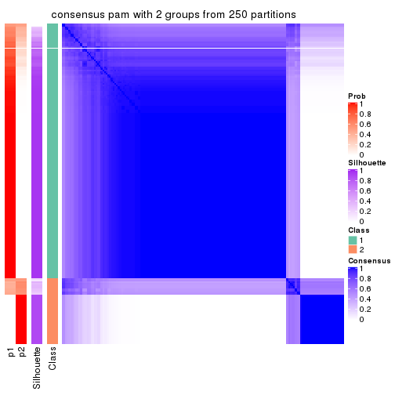</p>

</div>
<div id='tab-CV-pam-consensus-heatmap-2'>
<pre><code class="r">consensus_heatmap(res, k = 3)
</code></pre>

<p></p>

</div>
<div id='tab-CV-pam-consensus-heatmap-3'>
<pre><code class="r">consensus_heatmap(res, k = 4)
</code></pre>

<p></p>

</div>
<div id='tab-CV-pam-consensus-heatmap-4'>
<pre><code class="r">consensus_heatmap(res, k = 5)
</code></pre>

<p></p>

</div>
<div id='tab-CV-pam-consensus-heatmap-5'>
<pre><code class="r">consensus_heatmap(res, k = 6)
</code></pre>

<p></p>

</div>
</div>

Heatmaps for the membership of samples in all partitions to see how consistent they are:


<script>
$( function() {
	$( '#tabs-CV-pam-membership-heatmap' ).tabs();
} );
</script>
<div id='tabs-CV-pam-membership-heatmap'>
<ul>
<li><a href='#tab-CV-pam-membership-heatmap-1'>k = 2</a></li>
<li><a href='#tab-CV-pam-membership-heatmap-2'>k = 3</a></li>
<li><a href='#tab-CV-pam-membership-heatmap-3'>k = 4</a></li>
<li><a href='#tab-CV-pam-membership-heatmap-4'>k = 5</a></li>
<li><a href='#tab-CV-pam-membership-heatmap-5'>k = 6</a></li>
</ul>
<div id='tab-CV-pam-membership-heatmap-1'>
<pre><code class="r">membership_heatmap(res, k = 2)
</code></pre>

<p></p>

</div>
<div id='tab-CV-pam-membership-heatmap-2'>
<pre><code class="r">membership_heatmap(res, k = 3)
</code></pre>

<p></p>

</div>
<div id='tab-CV-pam-membership-heatmap-3'>
<pre><code class="r">membership_heatmap(res, k = 4)
</code></pre>

<p></p>

</div>
<div id='tab-CV-pam-membership-heatmap-4'>
<pre><code class="r">membership_heatmap(res, k = 5)
</code></pre>

<p></p>

</div>
<div id='tab-CV-pam-membership-heatmap-5'>
<pre><code class="r">membership_heatmap(res, k = 6)
</code></pre>

<p></p>

</div>
</div>

As soon as we have had the classes for columns, we can look for signatures
which are significantly different between classes which can be candidate marks
for certain classes. Following are the heatmaps for signatures.


Signature heatmaps where rows are scaled:


<script>
$( function() {
	$( '#tabs-CV-pam-get-signatures' ).tabs();
} );
</script>
<div id='tabs-CV-pam-get-signatures'>
<ul>
<li><a href='#tab-CV-pam-get-signatures-1'>k = 2</a></li>
<li><a href='#tab-CV-pam-get-signatures-2'>k = 3</a></li>
<li><a href='#tab-CV-pam-get-signatures-3'>k = 4</a></li>
<li><a href='#tab-CV-pam-get-signatures-4'>k = 5</a></li>
<li><a href='#tab-CV-pam-get-signatures-5'>k = 6</a></li>
</ul>
<div id='tab-CV-pam-get-signatures-1'>
<pre><code class="r">get_signatures(res, k = 2)
</code></pre>

<p></p>

</div>
<div id='tab-CV-pam-get-signatures-2'>
<pre><code class="r">get_signatures(res, k = 3)
</code></pre>

<p></p>

</div>
<div id='tab-CV-pam-get-signatures-3'>
<pre><code class="r">get_signatures(res, k = 4)
</code></pre>

<p></p>

</div>
<div id='tab-CV-pam-get-signatures-4'>
<pre><code class="r">get_signatures(res, k = 5)
</code></pre>

<p></p>

</div>
<div id='tab-CV-pam-get-signatures-5'>
<pre><code class="r">get_signatures(res, k = 6)
</code></pre>

<p></p>

</div>
</div>


Signature heatmaps where rows are not scaled:


<script>
$( function() {
	$( '#tabs-CV-pam-get-signatures-no-scale' ).tabs();
} );
</script>
<div id='tabs-CV-pam-get-signatures-no-scale'>
<ul>
<li><a href='#tab-CV-pam-get-signatures-no-scale-1'>k = 2</a></li>
<li><a href='#tab-CV-pam-get-signatures-no-scale-2'>k = 3</a></li>
<li><a href='#tab-CV-pam-get-signatures-no-scale-3'>k = 4</a></li>
<li><a href='#tab-CV-pam-get-signatures-no-scale-4'>k = 5</a></li>
<li><a href='#tab-CV-pam-get-signatures-no-scale-5'>k = 6</a></li>
</ul>
<div id='tab-CV-pam-get-signatures-no-scale-1'>
<pre><code class="r">get_signatures(res, k = 2, scale_rows = FALSE)
</code></pre>

<p></p>

</div>
<div id='tab-CV-pam-get-signatures-no-scale-2'>
<pre><code class="r">get_signatures(res, k = 3, scale_rows = FALSE)
</code></pre>

<p></p>

</div>
<div id='tab-CV-pam-get-signatures-no-scale-3'>
<pre><code class="r">get_signatures(res, k = 4, scale_rows = FALSE)
</code></pre>

<p></p>

</div>
<div id='tab-CV-pam-get-signatures-no-scale-4'>
<pre><code class="r">get_signatures(res, k = 5, scale_rows = FALSE)
</code></pre>

<p></p>

</div>
<div id='tab-CV-pam-get-signatures-no-scale-5'>
<pre><code class="r">get_signatures(res, k = 6, scale_rows = FALSE)
</code></pre>

<p></p>

</div>
</div>


Compare the overlap of signatures from different k:

```r
compare_signatures(res)
```


`get_signature()` returns a data frame invisibly. TO get the list of signatures, the function
call should be assigned to a variable explicitly. In following code, if `plot` argument is set
to `FALSE`, no heatmap is plotted while only the differential analysis is performed.

```r
# code only for demonstration
tb = get_signature(res, k = ..., plot = FALSE)
```

An example of the output of `tb` is:

```
#>   which_row         fdr    mean_1    mean_2 scaled_mean_1 scaled_mean_2 km
#> 1        38 0.042760348  8.373488  9.131774    -0.5533452     0.5164555  1
#> 2        40 0.018707592  7.106213  8.469186    -0.6173731     0.5762149  1
#> 3        55 0.019134737 10.221463 11.207825    -0.6159697     0.5749050  1
#> 4        59 0.006059896  5.921854  7.869574    -0.6899429     0.6439467  1
#> 5        60 0.018055526  8.928898 10.211722    -0.6204761     0.5791110  1
#> 6        98 0.009384629 15.714769 14.887706     0.6635654    -0.6193277  2
...
```

The columns in `tb` are:

1. `which_row`: row indices corresponding to the input matrix.
2. `fdr`: FDR for the differential test. 
3. `mean_x`: The mean value in group x.
4. `scaled_mean_x`: The mean value in group x after rows are scaled.
5. `km`: Row groups if k-means clustering is applied to rows.


UMAP plot which shows how samples are separated.


<script>
$( function() {
	$( '#tabs-CV-pam-dimension-reduction' ).tabs();
} );
</script>
<div id='tabs-CV-pam-dimension-reduction'>
<ul>
<li><a href='#tab-CV-pam-dimension-reduction-1'>k = 2</a></li>
<li><a href='#tab-CV-pam-dimension-reduction-2'>k = 3</a></li>
<li><a href='#tab-CV-pam-dimension-reduction-3'>k = 4</a></li>
<li><a href='#tab-CV-pam-dimension-reduction-4'>k = 5</a></li>
<li><a href='#tab-CV-pam-dimension-reduction-5'>k = 6</a></li>
</ul>
<div id='tab-CV-pam-dimension-reduction-1'>
<pre><code class="r">dimension_reduction(res, k = 2, method = &quot;UMAP&quot;)
</code></pre>

<p></p>

</div>
<div id='tab-CV-pam-dimension-reduction-2'>
<pre><code class="r">dimension_reduction(res, k = 3, method = &quot;UMAP&quot;)
</code></pre>

<p></p>

</div>
<div id='tab-CV-pam-dimension-reduction-3'>
<pre><code class="r">dimension_reduction(res, k = 4, method = &quot;UMAP&quot;)
</code></pre>

<p></p>

</div>
<div id='tab-CV-pam-dimension-reduction-4'>
<pre><code class="r">dimension_reduction(res, k = 5, method = &quot;UMAP&quot;)
</code></pre>

<p></p>

</div>
<div id='tab-CV-pam-dimension-reduction-5'>
<pre><code class="r">dimension_reduction(res, k = 6, method = &quot;UMAP&quot;)
</code></pre>

<p></p>

</div>
</div>


Following heatmap shows how subgroups are split when increasing `k`:

```r
collect_classes(res)
```


If matrix rows can be associated to genes, consider to use `GO_Enrichment(res,
...)` to perform function enrichment for the signature genes.


 

---------------------------------------------------


### CV:mclust**


The object with results only for a single top-value method and a single partition method 
can be extracted as:

```r
res = res_list["CV", "mclust"]
# you can also extract it by
# res = res_list["CV:mclust"]
```

A summary of `res` and all the functions that can be applied to it:

```r
res
```

```
#> A 'ConsensusPartition' object with k = 2, 3, 4, 5, 6.
#>   On a matrix with 8394 rows and 194 columns.
#>   Top rows (839, 1678, 2518, 3358, 4197) are extracted by 'CV' method.
#>   Subgroups are detected by 'mclust' method.
#>   Performed in total 1250 partitions by row resampling.
#>   Best k for subgroups seems to be 2.
#> 
#> Following methods can be applied to this 'ConsensusPartition' object:
#>  [1] "cola_report"             "collect_classes"         "collect_plots"          
#>  [4] "collect_stats"           "colnames"                "compare_signatures"     
#>  [7] "consensus_heatmap"       "dimension_reduction"     "functional_enrichment"  
#> [10] "get_anno_col"            "get_anno"                "get_classes"            
#> [13] "get_consensus"           "get_matrix"              "get_membership"         
#> [16] "get_param"               "get_signatures"          "get_stats"              
#> [19] "is_best_k"               "is_stable_k"             "membership_heatmap"     
#> [22] "ncol"                    "nrow"                    "plot_ecdf"              
#> [25] "rownames"                "select_partition_number" "show"                   
#> [28] "suggest_best_k"          "test_to_known_factors"
```

`collect_plots()` function collects all the plots made from `res` for all `k` (number of partitions)
into one single page to provide an easy and fast comparison between different `k`.

```r
collect_plots(res)
```


The plots are:

- The first row: a plot of the ECDF (Empirical cumulative distribution
  function) curves of the consensus matrix for each `k` and the heatmap of
  predicted classes for each `k`.
- The second row: heatmaps of the consensus matrix for each `k`.
- The third row: heatmaps of the membership matrix for each `k`.
- The fouth row: heatmaps of the signatures for each `k`.

All the plots in panels can be made by individual functions and they are
plotted later in this section.

`select_partition_number()` produces several plots showing different
statistics for choosing "optimized" `k`. There are following statistics:

- ECDF curves of the consensus matrix for each `k`;
- 1-PAC. [The PAC
  score](https://en.wikipedia.org/wiki/Consensus_clustering#Over-interpretation_potential_of_consensus_clustering)
  measures the proportion of the ambiguous subgrouping.
- Mean silhouette score.
- Concordance. The mean probability of fiting the consensus class ids in all
  partitions.
- Area increased. Denote $A_k$ as the area under the ECDF curve for current
  `k`, the area increased is defined as $A_k - A_{k-1}$.
- Rand index. The percent of pairs of samples that are both in a same cluster
  or both are not in a same cluster in the partition of k and k-1.
- Jaccard index. The ratio of pairs of samples are both in a same cluster in
  the partition of k and k-1 and the pairs of samples are both in a same
  cluster in the partition k or k-1.

The detailed explanations of these statistics can be found in [the cola
vignette](http://bioconductor.org/packages/devel/bioc/vignettes/cola/inst/doc/cola.html#toc_13).

Generally speaking, lower PAC score, higher mean silhouette score or higher
concordance corresponds to better partition. Rand index and Jaccard index
measure how similar the current partition is compared to partition with `k-1`.
If they are too similar, we won't accept `k` is better than `k-1`.

```r
select_partition_number(res)
```


The numeric values for all these statistics can be obtained by `get_stats()`.

```r
get_stats(res)
```

```
#>   k 1-PAC mean_silhouette concordance area_increased  Rand Jaccard
#> 2 2 1.000           1.000       1.000         0.2187 0.782   0.782
#> 3 3 0.296           0.529       0.702         1.3895 0.618   0.512
#> 4 4 0.364           0.624       0.759         0.2238 0.774   0.547
#> 5 5 0.426           0.593       0.686         0.1380 0.822   0.532
#> 6 6 0.476           0.525       0.688         0.0697 0.937   0.735
```

`suggest_best_k()` suggests the best $k$ based on these statistics. The rules are as follows:

- All $k$ with Jaccard index larger than 0.95 are removed because the increase of
  the partition number does not provides enough extra information. If all $k$ are removed,
  the best $k$ is assigned by `NA`.
- For $k$ with 1-PAC larger than 0.9, the maximal $k$ is taken as the "best k". Other $k$ is called "optional k".
- If it does not fit the second rule. The $k$ with the highest vote of highest
  1-PAC, mean silhouette and concordance is taken as the "best k".

```r
suggest_best_k(res)
```

```
#> [1] 2
```


Following shows the table of the partitions (You need to click the **show/hide
code output** link to see it). The membership matrix (columns with name `p*`)
is inferred by
[`clue::cl_consensus()`](https://www.rdocumentation.org/link/cl_consensus?package=clue)
function with the `SE` method. Basically the value in the membership matrix
represents the probability to belong to a certain group. The finall class
label for an item is determined with the group with highest probability it
belongs to.

In `get_classes()` function, the entropy is calculated from the membership
matrix and the silhouette score is calculated from the consensus matrix.


<script>
$( function() {
	$( '#tabs-CV-mclust-get-classes' ).tabs();
} );
</script>
<div id='tabs-CV-mclust-get-classes'>
<ul>
<li><a href='#tab-CV-mclust-get-classes-1'>k = 2</a></li>
<li><a href='#tab-CV-mclust-get-classes-2'>k = 3</a></li>
<li><a href='#tab-CV-mclust-get-classes-3'>k = 4</a></li>
<li><a href='#tab-CV-mclust-get-classes-4'>k = 5</a></li>
<li><a href='#tab-CV-mclust-get-classes-5'>k = 6</a></li>
</ul>

<div id='tab-CV-mclust-get-classes-1'>
<p><a id='tab-CV-mclust-get-classes-1-a' style='color:#0366d6' href='#'>show/hide code output</a></p>
<pre><code class="r">cbind(get_classes(res, k = 2), get_membership(res, k = 2))
</code></pre>

<pre><code>#&gt;           class entropy silhouette p1 p2
#&gt; ERR467487     1       0          1  1  0
#&gt; ERR467498     1       0          1  1  0
#&gt; ERR658998     1       0          1  1  0
#&gt; ERR659094     1       0          1  1  0
#&gt; ERR658999     1       0          1  1  0
#&gt; ERR659095     1       0          1  1  0
#&gt; ERR659000     1       0          1  1  0
#&gt; ERR659096     1       0          1  1  0
#&gt; ERR659001     1       0          1  1  0
#&gt; ERR659097     1       0          1  1  0
#&gt; ERR659002     1       0          1  1  0
#&gt; ERR659098     1       0          1  1  0
#&gt; ERR659003     1       0          1  1  0
#&gt; ERR659099     1       0          1  1  0
#&gt; ERR659004     1       0          1  1  0
#&gt; ERR659100     1       0          1  1  0
#&gt; ERR659005     1       0          1  1  0
#&gt; ERR659101     1       0          1  1  0
#&gt; ERR659006     1       0          1  1  0
#&gt; ERR659102     1       0          1  1  0
#&gt; ERR659007     1       0          1  1  0
#&gt; ERR659103     1       0          1  1  0
#&gt; ERR659008     2       0          1  0  1
#&gt; ERR659104     2       0          1  0  1
#&gt; ERR659009     1       0          1  1  0
#&gt; ERR659105     1       0          1  1  0
#&gt; ERR659010     1       0          1  1  0
#&gt; ERR659106     1       0          1  1  0
#&gt; ERR659011     1       0          1  1  0
#&gt; ERR659107     1       0          1  1  0
#&gt; ERR659012     1       0          1  1  0
#&gt; ERR659108     1       0          1  1  0
#&gt; ERR659013     1       0          1  1  0
#&gt; ERR659109     1       0          1  1  0
#&gt; ERR659014     2       0          1  0  1
#&gt; ERR659110     2       0          1  0  1
#&gt; ERR659015     1       0          1  1  0
#&gt; ERR659111     1       0          1  1  0
#&gt; ERR659016     1       0          1  1  0
#&gt; ERR659112     1       0          1  1  0
#&gt; ERR659017     2       0          1  0  1
#&gt; ERR659113     2       0          1  0  1
#&gt; ERR659018     1       0          1  1  0
#&gt; ERR659114     1       0          1  1  0
#&gt; ERR659019     1       0          1  1  0
#&gt; ERR659115     1       0          1  1  0
#&gt; ERR659020     1       0          1  1  0
#&gt; ERR659116     1       0          1  1  0
#&gt; ERR659021     1       0          1  1  0
#&gt; ERR659117     1       0          1  1  0
#&gt; ERR659022     1       0          1  1  0
#&gt; ERR659118     1       0          1  1  0
#&gt; ERR659023     1       0          1  1  0
#&gt; ERR659119     1       0          1  1  0
#&gt; ERR659024     1       0          1  1  0
#&gt; ERR659120     1       0          1  1  0
#&gt; ERR659025     1       0          1  1  0
#&gt; ERR659121     1       0          1  1  0
#&gt; ERR659026     1       0          1  1  0
#&gt; ERR659122     1       0          1  1  0
#&gt; ERR659027     1       0          1  1  0
#&gt; ERR659123     1       0          1  1  0
#&gt; ERR659028     1       0          1  1  0
#&gt; ERR659124     1       0          1  1  0
#&gt; ERR659029     1       0          1  1  0
#&gt; ERR659125     1       0          1  1  0
#&gt; ERR659030     1       0          1  1  0
#&gt; ERR659126     1       0          1  1  0
#&gt; ERR659031     1       0          1  1  0
#&gt; ERR659127     1       0          1  1  0
#&gt; ERR659032     1       0          1  1  0
#&gt; ERR659128     1       0          1  1  0
#&gt; ERR659033     1       0          1  1  0
#&gt; ERR659129     1       0          1  1  0
#&gt; ERR659034     2       0          1  0  1
#&gt; ERR659130     2       0          1  0  1
#&gt; ERR659035     1       0          1  1  0
#&gt; ERR659131     1       0          1  1  0
#&gt; ERR659036     1       0          1  1  0
#&gt; ERR659132     1       0          1  1  0
#&gt; ERR659037     1       0          1  1  0
#&gt; ERR659133     1       0          1  1  0
#&gt; ERR659038     1       0          1  1  0
#&gt; ERR659134     1       0          1  1  0
#&gt; ERR659039     1       0          1  1  0
#&gt; ERR659135     1       0          1  1  0
#&gt; ERR659040     1       0          1  1  0
#&gt; ERR659136     1       0          1  1  0
#&gt; ERR659041     1       0          1  1  0
#&gt; ERR659137     1       0          1  1  0
#&gt; ERR659042     1       0          1  1  0
#&gt; ERR659138     1       0          1  1  0
#&gt; ERR659043     1       0          1  1  0
#&gt; ERR659139     1       0          1  1  0
#&gt; ERR659044     2       0          1  0  1
#&gt; ERR659140     2       0          1  0  1
#&gt; ERR659045     1       0          1  1  0
#&gt; ERR659141     1       0          1  1  0
#&gt; ERR659046     1       0          1  1  0
#&gt; ERR659142     1       0          1  1  0
#&gt; ERR659047     1       0          1  1  0
#&gt; ERR659143     1       0          1  1  0
#&gt; ERR659048     1       0          1  1  0
#&gt; ERR659144     1       0          1  1  0
#&gt; ERR659049     1       0          1  1  0
#&gt; ERR659145     1       0          1  1  0
#&gt; ERR659050     1       0          1  1  0
#&gt; ERR659146     1       0          1  1  0
#&gt; ERR659051     1       0          1  1  0
#&gt; ERR659147     1       0          1  1  0
#&gt; ERR659052     1       0          1  1  0
#&gt; ERR659148     1       0          1  1  0
#&gt; ERR659053     1       0          1  1  0
#&gt; ERR659149     1       0          1  1  0
#&gt; ERR659054     2       0          1  0  1
#&gt; ERR659150     2       0          1  0  1
#&gt; ERR659055     1       0          1  1  0
#&gt; ERR659151     1       0          1  1  0
#&gt; ERR659056     1       0          1  1  0
#&gt; ERR659152     1       0          1  1  0
#&gt; ERR659057     1       0          1  1  0
#&gt; ERR659153     1       0          1  1  0
#&gt; ERR659058     1       0          1  1  0
#&gt; ERR659154     1       0          1  1  0
#&gt; ERR659059     1       0          1  1  0
#&gt; ERR659155     1       0          1  1  0
#&gt; ERR659060     1       0          1  1  0
#&gt; ERR659156     1       0          1  1  0
#&gt; ERR659061     1       0          1  1  0
#&gt; ERR659157     1       0          1  1  0
#&gt; ERR659062     1       0          1  1  0
#&gt; ERR659158     1       0          1  1  0
#&gt; ERR659063     1       0          1  1  0
#&gt; ERR659159     1       0          1  1  0
#&gt; ERR659064     1       0          1  1  0
#&gt; ERR659160     1       0          1  1  0
#&gt; ERR659065     2       0          1  0  1
#&gt; ERR659161     2       0          1  0  1
#&gt; ERR659066     1       0          1  1  0
#&gt; ERR659162     1       0          1  1  0
#&gt; ERR659067     1       0          1  1  0
#&gt; ERR659163     1       0          1  1  0
#&gt; ERR659068     2       0          1  0  1
#&gt; ERR659164     2       0          1  0  1
#&gt; ERR659069     1       0          1  1  0
#&gt; ERR659165     1       0          1  1  0
#&gt; ERR659070     1       0          1  1  0
#&gt; ERR659166     1       0          1  1  0
#&gt; ERR659071     1       0          1  1  0
#&gt; ERR659167     1       0          1  1  0
#&gt; ERR659072     1       0          1  1  0
#&gt; ERR659168     1       0          1  1  0
#&gt; ERR659073     1       0          1  1  0
#&gt; ERR659169     1       0          1  1  0
#&gt; ERR659074     2       0          1  0  1
#&gt; ERR659170     2       0          1  0  1
#&gt; ERR659075     1       0          1  1  0
#&gt; ERR659171     1       0          1  1  0
#&gt; ERR659076     2       0          1  0  1
#&gt; ERR659172     2       0          1  0  1
#&gt; ERR659077     1       0          1  1  0
#&gt; ERR659173     1       0          1  1  0
#&gt; ERR659078     1       0          1  1  0
#&gt; ERR659174     1       0          1  1  0
#&gt; ERR659079     1       0          1  1  0
#&gt; ERR659175     1       0          1  1  0
#&gt; ERR659080     1       0          1  1  0
#&gt; ERR659176     1       0          1  1  0
#&gt; ERR659081     1       0          1  1  0
#&gt; ERR659177     1       0          1  1  0
#&gt; ERR659082     1       0          1  1  0
#&gt; ERR659178     1       0          1  1  0
#&gt; ERR659083     2       0          1  0  1
#&gt; ERR659179     2       0          1  0  1
#&gt; ERR659084     2       0          1  0  1
#&gt; ERR659180     2       0          1  0  1
#&gt; ERR659085     1       0          1  1  0
#&gt; ERR659181     1       0          1  1  0
#&gt; ERR659086     1       0          1  1  0
#&gt; ERR659182     1       0          1  1  0
#&gt; ERR659087     1       0          1  1  0
#&gt; ERR659183     1       0          1  1  0
#&gt; ERR659088     1       0          1  1  0
#&gt; ERR659184     1       0          1  1  0
#&gt; ERR659089     1       0          1  1  0
#&gt; ERR659185     1       0          1  1  0
#&gt; ERR659090     1       0          1  1  0
#&gt; ERR659186     1       0          1  1  0
#&gt; ERR659091     1       0          1  1  0
#&gt; ERR659187     1       0          1  1  0
#&gt; ERR659092     1       0          1  1  0
#&gt; ERR659188     1       0          1  1  0
#&gt; ERR659093     1       0          1  1  0
#&gt; ERR659189     1       0          1  1  0
</code></pre>

<script>
$('#tab-CV-mclust-get-classes-1-a').parent().next().next().hide();
$('#tab-CV-mclust-get-classes-1-a').click(function(){
  $('#tab-CV-mclust-get-classes-1-a').parent().next().next().toggle();
  return(false);
});
</script>
</div>

<div id='tab-CV-mclust-get-classes-2'>
<p><a id='tab-CV-mclust-get-classes-2-a' style='color:#0366d6' href='#'>show/hide code output</a></p>
<pre><code class="r">cbind(get_classes(res, k = 3), get_membership(res, k = 3))
</code></pre>

<pre><code>#&gt;           class entropy silhouette    p1 p2    p3
#&gt; ERR467487     3  0.6260   -0.02498 0.448  0 0.552
#&gt; ERR467498     3  0.6260   -0.02498 0.448  0 0.552
#&gt; ERR658998     3  0.6180   -0.03047 0.416  0 0.584
#&gt; ERR659094     3  0.6180   -0.01672 0.416  0 0.584
#&gt; ERR658999     3  0.0000    0.62776 0.000  0 1.000
#&gt; ERR659095     3  0.0000    0.62776 0.000  0 1.000
#&gt; ERR659000     1  0.6309    0.21060 0.504  0 0.496
#&gt; ERR659096     1  0.6309    0.21060 0.504  0 0.496
#&gt; ERR659001     3  0.5988    0.12226 0.368  0 0.632
#&gt; ERR659097     3  0.6111    0.00595 0.396  0 0.604
#&gt; ERR659002     1  0.6045    0.55414 0.620  0 0.380
#&gt; ERR659098     1  0.5988    0.57883 0.632  0 0.368
#&gt; ERR659003     1  0.4504    0.68970 0.804  0 0.196
#&gt; ERR659099     1  0.4605    0.69477 0.796  0 0.204
#&gt; ERR659004     3  0.0000    0.62776 0.000  0 1.000
#&gt; ERR659100     3  0.0000    0.62776 0.000  0 1.000
#&gt; ERR659005     1  0.5497    0.67443 0.708  0 0.292
#&gt; ERR659101     1  0.5431    0.68053 0.716  0 0.284
#&gt; ERR659006     3  0.0000    0.62776 0.000  0 1.000
#&gt; ERR659102     3  0.0000    0.62776 0.000  0 1.000
#&gt; ERR659007     1  0.4702    0.70746 0.788  0 0.212
#&gt; ERR659103     1  0.4931    0.70814 0.768  0 0.232
#&gt; ERR659008     2  0.0000    1.00000 0.000  1 0.000
#&gt; ERR659104     2  0.0000    1.00000 0.000  1 0.000
#&gt; ERR659009     3  0.1031    0.62701 0.024  0 0.976
#&gt; ERR659105     3  0.1289    0.62475 0.032  0 0.968
#&gt; ERR659010     3  0.0747    0.62827 0.016  0 0.984
#&gt; ERR659106     3  0.0747    0.62827 0.016  0 0.984
#&gt; ERR659011     3  0.0000    0.62776 0.000  0 1.000
#&gt; ERR659107     3  0.0000    0.62776 0.000  0 1.000
#&gt; ERR659012     3  0.0000    0.62776 0.000  0 1.000
#&gt; ERR659108     3  0.0000    0.62776 0.000  0 1.000
#&gt; ERR659013     1  0.6302    0.39588 0.520  0 0.480
#&gt; ERR659109     1  0.6307    0.38175 0.512  0 0.488
#&gt; ERR659014     2  0.0000    1.00000 0.000  1 0.000
#&gt; ERR659110     2  0.0000    1.00000 0.000  1 0.000
#&gt; ERR659015     1  0.5098    0.68718 0.752  0 0.248
#&gt; ERR659111     1  0.5016    0.68545 0.760  0 0.240
#&gt; ERR659016     1  0.6307    0.21962 0.512  0 0.488
#&gt; ERR659112     1  0.6307    0.21962 0.512  0 0.488
#&gt; ERR659017     2  0.0000    1.00000 0.000  1 0.000
#&gt; ERR659113     2  0.0000    1.00000 0.000  1 0.000
#&gt; ERR659018     1  0.6095    0.54311 0.608  0 0.392
#&gt; ERR659114     1  0.6111    0.54591 0.604  0 0.396
#&gt; ERR659019     3  0.0000    0.62776 0.000  0 1.000
#&gt; ERR659115     3  0.0000    0.62776 0.000  0 1.000
#&gt; ERR659020     1  0.6291    0.39532 0.532  0 0.468
#&gt; ERR659116     1  0.6295    0.38169 0.528  0 0.472
#&gt; ERR659021     1  0.5058    0.68997 0.756  0 0.244
#&gt; ERR659117     1  0.4931    0.69292 0.768  0 0.232
#&gt; ERR659022     1  0.4702    0.69360 0.788  0 0.212
#&gt; ERR659118     1  0.4796    0.69555 0.780  0 0.220
#&gt; ERR659023     1  0.5948    0.61318 0.640  0 0.360
#&gt; ERR659119     1  0.5882    0.62221 0.652  0 0.348
#&gt; ERR659024     1  0.5254    0.68165 0.736  0 0.264
#&gt; ERR659120     1  0.5291    0.68017 0.732  0 0.268
#&gt; ERR659025     1  0.6111    0.48768 0.604  0 0.396
#&gt; ERR659121     1  0.6192    0.42744 0.580  0 0.420
#&gt; ERR659026     3  0.5926    0.17325 0.356  0 0.644
#&gt; ERR659122     3  0.6126    0.02088 0.400  0 0.600
#&gt; ERR659027     1  0.6308    0.13620 0.508  0 0.492
#&gt; ERR659123     3  0.6309   -0.12989 0.496  0 0.504
#&gt; ERR659028     1  0.6045    0.58620 0.620  0 0.380
#&gt; ERR659124     1  0.6095    0.57329 0.608  0 0.392
#&gt; ERR659029     1  0.5397    0.68638 0.720  0 0.280
#&gt; ERR659125     1  0.5397    0.68665 0.720  0 0.280
#&gt; ERR659030     1  0.5016    0.67537 0.760  0 0.240
#&gt; ERR659126     1  0.4887    0.68156 0.772  0 0.228
#&gt; ERR659031     3  0.6180    0.01383 0.416  0 0.584
#&gt; ERR659127     3  0.6168    0.03055 0.412  0 0.588
#&gt; ERR659032     1  0.5859    0.61455 0.656  0 0.344
#&gt; ERR659128     1  0.5810    0.62279 0.664  0 0.336
#&gt; ERR659033     1  0.3752    0.65482 0.856  0 0.144
#&gt; ERR659129     1  0.3686    0.65291 0.860  0 0.140
#&gt; ERR659034     2  0.0000    1.00000 0.000  1 0.000
#&gt; ERR659130     2  0.0000    1.00000 0.000  1 0.000
#&gt; ERR659035     1  0.6260    0.49460 0.552  0 0.448
#&gt; ERR659131     1  0.6225    0.52299 0.568  0 0.432
#&gt; ERR659036     1  0.5968    0.60906 0.636  0 0.364
#&gt; ERR659132     1  0.5859    0.63984 0.656  0 0.344
#&gt; ERR659037     3  0.6008    0.15802 0.372  0 0.628
#&gt; ERR659133     3  0.6026    0.14196 0.376  0 0.624
#&gt; ERR659038     3  0.0000    0.62776 0.000  0 1.000
#&gt; ERR659134     3  0.0000    0.62776 0.000  0 1.000
#&gt; ERR659039     3  0.0000    0.62776 0.000  0 1.000
#&gt; ERR659135     3  0.0000    0.62776 0.000  0 1.000
#&gt; ERR659040     1  0.6260    0.45194 0.552  0 0.448
#&gt; ERR659136     1  0.6252    0.46143 0.556  0 0.444
#&gt; ERR659041     3  0.5905    0.28626 0.352  0 0.648
#&gt; ERR659137     3  0.5859    0.30646 0.344  0 0.656
#&gt; ERR659042     3  0.6305   -0.11865 0.484  0 0.516
#&gt; ERR659138     3  0.6305   -0.11865 0.484  0 0.516
#&gt; ERR659043     3  0.6309   -0.35860 0.496  0 0.504
#&gt; ERR659139     3  0.6307   -0.33580 0.488  0 0.512
#&gt; ERR659044     2  0.0000    1.00000 0.000  1 0.000
#&gt; ERR659140     2  0.0000    1.00000 0.000  1 0.000
#&gt; ERR659045     3  0.0892    0.62769 0.020  0 0.980
#&gt; ERR659141     3  0.0892    0.62769 0.020  0 0.980
#&gt; ERR659046     1  0.3752    0.66466 0.856  0 0.144
#&gt; ERR659142     1  0.3879    0.67219 0.848  0 0.152
#&gt; ERR659047     1  0.4796    0.70587 0.780  0 0.220
#&gt; ERR659143     1  0.4702    0.70321 0.788  0 0.212
#&gt; ERR659048     1  0.4654    0.70824 0.792  0 0.208
#&gt; ERR659144     1  0.4750    0.70934 0.784  0 0.216
#&gt; ERR659049     3  0.5098    0.41363 0.248  0 0.752
#&gt; ERR659145     3  0.5363    0.36460 0.276  0 0.724
#&gt; ERR659050     1  0.6244    0.44183 0.560  0 0.440
#&gt; ERR659146     1  0.6235    0.45178 0.564  0 0.436
#&gt; ERR659051     3  0.6309   -0.11173 0.496  0 0.504
#&gt; ERR659147     3  0.6309   -0.11173 0.496  0 0.504
#&gt; ERR659052     3  0.1643    0.61907 0.044  0 0.956
#&gt; ERR659148     3  0.1643    0.61907 0.044  0 0.956
#&gt; ERR659053     1  0.3879    0.66943 0.848  0 0.152
#&gt; ERR659149     1  0.3879    0.66943 0.848  0 0.152
#&gt; ERR659054     2  0.0000    1.00000 0.000  1 0.000
#&gt; ERR659150     2  0.0000    1.00000 0.000  1 0.000
#&gt; ERR659055     3  0.2711    0.59711 0.088  0 0.912
#&gt; ERR659151     3  0.3192    0.58136 0.112  0 0.888
#&gt; ERR659056     1  0.6309    0.10329 0.500  0 0.500
#&gt; ERR659152     3  0.6309   -0.12451 0.500  0 0.500
#&gt; ERR659057     1  0.5678    0.66638 0.684  0 0.316
#&gt; ERR659153     1  0.5465    0.68803 0.712  0 0.288
#&gt; ERR659058     3  0.0000    0.62776 0.000  0 1.000
#&gt; ERR659154     3  0.0000    0.62776 0.000  0 1.000
#&gt; ERR659059     1  0.4750    0.68602 0.784  0 0.216
#&gt; ERR659155     1  0.4750    0.68710 0.784  0 0.216
#&gt; ERR659060     1  0.6215    0.40669 0.572  0 0.428
#&gt; ERR659156     1  0.6180    0.43157 0.584  0 0.416
#&gt; ERR659061     1  0.5591    0.63892 0.696  0 0.304
#&gt; ERR659157     1  0.5678    0.62898 0.684  0 0.316
#&gt; ERR659062     3  0.5497    0.34580 0.292  0 0.708
#&gt; ERR659158     3  0.5529    0.33721 0.296  0 0.704
#&gt; ERR659063     1  0.5621    0.67555 0.692  0 0.308
#&gt; ERR659159     1  0.5621    0.67555 0.692  0 0.308
#&gt; ERR659064     1  0.5465    0.65863 0.712  0 0.288
#&gt; ERR659160     1  0.5529    0.64729 0.704  0 0.296
#&gt; ERR659065     2  0.0000    1.00000 0.000  1 0.000
#&gt; ERR659161     2  0.0000    1.00000 0.000  1 0.000
#&gt; ERR659066     3  0.0592    0.62885 0.012  0 0.988
#&gt; ERR659162     3  0.0747    0.62862 0.016  0 0.984
#&gt; ERR659067     3  0.0424    0.62720 0.008  0 0.992
#&gt; ERR659163     3  0.0000    0.62776 0.000  0 1.000
#&gt; ERR659068     2  0.0000    1.00000 0.000  1 0.000
#&gt; ERR659164     2  0.0000    1.00000 0.000  1 0.000
#&gt; ERR659069     3  0.0424    0.62539 0.008  0 0.992
#&gt; ERR659165     3  0.0237    0.62728 0.004  0 0.996
#&gt; ERR659070     1  0.5016    0.68368 0.760  0 0.240
#&gt; ERR659166     1  0.5138    0.68022 0.748  0 0.252
#&gt; ERR659071     1  0.4750    0.68879 0.784  0 0.216
#&gt; ERR659167     1  0.4796    0.68466 0.780  0 0.220
#&gt; ERR659072     3  0.0000    0.62776 0.000  0 1.000
#&gt; ERR659168     3  0.0000    0.62776 0.000  0 1.000
#&gt; ERR659073     3  0.4399    0.51308 0.188  0 0.812
#&gt; ERR659169     3  0.4750    0.48190 0.216  0 0.784
#&gt; ERR659074     2  0.0000    1.00000 0.000  1 0.000
#&gt; ERR659170     2  0.0000    1.00000 0.000  1 0.000
#&gt; ERR659075     1  0.6308    0.10210 0.508  0 0.492
#&gt; ERR659171     1  0.6308    0.10210 0.508  0 0.492
#&gt; ERR659076     2  0.0000    1.00000 0.000  1 0.000
#&gt; ERR659172     2  0.0000    1.00000 0.000  1 0.000
#&gt; ERR659077     1  0.5363    0.67059 0.724  0 0.276
#&gt; ERR659173     1  0.5291    0.68097 0.732  0 0.268
#&gt; ERR659078     1  0.5397    0.63294 0.720  0 0.280
#&gt; ERR659174     1  0.5397    0.63089 0.720  0 0.280
#&gt; ERR659079     1  0.6260    0.48059 0.552  0 0.448
#&gt; ERR659175     1  0.6260    0.48059 0.552  0 0.448
#&gt; ERR659080     3  0.6307   -0.11839 0.488  0 0.512
#&gt; ERR659176     3  0.6307   -0.11839 0.488  0 0.512
#&gt; ERR659081     1  0.3482    0.65966 0.872  0 0.128
#&gt; ERR659177     1  0.3619    0.66627 0.864  0 0.136
#&gt; ERR659082     1  0.4235    0.68042 0.824  0 0.176
#&gt; ERR659178     1  0.4235    0.67652 0.824  0 0.176
#&gt; ERR659083     2  0.0000    1.00000 0.000  1 0.000
#&gt; ERR659179     2  0.0000    1.00000 0.000  1 0.000
#&gt; ERR659084     2  0.0000    1.00000 0.000  1 0.000
#&gt; ERR659180     2  0.0000    1.00000 0.000  1 0.000
#&gt; ERR659085     3  0.6305   -0.25993 0.484  0 0.516
#&gt; ERR659181     3  0.6309   -0.27800 0.496  0 0.504
#&gt; ERR659086     1  0.3879    0.67176 0.848  0 0.152
#&gt; ERR659182     1  0.3941    0.67440 0.844  0 0.156
#&gt; ERR659087     3  0.4702    0.47995 0.212  0 0.788
#&gt; ERR659183     3  0.4654    0.48537 0.208  0 0.792
#&gt; ERR659088     3  0.6140    0.10912 0.404  0 0.596
#&gt; ERR659184     3  0.6026    0.17408 0.376  0 0.624
#&gt; ERR659089     3  0.6280   -0.13440 0.460  0 0.540
#&gt; ERR659185     3  0.6280   -0.13440 0.460  0 0.540
#&gt; ERR659090     1  0.3816    0.67876 0.852  0 0.148
#&gt; ERR659186     1  0.3941    0.68428 0.844  0 0.156
#&gt; ERR659091     1  0.6295    0.43191 0.528  0 0.472
#&gt; ERR659187     1  0.6299    0.42019 0.524  0 0.476
#&gt; ERR659092     3  0.6307   -0.32534 0.488  0 0.512
#&gt; ERR659188     3  0.6295   -0.27356 0.472  0 0.528
#&gt; ERR659093     1  0.4002    0.68358 0.840  0 0.160
#&gt; ERR659189     1  0.3941    0.68061 0.844  0 0.156
</code></pre>

<script>
$('#tab-CV-mclust-get-classes-2-a').parent().next().next().hide();
$('#tab-CV-mclust-get-classes-2-a').click(function(){
  $('#tab-CV-mclust-get-classes-2-a').parent().next().next().toggle();
  return(false);
});
</script>
</div>

<div id='tab-CV-mclust-get-classes-3'>
<p><a id='tab-CV-mclust-get-classes-3-a' style='color:#0366d6' href='#'>show/hide code output</a></p>
<pre><code class="r">cbind(get_classes(res, k = 4), get_membership(res, k = 4))
</code></pre>

<pre><code>#&gt;           class entropy silhouette    p1 p2    p3    p4
#&gt; ERR467487     3  0.7502     0.7319 0.356  0 0.456 0.188
#&gt; ERR467498     3  0.7509     0.7264 0.360  0 0.452 0.188
#&gt; ERR658998     1  0.7277     0.3302 0.540  0 0.228 0.232
#&gt; ERR659094     1  0.7252     0.3294 0.544  0 0.224 0.232
#&gt; ERR658999     4  0.0524     0.7999 0.004  0 0.008 0.988
#&gt; ERR659095     4  0.0376     0.7986 0.004  0 0.004 0.992
#&gt; ERR659000     3  0.7423     0.6432 0.404  0 0.428 0.168
#&gt; ERR659096     3  0.7424     0.6322 0.408  0 0.424 0.168
#&gt; ERR659001     1  0.6219     0.3493 0.588  0 0.068 0.344
#&gt; ERR659097     1  0.6116     0.4024 0.612  0 0.068 0.320
#&gt; ERR659002     1  0.5811     0.5286 0.704  0 0.180 0.116
#&gt; ERR659098     1  0.5705     0.5419 0.712  0 0.180 0.108
#&gt; ERR659003     1  0.4378     0.6345 0.796  0 0.164 0.040
#&gt; ERR659099     1  0.4335     0.6335 0.796  0 0.168 0.036
#&gt; ERR659004     4  0.2973     0.7987 0.020  0 0.096 0.884
#&gt; ERR659100     4  0.2973     0.7987 0.020  0 0.096 0.884
#&gt; ERR659005     1  0.4297     0.6535 0.820  0 0.084 0.096
#&gt; ERR659101     1  0.4426     0.6594 0.812  0 0.092 0.096
#&gt; ERR659006     4  0.2730     0.7989 0.016  0 0.088 0.896
#&gt; ERR659102     4  0.2730     0.7989 0.016  0 0.088 0.896
#&gt; ERR659007     1  0.2973     0.6626 0.884  0 0.020 0.096
#&gt; ERR659103     1  0.3143     0.6593 0.876  0 0.024 0.100
#&gt; ERR659008     2  0.0000     1.0000 0.000  1 0.000 0.000
#&gt; ERR659104     2  0.0000     1.0000 0.000  1 0.000 0.000
#&gt; ERR659009     4  0.3090     0.7948 0.056  0 0.056 0.888
#&gt; ERR659105     4  0.3320     0.7853 0.068  0 0.056 0.876
#&gt; ERR659010     4  0.2699     0.8002 0.068  0 0.028 0.904
#&gt; ERR659106     4  0.2773     0.7970 0.072  0 0.028 0.900
#&gt; ERR659011     4  0.3107     0.8072 0.036  0 0.080 0.884
#&gt; ERR659107     4  0.3082     0.8077 0.032  0 0.084 0.884
#&gt; ERR659012     4  0.2644     0.8117 0.032  0 0.060 0.908
#&gt; ERR659108     4  0.2644     0.8117 0.032  0 0.060 0.908
#&gt; ERR659013     1  0.7300     0.1750 0.516  0 0.304 0.180
#&gt; ERR659109     1  0.7315     0.1664 0.512  0 0.308 0.180
#&gt; ERR659014     2  0.0000     1.0000 0.000  1 0.000 0.000
#&gt; ERR659110     2  0.0000     1.0000 0.000  1 0.000 0.000
#&gt; ERR659015     1  0.3808     0.6363 0.812  0 0.176 0.012
#&gt; ERR659111     1  0.3808     0.6363 0.812  0 0.176 0.012
#&gt; ERR659016     3  0.7016     0.7891 0.320  0 0.540 0.140
#&gt; ERR659112     3  0.7054     0.7905 0.320  0 0.536 0.144
#&gt; ERR659017     2  0.0000     1.0000 0.000  1 0.000 0.000
#&gt; ERR659113     2  0.0000     1.0000 0.000  1 0.000 0.000
#&gt; ERR659018     1  0.4139     0.6577 0.816  0 0.040 0.144
#&gt; ERR659114     1  0.4197     0.6511 0.808  0 0.036 0.156
#&gt; ERR659019     4  0.1854     0.8087 0.012  0 0.048 0.940
#&gt; ERR659115     4  0.1767     0.8092 0.012  0 0.044 0.944
#&gt; ERR659020     1  0.5314     0.6100 0.740  0 0.084 0.176
#&gt; ERR659116     1  0.5292     0.6119 0.744  0 0.088 0.168
#&gt; ERR659021     1  0.3840     0.6509 0.844  0 0.104 0.052
#&gt; ERR659117     1  0.3525     0.6477 0.860  0 0.100 0.040
#&gt; ERR659022     1  0.4595     0.6008 0.780  0 0.176 0.044
#&gt; ERR659118     1  0.4719     0.5982 0.772  0 0.180 0.048
#&gt; ERR659023     1  0.5256     0.6012 0.732  0 0.204 0.064
#&gt; ERR659119     1  0.5257     0.5950 0.728  0 0.212 0.060
#&gt; ERR659024     1  0.4301     0.6612 0.816  0 0.120 0.064
#&gt; ERR659120     1  0.4301     0.6607 0.816  0 0.120 0.064
#&gt; ERR659025     1  0.6859    -0.2773 0.512  0 0.380 0.108
#&gt; ERR659121     1  0.6961    -0.3363 0.496  0 0.388 0.116
#&gt; ERR659026     1  0.6376     0.2542 0.536  0 0.068 0.396
#&gt; ERR659122     1  0.6324     0.3422 0.572  0 0.072 0.356
#&gt; ERR659027     3  0.7290     0.7760 0.328  0 0.504 0.168
#&gt; ERR659123     3  0.7264     0.7861 0.320  0 0.512 0.168
#&gt; ERR659028     1  0.5374     0.5820 0.704  0 0.244 0.052
#&gt; ERR659124     1  0.5448     0.5796 0.700  0 0.244 0.056
#&gt; ERR659029     1  0.4035     0.6389 0.804  0 0.176 0.020
#&gt; ERR659125     1  0.4012     0.6348 0.800  0 0.184 0.016
#&gt; ERR659030     1  0.4105     0.6231 0.812  0 0.156 0.032
#&gt; ERR659126     1  0.4057     0.6269 0.816  0 0.152 0.032
#&gt; ERR659031     1  0.7241     0.0217 0.536  0 0.276 0.188
#&gt; ERR659127     1  0.7328    -0.0239 0.524  0 0.276 0.200
#&gt; ERR659032     1  0.5041     0.5925 0.728  0 0.232 0.040
#&gt; ERR659128     1  0.5041     0.5957 0.728  0 0.232 0.040
#&gt; ERR659033     1  0.2334     0.6558 0.908  0 0.088 0.004
#&gt; ERR659129     1  0.2266     0.6559 0.912  0 0.084 0.004
#&gt; ERR659034     2  0.0000     1.0000 0.000  1 0.000 0.000
#&gt; ERR659130     2  0.0000     1.0000 0.000  1 0.000 0.000
#&gt; ERR659035     1  0.5220     0.5985 0.752  0 0.092 0.156
#&gt; ERR659131     1  0.5151     0.6122 0.760  0 0.100 0.140
#&gt; ERR659036     1  0.6080     0.4459 0.664  0 0.236 0.100
#&gt; ERR659132     1  0.5988     0.4759 0.676  0 0.224 0.100
#&gt; ERR659037     1  0.7034     0.2652 0.576  0 0.220 0.204
#&gt; ERR659133     1  0.7064     0.2524 0.572  0 0.220 0.208
#&gt; ERR659038     4  0.0672     0.8022 0.008  0 0.008 0.984
#&gt; ERR659134     4  0.0672     0.8022 0.008  0 0.008 0.984
#&gt; ERR659039     4  0.1510     0.8105 0.028  0 0.016 0.956
#&gt; ERR659135     4  0.1510     0.8105 0.028  0 0.016 0.956
#&gt; ERR659040     1  0.6050     0.4703 0.676  0 0.212 0.112
#&gt; ERR659136     1  0.5820     0.5055 0.696  0 0.204 0.100
#&gt; ERR659041     3  0.7143     0.7739 0.208  0 0.560 0.232
#&gt; ERR659137     3  0.7143     0.7739 0.208  0 0.560 0.232
#&gt; ERR659042     3  0.6859     0.8146 0.256  0 0.588 0.156
#&gt; ERR659138     3  0.6859     0.8146 0.256  0 0.588 0.156
#&gt; ERR659043     1  0.6885     0.3519 0.588  0 0.248 0.164
#&gt; ERR659139     1  0.6910     0.3491 0.584  0 0.252 0.164
#&gt; ERR659044     2  0.0000     1.0000 0.000  1 0.000 0.000
#&gt; ERR659140     2  0.0000     1.0000 0.000  1 0.000 0.000
#&gt; ERR659045     4  0.1610     0.8170 0.032  0 0.016 0.952
#&gt; ERR659141     4  0.1256     0.8142 0.028  0 0.008 0.964
#&gt; ERR659046     1  0.2522     0.6625 0.908  0 0.076 0.016
#&gt; ERR659142     1  0.2635     0.6593 0.904  0 0.076 0.020
#&gt; ERR659047     1  0.4181     0.6597 0.820  0 0.128 0.052
#&gt; ERR659143     1  0.3749     0.6565 0.840  0 0.128 0.032
#&gt; ERR659048     1  0.3308     0.6547 0.872  0 0.092 0.036
#&gt; ERR659144     1  0.3308     0.6552 0.872  0 0.092 0.036
#&gt; ERR659049     4  0.7803    -0.4506 0.268  0 0.316 0.416
#&gt; ERR659145     4  0.7870    -0.5266 0.288  0 0.324 0.388
#&gt; ERR659050     1  0.6340     0.4542 0.620  0 0.284 0.096
#&gt; ERR659146     1  0.6415     0.4464 0.612  0 0.288 0.100
#&gt; ERR659051     3  0.6608     0.7729 0.204  0 0.628 0.168
#&gt; ERR659147     3  0.6608     0.7729 0.204  0 0.628 0.168
#&gt; ERR659052     4  0.4605     0.7107 0.092  0 0.108 0.800
#&gt; ERR659148     4  0.4662     0.7060 0.092  0 0.112 0.796
#&gt; ERR659053     1  0.3257     0.6213 0.844  0 0.152 0.004
#&gt; ERR659149     1  0.3257     0.6199 0.844  0 0.152 0.004
#&gt; ERR659054     2  0.0000     1.0000 0.000  1 0.000 0.000
#&gt; ERR659150     2  0.0000     1.0000 0.000  1 0.000 0.000
#&gt; ERR659055     4  0.4337     0.6652 0.140  0 0.052 0.808
#&gt; ERR659151     4  0.4514     0.6453 0.148  0 0.056 0.796
#&gt; ERR659056     3  0.6742     0.8037 0.232  0 0.608 0.160
#&gt; ERR659152     3  0.6742     0.8037 0.232  0 0.608 0.160
#&gt; ERR659057     1  0.4610     0.6456 0.800  0 0.100 0.100
#&gt; ERR659153     1  0.4724     0.6462 0.792  0 0.112 0.096
#&gt; ERR659058     4  0.0895     0.8100 0.020  0 0.004 0.976
#&gt; ERR659154     4  0.0895     0.8100 0.020  0 0.004 0.976
#&gt; ERR659059     1  0.3852     0.6322 0.808  0 0.180 0.012
#&gt; ERR659155     1  0.3925     0.6364 0.808  0 0.176 0.016
#&gt; ERR659060     1  0.6729     0.1875 0.572  0 0.312 0.116
#&gt; ERR659156     1  0.6729     0.1875 0.572  0 0.312 0.116
#&gt; ERR659061     1  0.5742     0.4080 0.664  0 0.276 0.060
#&gt; ERR659157     1  0.5742     0.4080 0.664  0 0.276 0.060
#&gt; ERR659062     1  0.7777    -0.2514 0.428  0 0.304 0.268
#&gt; ERR659158     1  0.7777    -0.2514 0.428  0 0.304 0.268
#&gt; ERR659063     1  0.4008     0.6565 0.820  0 0.148 0.032
#&gt; ERR659159     1  0.3863     0.6585 0.828  0 0.144 0.028
#&gt; ERR659064     1  0.4100     0.6347 0.824  0 0.128 0.048
#&gt; ERR659160     1  0.4234     0.6331 0.816  0 0.132 0.052
#&gt; ERR659065     2  0.0000     1.0000 0.000  1 0.000 0.000
#&gt; ERR659161     2  0.0000     1.0000 0.000  1 0.000 0.000
#&gt; ERR659066     4  0.3308     0.7883 0.036  0 0.092 0.872
#&gt; ERR659162     4  0.3308     0.7883 0.036  0 0.092 0.872
#&gt; ERR659067     4  0.2335     0.8032 0.060  0 0.020 0.920
#&gt; ERR659163     4  0.2256     0.8058 0.056  0 0.020 0.924
#&gt; ERR659068     2  0.0000     1.0000 0.000  1 0.000 0.000
#&gt; ERR659164     2  0.0000     1.0000 0.000  1 0.000 0.000
#&gt; ERR659069     4  0.2282     0.8050 0.052  0 0.024 0.924
#&gt; ERR659165     4  0.2060     0.8083 0.052  0 0.016 0.932
#&gt; ERR659070     1  0.5035     0.5544 0.744  0 0.204 0.052
#&gt; ERR659166     1  0.5184     0.5401 0.732  0 0.212 0.056
#&gt; ERR659071     1  0.3743     0.6400 0.824  0 0.160 0.016
#&gt; ERR659167     1  0.3695     0.6408 0.828  0 0.156 0.016
#&gt; ERR659072     4  0.2450     0.8046 0.016  0 0.072 0.912
#&gt; ERR659168     4  0.2450     0.8046 0.016  0 0.072 0.912
#&gt; ERR659073     4  0.7158    -0.0823 0.340  0 0.148 0.512
#&gt; ERR659169     4  0.7201    -0.1377 0.356  0 0.148 0.496
#&gt; ERR659074     2  0.0000     1.0000 0.000  1 0.000 0.000
#&gt; ERR659170     2  0.0000     1.0000 0.000  1 0.000 0.000
#&gt; ERR659075     3  0.6437     0.7613 0.184  0 0.648 0.168
#&gt; ERR659171     3  0.6437     0.7613 0.184  0 0.648 0.168
#&gt; ERR659076     2  0.0000     1.0000 0.000  1 0.000 0.000
#&gt; ERR659172     2  0.0000     1.0000 0.000  1 0.000 0.000
#&gt; ERR659077     1  0.4849     0.6581 0.772  0 0.164 0.064
#&gt; ERR659173     1  0.4685     0.6621 0.784  0 0.156 0.060
#&gt; ERR659078     1  0.3959     0.6723 0.840  0 0.092 0.068
#&gt; ERR659174     1  0.3894     0.6731 0.844  0 0.088 0.068
#&gt; ERR659079     1  0.6538     0.4220 0.600  0 0.292 0.108
#&gt; ERR659175     1  0.6497     0.4151 0.596  0 0.304 0.100
#&gt; ERR659080     3  0.7068     0.8094 0.296  0 0.548 0.156
#&gt; ERR659176     3  0.7118     0.8025 0.308  0 0.536 0.156
#&gt; ERR659081     1  0.2944     0.6276 0.868  0 0.128 0.004
#&gt; ERR659177     1  0.2944     0.6308 0.868  0 0.128 0.004
#&gt; ERR659082     1  0.3443     0.6273 0.848  0 0.136 0.016
#&gt; ERR659178     1  0.3495     0.6255 0.844  0 0.140 0.016
#&gt; ERR659083     2  0.0000     1.0000 0.000  1 0.000 0.000
#&gt; ERR659179     2  0.0000     1.0000 0.000  1 0.000 0.000
#&gt; ERR659084     2  0.0000     1.0000 0.000  1 0.000 0.000
#&gt; ERR659180     2  0.0000     1.0000 0.000  1 0.000 0.000
#&gt; ERR659085     1  0.6075     0.4885 0.680  0 0.128 0.192
#&gt; ERR659181     1  0.6194     0.4697 0.668  0 0.132 0.200
#&gt; ERR659086     1  0.3333     0.6690 0.872  0 0.088 0.040
#&gt; ERR659182     1  0.3333     0.6690 0.872  0 0.088 0.040
#&gt; ERR659087     4  0.7193    -0.1016 0.340  0 0.152 0.508
#&gt; ERR659183     4  0.7193    -0.1019 0.340  0 0.152 0.508
#&gt; ERR659088     3  0.7541     0.5555 0.388  0 0.424 0.188
#&gt; ERR659184     3  0.7608     0.5230 0.392  0 0.408 0.200
#&gt; ERR659089     1  0.7072     0.2081 0.560  0 0.268 0.172
#&gt; ERR659185     1  0.7072     0.2081 0.560  0 0.268 0.172
#&gt; ERR659090     1  0.2867     0.6536 0.884  0 0.104 0.012
#&gt; ERR659186     1  0.2741     0.6569 0.892  0 0.096 0.012
#&gt; ERR659091     1  0.6215     0.5693 0.668  0 0.140 0.192
#&gt; ERR659187     1  0.6248     0.5545 0.660  0 0.128 0.212
#&gt; ERR659092     1  0.6822     0.4571 0.604  0 0.192 0.204
#&gt; ERR659188     1  0.6936     0.4101 0.588  0 0.188 0.224
#&gt; ERR659093     1  0.3219     0.6384 0.868  0 0.112 0.020
#&gt; ERR659189     1  0.3278     0.6389 0.864  0 0.116 0.020
</code></pre>

<script>
$('#tab-CV-mclust-get-classes-3-a').parent().next().next().hide();
$('#tab-CV-mclust-get-classes-3-a').click(function(){
  $('#tab-CV-mclust-get-classes-3-a').parent().next().next().toggle();
  return(false);
});
</script>
</div>

<div id='tab-CV-mclust-get-classes-4'>
<p><a id='tab-CV-mclust-get-classes-4-a' style='color:#0366d6' href='#'>show/hide code output</a></p>
<pre><code class="r">cbind(get_classes(res, k = 5), get_membership(res, k = 5))
</code></pre>

<pre><code>#&gt;           class entropy silhouette    p1 p2    p3    p4    p5
#&gt; ERR467487     4   0.631    0.61809 0.180  0 0.160 0.624 0.036
#&gt; ERR467498     4   0.631    0.61809 0.180  0 0.160 0.624 0.036
#&gt; ERR658998     3   0.772    0.55188 0.176  0 0.496 0.192 0.136
#&gt; ERR659094     3   0.775    0.55692 0.180  0 0.492 0.188 0.140
#&gt; ERR658999     5   0.110    0.79897 0.008  0 0.012 0.012 0.968
#&gt; ERR659095     5   0.110    0.79897 0.008  0 0.012 0.012 0.968
#&gt; ERR659000     4   0.624    0.61221 0.180  0 0.160 0.628 0.032
#&gt; ERR659096     4   0.627    0.60254 0.184  0 0.160 0.624 0.032
#&gt; ERR659001     3   0.845    0.38186 0.224  0 0.320 0.172 0.284
#&gt; ERR659097     3   0.844    0.41929 0.236  0 0.332 0.168 0.264
#&gt; ERR659002     1   0.707    0.49712 0.552  0 0.184 0.200 0.064
#&gt; ERR659098     1   0.681    0.51749 0.580  0 0.168 0.196 0.056
#&gt; ERR659003     1   0.374    0.63272 0.840  0 0.064 0.072 0.024
#&gt; ERR659099     1   0.360    0.63328 0.848  0 0.056 0.072 0.024
#&gt; ERR659004     5   0.519    0.72586 0.008  0 0.092 0.204 0.696
#&gt; ERR659100     5   0.522    0.72477 0.008  0 0.092 0.208 0.692
#&gt; ERR659005     1   0.578    0.53511 0.692  0 0.104 0.152 0.052
#&gt; ERR659101     1   0.603    0.50637 0.672  0 0.124 0.148 0.056
#&gt; ERR659006     5   0.505    0.73064 0.012  0 0.088 0.180 0.720
#&gt; ERR659102     5   0.505    0.73064 0.012  0 0.088 0.180 0.720
#&gt; ERR659007     1   0.516    0.49993 0.728  0 0.168 0.072 0.032
#&gt; ERR659103     1   0.562    0.45692 0.692  0 0.176 0.096 0.036
#&gt; ERR659008     2   0.000    1.00000 0.000  1 0.000 0.000 0.000
#&gt; ERR659104     2   0.000    1.00000 0.000  1 0.000 0.000 0.000
#&gt; ERR659009     5   0.477    0.70058 0.032  0 0.076 0.124 0.768
#&gt; ERR659105     5   0.485    0.69658 0.036  0 0.076 0.124 0.764
#&gt; ERR659010     5   0.346    0.77905 0.036  0 0.052 0.052 0.860
#&gt; ERR659106     5   0.339    0.78175 0.036  0 0.052 0.048 0.864
#&gt; ERR659011     5   0.446    0.76932 0.016  0 0.056 0.156 0.772
#&gt; ERR659107     5   0.448    0.77165 0.016  0 0.060 0.152 0.772
#&gt; ERR659012     5   0.328    0.78748 0.004  0 0.068 0.072 0.856
#&gt; ERR659108     5   0.321    0.78932 0.004  0 0.064 0.072 0.860
#&gt; ERR659013     3   0.714    0.43621 0.164  0 0.480 0.312 0.044
#&gt; ERR659109     3   0.714    0.43621 0.164  0 0.480 0.312 0.044
#&gt; ERR659014     2   0.000    1.00000 0.000  1 0.000 0.000 0.000
#&gt; ERR659110     2   0.000    1.00000 0.000  1 0.000 0.000 0.000
#&gt; ERR659015     3   0.460    0.62503 0.292  0 0.680 0.016 0.012
#&gt; ERR659111     3   0.469    0.62766 0.292  0 0.676 0.020 0.012
#&gt; ERR659016     4   0.511    0.64366 0.288  0 0.028 0.660 0.024
#&gt; ERR659112     4   0.519    0.64718 0.288  0 0.032 0.656 0.024
#&gt; ERR659017     2   0.000    1.00000 0.000  1 0.000 0.000 0.000
#&gt; ERR659113     2   0.000    1.00000 0.000  1 0.000 0.000 0.000
#&gt; ERR659018     1   0.741    0.01709 0.488  0 0.292 0.096 0.124
#&gt; ERR659114     1   0.737    0.00965 0.492  0 0.292 0.088 0.128
#&gt; ERR659019     5   0.327    0.78504 0.032  0 0.008 0.108 0.852
#&gt; ERR659115     5   0.327    0.78504 0.032  0 0.008 0.108 0.852
#&gt; ERR659020     1   0.651    0.49742 0.636  0 0.116 0.092 0.156
#&gt; ERR659116     1   0.643    0.51352 0.644  0 0.116 0.092 0.148
#&gt; ERR659021     1   0.490    0.59062 0.760  0 0.124 0.080 0.036
#&gt; ERR659117     1   0.481    0.58880 0.764  0 0.128 0.076 0.032
#&gt; ERR659022     1   0.490    0.55670 0.736  0 0.036 0.188 0.040
#&gt; ERR659118     1   0.482    0.56097 0.740  0 0.036 0.188 0.036
#&gt; ERR659023     3   0.562    0.66640 0.204  0 0.672 0.104 0.020
#&gt; ERR659119     3   0.565    0.66466 0.208  0 0.668 0.104 0.020
#&gt; ERR659024     3   0.653    0.46283 0.376  0 0.500 0.084 0.040
#&gt; ERR659120     3   0.643    0.50259 0.360  0 0.520 0.084 0.036
#&gt; ERR659025     4   0.552    0.32632 0.460  0 0.040 0.488 0.012
#&gt; ERR659121     4   0.543    0.34088 0.456  0 0.040 0.496 0.008
#&gt; ERR659026     3   0.801    0.38709 0.216  0 0.356 0.096 0.332
#&gt; ERR659122     3   0.809    0.42794 0.232  0 0.372 0.104 0.292
#&gt; ERR659027     4   0.629    0.65497 0.272  0 0.120 0.584 0.024
#&gt; ERR659123     4   0.627    0.65633 0.268  0 0.120 0.588 0.024
#&gt; ERR659028     3   0.478    0.66038 0.180  0 0.736 0.076 0.008
#&gt; ERR659124     3   0.488    0.66332 0.180  0 0.732 0.076 0.012
#&gt; ERR659029     3   0.537    0.63041 0.304  0 0.632 0.048 0.016
#&gt; ERR659125     3   0.535    0.63449 0.300  0 0.636 0.048 0.016
#&gt; ERR659030     1   0.323    0.61374 0.868  0 0.072 0.040 0.020
#&gt; ERR659126     1   0.323    0.61374 0.868  0 0.072 0.040 0.020
#&gt; ERR659031     4   0.818    0.02395 0.244  0 0.296 0.348 0.112
#&gt; ERR659127     4   0.819    0.06889 0.236  0 0.292 0.356 0.116
#&gt; ERR659032     3   0.484    0.65723 0.196  0 0.728 0.064 0.012
#&gt; ERR659128     3   0.478    0.65506 0.196  0 0.732 0.060 0.012
#&gt; ERR659033     1   0.490   -0.08236 0.524  0 0.456 0.008 0.012
#&gt; ERR659129     1   0.490   -0.08395 0.524  0 0.456 0.008 0.012
#&gt; ERR659034     2   0.000    1.00000 0.000  1 0.000 0.000 0.000
#&gt; ERR659130     2   0.000    1.00000 0.000  1 0.000 0.000 0.000
#&gt; ERR659035     3   0.744    0.56500 0.268  0 0.492 0.160 0.080
#&gt; ERR659131     3   0.722    0.56615 0.284  0 0.500 0.156 0.060
#&gt; ERR659036     1   0.704    0.13813 0.492  0 0.172 0.300 0.036
#&gt; ERR659132     1   0.706    0.13374 0.488  0 0.176 0.300 0.036
#&gt; ERR659037     1   0.680    0.24044 0.524  0 0.036 0.300 0.140
#&gt; ERR659133     1   0.685    0.22562 0.524  0 0.036 0.288 0.152
#&gt; ERR659038     5   0.106    0.79872 0.008  0 0.004 0.020 0.968
#&gt; ERR659134     5   0.096    0.79856 0.008  0 0.004 0.016 0.972
#&gt; ERR659039     5   0.230    0.80195 0.020  0 0.068 0.004 0.908
#&gt; ERR659135     5   0.224    0.80229 0.020  0 0.064 0.004 0.912
#&gt; ERR659040     3   0.686    0.59381 0.260  0 0.492 0.232 0.016
#&gt; ERR659136     3   0.683    0.60251 0.248  0 0.500 0.236 0.016
#&gt; ERR659041     4   0.559    0.65541 0.184  0 0.052 0.696 0.068
#&gt; ERR659137     4   0.565    0.65508 0.184  0 0.052 0.692 0.072
#&gt; ERR659042     4   0.509    0.65448 0.256  0 0.032 0.684 0.028
#&gt; ERR659138     4   0.509    0.65448 0.256  0 0.032 0.684 0.028
#&gt; ERR659043     3   0.781    0.47395 0.308  0 0.344 0.288 0.060
#&gt; ERR659139     3   0.785    0.47162 0.304  0 0.348 0.284 0.064
#&gt; ERR659044     2   0.000    1.00000 0.000  1 0.000 0.000 0.000
#&gt; ERR659140     2   0.000    1.00000 0.000  1 0.000 0.000 0.000
#&gt; ERR659045     5   0.189    0.80719 0.016  0 0.032 0.016 0.936
#&gt; ERR659141     5   0.189    0.80719 0.016  0 0.032 0.016 0.936
#&gt; ERR659046     1   0.485    0.49154 0.720  0 0.220 0.028 0.032
#&gt; ERR659142     1   0.469    0.52277 0.740  0 0.200 0.028 0.032
#&gt; ERR659047     1   0.539    0.08380 0.560  0 0.392 0.016 0.032
#&gt; ERR659143     1   0.530    0.19359 0.596  0 0.356 0.016 0.032
#&gt; ERR659048     1   0.548    0.52381 0.696  0 0.164 0.120 0.020
#&gt; ERR659144     1   0.540    0.52420 0.704  0 0.172 0.100 0.024
#&gt; ERR659049     4   0.761    0.38031 0.180  0 0.068 0.400 0.352
#&gt; ERR659145     4   0.773    0.44544 0.192  0 0.080 0.424 0.304
#&gt; ERR659050     3   0.593    0.64686 0.156  0 0.660 0.156 0.028
#&gt; ERR659146     3   0.582    0.64703 0.152  0 0.672 0.148 0.028
#&gt; ERR659051     4   0.536    0.63771 0.096  0 0.140 0.724 0.040
#&gt; ERR659147     4   0.536    0.63771 0.096  0 0.140 0.724 0.040
#&gt; ERR659052     5   0.549    0.66081 0.048  0 0.068 0.180 0.704
#&gt; ERR659148     5   0.546    0.66538 0.048  0 0.068 0.176 0.708
#&gt; ERR659053     1   0.231    0.62188 0.912  0 0.036 0.048 0.004
#&gt; ERR659149     1   0.231    0.62188 0.912  0 0.036 0.048 0.004
#&gt; ERR659054     2   0.000    1.00000 0.000  1 0.000 0.000 0.000
#&gt; ERR659150     2   0.000    1.00000 0.000  1 0.000 0.000 0.000
#&gt; ERR659055     5   0.413    0.72779 0.060  0 0.120 0.016 0.804
#&gt; ERR659151     5   0.448    0.69349 0.060  0 0.152 0.016 0.772
#&gt; ERR659056     4   0.523    0.66485 0.224  0 0.052 0.696 0.028
#&gt; ERR659152     4   0.523    0.66485 0.224  0 0.052 0.696 0.028
#&gt; ERR659057     3   0.704    0.52920 0.344  0 0.488 0.088 0.080
#&gt; ERR659153     3   0.682    0.55967 0.332  0 0.516 0.088 0.064
#&gt; ERR659058     5   0.152    0.80436 0.016  0 0.016 0.016 0.952
#&gt; ERR659154     5   0.142    0.80300 0.012  0 0.016 0.016 0.956
#&gt; ERR659059     3   0.440    0.61896 0.296  0 0.684 0.016 0.004
#&gt; ERR659155     3   0.442    0.61797 0.300  0 0.680 0.016 0.004
#&gt; ERR659060     1   0.546    0.18868 0.596  0 0.016 0.344 0.044
#&gt; ERR659156     1   0.551    0.18675 0.596  0 0.016 0.340 0.048
#&gt; ERR659061     1   0.482    0.39533 0.688  0 0.028 0.268 0.016
#&gt; ERR659157     1   0.487    0.38514 0.680  0 0.028 0.276 0.016
#&gt; ERR659062     4   0.818    0.03929 0.152  0 0.324 0.360 0.164
#&gt; ERR659158     4   0.820    0.00314 0.156  0 0.332 0.348 0.164
#&gt; ERR659063     3   0.587    0.62189 0.336  0 0.576 0.068 0.020
#&gt; ERR659159     3   0.589    0.61530 0.340  0 0.572 0.068 0.020
#&gt; ERR659064     1   0.392    0.61935 0.820  0 0.076 0.092 0.012
#&gt; ERR659160     1   0.403    0.61457 0.812  0 0.076 0.100 0.012
#&gt; ERR659065     2   0.000    1.00000 0.000  1 0.000 0.000 0.000
#&gt; ERR659161     2   0.000    1.00000 0.000  1 0.000 0.000 0.000
#&gt; ERR659066     5   0.490    0.74319 0.040  0 0.048 0.164 0.748
#&gt; ERR659162     5   0.504    0.73736 0.044  0 0.048 0.172 0.736
#&gt; ERR659067     5   0.223    0.80157 0.012  0 0.068 0.008 0.912
#&gt; ERR659163     5   0.240    0.80034 0.016  0 0.072 0.008 0.904
#&gt; ERR659068     2   0.000    1.00000 0.000  1 0.000 0.000 0.000
#&gt; ERR659164     2   0.000    1.00000 0.000  1 0.000 0.000 0.000
#&gt; ERR659069     5   0.235    0.79993 0.012  0 0.076 0.008 0.904
#&gt; ERR659165     5   0.235    0.79993 0.012  0 0.076 0.008 0.904
#&gt; ERR659070     1   0.454    0.45424 0.732  0 0.020 0.224 0.024
#&gt; ERR659166     1   0.451    0.43700 0.728  0 0.016 0.232 0.024
#&gt; ERR659071     3   0.479    0.55552 0.356  0 0.620 0.012 0.012
#&gt; ERR659167     3   0.479    0.55531 0.356  0 0.620 0.012 0.012
#&gt; ERR659072     5   0.317    0.78598 0.004  0 0.024 0.124 0.848
#&gt; ERR659168     5   0.317    0.78598 0.004  0 0.024 0.124 0.848
#&gt; ERR659073     5   0.777    0.05682 0.148  0 0.116 0.288 0.448
#&gt; ERR659169     5   0.804   -0.11717 0.180  0 0.124 0.296 0.400
#&gt; ERR659074     2   0.000    1.00000 0.000  1 0.000 0.000 0.000
#&gt; ERR659170     2   0.000    1.00000 0.000  1 0.000 0.000 0.000
#&gt; ERR659075     4   0.565    0.65008 0.124  0 0.144 0.696 0.036
#&gt; ERR659171     4   0.565    0.65008 0.124  0 0.144 0.696 0.036
#&gt; ERR659076     2   0.000    1.00000 0.000  1 0.000 0.000 0.000
#&gt; ERR659172     2   0.000    1.00000 0.000  1 0.000 0.000 0.000
#&gt; ERR659077     3   0.618    0.43125 0.416  0 0.492 0.056 0.036
#&gt; ERR659173     3   0.618    0.43125 0.416  0 0.492 0.056 0.036
#&gt; ERR659078     1   0.609    0.28143 0.592  0 0.300 0.072 0.036
#&gt; ERR659174     1   0.609    0.28346 0.592  0 0.300 0.072 0.036
#&gt; ERR659079     3   0.684    0.65129 0.208  0 0.556 0.196 0.040
#&gt; ERR659175     3   0.684    0.65129 0.208  0 0.556 0.196 0.040
#&gt; ERR659080     4   0.535    0.65857 0.256  0 0.052 0.668 0.024
#&gt; ERR659176     4   0.535    0.65857 0.256  0 0.052 0.668 0.024
#&gt; ERR659081     1   0.249    0.62250 0.908  0 0.048 0.020 0.024
#&gt; ERR659177     1   0.242    0.62419 0.912  0 0.044 0.020 0.024
#&gt; ERR659082     1   0.281    0.62722 0.888  0 0.032 0.068 0.012
#&gt; ERR659178     1   0.267    0.63005 0.896  0 0.024 0.064 0.016
#&gt; ERR659083     2   0.000    1.00000 0.000  1 0.000 0.000 0.000
#&gt; ERR659179     2   0.000    1.00000 0.000  1 0.000 0.000 0.000
#&gt; ERR659084     2   0.000    1.00000 0.000  1 0.000 0.000 0.000
#&gt; ERR659180     2   0.000    1.00000 0.000  1 0.000 0.000 0.000
#&gt; ERR659085     1   0.718    0.44525 0.556  0 0.112 0.212 0.120
#&gt; ERR659181     1   0.724    0.43709 0.548  0 0.116 0.216 0.120
#&gt; ERR659086     1   0.533    0.22369 0.608  0 0.340 0.032 0.020
#&gt; ERR659182     1   0.531    0.22485 0.612  0 0.336 0.032 0.020
#&gt; ERR659087     5   0.808   -0.34452 0.128  0 0.336 0.172 0.364
#&gt; ERR659183     5   0.798   -0.31148 0.116  0 0.344 0.168 0.372
#&gt; ERR659088     4   0.779    0.51476 0.288  0 0.212 0.420 0.080
#&gt; ERR659184     4   0.782    0.50757 0.292  0 0.208 0.416 0.084
#&gt; ERR659089     1   0.653    0.28659 0.568  0 0.044 0.284 0.104
#&gt; ERR659185     1   0.650    0.29522 0.576  0 0.044 0.276 0.104
#&gt; ERR659090     1   0.398    0.60376 0.816  0 0.120 0.036 0.028
#&gt; ERR659186     1   0.420    0.58989 0.796  0 0.140 0.036 0.028
#&gt; ERR659091     3   0.740    0.63917 0.252  0 0.512 0.136 0.100
#&gt; ERR659187     3   0.746    0.63467 0.256  0 0.504 0.136 0.104
#&gt; ERR659092     3   0.762    0.64289 0.220  0 0.500 0.164 0.116
#&gt; ERR659188     3   0.761    0.64163 0.212  0 0.504 0.164 0.120
#&gt; ERR659093     1   0.345    0.61037 0.856  0 0.080 0.036 0.028
#&gt; ERR659189     1   0.362    0.60517 0.844  0 0.092 0.036 0.028
</code></pre>

<script>
$('#tab-CV-mclust-get-classes-4-a').parent().next().next().hide();
$('#tab-CV-mclust-get-classes-4-a').click(function(){
  $('#tab-CV-mclust-get-classes-4-a').parent().next().next().toggle();
  return(false);
});
</script>
</div>

<div id='tab-CV-mclust-get-classes-5'>
<p><a id='tab-CV-mclust-get-classes-5-a' style='color:#0366d6' href='#'>show/hide code output</a></p>
<pre><code class="r">cbind(get_classes(res, k = 6), get_membership(res, k = 6))
</code></pre>

<pre><code>#&gt;           class entropy silhouette    p1 p2    p3    p4    p5    p6
#&gt; ERR467487     4   0.553     0.5274 0.228  0 0.016 0.648 0.076 0.032
#&gt; ERR467498     4   0.555     0.5215 0.232  0 0.016 0.644 0.076 0.032
#&gt; ERR658998     1   0.547     0.6345 0.716  0 0.104 0.068 0.060 0.052
#&gt; ERR659094     1   0.539     0.6332 0.720  0 0.108 0.068 0.060 0.044
#&gt; ERR658999     3   0.120     0.5596 0.008  0 0.952 0.000 0.040 0.000
#&gt; ERR659095     3   0.120     0.5596 0.008  0 0.952 0.000 0.040 0.000
#&gt; ERR659000     4   0.550     0.5517 0.216  0 0.008 0.652 0.084 0.040
#&gt; ERR659096     4   0.548     0.5421 0.224  0 0.008 0.648 0.084 0.036
#&gt; ERR659001     1   0.709     0.4894 0.516  0 0.244 0.064 0.048 0.128
#&gt; ERR659097     1   0.707     0.4989 0.524  0 0.232 0.064 0.048 0.132
#&gt; ERR659002     6   0.710     0.3827 0.156  0 0.020 0.288 0.072 0.464
#&gt; ERR659098     6   0.696     0.3882 0.152  0 0.016 0.288 0.068 0.476
#&gt; ERR659003     6   0.578     0.5505 0.112  0 0.008 0.224 0.036 0.620
#&gt; ERR659099     6   0.584     0.5431 0.104  0 0.012 0.232 0.036 0.616
#&gt; ERR659004     5   0.527     0.9612 0.004  0 0.380 0.068 0.540 0.008
#&gt; ERR659100     5   0.527     0.9612 0.004  0 0.380 0.068 0.540 0.008
#&gt; ERR659005     6   0.655     0.5542 0.200  0 0.020 0.200 0.036 0.544
#&gt; ERR659101     6   0.663     0.5506 0.224  0 0.020 0.192 0.036 0.528
#&gt; ERR659006     5   0.498     0.9611 0.000  0 0.400 0.052 0.540 0.008
#&gt; ERR659102     5   0.498     0.9611 0.000  0 0.400 0.052 0.540 0.008
#&gt; ERR659007     6   0.500     0.5865 0.228  0 0.008 0.072 0.016 0.676
#&gt; ERR659103     6   0.512     0.5769 0.232  0 0.008 0.080 0.016 0.664
#&gt; ERR659008     2   0.000     1.0000 0.000  1 0.000 0.000 0.000 0.000
#&gt; ERR659104     2   0.000     1.0000 0.000  1 0.000 0.000 0.000 0.000
#&gt; ERR659009     3   0.493     0.4547 0.132  0 0.736 0.056 0.064 0.012
#&gt; ERR659105     3   0.506     0.4412 0.140  0 0.724 0.064 0.060 0.012
#&gt; ERR659010     3   0.354     0.5676 0.068  0 0.844 0.040 0.024 0.024
#&gt; ERR659106     3   0.330     0.5740 0.068  0 0.856 0.036 0.020 0.020
#&gt; ERR659011     3   0.531    -0.6651 0.020  0 0.492 0.032 0.444 0.012
#&gt; ERR659107     3   0.530    -0.6441 0.020  0 0.500 0.032 0.436 0.012
#&gt; ERR659012     3   0.281     0.5892 0.056  0 0.880 0.020 0.040 0.004
#&gt; ERR659108     3   0.255     0.5899 0.040  0 0.896 0.020 0.040 0.004
#&gt; ERR659013     1   0.460     0.6146 0.764  0 0.028 0.112 0.076 0.020
#&gt; ERR659109     1   0.468     0.6156 0.760  0 0.028 0.112 0.076 0.024
#&gt; ERR659014     2   0.000     1.0000 0.000  1 0.000 0.000 0.000 0.000
#&gt; ERR659110     2   0.000     1.0000 0.000  1 0.000 0.000 0.000 0.000
#&gt; ERR659015     1   0.403     0.6155 0.752  0 0.000 0.000 0.088 0.160
#&gt; ERR659111     1   0.414     0.6088 0.740  0 0.000 0.000 0.092 0.168
#&gt; ERR659016     4   0.318     0.6359 0.072  0 0.000 0.852 0.024 0.052
#&gt; ERR659112     4   0.317     0.6360 0.076  0 0.000 0.852 0.024 0.048
#&gt; ERR659017     2   0.000     1.0000 0.000  1 0.000 0.000 0.000 0.000
#&gt; ERR659113     2   0.000     1.0000 0.000  1 0.000 0.000 0.000 0.000
#&gt; ERR659018     6   0.735     0.1263 0.356  0 0.128 0.068 0.044 0.404
#&gt; ERR659114     6   0.737     0.1114 0.360  0 0.124 0.072 0.044 0.400
#&gt; ERR659019     3   0.451    -0.1476 0.000  0 0.660 0.044 0.288 0.008
#&gt; ERR659115     3   0.451    -0.1476 0.000  0 0.660 0.044 0.288 0.008
#&gt; ERR659020     6   0.710     0.5291 0.156  0 0.100 0.168 0.036 0.540
#&gt; ERR659116     6   0.707     0.5343 0.156  0 0.100 0.164 0.036 0.544
#&gt; ERR659021     6   0.477     0.6284 0.096  0 0.016 0.100 0.036 0.752
#&gt; ERR659117     6   0.472     0.6300 0.108  0 0.016 0.084 0.036 0.756
#&gt; ERR659022     6   0.622     0.4058 0.100  0 0.012 0.320 0.040 0.528
#&gt; ERR659118     6   0.617     0.4005 0.100  0 0.012 0.324 0.036 0.528
#&gt; ERR659023     1   0.483     0.6388 0.736  0 0.000 0.100 0.076 0.088
#&gt; ERR659119     1   0.488     0.6376 0.732  0 0.000 0.104 0.076 0.088
#&gt; ERR659024     1   0.670     0.3794 0.492  0 0.004 0.120 0.088 0.296
#&gt; ERR659120     1   0.663     0.4045 0.508  0 0.004 0.116 0.088 0.284
#&gt; ERR659025     4   0.483     0.4596 0.084  0 0.000 0.692 0.020 0.204
#&gt; ERR659121     4   0.483     0.4715 0.080  0 0.000 0.696 0.024 0.200
#&gt; ERR659026     1   0.688     0.4230 0.468  0 0.332 0.036 0.044 0.120
#&gt; ERR659122     1   0.696     0.4469 0.480  0 0.304 0.040 0.044 0.132
#&gt; ERR659027     4   0.399     0.6194 0.156  0 0.004 0.776 0.012 0.052
#&gt; ERR659123     4   0.396     0.6215 0.152  0 0.004 0.780 0.012 0.052
#&gt; ERR659028     1   0.306     0.6502 0.860  0 0.000 0.024 0.064 0.052
#&gt; ERR659124     1   0.306     0.6502 0.860  0 0.000 0.024 0.064 0.052
#&gt; ERR659029     1   0.472     0.6113 0.728  0 0.000 0.036 0.084 0.152
#&gt; ERR659125     1   0.465     0.6097 0.732  0 0.000 0.032 0.084 0.152
#&gt; ERR659030     6   0.511     0.6262 0.092  0 0.020 0.136 0.032 0.720
#&gt; ERR659126     6   0.523     0.6274 0.100  0 0.020 0.132 0.036 0.712
#&gt; ERR659031     1   0.678     0.0603 0.432  0 0.064 0.396 0.036 0.072
#&gt; ERR659127     1   0.686     0.0462 0.424  0 0.068 0.396 0.036 0.076
#&gt; ERR659032     1   0.388     0.6428 0.804  0 0.000 0.032 0.088 0.076
#&gt; ERR659128     1   0.396     0.6396 0.796  0 0.000 0.028 0.088 0.088
#&gt; ERR659033     6   0.534     0.1703 0.348  0 0.000 0.004 0.104 0.544
#&gt; ERR659129     6   0.535     0.1499 0.356  0 0.000 0.004 0.104 0.536
#&gt; ERR659034     2   0.000     1.0000 0.000  1 0.000 0.000 0.000 0.000
#&gt; ERR659130     2   0.000     1.0000 0.000  1 0.000 0.000 0.000 0.000
#&gt; ERR659035     1   0.694     0.5291 0.548  0 0.040 0.172 0.064 0.176
#&gt; ERR659131     1   0.705     0.5257 0.536  0 0.040 0.164 0.072 0.188
#&gt; ERR659036     4   0.655    -0.0443 0.276  0 0.008 0.408 0.012 0.296
#&gt; ERR659132     4   0.653    -0.0574 0.264  0 0.008 0.412 0.012 0.304
#&gt; ERR659037     4   0.675    -0.0465 0.040  0 0.068 0.436 0.060 0.396
#&gt; ERR659133     4   0.675    -0.0465 0.040  0 0.068 0.436 0.060 0.396
#&gt; ERR659038     3   0.167     0.5412 0.004  0 0.924 0.004 0.068 0.000
#&gt; ERR659134     3   0.162     0.5444 0.004  0 0.928 0.004 0.064 0.000
#&gt; ERR659039     3   0.164     0.5916 0.040  0 0.932 0.000 0.028 0.000
#&gt; ERR659135     3   0.164     0.5916 0.040  0 0.932 0.000 0.028 0.000
#&gt; ERR659040     1   0.540     0.5928 0.656  0 0.000 0.192 0.040 0.112
#&gt; ERR659136     1   0.528     0.6018 0.668  0 0.000 0.184 0.036 0.112
#&gt; ERR659041     4   0.352     0.6365 0.024  0 0.032 0.848 0.048 0.048
#&gt; ERR659137     4   0.352     0.6365 0.024  0 0.032 0.848 0.048 0.048
#&gt; ERR659042     4   0.263     0.6399 0.040  0 0.000 0.888 0.028 0.044
#&gt; ERR659138     4   0.263     0.6399 0.040  0 0.000 0.888 0.028 0.044
#&gt; ERR659043     1   0.576     0.5999 0.664  0 0.012 0.132 0.064 0.128
#&gt; ERR659139     1   0.576     0.5999 0.664  0 0.012 0.132 0.064 0.128
#&gt; ERR659044     2   0.000     1.0000 0.000  1 0.000 0.000 0.000 0.000
#&gt; ERR659140     2   0.000     1.0000 0.000  1 0.000 0.000 0.000 0.000
#&gt; ERR659045     3   0.237     0.5813 0.024  0 0.896 0.012 0.068 0.000
#&gt; ERR659141     3   0.237     0.5813 0.024  0 0.896 0.012 0.068 0.000
#&gt; ERR659046     6   0.485     0.6119 0.160  0 0.004 0.068 0.044 0.724
#&gt; ERR659142     6   0.482     0.6261 0.152  0 0.004 0.076 0.040 0.728
#&gt; ERR659047     6   0.550     0.1921 0.444  0 0.012 0.036 0.028 0.480
#&gt; ERR659143     6   0.553     0.3571 0.388  0 0.008 0.044 0.032 0.528
#&gt; ERR659048     6   0.627     0.5270 0.184  0 0.012 0.248 0.020 0.536
#&gt; ERR659144     6   0.624     0.5363 0.192  0 0.012 0.232 0.020 0.544
#&gt; ERR659049     4   0.693     0.4367 0.128  0 0.256 0.520 0.040 0.056
#&gt; ERR659145     4   0.672     0.4818 0.132  0 0.228 0.552 0.032 0.056
#&gt; ERR659050     1   0.318     0.6578 0.856  0 0.000 0.056 0.044 0.044
#&gt; ERR659146     1   0.304     0.6590 0.864  0 0.000 0.056 0.036 0.044
#&gt; ERR659051     4   0.573     0.5676 0.152  0 0.012 0.648 0.152 0.036
#&gt; ERR659147     4   0.573     0.5676 0.152  0 0.012 0.648 0.152 0.036
#&gt; ERR659052     3   0.507     0.3630 0.048  0 0.708 0.184 0.040 0.020
#&gt; ERR659148     3   0.496     0.3657 0.044  0 0.712 0.188 0.040 0.016
#&gt; ERR659053     6   0.452     0.6135 0.076  0 0.004 0.168 0.016 0.736
#&gt; ERR659149     6   0.445     0.6157 0.076  0 0.004 0.160 0.016 0.744
#&gt; ERR659054     2   0.000     1.0000 0.000  1 0.000 0.000 0.000 0.000
#&gt; ERR659150     2   0.000     1.0000 0.000  1 0.000 0.000 0.000 0.000
#&gt; ERR659055     3   0.421     0.4908 0.136  0 0.772 0.000 0.052 0.040
#&gt; ERR659151     3   0.425     0.4820 0.140  0 0.768 0.000 0.048 0.044
#&gt; ERR659056     4   0.227     0.6385 0.028  0 0.004 0.912 0.028 0.028
#&gt; ERR659152     4   0.219     0.6381 0.028  0 0.004 0.916 0.024 0.028
#&gt; ERR659057     1   0.697     0.4675 0.524  0 0.040 0.112 0.072 0.252
#&gt; ERR659153     1   0.691     0.4921 0.536  0 0.032 0.124 0.076 0.232
#&gt; ERR659058     3   0.212     0.5779 0.020  0 0.916 0.004 0.048 0.012
#&gt; ERR659154     3   0.195     0.5783 0.020  0 0.924 0.004 0.044 0.008
#&gt; ERR659059     1   0.433     0.5937 0.720  0 0.004 0.000 0.076 0.200
#&gt; ERR659155     1   0.436     0.5919 0.716  0 0.004 0.000 0.076 0.204
#&gt; ERR659060     4   0.534     0.1235 0.020  0 0.004 0.532 0.052 0.392
#&gt; ERR659156     4   0.552     0.0885 0.024  0 0.008 0.516 0.052 0.400
#&gt; ERR659061     6   0.573     0.0988 0.040  0 0.012 0.444 0.040 0.464
#&gt; ERR659157     6   0.573     0.0988 0.040  0 0.012 0.444 0.040 0.464
#&gt; ERR659062     1   0.671     0.4192 0.556  0 0.136 0.220 0.056 0.032
#&gt; ERR659158     1   0.667     0.4286 0.560  0 0.140 0.216 0.052 0.032
#&gt; ERR659063     1   0.493     0.5774 0.684  0 0.000 0.040 0.056 0.220
#&gt; ERR659159     1   0.502     0.5728 0.676  0 0.000 0.044 0.056 0.224
#&gt; ERR659064     6   0.544     0.5945 0.164  0 0.000 0.172 0.024 0.640
#&gt; ERR659160     6   0.547     0.5922 0.164  0 0.000 0.176 0.024 0.636
#&gt; ERR659065     2   0.000     1.0000 0.000  1 0.000 0.000 0.000 0.000
#&gt; ERR659161     2   0.000     1.0000 0.000  1 0.000 0.000 0.000 0.000
#&gt; ERR659066     3   0.580    -0.6940 0.008  0 0.460 0.080 0.432 0.020
#&gt; ERR659162     3   0.586    -0.6854 0.008  0 0.460 0.080 0.428 0.024
#&gt; ERR659067     3   0.253     0.5875 0.064  0 0.884 0.000 0.048 0.004
#&gt; ERR659163     3   0.258     0.5863 0.068  0 0.880 0.000 0.048 0.004
#&gt; ERR659068     2   0.000     1.0000 0.000  1 0.000 0.000 0.000 0.000
#&gt; ERR659164     2   0.000     1.0000 0.000  1 0.000 0.000 0.000 0.000
#&gt; ERR659069     3   0.216     0.5947 0.056  0 0.908 0.000 0.028 0.008
#&gt; ERR659165     3   0.208     0.5950 0.056  0 0.912 0.000 0.024 0.008
#&gt; ERR659070     6   0.590     0.2771 0.068  0 0.008 0.396 0.036 0.492
#&gt; ERR659166     6   0.590     0.2651 0.068  0 0.008 0.400 0.036 0.488
#&gt; ERR659071     1   0.541     0.5304 0.624  0 0.004 0.028 0.080 0.264
#&gt; ERR659167     1   0.529     0.5331 0.628  0 0.004 0.020 0.080 0.268
#&gt; ERR659072     3   0.409     0.1265 0.000  0 0.708 0.028 0.256 0.008
#&gt; ERR659168     3   0.400     0.1201 0.000  0 0.708 0.028 0.260 0.004
#&gt; ERR659073     3   0.838    -0.0617 0.184  0 0.340 0.268 0.108 0.100
#&gt; ERR659169     3   0.845    -0.1065 0.188  0 0.328 0.268 0.104 0.112
#&gt; ERR659074     2   0.000     1.0000 0.000  1 0.000 0.000 0.000 0.000
#&gt; ERR659170     2   0.000     1.0000 0.000  1 0.000 0.000 0.000 0.000
#&gt; ERR659075     4   0.574     0.5753 0.156  0 0.016 0.656 0.132 0.040
#&gt; ERR659171     4   0.574     0.5753 0.156  0 0.016 0.656 0.132 0.040
#&gt; ERR659076     2   0.000     1.0000 0.000  1 0.000 0.000 0.000 0.000
#&gt; ERR659172     2   0.000     1.0000 0.000  1 0.000 0.000 0.000 0.000
#&gt; ERR659077     1   0.632     0.2996 0.480  0 0.020 0.036 0.088 0.376
#&gt; ERR659173     1   0.645     0.2372 0.460  0 0.028 0.040 0.080 0.392
#&gt; ERR659078     6   0.668     0.3970 0.264  0 0.012 0.100 0.096 0.528
#&gt; ERR659174     6   0.676     0.3937 0.264  0 0.016 0.100 0.096 0.524
#&gt; ERR659079     1   0.387     0.6464 0.820  0 0.012 0.068 0.064 0.036
#&gt; ERR659175     1   0.387     0.6464 0.820  0 0.012 0.068 0.064 0.036
#&gt; ERR659080     4   0.281     0.6386 0.040  0 0.004 0.880 0.020 0.056
#&gt; ERR659176     4   0.293     0.6375 0.040  0 0.004 0.872 0.020 0.064
#&gt; ERR659081     6   0.423     0.6342 0.116  0 0.004 0.092 0.016 0.772
#&gt; ERR659177     6   0.422     0.6340 0.120  0 0.004 0.088 0.016 0.772
#&gt; ERR659082     6   0.468     0.6191 0.068  0 0.012 0.156 0.024 0.740
#&gt; ERR659178     6   0.454     0.6195 0.068  0 0.008 0.160 0.020 0.744
#&gt; ERR659083     2   0.000     1.0000 0.000  1 0.000 0.000 0.000 0.000
#&gt; ERR659179     2   0.000     1.0000 0.000  1 0.000 0.000 0.000 0.000
#&gt; ERR659084     2   0.000     1.0000 0.000  1 0.000 0.000 0.000 0.000
#&gt; ERR659180     2   0.000     1.0000 0.000  1 0.000 0.000 0.000 0.000
#&gt; ERR659085     6   0.734     0.3456 0.096  0 0.072 0.320 0.064 0.448
#&gt; ERR659181     6   0.737     0.3423 0.104  0 0.068 0.324 0.064 0.440
#&gt; ERR659086     6   0.553     0.3996 0.280  0 0.008 0.020 0.088 0.604
#&gt; ERR659182     6   0.570     0.3678 0.292  0 0.008 0.024 0.092 0.584
#&gt; ERR659087     1   0.628     0.3328 0.512  0 0.348 0.064 0.056 0.020
#&gt; ERR659183     1   0.629     0.3222 0.508  0 0.352 0.064 0.056 0.020
#&gt; ERR659088     4   0.594     0.5056 0.260  0 0.048 0.600 0.016 0.076
#&gt; ERR659184     4   0.602     0.5039 0.256  0 0.052 0.596 0.016 0.080
#&gt; ERR659089     4   0.659     0.0233 0.056  0 0.036 0.464 0.064 0.380
#&gt; ERR659185     4   0.658     0.0178 0.060  0 0.032 0.464 0.064 0.380
#&gt; ERR659090     6   0.450     0.6419 0.164  0 0.008 0.052 0.028 0.748
#&gt; ERR659186     6   0.456     0.6307 0.188  0 0.008 0.048 0.024 0.732
#&gt; ERR659091     1   0.488     0.6438 0.756  0 0.052 0.052 0.036 0.104
#&gt; ERR659187     1   0.492     0.6419 0.752  0 0.052 0.052 0.036 0.108
#&gt; ERR659092     1   0.480     0.6510 0.768  0 0.060 0.056 0.044 0.072
#&gt; ERR659188     1   0.475     0.6501 0.772  0 0.060 0.056 0.048 0.064
#&gt; ERR659093     6   0.406     0.6258 0.064  0 0.012 0.100 0.024 0.800
#&gt; ERR659189     6   0.412     0.6270 0.072  0 0.012 0.096 0.024 0.796
</code></pre>

<script>
$('#tab-CV-mclust-get-classes-5-a').parent().next().next().hide();
$('#tab-CV-mclust-get-classes-5-a').click(function(){
  $('#tab-CV-mclust-get-classes-5-a').parent().next().next().toggle();
  return(false);
});
</script>
</div>
</div>

Heatmaps for the consensus matrix. It visualizes the probability of two
samples to be in a same group.


<script>
$( function() {
	$( '#tabs-CV-mclust-consensus-heatmap' ).tabs();
} );
</script>
<div id='tabs-CV-mclust-consensus-heatmap'>
<ul>
<li><a href='#tab-CV-mclust-consensus-heatmap-1'>k = 2</a></li>
<li><a href='#tab-CV-mclust-consensus-heatmap-2'>k = 3</a></li>
<li><a href='#tab-CV-mclust-consensus-heatmap-3'>k = 4</a></li>
<li><a href='#tab-CV-mclust-consensus-heatmap-4'>k = 5</a></li>
<li><a href='#tab-CV-mclust-consensus-heatmap-5'>k = 6</a></li>
</ul>
<div id='tab-CV-mclust-consensus-heatmap-1'>
<pre><code class="r">consensus_heatmap(res, k = 2)
</code></pre>

<p></p>

</div>
<div id='tab-CV-mclust-consensus-heatmap-2'>
<pre><code class="r">consensus_heatmap(res, k = 3)
</code></pre>

<p></p>

</div>
<div id='tab-CV-mclust-consensus-heatmap-3'>
<pre><code class="r">consensus_heatmap(res, k = 4)
</code></pre>

<p></p>

</div>
<div id='tab-CV-mclust-consensus-heatmap-4'>
<pre><code class="r">consensus_heatmap(res, k = 5)
</code></pre>

<p></p>

</div>
<div id='tab-CV-mclust-consensus-heatmap-5'>
<pre><code class="r">consensus_heatmap(res, k = 6)
</code></pre>

<p></p>

</div>
</div>

Heatmaps for the membership of samples in all partitions to see how consistent they are:


<script>
$( function() {
	$( '#tabs-CV-mclust-membership-heatmap' ).tabs();
} );
</script>
<div id='tabs-CV-mclust-membership-heatmap'>
<ul>
<li><a href='#tab-CV-mclust-membership-heatmap-1'>k = 2</a></li>
<li><a href='#tab-CV-mclust-membership-heatmap-2'>k = 3</a></li>
<li><a href='#tab-CV-mclust-membership-heatmap-3'>k = 4</a></li>
<li><a href='#tab-CV-mclust-membership-heatmap-4'>k = 5</a></li>
<li><a href='#tab-CV-mclust-membership-heatmap-5'>k = 6</a></li>
</ul>
<div id='tab-CV-mclust-membership-heatmap-1'>
<pre><code class="r">membership_heatmap(res, k = 2)
</code></pre>

<p></p>

</div>
<div id='tab-CV-mclust-membership-heatmap-2'>
<pre><code class="r">membership_heatmap(res, k = 3)
</code></pre>

<p></p>

</div>
<div id='tab-CV-mclust-membership-heatmap-3'>
<pre><code class="r">membership_heatmap(res, k = 4)
</code></pre>

<p></p>

</div>
<div id='tab-CV-mclust-membership-heatmap-4'>
<pre><code class="r">membership_heatmap(res, k = 5)
</code></pre>

<p></p>

</div>
<div id='tab-CV-mclust-membership-heatmap-5'>
<pre><code class="r">membership_heatmap(res, k = 6)
</code></pre>

<p></p>

</div>
</div>

As soon as we have had the classes for columns, we can look for signatures
which are significantly different between classes which can be candidate marks
for certain classes. Following are the heatmaps for signatures.


Signature heatmaps where rows are scaled:


<script>
$( function() {
	$( '#tabs-CV-mclust-get-signatures' ).tabs();
} );
</script>
<div id='tabs-CV-mclust-get-signatures'>
<ul>
<li><a href='#tab-CV-mclust-get-signatures-1'>k = 2</a></li>
<li><a href='#tab-CV-mclust-get-signatures-2'>k = 3</a></li>
<li><a href='#tab-CV-mclust-get-signatures-3'>k = 4</a></li>
<li><a href='#tab-CV-mclust-get-signatures-4'>k = 5</a></li>
<li><a href='#tab-CV-mclust-get-signatures-5'>k = 6</a></li>
</ul>
<div id='tab-CV-mclust-get-signatures-1'>
<pre><code class="r">get_signatures(res, k = 2)
</code></pre>

<p></p>

</div>
<div id='tab-CV-mclust-get-signatures-2'>
<pre><code class="r">get_signatures(res, k = 3)
</code></pre>

<p></p>

</div>
<div id='tab-CV-mclust-get-signatures-3'>
<pre><code class="r">get_signatures(res, k = 4)
</code></pre>

<p></p>

</div>
<div id='tab-CV-mclust-get-signatures-4'>
<pre><code class="r">get_signatures(res, k = 5)
</code></pre>

<p></p>

</div>
<div id='tab-CV-mclust-get-signatures-5'>
<pre><code class="r">get_signatures(res, k = 6)
</code></pre>

<p></p>

</div>
</div>


Signature heatmaps where rows are not scaled:


<script>
$( function() {
	$( '#tabs-CV-mclust-get-signatures-no-scale' ).tabs();
} );
</script>
<div id='tabs-CV-mclust-get-signatures-no-scale'>
<ul>
<li><a href='#tab-CV-mclust-get-signatures-no-scale-1'>k = 2</a></li>
<li><a href='#tab-CV-mclust-get-signatures-no-scale-2'>k = 3</a></li>
<li><a href='#tab-CV-mclust-get-signatures-no-scale-3'>k = 4</a></li>
<li><a href='#tab-CV-mclust-get-signatures-no-scale-4'>k = 5</a></li>
<li><a href='#tab-CV-mclust-get-signatures-no-scale-5'>k = 6</a></li>
</ul>
<div id='tab-CV-mclust-get-signatures-no-scale-1'>
<pre><code class="r">get_signatures(res, k = 2, scale_rows = FALSE)
</code></pre>

<p></p>

</div>
<div id='tab-CV-mclust-get-signatures-no-scale-2'>
<pre><code class="r">get_signatures(res, k = 3, scale_rows = FALSE)
</code></pre>

<p></p>

</div>
<div id='tab-CV-mclust-get-signatures-no-scale-3'>
<pre><code class="r">get_signatures(res, k = 4, scale_rows = FALSE)
</code></pre>

<p></p>

</div>
<div id='tab-CV-mclust-get-signatures-no-scale-4'>
<pre><code class="r">get_signatures(res, k = 5, scale_rows = FALSE)
</code></pre>

<p></p>

</div>
<div id='tab-CV-mclust-get-signatures-no-scale-5'>
<pre><code class="r">get_signatures(res, k = 6, scale_rows = FALSE)
</code></pre>

<p></p>

</div>
</div>


Compare the overlap of signatures from different k:

```r
compare_signatures(res)
```


`get_signature()` returns a data frame invisibly. TO get the list of signatures, the function
call should be assigned to a variable explicitly. In following code, if `plot` argument is set
to `FALSE`, no heatmap is plotted while only the differential analysis is performed.

```r
# code only for demonstration
tb = get_signature(res, k = ..., plot = FALSE)
```

An example of the output of `tb` is:

```
#>   which_row         fdr    mean_1    mean_2 scaled_mean_1 scaled_mean_2 km
#> 1        38 0.042760348  8.373488  9.131774    -0.5533452     0.5164555  1
#> 2        40 0.018707592  7.106213  8.469186    -0.6173731     0.5762149  1
#> 3        55 0.019134737 10.221463 11.207825    -0.6159697     0.5749050  1
#> 4        59 0.006059896  5.921854  7.869574    -0.6899429     0.6439467  1
#> 5        60 0.018055526  8.928898 10.211722    -0.6204761     0.5791110  1
#> 6        98 0.009384629 15.714769 14.887706     0.6635654    -0.6193277  2
...
```

The columns in `tb` are:

1. `which_row`: row indices corresponding to the input matrix.
2. `fdr`: FDR for the differential test. 
3. `mean_x`: The mean value in group x.
4. `scaled_mean_x`: The mean value in group x after rows are scaled.
5. `km`: Row groups if k-means clustering is applied to rows.


UMAP plot which shows how samples are separated.


<script>
$( function() {
	$( '#tabs-CV-mclust-dimension-reduction' ).tabs();
} );
</script>
<div id='tabs-CV-mclust-dimension-reduction'>
<ul>
<li><a href='#tab-CV-mclust-dimension-reduction-1'>k = 2</a></li>
<li><a href='#tab-CV-mclust-dimension-reduction-2'>k = 3</a></li>
<li><a href='#tab-CV-mclust-dimension-reduction-3'>k = 4</a></li>
<li><a href='#tab-CV-mclust-dimension-reduction-4'>k = 5</a></li>
<li><a href='#tab-CV-mclust-dimension-reduction-5'>k = 6</a></li>
</ul>
<div id='tab-CV-mclust-dimension-reduction-1'>
<pre><code class="r">dimension_reduction(res, k = 2, method = &quot;UMAP&quot;)
</code></pre>

<p></p>

</div>
<div id='tab-CV-mclust-dimension-reduction-2'>
<pre><code class="r">dimension_reduction(res, k = 3, method = &quot;UMAP&quot;)
</code></pre>

<p></p>

</div>
<div id='tab-CV-mclust-dimension-reduction-3'>
<pre><code class="r">dimension_reduction(res, k = 4, method = &quot;UMAP&quot;)
</code></pre>

<p></p>

</div>
<div id='tab-CV-mclust-dimension-reduction-4'>
<pre><code class="r">dimension_reduction(res, k = 5, method = &quot;UMAP&quot;)
</code></pre>

<p></p>

</div>
<div id='tab-CV-mclust-dimension-reduction-5'>
<pre><code class="r">dimension_reduction(res, k = 6, method = &quot;UMAP&quot;)
</code></pre>

<p></p>

</div>
</div>


Following heatmap shows how subgroups are split when increasing `k`:

```r
collect_classes(res)
```


If matrix rows can be associated to genes, consider to use `GO_Enrichment(res,
...)` to perform function enrichment for the signature genes.


 

---------------------------------------------------


### CV:NMF


The object with results only for a single top-value method and a single partition method 
can be extracted as:

```r
res = res_list["CV", "NMF"]
# you can also extract it by
# res = res_list["CV:NMF"]
```

A summary of `res` and all the functions that can be applied to it:

```r
res
```

```
#> A 'ConsensusPartition' object with k = 2, 3, 4, 5, 6.
#>   On a matrix with 8394 rows and 194 columns.
#>   Top rows (839, 1678, 2518, 3358, 4197) are extracted by 'CV' method.
#>   Subgroups are detected by 'NMF' method.
#>   Performed in total 1250 partitions by row resampling.
#>   Best k for subgroups seems to be 4.
#> 
#> Following methods can be applied to this 'ConsensusPartition' object:
#>  [1] "cola_report"             "collect_classes"         "collect_plots"          
#>  [4] "collect_stats"           "colnames"                "compare_signatures"     
#>  [7] "consensus_heatmap"       "dimension_reduction"     "functional_enrichment"  
#> [10] "get_anno_col"            "get_anno"                "get_classes"            
#> [13] "get_consensus"           "get_matrix"              "get_membership"         
#> [16] "get_param"               "get_signatures"          "get_stats"              
#> [19] "is_best_k"               "is_stable_k"             "membership_heatmap"     
#> [22] "ncol"                    "nrow"                    "plot_ecdf"              
#> [25] "rownames"                "select_partition_number" "show"                   
#> [28] "suggest_best_k"          "test_to_known_factors"
```

`collect_plots()` function collects all the plots made from `res` for all `k` (number of partitions)
into one single page to provide an easy and fast comparison between different `k`.

```r
collect_plots(res)
```


The plots are:

- The first row: a plot of the ECDF (Empirical cumulative distribution
  function) curves of the consensus matrix for each `k` and the heatmap of
  predicted classes for each `k`.
- The second row: heatmaps of the consensus matrix for each `k`.
- The third row: heatmaps of the membership matrix for each `k`.
- The fouth row: heatmaps of the signatures for each `k`.

All the plots in panels can be made by individual functions and they are
plotted later in this section.

`select_partition_number()` produces several plots showing different
statistics for choosing "optimized" `k`. There are following statistics:

- ECDF curves of the consensus matrix for each `k`;
- 1-PAC. [The PAC
  score](https://en.wikipedia.org/wiki/Consensus_clustering#Over-interpretation_potential_of_consensus_clustering)
  measures the proportion of the ambiguous subgrouping.
- Mean silhouette score.
- Concordance. The mean probability of fiting the consensus class ids in all
  partitions.
- Area increased. Denote $A_k$ as the area under the ECDF curve for current
  `k`, the area increased is defined as $A_k - A_{k-1}$.
- Rand index. The percent of pairs of samples that are both in a same cluster
  or both are not in a same cluster in the partition of k and k-1.
- Jaccard index. The ratio of pairs of samples are both in a same cluster in
  the partition of k and k-1 and the pairs of samples are both in a same
  cluster in the partition k or k-1.

The detailed explanations of these statistics can be found in [the cola
vignette](http://bioconductor.org/packages/devel/bioc/vignettes/cola/inst/doc/cola.html#toc_13).

Generally speaking, lower PAC score, higher mean silhouette score or higher
concordance corresponds to better partition. Rand index and Jaccard index
measure how similar the current partition is compared to partition with `k-1`.
If they are too similar, we won't accept `k` is better than `k-1`.

```r
select_partition_number(res)
```


The numeric values for all these statistics can be obtained by `get_stats()`.

```r
get_stats(res)
```

```
#>   k 1-PAC mean_silhouette concordance area_increased  Rand Jaccard
#> 2 2 0.545           0.893       0.918         0.3046 0.767   0.767
#> 3 3 0.193           0.542       0.668         0.8315 0.713   0.626
#> 4 4 0.333           0.554       0.675         0.2321 0.748   0.500
#> 5 5 0.408           0.489       0.638         0.0962 0.964   0.876
#> 6 6 0.463           0.346       0.564         0.0615 0.835   0.477
```

`suggest_best_k()` suggests the best $k$ based on these statistics. The rules are as follows:

- All $k$ with Jaccard index larger than 0.95 are removed because the increase of
  the partition number does not provides enough extra information. If all $k$ are removed,
  the best $k$ is assigned by `NA`.
- For $k$ with 1-PAC larger than 0.9, the maximal $k$ is taken as the "best k". Other $k$ is called "optional k".
- If it does not fit the second rule. The $k$ with the highest vote of highest
  1-PAC, mean silhouette and concordance is taken as the "best k".

```r
suggest_best_k(res)
```

```
#> [1] 4
```


Following shows the table of the partitions (You need to click the **show/hide
code output** link to see it). The membership matrix (columns with name `p*`)
is inferred by
[`clue::cl_consensus()`](https://www.rdocumentation.org/link/cl_consensus?package=clue)
function with the `SE` method. Basically the value in the membership matrix
represents the probability to belong to a certain group. The finall class
label for an item is determined with the group with highest probability it
belongs to.

In `get_classes()` function, the entropy is calculated from the membership
matrix and the silhouette score is calculated from the consensus matrix.


<script>
$( function() {
	$( '#tabs-CV-NMF-get-classes' ).tabs();
} );
</script>
<div id='tabs-CV-NMF-get-classes'>
<ul>
<li><a href='#tab-CV-NMF-get-classes-1'>k = 2</a></li>
<li><a href='#tab-CV-NMF-get-classes-2'>k = 3</a></li>
<li><a href='#tab-CV-NMF-get-classes-3'>k = 4</a></li>
<li><a href='#tab-CV-NMF-get-classes-4'>k = 5</a></li>
<li><a href='#tab-CV-NMF-get-classes-5'>k = 6</a></li>
</ul>

<div id='tab-CV-NMF-get-classes-1'>
<p><a id='tab-CV-NMF-get-classes-1-a' style='color:#0366d6' href='#'>show/hide code output</a></p>
<pre><code class="r">cbind(get_classes(res, k = 2), get_membership(res, k = 2))
</code></pre>

<pre><code>#&gt;           class entropy silhouette    p1    p2
#&gt; ERR467487     1  0.1633      0.922 0.976 0.024
#&gt; ERR467498     1  0.1633      0.922 0.976 0.024
#&gt; ERR658998     1  0.2603      0.924 0.956 0.044
#&gt; ERR659094     1  0.2603      0.924 0.956 0.044
#&gt; ERR658999     1  0.7299      0.818 0.796 0.204
#&gt; ERR659095     1  0.7376      0.813 0.792 0.208
#&gt; ERR659000     1  0.4161      0.903 0.916 0.084
#&gt; ERR659096     1  0.4161      0.902 0.916 0.084
#&gt; ERR659001     1  0.1414      0.922 0.980 0.020
#&gt; ERR659097     1  0.1414      0.922 0.980 0.020
#&gt; ERR659002     1  0.2778      0.925 0.952 0.048
#&gt; ERR659098     1  0.2778      0.925 0.952 0.048
#&gt; ERR659003     1  0.2236      0.925 0.964 0.036
#&gt; ERR659099     1  0.2043      0.925 0.968 0.032
#&gt; ERR659004     1  0.8081      0.760 0.752 0.248
#&gt; ERR659100     1  0.8267      0.742 0.740 0.260
#&gt; ERR659005     1  0.2778      0.917 0.952 0.048
#&gt; ERR659101     1  0.2603      0.918 0.956 0.044
#&gt; ERR659006     1  0.8267      0.735 0.740 0.260
#&gt; ERR659102     1  0.8267      0.735 0.740 0.260
#&gt; ERR659007     1  0.0376      0.921 0.996 0.004
#&gt; ERR659103     1  0.0376      0.921 0.996 0.004
#&gt; ERR659008     2  0.7056      0.806 0.192 0.808
#&gt; ERR659104     2  0.3114      0.941 0.056 0.944
#&gt; ERR659009     1  0.5059      0.899 0.888 0.112
#&gt; ERR659105     1  0.4815      0.904 0.896 0.104
#&gt; ERR659010     1  0.5946      0.874 0.856 0.144
#&gt; ERR659106     1  0.5629      0.883 0.868 0.132
#&gt; ERR659011     1  0.6531      0.855 0.832 0.168
#&gt; ERR659107     1  0.6623      0.851 0.828 0.172
#&gt; ERR659012     1  0.7376      0.815 0.792 0.208
#&gt; ERR659108     1  0.7376      0.815 0.792 0.208
#&gt; ERR659013     1  0.2236      0.924 0.964 0.036
#&gt; ERR659109     1  0.2236      0.926 0.964 0.036
#&gt; ERR659014     2  0.2948      0.940 0.052 0.948
#&gt; ERR659110     2  0.2043      0.954 0.032 0.968
#&gt; ERR659015     1  0.2603      0.926 0.956 0.044
#&gt; ERR659111     1  0.2236      0.926 0.964 0.036
#&gt; ERR659016     1  0.5946      0.846 0.856 0.144
#&gt; ERR659112     1  0.5842      0.850 0.860 0.140
#&gt; ERR659017     2  0.2043      0.953 0.032 0.968
#&gt; ERR659113     2  0.1843      0.953 0.028 0.972
#&gt; ERR659018     1  0.2043      0.925 0.968 0.032
#&gt; ERR659114     1  0.2043      0.925 0.968 0.032
#&gt; ERR659019     1  0.6343      0.863 0.840 0.160
#&gt; ERR659115     1  0.6343      0.862 0.840 0.160
#&gt; ERR659020     1  0.1184      0.923 0.984 0.016
#&gt; ERR659116     1  0.1184      0.923 0.984 0.016
#&gt; ERR659021     1  0.2236      0.926 0.964 0.036
#&gt; ERR659117     1  0.2236      0.926 0.964 0.036
#&gt; ERR659022     1  0.3114      0.914 0.944 0.056
#&gt; ERR659118     1  0.3431      0.911 0.936 0.064
#&gt; ERR659023     1  0.2778      0.925 0.952 0.048
#&gt; ERR659119     1  0.3274      0.921 0.940 0.060
#&gt; ERR659024     1  0.2948      0.925 0.948 0.052
#&gt; ERR659120     1  0.3114      0.924 0.944 0.056
#&gt; ERR659025     1  0.4939      0.890 0.892 0.108
#&gt; ERR659121     1  0.5059      0.887 0.888 0.112
#&gt; ERR659026     1  0.2423      0.924 0.960 0.040
#&gt; ERR659122     1  0.1843      0.923 0.972 0.028
#&gt; ERR659027     1  0.2778      0.924 0.952 0.048
#&gt; ERR659123     1  0.2423      0.924 0.960 0.040
#&gt; ERR659028     1  0.2423      0.925 0.960 0.040
#&gt; ERR659124     1  0.2423      0.925 0.960 0.040
#&gt; ERR659029     1  0.2236      0.927 0.964 0.036
#&gt; ERR659125     1  0.2236      0.926 0.964 0.036
#&gt; ERR659030     1  0.2603      0.926 0.956 0.044
#&gt; ERR659126     1  0.2603      0.926 0.956 0.044
#&gt; ERR659031     1  0.2043      0.927 0.968 0.032
#&gt; ERR659127     1  0.1843      0.927 0.972 0.028
#&gt; ERR659032     1  0.4161      0.906 0.916 0.084
#&gt; ERR659128     1  0.4161      0.906 0.916 0.084
#&gt; ERR659033     1  0.2423      0.925 0.960 0.040
#&gt; ERR659129     1  0.2236      0.923 0.964 0.036
#&gt; ERR659034     2  0.1414      0.952 0.020 0.980
#&gt; ERR659130     2  0.2236      0.954 0.036 0.964
#&gt; ERR659035     1  0.2043      0.924 0.968 0.032
#&gt; ERR659131     1  0.1843      0.924 0.972 0.028
#&gt; ERR659036     1  0.3274      0.916 0.940 0.060
#&gt; ERR659132     1  0.3114      0.918 0.944 0.056
#&gt; ERR659037     1  0.4815      0.902 0.896 0.104
#&gt; ERR659133     1  0.4815      0.902 0.896 0.104
#&gt; ERR659038     1  0.8267      0.745 0.740 0.260
#&gt; ERR659134     1  0.8207      0.751 0.744 0.256
#&gt; ERR659039     1  0.4431      0.910 0.908 0.092
#&gt; ERR659135     1  0.4431      0.910 0.908 0.092
#&gt; ERR659040     1  0.2778      0.924 0.952 0.048
#&gt; ERR659136     1  0.2948      0.923 0.948 0.052
#&gt; ERR659041     1  0.7745      0.791 0.772 0.228
#&gt; ERR659137     1  0.7815      0.786 0.768 0.232
#&gt; ERR659042     1  0.7056      0.799 0.808 0.192
#&gt; ERR659138     1  0.7056      0.799 0.808 0.192
#&gt; ERR659043     1  0.4022      0.907 0.920 0.080
#&gt; ERR659139     1  0.4298      0.902 0.912 0.088
#&gt; ERR659044     2  0.3114      0.934 0.056 0.944
#&gt; ERR659140     2  0.1414      0.950 0.020 0.980
#&gt; ERR659045     1  0.6343      0.863 0.840 0.160
#&gt; ERR659141     1  0.6531      0.857 0.832 0.168
#&gt; ERR659046     1  0.2423      0.926 0.960 0.040
#&gt; ERR659142     1  0.2236      0.926 0.964 0.036
#&gt; ERR659047     1  0.2603      0.927 0.956 0.044
#&gt; ERR659143     1  0.2423      0.927 0.960 0.040
#&gt; ERR659048     1  0.2423      0.923 0.960 0.040
#&gt; ERR659144     1  0.2236      0.924 0.964 0.036
#&gt; ERR659049     1  0.6438      0.851 0.836 0.164
#&gt; ERR659145     1  0.6438      0.852 0.836 0.164
#&gt; ERR659050     1  0.2603      0.924 0.956 0.044
#&gt; ERR659146     1  0.2603      0.924 0.956 0.044
#&gt; ERR659051     1  0.9850      0.195 0.572 0.428
#&gt; ERR659147     1  0.9850      0.195 0.572 0.428
#&gt; ERR659052     1  0.5408      0.889 0.876 0.124
#&gt; ERR659148     1  0.5408      0.889 0.876 0.124
#&gt; ERR659053     1  0.2948      0.918 0.948 0.052
#&gt; ERR659149     1  0.2948      0.918 0.948 0.052
#&gt; ERR659054     2  0.3431      0.931 0.064 0.936
#&gt; ERR659150     2  0.1184      0.951 0.016 0.984
#&gt; ERR659055     1  0.4161      0.913 0.916 0.084
#&gt; ERR659151     1  0.3733      0.917 0.928 0.072
#&gt; ERR659056     1  0.6887      0.808 0.816 0.184
#&gt; ERR659152     1  0.6887      0.808 0.816 0.184
#&gt; ERR659057     1  0.1414      0.923 0.980 0.020
#&gt; ERR659153     1  0.1184      0.922 0.984 0.016
#&gt; ERR659058     1  0.7528      0.807 0.784 0.216
#&gt; ERR659154     1  0.7453      0.811 0.788 0.212
#&gt; ERR659059     1  0.1633      0.922 0.976 0.024
#&gt; ERR659155     1  0.1633      0.922 0.976 0.024
#&gt; ERR659060     1  0.4939      0.903 0.892 0.108
#&gt; ERR659156     1  0.5059      0.901 0.888 0.112
#&gt; ERR659061     1  0.2236      0.927 0.964 0.036
#&gt; ERR659157     1  0.2236      0.927 0.964 0.036
#&gt; ERR659062     1  0.3274      0.920 0.940 0.060
#&gt; ERR659158     1  0.3274      0.920 0.940 0.060
#&gt; ERR659063     1  0.3431      0.921 0.936 0.064
#&gt; ERR659159     1  0.3274      0.922 0.940 0.060
#&gt; ERR659064     1  0.2778      0.919 0.952 0.048
#&gt; ERR659160     1  0.2948      0.918 0.948 0.052
#&gt; ERR659065     2  0.1843      0.953 0.028 0.972
#&gt; ERR659161     2  0.1414      0.953 0.020 0.980
#&gt; ERR659066     1  0.5629      0.880 0.868 0.132
#&gt; ERR659162     1  0.5629      0.880 0.868 0.132
#&gt; ERR659067     1  0.5629      0.888 0.868 0.132
#&gt; ERR659163     1  0.5408      0.894 0.876 0.124
#&gt; ERR659068     2  0.2236      0.952 0.036 0.964
#&gt; ERR659164     2  0.2236      0.950 0.036 0.964
#&gt; ERR659069     1  0.6048      0.875 0.852 0.148
#&gt; ERR659165     1  0.6343      0.865 0.840 0.160
#&gt; ERR659070     1  0.3584      0.912 0.932 0.068
#&gt; ERR659166     1  0.3733      0.910 0.928 0.072
#&gt; ERR659071     1  0.2236      0.927 0.964 0.036
#&gt; ERR659167     1  0.2423      0.928 0.960 0.040
#&gt; ERR659072     1  0.6887      0.834 0.816 0.184
#&gt; ERR659168     1  0.7056      0.826 0.808 0.192
#&gt; ERR659073     1  0.3879      0.913 0.924 0.076
#&gt; ERR659169     1  0.3584      0.916 0.932 0.068
#&gt; ERR659074     2  0.1633      0.953 0.024 0.976
#&gt; ERR659170     2  0.2603      0.925 0.044 0.956
#&gt; ERR659075     2  0.9170      0.584 0.332 0.668
#&gt; ERR659171     2  0.9170      0.584 0.332 0.668
#&gt; ERR659076     2  0.1843      0.954 0.028 0.972
#&gt; ERR659172     2  0.1843      0.954 0.028 0.972
#&gt; ERR659077     1  0.1414      0.923 0.980 0.020
#&gt; ERR659173     1  0.1414      0.923 0.980 0.020
#&gt; ERR659078     1  0.1843      0.925 0.972 0.028
#&gt; ERR659174     1  0.1843      0.925 0.972 0.028
#&gt; ERR659079     1  0.2423      0.925 0.960 0.040
#&gt; ERR659175     1  0.2236      0.924 0.964 0.036
#&gt; ERR659080     1  0.5408      0.888 0.876 0.124
#&gt; ERR659176     1  0.5408      0.888 0.876 0.124
#&gt; ERR659081     1  0.1633      0.921 0.976 0.024
#&gt; ERR659177     1  0.2043      0.921 0.968 0.032
#&gt; ERR659082     1  0.2423      0.926 0.960 0.040
#&gt; ERR659178     1  0.2423      0.926 0.960 0.040
#&gt; ERR659083     2  0.1843      0.953 0.028 0.972
#&gt; ERR659179     2  0.1414      0.952 0.020 0.980
#&gt; ERR659084     2  0.2043      0.954 0.032 0.968
#&gt; ERR659180     2  0.1843      0.954 0.028 0.972
#&gt; ERR659085     1  0.3733      0.917 0.928 0.072
#&gt; ERR659181     1  0.3733      0.917 0.928 0.072
#&gt; ERR659086     1  0.1184      0.923 0.984 0.016
#&gt; ERR659182     1  0.1184      0.923 0.984 0.016
#&gt; ERR659087     1  0.2043      0.925 0.968 0.032
#&gt; ERR659183     1  0.2043      0.925 0.968 0.032
#&gt; ERR659088     1  0.3431      0.922 0.936 0.064
#&gt; ERR659184     1  0.3431      0.923 0.936 0.064
#&gt; ERR659089     1  0.2043      0.923 0.968 0.032
#&gt; ERR659185     1  0.2043      0.923 0.968 0.032
#&gt; ERR659090     1  0.0376      0.920 0.996 0.004
#&gt; ERR659186     1  0.0376      0.920 0.996 0.004
#&gt; ERR659091     1  0.1414      0.924 0.980 0.020
#&gt; ERR659187     1  0.1843      0.925 0.972 0.028
#&gt; ERR659092     1  0.2778      0.926 0.952 0.048
#&gt; ERR659188     1  0.2778      0.925 0.952 0.048
#&gt; ERR659093     1  0.2236      0.925 0.964 0.036
#&gt; ERR659189     1  0.2043      0.925 0.968 0.032
</code></pre>

<script>
$('#tab-CV-NMF-get-classes-1-a').parent().next().next().hide();
$('#tab-CV-NMF-get-classes-1-a').click(function(){
  $('#tab-CV-NMF-get-classes-1-a').parent().next().next().toggle();
  return(false);
});
</script>
</div>

<div id='tab-CV-NMF-get-classes-2'>
<p><a id='tab-CV-NMF-get-classes-2-a' style='color:#0366d6' href='#'>show/hide code output</a></p>
<pre><code class="r">cbind(get_classes(res, k = 3), get_membership(res, k = 3))
</code></pre>

<pre><code>#&gt;           class entropy silhouette    p1    p2    p3
#&gt; ERR467487     1   0.665     0.4324 0.620 0.016 0.364
#&gt; ERR467498     1   0.657     0.4296 0.612 0.012 0.376
#&gt; ERR658998     1   0.764     0.1092 0.632 0.072 0.296
#&gt; ERR659094     1   0.767     0.0897 0.628 0.072 0.300
#&gt; ERR658999     3   0.833     0.7572 0.328 0.100 0.572
#&gt; ERR659095     3   0.837     0.7569 0.324 0.104 0.572
#&gt; ERR659000     1   0.875     0.4457 0.564 0.144 0.292
#&gt; ERR659096     1   0.873     0.4467 0.564 0.140 0.296
#&gt; ERR659001     1   0.610     0.2026 0.672 0.008 0.320
#&gt; ERR659097     1   0.596     0.2666 0.692 0.008 0.300
#&gt; ERR659002     1   0.558     0.5965 0.792 0.040 0.168
#&gt; ERR659098     1   0.575     0.5934 0.780 0.040 0.180
#&gt; ERR659003     1   0.619     0.6114 0.776 0.084 0.140
#&gt; ERR659099     1   0.608     0.6153 0.784 0.088 0.128
#&gt; ERR659004     3   0.870     0.7216 0.276 0.148 0.576
#&gt; ERR659100     3   0.870     0.7216 0.276 0.148 0.576
#&gt; ERR659005     1   0.644     0.5537 0.732 0.048 0.220
#&gt; ERR659101     1   0.614     0.5619 0.748 0.040 0.212
#&gt; ERR659006     3   0.880     0.7225 0.284 0.152 0.564
#&gt; ERR659102     3   0.878     0.7188 0.280 0.152 0.568
#&gt; ERR659007     1   0.250     0.6043 0.928 0.004 0.068
#&gt; ERR659103     1   0.259     0.5989 0.924 0.004 0.072
#&gt; ERR659008     2   0.754     0.7173 0.132 0.692 0.176
#&gt; ERR659104     2   0.256     0.9242 0.028 0.936 0.036
#&gt; ERR659009     3   0.792     0.5922 0.464 0.056 0.480
#&gt; ERR659105     3   0.792     0.5824 0.472 0.056 0.472
#&gt; ERR659010     3   0.810     0.7293 0.388 0.072 0.540
#&gt; ERR659106     3   0.798     0.7160 0.400 0.064 0.536
#&gt; ERR659011     3   0.837     0.7569 0.336 0.100 0.564
#&gt; ERR659107     3   0.843     0.7567 0.336 0.104 0.560
#&gt; ERR659012     3   0.794     0.7504 0.332 0.076 0.592
#&gt; ERR659108     3   0.799     0.7499 0.328 0.080 0.592
#&gt; ERR659013     1   0.649     0.5249 0.740 0.060 0.200
#&gt; ERR659109     1   0.640     0.5222 0.748 0.060 0.192
#&gt; ERR659014     2   0.353     0.8944 0.016 0.892 0.092
#&gt; ERR659110     2   0.244     0.9237 0.028 0.940 0.032
#&gt; ERR659015     1   0.376     0.6063 0.892 0.040 0.068
#&gt; ERR659111     1   0.368     0.6067 0.896 0.044 0.060
#&gt; ERR659016     1   0.888     0.3928 0.540 0.144 0.316
#&gt; ERR659112     1   0.887     0.3893 0.536 0.140 0.324
#&gt; ERR659017     2   0.369     0.9165 0.048 0.896 0.056
#&gt; ERR659113     2   0.245     0.9210 0.012 0.936 0.052
#&gt; ERR659018     1   0.617     0.4327 0.740 0.036 0.224
#&gt; ERR659114     1   0.606     0.4274 0.744 0.032 0.224
#&gt; ERR659019     3   0.801     0.7364 0.384 0.068 0.548
#&gt; ERR659115     3   0.800     0.7376 0.380 0.068 0.552
#&gt; ERR659020     1   0.607     0.3942 0.728 0.024 0.248
#&gt; ERR659116     1   0.594     0.4180 0.732 0.020 0.248
#&gt; ERR659021     1   0.506     0.5970 0.836 0.064 0.100
#&gt; ERR659117     1   0.473     0.6089 0.852 0.060 0.088
#&gt; ERR659022     1   0.681     0.5438 0.716 0.064 0.220
#&gt; ERR659118     1   0.685     0.5407 0.712 0.064 0.224
#&gt; ERR659023     1   0.606     0.5230 0.780 0.072 0.148
#&gt; ERR659119     1   0.606     0.5230 0.780 0.072 0.148
#&gt; ERR659024     1   0.438     0.6243 0.868 0.060 0.072
#&gt; ERR659120     1   0.438     0.6243 0.868 0.060 0.072
#&gt; ERR659025     1   0.830     0.4864 0.620 0.136 0.244
#&gt; ERR659121     1   0.833     0.4859 0.616 0.136 0.248
#&gt; ERR659026     1   0.725     0.1800 0.648 0.052 0.300
#&gt; ERR659122     1   0.703     0.2630 0.676 0.052 0.272
#&gt; ERR659027     1   0.789     0.4227 0.580 0.068 0.352
#&gt; ERR659123     1   0.781     0.4257 0.584 0.064 0.352
#&gt; ERR659028     1   0.545     0.5628 0.816 0.068 0.116
#&gt; ERR659124     1   0.530     0.5635 0.824 0.068 0.108
#&gt; ERR659029     1   0.397     0.6276 0.884 0.044 0.072
#&gt; ERR659125     1   0.388     0.6272 0.888 0.044 0.068
#&gt; ERR659030     1   0.672     0.5580 0.724 0.064 0.212
#&gt; ERR659126     1   0.685     0.5544 0.716 0.068 0.216
#&gt; ERR659031     1   0.512     0.5480 0.788 0.012 0.200
#&gt; ERR659127     1   0.517     0.5438 0.784 0.012 0.204
#&gt; ERR659032     1   0.641     0.5464 0.764 0.092 0.144
#&gt; ERR659128     1   0.641     0.5464 0.764 0.092 0.144
#&gt; ERR659033     1   0.393     0.6214 0.880 0.028 0.092
#&gt; ERR659129     1   0.393     0.6224 0.880 0.028 0.092
#&gt; ERR659034     2   0.177     0.9247 0.016 0.960 0.024
#&gt; ERR659130     2   0.212     0.9161 0.012 0.948 0.040
#&gt; ERR659035     1   0.611     0.2297 0.688 0.012 0.300
#&gt; ERR659131     1   0.623     0.2836 0.700 0.020 0.280
#&gt; ERR659036     1   0.702     0.5482 0.704 0.072 0.224
#&gt; ERR659132     1   0.672     0.5668 0.728 0.068 0.204
#&gt; ERR659037     1   0.757    -0.3110 0.552 0.044 0.404
#&gt; ERR659133     1   0.765    -0.2910 0.552 0.048 0.400
#&gt; ERR659038     3   0.846     0.7438 0.296 0.120 0.584
#&gt; ERR659134     3   0.843     0.7429 0.292 0.120 0.588
#&gt; ERR659039     3   0.717     0.5856 0.456 0.024 0.520
#&gt; ERR659135     3   0.717     0.5842 0.456 0.024 0.520
#&gt; ERR659040     1   0.260     0.6168 0.932 0.016 0.052
#&gt; ERR659136     1   0.274     0.6177 0.928 0.020 0.052
#&gt; ERR659041     3   0.903     0.3798 0.388 0.136 0.476
#&gt; ERR659137     3   0.902     0.3866 0.384 0.136 0.480
#&gt; ERR659042     1   0.860     0.4396 0.584 0.140 0.276
#&gt; ERR659138     1   0.857     0.4416 0.588 0.140 0.272
#&gt; ERR659043     1   0.713     0.5580 0.716 0.104 0.180
#&gt; ERR659139     1   0.718     0.5552 0.712 0.104 0.184
#&gt; ERR659044     2   0.399     0.9028 0.064 0.884 0.052
#&gt; ERR659140     2   0.256     0.9261 0.028 0.936 0.036
#&gt; ERR659045     3   0.763     0.6689 0.428 0.044 0.528
#&gt; ERR659141     3   0.761     0.6835 0.420 0.044 0.536
#&gt; ERR659046     1   0.334     0.6175 0.908 0.032 0.060
#&gt; ERR659142     1   0.324     0.6192 0.912 0.032 0.056
#&gt; ERR659047     1   0.596     0.5797 0.788 0.076 0.136
#&gt; ERR659143     1   0.605     0.5803 0.784 0.080 0.136
#&gt; ERR659048     1   0.605     0.5906 0.768 0.052 0.180
#&gt; ERR659144     1   0.605     0.5906 0.768 0.052 0.180
#&gt; ERR659049     3   0.852     0.7475 0.328 0.112 0.560
#&gt; ERR659145     3   0.870     0.7436 0.332 0.124 0.544
#&gt; ERR659050     1   0.645     0.4589 0.740 0.056 0.204
#&gt; ERR659146     1   0.640     0.4647 0.744 0.056 0.200
#&gt; ERR659051     3   0.972    -0.1760 0.300 0.252 0.448
#&gt; ERR659147     3   0.972    -0.1760 0.300 0.252 0.448
#&gt; ERR659052     3   0.774     0.7475 0.356 0.060 0.584
#&gt; ERR659148     3   0.768     0.7451 0.360 0.056 0.584
#&gt; ERR659053     1   0.587     0.5788 0.760 0.032 0.208
#&gt; ERR659149     1   0.578     0.5856 0.768 0.032 0.200
#&gt; ERR659054     2   0.419     0.9036 0.068 0.876 0.056
#&gt; ERR659150     2   0.292     0.9202 0.032 0.924 0.044
#&gt; ERR659055     1   0.781    -0.2615 0.548 0.056 0.396
#&gt; ERR659151     1   0.772    -0.2319 0.552 0.052 0.396
#&gt; ERR659056     1   0.900     0.3242 0.472 0.132 0.396
#&gt; ERR659152     1   0.892     0.3173 0.464 0.124 0.412
#&gt; ERR659057     1   0.491     0.4997 0.796 0.008 0.196
#&gt; ERR659153     1   0.470     0.5213 0.812 0.008 0.180
#&gt; ERR659058     3   0.842     0.7433 0.364 0.096 0.540
#&gt; ERR659154     3   0.834     0.7354 0.376 0.088 0.536
#&gt; ERR659059     1   0.409     0.5954 0.872 0.028 0.100
#&gt; ERR659155     1   0.368     0.6064 0.892 0.028 0.080
#&gt; ERR659060     1   0.841     0.4421 0.580 0.112 0.308
#&gt; ERR659156     1   0.835     0.4468 0.584 0.108 0.308
#&gt; ERR659061     1   0.690     0.5493 0.684 0.048 0.268
#&gt; ERR659157     1   0.696     0.5492 0.684 0.052 0.264
#&gt; ERR659062     1   0.753    -0.3674 0.532 0.040 0.428
#&gt; ERR659158     1   0.744    -0.3498 0.536 0.036 0.428
#&gt; ERR659063     1   0.490     0.6183 0.844 0.064 0.092
#&gt; ERR659159     1   0.507     0.6162 0.836 0.068 0.096
#&gt; ERR659064     1   0.632     0.5846 0.732 0.040 0.228
#&gt; ERR659160     1   0.668     0.5672 0.708 0.048 0.244
#&gt; ERR659065     2   0.219     0.9225 0.024 0.948 0.028
#&gt; ERR659161     2   0.162     0.9227 0.012 0.964 0.024
#&gt; ERR659066     3   0.828     0.7427 0.360 0.088 0.552
#&gt; ERR659162     3   0.828     0.7427 0.360 0.088 0.552
#&gt; ERR659067     3   0.810     0.6566 0.420 0.068 0.512
#&gt; ERR659163     3   0.825     0.6433 0.424 0.076 0.500
#&gt; ERR659068     2   0.303     0.9219 0.032 0.920 0.048
#&gt; ERR659164     2   0.277     0.9218 0.024 0.928 0.048
#&gt; ERR659069     3   0.789     0.6720 0.396 0.060 0.544
#&gt; ERR659165     3   0.780     0.6806 0.392 0.056 0.552
#&gt; ERR659070     1   0.785     0.5081 0.648 0.104 0.248
#&gt; ERR659166     1   0.801     0.4986 0.636 0.112 0.252
#&gt; ERR659071     1   0.454     0.6216 0.860 0.056 0.084
#&gt; ERR659167     1   0.475     0.6114 0.852 0.072 0.076
#&gt; ERR659072     3   0.829     0.7567 0.332 0.096 0.572
#&gt; ERR659168     3   0.829     0.7567 0.332 0.096 0.572
#&gt; ERR659073     3   0.740     0.5655 0.480 0.032 0.488
#&gt; ERR659169     1   0.729    -0.5309 0.496 0.028 0.476
#&gt; ERR659074     2   0.188     0.9233 0.032 0.956 0.012
#&gt; ERR659170     2   0.323     0.8951 0.020 0.908 0.072
#&gt; ERR659075     2   0.920     0.5051 0.168 0.504 0.328
#&gt; ERR659171     2   0.920     0.5051 0.168 0.504 0.328
#&gt; ERR659076     2   0.244     0.9245 0.028 0.940 0.032
#&gt; ERR659172     2   0.205     0.9253 0.028 0.952 0.020
#&gt; ERR659077     1   0.442     0.5948 0.848 0.020 0.132
#&gt; ERR659173     1   0.435     0.5930 0.852 0.020 0.128
#&gt; ERR659078     1   0.568     0.5707 0.804 0.072 0.124
#&gt; ERR659174     1   0.559     0.5722 0.808 0.068 0.124
#&gt; ERR659079     1   0.600     0.5303 0.784 0.072 0.144
#&gt; ERR659175     1   0.594     0.5355 0.788 0.072 0.140
#&gt; ERR659080     3   0.844    -0.2128 0.388 0.092 0.520
#&gt; ERR659176     3   0.857    -0.2172 0.392 0.100 0.508
#&gt; ERR659081     1   0.568     0.6175 0.792 0.048 0.160
#&gt; ERR659177     1   0.545     0.6203 0.804 0.044 0.152
#&gt; ERR659082     1   0.626     0.5722 0.752 0.052 0.196
#&gt; ERR659178     1   0.645     0.5703 0.740 0.056 0.204
#&gt; ERR659083     2   0.315     0.9237 0.040 0.916 0.044
#&gt; ERR659179     2   0.257     0.9213 0.032 0.936 0.032
#&gt; ERR659084     2   0.293     0.9231 0.040 0.924 0.036
#&gt; ERR659180     2   0.219     0.9259 0.024 0.948 0.028
#&gt; ERR659085     1   0.669     0.1487 0.664 0.028 0.308
#&gt; ERR659181     1   0.680     0.1451 0.660 0.032 0.308
#&gt; ERR659086     1   0.337     0.6190 0.908 0.052 0.040
#&gt; ERR659182     1   0.378     0.6119 0.892 0.044 0.064
#&gt; ERR659087     1   0.674     0.3046 0.688 0.040 0.272
#&gt; ERR659183     1   0.673     0.3102 0.680 0.036 0.284
#&gt; ERR659088     1   0.827     0.1613 0.520 0.080 0.400
#&gt; ERR659184     1   0.834     0.1557 0.516 0.084 0.400
#&gt; ERR659089     1   0.723     0.3462 0.544 0.028 0.428
#&gt; ERR659185     1   0.735     0.3317 0.532 0.032 0.436
#&gt; ERR659090     1   0.517     0.5860 0.792 0.016 0.192
#&gt; ERR659186     1   0.497     0.5985 0.800 0.012 0.188
#&gt; ERR659091     1   0.615     0.4278 0.752 0.044 0.204
#&gt; ERR659187     1   0.623     0.4088 0.740 0.040 0.220
#&gt; ERR659092     1   0.694     0.3821 0.708 0.068 0.224
#&gt; ERR659188     1   0.710     0.3405 0.692 0.068 0.240
#&gt; ERR659093     1   0.530     0.5886 0.808 0.036 0.156
#&gt; ERR659189     1   0.541     0.5882 0.804 0.040 0.156
</code></pre>

<script>
$('#tab-CV-NMF-get-classes-2-a').parent().next().next().hide();
$('#tab-CV-NMF-get-classes-2-a').click(function(){
  $('#tab-CV-NMF-get-classes-2-a').parent().next().next().toggle();
  return(false);
});
</script>
</div>

<div id='tab-CV-NMF-get-classes-3'>
<p><a id='tab-CV-NMF-get-classes-3-a' style='color:#0366d6' href='#'>show/hide code output</a></p>
<pre><code class="r">cbind(get_classes(res, k = 4), get_membership(res, k = 4))
</code></pre>

<pre><code>#&gt;           class entropy silhouette    p1    p2    p3    p4
#&gt; ERR467487     3   0.785     0.2944 0.272 0.012 0.496 0.220
#&gt; ERR467498     3   0.789     0.2814 0.272 0.012 0.488 0.228
#&gt; ERR658998     1   0.496     0.5562 0.744 0.016 0.016 0.224
#&gt; ERR659094     1   0.503     0.5443 0.736 0.016 0.016 0.232
#&gt; ERR658999     4   0.415     0.7619 0.132 0.048 0.000 0.820
#&gt; ERR659095     4   0.415     0.7619 0.132 0.048 0.000 0.820
#&gt; ERR659000     3   0.756     0.4827 0.344 0.060 0.532 0.064
#&gt; ERR659096     3   0.762     0.4781 0.344 0.060 0.528 0.068
#&gt; ERR659001     1   0.587     0.5195 0.668 0.004 0.060 0.268
#&gt; ERR659097     1   0.580     0.5597 0.688 0.004 0.068 0.240
#&gt; ERR659002     3   0.743     0.4472 0.312 0.016 0.540 0.132
#&gt; ERR659098     3   0.737     0.4719 0.316 0.024 0.552 0.108
#&gt; ERR659003     1   0.683    -0.0728 0.516 0.056 0.408 0.020
#&gt; ERR659099     1   0.685    -0.0485 0.520 0.052 0.404 0.024
#&gt; ERR659004     4   0.370     0.7486 0.080 0.048 0.008 0.864
#&gt; ERR659100     4   0.370     0.7486 0.080 0.048 0.008 0.864
#&gt; ERR659005     3   0.581     0.4207 0.428 0.004 0.544 0.024
#&gt; ERR659101     3   0.585     0.3540 0.456 0.004 0.516 0.024
#&gt; ERR659006     4   0.340     0.7509 0.076 0.044 0.004 0.876
#&gt; ERR659102     4   0.340     0.7509 0.076 0.044 0.004 0.876
#&gt; ERR659007     1   0.550     0.5640 0.720 0.008 0.220 0.052
#&gt; ERR659103     1   0.543     0.5859 0.736 0.008 0.196 0.060
#&gt; ERR659008     2   0.827     0.5838 0.084 0.552 0.224 0.140
#&gt; ERR659104     2   0.287     0.9092 0.012 0.908 0.036 0.044
#&gt; ERR659009     4   0.572     0.5050 0.376 0.020 0.008 0.596
#&gt; ERR659105     4   0.576     0.4775 0.388 0.020 0.008 0.584
#&gt; ERR659010     4   0.485     0.7291 0.220 0.028 0.004 0.748
#&gt; ERR659106     4   0.489     0.7213 0.224 0.028 0.004 0.744
#&gt; ERR659011     4   0.348     0.7618 0.116 0.028 0.000 0.856
#&gt; ERR659107     4   0.354     0.7623 0.120 0.028 0.000 0.852
#&gt; ERR659012     4   0.429     0.7521 0.172 0.032 0.000 0.796
#&gt; ERR659108     4   0.420     0.7538 0.164 0.032 0.000 0.804
#&gt; ERR659013     1   0.523     0.5798 0.796 0.048 0.080 0.076
#&gt; ERR659109     1   0.523     0.5803 0.796 0.048 0.076 0.080
#&gt; ERR659014     2   0.286     0.9086 0.016 0.908 0.024 0.052
#&gt; ERR659110     2   0.204     0.9139 0.016 0.940 0.008 0.036
#&gt; ERR659015     1   0.450     0.6276 0.816 0.016 0.128 0.040
#&gt; ERR659111     1   0.436     0.6337 0.828 0.016 0.112 0.044
#&gt; ERR659016     3   0.485     0.6032 0.136 0.052 0.796 0.016
#&gt; ERR659112     3   0.493     0.6022 0.136 0.056 0.792 0.016
#&gt; ERR659017     2   0.241     0.9130 0.020 0.928 0.016 0.036
#&gt; ERR659113     2   0.137     0.9174 0.016 0.964 0.004 0.016
#&gt; ERR659018     1   0.630     0.5946 0.692 0.012 0.148 0.148
#&gt; ERR659114     1   0.616     0.6004 0.704 0.012 0.148 0.136
#&gt; ERR659019     4   0.459     0.7556 0.148 0.020 0.028 0.804
#&gt; ERR659115     4   0.464     0.7553 0.152 0.020 0.028 0.800
#&gt; ERR659020     1   0.710     0.5221 0.608 0.016 0.140 0.236
#&gt; ERR659116     1   0.703     0.5282 0.612 0.012 0.152 0.224
#&gt; ERR659021     1   0.751     0.2493 0.536 0.032 0.332 0.100
#&gt; ERR659117     1   0.742     0.2457 0.544 0.040 0.336 0.080
#&gt; ERR659022     3   0.551     0.5979 0.268 0.024 0.692 0.016
#&gt; ERR659118     3   0.551     0.5979 0.268 0.024 0.692 0.016
#&gt; ERR659023     1   0.470     0.6443 0.820 0.028 0.092 0.060
#&gt; ERR659119     1   0.483     0.6437 0.812 0.028 0.096 0.064
#&gt; ERR659024     1   0.714     0.4111 0.596 0.060 0.292 0.052
#&gt; ERR659120     1   0.728     0.4507 0.596 0.064 0.280 0.060
#&gt; ERR659025     3   0.598     0.6184 0.208 0.060 0.708 0.024
#&gt; ERR659121     3   0.609     0.6196 0.204 0.068 0.704 0.024
#&gt; ERR659026     1   0.682     0.5603 0.660 0.040 0.088 0.212
#&gt; ERR659122     1   0.700     0.5845 0.652 0.036 0.120 0.192
#&gt; ERR659027     3   0.810     0.3707 0.296 0.060 0.524 0.120
#&gt; ERR659123     3   0.821     0.3495 0.304 0.060 0.508 0.128
#&gt; ERR659028     1   0.439     0.6149 0.832 0.036 0.104 0.028
#&gt; ERR659124     1   0.433     0.6156 0.836 0.036 0.100 0.028
#&gt; ERR659029     1   0.564     0.4881 0.672 0.020 0.288 0.020
#&gt; ERR659125     1   0.564     0.4891 0.672 0.020 0.288 0.020
#&gt; ERR659030     3   0.773     0.2285 0.428 0.048 0.444 0.080
#&gt; ERR659126     3   0.773     0.2463 0.420 0.048 0.452 0.080
#&gt; ERR659031     1   0.807     0.3305 0.468 0.016 0.280 0.236
#&gt; ERR659127     1   0.820     0.3055 0.436 0.016 0.288 0.260
#&gt; ERR659032     1   0.384     0.6078 0.864 0.032 0.076 0.028
#&gt; ERR659128     1   0.391     0.6064 0.860 0.032 0.080 0.028
#&gt; ERR659033     1   0.588     0.4901 0.660 0.012 0.288 0.040
#&gt; ERR659129     1   0.597     0.5072 0.668 0.016 0.272 0.044
#&gt; ERR659034     2   0.171     0.9134 0.020 0.952 0.024 0.004
#&gt; ERR659130     2   0.264     0.9136 0.024 0.920 0.024 0.032
#&gt; ERR659035     1   0.660     0.5137 0.600 0.004 0.096 0.300
#&gt; ERR659131     1   0.657     0.5541 0.628 0.004 0.116 0.252
#&gt; ERR659036     3   0.574     0.5466 0.328 0.024 0.636 0.012
#&gt; ERR659132     3   0.558     0.5241 0.336 0.016 0.636 0.012
#&gt; ERR659037     4   0.699     0.5541 0.220 0.016 0.140 0.624
#&gt; ERR659133     4   0.713     0.5383 0.220 0.020 0.144 0.616
#&gt; ERR659038     4   0.376     0.7604 0.104 0.048 0.000 0.848
#&gt; ERR659134     4   0.376     0.7604 0.104 0.048 0.000 0.848
#&gt; ERR659039     4   0.585     0.4682 0.404 0.004 0.028 0.564
#&gt; ERR659135     4   0.571     0.5102 0.384 0.004 0.024 0.588
#&gt; ERR659040     1   0.591     0.5015 0.692 0.028 0.244 0.036
#&gt; ERR659136     1   0.593     0.5023 0.696 0.028 0.236 0.040
#&gt; ERR659041     4   0.813     0.2389 0.080 0.100 0.288 0.532
#&gt; ERR659137     4   0.806     0.2600 0.080 0.096 0.284 0.540
#&gt; ERR659042     3   0.564     0.6115 0.140 0.112 0.740 0.008
#&gt; ERR659138     3   0.564     0.6115 0.140 0.112 0.740 0.008
#&gt; ERR659043     1   0.628     0.0327 0.552 0.044 0.396 0.008
#&gt; ERR659139     1   0.626     0.0639 0.560 0.044 0.388 0.008
#&gt; ERR659044     2   0.393     0.8652 0.052 0.864 0.048 0.036
#&gt; ERR659140     2   0.176     0.9170 0.012 0.952 0.016 0.020
#&gt; ERR659045     4   0.600     0.4930 0.400 0.024 0.012 0.564
#&gt; ERR659141     4   0.596     0.5228 0.384 0.024 0.012 0.580
#&gt; ERR659046     1   0.647    -0.0493 0.484 0.024 0.464 0.028
#&gt; ERR659142     3   0.620     0.0765 0.472 0.016 0.488 0.024
#&gt; ERR659047     1   0.564     0.5351 0.736 0.032 0.192 0.040
#&gt; ERR659143     1   0.571     0.5219 0.728 0.032 0.200 0.040
#&gt; ERR659048     3   0.695     0.4554 0.372 0.052 0.544 0.032
#&gt; ERR659144     3   0.673     0.4481 0.380 0.048 0.548 0.024
#&gt; ERR659049     4   0.505     0.7574 0.152 0.052 0.016 0.780
#&gt; ERR659145     4   0.499     0.7563 0.164 0.048 0.012 0.776
#&gt; ERR659050     1   0.415     0.6176 0.844 0.012 0.076 0.068
#&gt; ERR659146     1   0.420     0.6144 0.840 0.012 0.088 0.060
#&gt; ERR659051     3   0.897     0.1671 0.212 0.156 0.492 0.140
#&gt; ERR659147     3   0.897     0.1671 0.212 0.156 0.492 0.140
#&gt; ERR659052     4   0.412     0.7578 0.128 0.024 0.016 0.832
#&gt; ERR659148     4   0.433     0.7568 0.144 0.024 0.016 0.816
#&gt; ERR659053     3   0.565     0.5525 0.324 0.032 0.640 0.004
#&gt; ERR659149     3   0.558     0.5449 0.328 0.028 0.640 0.004
#&gt; ERR659054     2   0.409     0.8704 0.040 0.852 0.080 0.028
#&gt; ERR659150     2   0.242     0.9107 0.028 0.928 0.028 0.016
#&gt; ERR659055     1   0.649     0.2581 0.604 0.036 0.032 0.328
#&gt; ERR659151     1   0.641     0.2659 0.608 0.036 0.028 0.328
#&gt; ERR659056     3   0.597     0.5584 0.048 0.112 0.748 0.092
#&gt; ERR659152     3   0.603     0.5568 0.048 0.108 0.744 0.100
#&gt; ERR659057     1   0.617     0.6263 0.696 0.008 0.156 0.140
#&gt; ERR659153     1   0.601     0.6298 0.708 0.008 0.168 0.116
#&gt; ERR659058     4   0.513     0.7532 0.156 0.048 0.020 0.776
#&gt; ERR659154     4   0.539     0.7418 0.180 0.048 0.020 0.752
#&gt; ERR659059     1   0.451     0.6262 0.804 0.008 0.148 0.040
#&gt; ERR659155     1   0.465     0.6226 0.792 0.008 0.160 0.040
#&gt; ERR659060     3   0.790     0.5955 0.156 0.108 0.608 0.128
#&gt; ERR659156     3   0.792     0.5987 0.168 0.104 0.604 0.124
#&gt; ERR659061     3   0.678     0.5831 0.272 0.024 0.624 0.080
#&gt; ERR659157     3   0.647     0.5918 0.268 0.020 0.644 0.068
#&gt; ERR659062     1   0.500     0.3387 0.660 0.012 0.000 0.328
#&gt; ERR659158     1   0.494     0.3772 0.672 0.012 0.000 0.316
#&gt; ERR659063     1   0.569     0.1749 0.576 0.016 0.400 0.008
#&gt; ERR659159     1   0.570     0.1598 0.572 0.016 0.404 0.008
#&gt; ERR659064     3   0.603     0.4832 0.372 0.024 0.588 0.016
#&gt; ERR659160     3   0.599     0.5032 0.360 0.024 0.600 0.016
#&gt; ERR659065     2   0.181     0.9132 0.004 0.948 0.028 0.020
#&gt; ERR659161     2   0.259     0.9154 0.012 0.920 0.032 0.036
#&gt; ERR659066     4   0.358     0.7469 0.068 0.036 0.020 0.876
#&gt; ERR659162     4   0.366     0.7465 0.072 0.036 0.020 0.872
#&gt; ERR659067     4   0.595     0.5045 0.384 0.044 0.000 0.572
#&gt; ERR659163     4   0.595     0.5063 0.384 0.044 0.000 0.572
#&gt; ERR659068     2   0.201     0.9115 0.004 0.940 0.036 0.020
#&gt; ERR659164     2   0.174     0.9160 0.008 0.952 0.016 0.024
#&gt; ERR659069     4   0.614     0.6418 0.280 0.040 0.024 0.656
#&gt; ERR659165     4   0.598     0.6455 0.284 0.036 0.020 0.660
#&gt; ERR659070     3   0.559     0.6188 0.216 0.052 0.720 0.012
#&gt; ERR659166     3   0.540     0.6208 0.204 0.048 0.736 0.012
#&gt; ERR659071     1   0.524     0.5906 0.764 0.024 0.172 0.040
#&gt; ERR659167     1   0.511     0.6126 0.780 0.028 0.152 0.040
#&gt; ERR659072     4   0.362     0.7593 0.112 0.036 0.000 0.852
#&gt; ERR659168     4   0.362     0.7593 0.112 0.036 0.000 0.852
#&gt; ERR659073     4   0.589     0.6056 0.284 0.008 0.048 0.660
#&gt; ERR659169     4   0.640     0.5540 0.304 0.012 0.064 0.620
#&gt; ERR659074     2   0.172     0.9137 0.012 0.952 0.028 0.008
#&gt; ERR659170     2   0.276     0.8896 0.012 0.908 0.064 0.016
#&gt; ERR659075     2   0.953     0.4156 0.204 0.400 0.244 0.152
#&gt; ERR659171     2   0.953     0.4156 0.204 0.400 0.244 0.152
#&gt; ERR659076     2   0.185     0.9135 0.028 0.948 0.012 0.012
#&gt; ERR659172     2   0.152     0.9173 0.008 0.960 0.016 0.016
#&gt; ERR659077     1   0.564     0.5773 0.744 0.016 0.160 0.080
#&gt; ERR659173     1   0.546     0.5889 0.756 0.016 0.156 0.072
#&gt; ERR659078     1   0.741     0.5167 0.612 0.036 0.204 0.148
#&gt; ERR659174     1   0.743     0.5187 0.612 0.036 0.196 0.156
#&gt; ERR659079     1   0.393     0.6064 0.860 0.020 0.064 0.056
#&gt; ERR659175     1   0.385     0.6076 0.864 0.020 0.064 0.052
#&gt; ERR659080     3   0.717     0.5108 0.064 0.104 0.656 0.176
#&gt; ERR659176     3   0.723     0.5100 0.068 0.104 0.652 0.176
#&gt; ERR659081     3   0.646     0.2695 0.456 0.020 0.492 0.032
#&gt; ERR659177     3   0.655     0.2300 0.460 0.028 0.484 0.028
#&gt; ERR659082     3   0.767     0.3694 0.376 0.048 0.496 0.080
#&gt; ERR659178     3   0.755     0.4351 0.344 0.052 0.532 0.072
#&gt; ERR659083     2   0.151     0.9173 0.008 0.960 0.020 0.012
#&gt; ERR659179     2   0.138     0.9173 0.008 0.964 0.020 0.008
#&gt; ERR659084     2   0.188     0.9171 0.016 0.948 0.020 0.016
#&gt; ERR659180     2   0.182     0.9162 0.024 0.948 0.004 0.024
#&gt; ERR659085     4   0.856    -0.0694 0.324 0.032 0.244 0.400
#&gt; ERR659181     4   0.853    -0.0505 0.320 0.032 0.240 0.408
#&gt; ERR659086     1   0.527     0.6094 0.760 0.016 0.172 0.052
#&gt; ERR659182     1   0.533     0.6186 0.764 0.020 0.160 0.056
#&gt; ERR659087     1   0.601     0.5770 0.712 0.024 0.068 0.196
#&gt; ERR659183     1   0.604     0.5755 0.712 0.024 0.072 0.192
#&gt; ERR659088     4   0.894     0.0309 0.268 0.052 0.320 0.360
#&gt; ERR659184     4   0.896     0.1310 0.252 0.060 0.292 0.396
#&gt; ERR659089     3   0.701     0.4464 0.088 0.020 0.580 0.312
#&gt; ERR659185     3   0.701     0.4721 0.088 0.024 0.596 0.292
#&gt; ERR659090     3   0.653     0.4476 0.396 0.020 0.544 0.040
#&gt; ERR659186     3   0.633     0.3987 0.428 0.016 0.524 0.032
#&gt; ERR659091     1   0.388     0.6334 0.856 0.016 0.036 0.092
#&gt; ERR659187     1   0.401     0.6305 0.848 0.016 0.036 0.100
#&gt; ERR659092     1   0.457     0.6210 0.828 0.036 0.044 0.092
#&gt; ERR659188     1   0.439     0.6173 0.832 0.028 0.036 0.104
#&gt; ERR659093     1   0.679     0.0823 0.536 0.036 0.392 0.036
#&gt; ERR659189     1   0.676     0.1358 0.548 0.036 0.380 0.036
</code></pre>

<script>
$('#tab-CV-NMF-get-classes-3-a').parent().next().next().hide();
$('#tab-CV-NMF-get-classes-3-a').click(function(){
  $('#tab-CV-NMF-get-classes-3-a').parent().next().next().toggle();
  return(false);
});
</script>
</div>

<div id='tab-CV-NMF-get-classes-4'>
<p><a id='tab-CV-NMF-get-classes-4-a' style='color:#0366d6' href='#'>show/hide code output</a></p>
<pre><code class="r">cbind(get_classes(res, k = 5), get_membership(res, k = 5))
</code></pre>

<pre><code>#&gt;           class entropy silhouette    p1    p2    p3    p4    p5
#&gt; ERR467487     5   0.815    0.33561 0.180 0.000 0.160 0.244 0.416
#&gt; ERR467498     5   0.818    0.34099 0.184 0.000 0.168 0.236 0.412
#&gt; ERR658998     1   0.488    0.55612 0.772 0.020 0.136 0.024 0.048
#&gt; ERR659094     1   0.499    0.55439 0.764 0.020 0.140 0.024 0.052
#&gt; ERR658999     3   0.345    0.68404 0.084 0.028 0.860 0.008 0.020
#&gt; ERR659095     3   0.315    0.68316 0.084 0.032 0.868 0.000 0.016
#&gt; ERR659000     4   0.871    0.14309 0.232 0.064 0.056 0.364 0.284
#&gt; ERR659096     4   0.866    0.14427 0.232 0.064 0.052 0.368 0.284
#&gt; ERR659001     1   0.685    0.43532 0.576 0.016 0.248 0.032 0.128
#&gt; ERR659097     1   0.682    0.43489 0.572 0.008 0.244 0.036 0.140
#&gt; ERR659002     4   0.766    0.47858 0.132 0.036 0.152 0.572 0.108
#&gt; ERR659098     4   0.749    0.50183 0.144 0.032 0.128 0.588 0.108
#&gt; ERR659003     1   0.672   -0.00315 0.464 0.040 0.020 0.424 0.052
#&gt; ERR659099     1   0.672   -0.01994 0.460 0.040 0.020 0.428 0.052
#&gt; ERR659004     3   0.199    0.64227 0.000 0.044 0.924 0.000 0.032
#&gt; ERR659100     3   0.199    0.64227 0.000 0.044 0.924 0.000 0.032
#&gt; ERR659005     1   0.604   -0.05552 0.456 0.012 0.000 0.452 0.080
#&gt; ERR659101     1   0.591    0.11378 0.508 0.008 0.000 0.404 0.080
#&gt; ERR659006     3   0.290    0.65273 0.024 0.056 0.888 0.000 0.032
#&gt; ERR659102     3   0.290    0.65273 0.024 0.056 0.888 0.000 0.032
#&gt; ERR659007     1   0.490    0.49425 0.676 0.000 0.024 0.280 0.020
#&gt; ERR659103     1   0.493    0.50942 0.692 0.000 0.028 0.256 0.024
#&gt; ERR659008     2   0.748    0.37513 0.068 0.580 0.080 0.064 0.208
#&gt; ERR659104     2   0.291    0.89503 0.012 0.896 0.036 0.036 0.020
#&gt; ERR659009     3   0.673    0.39354 0.320 0.024 0.544 0.020 0.092
#&gt; ERR659105     3   0.672    0.40223 0.316 0.024 0.548 0.020 0.092
#&gt; ERR659010     3   0.427    0.65889 0.116 0.016 0.808 0.012 0.048
#&gt; ERR659106     3   0.446    0.65369 0.124 0.016 0.796 0.016 0.048
#&gt; ERR659011     3   0.354    0.67801 0.068 0.024 0.860 0.008 0.040
#&gt; ERR659107     3   0.362    0.67552 0.068 0.028 0.856 0.008 0.040
#&gt; ERR659012     3   0.435    0.66950 0.140 0.024 0.792 0.004 0.040
#&gt; ERR659108     3   0.423    0.67277 0.128 0.028 0.804 0.004 0.036
#&gt; ERR659013     1   0.718    0.38045 0.560 0.028 0.080 0.064 0.268
#&gt; ERR659109     1   0.714    0.38499 0.568 0.028 0.080 0.064 0.260
#&gt; ERR659014     2   0.322    0.88250 0.012 0.876 0.064 0.012 0.036
#&gt; ERR659110     2   0.192    0.90411 0.008 0.936 0.036 0.004 0.016
#&gt; ERR659015     1   0.440    0.56739 0.792 0.024 0.016 0.144 0.024
#&gt; ERR659111     1   0.436    0.57270 0.800 0.024 0.016 0.132 0.028
#&gt; ERR659016     4   0.631    0.40078 0.084 0.076 0.004 0.652 0.184
#&gt; ERR659112     4   0.631    0.40078 0.084 0.076 0.004 0.652 0.184
#&gt; ERR659017     2   0.256    0.89904 0.008 0.912 0.024 0.028 0.028
#&gt; ERR659113     2   0.267    0.90497 0.016 0.908 0.032 0.016 0.028
#&gt; ERR659018     1   0.733    0.47253 0.560 0.012 0.092 0.220 0.116
#&gt; ERR659114     1   0.720    0.47154 0.568 0.012 0.080 0.228 0.112
#&gt; ERR659019     3   0.501    0.66176 0.084 0.028 0.784 0.056 0.048
#&gt; ERR659115     3   0.530    0.65826 0.096 0.028 0.764 0.056 0.056
#&gt; ERR659020     1   0.784    0.38114 0.512 0.020 0.160 0.220 0.088
#&gt; ERR659116     1   0.779    0.36545 0.504 0.016 0.144 0.244 0.092
#&gt; ERR659021     1   0.715    0.10742 0.428 0.020 0.044 0.424 0.084
#&gt; ERR659117     1   0.711    0.13109 0.440 0.020 0.044 0.416 0.080
#&gt; ERR659022     4   0.569    0.53506 0.140 0.024 0.008 0.700 0.128
#&gt; ERR659118     4   0.569    0.54260 0.144 0.024 0.008 0.700 0.124
#&gt; ERR659023     1   0.443    0.57855 0.812 0.032 0.024 0.096 0.036
#&gt; ERR659119     1   0.446    0.57873 0.812 0.028 0.028 0.092 0.040
#&gt; ERR659024     1   0.693    0.35229 0.528 0.028 0.032 0.332 0.080
#&gt; ERR659120     1   0.702    0.36980 0.528 0.028 0.036 0.324 0.084
#&gt; ERR659025     4   0.534    0.57078 0.112 0.060 0.008 0.748 0.072
#&gt; ERR659121     4   0.540    0.56803 0.112 0.060 0.008 0.744 0.076
#&gt; ERR659026     1   0.799    0.45740 0.492 0.012 0.208 0.156 0.132
#&gt; ERR659122     1   0.800    0.46103 0.496 0.012 0.184 0.168 0.140
#&gt; ERR659027     4   0.854    0.28403 0.176 0.048 0.088 0.436 0.252
#&gt; ERR659123     4   0.857    0.27871 0.184 0.048 0.088 0.432 0.248
#&gt; ERR659028     1   0.696    0.51648 0.600 0.020 0.044 0.156 0.180
#&gt; ERR659124     1   0.685    0.52084 0.608 0.016 0.044 0.160 0.172
#&gt; ERR659029     1   0.736    0.39343 0.472 0.008 0.032 0.284 0.204
#&gt; ERR659125     1   0.738    0.40112 0.480 0.008 0.036 0.276 0.200
#&gt; ERR659030     4   0.676    0.46319 0.192 0.024 0.052 0.628 0.104
#&gt; ERR659126     4   0.676    0.46319 0.192 0.024 0.052 0.628 0.104
#&gt; ERR659031     1   0.890    0.14334 0.344 0.032 0.192 0.288 0.144
#&gt; ERR659127     1   0.896    0.10523 0.324 0.032 0.204 0.292 0.148
#&gt; ERR659032     1   0.473    0.56487 0.776 0.028 0.008 0.052 0.136
#&gt; ERR659128     1   0.483    0.56336 0.768 0.028 0.008 0.056 0.140
#&gt; ERR659033     1   0.642    0.29245 0.532 0.008 0.016 0.348 0.096
#&gt; ERR659129     1   0.638    0.32461 0.544 0.008 0.016 0.336 0.096
#&gt; ERR659034     2   0.277    0.89301 0.016 0.892 0.016 0.004 0.072
#&gt; ERR659130     2   0.301    0.90327 0.016 0.888 0.040 0.008 0.048
#&gt; ERR659035     1   0.793    0.49024 0.516 0.024 0.204 0.152 0.104
#&gt; ERR659131     1   0.797    0.49493 0.520 0.024 0.172 0.164 0.120
#&gt; ERR659036     4   0.669    0.43456 0.244 0.028 0.020 0.596 0.112
#&gt; ERR659132     4   0.678    0.42983 0.248 0.032 0.020 0.588 0.112
#&gt; ERR659037     3   0.784    0.35827 0.252 0.024 0.500 0.148 0.076
#&gt; ERR659133     3   0.784    0.34563 0.256 0.024 0.496 0.152 0.072
#&gt; ERR659038     3   0.356    0.67592 0.056 0.052 0.860 0.008 0.024
#&gt; ERR659134     3   0.342    0.67819 0.056 0.044 0.868 0.008 0.024
#&gt; ERR659039     3   0.646    0.56911 0.212 0.012 0.628 0.036 0.112
#&gt; ERR659135     3   0.629    0.57810 0.212 0.012 0.640 0.032 0.104
#&gt; ERR659040     1   0.687    0.45082 0.560 0.016 0.032 0.276 0.116
#&gt; ERR659136     1   0.678    0.44621 0.564 0.016 0.028 0.280 0.112
#&gt; ERR659041     3   0.788    0.06802 0.024 0.084 0.448 0.332 0.112
#&gt; ERR659137     3   0.787    0.07596 0.024 0.084 0.452 0.328 0.112
#&gt; ERR659042     4   0.367    0.56445 0.048 0.064 0.000 0.848 0.040
#&gt; ERR659138     4   0.367    0.56445 0.048 0.064 0.000 0.848 0.040
#&gt; ERR659043     1   0.693    0.24989 0.460 0.032 0.004 0.380 0.124
#&gt; ERR659139     1   0.698    0.25533 0.464 0.032 0.004 0.368 0.132
#&gt; ERR659044     2   0.478    0.84225 0.036 0.800 0.040 0.048 0.076
#&gt; ERR659140     2   0.304    0.90266 0.008 0.888 0.024 0.032 0.048
#&gt; ERR659045     3   0.651    0.46601 0.344 0.028 0.548 0.024 0.056
#&gt; ERR659141     3   0.630    0.48687 0.340 0.024 0.564 0.024 0.048
#&gt; ERR659046     4   0.620   -0.00082 0.420 0.020 0.012 0.496 0.052
#&gt; ERR659142     4   0.613    0.02572 0.412 0.020 0.012 0.508 0.048
#&gt; ERR659047     1   0.669    0.43766 0.600 0.028 0.036 0.256 0.080
#&gt; ERR659143     1   0.659    0.41020 0.588 0.024 0.028 0.280 0.080
#&gt; ERR659048     4   0.627    0.39292 0.264 0.020 0.028 0.620 0.068
#&gt; ERR659144     4   0.655    0.37658 0.264 0.024 0.036 0.604 0.072
#&gt; ERR659049     3   0.609    0.60821 0.196 0.044 0.676 0.024 0.060
#&gt; ERR659145     3   0.647    0.58085 0.224 0.048 0.636 0.024 0.068
#&gt; ERR659050     1   0.502    0.57986 0.768 0.016 0.028 0.072 0.116
#&gt; ERR659146     1   0.494    0.57933 0.772 0.016 0.024 0.072 0.116
#&gt; ERR659051     5   0.772    0.56639 0.104 0.128 0.044 0.152 0.572
#&gt; ERR659147     5   0.772    0.56639 0.104 0.128 0.044 0.152 0.572
#&gt; ERR659052     3   0.367    0.64302 0.044 0.016 0.848 0.008 0.084
#&gt; ERR659148     3   0.378    0.64124 0.044 0.016 0.840 0.008 0.092
#&gt; ERR659053     4   0.578    0.50216 0.216 0.024 0.020 0.680 0.060
#&gt; ERR659149     4   0.589    0.48872 0.232 0.024 0.020 0.664 0.060
#&gt; ERR659054     2   0.438    0.83958 0.028 0.812 0.024 0.032 0.104
#&gt; ERR659150     2   0.353    0.89049 0.028 0.860 0.032 0.008 0.072
#&gt; ERR659055     1   0.772    0.23019 0.496 0.044 0.304 0.064 0.092
#&gt; ERR659151     1   0.753    0.28069 0.520 0.040 0.292 0.064 0.084
#&gt; ERR659056     4   0.556    0.36512 0.016 0.072 0.028 0.716 0.168
#&gt; ERR659152     4   0.550    0.36396 0.012 0.072 0.028 0.716 0.172
#&gt; ERR659057     1   0.727    0.49883 0.584 0.016 0.100 0.188 0.112
#&gt; ERR659153     1   0.713    0.50675 0.600 0.020 0.088 0.188 0.104
#&gt; ERR659058     3   0.608    0.63759 0.116 0.048 0.712 0.076 0.048
#&gt; ERR659154     3   0.617    0.63206 0.132 0.040 0.700 0.080 0.048
#&gt; ERR659059     1   0.533    0.58264 0.744 0.008 0.044 0.120 0.084
#&gt; ERR659155     1   0.541    0.58428 0.740 0.008 0.048 0.116 0.088
#&gt; ERR659060     4   0.652    0.53811 0.072 0.068 0.072 0.688 0.100
#&gt; ERR659156     4   0.657    0.53805 0.076 0.068 0.068 0.684 0.104
#&gt; ERR659061     4   0.680    0.52228 0.204 0.012 0.064 0.612 0.108
#&gt; ERR659157     4   0.680    0.52228 0.204 0.012 0.064 0.612 0.108
#&gt; ERR659062     1   0.542    0.38312 0.672 0.016 0.252 0.008 0.052
#&gt; ERR659158     1   0.530    0.39429 0.680 0.012 0.248 0.008 0.052
#&gt; ERR659063     1   0.670    0.37977 0.540 0.016 0.024 0.324 0.096
#&gt; ERR659159     1   0.661    0.37335 0.532 0.012 0.024 0.340 0.092
#&gt; ERR659064     4   0.643    0.48349 0.224 0.028 0.012 0.620 0.116
#&gt; ERR659160     4   0.640    0.49984 0.208 0.032 0.012 0.632 0.116
#&gt; ERR659065     2   0.240    0.89102 0.004 0.916 0.016 0.040 0.024
#&gt; ERR659161     2   0.334    0.89356 0.016 0.872 0.032 0.016 0.064
#&gt; ERR659066     3   0.324    0.64471 0.012 0.040 0.880 0.024 0.044
#&gt; ERR659162     3   0.320    0.64201 0.008 0.044 0.880 0.024 0.044
#&gt; ERR659067     3   0.616    0.56256 0.272 0.024 0.616 0.012 0.076
#&gt; ERR659163     3   0.611    0.56106 0.268 0.020 0.620 0.012 0.080
#&gt; ERR659068     2   0.262    0.89796 0.000 0.904 0.032 0.028 0.036
#&gt; ERR659164     2   0.326    0.89986 0.016 0.880 0.036 0.024 0.044
#&gt; ERR659069     3   0.656    0.56321 0.160 0.016 0.652 0.068 0.104
#&gt; ERR659165     3   0.646    0.56874 0.160 0.016 0.660 0.064 0.100
#&gt; ERR659070     4   0.507    0.58721 0.140 0.040 0.008 0.756 0.056
#&gt; ERR659166     4   0.460    0.58832 0.116 0.036 0.004 0.788 0.056
#&gt; ERR659071     1   0.629    0.55202 0.668 0.020 0.044 0.172 0.096
#&gt; ERR659167     1   0.615    0.54951 0.672 0.016 0.040 0.180 0.092
#&gt; ERR659072     3   0.313    0.67149 0.052 0.044 0.880 0.004 0.020
#&gt; ERR659168     3   0.306    0.66880 0.048 0.044 0.884 0.004 0.020
#&gt; ERR659073     3   0.633    0.45016 0.324 0.000 0.556 0.036 0.084
#&gt; ERR659169     3   0.666    0.39396 0.340 0.000 0.520 0.048 0.092
#&gt; ERR659074     2   0.236    0.90281 0.004 0.916 0.020 0.012 0.048
#&gt; ERR659170     2   0.341    0.84730 0.012 0.860 0.004 0.052 0.072
#&gt; ERR659075     5   0.830    0.19169 0.100 0.352 0.064 0.076 0.408
#&gt; ERR659171     5   0.834    0.19866 0.100 0.348 0.068 0.076 0.408
#&gt; ERR659076     2   0.282    0.90078 0.012 0.900 0.024 0.020 0.044
#&gt; ERR659172     2   0.210    0.90780 0.012 0.932 0.028 0.016 0.012
#&gt; ERR659077     1   0.583    0.51547 0.688 0.016 0.024 0.088 0.184
#&gt; ERR659173     1   0.597    0.52250 0.684 0.016 0.032 0.092 0.176
#&gt; ERR659078     1   0.717    0.49871 0.612 0.024 0.100 0.136 0.128
#&gt; ERR659174     1   0.717    0.50270 0.612 0.024 0.100 0.140 0.124
#&gt; ERR659079     1   0.420    0.57432 0.820 0.020 0.032 0.024 0.104
#&gt; ERR659175     1   0.417    0.57326 0.820 0.020 0.028 0.024 0.108
#&gt; ERR659080     4   0.780    0.16925 0.048 0.044 0.128 0.488 0.292
#&gt; ERR659176     4   0.784    0.16950 0.048 0.044 0.132 0.484 0.292
#&gt; ERR659081     4   0.681    0.37610 0.296 0.020 0.024 0.552 0.108
#&gt; ERR659177     4   0.690    0.32279 0.320 0.020 0.024 0.528 0.108
#&gt; ERR659082     4   0.748    0.43281 0.220 0.040 0.060 0.564 0.116
#&gt; ERR659178     4   0.719    0.44841 0.208 0.040 0.048 0.592 0.112
#&gt; ERR659083     2   0.343    0.89338 0.020 0.872 0.028 0.028 0.052
#&gt; ERR659179     2   0.250    0.90044 0.024 0.916 0.016 0.016 0.028
#&gt; ERR659084     2   0.296    0.90004 0.028 0.896 0.032 0.024 0.020
#&gt; ERR659180     2   0.249    0.90602 0.020 0.916 0.024 0.012 0.028
#&gt; ERR659085     3   0.802   -0.13203 0.268 0.012 0.352 0.316 0.052
#&gt; ERR659181     3   0.804   -0.14260 0.284 0.012 0.344 0.308 0.052
#&gt; ERR659086     1   0.509    0.54870 0.736 0.016 0.012 0.176 0.060
#&gt; ERR659182     1   0.504    0.55506 0.744 0.016 0.012 0.164 0.064
#&gt; ERR659087     1   0.731    0.40710 0.548 0.024 0.244 0.044 0.140
#&gt; ERR659183     1   0.726    0.40350 0.548 0.020 0.244 0.044 0.144
#&gt; ERR659088     4   0.913   -0.08348 0.176 0.032 0.252 0.276 0.264
#&gt; ERR659184     3   0.913   -0.13768 0.172 0.032 0.272 0.264 0.260
#&gt; ERR659089     4   0.793    0.16749 0.072 0.020 0.252 0.476 0.180
#&gt; ERR659185     4   0.790    0.20174 0.076 0.020 0.228 0.492 0.184
#&gt; ERR659090     4   0.680    0.43211 0.212 0.004 0.024 0.552 0.208
#&gt; ERR659186     4   0.698    0.37114 0.256 0.000 0.028 0.504 0.212
#&gt; ERR659091     1   0.591    0.54984 0.696 0.008 0.092 0.052 0.152
#&gt; ERR659187     1   0.604    0.54886 0.684 0.008 0.092 0.056 0.160
#&gt; ERR659092     1   0.573    0.54130 0.728 0.044 0.064 0.032 0.132
#&gt; ERR659188     1   0.565    0.54279 0.728 0.036 0.068 0.028 0.140
#&gt; ERR659093     1   0.676    0.09765 0.456 0.020 0.036 0.428 0.060
#&gt; ERR659189     1   0.675    0.11970 0.468 0.020 0.036 0.416 0.060
</code></pre>

<script>
$('#tab-CV-NMF-get-classes-4-a').parent().next().next().hide();
$('#tab-CV-NMF-get-classes-4-a').click(function(){
  $('#tab-CV-NMF-get-classes-4-a').parent().next().next().toggle();
  return(false);
});
</script>
</div>

<div id='tab-CV-NMF-get-classes-5'>
<p><a id='tab-CV-NMF-get-classes-5-a' style='color:#0366d6' href='#'>show/hide code output</a></p>
<pre><code class="r">cbind(get_classes(res, k = 6), get_membership(res, k = 6))
</code></pre>

<pre><code>#&gt;           class entropy silhouette    p1    p2    p3    p4    p5    p6
#&gt; ERR467487     5   0.793    0.35104 0.040 0.000 0.256 0.192 0.388 0.124
#&gt; ERR467498     5   0.789    0.36175 0.036 0.000 0.252 0.192 0.392 0.128
#&gt; ERR658998     1   0.712    0.03729 0.440 0.040 0.380 0.028 0.040 0.072
#&gt; ERR659094     1   0.717    0.03954 0.440 0.040 0.376 0.028 0.044 0.072
#&gt; ERR658999     6   0.373    0.68296 0.064 0.028 0.068 0.000 0.012 0.828
#&gt; ERR659095     6   0.351    0.68242 0.056 0.028 0.068 0.000 0.008 0.840
#&gt; ERR659000     4   0.829    0.07572 0.116 0.036 0.228 0.396 0.200 0.024
#&gt; ERR659096     4   0.832    0.05831 0.116 0.036 0.228 0.388 0.208 0.024
#&gt; ERR659001     3   0.625    0.40551 0.084 0.012 0.624 0.020 0.056 0.204
#&gt; ERR659097     3   0.670    0.39903 0.100 0.012 0.600 0.032 0.072 0.184
#&gt; ERR659002     4   0.702    0.43587 0.084 0.008 0.120 0.592 0.068 0.128
#&gt; ERR659098     4   0.694    0.44551 0.088 0.008 0.116 0.600 0.064 0.124
#&gt; ERR659003     1   0.639    0.32505 0.604 0.044 0.080 0.228 0.032 0.012
#&gt; ERR659099     1   0.651    0.31697 0.596 0.044 0.084 0.228 0.032 0.016
#&gt; ERR659004     6   0.177    0.65406 0.016 0.020 0.000 0.004 0.024 0.936
#&gt; ERR659100     6   0.186    0.65245 0.020 0.020 0.000 0.004 0.024 0.932
#&gt; ERR659005     1   0.664    0.12965 0.472 0.012 0.096 0.348 0.072 0.000
#&gt; ERR659101     1   0.667    0.19575 0.492 0.012 0.108 0.316 0.072 0.000
#&gt; ERR659006     6   0.233    0.66047 0.028 0.020 0.004 0.000 0.040 0.908
#&gt; ERR659102     6   0.239    0.65859 0.028 0.020 0.004 0.000 0.044 0.904
#&gt; ERR659007     1   0.679    0.22627 0.476 0.008 0.280 0.196 0.032 0.008
#&gt; ERR659103     1   0.668    0.24002 0.496 0.008 0.264 0.196 0.028 0.008
#&gt; ERR659008     2   0.640    0.31483 0.052 0.556 0.016 0.020 0.300 0.056
#&gt; ERR659104     2   0.305    0.89948 0.012 0.880 0.016 0.040 0.016 0.036
#&gt; ERR659009     3   0.526   -0.17187 0.012 0.008 0.488 0.012 0.024 0.456
#&gt; ERR659105     3   0.510   -0.14238 0.008 0.008 0.504 0.012 0.020 0.448
#&gt; ERR659010     6   0.477    0.60301 0.008 0.012 0.240 0.024 0.020 0.696
#&gt; ERR659106     6   0.473    0.59904 0.008 0.012 0.248 0.024 0.016 0.692
#&gt; ERR659011     6   0.258    0.67531 0.028 0.008 0.044 0.008 0.012 0.900
#&gt; ERR659107     6   0.268    0.67517 0.028 0.012 0.044 0.008 0.012 0.896
#&gt; ERR659012     6   0.501    0.64380 0.096 0.024 0.136 0.000 0.020 0.724
#&gt; ERR659108     6   0.488    0.64883 0.088 0.024 0.132 0.000 0.020 0.736
#&gt; ERR659013     3   0.417    0.42888 0.040 0.024 0.816 0.028 0.076 0.016
#&gt; ERR659109     3   0.417    0.42888 0.040 0.024 0.816 0.028 0.076 0.016
#&gt; ERR659014     2   0.293    0.89330 0.012 0.880 0.016 0.004 0.032 0.056
#&gt; ERR659110     2   0.275    0.90196 0.004 0.888 0.024 0.004 0.028 0.052
#&gt; ERR659015     1   0.598    0.14433 0.524 0.020 0.368 0.052 0.032 0.004
#&gt; ERR659111     1   0.592    0.12861 0.516 0.016 0.380 0.052 0.032 0.004
#&gt; ERR659016     4   0.649    0.27557 0.072 0.048 0.032 0.564 0.276 0.008
#&gt; ERR659112     4   0.653    0.27181 0.076 0.048 0.032 0.560 0.276 0.008
#&gt; ERR659017     2   0.320    0.90029 0.016 0.872 0.012 0.048 0.028 0.024
#&gt; ERR659113     2   0.251    0.90650 0.008 0.904 0.020 0.004 0.032 0.032
#&gt; ERR659018     1   0.675    0.19517 0.520 0.020 0.308 0.092 0.024 0.036
#&gt; ERR659114     1   0.668    0.19252 0.524 0.016 0.308 0.092 0.028 0.032
#&gt; ERR659019     6   0.541    0.60217 0.224 0.016 0.036 0.012 0.040 0.672
#&gt; ERR659115     6   0.553    0.59139 0.244 0.016 0.040 0.012 0.036 0.652
#&gt; ERR659020     1   0.671    0.28011 0.604 0.004 0.148 0.088 0.040 0.116
#&gt; ERR659116     1   0.674    0.28812 0.600 0.004 0.152 0.112 0.040 0.092
#&gt; ERR659021     4   0.759   -0.00592 0.356 0.024 0.140 0.396 0.056 0.028
#&gt; ERR659117     4   0.747    0.00298 0.352 0.020 0.152 0.400 0.056 0.020
#&gt; ERR659022     4   0.655    0.42826 0.156 0.012 0.096 0.580 0.156 0.000
#&gt; ERR659118     4   0.639    0.44155 0.148 0.016 0.084 0.604 0.148 0.000
#&gt; ERR659023     1   0.578    0.21688 0.596 0.024 0.296 0.048 0.032 0.004
#&gt; ERR659119     1   0.579    0.21259 0.600 0.032 0.292 0.040 0.032 0.004
#&gt; ERR659024     1   0.785    0.19489 0.412 0.036 0.212 0.260 0.064 0.016
#&gt; ERR659120     1   0.782    0.18854 0.408 0.032 0.224 0.256 0.064 0.016
#&gt; ERR659025     4   0.362    0.49808 0.084 0.012 0.044 0.836 0.020 0.004
#&gt; ERR659121     4   0.358    0.49908 0.084 0.016 0.036 0.840 0.020 0.004
#&gt; ERR659026     3   0.703    0.08133 0.392 0.008 0.416 0.036 0.040 0.108
#&gt; ERR659122     1   0.729   -0.07079 0.412 0.020 0.388 0.056 0.036 0.088
#&gt; ERR659027     1   0.763   -0.03191 0.468 0.016 0.052 0.228 0.192 0.044
#&gt; ERR659123     1   0.763   -0.02971 0.468 0.016 0.052 0.224 0.196 0.044
#&gt; ERR659028     3   0.580    0.27602 0.256 0.012 0.624 0.056 0.040 0.012
#&gt; ERR659124     3   0.582    0.27628 0.260 0.012 0.620 0.056 0.040 0.012
#&gt; ERR659029     3   0.718    0.27227 0.188 0.020 0.524 0.172 0.088 0.008
#&gt; ERR659125     3   0.709    0.29330 0.184 0.020 0.540 0.156 0.092 0.008
#&gt; ERR659030     1   0.637   -0.00306 0.488 0.020 0.052 0.376 0.060 0.004
#&gt; ERR659126     1   0.621   -0.02870 0.480 0.020 0.048 0.392 0.060 0.000
#&gt; ERR659031     3   0.909    0.09948 0.168 0.012 0.280 0.216 0.176 0.148
#&gt; ERR659127     3   0.913    0.10447 0.168 0.012 0.272 0.208 0.168 0.172
#&gt; ERR659032     1   0.589    0.13211 0.552 0.028 0.328 0.016 0.076 0.000
#&gt; ERR659128     1   0.588    0.13532 0.556 0.028 0.324 0.016 0.076 0.000
#&gt; ERR659033     1   0.764    0.19428 0.420 0.016 0.260 0.196 0.100 0.008
#&gt; ERR659129     1   0.759    0.19440 0.424 0.016 0.264 0.196 0.092 0.008
#&gt; ERR659034     2   0.266    0.89904 0.024 0.900 0.016 0.012 0.036 0.012
#&gt; ERR659130     2   0.274    0.90897 0.024 0.896 0.016 0.008 0.020 0.036
#&gt; ERR659035     3   0.824    0.19800 0.240 0.008 0.384 0.132 0.048 0.188
#&gt; ERR659131     3   0.829    0.20483 0.236 0.012 0.392 0.148 0.048 0.164
#&gt; ERR659036     1   0.708   -0.12076 0.412 0.012 0.092 0.372 0.108 0.004
#&gt; ERR659132     1   0.710   -0.09435 0.416 0.012 0.092 0.364 0.112 0.004
#&gt; ERR659037     1   0.723    0.14107 0.452 0.028 0.016 0.132 0.044 0.328
#&gt; ERR659133     1   0.714    0.13997 0.452 0.028 0.016 0.132 0.036 0.336
#&gt; ERR659038     6   0.365    0.68086 0.072 0.036 0.040 0.000 0.016 0.836
#&gt; ERR659134     6   0.356    0.68137 0.072 0.036 0.040 0.000 0.012 0.840
#&gt; ERR659039     6   0.619    0.50971 0.120 0.012 0.276 0.000 0.036 0.556
#&gt; ERR659135     6   0.617    0.52070 0.124 0.012 0.264 0.000 0.036 0.564
#&gt; ERR659040     1   0.708    0.12250 0.424 0.012 0.308 0.196 0.060 0.000
#&gt; ERR659136     1   0.712    0.12181 0.420 0.012 0.308 0.196 0.064 0.000
#&gt; ERR659041     4   0.689    0.10021 0.044 0.036 0.024 0.444 0.056 0.396
#&gt; ERR659137     4   0.690    0.07210 0.044 0.036 0.024 0.428 0.056 0.412
#&gt; ERR659042     4   0.516    0.49709 0.088 0.040 0.064 0.740 0.068 0.000
#&gt; ERR659138     4   0.516    0.49649 0.084 0.040 0.064 0.740 0.072 0.000
#&gt; ERR659043     3   0.671    0.15923 0.144 0.016 0.440 0.360 0.040 0.000
#&gt; ERR659139     3   0.671    0.16712 0.144 0.016 0.444 0.356 0.040 0.000
#&gt; ERR659044     2   0.455    0.83285 0.044 0.800 0.032 0.032 0.060 0.032
#&gt; ERR659140     2   0.242    0.90841 0.024 0.912 0.008 0.012 0.024 0.020
#&gt; ERR659045     6   0.682    0.16367 0.388 0.032 0.152 0.012 0.008 0.408
#&gt; ERR659141     6   0.694    0.19690 0.372 0.036 0.152 0.008 0.016 0.416
#&gt; ERR659046     4   0.705    0.12952 0.288 0.008 0.180 0.460 0.056 0.008
#&gt; ERR659142     4   0.696    0.15773 0.288 0.008 0.164 0.476 0.056 0.008
#&gt; ERR659047     1   0.591    0.26130 0.584 0.012 0.268 0.116 0.016 0.004
#&gt; ERR659143     1   0.589    0.26332 0.588 0.012 0.264 0.116 0.016 0.004
#&gt; ERR659048     4   0.625    0.16555 0.372 0.012 0.068 0.496 0.048 0.004
#&gt; ERR659144     4   0.633    0.15990 0.372 0.012 0.076 0.488 0.048 0.004
#&gt; ERR659049     6   0.688    0.35067 0.344 0.060 0.036 0.028 0.040 0.492
#&gt; ERR659145     6   0.694    0.27759 0.376 0.060 0.040 0.032 0.032 0.460
#&gt; ERR659050     1   0.626   -0.03947 0.440 0.012 0.424 0.012 0.096 0.016
#&gt; ERR659146     1   0.630   -0.04212 0.440 0.012 0.420 0.012 0.100 0.016
#&gt; ERR659051     5   0.612    0.56752 0.028 0.096 0.108 0.060 0.680 0.028
#&gt; ERR659147     5   0.612    0.56752 0.028 0.096 0.108 0.060 0.680 0.028
#&gt; ERR659052     6   0.452    0.61799 0.040 0.004 0.060 0.004 0.128 0.764
#&gt; ERR659148     6   0.457    0.61442 0.044 0.004 0.056 0.004 0.132 0.760
#&gt; ERR659053     4   0.562    0.18936 0.396 0.016 0.020 0.516 0.052 0.000
#&gt; ERR659149     4   0.575    0.15416 0.404 0.016 0.024 0.500 0.056 0.000
#&gt; ERR659054     2   0.494    0.78578 0.028 0.756 0.044 0.012 0.120 0.040
#&gt; ERR659150     2   0.276    0.89923 0.008 0.892 0.016 0.012 0.048 0.024
#&gt; ERR659055     1   0.681    0.00408 0.456 0.020 0.300 0.004 0.020 0.200
#&gt; ERR659151     1   0.673   -0.03062 0.440 0.016 0.336 0.004 0.020 0.184
#&gt; ERR659056     4   0.694    0.22179 0.128 0.048 0.020 0.560 0.216 0.028
#&gt; ERR659152     4   0.709    0.21320 0.136 0.048 0.020 0.544 0.220 0.032
#&gt; ERR659057     1   0.774    0.21255 0.492 0.020 0.216 0.112 0.120 0.040
#&gt; ERR659153     1   0.771    0.20593 0.484 0.016 0.224 0.120 0.120 0.036
#&gt; ERR659058     6   0.704    0.54923 0.216 0.048 0.096 0.028 0.044 0.568
#&gt; ERR659154     6   0.731    0.51823 0.240 0.048 0.112 0.032 0.040 0.528
#&gt; ERR659059     3   0.622    0.30592 0.264 0.008 0.576 0.068 0.080 0.004
#&gt; ERR659155     3   0.627    0.26976 0.288 0.008 0.556 0.068 0.076 0.004
#&gt; ERR659060     4   0.489    0.50396 0.080 0.016 0.028 0.772 0.056 0.048
#&gt; ERR659156     4   0.499    0.50452 0.084 0.016 0.028 0.764 0.060 0.048
#&gt; ERR659061     4   0.531    0.42164 0.212 0.012 0.048 0.684 0.032 0.012
#&gt; ERR659157     4   0.509    0.43020 0.204 0.012 0.048 0.700 0.028 0.008
#&gt; ERR659062     1   0.712    0.05420 0.456 0.024 0.352 0.024 0.048 0.096
#&gt; ERR659158     1   0.713    0.04484 0.448 0.024 0.360 0.024 0.048 0.096
#&gt; ERR659063     3   0.654    0.16593 0.172 0.008 0.452 0.344 0.016 0.008
#&gt; ERR659159     3   0.658    0.15676 0.180 0.008 0.444 0.344 0.016 0.008
#&gt; ERR659064     1   0.733   -0.15789 0.392 0.024 0.100 0.384 0.092 0.008
#&gt; ERR659160     4   0.720    0.16902 0.372 0.024 0.092 0.412 0.096 0.004
#&gt; ERR659065     2   0.269    0.90765 0.020 0.900 0.020 0.020 0.012 0.028
#&gt; ERR659161     2   0.383    0.89112 0.024 0.840 0.028 0.016 0.044 0.048
#&gt; ERR659066     6   0.294    0.65142 0.036 0.016 0.004 0.024 0.036 0.884
#&gt; ERR659162     6   0.294    0.65142 0.036 0.016 0.004 0.024 0.036 0.884
#&gt; ERR659067     6   0.600    0.47516 0.100 0.020 0.304 0.000 0.020 0.556
#&gt; ERR659163     6   0.593    0.45421 0.096 0.012 0.320 0.000 0.024 0.548
#&gt; ERR659068     2   0.285    0.90262 0.012 0.892 0.024 0.024 0.016 0.032
#&gt; ERR659164     2   0.301    0.90233 0.024 0.880 0.012 0.008 0.028 0.048
#&gt; ERR659069     6   0.697    0.48036 0.184 0.024 0.220 0.016 0.032 0.524
#&gt; ERR659165     6   0.703    0.47965 0.184 0.024 0.220 0.016 0.036 0.520
#&gt; ERR659070     4   0.385    0.48336 0.152 0.012 0.016 0.792 0.028 0.000
#&gt; ERR659166     4   0.404    0.49194 0.136 0.012 0.016 0.788 0.048 0.000
#&gt; ERR659071     3   0.695    0.06663 0.356 0.016 0.412 0.168 0.048 0.000
#&gt; ERR659167     3   0.693    0.08760 0.340 0.016 0.432 0.160 0.052 0.000
#&gt; ERR659072     6   0.289    0.66450 0.036 0.024 0.024 0.000 0.032 0.884
#&gt; ERR659168     6   0.273    0.66416 0.036 0.024 0.020 0.000 0.028 0.892
#&gt; ERR659073     6   0.814    0.16256 0.236 0.016 0.184 0.048 0.100 0.416
#&gt; ERR659169     6   0.820    0.14142 0.232 0.016 0.192 0.048 0.104 0.408
#&gt; ERR659074     2   0.215    0.90762 0.012 0.924 0.012 0.020 0.008 0.024
#&gt; ERR659170     2   0.324    0.86603 0.036 0.864 0.008 0.016 0.064 0.012
#&gt; ERR659075     5   0.843    0.34544 0.164 0.284 0.096 0.032 0.372 0.052
#&gt; ERR659171     5   0.843    0.34544 0.164 0.284 0.096 0.032 0.372 0.052
#&gt; ERR659076     2   0.216    0.90715 0.024 0.924 0.016 0.008 0.016 0.012
#&gt; ERR659172     2   0.239    0.90836 0.016 0.912 0.004 0.016 0.024 0.028
#&gt; ERR659077     3   0.754    0.22184 0.256 0.020 0.460 0.068 0.176 0.020
#&gt; ERR659173     3   0.761    0.20917 0.264 0.028 0.456 0.064 0.168 0.020
#&gt; ERR659078     1   0.813    0.10843 0.416 0.052 0.292 0.136 0.048 0.056
#&gt; ERR659174     1   0.810    0.10740 0.416 0.044 0.292 0.140 0.048 0.060
#&gt; ERR659079     3   0.557    0.28639 0.308 0.016 0.596 0.012 0.060 0.008
#&gt; ERR659175     3   0.565    0.29255 0.304 0.012 0.592 0.016 0.068 0.008
#&gt; ERR659080     4   0.818    0.12528 0.132 0.044 0.028 0.436 0.236 0.124
#&gt; ERR659176     4   0.834    0.10637 0.140 0.048 0.036 0.424 0.236 0.116
#&gt; ERR659081     1   0.561    0.11359 0.584 0.012 0.036 0.316 0.052 0.000
#&gt; ERR659177     1   0.554    0.16873 0.604 0.012 0.040 0.296 0.048 0.000
#&gt; ERR659082     1   0.642   -0.01902 0.496 0.024 0.032 0.368 0.068 0.012
#&gt; ERR659178     1   0.641   -0.07181 0.476 0.024 0.032 0.388 0.072 0.008
#&gt; ERR659083     2   0.236    0.90498 0.036 0.912 0.004 0.016 0.020 0.012
#&gt; ERR659179     2   0.300    0.90105 0.012 0.884 0.032 0.024 0.032 0.016
#&gt; ERR659084     2   0.214    0.90628 0.016 0.924 0.028 0.008 0.012 0.012
#&gt; ERR659180     2   0.266    0.90818 0.012 0.900 0.020 0.012 0.020 0.036
#&gt; ERR659085     4   0.785    0.01877 0.328 0.012 0.080 0.344 0.024 0.212
#&gt; ERR659181     4   0.781   -0.00326 0.336 0.012 0.076 0.344 0.024 0.208
#&gt; ERR659086     1   0.678    0.24840 0.564 0.020 0.224 0.124 0.052 0.016
#&gt; ERR659182     1   0.674    0.22407 0.560 0.020 0.244 0.108 0.052 0.016
#&gt; ERR659087     3   0.528    0.41572 0.068 0.004 0.720 0.028 0.040 0.140
#&gt; ERR659183     3   0.536    0.41789 0.072 0.004 0.716 0.028 0.044 0.136
#&gt; ERR659088     1   0.872    0.00542 0.424 0.044 0.088 0.148 0.156 0.140
#&gt; ERR659184     1   0.868    0.00776 0.428 0.044 0.080 0.148 0.148 0.152
#&gt; ERR659089     4   0.784    0.16093 0.064 0.020 0.040 0.444 0.208 0.224
#&gt; ERR659185     4   0.779    0.17047 0.064 0.020 0.040 0.456 0.212 0.208
#&gt; ERR659090     4   0.782    0.21908 0.112 0.004 0.228 0.376 0.260 0.020
#&gt; ERR659186     4   0.786    0.19864 0.128 0.004 0.252 0.360 0.240 0.016
#&gt; ERR659091     3   0.443    0.39865 0.204 0.012 0.732 0.000 0.032 0.020
#&gt; ERR659187     3   0.463    0.39479 0.204 0.012 0.720 0.000 0.044 0.020
#&gt; ERR659092     3   0.452    0.36938 0.216 0.016 0.724 0.004 0.020 0.020
#&gt; ERR659188     3   0.462    0.36431 0.220 0.016 0.716 0.004 0.024 0.020
#&gt; ERR659093     1   0.610    0.15000 0.524 0.008 0.064 0.356 0.036 0.012
#&gt; ERR659189     1   0.612    0.17314 0.528 0.008 0.076 0.344 0.036 0.008
</code></pre>

<script>
$('#tab-CV-NMF-get-classes-5-a').parent().next().next().hide();
$('#tab-CV-NMF-get-classes-5-a').click(function(){
  $('#tab-CV-NMF-get-classes-5-a').parent().next().next().toggle();
  return(false);
});
</script>
</div>
</div>

Heatmaps for the consensus matrix. It visualizes the probability of two
samples to be in a same group.


<script>
$( function() {
	$( '#tabs-CV-NMF-consensus-heatmap' ).tabs();
} );
</script>
<div id='tabs-CV-NMF-consensus-heatmap'>
<ul>
<li><a href='#tab-CV-NMF-consensus-heatmap-1'>k = 2</a></li>
<li><a href='#tab-CV-NMF-consensus-heatmap-2'>k = 3</a></li>
<li><a href='#tab-CV-NMF-consensus-heatmap-3'>k = 4</a></li>
<li><a href='#tab-CV-NMF-consensus-heatmap-4'>k = 5</a></li>
<li><a href='#tab-CV-NMF-consensus-heatmap-5'>k = 6</a></li>
</ul>
<div id='tab-CV-NMF-consensus-heatmap-1'>
<pre><code class="r">consensus_heatmap(res, k = 2)
</code></pre>

<p></p>

</div>
<div id='tab-CV-NMF-consensus-heatmap-2'>
<pre><code class="r">consensus_heatmap(res, k = 3)
</code></pre>

<p>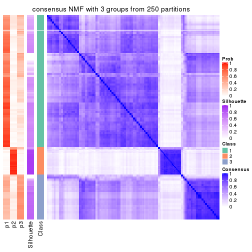</p>

</div>
<div id='tab-CV-NMF-consensus-heatmap-3'>
<pre><code class="r">consensus_heatmap(res, k = 4)
</code></pre>

<p></p>

</div>
<div id='tab-CV-NMF-consensus-heatmap-4'>
<pre><code class="r">consensus_heatmap(res, k = 5)
</code></pre>

<p></p>

</div>
<div id='tab-CV-NMF-consensus-heatmap-5'>
<pre><code class="r">consensus_heatmap(res, k = 6)
</code></pre>

<p></p>

</div>
</div>

Heatmaps for the membership of samples in all partitions to see how consistent they are:


<script>
$( function() {
	$( '#tabs-CV-NMF-membership-heatmap' ).tabs();
} );
</script>
<div id='tabs-CV-NMF-membership-heatmap'>
<ul>
<li><a href='#tab-CV-NMF-membership-heatmap-1'>k = 2</a></li>
<li><a href='#tab-CV-NMF-membership-heatmap-2'>k = 3</a></li>
<li><a href='#tab-CV-NMF-membership-heatmap-3'>k = 4</a></li>
<li><a href='#tab-CV-NMF-membership-heatmap-4'>k = 5</a></li>
<li><a href='#tab-CV-NMF-membership-heatmap-5'>k = 6</a></li>
</ul>
<div id='tab-CV-NMF-membership-heatmap-1'>
<pre><code class="r">membership_heatmap(res, k = 2)
</code></pre>

<p></p>

</div>
<div id='tab-CV-NMF-membership-heatmap-2'>
<pre><code class="r">membership_heatmap(res, k = 3)
</code></pre>

<p></p>

</div>
<div id='tab-CV-NMF-membership-heatmap-3'>
<pre><code class="r">membership_heatmap(res, k = 4)
</code></pre>

<p></p>

</div>
<div id='tab-CV-NMF-membership-heatmap-4'>
<pre><code class="r">membership_heatmap(res, k = 5)
</code></pre>

<p></p>

</div>
<div id='tab-CV-NMF-membership-heatmap-5'>
<pre><code class="r">membership_heatmap(res, k = 6)
</code></pre>

<p></p>

</div>
</div>

As soon as we have had the classes for columns, we can look for signatures
which are significantly different between classes which can be candidate marks
for certain classes. Following are the heatmaps for signatures.


Signature heatmaps where rows are scaled:


<script>
$( function() {
	$( '#tabs-CV-NMF-get-signatures' ).tabs();
} );
</script>
<div id='tabs-CV-NMF-get-signatures'>
<ul>
<li><a href='#tab-CV-NMF-get-signatures-1'>k = 2</a></li>
<li><a href='#tab-CV-NMF-get-signatures-2'>k = 3</a></li>
<li><a href='#tab-CV-NMF-get-signatures-3'>k = 4</a></li>
<li><a href='#tab-CV-NMF-get-signatures-4'>k = 5</a></li>
<li><a href='#tab-CV-NMF-get-signatures-5'>k = 6</a></li>
</ul>
<div id='tab-CV-NMF-get-signatures-1'>
<pre><code class="r">get_signatures(res, k = 2)
</code></pre>

<p></p>

</div>
<div id='tab-CV-NMF-get-signatures-2'>
<pre><code class="r">get_signatures(res, k = 3)
</code></pre>

<p></p>

</div>
<div id='tab-CV-NMF-get-signatures-3'>
<pre><code class="r">get_signatures(res, k = 4)
</code></pre>

<p></p>

</div>
<div id='tab-CV-NMF-get-signatures-4'>
<pre><code class="r">get_signatures(res, k = 5)
</code></pre>

<p>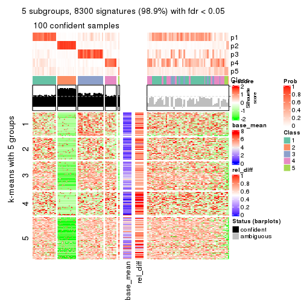</p>

</div>
<div id='tab-CV-NMF-get-signatures-5'>
<pre><code class="r">get_signatures(res, k = 6)
</code></pre>

<p></p>

</div>
</div>


Signature heatmaps where rows are not scaled:


<script>
$( function() {
	$( '#tabs-CV-NMF-get-signatures-no-scale' ).tabs();
} );
</script>
<div id='tabs-CV-NMF-get-signatures-no-scale'>
<ul>
<li><a href='#tab-CV-NMF-get-signatures-no-scale-1'>k = 2</a></li>
<li><a href='#tab-CV-NMF-get-signatures-no-scale-2'>k = 3</a></li>
<li><a href='#tab-CV-NMF-get-signatures-no-scale-3'>k = 4</a></li>
<li><a href='#tab-CV-NMF-get-signatures-no-scale-4'>k = 5</a></li>
<li><a href='#tab-CV-NMF-get-signatures-no-scale-5'>k = 6</a></li>
</ul>
<div id='tab-CV-NMF-get-signatures-no-scale-1'>
<pre><code class="r">get_signatures(res, k = 2, scale_rows = FALSE)
</code></pre>

<p></p>

</div>
<div id='tab-CV-NMF-get-signatures-no-scale-2'>
<pre><code class="r">get_signatures(res, k = 3, scale_rows = FALSE)
</code></pre>

<p></p>

</div>
<div id='tab-CV-NMF-get-signatures-no-scale-3'>
<pre><code class="r">get_signatures(res, k = 4, scale_rows = FALSE)
</code></pre>

<p></p>

</div>
<div id='tab-CV-NMF-get-signatures-no-scale-4'>
<pre><code class="r">get_signatures(res, k = 5, scale_rows = FALSE)
</code></pre>

<p></p>

</div>
<div id='tab-CV-NMF-get-signatures-no-scale-5'>
<pre><code class="r">get_signatures(res, k = 6, scale_rows = FALSE)
</code></pre>

<p></p>

</div>
</div>


Compare the overlap of signatures from different k:

```r
compare_signatures(res)
```


`get_signature()` returns a data frame invisibly. TO get the list of signatures, the function
call should be assigned to a variable explicitly. In following code, if `plot` argument is set
to `FALSE`, no heatmap is plotted while only the differential analysis is performed.

```r
# code only for demonstration
tb = get_signature(res, k = ..., plot = FALSE)
```

An example of the output of `tb` is:

```
#>   which_row         fdr    mean_1    mean_2 scaled_mean_1 scaled_mean_2 km
#> 1        38 0.042760348  8.373488  9.131774    -0.5533452     0.5164555  1
#> 2        40 0.018707592  7.106213  8.469186    -0.6173731     0.5762149  1
#> 3        55 0.019134737 10.221463 11.207825    -0.6159697     0.5749050  1
#> 4        59 0.006059896  5.921854  7.869574    -0.6899429     0.6439467  1
#> 5        60 0.018055526  8.928898 10.211722    -0.6204761     0.5791110  1
#> 6        98 0.009384629 15.714769 14.887706     0.6635654    -0.6193277  2
...
```

The columns in `tb` are:

1. `which_row`: row indices corresponding to the input matrix.
2. `fdr`: FDR for the differential test. 
3. `mean_x`: The mean value in group x.
4. `scaled_mean_x`: The mean value in group x after rows are scaled.
5. `km`: Row groups if k-means clustering is applied to rows.


UMAP plot which shows how samples are separated.


<script>
$( function() {
	$( '#tabs-CV-NMF-dimension-reduction' ).tabs();
} );
</script>
<div id='tabs-CV-NMF-dimension-reduction'>
<ul>
<li><a href='#tab-CV-NMF-dimension-reduction-1'>k = 2</a></li>
<li><a href='#tab-CV-NMF-dimension-reduction-2'>k = 3</a></li>
<li><a href='#tab-CV-NMF-dimension-reduction-3'>k = 4</a></li>
<li><a href='#tab-CV-NMF-dimension-reduction-4'>k = 5</a></li>
<li><a href='#tab-CV-NMF-dimension-reduction-5'>k = 6</a></li>
</ul>
<div id='tab-CV-NMF-dimension-reduction-1'>
<pre><code class="r">dimension_reduction(res, k = 2, method = &quot;UMAP&quot;)
</code></pre>

<p></p>

</div>
<div id='tab-CV-NMF-dimension-reduction-2'>
<pre><code class="r">dimension_reduction(res, k = 3, method = &quot;UMAP&quot;)
</code></pre>

<p></p>

</div>
<div id='tab-CV-NMF-dimension-reduction-3'>
<pre><code class="r">dimension_reduction(res, k = 4, method = &quot;UMAP&quot;)
</code></pre>

<p></p>

</div>
<div id='tab-CV-NMF-dimension-reduction-4'>
<pre><code class="r">dimension_reduction(res, k = 5, method = &quot;UMAP&quot;)
</code></pre>

<p></p>

</div>
<div id='tab-CV-NMF-dimension-reduction-5'>
<pre><code class="r">dimension_reduction(res, k = 6, method = &quot;UMAP&quot;)
</code></pre>

<p></p>

</div>
</div>


Following heatmap shows how subgroups are split when increasing `k`:

```r
collect_classes(res)
```


If matrix rows can be associated to genes, consider to use `GO_Enrichment(res,
...)` to perform function enrichment for the signature genes.


 

---------------------------------------------------


### MAD:hclust**


The object with results only for a single top-value method and a single partition method 
can be extracted as:

```r
res = res_list["MAD", "hclust"]
# you can also extract it by
# res = res_list["MAD:hclust"]
```

A summary of `res` and all the functions that can be applied to it:

```r
res
```

```
#> A 'ConsensusPartition' object with k = 2, 3, 4, 5, 6.
#>   On a matrix with 8394 rows and 194 columns.
#>   Top rows (839, 1678, 2518, 3358, 4197) are extracted by 'MAD' method.
#>   Subgroups are detected by 'hclust' method.
#>   Performed in total 1250 partitions by row resampling.
#>   Best k for subgroups seems to be 2.
#> 
#> Following methods can be applied to this 'ConsensusPartition' object:
#>  [1] "cola_report"             "collect_classes"         "collect_plots"          
#>  [4] "collect_stats"           "colnames"                "compare_signatures"     
#>  [7] "consensus_heatmap"       "dimension_reduction"     "functional_enrichment"  
#> [10] "get_anno_col"            "get_anno"                "get_classes"            
#> [13] "get_consensus"           "get_matrix"              "get_membership"         
#> [16] "get_param"               "get_signatures"          "get_stats"              
#> [19] "is_best_k"               "is_stable_k"             "membership_heatmap"     
#> [22] "ncol"                    "nrow"                    "plot_ecdf"              
#> [25] "rownames"                "select_partition_number" "show"                   
#> [28] "suggest_best_k"          "test_to_known_factors"
```

`collect_plots()` function collects all the plots made from `res` for all `k` (number of partitions)
into one single page to provide an easy and fast comparison between different `k`.

```r
collect_plots(res)
```


The plots are:

- The first row: a plot of the ECDF (Empirical cumulative distribution
  function) curves of the consensus matrix for each `k` and the heatmap of
  predicted classes for each `k`.
- The second row: heatmaps of the consensus matrix for each `k`.
- The third row: heatmaps of the membership matrix for each `k`.
- The fouth row: heatmaps of the signatures for each `k`.

All the plots in panels can be made by individual functions and they are
plotted later in this section.

`select_partition_number()` produces several plots showing different
statistics for choosing "optimized" `k`. There are following statistics:

- ECDF curves of the consensus matrix for each `k`;
- 1-PAC. [The PAC
  score](https://en.wikipedia.org/wiki/Consensus_clustering#Over-interpretation_potential_of_consensus_clustering)
  measures the proportion of the ambiguous subgrouping.
- Mean silhouette score.
- Concordance. The mean probability of fiting the consensus class ids in all
  partitions.
- Area increased. Denote $A_k$ as the area under the ECDF curve for current
  `k`, the area increased is defined as $A_k - A_{k-1}$.
- Rand index. The percent of pairs of samples that are both in a same cluster
  or both are not in a same cluster in the partition of k and k-1.
- Jaccard index. The ratio of pairs of samples are both in a same cluster in
  the partition of k and k-1 and the pairs of samples are both in a same
  cluster in the partition k or k-1.

The detailed explanations of these statistics can be found in [the cola
vignette](http://bioconductor.org/packages/devel/bioc/vignettes/cola/inst/doc/cola.html#toc_13).

Generally speaking, lower PAC score, higher mean silhouette score or higher
concordance corresponds to better partition. Rand index and Jaccard index
measure how similar the current partition is compared to partition with `k-1`.
If they are too similar, we won't accept `k` is better than `k-1`.

```r
select_partition_number(res)
```


The numeric values for all these statistics can be obtained by `get_stats()`.

```r
get_stats(res)
```

```
#>   k 1-PAC mean_silhouette concordance area_increased  Rand Jaccard
#> 2 2 1.000           0.986       0.995          0.241 0.767   0.767
#> 3 3 0.992           0.975       0.971          0.183 0.982   0.977
#> 4 4 0.814           0.833       0.936          0.170 0.982   0.977
#> 5 5 0.708           0.853       0.904          0.208 0.888   0.847
#> 6 6 0.650           0.872       0.904          0.079 0.999   0.998
```

`suggest_best_k()` suggests the best $k$ based on these statistics. The rules are as follows:

- All $k$ with Jaccard index larger than 0.95 are removed because the increase of
  the partition number does not provides enough extra information. If all $k$ are removed,
  the best $k$ is assigned by `NA`.
- For $k$ with 1-PAC larger than 0.9, the maximal $k$ is taken as the "best k". Other $k$ is called "optional k".
- If it does not fit the second rule. The $k$ with the highest vote of highest
  1-PAC, mean silhouette and concordance is taken as the "best k".

```r
suggest_best_k(res)
```

```
#> [1] 2
```


Following shows the table of the partitions (You need to click the **show/hide
code output** link to see it). The membership matrix (columns with name `p*`)
is inferred by
[`clue::cl_consensus()`](https://www.rdocumentation.org/link/cl_consensus?package=clue)
function with the `SE` method. Basically the value in the membership matrix
represents the probability to belong to a certain group. The finall class
label for an item is determined with the group with highest probability it
belongs to.

In `get_classes()` function, the entropy is calculated from the membership
matrix and the silhouette score is calculated from the consensus matrix.


<script>
$( function() {
	$( '#tabs-MAD-hclust-get-classes' ).tabs();
} );
</script>
<div id='tabs-MAD-hclust-get-classes'>
<ul>
<li><a href='#tab-MAD-hclust-get-classes-1'>k = 2</a></li>
<li><a href='#tab-MAD-hclust-get-classes-2'>k = 3</a></li>
<li><a href='#tab-MAD-hclust-get-classes-3'>k = 4</a></li>
<li><a href='#tab-MAD-hclust-get-classes-4'>k = 5</a></li>
<li><a href='#tab-MAD-hclust-get-classes-5'>k = 6</a></li>
</ul>

<div id='tab-MAD-hclust-get-classes-1'>
<p><a id='tab-MAD-hclust-get-classes-1-a' style='color:#0366d6' href='#'>show/hide code output</a></p>
<pre><code class="r">cbind(get_classes(res, k = 2), get_membership(res, k = 2))
</code></pre>

<pre><code>#&gt;           class entropy silhouette    p1    p2
#&gt; ERR467487     1   0.242      0.954 0.960 0.040
#&gt; ERR467498     1   0.242      0.954 0.960 0.040
#&gt; ERR658998     1   0.000      0.994 1.000 0.000
#&gt; ERR659094     1   0.000      0.994 1.000 0.000
#&gt; ERR658999     1   0.000      0.994 1.000 0.000
#&gt; ERR659095     1   0.000      0.994 1.000 0.000
#&gt; ERR659000     1   0.000      0.994 1.000 0.000
#&gt; ERR659096     1   0.000      0.994 1.000 0.000
#&gt; ERR659001     1   0.000      0.994 1.000 0.000
#&gt; ERR659097     1   0.000      0.994 1.000 0.000
#&gt; ERR659002     1   0.000      0.994 1.000 0.000
#&gt; ERR659098     1   0.000      0.994 1.000 0.000
#&gt; ERR659003     1   0.000      0.994 1.000 0.000
#&gt; ERR659099     1   0.000      0.994 1.000 0.000
#&gt; ERR659004     1   0.000      0.994 1.000 0.000
#&gt; ERR659100     1   0.000      0.994 1.000 0.000
#&gt; ERR659005     1   0.000      0.994 1.000 0.000
#&gt; ERR659101     1   0.000      0.994 1.000 0.000
#&gt; ERR659006     1   0.000      0.994 1.000 0.000
#&gt; ERR659102     1   0.000      0.994 1.000 0.000
#&gt; ERR659007     1   0.000      0.994 1.000 0.000
#&gt; ERR659103     1   0.000      0.994 1.000 0.000
#&gt; ERR659008     2   0.000      1.000 0.000 1.000
#&gt; ERR659104     2   0.000      1.000 0.000 1.000
#&gt; ERR659009     1   0.000      0.994 1.000 0.000
#&gt; ERR659105     1   0.000      0.994 1.000 0.000
#&gt; ERR659010     1   0.000      0.994 1.000 0.000
#&gt; ERR659106     1   0.000      0.994 1.000 0.000
#&gt; ERR659011     1   0.000      0.994 1.000 0.000
#&gt; ERR659107     1   0.000      0.994 1.000 0.000
#&gt; ERR659012     1   0.000      0.994 1.000 0.000
#&gt; ERR659108     1   0.000      0.994 1.000 0.000
#&gt; ERR659013     1   0.000      0.994 1.000 0.000
#&gt; ERR659109     1   0.000      0.994 1.000 0.000
#&gt; ERR659014     2   0.000      1.000 0.000 1.000
#&gt; ERR659110     2   0.000      1.000 0.000 1.000
#&gt; ERR659015     1   0.000      0.994 1.000 0.000
#&gt; ERR659111     1   0.000      0.994 1.000 0.000
#&gt; ERR659016     1   0.000      0.994 1.000 0.000
#&gt; ERR659112     1   0.000      0.994 1.000 0.000
#&gt; ERR659017     2   0.000      1.000 0.000 1.000
#&gt; ERR659113     2   0.000      1.000 0.000 1.000
#&gt; ERR659018     1   0.000      0.994 1.000 0.000
#&gt; ERR659114     1   0.000      0.994 1.000 0.000
#&gt; ERR659019     1   0.000      0.994 1.000 0.000
#&gt; ERR659115     1   0.000      0.994 1.000 0.000
#&gt; ERR659020     1   0.000      0.994 1.000 0.000
#&gt; ERR659116     1   0.000      0.994 1.000 0.000
#&gt; ERR659021     1   0.000      0.994 1.000 0.000
#&gt; ERR659117     1   0.000      0.994 1.000 0.000
#&gt; ERR659022     1   0.000      0.994 1.000 0.000
#&gt; ERR659118     1   0.000      0.994 1.000 0.000
#&gt; ERR659023     1   0.000      0.994 1.000 0.000
#&gt; ERR659119     1   0.000      0.994 1.000 0.000
#&gt; ERR659024     1   0.000      0.994 1.000 0.000
#&gt; ERR659120     1   0.000      0.994 1.000 0.000
#&gt; ERR659025     1   0.000      0.994 1.000 0.000
#&gt; ERR659121     1   0.000      0.994 1.000 0.000
#&gt; ERR659026     1   0.000      0.994 1.000 0.000
#&gt; ERR659122     1   0.000      0.994 1.000 0.000
#&gt; ERR659027     1   0.000      0.994 1.000 0.000
#&gt; ERR659123     1   0.000      0.994 1.000 0.000
#&gt; ERR659028     1   0.000      0.994 1.000 0.000
#&gt; ERR659124     1   0.000      0.994 1.000 0.000
#&gt; ERR659029     1   0.000      0.994 1.000 0.000
#&gt; ERR659125     1   0.000      0.994 1.000 0.000
#&gt; ERR659030     1   0.000      0.994 1.000 0.000
#&gt; ERR659126     1   0.000      0.994 1.000 0.000
#&gt; ERR659031     1   0.000      0.994 1.000 0.000
#&gt; ERR659127     1   0.000      0.994 1.000 0.000
#&gt; ERR659032     1   0.000      0.994 1.000 0.000
#&gt; ERR659128     1   0.000      0.994 1.000 0.000
#&gt; ERR659033     1   0.000      0.994 1.000 0.000
#&gt; ERR659129     1   0.000      0.994 1.000 0.000
#&gt; ERR659034     2   0.000      1.000 0.000 1.000
#&gt; ERR659130     2   0.000      1.000 0.000 1.000
#&gt; ERR659035     1   0.000      0.994 1.000 0.000
#&gt; ERR659131     1   0.000      0.994 1.000 0.000
#&gt; ERR659036     1   0.000      0.994 1.000 0.000
#&gt; ERR659132     1   0.000      0.994 1.000 0.000
#&gt; ERR659037     1   0.000      0.994 1.000 0.000
#&gt; ERR659133     1   0.000      0.994 1.000 0.000
#&gt; ERR659038     1   0.000      0.994 1.000 0.000
#&gt; ERR659134     1   0.000      0.994 1.000 0.000
#&gt; ERR659039     1   0.000      0.994 1.000 0.000
#&gt; ERR659135     1   0.000      0.994 1.000 0.000
#&gt; ERR659040     1   0.000      0.994 1.000 0.000
#&gt; ERR659136     1   0.000      0.994 1.000 0.000
#&gt; ERR659041     1   0.000      0.994 1.000 0.000
#&gt; ERR659137     1   0.000      0.994 1.000 0.000
#&gt; ERR659042     1   0.000      0.994 1.000 0.000
#&gt; ERR659138     1   0.000      0.994 1.000 0.000
#&gt; ERR659043     1   0.000      0.994 1.000 0.000
#&gt; ERR659139     1   0.000      0.994 1.000 0.000
#&gt; ERR659044     2   0.000      1.000 0.000 1.000
#&gt; ERR659140     2   0.000      1.000 0.000 1.000
#&gt; ERR659045     1   0.000      0.994 1.000 0.000
#&gt; ERR659141     1   0.000      0.994 1.000 0.000
#&gt; ERR659046     1   0.000      0.994 1.000 0.000
#&gt; ERR659142     1   0.000      0.994 1.000 0.000
#&gt; ERR659047     1   0.000      0.994 1.000 0.000
#&gt; ERR659143     1   0.000      0.994 1.000 0.000
#&gt; ERR659048     1   0.000      0.994 1.000 0.000
#&gt; ERR659144     1   0.000      0.994 1.000 0.000
#&gt; ERR659049     1   0.000      0.994 1.000 0.000
#&gt; ERR659145     1   0.000      0.994 1.000 0.000
#&gt; ERR659050     1   0.000      0.994 1.000 0.000
#&gt; ERR659146     1   0.000      0.994 1.000 0.000
#&gt; ERR659051     1   0.992      0.195 0.552 0.448
#&gt; ERR659147     1   0.992      0.195 0.552 0.448
#&gt; ERR659052     1   0.000      0.994 1.000 0.000
#&gt; ERR659148     1   0.000      0.994 1.000 0.000
#&gt; ERR659053     1   0.000      0.994 1.000 0.000
#&gt; ERR659149     1   0.000      0.994 1.000 0.000
#&gt; ERR659054     2   0.000      1.000 0.000 1.000
#&gt; ERR659150     2   0.000      1.000 0.000 1.000
#&gt; ERR659055     1   0.000      0.994 1.000 0.000
#&gt; ERR659151     1   0.000      0.994 1.000 0.000
#&gt; ERR659056     1   0.000      0.994 1.000 0.000
#&gt; ERR659152     1   0.000      0.994 1.000 0.000
#&gt; ERR659057     1   0.000      0.994 1.000 0.000
#&gt; ERR659153     1   0.000      0.994 1.000 0.000
#&gt; ERR659058     1   0.000      0.994 1.000 0.000
#&gt; ERR659154     1   0.000      0.994 1.000 0.000
#&gt; ERR659059     1   0.000      0.994 1.000 0.000
#&gt; ERR659155     1   0.000      0.994 1.000 0.000
#&gt; ERR659060     1   0.000      0.994 1.000 0.000
#&gt; ERR659156     1   0.000      0.994 1.000 0.000
#&gt; ERR659061     1   0.000      0.994 1.000 0.000
#&gt; ERR659157     1   0.000      0.994 1.000 0.000
#&gt; ERR659062     1   0.000      0.994 1.000 0.000
#&gt; ERR659158     1   0.000      0.994 1.000 0.000
#&gt; ERR659063     1   0.000      0.994 1.000 0.000
#&gt; ERR659159     1   0.000      0.994 1.000 0.000
#&gt; ERR659064     1   0.000      0.994 1.000 0.000
#&gt; ERR659160     1   0.000      0.994 1.000 0.000
#&gt; ERR659065     2   0.000      1.000 0.000 1.000
#&gt; ERR659161     2   0.000      1.000 0.000 1.000
#&gt; ERR659066     1   0.000      0.994 1.000 0.000
#&gt; ERR659162     1   0.000      0.994 1.000 0.000
#&gt; ERR659067     1   0.000      0.994 1.000 0.000
#&gt; ERR659163     1   0.000      0.994 1.000 0.000
#&gt; ERR659068     2   0.000      1.000 0.000 1.000
#&gt; ERR659164     2   0.000      1.000 0.000 1.000
#&gt; ERR659069     1   0.000      0.994 1.000 0.000
#&gt; ERR659165     1   0.000      0.994 1.000 0.000
#&gt; ERR659070     1   0.000      0.994 1.000 0.000
#&gt; ERR659166     1   0.000      0.994 1.000 0.000
#&gt; ERR659071     1   0.000      0.994 1.000 0.000
#&gt; ERR659167     1   0.000      0.994 1.000 0.000
#&gt; ERR659072     1   0.000      0.994 1.000 0.000
#&gt; ERR659168     1   0.000      0.994 1.000 0.000
#&gt; ERR659073     1   0.000      0.994 1.000 0.000
#&gt; ERR659169     1   0.000      0.994 1.000 0.000
#&gt; ERR659074     2   0.000      1.000 0.000 1.000
#&gt; ERR659170     2   0.000      1.000 0.000 1.000
#&gt; ERR659075     2   0.000      1.000 0.000 1.000
#&gt; ERR659171     2   0.000      1.000 0.000 1.000
#&gt; ERR659076     2   0.000      1.000 0.000 1.000
#&gt; ERR659172     2   0.000      1.000 0.000 1.000
#&gt; ERR659077     1   0.000      0.994 1.000 0.000
#&gt; ERR659173     1   0.000      0.994 1.000 0.000
#&gt; ERR659078     1   0.000      0.994 1.000 0.000
#&gt; ERR659174     1   0.000      0.994 1.000 0.000
#&gt; ERR659079     1   0.000      0.994 1.000 0.000
#&gt; ERR659175     1   0.000      0.994 1.000 0.000
#&gt; ERR659080     1   0.000      0.994 1.000 0.000
#&gt; ERR659176     1   0.000      0.994 1.000 0.000
#&gt; ERR659081     1   0.000      0.994 1.000 0.000
#&gt; ERR659177     1   0.000      0.994 1.000 0.000
#&gt; ERR659082     1   0.000      0.994 1.000 0.000
#&gt; ERR659178     1   0.000      0.994 1.000 0.000
#&gt; ERR659083     2   0.000      1.000 0.000 1.000
#&gt; ERR659179     2   0.000      1.000 0.000 1.000
#&gt; ERR659084     2   0.000      1.000 0.000 1.000
#&gt; ERR659180     2   0.000      1.000 0.000 1.000
#&gt; ERR659085     1   0.000      0.994 1.000 0.000
#&gt; ERR659181     1   0.000      0.994 1.000 0.000
#&gt; ERR659086     1   0.000      0.994 1.000 0.000
#&gt; ERR659182     1   0.000      0.994 1.000 0.000
#&gt; ERR659087     1   0.000      0.994 1.000 0.000
#&gt; ERR659183     1   0.000      0.994 1.000 0.000
#&gt; ERR659088     1   0.000      0.994 1.000 0.000
#&gt; ERR659184     1   0.000      0.994 1.000 0.000
#&gt; ERR659089     1   0.000      0.994 1.000 0.000
#&gt; ERR659185     1   0.000      0.994 1.000 0.000
#&gt; ERR659090     1   0.000      0.994 1.000 0.000
#&gt; ERR659186     1   0.000      0.994 1.000 0.000
#&gt; ERR659091     1   0.000      0.994 1.000 0.000
#&gt; ERR659187     1   0.000      0.994 1.000 0.000
#&gt; ERR659092     1   0.000      0.994 1.000 0.000
#&gt; ERR659188     1   0.000      0.994 1.000 0.000
#&gt; ERR659093     1   0.000      0.994 1.000 0.000
#&gt; ERR659189     1   0.000      0.994 1.000 0.000
</code></pre>

<script>
$('#tab-MAD-hclust-get-classes-1-a').parent().next().next().hide();
$('#tab-MAD-hclust-get-classes-1-a').click(function(){
  $('#tab-MAD-hclust-get-classes-1-a').parent().next().next().toggle();
  return(false);
});
</script>
</div>

<div id='tab-MAD-hclust-get-classes-2'>
<p><a id='tab-MAD-hclust-get-classes-2-a' style='color:#0366d6' href='#'>show/hide code output</a></p>
<pre><code class="r">cbind(get_classes(res, k = 3), get_membership(res, k = 3))
</code></pre>

<pre><code>#&gt;           class entropy silhouette    p1    p2    p3
#&gt; ERR467487     1  0.4007      0.905 0.880 0.036 0.084
#&gt; ERR467498     1  0.4007      0.905 0.880 0.036 0.084
#&gt; ERR658998     1  0.0892      0.978 0.980 0.000 0.020
#&gt; ERR659094     1  0.0892      0.978 0.980 0.000 0.020
#&gt; ERR658999     1  0.1031      0.977 0.976 0.000 0.024
#&gt; ERR659095     1  0.1031      0.977 0.976 0.000 0.024
#&gt; ERR659000     1  0.3619      0.889 0.864 0.000 0.136
#&gt; ERR659096     1  0.3619      0.889 0.864 0.000 0.136
#&gt; ERR659001     1  0.0747      0.978 0.984 0.000 0.016
#&gt; ERR659097     1  0.0747      0.978 0.984 0.000 0.016
#&gt; ERR659002     1  0.0424      0.978 0.992 0.000 0.008
#&gt; ERR659098     1  0.0424      0.978 0.992 0.000 0.008
#&gt; ERR659003     1  0.0424      0.979 0.992 0.000 0.008
#&gt; ERR659099     1  0.0424      0.979 0.992 0.000 0.008
#&gt; ERR659004     1  0.2711      0.949 0.912 0.000 0.088
#&gt; ERR659100     1  0.2711      0.949 0.912 0.000 0.088
#&gt; ERR659005     1  0.0237      0.977 0.996 0.000 0.004
#&gt; ERR659101     1  0.0237      0.977 0.996 0.000 0.004
#&gt; ERR659006     1  0.2711      0.949 0.912 0.000 0.088
#&gt; ERR659102     1  0.2711      0.949 0.912 0.000 0.088
#&gt; ERR659007     1  0.0747      0.978 0.984 0.000 0.016
#&gt; ERR659103     1  0.0747      0.978 0.984 0.000 0.016
#&gt; ERR659008     2  0.0000      1.000 0.000 1.000 0.000
#&gt; ERR659104     2  0.0000      1.000 0.000 1.000 0.000
#&gt; ERR659009     1  0.1860      0.970 0.948 0.000 0.052
#&gt; ERR659105     1  0.1860      0.970 0.948 0.000 0.052
#&gt; ERR659010     1  0.2066      0.966 0.940 0.000 0.060
#&gt; ERR659106     1  0.2066      0.966 0.940 0.000 0.060
#&gt; ERR659011     1  0.1529      0.975 0.960 0.000 0.040
#&gt; ERR659107     1  0.1529      0.975 0.960 0.000 0.040
#&gt; ERR659012     1  0.2711      0.949 0.912 0.000 0.088
#&gt; ERR659108     1  0.2711      0.949 0.912 0.000 0.088
#&gt; ERR659013     1  0.3038      0.922 0.896 0.000 0.104
#&gt; ERR659109     1  0.3038      0.922 0.896 0.000 0.104
#&gt; ERR659014     2  0.0000      1.000 0.000 1.000 0.000
#&gt; ERR659110     2  0.0000      1.000 0.000 1.000 0.000
#&gt; ERR659015     1  0.1031      0.977 0.976 0.000 0.024
#&gt; ERR659111     1  0.1031      0.977 0.976 0.000 0.024
#&gt; ERR659016     1  0.3267      0.919 0.884 0.000 0.116
#&gt; ERR659112     1  0.3267      0.919 0.884 0.000 0.116
#&gt; ERR659017     2  0.0000      1.000 0.000 1.000 0.000
#&gt; ERR659113     2  0.0000      1.000 0.000 1.000 0.000
#&gt; ERR659018     1  0.0747      0.978 0.984 0.000 0.016
#&gt; ERR659114     1  0.0747      0.978 0.984 0.000 0.016
#&gt; ERR659019     1  0.1411      0.975 0.964 0.000 0.036
#&gt; ERR659115     1  0.1411      0.975 0.964 0.000 0.036
#&gt; ERR659020     1  0.1031      0.977 0.976 0.000 0.024
#&gt; ERR659116     1  0.1031      0.977 0.976 0.000 0.024
#&gt; ERR659021     1  0.0000      0.977 1.000 0.000 0.000
#&gt; ERR659117     1  0.0000      0.977 1.000 0.000 0.000
#&gt; ERR659022     1  0.0424      0.978 0.992 0.000 0.008
#&gt; ERR659118     1  0.0424      0.978 0.992 0.000 0.008
#&gt; ERR659023     1  0.0424      0.978 0.992 0.000 0.008
#&gt; ERR659119     1  0.0424      0.978 0.992 0.000 0.008
#&gt; ERR659024     1  0.0892      0.977 0.980 0.000 0.020
#&gt; ERR659120     1  0.0892      0.977 0.980 0.000 0.020
#&gt; ERR659025     1  0.1031      0.975 0.976 0.000 0.024
#&gt; ERR659121     1  0.1031      0.975 0.976 0.000 0.024
#&gt; ERR659026     1  0.1289      0.976 0.968 0.000 0.032
#&gt; ERR659122     1  0.1289      0.976 0.968 0.000 0.032
#&gt; ERR659027     1  0.2448      0.950 0.924 0.000 0.076
#&gt; ERR659123     1  0.2448      0.950 0.924 0.000 0.076
#&gt; ERR659028     1  0.0592      0.978 0.988 0.000 0.012
#&gt; ERR659124     1  0.0592      0.978 0.988 0.000 0.012
#&gt; ERR659029     1  0.0747      0.978 0.984 0.000 0.016
#&gt; ERR659125     1  0.0747      0.978 0.984 0.000 0.016
#&gt; ERR659030     1  0.0592      0.978 0.988 0.000 0.012
#&gt; ERR659126     1  0.0592      0.978 0.988 0.000 0.012
#&gt; ERR659031     1  0.1643      0.969 0.956 0.000 0.044
#&gt; ERR659127     1  0.1643      0.969 0.956 0.000 0.044
#&gt; ERR659032     1  0.1860      0.967 0.948 0.000 0.052
#&gt; ERR659128     1  0.1860      0.967 0.948 0.000 0.052
#&gt; ERR659033     1  0.0592      0.978 0.988 0.000 0.012
#&gt; ERR659129     1  0.0592      0.978 0.988 0.000 0.012
#&gt; ERR659034     2  0.0000      1.000 0.000 1.000 0.000
#&gt; ERR659130     2  0.0000      1.000 0.000 1.000 0.000
#&gt; ERR659035     1  0.1031      0.976 0.976 0.000 0.024
#&gt; ERR659131     1  0.1031      0.976 0.976 0.000 0.024
#&gt; ERR659036     1  0.1411      0.972 0.964 0.000 0.036
#&gt; ERR659132     1  0.1411      0.972 0.964 0.000 0.036
#&gt; ERR659037     1  0.0237      0.978 0.996 0.000 0.004
#&gt; ERR659133     1  0.0237      0.978 0.996 0.000 0.004
#&gt; ERR659038     1  0.1289      0.975 0.968 0.000 0.032
#&gt; ERR659134     1  0.1289      0.975 0.968 0.000 0.032
#&gt; ERR659039     1  0.1411      0.975 0.964 0.000 0.036
#&gt; ERR659135     1  0.1411      0.975 0.964 0.000 0.036
#&gt; ERR659040     1  0.1163      0.976 0.972 0.000 0.028
#&gt; ERR659136     1  0.1163      0.976 0.972 0.000 0.028
#&gt; ERR659041     1  0.2261      0.953 0.932 0.000 0.068
#&gt; ERR659137     1  0.2261      0.953 0.932 0.000 0.068
#&gt; ERR659042     1  0.1753      0.968 0.952 0.000 0.048
#&gt; ERR659138     1  0.1753      0.968 0.952 0.000 0.048
#&gt; ERR659043     1  0.0747      0.978 0.984 0.000 0.016
#&gt; ERR659139     1  0.0747      0.978 0.984 0.000 0.016
#&gt; ERR659044     2  0.0000      1.000 0.000 1.000 0.000
#&gt; ERR659140     2  0.0000      1.000 0.000 1.000 0.000
#&gt; ERR659045     1  0.0747      0.978 0.984 0.000 0.016
#&gt; ERR659141     1  0.0747      0.978 0.984 0.000 0.016
#&gt; ERR659046     1  0.0424      0.977 0.992 0.000 0.008
#&gt; ERR659142     1  0.0424      0.977 0.992 0.000 0.008
#&gt; ERR659047     1  0.0000      0.977 1.000 0.000 0.000
#&gt; ERR659143     1  0.0000      0.977 1.000 0.000 0.000
#&gt; ERR659048     1  0.0237      0.977 0.996 0.000 0.004
#&gt; ERR659144     1  0.0237      0.977 0.996 0.000 0.004
#&gt; ERR659049     1  0.1964      0.963 0.944 0.000 0.056
#&gt; ERR659145     1  0.1964      0.963 0.944 0.000 0.056
#&gt; ERR659050     1  0.1163      0.976 0.972 0.000 0.028
#&gt; ERR659146     1  0.1163      0.976 0.972 0.000 0.028
#&gt; ERR659051     3  0.4555      1.000 0.000 0.200 0.800
#&gt; ERR659147     3  0.4555      1.000 0.000 0.200 0.800
#&gt; ERR659052     1  0.2066      0.966 0.940 0.000 0.060
#&gt; ERR659148     1  0.2066      0.966 0.940 0.000 0.060
#&gt; ERR659053     1  0.0000      0.977 1.000 0.000 0.000
#&gt; ERR659149     1  0.0000      0.977 1.000 0.000 0.000
#&gt; ERR659054     2  0.0000      1.000 0.000 1.000 0.000
#&gt; ERR659150     2  0.0000      1.000 0.000 1.000 0.000
#&gt; ERR659055     1  0.1289      0.975 0.968 0.000 0.032
#&gt; ERR659151     1  0.1289      0.975 0.968 0.000 0.032
#&gt; ERR659056     1  0.2448      0.948 0.924 0.000 0.076
#&gt; ERR659152     1  0.2448      0.948 0.924 0.000 0.076
#&gt; ERR659057     1  0.0892      0.978 0.980 0.000 0.020
#&gt; ERR659153     1  0.0892      0.978 0.980 0.000 0.020
#&gt; ERR659058     1  0.1289      0.975 0.968 0.000 0.032
#&gt; ERR659154     1  0.1289      0.975 0.968 0.000 0.032
#&gt; ERR659059     1  0.0424      0.977 0.992 0.000 0.008
#&gt; ERR659155     1  0.0424      0.977 0.992 0.000 0.008
#&gt; ERR659060     1  0.0592      0.978 0.988 0.000 0.012
#&gt; ERR659156     1  0.0592      0.978 0.988 0.000 0.012
#&gt; ERR659061     1  0.0747      0.978 0.984 0.000 0.016
#&gt; ERR659157     1  0.0747      0.978 0.984 0.000 0.016
#&gt; ERR659062     1  0.0892      0.979 0.980 0.000 0.020
#&gt; ERR659158     1  0.0892      0.979 0.980 0.000 0.020
#&gt; ERR659063     1  0.0237      0.977 0.996 0.000 0.004
#&gt; ERR659159     1  0.0237      0.977 0.996 0.000 0.004
#&gt; ERR659064     1  0.0424      0.977 0.992 0.000 0.008
#&gt; ERR659160     1  0.0424      0.977 0.992 0.000 0.008
#&gt; ERR659065     2  0.0000      1.000 0.000 1.000 0.000
#&gt; ERR659161     2  0.0000      1.000 0.000 1.000 0.000
#&gt; ERR659066     1  0.1411      0.974 0.964 0.000 0.036
#&gt; ERR659162     1  0.1411      0.974 0.964 0.000 0.036
#&gt; ERR659067     1  0.1031      0.977 0.976 0.000 0.024
#&gt; ERR659163     1  0.1031      0.977 0.976 0.000 0.024
#&gt; ERR659068     2  0.0000      1.000 0.000 1.000 0.000
#&gt; ERR659164     2  0.0000      1.000 0.000 1.000 0.000
#&gt; ERR659069     1  0.1411      0.976 0.964 0.000 0.036
#&gt; ERR659165     1  0.1411      0.976 0.964 0.000 0.036
#&gt; ERR659070     1  0.0424      0.977 0.992 0.000 0.008
#&gt; ERR659166     1  0.0424      0.977 0.992 0.000 0.008
#&gt; ERR659071     1  0.0747      0.978 0.984 0.000 0.016
#&gt; ERR659167     1  0.0747      0.978 0.984 0.000 0.016
#&gt; ERR659072     1  0.1289      0.975 0.968 0.000 0.032
#&gt; ERR659168     1  0.1289      0.975 0.968 0.000 0.032
#&gt; ERR659073     1  0.0237      0.977 0.996 0.000 0.004
#&gt; ERR659169     1  0.0237      0.977 0.996 0.000 0.004
#&gt; ERR659074     2  0.0000      1.000 0.000 1.000 0.000
#&gt; ERR659170     2  0.0000      1.000 0.000 1.000 0.000
#&gt; ERR659075     2  0.0000      1.000 0.000 1.000 0.000
#&gt; ERR659171     2  0.0000      1.000 0.000 1.000 0.000
#&gt; ERR659076     2  0.0000      1.000 0.000 1.000 0.000
#&gt; ERR659172     2  0.0000      1.000 0.000 1.000 0.000
#&gt; ERR659077     1  0.0747      0.978 0.984 0.000 0.016
#&gt; ERR659173     1  0.0747      0.978 0.984 0.000 0.016
#&gt; ERR659078     1  0.0424      0.977 0.992 0.000 0.008
#&gt; ERR659174     1  0.0424      0.977 0.992 0.000 0.008
#&gt; ERR659079     1  0.0747      0.978 0.984 0.000 0.016
#&gt; ERR659175     1  0.0747      0.978 0.984 0.000 0.016
#&gt; ERR659080     1  0.2448      0.949 0.924 0.000 0.076
#&gt; ERR659176     1  0.2448      0.949 0.924 0.000 0.076
#&gt; ERR659081     1  0.0000      0.977 1.000 0.000 0.000
#&gt; ERR659177     1  0.0000      0.977 1.000 0.000 0.000
#&gt; ERR659082     1  0.0237      0.977 0.996 0.000 0.004
#&gt; ERR659178     1  0.0237      0.977 0.996 0.000 0.004
#&gt; ERR659083     2  0.0000      1.000 0.000 1.000 0.000
#&gt; ERR659179     2  0.0000      1.000 0.000 1.000 0.000
#&gt; ERR659084     2  0.0000      1.000 0.000 1.000 0.000
#&gt; ERR659180     2  0.0000      1.000 0.000 1.000 0.000
#&gt; ERR659085     1  0.0424      0.977 0.992 0.000 0.008
#&gt; ERR659181     1  0.0424      0.977 0.992 0.000 0.008
#&gt; ERR659086     1  0.0424      0.977 0.992 0.000 0.008
#&gt; ERR659182     1  0.0424      0.977 0.992 0.000 0.008
#&gt; ERR659087     1  0.1643      0.974 0.956 0.000 0.044
#&gt; ERR659183     1  0.1643      0.974 0.956 0.000 0.044
#&gt; ERR659088     1  0.2448      0.956 0.924 0.000 0.076
#&gt; ERR659184     1  0.2448      0.956 0.924 0.000 0.076
#&gt; ERR659089     1  0.0747      0.978 0.984 0.000 0.016
#&gt; ERR659185     1  0.0747      0.978 0.984 0.000 0.016
#&gt; ERR659090     1  0.1289      0.976 0.968 0.000 0.032
#&gt; ERR659186     1  0.1289      0.976 0.968 0.000 0.032
#&gt; ERR659091     1  0.0424      0.977 0.992 0.000 0.008
#&gt; ERR659187     1  0.0424      0.977 0.992 0.000 0.008
#&gt; ERR659092     1  0.0592      0.978 0.988 0.000 0.012
#&gt; ERR659188     1  0.0592      0.978 0.988 0.000 0.012
#&gt; ERR659093     1  0.0000      0.977 1.000 0.000 0.000
#&gt; ERR659189     1  0.0000      0.977 1.000 0.000 0.000
</code></pre>

<script>
$('#tab-MAD-hclust-get-classes-2-a').parent().next().next().hide();
$('#tab-MAD-hclust-get-classes-2-a').click(function(){
  $('#tab-MAD-hclust-get-classes-2-a').parent().next().next().toggle();
  return(false);
});
</script>
</div>

<div id='tab-MAD-hclust-get-classes-3'>
<p><a id='tab-MAD-hclust-get-classes-3-a' style='color:#0366d6' href='#'>show/hide code output</a></p>
<pre><code class="r">cbind(get_classes(res, k = 4), get_membership(res, k = 4))
</code></pre>

<pre><code>#&gt;           class entropy silhouette    p1    p2    p3    p4
#&gt; ERR467487     1  0.5618      0.244 0.720 0.036 0.024 0.220
#&gt; ERR467498     1  0.5618      0.244 0.720 0.036 0.024 0.220
#&gt; ERR658998     1  0.1256      0.899 0.964 0.000 0.008 0.028
#&gt; ERR659094     1  0.1256      0.899 0.964 0.000 0.008 0.028
#&gt; ERR658999     1  0.1059      0.900 0.972 0.000 0.012 0.016
#&gt; ERR659095     1  0.1059      0.900 0.972 0.000 0.012 0.016
#&gt; ERR659000     4  0.6214      1.000 0.468 0.000 0.052 0.480
#&gt; ERR659096     4  0.6214      1.000 0.468 0.000 0.052 0.480
#&gt; ERR659001     1  0.0779      0.902 0.980 0.000 0.004 0.016
#&gt; ERR659097     1  0.0779      0.902 0.980 0.000 0.004 0.016
#&gt; ERR659002     1  0.1004      0.899 0.972 0.000 0.004 0.024
#&gt; ERR659098     1  0.1004      0.899 0.972 0.000 0.004 0.024
#&gt; ERR659003     1  0.0672      0.904 0.984 0.000 0.008 0.008
#&gt; ERR659099     1  0.0672      0.904 0.984 0.000 0.008 0.008
#&gt; ERR659004     1  0.3617      0.762 0.860 0.000 0.076 0.064
#&gt; ERR659100     1  0.3617      0.762 0.860 0.000 0.076 0.064
#&gt; ERR659005     1  0.0469      0.903 0.988 0.000 0.000 0.012
#&gt; ERR659101     1  0.0469      0.903 0.988 0.000 0.000 0.012
#&gt; ERR659006     1  0.3533      0.771 0.864 0.000 0.080 0.056
#&gt; ERR659102     1  0.3533      0.771 0.864 0.000 0.080 0.056
#&gt; ERR659007     1  0.0779      0.902 0.980 0.000 0.004 0.016
#&gt; ERR659103     1  0.0779      0.902 0.980 0.000 0.004 0.016
#&gt; ERR659008     2  0.0000      0.967 0.000 1.000 0.000 0.000
#&gt; ERR659104     2  0.0000      0.967 0.000 1.000 0.000 0.000
#&gt; ERR659009     1  0.2021      0.880 0.936 0.000 0.040 0.024
#&gt; ERR659105     1  0.2021      0.880 0.936 0.000 0.040 0.024
#&gt; ERR659010     1  0.2319      0.868 0.924 0.000 0.040 0.036
#&gt; ERR659106     1  0.2319      0.868 0.924 0.000 0.040 0.036
#&gt; ERR659011     1  0.1629      0.896 0.952 0.000 0.024 0.024
#&gt; ERR659107     1  0.1629      0.896 0.952 0.000 0.024 0.024
#&gt; ERR659012     1  0.3474      0.780 0.868 0.000 0.068 0.064
#&gt; ERR659108     1  0.3474      0.780 0.868 0.000 0.068 0.064
#&gt; ERR659013     1  0.5231     -0.209 0.676 0.000 0.028 0.296
#&gt; ERR659109     1  0.5231     -0.209 0.676 0.000 0.028 0.296
#&gt; ERR659014     2  0.0000      0.967 0.000 1.000 0.000 0.000
#&gt; ERR659110     2  0.0000      0.967 0.000 1.000 0.000 0.000
#&gt; ERR659015     1  0.1284      0.898 0.964 0.000 0.012 0.024
#&gt; ERR659111     1  0.1284      0.898 0.964 0.000 0.012 0.024
#&gt; ERR659016     1  0.6214     -0.574 0.576 0.000 0.064 0.360
#&gt; ERR659112     1  0.6214     -0.574 0.576 0.000 0.064 0.360
#&gt; ERR659017     2  0.0000      0.967 0.000 1.000 0.000 0.000
#&gt; ERR659113     2  0.0000      0.967 0.000 1.000 0.000 0.000
#&gt; ERR659018     1  0.0672      0.901 0.984 0.000 0.008 0.008
#&gt; ERR659114     1  0.0672      0.901 0.984 0.000 0.008 0.008
#&gt; ERR659019     1  0.1411      0.898 0.960 0.000 0.020 0.020
#&gt; ERR659115     1  0.1411      0.898 0.960 0.000 0.020 0.020
#&gt; ERR659020     1  0.1004      0.903 0.972 0.000 0.004 0.024
#&gt; ERR659116     1  0.1004      0.903 0.972 0.000 0.004 0.024
#&gt; ERR659021     1  0.0188      0.898 0.996 0.000 0.000 0.004
#&gt; ERR659117     1  0.0188      0.898 0.996 0.000 0.000 0.004
#&gt; ERR659022     1  0.0779      0.902 0.980 0.000 0.004 0.016
#&gt; ERR659118     1  0.0779      0.902 0.980 0.000 0.004 0.016
#&gt; ERR659023     1  0.0937      0.903 0.976 0.000 0.012 0.012
#&gt; ERR659119     1  0.0937      0.903 0.976 0.000 0.012 0.012
#&gt; ERR659024     1  0.1256      0.898 0.964 0.000 0.008 0.028
#&gt; ERR659120     1  0.1256      0.898 0.964 0.000 0.008 0.028
#&gt; ERR659025     1  0.2021      0.866 0.932 0.000 0.012 0.056
#&gt; ERR659121     1  0.2021      0.866 0.932 0.000 0.012 0.056
#&gt; ERR659026     1  0.1833      0.892 0.944 0.000 0.024 0.032
#&gt; ERR659122     1  0.1833      0.892 0.944 0.000 0.024 0.032
#&gt; ERR659027     1  0.4220      0.387 0.748 0.000 0.004 0.248
#&gt; ERR659123     1  0.4220      0.387 0.748 0.000 0.004 0.248
#&gt; ERR659028     1  0.0804      0.903 0.980 0.000 0.008 0.012
#&gt; ERR659124     1  0.0804      0.903 0.980 0.000 0.008 0.012
#&gt; ERR659029     1  0.1182      0.901 0.968 0.000 0.016 0.016
#&gt; ERR659125     1  0.1182      0.901 0.968 0.000 0.016 0.016
#&gt; ERR659030     1  0.0469      0.902 0.988 0.000 0.012 0.000
#&gt; ERR659126     1  0.0469      0.902 0.988 0.000 0.012 0.000
#&gt; ERR659031     1  0.2376      0.847 0.916 0.000 0.016 0.068
#&gt; ERR659127     1  0.2376      0.847 0.916 0.000 0.016 0.068
#&gt; ERR659032     1  0.2494      0.856 0.916 0.000 0.036 0.048
#&gt; ERR659128     1  0.2494      0.856 0.916 0.000 0.036 0.048
#&gt; ERR659033     1  0.0524      0.901 0.988 0.000 0.004 0.008
#&gt; ERR659129     1  0.0524      0.901 0.988 0.000 0.004 0.008
#&gt; ERR659034     2  0.0000      0.967 0.000 1.000 0.000 0.000
#&gt; ERR659130     2  0.0000      0.967 0.000 1.000 0.000 0.000
#&gt; ERR659035     1  0.1510      0.895 0.956 0.000 0.016 0.028
#&gt; ERR659131     1  0.1510      0.895 0.956 0.000 0.016 0.028
#&gt; ERR659036     1  0.3485      0.711 0.856 0.000 0.028 0.116
#&gt; ERR659132     1  0.3485      0.711 0.856 0.000 0.028 0.116
#&gt; ERR659037     1  0.0524      0.901 0.988 0.000 0.004 0.008
#&gt; ERR659133     1  0.0524      0.901 0.988 0.000 0.004 0.008
#&gt; ERR659038     1  0.1406      0.898 0.960 0.000 0.016 0.024
#&gt; ERR659134     1  0.1406      0.898 0.960 0.000 0.016 0.024
#&gt; ERR659039     1  0.1297      0.897 0.964 0.000 0.020 0.016
#&gt; ERR659135     1  0.1297      0.897 0.964 0.000 0.020 0.016
#&gt; ERR659040     1  0.1584      0.892 0.952 0.000 0.012 0.036
#&gt; ERR659136     1  0.1584      0.892 0.952 0.000 0.012 0.036
#&gt; ERR659041     1  0.4426      0.484 0.772 0.000 0.024 0.204
#&gt; ERR659137     1  0.4426      0.484 0.772 0.000 0.024 0.204
#&gt; ERR659042     1  0.3653      0.690 0.844 0.000 0.028 0.128
#&gt; ERR659138     1  0.3653      0.690 0.844 0.000 0.028 0.128
#&gt; ERR659043     1  0.1406      0.894 0.960 0.000 0.016 0.024
#&gt; ERR659139     1  0.1406      0.894 0.960 0.000 0.016 0.024
#&gt; ERR659044     2  0.0000      0.967 0.000 1.000 0.000 0.000
#&gt; ERR659140     2  0.0000      0.967 0.000 1.000 0.000 0.000
#&gt; ERR659045     1  0.0672      0.901 0.984 0.000 0.008 0.008
#&gt; ERR659141     1  0.0672      0.901 0.984 0.000 0.008 0.008
#&gt; ERR659046     1  0.0657      0.902 0.984 0.000 0.004 0.012
#&gt; ERR659142     1  0.0657      0.902 0.984 0.000 0.004 0.012
#&gt; ERR659047     1  0.0336      0.900 0.992 0.000 0.000 0.008
#&gt; ERR659143     1  0.0336      0.900 0.992 0.000 0.000 0.008
#&gt; ERR659048     1  0.0524      0.901 0.988 0.000 0.004 0.008
#&gt; ERR659144     1  0.0524      0.901 0.988 0.000 0.004 0.008
#&gt; ERR659049     1  0.3335      0.725 0.856 0.000 0.016 0.128
#&gt; ERR659145     1  0.3335      0.725 0.856 0.000 0.016 0.128
#&gt; ERR659050     1  0.1635      0.891 0.948 0.000 0.008 0.044
#&gt; ERR659146     1  0.1635      0.891 0.948 0.000 0.008 0.044
#&gt; ERR659051     3  0.3400      1.000 0.000 0.180 0.820 0.000
#&gt; ERR659147     3  0.3400      1.000 0.000 0.180 0.820 0.000
#&gt; ERR659052     1  0.2408      0.867 0.920 0.000 0.044 0.036
#&gt; ERR659148     1  0.2408      0.867 0.920 0.000 0.044 0.036
#&gt; ERR659053     1  0.0336      0.899 0.992 0.000 0.000 0.008
#&gt; ERR659149     1  0.0336      0.899 0.992 0.000 0.000 0.008
#&gt; ERR659054     2  0.0000      0.967 0.000 1.000 0.000 0.000
#&gt; ERR659150     2  0.0000      0.967 0.000 1.000 0.000 0.000
#&gt; ERR659055     1  0.1182      0.898 0.968 0.000 0.016 0.016
#&gt; ERR659151     1  0.1182      0.898 0.968 0.000 0.016 0.016
#&gt; ERR659056     1  0.4313      0.333 0.736 0.000 0.004 0.260
#&gt; ERR659152     1  0.4313      0.333 0.736 0.000 0.004 0.260
#&gt; ERR659057     1  0.1042      0.903 0.972 0.000 0.008 0.020
#&gt; ERR659153     1  0.1042      0.903 0.972 0.000 0.008 0.020
#&gt; ERR659058     1  0.1406      0.898 0.960 0.000 0.016 0.024
#&gt; ERR659154     1  0.1406      0.898 0.960 0.000 0.016 0.024
#&gt; ERR659059     1  0.0524      0.901 0.988 0.000 0.004 0.008
#&gt; ERR659155     1  0.0524      0.901 0.988 0.000 0.004 0.008
#&gt; ERR659060     1  0.0927      0.901 0.976 0.000 0.008 0.016
#&gt; ERR659156     1  0.0927      0.901 0.976 0.000 0.008 0.016
#&gt; ERR659061     1  0.1059      0.903 0.972 0.000 0.012 0.016
#&gt; ERR659157     1  0.1059      0.903 0.972 0.000 0.012 0.016
#&gt; ERR659062     1  0.1256      0.903 0.964 0.000 0.008 0.028
#&gt; ERR659158     1  0.1256      0.903 0.964 0.000 0.008 0.028
#&gt; ERR659063     1  0.0779      0.900 0.980 0.000 0.004 0.016
#&gt; ERR659159     1  0.0779      0.900 0.980 0.000 0.004 0.016
#&gt; ERR659064     1  0.0524      0.901 0.988 0.000 0.004 0.008
#&gt; ERR659160     1  0.0524      0.901 0.988 0.000 0.004 0.008
#&gt; ERR659065     2  0.0000      0.967 0.000 1.000 0.000 0.000
#&gt; ERR659161     2  0.0000      0.967 0.000 1.000 0.000 0.000
#&gt; ERR659066     1  0.1733      0.889 0.948 0.000 0.028 0.024
#&gt; ERR659162     1  0.1733      0.889 0.948 0.000 0.028 0.024
#&gt; ERR659067     1  0.1059      0.900 0.972 0.000 0.012 0.016
#&gt; ERR659163     1  0.1059      0.900 0.972 0.000 0.012 0.016
#&gt; ERR659068     2  0.0000      0.967 0.000 1.000 0.000 0.000
#&gt; ERR659164     2  0.0000      0.967 0.000 1.000 0.000 0.000
#&gt; ERR659069     1  0.1624      0.897 0.952 0.000 0.020 0.028
#&gt; ERR659165     1  0.1624      0.897 0.952 0.000 0.020 0.028
#&gt; ERR659070     1  0.0592      0.901 0.984 0.000 0.000 0.016
#&gt; ERR659166     1  0.0592      0.901 0.984 0.000 0.000 0.016
#&gt; ERR659071     1  0.0927      0.903 0.976 0.000 0.016 0.008
#&gt; ERR659167     1  0.0927      0.903 0.976 0.000 0.016 0.008
#&gt; ERR659072     1  0.1411      0.896 0.960 0.000 0.020 0.020
#&gt; ERR659168     1  0.1411      0.896 0.960 0.000 0.020 0.020
#&gt; ERR659073     1  0.0524      0.902 0.988 0.000 0.008 0.004
#&gt; ERR659169     1  0.0524      0.902 0.988 0.000 0.008 0.004
#&gt; ERR659074     2  0.0000      0.967 0.000 1.000 0.000 0.000
#&gt; ERR659170     2  0.0000      0.967 0.000 1.000 0.000 0.000
#&gt; ERR659075     2  0.4643      0.409 0.000 0.656 0.000 0.344
#&gt; ERR659171     2  0.4643      0.409 0.000 0.656 0.000 0.344
#&gt; ERR659076     2  0.0000      0.967 0.000 1.000 0.000 0.000
#&gt; ERR659172     2  0.0000      0.967 0.000 1.000 0.000 0.000
#&gt; ERR659077     1  0.1151      0.903 0.968 0.000 0.008 0.024
#&gt; ERR659173     1  0.1151      0.903 0.968 0.000 0.008 0.024
#&gt; ERR659078     1  0.0804      0.903 0.980 0.000 0.008 0.012
#&gt; ERR659174     1  0.0804      0.903 0.980 0.000 0.008 0.012
#&gt; ERR659079     1  0.0927      0.902 0.976 0.000 0.008 0.016
#&gt; ERR659175     1  0.0927      0.902 0.976 0.000 0.008 0.016
#&gt; ERR659080     1  0.4482      0.300 0.728 0.000 0.008 0.264
#&gt; ERR659176     1  0.4482      0.300 0.728 0.000 0.008 0.264
#&gt; ERR659081     1  0.0188      0.900 0.996 0.000 0.004 0.000
#&gt; ERR659177     1  0.0188      0.900 0.996 0.000 0.004 0.000
#&gt; ERR659082     1  0.0188      0.901 0.996 0.000 0.004 0.000
#&gt; ERR659178     1  0.0188      0.901 0.996 0.000 0.004 0.000
#&gt; ERR659083     2  0.0000      0.967 0.000 1.000 0.000 0.000
#&gt; ERR659179     2  0.0000      0.967 0.000 1.000 0.000 0.000
#&gt; ERR659084     2  0.0000      0.967 0.000 1.000 0.000 0.000
#&gt; ERR659180     2  0.0000      0.967 0.000 1.000 0.000 0.000
#&gt; ERR659085     1  0.0524      0.902 0.988 0.000 0.004 0.008
#&gt; ERR659181     1  0.0524      0.902 0.988 0.000 0.004 0.008
#&gt; ERR659086     1  0.0469      0.901 0.988 0.000 0.000 0.012
#&gt; ERR659182     1  0.0469      0.901 0.988 0.000 0.000 0.012
#&gt; ERR659087     1  0.1724      0.891 0.948 0.000 0.032 0.020
#&gt; ERR659183     1  0.1724      0.891 0.948 0.000 0.032 0.020
#&gt; ERR659088     1  0.4877      0.431 0.752 0.000 0.044 0.204
#&gt; ERR659184     1  0.4877      0.431 0.752 0.000 0.044 0.204
#&gt; ERR659089     1  0.1209      0.900 0.964 0.000 0.004 0.032
#&gt; ERR659185     1  0.1209      0.900 0.964 0.000 0.004 0.032
#&gt; ERR659090     1  0.1510      0.899 0.956 0.000 0.016 0.028
#&gt; ERR659186     1  0.1510      0.899 0.956 0.000 0.016 0.028
#&gt; ERR659091     1  0.0524      0.901 0.988 0.000 0.004 0.008
#&gt; ERR659187     1  0.0524      0.901 0.988 0.000 0.004 0.008
#&gt; ERR659092     1  0.0804      0.902 0.980 0.000 0.008 0.012
#&gt; ERR659188     1  0.0804      0.902 0.980 0.000 0.008 0.012
#&gt; ERR659093     1  0.0188      0.898 0.996 0.000 0.000 0.004
#&gt; ERR659189     1  0.0188      0.898 0.996 0.000 0.000 0.004
</code></pre>

<script>
$('#tab-MAD-hclust-get-classes-3-a').parent().next().next().hide();
$('#tab-MAD-hclust-get-classes-3-a').click(function(){
  $('#tab-MAD-hclust-get-classes-3-a').parent().next().next().toggle();
  return(false);
});
</script>
</div>

<div id='tab-MAD-hclust-get-classes-4'>
<p><a id='tab-MAD-hclust-get-classes-4-a' style='color:#0366d6' href='#'>show/hide code output</a></p>
<pre><code class="r">cbind(get_classes(res, k = 5), get_membership(res, k = 5))
</code></pre>

<pre><code>#&gt;           class entropy silhouette    p1    p2    p3    p4    p5
#&gt; ERR467487     3  0.5777     0.6672 0.360 0.032 0.572 0.032 0.004
#&gt; ERR467498     3  0.5777     0.6672 0.360 0.032 0.572 0.032 0.004
#&gt; ERR658998     1  0.1682     0.9199 0.944 0.000 0.032 0.012 0.012
#&gt; ERR659094     1  0.1682     0.9199 0.944 0.000 0.032 0.012 0.012
#&gt; ERR658999     1  0.1267     0.9207 0.960 0.000 0.024 0.012 0.004
#&gt; ERR659095     1  0.1267     0.9207 0.960 0.000 0.024 0.012 0.004
#&gt; ERR659000     5  0.6387     1.0000 0.248 0.000 0.236 0.000 0.516
#&gt; ERR659096     5  0.6387     1.0000 0.248 0.000 0.236 0.000 0.516
#&gt; ERR659001     1  0.0992     0.9223 0.968 0.000 0.024 0.008 0.000
#&gt; ERR659097     1  0.0992     0.9223 0.968 0.000 0.024 0.008 0.000
#&gt; ERR659002     1  0.1369     0.9161 0.956 0.000 0.028 0.008 0.008
#&gt; ERR659098     1  0.1369     0.9161 0.956 0.000 0.028 0.008 0.008
#&gt; ERR659003     1  0.1168     0.9258 0.960 0.000 0.032 0.008 0.000
#&gt; ERR659099     1  0.1168     0.9258 0.960 0.000 0.032 0.008 0.000
#&gt; ERR659004     1  0.4442     0.7043 0.784 0.000 0.116 0.084 0.016
#&gt; ERR659100     1  0.4442     0.7043 0.784 0.000 0.116 0.084 0.016
#&gt; ERR659005     1  0.1012     0.9246 0.968 0.000 0.020 0.012 0.000
#&gt; ERR659101     1  0.1012     0.9246 0.968 0.000 0.020 0.012 0.000
#&gt; ERR659006     1  0.4400     0.7136 0.788 0.000 0.108 0.088 0.016
#&gt; ERR659102     1  0.4400     0.7136 0.788 0.000 0.108 0.088 0.016
#&gt; ERR659007     1  0.0992     0.9223 0.968 0.000 0.024 0.008 0.000
#&gt; ERR659103     1  0.0992     0.9223 0.968 0.000 0.024 0.008 0.000
#&gt; ERR659008     2  0.0000     0.9635 0.000 1.000 0.000 0.000 0.000
#&gt; ERR659104     2  0.0000     0.9635 0.000 1.000 0.000 0.000 0.000
#&gt; ERR659009     1  0.2409     0.8914 0.908 0.000 0.056 0.028 0.008
#&gt; ERR659105     1  0.2409     0.8914 0.908 0.000 0.056 0.028 0.008
#&gt; ERR659010     1  0.2554     0.8875 0.892 0.000 0.072 0.036 0.000
#&gt; ERR659106     1  0.2554     0.8875 0.892 0.000 0.072 0.036 0.000
#&gt; ERR659011     1  0.1965     0.9079 0.924 0.000 0.052 0.024 0.000
#&gt; ERR659107     1  0.1965     0.9079 0.924 0.000 0.052 0.024 0.000
#&gt; ERR659012     1  0.4179     0.7372 0.800 0.000 0.112 0.076 0.012
#&gt; ERR659108     1  0.4179     0.7372 0.800 0.000 0.112 0.076 0.012
#&gt; ERR659013     1  0.5997    -0.0906 0.588 0.000 0.108 0.012 0.292
#&gt; ERR659109     1  0.5997    -0.0906 0.588 0.000 0.108 0.012 0.292
#&gt; ERR659014     2  0.0000     0.9635 0.000 1.000 0.000 0.000 0.000
#&gt; ERR659110     2  0.0000     0.9635 0.000 1.000 0.000 0.000 0.000
#&gt; ERR659015     1  0.1405     0.9208 0.956 0.000 0.020 0.016 0.008
#&gt; ERR659111     1  0.1405     0.9208 0.956 0.000 0.020 0.016 0.008
#&gt; ERR659016     3  0.5941    -0.2843 0.124 0.000 0.664 0.036 0.176
#&gt; ERR659112     3  0.5941    -0.2843 0.124 0.000 0.664 0.036 0.176
#&gt; ERR659017     2  0.0000     0.9635 0.000 1.000 0.000 0.000 0.000
#&gt; ERR659113     2  0.0000     0.9635 0.000 1.000 0.000 0.000 0.000
#&gt; ERR659018     1  0.0898     0.9218 0.972 0.000 0.020 0.008 0.000
#&gt; ERR659114     1  0.0898     0.9218 0.972 0.000 0.020 0.008 0.000
#&gt; ERR659019     1  0.1469     0.9192 0.948 0.000 0.036 0.016 0.000
#&gt; ERR659115     1  0.1469     0.9192 0.948 0.000 0.036 0.016 0.000
#&gt; ERR659020     1  0.1168     0.9232 0.960 0.000 0.032 0.008 0.000
#&gt; ERR659116     1  0.1168     0.9232 0.960 0.000 0.032 0.008 0.000
#&gt; ERR659021     1  0.0566     0.9217 0.984 0.000 0.012 0.004 0.000
#&gt; ERR659117     1  0.0566     0.9217 0.984 0.000 0.012 0.004 0.000
#&gt; ERR659022     1  0.1281     0.9222 0.956 0.000 0.032 0.012 0.000
#&gt; ERR659118     1  0.1281     0.9222 0.956 0.000 0.032 0.012 0.000
#&gt; ERR659023     1  0.1195     0.9211 0.960 0.000 0.028 0.012 0.000
#&gt; ERR659119     1  0.1195     0.9211 0.960 0.000 0.028 0.012 0.000
#&gt; ERR659024     1  0.1498     0.9194 0.952 0.000 0.024 0.016 0.008
#&gt; ERR659120     1  0.1498     0.9194 0.952 0.000 0.024 0.016 0.008
#&gt; ERR659025     1  0.2403     0.8780 0.904 0.000 0.072 0.012 0.012
#&gt; ERR659121     1  0.2403     0.8780 0.904 0.000 0.072 0.012 0.012
#&gt; ERR659026     1  0.1934     0.9127 0.932 0.000 0.040 0.020 0.008
#&gt; ERR659122     1  0.1934     0.9127 0.932 0.000 0.040 0.020 0.008
#&gt; ERR659027     3  0.4781     0.6865 0.388 0.000 0.592 0.008 0.012
#&gt; ERR659123     3  0.4781     0.6865 0.388 0.000 0.592 0.008 0.012
#&gt; ERR659028     1  0.0912     0.9238 0.972 0.000 0.012 0.016 0.000
#&gt; ERR659124     1  0.0912     0.9238 0.972 0.000 0.012 0.016 0.000
#&gt; ERR659029     1  0.1690     0.9141 0.944 0.000 0.024 0.024 0.008
#&gt; ERR659125     1  0.1690     0.9141 0.944 0.000 0.024 0.024 0.008
#&gt; ERR659030     1  0.0727     0.9243 0.980 0.000 0.004 0.012 0.004
#&gt; ERR659126     1  0.0727     0.9243 0.980 0.000 0.004 0.012 0.004
#&gt; ERR659031     1  0.2630     0.8624 0.892 0.000 0.080 0.016 0.012
#&gt; ERR659127     1  0.2630     0.8624 0.892 0.000 0.080 0.016 0.012
#&gt; ERR659032     1  0.2875     0.8729 0.888 0.000 0.060 0.032 0.020
#&gt; ERR659128     1  0.2875     0.8729 0.888 0.000 0.060 0.032 0.020
#&gt; ERR659033     1  0.0833     0.9246 0.976 0.000 0.016 0.004 0.004
#&gt; ERR659129     1  0.0833     0.9246 0.976 0.000 0.016 0.004 0.004
#&gt; ERR659034     2  0.0000     0.9635 0.000 1.000 0.000 0.000 0.000
#&gt; ERR659130     2  0.0000     0.9635 0.000 1.000 0.000 0.000 0.000
#&gt; ERR659035     1  0.1756     0.9152 0.940 0.000 0.036 0.016 0.008
#&gt; ERR659131     1  0.1756     0.9152 0.940 0.000 0.036 0.016 0.008
#&gt; ERR659036     1  0.4493     0.2767 0.700 0.000 0.272 0.016 0.012
#&gt; ERR659132     1  0.4493     0.2767 0.700 0.000 0.272 0.016 0.012
#&gt; ERR659037     1  0.0771     0.9230 0.976 0.000 0.020 0.004 0.000
#&gt; ERR659133     1  0.0771     0.9230 0.976 0.000 0.020 0.004 0.000
#&gt; ERR659038     1  0.1525     0.9184 0.948 0.000 0.036 0.012 0.004
#&gt; ERR659134     1  0.1525     0.9184 0.948 0.000 0.036 0.012 0.004
#&gt; ERR659039     1  0.1461     0.9195 0.952 0.000 0.028 0.016 0.004
#&gt; ERR659135     1  0.1461     0.9195 0.952 0.000 0.028 0.016 0.004
#&gt; ERR659040     1  0.2124     0.9048 0.924 0.000 0.044 0.020 0.012
#&gt; ERR659136     1  0.2124     0.9048 0.924 0.000 0.044 0.020 0.012
#&gt; ERR659041     3  0.4731     0.5758 0.456 0.000 0.528 0.000 0.016
#&gt; ERR659137     3  0.4731     0.5758 0.456 0.000 0.528 0.000 0.016
#&gt; ERR659042     1  0.4774     0.0135 0.644 0.000 0.328 0.012 0.016
#&gt; ERR659138     1  0.4774     0.0135 0.644 0.000 0.328 0.012 0.016
#&gt; ERR659043     1  0.1913     0.8987 0.932 0.000 0.044 0.016 0.008
#&gt; ERR659139     1  0.1913     0.8987 0.932 0.000 0.044 0.016 0.008
#&gt; ERR659044     2  0.0000     0.9635 0.000 1.000 0.000 0.000 0.000
#&gt; ERR659140     2  0.0000     0.9635 0.000 1.000 0.000 0.000 0.000
#&gt; ERR659045     1  0.0613     0.9233 0.984 0.000 0.008 0.004 0.004
#&gt; ERR659141     1  0.0613     0.9233 0.984 0.000 0.008 0.004 0.004
#&gt; ERR659046     1  0.0566     0.9227 0.984 0.000 0.012 0.004 0.000
#&gt; ERR659142     1  0.0566     0.9227 0.984 0.000 0.012 0.004 0.000
#&gt; ERR659047     1  0.0693     0.9209 0.980 0.000 0.012 0.008 0.000
#&gt; ERR659143     1  0.0693     0.9209 0.980 0.000 0.012 0.008 0.000
#&gt; ERR659048     1  0.0693     0.9217 0.980 0.000 0.012 0.008 0.000
#&gt; ERR659144     1  0.0693     0.9217 0.980 0.000 0.012 0.008 0.000
#&gt; ERR659049     1  0.4394     0.5653 0.756 0.000 0.196 0.016 0.032
#&gt; ERR659145     1  0.4394     0.5653 0.756 0.000 0.196 0.016 0.032
#&gt; ERR659050     1  0.2347     0.8958 0.912 0.000 0.056 0.016 0.016
#&gt; ERR659146     1  0.2347     0.8958 0.912 0.000 0.056 0.016 0.016
#&gt; ERR659051     4  0.2424     1.0000 0.000 0.132 0.000 0.868 0.000
#&gt; ERR659147     4  0.2424     1.0000 0.000 0.132 0.000 0.868 0.000
#&gt; ERR659052     1  0.2822     0.8800 0.888 0.000 0.064 0.036 0.012
#&gt; ERR659148     1  0.2822     0.8800 0.888 0.000 0.064 0.036 0.012
#&gt; ERR659053     1  0.0693     0.9209 0.980 0.000 0.012 0.008 0.000
#&gt; ERR659149     1  0.0693     0.9209 0.980 0.000 0.012 0.008 0.000
#&gt; ERR659054     2  0.0000     0.9635 0.000 1.000 0.000 0.000 0.000
#&gt; ERR659150     2  0.0000     0.9635 0.000 1.000 0.000 0.000 0.000
#&gt; ERR659055     1  0.1267     0.9202 0.960 0.000 0.024 0.012 0.004
#&gt; ERR659151     1  0.1267     0.9202 0.960 0.000 0.024 0.012 0.004
#&gt; ERR659056     3  0.4211     0.7018 0.360 0.000 0.636 0.000 0.004
#&gt; ERR659152     3  0.4211     0.7018 0.360 0.000 0.636 0.000 0.004
#&gt; ERR659057     1  0.1195     0.9252 0.960 0.000 0.028 0.012 0.000
#&gt; ERR659153     1  0.1195     0.9252 0.960 0.000 0.028 0.012 0.000
#&gt; ERR659058     1  0.1525     0.9184 0.948 0.000 0.036 0.012 0.004
#&gt; ERR659154     1  0.1525     0.9184 0.948 0.000 0.036 0.012 0.004
#&gt; ERR659059     1  0.0566     0.9223 0.984 0.000 0.012 0.004 0.000
#&gt; ERR659155     1  0.0566     0.9223 0.984 0.000 0.012 0.004 0.000
#&gt; ERR659060     1  0.1356     0.9202 0.956 0.000 0.028 0.004 0.012
#&gt; ERR659156     1  0.1356     0.9202 0.956 0.000 0.028 0.004 0.012
#&gt; ERR659061     1  0.1153     0.9253 0.964 0.000 0.024 0.004 0.008
#&gt; ERR659157     1  0.1153     0.9253 0.964 0.000 0.024 0.004 0.008
#&gt; ERR659062     1  0.1569     0.9224 0.944 0.000 0.044 0.004 0.008
#&gt; ERR659158     1  0.1569     0.9224 0.944 0.000 0.044 0.004 0.008
#&gt; ERR659063     1  0.1153     0.9184 0.964 0.000 0.024 0.008 0.004
#&gt; ERR659159     1  0.1153     0.9184 0.964 0.000 0.024 0.008 0.004
#&gt; ERR659064     1  0.0671     0.9227 0.980 0.000 0.016 0.004 0.000
#&gt; ERR659160     1  0.0671     0.9227 0.980 0.000 0.016 0.004 0.000
#&gt; ERR659065     2  0.0000     0.9635 0.000 1.000 0.000 0.000 0.000
#&gt; ERR659161     2  0.0000     0.9635 0.000 1.000 0.000 0.000 0.000
#&gt; ERR659066     1  0.2104     0.9073 0.916 0.000 0.060 0.024 0.000
#&gt; ERR659162     1  0.2104     0.9073 0.916 0.000 0.060 0.024 0.000
#&gt; ERR659067     1  0.1267     0.9207 0.960 0.000 0.024 0.012 0.004
#&gt; ERR659163     1  0.1267     0.9207 0.960 0.000 0.024 0.012 0.004
#&gt; ERR659068     2  0.0000     0.9635 0.000 1.000 0.000 0.000 0.000
#&gt; ERR659164     2  0.0000     0.9635 0.000 1.000 0.000 0.000 0.000
#&gt; ERR659069     1  0.1731     0.9168 0.940 0.000 0.040 0.012 0.008
#&gt; ERR659165     1  0.1731     0.9168 0.940 0.000 0.040 0.012 0.008
#&gt; ERR659070     1  0.1124     0.9228 0.960 0.000 0.036 0.000 0.004
#&gt; ERR659166     1  0.1124     0.9228 0.960 0.000 0.036 0.000 0.004
#&gt; ERR659071     1  0.1153     0.9234 0.964 0.000 0.008 0.024 0.004
#&gt; ERR659167     1  0.1153     0.9234 0.964 0.000 0.008 0.024 0.004
#&gt; ERR659072     1  0.1626     0.9172 0.940 0.000 0.044 0.016 0.000
#&gt; ERR659168     1  0.1626     0.9172 0.940 0.000 0.044 0.016 0.000
#&gt; ERR659073     1  0.0771     0.9241 0.976 0.000 0.020 0.004 0.000
#&gt; ERR659169     1  0.0771     0.9241 0.976 0.000 0.020 0.004 0.000
#&gt; ERR659074     2  0.0000     0.9635 0.000 1.000 0.000 0.000 0.000
#&gt; ERR659170     2  0.0000     0.9635 0.000 1.000 0.000 0.000 0.000
#&gt; ERR659075     2  0.4321     0.3192 0.000 0.600 0.004 0.000 0.396
#&gt; ERR659171     2  0.4321     0.3192 0.000 0.600 0.004 0.000 0.396
#&gt; ERR659076     2  0.0000     0.9635 0.000 1.000 0.000 0.000 0.000
#&gt; ERR659172     2  0.0000     0.9635 0.000 1.000 0.000 0.000 0.000
#&gt; ERR659077     1  0.1588     0.9214 0.948 0.000 0.028 0.016 0.008
#&gt; ERR659173     1  0.1588     0.9214 0.948 0.000 0.028 0.016 0.008
#&gt; ERR659078     1  0.1082     0.9247 0.964 0.000 0.028 0.008 0.000
#&gt; ERR659174     1  0.1082     0.9247 0.964 0.000 0.028 0.008 0.000
#&gt; ERR659079     1  0.1299     0.9229 0.960 0.000 0.020 0.012 0.008
#&gt; ERR659175     1  0.1299     0.9229 0.960 0.000 0.020 0.012 0.008
#&gt; ERR659080     3  0.4341     0.7016 0.364 0.000 0.628 0.000 0.008
#&gt; ERR659176     3  0.4341     0.7016 0.364 0.000 0.628 0.000 0.008
#&gt; ERR659081     1  0.0693     0.9222 0.980 0.000 0.012 0.008 0.000
#&gt; ERR659177     1  0.0693     0.9222 0.980 0.000 0.012 0.008 0.000
#&gt; ERR659082     1  0.0566     0.9233 0.984 0.000 0.012 0.004 0.000
#&gt; ERR659178     1  0.0566     0.9233 0.984 0.000 0.012 0.004 0.000
#&gt; ERR659083     2  0.0000     0.9635 0.000 1.000 0.000 0.000 0.000
#&gt; ERR659179     2  0.0000     0.9635 0.000 1.000 0.000 0.000 0.000
#&gt; ERR659084     2  0.0000     0.9635 0.000 1.000 0.000 0.000 0.000
#&gt; ERR659180     2  0.0000     0.9635 0.000 1.000 0.000 0.000 0.000
#&gt; ERR659085     1  0.0898     0.9238 0.972 0.000 0.020 0.008 0.000
#&gt; ERR659181     1  0.0898     0.9238 0.972 0.000 0.020 0.008 0.000
#&gt; ERR659086     1  0.0609     0.9240 0.980 0.000 0.020 0.000 0.000
#&gt; ERR659182     1  0.0609     0.9240 0.980 0.000 0.020 0.000 0.000
#&gt; ERR659087     1  0.2270     0.8995 0.916 0.000 0.052 0.020 0.012
#&gt; ERR659183     1  0.2270     0.8995 0.916 0.000 0.052 0.020 0.012
#&gt; ERR659088     3  0.5243     0.6176 0.352 0.000 0.596 0.048 0.004
#&gt; ERR659184     3  0.5243     0.6176 0.352 0.000 0.596 0.048 0.004
#&gt; ERR659089     1  0.2026     0.9107 0.928 0.000 0.044 0.012 0.016
#&gt; ERR659185     1  0.2026     0.9107 0.928 0.000 0.044 0.012 0.016
#&gt; ERR659090     1  0.1960     0.9128 0.928 0.000 0.048 0.020 0.004
#&gt; ERR659186     1  0.1960     0.9128 0.928 0.000 0.048 0.020 0.004
#&gt; ERR659091     1  0.0671     0.9227 0.980 0.000 0.016 0.004 0.000
#&gt; ERR659187     1  0.0671     0.9227 0.980 0.000 0.016 0.004 0.000
#&gt; ERR659092     1  0.0981     0.9239 0.972 0.000 0.012 0.008 0.008
#&gt; ERR659188     1  0.0981     0.9239 0.972 0.000 0.012 0.008 0.008
#&gt; ERR659093     1  0.0566     0.9217 0.984 0.000 0.012 0.004 0.000
#&gt; ERR659189     1  0.0566     0.9217 0.984 0.000 0.012 0.004 0.000
</code></pre>

<script>
$('#tab-MAD-hclust-get-classes-4-a').parent().next().next().hide();
$('#tab-MAD-hclust-get-classes-4-a').click(function(){
  $('#tab-MAD-hclust-get-classes-4-a').parent().next().next().toggle();
  return(false);
});
</script>
</div>

<div id='tab-MAD-hclust-get-classes-5'>
<p><a id='tab-MAD-hclust-get-classes-5-a' style='color:#0366d6' href='#'>show/hide code output</a></p>
<pre><code class="r">cbind(get_classes(res, k = 6), get_membership(res, k = 6))
</code></pre>

<pre><code>#&gt;           class entropy silhouette    p1    p2    p3    p4    p5    p6
#&gt; ERR467487     4  0.4999     0.7892 0.216 0.008 0.048 0.696 0.008 0.024
#&gt; ERR467498     4  0.4999     0.7892 0.216 0.008 0.048 0.696 0.008 0.024
#&gt; ERR658998     1  0.1764     0.9204 0.936 0.000 0.004 0.024 0.012 0.024
#&gt; ERR659094     1  0.1764     0.9204 0.936 0.000 0.004 0.024 0.012 0.024
#&gt; ERR658999     1  0.1439     0.9184 0.952 0.000 0.008 0.012 0.016 0.012
#&gt; ERR659095     1  0.1439     0.9184 0.952 0.000 0.008 0.012 0.016 0.012
#&gt; ERR659000     5  0.4801     1.0000 0.156 0.000 0.000 0.052 0.724 0.068
#&gt; ERR659096     5  0.4801     1.0000 0.156 0.000 0.000 0.052 0.724 0.068
#&gt; ERR659001     1  0.1167     0.9208 0.960 0.000 0.000 0.012 0.008 0.020
#&gt; ERR659097     1  0.1167     0.9208 0.960 0.000 0.000 0.012 0.008 0.020
#&gt; ERR659002     1  0.1434     0.9161 0.948 0.000 0.000 0.024 0.020 0.008
#&gt; ERR659098     1  0.1434     0.9161 0.948 0.000 0.000 0.024 0.020 0.008
#&gt; ERR659003     1  0.1275     0.9242 0.956 0.000 0.000 0.016 0.016 0.012
#&gt; ERR659099     1  0.1275     0.9242 0.956 0.000 0.000 0.016 0.016 0.012
#&gt; ERR659004     1  0.5469     0.6518 0.716 0.000 0.060 0.100 0.048 0.076
#&gt; ERR659100     1  0.5469     0.6518 0.716 0.000 0.060 0.100 0.048 0.076
#&gt; ERR659005     1  0.0976     0.9234 0.968 0.000 0.000 0.016 0.008 0.008
#&gt; ERR659101     1  0.0976     0.9234 0.968 0.000 0.000 0.016 0.008 0.008
#&gt; ERR659006     1  0.5434     0.6604 0.720 0.000 0.064 0.092 0.048 0.076
#&gt; ERR659102     1  0.5434     0.6604 0.720 0.000 0.064 0.092 0.048 0.076
#&gt; ERR659007     1  0.1167     0.9208 0.960 0.000 0.000 0.012 0.008 0.020
#&gt; ERR659103     1  0.1167     0.9208 0.960 0.000 0.000 0.012 0.008 0.020
#&gt; ERR659008     2  0.0000     0.9662 0.000 1.000 0.000 0.000 0.000 0.000
#&gt; ERR659104     2  0.0000     0.9662 0.000 1.000 0.000 0.000 0.000 0.000
#&gt; ERR659009     1  0.2918     0.8777 0.880 0.000 0.012 0.044 0.036 0.028
#&gt; ERR659105     1  0.2918     0.8777 0.880 0.000 0.012 0.044 0.036 0.028
#&gt; ERR659010     1  0.3141     0.8768 0.868 0.000 0.028 0.056 0.020 0.028
#&gt; ERR659106     1  0.3141     0.8768 0.868 0.000 0.028 0.056 0.020 0.028
#&gt; ERR659011     1  0.2545     0.8997 0.900 0.000 0.016 0.028 0.016 0.040
#&gt; ERR659107     1  0.2545     0.8997 0.900 0.000 0.016 0.028 0.016 0.040
#&gt; ERR659012     1  0.5153     0.6908 0.736 0.000 0.048 0.100 0.036 0.080
#&gt; ERR659108     1  0.5153     0.6908 0.736 0.000 0.048 0.100 0.036 0.080
#&gt; ERR659013     1  0.5382     0.1033 0.560 0.000 0.000 0.068 0.348 0.024
#&gt; ERR659109     1  0.5382     0.1033 0.560 0.000 0.000 0.068 0.348 0.024
#&gt; ERR659014     2  0.0000     0.9662 0.000 1.000 0.000 0.000 0.000 0.000
#&gt; ERR659110     2  0.0000     0.9662 0.000 1.000 0.000 0.000 0.000 0.000
#&gt; ERR659015     1  0.1262     0.9208 0.956 0.000 0.000 0.016 0.020 0.008
#&gt; ERR659111     1  0.1262     0.9208 0.956 0.000 0.000 0.016 0.020 0.008
#&gt; ERR659016     6  0.3385     1.0000 0.032 0.000 0.000 0.180 0.000 0.788
#&gt; ERR659112     6  0.3385     1.0000 0.032 0.000 0.000 0.180 0.000 0.788
#&gt; ERR659017     2  0.0000     0.9662 0.000 1.000 0.000 0.000 0.000 0.000
#&gt; ERR659113     2  0.0000     0.9662 0.000 1.000 0.000 0.000 0.000 0.000
#&gt; ERR659018     1  0.1026     0.9205 0.968 0.000 0.004 0.008 0.008 0.012
#&gt; ERR659114     1  0.1026     0.9205 0.968 0.000 0.004 0.008 0.008 0.012
#&gt; ERR659019     1  0.1957     0.9133 0.928 0.000 0.008 0.024 0.012 0.028
#&gt; ERR659115     1  0.1957     0.9133 0.928 0.000 0.008 0.024 0.012 0.028
#&gt; ERR659020     1  0.1344     0.9220 0.956 0.000 0.008 0.012 0.012 0.012
#&gt; ERR659116     1  0.1344     0.9220 0.956 0.000 0.008 0.012 0.012 0.012
#&gt; ERR659021     1  0.0665     0.9206 0.980 0.000 0.000 0.008 0.008 0.004
#&gt; ERR659117     1  0.0665     0.9206 0.980 0.000 0.000 0.008 0.008 0.004
#&gt; ERR659022     1  0.1503     0.9184 0.944 0.000 0.000 0.032 0.008 0.016
#&gt; ERR659118     1  0.1503     0.9184 0.944 0.000 0.000 0.032 0.008 0.016
#&gt; ERR659023     1  0.1218     0.9198 0.956 0.000 0.000 0.028 0.012 0.004
#&gt; ERR659119     1  0.1218     0.9198 0.956 0.000 0.000 0.028 0.012 0.004
#&gt; ERR659024     1  0.1520     0.9192 0.948 0.000 0.008 0.016 0.020 0.008
#&gt; ERR659120     1  0.1520     0.9192 0.948 0.000 0.008 0.016 0.020 0.008
#&gt; ERR659025     1  0.2432     0.8814 0.892 0.000 0.000 0.072 0.020 0.016
#&gt; ERR659121     1  0.2432     0.8814 0.892 0.000 0.000 0.072 0.020 0.016
#&gt; ERR659026     1  0.2280     0.9070 0.912 0.000 0.008 0.036 0.028 0.016
#&gt; ERR659122     1  0.2280     0.9070 0.912 0.000 0.008 0.036 0.028 0.016
#&gt; ERR659027     4  0.4722     0.7832 0.236 0.000 0.000 0.676 0.008 0.080
#&gt; ERR659123     4  0.4722     0.7832 0.236 0.000 0.000 0.676 0.008 0.080
#&gt; ERR659028     1  0.0924     0.9223 0.972 0.000 0.004 0.008 0.008 0.008
#&gt; ERR659124     1  0.0924     0.9223 0.972 0.000 0.004 0.008 0.008 0.008
#&gt; ERR659029     1  0.1760     0.9139 0.936 0.000 0.004 0.028 0.020 0.012
#&gt; ERR659125     1  0.1760     0.9139 0.936 0.000 0.004 0.028 0.020 0.012
#&gt; ERR659030     1  0.0798     0.9225 0.976 0.000 0.004 0.004 0.012 0.004
#&gt; ERR659126     1  0.0798     0.9225 0.976 0.000 0.004 0.004 0.012 0.004
#&gt; ERR659031     1  0.2719     0.8662 0.880 0.000 0.004 0.072 0.012 0.032
#&gt; ERR659127     1  0.2719     0.8662 0.880 0.000 0.004 0.072 0.012 0.032
#&gt; ERR659032     1  0.3066     0.8736 0.872 0.000 0.012 0.044 0.036 0.036
#&gt; ERR659128     1  0.3066     0.8736 0.872 0.000 0.012 0.044 0.036 0.036
#&gt; ERR659033     1  0.0984     0.9239 0.968 0.000 0.000 0.012 0.008 0.012
#&gt; ERR659129     1  0.0984     0.9239 0.968 0.000 0.000 0.012 0.008 0.012
#&gt; ERR659034     2  0.0000     0.9662 0.000 1.000 0.000 0.000 0.000 0.000
#&gt; ERR659130     2  0.0000     0.9662 0.000 1.000 0.000 0.000 0.000 0.000
#&gt; ERR659035     1  0.1811     0.9165 0.936 0.000 0.012 0.020 0.012 0.020
#&gt; ERR659131     1  0.1811     0.9165 0.936 0.000 0.012 0.020 0.012 0.020
#&gt; ERR659036     1  0.4979     0.2094 0.628 0.000 0.000 0.296 0.020 0.056
#&gt; ERR659132     1  0.4979     0.2094 0.628 0.000 0.000 0.296 0.020 0.056
#&gt; ERR659037     1  0.0837     0.9228 0.972 0.000 0.000 0.020 0.004 0.004
#&gt; ERR659133     1  0.0837     0.9228 0.972 0.000 0.000 0.020 0.004 0.004
#&gt; ERR659038     1  0.1710     0.9177 0.940 0.000 0.008 0.020 0.020 0.012
#&gt; ERR659134     1  0.1710     0.9177 0.940 0.000 0.008 0.020 0.020 0.012
#&gt; ERR659039     1  0.1621     0.9181 0.944 0.000 0.008 0.012 0.016 0.020
#&gt; ERR659135     1  0.1621     0.9181 0.944 0.000 0.008 0.012 0.016 0.020
#&gt; ERR659040     1  0.2183     0.9033 0.912 0.000 0.000 0.040 0.028 0.020
#&gt; ERR659136     1  0.2183     0.9033 0.912 0.000 0.000 0.040 0.028 0.020
#&gt; ERR659041     4  0.4908     0.7023 0.288 0.000 0.000 0.640 0.024 0.048
#&gt; ERR659137     4  0.4908     0.7023 0.288 0.000 0.000 0.640 0.024 0.048
#&gt; ERR659042     1  0.5486    -0.0489 0.568 0.000 0.000 0.328 0.028 0.076
#&gt; ERR659138     1  0.5486    -0.0489 0.568 0.000 0.000 0.328 0.028 0.076
#&gt; ERR659043     1  0.2095     0.8973 0.916 0.000 0.000 0.040 0.028 0.016
#&gt; ERR659139     1  0.2095     0.8973 0.916 0.000 0.000 0.040 0.028 0.016
#&gt; ERR659044     2  0.0000     0.9662 0.000 1.000 0.000 0.000 0.000 0.000
#&gt; ERR659140     2  0.0000     0.9662 0.000 1.000 0.000 0.000 0.000 0.000
#&gt; ERR659045     1  0.0665     0.9217 0.980 0.000 0.008 0.000 0.004 0.008
#&gt; ERR659141     1  0.0665     0.9217 0.980 0.000 0.008 0.000 0.004 0.008
#&gt; ERR659046     1  0.0665     0.9215 0.980 0.000 0.000 0.004 0.008 0.008
#&gt; ERR659142     1  0.0665     0.9215 0.980 0.000 0.000 0.004 0.008 0.008
#&gt; ERR659047     1  0.0767     0.9197 0.976 0.000 0.000 0.012 0.008 0.004
#&gt; ERR659143     1  0.0767     0.9197 0.976 0.000 0.000 0.012 0.008 0.004
#&gt; ERR659048     1  0.0622     0.9199 0.980 0.000 0.000 0.012 0.008 0.000
#&gt; ERR659144     1  0.0622     0.9199 0.980 0.000 0.000 0.012 0.008 0.000
#&gt; ERR659049     1  0.4918     0.5621 0.708 0.000 0.008 0.164 0.016 0.104
#&gt; ERR659145     1  0.4918     0.5621 0.708 0.000 0.008 0.164 0.016 0.104
#&gt; ERR659050     1  0.2541     0.8899 0.892 0.000 0.000 0.052 0.032 0.024
#&gt; ERR659146     1  0.2541     0.8899 0.892 0.000 0.000 0.052 0.032 0.024
#&gt; ERR659051     3  0.1327     1.0000 0.000 0.064 0.936 0.000 0.000 0.000
#&gt; ERR659147     3  0.1327     1.0000 0.000 0.064 0.936 0.000 0.000 0.000
#&gt; ERR659052     1  0.3111     0.8808 0.872 0.000 0.036 0.040 0.024 0.028
#&gt; ERR659148     1  0.3111     0.8808 0.872 0.000 0.036 0.040 0.024 0.028
#&gt; ERR659053     1  0.0665     0.9193 0.980 0.000 0.000 0.008 0.008 0.004
#&gt; ERR659149     1  0.0665     0.9193 0.980 0.000 0.000 0.008 0.008 0.004
#&gt; ERR659054     2  0.0000     0.9662 0.000 1.000 0.000 0.000 0.000 0.000
#&gt; ERR659150     2  0.0000     0.9662 0.000 1.000 0.000 0.000 0.000 0.000
#&gt; ERR659055     1  0.1312     0.9200 0.956 0.000 0.008 0.004 0.020 0.012
#&gt; ERR659151     1  0.1312     0.9200 0.956 0.000 0.008 0.004 0.020 0.012
#&gt; ERR659056     4  0.2871     0.7994 0.192 0.000 0.000 0.804 0.000 0.004
#&gt; ERR659152     4  0.2871     0.7994 0.192 0.000 0.000 0.804 0.000 0.004
#&gt; ERR659057     1  0.1167     0.9239 0.960 0.000 0.000 0.012 0.008 0.020
#&gt; ERR659153     1  0.1167     0.9239 0.960 0.000 0.000 0.012 0.008 0.020
#&gt; ERR659058     1  0.1710     0.9175 0.940 0.000 0.008 0.020 0.020 0.012
#&gt; ERR659154     1  0.1710     0.9175 0.940 0.000 0.008 0.020 0.020 0.012
#&gt; ERR659059     1  0.0665     0.9219 0.980 0.000 0.000 0.004 0.008 0.008
#&gt; ERR659155     1  0.0665     0.9219 0.980 0.000 0.000 0.004 0.008 0.008
#&gt; ERR659060     1  0.1448     0.9188 0.948 0.000 0.000 0.024 0.012 0.016
#&gt; ERR659156     1  0.1448     0.9188 0.948 0.000 0.000 0.024 0.012 0.016
#&gt; ERR659061     1  0.1086     0.9245 0.964 0.000 0.000 0.012 0.012 0.012
#&gt; ERR659157     1  0.1086     0.9245 0.964 0.000 0.000 0.012 0.012 0.012
#&gt; ERR659062     1  0.1710     0.9228 0.940 0.000 0.008 0.020 0.012 0.020
#&gt; ERR659158     1  0.1710     0.9228 0.940 0.000 0.008 0.020 0.012 0.020
#&gt; ERR659063     1  0.1251     0.9175 0.956 0.000 0.000 0.024 0.012 0.008
#&gt; ERR659159     1  0.1251     0.9175 0.956 0.000 0.000 0.024 0.012 0.008
#&gt; ERR659064     1  0.0665     0.9214 0.980 0.000 0.000 0.004 0.008 0.008
#&gt; ERR659160     1  0.0665     0.9214 0.980 0.000 0.000 0.004 0.008 0.008
#&gt; ERR659065     2  0.0000     0.9662 0.000 1.000 0.000 0.000 0.000 0.000
#&gt; ERR659161     2  0.0000     0.9662 0.000 1.000 0.000 0.000 0.000 0.000
#&gt; ERR659066     1  0.2802     0.8969 0.888 0.000 0.024 0.040 0.020 0.028
#&gt; ERR659162     1  0.2802     0.8969 0.888 0.000 0.024 0.040 0.020 0.028
#&gt; ERR659067     1  0.1439     0.9184 0.952 0.000 0.008 0.012 0.016 0.012
#&gt; ERR659163     1  0.1439     0.9184 0.952 0.000 0.008 0.012 0.016 0.012
#&gt; ERR659068     2  0.0000     0.9662 0.000 1.000 0.000 0.000 0.000 0.000
#&gt; ERR659164     2  0.0000     0.9662 0.000 1.000 0.000 0.000 0.000 0.000
#&gt; ERR659069     1  0.2014     0.9122 0.924 0.000 0.004 0.032 0.024 0.016
#&gt; ERR659165     1  0.2014     0.9122 0.924 0.000 0.004 0.032 0.024 0.016
#&gt; ERR659070     1  0.1321     0.9208 0.952 0.000 0.000 0.024 0.020 0.004
#&gt; ERR659166     1  0.1321     0.9208 0.952 0.000 0.000 0.024 0.020 0.004
#&gt; ERR659071     1  0.1325     0.9212 0.956 0.000 0.004 0.012 0.016 0.012
#&gt; ERR659167     1  0.1325     0.9212 0.956 0.000 0.004 0.012 0.016 0.012
#&gt; ERR659072     1  0.2057     0.9125 0.924 0.000 0.016 0.032 0.016 0.012
#&gt; ERR659168     1  0.2057     0.9125 0.924 0.000 0.016 0.032 0.016 0.012
#&gt; ERR659073     1  0.0951     0.9240 0.968 0.000 0.004 0.020 0.000 0.008
#&gt; ERR659169     1  0.0951     0.9240 0.968 0.000 0.004 0.020 0.000 0.008
#&gt; ERR659074     2  0.0000     0.9662 0.000 1.000 0.000 0.000 0.000 0.000
#&gt; ERR659170     2  0.0000     0.9662 0.000 1.000 0.000 0.000 0.000 0.000
#&gt; ERR659075     2  0.6004     0.3930 0.000 0.600 0.000 0.084 0.216 0.100
#&gt; ERR659171     2  0.6004     0.3930 0.000 0.600 0.000 0.084 0.216 0.100
#&gt; ERR659076     2  0.0000     0.9662 0.000 1.000 0.000 0.000 0.000 0.000
#&gt; ERR659172     2  0.0000     0.9662 0.000 1.000 0.000 0.000 0.000 0.000
#&gt; ERR659077     1  0.1804     0.9189 0.936 0.000 0.008 0.020 0.020 0.016
#&gt; ERR659173     1  0.1804     0.9189 0.936 0.000 0.008 0.020 0.020 0.016
#&gt; ERR659078     1  0.1325     0.9233 0.956 0.000 0.004 0.016 0.012 0.012
#&gt; ERR659174     1  0.1325     0.9233 0.956 0.000 0.004 0.016 0.012 0.012
#&gt; ERR659079     1  0.1325     0.9217 0.956 0.000 0.004 0.012 0.012 0.016
#&gt; ERR659175     1  0.1325     0.9217 0.956 0.000 0.004 0.012 0.012 0.016
#&gt; ERR659080     4  0.3183     0.8089 0.200 0.000 0.000 0.788 0.008 0.004
#&gt; ERR659176     4  0.3183     0.8089 0.200 0.000 0.000 0.788 0.008 0.004
#&gt; ERR659081     1  0.0779     0.9203 0.976 0.000 0.000 0.008 0.008 0.008
#&gt; ERR659177     1  0.0779     0.9203 0.976 0.000 0.000 0.008 0.008 0.008
#&gt; ERR659082     1  0.0551     0.9214 0.984 0.000 0.000 0.004 0.004 0.008
#&gt; ERR659178     1  0.0551     0.9214 0.984 0.000 0.000 0.004 0.004 0.008
#&gt; ERR659083     2  0.0000     0.9662 0.000 1.000 0.000 0.000 0.000 0.000
#&gt; ERR659179     2  0.0000     0.9662 0.000 1.000 0.000 0.000 0.000 0.000
#&gt; ERR659084     2  0.0000     0.9662 0.000 1.000 0.000 0.000 0.000 0.000
#&gt; ERR659180     2  0.0000     0.9662 0.000 1.000 0.000 0.000 0.000 0.000
#&gt; ERR659085     1  0.1223     0.9227 0.960 0.000 0.004 0.012 0.008 0.016
#&gt; ERR659181     1  0.1223     0.9227 0.960 0.000 0.004 0.012 0.008 0.016
#&gt; ERR659086     1  0.0779     0.9226 0.976 0.000 0.000 0.008 0.008 0.008
#&gt; ERR659182     1  0.0779     0.9226 0.976 0.000 0.000 0.008 0.008 0.008
#&gt; ERR659087     1  0.2671     0.8892 0.892 0.000 0.008 0.040 0.036 0.024
#&gt; ERR659183     1  0.2671     0.8892 0.892 0.000 0.008 0.040 0.036 0.024
#&gt; ERR659088     4  0.6099     0.7083 0.212 0.000 0.040 0.608 0.020 0.120
#&gt; ERR659184     4  0.6099     0.7083 0.212 0.000 0.040 0.608 0.020 0.120
#&gt; ERR659089     1  0.2258     0.9062 0.912 0.000 0.004 0.032 0.020 0.032
#&gt; ERR659185     1  0.2258     0.9062 0.912 0.000 0.004 0.032 0.020 0.032
#&gt; ERR659090     1  0.2152     0.9132 0.920 0.000 0.012 0.028 0.024 0.016
#&gt; ERR659186     1  0.2152     0.9132 0.920 0.000 0.012 0.028 0.024 0.016
#&gt; ERR659091     1  0.0881     0.9218 0.972 0.000 0.000 0.008 0.008 0.012
#&gt; ERR659187     1  0.0881     0.9218 0.972 0.000 0.000 0.008 0.008 0.012
#&gt; ERR659092     1  0.1078     0.9233 0.964 0.000 0.000 0.008 0.012 0.016
#&gt; ERR659188     1  0.1078     0.9233 0.964 0.000 0.000 0.008 0.012 0.016
#&gt; ERR659093     1  0.0665     0.9206 0.980 0.000 0.000 0.008 0.008 0.004
#&gt; ERR659189     1  0.0665     0.9206 0.980 0.000 0.000 0.008 0.008 0.004
</code></pre>

<script>
$('#tab-MAD-hclust-get-classes-5-a').parent().next().next().hide();
$('#tab-MAD-hclust-get-classes-5-a').click(function(){
  $('#tab-MAD-hclust-get-classes-5-a').parent().next().next().toggle();
  return(false);
});
</script>
</div>
</div>

Heatmaps for the consensus matrix. It visualizes the probability of two
samples to be in a same group.


<script>
$( function() {
	$( '#tabs-MAD-hclust-consensus-heatmap' ).tabs();
} );
</script>
<div id='tabs-MAD-hclust-consensus-heatmap'>
<ul>
<li><a href='#tab-MAD-hclust-consensus-heatmap-1'>k = 2</a></li>
<li><a href='#tab-MAD-hclust-consensus-heatmap-2'>k = 3</a></li>
<li><a href='#tab-MAD-hclust-consensus-heatmap-3'>k = 4</a></li>
<li><a href='#tab-MAD-hclust-consensus-heatmap-4'>k = 5</a></li>
<li><a href='#tab-MAD-hclust-consensus-heatmap-5'>k = 6</a></li>
</ul>
<div id='tab-MAD-hclust-consensus-heatmap-1'>
<pre><code class="r">consensus_heatmap(res, k = 2)
</code></pre>

<p></p>

</div>
<div id='tab-MAD-hclust-consensus-heatmap-2'>
<pre><code class="r">consensus_heatmap(res, k = 3)
</code></pre>

<p></p>

</div>
<div id='tab-MAD-hclust-consensus-heatmap-3'>
<pre><code class="r">consensus_heatmap(res, k = 4)
</code></pre>

<p></p>

</div>
<div id='tab-MAD-hclust-consensus-heatmap-4'>
<pre><code class="r">consensus_heatmap(res, k = 5)
</code></pre>

<p></p>

</div>
<div id='tab-MAD-hclust-consensus-heatmap-5'>
<pre><code class="r">consensus_heatmap(res, k = 6)
</code></pre>

<p></p>

</div>
</div>

Heatmaps for the membership of samples in all partitions to see how consistent they are:


<script>
$( function() {
	$( '#tabs-MAD-hclust-membership-heatmap' ).tabs();
} );
</script>
<div id='tabs-MAD-hclust-membership-heatmap'>
<ul>
<li><a href='#tab-MAD-hclust-membership-heatmap-1'>k = 2</a></li>
<li><a href='#tab-MAD-hclust-membership-heatmap-2'>k = 3</a></li>
<li><a href='#tab-MAD-hclust-membership-heatmap-3'>k = 4</a></li>
<li><a href='#tab-MAD-hclust-membership-heatmap-4'>k = 5</a></li>
<li><a href='#tab-MAD-hclust-membership-heatmap-5'>k = 6</a></li>
</ul>
<div id='tab-MAD-hclust-membership-heatmap-1'>
<pre><code class="r">membership_heatmap(res, k = 2)
</code></pre>

<p></p>

</div>
<div id='tab-MAD-hclust-membership-heatmap-2'>
<pre><code class="r">membership_heatmap(res, k = 3)
</code></pre>

<p></p>

</div>
<div id='tab-MAD-hclust-membership-heatmap-3'>
<pre><code class="r">membership_heatmap(res, k = 4)
</code></pre>

<p></p>

</div>
<div id='tab-MAD-hclust-membership-heatmap-4'>
<pre><code class="r">membership_heatmap(res, k = 5)
</code></pre>

<p></p>

</div>
<div id='tab-MAD-hclust-membership-heatmap-5'>
<pre><code class="r">membership_heatmap(res, k = 6)
</code></pre>

<p>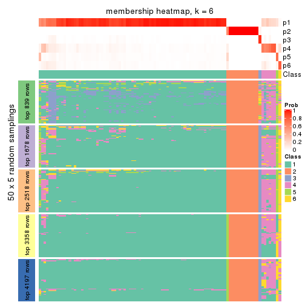</p>

</div>
</div>

As soon as we have had the classes for columns, we can look for signatures
which are significantly different between classes which can be candidate marks
for certain classes. Following are the heatmaps for signatures.


Signature heatmaps where rows are scaled:


<script>
$( function() {
	$( '#tabs-MAD-hclust-get-signatures' ).tabs();
} );
</script>
<div id='tabs-MAD-hclust-get-signatures'>
<ul>
<li><a href='#tab-MAD-hclust-get-signatures-1'>k = 2</a></li>
<li><a href='#tab-MAD-hclust-get-signatures-2'>k = 3</a></li>
<li><a href='#tab-MAD-hclust-get-signatures-3'>k = 4</a></li>
<li><a href='#tab-MAD-hclust-get-signatures-4'>k = 5</a></li>
<li><a href='#tab-MAD-hclust-get-signatures-5'>k = 6</a></li>
</ul>
<div id='tab-MAD-hclust-get-signatures-1'>
<pre><code class="r">get_signatures(res, k = 2)
</code></pre>

<p></p>

</div>
<div id='tab-MAD-hclust-get-signatures-2'>
<pre><code class="r">get_signatures(res, k = 3)
</code></pre>

<p></p>

</div>
<div id='tab-MAD-hclust-get-signatures-3'>
<pre><code class="r">get_signatures(res, k = 4)
</code></pre>

<p></p>

</div>
<div id='tab-MAD-hclust-get-signatures-4'>
<pre><code class="r">get_signatures(res, k = 5)
</code></pre>

<p></p>

</div>
<div id='tab-MAD-hclust-get-signatures-5'>
<pre><code class="r">get_signatures(res, k = 6)
</code></pre>

<p></p>

</div>
</div>


Signature heatmaps where rows are not scaled:


<script>
$( function() {
	$( '#tabs-MAD-hclust-get-signatures-no-scale' ).tabs();
} );
</script>
<div id='tabs-MAD-hclust-get-signatures-no-scale'>
<ul>
<li><a href='#tab-MAD-hclust-get-signatures-no-scale-1'>k = 2</a></li>
<li><a href='#tab-MAD-hclust-get-signatures-no-scale-2'>k = 3</a></li>
<li><a href='#tab-MAD-hclust-get-signatures-no-scale-3'>k = 4</a></li>
<li><a href='#tab-MAD-hclust-get-signatures-no-scale-4'>k = 5</a></li>
<li><a href='#tab-MAD-hclust-get-signatures-no-scale-5'>k = 6</a></li>
</ul>
<div id='tab-MAD-hclust-get-signatures-no-scale-1'>
<pre><code class="r">get_signatures(res, k = 2, scale_rows = FALSE)
</code></pre>

<p></p>

</div>
<div id='tab-MAD-hclust-get-signatures-no-scale-2'>
<pre><code class="r">get_signatures(res, k = 3, scale_rows = FALSE)
</code></pre>

<p></p>

</div>
<div id='tab-MAD-hclust-get-signatures-no-scale-3'>
<pre><code class="r">get_signatures(res, k = 4, scale_rows = FALSE)
</code></pre>

<p></p>

</div>
<div id='tab-MAD-hclust-get-signatures-no-scale-4'>
<pre><code class="r">get_signatures(res, k = 5, scale_rows = FALSE)
</code></pre>

<p></p>

</div>
<div id='tab-MAD-hclust-get-signatures-no-scale-5'>
<pre><code class="r">get_signatures(res, k = 6, scale_rows = FALSE)
</code></pre>

<p>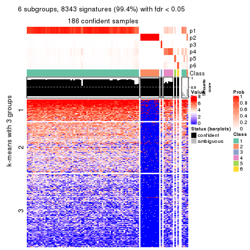</p>

</div>
</div>


Compare the overlap of signatures from different k:

```r
compare_signatures(res)
```


`get_signature()` returns a data frame invisibly. TO get the list of signatures, the function
call should be assigned to a variable explicitly. In following code, if `plot` argument is set
to `FALSE`, no heatmap is plotted while only the differential analysis is performed.

```r
# code only for demonstration
tb = get_signature(res, k = ..., plot = FALSE)
```

An example of the output of `tb` is:

```
#>   which_row         fdr    mean_1    mean_2 scaled_mean_1 scaled_mean_2 km
#> 1        38 0.042760348  8.373488  9.131774    -0.5533452     0.5164555  1
#> 2        40 0.018707592  7.106213  8.469186    -0.6173731     0.5762149  1
#> 3        55 0.019134737 10.221463 11.207825    -0.6159697     0.5749050  1
#> 4        59 0.006059896  5.921854  7.869574    -0.6899429     0.6439467  1
#> 5        60 0.018055526  8.928898 10.211722    -0.6204761     0.5791110  1
#> 6        98 0.009384629 15.714769 14.887706     0.6635654    -0.6193277  2
...
```

The columns in `tb` are:

1. `which_row`: row indices corresponding to the input matrix.
2. `fdr`: FDR for the differential test. 
3. `mean_x`: The mean value in group x.
4. `scaled_mean_x`: The mean value in group x after rows are scaled.
5. `km`: Row groups if k-means clustering is applied to rows.


UMAP plot which shows how samples are separated.


<script>
$( function() {
	$( '#tabs-MAD-hclust-dimension-reduction' ).tabs();
} );
</script>
<div id='tabs-MAD-hclust-dimension-reduction'>
<ul>
<li><a href='#tab-MAD-hclust-dimension-reduction-1'>k = 2</a></li>
<li><a href='#tab-MAD-hclust-dimension-reduction-2'>k = 3</a></li>
<li><a href='#tab-MAD-hclust-dimension-reduction-3'>k = 4</a></li>
<li><a href='#tab-MAD-hclust-dimension-reduction-4'>k = 5</a></li>
<li><a href='#tab-MAD-hclust-dimension-reduction-5'>k = 6</a></li>
</ul>
<div id='tab-MAD-hclust-dimension-reduction-1'>
<pre><code class="r">dimension_reduction(res, k = 2, method = &quot;UMAP&quot;)
</code></pre>

<p></p>

</div>
<div id='tab-MAD-hclust-dimension-reduction-2'>
<pre><code class="r">dimension_reduction(res, k = 3, method = &quot;UMAP&quot;)
</code></pre>

<p></p>

</div>
<div id='tab-MAD-hclust-dimension-reduction-3'>
<pre><code class="r">dimension_reduction(res, k = 4, method = &quot;UMAP&quot;)
</code></pre>

<p>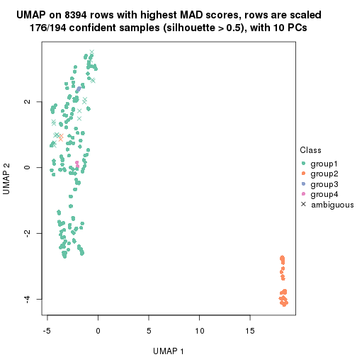</p>

</div>
<div id='tab-MAD-hclust-dimension-reduction-4'>
<pre><code class="r">dimension_reduction(res, k = 5, method = &quot;UMAP&quot;)
</code></pre>

<p></p>

</div>
<div id='tab-MAD-hclust-dimension-reduction-5'>
<pre><code class="r">dimension_reduction(res, k = 6, method = &quot;UMAP&quot;)
</code></pre>

<p></p>

</div>
</div>


Following heatmap shows how subgroups are split when increasing `k`:

```r
collect_classes(res)
```


If matrix rows can be associated to genes, consider to use `GO_Enrichment(res,
...)` to perform function enrichment for the signature genes.


 

---------------------------------------------------


### MAD:kmeans**


The object with results only for a single top-value method and a single partition method 
can be extracted as:

```r
res = res_list["MAD", "kmeans"]
# you can also extract it by
# res = res_list["MAD:kmeans"]
```

A summary of `res` and all the functions that can be applied to it:

```r
res
```

```
#> A 'ConsensusPartition' object with k = 2, 3, 4, 5, 6.
#>   On a matrix with 8394 rows and 194 columns.
#>   Top rows (839, 1678, 2518, 3358, 4197) are extracted by 'MAD' method.
#>   Subgroups are detected by 'kmeans' method.
#>   Performed in total 1250 partitions by row resampling.
#>   Best k for subgroups seems to be 2.
#> 
#> Following methods can be applied to this 'ConsensusPartition' object:
#>  [1] "cola_report"             "collect_classes"         "collect_plots"          
#>  [4] "collect_stats"           "colnames"                "compare_signatures"     
#>  [7] "consensus_heatmap"       "dimension_reduction"     "functional_enrichment"  
#> [10] "get_anno_col"            "get_anno"                "get_classes"            
#> [13] "get_consensus"           "get_matrix"              "get_membership"         
#> [16] "get_param"               "get_signatures"          "get_stats"              
#> [19] "is_best_k"               "is_stable_k"             "membership_heatmap"     
#> [22] "ncol"                    "nrow"                    "plot_ecdf"              
#> [25] "rownames"                "select_partition_number" "show"                   
#> [28] "suggest_best_k"          "test_to_known_factors"
```

`collect_plots()` function collects all the plots made from `res` for all `k` (number of partitions)
into one single page to provide an easy and fast comparison between different `k`.

```r
collect_plots(res)
```


The plots are:

- The first row: a plot of the ECDF (Empirical cumulative distribution
  function) curves of the consensus matrix for each `k` and the heatmap of
  predicted classes for each `k`.
- The second row: heatmaps of the consensus matrix for each `k`.
- The third row: heatmaps of the membership matrix for each `k`.
- The fouth row: heatmaps of the signatures for each `k`.

All the plots in panels can be made by individual functions and they are
plotted later in this section.

`select_partition_number()` produces several plots showing different
statistics for choosing "optimized" `k`. There are following statistics:

- ECDF curves of the consensus matrix for each `k`;
- 1-PAC. [The PAC
  score](https://en.wikipedia.org/wiki/Consensus_clustering#Over-interpretation_potential_of_consensus_clustering)
  measures the proportion of the ambiguous subgrouping.
- Mean silhouette score.
- Concordance. The mean probability of fiting the consensus class ids in all
  partitions.
- Area increased. Denote $A_k$ as the area under the ECDF curve for current
  `k`, the area increased is defined as $A_k - A_{k-1}$.
- Rand index. The percent of pairs of samples that are both in a same cluster
  or both are not in a same cluster in the partition of k and k-1.
- Jaccard index. The ratio of pairs of samples are both in a same cluster in
  the partition of k and k-1 and the pairs of samples are both in a same
  cluster in the partition k or k-1.

The detailed explanations of these statistics can be found in [the cola
vignette](http://bioconductor.org/packages/devel/bioc/vignettes/cola/inst/doc/cola.html#toc_13).

Generally speaking, lower PAC score, higher mean silhouette score or higher
concordance corresponds to better partition. Rand index and Jaccard index
measure how similar the current partition is compared to partition with `k-1`.
If they are too similar, we won't accept `k` is better than `k-1`.

```r
select_partition_number(res)
```


The numeric values for all these statistics can be obtained by `get_stats()`.

```r
get_stats(res)
```

```
#>   k 1-PAC mean_silhouette concordance area_increased  Rand Jaccard
#> 2 2 1.000           0.994       0.995         0.2274 0.767   0.767
#> 3 3 0.507           0.778       0.884         0.7241 0.928   0.906
#> 4 4 0.273           0.749       0.823         0.2244 0.931   0.901
#> 5 5 0.271           0.730       0.773         0.1202 0.982   0.972
#> 6 6 0.276           0.698       0.735         0.0709 0.982   0.973
```

`suggest_best_k()` suggests the best $k$ based on these statistics. The rules are as follows:

- All $k$ with Jaccard index larger than 0.95 are removed because the increase of
  the partition number does not provides enough extra information. If all $k$ are removed,
  the best $k$ is assigned by `NA`.
- For $k$ with 1-PAC larger than 0.9, the maximal $k$ is taken as the "best k". Other $k$ is called "optional k".
- If it does not fit the second rule. The $k$ with the highest vote of highest
  1-PAC, mean silhouette and concordance is taken as the "best k".

```r
suggest_best_k(res)
```

```
#> [1] 2
```


Following shows the table of the partitions (You need to click the **show/hide
code output** link to see it). The membership matrix (columns with name `p*`)
is inferred by
[`clue::cl_consensus()`](https://www.rdocumentation.org/link/cl_consensus?package=clue)
function with the `SE` method. Basically the value in the membership matrix
represents the probability to belong to a certain group. The finall class
label for an item is determined with the group with highest probability it
belongs to.

In `get_classes()` function, the entropy is calculated from the membership
matrix and the silhouette score is calculated from the consensus matrix.


<script>
$( function() {
	$( '#tabs-MAD-kmeans-get-classes' ).tabs();
} );
</script>
<div id='tabs-MAD-kmeans-get-classes'>
<ul>
<li><a href='#tab-MAD-kmeans-get-classes-1'>k = 2</a></li>
<li><a href='#tab-MAD-kmeans-get-classes-2'>k = 3</a></li>
<li><a href='#tab-MAD-kmeans-get-classes-3'>k = 4</a></li>
<li><a href='#tab-MAD-kmeans-get-classes-4'>k = 5</a></li>
<li><a href='#tab-MAD-kmeans-get-classes-5'>k = 6</a></li>
</ul>

<div id='tab-MAD-kmeans-get-classes-1'>
<p><a id='tab-MAD-kmeans-get-classes-1-a' style='color:#0366d6' href='#'>show/hide code output</a></p>
<pre><code class="r">cbind(get_classes(res, k = 2), get_membership(res, k = 2))
</code></pre>

<pre><code>#&gt;           class entropy silhouette    p1    p2
#&gt; ERR467487     1  0.0000      0.999 1.000 0.000
#&gt; ERR467498     1  0.0000      0.999 1.000 0.000
#&gt; ERR658998     1  0.0000      0.999 1.000 0.000
#&gt; ERR659094     1  0.0000      0.999 1.000 0.000
#&gt; ERR658999     1  0.0376      0.996 0.996 0.004
#&gt; ERR659095     1  0.0376      0.996 0.996 0.004
#&gt; ERR659000     1  0.0376      0.996 0.996 0.004
#&gt; ERR659096     1  0.0376      0.996 0.996 0.004
#&gt; ERR659001     1  0.0000      0.999 1.000 0.000
#&gt; ERR659097     1  0.0000      0.999 1.000 0.000
#&gt; ERR659002     1  0.0000      0.999 1.000 0.000
#&gt; ERR659098     1  0.0000      0.999 1.000 0.000
#&gt; ERR659003     1  0.0000      0.999 1.000 0.000
#&gt; ERR659099     1  0.0000      0.999 1.000 0.000
#&gt; ERR659004     1  0.0000      0.999 1.000 0.000
#&gt; ERR659100     1  0.0000      0.999 1.000 0.000
#&gt; ERR659005     1  0.0000      0.999 1.000 0.000
#&gt; ERR659101     1  0.0000      0.999 1.000 0.000
#&gt; ERR659006     1  0.0000      0.999 1.000 0.000
#&gt; ERR659102     1  0.0000      0.999 1.000 0.000
#&gt; ERR659007     1  0.0000      0.999 1.000 0.000
#&gt; ERR659103     1  0.0000      0.999 1.000 0.000
#&gt; ERR659008     2  0.1414      0.983 0.020 0.980
#&gt; ERR659104     2  0.1414      0.983 0.020 0.980
#&gt; ERR659009     1  0.0000      0.999 1.000 0.000
#&gt; ERR659105     1  0.0000      0.999 1.000 0.000
#&gt; ERR659010     1  0.0000      0.999 1.000 0.000
#&gt; ERR659106     1  0.0000      0.999 1.000 0.000
#&gt; ERR659011     1  0.0376      0.996 0.996 0.004
#&gt; ERR659107     1  0.0376      0.996 0.996 0.004
#&gt; ERR659012     1  0.0000      0.999 1.000 0.000
#&gt; ERR659108     1  0.0000      0.999 1.000 0.000
#&gt; ERR659013     1  0.0000      0.999 1.000 0.000
#&gt; ERR659109     1  0.0000      0.999 1.000 0.000
#&gt; ERR659014     2  0.1414      0.983 0.020 0.980
#&gt; ERR659110     2  0.1414      0.983 0.020 0.980
#&gt; ERR659015     1  0.0000      0.999 1.000 0.000
#&gt; ERR659111     1  0.0000      0.999 1.000 0.000
#&gt; ERR659016     1  0.0000      0.999 1.000 0.000
#&gt; ERR659112     1  0.0000      0.999 1.000 0.000
#&gt; ERR659017     2  0.1414      0.983 0.020 0.980
#&gt; ERR659113     2  0.1414      0.983 0.020 0.980
#&gt; ERR659018     1  0.0000      0.999 1.000 0.000
#&gt; ERR659114     1  0.0000      0.999 1.000 0.000
#&gt; ERR659019     1  0.0000      0.999 1.000 0.000
#&gt; ERR659115     1  0.0000      0.999 1.000 0.000
#&gt; ERR659020     1  0.0000      0.999 1.000 0.000
#&gt; ERR659116     1  0.0000      0.999 1.000 0.000
#&gt; ERR659021     1  0.0000      0.999 1.000 0.000
#&gt; ERR659117     1  0.0000      0.999 1.000 0.000
#&gt; ERR659022     1  0.0000      0.999 1.000 0.000
#&gt; ERR659118     1  0.0000      0.999 1.000 0.000
#&gt; ERR659023     1  0.0000      0.999 1.000 0.000
#&gt; ERR659119     1  0.0000      0.999 1.000 0.000
#&gt; ERR659024     1  0.0000      0.999 1.000 0.000
#&gt; ERR659120     1  0.0000      0.999 1.000 0.000
#&gt; ERR659025     1  0.0000      0.999 1.000 0.000
#&gt; ERR659121     1  0.0000      0.999 1.000 0.000
#&gt; ERR659026     1  0.0672      0.992 0.992 0.008
#&gt; ERR659122     1  0.0672      0.992 0.992 0.008
#&gt; ERR659027     1  0.0000      0.999 1.000 0.000
#&gt; ERR659123     1  0.0000      0.999 1.000 0.000
#&gt; ERR659028     1  0.0000      0.999 1.000 0.000
#&gt; ERR659124     1  0.0000      0.999 1.000 0.000
#&gt; ERR659029     1  0.0000      0.999 1.000 0.000
#&gt; ERR659125     1  0.0000      0.999 1.000 0.000
#&gt; ERR659030     1  0.0000      0.999 1.000 0.000
#&gt; ERR659126     1  0.0000      0.999 1.000 0.000
#&gt; ERR659031     1  0.0000      0.999 1.000 0.000
#&gt; ERR659127     1  0.0000      0.999 1.000 0.000
#&gt; ERR659032     1  0.0000      0.999 1.000 0.000
#&gt; ERR659128     1  0.0000      0.999 1.000 0.000
#&gt; ERR659033     1  0.0000      0.999 1.000 0.000
#&gt; ERR659129     1  0.0000      0.999 1.000 0.000
#&gt; ERR659034     2  0.1414      0.983 0.020 0.980
#&gt; ERR659130     2  0.1414      0.983 0.020 0.980
#&gt; ERR659035     1  0.0000      0.999 1.000 0.000
#&gt; ERR659131     1  0.0000      0.999 1.000 0.000
#&gt; ERR659036     1  0.0000      0.999 1.000 0.000
#&gt; ERR659132     1  0.0000      0.999 1.000 0.000
#&gt; ERR659037     1  0.0000      0.999 1.000 0.000
#&gt; ERR659133     1  0.0000      0.999 1.000 0.000
#&gt; ERR659038     1  0.0000      0.999 1.000 0.000
#&gt; ERR659134     1  0.0000      0.999 1.000 0.000
#&gt; ERR659039     1  0.0000      0.999 1.000 0.000
#&gt; ERR659135     1  0.0000      0.999 1.000 0.000
#&gt; ERR659040     1  0.0000      0.999 1.000 0.000
#&gt; ERR659136     1  0.0000      0.999 1.000 0.000
#&gt; ERR659041     1  0.0000      0.999 1.000 0.000
#&gt; ERR659137     1  0.0000      0.999 1.000 0.000
#&gt; ERR659042     1  0.0000      0.999 1.000 0.000
#&gt; ERR659138     1  0.0000      0.999 1.000 0.000
#&gt; ERR659043     1  0.0000      0.999 1.000 0.000
#&gt; ERR659139     1  0.0000      0.999 1.000 0.000
#&gt; ERR659044     2  0.1414      0.983 0.020 0.980
#&gt; ERR659140     2  0.1414      0.983 0.020 0.980
#&gt; ERR659045     1  0.0000      0.999 1.000 0.000
#&gt; ERR659141     1  0.0000      0.999 1.000 0.000
#&gt; ERR659046     1  0.0000      0.999 1.000 0.000
#&gt; ERR659142     1  0.0000      0.999 1.000 0.000
#&gt; ERR659047     1  0.0000      0.999 1.000 0.000
#&gt; ERR659143     1  0.0000      0.999 1.000 0.000
#&gt; ERR659048     1  0.0000      0.999 1.000 0.000
#&gt; ERR659144     1  0.0000      0.999 1.000 0.000
#&gt; ERR659049     1  0.0000      0.999 1.000 0.000
#&gt; ERR659145     1  0.0000      0.999 1.000 0.000
#&gt; ERR659050     1  0.0000      0.999 1.000 0.000
#&gt; ERR659146     1  0.0000      0.999 1.000 0.000
#&gt; ERR659051     1  0.1633      0.975 0.976 0.024
#&gt; ERR659147     1  0.1633      0.975 0.976 0.024
#&gt; ERR659052     1  0.0000      0.999 1.000 0.000
#&gt; ERR659148     1  0.0000      0.999 1.000 0.000
#&gt; ERR659053     1  0.0000      0.999 1.000 0.000
#&gt; ERR659149     1  0.0000      0.999 1.000 0.000
#&gt; ERR659054     2  0.1414      0.983 0.020 0.980
#&gt; ERR659150     2  0.1414      0.983 0.020 0.980
#&gt; ERR659055     1  0.0000      0.999 1.000 0.000
#&gt; ERR659151     1  0.0000      0.999 1.000 0.000
#&gt; ERR659056     1  0.0000      0.999 1.000 0.000
#&gt; ERR659152     1  0.0000      0.999 1.000 0.000
#&gt; ERR659057     1  0.0000      0.999 1.000 0.000
#&gt; ERR659153     1  0.0000      0.999 1.000 0.000
#&gt; ERR659058     1  0.0000      0.999 1.000 0.000
#&gt; ERR659154     1  0.0000      0.999 1.000 0.000
#&gt; ERR659059     1  0.0000      0.999 1.000 0.000
#&gt; ERR659155     1  0.0000      0.999 1.000 0.000
#&gt; ERR659060     1  0.0000      0.999 1.000 0.000
#&gt; ERR659156     1  0.0000      0.999 1.000 0.000
#&gt; ERR659061     1  0.0000      0.999 1.000 0.000
#&gt; ERR659157     1  0.0000      0.999 1.000 0.000
#&gt; ERR659062     1  0.0000      0.999 1.000 0.000
#&gt; ERR659158     1  0.0000      0.999 1.000 0.000
#&gt; ERR659063     1  0.0000      0.999 1.000 0.000
#&gt; ERR659159     1  0.0000      0.999 1.000 0.000
#&gt; ERR659064     1  0.0000      0.999 1.000 0.000
#&gt; ERR659160     1  0.0000      0.999 1.000 0.000
#&gt; ERR659065     2  0.1414      0.983 0.020 0.980
#&gt; ERR659161     2  0.1414      0.983 0.020 0.980
#&gt; ERR659066     1  0.0000      0.999 1.000 0.000
#&gt; ERR659162     1  0.0000      0.999 1.000 0.000
#&gt; ERR659067     1  0.0000      0.999 1.000 0.000
#&gt; ERR659163     1  0.0000      0.999 1.000 0.000
#&gt; ERR659068     2  0.1414      0.983 0.020 0.980
#&gt; ERR659164     2  0.1414      0.983 0.020 0.980
#&gt; ERR659069     1  0.0000      0.999 1.000 0.000
#&gt; ERR659165     1  0.0000      0.999 1.000 0.000
#&gt; ERR659070     1  0.0000      0.999 1.000 0.000
#&gt; ERR659166     1  0.0000      0.999 1.000 0.000
#&gt; ERR659071     1  0.0000      0.999 1.000 0.000
#&gt; ERR659167     1  0.0000      0.999 1.000 0.000
#&gt; ERR659072     1  0.0000      0.999 1.000 0.000
#&gt; ERR659168     1  0.0000      0.999 1.000 0.000
#&gt; ERR659073     1  0.0000      0.999 1.000 0.000
#&gt; ERR659169     1  0.0000      0.999 1.000 0.000
#&gt; ERR659074     2  0.1414      0.983 0.020 0.980
#&gt; ERR659170     2  0.1414      0.983 0.020 0.980
#&gt; ERR659075     2  0.7674      0.747 0.224 0.776
#&gt; ERR659171     2  0.7674      0.747 0.224 0.776
#&gt; ERR659076     2  0.1414      0.983 0.020 0.980
#&gt; ERR659172     2  0.1414      0.983 0.020 0.980
#&gt; ERR659077     1  0.0000      0.999 1.000 0.000
#&gt; ERR659173     1  0.0000      0.999 1.000 0.000
#&gt; ERR659078     1  0.0672      0.992 0.992 0.008
#&gt; ERR659174     1  0.0672      0.992 0.992 0.008
#&gt; ERR659079     1  0.0000      0.999 1.000 0.000
#&gt; ERR659175     1  0.0000      0.999 1.000 0.000
#&gt; ERR659080     1  0.0000      0.999 1.000 0.000
#&gt; ERR659176     1  0.0000      0.999 1.000 0.000
#&gt; ERR659081     1  0.0000      0.999 1.000 0.000
#&gt; ERR659177     1  0.0000      0.999 1.000 0.000
#&gt; ERR659082     1  0.0000      0.999 1.000 0.000
#&gt; ERR659178     1  0.0000      0.999 1.000 0.000
#&gt; ERR659083     2  0.1414      0.983 0.020 0.980
#&gt; ERR659179     2  0.1414      0.983 0.020 0.980
#&gt; ERR659084     2  0.1414      0.983 0.020 0.980
#&gt; ERR659180     2  0.1414      0.983 0.020 0.980
#&gt; ERR659085     1  0.0000      0.999 1.000 0.000
#&gt; ERR659181     1  0.0000      0.999 1.000 0.000
#&gt; ERR659086     1  0.0376      0.996 0.996 0.004
#&gt; ERR659182     1  0.0376      0.996 0.996 0.004
#&gt; ERR659087     1  0.0000      0.999 1.000 0.000
#&gt; ERR659183     1  0.0000      0.999 1.000 0.000
#&gt; ERR659088     1  0.0000      0.999 1.000 0.000
#&gt; ERR659184     1  0.0000      0.999 1.000 0.000
#&gt; ERR659089     1  0.0000      0.999 1.000 0.000
#&gt; ERR659185     1  0.0000      0.999 1.000 0.000
#&gt; ERR659090     1  0.0000      0.999 1.000 0.000
#&gt; ERR659186     1  0.0000      0.999 1.000 0.000
#&gt; ERR659091     1  0.0000      0.999 1.000 0.000
#&gt; ERR659187     1  0.0000      0.999 1.000 0.000
#&gt; ERR659092     1  0.0000      0.999 1.000 0.000
#&gt; ERR659188     1  0.0000      0.999 1.000 0.000
#&gt; ERR659093     1  0.0000      0.999 1.000 0.000
#&gt; ERR659189     1  0.0000      0.999 1.000 0.000
</code></pre>

<script>
$('#tab-MAD-kmeans-get-classes-1-a').parent().next().next().hide();
$('#tab-MAD-kmeans-get-classes-1-a').click(function(){
  $('#tab-MAD-kmeans-get-classes-1-a').parent().next().next().toggle();
  return(false);
});
</script>
</div>

<div id='tab-MAD-kmeans-get-classes-2'>
<p><a id='tab-MAD-kmeans-get-classes-2-a' style='color:#0366d6' href='#'>show/hide code output</a></p>
<pre><code class="r">cbind(get_classes(res, k = 3), get_membership(res, k = 3))
</code></pre>

<pre><code>#&gt;           class entropy silhouette    p1    p2    p3
#&gt; ERR467487     3  0.5678      0.776 0.316 0.000 0.684
#&gt; ERR467498     3  0.5678      0.776 0.316 0.000 0.684
#&gt; ERR658998     1  0.1964      0.866 0.944 0.000 0.056
#&gt; ERR659094     1  0.1964      0.866 0.944 0.000 0.056
#&gt; ERR658999     1  0.2796      0.840 0.908 0.000 0.092
#&gt; ERR659095     1  0.2796      0.840 0.908 0.000 0.092
#&gt; ERR659000     1  0.6260     -0.157 0.552 0.000 0.448
#&gt; ERR659096     1  0.6260     -0.157 0.552 0.000 0.448
#&gt; ERR659001     1  0.1643      0.860 0.956 0.000 0.044
#&gt; ERR659097     1  0.1643      0.860 0.956 0.000 0.044
#&gt; ERR659002     1  0.2625      0.855 0.916 0.000 0.084
#&gt; ERR659098     1  0.2625      0.855 0.916 0.000 0.084
#&gt; ERR659003     1  0.1289      0.867 0.968 0.000 0.032
#&gt; ERR659099     1  0.1289      0.867 0.968 0.000 0.032
#&gt; ERR659004     1  0.5835      0.452 0.660 0.000 0.340
#&gt; ERR659100     1  0.5835      0.452 0.660 0.000 0.340
#&gt; ERR659005     1  0.1289      0.865 0.968 0.000 0.032
#&gt; ERR659101     1  0.1289      0.865 0.968 0.000 0.032
#&gt; ERR659006     1  0.4452      0.769 0.808 0.000 0.192
#&gt; ERR659102     1  0.4452      0.769 0.808 0.000 0.192
#&gt; ERR659007     1  0.0892      0.864 0.980 0.000 0.020
#&gt; ERR659103     1  0.0892      0.864 0.980 0.000 0.020
#&gt; ERR659008     2  0.0000      1.000 0.000 1.000 0.000
#&gt; ERR659104     2  0.0000      1.000 0.000 1.000 0.000
#&gt; ERR659009     1  0.4346      0.791 0.816 0.000 0.184
#&gt; ERR659105     1  0.4346      0.791 0.816 0.000 0.184
#&gt; ERR659010     1  0.3340      0.835 0.880 0.000 0.120
#&gt; ERR659106     1  0.3340      0.835 0.880 0.000 0.120
#&gt; ERR659011     1  0.3192      0.830 0.888 0.000 0.112
#&gt; ERR659107     1  0.3192      0.830 0.888 0.000 0.112
#&gt; ERR659012     1  0.5098      0.679 0.752 0.000 0.248
#&gt; ERR659108     1  0.5098      0.679 0.752 0.000 0.248
#&gt; ERR659013     1  0.5926      0.368 0.644 0.000 0.356
#&gt; ERR659109     1  0.5926      0.368 0.644 0.000 0.356
#&gt; ERR659014     2  0.0000      1.000 0.000 1.000 0.000
#&gt; ERR659110     2  0.0000      1.000 0.000 1.000 0.000
#&gt; ERR659015     1  0.0892      0.865 0.980 0.000 0.020
#&gt; ERR659111     1  0.0892      0.865 0.980 0.000 0.020
#&gt; ERR659016     1  0.6045      0.193 0.620 0.000 0.380
#&gt; ERR659112     1  0.6045      0.193 0.620 0.000 0.380
#&gt; ERR659017     2  0.0000      1.000 0.000 1.000 0.000
#&gt; ERR659113     2  0.0000      1.000 0.000 1.000 0.000
#&gt; ERR659018     1  0.1964      0.862 0.944 0.000 0.056
#&gt; ERR659114     1  0.1964      0.862 0.944 0.000 0.056
#&gt; ERR659019     1  0.2537      0.847 0.920 0.000 0.080
#&gt; ERR659115     1  0.2537      0.847 0.920 0.000 0.080
#&gt; ERR659020     1  0.1163      0.865 0.972 0.000 0.028
#&gt; ERR659116     1  0.1163      0.865 0.972 0.000 0.028
#&gt; ERR659021     1  0.0892      0.866 0.980 0.000 0.020
#&gt; ERR659117     1  0.0892      0.866 0.980 0.000 0.020
#&gt; ERR659022     1  0.2448      0.860 0.924 0.000 0.076
#&gt; ERR659118     1  0.2448      0.860 0.924 0.000 0.076
#&gt; ERR659023     1  0.1860      0.865 0.948 0.000 0.052
#&gt; ERR659119     1  0.1860      0.865 0.948 0.000 0.052
#&gt; ERR659024     1  0.1411      0.870 0.964 0.000 0.036
#&gt; ERR659120     1  0.1411      0.870 0.964 0.000 0.036
#&gt; ERR659025     1  0.4399      0.739 0.812 0.000 0.188
#&gt; ERR659121     1  0.4399      0.739 0.812 0.000 0.188
#&gt; ERR659026     1  0.2796      0.863 0.908 0.000 0.092
#&gt; ERR659122     1  0.2796      0.863 0.908 0.000 0.092
#&gt; ERR659027     1  0.6305     -0.274 0.516 0.000 0.484
#&gt; ERR659123     1  0.6305     -0.274 0.516 0.000 0.484
#&gt; ERR659028     1  0.3116      0.840 0.892 0.000 0.108
#&gt; ERR659124     1  0.3116      0.840 0.892 0.000 0.108
#&gt; ERR659029     1  0.2261      0.867 0.932 0.000 0.068
#&gt; ERR659125     1  0.2261      0.867 0.932 0.000 0.068
#&gt; ERR659030     1  0.1529      0.864 0.960 0.000 0.040
#&gt; ERR659126     1  0.1529      0.864 0.960 0.000 0.040
#&gt; ERR659031     1  0.4002      0.805 0.840 0.000 0.160
#&gt; ERR659127     1  0.4002      0.805 0.840 0.000 0.160
#&gt; ERR659032     1  0.3752      0.809 0.856 0.000 0.144
#&gt; ERR659128     1  0.3752      0.809 0.856 0.000 0.144
#&gt; ERR659033     1  0.1163      0.866 0.972 0.000 0.028
#&gt; ERR659129     1  0.1163      0.866 0.972 0.000 0.028
#&gt; ERR659034     2  0.0000      1.000 0.000 1.000 0.000
#&gt; ERR659130     2  0.0000      1.000 0.000 1.000 0.000
#&gt; ERR659035     1  0.3482      0.819 0.872 0.000 0.128
#&gt; ERR659131     1  0.3482      0.819 0.872 0.000 0.128
#&gt; ERR659036     1  0.4062      0.788 0.836 0.000 0.164
#&gt; ERR659132     1  0.4062      0.788 0.836 0.000 0.164
#&gt; ERR659037     1  0.1964      0.865 0.944 0.000 0.056
#&gt; ERR659133     1  0.1964      0.865 0.944 0.000 0.056
#&gt; ERR659038     1  0.2959      0.836 0.900 0.000 0.100
#&gt; ERR659134     1  0.2959      0.836 0.900 0.000 0.100
#&gt; ERR659039     1  0.2711      0.845 0.912 0.000 0.088
#&gt; ERR659135     1  0.2711      0.845 0.912 0.000 0.088
#&gt; ERR659040     1  0.4504      0.715 0.804 0.000 0.196
#&gt; ERR659136     1  0.4504      0.715 0.804 0.000 0.196
#&gt; ERR659041     1  0.6305     -0.291 0.516 0.000 0.484
#&gt; ERR659137     1  0.6305     -0.291 0.516 0.000 0.484
#&gt; ERR659042     1  0.6079      0.170 0.612 0.000 0.388
#&gt; ERR659138     1  0.6079      0.170 0.612 0.000 0.388
#&gt; ERR659043     1  0.3879      0.805 0.848 0.000 0.152
#&gt; ERR659139     1  0.3879      0.805 0.848 0.000 0.152
#&gt; ERR659044     2  0.0000      1.000 0.000 1.000 0.000
#&gt; ERR659140     2  0.0000      1.000 0.000 1.000 0.000
#&gt; ERR659045     1  0.1753      0.862 0.952 0.000 0.048
#&gt; ERR659141     1  0.1753      0.862 0.952 0.000 0.048
#&gt; ERR659046     1  0.1163      0.867 0.972 0.000 0.028
#&gt; ERR659142     1  0.1163      0.867 0.972 0.000 0.028
#&gt; ERR659047     1  0.1643      0.868 0.956 0.000 0.044
#&gt; ERR659143     1  0.1643      0.868 0.956 0.000 0.044
#&gt; ERR659048     1  0.1163      0.865 0.972 0.000 0.028
#&gt; ERR659144     1  0.1163      0.865 0.972 0.000 0.028
#&gt; ERR659049     1  0.4974      0.654 0.764 0.000 0.236
#&gt; ERR659145     1  0.4974      0.654 0.764 0.000 0.236
#&gt; ERR659050     1  0.4452      0.734 0.808 0.000 0.192
#&gt; ERR659146     1  0.4452      0.734 0.808 0.000 0.192
#&gt; ERR659051     3  0.5958      0.776 0.300 0.008 0.692
#&gt; ERR659147     3  0.5958      0.776 0.300 0.008 0.692
#&gt; ERR659052     1  0.4842      0.717 0.776 0.000 0.224
#&gt; ERR659148     1  0.4842      0.717 0.776 0.000 0.224
#&gt; ERR659053     1  0.1289      0.867 0.968 0.000 0.032
#&gt; ERR659149     1  0.1289      0.867 0.968 0.000 0.032
#&gt; ERR659054     2  0.0000      1.000 0.000 1.000 0.000
#&gt; ERR659150     2  0.0000      1.000 0.000 1.000 0.000
#&gt; ERR659055     1  0.1860      0.856 0.948 0.000 0.052
#&gt; ERR659151     1  0.1860      0.856 0.948 0.000 0.052
#&gt; ERR659056     3  0.5968      0.735 0.364 0.000 0.636
#&gt; ERR659152     3  0.5968      0.735 0.364 0.000 0.636
#&gt; ERR659057     1  0.0592      0.864 0.988 0.000 0.012
#&gt; ERR659153     1  0.0592      0.864 0.988 0.000 0.012
#&gt; ERR659058     1  0.2165      0.857 0.936 0.000 0.064
#&gt; ERR659154     1  0.2165      0.857 0.936 0.000 0.064
#&gt; ERR659059     1  0.0424      0.865 0.992 0.000 0.008
#&gt; ERR659155     1  0.0424      0.865 0.992 0.000 0.008
#&gt; ERR659060     1  0.2796      0.849 0.908 0.000 0.092
#&gt; ERR659156     1  0.2796      0.849 0.908 0.000 0.092
#&gt; ERR659061     1  0.3038      0.842 0.896 0.000 0.104
#&gt; ERR659157     1  0.3038      0.842 0.896 0.000 0.104
#&gt; ERR659062     1  0.2448      0.858 0.924 0.000 0.076
#&gt; ERR659158     1  0.2448      0.858 0.924 0.000 0.076
#&gt; ERR659063     1  0.2796      0.860 0.908 0.000 0.092
#&gt; ERR659159     1  0.2796      0.860 0.908 0.000 0.092
#&gt; ERR659064     1  0.1163      0.864 0.972 0.000 0.028
#&gt; ERR659160     1  0.1163      0.864 0.972 0.000 0.028
#&gt; ERR659065     2  0.0000      1.000 0.000 1.000 0.000
#&gt; ERR659161     2  0.0000      1.000 0.000 1.000 0.000
#&gt; ERR659066     1  0.2625      0.853 0.916 0.000 0.084
#&gt; ERR659162     1  0.2625      0.853 0.916 0.000 0.084
#&gt; ERR659067     1  0.2356      0.850 0.928 0.000 0.072
#&gt; ERR659163     1  0.2356      0.850 0.928 0.000 0.072
#&gt; ERR659068     2  0.0000      1.000 0.000 1.000 0.000
#&gt; ERR659164     2  0.0000      1.000 0.000 1.000 0.000
#&gt; ERR659069     1  0.2796      0.849 0.908 0.000 0.092
#&gt; ERR659165     1  0.2796      0.849 0.908 0.000 0.092
#&gt; ERR659070     1  0.1289      0.865 0.968 0.000 0.032
#&gt; ERR659166     1  0.1289      0.865 0.968 0.000 0.032
#&gt; ERR659071     1  0.1163      0.865 0.972 0.000 0.028
#&gt; ERR659167     1  0.1163      0.865 0.972 0.000 0.028
#&gt; ERR659072     1  0.2625      0.850 0.916 0.000 0.084
#&gt; ERR659168     1  0.2625      0.850 0.916 0.000 0.084
#&gt; ERR659073     1  0.2356      0.863 0.928 0.000 0.072
#&gt; ERR659169     1  0.2356      0.863 0.928 0.000 0.072
#&gt; ERR659074     2  0.0000      1.000 0.000 1.000 0.000
#&gt; ERR659170     2  0.0000      1.000 0.000 1.000 0.000
#&gt; ERR659075     3  0.7895     -0.197 0.056 0.436 0.508
#&gt; ERR659171     3  0.7895     -0.197 0.056 0.436 0.508
#&gt; ERR659076     2  0.0000      1.000 0.000 1.000 0.000
#&gt; ERR659172     2  0.0000      1.000 0.000 1.000 0.000
#&gt; ERR659077     1  0.2537      0.858 0.920 0.000 0.080
#&gt; ERR659173     1  0.2537      0.858 0.920 0.000 0.080
#&gt; ERR659078     1  0.1529      0.867 0.960 0.000 0.040
#&gt; ERR659174     1  0.1529      0.867 0.960 0.000 0.040
#&gt; ERR659079     1  0.2878      0.852 0.904 0.000 0.096
#&gt; ERR659175     1  0.2878      0.852 0.904 0.000 0.096
#&gt; ERR659080     3  0.6140      0.658 0.404 0.000 0.596
#&gt; ERR659176     3  0.6140      0.658 0.404 0.000 0.596
#&gt; ERR659081     1  0.0892      0.864 0.980 0.000 0.020
#&gt; ERR659177     1  0.0892      0.864 0.980 0.000 0.020
#&gt; ERR659082     1  0.1163      0.867 0.972 0.000 0.028
#&gt; ERR659178     1  0.1163      0.867 0.972 0.000 0.028
#&gt; ERR659083     2  0.0000      1.000 0.000 1.000 0.000
#&gt; ERR659179     2  0.0000      1.000 0.000 1.000 0.000
#&gt; ERR659084     2  0.0000      1.000 0.000 1.000 0.000
#&gt; ERR659180     2  0.0000      1.000 0.000 1.000 0.000
#&gt; ERR659085     1  0.1753      0.867 0.952 0.000 0.048
#&gt; ERR659181     1  0.1753      0.867 0.952 0.000 0.048
#&gt; ERR659086     1  0.1411      0.869 0.964 0.000 0.036
#&gt; ERR659182     1  0.1411      0.869 0.964 0.000 0.036
#&gt; ERR659087     1  0.3816      0.831 0.852 0.000 0.148
#&gt; ERR659183     1  0.3816      0.831 0.852 0.000 0.148
#&gt; ERR659088     1  0.6295     -0.214 0.528 0.000 0.472
#&gt; ERR659184     1  0.6295     -0.214 0.528 0.000 0.472
#&gt; ERR659089     1  0.3038      0.855 0.896 0.000 0.104
#&gt; ERR659185     1  0.3038      0.855 0.896 0.000 0.104
#&gt; ERR659090     1  0.2356      0.868 0.928 0.000 0.072
#&gt; ERR659186     1  0.2356      0.868 0.928 0.000 0.072
#&gt; ERR659091     1  0.1411      0.864 0.964 0.000 0.036
#&gt; ERR659187     1  0.1411      0.864 0.964 0.000 0.036
#&gt; ERR659092     1  0.1529      0.868 0.960 0.000 0.040
#&gt; ERR659188     1  0.1529      0.868 0.960 0.000 0.040
#&gt; ERR659093     1  0.0892      0.866 0.980 0.000 0.020
#&gt; ERR659189     1  0.0892      0.866 0.980 0.000 0.020
</code></pre>

<script>
$('#tab-MAD-kmeans-get-classes-2-a').parent().next().next().hide();
$('#tab-MAD-kmeans-get-classes-2-a').click(function(){
  $('#tab-MAD-kmeans-get-classes-2-a').parent().next().next().toggle();
  return(false);
});
</script>
</div>

<div id='tab-MAD-kmeans-get-classes-3'>
<p><a id='tab-MAD-kmeans-get-classes-3-a' style='color:#0366d6' href='#'>show/hide code output</a></p>
<pre><code class="r">cbind(get_classes(res, k = 4), get_membership(res, k = 4))
</code></pre>

<pre><code>#&gt;           class entropy silhouette    p1    p2    p3 p4
#&gt; ERR467487     3  0.4462     0.6698 0.164 0.000 0.792 NA
#&gt; ERR467498     3  0.4462     0.6698 0.164 0.000 0.792 NA
#&gt; ERR658998     1  0.3156     0.8317 0.884 0.000 0.048 NA
#&gt; ERR659094     1  0.3156     0.8317 0.884 0.000 0.048 NA
#&gt; ERR658999     1  0.3351     0.7960 0.844 0.000 0.008 NA
#&gt; ERR659095     1  0.3351     0.7960 0.844 0.000 0.008 NA
#&gt; ERR659000     3  0.7110     0.4638 0.412 0.000 0.460 NA
#&gt; ERR659096     3  0.7110     0.4638 0.412 0.000 0.460 NA
#&gt; ERR659001     1  0.2255     0.8228 0.920 0.000 0.012 NA
#&gt; ERR659097     1  0.2255     0.8228 0.920 0.000 0.012 NA
#&gt; ERR659002     1  0.4359     0.8027 0.816 0.000 0.084 NA
#&gt; ERR659098     1  0.4359     0.8027 0.816 0.000 0.084 NA
#&gt; ERR659003     1  0.2882     0.8281 0.892 0.000 0.024 NA
#&gt; ERR659099     1  0.2882     0.8281 0.892 0.000 0.024 NA
#&gt; ERR659004     1  0.7661    -0.0485 0.464 0.000 0.264 NA
#&gt; ERR659100     1  0.7661    -0.0485 0.464 0.000 0.264 NA
#&gt; ERR659005     1  0.2845     0.8262 0.896 0.000 0.028 NA
#&gt; ERR659101     1  0.2845     0.8262 0.896 0.000 0.028 NA
#&gt; ERR659006     1  0.6116     0.6108 0.668 0.000 0.112 NA
#&gt; ERR659102     1  0.6116     0.6108 0.668 0.000 0.112 NA
#&gt; ERR659007     1  0.1452     0.8203 0.956 0.000 0.008 NA
#&gt; ERR659103     1  0.1452     0.8203 0.956 0.000 0.008 NA
#&gt; ERR659008     2  0.0000     0.9992 0.000 1.000 0.000 NA
#&gt; ERR659104     2  0.0000     0.9992 0.000 1.000 0.000 NA
#&gt; ERR659009     1  0.6010     0.6437 0.676 0.000 0.104 NA
#&gt; ERR659105     1  0.6010     0.6437 0.676 0.000 0.104 NA
#&gt; ERR659010     1  0.4679     0.7512 0.772 0.000 0.044 NA
#&gt; ERR659106     1  0.4679     0.7512 0.772 0.000 0.044 NA
#&gt; ERR659011     1  0.4194     0.7807 0.800 0.000 0.028 NA
#&gt; ERR659107     1  0.4194     0.7807 0.800 0.000 0.028 NA
#&gt; ERR659012     1  0.6359     0.5896 0.648 0.000 0.132 NA
#&gt; ERR659108     1  0.6359     0.5896 0.648 0.000 0.132 NA
#&gt; ERR659013     1  0.7031     0.2311 0.556 0.000 0.288 NA
#&gt; ERR659109     1  0.7031     0.2311 0.556 0.000 0.288 NA
#&gt; ERR659014     2  0.0000     0.9992 0.000 1.000 0.000 NA
#&gt; ERR659110     2  0.0188     0.9977 0.000 0.996 0.000 NA
#&gt; ERR659015     1  0.2816     0.8286 0.900 0.000 0.036 NA
#&gt; ERR659111     1  0.2816     0.8286 0.900 0.000 0.036 NA
#&gt; ERR659016     1  0.7242    -0.2188 0.476 0.000 0.376 NA
#&gt; ERR659112     1  0.7242    -0.2188 0.476 0.000 0.376 NA
#&gt; ERR659017     2  0.0000     0.9992 0.000 1.000 0.000 NA
#&gt; ERR659113     2  0.0188     0.9977 0.000 0.996 0.000 NA
#&gt; ERR659018     1  0.2266     0.8271 0.912 0.000 0.004 NA
#&gt; ERR659114     1  0.2266     0.8271 0.912 0.000 0.004 NA
#&gt; ERR659019     1  0.3495     0.8000 0.844 0.000 0.016 NA
#&gt; ERR659115     1  0.3495     0.8000 0.844 0.000 0.016 NA
#&gt; ERR659020     1  0.1798     0.8240 0.944 0.000 0.016 NA
#&gt; ERR659116     1  0.1798     0.8240 0.944 0.000 0.016 NA
#&gt; ERR659021     1  0.2111     0.8245 0.932 0.000 0.024 NA
#&gt; ERR659117     1  0.2111     0.8245 0.932 0.000 0.024 NA
#&gt; ERR659022     1  0.3383     0.8229 0.872 0.000 0.052 NA
#&gt; ERR659118     1  0.3383     0.8229 0.872 0.000 0.052 NA
#&gt; ERR659023     1  0.3056     0.8263 0.888 0.000 0.040 NA
#&gt; ERR659119     1  0.3056     0.8263 0.888 0.000 0.040 NA
#&gt; ERR659024     1  0.2996     0.8291 0.892 0.000 0.044 NA
#&gt; ERR659120     1  0.2996     0.8291 0.892 0.000 0.044 NA
#&gt; ERR659025     1  0.5995     0.5590 0.672 0.000 0.232 NA
#&gt; ERR659121     1  0.5995     0.5590 0.672 0.000 0.232 NA
#&gt; ERR659026     1  0.3812     0.7940 0.832 0.000 0.028 NA
#&gt; ERR659122     1  0.3812     0.7940 0.832 0.000 0.028 NA
#&gt; ERR659027     3  0.6659     0.5295 0.400 0.000 0.512 NA
#&gt; ERR659123     3  0.6659     0.5295 0.400 0.000 0.512 NA
#&gt; ERR659028     1  0.4231     0.7890 0.824 0.000 0.096 NA
#&gt; ERR659124     1  0.4231     0.7890 0.824 0.000 0.096 NA
#&gt; ERR659029     1  0.3383     0.8230 0.872 0.000 0.052 NA
#&gt; ERR659125     1  0.3383     0.8230 0.872 0.000 0.052 NA
#&gt; ERR659030     1  0.2473     0.8302 0.908 0.000 0.012 NA
#&gt; ERR659126     1  0.2473     0.8302 0.908 0.000 0.012 NA
#&gt; ERR659031     1  0.5077     0.7246 0.760 0.000 0.160 NA
#&gt; ERR659127     1  0.5077     0.7246 0.760 0.000 0.160 NA
#&gt; ERR659032     1  0.4499     0.7785 0.804 0.000 0.124 NA
#&gt; ERR659128     1  0.4499     0.7785 0.804 0.000 0.124 NA
#&gt; ERR659033     1  0.2179     0.8325 0.924 0.000 0.012 NA
#&gt; ERR659129     1  0.2179     0.8325 0.924 0.000 0.012 NA
#&gt; ERR659034     2  0.0000     0.9992 0.000 1.000 0.000 NA
#&gt; ERR659130     2  0.0000     0.9992 0.000 1.000 0.000 NA
#&gt; ERR659035     1  0.4401     0.7823 0.812 0.000 0.112 NA
#&gt; ERR659131     1  0.4401     0.7823 0.812 0.000 0.112 NA
#&gt; ERR659036     1  0.6042     0.5650 0.672 0.000 0.224 NA
#&gt; ERR659132     1  0.6042     0.5650 0.672 0.000 0.224 NA
#&gt; ERR659037     1  0.3215     0.8274 0.876 0.000 0.032 NA
#&gt; ERR659133     1  0.3215     0.8274 0.876 0.000 0.032 NA
#&gt; ERR659038     1  0.4199     0.7770 0.804 0.000 0.032 NA
#&gt; ERR659134     1  0.4199     0.7770 0.804 0.000 0.032 NA
#&gt; ERR659039     1  0.3217     0.7979 0.860 0.000 0.012 NA
#&gt; ERR659135     1  0.3217     0.7979 0.860 0.000 0.012 NA
#&gt; ERR659040     1  0.5585     0.6363 0.712 0.000 0.204 NA
#&gt; ERR659136     1  0.5585     0.6363 0.712 0.000 0.204 NA
#&gt; ERR659041     3  0.7179     0.4551 0.408 0.000 0.456 NA
#&gt; ERR659137     3  0.7179     0.4551 0.408 0.000 0.456 NA
#&gt; ERR659042     1  0.6261    -0.1850 0.504 0.000 0.440 NA
#&gt; ERR659138     1  0.6261    -0.1850 0.504 0.000 0.440 NA
#&gt; ERR659043     1  0.4906     0.7356 0.776 0.000 0.140 NA
#&gt; ERR659139     1  0.4906     0.7356 0.776 0.000 0.140 NA
#&gt; ERR659044     2  0.0000     0.9992 0.000 1.000 0.000 NA
#&gt; ERR659140     2  0.0000     0.9992 0.000 1.000 0.000 NA
#&gt; ERR659045     1  0.2179     0.8284 0.924 0.000 0.012 NA
#&gt; ERR659141     1  0.2179     0.8284 0.924 0.000 0.012 NA
#&gt; ERR659046     1  0.2111     0.8270 0.932 0.000 0.024 NA
#&gt; ERR659142     1  0.2111     0.8270 0.932 0.000 0.024 NA
#&gt; ERR659047     1  0.1833     0.8213 0.944 0.000 0.024 NA
#&gt; ERR659143     1  0.1833     0.8213 0.944 0.000 0.024 NA
#&gt; ERR659048     1  0.2675     0.8208 0.908 0.000 0.044 NA
#&gt; ERR659144     1  0.2675     0.8208 0.908 0.000 0.044 NA
#&gt; ERR659049     1  0.6415     0.3960 0.612 0.000 0.288 NA
#&gt; ERR659145     1  0.6415     0.3960 0.612 0.000 0.288 NA
#&gt; ERR659050     1  0.5515     0.6991 0.732 0.000 0.152 NA
#&gt; ERR659146     1  0.5515     0.6991 0.732 0.000 0.152 NA
#&gt; ERR659051     3  0.4892     0.6519 0.152 0.004 0.780 NA
#&gt; ERR659147     3  0.4892     0.6519 0.152 0.004 0.780 NA
#&gt; ERR659052     1  0.6159     0.6117 0.676 0.000 0.172 NA
#&gt; ERR659148     1  0.6159     0.6117 0.676 0.000 0.172 NA
#&gt; ERR659053     1  0.2450     0.8272 0.912 0.000 0.016 NA
#&gt; ERR659149     1  0.2450     0.8272 0.912 0.000 0.016 NA
#&gt; ERR659054     2  0.0188     0.9977 0.000 0.996 0.000 NA
#&gt; ERR659150     2  0.0188     0.9977 0.000 0.996 0.000 NA
#&gt; ERR659055     1  0.2197     0.8210 0.916 0.000 0.004 NA
#&gt; ERR659151     1  0.2197     0.8210 0.916 0.000 0.004 NA
#&gt; ERR659056     3  0.4831     0.7075 0.208 0.000 0.752 NA
#&gt; ERR659152     3  0.4831     0.7075 0.208 0.000 0.752 NA
#&gt; ERR659057     1  0.2032     0.8295 0.936 0.000 0.028 NA
#&gt; ERR659153     1  0.2032     0.8295 0.936 0.000 0.028 NA
#&gt; ERR659058     1  0.3606     0.8119 0.844 0.000 0.024 NA
#&gt; ERR659154     1  0.3606     0.8119 0.844 0.000 0.024 NA
#&gt; ERR659059     1  0.1520     0.8220 0.956 0.000 0.024 NA
#&gt; ERR659155     1  0.1520     0.8220 0.956 0.000 0.024 NA
#&gt; ERR659060     1  0.4359     0.7978 0.816 0.000 0.084 NA
#&gt; ERR659156     1  0.4359     0.7978 0.816 0.000 0.084 NA
#&gt; ERR659061     1  0.4784     0.7776 0.788 0.000 0.112 NA
#&gt; ERR659157     1  0.4784     0.7776 0.788 0.000 0.112 NA
#&gt; ERR659062     1  0.3687     0.8243 0.856 0.000 0.080 NA
#&gt; ERR659158     1  0.3687     0.8243 0.856 0.000 0.080 NA
#&gt; ERR659063     1  0.3617     0.8239 0.860 0.000 0.064 NA
#&gt; ERR659159     1  0.3617     0.8239 0.860 0.000 0.064 NA
#&gt; ERR659064     1  0.2300     0.8263 0.920 0.000 0.016 NA
#&gt; ERR659160     1  0.2300     0.8263 0.920 0.000 0.016 NA
#&gt; ERR659065     2  0.0000     0.9992 0.000 1.000 0.000 NA
#&gt; ERR659161     2  0.0188     0.9977 0.000 0.996 0.000 NA
#&gt; ERR659066     1  0.4153     0.8000 0.820 0.000 0.048 NA
#&gt; ERR659162     1  0.4153     0.8000 0.820 0.000 0.048 NA
#&gt; ERR659067     1  0.3088     0.8036 0.864 0.000 0.008 NA
#&gt; ERR659163     1  0.3088     0.8036 0.864 0.000 0.008 NA
#&gt; ERR659068     2  0.0000     0.9992 0.000 1.000 0.000 NA
#&gt; ERR659164     2  0.0000     0.9992 0.000 1.000 0.000 NA
#&gt; ERR659069     1  0.4553     0.7631 0.780 0.000 0.040 NA
#&gt; ERR659165     1  0.4553     0.7631 0.780 0.000 0.040 NA
#&gt; ERR659070     1  0.3732     0.8149 0.852 0.000 0.056 NA
#&gt; ERR659166     1  0.3732     0.8149 0.852 0.000 0.056 NA
#&gt; ERR659071     1  0.2816     0.8256 0.900 0.000 0.036 NA
#&gt; ERR659167     1  0.2816     0.8256 0.900 0.000 0.036 NA
#&gt; ERR659072     1  0.3958     0.7910 0.816 0.000 0.024 NA
#&gt; ERR659168     1  0.3958     0.7910 0.816 0.000 0.024 NA
#&gt; ERR659073     1  0.3697     0.8229 0.852 0.000 0.048 NA
#&gt; ERR659169     1  0.3697     0.8229 0.852 0.000 0.048 NA
#&gt; ERR659074     2  0.0000     0.9992 0.000 1.000 0.000 NA
#&gt; ERR659170     2  0.0000     0.9992 0.000 1.000 0.000 NA
#&gt; ERR659075     3  0.6818    -0.0909 0.012 0.344 0.564 NA
#&gt; ERR659171     3  0.6818    -0.0909 0.012 0.344 0.564 NA
#&gt; ERR659076     2  0.0000     0.9992 0.000 1.000 0.000 NA
#&gt; ERR659172     2  0.0000     0.9992 0.000 1.000 0.000 NA
#&gt; ERR659077     1  0.4261     0.8120 0.820 0.000 0.068 NA
#&gt; ERR659173     1  0.4261     0.8120 0.820 0.000 0.068 NA
#&gt; ERR659078     1  0.2660     0.8311 0.908 0.000 0.036 NA
#&gt; ERR659174     1  0.2660     0.8311 0.908 0.000 0.036 NA
#&gt; ERR659079     1  0.4039     0.8146 0.836 0.000 0.080 NA
#&gt; ERR659175     1  0.4039     0.8146 0.836 0.000 0.080 NA
#&gt; ERR659080     3  0.5179     0.7199 0.220 0.000 0.728 NA
#&gt; ERR659176     3  0.5179     0.7199 0.220 0.000 0.728 NA
#&gt; ERR659081     1  0.2198     0.8272 0.920 0.000 0.008 NA
#&gt; ERR659177     1  0.2198     0.8272 0.920 0.000 0.008 NA
#&gt; ERR659082     1  0.2635     0.8284 0.904 0.000 0.020 NA
#&gt; ERR659178     1  0.2635     0.8284 0.904 0.000 0.020 NA
#&gt; ERR659083     2  0.0000     0.9992 0.000 1.000 0.000 NA
#&gt; ERR659179     2  0.0000     0.9992 0.000 1.000 0.000 NA
#&gt; ERR659084     2  0.0188     0.9977 0.000 0.996 0.000 NA
#&gt; ERR659180     2  0.0000     0.9992 0.000 1.000 0.000 NA
#&gt; ERR659085     1  0.2335     0.8330 0.920 0.000 0.020 NA
#&gt; ERR659181     1  0.2335     0.8330 0.920 0.000 0.020 NA
#&gt; ERR659086     1  0.3056     0.8309 0.888 0.000 0.040 NA
#&gt; ERR659182     1  0.3056     0.8309 0.888 0.000 0.040 NA
#&gt; ERR659087     1  0.5661     0.7025 0.700 0.000 0.080 NA
#&gt; ERR659183     1  0.5661     0.7025 0.700 0.000 0.080 NA
#&gt; ERR659088     3  0.7243     0.4859 0.404 0.000 0.452 NA
#&gt; ERR659184     3  0.7243     0.4859 0.404 0.000 0.452 NA
#&gt; ERR659089     1  0.5247     0.7540 0.752 0.000 0.100 NA
#&gt; ERR659185     1  0.5247     0.7540 0.752 0.000 0.100 NA
#&gt; ERR659090     1  0.3674     0.8267 0.852 0.000 0.044 NA
#&gt; ERR659186     1  0.3674     0.8267 0.852 0.000 0.044 NA
#&gt; ERR659091     1  0.2048     0.8284 0.928 0.000 0.008 NA
#&gt; ERR659187     1  0.2048     0.8284 0.928 0.000 0.008 NA
#&gt; ERR659092     1  0.2943     0.8319 0.892 0.000 0.032 NA
#&gt; ERR659188     1  0.2943     0.8319 0.892 0.000 0.032 NA
#&gt; ERR659093     1  0.1888     0.8247 0.940 0.000 0.016 NA
#&gt; ERR659189     1  0.1888     0.8247 0.940 0.000 0.016 NA
</code></pre>

<script>
$('#tab-MAD-kmeans-get-classes-3-a').parent().next().next().hide();
$('#tab-MAD-kmeans-get-classes-3-a').click(function(){
  $('#tab-MAD-kmeans-get-classes-3-a').parent().next().next().toggle();
  return(false);
});
</script>
</div>

<div id='tab-MAD-kmeans-get-classes-4'>
<p><a id='tab-MAD-kmeans-get-classes-4-a' style='color:#0366d6' href='#'>show/hide code output</a></p>
<pre><code class="r">cbind(get_classes(res, k = 5), get_membership(res, k = 5))
</code></pre>

<pre><code>#&gt;           class entropy silhouette    p1    p2 p3 p4    p5
#&gt; ERR467487     5  0.5115     0.6382 0.088 0.000 NA NA 0.756
#&gt; ERR467498     5  0.5115     0.6382 0.088 0.000 NA NA 0.756
#&gt; ERR658998     1  0.4620     0.7696 0.760 0.000 NA NA 0.024
#&gt; ERR659094     1  0.4620     0.7696 0.760 0.000 NA NA 0.024
#&gt; ERR658999     1  0.3734     0.7628 0.752 0.000 NA NA 0.004
#&gt; ERR659095     1  0.3734     0.7628 0.752 0.000 NA NA 0.004
#&gt; ERR659000     1  0.7506    -0.1749 0.416 0.000 NA NA 0.352
#&gt; ERR659096     1  0.7506    -0.1749 0.416 0.000 NA NA 0.352
#&gt; ERR659001     1  0.2865     0.7918 0.856 0.000 NA NA 0.004
#&gt; ERR659097     1  0.2865     0.7918 0.856 0.000 NA NA 0.004
#&gt; ERR659002     1  0.4803     0.7811 0.756 0.000 NA NA 0.084
#&gt; ERR659098     1  0.4803     0.7811 0.756 0.000 NA NA 0.084
#&gt; ERR659003     1  0.3613     0.7992 0.840 0.000 NA NA 0.024
#&gt; ERR659099     1  0.3613     0.7992 0.840 0.000 NA NA 0.024
#&gt; ERR659004     1  0.7126     0.3355 0.488 0.000 NA NA 0.144
#&gt; ERR659100     1  0.7126     0.3355 0.488 0.000 NA NA 0.144
#&gt; ERR659005     1  0.3805     0.7838 0.828 0.000 NA NA 0.044
#&gt; ERR659101     1  0.3805     0.7838 0.828 0.000 NA NA 0.044
#&gt; ERR659006     1  0.5963     0.5965 0.600 0.000 NA NA 0.044
#&gt; ERR659102     1  0.5963     0.5965 0.600 0.000 NA NA 0.044
#&gt; ERR659007     1  0.1682     0.7868 0.940 0.000 NA NA 0.004
#&gt; ERR659103     1  0.1682     0.7868 0.940 0.000 NA NA 0.004
#&gt; ERR659008     2  0.0000     0.9915 0.000 1.000 NA NA 0.000
#&gt; ERR659104     2  0.0000     0.9915 0.000 1.000 NA NA 0.000
#&gt; ERR659009     1  0.6166     0.5643 0.556 0.000 NA NA 0.056
#&gt; ERR659105     1  0.6166     0.5643 0.556 0.000 NA NA 0.056
#&gt; ERR659010     1  0.4923     0.7060 0.672 0.000 NA NA 0.024
#&gt; ERR659106     1  0.4923     0.7060 0.672 0.000 NA NA 0.024
#&gt; ERR659011     1  0.4866     0.7394 0.708 0.000 NA NA 0.020
#&gt; ERR659107     1  0.4866     0.7394 0.708 0.000 NA NA 0.020
#&gt; ERR659012     1  0.6147     0.5927 0.584 0.000 NA NA 0.088
#&gt; ERR659108     1  0.6147     0.5927 0.584 0.000 NA NA 0.088
#&gt; ERR659013     1  0.7349     0.3645 0.532 0.000 NA NA 0.212
#&gt; ERR659109     1  0.7349     0.3645 0.532 0.000 NA NA 0.212
#&gt; ERR659014     2  0.0000     0.9915 0.000 1.000 NA NA 0.000
#&gt; ERR659110     2  0.1124     0.9781 0.000 0.960 NA NA 0.000
#&gt; ERR659015     1  0.3007     0.8002 0.884 0.000 NA NA 0.028
#&gt; ERR659111     1  0.3007     0.8002 0.884 0.000 NA NA 0.028
#&gt; ERR659016     1  0.7180     0.0900 0.472 0.000 NA NA 0.316
#&gt; ERR659112     1  0.7180     0.0900 0.472 0.000 NA NA 0.316
#&gt; ERR659017     2  0.0609     0.9863 0.000 0.980 NA NA 0.000
#&gt; ERR659113     2  0.0955     0.9815 0.000 0.968 NA NA 0.000
#&gt; ERR659018     1  0.3342     0.7945 0.836 0.000 NA NA 0.008
#&gt; ERR659114     1  0.3342     0.7945 0.836 0.000 NA NA 0.008
#&gt; ERR659019     1  0.4110     0.7741 0.776 0.000 NA NA 0.012
#&gt; ERR659115     1  0.4110     0.7741 0.776 0.000 NA NA 0.012
#&gt; ERR659020     1  0.3063     0.8028 0.864 0.000 NA NA 0.020
#&gt; ERR659116     1  0.3063     0.8028 0.864 0.000 NA NA 0.020
#&gt; ERR659021     1  0.3281     0.7985 0.864 0.000 NA NA 0.024
#&gt; ERR659117     1  0.3281     0.7985 0.864 0.000 NA NA 0.024
#&gt; ERR659022     1  0.4618     0.7702 0.780 0.000 NA NA 0.088
#&gt; ERR659118     1  0.4618     0.7702 0.780 0.000 NA NA 0.088
#&gt; ERR659023     1  0.4005     0.7953 0.828 0.000 NA NA 0.056
#&gt; ERR659119     1  0.4005     0.7953 0.828 0.000 NA NA 0.056
#&gt; ERR659024     1  0.4162     0.7973 0.812 0.000 NA NA 0.036
#&gt; ERR659120     1  0.4162     0.7973 0.812 0.000 NA NA 0.036
#&gt; ERR659025     1  0.6069     0.5955 0.640 0.000 NA NA 0.208
#&gt; ERR659121     1  0.6069     0.5955 0.640 0.000 NA NA 0.208
#&gt; ERR659026     1  0.4862     0.7788 0.752 0.000 NA NA 0.024
#&gt; ERR659122     1  0.4862     0.7788 0.752 0.000 NA NA 0.024
#&gt; ERR659027     5  0.6790     0.4429 0.352 0.000 NA NA 0.500
#&gt; ERR659123     5  0.6790     0.4429 0.352 0.000 NA NA 0.500
#&gt; ERR659028     1  0.4818     0.7711 0.768 0.000 NA NA 0.072
#&gt; ERR659124     1  0.4818     0.7711 0.768 0.000 NA NA 0.072
#&gt; ERR659029     1  0.4741     0.7759 0.776 0.000 NA NA 0.040
#&gt; ERR659125     1  0.4741     0.7759 0.776 0.000 NA NA 0.040
#&gt; ERR659030     1  0.3154     0.7981 0.860 0.000 NA NA 0.024
#&gt; ERR659126     1  0.3154     0.7981 0.860 0.000 NA NA 0.024
#&gt; ERR659031     1  0.5456     0.7333 0.712 0.000 NA NA 0.124
#&gt; ERR659127     1  0.5456     0.7333 0.712 0.000 NA NA 0.124
#&gt; ERR659032     1  0.4671     0.7768 0.776 0.000 NA NA 0.104
#&gt; ERR659128     1  0.4671     0.7768 0.776 0.000 NA NA 0.104
#&gt; ERR659033     1  0.3218     0.8011 0.856 0.000 NA NA 0.020
#&gt; ERR659129     1  0.3218     0.8011 0.856 0.000 NA NA 0.020
#&gt; ERR659034     2  0.0000     0.9915 0.000 1.000 NA NA 0.000
#&gt; ERR659130     2  0.0000     0.9915 0.000 1.000 NA NA 0.000
#&gt; ERR659035     1  0.5631     0.7491 0.704 0.000 NA NA 0.120
#&gt; ERR659131     1  0.5631     0.7491 0.704 0.000 NA NA 0.120
#&gt; ERR659036     1  0.6315     0.5761 0.636 0.000 NA NA 0.196
#&gt; ERR659132     1  0.6315     0.5761 0.636 0.000 NA NA 0.196
#&gt; ERR659037     1  0.3558     0.7951 0.840 0.000 NA NA 0.036
#&gt; ERR659133     1  0.3558     0.7951 0.840 0.000 NA NA 0.036
#&gt; ERR659038     1  0.4925     0.7400 0.708 0.000 NA NA 0.024
#&gt; ERR659134     1  0.4925     0.7400 0.708 0.000 NA NA 0.024
#&gt; ERR659039     1  0.3828     0.7669 0.764 0.000 NA NA 0.008
#&gt; ERR659135     1  0.3828     0.7669 0.764 0.000 NA NA 0.008
#&gt; ERR659040     1  0.5573     0.6794 0.696 0.000 NA NA 0.184
#&gt; ERR659136     1  0.5573     0.6794 0.696 0.000 NA NA 0.184
#&gt; ERR659041     5  0.7079     0.3841 0.372 0.000 NA NA 0.452
#&gt; ERR659137     5  0.7079     0.3841 0.372 0.000 NA NA 0.452
#&gt; ERR659042     1  0.6453    -0.0633 0.460 0.000 NA NA 0.428
#&gt; ERR659138     1  0.6453    -0.0633 0.460 0.000 NA NA 0.428
#&gt; ERR659043     1  0.5565     0.7196 0.716 0.000 NA NA 0.116
#&gt; ERR659139     1  0.5565     0.7196 0.716 0.000 NA NA 0.116
#&gt; ERR659044     2  0.0000     0.9915 0.000 1.000 NA NA 0.000
#&gt; ERR659140     2  0.0000     0.9915 0.000 1.000 NA NA 0.000
#&gt; ERR659045     1  0.3183     0.8031 0.856 0.000 NA NA 0.008
#&gt; ERR659141     1  0.3183     0.8031 0.856 0.000 NA NA 0.008
#&gt; ERR659046     1  0.2742     0.7952 0.892 0.000 NA NA 0.020
#&gt; ERR659142     1  0.2742     0.7952 0.892 0.000 NA NA 0.020
#&gt; ERR659047     1  0.3563     0.7921 0.852 0.000 NA NA 0.044
#&gt; ERR659143     1  0.3563     0.7921 0.852 0.000 NA NA 0.044
#&gt; ERR659048     1  0.3685     0.7848 0.848 0.000 NA NA 0.052
#&gt; ERR659144     1  0.3685     0.7848 0.848 0.000 NA NA 0.052
#&gt; ERR659049     1  0.6404     0.5914 0.636 0.000 NA NA 0.168
#&gt; ERR659145     1  0.6404     0.5914 0.636 0.000 NA NA 0.168
#&gt; ERR659050     1  0.4839     0.7719 0.768 0.000 NA NA 0.112
#&gt; ERR659146     1  0.4839     0.7719 0.768 0.000 NA NA 0.112
#&gt; ERR659051     5  0.4924     0.6115 0.076 0.000 NA NA 0.764
#&gt; ERR659147     5  0.4924     0.6115 0.076 0.000 NA NA 0.764
#&gt; ERR659052     1  0.6329     0.6375 0.628 0.000 NA NA 0.124
#&gt; ERR659148     1  0.6329     0.6375 0.628 0.000 NA NA 0.124
#&gt; ERR659053     1  0.3441     0.7855 0.852 0.000 NA NA 0.036
#&gt; ERR659149     1  0.3441     0.7855 0.852 0.000 NA NA 0.036
#&gt; ERR659054     2  0.1444     0.9709 0.000 0.948 NA NA 0.000
#&gt; ERR659150     2  0.1364     0.9733 0.000 0.952 NA NA 0.000
#&gt; ERR659055     1  0.3394     0.7912 0.824 0.000 NA NA 0.004
#&gt; ERR659151     1  0.3394     0.7912 0.824 0.000 NA NA 0.004
#&gt; ERR659056     5  0.4405     0.6808 0.124 0.000 NA NA 0.792
#&gt; ERR659152     5  0.4405     0.6808 0.124 0.000 NA NA 0.792
#&gt; ERR659057     1  0.2654     0.8028 0.900 0.000 NA NA 0.016
#&gt; ERR659153     1  0.2654     0.8028 0.900 0.000 NA NA 0.016
#&gt; ERR659058     1  0.5254     0.7368 0.684 0.000 NA NA 0.024
#&gt; ERR659154     1  0.5254     0.7368 0.684 0.000 NA NA 0.024
#&gt; ERR659059     1  0.2935     0.7998 0.876 0.000 NA NA 0.024
#&gt; ERR659155     1  0.2935     0.7998 0.876 0.000 NA NA 0.024
#&gt; ERR659060     1  0.4943     0.7536 0.756 0.000 NA NA 0.092
#&gt; ERR659156     1  0.4943     0.7536 0.756 0.000 NA NA 0.092
#&gt; ERR659061     1  0.5366     0.7336 0.716 0.000 NA NA 0.112
#&gt; ERR659157     1  0.5366     0.7336 0.716 0.000 NA NA 0.112
#&gt; ERR659062     1  0.4757     0.7730 0.768 0.000 NA NA 0.064
#&gt; ERR659158     1  0.4757     0.7730 0.768 0.000 NA NA 0.064
#&gt; ERR659063     1  0.4605     0.7801 0.780 0.000 NA NA 0.068
#&gt; ERR659159     1  0.4605     0.7801 0.780 0.000 NA NA 0.068
#&gt; ERR659064     1  0.3043     0.7898 0.864 0.000 NA NA 0.024
#&gt; ERR659160     1  0.3043     0.7898 0.864 0.000 NA NA 0.024
#&gt; ERR659065     2  0.0162     0.9907 0.000 0.996 NA NA 0.000
#&gt; ERR659161     2  0.0566     0.9864 0.000 0.984 NA NA 0.000
#&gt; ERR659066     1  0.4592     0.7443 0.724 0.000 NA NA 0.028
#&gt; ERR659162     1  0.4592     0.7443 0.724 0.000 NA NA 0.028
#&gt; ERR659067     1  0.3402     0.7782 0.804 0.000 NA NA 0.004
#&gt; ERR659163     1  0.3402     0.7782 0.804 0.000 NA NA 0.004
#&gt; ERR659068     2  0.0000     0.9915 0.000 1.000 NA NA 0.000
#&gt; ERR659164     2  0.0000     0.9915 0.000 1.000 NA NA 0.000
#&gt; ERR659069     1  0.5091     0.7530 0.716 0.000 NA NA 0.032
#&gt; ERR659165     1  0.5091     0.7530 0.716 0.000 NA NA 0.032
#&gt; ERR659070     1  0.4077     0.7752 0.804 0.000 NA NA 0.060
#&gt; ERR659166     1  0.4077     0.7752 0.804 0.000 NA NA 0.060
#&gt; ERR659071     1  0.3948     0.7958 0.824 0.000 NA NA 0.024
#&gt; ERR659167     1  0.3948     0.7958 0.824 0.000 NA NA 0.024
#&gt; ERR659072     1  0.4536     0.7291 0.704 0.000 NA NA 0.020
#&gt; ERR659168     1  0.4536     0.7291 0.704 0.000 NA NA 0.020
#&gt; ERR659073     1  0.5087     0.7248 0.700 0.000 NA NA 0.020
#&gt; ERR659169     1  0.5087     0.7248 0.700 0.000 NA NA 0.020
#&gt; ERR659074     2  0.0000     0.9915 0.000 1.000 NA NA 0.000
#&gt; ERR659170     2  0.0000     0.9915 0.000 1.000 NA NA 0.000
#&gt; ERR659075     5  0.6235     0.1178 0.004 0.276 NA NA 0.568
#&gt; ERR659171     5  0.6235     0.1178 0.004 0.276 NA NA 0.568
#&gt; ERR659076     2  0.0000     0.9915 0.000 1.000 NA NA 0.000
#&gt; ERR659172     2  0.0000     0.9915 0.000 1.000 NA NA 0.000
#&gt; ERR659077     1  0.4614     0.7829 0.764 0.000 NA NA 0.060
#&gt; ERR659173     1  0.4614     0.7829 0.764 0.000 NA NA 0.060
#&gt; ERR659078     1  0.3404     0.8029 0.840 0.000 NA NA 0.024
#&gt; ERR659174     1  0.3404     0.8029 0.840 0.000 NA NA 0.024
#&gt; ERR659079     1  0.4964     0.7615 0.728 0.000 NA NA 0.056
#&gt; ERR659175     1  0.4964     0.7615 0.728 0.000 NA NA 0.056
#&gt; ERR659080     5  0.4922     0.6953 0.160 0.000 NA NA 0.744
#&gt; ERR659176     5  0.4922     0.6953 0.160 0.000 NA NA 0.744
#&gt; ERR659081     1  0.2914     0.7914 0.872 0.000 NA NA 0.012
#&gt; ERR659177     1  0.2914     0.7914 0.872 0.000 NA NA 0.012
#&gt; ERR659082     1  0.2674     0.7950 0.888 0.000 NA NA 0.020
#&gt; ERR659178     1  0.2674     0.7950 0.888 0.000 NA NA 0.020
#&gt; ERR659083     2  0.0404     0.9889 0.000 0.988 NA NA 0.000
#&gt; ERR659179     2  0.0510     0.9877 0.000 0.984 NA NA 0.000
#&gt; ERR659084     2  0.0324     0.9902 0.000 0.992 NA NA 0.000
#&gt; ERR659180     2  0.0865     0.9832 0.000 0.972 NA NA 0.000
#&gt; ERR659085     1  0.3319     0.8020 0.848 0.000 NA NA 0.020
#&gt; ERR659181     1  0.3319     0.8020 0.848 0.000 NA NA 0.020
#&gt; ERR659086     1  0.3673     0.8019 0.840 0.000 NA NA 0.028
#&gt; ERR659182     1  0.3673     0.8019 0.840 0.000 NA NA 0.028
#&gt; ERR659087     1  0.5313     0.7315 0.668 0.000 NA NA 0.024
#&gt; ERR659183     1  0.5313     0.7315 0.668 0.000 NA NA 0.024
#&gt; ERR659088     5  0.7319     0.3140 0.360 0.000 NA NA 0.428
#&gt; ERR659184     5  0.7319     0.3140 0.360 0.000 NA NA 0.428
#&gt; ERR659089     1  0.4813     0.7913 0.764 0.000 NA NA 0.060
#&gt; ERR659185     1  0.4813     0.7913 0.764 0.000 NA NA 0.060
#&gt; ERR659090     1  0.4126     0.8001 0.800 0.000 NA NA 0.028
#&gt; ERR659186     1  0.4126     0.8001 0.800 0.000 NA NA 0.028
#&gt; ERR659091     1  0.2833     0.7897 0.852 0.000 NA NA 0.004
#&gt; ERR659187     1  0.2833     0.7897 0.852 0.000 NA NA 0.004
#&gt; ERR659092     1  0.4311     0.7887 0.788 0.000 NA NA 0.024
#&gt; ERR659188     1  0.4311     0.7887 0.788 0.000 NA NA 0.024
#&gt; ERR659093     1  0.3224     0.7939 0.868 0.000 NA NA 0.028
#&gt; ERR659189     1  0.3224     0.7939 0.868 0.000 NA NA 0.028
</code></pre>

<script>
$('#tab-MAD-kmeans-get-classes-4-a').parent().next().next().hide();
$('#tab-MAD-kmeans-get-classes-4-a').click(function(){
  $('#tab-MAD-kmeans-get-classes-4-a').parent().next().next().toggle();
  return(false);
});
</script>
</div>

<div id='tab-MAD-kmeans-get-classes-5'>
<p><a id='tab-MAD-kmeans-get-classes-5-a' style='color:#0366d6' href='#'>show/hide code output</a></p>
<pre><code class="r">cbind(get_classes(res, k = 6), get_membership(res, k = 6))
</code></pre>

<pre><code>#&gt;           class entropy silhouette    p1    p2 p3    p4 p5    p6
#&gt; ERR467487     4  0.4423     0.6436 0.064 0.000 NA 0.776 NA 0.008
#&gt; ERR467498     4  0.4423     0.6436 0.064 0.000 NA 0.776 NA 0.008
#&gt; ERR658998     1  0.5559     0.7318 0.664 0.000 NA 0.028 NA 0.028
#&gt; ERR659094     1  0.5559     0.7318 0.664 0.000 NA 0.028 NA 0.028
#&gt; ERR658999     1  0.3705     0.7420 0.748 0.000 NA 0.004 NA 0.000
#&gt; ERR659095     1  0.3705     0.7420 0.748 0.000 NA 0.004 NA 0.000
#&gt; ERR659000     1  0.7715    -0.1918 0.344 0.000 NA 0.320 NA 0.092
#&gt; ERR659096     1  0.7715    -0.1918 0.344 0.000 NA 0.320 NA 0.092
#&gt; ERR659001     1  0.3062     0.7661 0.816 0.000 NA 0.000 NA 0.000
#&gt; ERR659097     1  0.3062     0.7661 0.816 0.000 NA 0.000 NA 0.000
#&gt; ERR659002     1  0.5218     0.7431 0.692 0.000 NA 0.076 NA 0.036
#&gt; ERR659098     1  0.5218     0.7431 0.692 0.000 NA 0.076 NA 0.036
#&gt; ERR659003     1  0.3694     0.7684 0.816 0.000 NA 0.032 NA 0.020
#&gt; ERR659099     1  0.3694     0.7684 0.816 0.000 NA 0.032 NA 0.020
#&gt; ERR659004     1  0.7228     0.4133 0.464 0.000 NA 0.156 NA 0.048
#&gt; ERR659100     1  0.7228     0.4133 0.464 0.000 NA 0.156 NA 0.048
#&gt; ERR659005     1  0.3525     0.7554 0.816 0.000 NA 0.004 NA 0.016
#&gt; ERR659101     1  0.3525     0.7554 0.816 0.000 NA 0.004 NA 0.016
#&gt; ERR659006     1  0.6482     0.5293 0.540 0.000 NA 0.060 NA 0.072
#&gt; ERR659102     1  0.6482     0.5293 0.540 0.000 NA 0.060 NA 0.072
#&gt; ERR659007     1  0.1738     0.7529 0.928 0.000 NA 0.000 NA 0.004
#&gt; ERR659103     1  0.1738     0.7529 0.928 0.000 NA 0.000 NA 0.004
#&gt; ERR659008     2  0.0000     0.9934 0.000 1.000 NA 0.000 NA 0.000
#&gt; ERR659104     2  0.0146     0.9926 0.000 0.996 NA 0.000 NA 0.004
#&gt; ERR659009     1  0.6444     0.5419 0.492 0.000 NA 0.032 NA 0.036
#&gt; ERR659105     1  0.6444     0.5419 0.492 0.000 NA 0.032 NA 0.036
#&gt; ERR659010     1  0.5486     0.6608 0.592 0.000 NA 0.032 NA 0.020
#&gt; ERR659106     1  0.5486     0.6608 0.592 0.000 NA 0.032 NA 0.020
#&gt; ERR659011     1  0.4999     0.6955 0.652 0.000 NA 0.008 NA 0.020
#&gt; ERR659107     1  0.4999     0.6955 0.652 0.000 NA 0.008 NA 0.020
#&gt; ERR659012     1  0.6807     0.5258 0.504 0.000 NA 0.076 NA 0.056
#&gt; ERR659108     1  0.6807     0.5258 0.504 0.000 NA 0.076 NA 0.056
#&gt; ERR659013     1  0.7530     0.3331 0.464 0.000 NA 0.172 NA 0.024
#&gt; ERR659109     1  0.7530     0.3331 0.464 0.000 NA 0.172 NA 0.024
#&gt; ERR659014     2  0.0146     0.9929 0.000 0.996 NA 0.000 NA 0.004
#&gt; ERR659110     2  0.0891     0.9810 0.000 0.968 NA 0.000 NA 0.024
#&gt; ERR659015     1  0.3307     0.7739 0.832 0.000 NA 0.000 NA 0.008
#&gt; ERR659111     1  0.3307     0.7739 0.832 0.000 NA 0.000 NA 0.008
#&gt; ERR659016     1  0.7387    -0.0601 0.408 0.000 NA 0.268 NA 0.184
#&gt; ERR659112     1  0.7387    -0.0601 0.408 0.000 NA 0.268 NA 0.184
#&gt; ERR659017     2  0.0260     0.9920 0.000 0.992 NA 0.000 NA 0.008
#&gt; ERR659113     2  0.0632     0.9853 0.000 0.976 NA 0.000 NA 0.024
#&gt; ERR659018     1  0.3835     0.7704 0.800 0.000 NA 0.012 NA 0.008
#&gt; ERR659114     1  0.3835     0.7704 0.800 0.000 NA 0.012 NA 0.008
#&gt; ERR659019     1  0.4013     0.7491 0.776 0.000 NA 0.012 NA 0.012
#&gt; ERR659115     1  0.4013     0.7491 0.776 0.000 NA 0.012 NA 0.012
#&gt; ERR659020     1  0.3167     0.7726 0.840 0.000 NA 0.004 NA 0.016
#&gt; ERR659116     1  0.3167     0.7726 0.840 0.000 NA 0.004 NA 0.016
#&gt; ERR659021     1  0.2730     0.7601 0.872 0.000 NA 0.008 NA 0.012
#&gt; ERR659117     1  0.2730     0.7601 0.872 0.000 NA 0.008 NA 0.012
#&gt; ERR659022     1  0.4657     0.7429 0.756 0.000 NA 0.044 NA 0.032
#&gt; ERR659118     1  0.4657     0.7429 0.756 0.000 NA 0.044 NA 0.032
#&gt; ERR659023     1  0.3981     0.7648 0.800 0.000 NA 0.024 NA 0.008
#&gt; ERR659119     1  0.3981     0.7648 0.800 0.000 NA 0.024 NA 0.008
#&gt; ERR659024     1  0.4321     0.7723 0.780 0.000 NA 0.024 NA 0.020
#&gt; ERR659120     1  0.4321     0.7723 0.780 0.000 NA 0.024 NA 0.020
#&gt; ERR659025     1  0.6040     0.5463 0.608 0.000 NA 0.164 NA 0.056
#&gt; ERR659121     1  0.6040     0.5463 0.608 0.000 NA 0.164 NA 0.056
#&gt; ERR659026     1  0.4652     0.7638 0.744 0.000 NA 0.016 NA 0.012
#&gt; ERR659122     1  0.4652     0.7638 0.744 0.000 NA 0.016 NA 0.012
#&gt; ERR659027     4  0.6671     0.2577 0.364 0.000 NA 0.460 NA 0.032
#&gt; ERR659123     4  0.6671     0.2577 0.364 0.000 NA 0.460 NA 0.032
#&gt; ERR659028     1  0.4974     0.7363 0.732 0.000 NA 0.072 NA 0.008
#&gt; ERR659124     1  0.4974     0.7363 0.732 0.000 NA 0.072 NA 0.008
#&gt; ERR659029     1  0.5011     0.7397 0.716 0.000 NA 0.028 NA 0.016
#&gt; ERR659125     1  0.5011     0.7397 0.716 0.000 NA 0.028 NA 0.016
#&gt; ERR659030     1  0.3069     0.7649 0.856 0.000 NA 0.012 NA 0.008
#&gt; ERR659126     1  0.3069     0.7649 0.856 0.000 NA 0.012 NA 0.008
#&gt; ERR659031     1  0.5711     0.7194 0.668 0.000 NA 0.100 NA 0.024
#&gt; ERR659127     1  0.5711     0.7194 0.668 0.000 NA 0.100 NA 0.024
#&gt; ERR659032     1  0.5677     0.7383 0.680 0.000 NA 0.088 NA 0.024
#&gt; ERR659128     1  0.5677     0.7383 0.680 0.000 NA 0.088 NA 0.024
#&gt; ERR659033     1  0.3843     0.7668 0.804 0.000 NA 0.008 NA 0.020
#&gt; ERR659129     1  0.3843     0.7668 0.804 0.000 NA 0.008 NA 0.020
#&gt; ERR659034     2  0.0000     0.9934 0.000 1.000 NA 0.000 NA 0.000
#&gt; ERR659130     2  0.0000     0.9934 0.000 1.000 NA 0.000 NA 0.000
#&gt; ERR659035     1  0.5939     0.7001 0.640 0.000 NA 0.128 NA 0.020
#&gt; ERR659131     1  0.5939     0.7001 0.640 0.000 NA 0.128 NA 0.020
#&gt; ERR659036     1  0.6316     0.6280 0.632 0.000 NA 0.132 NA 0.036
#&gt; ERR659132     1  0.6316     0.6280 0.632 0.000 NA 0.132 NA 0.036
#&gt; ERR659037     1  0.4246     0.7605 0.776 0.000 NA 0.056 NA 0.020
#&gt; ERR659133     1  0.4246     0.7605 0.776 0.000 NA 0.056 NA 0.020
#&gt; ERR659038     1  0.5725     0.6927 0.644 0.000 NA 0.028 NA 0.056
#&gt; ERR659134     1  0.5725     0.6927 0.644 0.000 NA 0.028 NA 0.056
#&gt; ERR659039     1  0.4366     0.7306 0.708 0.000 NA 0.000 NA 0.012
#&gt; ERR659135     1  0.4366     0.7306 0.708 0.000 NA 0.000 NA 0.012
#&gt; ERR659040     1  0.6412     0.6292 0.612 0.000 NA 0.164 NA 0.032
#&gt; ERR659136     1  0.6412     0.6292 0.612 0.000 NA 0.164 NA 0.032
#&gt; ERR659041     4  0.7250     0.3110 0.320 0.000 NA 0.412 NA 0.092
#&gt; ERR659137     4  0.7250     0.3110 0.320 0.000 NA 0.412 NA 0.092
#&gt; ERR659042     1  0.6777     0.1214 0.456 0.000 NA 0.352 NA 0.032
#&gt; ERR659138     1  0.6777     0.1214 0.456 0.000 NA 0.352 NA 0.032
#&gt; ERR659043     1  0.6415     0.6271 0.596 0.000 NA 0.100 NA 0.016
#&gt; ERR659139     1  0.6415     0.6271 0.596 0.000 NA 0.100 NA 0.016
#&gt; ERR659044     2  0.0000     0.9934 0.000 1.000 NA 0.000 NA 0.000
#&gt; ERR659140     2  0.0000     0.9934 0.000 1.000 NA 0.000 NA 0.000
#&gt; ERR659045     1  0.3813     0.7742 0.816 0.000 NA 0.012 NA 0.028
#&gt; ERR659141     1  0.3813     0.7742 0.816 0.000 NA 0.012 NA 0.028
#&gt; ERR659046     1  0.3376     0.7708 0.828 0.000 NA 0.012 NA 0.016
#&gt; ERR659142     1  0.3376     0.7708 0.828 0.000 NA 0.012 NA 0.016
#&gt; ERR659047     1  0.3652     0.7678 0.832 0.000 NA 0.036 NA 0.024
#&gt; ERR659143     1  0.3652     0.7678 0.832 0.000 NA 0.036 NA 0.024
#&gt; ERR659048     1  0.3418     0.7564 0.836 0.000 NA 0.044 NA 0.004
#&gt; ERR659144     1  0.3418     0.7564 0.836 0.000 NA 0.044 NA 0.004
#&gt; ERR659049     1  0.6961     0.5263 0.528 0.000 NA 0.188 NA 0.060
#&gt; ERR659145     1  0.6961     0.5263 0.528 0.000 NA 0.188 NA 0.060
#&gt; ERR659050     1  0.5975     0.6812 0.656 0.000 NA 0.108 NA 0.020
#&gt; ERR659146     1  0.5975     0.6812 0.656 0.000 NA 0.108 NA 0.020
#&gt; ERR659051     4  0.4598     0.5955 0.040 0.000 NA 0.708 NA 0.000
#&gt; ERR659147     4  0.4598     0.5955 0.040 0.000 NA 0.708 NA 0.000
#&gt; ERR659052     1  0.6403     0.6044 0.560 0.000 NA 0.108 NA 0.020
#&gt; ERR659148     1  0.6403     0.6044 0.560 0.000 NA 0.108 NA 0.020
#&gt; ERR659053     1  0.2770     0.7569 0.880 0.000 NA 0.016 NA 0.008
#&gt; ERR659149     1  0.2770     0.7569 0.880 0.000 NA 0.016 NA 0.008
#&gt; ERR659054     2  0.1116     0.9758 0.000 0.960 NA 0.000 NA 0.028
#&gt; ERR659150     2  0.0777     0.9842 0.000 0.972 NA 0.000 NA 0.024
#&gt; ERR659055     1  0.3638     0.7652 0.816 0.000 NA 0.008 NA 0.020
#&gt; ERR659151     1  0.3638     0.7652 0.816 0.000 NA 0.008 NA 0.020
#&gt; ERR659056     4  0.4729     0.6914 0.124 0.000 NA 0.756 NA 0.020
#&gt; ERR659152     4  0.4729     0.6914 0.124 0.000 NA 0.756 NA 0.020
#&gt; ERR659057     1  0.3917     0.7770 0.808 0.000 NA 0.024 NA 0.016
#&gt; ERR659153     1  0.3917     0.7770 0.808 0.000 NA 0.024 NA 0.016
#&gt; ERR659058     1  0.4859     0.7281 0.720 0.000 NA 0.000 NA 0.080
#&gt; ERR659154     1  0.4859     0.7281 0.720 0.000 NA 0.000 NA 0.080
#&gt; ERR659059     1  0.3514     0.7769 0.812 0.000 NA 0.004 NA 0.012
#&gt; ERR659155     1  0.3514     0.7769 0.812 0.000 NA 0.004 NA 0.012
#&gt; ERR659060     1  0.5106     0.7176 0.704 0.000 NA 0.104 NA 0.024
#&gt; ERR659156     1  0.5106     0.7176 0.704 0.000 NA 0.104 NA 0.024
#&gt; ERR659061     1  0.5060     0.7151 0.684 0.000 NA 0.116 NA 0.016
#&gt; ERR659157     1  0.5060     0.7151 0.684 0.000 NA 0.116 NA 0.016
#&gt; ERR659062     1  0.5815     0.7024 0.648 0.000 NA 0.060 NA 0.048
#&gt; ERR659158     1  0.5815     0.7024 0.648 0.000 NA 0.060 NA 0.048
#&gt; ERR659063     1  0.4554     0.7621 0.760 0.000 NA 0.040 NA 0.024
#&gt; ERR659159     1  0.4554     0.7621 0.760 0.000 NA 0.040 NA 0.024
#&gt; ERR659064     1  0.2880     0.7616 0.856 0.000 NA 0.000 NA 0.012
#&gt; ERR659160     1  0.2880     0.7616 0.856 0.000 NA 0.000 NA 0.012
#&gt; ERR659065     2  0.0146     0.9925 0.000 0.996 NA 0.000 NA 0.000
#&gt; ERR659161     2  0.0508     0.9883 0.000 0.984 NA 0.000 NA 0.012
#&gt; ERR659066     1  0.5006     0.7311 0.680 0.000 NA 0.044 NA 0.020
#&gt; ERR659162     1  0.5006     0.7311 0.680 0.000 NA 0.044 NA 0.020
#&gt; ERR659067     1  0.3971     0.7463 0.748 0.000 NA 0.000 NA 0.024
#&gt; ERR659163     1  0.3971     0.7463 0.748 0.000 NA 0.000 NA 0.024
#&gt; ERR659068     2  0.0000     0.9934 0.000 1.000 NA 0.000 NA 0.000
#&gt; ERR659164     2  0.0000     0.9934 0.000 1.000 NA 0.000 NA 0.000
#&gt; ERR659069     1  0.4962     0.7357 0.704 0.000 NA 0.016 NA 0.028
#&gt; ERR659165     1  0.4962     0.7357 0.704 0.000 NA 0.016 NA 0.028
#&gt; ERR659070     1  0.4383     0.7593 0.776 0.000 NA 0.036 NA 0.056
#&gt; ERR659166     1  0.4383     0.7593 0.776 0.000 NA 0.036 NA 0.056
#&gt; ERR659071     1  0.4255     0.7645 0.780 0.000 NA 0.020 NA 0.012
#&gt; ERR659167     1  0.4255     0.7645 0.780 0.000 NA 0.020 NA 0.012
#&gt; ERR659072     1  0.5369     0.6983 0.624 0.000 NA 0.036 NA 0.024
#&gt; ERR659168     1  0.5369     0.6983 0.624 0.000 NA 0.036 NA 0.024
#&gt; ERR659073     1  0.5627     0.7189 0.652 0.000 NA 0.040 NA 0.048
#&gt; ERR659169     1  0.5627     0.7189 0.652 0.000 NA 0.040 NA 0.048
#&gt; ERR659074     2  0.0000     0.9934 0.000 1.000 NA 0.000 NA 0.000
#&gt; ERR659170     2  0.0000     0.9934 0.000 1.000 NA 0.000 NA 0.000
#&gt; ERR659075     4  0.6798     0.2038 0.004 0.264 NA 0.496 NA 0.088
#&gt; ERR659171     4  0.6798     0.2038 0.004 0.264 NA 0.496 NA 0.088
#&gt; ERR659076     2  0.0000     0.9934 0.000 1.000 NA 0.000 NA 0.000
#&gt; ERR659172     2  0.0000     0.9934 0.000 1.000 NA 0.000 NA 0.000
#&gt; ERR659077     1  0.5513     0.7168 0.664 0.000 NA 0.024 NA 0.080
#&gt; ERR659173     1  0.5513     0.7168 0.664 0.000 NA 0.024 NA 0.080
#&gt; ERR659078     1  0.4429     0.7669 0.764 0.000 NA 0.020 NA 0.044
#&gt; ERR659174     1  0.4429     0.7669 0.764 0.000 NA 0.020 NA 0.044
#&gt; ERR659079     1  0.5794     0.7109 0.640 0.000 NA 0.036 NA 0.016
#&gt; ERR659175     1  0.5794     0.7109 0.640 0.000 NA 0.036 NA 0.016
#&gt; ERR659080     4  0.6061     0.6591 0.172 0.000 NA 0.644 NA 0.044
#&gt; ERR659176     4  0.6061     0.6591 0.172 0.000 NA 0.644 NA 0.044
#&gt; ERR659081     1  0.2798     0.7600 0.860 0.000 NA 0.000 NA 0.012
#&gt; ERR659177     1  0.2798     0.7600 0.860 0.000 NA 0.000 NA 0.012
#&gt; ERR659082     1  0.3681     0.7734 0.824 0.000 NA 0.016 NA 0.016
#&gt; ERR659178     1  0.3681     0.7734 0.824 0.000 NA 0.016 NA 0.016
#&gt; ERR659083     2  0.0260     0.9920 0.000 0.992 NA 0.000 NA 0.008
#&gt; ERR659179     2  0.0260     0.9920 0.000 0.992 NA 0.000 NA 0.008
#&gt; ERR659084     2  0.0260     0.9916 0.000 0.992 NA 0.000 NA 0.008
#&gt; ERR659180     2  0.0632     0.9862 0.000 0.976 NA 0.000 NA 0.024
#&gt; ERR659085     1  0.4270     0.7663 0.756 0.000 NA 0.036 NA 0.024
#&gt; ERR659181     1  0.4270     0.7663 0.756 0.000 NA 0.036 NA 0.024
#&gt; ERR659086     1  0.4243     0.7733 0.760 0.000 NA 0.008 NA 0.028
#&gt; ERR659182     1  0.4243     0.7733 0.760 0.000 NA 0.008 NA 0.028
#&gt; ERR659087     1  0.5890     0.6593 0.580 0.000 NA 0.024 NA 0.028
#&gt; ERR659183     1  0.5890     0.6593 0.580 0.000 NA 0.024 NA 0.028
#&gt; ERR659088     1  0.7412    -0.2358 0.372 0.000 NA 0.356 NA 0.016
#&gt; ERR659184     1  0.7412    -0.2358 0.372 0.000 NA 0.356 NA 0.016
#&gt; ERR659089     1  0.5549     0.7084 0.696 0.000 NA 0.052 NA 0.096
#&gt; ERR659185     1  0.5549     0.7084 0.696 0.000 NA 0.052 NA 0.096
#&gt; ERR659090     1  0.3761     0.7718 0.812 0.000 NA 0.020 NA 0.024
#&gt; ERR659186     1  0.3761     0.7718 0.812 0.000 NA 0.020 NA 0.024
#&gt; ERR659091     1  0.2954     0.7666 0.844 0.000 NA 0.000 NA 0.000
#&gt; ERR659187     1  0.2954     0.7666 0.844 0.000 NA 0.000 NA 0.000
#&gt; ERR659092     1  0.4508     0.7650 0.740 0.000 NA 0.012 NA 0.012
#&gt; ERR659188     1  0.4508     0.7650 0.740 0.000 NA 0.012 NA 0.012
#&gt; ERR659093     1  0.2798     0.7651 0.868 0.000 NA 0.004 NA 0.012
#&gt; ERR659189     1  0.2798     0.7651 0.868 0.000 NA 0.004 NA 0.012
</code></pre>

<script>
$('#tab-MAD-kmeans-get-classes-5-a').parent().next().next().hide();
$('#tab-MAD-kmeans-get-classes-5-a').click(function(){
  $('#tab-MAD-kmeans-get-classes-5-a').parent().next().next().toggle();
  return(false);
});
</script>
</div>
</div>

Heatmaps for the consensus matrix. It visualizes the probability of two
samples to be in a same group.


<script>
$( function() {
	$( '#tabs-MAD-kmeans-consensus-heatmap' ).tabs();
} );
</script>
<div id='tabs-MAD-kmeans-consensus-heatmap'>
<ul>
<li><a href='#tab-MAD-kmeans-consensus-heatmap-1'>k = 2</a></li>
<li><a href='#tab-MAD-kmeans-consensus-heatmap-2'>k = 3</a></li>
<li><a href='#tab-MAD-kmeans-consensus-heatmap-3'>k = 4</a></li>
<li><a href='#tab-MAD-kmeans-consensus-heatmap-4'>k = 5</a></li>
<li><a href='#tab-MAD-kmeans-consensus-heatmap-5'>k = 6</a></li>
</ul>
<div id='tab-MAD-kmeans-consensus-heatmap-1'>
<pre><code class="r">consensus_heatmap(res, k = 2)
</code></pre>

<p>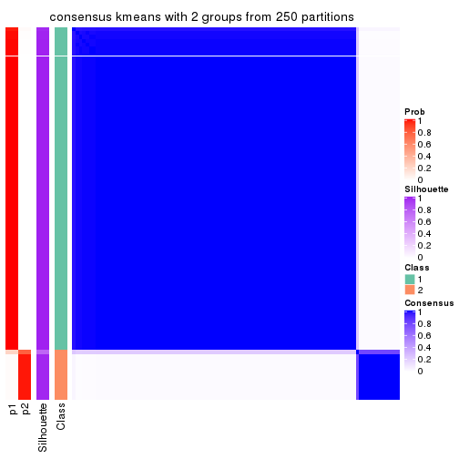</p>

</div>
<div id='tab-MAD-kmeans-consensus-heatmap-2'>
<pre><code class="r">consensus_heatmap(res, k = 3)
</code></pre>

<p></p>

</div>
<div id='tab-MAD-kmeans-consensus-heatmap-3'>
<pre><code class="r">consensus_heatmap(res, k = 4)
</code></pre>

<p></p>

</div>
<div id='tab-MAD-kmeans-consensus-heatmap-4'>
<pre><code class="r">consensus_heatmap(res, k = 5)
</code></pre>

<p></p>

</div>
<div id='tab-MAD-kmeans-consensus-heatmap-5'>
<pre><code class="r">consensus_heatmap(res, k = 6)
</code></pre>

<p></p>

</div>
</div>

Heatmaps for the membership of samples in all partitions to see how consistent they are:


<script>
$( function() {
	$( '#tabs-MAD-kmeans-membership-heatmap' ).tabs();
} );
</script>
<div id='tabs-MAD-kmeans-membership-heatmap'>
<ul>
<li><a href='#tab-MAD-kmeans-membership-heatmap-1'>k = 2</a></li>
<li><a href='#tab-MAD-kmeans-membership-heatmap-2'>k = 3</a></li>
<li><a href='#tab-MAD-kmeans-membership-heatmap-3'>k = 4</a></li>
<li><a href='#tab-MAD-kmeans-membership-heatmap-4'>k = 5</a></li>
<li><a href='#tab-MAD-kmeans-membership-heatmap-5'>k = 6</a></li>
</ul>
<div id='tab-MAD-kmeans-membership-heatmap-1'>
<pre><code class="r">membership_heatmap(res, k = 2)
</code></pre>

<p></p>

</div>
<div id='tab-MAD-kmeans-membership-heatmap-2'>
<pre><code class="r">membership_heatmap(res, k = 3)
</code></pre>

<p></p>

</div>
<div id='tab-MAD-kmeans-membership-heatmap-3'>
<pre><code class="r">membership_heatmap(res, k = 4)
</code></pre>

<p></p>

</div>
<div id='tab-MAD-kmeans-membership-heatmap-4'>
<pre><code class="r">membership_heatmap(res, k = 5)
</code></pre>

<p></p>

</div>
<div id='tab-MAD-kmeans-membership-heatmap-5'>
<pre><code class="r">membership_heatmap(res, k = 6)
</code></pre>

<p></p>

</div>
</div>

As soon as we have had the classes for columns, we can look for signatures
which are significantly different between classes which can be candidate marks
for certain classes. Following are the heatmaps for signatures.


Signature heatmaps where rows are scaled:


<script>
$( function() {
	$( '#tabs-MAD-kmeans-get-signatures' ).tabs();
} );
</script>
<div id='tabs-MAD-kmeans-get-signatures'>
<ul>
<li><a href='#tab-MAD-kmeans-get-signatures-1'>k = 2</a></li>
<li><a href='#tab-MAD-kmeans-get-signatures-2'>k = 3</a></li>
<li><a href='#tab-MAD-kmeans-get-signatures-3'>k = 4</a></li>
<li><a href='#tab-MAD-kmeans-get-signatures-4'>k = 5</a></li>
<li><a href='#tab-MAD-kmeans-get-signatures-5'>k = 6</a></li>
</ul>
<div id='tab-MAD-kmeans-get-signatures-1'>
<pre><code class="r">get_signatures(res, k = 2)
</code></pre>

<p></p>

</div>
<div id='tab-MAD-kmeans-get-signatures-2'>
<pre><code class="r">get_signatures(res, k = 3)
</code></pre>

<p></p>

</div>
<div id='tab-MAD-kmeans-get-signatures-3'>
<pre><code class="r">get_signatures(res, k = 4)
</code></pre>

<p></p>

</div>
<div id='tab-MAD-kmeans-get-signatures-4'>
<pre><code class="r">get_signatures(res, k = 5)
</code></pre>

<p></p>

</div>
<div id='tab-MAD-kmeans-get-signatures-5'>
<pre><code class="r">get_signatures(res, k = 6)
</code></pre>

<p></p>

</div>
</div>


Signature heatmaps where rows are not scaled:


<script>
$( function() {
	$( '#tabs-MAD-kmeans-get-signatures-no-scale' ).tabs();
} );
</script>
<div id='tabs-MAD-kmeans-get-signatures-no-scale'>
<ul>
<li><a href='#tab-MAD-kmeans-get-signatures-no-scale-1'>k = 2</a></li>
<li><a href='#tab-MAD-kmeans-get-signatures-no-scale-2'>k = 3</a></li>
<li><a href='#tab-MAD-kmeans-get-signatures-no-scale-3'>k = 4</a></li>
<li><a href='#tab-MAD-kmeans-get-signatures-no-scale-4'>k = 5</a></li>
<li><a href='#tab-MAD-kmeans-get-signatures-no-scale-5'>k = 6</a></li>
</ul>
<div id='tab-MAD-kmeans-get-signatures-no-scale-1'>
<pre><code class="r">get_signatures(res, k = 2, scale_rows = FALSE)
</code></pre>

<p></p>

</div>
<div id='tab-MAD-kmeans-get-signatures-no-scale-2'>
<pre><code class="r">get_signatures(res, k = 3, scale_rows = FALSE)
</code></pre>

<p>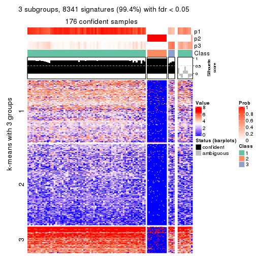</p>

</div>
<div id='tab-MAD-kmeans-get-signatures-no-scale-3'>
<pre><code class="r">get_signatures(res, k = 4, scale_rows = FALSE)
</code></pre>

<p></p>

</div>
<div id='tab-MAD-kmeans-get-signatures-no-scale-4'>
<pre><code class="r">get_signatures(res, k = 5, scale_rows = FALSE)
</code></pre>

<p></p>

</div>
<div id='tab-MAD-kmeans-get-signatures-no-scale-5'>
<pre><code class="r">get_signatures(res, k = 6, scale_rows = FALSE)
</code></pre>

<p></p>

</div>
</div>


Compare the overlap of signatures from different k:

```r
compare_signatures(res)
```


`get_signature()` returns a data frame invisibly. TO get the list of signatures, the function
call should be assigned to a variable explicitly. In following code, if `plot` argument is set
to `FALSE`, no heatmap is plotted while only the differential analysis is performed.

```r
# code only for demonstration
tb = get_signature(res, k = ..., plot = FALSE)
```

An example of the output of `tb` is:

```
#>   which_row         fdr    mean_1    mean_2 scaled_mean_1 scaled_mean_2 km
#> 1        38 0.042760348  8.373488  9.131774    -0.5533452     0.5164555  1
#> 2        40 0.018707592  7.106213  8.469186    -0.6173731     0.5762149  1
#> 3        55 0.019134737 10.221463 11.207825    -0.6159697     0.5749050  1
#> 4        59 0.006059896  5.921854  7.869574    -0.6899429     0.6439467  1
#> 5        60 0.018055526  8.928898 10.211722    -0.6204761     0.5791110  1
#> 6        98 0.009384629 15.714769 14.887706     0.6635654    -0.6193277  2
...
```

The columns in `tb` are:

1. `which_row`: row indices corresponding to the input matrix.
2. `fdr`: FDR for the differential test. 
3. `mean_x`: The mean value in group x.
4. `scaled_mean_x`: The mean value in group x after rows are scaled.
5. `km`: Row groups if k-means clustering is applied to rows.


UMAP plot which shows how samples are separated.


<script>
$( function() {
	$( '#tabs-MAD-kmeans-dimension-reduction' ).tabs();
} );
</script>
<div id='tabs-MAD-kmeans-dimension-reduction'>
<ul>
<li><a href='#tab-MAD-kmeans-dimension-reduction-1'>k = 2</a></li>
<li><a href='#tab-MAD-kmeans-dimension-reduction-2'>k = 3</a></li>
<li><a href='#tab-MAD-kmeans-dimension-reduction-3'>k = 4</a></li>
<li><a href='#tab-MAD-kmeans-dimension-reduction-4'>k = 5</a></li>
<li><a href='#tab-MAD-kmeans-dimension-reduction-5'>k = 6</a></li>
</ul>
<div id='tab-MAD-kmeans-dimension-reduction-1'>
<pre><code class="r">dimension_reduction(res, k = 2, method = &quot;UMAP&quot;)
</code></pre>

<p></p>

</div>
<div id='tab-MAD-kmeans-dimension-reduction-2'>
<pre><code class="r">dimension_reduction(res, k = 3, method = &quot;UMAP&quot;)
</code></pre>

<p></p>

</div>
<div id='tab-MAD-kmeans-dimension-reduction-3'>
<pre><code class="r">dimension_reduction(res, k = 4, method = &quot;UMAP&quot;)
</code></pre>

<p></p>

</div>
<div id='tab-MAD-kmeans-dimension-reduction-4'>
<pre><code class="r">dimension_reduction(res, k = 5, method = &quot;UMAP&quot;)
</code></pre>

<p></p>

</div>
<div id='tab-MAD-kmeans-dimension-reduction-5'>
<pre><code class="r">dimension_reduction(res, k = 6, method = &quot;UMAP&quot;)
</code></pre>

<p></p>

</div>
</div>


Following heatmap shows how subgroups are split when increasing `k`:

```r
collect_classes(res)
```


If matrix rows can be associated to genes, consider to use `GO_Enrichment(res,
...)` to perform function enrichment for the signature genes.


 

---------------------------------------------------


### MAD:skmeans**


The object with results only for a single top-value method and a single partition method 
can be extracted as:

```r
res = res_list["MAD", "skmeans"]
# you can also extract it by
# res = res_list["MAD:skmeans"]
```

A summary of `res` and all the functions that can be applied to it:

```r
res
```

```
#> A 'ConsensusPartition' object with k = 2, 3, 4, 5, 6.
#>   On a matrix with 8394 rows and 194 columns.
#>   Top rows (839, 1678, 2518, 3358, 4197) are extracted by 'MAD' method.
#>   Subgroups are detected by 'skmeans' method.
#>   Performed in total 1250 partitions by row resampling.
#>   Best k for subgroups seems to be 2.
#> 
#> Following methods can be applied to this 'ConsensusPartition' object:
#>  [1] "cola_report"             "collect_classes"         "collect_plots"          
#>  [4] "collect_stats"           "colnames"                "compare_signatures"     
#>  [7] "consensus_heatmap"       "dimension_reduction"     "functional_enrichment"  
#> [10] "get_anno_col"            "get_anno"                "get_classes"            
#> [13] "get_consensus"           "get_matrix"              "get_membership"         
#> [16] "get_param"               "get_signatures"          "get_stats"              
#> [19] "is_best_k"               "is_stable_k"             "membership_heatmap"     
#> [22] "ncol"                    "nrow"                    "plot_ecdf"              
#> [25] "rownames"                "select_partition_number" "show"                   
#> [28] "suggest_best_k"          "test_to_known_factors"
```

`collect_plots()` function collects all the plots made from `res` for all `k` (number of partitions)
into one single page to provide an easy and fast comparison between different `k`.

```r
collect_plots(res)
```


The plots are:

- The first row: a plot of the ECDF (Empirical cumulative distribution
  function) curves of the consensus matrix for each `k` and the heatmap of
  predicted classes for each `k`.
- The second row: heatmaps of the consensus matrix for each `k`.
- The third row: heatmaps of the membership matrix for each `k`.
- The fouth row: heatmaps of the signatures for each `k`.

All the plots in panels can be made by individual functions and they are
plotted later in this section.

`select_partition_number()` produces several plots showing different
statistics for choosing "optimized" `k`. There are following statistics:

- ECDF curves of the consensus matrix for each `k`;
- 1-PAC. [The PAC
  score](https://en.wikipedia.org/wiki/Consensus_clustering#Over-interpretation_potential_of_consensus_clustering)
  measures the proportion of the ambiguous subgrouping.
- Mean silhouette score.
- Concordance. The mean probability of fiting the consensus class ids in all
  partitions.
- Area increased. Denote $A_k$ as the area under the ECDF curve for current
  `k`, the area increased is defined as $A_k - A_{k-1}$.
- Rand index. The percent of pairs of samples that are both in a same cluster
  or both are not in a same cluster in the partition of k and k-1.
- Jaccard index. The ratio of pairs of samples are both in a same cluster in
  the partition of k and k-1 and the pairs of samples are both in a same
  cluster in the partition k or k-1.

The detailed explanations of these statistics can be found in [the cola
vignette](http://bioconductor.org/packages/devel/bioc/vignettes/cola/inst/doc/cola.html#toc_13).

Generally speaking, lower PAC score, higher mean silhouette score or higher
concordance corresponds to better partition. Rand index and Jaccard index
measure how similar the current partition is compared to partition with `k-1`.
If they are too similar, we won't accept `k` is better than `k-1`.

```r
select_partition_number(res)
```


The numeric values for all these statistics can be obtained by `get_stats()`.

```r
get_stats(res)
```

```
#>   k 1-PAC mean_silhouette concordance area_increased  Rand Jaccard
#> 2 2 1.000           0.963       0.985         0.3666 0.636   0.636
#> 3 3 0.401           0.663       0.802         0.6574 0.740   0.598
#> 4 4 0.402           0.560       0.728         0.1632 0.864   0.678
#> 5 5 0.443           0.461       0.663         0.0878 0.928   0.775
#> 6 6 0.498           0.399       0.600         0.0531 0.899   0.650
```

`suggest_best_k()` suggests the best $k$ based on these statistics. The rules are as follows:

- All $k$ with Jaccard index larger than 0.95 are removed because the increase of
  the partition number does not provides enough extra information. If all $k$ are removed,
  the best $k$ is assigned by `NA`.
- For $k$ with 1-PAC larger than 0.9, the maximal $k$ is taken as the "best k". Other $k$ is called "optional k".
- If it does not fit the second rule. The $k$ with the highest vote of highest
  1-PAC, mean silhouette and concordance is taken as the "best k".

```r
suggest_best_k(res)
```

```
#> [1] 2
```


Following shows the table of the partitions (You need to click the **show/hide
code output** link to see it). The membership matrix (columns with name `p*`)
is inferred by
[`clue::cl_consensus()`](https://www.rdocumentation.org/link/cl_consensus?package=clue)
function with the `SE` method. Basically the value in the membership matrix
represents the probability to belong to a certain group. The finall class
label for an item is determined with the group with highest probability it
belongs to.

In `get_classes()` function, the entropy is calculated from the membership
matrix and the silhouette score is calculated from the consensus matrix.


<script>
$( function() {
	$( '#tabs-MAD-skmeans-get-classes' ).tabs();
} );
</script>
<div id='tabs-MAD-skmeans-get-classes'>
<ul>
<li><a href='#tab-MAD-skmeans-get-classes-1'>k = 2</a></li>
<li><a href='#tab-MAD-skmeans-get-classes-2'>k = 3</a></li>
<li><a href='#tab-MAD-skmeans-get-classes-3'>k = 4</a></li>
<li><a href='#tab-MAD-skmeans-get-classes-4'>k = 5</a></li>
<li><a href='#tab-MAD-skmeans-get-classes-5'>k = 6</a></li>
</ul>

<div id='tab-MAD-skmeans-get-classes-1'>
<p><a id='tab-MAD-skmeans-get-classes-1-a' style='color:#0366d6' href='#'>show/hide code output</a></p>
<pre><code class="r">cbind(get_classes(res, k = 2), get_membership(res, k = 2))
</code></pre>

<pre><code>#&gt;           class entropy silhouette    p1    p2
#&gt; ERR467487     2  0.0000      0.972 0.000 1.000
#&gt; ERR467498     2  0.0000      0.972 0.000 1.000
#&gt; ERR658998     1  0.0000      0.988 1.000 0.000
#&gt; ERR659094     1  0.0000      0.988 1.000 0.000
#&gt; ERR658999     1  0.0000      0.988 1.000 0.000
#&gt; ERR659095     1  0.0000      0.988 1.000 0.000
#&gt; ERR659000     2  0.2423      0.942 0.040 0.960
#&gt; ERR659096     2  0.2423      0.942 0.040 0.960
#&gt; ERR659001     1  0.0000      0.988 1.000 0.000
#&gt; ERR659097     1  0.0000      0.988 1.000 0.000
#&gt; ERR659002     1  0.0000      0.988 1.000 0.000
#&gt; ERR659098     1  0.0000      0.988 1.000 0.000
#&gt; ERR659003     1  0.0000      0.988 1.000 0.000
#&gt; ERR659099     1  0.0000      0.988 1.000 0.000
#&gt; ERR659004     1  0.9323      0.458 0.652 0.348
#&gt; ERR659100     1  0.9323      0.458 0.652 0.348
#&gt; ERR659005     1  0.0000      0.988 1.000 0.000
#&gt; ERR659101     1  0.0000      0.988 1.000 0.000
#&gt; ERR659006     1  0.0000      0.988 1.000 0.000
#&gt; ERR659102     1  0.0000      0.988 1.000 0.000
#&gt; ERR659007     1  0.0000      0.988 1.000 0.000
#&gt; ERR659103     1  0.0000      0.988 1.000 0.000
#&gt; ERR659008     2  0.0000      0.972 0.000 1.000
#&gt; ERR659104     2  0.0000      0.972 0.000 1.000
#&gt; ERR659009     1  0.0000      0.988 1.000 0.000
#&gt; ERR659105     1  0.0000      0.988 1.000 0.000
#&gt; ERR659010     1  0.0000      0.988 1.000 0.000
#&gt; ERR659106     1  0.0000      0.988 1.000 0.000
#&gt; ERR659011     1  0.0000      0.988 1.000 0.000
#&gt; ERR659107     1  0.0000      0.988 1.000 0.000
#&gt; ERR659012     1  0.1414      0.969 0.980 0.020
#&gt; ERR659108     1  0.1414      0.969 0.980 0.020
#&gt; ERR659013     1  0.6712      0.780 0.824 0.176
#&gt; ERR659109     1  0.6712      0.780 0.824 0.176
#&gt; ERR659014     2  0.0000      0.972 0.000 1.000
#&gt; ERR659110     2  0.0000      0.972 0.000 1.000
#&gt; ERR659015     1  0.0000      0.988 1.000 0.000
#&gt; ERR659111     1  0.0000      0.988 1.000 0.000
#&gt; ERR659016     2  0.9815      0.285 0.420 0.580
#&gt; ERR659112     2  0.9815      0.285 0.420 0.580
#&gt; ERR659017     2  0.0000      0.972 0.000 1.000
#&gt; ERR659113     2  0.0000      0.972 0.000 1.000
#&gt; ERR659018     1  0.0000      0.988 1.000 0.000
#&gt; ERR659114     1  0.0000      0.988 1.000 0.000
#&gt; ERR659019     1  0.0000      0.988 1.000 0.000
#&gt; ERR659115     1  0.0000      0.988 1.000 0.000
#&gt; ERR659020     1  0.0000      0.988 1.000 0.000
#&gt; ERR659116     1  0.0000      0.988 1.000 0.000
#&gt; ERR659021     1  0.0000      0.988 1.000 0.000
#&gt; ERR659117     1  0.0000      0.988 1.000 0.000
#&gt; ERR659022     1  0.0000      0.988 1.000 0.000
#&gt; ERR659118     1  0.0000      0.988 1.000 0.000
#&gt; ERR659023     1  0.0000      0.988 1.000 0.000
#&gt; ERR659119     1  0.0000      0.988 1.000 0.000
#&gt; ERR659024     1  0.0000      0.988 1.000 0.000
#&gt; ERR659120     1  0.0000      0.988 1.000 0.000
#&gt; ERR659025     1  0.0376      0.984 0.996 0.004
#&gt; ERR659121     1  0.0376      0.984 0.996 0.004
#&gt; ERR659026     1  0.0000      0.988 1.000 0.000
#&gt; ERR659122     1  0.0000      0.988 1.000 0.000
#&gt; ERR659027     2  0.0000      0.972 0.000 1.000
#&gt; ERR659123     2  0.0000      0.972 0.000 1.000
#&gt; ERR659028     1  0.0000      0.988 1.000 0.000
#&gt; ERR659124     1  0.0000      0.988 1.000 0.000
#&gt; ERR659029     1  0.0000      0.988 1.000 0.000
#&gt; ERR659125     1  0.0000      0.988 1.000 0.000
#&gt; ERR659030     1  0.0000      0.988 1.000 0.000
#&gt; ERR659126     1  0.0000      0.988 1.000 0.000
#&gt; ERR659031     1  0.0000      0.988 1.000 0.000
#&gt; ERR659127     1  0.0000      0.988 1.000 0.000
#&gt; ERR659032     1  0.0000      0.988 1.000 0.000
#&gt; ERR659128     1  0.0000      0.988 1.000 0.000
#&gt; ERR659033     1  0.0000      0.988 1.000 0.000
#&gt; ERR659129     1  0.0000      0.988 1.000 0.000
#&gt; ERR659034     2  0.0000      0.972 0.000 1.000
#&gt; ERR659130     2  0.0000      0.972 0.000 1.000
#&gt; ERR659035     1  0.0000      0.988 1.000 0.000
#&gt; ERR659131     1  0.0000      0.988 1.000 0.000
#&gt; ERR659036     1  0.0000      0.988 1.000 0.000
#&gt; ERR659132     1  0.0000      0.988 1.000 0.000
#&gt; ERR659037     1  0.0000      0.988 1.000 0.000
#&gt; ERR659133     1  0.0000      0.988 1.000 0.000
#&gt; ERR659038     1  0.0000      0.988 1.000 0.000
#&gt; ERR659134     1  0.0000      0.988 1.000 0.000
#&gt; ERR659039     1  0.0000      0.988 1.000 0.000
#&gt; ERR659135     1  0.0000      0.988 1.000 0.000
#&gt; ERR659040     1  0.0376      0.984 0.996 0.004
#&gt; ERR659136     1  0.0376      0.984 0.996 0.004
#&gt; ERR659041     2  0.0000      0.972 0.000 1.000
#&gt; ERR659137     2  0.0000      0.972 0.000 1.000
#&gt; ERR659042     2  0.2236      0.945 0.036 0.964
#&gt; ERR659138     2  0.2236      0.945 0.036 0.964
#&gt; ERR659043     1  0.0000      0.988 1.000 0.000
#&gt; ERR659139     1  0.0000      0.988 1.000 0.000
#&gt; ERR659044     2  0.0000      0.972 0.000 1.000
#&gt; ERR659140     2  0.0000      0.972 0.000 1.000
#&gt; ERR659045     1  0.0000      0.988 1.000 0.000
#&gt; ERR659141     1  0.0000      0.988 1.000 0.000
#&gt; ERR659046     1  0.0000      0.988 1.000 0.000
#&gt; ERR659142     1  0.0000      0.988 1.000 0.000
#&gt; ERR659047     1  0.0000      0.988 1.000 0.000
#&gt; ERR659143     1  0.0000      0.988 1.000 0.000
#&gt; ERR659048     1  0.0000      0.988 1.000 0.000
#&gt; ERR659144     1  0.0000      0.988 1.000 0.000
#&gt; ERR659049     1  0.9044      0.522 0.680 0.320
#&gt; ERR659145     1  0.9044      0.522 0.680 0.320
#&gt; ERR659050     1  0.0000      0.988 1.000 0.000
#&gt; ERR659146     1  0.0000      0.988 1.000 0.000
#&gt; ERR659051     2  0.0000      0.972 0.000 1.000
#&gt; ERR659147     2  0.0000      0.972 0.000 1.000
#&gt; ERR659052     1  0.0000      0.988 1.000 0.000
#&gt; ERR659148     1  0.0000      0.988 1.000 0.000
#&gt; ERR659053     1  0.0000      0.988 1.000 0.000
#&gt; ERR659149     1  0.0000      0.988 1.000 0.000
#&gt; ERR659054     2  0.0000      0.972 0.000 1.000
#&gt; ERR659150     2  0.0000      0.972 0.000 1.000
#&gt; ERR659055     1  0.0000      0.988 1.000 0.000
#&gt; ERR659151     1  0.0000      0.988 1.000 0.000
#&gt; ERR659056     2  0.0000      0.972 0.000 1.000
#&gt; ERR659152     2  0.0000      0.972 0.000 1.000
#&gt; ERR659057     1  0.0000      0.988 1.000 0.000
#&gt; ERR659153     1  0.0000      0.988 1.000 0.000
#&gt; ERR659058     1  0.0000      0.988 1.000 0.000
#&gt; ERR659154     1  0.0000      0.988 1.000 0.000
#&gt; ERR659059     1  0.0000      0.988 1.000 0.000
#&gt; ERR659155     1  0.0000      0.988 1.000 0.000
#&gt; ERR659060     1  0.0000      0.988 1.000 0.000
#&gt; ERR659156     1  0.0000      0.988 1.000 0.000
#&gt; ERR659061     1  0.0000      0.988 1.000 0.000
#&gt; ERR659157     1  0.0000      0.988 1.000 0.000
#&gt; ERR659062     1  0.0000      0.988 1.000 0.000
#&gt; ERR659158     1  0.0000      0.988 1.000 0.000
#&gt; ERR659063     1  0.0000      0.988 1.000 0.000
#&gt; ERR659159     1  0.0000      0.988 1.000 0.000
#&gt; ERR659064     1  0.0000      0.988 1.000 0.000
#&gt; ERR659160     1  0.0000      0.988 1.000 0.000
#&gt; ERR659065     2  0.0000      0.972 0.000 1.000
#&gt; ERR659161     2  0.0000      0.972 0.000 1.000
#&gt; ERR659066     1  0.0000      0.988 1.000 0.000
#&gt; ERR659162     1  0.0000      0.988 1.000 0.000
#&gt; ERR659067     1  0.0000      0.988 1.000 0.000
#&gt; ERR659163     1  0.0000      0.988 1.000 0.000
#&gt; ERR659068     2  0.0000      0.972 0.000 1.000
#&gt; ERR659164     2  0.0000      0.972 0.000 1.000
#&gt; ERR659069     1  0.0000      0.988 1.000 0.000
#&gt; ERR659165     1  0.0000      0.988 1.000 0.000
#&gt; ERR659070     1  0.0000      0.988 1.000 0.000
#&gt; ERR659166     1  0.0000      0.988 1.000 0.000
#&gt; ERR659071     1  0.0000      0.988 1.000 0.000
#&gt; ERR659167     1  0.0000      0.988 1.000 0.000
#&gt; ERR659072     1  0.0000      0.988 1.000 0.000
#&gt; ERR659168     1  0.0000      0.988 1.000 0.000
#&gt; ERR659073     1  0.0000      0.988 1.000 0.000
#&gt; ERR659169     1  0.0000      0.988 1.000 0.000
#&gt; ERR659074     2  0.0000      0.972 0.000 1.000
#&gt; ERR659170     2  0.0000      0.972 0.000 1.000
#&gt; ERR659075     2  0.0000      0.972 0.000 1.000
#&gt; ERR659171     2  0.0000      0.972 0.000 1.000
#&gt; ERR659076     2  0.0000      0.972 0.000 1.000
#&gt; ERR659172     2  0.0000      0.972 0.000 1.000
#&gt; ERR659077     1  0.0000      0.988 1.000 0.000
#&gt; ERR659173     1  0.0000      0.988 1.000 0.000
#&gt; ERR659078     1  0.0000      0.988 1.000 0.000
#&gt; ERR659174     1  0.0000      0.988 1.000 0.000
#&gt; ERR659079     1  0.0000      0.988 1.000 0.000
#&gt; ERR659175     1  0.0000      0.988 1.000 0.000
#&gt; ERR659080     2  0.0000      0.972 0.000 1.000
#&gt; ERR659176     2  0.0000      0.972 0.000 1.000
#&gt; ERR659081     1  0.0000      0.988 1.000 0.000
#&gt; ERR659177     1  0.0000      0.988 1.000 0.000
#&gt; ERR659082     1  0.0000      0.988 1.000 0.000
#&gt; ERR659178     1  0.0000      0.988 1.000 0.000
#&gt; ERR659083     2  0.0000      0.972 0.000 1.000
#&gt; ERR659179     2  0.0000      0.972 0.000 1.000
#&gt; ERR659084     2  0.0000      0.972 0.000 1.000
#&gt; ERR659180     2  0.0000      0.972 0.000 1.000
#&gt; ERR659085     1  0.0000      0.988 1.000 0.000
#&gt; ERR659181     1  0.0000      0.988 1.000 0.000
#&gt; ERR659086     1  0.0000      0.988 1.000 0.000
#&gt; ERR659182     1  0.0000      0.988 1.000 0.000
#&gt; ERR659087     1  0.0000      0.988 1.000 0.000
#&gt; ERR659183     1  0.0000      0.988 1.000 0.000
#&gt; ERR659088     2  0.4939      0.871 0.108 0.892
#&gt; ERR659184     2  0.4939      0.871 0.108 0.892
#&gt; ERR659089     1  0.0000      0.988 1.000 0.000
#&gt; ERR659185     1  0.0000      0.988 1.000 0.000
#&gt; ERR659090     1  0.0000      0.988 1.000 0.000
#&gt; ERR659186     1  0.0000      0.988 1.000 0.000
#&gt; ERR659091     1  0.0000      0.988 1.000 0.000
#&gt; ERR659187     1  0.0000      0.988 1.000 0.000
#&gt; ERR659092     1  0.0000      0.988 1.000 0.000
#&gt; ERR659188     1  0.0000      0.988 1.000 0.000
#&gt; ERR659093     1  0.0000      0.988 1.000 0.000
#&gt; ERR659189     1  0.0000      0.988 1.000 0.000
</code></pre>

<script>
$('#tab-MAD-skmeans-get-classes-1-a').parent().next().next().hide();
$('#tab-MAD-skmeans-get-classes-1-a').click(function(){
  $('#tab-MAD-skmeans-get-classes-1-a').parent().next().next().toggle();
  return(false);
});
</script>
</div>

<div id='tab-MAD-skmeans-get-classes-2'>
<p><a id='tab-MAD-skmeans-get-classes-2-a' style='color:#0366d6' href='#'>show/hide code output</a></p>
<pre><code class="r">cbind(get_classes(res, k = 3), get_membership(res, k = 3))
</code></pre>

<pre><code>#&gt;           class entropy silhouette    p1    p2    p3
#&gt; ERR467487     2  0.0000     0.9238 0.000 1.000 0.000
#&gt; ERR467498     2  0.0000     0.9238 0.000 1.000 0.000
#&gt; ERR658998     1  0.6286     0.0116 0.536 0.000 0.464
#&gt; ERR659094     1  0.6286     0.0116 0.536 0.000 0.464
#&gt; ERR658999     3  0.5760     0.7356 0.328 0.000 0.672
#&gt; ERR659095     3  0.5760     0.7356 0.328 0.000 0.672
#&gt; ERR659000     2  0.9961     0.1401 0.296 0.372 0.332
#&gt; ERR659096     2  0.9961     0.1401 0.296 0.372 0.332
#&gt; ERR659001     1  0.5591     0.4924 0.696 0.000 0.304
#&gt; ERR659097     1  0.5591     0.4924 0.696 0.000 0.304
#&gt; ERR659002     1  0.4062     0.7229 0.836 0.000 0.164
#&gt; ERR659098     1  0.4062     0.7229 0.836 0.000 0.164
#&gt; ERR659003     1  0.4062     0.6894 0.836 0.000 0.164
#&gt; ERR659099     1  0.4062     0.6894 0.836 0.000 0.164
#&gt; ERR659004     3  0.4326     0.7024 0.144 0.012 0.844
#&gt; ERR659100     3  0.4326     0.7024 0.144 0.012 0.844
#&gt; ERR659005     1  0.1860     0.7403 0.948 0.000 0.052
#&gt; ERR659101     1  0.1860     0.7403 0.948 0.000 0.052
#&gt; ERR659006     3  0.5016     0.7543 0.240 0.000 0.760
#&gt; ERR659102     3  0.5016     0.7543 0.240 0.000 0.760
#&gt; ERR659007     1  0.1860     0.7351 0.948 0.000 0.052
#&gt; ERR659103     1  0.1860     0.7351 0.948 0.000 0.052
#&gt; ERR659008     2  0.0000     0.9238 0.000 1.000 0.000
#&gt; ERR659104     2  0.0000     0.9238 0.000 1.000 0.000
#&gt; ERR659009     3  0.4346     0.7387 0.184 0.000 0.816
#&gt; ERR659105     3  0.4346     0.7387 0.184 0.000 0.816
#&gt; ERR659010     3  0.4750     0.7571 0.216 0.000 0.784
#&gt; ERR659106     3  0.4750     0.7571 0.216 0.000 0.784
#&gt; ERR659011     3  0.5882     0.7249 0.348 0.000 0.652
#&gt; ERR659107     3  0.5882     0.7249 0.348 0.000 0.652
#&gt; ERR659012     3  0.4062     0.7377 0.164 0.000 0.836
#&gt; ERR659108     3  0.4062     0.7377 0.164 0.000 0.836
#&gt; ERR659013     3  0.6699     0.4391 0.256 0.044 0.700
#&gt; ERR659109     3  0.6699     0.4391 0.256 0.044 0.700
#&gt; ERR659014     2  0.0000     0.9238 0.000 1.000 0.000
#&gt; ERR659110     2  0.0000     0.9238 0.000 1.000 0.000
#&gt; ERR659015     1  0.1411     0.7380 0.964 0.000 0.036
#&gt; ERR659111     1  0.1411     0.7380 0.964 0.000 0.036
#&gt; ERR659016     1  0.9887     0.0410 0.396 0.336 0.268
#&gt; ERR659112     1  0.9887     0.0410 0.396 0.336 0.268
#&gt; ERR659017     2  0.0000     0.9238 0.000 1.000 0.000
#&gt; ERR659113     2  0.0000     0.9238 0.000 1.000 0.000
#&gt; ERR659018     1  0.5138     0.5511 0.748 0.000 0.252
#&gt; ERR659114     1  0.5138     0.5511 0.748 0.000 0.252
#&gt; ERR659019     3  0.6126     0.6597 0.400 0.000 0.600
#&gt; ERR659115     3  0.6126     0.6597 0.400 0.000 0.600
#&gt; ERR659020     1  0.4555     0.6365 0.800 0.000 0.200
#&gt; ERR659116     1  0.4555     0.6365 0.800 0.000 0.200
#&gt; ERR659021     1  0.1031     0.7366 0.976 0.000 0.024
#&gt; ERR659117     1  0.1031     0.7366 0.976 0.000 0.024
#&gt; ERR659022     1  0.1860     0.7326 0.948 0.000 0.052
#&gt; ERR659118     1  0.1860     0.7326 0.948 0.000 0.052
#&gt; ERR659023     1  0.2878     0.7233 0.904 0.000 0.096
#&gt; ERR659119     1  0.2878     0.7233 0.904 0.000 0.096
#&gt; ERR659024     1  0.4178     0.7144 0.828 0.000 0.172
#&gt; ERR659120     1  0.4178     0.7144 0.828 0.000 0.172
#&gt; ERR659025     1  0.4504     0.6304 0.804 0.000 0.196
#&gt; ERR659121     1  0.4504     0.6304 0.804 0.000 0.196
#&gt; ERR659026     1  0.5882     0.3303 0.652 0.000 0.348
#&gt; ERR659122     1  0.5882     0.3303 0.652 0.000 0.348
#&gt; ERR659027     2  0.3340     0.8623 0.000 0.880 0.120
#&gt; ERR659123     2  0.3340     0.8623 0.000 0.880 0.120
#&gt; ERR659028     1  0.5529     0.5937 0.704 0.000 0.296
#&gt; ERR659124     1  0.5529     0.5937 0.704 0.000 0.296
#&gt; ERR659029     1  0.4235     0.7075 0.824 0.000 0.176
#&gt; ERR659125     1  0.4235     0.7075 0.824 0.000 0.176
#&gt; ERR659030     1  0.2878     0.7249 0.904 0.000 0.096
#&gt; ERR659126     1  0.2878     0.7249 0.904 0.000 0.096
#&gt; ERR659031     3  0.6192     0.2188 0.420 0.000 0.580
#&gt; ERR659127     3  0.6180     0.2312 0.416 0.000 0.584
#&gt; ERR659032     1  0.5988     0.5061 0.632 0.000 0.368
#&gt; ERR659128     1  0.5988     0.5061 0.632 0.000 0.368
#&gt; ERR659033     1  0.4399     0.6498 0.812 0.000 0.188
#&gt; ERR659129     1  0.4399     0.6498 0.812 0.000 0.188
#&gt; ERR659034     2  0.0000     0.9238 0.000 1.000 0.000
#&gt; ERR659130     2  0.0000     0.9238 0.000 1.000 0.000
#&gt; ERR659035     1  0.6192     0.3438 0.580 0.000 0.420
#&gt; ERR659131     1  0.6192     0.3438 0.580 0.000 0.420
#&gt; ERR659036     1  0.5016     0.6163 0.760 0.000 0.240
#&gt; ERR659132     1  0.5016     0.6163 0.760 0.000 0.240
#&gt; ERR659037     1  0.3686     0.7143 0.860 0.000 0.140
#&gt; ERR659133     1  0.3686     0.7143 0.860 0.000 0.140
#&gt; ERR659038     3  0.5363     0.7581 0.276 0.000 0.724
#&gt; ERR659134     3  0.5363     0.7581 0.276 0.000 0.724
#&gt; ERR659039     3  0.5835     0.7229 0.340 0.000 0.660
#&gt; ERR659135     3  0.5835     0.7229 0.340 0.000 0.660
#&gt; ERR659040     1  0.5397     0.5613 0.720 0.000 0.280
#&gt; ERR659136     1  0.5397     0.5613 0.720 0.000 0.280
#&gt; ERR659041     2  0.3482     0.8571 0.000 0.872 0.128
#&gt; ERR659137     2  0.3482     0.8571 0.000 0.872 0.128
#&gt; ERR659042     2  0.9017     0.5133 0.212 0.560 0.228
#&gt; ERR659138     2  0.9017     0.5133 0.212 0.560 0.228
#&gt; ERR659043     1  0.4750     0.6316 0.784 0.000 0.216
#&gt; ERR659139     1  0.4750     0.6316 0.784 0.000 0.216
#&gt; ERR659044     2  0.0000     0.9238 0.000 1.000 0.000
#&gt; ERR659140     2  0.0000     0.9238 0.000 1.000 0.000
#&gt; ERR659045     1  0.6026     0.1005 0.624 0.000 0.376
#&gt; ERR659141     1  0.6026     0.1005 0.624 0.000 0.376
#&gt; ERR659046     1  0.1964     0.7427 0.944 0.000 0.056
#&gt; ERR659142     1  0.1964     0.7427 0.944 0.000 0.056
#&gt; ERR659047     1  0.1964     0.7416 0.944 0.000 0.056
#&gt; ERR659143     1  0.1964     0.7416 0.944 0.000 0.056
#&gt; ERR659048     1  0.2165     0.7338 0.936 0.000 0.064
#&gt; ERR659144     1  0.2165     0.7338 0.936 0.000 0.064
#&gt; ERR659049     3  0.8181     0.3769 0.312 0.096 0.592
#&gt; ERR659145     3  0.8181     0.3769 0.312 0.096 0.592
#&gt; ERR659050     1  0.5621     0.5539 0.692 0.000 0.308
#&gt; ERR659146     1  0.5621     0.5539 0.692 0.000 0.308
#&gt; ERR659051     2  0.0000     0.9238 0.000 1.000 0.000
#&gt; ERR659147     2  0.0000     0.9238 0.000 1.000 0.000
#&gt; ERR659052     3  0.3412     0.6821 0.124 0.000 0.876
#&gt; ERR659148     3  0.3412     0.6821 0.124 0.000 0.876
#&gt; ERR659053     1  0.0892     0.7366 0.980 0.000 0.020
#&gt; ERR659149     1  0.0892     0.7366 0.980 0.000 0.020
#&gt; ERR659054     2  0.0000     0.9238 0.000 1.000 0.000
#&gt; ERR659150     2  0.0000     0.9238 0.000 1.000 0.000
#&gt; ERR659055     1  0.6302    -0.2956 0.520 0.000 0.480
#&gt; ERR659151     1  0.6302    -0.2956 0.520 0.000 0.480
#&gt; ERR659056     2  0.0000     0.9238 0.000 1.000 0.000
#&gt; ERR659152     2  0.0000     0.9238 0.000 1.000 0.000
#&gt; ERR659057     1  0.3816     0.7040 0.852 0.000 0.148
#&gt; ERR659153     1  0.3816     0.7040 0.852 0.000 0.148
#&gt; ERR659058     3  0.5905     0.7121 0.352 0.000 0.648
#&gt; ERR659154     3  0.5905     0.7121 0.352 0.000 0.648
#&gt; ERR659059     1  0.4178     0.7012 0.828 0.000 0.172
#&gt; ERR659155     1  0.4178     0.7012 0.828 0.000 0.172
#&gt; ERR659060     1  0.2796     0.7212 0.908 0.000 0.092
#&gt; ERR659156     1  0.2796     0.7212 0.908 0.000 0.092
#&gt; ERR659061     1  0.3941     0.7099 0.844 0.000 0.156
#&gt; ERR659157     1  0.3941     0.7099 0.844 0.000 0.156
#&gt; ERR659062     3  0.6267     0.3632 0.452 0.000 0.548
#&gt; ERR659158     3  0.6267     0.3632 0.452 0.000 0.548
#&gt; ERR659063     1  0.3941     0.7249 0.844 0.000 0.156
#&gt; ERR659159     1  0.3941     0.7249 0.844 0.000 0.156
#&gt; ERR659064     1  0.1753     0.7376 0.952 0.000 0.048
#&gt; ERR659160     1  0.1753     0.7376 0.952 0.000 0.048
#&gt; ERR659065     2  0.0000     0.9238 0.000 1.000 0.000
#&gt; ERR659161     2  0.0000     0.9238 0.000 1.000 0.000
#&gt; ERR659066     3  0.5497     0.7471 0.292 0.000 0.708
#&gt; ERR659162     3  0.5497     0.7471 0.292 0.000 0.708
#&gt; ERR659067     3  0.5948     0.6874 0.360 0.000 0.640
#&gt; ERR659163     3  0.5948     0.6874 0.360 0.000 0.640
#&gt; ERR659068     2  0.0000     0.9238 0.000 1.000 0.000
#&gt; ERR659164     2  0.0000     0.9238 0.000 1.000 0.000
#&gt; ERR659069     3  0.5859     0.7186 0.344 0.000 0.656
#&gt; ERR659165     3  0.5859     0.7186 0.344 0.000 0.656
#&gt; ERR659070     1  0.1964     0.7327 0.944 0.000 0.056
#&gt; ERR659166     1  0.1964     0.7327 0.944 0.000 0.056
#&gt; ERR659071     1  0.2796     0.7346 0.908 0.000 0.092
#&gt; ERR659167     1  0.2796     0.7346 0.908 0.000 0.092
#&gt; ERR659072     3  0.5016     0.7605 0.240 0.000 0.760
#&gt; ERR659168     3  0.5016     0.7605 0.240 0.000 0.760
#&gt; ERR659073     3  0.6295     0.3499 0.472 0.000 0.528
#&gt; ERR659169     3  0.6295     0.3499 0.472 0.000 0.528
#&gt; ERR659074     2  0.0000     0.9238 0.000 1.000 0.000
#&gt; ERR659170     2  0.0000     0.9238 0.000 1.000 0.000
#&gt; ERR659075     2  0.0000     0.9238 0.000 1.000 0.000
#&gt; ERR659171     2  0.0000     0.9238 0.000 1.000 0.000
#&gt; ERR659076     2  0.0000     0.9238 0.000 1.000 0.000
#&gt; ERR659172     2  0.0000     0.9238 0.000 1.000 0.000
#&gt; ERR659077     1  0.6045     0.4413 0.620 0.000 0.380
#&gt; ERR659173     1  0.6045     0.4413 0.620 0.000 0.380
#&gt; ERR659078     1  0.5098     0.5948 0.752 0.000 0.248
#&gt; ERR659174     1  0.5098     0.5948 0.752 0.000 0.248
#&gt; ERR659079     1  0.5560     0.5917 0.700 0.000 0.300
#&gt; ERR659175     1  0.5560     0.5917 0.700 0.000 0.300
#&gt; ERR659080     2  0.2261     0.8913 0.000 0.932 0.068
#&gt; ERR659176     2  0.2261     0.8913 0.000 0.932 0.068
#&gt; ERR659081     1  0.2165     0.7321 0.936 0.000 0.064
#&gt; ERR659177     1  0.2165     0.7321 0.936 0.000 0.064
#&gt; ERR659082     1  0.2625     0.7343 0.916 0.000 0.084
#&gt; ERR659178     1  0.2625     0.7343 0.916 0.000 0.084
#&gt; ERR659083     2  0.0000     0.9238 0.000 1.000 0.000
#&gt; ERR659179     2  0.0000     0.9238 0.000 1.000 0.000
#&gt; ERR659084     2  0.0000     0.9238 0.000 1.000 0.000
#&gt; ERR659180     2  0.0000     0.9238 0.000 1.000 0.000
#&gt; ERR659085     1  0.5138     0.5656 0.748 0.000 0.252
#&gt; ERR659181     1  0.5138     0.5656 0.748 0.000 0.252
#&gt; ERR659086     1  0.3116     0.7270 0.892 0.000 0.108
#&gt; ERR659182     1  0.3116     0.7270 0.892 0.000 0.108
#&gt; ERR659087     3  0.4887     0.7373 0.228 0.000 0.772
#&gt; ERR659183     3  0.4887     0.7373 0.228 0.000 0.772
#&gt; ERR659088     2  0.8076     0.4402 0.068 0.524 0.408
#&gt; ERR659184     2  0.8076     0.4402 0.068 0.524 0.408
#&gt; ERR659089     1  0.5138     0.6042 0.748 0.000 0.252
#&gt; ERR659185     1  0.5138     0.6042 0.748 0.000 0.252
#&gt; ERR659090     1  0.4974     0.6402 0.764 0.000 0.236
#&gt; ERR659186     1  0.4974     0.6402 0.764 0.000 0.236
#&gt; ERR659091     1  0.5465     0.5257 0.712 0.000 0.288
#&gt; ERR659187     1  0.5465     0.5257 0.712 0.000 0.288
#&gt; ERR659092     1  0.5859     0.4672 0.656 0.000 0.344
#&gt; ERR659188     1  0.5859     0.4672 0.656 0.000 0.344
#&gt; ERR659093     1  0.1753     0.7337 0.952 0.000 0.048
#&gt; ERR659189     1  0.1753     0.7337 0.952 0.000 0.048
</code></pre>

<script>
$('#tab-MAD-skmeans-get-classes-2-a').parent().next().next().hide();
$('#tab-MAD-skmeans-get-classes-2-a').click(function(){
  $('#tab-MAD-skmeans-get-classes-2-a').parent().next().next().toggle();
  return(false);
});
</script>
</div>

<div id='tab-MAD-skmeans-get-classes-3'>
<p><a id='tab-MAD-skmeans-get-classes-3-a' style='color:#0366d6' href='#'>show/hide code output</a></p>
<pre><code class="r">cbind(get_classes(res, k = 4), get_membership(res, k = 4))
</code></pre>

<pre><code>#&gt;           class entropy silhouette    p1    p2    p3    p4
#&gt; ERR467487     2  0.0000     0.9429 0.000 1.000 0.000 0.000
#&gt; ERR467498     2  0.0000     0.9429 0.000 1.000 0.000 0.000
#&gt; ERR658998     1  0.7640     0.1796 0.456 0.000 0.316 0.228
#&gt; ERR659094     1  0.7640     0.1796 0.456 0.000 0.316 0.228
#&gt; ERR658999     3  0.4905     0.5657 0.364 0.000 0.632 0.004
#&gt; ERR659095     3  0.4905     0.5657 0.364 0.000 0.632 0.004
#&gt; ERR659000     4  0.6422     0.5380 0.084 0.084 0.108 0.724
#&gt; ERR659096     4  0.6422     0.5380 0.084 0.084 0.108 0.724
#&gt; ERR659001     1  0.5219     0.5411 0.712 0.000 0.244 0.044
#&gt; ERR659097     1  0.5219     0.5411 0.712 0.000 0.244 0.044
#&gt; ERR659002     1  0.6993     0.2791 0.532 0.000 0.132 0.336
#&gt; ERR659098     1  0.6993     0.2791 0.532 0.000 0.132 0.336
#&gt; ERR659003     1  0.5484     0.6166 0.732 0.000 0.164 0.104
#&gt; ERR659099     1  0.5484     0.6166 0.732 0.000 0.164 0.104
#&gt; ERR659004     3  0.3760     0.5104 0.028 0.000 0.836 0.136
#&gt; ERR659100     3  0.3760     0.5104 0.028 0.000 0.836 0.136
#&gt; ERR659005     1  0.3850     0.6301 0.840 0.000 0.044 0.116
#&gt; ERR659101     1  0.3850     0.6301 0.840 0.000 0.044 0.116
#&gt; ERR659006     3  0.4071     0.6444 0.104 0.000 0.832 0.064
#&gt; ERR659102     3  0.4071     0.6444 0.104 0.000 0.832 0.064
#&gt; ERR659007     1  0.2443     0.6640 0.916 0.000 0.060 0.024
#&gt; ERR659103     1  0.2443     0.6640 0.916 0.000 0.060 0.024
#&gt; ERR659008     2  0.0000     0.9429 0.000 1.000 0.000 0.000
#&gt; ERR659104     2  0.0000     0.9429 0.000 1.000 0.000 0.000
#&gt; ERR659009     3  0.4037     0.5734 0.056 0.000 0.832 0.112
#&gt; ERR659105     3  0.4037     0.5734 0.056 0.000 0.832 0.112
#&gt; ERR659010     3  0.3876     0.6793 0.124 0.000 0.836 0.040
#&gt; ERR659106     3  0.3876     0.6793 0.124 0.000 0.836 0.040
#&gt; ERR659011     3  0.4677     0.6339 0.316 0.000 0.680 0.004
#&gt; ERR659107     3  0.4677     0.6339 0.316 0.000 0.680 0.004
#&gt; ERR659012     3  0.2494     0.5869 0.036 0.000 0.916 0.048
#&gt; ERR659108     3  0.2494     0.5869 0.036 0.000 0.916 0.048
#&gt; ERR659013     4  0.6452     0.4946 0.116 0.000 0.260 0.624
#&gt; ERR659109     4  0.6452     0.4946 0.116 0.000 0.260 0.624
#&gt; ERR659014     2  0.0000     0.9429 0.000 1.000 0.000 0.000
#&gt; ERR659110     2  0.0000     0.9429 0.000 1.000 0.000 0.000
#&gt; ERR659015     1  0.3606     0.6286 0.840 0.000 0.020 0.140
#&gt; ERR659111     1  0.3606     0.6286 0.840 0.000 0.020 0.140
#&gt; ERR659016     4  0.8461     0.5049 0.164 0.184 0.104 0.548
#&gt; ERR659112     4  0.8461     0.5049 0.164 0.184 0.104 0.548
#&gt; ERR659017     2  0.0000     0.9429 0.000 1.000 0.000 0.000
#&gt; ERR659113     2  0.0000     0.9429 0.000 1.000 0.000 0.000
#&gt; ERR659018     1  0.4220     0.5284 0.748 0.000 0.248 0.004
#&gt; ERR659114     1  0.4220     0.5284 0.748 0.000 0.248 0.004
#&gt; ERR659019     3  0.5229     0.4353 0.428 0.000 0.564 0.008
#&gt; ERR659115     3  0.5229     0.4353 0.428 0.000 0.564 0.008
#&gt; ERR659020     1  0.3836     0.6359 0.816 0.000 0.168 0.016
#&gt; ERR659116     1  0.3836     0.6359 0.816 0.000 0.168 0.016
#&gt; ERR659021     1  0.3247     0.6613 0.880 0.000 0.060 0.060
#&gt; ERR659117     1  0.3247     0.6613 0.880 0.000 0.060 0.060
#&gt; ERR659022     1  0.5219     0.5073 0.712 0.000 0.044 0.244
#&gt; ERR659118     1  0.5219     0.5073 0.712 0.000 0.044 0.244
#&gt; ERR659023     1  0.5827     0.3810 0.632 0.000 0.052 0.316
#&gt; ERR659119     1  0.5827     0.3810 0.632 0.000 0.052 0.316
#&gt; ERR659024     1  0.6560     0.4578 0.620 0.000 0.132 0.248
#&gt; ERR659120     1  0.6560     0.4578 0.620 0.000 0.132 0.248
#&gt; ERR659025     4  0.6471     0.2467 0.416 0.000 0.072 0.512
#&gt; ERR659121     4  0.6471     0.2467 0.416 0.000 0.072 0.512
#&gt; ERR659026     1  0.7006     0.2274 0.528 0.000 0.340 0.132
#&gt; ERR659122     1  0.7006     0.2274 0.528 0.000 0.340 0.132
#&gt; ERR659027     2  0.6033     0.5652 0.008 0.652 0.056 0.284
#&gt; ERR659123     2  0.6033     0.5652 0.008 0.652 0.056 0.284
#&gt; ERR659028     4  0.7156     0.2889 0.368 0.000 0.140 0.492
#&gt; ERR659124     4  0.7156     0.2889 0.368 0.000 0.140 0.492
#&gt; ERR659029     1  0.6614     0.2529 0.548 0.000 0.092 0.360
#&gt; ERR659125     1  0.6574     0.2452 0.548 0.000 0.088 0.364
#&gt; ERR659030     1  0.3958     0.6340 0.824 0.000 0.144 0.032
#&gt; ERR659126     1  0.3958     0.6340 0.824 0.000 0.144 0.032
#&gt; ERR659031     4  0.7660     0.4082 0.232 0.000 0.316 0.452
#&gt; ERR659127     4  0.7660     0.4082 0.232 0.000 0.316 0.452
#&gt; ERR659032     4  0.7472     0.2096 0.396 0.000 0.176 0.428
#&gt; ERR659128     4  0.7474     0.1978 0.400 0.000 0.176 0.424
#&gt; ERR659033     1  0.5102     0.6502 0.764 0.000 0.136 0.100
#&gt; ERR659129     1  0.5102     0.6502 0.764 0.000 0.136 0.100
#&gt; ERR659034     2  0.0000     0.9429 0.000 1.000 0.000 0.000
#&gt; ERR659130     2  0.0000     0.9429 0.000 1.000 0.000 0.000
#&gt; ERR659035     4  0.7626     0.3740 0.304 0.000 0.232 0.464
#&gt; ERR659131     4  0.7626     0.3740 0.304 0.000 0.232 0.464
#&gt; ERR659036     4  0.6261     0.2641 0.440 0.000 0.056 0.504
#&gt; ERR659132     4  0.6261     0.2641 0.440 0.000 0.056 0.504
#&gt; ERR659037     1  0.5811     0.5775 0.704 0.000 0.180 0.116
#&gt; ERR659133     1  0.5811     0.5775 0.704 0.000 0.180 0.116
#&gt; ERR659038     3  0.4538     0.7031 0.216 0.000 0.760 0.024
#&gt; ERR659134     3  0.4635     0.7032 0.216 0.000 0.756 0.028
#&gt; ERR659039     3  0.4372     0.6803 0.268 0.000 0.728 0.004
#&gt; ERR659135     3  0.4372     0.6803 0.268 0.000 0.728 0.004
#&gt; ERR659040     4  0.5292     0.5374 0.216 0.000 0.060 0.724
#&gt; ERR659136     4  0.5292     0.5374 0.216 0.000 0.060 0.724
#&gt; ERR659041     2  0.6537     0.2698 0.000 0.500 0.076 0.424
#&gt; ERR659137     2  0.6537     0.2698 0.000 0.500 0.076 0.424
#&gt; ERR659042     4  0.6881     0.4571 0.056 0.212 0.072 0.660
#&gt; ERR659138     4  0.6881     0.4571 0.056 0.212 0.072 0.660
#&gt; ERR659043     4  0.6000     0.3529 0.356 0.000 0.052 0.592
#&gt; ERR659139     4  0.6000     0.3529 0.356 0.000 0.052 0.592
#&gt; ERR659044     2  0.0000     0.9429 0.000 1.000 0.000 0.000
#&gt; ERR659140     2  0.0000     0.9429 0.000 1.000 0.000 0.000
#&gt; ERR659045     1  0.4643     0.3278 0.656 0.000 0.344 0.000
#&gt; ERR659141     1  0.4643     0.3278 0.656 0.000 0.344 0.000
#&gt; ERR659046     1  0.4464     0.5538 0.768 0.000 0.024 0.208
#&gt; ERR659142     1  0.4464     0.5538 0.768 0.000 0.024 0.208
#&gt; ERR659047     1  0.3958     0.6221 0.836 0.000 0.052 0.112
#&gt; ERR659143     1  0.3958     0.6221 0.836 0.000 0.052 0.112
#&gt; ERR659048     1  0.4636     0.5509 0.772 0.000 0.040 0.188
#&gt; ERR659144     1  0.4636     0.5509 0.772 0.000 0.040 0.188
#&gt; ERR659049     4  0.7900     0.3475 0.140 0.028 0.352 0.480
#&gt; ERR659145     4  0.7909     0.3437 0.140 0.028 0.356 0.476
#&gt; ERR659050     4  0.7219     0.3967 0.364 0.000 0.148 0.488
#&gt; ERR659146     4  0.7219     0.3967 0.364 0.000 0.148 0.488
#&gt; ERR659051     2  0.0000     0.9429 0.000 1.000 0.000 0.000
#&gt; ERR659147     2  0.0000     0.9429 0.000 1.000 0.000 0.000
#&gt; ERR659052     3  0.4635     0.4195 0.028 0.000 0.756 0.216
#&gt; ERR659148     3  0.4635     0.4195 0.028 0.000 0.756 0.216
#&gt; ERR659053     1  0.3312     0.6546 0.876 0.000 0.052 0.072
#&gt; ERR659149     1  0.3312     0.6546 0.876 0.000 0.052 0.072
#&gt; ERR659054     2  0.0000     0.9429 0.000 1.000 0.000 0.000
#&gt; ERR659150     2  0.0000     0.9429 0.000 1.000 0.000 0.000
#&gt; ERR659055     1  0.5657    -0.0232 0.540 0.000 0.436 0.024
#&gt; ERR659151     1  0.5657    -0.0232 0.540 0.000 0.436 0.024
#&gt; ERR659056     2  0.0336     0.9374 0.000 0.992 0.000 0.008
#&gt; ERR659152     2  0.0336     0.9374 0.000 0.992 0.000 0.008
#&gt; ERR659057     1  0.4669     0.6547 0.796 0.000 0.104 0.100
#&gt; ERR659153     1  0.4669     0.6547 0.796 0.000 0.104 0.100
#&gt; ERR659058     3  0.4889     0.5920 0.360 0.000 0.636 0.004
#&gt; ERR659154     3  0.4889     0.5920 0.360 0.000 0.636 0.004
#&gt; ERR659059     1  0.5042     0.6430 0.768 0.000 0.096 0.136
#&gt; ERR659155     1  0.5042     0.6430 0.768 0.000 0.096 0.136
#&gt; ERR659060     1  0.6383     0.2144 0.568 0.000 0.076 0.356
#&gt; ERR659156     1  0.6383     0.2144 0.568 0.000 0.076 0.356
#&gt; ERR659061     1  0.7281     0.3034 0.532 0.000 0.196 0.272
#&gt; ERR659157     1  0.7281     0.3034 0.532 0.000 0.196 0.272
#&gt; ERR659062     1  0.7699     0.0120 0.400 0.000 0.380 0.220
#&gt; ERR659158     1  0.7699     0.0120 0.400 0.000 0.380 0.220
#&gt; ERR659063     1  0.6148     0.3838 0.636 0.000 0.084 0.280
#&gt; ERR659159     1  0.6148     0.3838 0.636 0.000 0.084 0.280
#&gt; ERR659064     1  0.2282     0.6595 0.924 0.000 0.052 0.024
#&gt; ERR659160     1  0.2282     0.6595 0.924 0.000 0.052 0.024
#&gt; ERR659065     2  0.0000     0.9429 0.000 1.000 0.000 0.000
#&gt; ERR659161     2  0.0000     0.9429 0.000 1.000 0.000 0.000
#&gt; ERR659066     3  0.5550     0.6646 0.248 0.000 0.692 0.060
#&gt; ERR659162     3  0.5550     0.6646 0.248 0.000 0.692 0.060
#&gt; ERR659067     3  0.5268     0.3550 0.452 0.000 0.540 0.008
#&gt; ERR659163     3  0.5268     0.3550 0.452 0.000 0.540 0.008
#&gt; ERR659068     2  0.0000     0.9429 0.000 1.000 0.000 0.000
#&gt; ERR659164     2  0.0000     0.9429 0.000 1.000 0.000 0.000
#&gt; ERR659069     3  0.5423     0.6156 0.332 0.000 0.640 0.028
#&gt; ERR659165     3  0.5423     0.6156 0.332 0.000 0.640 0.028
#&gt; ERR659070     1  0.3763     0.6061 0.832 0.000 0.024 0.144
#&gt; ERR659166     1  0.3763     0.6061 0.832 0.000 0.024 0.144
#&gt; ERR659071     1  0.5559     0.5541 0.696 0.000 0.064 0.240
#&gt; ERR659167     1  0.5559     0.5541 0.696 0.000 0.064 0.240
#&gt; ERR659072     3  0.3647     0.6893 0.152 0.000 0.832 0.016
#&gt; ERR659168     3  0.3647     0.6893 0.152 0.000 0.832 0.016
#&gt; ERR659073     3  0.7501     0.0576 0.372 0.000 0.444 0.184
#&gt; ERR659169     3  0.7501     0.0576 0.372 0.000 0.444 0.184
#&gt; ERR659074     2  0.0000     0.9429 0.000 1.000 0.000 0.000
#&gt; ERR659170     2  0.0000     0.9429 0.000 1.000 0.000 0.000
#&gt; ERR659075     2  0.0000     0.9429 0.000 1.000 0.000 0.000
#&gt; ERR659171     2  0.0000     0.9429 0.000 1.000 0.000 0.000
#&gt; ERR659076     2  0.0000     0.9429 0.000 1.000 0.000 0.000
#&gt; ERR659172     2  0.0000     0.9429 0.000 1.000 0.000 0.000
#&gt; ERR659077     1  0.7472     0.2874 0.504 0.000 0.232 0.264
#&gt; ERR659173     1  0.7472     0.2874 0.504 0.000 0.232 0.264
#&gt; ERR659078     1  0.5417     0.6164 0.732 0.000 0.180 0.088
#&gt; ERR659174     1  0.5417     0.6164 0.732 0.000 0.180 0.088
#&gt; ERR659079     1  0.7500     0.0226 0.416 0.000 0.180 0.404
#&gt; ERR659175     1  0.7500     0.0226 0.416 0.000 0.180 0.404
#&gt; ERR659080     2  0.4289     0.7586 0.000 0.796 0.032 0.172
#&gt; ERR659176     2  0.4289     0.7586 0.000 0.796 0.032 0.172
#&gt; ERR659081     1  0.3691     0.6609 0.856 0.000 0.076 0.068
#&gt; ERR659177     1  0.3691     0.6609 0.856 0.000 0.076 0.068
#&gt; ERR659082     1  0.3907     0.6598 0.836 0.000 0.120 0.044
#&gt; ERR659178     1  0.3907     0.6598 0.836 0.000 0.120 0.044
#&gt; ERR659083     2  0.0000     0.9429 0.000 1.000 0.000 0.000
#&gt; ERR659179     2  0.0000     0.9429 0.000 1.000 0.000 0.000
#&gt; ERR659084     2  0.0000     0.9429 0.000 1.000 0.000 0.000
#&gt; ERR659180     2  0.0000     0.9429 0.000 1.000 0.000 0.000
#&gt; ERR659085     1  0.5448     0.5729 0.700 0.000 0.244 0.056
#&gt; ERR659181     1  0.5417     0.5787 0.704 0.000 0.240 0.056
#&gt; ERR659086     1  0.3958     0.6698 0.836 0.000 0.112 0.052
#&gt; ERR659182     1  0.3958     0.6698 0.836 0.000 0.112 0.052
#&gt; ERR659087     3  0.5972     0.5724 0.176 0.000 0.692 0.132
#&gt; ERR659183     3  0.5972     0.5724 0.176 0.000 0.692 0.132
#&gt; ERR659088     4  0.8783     0.1953 0.044 0.324 0.252 0.380
#&gt; ERR659184     4  0.8783     0.1953 0.044 0.324 0.252 0.380
#&gt; ERR659089     1  0.6724     0.5110 0.616 0.000 0.192 0.192
#&gt; ERR659185     1  0.6724     0.5110 0.616 0.000 0.192 0.192
#&gt; ERR659090     1  0.6650     0.5723 0.624 0.000 0.200 0.176
#&gt; ERR659186     1  0.6650     0.5723 0.624 0.000 0.200 0.176
#&gt; ERR659091     1  0.5318     0.6000 0.732 0.000 0.196 0.072
#&gt; ERR659187     1  0.5318     0.6000 0.732 0.000 0.196 0.072
#&gt; ERR659092     1  0.6756     0.4906 0.612 0.000 0.188 0.200
#&gt; ERR659188     1  0.6756     0.4906 0.612 0.000 0.188 0.200
#&gt; ERR659093     1  0.2843     0.6600 0.892 0.000 0.088 0.020
#&gt; ERR659189     1  0.2843     0.6600 0.892 0.000 0.088 0.020
</code></pre>

<script>
$('#tab-MAD-skmeans-get-classes-3-a').parent().next().next().hide();
$('#tab-MAD-skmeans-get-classes-3-a').click(function(){
  $('#tab-MAD-skmeans-get-classes-3-a').parent().next().next().toggle();
  return(false);
});
</script>
</div>

<div id='tab-MAD-skmeans-get-classes-4'>
<p><a id='tab-MAD-skmeans-get-classes-4-a' style='color:#0366d6' href='#'>show/hide code output</a></p>
<pre><code class="r">cbind(get_classes(res, k = 5), get_membership(res, k = 5))
</code></pre>

<pre><code>#&gt;           class entropy silhouette    p1    p2    p3    p4    p5
#&gt; ERR467487     2   0.000     0.9419 0.000 1.000 0.000 0.000 0.000
#&gt; ERR467498     2   0.000     0.9419 0.000 1.000 0.000 0.000 0.000
#&gt; ERR658998     4   0.815    -0.1698 0.284 0.000 0.100 0.332 0.284
#&gt; ERR659094     4   0.815    -0.1698 0.284 0.000 0.100 0.332 0.284
#&gt; ERR658999     4   0.461     0.4825 0.368 0.000 0.012 0.616 0.004
#&gt; ERR659095     4   0.461     0.4825 0.368 0.000 0.012 0.616 0.004
#&gt; ERR659000     3   0.708     0.1939 0.044 0.036 0.472 0.056 0.392
#&gt; ERR659096     3   0.708     0.1939 0.044 0.036 0.472 0.056 0.392
#&gt; ERR659001     1   0.540     0.4730 0.680 0.000 0.016 0.220 0.084
#&gt; ERR659097     1   0.540     0.4730 0.680 0.000 0.016 0.220 0.084
#&gt; ERR659002     1   0.801     0.1015 0.400 0.000 0.252 0.100 0.248
#&gt; ERR659098     1   0.801     0.1015 0.400 0.000 0.252 0.100 0.248
#&gt; ERR659003     1   0.556     0.5547 0.720 0.000 0.100 0.112 0.068
#&gt; ERR659099     1   0.556     0.5547 0.720 0.000 0.100 0.112 0.068
#&gt; ERR659004     4   0.487     0.4315 0.024 0.000 0.188 0.736 0.052
#&gt; ERR659100     4   0.487     0.4315 0.024 0.000 0.188 0.736 0.052
#&gt; ERR659005     1   0.530     0.5270 0.712 0.000 0.180 0.028 0.080
#&gt; ERR659101     1   0.530     0.5270 0.712 0.000 0.180 0.028 0.080
#&gt; ERR659006     4   0.472     0.5497 0.056 0.000 0.140 0.768 0.036
#&gt; ERR659102     4   0.472     0.5497 0.056 0.000 0.140 0.768 0.036
#&gt; ERR659007     1   0.283     0.5884 0.892 0.000 0.024 0.052 0.032
#&gt; ERR659103     1   0.283     0.5884 0.892 0.000 0.024 0.052 0.032
#&gt; ERR659008     2   0.000     0.9419 0.000 1.000 0.000 0.000 0.000
#&gt; ERR659104     2   0.000     0.9419 0.000 1.000 0.000 0.000 0.000
#&gt; ERR659009     4   0.451     0.5175 0.040 0.000 0.040 0.780 0.140
#&gt; ERR659105     4   0.451     0.5175 0.040 0.000 0.040 0.780 0.140
#&gt; ERR659010     4   0.358     0.6066 0.068 0.000 0.036 0.852 0.044
#&gt; ERR659106     4   0.358     0.6066 0.068 0.000 0.036 0.852 0.044
#&gt; ERR659011     4   0.469     0.5584 0.296 0.000 0.024 0.672 0.008
#&gt; ERR659107     4   0.469     0.5584 0.296 0.000 0.024 0.672 0.008
#&gt; ERR659012     4   0.376     0.5220 0.020 0.000 0.084 0.836 0.060
#&gt; ERR659108     4   0.376     0.5220 0.020 0.000 0.084 0.836 0.060
#&gt; ERR659013     5   0.608     0.2307 0.036 0.000 0.160 0.152 0.652
#&gt; ERR659109     5   0.608     0.2307 0.036 0.000 0.160 0.152 0.652
#&gt; ERR659014     2   0.000     0.9419 0.000 1.000 0.000 0.000 0.000
#&gt; ERR659110     2   0.000     0.9419 0.000 1.000 0.000 0.000 0.000
#&gt; ERR659015     1   0.537     0.4698 0.660 0.000 0.044 0.028 0.268
#&gt; ERR659111     1   0.537     0.4698 0.660 0.000 0.044 0.028 0.268
#&gt; ERR659016     3   0.711     0.3926 0.080 0.136 0.632 0.048 0.104
#&gt; ERR659112     3   0.711     0.3926 0.080 0.136 0.632 0.048 0.104
#&gt; ERR659017     2   0.000     0.9419 0.000 1.000 0.000 0.000 0.000
#&gt; ERR659113     2   0.000     0.9419 0.000 1.000 0.000 0.000 0.000
#&gt; ERR659018     1   0.486     0.4663 0.724 0.000 0.032 0.212 0.032
#&gt; ERR659114     1   0.486     0.4663 0.724 0.000 0.032 0.212 0.032
#&gt; ERR659019     4   0.500     0.2429 0.484 0.000 0.016 0.492 0.008
#&gt; ERR659115     4   0.500     0.2429 0.484 0.000 0.016 0.492 0.008
#&gt; ERR659020     1   0.459     0.5477 0.768 0.000 0.048 0.156 0.028
#&gt; ERR659116     1   0.459     0.5477 0.768 0.000 0.048 0.156 0.028
#&gt; ERR659021     1   0.416     0.5703 0.808 0.000 0.032 0.044 0.116
#&gt; ERR659117     1   0.416     0.5703 0.808 0.000 0.032 0.044 0.116
#&gt; ERR659022     1   0.649     0.3294 0.548 0.000 0.276 0.016 0.160
#&gt; ERR659118     1   0.649     0.3294 0.548 0.000 0.276 0.016 0.160
#&gt; ERR659023     5   0.693     0.2009 0.400 0.000 0.132 0.036 0.432
#&gt; ERR659119     5   0.694     0.1920 0.404 0.000 0.132 0.036 0.428
#&gt; ERR659024     1   0.677    -0.0104 0.432 0.000 0.076 0.060 0.432
#&gt; ERR659120     1   0.677    -0.0104 0.432 0.000 0.076 0.060 0.432
#&gt; ERR659025     3   0.642     0.1753 0.232 0.000 0.580 0.020 0.168
#&gt; ERR659121     3   0.642     0.1753 0.232 0.000 0.580 0.020 0.168
#&gt; ERR659026     1   0.744     0.1562 0.436 0.000 0.044 0.284 0.236
#&gt; ERR659122     1   0.744     0.1562 0.436 0.000 0.044 0.284 0.236
#&gt; ERR659027     2   0.767    -0.2204 0.012 0.392 0.384 0.052 0.160
#&gt; ERR659123     2   0.767    -0.2204 0.012 0.392 0.384 0.052 0.160
#&gt; ERR659028     5   0.581     0.4670 0.156 0.000 0.084 0.068 0.692
#&gt; ERR659124     5   0.581     0.4670 0.156 0.000 0.084 0.068 0.692
#&gt; ERR659029     5   0.613     0.3510 0.316 0.000 0.056 0.048 0.580
#&gt; ERR659125     5   0.613     0.3510 0.316 0.000 0.056 0.048 0.580
#&gt; ERR659030     1   0.433     0.5679 0.800 0.000 0.028 0.104 0.068
#&gt; ERR659126     1   0.433     0.5679 0.800 0.000 0.028 0.104 0.068
#&gt; ERR659031     3   0.784     0.1473 0.104 0.000 0.444 0.188 0.264
#&gt; ERR659127     3   0.784     0.1473 0.104 0.000 0.444 0.188 0.264
#&gt; ERR659032     5   0.800     0.3191 0.216 0.000 0.188 0.148 0.448
#&gt; ERR659128     5   0.800     0.3191 0.216 0.000 0.188 0.148 0.448
#&gt; ERR659033     1   0.587     0.5619 0.696 0.000 0.108 0.116 0.080
#&gt; ERR659129     1   0.587     0.5619 0.696 0.000 0.108 0.116 0.080
#&gt; ERR659034     2   0.000     0.9419 0.000 1.000 0.000 0.000 0.000
#&gt; ERR659130     2   0.000     0.9419 0.000 1.000 0.000 0.000 0.000
#&gt; ERR659035     5   0.825     0.2324 0.164 0.000 0.212 0.224 0.400
#&gt; ERR659131     5   0.825     0.2324 0.164 0.000 0.212 0.224 0.400
#&gt; ERR659036     5   0.759     0.2234 0.264 0.000 0.324 0.044 0.368
#&gt; ERR659132     5   0.759     0.2234 0.264 0.000 0.324 0.044 0.368
#&gt; ERR659037     1   0.698     0.4219 0.572 0.000 0.216 0.124 0.088
#&gt; ERR659133     1   0.698     0.4219 0.572 0.000 0.216 0.124 0.088
#&gt; ERR659038     4   0.441     0.6235 0.208 0.000 0.016 0.748 0.028
#&gt; ERR659134     4   0.441     0.6235 0.208 0.000 0.016 0.748 0.028
#&gt; ERR659039     4   0.449     0.5663 0.280 0.000 0.004 0.692 0.024
#&gt; ERR659135     4   0.449     0.5663 0.280 0.000 0.004 0.692 0.024
#&gt; ERR659040     5   0.531     0.2649 0.052 0.000 0.236 0.028 0.684
#&gt; ERR659136     5   0.531     0.2649 0.052 0.000 0.236 0.028 0.684
#&gt; ERR659041     3   0.715     0.3590 0.004 0.208 0.544 0.052 0.192
#&gt; ERR659137     3   0.715     0.3590 0.004 0.208 0.544 0.052 0.192
#&gt; ERR659042     3   0.669     0.2970 0.036 0.080 0.576 0.020 0.288
#&gt; ERR659138     3   0.669     0.2970 0.036 0.080 0.576 0.020 0.288
#&gt; ERR659043     5   0.565     0.4241 0.160 0.000 0.140 0.020 0.680
#&gt; ERR659139     5   0.565     0.4241 0.160 0.000 0.140 0.020 0.680
#&gt; ERR659044     2   0.000     0.9419 0.000 1.000 0.000 0.000 0.000
#&gt; ERR659140     2   0.000     0.9419 0.000 1.000 0.000 0.000 0.000
#&gt; ERR659045     1   0.546     0.2950 0.624 0.000 0.032 0.312 0.032
#&gt; ERR659141     1   0.546     0.2950 0.624 0.000 0.032 0.312 0.032
#&gt; ERR659046     1   0.614     0.3700 0.584 0.000 0.080 0.032 0.304
#&gt; ERR659142     1   0.614     0.3700 0.584 0.000 0.080 0.032 0.304
#&gt; ERR659047     1   0.596     0.4526 0.664 0.000 0.104 0.044 0.188
#&gt; ERR659143     1   0.596     0.4526 0.664 0.000 0.104 0.044 0.188
#&gt; ERR659048     1   0.584     0.2750 0.584 0.000 0.084 0.012 0.320
#&gt; ERR659144     1   0.584     0.2750 0.584 0.000 0.084 0.012 0.320
#&gt; ERR659049     3   0.742     0.3257 0.088 0.016 0.568 0.176 0.152
#&gt; ERR659145     3   0.742     0.3257 0.088 0.016 0.568 0.176 0.152
#&gt; ERR659050     5   0.779     0.2852 0.196 0.000 0.240 0.104 0.460
#&gt; ERR659146     5   0.779     0.2852 0.196 0.000 0.240 0.104 0.460
#&gt; ERR659051     2   0.000     0.9419 0.000 1.000 0.000 0.000 0.000
#&gt; ERR659147     2   0.000     0.9419 0.000 1.000 0.000 0.000 0.000
#&gt; ERR659052     4   0.629     0.2666 0.032 0.000 0.140 0.616 0.212
#&gt; ERR659148     4   0.629     0.2666 0.032 0.000 0.140 0.616 0.212
#&gt; ERR659053     1   0.423     0.5755 0.808 0.000 0.092 0.028 0.072
#&gt; ERR659149     1   0.423     0.5755 0.808 0.000 0.092 0.028 0.072
#&gt; ERR659054     2   0.000     0.9419 0.000 1.000 0.000 0.000 0.000
#&gt; ERR659150     2   0.000     0.9419 0.000 1.000 0.000 0.000 0.000
#&gt; ERR659055     1   0.570     0.0310 0.532 0.000 0.012 0.400 0.056
#&gt; ERR659151     1   0.570     0.0310 0.532 0.000 0.012 0.400 0.056
#&gt; ERR659056     2   0.143     0.8939 0.000 0.944 0.052 0.000 0.004
#&gt; ERR659152     2   0.143     0.8939 0.000 0.944 0.052 0.000 0.004
#&gt; ERR659057     1   0.659     0.4753 0.624 0.000 0.116 0.088 0.172
#&gt; ERR659153     1   0.659     0.4753 0.624 0.000 0.116 0.088 0.172
#&gt; ERR659058     4   0.560     0.4081 0.380 0.000 0.024 0.560 0.036
#&gt; ERR659154     4   0.560     0.4081 0.380 0.000 0.024 0.560 0.036
#&gt; ERR659059     1   0.651     0.5070 0.612 0.000 0.064 0.108 0.216
#&gt; ERR659155     1   0.651     0.5070 0.612 0.000 0.064 0.108 0.216
#&gt; ERR659060     1   0.703     0.1689 0.444 0.000 0.372 0.036 0.148
#&gt; ERR659156     1   0.703     0.1689 0.444 0.000 0.372 0.036 0.148
#&gt; ERR659061     1   0.754     0.1203 0.436 0.000 0.344 0.104 0.116
#&gt; ERR659157     1   0.754     0.1203 0.436 0.000 0.344 0.104 0.116
#&gt; ERR659062     3   0.855     0.0613 0.220 0.000 0.296 0.276 0.208
#&gt; ERR659158     3   0.855     0.0613 0.220 0.000 0.296 0.276 0.208
#&gt; ERR659063     1   0.735     0.0881 0.476 0.000 0.160 0.064 0.300
#&gt; ERR659159     1   0.735     0.0881 0.476 0.000 0.160 0.064 0.300
#&gt; ERR659064     1   0.310     0.5852 0.880 0.000 0.044 0.040 0.036
#&gt; ERR659160     1   0.310     0.5852 0.880 0.000 0.044 0.040 0.036
#&gt; ERR659065     2   0.000     0.9419 0.000 1.000 0.000 0.000 0.000
#&gt; ERR659161     2   0.000     0.9419 0.000 1.000 0.000 0.000 0.000
#&gt; ERR659066     4   0.582     0.5783 0.204 0.000 0.140 0.644 0.012
#&gt; ERR659162     4   0.582     0.5783 0.204 0.000 0.140 0.644 0.012
#&gt; ERR659067     4   0.556     0.3822 0.396 0.000 0.020 0.548 0.036
#&gt; ERR659163     4   0.556     0.3822 0.396 0.000 0.020 0.548 0.036
#&gt; ERR659068     2   0.000     0.9419 0.000 1.000 0.000 0.000 0.000
#&gt; ERR659164     2   0.000     0.9419 0.000 1.000 0.000 0.000 0.000
#&gt; ERR659069     4   0.569     0.5549 0.288 0.000 0.048 0.628 0.036
#&gt; ERR659165     4   0.569     0.5549 0.288 0.000 0.048 0.628 0.036
#&gt; ERR659070     1   0.553     0.4783 0.684 0.000 0.192 0.020 0.104
#&gt; ERR659166     1   0.558     0.4767 0.680 0.000 0.192 0.020 0.108
#&gt; ERR659071     1   0.599     0.2019 0.516 0.000 0.044 0.036 0.404
#&gt; ERR659167     1   0.599     0.2019 0.516 0.000 0.044 0.036 0.404
#&gt; ERR659072     4   0.467     0.6193 0.156 0.000 0.048 0.764 0.032
#&gt; ERR659168     4   0.467     0.6193 0.156 0.000 0.048 0.764 0.032
#&gt; ERR659073     4   0.847    -0.1026 0.280 0.000 0.248 0.304 0.168
#&gt; ERR659169     4   0.847    -0.1026 0.280 0.000 0.248 0.304 0.168
#&gt; ERR659074     2   0.000     0.9419 0.000 1.000 0.000 0.000 0.000
#&gt; ERR659170     2   0.000     0.9419 0.000 1.000 0.000 0.000 0.000
#&gt; ERR659075     2   0.000     0.9419 0.000 1.000 0.000 0.000 0.000
#&gt; ERR659171     2   0.000     0.9419 0.000 1.000 0.000 0.000 0.000
#&gt; ERR659076     2   0.000     0.9419 0.000 1.000 0.000 0.000 0.000
#&gt; ERR659172     2   0.000     0.9419 0.000 1.000 0.000 0.000 0.000
#&gt; ERR659077     1   0.828     0.0781 0.380 0.000 0.220 0.152 0.248
#&gt; ERR659173     1   0.828     0.0781 0.380 0.000 0.220 0.152 0.248
#&gt; ERR659078     1   0.738     0.4775 0.544 0.000 0.156 0.168 0.132
#&gt; ERR659174     1   0.738     0.4775 0.544 0.000 0.156 0.168 0.132
#&gt; ERR659079     5   0.788     0.2917 0.192 0.000 0.148 0.188 0.472
#&gt; ERR659175     5   0.788     0.2917 0.192 0.000 0.148 0.188 0.472
#&gt; ERR659080     2   0.491     0.5926 0.000 0.708 0.232 0.020 0.040
#&gt; ERR659176     2   0.491     0.5926 0.000 0.708 0.232 0.020 0.040
#&gt; ERR659081     1   0.366     0.5857 0.844 0.000 0.080 0.052 0.024
#&gt; ERR659177     1   0.366     0.5857 0.844 0.000 0.080 0.052 0.024
#&gt; ERR659082     1   0.467     0.5708 0.776 0.000 0.036 0.064 0.124
#&gt; ERR659178     1   0.467     0.5708 0.776 0.000 0.036 0.064 0.124
#&gt; ERR659083     2   0.000     0.9419 0.000 1.000 0.000 0.000 0.000
#&gt; ERR659179     2   0.000     0.9419 0.000 1.000 0.000 0.000 0.000
#&gt; ERR659084     2   0.000     0.9419 0.000 1.000 0.000 0.000 0.000
#&gt; ERR659180     2   0.000     0.9419 0.000 1.000 0.000 0.000 0.000
#&gt; ERR659085     1   0.661     0.5002 0.608 0.000 0.140 0.192 0.060
#&gt; ERR659181     1   0.661     0.5002 0.608 0.000 0.140 0.192 0.060
#&gt; ERR659086     1   0.640     0.5560 0.648 0.000 0.092 0.124 0.136
#&gt; ERR659182     1   0.640     0.5560 0.648 0.000 0.092 0.124 0.136
#&gt; ERR659087     4   0.636     0.4637 0.100 0.000 0.104 0.652 0.144
#&gt; ERR659183     4   0.636     0.4637 0.100 0.000 0.104 0.652 0.144
#&gt; ERR659088     3   0.873     0.2919 0.020 0.228 0.376 0.152 0.224
#&gt; ERR659184     3   0.873     0.2919 0.020 0.228 0.376 0.152 0.224
#&gt; ERR659089     1   0.682     0.4226 0.536 0.000 0.296 0.116 0.052
#&gt; ERR659185     1   0.682     0.4226 0.536 0.000 0.296 0.116 0.052
#&gt; ERR659090     1   0.716     0.4735 0.572 0.000 0.152 0.132 0.144
#&gt; ERR659186     1   0.716     0.4735 0.572 0.000 0.152 0.132 0.144
#&gt; ERR659091     1   0.632     0.4039 0.580 0.000 0.020 0.264 0.136
#&gt; ERR659187     1   0.632     0.4039 0.580 0.000 0.020 0.264 0.136
#&gt; ERR659092     1   0.728     0.1262 0.420 0.000 0.048 0.160 0.372
#&gt; ERR659188     1   0.728     0.1262 0.420 0.000 0.048 0.160 0.372
#&gt; ERR659093     1   0.244     0.5863 0.912 0.000 0.032 0.036 0.020
#&gt; ERR659189     1   0.244     0.5863 0.912 0.000 0.032 0.036 0.020
</code></pre>

<script>
$('#tab-MAD-skmeans-get-classes-4-a').parent().next().next().hide();
$('#tab-MAD-skmeans-get-classes-4-a').click(function(){
  $('#tab-MAD-skmeans-get-classes-4-a').parent().next().next().toggle();
  return(false);
});
</script>
</div>

<div id='tab-MAD-skmeans-get-classes-5'>
<p><a id='tab-MAD-skmeans-get-classes-5-a' style='color:#0366d6' href='#'>show/hide code output</a></p>
<pre><code class="r">cbind(get_classes(res, k = 6), get_membership(res, k = 6))
</code></pre>

<pre><code>#&gt;           class entropy silhouette    p1    p2    p3    p4    p5    p6
#&gt; ERR467487     2  0.0000     0.9676 0.000 1.000 0.000 0.000 0.000 0.000
#&gt; ERR467498     2  0.0000     0.9676 0.000 1.000 0.000 0.000 0.000 0.000
#&gt; ERR658998     6  0.8452     0.0567 0.148 0.000 0.076 0.196 0.268 0.312
#&gt; ERR659094     6  0.8452     0.0567 0.148 0.000 0.076 0.196 0.268 0.312
#&gt; ERR658999     5  0.5408     0.2790 0.412 0.000 0.012 0.036 0.516 0.024
#&gt; ERR659095     5  0.5408     0.2790 0.412 0.000 0.012 0.036 0.516 0.024
#&gt; ERR659000     3  0.7732     0.1890 0.032 0.012 0.404 0.220 0.060 0.272
#&gt; ERR659096     3  0.7732     0.1890 0.032 0.012 0.404 0.220 0.060 0.272
#&gt; ERR659001     1  0.5718     0.4427 0.648 0.000 0.004 0.076 0.184 0.088
#&gt; ERR659097     1  0.5718     0.4427 0.648 0.000 0.004 0.076 0.184 0.088
#&gt; ERR659002     4  0.7989     0.2899 0.224 0.000 0.112 0.436 0.088 0.140
#&gt; ERR659098     4  0.7989     0.2899 0.224 0.000 0.112 0.436 0.088 0.140
#&gt; ERR659003     1  0.6161     0.3898 0.616 0.000 0.024 0.204 0.100 0.056
#&gt; ERR659099     1  0.6161     0.3898 0.616 0.000 0.024 0.204 0.100 0.056
#&gt; ERR659004     5  0.5669     0.3711 0.020 0.000 0.216 0.108 0.636 0.020
#&gt; ERR659100     5  0.5669     0.3711 0.020 0.000 0.216 0.108 0.636 0.020
#&gt; ERR659005     1  0.5239     0.3966 0.660 0.000 0.028 0.240 0.012 0.060
#&gt; ERR659101     1  0.5239     0.3966 0.660 0.000 0.028 0.240 0.012 0.060
#&gt; ERR659006     5  0.5395     0.4781 0.068 0.000 0.088 0.132 0.700 0.012
#&gt; ERR659102     5  0.5395     0.4781 0.068 0.000 0.088 0.132 0.700 0.012
#&gt; ERR659007     1  0.3433     0.5182 0.844 0.000 0.004 0.056 0.036 0.060
#&gt; ERR659103     1  0.3433     0.5182 0.844 0.000 0.004 0.056 0.036 0.060
#&gt; ERR659008     2  0.0000     0.9676 0.000 1.000 0.000 0.000 0.000 0.000
#&gt; ERR659104     2  0.0000     0.9676 0.000 1.000 0.000 0.000 0.000 0.000
#&gt; ERR659009     5  0.5290     0.4331 0.020 0.000 0.040 0.068 0.696 0.176
#&gt; ERR659105     5  0.5290     0.4331 0.020 0.000 0.040 0.068 0.696 0.176
#&gt; ERR659010     5  0.4970     0.5606 0.116 0.000 0.016 0.060 0.740 0.068
#&gt; ERR659106     5  0.4970     0.5606 0.116 0.000 0.016 0.060 0.740 0.068
#&gt; ERR659011     5  0.5662     0.3975 0.348 0.000 0.008 0.072 0.548 0.024
#&gt; ERR659107     5  0.5662     0.3975 0.348 0.000 0.008 0.072 0.548 0.024
#&gt; ERR659012     5  0.4984     0.4765 0.024 0.000 0.116 0.080 0.740 0.040
#&gt; ERR659108     5  0.4984     0.4765 0.024 0.000 0.116 0.080 0.740 0.040
#&gt; ERR659013     6  0.6565     0.1284 0.012 0.000 0.272 0.060 0.128 0.528
#&gt; ERR659109     6  0.6565     0.1284 0.012 0.000 0.272 0.060 0.128 0.528
#&gt; ERR659014     2  0.0000     0.9676 0.000 1.000 0.000 0.000 0.000 0.000
#&gt; ERR659110     2  0.0000     0.9676 0.000 1.000 0.000 0.000 0.000 0.000
#&gt; ERR659015     1  0.7050     0.2491 0.480 0.000 0.060 0.168 0.024 0.268
#&gt; ERR659111     1  0.7050     0.2491 0.480 0.000 0.060 0.168 0.024 0.268
#&gt; ERR659016     3  0.7932     0.2888 0.076 0.084 0.428 0.304 0.020 0.088
#&gt; ERR659112     3  0.7932     0.2888 0.076 0.084 0.428 0.304 0.020 0.088
#&gt; ERR659017     2  0.0000     0.9676 0.000 1.000 0.000 0.000 0.000 0.000
#&gt; ERR659113     2  0.0000     0.9676 0.000 1.000 0.000 0.000 0.000 0.000
#&gt; ERR659018     1  0.5594     0.4481 0.676 0.000 0.016 0.076 0.168 0.064
#&gt; ERR659114     1  0.5594     0.4481 0.676 0.000 0.016 0.076 0.168 0.064
#&gt; ERR659019     1  0.5319    -0.0496 0.512 0.000 0.012 0.052 0.416 0.008
#&gt; ERR659115     1  0.5319    -0.0496 0.512 0.000 0.012 0.052 0.416 0.008
#&gt; ERR659020     1  0.5170     0.5001 0.704 0.000 0.012 0.124 0.132 0.028
#&gt; ERR659116     1  0.5170     0.5001 0.704 0.000 0.012 0.124 0.132 0.028
#&gt; ERR659021     1  0.5386     0.4512 0.684 0.000 0.008 0.144 0.040 0.124
#&gt; ERR659117     1  0.5386     0.4512 0.684 0.000 0.008 0.144 0.040 0.124
#&gt; ERR659022     1  0.6812    -0.1311 0.420 0.000 0.096 0.380 0.008 0.096
#&gt; ERR659118     1  0.6812    -0.1311 0.420 0.000 0.096 0.380 0.008 0.096
#&gt; ERR659023     6  0.7674     0.1009 0.296 0.000 0.096 0.200 0.028 0.380
#&gt; ERR659119     6  0.7674     0.1009 0.296 0.000 0.096 0.200 0.028 0.380
#&gt; ERR659024     6  0.7851     0.1646 0.344 0.000 0.116 0.088 0.084 0.368
#&gt; ERR659120     6  0.7851     0.1646 0.344 0.000 0.116 0.088 0.084 0.368
#&gt; ERR659025     4  0.7202     0.2040 0.168 0.000 0.308 0.420 0.008 0.096
#&gt; ERR659121     4  0.7202     0.2040 0.168 0.000 0.308 0.420 0.008 0.096
#&gt; ERR659026     1  0.7947     0.0172 0.332 0.000 0.040 0.104 0.216 0.308
#&gt; ERR659122     1  0.7947     0.0172 0.332 0.000 0.040 0.104 0.216 0.308
#&gt; ERR659027     3  0.6695     0.3898 0.008 0.332 0.504 0.044 0.032 0.080
#&gt; ERR659123     3  0.6695     0.3898 0.008 0.332 0.504 0.044 0.032 0.080
#&gt; ERR659028     6  0.5375     0.3395 0.064 0.000 0.144 0.068 0.020 0.704
#&gt; ERR659124     6  0.5375     0.3395 0.064 0.000 0.144 0.068 0.020 0.704
#&gt; ERR659029     6  0.6509     0.2650 0.248 0.000 0.048 0.124 0.024 0.556
#&gt; ERR659125     6  0.6509     0.2650 0.248 0.000 0.048 0.124 0.024 0.556
#&gt; ERR659030     1  0.5484     0.4995 0.712 0.000 0.036 0.068 0.084 0.100
#&gt; ERR659126     1  0.5484     0.4995 0.712 0.000 0.036 0.068 0.084 0.100
#&gt; ERR659031     3  0.8566     0.0105 0.096 0.000 0.296 0.276 0.184 0.148
#&gt; ERR659127     3  0.8566     0.0105 0.096 0.000 0.296 0.276 0.184 0.148
#&gt; ERR659032     6  0.7960     0.2084 0.180 0.000 0.316 0.108 0.048 0.348
#&gt; ERR659128     6  0.7960     0.2084 0.180 0.000 0.316 0.108 0.048 0.348
#&gt; ERR659033     1  0.5898     0.4346 0.628 0.000 0.016 0.220 0.072 0.064
#&gt; ERR659129     1  0.5898     0.4346 0.628 0.000 0.016 0.220 0.072 0.064
#&gt; ERR659034     2  0.0000     0.9676 0.000 1.000 0.000 0.000 0.000 0.000
#&gt; ERR659130     2  0.0000     0.9676 0.000 1.000 0.000 0.000 0.000 0.000
#&gt; ERR659035     6  0.8390     0.0948 0.076 0.000 0.204 0.260 0.132 0.328
#&gt; ERR659131     6  0.8390     0.0948 0.076 0.000 0.204 0.260 0.132 0.328
#&gt; ERR659036     6  0.8145     0.1598 0.204 0.000 0.292 0.160 0.036 0.308
#&gt; ERR659132     6  0.8145     0.1598 0.204 0.000 0.292 0.160 0.036 0.308
#&gt; ERR659037     1  0.8004    -0.0596 0.408 0.000 0.092 0.272 0.108 0.120
#&gt; ERR659133     1  0.8004    -0.0596 0.408 0.000 0.092 0.272 0.108 0.120
#&gt; ERR659038     5  0.5677     0.5500 0.216 0.000 0.028 0.048 0.652 0.056
#&gt; ERR659134     5  0.5677     0.5500 0.216 0.000 0.028 0.048 0.652 0.056
#&gt; ERR659039     5  0.5152     0.4425 0.328 0.000 0.000 0.020 0.592 0.060
#&gt; ERR659135     5  0.5152     0.4425 0.328 0.000 0.000 0.020 0.592 0.060
#&gt; ERR659040     6  0.6044     0.0942 0.036 0.000 0.380 0.084 0.008 0.492
#&gt; ERR659136     6  0.6044     0.0942 0.036 0.000 0.380 0.084 0.008 0.492
#&gt; ERR659041     3  0.6142     0.4601 0.000 0.160 0.644 0.096 0.044 0.056
#&gt; ERR659137     3  0.6142     0.4601 0.000 0.160 0.644 0.096 0.044 0.056
#&gt; ERR659042     3  0.6986     0.2832 0.040 0.032 0.512 0.304 0.028 0.084
#&gt; ERR659138     3  0.6989     0.2897 0.036 0.036 0.512 0.304 0.028 0.084
#&gt; ERR659043     6  0.6445     0.2503 0.092 0.000 0.096 0.168 0.032 0.612
#&gt; ERR659139     6  0.6445     0.2503 0.092 0.000 0.096 0.168 0.032 0.612
#&gt; ERR659044     2  0.0000     0.9676 0.000 1.000 0.000 0.000 0.000 0.000
#&gt; ERR659140     2  0.0000     0.9676 0.000 1.000 0.000 0.000 0.000 0.000
#&gt; ERR659045     1  0.6523     0.3755 0.592 0.000 0.036 0.096 0.204 0.072
#&gt; ERR659141     1  0.6523     0.3755 0.592 0.000 0.036 0.096 0.204 0.072
#&gt; ERR659046     1  0.6830     0.1576 0.464 0.000 0.032 0.176 0.024 0.304
#&gt; ERR659142     1  0.6830     0.1576 0.464 0.000 0.032 0.176 0.024 0.304
#&gt; ERR659047     1  0.7385     0.2895 0.500 0.000 0.072 0.132 0.068 0.228
#&gt; ERR659143     1  0.7385     0.2895 0.500 0.000 0.072 0.132 0.068 0.228
#&gt; ERR659048     1  0.7184     0.0457 0.440 0.000 0.080 0.164 0.016 0.300
#&gt; ERR659144     1  0.7184     0.0457 0.440 0.000 0.080 0.164 0.016 0.300
#&gt; ERR659049     3  0.7470     0.1880 0.032 0.004 0.452 0.280 0.148 0.084
#&gt; ERR659145     3  0.7470     0.1880 0.032 0.004 0.452 0.280 0.148 0.084
#&gt; ERR659050     6  0.7869     0.1656 0.108 0.000 0.328 0.132 0.060 0.372
#&gt; ERR659146     6  0.7869     0.1656 0.108 0.000 0.328 0.132 0.060 0.372
#&gt; ERR659051     2  0.0146     0.9641 0.000 0.996 0.004 0.000 0.000 0.000
#&gt; ERR659147     2  0.0146     0.9641 0.000 0.996 0.004 0.000 0.000 0.000
#&gt; ERR659052     5  0.7360     0.2124 0.036 0.000 0.200 0.092 0.492 0.180
#&gt; ERR659148     5  0.7360     0.2124 0.036 0.000 0.200 0.092 0.492 0.180
#&gt; ERR659053     1  0.4999     0.4461 0.728 0.000 0.048 0.100 0.008 0.116
#&gt; ERR659149     1  0.4999     0.4461 0.728 0.000 0.048 0.100 0.008 0.116
#&gt; ERR659054     2  0.0000     0.9676 0.000 1.000 0.000 0.000 0.000 0.000
#&gt; ERR659150     2  0.0000     0.9676 0.000 1.000 0.000 0.000 0.000 0.000
#&gt; ERR659055     1  0.6322     0.2163 0.552 0.000 0.024 0.052 0.292 0.080
#&gt; ERR659151     1  0.6322     0.2163 0.552 0.000 0.024 0.052 0.292 0.080
#&gt; ERR659056     2  0.1141     0.9177 0.000 0.948 0.052 0.000 0.000 0.000
#&gt; ERR659152     2  0.1141     0.9177 0.000 0.948 0.052 0.000 0.000 0.000
#&gt; ERR659057     1  0.7570     0.2945 0.504 0.000 0.112 0.160 0.068 0.156
#&gt; ERR659153     1  0.7570     0.2945 0.504 0.000 0.112 0.160 0.068 0.156
#&gt; ERR659058     5  0.7177     0.2971 0.352 0.000 0.040 0.080 0.432 0.096
#&gt; ERR659154     5  0.7177     0.2971 0.352 0.000 0.040 0.080 0.432 0.096
#&gt; ERR659059     1  0.7612     0.3415 0.460 0.000 0.040 0.168 0.112 0.220
#&gt; ERR659155     1  0.7612     0.3415 0.460 0.000 0.040 0.168 0.112 0.220
#&gt; ERR659060     4  0.6919     0.3683 0.260 0.000 0.072 0.520 0.032 0.116
#&gt; ERR659156     4  0.6919     0.3683 0.260 0.000 0.072 0.520 0.032 0.116
#&gt; ERR659061     4  0.6892     0.3998 0.224 0.000 0.064 0.556 0.072 0.084
#&gt; ERR659157     4  0.6892     0.3998 0.224 0.000 0.064 0.556 0.072 0.084
#&gt; ERR659062     4  0.8430     0.1759 0.112 0.000 0.120 0.348 0.260 0.160
#&gt; ERR659158     4  0.8430     0.1759 0.112 0.000 0.120 0.348 0.260 0.160
#&gt; ERR659063     4  0.7410     0.2124 0.260 0.000 0.064 0.420 0.028 0.228
#&gt; ERR659159     4  0.7410     0.2124 0.260 0.000 0.064 0.420 0.028 0.228
#&gt; ERR659064     1  0.4056     0.5079 0.796 0.000 0.012 0.120 0.028 0.044
#&gt; ERR659160     1  0.4056     0.5079 0.796 0.000 0.012 0.120 0.028 0.044
#&gt; ERR659065     2  0.0000     0.9676 0.000 1.000 0.000 0.000 0.000 0.000
#&gt; ERR659161     2  0.0000     0.9676 0.000 1.000 0.000 0.000 0.000 0.000
#&gt; ERR659066     5  0.6486     0.4314 0.288 0.000 0.032 0.140 0.520 0.020
#&gt; ERR659162     5  0.6486     0.4314 0.288 0.000 0.032 0.140 0.520 0.020
#&gt; ERR659067     1  0.6081    -0.1150 0.456 0.000 0.008 0.048 0.420 0.068
#&gt; ERR659163     1  0.6081    -0.1150 0.456 0.000 0.008 0.048 0.420 0.068
#&gt; ERR659068     2  0.0000     0.9676 0.000 1.000 0.000 0.000 0.000 0.000
#&gt; ERR659164     2  0.0000     0.9676 0.000 1.000 0.000 0.000 0.000 0.000
#&gt; ERR659069     5  0.6880     0.3693 0.324 0.000 0.036 0.068 0.484 0.088
#&gt; ERR659165     5  0.6880     0.3693 0.324 0.000 0.036 0.068 0.484 0.088
#&gt; ERR659070     1  0.6046     0.2647 0.560 0.000 0.064 0.308 0.016 0.052
#&gt; ERR659166     1  0.6046     0.2647 0.560 0.000 0.064 0.308 0.016 0.052
#&gt; ERR659071     6  0.6468     0.1920 0.320 0.000 0.012 0.156 0.028 0.484
#&gt; ERR659167     6  0.6493     0.1875 0.320 0.000 0.012 0.160 0.028 0.480
#&gt; ERR659072     5  0.4846     0.5478 0.136 0.000 0.028 0.076 0.740 0.020
#&gt; ERR659168     5  0.4846     0.5478 0.136 0.000 0.028 0.076 0.740 0.020
#&gt; ERR659073     4  0.7976     0.2361 0.152 0.000 0.056 0.392 0.276 0.124
#&gt; ERR659169     4  0.7976     0.2361 0.152 0.000 0.056 0.392 0.276 0.124
#&gt; ERR659074     2  0.0000     0.9676 0.000 1.000 0.000 0.000 0.000 0.000
#&gt; ERR659170     2  0.0000     0.9676 0.000 1.000 0.000 0.000 0.000 0.000
#&gt; ERR659075     2  0.0000     0.9676 0.000 1.000 0.000 0.000 0.000 0.000
#&gt; ERR659171     2  0.0000     0.9676 0.000 1.000 0.000 0.000 0.000 0.000
#&gt; ERR659076     2  0.0000     0.9676 0.000 1.000 0.000 0.000 0.000 0.000
#&gt; ERR659172     2  0.0000     0.9676 0.000 1.000 0.000 0.000 0.000 0.000
#&gt; ERR659077     1  0.8490    -0.2337 0.284 0.000 0.092 0.276 0.116 0.232
#&gt; ERR659173     1  0.8490    -0.2337 0.284 0.000 0.092 0.276 0.116 0.232
#&gt; ERR659078     1  0.6957     0.3023 0.512 0.000 0.024 0.248 0.144 0.072
#&gt; ERR659174     1  0.6957     0.3023 0.512 0.000 0.024 0.248 0.144 0.072
#&gt; ERR659079     6  0.7610     0.1395 0.088 0.000 0.056 0.260 0.144 0.452
#&gt; ERR659175     6  0.7610     0.1395 0.088 0.000 0.056 0.260 0.144 0.452
#&gt; ERR659080     2  0.4916     0.2438 0.000 0.580 0.368 0.036 0.008 0.008
#&gt; ERR659176     2  0.4916     0.2438 0.000 0.580 0.368 0.036 0.008 0.008
#&gt; ERR659081     1  0.3813     0.4966 0.800 0.000 0.012 0.140 0.016 0.032
#&gt; ERR659177     1  0.3813     0.4966 0.800 0.000 0.012 0.140 0.016 0.032
#&gt; ERR659082     1  0.5451     0.5185 0.716 0.000 0.044 0.060 0.076 0.104
#&gt; ERR659178     1  0.5494     0.5173 0.712 0.000 0.044 0.060 0.076 0.108
#&gt; ERR659083     2  0.0000     0.9676 0.000 1.000 0.000 0.000 0.000 0.000
#&gt; ERR659179     2  0.0000     0.9676 0.000 1.000 0.000 0.000 0.000 0.000
#&gt; ERR659084     2  0.0000     0.9676 0.000 1.000 0.000 0.000 0.000 0.000
#&gt; ERR659180     2  0.0000     0.9676 0.000 1.000 0.000 0.000 0.000 0.000
#&gt; ERR659085     1  0.7118     0.2927 0.492 0.000 0.028 0.232 0.184 0.064
#&gt; ERR659181     1  0.7118     0.2927 0.492 0.000 0.028 0.232 0.184 0.064
#&gt; ERR659086     1  0.6472     0.4508 0.608 0.000 0.028 0.164 0.100 0.100
#&gt; ERR659182     1  0.6472     0.4508 0.608 0.000 0.028 0.164 0.100 0.100
#&gt; ERR659087     5  0.6908     0.3626 0.100 0.000 0.028 0.216 0.544 0.112
#&gt; ERR659183     5  0.6908     0.3626 0.100 0.000 0.028 0.216 0.544 0.112
#&gt; ERR659088     3  0.7090     0.4224 0.020 0.164 0.584 0.044 0.100 0.088
#&gt; ERR659184     3  0.7090     0.4224 0.020 0.164 0.584 0.044 0.100 0.088
#&gt; ERR659089     1  0.6499     0.2061 0.508 0.000 0.092 0.328 0.048 0.024
#&gt; ERR659185     1  0.6499     0.2061 0.508 0.000 0.092 0.328 0.048 0.024
#&gt; ERR659090     1  0.6917     0.2392 0.480 0.000 0.044 0.328 0.084 0.064
#&gt; ERR659186     1  0.6917     0.2392 0.480 0.000 0.044 0.328 0.084 0.064
#&gt; ERR659091     1  0.6206     0.4365 0.584 0.000 0.004 0.056 0.176 0.180
#&gt; ERR659187     1  0.6206     0.4365 0.584 0.000 0.004 0.056 0.176 0.180
#&gt; ERR659092     6  0.7295     0.1618 0.308 0.000 0.028 0.096 0.124 0.444
#&gt; ERR659188     6  0.7295     0.1618 0.308 0.000 0.028 0.096 0.124 0.444
#&gt; ERR659093     1  0.3838     0.5187 0.824 0.000 0.016 0.076 0.044 0.040
#&gt; ERR659189     1  0.3838     0.5187 0.824 0.000 0.016 0.076 0.044 0.040
</code></pre>

<script>
$('#tab-MAD-skmeans-get-classes-5-a').parent().next().next().hide();
$('#tab-MAD-skmeans-get-classes-5-a').click(function(){
  $('#tab-MAD-skmeans-get-classes-5-a').parent().next().next().toggle();
  return(false);
});
</script>
</div>
</div>

Heatmaps for the consensus matrix. It visualizes the probability of two
samples to be in a same group.


<script>
$( function() {
	$( '#tabs-MAD-skmeans-consensus-heatmap' ).tabs();
} );
</script>
<div id='tabs-MAD-skmeans-consensus-heatmap'>
<ul>
<li><a href='#tab-MAD-skmeans-consensus-heatmap-1'>k = 2</a></li>
<li><a href='#tab-MAD-skmeans-consensus-heatmap-2'>k = 3</a></li>
<li><a href='#tab-MAD-skmeans-consensus-heatmap-3'>k = 4</a></li>
<li><a href='#tab-MAD-skmeans-consensus-heatmap-4'>k = 5</a></li>
<li><a href='#tab-MAD-skmeans-consensus-heatmap-5'>k = 6</a></li>
</ul>
<div id='tab-MAD-skmeans-consensus-heatmap-1'>
<pre><code class="r">consensus_heatmap(res, k = 2)
</code></pre>

<p></p>

</div>
<div id='tab-MAD-skmeans-consensus-heatmap-2'>
<pre><code class="r">consensus_heatmap(res, k = 3)
</code></pre>

<p></p>

</div>
<div id='tab-MAD-skmeans-consensus-heatmap-3'>
<pre><code class="r">consensus_heatmap(res, k = 4)
</code></pre>

<p></p>

</div>
<div id='tab-MAD-skmeans-consensus-heatmap-4'>
<pre><code class="r">consensus_heatmap(res, k = 5)
</code></pre>

<p></p>

</div>
<div id='tab-MAD-skmeans-consensus-heatmap-5'>
<pre><code class="r">consensus_heatmap(res, k = 6)
</code></pre>

<p></p>

</div>
</div>

Heatmaps for the membership of samples in all partitions to see how consistent they are:


<script>
$( function() {
	$( '#tabs-MAD-skmeans-membership-heatmap' ).tabs();
} );
</script>
<div id='tabs-MAD-skmeans-membership-heatmap'>
<ul>
<li><a href='#tab-MAD-skmeans-membership-heatmap-1'>k = 2</a></li>
<li><a href='#tab-MAD-skmeans-membership-heatmap-2'>k = 3</a></li>
<li><a href='#tab-MAD-skmeans-membership-heatmap-3'>k = 4</a></li>
<li><a href='#tab-MAD-skmeans-membership-heatmap-4'>k = 5</a></li>
<li><a href='#tab-MAD-skmeans-membership-heatmap-5'>k = 6</a></li>
</ul>
<div id='tab-MAD-skmeans-membership-heatmap-1'>
<pre><code class="r">membership_heatmap(res, k = 2)
</code></pre>

<p></p>

</div>
<div id='tab-MAD-skmeans-membership-heatmap-2'>
<pre><code class="r">membership_heatmap(res, k = 3)
</code></pre>

<p></p>

</div>
<div id='tab-MAD-skmeans-membership-heatmap-3'>
<pre><code class="r">membership_heatmap(res, k = 4)
</code></pre>

<p></p>

</div>
<div id='tab-MAD-skmeans-membership-heatmap-4'>
<pre><code class="r">membership_heatmap(res, k = 5)
</code></pre>

<p></p>

</div>
<div id='tab-MAD-skmeans-membership-heatmap-5'>
<pre><code class="r">membership_heatmap(res, k = 6)
</code></pre>

<p></p>

</div>
</div>

As soon as we have had the classes for columns, we can look for signatures
which are significantly different between classes which can be candidate marks
for certain classes. Following are the heatmaps for signatures.


Signature heatmaps where rows are scaled:


<script>
$( function() {
	$( '#tabs-MAD-skmeans-get-signatures' ).tabs();
} );
</script>
<div id='tabs-MAD-skmeans-get-signatures'>
<ul>
<li><a href='#tab-MAD-skmeans-get-signatures-1'>k = 2</a></li>
<li><a href='#tab-MAD-skmeans-get-signatures-2'>k = 3</a></li>
<li><a href='#tab-MAD-skmeans-get-signatures-3'>k = 4</a></li>
<li><a href='#tab-MAD-skmeans-get-signatures-4'>k = 5</a></li>
<li><a href='#tab-MAD-skmeans-get-signatures-5'>k = 6</a></li>
</ul>
<div id='tab-MAD-skmeans-get-signatures-1'>
<pre><code class="r">get_signatures(res, k = 2)
</code></pre>

<p></p>

</div>
<div id='tab-MAD-skmeans-get-signatures-2'>
<pre><code class="r">get_signatures(res, k = 3)
</code></pre>

<p></p>

</div>
<div id='tab-MAD-skmeans-get-signatures-3'>
<pre><code class="r">get_signatures(res, k = 4)
</code></pre>

<p></p>

</div>
<div id='tab-MAD-skmeans-get-signatures-4'>
<pre><code class="r">get_signatures(res, k = 5)
</code></pre>

<p></p>

</div>
<div id='tab-MAD-skmeans-get-signatures-5'>
<pre><code class="r">get_signatures(res, k = 6)
</code></pre>

<p></p>

</div>
</div>


Signature heatmaps where rows are not scaled:


<script>
$( function() {
	$( '#tabs-MAD-skmeans-get-signatures-no-scale' ).tabs();
} );
</script>
<div id='tabs-MAD-skmeans-get-signatures-no-scale'>
<ul>
<li><a href='#tab-MAD-skmeans-get-signatures-no-scale-1'>k = 2</a></li>
<li><a href='#tab-MAD-skmeans-get-signatures-no-scale-2'>k = 3</a></li>
<li><a href='#tab-MAD-skmeans-get-signatures-no-scale-3'>k = 4</a></li>
<li><a href='#tab-MAD-skmeans-get-signatures-no-scale-4'>k = 5</a></li>
<li><a href='#tab-MAD-skmeans-get-signatures-no-scale-5'>k = 6</a></li>
</ul>
<div id='tab-MAD-skmeans-get-signatures-no-scale-1'>
<pre><code class="r">get_signatures(res, k = 2, scale_rows = FALSE)
</code></pre>

<p></p>

</div>
<div id='tab-MAD-skmeans-get-signatures-no-scale-2'>
<pre><code class="r">get_signatures(res, k = 3, scale_rows = FALSE)
</code></pre>

<p>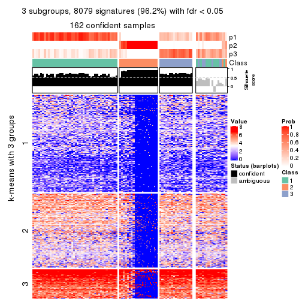</p>

</div>
<div id='tab-MAD-skmeans-get-signatures-no-scale-3'>
<pre><code class="r">get_signatures(res, k = 4, scale_rows = FALSE)
</code></pre>

<p></p>

</div>
<div id='tab-MAD-skmeans-get-signatures-no-scale-4'>
<pre><code class="r">get_signatures(res, k = 5, scale_rows = FALSE)
</code></pre>

<p></p>

</div>
<div id='tab-MAD-skmeans-get-signatures-no-scale-5'>
<pre><code class="r">get_signatures(res, k = 6, scale_rows = FALSE)
</code></pre>

<p></p>

</div>
</div>


Compare the overlap of signatures from different k:

```r
compare_signatures(res)
```


`get_signature()` returns a data frame invisibly. TO get the list of signatures, the function
call should be assigned to a variable explicitly. In following code, if `plot` argument is set
to `FALSE`, no heatmap is plotted while only the differential analysis is performed.

```r
# code only for demonstration
tb = get_signature(res, k = ..., plot = FALSE)
```

An example of the output of `tb` is:

```
#>   which_row         fdr    mean_1    mean_2 scaled_mean_1 scaled_mean_2 km
#> 1        38 0.042760348  8.373488  9.131774    -0.5533452     0.5164555  1
#> 2        40 0.018707592  7.106213  8.469186    -0.6173731     0.5762149  1
#> 3        55 0.019134737 10.221463 11.207825    -0.6159697     0.5749050  1
#> 4        59 0.006059896  5.921854  7.869574    -0.6899429     0.6439467  1
#> 5        60 0.018055526  8.928898 10.211722    -0.6204761     0.5791110  1
#> 6        98 0.009384629 15.714769 14.887706     0.6635654    -0.6193277  2
...
```

The columns in `tb` are:

1. `which_row`: row indices corresponding to the input matrix.
2. `fdr`: FDR for the differential test. 
3. `mean_x`: The mean value in group x.
4. `scaled_mean_x`: The mean value in group x after rows are scaled.
5. `km`: Row groups if k-means clustering is applied to rows.


UMAP plot which shows how samples are separated.


<script>
$( function() {
	$( '#tabs-MAD-skmeans-dimension-reduction' ).tabs();
} );
</script>
<div id='tabs-MAD-skmeans-dimension-reduction'>
<ul>
<li><a href='#tab-MAD-skmeans-dimension-reduction-1'>k = 2</a></li>
<li><a href='#tab-MAD-skmeans-dimension-reduction-2'>k = 3</a></li>
<li><a href='#tab-MAD-skmeans-dimension-reduction-3'>k = 4</a></li>
<li><a href='#tab-MAD-skmeans-dimension-reduction-4'>k = 5</a></li>
<li><a href='#tab-MAD-skmeans-dimension-reduction-5'>k = 6</a></li>
</ul>
<div id='tab-MAD-skmeans-dimension-reduction-1'>
<pre><code class="r">dimension_reduction(res, k = 2, method = &quot;UMAP&quot;)
</code></pre>

<p></p>

</div>
<div id='tab-MAD-skmeans-dimension-reduction-2'>
<pre><code class="r">dimension_reduction(res, k = 3, method = &quot;UMAP&quot;)
</code></pre>

<p></p>

</div>
<div id='tab-MAD-skmeans-dimension-reduction-3'>
<pre><code class="r">dimension_reduction(res, k = 4, method = &quot;UMAP&quot;)
</code></pre>

<p></p>

</div>
<div id='tab-MAD-skmeans-dimension-reduction-4'>
<pre><code class="r">dimension_reduction(res, k = 5, method = &quot;UMAP&quot;)
</code></pre>

<p></p>

</div>
<div id='tab-MAD-skmeans-dimension-reduction-5'>
<pre><code class="r">dimension_reduction(res, k = 6, method = &quot;UMAP&quot;)
</code></pre>

<p></p>

</div>
</div>


Following heatmap shows how subgroups are split when increasing `k`:

```r
collect_classes(res)
```


If matrix rows can be associated to genes, consider to use `GO_Enrichment(res,
...)` to perform function enrichment for the signature genes.


 

---------------------------------------------------


### MAD:pam**


The object with results only for a single top-value method and a single partition method 
can be extracted as:

```r
res = res_list["MAD", "pam"]
# you can also extract it by
# res = res_list["MAD:pam"]
```

A summary of `res` and all the functions that can be applied to it:

```r
res
```

```
#> A 'ConsensusPartition' object with k = 2, 3, 4, 5, 6.
#>   On a matrix with 8394 rows and 194 columns.
#>   Top rows (839, 1678, 2518, 3358, 4197) are extracted by 'MAD' method.
#>   Subgroups are detected by 'pam' method.
#>   Performed in total 1250 partitions by row resampling.
#>   Best k for subgroups seems to be 2.
#> 
#> Following methods can be applied to this 'ConsensusPartition' object:
#>  [1] "cola_report"             "collect_classes"         "collect_plots"          
#>  [4] "collect_stats"           "colnames"                "compare_signatures"     
#>  [7] "consensus_heatmap"       "dimension_reduction"     "functional_enrichment"  
#> [10] "get_anno_col"            "get_anno"                "get_classes"            
#> [13] "get_consensus"           "get_matrix"              "get_membership"         
#> [16] "get_param"               "get_signatures"          "get_stats"              
#> [19] "is_best_k"               "is_stable_k"             "membership_heatmap"     
#> [22] "ncol"                    "nrow"                    "plot_ecdf"              
#> [25] "rownames"                "select_partition_number" "show"                   
#> [28] "suggest_best_k"          "test_to_known_factors"
```

`collect_plots()` function collects all the plots made from `res` for all `k` (number of partitions)
into one single page to provide an easy and fast comparison between different `k`.

```r
collect_plots(res)
```


The plots are:

- The first row: a plot of the ECDF (Empirical cumulative distribution
  function) curves of the consensus matrix for each `k` and the heatmap of
  predicted classes for each `k`.
- The second row: heatmaps of the consensus matrix for each `k`.
- The third row: heatmaps of the membership matrix for each `k`.
- The fouth row: heatmaps of the signatures for each `k`.

All the plots in panels can be made by individual functions and they are
plotted later in this section.

`select_partition_number()` produces several plots showing different
statistics for choosing "optimized" `k`. There are following statistics:

- ECDF curves of the consensus matrix for each `k`;
- 1-PAC. [The PAC
  score](https://en.wikipedia.org/wiki/Consensus_clustering#Over-interpretation_potential_of_consensus_clustering)
  measures the proportion of the ambiguous subgrouping.
- Mean silhouette score.
- Concordance. The mean probability of fiting the consensus class ids in all
  partitions.
- Area increased. Denote $A_k$ as the area under the ECDF curve for current
  `k`, the area increased is defined as $A_k - A_{k-1}$.
- Rand index. The percent of pairs of samples that are both in a same cluster
  or both are not in a same cluster in the partition of k and k-1.
- Jaccard index. The ratio of pairs of samples are both in a same cluster in
  the partition of k and k-1 and the pairs of samples are both in a same
  cluster in the partition k or k-1.

The detailed explanations of these statistics can be found in [the cola
vignette](http://bioconductor.org/packages/devel/bioc/vignettes/cola/inst/doc/cola.html#toc_13).

Generally speaking, lower PAC score, higher mean silhouette score or higher
concordance corresponds to better partition. Rand index and Jaccard index
measure how similar the current partition is compared to partition with `k-1`.
If they are too similar, we won't accept `k` is better than `k-1`.

```r
select_partition_number(res)
```


The numeric values for all these statistics can be obtained by `get_stats()`.

```r
get_stats(res)
```

```
#>   k 1-PAC mean_silhouette concordance area_increased  Rand Jaccard
#> 2 2 1.000           0.987       0.994         0.2427 0.767   0.767
#> 3 3 0.869           0.902       0.954         0.2442 0.982   0.977
#> 4 4 0.657           0.887       0.921         0.1564 0.997   0.997
#> 5 5 0.638           0.858       0.914         0.0752 0.965   0.954
#> 6 6 0.627           0.823       0.908         0.0449 0.983   0.976
```

`suggest_best_k()` suggests the best $k$ based on these statistics. The rules are as follows:

- All $k$ with Jaccard index larger than 0.95 are removed because the increase of
  the partition number does not provides enough extra information. If all $k$ are removed,
  the best $k$ is assigned by `NA`.
- For $k$ with 1-PAC larger than 0.9, the maximal $k$ is taken as the "best k". Other $k$ is called "optional k".
- If it does not fit the second rule. The $k$ with the highest vote of highest
  1-PAC, mean silhouette and concordance is taken as the "best k".

```r
suggest_best_k(res)
```

```
#> [1] 2
```


Following shows the table of the partitions (You need to click the **show/hide
code output** link to see it). The membership matrix (columns with name `p*`)
is inferred by
[`clue::cl_consensus()`](https://www.rdocumentation.org/link/cl_consensus?package=clue)
function with the `SE` method. Basically the value in the membership matrix
represents the probability to belong to a certain group. The finall class
label for an item is determined with the group with highest probability it
belongs to.

In `get_classes()` function, the entropy is calculated from the membership
matrix and the silhouette score is calculated from the consensus matrix.


<script>
$( function() {
	$( '#tabs-MAD-pam-get-classes' ).tabs();
} );
</script>
<div id='tabs-MAD-pam-get-classes'>
<ul>
<li><a href='#tab-MAD-pam-get-classes-1'>k = 2</a></li>
<li><a href='#tab-MAD-pam-get-classes-2'>k = 3</a></li>
<li><a href='#tab-MAD-pam-get-classes-3'>k = 4</a></li>
<li><a href='#tab-MAD-pam-get-classes-4'>k = 5</a></li>
<li><a href='#tab-MAD-pam-get-classes-5'>k = 6</a></li>
</ul>

<div id='tab-MAD-pam-get-classes-1'>
<p><a id='tab-MAD-pam-get-classes-1-a' style='color:#0366d6' href='#'>show/hide code output</a></p>
<pre><code class="r">cbind(get_classes(res, k = 2), get_membership(res, k = 2))
</code></pre>

<pre><code>#&gt;           class entropy silhouette    p1    p2
#&gt; ERR467487     1   0.722      0.757 0.800 0.200
#&gt; ERR467498     1   0.745      0.740 0.788 0.212
#&gt; ERR658998     1   0.000      0.993 1.000 0.000
#&gt; ERR659094     1   0.000      0.993 1.000 0.000
#&gt; ERR658999     1   0.000      0.993 1.000 0.000
#&gt; ERR659095     1   0.000      0.993 1.000 0.000
#&gt; ERR659000     1   0.000      0.993 1.000 0.000
#&gt; ERR659096     1   0.000      0.993 1.000 0.000
#&gt; ERR659001     1   0.000      0.993 1.000 0.000
#&gt; ERR659097     1   0.000      0.993 1.000 0.000
#&gt; ERR659002     1   0.000      0.993 1.000 0.000
#&gt; ERR659098     1   0.000      0.993 1.000 0.000
#&gt; ERR659003     1   0.000      0.993 1.000 0.000
#&gt; ERR659099     1   0.000      0.993 1.000 0.000
#&gt; ERR659004     1   0.000      0.993 1.000 0.000
#&gt; ERR659100     1   0.000      0.993 1.000 0.000
#&gt; ERR659005     1   0.000      0.993 1.000 0.000
#&gt; ERR659101     1   0.000      0.993 1.000 0.000
#&gt; ERR659006     1   0.000      0.993 1.000 0.000
#&gt; ERR659102     1   0.000      0.993 1.000 0.000
#&gt; ERR659007     1   0.000      0.993 1.000 0.000
#&gt; ERR659103     1   0.000      0.993 1.000 0.000
#&gt; ERR659008     2   0.000      1.000 0.000 1.000
#&gt; ERR659104     2   0.000      1.000 0.000 1.000
#&gt; ERR659009     1   0.000      0.993 1.000 0.000
#&gt; ERR659105     1   0.000      0.993 1.000 0.000
#&gt; ERR659010     1   0.000      0.993 1.000 0.000
#&gt; ERR659106     1   0.000      0.993 1.000 0.000
#&gt; ERR659011     1   0.000      0.993 1.000 0.000
#&gt; ERR659107     1   0.000      0.993 1.000 0.000
#&gt; ERR659012     1   0.000      0.993 1.000 0.000
#&gt; ERR659108     1   0.000      0.993 1.000 0.000
#&gt; ERR659013     1   0.000      0.993 1.000 0.000
#&gt; ERR659109     1   0.000      0.993 1.000 0.000
#&gt; ERR659014     2   0.000      1.000 0.000 1.000
#&gt; ERR659110     2   0.000      1.000 0.000 1.000
#&gt; ERR659015     1   0.000      0.993 1.000 0.000
#&gt; ERR659111     1   0.000      0.993 1.000 0.000
#&gt; ERR659016     1   0.000      0.993 1.000 0.000
#&gt; ERR659112     1   0.000      0.993 1.000 0.000
#&gt; ERR659017     2   0.000      1.000 0.000 1.000
#&gt; ERR659113     2   0.000      1.000 0.000 1.000
#&gt; ERR659018     1   0.000      0.993 1.000 0.000
#&gt; ERR659114     1   0.000      0.993 1.000 0.000
#&gt; ERR659019     1   0.000      0.993 1.000 0.000
#&gt; ERR659115     1   0.000      0.993 1.000 0.000
#&gt; ERR659020     1   0.000      0.993 1.000 0.000
#&gt; ERR659116     1   0.000      0.993 1.000 0.000
#&gt; ERR659021     1   0.000      0.993 1.000 0.000
#&gt; ERR659117     1   0.000      0.993 1.000 0.000
#&gt; ERR659022     1   0.000      0.993 1.000 0.000
#&gt; ERR659118     1   0.000      0.993 1.000 0.000
#&gt; ERR659023     1   0.000      0.993 1.000 0.000
#&gt; ERR659119     1   0.000      0.993 1.000 0.000
#&gt; ERR659024     1   0.000      0.993 1.000 0.000
#&gt; ERR659120     1   0.000      0.993 1.000 0.000
#&gt; ERR659025     1   0.000      0.993 1.000 0.000
#&gt; ERR659121     1   0.000      0.993 1.000 0.000
#&gt; ERR659026     1   0.000      0.993 1.000 0.000
#&gt; ERR659122     1   0.000      0.993 1.000 0.000
#&gt; ERR659027     1   0.000      0.993 1.000 0.000
#&gt; ERR659123     1   0.000      0.993 1.000 0.000
#&gt; ERR659028     1   0.000      0.993 1.000 0.000
#&gt; ERR659124     1   0.000      0.993 1.000 0.000
#&gt; ERR659029     1   0.000      0.993 1.000 0.000
#&gt; ERR659125     1   0.000      0.993 1.000 0.000
#&gt; ERR659030     1   0.000      0.993 1.000 0.000
#&gt; ERR659126     1   0.000      0.993 1.000 0.000
#&gt; ERR659031     1   0.000      0.993 1.000 0.000
#&gt; ERR659127     1   0.000      0.993 1.000 0.000
#&gt; ERR659032     1   0.000      0.993 1.000 0.000
#&gt; ERR659128     1   0.000      0.993 1.000 0.000
#&gt; ERR659033     1   0.000      0.993 1.000 0.000
#&gt; ERR659129     1   0.000      0.993 1.000 0.000
#&gt; ERR659034     2   0.000      1.000 0.000 1.000
#&gt; ERR659130     2   0.000      1.000 0.000 1.000
#&gt; ERR659035     1   0.000      0.993 1.000 0.000
#&gt; ERR659131     1   0.000      0.993 1.000 0.000
#&gt; ERR659036     1   0.000      0.993 1.000 0.000
#&gt; ERR659132     1   0.000      0.993 1.000 0.000
#&gt; ERR659037     1   0.000      0.993 1.000 0.000
#&gt; ERR659133     1   0.000      0.993 1.000 0.000
#&gt; ERR659038     1   0.000      0.993 1.000 0.000
#&gt; ERR659134     1   0.000      0.993 1.000 0.000
#&gt; ERR659039     1   0.000      0.993 1.000 0.000
#&gt; ERR659135     1   0.000      0.993 1.000 0.000
#&gt; ERR659040     1   0.000      0.993 1.000 0.000
#&gt; ERR659136     1   0.000      0.993 1.000 0.000
#&gt; ERR659041     1   0.000      0.993 1.000 0.000
#&gt; ERR659137     1   0.000      0.993 1.000 0.000
#&gt; ERR659042     1   0.000      0.993 1.000 0.000
#&gt; ERR659138     1   0.000      0.993 1.000 0.000
#&gt; ERR659043     1   0.000      0.993 1.000 0.000
#&gt; ERR659139     1   0.000      0.993 1.000 0.000
#&gt; ERR659044     2   0.000      1.000 0.000 1.000
#&gt; ERR659140     2   0.000      1.000 0.000 1.000
#&gt; ERR659045     1   0.000      0.993 1.000 0.000
#&gt; ERR659141     1   0.000      0.993 1.000 0.000
#&gt; ERR659046     1   0.000      0.993 1.000 0.000
#&gt; ERR659142     1   0.000      0.993 1.000 0.000
#&gt; ERR659047     1   0.000      0.993 1.000 0.000
#&gt; ERR659143     1   0.000      0.993 1.000 0.000
#&gt; ERR659048     1   0.000      0.993 1.000 0.000
#&gt; ERR659144     1   0.000      0.993 1.000 0.000
#&gt; ERR659049     1   0.000      0.993 1.000 0.000
#&gt; ERR659145     1   0.000      0.993 1.000 0.000
#&gt; ERR659050     1   0.000      0.993 1.000 0.000
#&gt; ERR659146     1   0.000      0.993 1.000 0.000
#&gt; ERR659051     1   0.745      0.740 0.788 0.212
#&gt; ERR659147     1   0.745      0.740 0.788 0.212
#&gt; ERR659052     1   0.000      0.993 1.000 0.000
#&gt; ERR659148     1   0.000      0.993 1.000 0.000
#&gt; ERR659053     1   0.000      0.993 1.000 0.000
#&gt; ERR659149     1   0.000      0.993 1.000 0.000
#&gt; ERR659054     2   0.000      1.000 0.000 1.000
#&gt; ERR659150     2   0.000      1.000 0.000 1.000
#&gt; ERR659055     1   0.000      0.993 1.000 0.000
#&gt; ERR659151     1   0.000      0.993 1.000 0.000
#&gt; ERR659056     1   0.662      0.797 0.828 0.172
#&gt; ERR659152     1   0.680      0.786 0.820 0.180
#&gt; ERR659057     1   0.000      0.993 1.000 0.000
#&gt; ERR659153     1   0.000      0.993 1.000 0.000
#&gt; ERR659058     1   0.000      0.993 1.000 0.000
#&gt; ERR659154     1   0.000      0.993 1.000 0.000
#&gt; ERR659059     1   0.000      0.993 1.000 0.000
#&gt; ERR659155     1   0.000      0.993 1.000 0.000
#&gt; ERR659060     1   0.000      0.993 1.000 0.000
#&gt; ERR659156     1   0.000      0.993 1.000 0.000
#&gt; ERR659061     1   0.000      0.993 1.000 0.000
#&gt; ERR659157     1   0.000      0.993 1.000 0.000
#&gt; ERR659062     1   0.000      0.993 1.000 0.000
#&gt; ERR659158     1   0.000      0.993 1.000 0.000
#&gt; ERR659063     1   0.000      0.993 1.000 0.000
#&gt; ERR659159     1   0.000      0.993 1.000 0.000
#&gt; ERR659064     1   0.000      0.993 1.000 0.000
#&gt; ERR659160     1   0.000      0.993 1.000 0.000
#&gt; ERR659065     2   0.000      1.000 0.000 1.000
#&gt; ERR659161     2   0.000      1.000 0.000 1.000
#&gt; ERR659066     1   0.000      0.993 1.000 0.000
#&gt; ERR659162     1   0.000      0.993 1.000 0.000
#&gt; ERR659067     1   0.000      0.993 1.000 0.000
#&gt; ERR659163     1   0.000      0.993 1.000 0.000
#&gt; ERR659068     2   0.000      1.000 0.000 1.000
#&gt; ERR659164     2   0.000      1.000 0.000 1.000
#&gt; ERR659069     1   0.000      0.993 1.000 0.000
#&gt; ERR659165     1   0.000      0.993 1.000 0.000
#&gt; ERR659070     1   0.000      0.993 1.000 0.000
#&gt; ERR659166     1   0.000      0.993 1.000 0.000
#&gt; ERR659071     1   0.000      0.993 1.000 0.000
#&gt; ERR659167     1   0.000      0.993 1.000 0.000
#&gt; ERR659072     1   0.000      0.993 1.000 0.000
#&gt; ERR659168     1   0.000      0.993 1.000 0.000
#&gt; ERR659073     1   0.000      0.993 1.000 0.000
#&gt; ERR659169     1   0.000      0.993 1.000 0.000
#&gt; ERR659074     2   0.000      1.000 0.000 1.000
#&gt; ERR659170     2   0.000      1.000 0.000 1.000
#&gt; ERR659075     2   0.000      1.000 0.000 1.000
#&gt; ERR659171     2   0.000      1.000 0.000 1.000
#&gt; ERR659076     2   0.000      1.000 0.000 1.000
#&gt; ERR659172     2   0.000      1.000 0.000 1.000
#&gt; ERR659077     1   0.000      0.993 1.000 0.000
#&gt; ERR659173     1   0.000      0.993 1.000 0.000
#&gt; ERR659078     1   0.000      0.993 1.000 0.000
#&gt; ERR659174     1   0.000      0.993 1.000 0.000
#&gt; ERR659079     1   0.000      0.993 1.000 0.000
#&gt; ERR659175     1   0.000      0.993 1.000 0.000
#&gt; ERR659080     1   0.000      0.993 1.000 0.000
#&gt; ERR659176     1   0.000      0.993 1.000 0.000
#&gt; ERR659081     1   0.000      0.993 1.000 0.000
#&gt; ERR659177     1   0.000      0.993 1.000 0.000
#&gt; ERR659082     1   0.000      0.993 1.000 0.000
#&gt; ERR659178     1   0.000      0.993 1.000 0.000
#&gt; ERR659083     2   0.000      1.000 0.000 1.000
#&gt; ERR659179     2   0.000      1.000 0.000 1.000
#&gt; ERR659084     2   0.000      1.000 0.000 1.000
#&gt; ERR659180     2   0.000      1.000 0.000 1.000
#&gt; ERR659085     1   0.000      0.993 1.000 0.000
#&gt; ERR659181     1   0.000      0.993 1.000 0.000
#&gt; ERR659086     1   0.000      0.993 1.000 0.000
#&gt; ERR659182     1   0.000      0.993 1.000 0.000
#&gt; ERR659087     1   0.000      0.993 1.000 0.000
#&gt; ERR659183     1   0.000      0.993 1.000 0.000
#&gt; ERR659088     1   0.000      0.993 1.000 0.000
#&gt; ERR659184     1   0.000      0.993 1.000 0.000
#&gt; ERR659089     1   0.000      0.993 1.000 0.000
#&gt; ERR659185     1   0.000      0.993 1.000 0.000
#&gt; ERR659090     1   0.000      0.993 1.000 0.000
#&gt; ERR659186     1   0.000      0.993 1.000 0.000
#&gt; ERR659091     1   0.000      0.993 1.000 0.000
#&gt; ERR659187     1   0.000      0.993 1.000 0.000
#&gt; ERR659092     1   0.000      0.993 1.000 0.000
#&gt; ERR659188     1   0.000      0.993 1.000 0.000
#&gt; ERR659093     1   0.000      0.993 1.000 0.000
#&gt; ERR659189     1   0.000      0.993 1.000 0.000
</code></pre>

<script>
$('#tab-MAD-pam-get-classes-1-a').parent().next().next().hide();
$('#tab-MAD-pam-get-classes-1-a').click(function(){
  $('#tab-MAD-pam-get-classes-1-a').parent().next().next().toggle();
  return(false);
});
</script>
</div>

<div id='tab-MAD-pam-get-classes-2'>
<p><a id='tab-MAD-pam-get-classes-2-a' style='color:#0366d6' href='#'>show/hide code output</a></p>
<pre><code class="r">cbind(get_classes(res, k = 3), get_membership(res, k = 3))
</code></pre>

<pre><code>#&gt;           class entropy silhouette    p1    p2    p3
#&gt; ERR467487     1  0.8578     -0.349 0.504 0.100 0.396
#&gt; ERR467498     1  0.8578     -0.349 0.504 0.100 0.396
#&gt; ERR658998     1  0.0892      0.940 0.980 0.000 0.020
#&gt; ERR659094     1  0.1163      0.937 0.972 0.000 0.028
#&gt; ERR658999     1  0.2959      0.896 0.900 0.000 0.100
#&gt; ERR659095     1  0.2959      0.896 0.900 0.000 0.100
#&gt; ERR659000     1  0.0592      0.937 0.988 0.000 0.012
#&gt; ERR659096     1  0.0592      0.937 0.988 0.000 0.012
#&gt; ERR659001     1  0.0000      0.942 1.000 0.000 0.000
#&gt; ERR659097     1  0.0000      0.942 1.000 0.000 0.000
#&gt; ERR659002     1  0.0000      0.942 1.000 0.000 0.000
#&gt; ERR659098     1  0.0000      0.942 1.000 0.000 0.000
#&gt; ERR659003     1  0.0000      0.942 1.000 0.000 0.000
#&gt; ERR659099     1  0.0000      0.942 1.000 0.000 0.000
#&gt; ERR659004     1  0.3412      0.874 0.876 0.000 0.124
#&gt; ERR659100     1  0.3619      0.860 0.864 0.000 0.136
#&gt; ERR659005     1  0.0000      0.942 1.000 0.000 0.000
#&gt; ERR659101     1  0.0000      0.942 1.000 0.000 0.000
#&gt; ERR659006     1  0.2959      0.896 0.900 0.000 0.100
#&gt; ERR659102     1  0.2959      0.896 0.900 0.000 0.100
#&gt; ERR659007     1  0.0000      0.942 1.000 0.000 0.000
#&gt; ERR659103     1  0.0000      0.942 1.000 0.000 0.000
#&gt; ERR659008     2  0.0000      0.983 0.000 1.000 0.000
#&gt; ERR659104     2  0.0000      0.983 0.000 1.000 0.000
#&gt; ERR659009     1  0.2959      0.896 0.900 0.000 0.100
#&gt; ERR659105     1  0.2959      0.896 0.900 0.000 0.100
#&gt; ERR659010     1  0.2537      0.911 0.920 0.000 0.080
#&gt; ERR659106     1  0.2448      0.914 0.924 0.000 0.076
#&gt; ERR659011     1  0.2959      0.896 0.900 0.000 0.100
#&gt; ERR659107     1  0.2959      0.896 0.900 0.000 0.100
#&gt; ERR659012     1  0.2261      0.919 0.932 0.000 0.068
#&gt; ERR659108     1  0.2066      0.923 0.940 0.000 0.060
#&gt; ERR659013     1  0.0000      0.942 1.000 0.000 0.000
#&gt; ERR659109     1  0.0000      0.942 1.000 0.000 0.000
#&gt; ERR659014     2  0.0000      0.983 0.000 1.000 0.000
#&gt; ERR659110     2  0.0000      0.983 0.000 1.000 0.000
#&gt; ERR659015     1  0.0000      0.942 1.000 0.000 0.000
#&gt; ERR659111     1  0.0000      0.942 1.000 0.000 0.000
#&gt; ERR659016     1  0.3038      0.834 0.896 0.000 0.104
#&gt; ERR659112     1  0.3038      0.834 0.896 0.000 0.104
#&gt; ERR659017     2  0.0000      0.983 0.000 1.000 0.000
#&gt; ERR659113     2  0.0000      0.983 0.000 1.000 0.000
#&gt; ERR659018     1  0.2959      0.896 0.900 0.000 0.100
#&gt; ERR659114     1  0.2959      0.896 0.900 0.000 0.100
#&gt; ERR659019     1  0.2796      0.903 0.908 0.000 0.092
#&gt; ERR659115     1  0.2448      0.914 0.924 0.000 0.076
#&gt; ERR659020     1  0.0000      0.942 1.000 0.000 0.000
#&gt; ERR659116     1  0.0000      0.942 1.000 0.000 0.000
#&gt; ERR659021     1  0.0000      0.942 1.000 0.000 0.000
#&gt; ERR659117     1  0.0000      0.942 1.000 0.000 0.000
#&gt; ERR659022     1  0.0000      0.942 1.000 0.000 0.000
#&gt; ERR659118     1  0.0000      0.942 1.000 0.000 0.000
#&gt; ERR659023     1  0.0000      0.942 1.000 0.000 0.000
#&gt; ERR659119     1  0.0000      0.942 1.000 0.000 0.000
#&gt; ERR659024     1  0.0000      0.942 1.000 0.000 0.000
#&gt; ERR659120     1  0.0000      0.942 1.000 0.000 0.000
#&gt; ERR659025     1  0.0000      0.942 1.000 0.000 0.000
#&gt; ERR659121     1  0.0000      0.942 1.000 0.000 0.000
#&gt; ERR659026     1  0.1411      0.934 0.964 0.000 0.036
#&gt; ERR659122     1  0.1860      0.927 0.948 0.000 0.052
#&gt; ERR659027     1  0.3752      0.846 0.856 0.000 0.144
#&gt; ERR659123     1  0.3412      0.866 0.876 0.000 0.124
#&gt; ERR659028     1  0.0237      0.942 0.996 0.000 0.004
#&gt; ERR659124     1  0.0237      0.942 0.996 0.000 0.004
#&gt; ERR659029     1  0.0000      0.942 1.000 0.000 0.000
#&gt; ERR659125     1  0.0424      0.942 0.992 0.000 0.008
#&gt; ERR659030     1  0.0000      0.942 1.000 0.000 0.000
#&gt; ERR659126     1  0.0000      0.942 1.000 0.000 0.000
#&gt; ERR659031     1  0.0000      0.942 1.000 0.000 0.000
#&gt; ERR659127     1  0.0000      0.942 1.000 0.000 0.000
#&gt; ERR659032     1  0.0237      0.942 0.996 0.000 0.004
#&gt; ERR659128     1  0.0000      0.942 1.000 0.000 0.000
#&gt; ERR659033     1  0.0000      0.942 1.000 0.000 0.000
#&gt; ERR659129     1  0.0000      0.942 1.000 0.000 0.000
#&gt; ERR659034     2  0.0000      0.983 0.000 1.000 0.000
#&gt; ERR659130     2  0.0000      0.983 0.000 1.000 0.000
#&gt; ERR659035     1  0.0000      0.942 1.000 0.000 0.000
#&gt; ERR659131     1  0.0000      0.942 1.000 0.000 0.000
#&gt; ERR659036     1  0.0592      0.942 0.988 0.000 0.012
#&gt; ERR659132     1  0.0747      0.941 0.984 0.000 0.016
#&gt; ERR659037     1  0.2537      0.911 0.920 0.000 0.080
#&gt; ERR659133     1  0.2625      0.908 0.916 0.000 0.084
#&gt; ERR659038     1  0.2959      0.896 0.900 0.000 0.100
#&gt; ERR659134     1  0.2959      0.896 0.900 0.000 0.100
#&gt; ERR659039     1  0.1964      0.925 0.944 0.000 0.056
#&gt; ERR659135     1  0.2066      0.923 0.940 0.000 0.060
#&gt; ERR659040     1  0.0892      0.932 0.980 0.000 0.020
#&gt; ERR659136     1  0.0237      0.941 0.996 0.000 0.004
#&gt; ERR659041     1  0.1289      0.928 0.968 0.000 0.032
#&gt; ERR659137     1  0.1031      0.934 0.976 0.000 0.024
#&gt; ERR659042     1  0.0592      0.937 0.988 0.000 0.012
#&gt; ERR659138     1  0.0592      0.937 0.988 0.000 0.012
#&gt; ERR659043     1  0.0000      0.942 1.000 0.000 0.000
#&gt; ERR659139     1  0.0000      0.942 1.000 0.000 0.000
#&gt; ERR659044     2  0.0000      0.983 0.000 1.000 0.000
#&gt; ERR659140     2  0.0000      0.983 0.000 1.000 0.000
#&gt; ERR659045     1  0.0237      0.942 0.996 0.000 0.004
#&gt; ERR659141     1  0.0237      0.942 0.996 0.000 0.004
#&gt; ERR659046     1  0.0000      0.942 1.000 0.000 0.000
#&gt; ERR659142     1  0.0000      0.942 1.000 0.000 0.000
#&gt; ERR659047     1  0.2261      0.919 0.932 0.000 0.068
#&gt; ERR659143     1  0.2356      0.917 0.928 0.000 0.072
#&gt; ERR659048     1  0.0000      0.942 1.000 0.000 0.000
#&gt; ERR659144     1  0.0000      0.942 1.000 0.000 0.000
#&gt; ERR659049     1  0.1031      0.939 0.976 0.000 0.024
#&gt; ERR659145     1  0.0747      0.941 0.984 0.000 0.016
#&gt; ERR659050     1  0.0000      0.942 1.000 0.000 0.000
#&gt; ERR659146     1  0.0000      0.942 1.000 0.000 0.000
#&gt; ERR659051     3  0.7515      1.000 0.220 0.100 0.680
#&gt; ERR659147     3  0.7515      1.000 0.220 0.100 0.680
#&gt; ERR659052     1  0.0592      0.942 0.988 0.000 0.012
#&gt; ERR659148     1  0.0747      0.941 0.984 0.000 0.016
#&gt; ERR659053     1  0.0000      0.942 1.000 0.000 0.000
#&gt; ERR659149     1  0.0000      0.942 1.000 0.000 0.000
#&gt; ERR659054     2  0.0000      0.983 0.000 1.000 0.000
#&gt; ERR659150     2  0.0000      0.983 0.000 1.000 0.000
#&gt; ERR659055     1  0.0237      0.942 0.996 0.000 0.004
#&gt; ERR659151     1  0.0424      0.942 0.992 0.000 0.008
#&gt; ERR659056     1  0.8373     -0.285 0.524 0.088 0.388
#&gt; ERR659152     1  0.8457     -0.327 0.512 0.092 0.396
#&gt; ERR659057     1  0.0592      0.942 0.988 0.000 0.012
#&gt; ERR659153     1  0.0592      0.942 0.988 0.000 0.012
#&gt; ERR659058     1  0.2959      0.896 0.900 0.000 0.100
#&gt; ERR659154     1  0.2959      0.896 0.900 0.000 0.100
#&gt; ERR659059     1  0.2066      0.923 0.940 0.000 0.060
#&gt; ERR659155     1  0.2356      0.916 0.928 0.000 0.072
#&gt; ERR659060     1  0.0000      0.942 1.000 0.000 0.000
#&gt; ERR659156     1  0.0000      0.942 1.000 0.000 0.000
#&gt; ERR659061     1  0.0000      0.942 1.000 0.000 0.000
#&gt; ERR659157     1  0.0000      0.942 1.000 0.000 0.000
#&gt; ERR659062     1  0.0000      0.942 1.000 0.000 0.000
#&gt; ERR659158     1  0.0000      0.942 1.000 0.000 0.000
#&gt; ERR659063     1  0.0000      0.942 1.000 0.000 0.000
#&gt; ERR659159     1  0.0000      0.942 1.000 0.000 0.000
#&gt; ERR659064     1  0.0237      0.942 0.996 0.000 0.004
#&gt; ERR659160     1  0.0000      0.942 1.000 0.000 0.000
#&gt; ERR659065     2  0.0000      0.983 0.000 1.000 0.000
#&gt; ERR659161     2  0.0000      0.983 0.000 1.000 0.000
#&gt; ERR659066     1  0.2448      0.914 0.924 0.000 0.076
#&gt; ERR659162     1  0.2711      0.905 0.912 0.000 0.088
#&gt; ERR659067     1  0.2711      0.905 0.912 0.000 0.088
#&gt; ERR659163     1  0.2959      0.896 0.900 0.000 0.100
#&gt; ERR659068     2  0.0000      0.983 0.000 1.000 0.000
#&gt; ERR659164     2  0.0000      0.983 0.000 1.000 0.000
#&gt; ERR659069     1  0.2959      0.896 0.900 0.000 0.100
#&gt; ERR659165     1  0.2959      0.896 0.900 0.000 0.100
#&gt; ERR659070     1  0.0000      0.942 1.000 0.000 0.000
#&gt; ERR659166     1  0.0000      0.942 1.000 0.000 0.000
#&gt; ERR659071     1  0.0592      0.942 0.988 0.000 0.012
#&gt; ERR659167     1  0.1289      0.936 0.968 0.000 0.032
#&gt; ERR659072     1  0.2878      0.899 0.904 0.000 0.096
#&gt; ERR659168     1  0.2796      0.902 0.908 0.000 0.092
#&gt; ERR659073     1  0.2878      0.899 0.904 0.000 0.096
#&gt; ERR659169     1  0.2796      0.902 0.908 0.000 0.092
#&gt; ERR659074     2  0.0000      0.983 0.000 1.000 0.000
#&gt; ERR659170     2  0.0000      0.983 0.000 1.000 0.000
#&gt; ERR659075     2  0.4931      0.767 0.000 0.768 0.232
#&gt; ERR659171     2  0.4974      0.763 0.000 0.764 0.236
#&gt; ERR659076     2  0.0000      0.983 0.000 1.000 0.000
#&gt; ERR659172     2  0.0000      0.983 0.000 1.000 0.000
#&gt; ERR659077     1  0.0237      0.942 0.996 0.000 0.004
#&gt; ERR659173     1  0.0237      0.942 0.996 0.000 0.004
#&gt; ERR659078     1  0.0592      0.942 0.988 0.000 0.012
#&gt; ERR659174     1  0.0424      0.942 0.992 0.000 0.008
#&gt; ERR659079     1  0.0424      0.942 0.992 0.000 0.008
#&gt; ERR659175     1  0.0592      0.942 0.988 0.000 0.012
#&gt; ERR659080     1  0.5760      0.336 0.672 0.000 0.328
#&gt; ERR659176     1  0.5760      0.336 0.672 0.000 0.328
#&gt; ERR659081     1  0.1163      0.937 0.972 0.000 0.028
#&gt; ERR659177     1  0.1031      0.939 0.976 0.000 0.024
#&gt; ERR659082     1  0.2356      0.917 0.928 0.000 0.072
#&gt; ERR659178     1  0.2356      0.917 0.928 0.000 0.072
#&gt; ERR659083     2  0.0000      0.983 0.000 1.000 0.000
#&gt; ERR659179     2  0.0000      0.983 0.000 1.000 0.000
#&gt; ERR659084     2  0.0000      0.983 0.000 1.000 0.000
#&gt; ERR659180     2  0.0000      0.983 0.000 1.000 0.000
#&gt; ERR659085     1  0.2261      0.919 0.932 0.000 0.068
#&gt; ERR659181     1  0.2261      0.919 0.932 0.000 0.068
#&gt; ERR659086     1  0.1163      0.937 0.972 0.000 0.028
#&gt; ERR659182     1  0.0892      0.940 0.980 0.000 0.020
#&gt; ERR659087     1  0.2959      0.896 0.900 0.000 0.100
#&gt; ERR659183     1  0.2959      0.896 0.900 0.000 0.100
#&gt; ERR659088     1  0.0237      0.941 0.996 0.000 0.004
#&gt; ERR659184     1  0.0237      0.941 0.996 0.000 0.004
#&gt; ERR659089     1  0.0424      0.942 0.992 0.000 0.008
#&gt; ERR659185     1  0.0000      0.942 1.000 0.000 0.000
#&gt; ERR659090     1  0.0424      0.942 0.992 0.000 0.008
#&gt; ERR659186     1  0.0424      0.942 0.992 0.000 0.008
#&gt; ERR659091     1  0.0237      0.942 0.996 0.000 0.004
#&gt; ERR659187     1  0.0237      0.942 0.996 0.000 0.004
#&gt; ERR659092     1  0.0000      0.942 1.000 0.000 0.000
#&gt; ERR659188     1  0.0000      0.942 1.000 0.000 0.000
#&gt; ERR659093     1  0.1753      0.929 0.952 0.000 0.048
#&gt; ERR659189     1  0.1643      0.931 0.956 0.000 0.044
</code></pre>

<script>
$('#tab-MAD-pam-get-classes-2-a').parent().next().next().hide();
$('#tab-MAD-pam-get-classes-2-a').click(function(){
  $('#tab-MAD-pam-get-classes-2-a').parent().next().next().toggle();
  return(false);
});
</script>
</div>

<div id='tab-MAD-pam-get-classes-3'>
<p><a id='tab-MAD-pam-get-classes-3-a' style='color:#0366d6' href='#'>show/hide code output</a></p>
<pre><code class="r">cbind(get_classes(res, k = 4), get_membership(res, k = 4))
</code></pre>

<pre><code>#&gt;           class entropy silhouette    p1    p2    p3    p4
#&gt; ERR467487     1  0.6615      0.269 0.512 0.000 0.084 0.404
#&gt; ERR467498     1  0.6615      0.269 0.512 0.000 0.084 0.404
#&gt; ERR658998     1  0.1474      0.911 0.948 0.000 0.052 0.000
#&gt; ERR659094     1  0.1792      0.905 0.932 0.000 0.068 0.000
#&gt; ERR658999     1  0.4250      0.771 0.724 0.000 0.276 0.000
#&gt; ERR659095     1  0.4250      0.771 0.724 0.000 0.276 0.000
#&gt; ERR659000     1  0.0592      0.918 0.984 0.000 0.000 0.016
#&gt; ERR659096     1  0.0469      0.919 0.988 0.000 0.000 0.012
#&gt; ERR659001     1  0.0000      0.919 1.000 0.000 0.000 0.000
#&gt; ERR659097     1  0.0000      0.919 1.000 0.000 0.000 0.000
#&gt; ERR659002     1  0.0000      0.919 1.000 0.000 0.000 0.000
#&gt; ERR659098     1  0.0000      0.919 1.000 0.000 0.000 0.000
#&gt; ERR659003     1  0.0000      0.919 1.000 0.000 0.000 0.000
#&gt; ERR659099     1  0.0000      0.919 1.000 0.000 0.000 0.000
#&gt; ERR659004     1  0.4250      0.771 0.724 0.000 0.276 0.000
#&gt; ERR659100     1  0.4222      0.775 0.728 0.000 0.272 0.000
#&gt; ERR659005     1  0.0000      0.919 1.000 0.000 0.000 0.000
#&gt; ERR659101     1  0.0000      0.919 1.000 0.000 0.000 0.000
#&gt; ERR659006     1  0.4250      0.771 0.724 0.000 0.276 0.000
#&gt; ERR659102     1  0.4250      0.771 0.724 0.000 0.276 0.000
#&gt; ERR659007     1  0.0000      0.919 1.000 0.000 0.000 0.000
#&gt; ERR659103     1  0.0000      0.919 1.000 0.000 0.000 0.000
#&gt; ERR659008     2  0.0000      1.000 0.000 1.000 0.000 0.000
#&gt; ERR659104     2  0.0000      1.000 0.000 1.000 0.000 0.000
#&gt; ERR659009     1  0.4250      0.771 0.724 0.000 0.276 0.000
#&gt; ERR659105     1  0.4222      0.775 0.728 0.000 0.272 0.000
#&gt; ERR659010     1  0.3688      0.827 0.792 0.000 0.208 0.000
#&gt; ERR659106     1  0.3486      0.841 0.812 0.000 0.188 0.000
#&gt; ERR659011     1  0.4250      0.771 0.724 0.000 0.276 0.000
#&gt; ERR659107     1  0.4250      0.771 0.724 0.000 0.276 0.000
#&gt; ERR659012     1  0.2973      0.870 0.856 0.000 0.144 0.000
#&gt; ERR659108     1  0.2589      0.885 0.884 0.000 0.116 0.000
#&gt; ERR659013     1  0.0000      0.919 1.000 0.000 0.000 0.000
#&gt; ERR659109     1  0.0000      0.919 1.000 0.000 0.000 0.000
#&gt; ERR659014     2  0.0000      1.000 0.000 1.000 0.000 0.000
#&gt; ERR659110     2  0.0000      1.000 0.000 1.000 0.000 0.000
#&gt; ERR659015     1  0.0000      0.919 1.000 0.000 0.000 0.000
#&gt; ERR659111     1  0.0000      0.919 1.000 0.000 0.000 0.000
#&gt; ERR659016     1  0.3649      0.807 0.796 0.000 0.000 0.204
#&gt; ERR659112     1  0.3610      0.811 0.800 0.000 0.000 0.200
#&gt; ERR659017     2  0.0000      1.000 0.000 1.000 0.000 0.000
#&gt; ERR659113     2  0.0000      1.000 0.000 1.000 0.000 0.000
#&gt; ERR659018     1  0.4250      0.771 0.724 0.000 0.276 0.000
#&gt; ERR659114     1  0.4250      0.771 0.724 0.000 0.276 0.000
#&gt; ERR659019     1  0.3726      0.824 0.788 0.000 0.212 0.000
#&gt; ERR659115     1  0.3266      0.853 0.832 0.000 0.168 0.000
#&gt; ERR659020     1  0.0000      0.919 1.000 0.000 0.000 0.000
#&gt; ERR659116     1  0.0188      0.920 0.996 0.000 0.004 0.000
#&gt; ERR659021     1  0.0000      0.919 1.000 0.000 0.000 0.000
#&gt; ERR659117     1  0.0000      0.919 1.000 0.000 0.000 0.000
#&gt; ERR659022     1  0.0000      0.919 1.000 0.000 0.000 0.000
#&gt; ERR659118     1  0.0000      0.919 1.000 0.000 0.000 0.000
#&gt; ERR659023     1  0.0000      0.919 1.000 0.000 0.000 0.000
#&gt; ERR659119     1  0.0000      0.919 1.000 0.000 0.000 0.000
#&gt; ERR659024     1  0.0000      0.919 1.000 0.000 0.000 0.000
#&gt; ERR659120     1  0.0000      0.919 1.000 0.000 0.000 0.000
#&gt; ERR659025     1  0.0469      0.919 0.988 0.000 0.000 0.012
#&gt; ERR659121     1  0.0000      0.919 1.000 0.000 0.000 0.000
#&gt; ERR659026     1  0.2011      0.900 0.920 0.000 0.080 0.000
#&gt; ERR659122     1  0.2530      0.886 0.888 0.000 0.112 0.000
#&gt; ERR659027     1  0.4100      0.856 0.832 0.000 0.092 0.076
#&gt; ERR659123     1  0.3761      0.869 0.852 0.000 0.080 0.068
#&gt; ERR659028     1  0.0336      0.920 0.992 0.000 0.008 0.000
#&gt; ERR659124     1  0.0336      0.920 0.992 0.000 0.008 0.000
#&gt; ERR659029     1  0.0000      0.919 1.000 0.000 0.000 0.000
#&gt; ERR659125     1  0.0336      0.920 0.992 0.000 0.008 0.000
#&gt; ERR659030     1  0.0188      0.920 0.996 0.000 0.004 0.000
#&gt; ERR659126     1  0.0000      0.919 1.000 0.000 0.000 0.000
#&gt; ERR659031     1  0.0000      0.919 1.000 0.000 0.000 0.000
#&gt; ERR659127     1  0.0000      0.919 1.000 0.000 0.000 0.000
#&gt; ERR659032     1  0.0188      0.920 0.996 0.000 0.004 0.000
#&gt; ERR659128     1  0.0000      0.919 1.000 0.000 0.000 0.000
#&gt; ERR659033     1  0.0000      0.919 1.000 0.000 0.000 0.000
#&gt; ERR659129     1  0.0000      0.919 1.000 0.000 0.000 0.000
#&gt; ERR659034     2  0.0000      1.000 0.000 1.000 0.000 0.000
#&gt; ERR659130     2  0.0000      1.000 0.000 1.000 0.000 0.000
#&gt; ERR659035     1  0.0000      0.919 1.000 0.000 0.000 0.000
#&gt; ERR659131     1  0.0000      0.919 1.000 0.000 0.000 0.000
#&gt; ERR659036     1  0.0469      0.920 0.988 0.000 0.012 0.000
#&gt; ERR659132     1  0.0707      0.919 0.980 0.000 0.020 0.000
#&gt; ERR659037     1  0.2589      0.886 0.884 0.000 0.116 0.000
#&gt; ERR659133     1  0.2921      0.874 0.860 0.000 0.140 0.000
#&gt; ERR659038     1  0.4250      0.771 0.724 0.000 0.276 0.000
#&gt; ERR659134     1  0.4250      0.771 0.724 0.000 0.276 0.000
#&gt; ERR659039     1  0.2011      0.901 0.920 0.000 0.080 0.000
#&gt; ERR659135     1  0.2281      0.894 0.904 0.000 0.096 0.000
#&gt; ERR659040     1  0.1118      0.912 0.964 0.000 0.000 0.036
#&gt; ERR659136     1  0.0469      0.919 0.988 0.000 0.000 0.012
#&gt; ERR659041     1  0.2197      0.898 0.928 0.000 0.024 0.048
#&gt; ERR659137     1  0.1733      0.906 0.948 0.000 0.024 0.028
#&gt; ERR659042     1  0.0469      0.919 0.988 0.000 0.000 0.012
#&gt; ERR659138     1  0.0469      0.919 0.988 0.000 0.000 0.012
#&gt; ERR659043     1  0.0000      0.919 1.000 0.000 0.000 0.000
#&gt; ERR659139     1  0.0000      0.919 1.000 0.000 0.000 0.000
#&gt; ERR659044     2  0.0000      1.000 0.000 1.000 0.000 0.000
#&gt; ERR659140     2  0.0000      1.000 0.000 1.000 0.000 0.000
#&gt; ERR659045     1  0.0188      0.920 0.996 0.000 0.004 0.000
#&gt; ERR659141     1  0.0188      0.920 0.996 0.000 0.004 0.000
#&gt; ERR659046     1  0.0000      0.919 1.000 0.000 0.000 0.000
#&gt; ERR659142     1  0.0000      0.919 1.000 0.000 0.000 0.000
#&gt; ERR659047     1  0.2814      0.878 0.868 0.000 0.132 0.000
#&gt; ERR659143     1  0.2868      0.876 0.864 0.000 0.136 0.000
#&gt; ERR659048     1  0.0000      0.919 1.000 0.000 0.000 0.000
#&gt; ERR659144     1  0.0000      0.919 1.000 0.000 0.000 0.000
#&gt; ERR659049     1  0.1716      0.907 0.936 0.000 0.064 0.000
#&gt; ERR659145     1  0.1211      0.915 0.960 0.000 0.040 0.000
#&gt; ERR659050     1  0.0000      0.919 1.000 0.000 0.000 0.000
#&gt; ERR659146     1  0.0000      0.919 1.000 0.000 0.000 0.000
#&gt; ERR659051     3  0.4356      1.000 0.000 0.000 0.708 0.292
#&gt; ERR659147     3  0.4356      1.000 0.000 0.000 0.708 0.292
#&gt; ERR659052     1  0.0707      0.919 0.980 0.000 0.020 0.000
#&gt; ERR659148     1  0.0921      0.917 0.972 0.000 0.028 0.000
#&gt; ERR659053     1  0.0000      0.919 1.000 0.000 0.000 0.000
#&gt; ERR659149     1  0.0000      0.919 1.000 0.000 0.000 0.000
#&gt; ERR659054     2  0.0000      1.000 0.000 1.000 0.000 0.000
#&gt; ERR659150     2  0.0000      1.000 0.000 1.000 0.000 0.000
#&gt; ERR659055     1  0.0336      0.920 0.992 0.000 0.008 0.000
#&gt; ERR659151     1  0.0469      0.920 0.988 0.000 0.012 0.000
#&gt; ERR659056     1  0.6615      0.269 0.512 0.000 0.084 0.404
#&gt; ERR659152     1  0.6615      0.269 0.512 0.000 0.084 0.404
#&gt; ERR659057     1  0.0469      0.920 0.988 0.000 0.012 0.000
#&gt; ERR659153     1  0.0469      0.920 0.988 0.000 0.012 0.000
#&gt; ERR659058     1  0.4250      0.771 0.724 0.000 0.276 0.000
#&gt; ERR659154     1  0.4250      0.771 0.724 0.000 0.276 0.000
#&gt; ERR659059     1  0.1867      0.904 0.928 0.000 0.072 0.000
#&gt; ERR659155     1  0.2216      0.896 0.908 0.000 0.092 0.000
#&gt; ERR659060     1  0.0000      0.919 1.000 0.000 0.000 0.000
#&gt; ERR659156     1  0.0000      0.919 1.000 0.000 0.000 0.000
#&gt; ERR659061     1  0.0000      0.919 1.000 0.000 0.000 0.000
#&gt; ERR659157     1  0.0000      0.919 1.000 0.000 0.000 0.000
#&gt; ERR659062     1  0.0000      0.919 1.000 0.000 0.000 0.000
#&gt; ERR659158     1  0.0000      0.919 1.000 0.000 0.000 0.000
#&gt; ERR659063     1  0.0000      0.919 1.000 0.000 0.000 0.000
#&gt; ERR659159     1  0.0000      0.919 1.000 0.000 0.000 0.000
#&gt; ERR659064     1  0.0188      0.920 0.996 0.000 0.004 0.000
#&gt; ERR659160     1  0.0000      0.919 1.000 0.000 0.000 0.000
#&gt; ERR659065     2  0.0000      1.000 0.000 1.000 0.000 0.000
#&gt; ERR659161     2  0.0000      1.000 0.000 1.000 0.000 0.000
#&gt; ERR659066     1  0.3486      0.840 0.812 0.000 0.188 0.000
#&gt; ERR659162     1  0.3610      0.832 0.800 0.000 0.200 0.000
#&gt; ERR659067     1  0.3311      0.853 0.828 0.000 0.172 0.000
#&gt; ERR659163     1  0.4103      0.789 0.744 0.000 0.256 0.000
#&gt; ERR659068     2  0.0000      1.000 0.000 1.000 0.000 0.000
#&gt; ERR659164     2  0.0000      1.000 0.000 1.000 0.000 0.000
#&gt; ERR659069     1  0.4250      0.771 0.724 0.000 0.276 0.000
#&gt; ERR659165     1  0.4250      0.771 0.724 0.000 0.276 0.000
#&gt; ERR659070     1  0.0000      0.919 1.000 0.000 0.000 0.000
#&gt; ERR659166     1  0.0000      0.919 1.000 0.000 0.000 0.000
#&gt; ERR659071     1  0.0707      0.919 0.980 0.000 0.020 0.000
#&gt; ERR659167     1  0.1557      0.910 0.944 0.000 0.056 0.000
#&gt; ERR659072     1  0.4103      0.788 0.744 0.000 0.256 0.000
#&gt; ERR659168     1  0.3975      0.800 0.760 0.000 0.240 0.000
#&gt; ERR659073     1  0.3444      0.845 0.816 0.000 0.184 0.000
#&gt; ERR659169     1  0.3311      0.854 0.828 0.000 0.172 0.000
#&gt; ERR659074     2  0.0000      1.000 0.000 1.000 0.000 0.000
#&gt; ERR659170     2  0.0000      1.000 0.000 1.000 0.000 0.000
#&gt; ERR659075     4  0.4866      1.000 0.000 0.404 0.000 0.596
#&gt; ERR659171     4  0.4866      1.000 0.000 0.404 0.000 0.596
#&gt; ERR659076     2  0.0000      1.000 0.000 1.000 0.000 0.000
#&gt; ERR659172     2  0.0000      1.000 0.000 1.000 0.000 0.000
#&gt; ERR659077     1  0.0188      0.920 0.996 0.000 0.004 0.000
#&gt; ERR659173     1  0.0188      0.920 0.996 0.000 0.004 0.000
#&gt; ERR659078     1  0.0707      0.919 0.980 0.000 0.020 0.000
#&gt; ERR659174     1  0.0336      0.920 0.992 0.000 0.008 0.000
#&gt; ERR659079     1  0.0336      0.920 0.992 0.000 0.008 0.000
#&gt; ERR659175     1  0.0469      0.920 0.988 0.000 0.012 0.000
#&gt; ERR659080     1  0.4855      0.502 0.600 0.000 0.000 0.400
#&gt; ERR659176     1  0.4855      0.502 0.600 0.000 0.000 0.400
#&gt; ERR659081     1  0.1211      0.915 0.960 0.000 0.040 0.000
#&gt; ERR659177     1  0.1211      0.914 0.960 0.000 0.040 0.000
#&gt; ERR659082     1  0.2868      0.876 0.864 0.000 0.136 0.000
#&gt; ERR659178     1  0.2647      0.884 0.880 0.000 0.120 0.000
#&gt; ERR659083     2  0.0000      1.000 0.000 1.000 0.000 0.000
#&gt; ERR659179     2  0.0000      1.000 0.000 1.000 0.000 0.000
#&gt; ERR659084     2  0.0000      1.000 0.000 1.000 0.000 0.000
#&gt; ERR659180     2  0.0000      1.000 0.000 1.000 0.000 0.000
#&gt; ERR659085     1  0.2647      0.884 0.880 0.000 0.120 0.000
#&gt; ERR659181     1  0.2647      0.884 0.880 0.000 0.120 0.000
#&gt; ERR659086     1  0.1118      0.916 0.964 0.000 0.036 0.000
#&gt; ERR659182     1  0.0817      0.918 0.976 0.000 0.024 0.000
#&gt; ERR659087     1  0.4250      0.771 0.724 0.000 0.276 0.000
#&gt; ERR659183     1  0.4222      0.774 0.728 0.000 0.272 0.000
#&gt; ERR659088     1  0.0188      0.920 0.996 0.000 0.000 0.004
#&gt; ERR659184     1  0.0592      0.918 0.984 0.000 0.000 0.016
#&gt; ERR659089     1  0.0336      0.920 0.992 0.000 0.008 0.000
#&gt; ERR659185     1  0.0000      0.919 1.000 0.000 0.000 0.000
#&gt; ERR659090     1  0.0469      0.920 0.988 0.000 0.012 0.000
#&gt; ERR659186     1  0.0469      0.920 0.988 0.000 0.012 0.000
#&gt; ERR659091     1  0.0188      0.920 0.996 0.000 0.004 0.000
#&gt; ERR659187     1  0.0336      0.920 0.992 0.000 0.008 0.000
#&gt; ERR659092     1  0.0000      0.919 1.000 0.000 0.000 0.000
#&gt; ERR659188     1  0.0000      0.919 1.000 0.000 0.000 0.000
#&gt; ERR659093     1  0.1557      0.910 0.944 0.000 0.056 0.000
#&gt; ERR659189     1  0.1474      0.911 0.948 0.000 0.052 0.000
</code></pre>

<script>
$('#tab-MAD-pam-get-classes-3-a').parent().next().next().hide();
$('#tab-MAD-pam-get-classes-3-a').click(function(){
  $('#tab-MAD-pam-get-classes-3-a').parent().next().next().toggle();
  return(false);
});
</script>
</div>

<div id='tab-MAD-pam-get-classes-4'>
<p><a id='tab-MAD-pam-get-classes-4-a' style='color:#0366d6' href='#'>show/hide code output</a></p>
<pre><code class="r">cbind(get_classes(res, k = 5), get_membership(res, k = 5))
</code></pre>

<pre><code>#&gt;           class entropy silhouette    p1  p2    p3    p4    p5
#&gt; ERR467487     3  0.3650     -0.233 0.028 0.0 0.796 0.176 0.000
#&gt; ERR467498     3  0.3650     -0.233 0.028 0.0 0.796 0.176 0.000
#&gt; ERR658998     1  0.1341      0.897 0.944 0.0 0.000 0.000 0.056
#&gt; ERR659094     1  0.1831      0.888 0.920 0.0 0.000 0.004 0.076
#&gt; ERR658999     1  0.3730      0.717 0.712 0.0 0.000 0.000 0.288
#&gt; ERR659095     1  0.3730      0.717 0.712 0.0 0.000 0.000 0.288
#&gt; ERR659000     1  0.0671      0.902 0.980 0.0 0.000 0.016 0.004
#&gt; ERR659096     1  0.0833      0.903 0.976 0.0 0.004 0.016 0.004
#&gt; ERR659001     1  0.0000      0.903 1.000 0.0 0.000 0.000 0.000
#&gt; ERR659097     1  0.0000      0.903 1.000 0.0 0.000 0.000 0.000
#&gt; ERR659002     1  0.0000      0.903 1.000 0.0 0.000 0.000 0.000
#&gt; ERR659098     1  0.0000      0.903 1.000 0.0 0.000 0.000 0.000
#&gt; ERR659003     1  0.1410      0.894 0.940 0.0 0.000 0.060 0.000
#&gt; ERR659099     1  0.1410      0.894 0.940 0.0 0.000 0.060 0.000
#&gt; ERR659004     1  0.3730      0.717 0.712 0.0 0.000 0.000 0.288
#&gt; ERR659100     1  0.3707      0.722 0.716 0.0 0.000 0.000 0.284
#&gt; ERR659005     1  0.0000      0.903 1.000 0.0 0.000 0.000 0.000
#&gt; ERR659101     1  0.0000      0.903 1.000 0.0 0.000 0.000 0.000
#&gt; ERR659006     1  0.3730      0.717 0.712 0.0 0.000 0.000 0.288
#&gt; ERR659102     1  0.3730      0.717 0.712 0.0 0.000 0.000 0.288
#&gt; ERR659007     1  0.0000      0.903 1.000 0.0 0.000 0.000 0.000
#&gt; ERR659103     1  0.0000      0.903 1.000 0.0 0.000 0.000 0.000
#&gt; ERR659008     2  0.0000      1.000 0.000 1.0 0.000 0.000 0.000
#&gt; ERR659104     2  0.0000      1.000 0.000 1.0 0.000 0.000 0.000
#&gt; ERR659009     1  0.3730      0.717 0.712 0.0 0.000 0.000 0.288
#&gt; ERR659105     1  0.3707      0.722 0.716 0.0 0.000 0.000 0.284
#&gt; ERR659010     1  0.3274      0.786 0.780 0.0 0.000 0.000 0.220
#&gt; ERR659106     1  0.3109      0.804 0.800 0.0 0.000 0.000 0.200
#&gt; ERR659011     1  0.3730      0.717 0.712 0.0 0.000 0.000 0.288
#&gt; ERR659107     1  0.3861      0.718 0.712 0.0 0.000 0.004 0.284
#&gt; ERR659012     1  0.2648      0.847 0.848 0.0 0.000 0.000 0.152
#&gt; ERR659108     1  0.2230      0.871 0.884 0.0 0.000 0.000 0.116
#&gt; ERR659013     1  0.0000      0.903 1.000 0.0 0.000 0.000 0.000
#&gt; ERR659109     1  0.0000      0.903 1.000 0.0 0.000 0.000 0.000
#&gt; ERR659014     2  0.0000      1.000 0.000 1.0 0.000 0.000 0.000
#&gt; ERR659110     2  0.0000      1.000 0.000 1.0 0.000 0.000 0.000
#&gt; ERR659015     1  0.0404      0.903 0.988 0.0 0.000 0.012 0.000
#&gt; ERR659111     1  0.0510      0.904 0.984 0.0 0.000 0.016 0.000
#&gt; ERR659016     1  0.3848      0.772 0.780 0.0 0.012 0.196 0.012
#&gt; ERR659112     1  0.3814      0.776 0.784 0.0 0.012 0.192 0.012
#&gt; ERR659017     2  0.0000      1.000 0.000 1.0 0.000 0.000 0.000
#&gt; ERR659113     2  0.0000      1.000 0.000 1.0 0.000 0.000 0.000
#&gt; ERR659018     1  0.3730      0.717 0.712 0.0 0.000 0.000 0.288
#&gt; ERR659114     1  0.3730      0.717 0.712 0.0 0.000 0.000 0.288
#&gt; ERR659019     1  0.3305      0.782 0.776 0.0 0.000 0.000 0.224
#&gt; ERR659115     1  0.2891      0.821 0.824 0.0 0.000 0.000 0.176
#&gt; ERR659020     1  0.0609      0.904 0.980 0.0 0.000 0.020 0.000
#&gt; ERR659116     1  0.0771      0.905 0.976 0.0 0.000 0.020 0.004
#&gt; ERR659021     1  0.0000      0.903 1.000 0.0 0.000 0.000 0.000
#&gt; ERR659117     1  0.0000      0.903 1.000 0.0 0.000 0.000 0.000
#&gt; ERR659022     1  0.1410      0.894 0.940 0.0 0.000 0.060 0.000
#&gt; ERR659118     1  0.1410      0.894 0.940 0.0 0.000 0.060 0.000
#&gt; ERR659023     1  0.0000      0.903 1.000 0.0 0.000 0.000 0.000
#&gt; ERR659119     1  0.0000      0.903 1.000 0.0 0.000 0.000 0.000
#&gt; ERR659024     1  0.0000      0.903 1.000 0.0 0.000 0.000 0.000
#&gt; ERR659120     1  0.0162      0.903 0.996 0.0 0.000 0.004 0.000
#&gt; ERR659025     1  0.1544      0.893 0.932 0.0 0.000 0.068 0.000
#&gt; ERR659121     1  0.1410      0.894 0.940 0.0 0.000 0.060 0.000
#&gt; ERR659026     1  0.1732      0.886 0.920 0.0 0.000 0.000 0.080
#&gt; ERR659122     1  0.2127      0.872 0.892 0.0 0.000 0.000 0.108
#&gt; ERR659027     1  0.3543      0.843 0.828 0.0 0.000 0.112 0.060
#&gt; ERR659123     1  0.3289      0.853 0.844 0.0 0.000 0.108 0.048
#&gt; ERR659028     1  0.0290      0.904 0.992 0.0 0.000 0.000 0.008
#&gt; ERR659124     1  0.0290      0.904 0.992 0.0 0.000 0.000 0.008
#&gt; ERR659029     1  0.0609      0.903 0.980 0.0 0.000 0.020 0.000
#&gt; ERR659125     1  0.0955      0.903 0.968 0.0 0.000 0.028 0.004
#&gt; ERR659030     1  0.0566      0.905 0.984 0.0 0.000 0.012 0.004
#&gt; ERR659126     1  0.0510      0.903 0.984 0.0 0.000 0.016 0.000
#&gt; ERR659031     1  0.0000      0.903 1.000 0.0 0.000 0.000 0.000
#&gt; ERR659127     1  0.0162      0.903 0.996 0.0 0.000 0.004 0.000
#&gt; ERR659032     1  0.1357      0.899 0.948 0.0 0.000 0.048 0.004
#&gt; ERR659128     1  0.1341      0.896 0.944 0.0 0.000 0.056 0.000
#&gt; ERR659033     1  0.1410      0.894 0.940 0.0 0.000 0.060 0.000
#&gt; ERR659129     1  0.1410      0.894 0.940 0.0 0.000 0.060 0.000
#&gt; ERR659034     2  0.0000      1.000 0.000 1.0 0.000 0.000 0.000
#&gt; ERR659130     2  0.0000      1.000 0.000 1.0 0.000 0.000 0.000
#&gt; ERR659035     1  0.0000      0.903 1.000 0.0 0.000 0.000 0.000
#&gt; ERR659131     1  0.0000      0.903 1.000 0.0 0.000 0.000 0.000
#&gt; ERR659036     1  0.0693      0.906 0.980 0.0 0.000 0.008 0.012
#&gt; ERR659132     1  0.0898      0.905 0.972 0.0 0.000 0.008 0.020
#&gt; ERR659037     1  0.2230      0.872 0.884 0.0 0.000 0.000 0.116
#&gt; ERR659133     1  0.2516      0.856 0.860 0.0 0.000 0.000 0.140
#&gt; ERR659038     1  0.3730      0.717 0.712 0.0 0.000 0.000 0.288
#&gt; ERR659134     1  0.3730      0.717 0.712 0.0 0.000 0.000 0.288
#&gt; ERR659039     1  0.1671      0.890 0.924 0.0 0.000 0.000 0.076
#&gt; ERR659135     1  0.1851      0.885 0.912 0.0 0.000 0.000 0.088
#&gt; ERR659040     1  0.1331      0.899 0.952 0.0 0.008 0.040 0.000
#&gt; ERR659136     1  0.0798      0.904 0.976 0.0 0.008 0.016 0.000
#&gt; ERR659041     1  0.5073      0.546 0.688 0.0 0.212 0.000 0.100
#&gt; ERR659137     1  0.5073      0.546 0.688 0.0 0.212 0.000 0.100
#&gt; ERR659042     1  0.0290      0.904 0.992 0.0 0.000 0.008 0.000
#&gt; ERR659138     1  0.0510      0.904 0.984 0.0 0.000 0.016 0.000
#&gt; ERR659043     1  0.0000      0.903 1.000 0.0 0.000 0.000 0.000
#&gt; ERR659139     1  0.0000      0.903 1.000 0.0 0.000 0.000 0.000
#&gt; ERR659044     2  0.0000      1.000 0.000 1.0 0.000 0.000 0.000
#&gt; ERR659140     2  0.0000      1.000 0.000 1.0 0.000 0.000 0.000
#&gt; ERR659045     1  0.0162      0.904 0.996 0.0 0.000 0.000 0.004
#&gt; ERR659141     1  0.0162      0.904 0.996 0.0 0.000 0.000 0.004
#&gt; ERR659046     1  0.0000      0.903 1.000 0.0 0.000 0.000 0.000
#&gt; ERR659142     1  0.0000      0.903 1.000 0.0 0.000 0.000 0.000
#&gt; ERR659047     1  0.3169      0.865 0.856 0.0 0.000 0.060 0.084
#&gt; ERR659143     1  0.3169      0.865 0.856 0.0 0.000 0.060 0.084
#&gt; ERR659048     1  0.0000      0.903 1.000 0.0 0.000 0.000 0.000
#&gt; ERR659144     1  0.0000      0.903 1.000 0.0 0.000 0.000 0.000
#&gt; ERR659049     1  0.2514      0.885 0.896 0.0 0.000 0.060 0.044
#&gt; ERR659145     1  0.2193      0.890 0.912 0.0 0.000 0.060 0.028
#&gt; ERR659050     1  0.0000      0.903 1.000 0.0 0.000 0.000 0.000
#&gt; ERR659146     1  0.0000      0.903 1.000 0.0 0.000 0.000 0.000
#&gt; ERR659051     4  0.1478      1.000 0.000 0.0 0.064 0.936 0.000
#&gt; ERR659147     4  0.1478      1.000 0.000 0.0 0.064 0.936 0.000
#&gt; ERR659052     1  0.0609      0.905 0.980 0.0 0.000 0.000 0.020
#&gt; ERR659148     1  0.0794      0.904 0.972 0.0 0.000 0.000 0.028
#&gt; ERR659053     1  0.0290      0.904 0.992 0.0 0.000 0.008 0.000
#&gt; ERR659149     1  0.0609      0.904 0.980 0.0 0.000 0.020 0.000
#&gt; ERR659054     2  0.0000      1.000 0.000 1.0 0.000 0.000 0.000
#&gt; ERR659150     2  0.0000      1.000 0.000 1.0 0.000 0.000 0.000
#&gt; ERR659055     1  0.0162      0.903 0.996 0.0 0.000 0.000 0.004
#&gt; ERR659151     1  0.0404      0.905 0.988 0.0 0.000 0.000 0.012
#&gt; ERR659056     3  0.6392      0.304 0.356 0.0 0.468 0.176 0.000
#&gt; ERR659152     3  0.5911      0.328 0.228 0.0 0.596 0.176 0.000
#&gt; ERR659057     1  0.0404      0.904 0.988 0.0 0.000 0.000 0.012
#&gt; ERR659153     1  0.0404      0.905 0.988 0.0 0.000 0.000 0.012
#&gt; ERR659058     1  0.3730      0.717 0.712 0.0 0.000 0.000 0.288
#&gt; ERR659154     1  0.3730      0.717 0.712 0.0 0.000 0.000 0.288
#&gt; ERR659059     1  0.2378      0.889 0.904 0.0 0.000 0.048 0.048
#&gt; ERR659155     1  0.2719      0.880 0.884 0.0 0.000 0.048 0.068
#&gt; ERR659060     1  0.0000      0.903 1.000 0.0 0.000 0.000 0.000
#&gt; ERR659156     1  0.0000      0.903 1.000 0.0 0.000 0.000 0.000
#&gt; ERR659061     1  0.0000      0.903 1.000 0.0 0.000 0.000 0.000
#&gt; ERR659157     1  0.0000      0.903 1.000 0.0 0.000 0.000 0.000
#&gt; ERR659062     1  0.0000      0.903 1.000 0.0 0.000 0.000 0.000
#&gt; ERR659158     1  0.0000      0.903 1.000 0.0 0.000 0.000 0.000
#&gt; ERR659063     1  0.0000      0.903 1.000 0.0 0.000 0.000 0.000
#&gt; ERR659159     1  0.0000      0.903 1.000 0.0 0.000 0.000 0.000
#&gt; ERR659064     1  0.1205      0.901 0.956 0.0 0.000 0.040 0.004
#&gt; ERR659160     1  0.0963      0.901 0.964 0.0 0.000 0.036 0.000
#&gt; ERR659065     2  0.0000      1.000 0.000 1.0 0.000 0.000 0.000
#&gt; ERR659161     2  0.0000      1.000 0.000 1.0 0.000 0.000 0.000
#&gt; ERR659066     1  0.3039      0.813 0.808 0.0 0.000 0.000 0.192
#&gt; ERR659162     1  0.3143      0.802 0.796 0.0 0.000 0.000 0.204
#&gt; ERR659067     1  0.2929      0.825 0.820 0.0 0.000 0.000 0.180
#&gt; ERR659163     1  0.3534      0.754 0.744 0.0 0.000 0.000 0.256
#&gt; ERR659068     2  0.0000      1.000 0.000 1.0 0.000 0.000 0.000
#&gt; ERR659164     2  0.0000      1.000 0.000 1.0 0.000 0.000 0.000
#&gt; ERR659069     1  0.3861      0.718 0.712 0.0 0.000 0.004 0.284
#&gt; ERR659165     1  0.3957      0.720 0.712 0.0 0.000 0.008 0.280
#&gt; ERR659070     1  0.1341      0.895 0.944 0.0 0.000 0.056 0.000
#&gt; ERR659166     1  0.1197      0.898 0.952 0.0 0.000 0.048 0.000
#&gt; ERR659071     1  0.0609      0.905 0.980 0.0 0.000 0.000 0.020
#&gt; ERR659167     1  0.1341      0.899 0.944 0.0 0.000 0.000 0.056
#&gt; ERR659072     1  0.3586      0.743 0.736 0.0 0.000 0.000 0.264
#&gt; ERR659168     1  0.3480      0.759 0.752 0.0 0.000 0.000 0.248
#&gt; ERR659073     1  0.3086      0.827 0.816 0.0 0.000 0.004 0.180
#&gt; ERR659169     1  0.2970      0.837 0.828 0.0 0.000 0.004 0.168
#&gt; ERR659074     2  0.0000      1.000 0.000 1.0 0.000 0.000 0.000
#&gt; ERR659170     2  0.0000      1.000 0.000 1.0 0.000 0.000 0.000
#&gt; ERR659075     5  0.4182      1.000 0.000 0.4 0.000 0.000 0.600
#&gt; ERR659171     5  0.4182      1.000 0.000 0.4 0.000 0.000 0.600
#&gt; ERR659076     2  0.0000      1.000 0.000 1.0 0.000 0.000 0.000
#&gt; ERR659172     2  0.0000      1.000 0.000 1.0 0.000 0.000 0.000
#&gt; ERR659077     1  0.0963      0.901 0.964 0.0 0.000 0.036 0.000
#&gt; ERR659173     1  0.0963      0.901 0.964 0.0 0.000 0.036 0.000
#&gt; ERR659078     1  0.1670      0.897 0.936 0.0 0.000 0.052 0.012
#&gt; ERR659174     1  0.1430      0.897 0.944 0.0 0.000 0.052 0.004
#&gt; ERR659079     1  0.0579      0.905 0.984 0.0 0.000 0.008 0.008
#&gt; ERR659175     1  0.0693      0.906 0.980 0.0 0.000 0.008 0.012
#&gt; ERR659080     1  0.5949      0.295 0.588 0.0 0.240 0.172 0.000
#&gt; ERR659176     1  0.5949      0.295 0.588 0.0 0.240 0.172 0.000
#&gt; ERR659081     1  0.2104      0.891 0.916 0.0 0.000 0.060 0.024
#&gt; ERR659177     1  0.2193      0.890 0.912 0.0 0.000 0.060 0.028
#&gt; ERR659082     1  0.2516      0.858 0.860 0.0 0.000 0.000 0.140
#&gt; ERR659178     1  0.2280      0.870 0.880 0.0 0.000 0.000 0.120
#&gt; ERR659083     2  0.0000      1.000 0.000 1.0 0.000 0.000 0.000
#&gt; ERR659179     2  0.0000      1.000 0.000 1.0 0.000 0.000 0.000
#&gt; ERR659084     2  0.0000      1.000 0.000 1.0 0.000 0.000 0.000
#&gt; ERR659180     2  0.0000      1.000 0.000 1.0 0.000 0.000 0.000
#&gt; ERR659085     1  0.2424      0.861 0.868 0.0 0.000 0.000 0.132
#&gt; ERR659181     1  0.2424      0.862 0.868 0.0 0.000 0.000 0.132
#&gt; ERR659086     1  0.0880      0.904 0.968 0.0 0.000 0.000 0.032
#&gt; ERR659182     1  0.0609      0.905 0.980 0.0 0.000 0.000 0.020
#&gt; ERR659087     1  0.3730      0.717 0.712 0.0 0.000 0.000 0.288
#&gt; ERR659183     1  0.3707      0.722 0.716 0.0 0.000 0.000 0.284
#&gt; ERR659088     1  0.1121      0.900 0.956 0.0 0.000 0.044 0.000
#&gt; ERR659184     1  0.1341      0.899 0.944 0.0 0.000 0.056 0.000
#&gt; ERR659089     1  0.0290      0.904 0.992 0.0 0.000 0.000 0.008
#&gt; ERR659185     1  0.0000      0.903 1.000 0.0 0.000 0.000 0.000
#&gt; ERR659090     1  0.1444      0.901 0.948 0.0 0.000 0.040 0.012
#&gt; ERR659186     1  0.1364      0.902 0.952 0.0 0.000 0.036 0.012
#&gt; ERR659091     1  0.0451      0.905 0.988 0.0 0.000 0.008 0.004
#&gt; ERR659187     1  0.0693      0.906 0.980 0.0 0.000 0.012 0.008
#&gt; ERR659092     1  0.0000      0.903 1.000 0.0 0.000 0.000 0.000
#&gt; ERR659188     1  0.0000      0.903 1.000 0.0 0.000 0.000 0.000
#&gt; ERR659093     1  0.1341      0.899 0.944 0.0 0.000 0.000 0.056
#&gt; ERR659189     1  0.1270      0.900 0.948 0.0 0.000 0.000 0.052
</code></pre>

<script>
$('#tab-MAD-pam-get-classes-4-a').parent().next().next().hide();
$('#tab-MAD-pam-get-classes-4-a').click(function(){
  $('#tab-MAD-pam-get-classes-4-a').parent().next().next().toggle();
  return(false);
});
</script>
</div>

<div id='tab-MAD-pam-get-classes-5'>
<p><a id='tab-MAD-pam-get-classes-5-a' style='color:#0366d6' href='#'>show/hide code output</a></p>
<pre><code class="r">cbind(get_classes(res, k = 6), get_membership(res, k = 6))
</code></pre>

<pre><code>#&gt;           class entropy silhouette    p1    p2    p3    p4    p5    p6
#&gt; ERR467487     4  0.5620      0.544 0.004 0.000 0.212 0.564 0.000 0.220
#&gt; ERR467498     4  0.5620      0.544 0.004 0.000 0.212 0.564 0.000 0.220
#&gt; ERR658998     1  0.1267      0.860 0.940 0.000 0.000 0.000 0.060 0.000
#&gt; ERR659094     1  0.1918      0.841 0.904 0.000 0.000 0.008 0.088 0.000
#&gt; ERR658999     1  0.3409      0.599 0.700 0.000 0.000 0.000 0.300 0.000
#&gt; ERR659095     1  0.3409      0.599 0.700 0.000 0.000 0.000 0.300 0.000
#&gt; ERR659000     1  0.1413      0.856 0.948 0.000 0.004 0.036 0.004 0.008
#&gt; ERR659096     1  0.1484      0.856 0.944 0.000 0.004 0.040 0.004 0.008
#&gt; ERR659001     1  0.0000      0.871 1.000 0.000 0.000 0.000 0.000 0.000
#&gt; ERR659097     1  0.0000      0.871 1.000 0.000 0.000 0.000 0.000 0.000
#&gt; ERR659002     1  0.0000      0.871 1.000 0.000 0.000 0.000 0.000 0.000
#&gt; ERR659098     1  0.0000      0.871 1.000 0.000 0.000 0.000 0.000 0.000
#&gt; ERR659003     1  0.1444      0.855 0.928 0.000 0.000 0.072 0.000 0.000
#&gt; ERR659099     1  0.1444      0.855 0.928 0.000 0.000 0.072 0.000 0.000
#&gt; ERR659004     1  0.3409      0.599 0.700 0.000 0.000 0.000 0.300 0.000
#&gt; ERR659100     1  0.3390      0.606 0.704 0.000 0.000 0.000 0.296 0.000
#&gt; ERR659005     1  0.0000      0.871 1.000 0.000 0.000 0.000 0.000 0.000
#&gt; ERR659101     1  0.0000      0.871 1.000 0.000 0.000 0.000 0.000 0.000
#&gt; ERR659006     1  0.3409      0.599 0.700 0.000 0.000 0.000 0.300 0.000
#&gt; ERR659102     1  0.3409      0.599 0.700 0.000 0.000 0.000 0.300 0.000
#&gt; ERR659007     1  0.0000      0.871 1.000 0.000 0.000 0.000 0.000 0.000
#&gt; ERR659103     1  0.0000      0.871 1.000 0.000 0.000 0.000 0.000 0.000
#&gt; ERR659008     2  0.0000      1.000 0.000 1.000 0.000 0.000 0.000 0.000
#&gt; ERR659104     2  0.0000      1.000 0.000 1.000 0.000 0.000 0.000 0.000
#&gt; ERR659009     1  0.3409      0.599 0.700 0.000 0.000 0.000 0.300 0.000
#&gt; ERR659105     1  0.3390      0.606 0.704 0.000 0.000 0.000 0.296 0.000
#&gt; ERR659010     1  0.3023      0.696 0.768 0.000 0.000 0.000 0.232 0.000
#&gt; ERR659106     1  0.2883      0.721 0.788 0.000 0.000 0.000 0.212 0.000
#&gt; ERR659011     1  0.3409      0.599 0.700 0.000 0.000 0.000 0.300 0.000
#&gt; ERR659107     1  0.3528      0.600 0.700 0.000 0.000 0.004 0.296 0.000
#&gt; ERR659012     1  0.2416      0.793 0.844 0.000 0.000 0.000 0.156 0.000
#&gt; ERR659108     1  0.2003      0.828 0.884 0.000 0.000 0.000 0.116 0.000
#&gt; ERR659013     1  0.0000      0.871 1.000 0.000 0.000 0.000 0.000 0.000
#&gt; ERR659109     1  0.0000      0.871 1.000 0.000 0.000 0.000 0.000 0.000
#&gt; ERR659014     2  0.0000      1.000 0.000 1.000 0.000 0.000 0.000 0.000
#&gt; ERR659110     2  0.0000      1.000 0.000 1.000 0.000 0.000 0.000 0.000
#&gt; ERR659015     1  0.0363      0.872 0.988 0.000 0.000 0.012 0.000 0.000
#&gt; ERR659111     1  0.0547      0.872 0.980 0.000 0.000 0.020 0.000 0.000
#&gt; ERR659016     1  0.5420      0.487 0.696 0.000 0.056 0.156 0.072 0.020
#&gt; ERR659112     1  0.5442      0.485 0.696 0.000 0.060 0.152 0.072 0.020
#&gt; ERR659017     2  0.0000      1.000 0.000 1.000 0.000 0.000 0.000 0.000
#&gt; ERR659113     2  0.0000      1.000 0.000 1.000 0.000 0.000 0.000 0.000
#&gt; ERR659018     1  0.3409      0.599 0.700 0.000 0.000 0.000 0.300 0.000
#&gt; ERR659114     1  0.3409      0.599 0.700 0.000 0.000 0.000 0.300 0.000
#&gt; ERR659019     1  0.3023      0.697 0.768 0.000 0.000 0.000 0.232 0.000
#&gt; ERR659115     1  0.2597      0.759 0.824 0.000 0.000 0.000 0.176 0.000
#&gt; ERR659020     1  0.0632      0.872 0.976 0.000 0.000 0.024 0.000 0.000
#&gt; ERR659116     1  0.0777      0.873 0.972 0.000 0.000 0.024 0.004 0.000
#&gt; ERR659021     1  0.0000      0.871 1.000 0.000 0.000 0.000 0.000 0.000
#&gt; ERR659117     1  0.0000      0.871 1.000 0.000 0.000 0.000 0.000 0.000
#&gt; ERR659022     1  0.1444      0.855 0.928 0.000 0.000 0.072 0.000 0.000
#&gt; ERR659118     1  0.1444      0.855 0.928 0.000 0.000 0.072 0.000 0.000
#&gt; ERR659023     1  0.0000      0.871 1.000 0.000 0.000 0.000 0.000 0.000
#&gt; ERR659119     1  0.0000      0.871 1.000 0.000 0.000 0.000 0.000 0.000
#&gt; ERR659024     1  0.0000      0.871 1.000 0.000 0.000 0.000 0.000 0.000
#&gt; ERR659120     1  0.0146      0.871 0.996 0.000 0.000 0.004 0.000 0.000
#&gt; ERR659025     1  0.1588      0.854 0.924 0.000 0.004 0.072 0.000 0.000
#&gt; ERR659121     1  0.1444      0.855 0.928 0.000 0.000 0.072 0.000 0.000
#&gt; ERR659026     1  0.1556      0.847 0.920 0.000 0.000 0.000 0.080 0.000
#&gt; ERR659122     1  0.1957      0.826 0.888 0.000 0.000 0.000 0.112 0.000
#&gt; ERR659027     1  0.3601      0.791 0.828 0.000 0.048 0.072 0.052 0.000
#&gt; ERR659123     1  0.3338      0.804 0.844 0.000 0.048 0.072 0.036 0.000
#&gt; ERR659028     1  0.0260      0.873 0.992 0.000 0.000 0.000 0.008 0.000
#&gt; ERR659124     1  0.0260      0.873 0.992 0.000 0.000 0.000 0.008 0.000
#&gt; ERR659029     1  0.0632      0.871 0.976 0.000 0.000 0.024 0.000 0.000
#&gt; ERR659125     1  0.0935      0.871 0.964 0.000 0.000 0.032 0.004 0.000
#&gt; ERR659030     1  0.0508      0.873 0.984 0.000 0.000 0.012 0.004 0.000
#&gt; ERR659126     1  0.0458      0.872 0.984 0.000 0.000 0.016 0.000 0.000
#&gt; ERR659031     1  0.0000      0.871 1.000 0.000 0.000 0.000 0.000 0.000
#&gt; ERR659127     1  0.0146      0.871 0.996 0.000 0.000 0.004 0.000 0.000
#&gt; ERR659032     1  0.1349      0.863 0.940 0.000 0.000 0.056 0.004 0.000
#&gt; ERR659128     1  0.1327      0.859 0.936 0.000 0.000 0.064 0.000 0.000
#&gt; ERR659033     1  0.1444      0.855 0.928 0.000 0.000 0.072 0.000 0.000
#&gt; ERR659129     1  0.1444      0.855 0.928 0.000 0.000 0.072 0.000 0.000
#&gt; ERR659034     2  0.0000      1.000 0.000 1.000 0.000 0.000 0.000 0.000
#&gt; ERR659130     2  0.0000      1.000 0.000 1.000 0.000 0.000 0.000 0.000
#&gt; ERR659035     1  0.0000      0.871 1.000 0.000 0.000 0.000 0.000 0.000
#&gt; ERR659131     1  0.0000      0.871 1.000 0.000 0.000 0.000 0.000 0.000
#&gt; ERR659036     1  0.0520      0.874 0.984 0.000 0.000 0.008 0.008 0.000
#&gt; ERR659132     1  0.0717      0.875 0.976 0.000 0.000 0.008 0.016 0.000
#&gt; ERR659037     1  0.2003      0.831 0.884 0.000 0.000 0.000 0.116 0.000
#&gt; ERR659133     1  0.2260      0.810 0.860 0.000 0.000 0.000 0.140 0.000
#&gt; ERR659038     1  0.3409      0.599 0.700 0.000 0.000 0.000 0.300 0.000
#&gt; ERR659134     1  0.3409      0.599 0.700 0.000 0.000 0.000 0.300 0.000
#&gt; ERR659039     1  0.1444      0.856 0.928 0.000 0.000 0.000 0.072 0.000
#&gt; ERR659135     1  0.1663      0.848 0.912 0.000 0.000 0.000 0.088 0.000
#&gt; ERR659040     1  0.1225      0.867 0.952 0.000 0.036 0.012 0.000 0.000
#&gt; ERR659136     1  0.0725      0.873 0.976 0.000 0.012 0.012 0.000 0.000
#&gt; ERR659041     6  0.3531      1.000 0.328 0.000 0.000 0.000 0.000 0.672
#&gt; ERR659137     6  0.3531      1.000 0.328 0.000 0.000 0.000 0.000 0.672
#&gt; ERR659042     1  0.0260      0.872 0.992 0.000 0.008 0.000 0.000 0.000
#&gt; ERR659138     1  0.0508      0.873 0.984 0.000 0.012 0.004 0.000 0.000
#&gt; ERR659043     1  0.0000      0.871 1.000 0.000 0.000 0.000 0.000 0.000
#&gt; ERR659139     1  0.0000      0.871 1.000 0.000 0.000 0.000 0.000 0.000
#&gt; ERR659044     2  0.0000      1.000 0.000 1.000 0.000 0.000 0.000 0.000
#&gt; ERR659140     2  0.0000      1.000 0.000 1.000 0.000 0.000 0.000 0.000
#&gt; ERR659045     1  0.0146      0.872 0.996 0.000 0.000 0.000 0.004 0.000
#&gt; ERR659141     1  0.0146      0.872 0.996 0.000 0.000 0.000 0.004 0.000
#&gt; ERR659046     1  0.0000      0.871 1.000 0.000 0.000 0.000 0.000 0.000
#&gt; ERR659142     1  0.0000      0.871 1.000 0.000 0.000 0.000 0.000 0.000
#&gt; ERR659047     1  0.2965      0.815 0.848 0.000 0.000 0.072 0.080 0.000
#&gt; ERR659143     1  0.2965      0.815 0.848 0.000 0.000 0.072 0.080 0.000
#&gt; ERR659048     1  0.0000      0.871 1.000 0.000 0.000 0.000 0.000 0.000
#&gt; ERR659144     1  0.0000      0.871 1.000 0.000 0.000 0.000 0.000 0.000
#&gt; ERR659049     1  0.2365      0.842 0.888 0.000 0.000 0.072 0.040 0.000
#&gt; ERR659145     1  0.2145      0.848 0.900 0.000 0.000 0.072 0.028 0.000
#&gt; ERR659050     1  0.0000      0.871 1.000 0.000 0.000 0.000 0.000 0.000
#&gt; ERR659146     1  0.0000      0.871 1.000 0.000 0.000 0.000 0.000 0.000
#&gt; ERR659051     3  0.0000      1.000 0.000 0.000 1.000 0.000 0.000 0.000
#&gt; ERR659147     3  0.0000      1.000 0.000 0.000 1.000 0.000 0.000 0.000
#&gt; ERR659052     1  0.0547      0.874 0.980 0.000 0.000 0.000 0.020 0.000
#&gt; ERR659148     1  0.0713      0.873 0.972 0.000 0.000 0.000 0.028 0.000
#&gt; ERR659053     1  0.0363      0.872 0.988 0.000 0.000 0.012 0.000 0.000
#&gt; ERR659149     1  0.0632      0.872 0.976 0.000 0.000 0.024 0.000 0.000
#&gt; ERR659054     2  0.0000      1.000 0.000 1.000 0.000 0.000 0.000 0.000
#&gt; ERR659150     2  0.0000      1.000 0.000 1.000 0.000 0.000 0.000 0.000
#&gt; ERR659055     1  0.0146      0.872 0.996 0.000 0.000 0.000 0.004 0.000
#&gt; ERR659151     1  0.0363      0.873 0.988 0.000 0.000 0.000 0.012 0.000
#&gt; ERR659056     4  0.4871      0.342 0.132 0.000 0.212 0.656 0.000 0.000
#&gt; ERR659152     4  0.3699      0.531 0.036 0.000 0.212 0.752 0.000 0.000
#&gt; ERR659057     1  0.0260      0.873 0.992 0.000 0.000 0.000 0.008 0.000
#&gt; ERR659153     1  0.0363      0.874 0.988 0.000 0.000 0.000 0.012 0.000
#&gt; ERR659058     1  0.3409      0.599 0.700 0.000 0.000 0.000 0.300 0.000
#&gt; ERR659154     1  0.3409      0.599 0.700 0.000 0.000 0.000 0.300 0.000
#&gt; ERR659059     1  0.2134      0.854 0.904 0.000 0.000 0.052 0.044 0.000
#&gt; ERR659155     1  0.2448      0.842 0.884 0.000 0.000 0.052 0.064 0.000
#&gt; ERR659060     1  0.0000      0.871 1.000 0.000 0.000 0.000 0.000 0.000
#&gt; ERR659156     1  0.0000      0.871 1.000 0.000 0.000 0.000 0.000 0.000
#&gt; ERR659061     1  0.0000      0.871 1.000 0.000 0.000 0.000 0.000 0.000
#&gt; ERR659157     1  0.0000      0.871 1.000 0.000 0.000 0.000 0.000 0.000
#&gt; ERR659062     1  0.0000      0.871 1.000 0.000 0.000 0.000 0.000 0.000
#&gt; ERR659158     1  0.0000      0.871 1.000 0.000 0.000 0.000 0.000 0.000
#&gt; ERR659063     1  0.0000      0.871 1.000 0.000 0.000 0.000 0.000 0.000
#&gt; ERR659159     1  0.0000      0.871 1.000 0.000 0.000 0.000 0.000 0.000
#&gt; ERR659064     1  0.1219      0.866 0.948 0.000 0.000 0.048 0.004 0.000
#&gt; ERR659160     1  0.1007      0.867 0.956 0.000 0.000 0.044 0.000 0.000
#&gt; ERR659065     2  0.0000      1.000 0.000 1.000 0.000 0.000 0.000 0.000
#&gt; ERR659161     2  0.0000      1.000 0.000 1.000 0.000 0.000 0.000 0.000
#&gt; ERR659066     1  0.2762      0.746 0.804 0.000 0.000 0.000 0.196 0.000
#&gt; ERR659162     1  0.2883      0.725 0.788 0.000 0.000 0.000 0.212 0.000
#&gt; ERR659067     1  0.2664      0.762 0.816 0.000 0.000 0.000 0.184 0.000
#&gt; ERR659163     1  0.3221      0.658 0.736 0.000 0.000 0.000 0.264 0.000
#&gt; ERR659068     2  0.0000      1.000 0.000 1.000 0.000 0.000 0.000 0.000
#&gt; ERR659164     2  0.0000      1.000 0.000 1.000 0.000 0.000 0.000 0.000
#&gt; ERR659069     1  0.3528      0.601 0.700 0.000 0.000 0.004 0.296 0.000
#&gt; ERR659165     1  0.3615      0.603 0.700 0.000 0.000 0.008 0.292 0.000
#&gt; ERR659070     1  0.1387      0.857 0.932 0.000 0.000 0.068 0.000 0.000
#&gt; ERR659166     1  0.1204      0.863 0.944 0.000 0.000 0.056 0.000 0.000
#&gt; ERR659071     1  0.0547      0.873 0.980 0.000 0.000 0.000 0.020 0.000
#&gt; ERR659167     1  0.1204      0.865 0.944 0.000 0.000 0.000 0.056 0.000
#&gt; ERR659072     1  0.3288      0.636 0.724 0.000 0.000 0.000 0.276 0.000
#&gt; ERR659168     1  0.3198      0.658 0.740 0.000 0.000 0.000 0.260 0.000
#&gt; ERR659073     1  0.2772      0.770 0.816 0.000 0.000 0.004 0.180 0.000
#&gt; ERR659169     1  0.2668      0.783 0.828 0.000 0.000 0.004 0.168 0.000
#&gt; ERR659074     2  0.0000      1.000 0.000 1.000 0.000 0.000 0.000 0.000
#&gt; ERR659170     2  0.0000      1.000 0.000 1.000 0.000 0.000 0.000 0.000
#&gt; ERR659075     5  0.3862      1.000 0.000 0.388 0.000 0.004 0.608 0.000
#&gt; ERR659171     5  0.3862      1.000 0.000 0.388 0.000 0.004 0.608 0.000
#&gt; ERR659076     2  0.0000      1.000 0.000 1.000 0.000 0.000 0.000 0.000
#&gt; ERR659172     2  0.0000      1.000 0.000 1.000 0.000 0.000 0.000 0.000
#&gt; ERR659077     1  0.1007      0.867 0.956 0.000 0.000 0.044 0.000 0.000
#&gt; ERR659173     1  0.0937      0.868 0.960 0.000 0.000 0.040 0.000 0.000
#&gt; ERR659078     1  0.1625      0.860 0.928 0.000 0.000 0.060 0.012 0.000
#&gt; ERR659174     1  0.1267      0.861 0.940 0.000 0.000 0.060 0.000 0.000
#&gt; ERR659079     1  0.0520      0.874 0.984 0.000 0.000 0.008 0.008 0.000
#&gt; ERR659175     1  0.0622      0.875 0.980 0.000 0.000 0.008 0.012 0.000
#&gt; ERR659080     1  0.6887     -0.346 0.516 0.000 0.212 0.180 0.012 0.080
#&gt; ERR659176     1  0.6887     -0.346 0.516 0.000 0.212 0.180 0.012 0.080
#&gt; ERR659081     1  0.1983      0.851 0.908 0.000 0.000 0.072 0.020 0.000
#&gt; ERR659177     1  0.2066      0.850 0.904 0.000 0.000 0.072 0.024 0.000
#&gt; ERR659082     1  0.2260      0.811 0.860 0.000 0.000 0.000 0.140 0.000
#&gt; ERR659178     1  0.2048      0.828 0.880 0.000 0.000 0.000 0.120 0.000
#&gt; ERR659083     2  0.0000      1.000 0.000 1.000 0.000 0.000 0.000 0.000
#&gt; ERR659179     2  0.0000      1.000 0.000 1.000 0.000 0.000 0.000 0.000
#&gt; ERR659084     2  0.0000      1.000 0.000 1.000 0.000 0.000 0.000 0.000
#&gt; ERR659180     2  0.0000      1.000 0.000 1.000 0.000 0.000 0.000 0.000
#&gt; ERR659085     1  0.2260      0.809 0.860 0.000 0.000 0.000 0.140 0.000
#&gt; ERR659181     1  0.2260      0.810 0.860 0.000 0.000 0.000 0.140 0.000
#&gt; ERR659086     1  0.0790      0.872 0.968 0.000 0.000 0.000 0.032 0.000
#&gt; ERR659182     1  0.0547      0.874 0.980 0.000 0.000 0.000 0.020 0.000
#&gt; ERR659087     1  0.3409      0.599 0.700 0.000 0.000 0.000 0.300 0.000
#&gt; ERR659183     1  0.3390      0.606 0.704 0.000 0.000 0.000 0.296 0.000
#&gt; ERR659088     1  0.1674      0.857 0.924 0.000 0.004 0.068 0.004 0.000
#&gt; ERR659184     1  0.1787      0.855 0.920 0.000 0.008 0.068 0.004 0.000
#&gt; ERR659089     1  0.0260      0.873 0.992 0.000 0.000 0.000 0.008 0.000
#&gt; ERR659185     1  0.0000      0.871 1.000 0.000 0.000 0.000 0.000 0.000
#&gt; ERR659090     1  0.1434      0.866 0.940 0.000 0.000 0.048 0.012 0.000
#&gt; ERR659186     1  0.1367      0.867 0.944 0.000 0.000 0.044 0.012 0.000
#&gt; ERR659091     1  0.0508      0.874 0.984 0.000 0.000 0.012 0.004 0.000
#&gt; ERR659187     1  0.0717      0.875 0.976 0.000 0.000 0.016 0.008 0.000
#&gt; ERR659092     1  0.0000      0.871 1.000 0.000 0.000 0.000 0.000 0.000
#&gt; ERR659188     1  0.0000      0.871 1.000 0.000 0.000 0.000 0.000 0.000
#&gt; ERR659093     1  0.1141      0.867 0.948 0.000 0.000 0.000 0.052 0.000
#&gt; ERR659189     1  0.1075      0.869 0.952 0.000 0.000 0.000 0.048 0.000
</code></pre>

<script>
$('#tab-MAD-pam-get-classes-5-a').parent().next().next().hide();
$('#tab-MAD-pam-get-classes-5-a').click(function(){
  $('#tab-MAD-pam-get-classes-5-a').parent().next().next().toggle();
  return(false);
});
</script>
</div>
</div>

Heatmaps for the consensus matrix. It visualizes the probability of two
samples to be in a same group.


<script>
$( function() {
	$( '#tabs-MAD-pam-consensus-heatmap' ).tabs();
} );
</script>
<div id='tabs-MAD-pam-consensus-heatmap'>
<ul>
<li><a href='#tab-MAD-pam-consensus-heatmap-1'>k = 2</a></li>
<li><a href='#tab-MAD-pam-consensus-heatmap-2'>k = 3</a></li>
<li><a href='#tab-MAD-pam-consensus-heatmap-3'>k = 4</a></li>
<li><a href='#tab-MAD-pam-consensus-heatmap-4'>k = 5</a></li>
<li><a href='#tab-MAD-pam-consensus-heatmap-5'>k = 6</a></li>
</ul>
<div id='tab-MAD-pam-consensus-heatmap-1'>
<pre><code class="r">consensus_heatmap(res, k = 2)
</code></pre>

<p></p>

</div>
<div id='tab-MAD-pam-consensus-heatmap-2'>
<pre><code class="r">consensus_heatmap(res, k = 3)
</code></pre>

<p></p>

</div>
<div id='tab-MAD-pam-consensus-heatmap-3'>
<pre><code class="r">consensus_heatmap(res, k = 4)
</code></pre>

<p></p>

</div>
<div id='tab-MAD-pam-consensus-heatmap-4'>
<pre><code class="r">consensus_heatmap(res, k = 5)
</code></pre>

<p></p>

</div>
<div id='tab-MAD-pam-consensus-heatmap-5'>
<pre><code class="r">consensus_heatmap(res, k = 6)
</code></pre>

<p></p>

</div>
</div>

Heatmaps for the membership of samples in all partitions to see how consistent they are:


<script>
$( function() {
	$( '#tabs-MAD-pam-membership-heatmap' ).tabs();
} );
</script>
<div id='tabs-MAD-pam-membership-heatmap'>
<ul>
<li><a href='#tab-MAD-pam-membership-heatmap-1'>k = 2</a></li>
<li><a href='#tab-MAD-pam-membership-heatmap-2'>k = 3</a></li>
<li><a href='#tab-MAD-pam-membership-heatmap-3'>k = 4</a></li>
<li><a href='#tab-MAD-pam-membership-heatmap-4'>k = 5</a></li>
<li><a href='#tab-MAD-pam-membership-heatmap-5'>k = 6</a></li>
</ul>
<div id='tab-MAD-pam-membership-heatmap-1'>
<pre><code class="r">membership_heatmap(res, k = 2)
</code></pre>

<p></p>

</div>
<div id='tab-MAD-pam-membership-heatmap-2'>
<pre><code class="r">membership_heatmap(res, k = 3)
</code></pre>

<p></p>

</div>
<div id='tab-MAD-pam-membership-heatmap-3'>
<pre><code class="r">membership_heatmap(res, k = 4)
</code></pre>

<p></p>

</div>
<div id='tab-MAD-pam-membership-heatmap-4'>
<pre><code class="r">membership_heatmap(res, k = 5)
</code></pre>

<p></p>

</div>
<div id='tab-MAD-pam-membership-heatmap-5'>
<pre><code class="r">membership_heatmap(res, k = 6)
</code></pre>

<p></p>

</div>
</div>

As soon as we have had the classes for columns, we can look for signatures
which are significantly different between classes which can be candidate marks
for certain classes. Following are the heatmaps for signatures.


Signature heatmaps where rows are scaled:


<script>
$( function() {
	$( '#tabs-MAD-pam-get-signatures' ).tabs();
} );
</script>
<div id='tabs-MAD-pam-get-signatures'>
<ul>
<li><a href='#tab-MAD-pam-get-signatures-1'>k = 2</a></li>
<li><a href='#tab-MAD-pam-get-signatures-2'>k = 3</a></li>
<li><a href='#tab-MAD-pam-get-signatures-3'>k = 4</a></li>
<li><a href='#tab-MAD-pam-get-signatures-4'>k = 5</a></li>
<li><a href='#tab-MAD-pam-get-signatures-5'>k = 6</a></li>
</ul>
<div id='tab-MAD-pam-get-signatures-1'>
<pre><code class="r">get_signatures(res, k = 2)
</code></pre>

<p></p>

</div>
<div id='tab-MAD-pam-get-signatures-2'>
<pre><code class="r">get_signatures(res, k = 3)
</code></pre>

<p></p>

</div>
<div id='tab-MAD-pam-get-signatures-3'>
<pre><code class="r">get_signatures(res, k = 4)
</code></pre>

<p></p>

</div>
<div id='tab-MAD-pam-get-signatures-4'>
<pre><code class="r">get_signatures(res, k = 5)
</code></pre>

<p></p>

</div>
<div id='tab-MAD-pam-get-signatures-5'>
<pre><code class="r">get_signatures(res, k = 6)
</code></pre>

<p></p>

</div>
</div>


Signature heatmaps where rows are not scaled:


<script>
$( function() {
	$( '#tabs-MAD-pam-get-signatures-no-scale' ).tabs();
} );
</script>
<div id='tabs-MAD-pam-get-signatures-no-scale'>
<ul>
<li><a href='#tab-MAD-pam-get-signatures-no-scale-1'>k = 2</a></li>
<li><a href='#tab-MAD-pam-get-signatures-no-scale-2'>k = 3</a></li>
<li><a href='#tab-MAD-pam-get-signatures-no-scale-3'>k = 4</a></li>
<li><a href='#tab-MAD-pam-get-signatures-no-scale-4'>k = 5</a></li>
<li><a href='#tab-MAD-pam-get-signatures-no-scale-5'>k = 6</a></li>
</ul>
<div id='tab-MAD-pam-get-signatures-no-scale-1'>
<pre><code class="r">get_signatures(res, k = 2, scale_rows = FALSE)
</code></pre>

<p></p>

</div>
<div id='tab-MAD-pam-get-signatures-no-scale-2'>
<pre><code class="r">get_signatures(res, k = 3, scale_rows = FALSE)
</code></pre>

<p></p>

</div>
<div id='tab-MAD-pam-get-signatures-no-scale-3'>
<pre><code class="r">get_signatures(res, k = 4, scale_rows = FALSE)
</code></pre>

<p></p>

</div>
<div id='tab-MAD-pam-get-signatures-no-scale-4'>
<pre><code class="r">get_signatures(res, k = 5, scale_rows = FALSE)
</code></pre>

<p></p>

</div>
<div id='tab-MAD-pam-get-signatures-no-scale-5'>
<pre><code class="r">get_signatures(res, k = 6, scale_rows = FALSE)
</code></pre>

<p></p>

</div>
</div>


Compare the overlap of signatures from different k:

```r
compare_signatures(res)
```


`get_signature()` returns a data frame invisibly. TO get the list of signatures, the function
call should be assigned to a variable explicitly. In following code, if `plot` argument is set
to `FALSE`, no heatmap is plotted while only the differential analysis is performed.

```r
# code only for demonstration
tb = get_signature(res, k = ..., plot = FALSE)
```

An example of the output of `tb` is:

```
#>   which_row         fdr    mean_1    mean_2 scaled_mean_1 scaled_mean_2 km
#> 1        38 0.042760348  8.373488  9.131774    -0.5533452     0.5164555  1
#> 2        40 0.018707592  7.106213  8.469186    -0.6173731     0.5762149  1
#> 3        55 0.019134737 10.221463 11.207825    -0.6159697     0.5749050  1
#> 4        59 0.006059896  5.921854  7.869574    -0.6899429     0.6439467  1
#> 5        60 0.018055526  8.928898 10.211722    -0.6204761     0.5791110  1
#> 6        98 0.009384629 15.714769 14.887706     0.6635654    -0.6193277  2
...
```

The columns in `tb` are:

1. `which_row`: row indices corresponding to the input matrix.
2. `fdr`: FDR for the differential test. 
3. `mean_x`: The mean value in group x.
4. `scaled_mean_x`: The mean value in group x after rows are scaled.
5. `km`: Row groups if k-means clustering is applied to rows.


UMAP plot which shows how samples are separated.


<script>
$( function() {
	$( '#tabs-MAD-pam-dimension-reduction' ).tabs();
} );
</script>
<div id='tabs-MAD-pam-dimension-reduction'>
<ul>
<li><a href='#tab-MAD-pam-dimension-reduction-1'>k = 2</a></li>
<li><a href='#tab-MAD-pam-dimension-reduction-2'>k = 3</a></li>
<li><a href='#tab-MAD-pam-dimension-reduction-3'>k = 4</a></li>
<li><a href='#tab-MAD-pam-dimension-reduction-4'>k = 5</a></li>
<li><a href='#tab-MAD-pam-dimension-reduction-5'>k = 6</a></li>
</ul>
<div id='tab-MAD-pam-dimension-reduction-1'>
<pre><code class="r">dimension_reduction(res, k = 2, method = &quot;UMAP&quot;)
</code></pre>

<p></p>

</div>
<div id='tab-MAD-pam-dimension-reduction-2'>
<pre><code class="r">dimension_reduction(res, k = 3, method = &quot;UMAP&quot;)
</code></pre>

<p></p>

</div>
<div id='tab-MAD-pam-dimension-reduction-3'>
<pre><code class="r">dimension_reduction(res, k = 4, method = &quot;UMAP&quot;)
</code></pre>

<p></p>

</div>
<div id='tab-MAD-pam-dimension-reduction-4'>
<pre><code class="r">dimension_reduction(res, k = 5, method = &quot;UMAP&quot;)
</code></pre>

<p></p>

</div>
<div id='tab-MAD-pam-dimension-reduction-5'>
<pre><code class="r">dimension_reduction(res, k = 6, method = &quot;UMAP&quot;)
</code></pre>

<p></p>

</div>
</div>


Following heatmap shows how subgroups are split when increasing `k`:

```r
collect_classes(res)
```


If matrix rows can be associated to genes, consider to use `GO_Enrichment(res,
...)` to perform function enrichment for the signature genes.


 

---------------------------------------------------


### MAD:mclust**


The object with results only for a single top-value method and a single partition method 
can be extracted as:

```r
res = res_list["MAD", "mclust"]
# you can also extract it by
# res = res_list["MAD:mclust"]
```

A summary of `res` and all the functions that can be applied to it:

```r
res
```

```
#> A 'ConsensusPartition' object with k = 2, 3, 4, 5, 6.
#>   On a matrix with 8394 rows and 194 columns.
#>   Top rows (839, 1678, 2518, 3358, 4197) are extracted by 'MAD' method.
#>   Subgroups are detected by 'mclust' method.
#>   Performed in total 1250 partitions by row resampling.
#>   Best k for subgroups seems to be 2.
#> 
#> Following methods can be applied to this 'ConsensusPartition' object:
#>  [1] "cola_report"             "collect_classes"         "collect_plots"          
#>  [4] "collect_stats"           "colnames"                "compare_signatures"     
#>  [7] "consensus_heatmap"       "dimension_reduction"     "functional_enrichment"  
#> [10] "get_anno_col"            "get_anno"                "get_classes"            
#> [13] "get_consensus"           "get_matrix"              "get_membership"         
#> [16] "get_param"               "get_signatures"          "get_stats"              
#> [19] "is_best_k"               "is_stable_k"             "membership_heatmap"     
#> [22] "ncol"                    "nrow"                    "plot_ecdf"              
#> [25] "rownames"                "select_partition_number" "show"                   
#> [28] "suggest_best_k"          "test_to_known_factors"
```

`collect_plots()` function collects all the plots made from `res` for all `k` (number of partitions)
into one single page to provide an easy and fast comparison between different `k`.

```r
collect_plots(res)
```


The plots are:

- The first row: a plot of the ECDF (Empirical cumulative distribution
  function) curves of the consensus matrix for each `k` and the heatmap of
  predicted classes for each `k`.
- The second row: heatmaps of the consensus matrix for each `k`.
- The third row: heatmaps of the membership matrix for each `k`.
- The fouth row: heatmaps of the signatures for each `k`.

All the plots in panels can be made by individual functions and they are
plotted later in this section.

`select_partition_number()` produces several plots showing different
statistics for choosing "optimized" `k`. There are following statistics:

- ECDF curves of the consensus matrix for each `k`;
- 1-PAC. [The PAC
  score](https://en.wikipedia.org/wiki/Consensus_clustering#Over-interpretation_potential_of_consensus_clustering)
  measures the proportion of the ambiguous subgrouping.
- Mean silhouette score.
- Concordance. The mean probability of fiting the consensus class ids in all
  partitions.
- Area increased. Denote $A_k$ as the area under the ECDF curve for current
  `k`, the area increased is defined as $A_k - A_{k-1}$.
- Rand index. The percent of pairs of samples that are both in a same cluster
  or both are not in a same cluster in the partition of k and k-1.
- Jaccard index. The ratio of pairs of samples are both in a same cluster in
  the partition of k and k-1 and the pairs of samples are both in a same
  cluster in the partition k or k-1.

The detailed explanations of these statistics can be found in [the cola
vignette](http://bioconductor.org/packages/devel/bioc/vignettes/cola/inst/doc/cola.html#toc_13).

Generally speaking, lower PAC score, higher mean silhouette score or higher
concordance corresponds to better partition. Rand index and Jaccard index
measure how similar the current partition is compared to partition with `k-1`.
If they are too similar, we won't accept `k` is better than `k-1`.

```r
select_partition_number(res)
```


The numeric values for all these statistics can be obtained by `get_stats()`.

```r
get_stats(res)
```

```
#>   k 1-PAC mean_silhouette concordance area_increased  Rand Jaccard
#> 2 2 1.000           1.000       1.000         0.2187 0.782   0.782
#> 3 3 0.748           0.912       0.938         1.0142 0.813   0.761
#> 4 4 0.472           0.801       0.847         0.4192 0.792   0.651
#> 5 5 0.541           0.749       0.806         0.0981 0.962   0.905
#> 6 6 0.561           0.529       0.734         0.0690 0.986   0.962
```

`suggest_best_k()` suggests the best $k$ based on these statistics. The rules are as follows:

- All $k$ with Jaccard index larger than 0.95 are removed because the increase of
  the partition number does not provides enough extra information. If all $k$ are removed,
  the best $k$ is assigned by `NA`.
- For $k$ with 1-PAC larger than 0.9, the maximal $k$ is taken as the "best k". Other $k$ is called "optional k".
- If it does not fit the second rule. The $k$ with the highest vote of highest
  1-PAC, mean silhouette and concordance is taken as the "best k".

```r
suggest_best_k(res)
```

```
#> [1] 2
```


Following shows the table of the partitions (You need to click the **show/hide
code output** link to see it). The membership matrix (columns with name `p*`)
is inferred by
[`clue::cl_consensus()`](https://www.rdocumentation.org/link/cl_consensus?package=clue)
function with the `SE` method. Basically the value in the membership matrix
represents the probability to belong to a certain group. The finall class
label for an item is determined with the group with highest probability it
belongs to.

In `get_classes()` function, the entropy is calculated from the membership
matrix and the silhouette score is calculated from the consensus matrix.


<script>
$( function() {
	$( '#tabs-MAD-mclust-get-classes' ).tabs();
} );
</script>
<div id='tabs-MAD-mclust-get-classes'>
<ul>
<li><a href='#tab-MAD-mclust-get-classes-1'>k = 2</a></li>
<li><a href='#tab-MAD-mclust-get-classes-2'>k = 3</a></li>
<li><a href='#tab-MAD-mclust-get-classes-3'>k = 4</a></li>
<li><a href='#tab-MAD-mclust-get-classes-4'>k = 5</a></li>
<li><a href='#tab-MAD-mclust-get-classes-5'>k = 6</a></li>
</ul>

<div id='tab-MAD-mclust-get-classes-1'>
<p><a id='tab-MAD-mclust-get-classes-1-a' style='color:#0366d6' href='#'>show/hide code output</a></p>
<pre><code class="r">cbind(get_classes(res, k = 2), get_membership(res, k = 2))
</code></pre>

<pre><code>#&gt;           class entropy silhouette p1 p2
#&gt; ERR467487     1       0          1  1  0
#&gt; ERR467498     1       0          1  1  0
#&gt; ERR658998     1       0          1  1  0
#&gt; ERR659094     1       0          1  1  0
#&gt; ERR658999     1       0          1  1  0
#&gt; ERR659095     1       0          1  1  0
#&gt; ERR659000     1       0          1  1  0
#&gt; ERR659096     1       0          1  1  0
#&gt; ERR659001     1       0          1  1  0
#&gt; ERR659097     1       0          1  1  0
#&gt; ERR659002     1       0          1  1  0
#&gt; ERR659098     1       0          1  1  0
#&gt; ERR659003     1       0          1  1  0
#&gt; ERR659099     1       0          1  1  0
#&gt; ERR659004     1       0          1  1  0
#&gt; ERR659100     1       0          1  1  0
#&gt; ERR659005     1       0          1  1  0
#&gt; ERR659101     1       0          1  1  0
#&gt; ERR659006     1       0          1  1  0
#&gt; ERR659102     1       0          1  1  0
#&gt; ERR659007     1       0          1  1  0
#&gt; ERR659103     1       0          1  1  0
#&gt; ERR659008     2       0          1  0  1
#&gt; ERR659104     2       0          1  0  1
#&gt; ERR659009     1       0          1  1  0
#&gt; ERR659105     1       0          1  1  0
#&gt; ERR659010     1       0          1  1  0
#&gt; ERR659106     1       0          1  1  0
#&gt; ERR659011     1       0          1  1  0
#&gt; ERR659107     1       0          1  1  0
#&gt; ERR659012     1       0          1  1  0
#&gt; ERR659108     1       0          1  1  0
#&gt; ERR659013     1       0          1  1  0
#&gt; ERR659109     1       0          1  1  0
#&gt; ERR659014     2       0          1  0  1
#&gt; ERR659110     2       0          1  0  1
#&gt; ERR659015     1       0          1  1  0
#&gt; ERR659111     1       0          1  1  0
#&gt; ERR659016     1       0          1  1  0
#&gt; ERR659112     1       0          1  1  0
#&gt; ERR659017     2       0          1  0  1
#&gt; ERR659113     2       0          1  0  1
#&gt; ERR659018     1       0          1  1  0
#&gt; ERR659114     1       0          1  1  0
#&gt; ERR659019     1       0          1  1  0
#&gt; ERR659115     1       0          1  1  0
#&gt; ERR659020     1       0          1  1  0
#&gt; ERR659116     1       0          1  1  0
#&gt; ERR659021     1       0          1  1  0
#&gt; ERR659117     1       0          1  1  0
#&gt; ERR659022     1       0          1  1  0
#&gt; ERR659118     1       0          1  1  0
#&gt; ERR659023     1       0          1  1  0
#&gt; ERR659119     1       0          1  1  0
#&gt; ERR659024     1       0          1  1  0
#&gt; ERR659120     1       0          1  1  0
#&gt; ERR659025     1       0          1  1  0
#&gt; ERR659121     1       0          1  1  0
#&gt; ERR659026     1       0          1  1  0
#&gt; ERR659122     1       0          1  1  0
#&gt; ERR659027     1       0          1  1  0
#&gt; ERR659123     1       0          1  1  0
#&gt; ERR659028     1       0          1  1  0
#&gt; ERR659124     1       0          1  1  0
#&gt; ERR659029     1       0          1  1  0
#&gt; ERR659125     1       0          1  1  0
#&gt; ERR659030     1       0          1  1  0
#&gt; ERR659126     1       0          1  1  0
#&gt; ERR659031     1       0          1  1  0
#&gt; ERR659127     1       0          1  1  0
#&gt; ERR659032     1       0          1  1  0
#&gt; ERR659128     1       0          1  1  0
#&gt; ERR659033     1       0          1  1  0
#&gt; ERR659129     1       0          1  1  0
#&gt; ERR659034     2       0          1  0  1
#&gt; ERR659130     2       0          1  0  1
#&gt; ERR659035     1       0          1  1  0
#&gt; ERR659131     1       0          1  1  0
#&gt; ERR659036     1       0          1  1  0
#&gt; ERR659132     1       0          1  1  0
#&gt; ERR659037     1       0          1  1  0
#&gt; ERR659133     1       0          1  1  0
#&gt; ERR659038     1       0          1  1  0
#&gt; ERR659134     1       0          1  1  0
#&gt; ERR659039     1       0          1  1  0
#&gt; ERR659135     1       0          1  1  0
#&gt; ERR659040     1       0          1  1  0
#&gt; ERR659136     1       0          1  1  0
#&gt; ERR659041     1       0          1  1  0
#&gt; ERR659137     1       0          1  1  0
#&gt; ERR659042     1       0          1  1  0
#&gt; ERR659138     1       0          1  1  0
#&gt; ERR659043     1       0          1  1  0
#&gt; ERR659139     1       0          1  1  0
#&gt; ERR659044     2       0          1  0  1
#&gt; ERR659140     2       0          1  0  1
#&gt; ERR659045     1       0          1  1  0
#&gt; ERR659141     1       0          1  1  0
#&gt; ERR659046     1       0          1  1  0
#&gt; ERR659142     1       0          1  1  0
#&gt; ERR659047     1       0          1  1  0
#&gt; ERR659143     1       0          1  1  0
#&gt; ERR659048     1       0          1  1  0
#&gt; ERR659144     1       0          1  1  0
#&gt; ERR659049     1       0          1  1  0
#&gt; ERR659145     1       0          1  1  0
#&gt; ERR659050     1       0          1  1  0
#&gt; ERR659146     1       0          1  1  0
#&gt; ERR659051     1       0          1  1  0
#&gt; ERR659147     1       0          1  1  0
#&gt; ERR659052     1       0          1  1  0
#&gt; ERR659148     1       0          1  1  0
#&gt; ERR659053     1       0          1  1  0
#&gt; ERR659149     1       0          1  1  0
#&gt; ERR659054     2       0          1  0  1
#&gt; ERR659150     2       0          1  0  1
#&gt; ERR659055     1       0          1  1  0
#&gt; ERR659151     1       0          1  1  0
#&gt; ERR659056     1       0          1  1  0
#&gt; ERR659152     1       0          1  1  0
#&gt; ERR659057     1       0          1  1  0
#&gt; ERR659153     1       0          1  1  0
#&gt; ERR659058     1       0          1  1  0
#&gt; ERR659154     1       0          1  1  0
#&gt; ERR659059     1       0          1  1  0
#&gt; ERR659155     1       0          1  1  0
#&gt; ERR659060     1       0          1  1  0
#&gt; ERR659156     1       0          1  1  0
#&gt; ERR659061     1       0          1  1  0
#&gt; ERR659157     1       0          1  1  0
#&gt; ERR659062     1       0          1  1  0
#&gt; ERR659158     1       0          1  1  0
#&gt; ERR659063     1       0          1  1  0
#&gt; ERR659159     1       0          1  1  0
#&gt; ERR659064     1       0          1  1  0
#&gt; ERR659160     1       0          1  1  0
#&gt; ERR659065     2       0          1  0  1
#&gt; ERR659161     2       0          1  0  1
#&gt; ERR659066     1       0          1  1  0
#&gt; ERR659162     1       0          1  1  0
#&gt; ERR659067     1       0          1  1  0
#&gt; ERR659163     1       0          1  1  0
#&gt; ERR659068     2       0          1  0  1
#&gt; ERR659164     2       0          1  0  1
#&gt; ERR659069     1       0          1  1  0
#&gt; ERR659165     1       0          1  1  0
#&gt; ERR659070     1       0          1  1  0
#&gt; ERR659166     1       0          1  1  0
#&gt; ERR659071     1       0          1  1  0
#&gt; ERR659167     1       0          1  1  0
#&gt; ERR659072     1       0          1  1  0
#&gt; ERR659168     1       0          1  1  0
#&gt; ERR659073     1       0          1  1  0
#&gt; ERR659169     1       0          1  1  0
#&gt; ERR659074     2       0          1  0  1
#&gt; ERR659170     2       0          1  0  1
#&gt; ERR659075     1       0          1  1  0
#&gt; ERR659171     1       0          1  1  0
#&gt; ERR659076     2       0          1  0  1
#&gt; ERR659172     2       0          1  0  1
#&gt; ERR659077     1       0          1  1  0
#&gt; ERR659173     1       0          1  1  0
#&gt; ERR659078     1       0          1  1  0
#&gt; ERR659174     1       0          1  1  0
#&gt; ERR659079     1       0          1  1  0
#&gt; ERR659175     1       0          1  1  0
#&gt; ERR659080     1       0          1  1  0
#&gt; ERR659176     1       0          1  1  0
#&gt; ERR659081     1       0          1  1  0
#&gt; ERR659177     1       0          1  1  0
#&gt; ERR659082     1       0          1  1  0
#&gt; ERR659178     1       0          1  1  0
#&gt; ERR659083     2       0          1  0  1
#&gt; ERR659179     2       0          1  0  1
#&gt; ERR659084     2       0          1  0  1
#&gt; ERR659180     2       0          1  0  1
#&gt; ERR659085     1       0          1  1  0
#&gt; ERR659181     1       0          1  1  0
#&gt; ERR659086     1       0          1  1  0
#&gt; ERR659182     1       0          1  1  0
#&gt; ERR659087     1       0          1  1  0
#&gt; ERR659183     1       0          1  1  0
#&gt; ERR659088     1       0          1  1  0
#&gt; ERR659184     1       0          1  1  0
#&gt; ERR659089     1       0          1  1  0
#&gt; ERR659185     1       0          1  1  0
#&gt; ERR659090     1       0          1  1  0
#&gt; ERR659186     1       0          1  1  0
#&gt; ERR659091     1       0          1  1  0
#&gt; ERR659187     1       0          1  1  0
#&gt; ERR659092     1       0          1  1  0
#&gt; ERR659188     1       0          1  1  0
#&gt; ERR659093     1       0          1  1  0
#&gt; ERR659189     1       0          1  1  0
</code></pre>

<script>
$('#tab-MAD-mclust-get-classes-1-a').parent().next().next().hide();
$('#tab-MAD-mclust-get-classes-1-a').click(function(){
  $('#tab-MAD-mclust-get-classes-1-a').parent().next().next().toggle();
  return(false);
});
</script>
</div>

<div id='tab-MAD-mclust-get-classes-2'>
<p><a id='tab-MAD-mclust-get-classes-2-a' style='color:#0366d6' href='#'>show/hide code output</a></p>
<pre><code class="r">cbind(get_classes(res, k = 3), get_membership(res, k = 3))
</code></pre>

<pre><code>#&gt;           class entropy silhouette    p1 p2    p3
#&gt; ERR467487     3  0.0000      0.909 0.000  0 1.000
#&gt; ERR467498     3  0.0000      0.909 0.000  0 1.000
#&gt; ERR658998     1  0.1411      0.937 0.964  0 0.036
#&gt; ERR659094     1  0.1411      0.937 0.964  0 0.036
#&gt; ERR658999     1  0.3340      0.907 0.880  0 0.120
#&gt; ERR659095     1  0.3412      0.905 0.876  0 0.124
#&gt; ERR659000     3  0.2959      0.850 0.100  0 0.900
#&gt; ERR659096     3  0.2959      0.850 0.100  0 0.900
#&gt; ERR659001     1  0.1289      0.937 0.968  0 0.032
#&gt; ERR659097     1  0.1411      0.937 0.964  0 0.036
#&gt; ERR659002     1  0.0237      0.933 0.996  0 0.004
#&gt; ERR659098     1  0.0237      0.933 0.996  0 0.004
#&gt; ERR659003     1  0.1289      0.937 0.968  0 0.032
#&gt; ERR659099     1  0.1289      0.937 0.968  0 0.032
#&gt; ERR659004     1  0.5363      0.748 0.724  0 0.276
#&gt; ERR659100     1  0.5363      0.748 0.724  0 0.276
#&gt; ERR659005     1  0.1031      0.936 0.976  0 0.024
#&gt; ERR659101     1  0.1031      0.936 0.976  0 0.024
#&gt; ERR659006     1  0.5254      0.765 0.736  0 0.264
#&gt; ERR659102     1  0.5254      0.765 0.736  0 0.264
#&gt; ERR659007     1  0.1411      0.931 0.964  0 0.036
#&gt; ERR659103     1  0.1411      0.931 0.964  0 0.036
#&gt; ERR659008     2  0.0000      1.000 0.000  1 0.000
#&gt; ERR659104     2  0.0000      1.000 0.000  1 0.000
#&gt; ERR659009     1  0.5178      0.776 0.744  0 0.256
#&gt; ERR659105     1  0.5178      0.776 0.744  0 0.256
#&gt; ERR659010     1  0.4291      0.860 0.820  0 0.180
#&gt; ERR659106     1  0.4291      0.860 0.820  0 0.180
#&gt; ERR659011     1  0.3816      0.887 0.852  0 0.148
#&gt; ERR659107     1  0.3941      0.880 0.844  0 0.156
#&gt; ERR659012     1  0.5291      0.759 0.732  0 0.268
#&gt; ERR659108     1  0.5291      0.759 0.732  0 0.268
#&gt; ERR659013     1  0.6062      0.531 0.616  0 0.384
#&gt; ERR659109     1  0.6079      0.522 0.612  0 0.388
#&gt; ERR659014     2  0.0000      1.000 0.000  1 0.000
#&gt; ERR659110     2  0.0000      1.000 0.000  1 0.000
#&gt; ERR659015     1  0.0000      0.931 1.000  0 0.000
#&gt; ERR659111     1  0.0000      0.931 1.000  0 0.000
#&gt; ERR659016     3  0.0747      0.911 0.016  0 0.984
#&gt; ERR659112     3  0.0592      0.911 0.012  0 0.988
#&gt; ERR659017     2  0.0000      1.000 0.000  1 0.000
#&gt; ERR659113     2  0.0000      1.000 0.000  1 0.000
#&gt; ERR659018     1  0.0237      0.933 0.996  0 0.004
#&gt; ERR659114     1  0.0237      0.933 0.996  0 0.004
#&gt; ERR659019     1  0.3038      0.915 0.896  0 0.104
#&gt; ERR659115     1  0.3038      0.916 0.896  0 0.104
#&gt; ERR659020     1  0.0237      0.933 0.996  0 0.004
#&gt; ERR659116     1  0.0237      0.933 0.996  0 0.004
#&gt; ERR659021     1  0.0000      0.931 1.000  0 0.000
#&gt; ERR659117     1  0.0000      0.931 1.000  0 0.000
#&gt; ERR659022     1  0.1411      0.936 0.964  0 0.036
#&gt; ERR659118     1  0.1411      0.936 0.964  0 0.036
#&gt; ERR659023     1  0.0424      0.934 0.992  0 0.008
#&gt; ERR659119     1  0.0424      0.934 0.992  0 0.008
#&gt; ERR659024     1  0.0592      0.935 0.988  0 0.012
#&gt; ERR659120     1  0.0592      0.935 0.988  0 0.012
#&gt; ERR659025     1  0.4452      0.843 0.808  0 0.192
#&gt; ERR659121     1  0.4702      0.819 0.788  0 0.212
#&gt; ERR659026     1  0.1643      0.935 0.956  0 0.044
#&gt; ERR659122     1  0.1529      0.936 0.960  0 0.040
#&gt; ERR659027     3  0.1163      0.910 0.028  0 0.972
#&gt; ERR659123     3  0.1163      0.910 0.028  0 0.972
#&gt; ERR659028     1  0.2537      0.926 0.920  0 0.080
#&gt; ERR659124     1  0.2625      0.925 0.916  0 0.084
#&gt; ERR659029     1  0.2356      0.926 0.928  0 0.072
#&gt; ERR659125     1  0.2448      0.926 0.924  0 0.076
#&gt; ERR659030     1  0.0747      0.936 0.984  0 0.016
#&gt; ERR659126     1  0.0747      0.936 0.984  0 0.016
#&gt; ERR659031     1  0.2261      0.931 0.932  0 0.068
#&gt; ERR659127     1  0.2165      0.932 0.936  0 0.064
#&gt; ERR659032     1  0.1289      0.937 0.968  0 0.032
#&gt; ERR659128     1  0.1289      0.937 0.968  0 0.032
#&gt; ERR659033     1  0.0000      0.931 1.000  0 0.000
#&gt; ERR659129     1  0.0000      0.931 1.000  0 0.000
#&gt; ERR659034     2  0.0000      1.000 0.000  1 0.000
#&gt; ERR659130     2  0.0000      1.000 0.000  1 0.000
#&gt; ERR659035     1  0.1031      0.936 0.976  0 0.024
#&gt; ERR659131     1  0.1289      0.936 0.968  0 0.032
#&gt; ERR659036     3  0.5497      0.597 0.292  0 0.708
#&gt; ERR659132     3  0.5621      0.579 0.308  0 0.692
#&gt; ERR659037     1  0.1289      0.936 0.968  0 0.032
#&gt; ERR659133     1  0.1289      0.936 0.968  0 0.032
#&gt; ERR659038     1  0.3340      0.907 0.880  0 0.120
#&gt; ERR659134     1  0.3192      0.911 0.888  0 0.112
#&gt; ERR659039     1  0.3192      0.911 0.888  0 0.112
#&gt; ERR659135     1  0.3192      0.911 0.888  0 0.112
#&gt; ERR659040     1  0.4887      0.799 0.772  0 0.228
#&gt; ERR659136     1  0.4504      0.836 0.804  0 0.196
#&gt; ERR659041     3  0.1163      0.911 0.028  0 0.972
#&gt; ERR659137     3  0.1163      0.911 0.028  0 0.972
#&gt; ERR659042     3  0.2356      0.881 0.072  0 0.928
#&gt; ERR659138     3  0.2356      0.881 0.072  0 0.928
#&gt; ERR659043     1  0.3340      0.908 0.880  0 0.120
#&gt; ERR659139     1  0.3412      0.906 0.876  0 0.124
#&gt; ERR659044     2  0.0000      1.000 0.000  1 0.000
#&gt; ERR659140     2  0.0000      1.000 0.000  1 0.000
#&gt; ERR659045     1  0.0592      0.935 0.988  0 0.012
#&gt; ERR659141     1  0.0592      0.935 0.988  0 0.012
#&gt; ERR659046     1  0.0747      0.935 0.984  0 0.016
#&gt; ERR659142     1  0.0747      0.935 0.984  0 0.016
#&gt; ERR659047     1  0.0237      0.933 0.996  0 0.004
#&gt; ERR659143     1  0.0237      0.933 0.996  0 0.004
#&gt; ERR659048     1  0.0237      0.933 0.996  0 0.004
#&gt; ERR659144     1  0.0237      0.933 0.996  0 0.004
#&gt; ERR659049     1  0.5397      0.736 0.720  0 0.280
#&gt; ERR659145     1  0.5497      0.718 0.708  0 0.292
#&gt; ERR659050     1  0.4504      0.832 0.804  0 0.196
#&gt; ERR659146     1  0.4555      0.828 0.800  0 0.200
#&gt; ERR659051     3  0.0000      0.909 0.000  0 1.000
#&gt; ERR659147     3  0.0000      0.909 0.000  0 1.000
#&gt; ERR659052     1  0.4504      0.844 0.804  0 0.196
#&gt; ERR659148     1  0.4346      0.856 0.816  0 0.184
#&gt; ERR659053     1  0.0424      0.934 0.992  0 0.008
#&gt; ERR659149     1  0.0424      0.934 0.992  0 0.008
#&gt; ERR659054     2  0.0000      1.000 0.000  1 0.000
#&gt; ERR659150     2  0.0000      1.000 0.000  1 0.000
#&gt; ERR659055     1  0.1163      0.937 0.972  0 0.028
#&gt; ERR659151     1  0.1031      0.937 0.976  0 0.024
#&gt; ERR659056     3  0.0000      0.909 0.000  0 1.000
#&gt; ERR659152     3  0.0000      0.909 0.000  0 1.000
#&gt; ERR659057     1  0.0592      0.935 0.988  0 0.012
#&gt; ERR659153     1  0.0592      0.935 0.988  0 0.012
#&gt; ERR659058     1  0.2711      0.922 0.912  0 0.088
#&gt; ERR659154     1  0.2711      0.922 0.912  0 0.088
#&gt; ERR659059     1  0.0237      0.933 0.996  0 0.004
#&gt; ERR659155     1  0.0237      0.933 0.996  0 0.004
#&gt; ERR659060     1  0.1411      0.935 0.964  0 0.036
#&gt; ERR659156     1  0.1529      0.935 0.960  0 0.040
#&gt; ERR659061     1  0.2356      0.929 0.928  0 0.072
#&gt; ERR659157     1  0.2356      0.929 0.928  0 0.072
#&gt; ERR659062     1  0.3038      0.916 0.896  0 0.104
#&gt; ERR659158     1  0.3116      0.914 0.892  0 0.108
#&gt; ERR659063     1  0.0000      0.931 1.000  0 0.000
#&gt; ERR659159     1  0.0000      0.931 1.000  0 0.000
#&gt; ERR659064     1  0.1031      0.936 0.976  0 0.024
#&gt; ERR659160     1  0.1031      0.936 0.976  0 0.024
#&gt; ERR659065     2  0.0000      1.000 0.000  1 0.000
#&gt; ERR659161     2  0.0000      1.000 0.000  1 0.000
#&gt; ERR659066     1  0.3619      0.896 0.864  0 0.136
#&gt; ERR659162     1  0.3412      0.904 0.876  0 0.124
#&gt; ERR659067     1  0.2356      0.928 0.928  0 0.072
#&gt; ERR659163     1  0.2356      0.928 0.928  0 0.072
#&gt; ERR659068     2  0.0000      1.000 0.000  1 0.000
#&gt; ERR659164     2  0.0000      1.000 0.000  1 0.000
#&gt; ERR659069     1  0.2959      0.917 0.900  0 0.100
#&gt; ERR659165     1  0.3116      0.914 0.892  0 0.108
#&gt; ERR659070     1  0.1289      0.936 0.968  0 0.032
#&gt; ERR659166     1  0.1411      0.936 0.964  0 0.036
#&gt; ERR659071     1  0.0237      0.933 0.996  0 0.004
#&gt; ERR659167     1  0.0424      0.934 0.992  0 0.008
#&gt; ERR659072     1  0.4121      0.871 0.832  0 0.168
#&gt; ERR659168     1  0.4002      0.878 0.840  0 0.160
#&gt; ERR659073     1  0.2625      0.924 0.916  0 0.084
#&gt; ERR659169     1  0.2625      0.924 0.916  0 0.084
#&gt; ERR659074     2  0.0000      1.000 0.000  1 0.000
#&gt; ERR659170     2  0.0000      1.000 0.000  1 0.000
#&gt; ERR659075     3  0.0000      0.909 0.000  0 1.000
#&gt; ERR659171     3  0.0000      0.909 0.000  0 1.000
#&gt; ERR659076     2  0.0000      1.000 0.000  1 0.000
#&gt; ERR659172     2  0.0000      1.000 0.000  1 0.000
#&gt; ERR659077     1  0.0592      0.935 0.988  0 0.012
#&gt; ERR659173     1  0.0592      0.935 0.988  0 0.012
#&gt; ERR659078     1  0.0592      0.935 0.988  0 0.012
#&gt; ERR659174     1  0.0592      0.935 0.988  0 0.012
#&gt; ERR659079     1  0.1289      0.937 0.968  0 0.032
#&gt; ERR659175     1  0.1289      0.937 0.968  0 0.032
#&gt; ERR659080     3  0.0000      0.909 0.000  0 1.000
#&gt; ERR659176     3  0.0000      0.909 0.000  0 1.000
#&gt; ERR659081     1  0.1031      0.933 0.976  0 0.024
#&gt; ERR659177     1  0.1163      0.932 0.972  0 0.028
#&gt; ERR659082     1  0.0424      0.934 0.992  0 0.008
#&gt; ERR659178     1  0.0424      0.934 0.992  0 0.008
#&gt; ERR659083     2  0.0000      1.000 0.000  1 0.000
#&gt; ERR659179     2  0.0000      1.000 0.000  1 0.000
#&gt; ERR659084     2  0.0000      1.000 0.000  1 0.000
#&gt; ERR659180     2  0.0000      1.000 0.000  1 0.000
#&gt; ERR659085     1  0.0592      0.936 0.988  0 0.012
#&gt; ERR659181     1  0.0424      0.934 0.992  0 0.008
#&gt; ERR659086     1  0.0000      0.931 1.000  0 0.000
#&gt; ERR659182     1  0.0000      0.931 1.000  0 0.000
#&gt; ERR659087     1  0.3038      0.915 0.896  0 0.104
#&gt; ERR659183     1  0.3038      0.915 0.896  0 0.104
#&gt; ERR659088     3  0.2261      0.879 0.068  0 0.932
#&gt; ERR659184     3  0.2356      0.875 0.072  0 0.928
#&gt; ERR659089     1  0.1964      0.932 0.944  0 0.056
#&gt; ERR659185     1  0.1964      0.932 0.944  0 0.056
#&gt; ERR659090     1  0.0424      0.935 0.992  0 0.008
#&gt; ERR659186     1  0.0424      0.935 0.992  0 0.008
#&gt; ERR659091     1  0.1163      0.937 0.972  0 0.028
#&gt; ERR659187     1  0.1163      0.937 0.972  0 0.028
#&gt; ERR659092     1  0.0892      0.936 0.980  0 0.020
#&gt; ERR659188     1  0.1031      0.937 0.976  0 0.024
#&gt; ERR659093     1  0.0000      0.931 1.000  0 0.000
#&gt; ERR659189     1  0.0000      0.931 1.000  0 0.000
</code></pre>

<script>
$('#tab-MAD-mclust-get-classes-2-a').parent().next().next().hide();
$('#tab-MAD-mclust-get-classes-2-a').click(function(){
  $('#tab-MAD-mclust-get-classes-2-a').parent().next().next().toggle();
  return(false);
});
</script>
</div>

<div id='tab-MAD-mclust-get-classes-3'>
<p><a id='tab-MAD-mclust-get-classes-3-a' style='color:#0366d6' href='#'>show/hide code output</a></p>
<pre><code class="r">cbind(get_classes(res, k = 4), get_membership(res, k = 4))
</code></pre>

<pre><code>#&gt;           class entropy silhouette    p1 p2    p3    p4
#&gt; ERR467487     3  0.1792      0.899 0.000  0 0.932 0.068
#&gt; ERR467498     3  0.1792      0.899 0.000  0 0.932 0.068
#&gt; ERR658998     1  0.5543      0.213 0.556  0 0.020 0.424
#&gt; ERR659094     1  0.5465      0.348 0.588  0 0.020 0.392
#&gt; ERR658999     4  0.3402      0.884 0.164  0 0.004 0.832
#&gt; ERR659095     4  0.3402      0.884 0.164  0 0.004 0.832
#&gt; ERR659000     3  0.4300      0.848 0.088  0 0.820 0.092
#&gt; ERR659096     3  0.4300      0.848 0.088  0 0.820 0.092
#&gt; ERR659001     1  0.3606      0.815 0.840  0 0.020 0.140
#&gt; ERR659097     1  0.3763      0.811 0.832  0 0.024 0.144
#&gt; ERR659002     1  0.2385      0.848 0.920  0 0.028 0.052
#&gt; ERR659098     1  0.2466      0.848 0.916  0 0.028 0.056
#&gt; ERR659003     1  0.1938      0.846 0.936  0 0.012 0.052
#&gt; ERR659099     1  0.2282      0.845 0.924  0 0.024 0.052
#&gt; ERR659004     4  0.3547      0.810 0.072  0 0.064 0.864
#&gt; ERR659100     4  0.3617      0.817 0.076  0 0.064 0.860
#&gt; ERR659005     1  0.3176      0.837 0.880  0 0.036 0.084
#&gt; ERR659101     1  0.3176      0.837 0.880  0 0.036 0.084
#&gt; ERR659006     4  0.3383      0.822 0.076  0 0.052 0.872
#&gt; ERR659102     4  0.3383      0.822 0.076  0 0.052 0.872
#&gt; ERR659007     1  0.2227      0.845 0.928  0 0.036 0.036
#&gt; ERR659103     1  0.2227      0.843 0.928  0 0.036 0.036
#&gt; ERR659008     2  0.0000      1.000 0.000  1 0.000 0.000
#&gt; ERR659104     2  0.0000      1.000 0.000  1 0.000 0.000
#&gt; ERR659009     4  0.3873      0.826 0.096  0 0.060 0.844
#&gt; ERR659105     4  0.3873      0.826 0.096  0 0.060 0.844
#&gt; ERR659010     4  0.3249      0.876 0.140  0 0.008 0.852
#&gt; ERR659106     4  0.3257      0.880 0.152  0 0.004 0.844
#&gt; ERR659011     4  0.3545      0.884 0.164  0 0.008 0.828
#&gt; ERR659107     4  0.3545      0.884 0.164  0 0.008 0.828
#&gt; ERR659012     4  0.3464      0.818 0.076  0 0.056 0.868
#&gt; ERR659108     4  0.3464      0.818 0.076  0 0.056 0.868
#&gt; ERR659013     1  0.7575      0.285 0.484  0 0.252 0.264
#&gt; ERR659109     1  0.7592      0.279 0.480  0 0.252 0.268
#&gt; ERR659014     2  0.0000      1.000 0.000  1 0.000 0.000
#&gt; ERR659110     2  0.0000      1.000 0.000  1 0.000 0.000
#&gt; ERR659015     1  0.1913      0.833 0.940  0 0.020 0.040
#&gt; ERR659111     1  0.1913      0.833 0.940  0 0.020 0.040
#&gt; ERR659016     3  0.2742      0.908 0.024  0 0.900 0.076
#&gt; ERR659112     3  0.2742      0.908 0.024  0 0.900 0.076
#&gt; ERR659017     2  0.0000      1.000 0.000  1 0.000 0.000
#&gt; ERR659113     2  0.0000      1.000 0.000  1 0.000 0.000
#&gt; ERR659018     1  0.4608      0.578 0.692  0 0.004 0.304
#&gt; ERR659114     1  0.4608      0.578 0.692  0 0.004 0.304
#&gt; ERR659019     4  0.3768      0.879 0.184  0 0.008 0.808
#&gt; ERR659115     4  0.3725      0.880 0.180  0 0.008 0.812
#&gt; ERR659020     1  0.2480      0.835 0.904  0 0.008 0.088
#&gt; ERR659116     1  0.2480      0.837 0.904  0 0.008 0.088
#&gt; ERR659021     1  0.1109      0.832 0.968  0 0.004 0.028
#&gt; ERR659117     1  0.1109      0.832 0.968  0 0.004 0.028
#&gt; ERR659022     1  0.2676      0.843 0.896  0 0.012 0.092
#&gt; ERR659118     1  0.2676      0.843 0.896  0 0.012 0.092
#&gt; ERR659023     1  0.2032      0.834 0.936  0 0.028 0.036
#&gt; ERR659119     1  0.1929      0.835 0.940  0 0.024 0.036
#&gt; ERR659024     1  0.1629      0.838 0.952  0 0.024 0.024
#&gt; ERR659120     1  0.1629      0.840 0.952  0 0.024 0.024
#&gt; ERR659025     1  0.6688      0.180 0.492  0 0.420 0.088
#&gt; ERR659121     1  0.6745      0.137 0.480  0 0.428 0.092
#&gt; ERR659026     1  0.5444      0.217 0.560  0 0.016 0.424
#&gt; ERR659122     1  0.5452      0.199 0.556  0 0.016 0.428
#&gt; ERR659027     3  0.2840      0.907 0.044  0 0.900 0.056
#&gt; ERR659123     3  0.2926      0.905 0.048  0 0.896 0.056
#&gt; ERR659028     1  0.4746      0.787 0.776  0 0.056 0.168
#&gt; ERR659124     1  0.4701      0.791 0.780  0 0.056 0.164
#&gt; ERR659029     1  0.2578      0.838 0.912  0 0.036 0.052
#&gt; ERR659125     1  0.2578      0.838 0.912  0 0.036 0.052
#&gt; ERR659030     1  0.3933      0.751 0.792  0 0.008 0.200
#&gt; ERR659126     1  0.3933      0.756 0.792  0 0.008 0.200
#&gt; ERR659031     1  0.4356      0.789 0.812  0 0.064 0.124
#&gt; ERR659127     1  0.4234      0.795 0.816  0 0.052 0.132
#&gt; ERR659032     1  0.2816      0.835 0.900  0 0.036 0.064
#&gt; ERR659128     1  0.2816      0.835 0.900  0 0.036 0.064
#&gt; ERR659033     1  0.1356      0.841 0.960  0 0.008 0.032
#&gt; ERR659129     1  0.1356      0.841 0.960  0 0.008 0.032
#&gt; ERR659034     2  0.0000      1.000 0.000  1 0.000 0.000
#&gt; ERR659130     2  0.0000      1.000 0.000  1 0.000 0.000
#&gt; ERR659035     1  0.3215      0.836 0.876  0 0.032 0.092
#&gt; ERR659131     1  0.3182      0.835 0.876  0 0.028 0.096
#&gt; ERR659036     3  0.5910      0.642 0.208  0 0.688 0.104
#&gt; ERR659132     3  0.5964      0.638 0.208  0 0.684 0.108
#&gt; ERR659037     1  0.2111      0.844 0.932  0 0.024 0.044
#&gt; ERR659133     1  0.2197      0.844 0.928  0 0.024 0.048
#&gt; ERR659038     4  0.2921      0.878 0.140  0 0.000 0.860
#&gt; ERR659134     4  0.3024      0.881 0.148  0 0.000 0.852
#&gt; ERR659039     4  0.3402      0.884 0.164  0 0.004 0.832
#&gt; ERR659135     4  0.3402      0.884 0.164  0 0.004 0.832
#&gt; ERR659040     1  0.5452      0.704 0.736  0 0.156 0.108
#&gt; ERR659136     1  0.5257      0.716 0.752  0 0.144 0.104
#&gt; ERR659041     3  0.3149      0.905 0.032  0 0.880 0.088
#&gt; ERR659137     3  0.3333      0.903 0.040  0 0.872 0.088
#&gt; ERR659042     3  0.3903      0.879 0.076  0 0.844 0.080
#&gt; ERR659138     3  0.3903      0.876 0.080  0 0.844 0.076
#&gt; ERR659043     1  0.5677      0.709 0.720  0 0.140 0.140
#&gt; ERR659139     1  0.5677      0.709 0.720  0 0.140 0.140
#&gt; ERR659044     2  0.0000      1.000 0.000  1 0.000 0.000
#&gt; ERR659140     2  0.0000      1.000 0.000  1 0.000 0.000
#&gt; ERR659045     1  0.4855      0.435 0.644  0 0.004 0.352
#&gt; ERR659141     1  0.4872      0.423 0.640  0 0.004 0.356
#&gt; ERR659046     1  0.1929      0.835 0.940  0 0.024 0.036
#&gt; ERR659142     1  0.2021      0.836 0.936  0 0.024 0.040
#&gt; ERR659047     1  0.2198      0.839 0.920  0 0.008 0.072
#&gt; ERR659143     1  0.2329      0.840 0.916  0 0.012 0.072
#&gt; ERR659048     1  0.1888      0.837 0.940  0 0.016 0.044
#&gt; ERR659144     1  0.1798      0.838 0.944  0 0.016 0.040
#&gt; ERR659049     1  0.6834      0.478 0.600  0 0.224 0.176
#&gt; ERR659145     1  0.6739      0.500 0.612  0 0.216 0.172
#&gt; ERR659050     1  0.5217      0.717 0.756  0 0.136 0.108
#&gt; ERR659146     1  0.5209      0.717 0.756  0 0.140 0.104
#&gt; ERR659051     3  0.1792      0.900 0.000  0 0.932 0.068
#&gt; ERR659147     3  0.1792      0.900 0.000  0 0.932 0.068
#&gt; ERR659052     4  0.3105      0.869 0.120  0 0.012 0.868
#&gt; ERR659148     4  0.3105      0.869 0.120  0 0.012 0.868
#&gt; ERR659053     1  0.2909      0.839 0.888  0 0.020 0.092
#&gt; ERR659149     1  0.2909      0.839 0.888  0 0.020 0.092
#&gt; ERR659054     2  0.0000      1.000 0.000  1 0.000 0.000
#&gt; ERR659150     2  0.0000      1.000 0.000  1 0.000 0.000
#&gt; ERR659055     1  0.4948      0.177 0.560  0 0.000 0.440
#&gt; ERR659151     1  0.4916      0.246 0.576  0 0.000 0.424
#&gt; ERR659056     3  0.1302      0.896 0.000  0 0.956 0.044
#&gt; ERR659152     3  0.1302      0.896 0.000  0 0.956 0.044
#&gt; ERR659057     1  0.2466      0.838 0.900  0 0.004 0.096
#&gt; ERR659153     1  0.2345      0.836 0.900  0 0.000 0.100
#&gt; ERR659058     4  0.3569      0.866 0.196  0 0.000 0.804
#&gt; ERR659154     4  0.3569      0.866 0.196  0 0.000 0.804
#&gt; ERR659059     1  0.1733      0.832 0.948  0 0.024 0.028
#&gt; ERR659155     1  0.1833      0.833 0.944  0 0.024 0.032
#&gt; ERR659060     1  0.2965      0.843 0.892  0 0.036 0.072
#&gt; ERR659156     1  0.2965      0.843 0.892  0 0.036 0.072
#&gt; ERR659061     1  0.3959      0.827 0.840  0 0.068 0.092
#&gt; ERR659157     1  0.3959      0.827 0.840  0 0.068 0.092
#&gt; ERR659062     1  0.5284      0.656 0.696  0 0.040 0.264
#&gt; ERR659158     1  0.5312      0.652 0.692  0 0.040 0.268
#&gt; ERR659063     1  0.3108      0.840 0.872  0 0.016 0.112
#&gt; ERR659159     1  0.3108      0.840 0.872  0 0.016 0.112
#&gt; ERR659064     1  0.3037      0.842 0.880  0 0.020 0.100
#&gt; ERR659160     1  0.3037      0.842 0.880  0 0.020 0.100
#&gt; ERR659065     2  0.0000      1.000 0.000  1 0.000 0.000
#&gt; ERR659161     2  0.0000      1.000 0.000  1 0.000 0.000
#&gt; ERR659066     4  0.5387      0.476 0.400  0 0.016 0.584
#&gt; ERR659162     4  0.5256      0.503 0.392  0 0.012 0.596
#&gt; ERR659067     4  0.4220      0.816 0.248  0 0.004 0.748
#&gt; ERR659163     4  0.4188      0.821 0.244  0 0.004 0.752
#&gt; ERR659068     2  0.0000      1.000 0.000  1 0.000 0.000
#&gt; ERR659164     2  0.0000      1.000 0.000  1 0.000 0.000
#&gt; ERR659069     4  0.3486      0.875 0.188  0 0.000 0.812
#&gt; ERR659165     4  0.3486      0.875 0.188  0 0.000 0.812
#&gt; ERR659070     1  0.2706      0.840 0.900  0 0.020 0.080
#&gt; ERR659166     1  0.2813      0.839 0.896  0 0.024 0.080
#&gt; ERR659071     1  0.1733      0.834 0.948  0 0.028 0.024
#&gt; ERR659167     1  0.1936      0.838 0.940  0 0.028 0.032
#&gt; ERR659072     4  0.3448      0.882 0.168  0 0.004 0.828
#&gt; ERR659168     4  0.3448      0.882 0.168  0 0.004 0.828
#&gt; ERR659073     4  0.5780      0.160 0.476  0 0.028 0.496
#&gt; ERR659169     1  0.5859     -0.105 0.496  0 0.032 0.472
#&gt; ERR659074     2  0.0000      1.000 0.000  1 0.000 0.000
#&gt; ERR659170     2  0.0000      1.000 0.000  1 0.000 0.000
#&gt; ERR659075     3  0.1867      0.892 0.000  0 0.928 0.072
#&gt; ERR659171     3  0.1867      0.892 0.000  0 0.928 0.072
#&gt; ERR659076     2  0.0000      1.000 0.000  1 0.000 0.000
#&gt; ERR659172     2  0.0000      1.000 0.000  1 0.000 0.000
#&gt; ERR659077     1  0.2635      0.848 0.904  0 0.020 0.076
#&gt; ERR659173     1  0.2563      0.848 0.908  0 0.020 0.072
#&gt; ERR659078     1  0.1902      0.845 0.932  0 0.004 0.064
#&gt; ERR659174     1  0.1902      0.845 0.932  0 0.004 0.064
#&gt; ERR659079     1  0.4225      0.788 0.792  0 0.024 0.184
#&gt; ERR659175     1  0.4182      0.790 0.796  0 0.024 0.180
#&gt; ERR659080     3  0.1474      0.900 0.000  0 0.948 0.052
#&gt; ERR659176     3  0.1389      0.899 0.000  0 0.952 0.048
#&gt; ERR659081     1  0.2596      0.847 0.908  0 0.024 0.068
#&gt; ERR659177     1  0.2623      0.846 0.908  0 0.028 0.064
#&gt; ERR659082     1  0.2737      0.835 0.888  0 0.008 0.104
#&gt; ERR659178     1  0.2737      0.834 0.888  0 0.008 0.104
#&gt; ERR659083     2  0.0000      1.000 0.000  1 0.000 0.000
#&gt; ERR659179     2  0.0000      1.000 0.000  1 0.000 0.000
#&gt; ERR659084     2  0.0000      1.000 0.000  1 0.000 0.000
#&gt; ERR659180     2  0.0000      1.000 0.000  1 0.000 0.000
#&gt; ERR659085     1  0.2530      0.835 0.896  0 0.004 0.100
#&gt; ERR659181     1  0.2593      0.832 0.892  0 0.004 0.104
#&gt; ERR659086     1  0.0921      0.841 0.972  0 0.000 0.028
#&gt; ERR659182     1  0.0707      0.838 0.980  0 0.000 0.020
#&gt; ERR659087     4  0.4792      0.681 0.312  0 0.008 0.680
#&gt; ERR659183     4  0.4608      0.701 0.304  0 0.004 0.692
#&gt; ERR659088     3  0.4094      0.875 0.056  0 0.828 0.116
#&gt; ERR659184     3  0.4227      0.869 0.060  0 0.820 0.120
#&gt; ERR659089     1  0.3399      0.834 0.868  0 0.040 0.092
#&gt; ERR659185     1  0.3399      0.834 0.868  0 0.040 0.092
#&gt; ERR659090     1  0.2466      0.849 0.916  0 0.028 0.056
#&gt; ERR659186     1  0.2300      0.849 0.924  0 0.028 0.048
#&gt; ERR659091     1  0.2843      0.838 0.892  0 0.020 0.088
#&gt; ERR659187     1  0.2843      0.838 0.892  0 0.020 0.088
#&gt; ERR659092     1  0.3708      0.811 0.832  0 0.020 0.148
#&gt; ERR659188     1  0.3806      0.806 0.824  0 0.020 0.156
#&gt; ERR659093     1  0.1890      0.838 0.936  0 0.008 0.056
#&gt; ERR659189     1  0.1890      0.838 0.936  0 0.008 0.056
</code></pre>

<script>
$('#tab-MAD-mclust-get-classes-3-a').parent().next().next().hide();
$('#tab-MAD-mclust-get-classes-3-a').click(function(){
  $('#tab-MAD-mclust-get-classes-3-a').parent().next().next().toggle();
  return(false);
});
</script>
</div>

<div id='tab-MAD-mclust-get-classes-4'>
<p><a id='tab-MAD-mclust-get-classes-4-a' style='color:#0366d6' href='#'>show/hide code output</a></p>
<pre><code class="r">cbind(get_classes(res, k = 5), get_membership(res, k = 5))
</code></pre>

<pre><code>#&gt;           class entropy silhouette    p1 p2 p3    p4    p5
#&gt; ERR467487     4   0.439    0.77557 0.000  0 NA 0.640 0.012
#&gt; ERR467498     4   0.439    0.77557 0.000  0 NA 0.640 0.012
#&gt; ERR658998     1   0.656    0.17610 0.468  0 NA 0.000 0.232
#&gt; ERR659094     1   0.649    0.21964 0.484  0 NA 0.000 0.220
#&gt; ERR658999     5   0.200    0.75914 0.036  0 NA 0.004 0.928
#&gt; ERR659095     5   0.204    0.75776 0.032  0 NA 0.008 0.928
#&gt; ERR659000     4   0.570    0.76807 0.052  0 NA 0.624 0.032
#&gt; ERR659096     4   0.570    0.76807 0.052  0 NA 0.624 0.032
#&gt; ERR659001     1   0.393    0.79662 0.816  0 NA 0.016 0.120
#&gt; ERR659097     1   0.408    0.78291 0.800  0 NA 0.016 0.140
#&gt; ERR659002     1   0.298    0.82969 0.880  0 NA 0.028 0.020
#&gt; ERR659098     1   0.316    0.83039 0.872  0 NA 0.028 0.028
#&gt; ERR659003     1   0.375    0.81819 0.832  0 NA 0.020 0.044
#&gt; ERR659099     1   0.370    0.81903 0.836  0 NA 0.020 0.044
#&gt; ERR659004     5   0.348    0.71940 0.020  0 NA 0.084 0.852
#&gt; ERR659100     5   0.348    0.71940 0.020  0 NA 0.084 0.852
#&gt; ERR659005     1   0.396    0.80254 0.804  0 NA 0.064 0.004
#&gt; ERR659101     1   0.378    0.80530 0.816  0 NA 0.056 0.004
#&gt; ERR659006     5   0.284    0.73281 0.016  0 NA 0.064 0.888
#&gt; ERR659102     5   0.291    0.73063 0.016  0 NA 0.068 0.884
#&gt; ERR659007     1   0.245    0.82986 0.912  0 NA 0.032 0.032
#&gt; ERR659103     1   0.253    0.83014 0.908  0 NA 0.036 0.032
#&gt; ERR659008     2   0.000    1.00000 0.000  1 NA 0.000 0.000
#&gt; ERR659104     2   0.000    1.00000 0.000  1 NA 0.000 0.000
#&gt; ERR659009     5   0.508    0.63621 0.016  0 NA 0.100 0.728
#&gt; ERR659105     5   0.508    0.63621 0.016  0 NA 0.100 0.728
#&gt; ERR659010     5   0.337    0.74160 0.032  0 NA 0.016 0.852
#&gt; ERR659106     5   0.322    0.74471 0.032  0 NA 0.012 0.860
#&gt; ERR659011     5   0.209    0.75702 0.028  0 NA 0.016 0.928
#&gt; ERR659107     5   0.218    0.75604 0.028  0 NA 0.020 0.924
#&gt; ERR659012     5   0.415    0.70300 0.016  0 NA 0.064 0.804
#&gt; ERR659108     5   0.421    0.70017 0.016  0 NA 0.068 0.800
#&gt; ERR659013     1   0.829    0.12715 0.356  0 NA 0.212 0.144
#&gt; ERR659109     1   0.833    0.11177 0.348  0 NA 0.204 0.156
#&gt; ERR659014     2   0.000    1.00000 0.000  1 NA 0.000 0.000
#&gt; ERR659110     2   0.000    1.00000 0.000  1 NA 0.000 0.000
#&gt; ERR659015     1   0.228    0.81261 0.896  0 NA 0.004 0.004
#&gt; ERR659111     1   0.228    0.81261 0.896  0 NA 0.004 0.004
#&gt; ERR659016     4   0.388    0.82927 0.064  0 NA 0.836 0.044
#&gt; ERR659112     4   0.400    0.82322 0.072  0 NA 0.828 0.044
#&gt; ERR659017     2   0.000    1.00000 0.000  1 NA 0.000 0.000
#&gt; ERR659113     2   0.000    1.00000 0.000  1 NA 0.000 0.000
#&gt; ERR659018     1   0.566    0.22516 0.572  0 NA 0.004 0.344
#&gt; ERR659114     1   0.567    0.21084 0.568  0 NA 0.004 0.348
#&gt; ERR659019     5   0.212    0.76231 0.040  0 NA 0.008 0.924
#&gt; ERR659115     5   0.220    0.76230 0.040  0 NA 0.008 0.920
#&gt; ERR659020     1   0.288    0.82184 0.880  0 NA 0.012 0.024
#&gt; ERR659116     1   0.279    0.82058 0.884  0 NA 0.012 0.020
#&gt; ERR659021     1   0.167    0.82252 0.936  0 NA 0.012 0.000
#&gt; ERR659117     1   0.181    0.82195 0.928  0 NA 0.012 0.000
#&gt; ERR659022     1   0.445    0.80249 0.792  0 NA 0.076 0.028
#&gt; ERR659118     1   0.441    0.80147 0.792  0 NA 0.076 0.024
#&gt; ERR659023     1   0.279    0.82038 0.884  0 NA 0.028 0.008
#&gt; ERR659119     1   0.235    0.81984 0.904  0 NA 0.012 0.008
#&gt; ERR659024     1   0.239    0.81395 0.896  0 NA 0.000 0.020
#&gt; ERR659120     1   0.248    0.81420 0.892  0 NA 0.000 0.024
#&gt; ERR659025     1   0.631    0.44413 0.540  0 NA 0.348 0.036
#&gt; ERR659121     1   0.634    0.46002 0.544  0 NA 0.340 0.036
#&gt; ERR659026     5   0.586    0.11426 0.456  0 NA 0.008 0.464
#&gt; ERR659122     5   0.586    0.11488 0.456  0 NA 0.008 0.464
#&gt; ERR659027     4   0.181    0.84890 0.024  0 NA 0.940 0.020
#&gt; ERR659123     4   0.201    0.84850 0.024  0 NA 0.932 0.024
#&gt; ERR659028     1   0.567    0.75979 0.712  0 NA 0.084 0.084
#&gt; ERR659124     1   0.562    0.76160 0.716  0 NA 0.080 0.084
#&gt; ERR659029     1   0.451    0.79696 0.792  0 NA 0.040 0.068
#&gt; ERR659125     1   0.451    0.79696 0.792  0 NA 0.040 0.068
#&gt; ERR659030     1   0.497    0.60841 0.712  0 NA 0.008 0.204
#&gt; ERR659126     1   0.491    0.62399 0.720  0 NA 0.008 0.196
#&gt; ERR659031     1   0.473    0.78530 0.772  0 NA 0.128 0.060
#&gt; ERR659127     1   0.456    0.79515 0.784  0 NA 0.120 0.060
#&gt; ERR659032     1   0.393    0.81389 0.832  0 NA 0.044 0.048
#&gt; ERR659128     1   0.393    0.81389 0.832  0 NA 0.044 0.048
#&gt; ERR659033     1   0.220    0.82174 0.916  0 NA 0.008 0.016
#&gt; ERR659129     1   0.220    0.82174 0.916  0 NA 0.008 0.016
#&gt; ERR659034     2   0.000    1.00000 0.000  1 NA 0.000 0.000
#&gt; ERR659130     2   0.000    1.00000 0.000  1 NA 0.000 0.000
#&gt; ERR659035     1   0.332    0.81280 0.860  0 NA 0.012 0.056
#&gt; ERR659131     1   0.338    0.81233 0.856  0 NA 0.012 0.060
#&gt; ERR659036     4   0.574    0.71101 0.108  0 NA 0.708 0.088
#&gt; ERR659132     4   0.578    0.70624 0.116  0 NA 0.704 0.088
#&gt; ERR659037     1   0.379    0.81888 0.832  0 NA 0.024 0.044
#&gt; ERR659133     1   0.379    0.81801 0.832  0 NA 0.024 0.044
#&gt; ERR659038     5   0.163    0.76175 0.036  0 NA 0.004 0.944
#&gt; ERR659134     5   0.155    0.76236 0.040  0 NA 0.000 0.944
#&gt; ERR659039     5   0.199    0.75962 0.040  0 NA 0.004 0.928
#&gt; ERR659135     5   0.199    0.75962 0.040  0 NA 0.004 0.928
#&gt; ERR659040     1   0.588    0.71678 0.684  0 NA 0.164 0.064
#&gt; ERR659136     1   0.579    0.72664 0.696  0 NA 0.148 0.068
#&gt; ERR659041     4   0.233    0.84581 0.020  0 NA 0.916 0.044
#&gt; ERR659137     4   0.233    0.84581 0.020  0 NA 0.916 0.044
#&gt; ERR659042     4   0.376    0.81864 0.080  0 NA 0.840 0.032
#&gt; ERR659138     4   0.367    0.82059 0.080  0 NA 0.844 0.028
#&gt; ERR659043     1   0.615    0.71550 0.672  0 NA 0.132 0.096
#&gt; ERR659139     1   0.619    0.71338 0.668  0 NA 0.136 0.096
#&gt; ERR659044     2   0.000    1.00000 0.000  1 NA 0.000 0.000
#&gt; ERR659140     2   0.000    1.00000 0.000  1 NA 0.000 0.000
#&gt; ERR659045     1   0.578    0.01351 0.504  0 NA 0.012 0.424
#&gt; ERR659141     1   0.564    0.00923 0.508  0 NA 0.008 0.428
#&gt; ERR659046     1   0.235    0.81465 0.900  0 NA 0.004 0.012
#&gt; ERR659142     1   0.229    0.81539 0.904  0 NA 0.004 0.012
#&gt; ERR659047     1   0.293    0.82060 0.884  0 NA 0.024 0.024
#&gt; ERR659143     1   0.295    0.81976 0.884  0 NA 0.024 0.028
#&gt; ERR659048     1   0.274    0.82640 0.888  0 NA 0.044 0.004
#&gt; ERR659144     1   0.266    0.82587 0.892  0 NA 0.040 0.004
#&gt; ERR659049     1   0.645    0.53474 0.556  0 NA 0.304 0.108
#&gt; ERR659145     1   0.648    0.51707 0.548  0 NA 0.312 0.108
#&gt; ERR659050     1   0.614    0.70255 0.664  0 NA 0.164 0.072
#&gt; ERR659146     1   0.609    0.70631 0.668  0 NA 0.164 0.072
#&gt; ERR659051     4   0.451    0.77205 0.000  0 NA 0.628 0.016
#&gt; ERR659147     4   0.451    0.77205 0.000  0 NA 0.628 0.016
#&gt; ERR659052     5   0.188    0.76014 0.032  0 NA 0.020 0.936
#&gt; ERR659148     5   0.198    0.75961 0.032  0 NA 0.024 0.932
#&gt; ERR659053     1   0.429    0.80099 0.796  0 NA 0.048 0.028
#&gt; ERR659149     1   0.429    0.80099 0.796  0 NA 0.048 0.028
#&gt; ERR659054     2   0.000    1.00000 0.000  1 NA 0.000 0.000
#&gt; ERR659150     2   0.000    1.00000 0.000  1 NA 0.000 0.000
#&gt; ERR659055     5   0.571    0.29008 0.408  0 NA 0.004 0.516
#&gt; ERR659151     5   0.574    0.20264 0.432  0 NA 0.004 0.492
#&gt; ERR659056     4   0.262    0.82388 0.000  0 NA 0.872 0.012
#&gt; ERR659152     4   0.262    0.82388 0.000  0 NA 0.872 0.012
#&gt; ERR659057     1   0.336    0.82802 0.864  0 NA 0.028 0.048
#&gt; ERR659153     1   0.329    0.82817 0.868  0 NA 0.028 0.044
#&gt; ERR659058     5   0.246    0.75429 0.072  0 NA 0.004 0.900
#&gt; ERR659154     5   0.246    0.75393 0.072  0 NA 0.004 0.900
#&gt; ERR659059     1   0.213    0.81380 0.908  0 NA 0.000 0.012
#&gt; ERR659155     1   0.235    0.81224 0.896  0 NA 0.000 0.016
#&gt; ERR659060     1   0.465    0.78631 0.764  0 NA 0.104 0.012
#&gt; ERR659156     1   0.465    0.78631 0.764  0 NA 0.104 0.012
#&gt; ERR659061     1   0.499    0.78697 0.764  0 NA 0.096 0.068
#&gt; ERR659157     1   0.500    0.78719 0.764  0 NA 0.092 0.072
#&gt; ERR659062     1   0.646    0.65768 0.632  0 NA 0.084 0.184
#&gt; ERR659158     1   0.651    0.65237 0.628  0 NA 0.084 0.184
#&gt; ERR659063     1   0.462    0.77750 0.780  0 NA 0.052 0.044
#&gt; ERR659159     1   0.462    0.77605 0.780  0 NA 0.048 0.048
#&gt; ERR659064     1   0.418    0.81250 0.812  0 NA 0.052 0.036
#&gt; ERR659160     1   0.444    0.80947 0.796  0 NA 0.060 0.040
#&gt; ERR659065     2   0.000    1.00000 0.000  1 NA 0.000 0.000
#&gt; ERR659161     2   0.000    1.00000 0.000  1 NA 0.000 0.000
#&gt; ERR659066     5   0.553    0.24797 0.384  0 NA 0.020 0.560
#&gt; ERR659162     5   0.549    0.30211 0.368  0 NA 0.020 0.576
#&gt; ERR659067     5   0.328    0.70972 0.156  0 NA 0.000 0.824
#&gt; ERR659163     5   0.337    0.71186 0.148  0 NA 0.000 0.824
#&gt; ERR659068     2   0.000    1.00000 0.000  1 NA 0.000 0.000
#&gt; ERR659164     2   0.000    1.00000 0.000  1 NA 0.000 0.000
#&gt; ERR659069     5   0.265    0.75405 0.076  0 NA 0.008 0.892
#&gt; ERR659165     5   0.252    0.75424 0.076  0 NA 0.004 0.896
#&gt; ERR659070     1   0.429    0.79560 0.788  0 NA 0.088 0.008
#&gt; ERR659166     1   0.429    0.79560 0.788  0 NA 0.088 0.008
#&gt; ERR659071     1   0.211    0.81370 0.912  0 NA 0.000 0.016
#&gt; ERR659167     1   0.217    0.81425 0.908  0 NA 0.000 0.016
#&gt; ERR659072     5   0.269    0.75815 0.036  0 NA 0.012 0.896
#&gt; ERR659168     5   0.276    0.75735 0.036  0 NA 0.012 0.892
#&gt; ERR659073     5   0.743    0.15763 0.348  0 NA 0.032 0.360
#&gt; ERR659169     5   0.743    0.14377 0.352  0 NA 0.032 0.356
#&gt; ERR659074     2   0.000    1.00000 0.000  1 NA 0.000 0.000
#&gt; ERR659170     2   0.000    1.00000 0.000  1 NA 0.000 0.000
#&gt; ERR659075     4   0.350    0.81045 0.000  0 NA 0.788 0.012
#&gt; ERR659171     4   0.350    0.81045 0.000  0 NA 0.788 0.012
#&gt; ERR659076     2   0.000    1.00000 0.000  1 NA 0.000 0.000
#&gt; ERR659172     2   0.000    1.00000 0.000  1 NA 0.000 0.000
#&gt; ERR659077     1   0.351    0.82657 0.848  0 NA 0.024 0.032
#&gt; ERR659173     1   0.353    0.82591 0.848  0 NA 0.024 0.036
#&gt; ERR659078     1   0.338    0.82502 0.856  0 NA 0.012 0.056
#&gt; ERR659174     1   0.344    0.82494 0.852  0 NA 0.012 0.056
#&gt; ERR659079     1   0.531    0.59267 0.652  0 NA 0.008 0.068
#&gt; ERR659175     1   0.535    0.58461 0.644  0 NA 0.008 0.068
#&gt; ERR659080     4   0.239    0.85043 0.016  0 NA 0.912 0.024
#&gt; ERR659176     4   0.239    0.85043 0.016  0 NA 0.912 0.024
#&gt; ERR659081     1   0.292    0.82123 0.880  0 NA 0.024 0.016
#&gt; ERR659177     1   0.302    0.82200 0.876  0 NA 0.024 0.020
#&gt; ERR659082     1   0.350    0.79603 0.848  0 NA 0.016 0.044
#&gt; ERR659178     1   0.317    0.79934 0.864  0 NA 0.008 0.044
#&gt; ERR659083     2   0.000    1.00000 0.000  1 NA 0.000 0.000
#&gt; ERR659179     2   0.000    1.00000 0.000  1 NA 0.000 0.000
#&gt; ERR659084     2   0.000    1.00000 0.000  1 NA 0.000 0.000
#&gt; ERR659180     2   0.000    1.00000 0.000  1 NA 0.000 0.000
#&gt; ERR659085     1   0.341    0.81979 0.852  0 NA 0.012 0.048
#&gt; ERR659181     1   0.354    0.81813 0.844  0 NA 0.012 0.052
#&gt; ERR659086     1   0.112    0.81900 0.960  0 NA 0.004 0.000
#&gt; ERR659182     1   0.112    0.81900 0.960  0 NA 0.004 0.000
#&gt; ERR659087     5   0.652    0.41150 0.288  0 NA 0.000 0.480
#&gt; ERR659183     5   0.651    0.41756 0.284  0 NA 0.000 0.484
#&gt; ERR659088     4   0.315    0.81972 0.016  0 NA 0.864 0.096
#&gt; ERR659184     4   0.320    0.81643 0.016  0 NA 0.860 0.100
#&gt; ERR659089     1   0.492    0.79592 0.768  0 NA 0.064 0.068
#&gt; ERR659185     1   0.497    0.79421 0.764  0 NA 0.060 0.076
#&gt; ERR659090     1   0.334    0.82848 0.856  0 NA 0.012 0.044
#&gt; ERR659186     1   0.341    0.82810 0.852  0 NA 0.012 0.048
#&gt; ERR659091     1   0.327    0.81375 0.860  0 NA 0.008 0.068
#&gt; ERR659187     1   0.333    0.81280 0.856  0 NA 0.008 0.076
#&gt; ERR659092     1   0.344    0.81176 0.844  0 NA 0.004 0.060
#&gt; ERR659188     1   0.350    0.81025 0.840  0 NA 0.004 0.064
#&gt; ERR659093     1   0.214    0.81879 0.916  0 NA 0.004 0.016
#&gt; ERR659189     1   0.197    0.81879 0.924  0 NA 0.004 0.012
</code></pre>

<script>
$('#tab-MAD-mclust-get-classes-4-a').parent().next().next().hide();
$('#tab-MAD-mclust-get-classes-4-a').click(function(){
  $('#tab-MAD-mclust-get-classes-4-a').parent().next().next().toggle();
  return(false);
});
</script>
</div>

<div id='tab-MAD-mclust-get-classes-5'>
<p><a id='tab-MAD-mclust-get-classes-5-a' style='color:#0366d6' href='#'>show/hide code output</a></p>
<pre><code class="r">cbind(get_classes(res, k = 6), get_membership(res, k = 6))
</code></pre>

<pre><code>#&gt;           class entropy silhouette    p1 p2    p3    p4    p5    p6
#&gt; ERR467487     4   0.243    0.41034 0.000  0 0.072 0.884 0.000 0.044
#&gt; ERR467498     4   0.243    0.41034 0.000  0 0.072 0.884 0.000 0.044
#&gt; ERR658998     1   0.676   -0.65866 0.388  0 0.024 0.012 0.220 0.356
#&gt; ERR659094     1   0.672   -0.63541 0.400  0 0.024 0.012 0.208 0.356
#&gt; ERR658999     5   0.168    0.66618 0.016  0 0.008 0.008 0.940 0.028
#&gt; ERR659095     5   0.168    0.66618 0.016  0 0.008 0.008 0.940 0.028
#&gt; ERR659000     4   0.413    0.19316 0.056  0 0.028 0.804 0.024 0.088
#&gt; ERR659096     4   0.401    0.19991 0.048  0 0.028 0.812 0.024 0.088
#&gt; ERR659001     1   0.414    0.59138 0.776  0 0.008 0.008 0.120 0.088
#&gt; ERR659097     1   0.413    0.58994 0.776  0 0.012 0.004 0.120 0.088
#&gt; ERR659002     1   0.403    0.64516 0.776  0 0.036 0.004 0.024 0.160
#&gt; ERR659098     1   0.395    0.64560 0.784  0 0.036 0.004 0.024 0.152
#&gt; ERR659003     1   0.466    0.60495 0.704  0 0.036 0.004 0.032 0.224
#&gt; ERR659099     1   0.497    0.60115 0.696  0 0.036 0.020 0.032 0.216
#&gt; ERR659004     5   0.480    0.57025 0.008  0 0.060 0.108 0.748 0.076
#&gt; ERR659100     5   0.480    0.57025 0.008  0 0.060 0.108 0.748 0.076
#&gt; ERR659005     1   0.470    0.55560 0.660  0 0.032 0.020 0.004 0.284
#&gt; ERR659101     1   0.470    0.55560 0.660  0 0.032 0.020 0.004 0.284
#&gt; ERR659006     5   0.404    0.60809 0.004  0 0.056 0.072 0.804 0.064
#&gt; ERR659102     5   0.404    0.60809 0.004  0 0.056 0.072 0.804 0.064
#&gt; ERR659007     1   0.300    0.66289 0.868  0 0.004 0.024 0.036 0.068
#&gt; ERR659103     1   0.300    0.66322 0.868  0 0.004 0.024 0.036 0.068
#&gt; ERR659008     2   0.000    1.00000 0.000  1 0.000 0.000 0.000 0.000
#&gt; ERR659104     2   0.000    1.00000 0.000  1 0.000 0.000 0.000 0.000
#&gt; ERR659009     5   0.572    0.38450 0.004  0 0.044 0.112 0.628 0.212
#&gt; ERR659105     5   0.572    0.38450 0.004  0 0.044 0.112 0.628 0.212
#&gt; ERR659010     5   0.324    0.60111 0.012  0 0.012 0.016 0.836 0.124
#&gt; ERR659106     5   0.320    0.60556 0.024  0 0.012 0.004 0.836 0.124
#&gt; ERR659011     5   0.289    0.66006 0.020  0 0.040 0.012 0.880 0.048
#&gt; ERR659107     5   0.289    0.66006 0.020  0 0.040 0.012 0.880 0.048
#&gt; ERR659012     5   0.485    0.53482 0.000  0 0.052 0.072 0.720 0.156
#&gt; ERR659108     5   0.484    0.53328 0.000  0 0.048 0.076 0.720 0.156
#&gt; ERR659013     1   0.852   -0.39377 0.300  0 0.132 0.256 0.088 0.224
#&gt; ERR659109     1   0.851   -0.39561 0.300  0 0.128 0.248 0.088 0.236
#&gt; ERR659014     2   0.000    1.00000 0.000  1 0.000 0.000 0.000 0.000
#&gt; ERR659110     2   0.000    1.00000 0.000  1 0.000 0.000 0.000 0.000
#&gt; ERR659015     1   0.301    0.63458 0.844  0 0.040 0.000 0.004 0.112
#&gt; ERR659111     1   0.308    0.63376 0.840  0 0.044 0.000 0.004 0.112
#&gt; ERR659016     4   0.576    0.33290 0.028  0 0.160 0.648 0.020 0.144
#&gt; ERR659112     4   0.576    0.33290 0.028  0 0.160 0.648 0.020 0.144
#&gt; ERR659017     2   0.000    1.00000 0.000  1 0.000 0.000 0.000 0.000
#&gt; ERR659113     2   0.000    1.00000 0.000  1 0.000 0.000 0.000 0.000
#&gt; ERR659018     1   0.615   -0.10702 0.492  0 0.024 0.004 0.340 0.140
#&gt; ERR659114     1   0.598   -0.12683 0.488  0 0.020 0.000 0.352 0.140
#&gt; ERR659019     5   0.313    0.64291 0.056  0 0.024 0.008 0.864 0.048
#&gt; ERR659115     5   0.313    0.64291 0.056  0 0.024 0.008 0.864 0.048
#&gt; ERR659020     1   0.454    0.62514 0.744  0 0.044 0.000 0.060 0.152
#&gt; ERR659116     1   0.442    0.63021 0.752  0 0.044 0.000 0.052 0.152
#&gt; ERR659021     1   0.366    0.64599 0.792  0 0.044 0.004 0.004 0.156
#&gt; ERR659117     1   0.358    0.63737 0.784  0 0.052 0.000 0.000 0.164
#&gt; ERR659022     1   0.493    0.55106 0.648  0 0.020 0.048 0.004 0.280
#&gt; ERR659118     1   0.495    0.54843 0.644  0 0.020 0.048 0.004 0.284
#&gt; ERR659023     1   0.323    0.65033 0.836  0 0.028 0.012 0.004 0.120
#&gt; ERR659119     1   0.279    0.65249 0.856  0 0.028 0.000 0.004 0.112
#&gt; ERR659024     1   0.367    0.62944 0.808  0 0.044 0.000 0.024 0.124
#&gt; ERR659120     1   0.375    0.62634 0.800  0 0.044 0.000 0.024 0.132
#&gt; ERR659025     1   0.702    0.03783 0.408  0 0.036 0.268 0.016 0.272
#&gt; ERR659121     1   0.709    0.02862 0.408  0 0.036 0.268 0.020 0.268
#&gt; ERR659026     5   0.567   -0.16498 0.412  0 0.020 0.000 0.476 0.092
#&gt; ERR659122     5   0.567   -0.15296 0.408  0 0.020 0.000 0.480 0.092
#&gt; ERR659027     4   0.490    0.30397 0.020  0 0.400 0.556 0.012 0.012
#&gt; ERR659123     4   0.491    0.28204 0.020  0 0.408 0.548 0.012 0.012
#&gt; ERR659028     1   0.577    0.53558 0.692  0 0.100 0.076 0.048 0.084
#&gt; ERR659124     1   0.576    0.52390 0.692  0 0.100 0.088 0.044 0.076
#&gt; ERR659029     1   0.430    0.63075 0.792  0 0.084 0.032 0.020 0.072
#&gt; ERR659125     1   0.435    0.62919 0.788  0 0.088 0.032 0.020 0.072
#&gt; ERR659030     1   0.561    0.29041 0.624  0 0.028 0.004 0.224 0.120
#&gt; ERR659126     1   0.553    0.33872 0.640  0 0.028 0.004 0.204 0.124
#&gt; ERR659031     1   0.559    0.54652 0.672  0 0.016 0.092 0.048 0.172
#&gt; ERR659127     1   0.550    0.55625 0.680  0 0.016 0.084 0.048 0.172
#&gt; ERR659032     1   0.375    0.64895 0.832  0 0.024 0.028 0.048 0.068
#&gt; ERR659128     1   0.381    0.64856 0.828  0 0.020 0.036 0.048 0.068
#&gt; ERR659033     1   0.353    0.65187 0.776  0 0.012 0.004 0.008 0.200
#&gt; ERR659129     1   0.359    0.65052 0.768  0 0.012 0.004 0.008 0.208
#&gt; ERR659034     2   0.000    1.00000 0.000  1 0.000 0.000 0.000 0.000
#&gt; ERR659130     2   0.000    1.00000 0.000  1 0.000 0.000 0.000 0.000
#&gt; ERR659035     1   0.373    0.63297 0.828  0 0.036 0.012 0.044 0.080
#&gt; ERR659131     1   0.368    0.63227 0.832  0 0.036 0.012 0.044 0.076
#&gt; ERR659036     3   0.720    0.95919 0.128  0 0.440 0.332 0.052 0.048
#&gt; ERR659132     3   0.724    0.95986 0.136  0 0.440 0.324 0.052 0.048
#&gt; ERR659037     1   0.480    0.59740 0.684  0 0.044 0.016 0.012 0.244
#&gt; ERR659133     1   0.493    0.59642 0.676  0 0.040 0.016 0.020 0.248
#&gt; ERR659038     5   0.105    0.66767 0.020  0 0.000 0.004 0.964 0.012
#&gt; ERR659134     5   0.120    0.66706 0.020  0 0.004 0.004 0.960 0.012
#&gt; ERR659039     5   0.194    0.66549 0.028  0 0.008 0.008 0.928 0.028
#&gt; ERR659135     5   0.194    0.66549 0.028  0 0.008 0.008 0.928 0.028
#&gt; ERR659040     1   0.662    0.40254 0.596  0 0.088 0.152 0.032 0.132
#&gt; ERR659136     1   0.656    0.41367 0.604  0 0.088 0.144 0.032 0.132
#&gt; ERR659041     4   0.519    0.27876 0.028  0 0.400 0.540 0.020 0.012
#&gt; ERR659137     4   0.519    0.27876 0.028  0 0.400 0.540 0.020 0.012
#&gt; ERR659042     4   0.617    0.20973 0.068  0 0.200 0.608 0.012 0.112
#&gt; ERR659138     4   0.622    0.19010 0.072  0 0.200 0.604 0.012 0.112
#&gt; ERR659043     1   0.695    0.33000 0.552  0 0.088 0.132 0.036 0.192
#&gt; ERR659139     1   0.695    0.33000 0.552  0 0.088 0.132 0.036 0.192
#&gt; ERR659044     2   0.000    1.00000 0.000  1 0.000 0.000 0.000 0.000
#&gt; ERR659140     2   0.000    1.00000 0.000  1 0.000 0.000 0.000 0.000
#&gt; ERR659045     1   0.600   -0.26872 0.436  0 0.036 0.000 0.428 0.100
#&gt; ERR659141     5   0.591   -0.21272 0.428  0 0.032 0.000 0.444 0.096
#&gt; ERR659046     1   0.345    0.63383 0.820  0 0.032 0.008 0.008 0.132
#&gt; ERR659142     1   0.349    0.63478 0.816  0 0.032 0.008 0.008 0.136
#&gt; ERR659047     1   0.329    0.64741 0.840  0 0.040 0.000 0.024 0.096
#&gt; ERR659143     1   0.334    0.64742 0.836  0 0.040 0.000 0.024 0.100
#&gt; ERR659048     1   0.312    0.66103 0.852  0 0.052 0.008 0.004 0.084
#&gt; ERR659144     1   0.289    0.66063 0.864  0 0.048 0.004 0.004 0.080
#&gt; ERR659049     1   0.665    0.17181 0.496  0 0.028 0.328 0.052 0.096
#&gt; ERR659145     1   0.669    0.16402 0.492  0 0.028 0.328 0.052 0.100
#&gt; ERR659050     1   0.620    0.46243 0.644  0 0.108 0.128 0.032 0.088
#&gt; ERR659146     1   0.635    0.44059 0.628  0 0.112 0.136 0.032 0.092
#&gt; ERR659051     4   0.259    0.40394 0.000  0 0.084 0.872 0.000 0.044
#&gt; ERR659147     4   0.259    0.40394 0.000  0 0.084 0.872 0.000 0.044
#&gt; ERR659052     5   0.179    0.66262 0.008  0 0.012 0.024 0.936 0.020
#&gt; ERR659148     5   0.202    0.66196 0.012  0 0.008 0.036 0.924 0.020
#&gt; ERR659053     1   0.592    0.52128 0.632  0 0.124 0.020 0.036 0.188
#&gt; ERR659149     1   0.581    0.52630 0.640  0 0.124 0.016 0.036 0.184
#&gt; ERR659054     2   0.000    1.00000 0.000  1 0.000 0.000 0.000 0.000
#&gt; ERR659150     2   0.000    1.00000 0.000  1 0.000 0.000 0.000 0.000
#&gt; ERR659055     5   0.535   -0.00814 0.356  0 0.012 0.000 0.548 0.084
#&gt; ERR659151     5   0.548   -0.08976 0.380  0 0.012 0.000 0.516 0.092
#&gt; ERR659056     4   0.382    0.41483 0.000  0 0.436 0.564 0.000 0.000
#&gt; ERR659152     4   0.382    0.41483 0.000  0 0.436 0.564 0.000 0.000
#&gt; ERR659057     1   0.286    0.65958 0.872  0 0.012 0.012 0.020 0.084
#&gt; ERR659153     1   0.275    0.65878 0.880  0 0.012 0.012 0.020 0.076
#&gt; ERR659058     5   0.214    0.65411 0.064  0 0.016 0.000 0.908 0.012
#&gt; ERR659154     5   0.219    0.65204 0.068  0 0.016 0.000 0.904 0.012
#&gt; ERR659059     1   0.351    0.63041 0.808  0 0.028 0.000 0.020 0.144
#&gt; ERR659155     1   0.359    0.62539 0.808  0 0.032 0.000 0.024 0.136
#&gt; ERR659060     1   0.523    0.51368 0.608  0 0.036 0.040 0.004 0.312
#&gt; ERR659156     1   0.521    0.51515 0.612  0 0.036 0.040 0.004 0.308
#&gt; ERR659061     1   0.495    0.58469 0.668  0 0.008 0.052 0.020 0.252
#&gt; ERR659157     1   0.495    0.58469 0.668  0 0.008 0.052 0.020 0.252
#&gt; ERR659062     1   0.680    0.25173 0.548  0 0.024 0.072 0.152 0.204
#&gt; ERR659158     1   0.682    0.24620 0.548  0 0.024 0.072 0.160 0.196
#&gt; ERR659063     1   0.487    0.52630 0.696  0 0.056 0.024 0.008 0.216
#&gt; ERR659159     1   0.473    0.54305 0.708  0 0.048 0.024 0.008 0.212
#&gt; ERR659064     1   0.562    0.53878 0.664  0 0.136 0.012 0.040 0.148
#&gt; ERR659160     1   0.573    0.52604 0.652  0 0.144 0.012 0.040 0.152
#&gt; ERR659065     2   0.000    1.00000 0.000  1 0.000 0.000 0.000 0.000
#&gt; ERR659161     2   0.000    1.00000 0.000  1 0.000 0.000 0.000 0.000
#&gt; ERR659066     5   0.602   -0.22788 0.324  0 0.040 0.016 0.548 0.072
#&gt; ERR659162     5   0.601   -0.21534 0.320  0 0.040 0.016 0.552 0.072
#&gt; ERR659067     5   0.325    0.55167 0.128  0 0.004 0.000 0.824 0.044
#&gt; ERR659163     5   0.331    0.55095 0.128  0 0.004 0.000 0.820 0.048
#&gt; ERR659068     2   0.000    1.00000 0.000  1 0.000 0.000 0.000 0.000
#&gt; ERR659164     2   0.000    1.00000 0.000  1 0.000 0.000 0.000 0.000
#&gt; ERR659069     5   0.213    0.64952 0.072  0 0.004 0.000 0.904 0.020
#&gt; ERR659165     5   0.218    0.64653 0.076  0 0.004 0.000 0.900 0.020
#&gt; ERR659070     1   0.521    0.54756 0.648  0 0.052 0.032 0.008 0.260
#&gt; ERR659166     1   0.526    0.54911 0.648  0 0.052 0.036 0.008 0.256
#&gt; ERR659071     1   0.281    0.64010 0.860  0 0.028 0.000 0.008 0.104
#&gt; ERR659167     1   0.304    0.64189 0.840  0 0.028 0.000 0.008 0.124
#&gt; ERR659072     5   0.297    0.64820 0.028  0 0.032 0.000 0.864 0.076
#&gt; ERR659168     5   0.319    0.64521 0.032  0 0.032 0.004 0.856 0.076
#&gt; ERR659073     6   0.714    1.00000 0.280  0 0.040 0.020 0.260 0.400
#&gt; ERR659169     6   0.714    1.00000 0.280  0 0.040 0.020 0.260 0.400
#&gt; ERR659074     2   0.000    1.00000 0.000  1 0.000 0.000 0.000 0.000
#&gt; ERR659170     2   0.000    1.00000 0.000  1 0.000 0.000 0.000 0.000
#&gt; ERR659075     4   0.386    0.36021 0.000  0 0.468 0.532 0.000 0.000
#&gt; ERR659171     4   0.386    0.36021 0.000  0 0.468 0.532 0.000 0.000
#&gt; ERR659076     2   0.000    1.00000 0.000  1 0.000 0.000 0.000 0.000
#&gt; ERR659172     2   0.000    1.00000 0.000  1 0.000 0.000 0.000 0.000
#&gt; ERR659077     1   0.425    0.61862 0.740  0 0.028 0.000 0.036 0.196
#&gt; ERR659173     1   0.422    0.61780 0.744  0 0.028 0.000 0.036 0.192
#&gt; ERR659078     1   0.459    0.63168 0.724  0 0.028 0.008 0.040 0.200
#&gt; ERR659174     1   0.444    0.63615 0.732  0 0.024 0.012 0.028 0.204
#&gt; ERR659079     1   0.570    0.09462 0.592  0 0.040 0.028 0.036 0.304
#&gt; ERR659175     1   0.576    0.07841 0.588  0 0.040 0.032 0.036 0.304
#&gt; ERR659080     4   0.465    0.44026 0.008  0 0.232 0.684 0.000 0.076
#&gt; ERR659176     4   0.465    0.44026 0.008  0 0.232 0.684 0.000 0.076
#&gt; ERR659081     1   0.368    0.64618 0.800  0 0.024 0.008 0.016 0.152
#&gt; ERR659177     1   0.380    0.64691 0.792  0 0.024 0.008 0.020 0.156
#&gt; ERR659082     1   0.484    0.57064 0.740  0 0.084 0.004 0.060 0.112
#&gt; ERR659178     1   0.489    0.56757 0.736  0 0.084 0.004 0.064 0.112
#&gt; ERR659083     2   0.000    1.00000 0.000  1 0.000 0.000 0.000 0.000
#&gt; ERR659179     2   0.000    1.00000 0.000  1 0.000 0.000 0.000 0.000
#&gt; ERR659084     2   0.000    1.00000 0.000  1 0.000 0.000 0.000 0.000
#&gt; ERR659180     2   0.000    1.00000 0.000  1 0.000 0.000 0.000 0.000
#&gt; ERR659085     1   0.473    0.60775 0.700  0 0.044 0.000 0.040 0.216
#&gt; ERR659181     1   0.466    0.61228 0.704  0 0.044 0.000 0.036 0.216
#&gt; ERR659086     1   0.296    0.65250 0.856  0 0.020 0.000 0.024 0.100
#&gt; ERR659182     1   0.299    0.65148 0.856  0 0.020 0.004 0.016 0.104
#&gt; ERR659087     5   0.645   -0.58102 0.236  0 0.024 0.000 0.432 0.308
#&gt; ERR659183     5   0.641   -0.54820 0.224  0 0.024 0.000 0.444 0.308
#&gt; ERR659088     4   0.545    0.25513 0.016  0 0.388 0.532 0.052 0.012
#&gt; ERR659184     4   0.545    0.25513 0.016  0 0.388 0.532 0.052 0.012
#&gt; ERR659089     1   0.553    0.56076 0.648  0 0.040 0.028 0.044 0.240
#&gt; ERR659185     1   0.559    0.55984 0.644  0 0.040 0.032 0.044 0.240
#&gt; ERR659090     1   0.410    0.64033 0.764  0 0.032 0.000 0.036 0.168
#&gt; ERR659186     1   0.403    0.64147 0.772  0 0.032 0.000 0.036 0.160
#&gt; ERR659091     1   0.396    0.61594 0.792  0 0.012 0.004 0.088 0.104
#&gt; ERR659187     1   0.391    0.61343 0.796  0 0.012 0.004 0.092 0.096
#&gt; ERR659092     1   0.420    0.60592 0.772  0 0.020 0.008 0.052 0.148
#&gt; ERR659188     1   0.432    0.59847 0.764  0 0.020 0.008 0.060 0.148
#&gt; ERR659093     1   0.328    0.64644 0.828  0 0.024 0.000 0.020 0.128
#&gt; ERR659189     1   0.310    0.64804 0.836  0 0.024 0.000 0.012 0.128
</code></pre>

<script>
$('#tab-MAD-mclust-get-classes-5-a').parent().next().next().hide();
$('#tab-MAD-mclust-get-classes-5-a').click(function(){
  $('#tab-MAD-mclust-get-classes-5-a').parent().next().next().toggle();
  return(false);
});
</script>
</div>
</div>

Heatmaps for the consensus matrix. It visualizes the probability of two
samples to be in a same group.


<script>
$( function() {
	$( '#tabs-MAD-mclust-consensus-heatmap' ).tabs();
} );
</script>
<div id='tabs-MAD-mclust-consensus-heatmap'>
<ul>
<li><a href='#tab-MAD-mclust-consensus-heatmap-1'>k = 2</a></li>
<li><a href='#tab-MAD-mclust-consensus-heatmap-2'>k = 3</a></li>
<li><a href='#tab-MAD-mclust-consensus-heatmap-3'>k = 4</a></li>
<li><a href='#tab-MAD-mclust-consensus-heatmap-4'>k = 5</a></li>
<li><a href='#tab-MAD-mclust-consensus-heatmap-5'>k = 6</a></li>
</ul>
<div id='tab-MAD-mclust-consensus-heatmap-1'>
<pre><code class="r">consensus_heatmap(res, k = 2)
</code></pre>

<p></p>

</div>
<div id='tab-MAD-mclust-consensus-heatmap-2'>
<pre><code class="r">consensus_heatmap(res, k = 3)
</code></pre>

<p></p>

</div>
<div id='tab-MAD-mclust-consensus-heatmap-3'>
<pre><code class="r">consensus_heatmap(res, k = 4)
</code></pre>

<p></p>

</div>
<div id='tab-MAD-mclust-consensus-heatmap-4'>
<pre><code class="r">consensus_heatmap(res, k = 5)
</code></pre>

<p></p>

</div>
<div id='tab-MAD-mclust-consensus-heatmap-5'>
<pre><code class="r">consensus_heatmap(res, k = 6)
</code></pre>

<p></p>

</div>
</div>

Heatmaps for the membership of samples in all partitions to see how consistent they are:


<script>
$( function() {
	$( '#tabs-MAD-mclust-membership-heatmap' ).tabs();
} );
</script>
<div id='tabs-MAD-mclust-membership-heatmap'>
<ul>
<li><a href='#tab-MAD-mclust-membership-heatmap-1'>k = 2</a></li>
<li><a href='#tab-MAD-mclust-membership-heatmap-2'>k = 3</a></li>
<li><a href='#tab-MAD-mclust-membership-heatmap-3'>k = 4</a></li>
<li><a href='#tab-MAD-mclust-membership-heatmap-4'>k = 5</a></li>
<li><a href='#tab-MAD-mclust-membership-heatmap-5'>k = 6</a></li>
</ul>
<div id='tab-MAD-mclust-membership-heatmap-1'>
<pre><code class="r">membership_heatmap(res, k = 2)
</code></pre>

<p></p>

</div>
<div id='tab-MAD-mclust-membership-heatmap-2'>
<pre><code class="r">membership_heatmap(res, k = 3)
</code></pre>

<p></p>

</div>
<div id='tab-MAD-mclust-membership-heatmap-3'>
<pre><code class="r">membership_heatmap(res, k = 4)
</code></pre>

<p>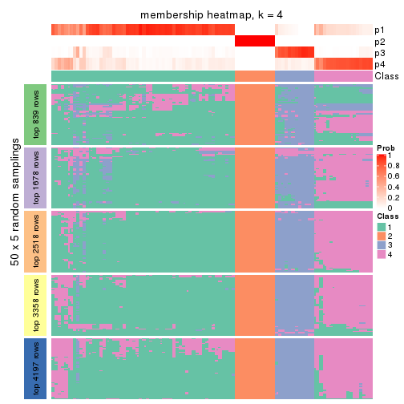</p>

</div>
<div id='tab-MAD-mclust-membership-heatmap-4'>
<pre><code class="r">membership_heatmap(res, k = 5)
</code></pre>

<p></p>

</div>
<div id='tab-MAD-mclust-membership-heatmap-5'>
<pre><code class="r">membership_heatmap(res, k = 6)
</code></pre>

<p></p>

</div>
</div>

As soon as we have had the classes for columns, we can look for signatures
which are significantly different between classes which can be candidate marks
for certain classes. Following are the heatmaps for signatures.


Signature heatmaps where rows are scaled:


<script>
$( function() {
	$( '#tabs-MAD-mclust-get-signatures' ).tabs();
} );
</script>
<div id='tabs-MAD-mclust-get-signatures'>
<ul>
<li><a href='#tab-MAD-mclust-get-signatures-1'>k = 2</a></li>
<li><a href='#tab-MAD-mclust-get-signatures-2'>k = 3</a></li>
<li><a href='#tab-MAD-mclust-get-signatures-3'>k = 4</a></li>
<li><a href='#tab-MAD-mclust-get-signatures-4'>k = 5</a></li>
<li><a href='#tab-MAD-mclust-get-signatures-5'>k = 6</a></li>
</ul>
<div id='tab-MAD-mclust-get-signatures-1'>
<pre><code class="r">get_signatures(res, k = 2)
</code></pre>

<p></p>

</div>
<div id='tab-MAD-mclust-get-signatures-2'>
<pre><code class="r">get_signatures(res, k = 3)
</code></pre>

<p></p>

</div>
<div id='tab-MAD-mclust-get-signatures-3'>
<pre><code class="r">get_signatures(res, k = 4)
</code></pre>

<p>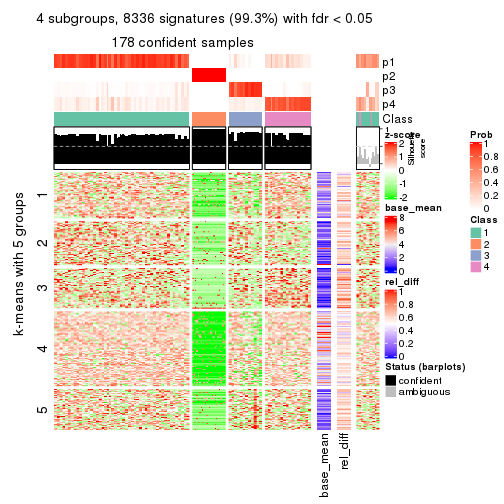</p>

</div>
<div id='tab-MAD-mclust-get-signatures-4'>
<pre><code class="r">get_signatures(res, k = 5)
</code></pre>

<p></p>

</div>
<div id='tab-MAD-mclust-get-signatures-5'>
<pre><code class="r">get_signatures(res, k = 6)
</code></pre>

<p></p>

</div>
</div>


Signature heatmaps where rows are not scaled:


<script>
$( function() {
	$( '#tabs-MAD-mclust-get-signatures-no-scale' ).tabs();
} );
</script>
<div id='tabs-MAD-mclust-get-signatures-no-scale'>
<ul>
<li><a href='#tab-MAD-mclust-get-signatures-no-scale-1'>k = 2</a></li>
<li><a href='#tab-MAD-mclust-get-signatures-no-scale-2'>k = 3</a></li>
<li><a href='#tab-MAD-mclust-get-signatures-no-scale-3'>k = 4</a></li>
<li><a href='#tab-MAD-mclust-get-signatures-no-scale-4'>k = 5</a></li>
<li><a href='#tab-MAD-mclust-get-signatures-no-scale-5'>k = 6</a></li>
</ul>
<div id='tab-MAD-mclust-get-signatures-no-scale-1'>
<pre><code class="r">get_signatures(res, k = 2, scale_rows = FALSE)
</code></pre>

<p></p>

</div>
<div id='tab-MAD-mclust-get-signatures-no-scale-2'>
<pre><code class="r">get_signatures(res, k = 3, scale_rows = FALSE)
</code></pre>

<p></p>

</div>
<div id='tab-MAD-mclust-get-signatures-no-scale-3'>
<pre><code class="r">get_signatures(res, k = 4, scale_rows = FALSE)
</code></pre>

<p></p>

</div>
<div id='tab-MAD-mclust-get-signatures-no-scale-4'>
<pre><code class="r">get_signatures(res, k = 5, scale_rows = FALSE)
</code></pre>

<p></p>

</div>
<div id='tab-MAD-mclust-get-signatures-no-scale-5'>
<pre><code class="r">get_signatures(res, k = 6, scale_rows = FALSE)
</code></pre>

<p></p>

</div>
</div>


Compare the overlap of signatures from different k:

```r
compare_signatures(res)
```


`get_signature()` returns a data frame invisibly. TO get the list of signatures, the function
call should be assigned to a variable explicitly. In following code, if `plot` argument is set
to `FALSE`, no heatmap is plotted while only the differential analysis is performed.

```r
# code only for demonstration
tb = get_signature(res, k = ..., plot = FALSE)
```

An example of the output of `tb` is:

```
#>   which_row         fdr    mean_1    mean_2 scaled_mean_1 scaled_mean_2 km
#> 1        38 0.042760348  8.373488  9.131774    -0.5533452     0.5164555  1
#> 2        40 0.018707592  7.106213  8.469186    -0.6173731     0.5762149  1
#> 3        55 0.019134737 10.221463 11.207825    -0.6159697     0.5749050  1
#> 4        59 0.006059896  5.921854  7.869574    -0.6899429     0.6439467  1
#> 5        60 0.018055526  8.928898 10.211722    -0.6204761     0.5791110  1
#> 6        98 0.009384629 15.714769 14.887706     0.6635654    -0.6193277  2
...
```

The columns in `tb` are:

1. `which_row`: row indices corresponding to the input matrix.
2. `fdr`: FDR for the differential test. 
3. `mean_x`: The mean value in group x.
4. `scaled_mean_x`: The mean value in group x after rows are scaled.
5. `km`: Row groups if k-means clustering is applied to rows.


UMAP plot which shows how samples are separated.


<script>
$( function() {
	$( '#tabs-MAD-mclust-dimension-reduction' ).tabs();
} );
</script>
<div id='tabs-MAD-mclust-dimension-reduction'>
<ul>
<li><a href='#tab-MAD-mclust-dimension-reduction-1'>k = 2</a></li>
<li><a href='#tab-MAD-mclust-dimension-reduction-2'>k = 3</a></li>
<li><a href='#tab-MAD-mclust-dimension-reduction-3'>k = 4</a></li>
<li><a href='#tab-MAD-mclust-dimension-reduction-4'>k = 5</a></li>
<li><a href='#tab-MAD-mclust-dimension-reduction-5'>k = 6</a></li>
</ul>
<div id='tab-MAD-mclust-dimension-reduction-1'>
<pre><code class="r">dimension_reduction(res, k = 2, method = &quot;UMAP&quot;)
</code></pre>

<p></p>

</div>
<div id='tab-MAD-mclust-dimension-reduction-2'>
<pre><code class="r">dimension_reduction(res, k = 3, method = &quot;UMAP&quot;)
</code></pre>

<p></p>

</div>
<div id='tab-MAD-mclust-dimension-reduction-3'>
<pre><code class="r">dimension_reduction(res, k = 4, method = &quot;UMAP&quot;)
</code></pre>

<p></p>

</div>
<div id='tab-MAD-mclust-dimension-reduction-4'>
<pre><code class="r">dimension_reduction(res, k = 5, method = &quot;UMAP&quot;)
</code></pre>

<p></p>

</div>
<div id='tab-MAD-mclust-dimension-reduction-5'>
<pre><code class="r">dimension_reduction(res, k = 6, method = &quot;UMAP&quot;)
</code></pre>

<p></p>

</div>
</div>


Following heatmap shows how subgroups are split when increasing `k`:

```r
collect_classes(res)
```


If matrix rows can be associated to genes, consider to use `GO_Enrichment(res,
...)` to perform function enrichment for the signature genes.


 

---------------------------------------------------


### MAD:NMF**


The object with results only for a single top-value method and a single partition method 
can be extracted as:

```r
res = res_list["MAD", "NMF"]
# you can also extract it by
# res = res_list["MAD:NMF"]
```

A summary of `res` and all the functions that can be applied to it:

```r
res
```

```
#> A 'ConsensusPartition' object with k = 2, 3, 4, 5, 6.
#>   On a matrix with 8394 rows and 194 columns.
#>   Top rows (839, 1678, 2518, 3358, 4197) are extracted by 'MAD' method.
#>   Subgroups are detected by 'NMF' method.
#>   Performed in total 1250 partitions by row resampling.
#>   Best k for subgroups seems to be 2.
#> 
#> Following methods can be applied to this 'ConsensusPartition' object:
#>  [1] "cola_report"             "collect_classes"         "collect_plots"          
#>  [4] "collect_stats"           "colnames"                "compare_signatures"     
#>  [7] "consensus_heatmap"       "dimension_reduction"     "functional_enrichment"  
#> [10] "get_anno_col"            "get_anno"                "get_classes"            
#> [13] "get_consensus"           "get_matrix"              "get_membership"         
#> [16] "get_param"               "get_signatures"          "get_stats"              
#> [19] "is_best_k"               "is_stable_k"             "membership_heatmap"     
#> [22] "ncol"                    "nrow"                    "plot_ecdf"              
#> [25] "rownames"                "select_partition_number" "show"                   
#> [28] "suggest_best_k"          "test_to_known_factors"
```

`collect_plots()` function collects all the plots made from `res` for all `k` (number of partitions)
into one single page to provide an easy and fast comparison between different `k`.

```r
collect_plots(res)
```


The plots are:

- The first row: a plot of the ECDF (Empirical cumulative distribution
  function) curves of the consensus matrix for each `k` and the heatmap of
  predicted classes for each `k`.
- The second row: heatmaps of the consensus matrix for each `k`.
- The third row: heatmaps of the membership matrix for each `k`.
- The fouth row: heatmaps of the signatures for each `k`.

All the plots in panels can be made by individual functions and they are
plotted later in this section.

`select_partition_number()` produces several plots showing different
statistics for choosing "optimized" `k`. There are following statistics:

- ECDF curves of the consensus matrix for each `k`;
- 1-PAC. [The PAC
  score](https://en.wikipedia.org/wiki/Consensus_clustering#Over-interpretation_potential_of_consensus_clustering)
  measures the proportion of the ambiguous subgrouping.
- Mean silhouette score.
- Concordance. The mean probability of fiting the consensus class ids in all
  partitions.
- Area increased. Denote $A_k$ as the area under the ECDF curve for current
  `k`, the area increased is defined as $A_k - A_{k-1}$.
- Rand index. The percent of pairs of samples that are both in a same cluster
  or both are not in a same cluster in the partition of k and k-1.
- Jaccard index. The ratio of pairs of samples are both in a same cluster in
  the partition of k and k-1 and the pairs of samples are both in a same
  cluster in the partition k or k-1.

The detailed explanations of these statistics can be found in [the cola
vignette](http://bioconductor.org/packages/devel/bioc/vignettes/cola/inst/doc/cola.html#toc_13).

Generally speaking, lower PAC score, higher mean silhouette score or higher
concordance corresponds to better partition. Rand index and Jaccard index
measure how similar the current partition is compared to partition with `k-1`.
If they are too similar, we won't accept `k` is better than `k-1`.

```r
select_partition_number(res)
```


The numeric values for all these statistics can be obtained by `get_stats()`.

```r
get_stats(res)
```

```
#>   k 1-PAC mean_silhouette concordance area_increased  Rand Jaccard
#> 2 2 1.000           0.976       0.986          0.232 0.767   0.767
#> 3 3 0.335           0.780       0.858          0.700 0.962   0.950
#> 4 4 0.279           0.586       0.740          0.308 0.916   0.885
#> 5 5 0.280           0.496       0.674          0.205 0.675   0.523
#> 6 6 0.334           0.432       0.595          0.113 0.694   0.408
```

`suggest_best_k()` suggests the best $k$ based on these statistics. The rules are as follows:

- All $k$ with Jaccard index larger than 0.95 are removed because the increase of
  the partition number does not provides enough extra information. If all $k$ are removed,
  the best $k$ is assigned by `NA`.
- For $k$ with 1-PAC larger than 0.9, the maximal $k$ is taken as the "best k". Other $k$ is called "optional k".
- If it does not fit the second rule. The $k$ with the highest vote of highest
  1-PAC, mean silhouette and concordance is taken as the "best k".

```r
suggest_best_k(res)
```

```
#> [1] 2
```


Following shows the table of the partitions (You need to click the **show/hide
code output** link to see it). The membership matrix (columns with name `p*`)
is inferred by
[`clue::cl_consensus()`](https://www.rdocumentation.org/link/cl_consensus?package=clue)
function with the `SE` method. Basically the value in the membership matrix
represents the probability to belong to a certain group. The finall class
label for an item is determined with the group with highest probability it
belongs to.

In `get_classes()` function, the entropy is calculated from the membership
matrix and the silhouette score is calculated from the consensus matrix.


<script>
$( function() {
	$( '#tabs-MAD-NMF-get-classes' ).tabs();
} );
</script>
<div id='tabs-MAD-NMF-get-classes'>
<ul>
<li><a href='#tab-MAD-NMF-get-classes-1'>k = 2</a></li>
<li><a href='#tab-MAD-NMF-get-classes-2'>k = 3</a></li>
<li><a href='#tab-MAD-NMF-get-classes-3'>k = 4</a></li>
<li><a href='#tab-MAD-NMF-get-classes-4'>k = 5</a></li>
<li><a href='#tab-MAD-NMF-get-classes-5'>k = 6</a></li>
</ul>

<div id='tab-MAD-NMF-get-classes-1'>
<p><a id='tab-MAD-NMF-get-classes-1-a' style='color:#0366d6' href='#'>show/hide code output</a></p>
<pre><code class="r">cbind(get_classes(res, k = 2), get_membership(res, k = 2))
</code></pre>

<pre><code>#&gt;           class entropy silhouette    p1    p2
#&gt; ERR467487     1  0.0000      0.992 1.000 0.000
#&gt; ERR467498     1  0.0000      0.992 1.000 0.000
#&gt; ERR658998     1  0.0376      0.991 0.996 0.004
#&gt; ERR659094     1  0.0376      0.991 0.996 0.004
#&gt; ERR658999     1  0.0672      0.990 0.992 0.008
#&gt; ERR659095     1  0.0672      0.990 0.992 0.008
#&gt; ERR659000     1  0.0376      0.992 0.996 0.004
#&gt; ERR659096     1  0.0376      0.992 0.996 0.004
#&gt; ERR659001     1  0.0000      0.992 1.000 0.000
#&gt; ERR659097     1  0.0000      0.992 1.000 0.000
#&gt; ERR659002     1  0.0376      0.991 0.996 0.004
#&gt; ERR659098     1  0.0000      0.992 1.000 0.000
#&gt; ERR659003     1  0.0000      0.992 1.000 0.000
#&gt; ERR659099     1  0.0000      0.992 1.000 0.000
#&gt; ERR659004     1  0.1414      0.980 0.980 0.020
#&gt; ERR659100     1  0.1414      0.980 0.980 0.020
#&gt; ERR659005     1  0.0376      0.992 0.996 0.004
#&gt; ERR659101     1  0.0376      0.992 0.996 0.004
#&gt; ERR659006     1  0.1414      0.981 0.980 0.020
#&gt; ERR659102     1  0.1414      0.981 0.980 0.020
#&gt; ERR659007     1  0.0000      0.992 1.000 0.000
#&gt; ERR659103     1  0.0000      0.992 1.000 0.000
#&gt; ERR659008     2  0.0938      0.954 0.012 0.988
#&gt; ERR659104     2  0.1184      0.955 0.016 0.984
#&gt; ERR659009     1  0.0672      0.990 0.992 0.008
#&gt; ERR659105     1  0.0672      0.990 0.992 0.008
#&gt; ERR659010     1  0.0938      0.987 0.988 0.012
#&gt; ERR659106     1  0.0672      0.990 0.992 0.008
#&gt; ERR659011     1  0.0672      0.990 0.992 0.008
#&gt; ERR659107     1  0.0376      0.991 0.996 0.004
#&gt; ERR659012     1  0.0938      0.987 0.988 0.012
#&gt; ERR659108     1  0.0938      0.987 0.988 0.012
#&gt; ERR659013     1  0.0376      0.992 0.996 0.004
#&gt; ERR659109     1  0.0376      0.992 0.996 0.004
#&gt; ERR659014     2  0.1184      0.954 0.016 0.984
#&gt; ERR659110     2  0.2236      0.948 0.036 0.964
#&gt; ERR659015     1  0.0376      0.992 0.996 0.004
#&gt; ERR659111     1  0.0376      0.992 0.996 0.004
#&gt; ERR659016     1  0.0938      0.988 0.988 0.012
#&gt; ERR659112     1  0.0938      0.988 0.988 0.012
#&gt; ERR659017     2  0.1184      0.955 0.016 0.984
#&gt; ERR659113     2  0.1184      0.954 0.016 0.984
#&gt; ERR659018     1  0.0000      0.992 1.000 0.000
#&gt; ERR659114     1  0.0376      0.992 0.996 0.004
#&gt; ERR659019     1  0.0672      0.989 0.992 0.008
#&gt; ERR659115     1  0.0672      0.989 0.992 0.008
#&gt; ERR659020     1  0.0000      0.992 1.000 0.000
#&gt; ERR659116     1  0.0000      0.992 1.000 0.000
#&gt; ERR659021     1  0.0376      0.992 0.996 0.004
#&gt; ERR659117     1  0.0376      0.992 0.996 0.004
#&gt; ERR659022     1  0.0376      0.992 0.996 0.004
#&gt; ERR659118     1  0.0376      0.992 0.996 0.004
#&gt; ERR659023     1  0.0376      0.992 0.996 0.004
#&gt; ERR659119     1  0.0376      0.992 0.996 0.004
#&gt; ERR659024     1  0.0376      0.991 0.996 0.004
#&gt; ERR659120     1  0.0376      0.991 0.996 0.004
#&gt; ERR659025     1  0.0376      0.992 0.996 0.004
#&gt; ERR659121     1  0.0376      0.992 0.996 0.004
#&gt; ERR659026     1  0.0000      0.992 1.000 0.000
#&gt; ERR659122     1  0.0000      0.992 1.000 0.000
#&gt; ERR659027     1  0.0938      0.990 0.988 0.012
#&gt; ERR659123     1  0.0672      0.991 0.992 0.008
#&gt; ERR659028     1  0.0938      0.989 0.988 0.012
#&gt; ERR659124     1  0.0938      0.989 0.988 0.012
#&gt; ERR659029     1  0.0376      0.992 0.996 0.004
#&gt; ERR659125     1  0.0376      0.992 0.996 0.004
#&gt; ERR659030     1  0.0376      0.991 0.996 0.004
#&gt; ERR659126     1  0.0376      0.991 0.996 0.004
#&gt; ERR659031     1  0.0000      0.992 1.000 0.000
#&gt; ERR659127     1  0.0000      0.992 1.000 0.000
#&gt; ERR659032     1  0.0376      0.992 0.996 0.004
#&gt; ERR659128     1  0.0376      0.992 0.996 0.004
#&gt; ERR659033     1  0.0376      0.992 0.996 0.004
#&gt; ERR659129     1  0.0376      0.992 0.996 0.004
#&gt; ERR659034     2  0.0000      0.948 0.000 1.000
#&gt; ERR659130     2  0.2043      0.951 0.032 0.968
#&gt; ERR659035     1  0.0672      0.991 0.992 0.008
#&gt; ERR659131     1  0.0376      0.992 0.996 0.004
#&gt; ERR659036     1  0.0938      0.988 0.988 0.012
#&gt; ERR659132     1  0.0938      0.988 0.988 0.012
#&gt; ERR659037     1  0.0000      0.992 1.000 0.000
#&gt; ERR659133     1  0.0000      0.992 1.000 0.000
#&gt; ERR659038     1  0.1184      0.984 0.984 0.016
#&gt; ERR659134     1  0.1184      0.984 0.984 0.016
#&gt; ERR659039     1  0.0376      0.991 0.996 0.004
#&gt; ERR659135     1  0.0376      0.991 0.996 0.004
#&gt; ERR659040     1  0.0376      0.992 0.996 0.004
#&gt; ERR659136     1  0.0376      0.992 0.996 0.004
#&gt; ERR659041     1  0.1633      0.976 0.976 0.024
#&gt; ERR659137     1  0.1633      0.976 0.976 0.024
#&gt; ERR659042     1  0.0672      0.991 0.992 0.008
#&gt; ERR659138     1  0.0672      0.991 0.992 0.008
#&gt; ERR659043     1  0.0376      0.992 0.996 0.004
#&gt; ERR659139     1  0.0376      0.992 0.996 0.004
#&gt; ERR659044     2  0.2603      0.939 0.044 0.956
#&gt; ERR659140     2  0.1414      0.955 0.020 0.980
#&gt; ERR659045     1  0.0000      0.992 1.000 0.000
#&gt; ERR659141     1  0.0000      0.992 1.000 0.000
#&gt; ERR659046     1  0.0376      0.992 0.996 0.004
#&gt; ERR659142     1  0.0376      0.992 0.996 0.004
#&gt; ERR659047     1  0.0376      0.992 0.996 0.004
#&gt; ERR659143     1  0.0672      0.991 0.992 0.008
#&gt; ERR659048     1  0.0376      0.992 0.996 0.004
#&gt; ERR659144     1  0.0376      0.992 0.996 0.004
#&gt; ERR659049     1  0.0672      0.989 0.992 0.008
#&gt; ERR659145     1  0.0376      0.991 0.996 0.004
#&gt; ERR659050     1  0.0672      0.991 0.992 0.008
#&gt; ERR659146     1  0.0672      0.991 0.992 0.008
#&gt; ERR659051     1  0.7056      0.752 0.808 0.192
#&gt; ERR659147     1  0.7056      0.752 0.808 0.192
#&gt; ERR659052     1  0.0376      0.991 0.996 0.004
#&gt; ERR659148     1  0.0376      0.991 0.996 0.004
#&gt; ERR659053     1  0.0376      0.992 0.996 0.004
#&gt; ERR659149     1  0.0376      0.992 0.996 0.004
#&gt; ERR659054     2  0.1843      0.953 0.028 0.972
#&gt; ERR659150     2  0.0672      0.952 0.008 0.992
#&gt; ERR659055     1  0.0000      0.992 1.000 0.000
#&gt; ERR659151     1  0.0000      0.992 1.000 0.000
#&gt; ERR659056     1  0.3114      0.944 0.944 0.056
#&gt; ERR659152     1  0.3114      0.944 0.944 0.056
#&gt; ERR659057     1  0.0672      0.991 0.992 0.008
#&gt; ERR659153     1  0.0672      0.991 0.992 0.008
#&gt; ERR659058     1  0.0938      0.987 0.988 0.012
#&gt; ERR659154     1  0.0938      0.987 0.988 0.012
#&gt; ERR659059     1  0.0376      0.992 0.996 0.004
#&gt; ERR659155     1  0.0376      0.992 0.996 0.004
#&gt; ERR659060     1  0.0376      0.992 0.996 0.004
#&gt; ERR659156     1  0.0376      0.992 0.996 0.004
#&gt; ERR659061     1  0.0000      0.992 1.000 0.000
#&gt; ERR659157     1  0.0000      0.992 1.000 0.000
#&gt; ERR659062     1  0.0376      0.991 0.996 0.004
#&gt; ERR659158     1  0.0376      0.991 0.996 0.004
#&gt; ERR659063     1  0.0672      0.991 0.992 0.008
#&gt; ERR659159     1  0.0672      0.991 0.992 0.008
#&gt; ERR659064     1  0.0376      0.992 0.996 0.004
#&gt; ERR659160     1  0.0000      0.992 1.000 0.000
#&gt; ERR659065     2  0.2043      0.951 0.032 0.968
#&gt; ERR659161     2  0.0938      0.954 0.012 0.988
#&gt; ERR659066     1  0.0000      0.992 1.000 0.000
#&gt; ERR659162     1  0.0000      0.992 1.000 0.000
#&gt; ERR659067     1  0.0000      0.992 1.000 0.000
#&gt; ERR659163     1  0.0000      0.992 1.000 0.000
#&gt; ERR659068     2  0.2423      0.944 0.040 0.960
#&gt; ERR659164     2  0.2236      0.947 0.036 0.964
#&gt; ERR659069     1  0.0376      0.991 0.996 0.004
#&gt; ERR659165     1  0.0376      0.991 0.996 0.004
#&gt; ERR659070     1  0.0000      0.992 1.000 0.000
#&gt; ERR659166     1  0.0000      0.992 1.000 0.000
#&gt; ERR659071     1  0.0376      0.992 0.996 0.004
#&gt; ERR659167     1  0.0376      0.992 0.996 0.004
#&gt; ERR659072     1  0.0672      0.990 0.992 0.008
#&gt; ERR659168     1  0.0672      0.990 0.992 0.008
#&gt; ERR659073     1  0.0376      0.991 0.996 0.004
#&gt; ERR659169     1  0.0376      0.991 0.996 0.004
#&gt; ERR659074     2  0.0938      0.954 0.012 0.988
#&gt; ERR659170     2  0.0938      0.953 0.012 0.988
#&gt; ERR659075     2  0.9881      0.274 0.436 0.564
#&gt; ERR659171     2  0.9881      0.274 0.436 0.564
#&gt; ERR659076     2  0.1184      0.955 0.016 0.984
#&gt; ERR659172     2  0.1414      0.954 0.020 0.980
#&gt; ERR659077     1  0.0000      0.992 1.000 0.000
#&gt; ERR659173     1  0.0000      0.992 1.000 0.000
#&gt; ERR659078     1  0.0000      0.992 1.000 0.000
#&gt; ERR659174     1  0.0000      0.992 1.000 0.000
#&gt; ERR659079     1  0.0376      0.992 0.996 0.004
#&gt; ERR659175     1  0.0376      0.992 0.996 0.004
#&gt; ERR659080     1  0.0672      0.989 0.992 0.008
#&gt; ERR659176     1  0.0672      0.989 0.992 0.008
#&gt; ERR659081     1  0.0376      0.992 0.996 0.004
#&gt; ERR659177     1  0.0376      0.992 0.996 0.004
#&gt; ERR659082     1  0.0376      0.992 0.996 0.004
#&gt; ERR659178     1  0.0376      0.992 0.996 0.004
#&gt; ERR659083     2  0.0672      0.952 0.008 0.992
#&gt; ERR659179     2  0.0000      0.948 0.000 1.000
#&gt; ERR659084     2  0.1633      0.953 0.024 0.976
#&gt; ERR659180     2  0.1414      0.954 0.020 0.980
#&gt; ERR659085     1  0.0376      0.991 0.996 0.004
#&gt; ERR659181     1  0.0376      0.991 0.996 0.004
#&gt; ERR659086     1  0.0376      0.992 0.996 0.004
#&gt; ERR659182     1  0.0376      0.992 0.996 0.004
#&gt; ERR659087     1  0.0376      0.991 0.996 0.004
#&gt; ERR659183     1  0.0376      0.991 0.996 0.004
#&gt; ERR659088     1  0.0672      0.990 0.992 0.008
#&gt; ERR659184     1  0.0672      0.990 0.992 0.008
#&gt; ERR659089     1  0.0000      0.992 1.000 0.000
#&gt; ERR659185     1  0.0000      0.992 1.000 0.000
#&gt; ERR659090     1  0.0000      0.992 1.000 0.000
#&gt; ERR659186     1  0.0000      0.992 1.000 0.000
#&gt; ERR659091     1  0.0000      0.992 1.000 0.000
#&gt; ERR659187     1  0.0000      0.992 1.000 0.000
#&gt; ERR659092     1  0.0376      0.992 0.996 0.004
#&gt; ERR659188     1  0.0376      0.992 0.996 0.004
#&gt; ERR659093     1  0.0376      0.992 0.996 0.004
#&gt; ERR659189     1  0.0376      0.992 0.996 0.004
</code></pre>

<script>
$('#tab-MAD-NMF-get-classes-1-a').parent().next().next().hide();
$('#tab-MAD-NMF-get-classes-1-a').click(function(){
  $('#tab-MAD-NMF-get-classes-1-a').parent().next().next().toggle();
  return(false);
});
</script>
</div>

<div id='tab-MAD-NMF-get-classes-2'>
<p><a id='tab-MAD-NMF-get-classes-2-a' style='color:#0366d6' href='#'>show/hide code output</a></p>
<pre><code class="r">cbind(get_classes(res, k = 3), get_membership(res, k = 3))
</code></pre>

<pre><code>#&gt;           class entropy silhouette    p1    p2    p3
#&gt; ERR467487     1  0.5988    0.36666 0.632 0.000 0.368
#&gt; ERR467498     1  0.6008    0.35072 0.628 0.000 0.372
#&gt; ERR658998     1  0.2448    0.83928 0.924 0.000 0.076
#&gt; ERR659094     1  0.2537    0.83985 0.920 0.000 0.080
#&gt; ERR658999     1  0.3482    0.80447 0.872 0.000 0.128
#&gt; ERR659095     1  0.3551    0.80298 0.868 0.000 0.132
#&gt; ERR659000     1  0.5465    0.58112 0.712 0.000 0.288
#&gt; ERR659096     1  0.5529    0.56418 0.704 0.000 0.296
#&gt; ERR659001     1  0.2959    0.83535 0.900 0.000 0.100
#&gt; ERR659097     1  0.2625    0.83784 0.916 0.000 0.084
#&gt; ERR659002     1  0.3412    0.82169 0.876 0.000 0.124
#&gt; ERR659098     1  0.3340    0.82043 0.880 0.000 0.120
#&gt; ERR659003     1  0.2356    0.83267 0.928 0.000 0.072
#&gt; ERR659099     1  0.2448    0.83110 0.924 0.000 0.076
#&gt; ERR659004     1  0.4068    0.80651 0.864 0.016 0.120
#&gt; ERR659100     1  0.4139    0.80473 0.860 0.016 0.124
#&gt; ERR659005     1  0.4834    0.73125 0.792 0.004 0.204
#&gt; ERR659101     1  0.4733    0.74253 0.800 0.004 0.196
#&gt; ERR659006     1  0.4261    0.79618 0.848 0.012 0.140
#&gt; ERR659102     1  0.4195    0.79769 0.852 0.012 0.136
#&gt; ERR659007     1  0.2537    0.82769 0.920 0.000 0.080
#&gt; ERR659103     1  0.2537    0.82990 0.920 0.000 0.080
#&gt; ERR659008     2  0.2063    0.95904 0.008 0.948 0.044
#&gt; ERR659104     2  0.2116    0.96156 0.012 0.948 0.040
#&gt; ERR659009     1  0.4110    0.80402 0.844 0.004 0.152
#&gt; ERR659105     1  0.4110    0.80115 0.844 0.004 0.152
#&gt; ERR659010     1  0.3826    0.80965 0.868 0.008 0.124
#&gt; ERR659106     1  0.3715    0.81121 0.868 0.004 0.128
#&gt; ERR659011     1  0.3482    0.81233 0.872 0.000 0.128
#&gt; ERR659107     1  0.3482    0.81233 0.872 0.000 0.128
#&gt; ERR659012     1  0.4059    0.80509 0.860 0.012 0.128
#&gt; ERR659108     1  0.3989    0.80690 0.864 0.012 0.124
#&gt; ERR659013     1  0.4465    0.79697 0.820 0.004 0.176
#&gt; ERR659109     1  0.4465    0.79697 0.820 0.004 0.176
#&gt; ERR659014     2  0.1411    0.95927 0.000 0.964 0.036
#&gt; ERR659110     2  0.2280    0.95235 0.008 0.940 0.052
#&gt; ERR659015     1  0.1643    0.83719 0.956 0.000 0.044
#&gt; ERR659111     1  0.1643    0.83719 0.956 0.000 0.044
#&gt; ERR659016     1  0.6386   -0.00437 0.584 0.004 0.412
#&gt; ERR659112     1  0.6410   -0.05344 0.576 0.004 0.420
#&gt; ERR659017     2  0.3091    0.94299 0.016 0.912 0.072
#&gt; ERR659113     2  0.1031    0.96111 0.000 0.976 0.024
#&gt; ERR659018     1  0.2959    0.81927 0.900 0.000 0.100
#&gt; ERR659114     1  0.3192    0.81097 0.888 0.000 0.112
#&gt; ERR659019     1  0.3425    0.81251 0.884 0.004 0.112
#&gt; ERR659115     1  0.3425    0.81215 0.884 0.004 0.112
#&gt; ERR659020     1  0.1753    0.83627 0.952 0.000 0.048
#&gt; ERR659116     1  0.2066    0.84034 0.940 0.000 0.060
#&gt; ERR659021     1  0.2165    0.83963 0.936 0.000 0.064
#&gt; ERR659117     1  0.2066    0.83857 0.940 0.000 0.060
#&gt; ERR659022     1  0.4002    0.78506 0.840 0.000 0.160
#&gt; ERR659118     1  0.4062    0.78108 0.836 0.000 0.164
#&gt; ERR659023     1  0.3784    0.81103 0.864 0.004 0.132
#&gt; ERR659119     1  0.3619    0.81058 0.864 0.000 0.136
#&gt; ERR659024     1  0.2066    0.84646 0.940 0.000 0.060
#&gt; ERR659120     1  0.1964    0.84605 0.944 0.000 0.056
#&gt; ERR659025     1  0.4504    0.74053 0.804 0.000 0.196
#&gt; ERR659121     1  0.4504    0.73952 0.804 0.000 0.196
#&gt; ERR659026     1  0.2878    0.83938 0.904 0.000 0.096
#&gt; ERR659122     1  0.2796    0.83909 0.908 0.000 0.092
#&gt; ERR659027     1  0.5285    0.63563 0.752 0.004 0.244
#&gt; ERR659123     1  0.5420    0.63554 0.752 0.008 0.240
#&gt; ERR659028     1  0.3340    0.81857 0.880 0.000 0.120
#&gt; ERR659124     1  0.3340    0.81857 0.880 0.000 0.120
#&gt; ERR659029     1  0.3412    0.82289 0.876 0.000 0.124
#&gt; ERR659125     1  0.3267    0.82501 0.884 0.000 0.116
#&gt; ERR659030     1  0.3879    0.78064 0.848 0.000 0.152
#&gt; ERR659126     1  0.3752    0.78547 0.856 0.000 0.144
#&gt; ERR659031     1  0.2796    0.83795 0.908 0.000 0.092
#&gt; ERR659127     1  0.2711    0.83944 0.912 0.000 0.088
#&gt; ERR659032     1  0.3482    0.84072 0.872 0.000 0.128
#&gt; ERR659128     1  0.3340    0.84449 0.880 0.000 0.120
#&gt; ERR659033     1  0.3349    0.82979 0.888 0.004 0.108
#&gt; ERR659129     1  0.3349    0.82979 0.888 0.004 0.108
#&gt; ERR659034     2  0.1289    0.96149 0.000 0.968 0.032
#&gt; ERR659130     2  0.1647    0.96065 0.004 0.960 0.036
#&gt; ERR659035     1  0.2066    0.84249 0.940 0.000 0.060
#&gt; ERR659131     1  0.2066    0.84225 0.940 0.000 0.060
#&gt; ERR659036     1  0.4931    0.71401 0.784 0.004 0.212
#&gt; ERR659132     1  0.4931    0.71401 0.784 0.004 0.212
#&gt; ERR659037     1  0.2711    0.84438 0.912 0.000 0.088
#&gt; ERR659133     1  0.2625    0.84415 0.916 0.000 0.084
#&gt; ERR659038     1  0.4413    0.77065 0.832 0.008 0.160
#&gt; ERR659134     1  0.4353    0.77498 0.836 0.008 0.156
#&gt; ERR659039     1  0.3412    0.81402 0.876 0.000 0.124
#&gt; ERR659135     1  0.3482    0.81096 0.872 0.000 0.128
#&gt; ERR659040     1  0.3816    0.80182 0.852 0.000 0.148
#&gt; ERR659136     1  0.3816    0.80202 0.852 0.000 0.148
#&gt; ERR659041     1  0.4968    0.74492 0.800 0.012 0.188
#&gt; ERR659137     1  0.4915    0.74993 0.804 0.012 0.184
#&gt; ERR659042     1  0.5216    0.63481 0.740 0.000 0.260
#&gt; ERR659138     1  0.5178    0.64268 0.744 0.000 0.256
#&gt; ERR659043     1  0.4555    0.76256 0.800 0.000 0.200
#&gt; ERR659139     1  0.4555    0.75929 0.800 0.000 0.200
#&gt; ERR659044     2  0.2703    0.94407 0.016 0.928 0.056
#&gt; ERR659140     2  0.3031    0.95286 0.012 0.912 0.076
#&gt; ERR659045     1  0.2356    0.83044 0.928 0.000 0.072
#&gt; ERR659141     1  0.2261    0.82922 0.932 0.000 0.068
#&gt; ERR659046     1  0.2165    0.83373 0.936 0.000 0.064
#&gt; ERR659142     1  0.2261    0.83883 0.932 0.000 0.068
#&gt; ERR659047     1  0.3038    0.82503 0.896 0.000 0.104
#&gt; ERR659143     1  0.3349    0.82255 0.888 0.004 0.108
#&gt; ERR659048     1  0.2796    0.82706 0.908 0.000 0.092
#&gt; ERR659144     1  0.2796    0.83219 0.908 0.000 0.092
#&gt; ERR659049     1  0.3500    0.84435 0.880 0.004 0.116
#&gt; ERR659145     1  0.3272    0.84477 0.892 0.004 0.104
#&gt; ERR659050     1  0.4110    0.78451 0.844 0.004 0.152
#&gt; ERR659146     1  0.4047    0.78675 0.848 0.004 0.148
#&gt; ERR659051     3  0.7959    0.58548 0.288 0.092 0.620
#&gt; ERR659147     3  0.7959    0.58548 0.288 0.092 0.620
#&gt; ERR659052     1  0.4473    0.77129 0.828 0.008 0.164
#&gt; ERR659148     1  0.4473    0.77129 0.828 0.008 0.164
#&gt; ERR659053     1  0.3752    0.80449 0.856 0.000 0.144
#&gt; ERR659149     1  0.3551    0.81079 0.868 0.000 0.132
#&gt; ERR659054     2  0.1878    0.96226 0.004 0.952 0.044
#&gt; ERR659150     2  0.1643    0.95918 0.000 0.956 0.044
#&gt; ERR659055     1  0.3686    0.80180 0.860 0.000 0.140
#&gt; ERR659151     1  0.3644    0.81065 0.872 0.004 0.124
#&gt; ERR659056     1  0.8395   -0.32401 0.480 0.084 0.436
#&gt; ERR659152     1  0.8391   -0.31719 0.484 0.084 0.432
#&gt; ERR659057     1  0.1643    0.83984 0.956 0.000 0.044
#&gt; ERR659153     1  0.1643    0.84123 0.956 0.000 0.044
#&gt; ERR659058     1  0.3816    0.78454 0.852 0.000 0.148
#&gt; ERR659154     1  0.3752    0.78758 0.856 0.000 0.144
#&gt; ERR659059     1  0.2448    0.83545 0.924 0.000 0.076
#&gt; ERR659155     1  0.2165    0.83745 0.936 0.000 0.064
#&gt; ERR659060     1  0.4178    0.77020 0.828 0.000 0.172
#&gt; ERR659156     1  0.4062    0.77919 0.836 0.000 0.164
#&gt; ERR659061     1  0.4504    0.76689 0.804 0.000 0.196
#&gt; ERR659157     1  0.4605    0.75724 0.796 0.000 0.204
#&gt; ERR659062     1  0.3116    0.83286 0.892 0.000 0.108
#&gt; ERR659158     1  0.3116    0.83286 0.892 0.000 0.108
#&gt; ERR659063     1  0.3038    0.82968 0.896 0.000 0.104
#&gt; ERR659159     1  0.2959    0.82747 0.900 0.000 0.100
#&gt; ERR659064     1  0.3412    0.81573 0.876 0.000 0.124
#&gt; ERR659160     1  0.3482    0.81594 0.872 0.000 0.128
#&gt; ERR659065     2  0.3091    0.95557 0.016 0.912 0.072
#&gt; ERR659161     2  0.0892    0.96287 0.000 0.980 0.020
#&gt; ERR659066     1  0.3644    0.82325 0.872 0.004 0.124
#&gt; ERR659162     1  0.3573    0.82226 0.876 0.004 0.120
#&gt; ERR659067     1  0.2959    0.82348 0.900 0.000 0.100
#&gt; ERR659163     1  0.2959    0.82348 0.900 0.000 0.100
#&gt; ERR659068     2  0.2866    0.94241 0.008 0.916 0.076
#&gt; ERR659164     2  0.3742    0.90718 0.036 0.892 0.072
#&gt; ERR659069     1  0.5024    0.71252 0.776 0.004 0.220
#&gt; ERR659165     1  0.4978    0.71397 0.780 0.004 0.216
#&gt; ERR659070     1  0.4399    0.74210 0.812 0.000 0.188
#&gt; ERR659166     1  0.4399    0.74210 0.812 0.000 0.188
#&gt; ERR659071     1  0.3412    0.81634 0.876 0.000 0.124
#&gt; ERR659167     1  0.3482    0.81545 0.872 0.000 0.128
#&gt; ERR659072     1  0.3500    0.81397 0.880 0.004 0.116
#&gt; ERR659168     1  0.3267    0.81549 0.884 0.000 0.116
#&gt; ERR659073     1  0.4002    0.80722 0.840 0.000 0.160
#&gt; ERR659169     1  0.4062    0.80411 0.836 0.000 0.164
#&gt; ERR659074     2  0.2682    0.95677 0.004 0.920 0.076
#&gt; ERR659170     2  0.1529    0.96240 0.000 0.960 0.040
#&gt; ERR659075     3  0.9243    0.14817 0.168 0.340 0.492
#&gt; ERR659171     3  0.9256    0.14007 0.168 0.344 0.488
#&gt; ERR659076     2  0.2400    0.95961 0.004 0.932 0.064
#&gt; ERR659172     2  0.2096    0.96080 0.004 0.944 0.052
#&gt; ERR659077     1  0.3482    0.82372 0.872 0.000 0.128
#&gt; ERR659173     1  0.3340    0.83024 0.880 0.000 0.120
#&gt; ERR659078     1  0.2959    0.83771 0.900 0.000 0.100
#&gt; ERR659174     1  0.2959    0.83771 0.900 0.000 0.100
#&gt; ERR659079     1  0.4002    0.79604 0.840 0.000 0.160
#&gt; ERR659175     1  0.4121    0.78906 0.832 0.000 0.168
#&gt; ERR659080     3  0.6307    0.27059 0.488 0.000 0.512
#&gt; ERR659176     3  0.6302    0.28855 0.480 0.000 0.520
#&gt; ERR659081     1  0.1964    0.83673 0.944 0.000 0.056
#&gt; ERR659177     1  0.2066    0.83835 0.940 0.000 0.060
#&gt; ERR659082     1  0.3412    0.79831 0.876 0.000 0.124
#&gt; ERR659178     1  0.3482    0.79719 0.872 0.000 0.128
#&gt; ERR659083     2  0.2096    0.96278 0.004 0.944 0.052
#&gt; ERR659179     2  0.1529    0.96066 0.000 0.960 0.040
#&gt; ERR659084     2  0.1989    0.96071 0.004 0.948 0.048
#&gt; ERR659180     2  0.2599    0.93628 0.016 0.932 0.052
#&gt; ERR659085     1  0.2066    0.84331 0.940 0.000 0.060
#&gt; ERR659181     1  0.2165    0.84414 0.936 0.000 0.064
#&gt; ERR659086     1  0.2066    0.83613 0.940 0.000 0.060
#&gt; ERR659182     1  0.1860    0.83728 0.948 0.000 0.052
#&gt; ERR659087     1  0.4399    0.78619 0.812 0.000 0.188
#&gt; ERR659183     1  0.4399    0.78619 0.812 0.000 0.188
#&gt; ERR659088     1  0.5618    0.62786 0.732 0.008 0.260
#&gt; ERR659184     1  0.5618    0.62786 0.732 0.008 0.260
#&gt; ERR659089     1  0.4750    0.74437 0.784 0.000 0.216
#&gt; ERR659185     1  0.4796    0.73855 0.780 0.000 0.220
#&gt; ERR659090     1  0.3879    0.82826 0.848 0.000 0.152
#&gt; ERR659186     1  0.3879    0.82940 0.848 0.000 0.152
#&gt; ERR659091     1  0.2537    0.83939 0.920 0.000 0.080
#&gt; ERR659187     1  0.2537    0.84020 0.920 0.000 0.080
#&gt; ERR659092     1  0.2711    0.83459 0.912 0.000 0.088
#&gt; ERR659188     1  0.2625    0.83593 0.916 0.000 0.084
#&gt; ERR659093     1  0.2878    0.82831 0.904 0.000 0.096
#&gt; ERR659189     1  0.2878    0.82831 0.904 0.000 0.096
</code></pre>

<script>
$('#tab-MAD-NMF-get-classes-2-a').parent().next().next().hide();
$('#tab-MAD-NMF-get-classes-2-a').click(function(){
  $('#tab-MAD-NMF-get-classes-2-a').parent().next().next().toggle();
  return(false);
});
</script>
</div>

<div id='tab-MAD-NMF-get-classes-3'>
<p><a id='tab-MAD-NMF-get-classes-3-a' style='color:#0366d6' href='#'>show/hide code output</a></p>
<pre><code class="r">cbind(get_classes(res, k = 4), get_membership(res, k = 4))
</code></pre>

<pre><code>#&gt;           class entropy silhouette    p1    p2    p3    p4
#&gt; ERR467487     1   0.767   -0.09562 0.488 0.004 0.220 0.288
#&gt; ERR467498     1   0.767   -0.09562 0.488 0.004 0.220 0.288
#&gt; ERR658998     1   0.271    0.68494 0.900 0.000 0.020 0.080
#&gt; ERR659094     1   0.271    0.68494 0.900 0.000 0.020 0.080
#&gt; ERR658999     1   0.447    0.63318 0.800 0.000 0.056 0.144
#&gt; ERR659095     1   0.454    0.63056 0.796 0.000 0.060 0.144
#&gt; ERR659000     1   0.699   -0.31110 0.484 0.004 0.100 0.412
#&gt; ERR659096     1   0.698   -0.28024 0.492 0.004 0.100 0.404
#&gt; ERR659001     1   0.313    0.67865 0.884 0.000 0.040 0.076
#&gt; ERR659097     1   0.335    0.68043 0.872 0.000 0.044 0.084
#&gt; ERR659002     1   0.397    0.64748 0.804 0.000 0.016 0.180
#&gt; ERR659098     1   0.410    0.63956 0.792 0.000 0.016 0.192
#&gt; ERR659003     1   0.315    0.69409 0.880 0.000 0.032 0.088
#&gt; ERR659099     1   0.328    0.69366 0.872 0.000 0.032 0.096
#&gt; ERR659004     1   0.541    0.58993 0.740 0.004 0.076 0.180
#&gt; ERR659100     1   0.541    0.58993 0.740 0.004 0.076 0.180
#&gt; ERR659005     1   0.547    0.42189 0.656 0.000 0.036 0.308
#&gt; ERR659101     1   0.556    0.38783 0.640 0.000 0.036 0.324
#&gt; ERR659006     1   0.527    0.60050 0.744 0.000 0.084 0.172
#&gt; ERR659102     1   0.527    0.60050 0.744 0.000 0.084 0.172
#&gt; ERR659007     1   0.238    0.69239 0.916 0.000 0.016 0.068
#&gt; ERR659103     1   0.191    0.69422 0.940 0.000 0.020 0.040
#&gt; ERR659008     2   0.288    0.93018 0.016 0.904 0.064 0.016
#&gt; ERR659104     2   0.230    0.93513 0.000 0.924 0.048 0.028
#&gt; ERR659009     1   0.455    0.62616 0.796 0.004 0.044 0.156
#&gt; ERR659105     1   0.455    0.62616 0.796 0.004 0.044 0.156
#&gt; ERR659010     1   0.426    0.63558 0.812 0.000 0.048 0.140
#&gt; ERR659106     1   0.422    0.63511 0.812 0.000 0.044 0.144
#&gt; ERR659011     1   0.453    0.63073 0.792 0.000 0.052 0.156
#&gt; ERR659107     1   0.453    0.63073 0.792 0.000 0.052 0.156
#&gt; ERR659012     1   0.492    0.60896 0.768 0.000 0.068 0.164
#&gt; ERR659108     1   0.492    0.60896 0.768 0.000 0.068 0.164
#&gt; ERR659013     1   0.590    0.52251 0.684 0.004 0.076 0.236
#&gt; ERR659109     1   0.584    0.53325 0.692 0.004 0.076 0.228
#&gt; ERR659014     2   0.278    0.92291 0.000 0.896 0.084 0.020
#&gt; ERR659110     2   0.252    0.92988 0.000 0.908 0.076 0.016
#&gt; ERR659015     1   0.310    0.67599 0.876 0.000 0.020 0.104
#&gt; ERR659111     1   0.321    0.67764 0.872 0.000 0.024 0.104
#&gt; ERR659016     4   0.717    0.60952 0.296 0.012 0.124 0.568
#&gt; ERR659112     4   0.732    0.59403 0.292 0.012 0.140 0.556
#&gt; ERR659017     2   0.311    0.92084 0.004 0.876 0.108 0.012
#&gt; ERR659113     2   0.181    0.93313 0.000 0.940 0.052 0.008
#&gt; ERR659018     1   0.361    0.69181 0.856 0.000 0.044 0.100
#&gt; ERR659114     1   0.363    0.69024 0.856 0.000 0.048 0.096
#&gt; ERR659019     1   0.439    0.63478 0.804 0.000 0.052 0.144
#&gt; ERR659115     1   0.456    0.63354 0.796 0.000 0.064 0.140
#&gt; ERR659020     1   0.252    0.69085 0.912 0.000 0.024 0.064
#&gt; ERR659116     1   0.244    0.69122 0.916 0.000 0.024 0.060
#&gt; ERR659021     1   0.412    0.60204 0.772 0.000 0.008 0.220
#&gt; ERR659117     1   0.419    0.59493 0.764 0.000 0.008 0.228
#&gt; ERR659022     1   0.546    0.49628 0.684 0.004 0.036 0.276
#&gt; ERR659118     1   0.517    0.53003 0.704 0.000 0.036 0.260
#&gt; ERR659023     1   0.444    0.64837 0.800 0.000 0.052 0.148
#&gt; ERR659119     1   0.448    0.64746 0.796 0.000 0.052 0.152
#&gt; ERR659024     1   0.365    0.69534 0.852 0.000 0.040 0.108
#&gt; ERR659120     1   0.370    0.69620 0.852 0.000 0.048 0.100
#&gt; ERR659025     1   0.599   -0.18026 0.500 0.008 0.024 0.468
#&gt; ERR659121     1   0.599   -0.19529 0.496 0.008 0.024 0.472
#&gt; ERR659026     1   0.367    0.68995 0.848 0.000 0.036 0.116
#&gt; ERR659122     1   0.376    0.69040 0.844 0.000 0.040 0.116
#&gt; ERR659027     4   0.697    0.66848 0.320 0.008 0.108 0.564
#&gt; ERR659123     4   0.711    0.66230 0.332 0.008 0.116 0.544
#&gt; ERR659028     1   0.481    0.63627 0.784 0.000 0.084 0.132
#&gt; ERR659124     1   0.492    0.63082 0.776 0.000 0.088 0.136
#&gt; ERR659029     1   0.514    0.58686 0.732 0.000 0.052 0.216
#&gt; ERR659125     1   0.511    0.59247 0.736 0.000 0.052 0.212
#&gt; ERR659030     1   0.499    0.56218 0.732 0.004 0.028 0.236
#&gt; ERR659126     1   0.499    0.54420 0.724 0.004 0.024 0.248
#&gt; ERR659031     1   0.339    0.69670 0.872 0.000 0.056 0.072
#&gt; ERR659127     1   0.324    0.69711 0.880 0.000 0.052 0.068
#&gt; ERR659032     1   0.501    0.62693 0.732 0.000 0.040 0.228
#&gt; ERR659128     1   0.483    0.64739 0.752 0.000 0.040 0.208
#&gt; ERR659033     1   0.407    0.68165 0.824 0.000 0.044 0.132
#&gt; ERR659129     1   0.402    0.68001 0.828 0.000 0.044 0.128
#&gt; ERR659034     2   0.174    0.93217 0.000 0.940 0.056 0.004
#&gt; ERR659130     2   0.322    0.90907 0.004 0.864 0.124 0.008
#&gt; ERR659035     1   0.247    0.69879 0.916 0.000 0.028 0.056
#&gt; ERR659131     1   0.256    0.69951 0.912 0.000 0.032 0.056
#&gt; ERR659036     1   0.642    0.00908 0.536 0.012 0.044 0.408
#&gt; ERR659132     1   0.641    0.04007 0.544 0.012 0.044 0.400
#&gt; ERR659037     1   0.509    0.50997 0.688 0.000 0.024 0.288
#&gt; ERR659133     1   0.504    0.52218 0.696 0.000 0.024 0.280
#&gt; ERR659038     1   0.517    0.61212 0.760 0.004 0.072 0.164
#&gt; ERR659134     1   0.524    0.61013 0.756 0.004 0.076 0.164
#&gt; ERR659039     1   0.449    0.63089 0.800 0.000 0.060 0.140
#&gt; ERR659135     1   0.439    0.63262 0.804 0.000 0.052 0.144
#&gt; ERR659040     1   0.562    0.40603 0.640 0.000 0.040 0.320
#&gt; ERR659136     1   0.570    0.39447 0.636 0.000 0.044 0.320
#&gt; ERR659041     1   0.667   -0.18095 0.492 0.020 0.044 0.444
#&gt; ERR659137     1   0.667   -0.18095 0.492 0.020 0.044 0.444
#&gt; ERR659042     4   0.608    0.38932 0.440 0.004 0.036 0.520
#&gt; ERR659138     4   0.608    0.40071 0.436 0.004 0.036 0.524
#&gt; ERR659043     1   0.579    0.42344 0.640 0.000 0.052 0.308
#&gt; ERR659139     1   0.565    0.45260 0.656 0.000 0.048 0.296
#&gt; ERR659044     2   0.354    0.90035 0.024 0.876 0.076 0.024
#&gt; ERR659140     2   0.283    0.92848 0.004 0.904 0.060 0.032
#&gt; ERR659045     1   0.379    0.67508 0.844 0.000 0.044 0.112
#&gt; ERR659141     1   0.379    0.67508 0.844 0.000 0.044 0.112
#&gt; ERR659046     1   0.403    0.63434 0.796 0.004 0.008 0.192
#&gt; ERR659142     1   0.385    0.63165 0.800 0.000 0.008 0.192
#&gt; ERR659047     1   0.458    0.57488 0.748 0.008 0.008 0.236
#&gt; ERR659143     1   0.458    0.57488 0.748 0.008 0.008 0.236
#&gt; ERR659048     1   0.537    0.49505 0.696 0.008 0.028 0.268
#&gt; ERR659144     1   0.528    0.51378 0.708 0.008 0.028 0.256
#&gt; ERR659049     1   0.553    0.58403 0.720 0.016 0.040 0.224
#&gt; ERR659145     1   0.539    0.59946 0.732 0.012 0.044 0.212
#&gt; ERR659050     1   0.501    0.61430 0.764 0.000 0.076 0.160
#&gt; ERR659146     1   0.494    0.61093 0.768 0.000 0.072 0.160
#&gt; ERR659051     3   0.751    0.59833 0.096 0.044 0.572 0.288
#&gt; ERR659147     3   0.751    0.59833 0.096 0.044 0.572 0.288
#&gt; ERR659052     1   0.512    0.60792 0.756 0.000 0.080 0.164
#&gt; ERR659148     1   0.512    0.60792 0.756 0.000 0.080 0.164
#&gt; ERR659053     1   0.523    0.24437 0.604 0.000 0.012 0.384
#&gt; ERR659149     1   0.513    0.24248 0.604 0.000 0.008 0.388
#&gt; ERR659054     2   0.182    0.93551 0.004 0.944 0.044 0.008
#&gt; ERR659150     2   0.197    0.93146 0.000 0.932 0.060 0.008
#&gt; ERR659055     1   0.436    0.67255 0.812 0.000 0.064 0.124
#&gt; ERR659151     1   0.436    0.67452 0.812 0.000 0.064 0.124
#&gt; ERR659056     4   0.781    0.52311 0.212 0.064 0.132 0.592
#&gt; ERR659152     4   0.774    0.49125 0.200 0.068 0.128 0.604
#&gt; ERR659057     1   0.261    0.68734 0.896 0.000 0.008 0.096
#&gt; ERR659153     1   0.261    0.68550 0.896 0.000 0.008 0.096
#&gt; ERR659058     1   0.469    0.65210 0.788 0.000 0.068 0.144
#&gt; ERR659154     1   0.461    0.65337 0.792 0.000 0.064 0.144
#&gt; ERR659059     1   0.264    0.69259 0.904 0.000 0.020 0.076
#&gt; ERR659155     1   0.274    0.69537 0.900 0.000 0.024 0.076
#&gt; ERR659060     1   0.565    0.32420 0.620 0.012 0.016 0.352
#&gt; ERR659156     1   0.568    0.30133 0.612 0.012 0.016 0.360
#&gt; ERR659061     1   0.505    0.55746 0.720 0.000 0.036 0.244
#&gt; ERR659157     1   0.501    0.57558 0.732 0.000 0.040 0.228
#&gt; ERR659062     1   0.415    0.66961 0.824 0.000 0.056 0.120
#&gt; ERR659158     1   0.393    0.67581 0.836 0.000 0.048 0.116
#&gt; ERR659063     1   0.364    0.68134 0.848 0.000 0.032 0.120
#&gt; ERR659159     1   0.375    0.67913 0.840 0.000 0.032 0.128
#&gt; ERR659064     1   0.538    0.39260 0.656 0.008 0.016 0.320
#&gt; ERR659160     1   0.546    0.35204 0.640 0.008 0.016 0.336
#&gt; ERR659065     2   0.317    0.93030 0.004 0.888 0.068 0.040
#&gt; ERR659161     2   0.152    0.93371 0.000 0.956 0.024 0.020
#&gt; ERR659066     1   0.536    0.58729 0.720 0.000 0.064 0.216
#&gt; ERR659162     1   0.533    0.59184 0.724 0.000 0.064 0.212
#&gt; ERR659067     1   0.380    0.64901 0.836 0.000 0.032 0.132
#&gt; ERR659163     1   0.365    0.65195 0.844 0.000 0.028 0.128
#&gt; ERR659068     2   0.281    0.92670 0.008 0.908 0.052 0.032
#&gt; ERR659164     2   0.462    0.83274 0.028 0.824 0.092 0.056
#&gt; ERR659069     1   0.548    0.61896 0.732 0.000 0.104 0.164
#&gt; ERR659165     1   0.548    0.61283 0.732 0.000 0.104 0.164
#&gt; ERR659070     1   0.650   -0.22409 0.496 0.008 0.052 0.444
#&gt; ERR659166     1   0.650   -0.26868 0.484 0.008 0.052 0.456
#&gt; ERR659071     1   0.415    0.64220 0.808 0.000 0.032 0.160
#&gt; ERR659167     1   0.417    0.64693 0.816 0.000 0.044 0.140
#&gt; ERR659072     1   0.444    0.62732 0.800 0.000 0.052 0.148
#&gt; ERR659168     1   0.447    0.62775 0.800 0.000 0.056 0.144
#&gt; ERR659073     1   0.442    0.64301 0.804 0.000 0.056 0.140
#&gt; ERR659169     1   0.441    0.64966 0.808 0.000 0.064 0.128
#&gt; ERR659074     2   0.324    0.92448 0.008 0.880 0.092 0.020
#&gt; ERR659170     2   0.313    0.92007 0.008 0.892 0.068 0.032
#&gt; ERR659075     3   0.802    0.52498 0.020 0.224 0.496 0.260
#&gt; ERR659171     3   0.802    0.52498 0.020 0.224 0.496 0.260
#&gt; ERR659076     2   0.311    0.91619 0.004 0.876 0.108 0.012
#&gt; ERR659172     2   0.273    0.92977 0.000 0.896 0.088 0.016
#&gt; ERR659077     1   0.407    0.67160 0.824 0.000 0.044 0.132
#&gt; ERR659173     1   0.396    0.67368 0.832 0.000 0.044 0.124
#&gt; ERR659078     1   0.280    0.69963 0.888 0.000 0.012 0.100
#&gt; ERR659174     1   0.286    0.69937 0.888 0.000 0.016 0.096
#&gt; ERR659079     1   0.420    0.65408 0.804 0.000 0.032 0.164
#&gt; ERR659175     1   0.438    0.64340 0.792 0.000 0.036 0.172
#&gt; ERR659080     4   0.671    0.55268 0.220 0.016 0.116 0.648
#&gt; ERR659176     4   0.659    0.54547 0.212 0.012 0.120 0.656
#&gt; ERR659081     1   0.419    0.59557 0.764 0.000 0.008 0.228
#&gt; ERR659177     1   0.417    0.60566 0.776 0.000 0.012 0.212
#&gt; ERR659082     1   0.521    0.37750 0.652 0.000 0.020 0.328
#&gt; ERR659178     1   0.503    0.40314 0.672 0.000 0.016 0.312
#&gt; ERR659083     2   0.180    0.93362 0.000 0.944 0.040 0.016
#&gt; ERR659179     2   0.164    0.93391 0.000 0.948 0.044 0.008
#&gt; ERR659084     2   0.236    0.93287 0.004 0.920 0.064 0.012
#&gt; ERR659180     2   0.287    0.91485 0.012 0.908 0.040 0.040
#&gt; ERR659085     1   0.261    0.69682 0.900 0.000 0.012 0.088
#&gt; ERR659181     1   0.261    0.69649 0.900 0.000 0.012 0.088
#&gt; ERR659086     1   0.266    0.68884 0.900 0.000 0.016 0.084
#&gt; ERR659182     1   0.240    0.69105 0.912 0.000 0.012 0.076
#&gt; ERR659087     1   0.426    0.64451 0.812 0.000 0.048 0.140
#&gt; ERR659183     1   0.431    0.64124 0.808 0.000 0.048 0.144
#&gt; ERR659088     4   0.739    0.40423 0.376 0.008 0.132 0.484
#&gt; ERR659184     4   0.741    0.38179 0.384 0.008 0.132 0.476
#&gt; ERR659089     1   0.687   -0.23672 0.472 0.004 0.088 0.436
#&gt; ERR659185     1   0.687   -0.23526 0.468 0.004 0.088 0.440
#&gt; ERR659090     1   0.487    0.65089 0.772 0.000 0.068 0.160
#&gt; ERR659186     1   0.483    0.65563 0.776 0.000 0.068 0.156
#&gt; ERR659091     1   0.327    0.68255 0.876 0.000 0.040 0.084
#&gt; ERR659187     1   0.327    0.68255 0.876 0.000 0.040 0.084
#&gt; ERR659092     1   0.419    0.66726 0.824 0.000 0.064 0.112
#&gt; ERR659188     1   0.426    0.66880 0.820 0.000 0.068 0.112
#&gt; ERR659093     1   0.432    0.58412 0.760 0.000 0.012 0.228
#&gt; ERR659189     1   0.439    0.57439 0.752 0.000 0.012 0.236
</code></pre>

<script>
$('#tab-MAD-NMF-get-classes-3-a').parent().next().next().hide();
$('#tab-MAD-NMF-get-classes-3-a').click(function(){
  $('#tab-MAD-NMF-get-classes-3-a').parent().next().next().toggle();
  return(false);
});
</script>
</div>

<div id='tab-MAD-NMF-get-classes-4'>
<p><a id='tab-MAD-NMF-get-classes-4-a' style='color:#0366d6' href='#'>show/hide code output</a></p>
<pre><code class="r">cbind(get_classes(res, k = 5), get_membership(res, k = 5))
</code></pre>

<pre><code>#&gt;           class entropy silhouette    p1    p2    p3    p4    p5
#&gt; ERR467487     3   0.733    0.27114 0.372 0.000 0.416 0.160 0.052
#&gt; ERR467498     3   0.731    0.31612 0.356 0.000 0.432 0.160 0.052
#&gt; ERR658998     1   0.471    0.60616 0.712 0.000 0.008 0.236 0.044
#&gt; ERR659094     1   0.467    0.61170 0.724 0.000 0.008 0.220 0.048
#&gt; ERR658999     1   0.176    0.61189 0.936 0.000 0.004 0.012 0.048
#&gt; ERR659095     1   0.188    0.61090 0.932 0.000 0.008 0.012 0.048
#&gt; ERR659000     4   0.678    0.32636 0.160 0.004 0.072 0.612 0.152
#&gt; ERR659096     4   0.675    0.32289 0.156 0.004 0.072 0.616 0.152
#&gt; ERR659001     1   0.387    0.64198 0.812 0.000 0.024 0.140 0.024
#&gt; ERR659097     1   0.436    0.63593 0.784 0.000 0.028 0.148 0.040
#&gt; ERR659002     4   0.628    0.31807 0.364 0.000 0.020 0.520 0.096
#&gt; ERR659098     4   0.624    0.35030 0.348 0.000 0.020 0.536 0.096
#&gt; ERR659003     1   0.406    0.62196 0.788 0.000 0.016 0.168 0.028
#&gt; ERR659099     1   0.389    0.62387 0.796 0.000 0.016 0.168 0.020
#&gt; ERR659004     1   0.410    0.50801 0.816 0.000 0.024 0.084 0.076
#&gt; ERR659100     1   0.410    0.50801 0.816 0.000 0.024 0.084 0.076
#&gt; ERR659005     4   0.629    0.43289 0.308 0.004 0.068 0.580 0.040
#&gt; ERR659101     4   0.632    0.44267 0.300 0.004 0.068 0.584 0.044
#&gt; ERR659006     1   0.318    0.56707 0.872 0.000 0.020 0.048 0.060
#&gt; ERR659102     1   0.311    0.57155 0.876 0.000 0.020 0.044 0.060
#&gt; ERR659007     1   0.537    0.40301 0.576 0.000 0.020 0.376 0.028
#&gt; ERR659103     1   0.544    0.44714 0.596 0.000 0.024 0.348 0.032
#&gt; ERR659008     2   0.365    0.86544 0.000 0.844 0.036 0.032 0.088
#&gt; ERR659104     2   0.332    0.87345 0.008 0.872 0.028 0.028 0.064
#&gt; ERR659009     1   0.349    0.62259 0.852 0.000 0.016 0.068 0.064
#&gt; ERR659105     1   0.355    0.62215 0.848 0.000 0.016 0.068 0.068
#&gt; ERR659010     1   0.210    0.60866 0.924 0.000 0.016 0.012 0.048
#&gt; ERR659106     1   0.199    0.60942 0.928 0.000 0.016 0.008 0.048
#&gt; ERR659011     1   0.203    0.60788 0.928 0.000 0.016 0.012 0.044
#&gt; ERR659107     1   0.195    0.60855 0.932 0.000 0.016 0.012 0.040
#&gt; ERR659012     1   0.267    0.59981 0.892 0.000 0.020 0.012 0.076
#&gt; ERR659108     1   0.267    0.59981 0.892 0.000 0.020 0.012 0.076
#&gt; ERR659013     1   0.740    0.23838 0.444 0.004 0.040 0.324 0.188
#&gt; ERR659109     1   0.739    0.25000 0.448 0.004 0.040 0.320 0.188
#&gt; ERR659014     2   0.329    0.86187 0.004 0.856 0.028 0.008 0.104
#&gt; ERR659110     2   0.377    0.86202 0.020 0.840 0.048 0.004 0.088
#&gt; ERR659015     1   0.539    0.37370 0.560 0.000 0.004 0.384 0.052
#&gt; ERR659111     1   0.557    0.35985 0.548 0.000 0.008 0.388 0.056
#&gt; ERR659016     4   0.695    0.29732 0.104 0.008 0.156 0.612 0.120
#&gt; ERR659112     4   0.698    0.29193 0.104 0.008 0.160 0.608 0.120
#&gt; ERR659017     2   0.420    0.85393 0.008 0.812 0.076 0.012 0.092
#&gt; ERR659113     2   0.296    0.87376 0.000 0.868 0.048 0.000 0.084
#&gt; ERR659018     1   0.491    0.55774 0.700 0.000 0.008 0.236 0.056
#&gt; ERR659114     1   0.493    0.55207 0.692 0.000 0.008 0.248 0.052
#&gt; ERR659019     1   0.199    0.61486 0.928 0.000 0.004 0.028 0.040
#&gt; ERR659115     1   0.200    0.61660 0.928 0.000 0.004 0.032 0.036
#&gt; ERR659020     1   0.314    0.63218 0.832 0.000 0.000 0.152 0.016
#&gt; ERR659116     1   0.326    0.63634 0.836 0.000 0.004 0.140 0.020
#&gt; ERR659021     4   0.479    0.23861 0.432 0.000 0.000 0.548 0.020
#&gt; ERR659117     4   0.470    0.24986 0.432 0.000 0.000 0.552 0.016
#&gt; ERR659022     4   0.666    0.36929 0.352 0.008 0.072 0.524 0.044
#&gt; ERR659118     4   0.652    0.33140 0.368 0.004 0.072 0.516 0.040
#&gt; ERR659023     1   0.636    0.32188 0.512 0.000 0.044 0.380 0.064
#&gt; ERR659119     1   0.640    0.31636 0.512 0.000 0.044 0.376 0.068
#&gt; ERR659024     1   0.646    0.38080 0.548 0.000 0.044 0.324 0.084
#&gt; ERR659120     1   0.634    0.48001 0.584 0.000 0.048 0.288 0.080
#&gt; ERR659025     4   0.440    0.49350 0.072 0.008 0.040 0.812 0.068
#&gt; ERR659121     4   0.414    0.48909 0.064 0.008 0.036 0.828 0.064
#&gt; ERR659026     1   0.558    0.56693 0.656 0.000 0.012 0.232 0.100
#&gt; ERR659122     1   0.565    0.57255 0.656 0.000 0.016 0.228 0.100
#&gt; ERR659027     4   0.606    0.36064 0.108 0.004 0.032 0.652 0.204
#&gt; ERR659123     4   0.610    0.36062 0.116 0.004 0.028 0.644 0.208
#&gt; ERR659028     1   0.673    0.23689 0.460 0.000 0.012 0.352 0.176
#&gt; ERR659124     1   0.671    0.24644 0.464 0.000 0.012 0.352 0.172
#&gt; ERR659029     4   0.662    0.18840 0.360 0.000 0.016 0.480 0.144
#&gt; ERR659125     4   0.662    0.18840 0.360 0.000 0.016 0.480 0.144
#&gt; ERR659030     4   0.574    0.24802 0.444 0.004 0.000 0.480 0.072
#&gt; ERR659126     4   0.578    0.30507 0.424 0.004 0.000 0.496 0.076
#&gt; ERR659031     1   0.506    0.53458 0.660 0.000 0.040 0.288 0.012
#&gt; ERR659127     1   0.477    0.55891 0.684 0.000 0.028 0.276 0.012
#&gt; ERR659032     1   0.679    0.14690 0.468 0.000 0.032 0.376 0.124
#&gt; ERR659128     1   0.665    0.30750 0.512 0.000 0.036 0.344 0.108
#&gt; ERR659033     1   0.589    0.51184 0.624 0.004 0.044 0.284 0.044
#&gt; ERR659129     1   0.574    0.53122 0.644 0.004 0.040 0.268 0.044
#&gt; ERR659034     2   0.292    0.87308 0.000 0.880 0.040 0.008 0.072
#&gt; ERR659130     2   0.381    0.84752 0.000 0.820 0.056 0.008 0.116
#&gt; ERR659035     1   0.538    0.50942 0.640 0.000 0.012 0.288 0.060
#&gt; ERR659131     1   0.551    0.51503 0.636 0.000 0.016 0.284 0.064
#&gt; ERR659036     4   0.509    0.58128 0.180 0.000 0.008 0.712 0.100
#&gt; ERR659132     4   0.509    0.58116 0.180 0.000 0.008 0.712 0.100
#&gt; ERR659037     4   0.603    0.39724 0.388 0.004 0.008 0.520 0.080
#&gt; ERR659133     4   0.589    0.39977 0.392 0.000 0.008 0.520 0.080
#&gt; ERR659038     1   0.249    0.60721 0.908 0.000 0.016 0.032 0.044
#&gt; ERR659134     1   0.249    0.60721 0.908 0.000 0.016 0.032 0.044
#&gt; ERR659039     1   0.195    0.62597 0.932 0.000 0.012 0.016 0.040
#&gt; ERR659135     1   0.195    0.62713 0.932 0.000 0.012 0.016 0.040
#&gt; ERR659040     4   0.521    0.49054 0.232 0.000 0.016 0.688 0.064
#&gt; ERR659136     4   0.539    0.49855 0.224 0.000 0.024 0.684 0.068
#&gt; ERR659041     4   0.604    0.42752 0.164 0.008 0.028 0.668 0.132
#&gt; ERR659137     4   0.600    0.42851 0.164 0.008 0.024 0.668 0.136
#&gt; ERR659042     4   0.465    0.54670 0.120 0.000 0.048 0.780 0.052
#&gt; ERR659138     4   0.471    0.54569 0.120 0.000 0.052 0.776 0.052
#&gt; ERR659043     4   0.598    0.44111 0.228 0.000 0.032 0.640 0.100
#&gt; ERR659139     4   0.596    0.42346 0.244 0.000 0.028 0.632 0.096
#&gt; ERR659044     2   0.420    0.82610 0.000 0.812 0.052 0.040 0.096
#&gt; ERR659140     2   0.335    0.86624 0.004 0.856 0.036 0.008 0.096
#&gt; ERR659045     1   0.310    0.63784 0.868 0.000 0.008 0.084 0.040
#&gt; ERR659141     1   0.303    0.63909 0.868 0.000 0.004 0.088 0.040
#&gt; ERR659046     4   0.521    0.24548 0.416 0.000 0.004 0.544 0.036
#&gt; ERR659142     4   0.522    0.20384 0.428 0.000 0.004 0.532 0.036
#&gt; ERR659047     4   0.512    0.25104 0.408 0.004 0.000 0.556 0.032
#&gt; ERR659143     4   0.507    0.24139 0.420 0.004 0.000 0.548 0.028
#&gt; ERR659048     4   0.523    0.36187 0.364 0.000 0.012 0.592 0.032
#&gt; ERR659144     4   0.524    0.35584 0.368 0.000 0.012 0.588 0.032
#&gt; ERR659049     1   0.650   -0.00236 0.512 0.008 0.016 0.364 0.100
#&gt; ERR659145     1   0.643   -0.02974 0.504 0.008 0.012 0.376 0.100
#&gt; ERR659050     1   0.597    0.32630 0.512 0.000 0.000 0.372 0.116
#&gt; ERR659146     1   0.595    0.30783 0.508 0.000 0.000 0.380 0.112
#&gt; ERR659051     3   0.207   -0.17410 0.012 0.032 0.928 0.028 0.000
#&gt; ERR659147     3   0.207   -0.17410 0.012 0.032 0.928 0.028 0.000
#&gt; ERR659052     1   0.368    0.58338 0.848 0.004 0.020 0.064 0.064
#&gt; ERR659148     1   0.367    0.58791 0.844 0.000 0.024 0.064 0.068
#&gt; ERR659053     4   0.490    0.57269 0.192 0.004 0.012 0.732 0.060
#&gt; ERR659149     4   0.481    0.57415 0.196 0.004 0.012 0.736 0.052
#&gt; ERR659054     2   0.339    0.87345 0.004 0.852 0.048 0.004 0.092
#&gt; ERR659150     2   0.262    0.86740 0.000 0.892 0.020 0.008 0.080
#&gt; ERR659055     1   0.370    0.63886 0.832 0.000 0.012 0.104 0.052
#&gt; ERR659151     1   0.406    0.63637 0.808 0.000 0.012 0.112 0.068
#&gt; ERR659056     4   0.635    0.19591 0.040 0.036 0.044 0.632 0.248
#&gt; ERR659152     4   0.635    0.19591 0.040 0.036 0.044 0.632 0.248
#&gt; ERR659057     1   0.453    0.53591 0.672 0.000 0.000 0.300 0.028
#&gt; ERR659153     1   0.454    0.51671 0.656 0.000 0.000 0.320 0.024
#&gt; ERR659058     1   0.257    0.63556 0.888 0.000 0.000 0.084 0.028
#&gt; ERR659154     1   0.271    0.63591 0.880 0.000 0.000 0.088 0.032
#&gt; ERR659059     1   0.552    0.35900 0.552 0.000 0.008 0.388 0.052
#&gt; ERR659155     1   0.547    0.39872 0.572 0.000 0.008 0.368 0.052
#&gt; ERR659060     4   0.498    0.57008 0.160 0.000 0.036 0.744 0.060
#&gt; ERR659156     4   0.490    0.56914 0.160 0.000 0.032 0.748 0.060
#&gt; ERR659061     4   0.625    0.36375 0.384 0.000 0.028 0.512 0.076
#&gt; ERR659157     4   0.626    0.35473 0.388 0.000 0.028 0.508 0.076
#&gt; ERR659062     1   0.408    0.63894 0.800 0.008 0.012 0.152 0.028
#&gt; ERR659158     1   0.396    0.63901 0.804 0.004 0.012 0.152 0.028
#&gt; ERR659063     1   0.548    0.39764 0.572 0.000 0.016 0.372 0.040
#&gt; ERR659159     1   0.549    0.39654 0.568 0.000 0.016 0.376 0.040
#&gt; ERR659064     4   0.605    0.49244 0.308 0.004 0.024 0.592 0.072
#&gt; ERR659160     4   0.581    0.53515 0.268 0.004 0.024 0.636 0.068
#&gt; ERR659065     2   0.301    0.87793 0.000 0.876 0.036 0.012 0.076
#&gt; ERR659161     2   0.318    0.87651 0.000 0.868 0.052 0.012 0.068
#&gt; ERR659066     1   0.472    0.44743 0.764 0.000 0.020 0.132 0.084
#&gt; ERR659162     1   0.457    0.46323 0.776 0.000 0.020 0.124 0.080
#&gt; ERR659067     1   0.191    0.64310 0.928 0.000 0.000 0.044 0.028
#&gt; ERR659163     1   0.182    0.64454 0.932 0.000 0.000 0.044 0.024
#&gt; ERR659068     2   0.361    0.86202 0.004 0.852 0.068 0.020 0.056
#&gt; ERR659164     2   0.474    0.79415 0.004 0.784 0.052 0.056 0.104
#&gt; ERR659069     1   0.368    0.61812 0.840 0.000 0.020 0.052 0.088
#&gt; ERR659165     1   0.379    0.61785 0.832 0.000 0.020 0.052 0.096
#&gt; ERR659070     4   0.475    0.48323 0.100 0.004 0.064 0.784 0.048
#&gt; ERR659166     4   0.493    0.47545 0.100 0.004 0.076 0.772 0.048
#&gt; ERR659071     4   0.636   -0.05656 0.436 0.000 0.040 0.460 0.064
#&gt; ERR659167     1   0.640    0.11714 0.448 0.000 0.036 0.444 0.072
#&gt; ERR659072     1   0.239    0.59743 0.908 0.000 0.024 0.008 0.060
#&gt; ERR659168     1   0.232    0.59818 0.912 0.000 0.024 0.008 0.056
#&gt; ERR659073     1   0.330    0.63539 0.868 0.000 0.032 0.060 0.040
#&gt; ERR659169     1   0.343    0.63594 0.860 0.000 0.036 0.068 0.036
#&gt; ERR659074     2   0.418    0.84128 0.000 0.812 0.072 0.028 0.088
#&gt; ERR659170     2   0.393    0.85939 0.008 0.832 0.044 0.020 0.096
#&gt; ERR659075     5   0.609    1.00000 0.004 0.212 0.128 0.020 0.636
#&gt; ERR659171     5   0.609    1.00000 0.004 0.212 0.128 0.020 0.636
#&gt; ERR659076     2   0.372    0.82316 0.000 0.812 0.040 0.004 0.144
#&gt; ERR659172     2   0.387    0.86577 0.000 0.824 0.040 0.024 0.112
#&gt; ERR659077     1   0.698    0.31826 0.496 0.000 0.060 0.336 0.108
#&gt; ERR659173     1   0.699    0.30591 0.496 0.000 0.056 0.332 0.116
#&gt; ERR659078     1   0.524    0.54041 0.664 0.000 0.008 0.260 0.068
#&gt; ERR659174     1   0.525    0.53113 0.656 0.000 0.008 0.272 0.064
#&gt; ERR659079     1   0.668    0.38181 0.512 0.000 0.036 0.340 0.112
#&gt; ERR659175     1   0.678    0.32770 0.488 0.000 0.040 0.360 0.112
#&gt; ERR659080     4   0.617    0.23714 0.040 0.012 0.104 0.668 0.176
#&gt; ERR659176     4   0.610    0.24542 0.040 0.012 0.104 0.676 0.168
#&gt; ERR659081     4   0.573    0.08251 0.456 0.000 0.016 0.480 0.048
#&gt; ERR659177     4   0.558    0.13995 0.444 0.000 0.012 0.500 0.044
#&gt; ERR659082     4   0.500    0.56458 0.224 0.000 0.004 0.696 0.076
#&gt; ERR659178     4   0.514    0.55892 0.236 0.000 0.004 0.680 0.080
#&gt; ERR659083     2   0.264    0.87582 0.000 0.896 0.036 0.008 0.060
#&gt; ERR659179     2   0.263    0.87441 0.000 0.896 0.024 0.012 0.068
#&gt; ERR659084     2   0.348    0.87155 0.004 0.860 0.040 0.024 0.072
#&gt; ERR659180     2   0.493    0.81418 0.016 0.776 0.056 0.036 0.116
#&gt; ERR659085     1   0.464    0.60638 0.736 0.000 0.008 0.200 0.056
#&gt; ERR659181     1   0.477    0.59529 0.720 0.000 0.008 0.216 0.056
#&gt; ERR659086     1   0.556    0.41562 0.572 0.000 0.012 0.364 0.052
#&gt; ERR659182     1   0.551    0.46404 0.596 0.000 0.016 0.340 0.048
#&gt; ERR659087     1   0.398    0.64083 0.824 0.000 0.028 0.092 0.056
#&gt; ERR659183     1   0.392    0.63966 0.828 0.000 0.028 0.088 0.056
#&gt; ERR659088     4   0.713    0.09503 0.376 0.004 0.016 0.400 0.204
#&gt; ERR659184     4   0.711    0.09263 0.384 0.004 0.016 0.396 0.200
#&gt; ERR659089     4   0.684    0.37230 0.308 0.004 0.064 0.540 0.084
#&gt; ERR659185     4   0.686    0.36749 0.312 0.004 0.068 0.536 0.080
#&gt; ERR659090     1   0.667    0.27295 0.552 0.000 0.116 0.288 0.044
#&gt; ERR659186     1   0.670    0.30473 0.560 0.000 0.120 0.272 0.048
#&gt; ERR659091     1   0.514    0.61263 0.720 0.000 0.016 0.168 0.096
#&gt; ERR659187     1   0.510    0.61388 0.724 0.000 0.016 0.164 0.096
#&gt; ERR659092     1   0.659    0.41981 0.536 0.000 0.024 0.300 0.140
#&gt; ERR659188     1   0.643    0.45638 0.560 0.000 0.020 0.280 0.140
#&gt; ERR659093     4   0.483    0.23378 0.408 0.000 0.000 0.568 0.024
#&gt; ERR659189     4   0.490    0.25128 0.408 0.000 0.000 0.564 0.028
</code></pre>

<script>
$('#tab-MAD-NMF-get-classes-4-a').parent().next().next().hide();
$('#tab-MAD-NMF-get-classes-4-a').click(function(){
  $('#tab-MAD-NMF-get-classes-4-a').parent().next().next().toggle();
  return(false);
});
</script>
</div>

<div id='tab-MAD-NMF-get-classes-5'>
<p><a id='tab-MAD-NMF-get-classes-5-a' style='color:#0366d6' href='#'>show/hide code output</a></p>
<pre><code class="r">cbind(get_classes(res, k = 6), get_membership(res, k = 6))
</code></pre>

<pre><code>#&gt;           class entropy silhouette    p1    p2    p3    p4    p5    p6
#&gt; ERR467487     4   0.781    0.34784 0.292 0.004 0.216 0.364 0.024 0.100
#&gt; ERR467498     4   0.775    0.36648 0.276 0.004 0.212 0.388 0.024 0.096
#&gt; ERR658998     1   0.543    0.18937 0.624 0.000 0.272 0.008 0.032 0.064
#&gt; ERR659094     1   0.539    0.21059 0.632 0.000 0.264 0.008 0.032 0.064
#&gt; ERR658999     3   0.362    0.75028 0.316 0.000 0.680 0.000 0.000 0.004
#&gt; ERR659095     3   0.360    0.75159 0.312 0.000 0.684 0.000 0.000 0.004
#&gt; ERR659000     6   0.769    0.17437 0.264 0.004 0.140 0.080 0.060 0.452
#&gt; ERR659096     6   0.768    0.17250 0.260 0.004 0.140 0.080 0.060 0.456
#&gt; ERR659001     1   0.501   -0.13473 0.584 0.000 0.360 0.008 0.032 0.016
#&gt; ERR659097     1   0.513   -0.09039 0.592 0.000 0.340 0.008 0.044 0.016
#&gt; ERR659002     1   0.606    0.26692 0.528 0.000 0.108 0.012 0.024 0.328
#&gt; ERR659098     1   0.613    0.19123 0.504 0.000 0.100 0.016 0.024 0.356
#&gt; ERR659003     1   0.541    0.11846 0.564 0.000 0.340 0.008 0.008 0.080
#&gt; ERR659099     1   0.549    0.02621 0.532 0.000 0.364 0.004 0.008 0.092
#&gt; ERR659004     3   0.455    0.65244 0.172 0.004 0.732 0.004 0.008 0.080
#&gt; ERR659100     3   0.450    0.65792 0.172 0.004 0.736 0.004 0.008 0.076
#&gt; ERR659005     1   0.553    0.17219 0.632 0.000 0.052 0.048 0.012 0.256
#&gt; ERR659101     1   0.572    0.16079 0.624 0.004 0.056 0.048 0.012 0.256
#&gt; ERR659006     3   0.384    0.71374 0.212 0.000 0.752 0.004 0.004 0.028
#&gt; ERR659102     3   0.384    0.71374 0.212 0.000 0.752 0.004 0.004 0.028
#&gt; ERR659007     1   0.287    0.56107 0.876 0.000 0.060 0.012 0.008 0.044
#&gt; ERR659103     1   0.342    0.53305 0.836 0.000 0.096 0.012 0.008 0.048
#&gt; ERR659008     2   0.334    0.87622 0.008 0.848 0.012 0.024 0.096 0.012
#&gt; ERR659104     2   0.234    0.87955 0.008 0.908 0.020 0.008 0.052 0.004
#&gt; ERR659009     3   0.549    0.57907 0.392 0.004 0.532 0.008 0.032 0.032
#&gt; ERR659105     3   0.555    0.57396 0.392 0.004 0.528 0.008 0.036 0.032
#&gt; ERR659010     3   0.377    0.74853 0.304 0.000 0.684 0.000 0.012 0.000
#&gt; ERR659106     3   0.382    0.74319 0.316 0.000 0.672 0.000 0.012 0.000
#&gt; ERR659011     3   0.370    0.74965 0.304 0.000 0.688 0.000 0.004 0.004
#&gt; ERR659107     3   0.370    0.75017 0.304 0.000 0.688 0.000 0.004 0.004
#&gt; ERR659012     3   0.327    0.74877 0.248 0.000 0.748 0.000 0.004 0.000
#&gt; ERR659108     3   0.327    0.74877 0.248 0.000 0.748 0.000 0.004 0.000
#&gt; ERR659013     1   0.751    0.30409 0.500 0.008 0.164 0.028 0.120 0.180
#&gt; ERR659109     1   0.751    0.30409 0.500 0.008 0.164 0.028 0.120 0.180
#&gt; ERR659014     2   0.321    0.87394 0.000 0.836 0.016 0.020 0.124 0.004
#&gt; ERR659110     2   0.375    0.87024 0.000 0.824 0.032 0.056 0.080 0.008
#&gt; ERR659015     1   0.219    0.55500 0.912 0.004 0.032 0.008 0.000 0.044
#&gt; ERR659111     1   0.240    0.55602 0.900 0.004 0.040 0.008 0.000 0.048
#&gt; ERR659016     6   0.731    0.53851 0.308 0.004 0.084 0.108 0.036 0.460
#&gt; ERR659112     6   0.738    0.53729 0.312 0.004 0.084 0.116 0.036 0.448
#&gt; ERR659017     2   0.446    0.84690 0.012 0.776 0.024 0.056 0.124 0.008
#&gt; ERR659113     2   0.322    0.87736 0.000 0.844 0.024 0.008 0.108 0.016
#&gt; ERR659018     1   0.418    0.42947 0.744 0.000 0.192 0.000 0.016 0.048
#&gt; ERR659114     1   0.421    0.43577 0.740 0.000 0.196 0.000 0.016 0.048
#&gt; ERR659019     3   0.416    0.74260 0.312 0.000 0.664 0.004 0.004 0.016
#&gt; ERR659115     3   0.406    0.73707 0.320 0.000 0.660 0.000 0.004 0.016
#&gt; ERR659020     1   0.455   -0.14165 0.584 0.000 0.384 0.004 0.004 0.024
#&gt; ERR659116     1   0.454   -0.12980 0.588 0.000 0.380 0.004 0.004 0.024
#&gt; ERR659021     1   0.417    0.42527 0.736 0.004 0.052 0.004 0.000 0.204
#&gt; ERR659117     1   0.398    0.41517 0.744 0.004 0.036 0.004 0.000 0.212
#&gt; ERR659022     1   0.502    0.22868 0.660 0.000 0.036 0.028 0.012 0.264
#&gt; ERR659118     1   0.496    0.31246 0.684 0.000 0.044 0.028 0.012 0.232
#&gt; ERR659023     1   0.326    0.56150 0.864 0.000 0.036 0.036 0.024 0.040
#&gt; ERR659119     1   0.320    0.56368 0.868 0.000 0.036 0.032 0.028 0.036
#&gt; ERR659024     1   0.545    0.52770 0.692 0.004 0.108 0.008 0.048 0.140
#&gt; ERR659120     1   0.567    0.54070 0.680 0.004 0.128 0.012 0.056 0.120
#&gt; ERR659025     6   0.580    0.57943 0.328 0.008 0.044 0.028 0.020 0.572
#&gt; ERR659121     6   0.578    0.59107 0.316 0.008 0.036 0.032 0.024 0.584
#&gt; ERR659026     1   0.602    0.33882 0.616 0.000 0.208 0.008 0.072 0.096
#&gt; ERR659122     1   0.607    0.33311 0.608 0.000 0.216 0.008 0.076 0.092
#&gt; ERR659027     6   0.663    0.57440 0.280 0.004 0.080 0.020 0.076 0.540
#&gt; ERR659123     6   0.657    0.57131 0.276 0.000 0.084 0.020 0.080 0.540
#&gt; ERR659028     1   0.523    0.46947 0.716 0.004 0.040 0.012 0.100 0.128
#&gt; ERR659124     1   0.515    0.47601 0.724 0.004 0.040 0.012 0.100 0.120
#&gt; ERR659029     1   0.539    0.37217 0.676 0.000 0.048 0.012 0.068 0.196
#&gt; ERR659125     1   0.522    0.39756 0.692 0.000 0.044 0.008 0.076 0.180
#&gt; ERR659030     1   0.550    0.18752 0.592 0.000 0.108 0.000 0.020 0.280
#&gt; ERR659126     1   0.560    0.12408 0.576 0.000 0.104 0.000 0.024 0.296
#&gt; ERR659031     1   0.544    0.36247 0.636 0.000 0.248 0.040 0.004 0.072
#&gt; ERR659127     1   0.539    0.32250 0.632 0.000 0.264 0.032 0.008 0.064
#&gt; ERR659032     1   0.653    0.43055 0.592 0.000 0.140 0.032 0.060 0.176
#&gt; ERR659128     1   0.655    0.43993 0.588 0.000 0.152 0.028 0.064 0.168
#&gt; ERR659033     1   0.386    0.51652 0.812 0.000 0.100 0.028 0.008 0.052
#&gt; ERR659129     1   0.402    0.49643 0.796 0.000 0.120 0.028 0.008 0.048
#&gt; ERR659034     2   0.245    0.87400 0.000 0.876 0.008 0.004 0.108 0.004
#&gt; ERR659130     2   0.441    0.82477 0.000 0.760 0.040 0.040 0.152 0.008
#&gt; ERR659035     1   0.483    0.49036 0.724 0.000 0.156 0.008 0.024 0.088
#&gt; ERR659131     1   0.488    0.48661 0.720 0.000 0.156 0.008 0.024 0.092
#&gt; ERR659036     6   0.556    0.37551 0.460 0.004 0.044 0.004 0.028 0.460
#&gt; ERR659132     6   0.550    0.37623 0.460 0.004 0.044 0.004 0.024 0.464
#&gt; ERR659037     6   0.615    0.41517 0.288 0.000 0.240 0.004 0.004 0.464
#&gt; ERR659133     6   0.614    0.43725 0.292 0.000 0.212 0.008 0.004 0.484
#&gt; ERR659038     3   0.377    0.75178 0.304 0.000 0.684 0.000 0.000 0.012
#&gt; ERR659134     3   0.363    0.75435 0.296 0.000 0.696 0.000 0.000 0.008
#&gt; ERR659039     3   0.383    0.72414 0.344 0.000 0.648 0.000 0.008 0.000
#&gt; ERR659135     3   0.387    0.71086 0.356 0.000 0.636 0.000 0.008 0.000
#&gt; ERR659040     1   0.532    0.07113 0.584 0.000 0.028 0.012 0.036 0.340
#&gt; ERR659136     1   0.531    0.08519 0.588 0.000 0.028 0.012 0.036 0.336
#&gt; ERR659041     6   0.575    0.53482 0.136 0.004 0.156 0.004 0.048 0.652
#&gt; ERR659137     6   0.585    0.53342 0.140 0.004 0.164 0.004 0.048 0.640
#&gt; ERR659042     6   0.561    0.51274 0.404 0.000 0.040 0.020 0.024 0.512
#&gt; ERR659138     6   0.568    0.51232 0.404 0.000 0.040 0.020 0.028 0.508
#&gt; ERR659043     1   0.600    0.22382 0.592 0.000 0.068 0.024 0.044 0.272
#&gt; ERR659139     1   0.589    0.22313 0.596 0.000 0.064 0.020 0.044 0.276
#&gt; ERR659044     2   0.486    0.84058 0.008 0.756 0.036 0.028 0.128 0.044
#&gt; ERR659140     2   0.435    0.84097 0.000 0.772 0.024 0.020 0.140 0.044
#&gt; ERR659045     1   0.439   -0.40041 0.508 0.000 0.472 0.000 0.004 0.016
#&gt; ERR659141     1   0.439   -0.41404 0.500 0.000 0.480 0.000 0.004 0.016
#&gt; ERR659046     1   0.485    0.34785 0.676 0.000 0.052 0.008 0.016 0.248
#&gt; ERR659142     1   0.484    0.35679 0.684 0.000 0.056 0.008 0.016 0.236
#&gt; ERR659047     1   0.421    0.34637 0.728 0.000 0.028 0.004 0.016 0.224
#&gt; ERR659143     1   0.427    0.34697 0.732 0.000 0.028 0.008 0.016 0.216
#&gt; ERR659048     1   0.432    0.31625 0.716 0.000 0.024 0.008 0.016 0.236
#&gt; ERR659144     1   0.413    0.35419 0.736 0.000 0.024 0.008 0.012 0.220
#&gt; ERR659049     1   0.675   -0.05911 0.344 0.000 0.336 0.008 0.020 0.292
#&gt; ERR659145     1   0.694   -0.04323 0.348 0.004 0.336 0.012 0.020 0.280
#&gt; ERR659050     1   0.423    0.53798 0.796 0.004 0.052 0.004 0.064 0.080
#&gt; ERR659146     1   0.431    0.53030 0.788 0.004 0.048 0.004 0.064 0.092
#&gt; ERR659051     4   0.175   -0.08593 0.008 0.024 0.008 0.940 0.016 0.004
#&gt; ERR659147     4   0.175   -0.08593 0.008 0.024 0.008 0.940 0.016 0.004
#&gt; ERR659052     3   0.375    0.71918 0.204 0.004 0.764 0.000 0.016 0.012
#&gt; ERR659148     3   0.392    0.71970 0.208 0.004 0.752 0.000 0.028 0.008
#&gt; ERR659053     1   0.531   -0.35332 0.492 0.000 0.040 0.024 0.004 0.440
#&gt; ERR659149     1   0.530   -0.38273 0.480 0.000 0.044 0.020 0.004 0.452
#&gt; ERR659054     2   0.352    0.87597 0.000 0.840 0.036 0.016 0.084 0.024
#&gt; ERR659150     2   0.247    0.87648 0.000 0.892 0.008 0.012 0.076 0.012
#&gt; ERR659055     1   0.479   -0.25011 0.564 0.000 0.392 0.000 0.024 0.020
#&gt; ERR659151     1   0.492   -0.24349 0.560 0.000 0.388 0.000 0.028 0.024
#&gt; ERR659056     6   0.621    0.45880 0.124 0.012 0.100 0.016 0.096 0.652
#&gt; ERR659152     6   0.634    0.44748 0.120 0.020 0.096 0.016 0.100 0.648
#&gt; ERR659057     1   0.383    0.48676 0.796 0.004 0.144 0.004 0.012 0.040
#&gt; ERR659153     1   0.350    0.50274 0.820 0.004 0.132 0.004 0.012 0.028
#&gt; ERR659058     3   0.449    0.47810 0.480 0.000 0.496 0.000 0.008 0.016
#&gt; ERR659154     1   0.439   -0.47086 0.492 0.000 0.488 0.000 0.004 0.016
#&gt; ERR659059     1   0.436    0.55924 0.784 0.004 0.072 0.020 0.016 0.104
#&gt; ERR659155     1   0.452    0.55432 0.768 0.004 0.084 0.016 0.016 0.112
#&gt; ERR659060     6   0.553    0.52917 0.356 0.004 0.048 0.020 0.012 0.560
#&gt; ERR659156     6   0.540    0.52103 0.356 0.004 0.044 0.016 0.012 0.568
#&gt; ERR659061     1   0.655   -0.10503 0.460 0.000 0.116 0.048 0.012 0.364
#&gt; ERR659157     1   0.660   -0.08116 0.452 0.000 0.136 0.048 0.008 0.356
#&gt; ERR659062     1   0.543   -0.02447 0.560 0.000 0.348 0.012 0.008 0.072
#&gt; ERR659158     1   0.538   -0.01988 0.564 0.000 0.348 0.012 0.008 0.068
#&gt; ERR659063     1   0.225    0.56499 0.904 0.000 0.052 0.000 0.008 0.036
#&gt; ERR659159     1   0.224    0.56483 0.904 0.000 0.056 0.000 0.008 0.032
#&gt; ERR659064     1   0.498    0.08593 0.620 0.000 0.028 0.012 0.020 0.320
#&gt; ERR659160     1   0.505    0.00252 0.600 0.000 0.028 0.012 0.020 0.340
#&gt; ERR659065     2   0.327    0.87247 0.000 0.848 0.008 0.012 0.084 0.048
#&gt; ERR659161     2   0.298    0.87958 0.008 0.880 0.020 0.012 0.056 0.024
#&gt; ERR659066     3   0.488    0.56681 0.152 0.000 0.708 0.004 0.016 0.120
#&gt; ERR659162     3   0.490    0.58165 0.160 0.000 0.704 0.004 0.016 0.116
#&gt; ERR659067     3   0.440    0.62482 0.412 0.004 0.564 0.000 0.020 0.000
#&gt; ERR659163     3   0.448    0.61816 0.416 0.004 0.556 0.000 0.024 0.000
#&gt; ERR659068     2   0.341    0.86614 0.012 0.860 0.016 0.020 0.044 0.048
#&gt; ERR659164     2   0.492    0.80792 0.016 0.756 0.020 0.040 0.124 0.044
#&gt; ERR659069     3   0.599    0.52032 0.392 0.008 0.480 0.000 0.096 0.024
#&gt; ERR659165     3   0.602    0.52744 0.388 0.008 0.480 0.000 0.100 0.024
#&gt; ERR659070     6   0.589    0.59758 0.348 0.004 0.040 0.052 0.012 0.544
#&gt; ERR659166     6   0.595    0.60599 0.328 0.004 0.044 0.056 0.012 0.556
#&gt; ERR659071     1   0.376    0.51335 0.816 0.000 0.020 0.024 0.024 0.116
#&gt; ERR659167     1   0.380    0.52118 0.808 0.000 0.032 0.008 0.028 0.124
#&gt; ERR659072     3   0.374    0.75347 0.268 0.000 0.716 0.000 0.008 0.008
#&gt; ERR659168     3   0.371    0.75275 0.264 0.000 0.720 0.000 0.008 0.008
#&gt; ERR659073     3   0.554    0.55042 0.400 0.000 0.520 0.020 0.020 0.040
#&gt; ERR659169     3   0.562    0.49206 0.424 0.000 0.492 0.020 0.020 0.044
#&gt; ERR659074     2   0.387    0.86304 0.000 0.804 0.016 0.060 0.112 0.008
#&gt; ERR659170     2   0.367    0.86844 0.004 0.812 0.020 0.008 0.136 0.020
#&gt; ERR659075     5   0.411    1.00000 0.000 0.148 0.012 0.040 0.780 0.020
#&gt; ERR659171     5   0.411    1.00000 0.000 0.148 0.012 0.040 0.780 0.020
#&gt; ERR659076     2   0.398    0.82222 0.000 0.776 0.028 0.008 0.168 0.020
#&gt; ERR659172     2   0.389    0.87467 0.000 0.820 0.024 0.028 0.084 0.044
#&gt; ERR659077     1   0.781    0.06791 0.396 0.000 0.228 0.076 0.052 0.248
#&gt; ERR659173     1   0.775    0.09320 0.404 0.000 0.224 0.076 0.048 0.248
#&gt; ERR659078     1   0.662    0.25768 0.500 0.000 0.276 0.024 0.024 0.176
#&gt; ERR659174     1   0.665    0.27637 0.504 0.000 0.272 0.028 0.024 0.172
#&gt; ERR659079     1   0.652    0.42380 0.584 0.000 0.144 0.040 0.040 0.192
#&gt; ERR659175     1   0.649    0.42589 0.588 0.000 0.144 0.040 0.040 0.188
#&gt; ERR659080     6   0.599    0.41564 0.064 0.004 0.120 0.060 0.072 0.680
#&gt; ERR659176     6   0.586    0.43420 0.072 0.000 0.116 0.056 0.072 0.684
#&gt; ERR659081     1   0.460    0.35473 0.704 0.000 0.036 0.016 0.012 0.232
#&gt; ERR659177     1   0.462    0.36493 0.708 0.000 0.040 0.016 0.012 0.224
#&gt; ERR659082     1   0.489   -0.23641 0.544 0.000 0.028 0.000 0.020 0.408
#&gt; ERR659178     1   0.488   -0.21950 0.548 0.000 0.028 0.000 0.020 0.404
#&gt; ERR659083     2   0.285    0.87794 0.000 0.880 0.016 0.032 0.060 0.012
#&gt; ERR659179     2   0.214    0.87805 0.000 0.916 0.012 0.016 0.048 0.008
#&gt; ERR659084     2   0.344    0.86802 0.004 0.848 0.008 0.036 0.076 0.028
#&gt; ERR659180     2   0.424    0.85326 0.020 0.812 0.028 0.044 0.076 0.020
#&gt; ERR659085     1   0.596    0.09321 0.532 0.000 0.304 0.008 0.012 0.144
#&gt; ERR659181     1   0.582    0.15541 0.544 0.000 0.284 0.004 0.008 0.160
#&gt; ERR659086     1   0.436    0.54143 0.764 0.000 0.108 0.004 0.020 0.104
#&gt; ERR659182     1   0.449    0.52304 0.748 0.000 0.120 0.004 0.016 0.112
#&gt; ERR659087     3   0.569    0.50105 0.436 0.000 0.476 0.016 0.040 0.032
#&gt; ERR659183     3   0.568    0.50784 0.432 0.000 0.480 0.016 0.044 0.028
#&gt; ERR659088     3   0.612   -0.22008 0.080 0.000 0.484 0.004 0.052 0.380
#&gt; ERR659184     3   0.599   -0.18306 0.068 0.000 0.500 0.004 0.052 0.376
#&gt; ERR659089     6   0.702    0.51122 0.184 0.008 0.152 0.064 0.036 0.556
#&gt; ERR659185     6   0.718    0.48905 0.176 0.008 0.160 0.072 0.040 0.544
#&gt; ERR659090     1   0.690    0.41669 0.564 0.000 0.152 0.088 0.036 0.160
#&gt; ERR659186     1   0.694    0.43153 0.568 0.000 0.144 0.084 0.048 0.156
#&gt; ERR659091     1   0.574    0.13115 0.600 0.000 0.276 0.008 0.068 0.048
#&gt; ERR659187     1   0.564    0.11354 0.600 0.000 0.288 0.008 0.056 0.048
#&gt; ERR659092     1   0.683    0.34201 0.564 0.004 0.172 0.024 0.072 0.164
#&gt; ERR659188     1   0.663    0.34944 0.584 0.004 0.176 0.020 0.072 0.144
#&gt; ERR659093     1   0.392    0.40978 0.764 0.004 0.016 0.004 0.016 0.196
#&gt; ERR659189     1   0.375    0.41467 0.764 0.004 0.012 0.000 0.016 0.204
</code></pre>

<script>
$('#tab-MAD-NMF-get-classes-5-a').parent().next().next().hide();
$('#tab-MAD-NMF-get-classes-5-a').click(function(){
  $('#tab-MAD-NMF-get-classes-5-a').parent().next().next().toggle();
  return(false);
});
</script>
</div>
</div>

Heatmaps for the consensus matrix. It visualizes the probability of two
samples to be in a same group.


<script>
$( function() {
	$( '#tabs-MAD-NMF-consensus-heatmap' ).tabs();
} );
</script>
<div id='tabs-MAD-NMF-consensus-heatmap'>
<ul>
<li><a href='#tab-MAD-NMF-consensus-heatmap-1'>k = 2</a></li>
<li><a href='#tab-MAD-NMF-consensus-heatmap-2'>k = 3</a></li>
<li><a href='#tab-MAD-NMF-consensus-heatmap-3'>k = 4</a></li>
<li><a href='#tab-MAD-NMF-consensus-heatmap-4'>k = 5</a></li>
<li><a href='#tab-MAD-NMF-consensus-heatmap-5'>k = 6</a></li>
</ul>
<div id='tab-MAD-NMF-consensus-heatmap-1'>
<pre><code class="r">consensus_heatmap(res, k = 2)
</code></pre>

<p></p>

</div>
<div id='tab-MAD-NMF-consensus-heatmap-2'>
<pre><code class="r">consensus_heatmap(res, k = 3)
</code></pre>

<p></p>

</div>
<div id='tab-MAD-NMF-consensus-heatmap-3'>
<pre><code class="r">consensus_heatmap(res, k = 4)
</code></pre>

<p></p>

</div>
<div id='tab-MAD-NMF-consensus-heatmap-4'>
<pre><code class="r">consensus_heatmap(res, k = 5)
</code></pre>

<p></p>

</div>
<div id='tab-MAD-NMF-consensus-heatmap-5'>
<pre><code class="r">consensus_heatmap(res, k = 6)
</code></pre>

<p></p>

</div>
</div>

Heatmaps for the membership of samples in all partitions to see how consistent they are:


<script>
$( function() {
	$( '#tabs-MAD-NMF-membership-heatmap' ).tabs();
} );
</script>
<div id='tabs-MAD-NMF-membership-heatmap'>
<ul>
<li><a href='#tab-MAD-NMF-membership-heatmap-1'>k = 2</a></li>
<li><a href='#tab-MAD-NMF-membership-heatmap-2'>k = 3</a></li>
<li><a href='#tab-MAD-NMF-membership-heatmap-3'>k = 4</a></li>
<li><a href='#tab-MAD-NMF-membership-heatmap-4'>k = 5</a></li>
<li><a href='#tab-MAD-NMF-membership-heatmap-5'>k = 6</a></li>
</ul>
<div id='tab-MAD-NMF-membership-heatmap-1'>
<pre><code class="r">membership_heatmap(res, k = 2)
</code></pre>

<p></p>

</div>
<div id='tab-MAD-NMF-membership-heatmap-2'>
<pre><code class="r">membership_heatmap(res, k = 3)
</code></pre>

<p></p>

</div>
<div id='tab-MAD-NMF-membership-heatmap-3'>
<pre><code class="r">membership_heatmap(res, k = 4)
</code></pre>

<p></p>

</div>
<div id='tab-MAD-NMF-membership-heatmap-4'>
<pre><code class="r">membership_heatmap(res, k = 5)
</code></pre>

<p></p>

</div>
<div id='tab-MAD-NMF-membership-heatmap-5'>
<pre><code class="r">membership_heatmap(res, k = 6)
</code></pre>

<p></p>

</div>
</div>

As soon as we have had the classes for columns, we can look for signatures
which are significantly different between classes which can be candidate marks
for certain classes. Following are the heatmaps for signatures.


Signature heatmaps where rows are scaled:


<script>
$( function() {
	$( '#tabs-MAD-NMF-get-signatures' ).tabs();
} );
</script>
<div id='tabs-MAD-NMF-get-signatures'>
<ul>
<li><a href='#tab-MAD-NMF-get-signatures-1'>k = 2</a></li>
<li><a href='#tab-MAD-NMF-get-signatures-2'>k = 3</a></li>
<li><a href='#tab-MAD-NMF-get-signatures-3'>k = 4</a></li>
<li><a href='#tab-MAD-NMF-get-signatures-4'>k = 5</a></li>
<li><a href='#tab-MAD-NMF-get-signatures-5'>k = 6</a></li>
</ul>
<div id='tab-MAD-NMF-get-signatures-1'>
<pre><code class="r">get_signatures(res, k = 2)
</code></pre>

<p>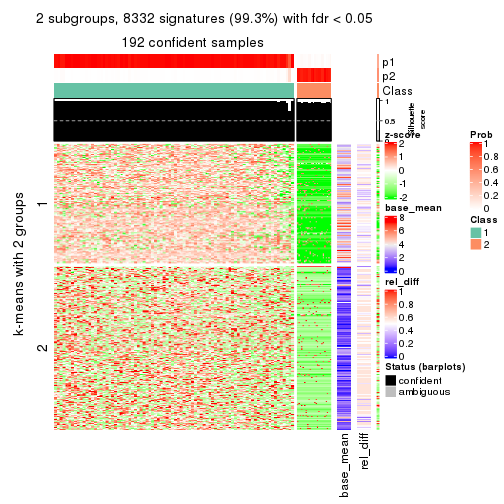</p>

</div>
<div id='tab-MAD-NMF-get-signatures-2'>
<pre><code class="r">get_signatures(res, k = 3)
</code></pre>

<p></p>

</div>
<div id='tab-MAD-NMF-get-signatures-3'>
<pre><code class="r">get_signatures(res, k = 4)
</code></pre>

<p></p>

</div>
<div id='tab-MAD-NMF-get-signatures-4'>
<pre><code class="r">get_signatures(res, k = 5)
</code></pre>

<p></p>

</div>
<div id='tab-MAD-NMF-get-signatures-5'>
<pre><code class="r">get_signatures(res, k = 6)
</code></pre>

<p></p>

</div>
</div>


Signature heatmaps where rows are not scaled:


<script>
$( function() {
	$( '#tabs-MAD-NMF-get-signatures-no-scale' ).tabs();
} );
</script>
<div id='tabs-MAD-NMF-get-signatures-no-scale'>
<ul>
<li><a href='#tab-MAD-NMF-get-signatures-no-scale-1'>k = 2</a></li>
<li><a href='#tab-MAD-NMF-get-signatures-no-scale-2'>k = 3</a></li>
<li><a href='#tab-MAD-NMF-get-signatures-no-scale-3'>k = 4</a></li>
<li><a href='#tab-MAD-NMF-get-signatures-no-scale-4'>k = 5</a></li>
<li><a href='#tab-MAD-NMF-get-signatures-no-scale-5'>k = 6</a></li>
</ul>
<div id='tab-MAD-NMF-get-signatures-no-scale-1'>
<pre><code class="r">get_signatures(res, k = 2, scale_rows = FALSE)
</code></pre>

<p></p>

</div>
<div id='tab-MAD-NMF-get-signatures-no-scale-2'>
<pre><code class="r">get_signatures(res, k = 3, scale_rows = FALSE)
</code></pre>

<p></p>

</div>
<div id='tab-MAD-NMF-get-signatures-no-scale-3'>
<pre><code class="r">get_signatures(res, k = 4, scale_rows = FALSE)
</code></pre>

<p></p>

</div>
<div id='tab-MAD-NMF-get-signatures-no-scale-4'>
<pre><code class="r">get_signatures(res, k = 5, scale_rows = FALSE)
</code></pre>

<p></p>

</div>
<div id='tab-MAD-NMF-get-signatures-no-scale-5'>
<pre><code class="r">get_signatures(res, k = 6, scale_rows = FALSE)
</code></pre>

<p></p>

</div>
</div>


Compare the overlap of signatures from different k:

```r
compare_signatures(res)
```


`get_signature()` returns a data frame invisibly. TO get the list of signatures, the function
call should be assigned to a variable explicitly. In following code, if `plot` argument is set
to `FALSE`, no heatmap is plotted while only the differential analysis is performed.

```r
# code only for demonstration
tb = get_signature(res, k = ..., plot = FALSE)
```

An example of the output of `tb` is:

```
#>   which_row         fdr    mean_1    mean_2 scaled_mean_1 scaled_mean_2 km
#> 1        38 0.042760348  8.373488  9.131774    -0.5533452     0.5164555  1
#> 2        40 0.018707592  7.106213  8.469186    -0.6173731     0.5762149  1
#> 3        55 0.019134737 10.221463 11.207825    -0.6159697     0.5749050  1
#> 4        59 0.006059896  5.921854  7.869574    -0.6899429     0.6439467  1
#> 5        60 0.018055526  8.928898 10.211722    -0.6204761     0.5791110  1
#> 6        98 0.009384629 15.714769 14.887706     0.6635654    -0.6193277  2
...
```

The columns in `tb` are:

1. `which_row`: row indices corresponding to the input matrix.
2. `fdr`: FDR for the differential test. 
3. `mean_x`: The mean value in group x.
4. `scaled_mean_x`: The mean value in group x after rows are scaled.
5. `km`: Row groups if k-means clustering is applied to rows.


UMAP plot which shows how samples are separated.


<script>
$( function() {
	$( '#tabs-MAD-NMF-dimension-reduction' ).tabs();
} );
</script>
<div id='tabs-MAD-NMF-dimension-reduction'>
<ul>
<li><a href='#tab-MAD-NMF-dimension-reduction-1'>k = 2</a></li>
<li><a href='#tab-MAD-NMF-dimension-reduction-2'>k = 3</a></li>
<li><a href='#tab-MAD-NMF-dimension-reduction-3'>k = 4</a></li>
<li><a href='#tab-MAD-NMF-dimension-reduction-4'>k = 5</a></li>
<li><a href='#tab-MAD-NMF-dimension-reduction-5'>k = 6</a></li>
</ul>
<div id='tab-MAD-NMF-dimension-reduction-1'>
<pre><code class="r">dimension_reduction(res, k = 2, method = &quot;UMAP&quot;)
</code></pre>

<p></p>

</div>
<div id='tab-MAD-NMF-dimension-reduction-2'>
<pre><code class="r">dimension_reduction(res, k = 3, method = &quot;UMAP&quot;)
</code></pre>

<p></p>

</div>
<div id='tab-MAD-NMF-dimension-reduction-3'>
<pre><code class="r">dimension_reduction(res, k = 4, method = &quot;UMAP&quot;)
</code></pre>

<p></p>

</div>
<div id='tab-MAD-NMF-dimension-reduction-4'>
<pre><code class="r">dimension_reduction(res, k = 5, method = &quot;UMAP&quot;)
</code></pre>

<p></p>

</div>
<div id='tab-MAD-NMF-dimension-reduction-5'>
<pre><code class="r">dimension_reduction(res, k = 6, method = &quot;UMAP&quot;)
</code></pre>

<p></p>

</div>
</div>


Following heatmap shows how subgroups are split when increasing `k`:

```r
collect_classes(res)
```


If matrix rows can be associated to genes, consider to use `GO_Enrichment(res,
...)` to perform function enrichment for the signature genes.


 

---------------------------------------------------


### ATC:hclust**


The object with results only for a single top-value method and a single partition method 
can be extracted as:

```r
res = res_list["ATC", "hclust"]
# you can also extract it by
# res = res_list["ATC:hclust"]
```

A summary of `res` and all the functions that can be applied to it:

```r
res
```

```
#> A 'ConsensusPartition' object with k = 2, 3, 4, 5, 6.
#>   On a matrix with 8394 rows and 194 columns.
#>   Top rows (839, 1678, 2518, 3358, 4197) are extracted by 'ATC' method.
#>   Subgroups are detected by 'hclust' method.
#>   Performed in total 1250 partitions by row resampling.
#>   Best k for subgroups seems to be 2.
#> 
#> Following methods can be applied to this 'ConsensusPartition' object:
#>  [1] "cola_report"             "collect_classes"         "collect_plots"          
#>  [4] "collect_stats"           "colnames"                "compare_signatures"     
#>  [7] "consensus_heatmap"       "dimension_reduction"     "functional_enrichment"  
#> [10] "get_anno_col"            "get_anno"                "get_classes"            
#> [13] "get_consensus"           "get_matrix"              "get_membership"         
#> [16] "get_param"               "get_signatures"          "get_stats"              
#> [19] "is_best_k"               "is_stable_k"             "membership_heatmap"     
#> [22] "ncol"                    "nrow"                    "plot_ecdf"              
#> [25] "rownames"                "select_partition_number" "show"                   
#> [28] "suggest_best_k"          "test_to_known_factors"
```

`collect_plots()` function collects all the plots made from `res` for all `k` (number of partitions)
into one single page to provide an easy and fast comparison between different `k`.

```r
collect_plots(res)
```


The plots are:

- The first row: a plot of the ECDF (Empirical cumulative distribution
  function) curves of the consensus matrix for each `k` and the heatmap of
  predicted classes for each `k`.
- The second row: heatmaps of the consensus matrix for each `k`.
- The third row: heatmaps of the membership matrix for each `k`.
- The fouth row: heatmaps of the signatures for each `k`.

All the plots in panels can be made by individual functions and they are
plotted later in this section.

`select_partition_number()` produces several plots showing different
statistics for choosing "optimized" `k`. There are following statistics:

- ECDF curves of the consensus matrix for each `k`;
- 1-PAC. [The PAC
  score](https://en.wikipedia.org/wiki/Consensus_clustering#Over-interpretation_potential_of_consensus_clustering)
  measures the proportion of the ambiguous subgrouping.
- Mean silhouette score.
- Concordance. The mean probability of fiting the consensus class ids in all
  partitions.
- Area increased. Denote $A_k$ as the area under the ECDF curve for current
  `k`, the area increased is defined as $A_k - A_{k-1}$.
- Rand index. The percent of pairs of samples that are both in a same cluster
  or both are not in a same cluster in the partition of k and k-1.
- Jaccard index. The ratio of pairs of samples are both in a same cluster in
  the partition of k and k-1 and the pairs of samples are both in a same
  cluster in the partition k or k-1.

The detailed explanations of these statistics can be found in [the cola
vignette](http://bioconductor.org/packages/devel/bioc/vignettes/cola/inst/doc/cola.html#toc_13).

Generally speaking, lower PAC score, higher mean silhouette score or higher
concordance corresponds to better partition. Rand index and Jaccard index
measure how similar the current partition is compared to partition with `k-1`.
If they are too similar, we won't accept `k` is better than `k-1`.

```r
select_partition_number(res)
```


The numeric values for all these statistics can be obtained by `get_stats()`.

```r
get_stats(res)
```

```
#>   k 1-PAC mean_silhouette concordance area_increased  Rand Jaccard
#> 2 2     1           1.000       1.000        0.21872 0.782   0.782
#> 3 3     1           1.000       1.000        0.08198 0.982   0.977
#> 4 4     1           0.978       0.992        0.03421 0.999   0.998
#> 5 5     1           0.960       0.987        0.00708 0.999   0.998
#> 6 6     1           0.955       0.985        0.00659 0.999   0.999
```

`suggest_best_k()` suggests the best $k$ based on these statistics. The rules are as follows:

- All $k$ with Jaccard index larger than 0.95 are removed because the increase of
  the partition number does not provides enough extra information. If all $k$ are removed,
  the best $k$ is assigned by `NA`.
- For $k$ with 1-PAC larger than 0.9, the maximal $k$ is taken as the "best k". Other $k$ is called "optional k".
- If it does not fit the second rule. The $k$ with the highest vote of highest
  1-PAC, mean silhouette and concordance is taken as the "best k".

```r
suggest_best_k(res)
```

```
#> [1] 2
```


Following shows the table of the partitions (You need to click the **show/hide
code output** link to see it). The membership matrix (columns with name `p*`)
is inferred by
[`clue::cl_consensus()`](https://www.rdocumentation.org/link/cl_consensus?package=clue)
function with the `SE` method. Basically the value in the membership matrix
represents the probability to belong to a certain group. The finall class
label for an item is determined with the group with highest probability it
belongs to.

In `get_classes()` function, the entropy is calculated from the membership
matrix and the silhouette score is calculated from the consensus matrix.


<script>
$( function() {
	$( '#tabs-ATC-hclust-get-classes' ).tabs();
} );
</script>
<div id='tabs-ATC-hclust-get-classes'>
<ul>
<li><a href='#tab-ATC-hclust-get-classes-1'>k = 2</a></li>
<li><a href='#tab-ATC-hclust-get-classes-2'>k = 3</a></li>
<li><a href='#tab-ATC-hclust-get-classes-3'>k = 4</a></li>
<li><a href='#tab-ATC-hclust-get-classes-4'>k = 5</a></li>
<li><a href='#tab-ATC-hclust-get-classes-5'>k = 6</a></li>
</ul>

<div id='tab-ATC-hclust-get-classes-1'>
<p><a id='tab-ATC-hclust-get-classes-1-a' style='color:#0366d6' href='#'>show/hide code output</a></p>
<pre><code class="r">cbind(get_classes(res, k = 2), get_membership(res, k = 2))
</code></pre>

<pre><code>#&gt;           class entropy silhouette p1 p2
#&gt; ERR467487     1       0          1  1  0
#&gt; ERR467498     1       0          1  1  0
#&gt; ERR658998     1       0          1  1  0
#&gt; ERR659094     1       0          1  1  0
#&gt; ERR658999     1       0          1  1  0
#&gt; ERR659095     1       0          1  1  0
#&gt; ERR659000     1       0          1  1  0
#&gt; ERR659096     1       0          1  1  0
#&gt; ERR659001     1       0          1  1  0
#&gt; ERR659097     1       0          1  1  0
#&gt; ERR659002     1       0          1  1  0
#&gt; ERR659098     1       0          1  1  0
#&gt; ERR659003     1       0          1  1  0
#&gt; ERR659099     1       0          1  1  0
#&gt; ERR659004     1       0          1  1  0
#&gt; ERR659100     1       0          1  1  0
#&gt; ERR659005     1       0          1  1  0
#&gt; ERR659101     1       0          1  1  0
#&gt; ERR659006     1       0          1  1  0
#&gt; ERR659102     1       0          1  1  0
#&gt; ERR659007     1       0          1  1  0
#&gt; ERR659103     1       0          1  1  0
#&gt; ERR659008     2       0          1  0  1
#&gt; ERR659104     2       0          1  0  1
#&gt; ERR659009     1       0          1  1  0
#&gt; ERR659105     1       0          1  1  0
#&gt; ERR659010     1       0          1  1  0
#&gt; ERR659106     1       0          1  1  0
#&gt; ERR659011     1       0          1  1  0
#&gt; ERR659107     1       0          1  1  0
#&gt; ERR659012     1       0          1  1  0
#&gt; ERR659108     1       0          1  1  0
#&gt; ERR659013     1       0          1  1  0
#&gt; ERR659109     1       0          1  1  0
#&gt; ERR659014     2       0          1  0  1
#&gt; ERR659110     2       0          1  0  1
#&gt; ERR659015     1       0          1  1  0
#&gt; ERR659111     1       0          1  1  0
#&gt; ERR659016     1       0          1  1  0
#&gt; ERR659112     1       0          1  1  0
#&gt; ERR659017     2       0          1  0  1
#&gt; ERR659113     2       0          1  0  1
#&gt; ERR659018     1       0          1  1  0
#&gt; ERR659114     1       0          1  1  0
#&gt; ERR659019     1       0          1  1  0
#&gt; ERR659115     1       0          1  1  0
#&gt; ERR659020     1       0          1  1  0
#&gt; ERR659116     1       0          1  1  0
#&gt; ERR659021     1       0          1  1  0
#&gt; ERR659117     1       0          1  1  0
#&gt; ERR659022     1       0          1  1  0
#&gt; ERR659118     1       0          1  1  0
#&gt; ERR659023     1       0          1  1  0
#&gt; ERR659119     1       0          1  1  0
#&gt; ERR659024     1       0          1  1  0
#&gt; ERR659120     1       0          1  1  0
#&gt; ERR659025     1       0          1  1  0
#&gt; ERR659121     1       0          1  1  0
#&gt; ERR659026     1       0          1  1  0
#&gt; ERR659122     1       0          1  1  0
#&gt; ERR659027     1       0          1  1  0
#&gt; ERR659123     1       0          1  1  0
#&gt; ERR659028     1       0          1  1  0
#&gt; ERR659124     1       0          1  1  0
#&gt; ERR659029     1       0          1  1  0
#&gt; ERR659125     1       0          1  1  0
#&gt; ERR659030     1       0          1  1  0
#&gt; ERR659126     1       0          1  1  0
#&gt; ERR659031     1       0          1  1  0
#&gt; ERR659127     1       0          1  1  0
#&gt; ERR659032     1       0          1  1  0
#&gt; ERR659128     1       0          1  1  0
#&gt; ERR659033     1       0          1  1  0
#&gt; ERR659129     1       0          1  1  0
#&gt; ERR659034     2       0          1  0  1
#&gt; ERR659130     2       0          1  0  1
#&gt; ERR659035     1       0          1  1  0
#&gt; ERR659131     1       0          1  1  0
#&gt; ERR659036     1       0          1  1  0
#&gt; ERR659132     1       0          1  1  0
#&gt; ERR659037     1       0          1  1  0
#&gt; ERR659133     1       0          1  1  0
#&gt; ERR659038     1       0          1  1  0
#&gt; ERR659134     1       0          1  1  0
#&gt; ERR659039     1       0          1  1  0
#&gt; ERR659135     1       0          1  1  0
#&gt; ERR659040     1       0          1  1  0
#&gt; ERR659136     1       0          1  1  0
#&gt; ERR659041     1       0          1  1  0
#&gt; ERR659137     1       0          1  1  0
#&gt; ERR659042     1       0          1  1  0
#&gt; ERR659138     1       0          1  1  0
#&gt; ERR659043     1       0          1  1  0
#&gt; ERR659139     1       0          1  1  0
#&gt; ERR659044     2       0          1  0  1
#&gt; ERR659140     2       0          1  0  1
#&gt; ERR659045     1       0          1  1  0
#&gt; ERR659141     1       0          1  1  0
#&gt; ERR659046     1       0          1  1  0
#&gt; ERR659142     1       0          1  1  0
#&gt; ERR659047     1       0          1  1  0
#&gt; ERR659143     1       0          1  1  0
#&gt; ERR659048     1       0          1  1  0
#&gt; ERR659144     1       0          1  1  0
#&gt; ERR659049     1       0          1  1  0
#&gt; ERR659145     1       0          1  1  0
#&gt; ERR659050     1       0          1  1  0
#&gt; ERR659146     1       0          1  1  0
#&gt; ERR659051     1       0          1  1  0
#&gt; ERR659147     1       0          1  1  0
#&gt; ERR659052     1       0          1  1  0
#&gt; ERR659148     1       0          1  1  0
#&gt; ERR659053     1       0          1  1  0
#&gt; ERR659149     1       0          1  1  0
#&gt; ERR659054     2       0          1  0  1
#&gt; ERR659150     2       0          1  0  1
#&gt; ERR659055     1       0          1  1  0
#&gt; ERR659151     1       0          1  1  0
#&gt; ERR659056     1       0          1  1  0
#&gt; ERR659152     1       0          1  1  0
#&gt; ERR659057     1       0          1  1  0
#&gt; ERR659153     1       0          1  1  0
#&gt; ERR659058     1       0          1  1  0
#&gt; ERR659154     1       0          1  1  0
#&gt; ERR659059     1       0          1  1  0
#&gt; ERR659155     1       0          1  1  0
#&gt; ERR659060     1       0          1  1  0
#&gt; ERR659156     1       0          1  1  0
#&gt; ERR659061     1       0          1  1  0
#&gt; ERR659157     1       0          1  1  0
#&gt; ERR659062     1       0          1  1  0
#&gt; ERR659158     1       0          1  1  0
#&gt; ERR659063     1       0          1  1  0
#&gt; ERR659159     1       0          1  1  0
#&gt; ERR659064     1       0          1  1  0
#&gt; ERR659160     1       0          1  1  0
#&gt; ERR659065     2       0          1  0  1
#&gt; ERR659161     2       0          1  0  1
#&gt; ERR659066     1       0          1  1  0
#&gt; ERR659162     1       0          1  1  0
#&gt; ERR659067     1       0          1  1  0
#&gt; ERR659163     1       0          1  1  0
#&gt; ERR659068     2       0          1  0  1
#&gt; ERR659164     2       0          1  0  1
#&gt; ERR659069     1       0          1  1  0
#&gt; ERR659165     1       0          1  1  0
#&gt; ERR659070     1       0          1  1  0
#&gt; ERR659166     1       0          1  1  0
#&gt; ERR659071     1       0          1  1  0
#&gt; ERR659167     1       0          1  1  0
#&gt; ERR659072     1       0          1  1  0
#&gt; ERR659168     1       0          1  1  0
#&gt; ERR659073     1       0          1  1  0
#&gt; ERR659169     1       0          1  1  0
#&gt; ERR659074     2       0          1  0  1
#&gt; ERR659170     2       0          1  0  1
#&gt; ERR659075     1       0          1  1  0
#&gt; ERR659171     1       0          1  1  0
#&gt; ERR659076     2       0          1  0  1
#&gt; ERR659172     2       0          1  0  1
#&gt; ERR659077     1       0          1  1  0
#&gt; ERR659173     1       0          1  1  0
#&gt; ERR659078     1       0          1  1  0
#&gt; ERR659174     1       0          1  1  0
#&gt; ERR659079     1       0          1  1  0
#&gt; ERR659175     1       0          1  1  0
#&gt; ERR659080     1       0          1  1  0
#&gt; ERR659176     1       0          1  1  0
#&gt; ERR659081     1       0          1  1  0
#&gt; ERR659177     1       0          1  1  0
#&gt; ERR659082     1       0          1  1  0
#&gt; ERR659178     1       0          1  1  0
#&gt; ERR659083     2       0          1  0  1
#&gt; ERR659179     2       0          1  0  1
#&gt; ERR659084     2       0          1  0  1
#&gt; ERR659180     2       0          1  0  1
#&gt; ERR659085     1       0          1  1  0
#&gt; ERR659181     1       0          1  1  0
#&gt; ERR659086     1       0          1  1  0
#&gt; ERR659182     1       0          1  1  0
#&gt; ERR659087     1       0          1  1  0
#&gt; ERR659183     1       0          1  1  0
#&gt; ERR659088     1       0          1  1  0
#&gt; ERR659184     1       0          1  1  0
#&gt; ERR659089     1       0          1  1  0
#&gt; ERR659185     1       0          1  1  0
#&gt; ERR659090     1       0          1  1  0
#&gt; ERR659186     1       0          1  1  0
#&gt; ERR659091     1       0          1  1  0
#&gt; ERR659187     1       0          1  1  0
#&gt; ERR659092     1       0          1  1  0
#&gt; ERR659188     1       0          1  1  0
#&gt; ERR659093     1       0          1  1  0
#&gt; ERR659189     1       0          1  1  0
</code></pre>

<script>
$('#tab-ATC-hclust-get-classes-1-a').parent().next().next().hide();
$('#tab-ATC-hclust-get-classes-1-a').click(function(){
  $('#tab-ATC-hclust-get-classes-1-a').parent().next().next().toggle();
  return(false);
});
</script>
</div>

<div id='tab-ATC-hclust-get-classes-2'>
<p><a id='tab-ATC-hclust-get-classes-2-a' style='color:#0366d6' href='#'>show/hide code output</a></p>
<pre><code class="r">cbind(get_classes(res, k = 3), get_membership(res, k = 3))
</code></pre>

<pre><code>#&gt;           class entropy silhouette p1 p2 p3
#&gt; ERR467487     1       0          1  1  0  0
#&gt; ERR467498     1       0          1  1  0  0
#&gt; ERR658998     1       0          1  1  0  0
#&gt; ERR659094     1       0          1  1  0  0
#&gt; ERR658999     1       0          1  1  0  0
#&gt; ERR659095     1       0          1  1  0  0
#&gt; ERR659000     1       0          1  1  0  0
#&gt; ERR659096     1       0          1  1  0  0
#&gt; ERR659001     1       0          1  1  0  0
#&gt; ERR659097     1       0          1  1  0  0
#&gt; ERR659002     1       0          1  1  0  0
#&gt; ERR659098     1       0          1  1  0  0
#&gt; ERR659003     1       0          1  1  0  0
#&gt; ERR659099     1       0          1  1  0  0
#&gt; ERR659004     1       0          1  1  0  0
#&gt; ERR659100     1       0          1  1  0  0
#&gt; ERR659005     1       0          1  1  0  0
#&gt; ERR659101     1       0          1  1  0  0
#&gt; ERR659006     1       0          1  1  0  0
#&gt; ERR659102     1       0          1  1  0  0
#&gt; ERR659007     1       0          1  1  0  0
#&gt; ERR659103     1       0          1  1  0  0
#&gt; ERR659008     2       0          1  0  1  0
#&gt; ERR659104     2       0          1  0  1  0
#&gt; ERR659009     1       0          1  1  0  0
#&gt; ERR659105     1       0          1  1  0  0
#&gt; ERR659010     1       0          1  1  0  0
#&gt; ERR659106     1       0          1  1  0  0
#&gt; ERR659011     1       0          1  1  0  0
#&gt; ERR659107     1       0          1  1  0  0
#&gt; ERR659012     1       0          1  1  0  0
#&gt; ERR659108     1       0          1  1  0  0
#&gt; ERR659013     1       0          1  1  0  0
#&gt; ERR659109     1       0          1  1  0  0
#&gt; ERR659014     2       0          1  0  1  0
#&gt; ERR659110     2       0          1  0  1  0
#&gt; ERR659015     1       0          1  1  0  0
#&gt; ERR659111     1       0          1  1  0  0
#&gt; ERR659016     1       0          1  1  0  0
#&gt; ERR659112     1       0          1  1  0  0
#&gt; ERR659017     2       0          1  0  1  0
#&gt; ERR659113     2       0          1  0  1  0
#&gt; ERR659018     1       0          1  1  0  0
#&gt; ERR659114     1       0          1  1  0  0
#&gt; ERR659019     1       0          1  1  0  0
#&gt; ERR659115     1       0          1  1  0  0
#&gt; ERR659020     1       0          1  1  0  0
#&gt; ERR659116     1       0          1  1  0  0
#&gt; ERR659021     1       0          1  1  0  0
#&gt; ERR659117     1       0          1  1  0  0
#&gt; ERR659022     1       0          1  1  0  0
#&gt; ERR659118     1       0          1  1  0  0
#&gt; ERR659023     1       0          1  1  0  0
#&gt; ERR659119     1       0          1  1  0  0
#&gt; ERR659024     1       0          1  1  0  0
#&gt; ERR659120     1       0          1  1  0  0
#&gt; ERR659025     1       0          1  1  0  0
#&gt; ERR659121     1       0          1  1  0  0
#&gt; ERR659026     1       0          1  1  0  0
#&gt; ERR659122     1       0          1  1  0  0
#&gt; ERR659027     1       0          1  1  0  0
#&gt; ERR659123     1       0          1  1  0  0
#&gt; ERR659028     1       0          1  1  0  0
#&gt; ERR659124     1       0          1  1  0  0
#&gt; ERR659029     1       0          1  1  0  0
#&gt; ERR659125     1       0          1  1  0  0
#&gt; ERR659030     1       0          1  1  0  0
#&gt; ERR659126     1       0          1  1  0  0
#&gt; ERR659031     1       0          1  1  0  0
#&gt; ERR659127     1       0          1  1  0  0
#&gt; ERR659032     1       0          1  1  0  0
#&gt; ERR659128     1       0          1  1  0  0
#&gt; ERR659033     1       0          1  1  0  0
#&gt; ERR659129     1       0          1  1  0  0
#&gt; ERR659034     2       0          1  0  1  0
#&gt; ERR659130     2       0          1  0  1  0
#&gt; ERR659035     1       0          1  1  0  0
#&gt; ERR659131     1       0          1  1  0  0
#&gt; ERR659036     1       0          1  1  0  0
#&gt; ERR659132     1       0          1  1  0  0
#&gt; ERR659037     1       0          1  1  0  0
#&gt; ERR659133     1       0          1  1  0  0
#&gt; ERR659038     1       0          1  1  0  0
#&gt; ERR659134     1       0          1  1  0  0
#&gt; ERR659039     1       0          1  1  0  0
#&gt; ERR659135     1       0          1  1  0  0
#&gt; ERR659040     1       0          1  1  0  0
#&gt; ERR659136     1       0          1  1  0  0
#&gt; ERR659041     1       0          1  1  0  0
#&gt; ERR659137     1       0          1  1  0  0
#&gt; ERR659042     1       0          1  1  0  0
#&gt; ERR659138     1       0          1  1  0  0
#&gt; ERR659043     1       0          1  1  0  0
#&gt; ERR659139     1       0          1  1  0  0
#&gt; ERR659044     2       0          1  0  1  0
#&gt; ERR659140     2       0          1  0  1  0
#&gt; ERR659045     1       0          1  1  0  0
#&gt; ERR659141     1       0          1  1  0  0
#&gt; ERR659046     1       0          1  1  0  0
#&gt; ERR659142     1       0          1  1  0  0
#&gt; ERR659047     1       0          1  1  0  0
#&gt; ERR659143     1       0          1  1  0  0
#&gt; ERR659048     1       0          1  1  0  0
#&gt; ERR659144     1       0          1  1  0  0
#&gt; ERR659049     1       0          1  1  0  0
#&gt; ERR659145     1       0          1  1  0  0
#&gt; ERR659050     1       0          1  1  0  0
#&gt; ERR659146     1       0          1  1  0  0
#&gt; ERR659051     1       0          1  1  0  0
#&gt; ERR659147     1       0          1  1  0  0
#&gt; ERR659052     1       0          1  1  0  0
#&gt; ERR659148     1       0          1  1  0  0
#&gt; ERR659053     1       0          1  1  0  0
#&gt; ERR659149     1       0          1  1  0  0
#&gt; ERR659054     2       0          1  0  1  0
#&gt; ERR659150     2       0          1  0  1  0
#&gt; ERR659055     1       0          1  1  0  0
#&gt; ERR659151     1       0          1  1  0  0
#&gt; ERR659056     1       0          1  1  0  0
#&gt; ERR659152     1       0          1  1  0  0
#&gt; ERR659057     1       0          1  1  0  0
#&gt; ERR659153     1       0          1  1  0  0
#&gt; ERR659058     1       0          1  1  0  0
#&gt; ERR659154     1       0          1  1  0  0
#&gt; ERR659059     1       0          1  1  0  0
#&gt; ERR659155     1       0          1  1  0  0
#&gt; ERR659060     1       0          1  1  0  0
#&gt; ERR659156     1       0          1  1  0  0
#&gt; ERR659061     1       0          1  1  0  0
#&gt; ERR659157     1       0          1  1  0  0
#&gt; ERR659062     1       0          1  1  0  0
#&gt; ERR659158     1       0          1  1  0  0
#&gt; ERR659063     1       0          1  1  0  0
#&gt; ERR659159     1       0          1  1  0  0
#&gt; ERR659064     1       0          1  1  0  0
#&gt; ERR659160     1       0          1  1  0  0
#&gt; ERR659065     2       0          1  0  1  0
#&gt; ERR659161     2       0          1  0  1  0
#&gt; ERR659066     1       0          1  1  0  0
#&gt; ERR659162     1       0          1  1  0  0
#&gt; ERR659067     1       0          1  1  0  0
#&gt; ERR659163     1       0          1  1  0  0
#&gt; ERR659068     2       0          1  0  1  0
#&gt; ERR659164     2       0          1  0  1  0
#&gt; ERR659069     1       0          1  1  0  0
#&gt; ERR659165     1       0          1  1  0  0
#&gt; ERR659070     1       0          1  1  0  0
#&gt; ERR659166     1       0          1  1  0  0
#&gt; ERR659071     1       0          1  1  0  0
#&gt; ERR659167     1       0          1  1  0  0
#&gt; ERR659072     1       0          1  1  0  0
#&gt; ERR659168     1       0          1  1  0  0
#&gt; ERR659073     1       0          1  1  0  0
#&gt; ERR659169     1       0          1  1  0  0
#&gt; ERR659074     2       0          1  0  1  0
#&gt; ERR659170     2       0          1  0  1  0
#&gt; ERR659075     3       0          1  0  0  1
#&gt; ERR659171     3       0          1  0  0  1
#&gt; ERR659076     2       0          1  0  1  0
#&gt; ERR659172     2       0          1  0  1  0
#&gt; ERR659077     1       0          1  1  0  0
#&gt; ERR659173     1       0          1  1  0  0
#&gt; ERR659078     1       0          1  1  0  0
#&gt; ERR659174     1       0          1  1  0  0
#&gt; ERR659079     1       0          1  1  0  0
#&gt; ERR659175     1       0          1  1  0  0
#&gt; ERR659080     1       0          1  1  0  0
#&gt; ERR659176     1       0          1  1  0  0
#&gt; ERR659081     1       0          1  1  0  0
#&gt; ERR659177     1       0          1  1  0  0
#&gt; ERR659082     1       0          1  1  0  0
#&gt; ERR659178     1       0          1  1  0  0
#&gt; ERR659083     2       0          1  0  1  0
#&gt; ERR659179     2       0          1  0  1  0
#&gt; ERR659084     2       0          1  0  1  0
#&gt; ERR659180     2       0          1  0  1  0
#&gt; ERR659085     1       0          1  1  0  0
#&gt; ERR659181     1       0          1  1  0  0
#&gt; ERR659086     1       0          1  1  0  0
#&gt; ERR659182     1       0          1  1  0  0
#&gt; ERR659087     1       0          1  1  0  0
#&gt; ERR659183     1       0          1  1  0  0
#&gt; ERR659088     1       0          1  1  0  0
#&gt; ERR659184     1       0          1  1  0  0
#&gt; ERR659089     1       0          1  1  0  0
#&gt; ERR659185     1       0          1  1  0  0
#&gt; ERR659090     1       0          1  1  0  0
#&gt; ERR659186     1       0          1  1  0  0
#&gt; ERR659091     1       0          1  1  0  0
#&gt; ERR659187     1       0          1  1  0  0
#&gt; ERR659092     1       0          1  1  0  0
#&gt; ERR659188     1       0          1  1  0  0
#&gt; ERR659093     1       0          1  1  0  0
#&gt; ERR659189     1       0          1  1  0  0
</code></pre>

<script>
$('#tab-ATC-hclust-get-classes-2-a').parent().next().next().hide();
$('#tab-ATC-hclust-get-classes-2-a').click(function(){
  $('#tab-ATC-hclust-get-classes-2-a').parent().next().next().toggle();
  return(false);
});
</script>
</div>

<div id='tab-ATC-hclust-get-classes-3'>
<p><a id='tab-ATC-hclust-get-classes-3-a' style='color:#0366d6' href='#'>show/hide code output</a></p>
<pre><code class="r">cbind(get_classes(res, k = 4), get_membership(res, k = 4))
</code></pre>

<pre><code>#&gt;           class entropy silhouette    p1    p2 p3    p4
#&gt; ERR467487     1  0.3610      0.758 0.800 0.000  0 0.200
#&gt; ERR467498     1  0.3610      0.758 0.800 0.000  0 0.200
#&gt; ERR658998     1  0.0000      0.995 1.000 0.000  0 0.000
#&gt; ERR659094     1  0.0000      0.995 1.000 0.000  0 0.000
#&gt; ERR658999     1  0.0000      0.995 1.000 0.000  0 0.000
#&gt; ERR659095     1  0.0000      0.995 1.000 0.000  0 0.000
#&gt; ERR659000     1  0.0000      0.995 1.000 0.000  0 0.000
#&gt; ERR659096     1  0.0000      0.995 1.000 0.000  0 0.000
#&gt; ERR659001     1  0.0000      0.995 1.000 0.000  0 0.000
#&gt; ERR659097     1  0.0000      0.995 1.000 0.000  0 0.000
#&gt; ERR659002     1  0.0000      0.995 1.000 0.000  0 0.000
#&gt; ERR659098     1  0.0000      0.995 1.000 0.000  0 0.000
#&gt; ERR659003     1  0.0000      0.995 1.000 0.000  0 0.000
#&gt; ERR659099     1  0.0000      0.995 1.000 0.000  0 0.000
#&gt; ERR659004     1  0.0000      0.995 1.000 0.000  0 0.000
#&gt; ERR659100     1  0.0000      0.995 1.000 0.000  0 0.000
#&gt; ERR659005     1  0.0000      0.995 1.000 0.000  0 0.000
#&gt; ERR659101     1  0.0000      0.995 1.000 0.000  0 0.000
#&gt; ERR659006     1  0.0000      0.995 1.000 0.000  0 0.000
#&gt; ERR659102     1  0.0000      0.995 1.000 0.000  0 0.000
#&gt; ERR659007     1  0.0000      0.995 1.000 0.000  0 0.000
#&gt; ERR659103     1  0.0000      0.995 1.000 0.000  0 0.000
#&gt; ERR659008     2  0.0000      0.965 0.000 1.000  0 0.000
#&gt; ERR659104     2  0.0000      0.965 0.000 1.000  0 0.000
#&gt; ERR659009     1  0.0000      0.995 1.000 0.000  0 0.000
#&gt; ERR659105     1  0.0000      0.995 1.000 0.000  0 0.000
#&gt; ERR659010     1  0.0000      0.995 1.000 0.000  0 0.000
#&gt; ERR659106     1  0.0000      0.995 1.000 0.000  0 0.000
#&gt; ERR659011     1  0.0000      0.995 1.000 0.000  0 0.000
#&gt; ERR659107     1  0.0000      0.995 1.000 0.000  0 0.000
#&gt; ERR659012     1  0.0000      0.995 1.000 0.000  0 0.000
#&gt; ERR659108     1  0.0000      0.995 1.000 0.000  0 0.000
#&gt; ERR659013     1  0.0000      0.995 1.000 0.000  0 0.000
#&gt; ERR659109     1  0.0000      0.995 1.000 0.000  0 0.000
#&gt; ERR659014     2  0.0188      0.963 0.000 0.996  0 0.004
#&gt; ERR659110     2  0.0188      0.963 0.000 0.996  0 0.004
#&gt; ERR659015     1  0.0000      0.995 1.000 0.000  0 0.000
#&gt; ERR659111     1  0.0000      0.995 1.000 0.000  0 0.000
#&gt; ERR659016     1  0.0000      0.995 1.000 0.000  0 0.000
#&gt; ERR659112     1  0.0000      0.995 1.000 0.000  0 0.000
#&gt; ERR659017     2  0.0000      0.965 0.000 1.000  0 0.000
#&gt; ERR659113     2  0.0000      0.965 0.000 1.000  0 0.000
#&gt; ERR659018     1  0.0000      0.995 1.000 0.000  0 0.000
#&gt; ERR659114     1  0.0000      0.995 1.000 0.000  0 0.000
#&gt; ERR659019     1  0.0000      0.995 1.000 0.000  0 0.000
#&gt; ERR659115     1  0.0000      0.995 1.000 0.000  0 0.000
#&gt; ERR659020     1  0.0000      0.995 1.000 0.000  0 0.000
#&gt; ERR659116     1  0.0000      0.995 1.000 0.000  0 0.000
#&gt; ERR659021     1  0.0000      0.995 1.000 0.000  0 0.000
#&gt; ERR659117     1  0.0000      0.995 1.000 0.000  0 0.000
#&gt; ERR659022     1  0.0000      0.995 1.000 0.000  0 0.000
#&gt; ERR659118     1  0.0000      0.995 1.000 0.000  0 0.000
#&gt; ERR659023     1  0.0000      0.995 1.000 0.000  0 0.000
#&gt; ERR659119     1  0.0000      0.995 1.000 0.000  0 0.000
#&gt; ERR659024     1  0.0000      0.995 1.000 0.000  0 0.000
#&gt; ERR659120     1  0.0000      0.995 1.000 0.000  0 0.000
#&gt; ERR659025     1  0.0000      0.995 1.000 0.000  0 0.000
#&gt; ERR659121     1  0.0000      0.995 1.000 0.000  0 0.000
#&gt; ERR659026     1  0.0000      0.995 1.000 0.000  0 0.000
#&gt; ERR659122     1  0.0000      0.995 1.000 0.000  0 0.000
#&gt; ERR659027     1  0.0000      0.995 1.000 0.000  0 0.000
#&gt; ERR659123     1  0.0000      0.995 1.000 0.000  0 0.000
#&gt; ERR659028     1  0.0000      0.995 1.000 0.000  0 0.000
#&gt; ERR659124     1  0.0000      0.995 1.000 0.000  0 0.000
#&gt; ERR659029     1  0.0000      0.995 1.000 0.000  0 0.000
#&gt; ERR659125     1  0.0000      0.995 1.000 0.000  0 0.000
#&gt; ERR659030     1  0.0000      0.995 1.000 0.000  0 0.000
#&gt; ERR659126     1  0.0000      0.995 1.000 0.000  0 0.000
#&gt; ERR659031     1  0.0000      0.995 1.000 0.000  0 0.000
#&gt; ERR659127     1  0.0000      0.995 1.000 0.000  0 0.000
#&gt; ERR659032     1  0.0000      0.995 1.000 0.000  0 0.000
#&gt; ERR659128     1  0.0000      0.995 1.000 0.000  0 0.000
#&gt; ERR659033     1  0.0000      0.995 1.000 0.000  0 0.000
#&gt; ERR659129     1  0.0000      0.995 1.000 0.000  0 0.000
#&gt; ERR659034     2  0.0000      0.965 0.000 1.000  0 0.000
#&gt; ERR659130     2  0.0000      0.965 0.000 1.000  0 0.000
#&gt; ERR659035     1  0.0000      0.995 1.000 0.000  0 0.000
#&gt; ERR659131     1  0.0000      0.995 1.000 0.000  0 0.000
#&gt; ERR659036     1  0.0000      0.995 1.000 0.000  0 0.000
#&gt; ERR659132     1  0.0000      0.995 1.000 0.000  0 0.000
#&gt; ERR659037     1  0.0000      0.995 1.000 0.000  0 0.000
#&gt; ERR659133     1  0.0000      0.995 1.000 0.000  0 0.000
#&gt; ERR659038     1  0.0000      0.995 1.000 0.000  0 0.000
#&gt; ERR659134     1  0.0000      0.995 1.000 0.000  0 0.000
#&gt; ERR659039     1  0.0000      0.995 1.000 0.000  0 0.000
#&gt; ERR659135     1  0.0000      0.995 1.000 0.000  0 0.000
#&gt; ERR659040     1  0.0000      0.995 1.000 0.000  0 0.000
#&gt; ERR659136     1  0.0000      0.995 1.000 0.000  0 0.000
#&gt; ERR659041     1  0.0000      0.995 1.000 0.000  0 0.000
#&gt; ERR659137     1  0.0000      0.995 1.000 0.000  0 0.000
#&gt; ERR659042     1  0.0000      0.995 1.000 0.000  0 0.000
#&gt; ERR659138     1  0.0000      0.995 1.000 0.000  0 0.000
#&gt; ERR659043     1  0.0000      0.995 1.000 0.000  0 0.000
#&gt; ERR659139     1  0.0000      0.995 1.000 0.000  0 0.000
#&gt; ERR659044     2  0.0000      0.965 0.000 1.000  0 0.000
#&gt; ERR659140     2  0.0000      0.965 0.000 1.000  0 0.000
#&gt; ERR659045     1  0.0000      0.995 1.000 0.000  0 0.000
#&gt; ERR659141     1  0.0000      0.995 1.000 0.000  0 0.000
#&gt; ERR659046     1  0.0000      0.995 1.000 0.000  0 0.000
#&gt; ERR659142     1  0.0000      0.995 1.000 0.000  0 0.000
#&gt; ERR659047     1  0.0000      0.995 1.000 0.000  0 0.000
#&gt; ERR659143     1  0.0000      0.995 1.000 0.000  0 0.000
#&gt; ERR659048     1  0.0000      0.995 1.000 0.000  0 0.000
#&gt; ERR659144     1  0.0000      0.995 1.000 0.000  0 0.000
#&gt; ERR659049     1  0.0000      0.995 1.000 0.000  0 0.000
#&gt; ERR659145     1  0.0000      0.995 1.000 0.000  0 0.000
#&gt; ERR659050     1  0.0000      0.995 1.000 0.000  0 0.000
#&gt; ERR659146     1  0.0000      0.995 1.000 0.000  0 0.000
#&gt; ERR659051     1  0.3444      0.781 0.816 0.000  0 0.184
#&gt; ERR659147     1  0.3444      0.781 0.816 0.000  0 0.184
#&gt; ERR659052     1  0.0000      0.995 1.000 0.000  0 0.000
#&gt; ERR659148     1  0.0000      0.995 1.000 0.000  0 0.000
#&gt; ERR659053     1  0.0000      0.995 1.000 0.000  0 0.000
#&gt; ERR659149     1  0.0000      0.995 1.000 0.000  0 0.000
#&gt; ERR659054     2  0.3649      0.623 0.000 0.796  0 0.204
#&gt; ERR659150     4  0.4585      0.000 0.000 0.332  0 0.668
#&gt; ERR659055     1  0.0000      0.995 1.000 0.000  0 0.000
#&gt; ERR659151     1  0.0000      0.995 1.000 0.000  0 0.000
#&gt; ERR659056     1  0.0000      0.995 1.000 0.000  0 0.000
#&gt; ERR659152     1  0.0000      0.995 1.000 0.000  0 0.000
#&gt; ERR659057     1  0.0000      0.995 1.000 0.000  0 0.000
#&gt; ERR659153     1  0.0000      0.995 1.000 0.000  0 0.000
#&gt; ERR659058     1  0.0000      0.995 1.000 0.000  0 0.000
#&gt; ERR659154     1  0.0000      0.995 1.000 0.000  0 0.000
#&gt; ERR659059     1  0.0000      0.995 1.000 0.000  0 0.000
#&gt; ERR659155     1  0.0000      0.995 1.000 0.000  0 0.000
#&gt; ERR659060     1  0.0000      0.995 1.000 0.000  0 0.000
#&gt; ERR659156     1  0.0000      0.995 1.000 0.000  0 0.000
#&gt; ERR659061     1  0.0000      0.995 1.000 0.000  0 0.000
#&gt; ERR659157     1  0.0000      0.995 1.000 0.000  0 0.000
#&gt; ERR659062     1  0.0000      0.995 1.000 0.000  0 0.000
#&gt; ERR659158     1  0.0000      0.995 1.000 0.000  0 0.000
#&gt; ERR659063     1  0.0000      0.995 1.000 0.000  0 0.000
#&gt; ERR659159     1  0.0000      0.995 1.000 0.000  0 0.000
#&gt; ERR659064     1  0.0000      0.995 1.000 0.000  0 0.000
#&gt; ERR659160     1  0.0000      0.995 1.000 0.000  0 0.000
#&gt; ERR659065     2  0.3356      0.666 0.000 0.824  0 0.176
#&gt; ERR659161     2  0.1118      0.933 0.000 0.964  0 0.036
#&gt; ERR659066     1  0.0000      0.995 1.000 0.000  0 0.000
#&gt; ERR659162     1  0.0000      0.995 1.000 0.000  0 0.000
#&gt; ERR659067     1  0.0000      0.995 1.000 0.000  0 0.000
#&gt; ERR659163     1  0.0000      0.995 1.000 0.000  0 0.000
#&gt; ERR659068     2  0.0469      0.957 0.000 0.988  0 0.012
#&gt; ERR659164     2  0.0000      0.965 0.000 1.000  0 0.000
#&gt; ERR659069     1  0.0000      0.995 1.000 0.000  0 0.000
#&gt; ERR659165     1  0.0000      0.995 1.000 0.000  0 0.000
#&gt; ERR659070     1  0.0000      0.995 1.000 0.000  0 0.000
#&gt; ERR659166     1  0.0000      0.995 1.000 0.000  0 0.000
#&gt; ERR659071     1  0.0000      0.995 1.000 0.000  0 0.000
#&gt; ERR659167     1  0.0000      0.995 1.000 0.000  0 0.000
#&gt; ERR659072     1  0.0000      0.995 1.000 0.000  0 0.000
#&gt; ERR659168     1  0.0000      0.995 1.000 0.000  0 0.000
#&gt; ERR659073     1  0.0000      0.995 1.000 0.000  0 0.000
#&gt; ERR659169     1  0.0000      0.995 1.000 0.000  0 0.000
#&gt; ERR659074     2  0.0000      0.965 0.000 1.000  0 0.000
#&gt; ERR659170     2  0.0000      0.965 0.000 1.000  0 0.000
#&gt; ERR659075     3  0.0000      1.000 0.000 0.000  1 0.000
#&gt; ERR659171     3  0.0000      1.000 0.000 0.000  1 0.000
#&gt; ERR659076     2  0.1302      0.919 0.000 0.956  0 0.044
#&gt; ERR659172     2  0.1022      0.936 0.000 0.968  0 0.032
#&gt; ERR659077     1  0.0000      0.995 1.000 0.000  0 0.000
#&gt; ERR659173     1  0.0000      0.995 1.000 0.000  0 0.000
#&gt; ERR659078     1  0.0000      0.995 1.000 0.000  0 0.000
#&gt; ERR659174     1  0.0000      0.995 1.000 0.000  0 0.000
#&gt; ERR659079     1  0.0000      0.995 1.000 0.000  0 0.000
#&gt; ERR659175     1  0.0000      0.995 1.000 0.000  0 0.000
#&gt; ERR659080     1  0.0000      0.995 1.000 0.000  0 0.000
#&gt; ERR659176     1  0.0000      0.995 1.000 0.000  0 0.000
#&gt; ERR659081     1  0.0000      0.995 1.000 0.000  0 0.000
#&gt; ERR659177     1  0.0000      0.995 1.000 0.000  0 0.000
#&gt; ERR659082     1  0.0000      0.995 1.000 0.000  0 0.000
#&gt; ERR659178     1  0.0000      0.995 1.000 0.000  0 0.000
#&gt; ERR659083     2  0.0000      0.965 0.000 1.000  0 0.000
#&gt; ERR659179     2  0.0000      0.965 0.000 1.000  0 0.000
#&gt; ERR659084     2  0.0336      0.961 0.000 0.992  0 0.008
#&gt; ERR659180     2  0.0000      0.965 0.000 1.000  0 0.000
#&gt; ERR659085     1  0.0000      0.995 1.000 0.000  0 0.000
#&gt; ERR659181     1  0.0000      0.995 1.000 0.000  0 0.000
#&gt; ERR659086     1  0.0000      0.995 1.000 0.000  0 0.000
#&gt; ERR659182     1  0.0000      0.995 1.000 0.000  0 0.000
#&gt; ERR659087     1  0.0000      0.995 1.000 0.000  0 0.000
#&gt; ERR659183     1  0.0000      0.995 1.000 0.000  0 0.000
#&gt; ERR659088     1  0.0000      0.995 1.000 0.000  0 0.000
#&gt; ERR659184     1  0.0000      0.995 1.000 0.000  0 0.000
#&gt; ERR659089     1  0.0000      0.995 1.000 0.000  0 0.000
#&gt; ERR659185     1  0.0000      0.995 1.000 0.000  0 0.000
#&gt; ERR659090     1  0.0000      0.995 1.000 0.000  0 0.000
#&gt; ERR659186     1  0.0000      0.995 1.000 0.000  0 0.000
#&gt; ERR659091     1  0.0000      0.995 1.000 0.000  0 0.000
#&gt; ERR659187     1  0.0000      0.995 1.000 0.000  0 0.000
#&gt; ERR659092     1  0.0000      0.995 1.000 0.000  0 0.000
#&gt; ERR659188     1  0.0000      0.995 1.000 0.000  0 0.000
#&gt; ERR659093     1  0.0000      0.995 1.000 0.000  0 0.000
#&gt; ERR659189     1  0.0000      0.995 1.000 0.000  0 0.000
</code></pre>

<script>
$('#tab-ATC-hclust-get-classes-3-a').parent().next().next().hide();
$('#tab-ATC-hclust-get-classes-3-a').click(function(){
  $('#tab-ATC-hclust-get-classes-3-a').parent().next().next().toggle();
  return(false);
});
</script>
</div>

<div id='tab-ATC-hclust-get-classes-4'>
<p><a id='tab-ATC-hclust-get-classes-4-a' style='color:#0366d6' href='#'>show/hide code output</a></p>
<pre><code class="r">cbind(get_classes(res, k = 5), get_membership(res, k = 5))
</code></pre>

<pre><code>#&gt;           class entropy silhouette    p1    p2    p3    p4 p5
#&gt; ERR467487     1  0.3527      0.747 0.792 0.000 0.192 0.016  0
#&gt; ERR467498     1  0.3527      0.747 0.792 0.000 0.192 0.016  0
#&gt; ERR658998     1  0.0000      0.995 1.000 0.000 0.000 0.000  0
#&gt; ERR659094     1  0.0000      0.995 1.000 0.000 0.000 0.000  0
#&gt; ERR658999     1  0.0000      0.995 1.000 0.000 0.000 0.000  0
#&gt; ERR659095     1  0.0000      0.995 1.000 0.000 0.000 0.000  0
#&gt; ERR659000     1  0.0000      0.995 1.000 0.000 0.000 0.000  0
#&gt; ERR659096     1  0.0000      0.995 1.000 0.000 0.000 0.000  0
#&gt; ERR659001     1  0.0000      0.995 1.000 0.000 0.000 0.000  0
#&gt; ERR659097     1  0.0000      0.995 1.000 0.000 0.000 0.000  0
#&gt; ERR659002     1  0.0000      0.995 1.000 0.000 0.000 0.000  0
#&gt; ERR659098     1  0.0000      0.995 1.000 0.000 0.000 0.000  0
#&gt; ERR659003     1  0.0000      0.995 1.000 0.000 0.000 0.000  0
#&gt; ERR659099     1  0.0000      0.995 1.000 0.000 0.000 0.000  0
#&gt; ERR659004     1  0.0000      0.995 1.000 0.000 0.000 0.000  0
#&gt; ERR659100     1  0.0000      0.995 1.000 0.000 0.000 0.000  0
#&gt; ERR659005     1  0.0000      0.995 1.000 0.000 0.000 0.000  0
#&gt; ERR659101     1  0.0000      0.995 1.000 0.000 0.000 0.000  0
#&gt; ERR659006     1  0.0000      0.995 1.000 0.000 0.000 0.000  0
#&gt; ERR659102     1  0.0000      0.995 1.000 0.000 0.000 0.000  0
#&gt; ERR659007     1  0.0000      0.995 1.000 0.000 0.000 0.000  0
#&gt; ERR659103     1  0.0000      0.995 1.000 0.000 0.000 0.000  0
#&gt; ERR659008     2  0.0000      0.914 0.000 1.000 0.000 0.000  0
#&gt; ERR659104     2  0.0000      0.914 0.000 1.000 0.000 0.000  0
#&gt; ERR659009     1  0.0000      0.995 1.000 0.000 0.000 0.000  0
#&gt; ERR659105     1  0.0000      0.995 1.000 0.000 0.000 0.000  0
#&gt; ERR659010     1  0.0000      0.995 1.000 0.000 0.000 0.000  0
#&gt; ERR659106     1  0.0000      0.995 1.000 0.000 0.000 0.000  0
#&gt; ERR659011     1  0.0000      0.995 1.000 0.000 0.000 0.000  0
#&gt; ERR659107     1  0.0000      0.995 1.000 0.000 0.000 0.000  0
#&gt; ERR659012     1  0.0000      0.995 1.000 0.000 0.000 0.000  0
#&gt; ERR659108     1  0.0000      0.995 1.000 0.000 0.000 0.000  0
#&gt; ERR659013     1  0.0000      0.995 1.000 0.000 0.000 0.000  0
#&gt; ERR659109     1  0.0000      0.995 1.000 0.000 0.000 0.000  0
#&gt; ERR659014     2  0.0162      0.913 0.000 0.996 0.000 0.004  0
#&gt; ERR659110     2  0.0609      0.902 0.000 0.980 0.000 0.020  0
#&gt; ERR659015     1  0.0000      0.995 1.000 0.000 0.000 0.000  0
#&gt; ERR659111     1  0.0000      0.995 1.000 0.000 0.000 0.000  0
#&gt; ERR659016     1  0.0000      0.995 1.000 0.000 0.000 0.000  0
#&gt; ERR659112     1  0.0000      0.995 1.000 0.000 0.000 0.000  0
#&gt; ERR659017     2  0.0162      0.913 0.000 0.996 0.000 0.004  0
#&gt; ERR659113     2  0.0162      0.913 0.000 0.996 0.000 0.004  0
#&gt; ERR659018     1  0.0000      0.995 1.000 0.000 0.000 0.000  0
#&gt; ERR659114     1  0.0000      0.995 1.000 0.000 0.000 0.000  0
#&gt; ERR659019     1  0.0000      0.995 1.000 0.000 0.000 0.000  0
#&gt; ERR659115     1  0.0000      0.995 1.000 0.000 0.000 0.000  0
#&gt; ERR659020     1  0.0000      0.995 1.000 0.000 0.000 0.000  0
#&gt; ERR659116     1  0.0000      0.995 1.000 0.000 0.000 0.000  0
#&gt; ERR659021     1  0.0000      0.995 1.000 0.000 0.000 0.000  0
#&gt; ERR659117     1  0.0000      0.995 1.000 0.000 0.000 0.000  0
#&gt; ERR659022     1  0.0000      0.995 1.000 0.000 0.000 0.000  0
#&gt; ERR659118     1  0.0000      0.995 1.000 0.000 0.000 0.000  0
#&gt; ERR659023     1  0.0000      0.995 1.000 0.000 0.000 0.000  0
#&gt; ERR659119     1  0.0000      0.995 1.000 0.000 0.000 0.000  0
#&gt; ERR659024     1  0.0000      0.995 1.000 0.000 0.000 0.000  0
#&gt; ERR659120     1  0.0000      0.995 1.000 0.000 0.000 0.000  0
#&gt; ERR659025     1  0.0000      0.995 1.000 0.000 0.000 0.000  0
#&gt; ERR659121     1  0.0000      0.995 1.000 0.000 0.000 0.000  0
#&gt; ERR659026     1  0.0000      0.995 1.000 0.000 0.000 0.000  0
#&gt; ERR659122     1  0.0000      0.995 1.000 0.000 0.000 0.000  0
#&gt; ERR659027     1  0.0000      0.995 1.000 0.000 0.000 0.000  0
#&gt; ERR659123     1  0.0000      0.995 1.000 0.000 0.000 0.000  0
#&gt; ERR659028     1  0.0000      0.995 1.000 0.000 0.000 0.000  0
#&gt; ERR659124     1  0.0000      0.995 1.000 0.000 0.000 0.000  0
#&gt; ERR659029     1  0.0000      0.995 1.000 0.000 0.000 0.000  0
#&gt; ERR659125     1  0.0000      0.995 1.000 0.000 0.000 0.000  0
#&gt; ERR659030     1  0.0000      0.995 1.000 0.000 0.000 0.000  0
#&gt; ERR659126     1  0.0000      0.995 1.000 0.000 0.000 0.000  0
#&gt; ERR659031     1  0.0000      0.995 1.000 0.000 0.000 0.000  0
#&gt; ERR659127     1  0.0000      0.995 1.000 0.000 0.000 0.000  0
#&gt; ERR659032     1  0.0000      0.995 1.000 0.000 0.000 0.000  0
#&gt; ERR659128     1  0.0000      0.995 1.000 0.000 0.000 0.000  0
#&gt; ERR659033     1  0.0000      0.995 1.000 0.000 0.000 0.000  0
#&gt; ERR659129     1  0.0000      0.995 1.000 0.000 0.000 0.000  0
#&gt; ERR659034     2  0.0290      0.912 0.000 0.992 0.000 0.008  0
#&gt; ERR659130     2  0.0290      0.912 0.000 0.992 0.000 0.008  0
#&gt; ERR659035     1  0.0000      0.995 1.000 0.000 0.000 0.000  0
#&gt; ERR659131     1  0.0000      0.995 1.000 0.000 0.000 0.000  0
#&gt; ERR659036     1  0.0000      0.995 1.000 0.000 0.000 0.000  0
#&gt; ERR659132     1  0.0000      0.995 1.000 0.000 0.000 0.000  0
#&gt; ERR659037     1  0.0000      0.995 1.000 0.000 0.000 0.000  0
#&gt; ERR659133     1  0.0000      0.995 1.000 0.000 0.000 0.000  0
#&gt; ERR659038     1  0.0000      0.995 1.000 0.000 0.000 0.000  0
#&gt; ERR659134     1  0.0000      0.995 1.000 0.000 0.000 0.000  0
#&gt; ERR659039     1  0.0000      0.995 1.000 0.000 0.000 0.000  0
#&gt; ERR659135     1  0.0000      0.995 1.000 0.000 0.000 0.000  0
#&gt; ERR659040     1  0.0000      0.995 1.000 0.000 0.000 0.000  0
#&gt; ERR659136     1  0.0000      0.995 1.000 0.000 0.000 0.000  0
#&gt; ERR659041     1  0.0000      0.995 1.000 0.000 0.000 0.000  0
#&gt; ERR659137     1  0.0000      0.995 1.000 0.000 0.000 0.000  0
#&gt; ERR659042     1  0.0000      0.995 1.000 0.000 0.000 0.000  0
#&gt; ERR659138     1  0.0000      0.995 1.000 0.000 0.000 0.000  0
#&gt; ERR659043     1  0.0000      0.995 1.000 0.000 0.000 0.000  0
#&gt; ERR659139     1  0.0000      0.995 1.000 0.000 0.000 0.000  0
#&gt; ERR659044     2  0.0000      0.914 0.000 1.000 0.000 0.000  0
#&gt; ERR659140     2  0.0000      0.914 0.000 1.000 0.000 0.000  0
#&gt; ERR659045     1  0.0000      0.995 1.000 0.000 0.000 0.000  0
#&gt; ERR659141     1  0.0000      0.995 1.000 0.000 0.000 0.000  0
#&gt; ERR659046     1  0.0000      0.995 1.000 0.000 0.000 0.000  0
#&gt; ERR659142     1  0.0000      0.995 1.000 0.000 0.000 0.000  0
#&gt; ERR659047     1  0.0000      0.995 1.000 0.000 0.000 0.000  0
#&gt; ERR659143     1  0.0000      0.995 1.000 0.000 0.000 0.000  0
#&gt; ERR659048     1  0.0000      0.995 1.000 0.000 0.000 0.000  0
#&gt; ERR659144     1  0.0000      0.995 1.000 0.000 0.000 0.000  0
#&gt; ERR659049     1  0.0000      0.995 1.000 0.000 0.000 0.000  0
#&gt; ERR659145     1  0.0000      0.995 1.000 0.000 0.000 0.000  0
#&gt; ERR659050     1  0.0000      0.995 1.000 0.000 0.000 0.000  0
#&gt; ERR659146     1  0.0000      0.995 1.000 0.000 0.000 0.000  0
#&gt; ERR659051     1  0.3794      0.759 0.800 0.000 0.048 0.152  0
#&gt; ERR659147     1  0.3794      0.759 0.800 0.000 0.048 0.152  0
#&gt; ERR659052     1  0.0000      0.995 1.000 0.000 0.000 0.000  0
#&gt; ERR659148     1  0.0000      0.995 1.000 0.000 0.000 0.000  0
#&gt; ERR659053     1  0.0000      0.995 1.000 0.000 0.000 0.000  0
#&gt; ERR659149     1  0.0000      0.995 1.000 0.000 0.000 0.000  0
#&gt; ERR659054     4  0.4627      0.000 0.000 0.444 0.012 0.544  0
#&gt; ERR659150     3  0.3430      0.000 0.000 0.220 0.776 0.004  0
#&gt; ERR659055     1  0.0000      0.995 1.000 0.000 0.000 0.000  0
#&gt; ERR659151     1  0.0000      0.995 1.000 0.000 0.000 0.000  0
#&gt; ERR659056     1  0.0000      0.995 1.000 0.000 0.000 0.000  0
#&gt; ERR659152     1  0.0000      0.995 1.000 0.000 0.000 0.000  0
#&gt; ERR659057     1  0.0000      0.995 1.000 0.000 0.000 0.000  0
#&gt; ERR659153     1  0.0000      0.995 1.000 0.000 0.000 0.000  0
#&gt; ERR659058     1  0.0000      0.995 1.000 0.000 0.000 0.000  0
#&gt; ERR659154     1  0.0000      0.995 1.000 0.000 0.000 0.000  0
#&gt; ERR659059     1  0.0000      0.995 1.000 0.000 0.000 0.000  0
#&gt; ERR659155     1  0.0000      0.995 1.000 0.000 0.000 0.000  0
#&gt; ERR659060     1  0.0000      0.995 1.000 0.000 0.000 0.000  0
#&gt; ERR659156     1  0.0000      0.995 1.000 0.000 0.000 0.000  0
#&gt; ERR659061     1  0.0000      0.995 1.000 0.000 0.000 0.000  0
#&gt; ERR659157     1  0.0000      0.995 1.000 0.000 0.000 0.000  0
#&gt; ERR659062     1  0.0000      0.995 1.000 0.000 0.000 0.000  0
#&gt; ERR659158     1  0.0000      0.995 1.000 0.000 0.000 0.000  0
#&gt; ERR659063     1  0.0000      0.995 1.000 0.000 0.000 0.000  0
#&gt; ERR659159     1  0.0000      0.995 1.000 0.000 0.000 0.000  0
#&gt; ERR659064     1  0.0000      0.995 1.000 0.000 0.000 0.000  0
#&gt; ERR659160     1  0.0000      0.995 1.000 0.000 0.000 0.000  0
#&gt; ERR659065     2  0.5570     -0.232 0.000 0.608 0.104 0.288  0
#&gt; ERR659161     2  0.2909      0.678 0.000 0.848 0.012 0.140  0
#&gt; ERR659066     1  0.0000      0.995 1.000 0.000 0.000 0.000  0
#&gt; ERR659162     1  0.0000      0.995 1.000 0.000 0.000 0.000  0
#&gt; ERR659067     1  0.0000      0.995 1.000 0.000 0.000 0.000  0
#&gt; ERR659163     1  0.0000      0.995 1.000 0.000 0.000 0.000  0
#&gt; ERR659068     2  0.0898      0.895 0.000 0.972 0.008 0.020  0
#&gt; ERR659164     2  0.0162      0.913 0.000 0.996 0.000 0.004  0
#&gt; ERR659069     1  0.0000      0.995 1.000 0.000 0.000 0.000  0
#&gt; ERR659165     1  0.0000      0.995 1.000 0.000 0.000 0.000  0
#&gt; ERR659070     1  0.0000      0.995 1.000 0.000 0.000 0.000  0
#&gt; ERR659166     1  0.0000      0.995 1.000 0.000 0.000 0.000  0
#&gt; ERR659071     1  0.0000      0.995 1.000 0.000 0.000 0.000  0
#&gt; ERR659167     1  0.0000      0.995 1.000 0.000 0.000 0.000  0
#&gt; ERR659072     1  0.0000      0.995 1.000 0.000 0.000 0.000  0
#&gt; ERR659168     1  0.0000      0.995 1.000 0.000 0.000 0.000  0
#&gt; ERR659073     1  0.0000      0.995 1.000 0.000 0.000 0.000  0
#&gt; ERR659169     1  0.0000      0.995 1.000 0.000 0.000 0.000  0
#&gt; ERR659074     2  0.0000      0.914 0.000 1.000 0.000 0.000  0
#&gt; ERR659170     2  0.0000      0.914 0.000 1.000 0.000 0.000  0
#&gt; ERR659075     5  0.0000      1.000 0.000 0.000 0.000 0.000  1
#&gt; ERR659171     5  0.0000      1.000 0.000 0.000 0.000 0.000  1
#&gt; ERR659076     2  0.3123      0.605 0.000 0.828 0.012 0.160  0
#&gt; ERR659172     2  0.3011      0.650 0.000 0.844 0.016 0.140  0
#&gt; ERR659077     1  0.0000      0.995 1.000 0.000 0.000 0.000  0
#&gt; ERR659173     1  0.0000      0.995 1.000 0.000 0.000 0.000  0
#&gt; ERR659078     1  0.0000      0.995 1.000 0.000 0.000 0.000  0
#&gt; ERR659174     1  0.0000      0.995 1.000 0.000 0.000 0.000  0
#&gt; ERR659079     1  0.0000      0.995 1.000 0.000 0.000 0.000  0
#&gt; ERR659175     1  0.0000      0.995 1.000 0.000 0.000 0.000  0
#&gt; ERR659080     1  0.0000      0.995 1.000 0.000 0.000 0.000  0
#&gt; ERR659176     1  0.0000      0.995 1.000 0.000 0.000 0.000  0
#&gt; ERR659081     1  0.0000      0.995 1.000 0.000 0.000 0.000  0
#&gt; ERR659177     1  0.0000      0.995 1.000 0.000 0.000 0.000  0
#&gt; ERR659082     1  0.0000      0.995 1.000 0.000 0.000 0.000  0
#&gt; ERR659178     1  0.0000      0.995 1.000 0.000 0.000 0.000  0
#&gt; ERR659083     2  0.0324      0.913 0.000 0.992 0.004 0.004  0
#&gt; ERR659179     2  0.0324      0.913 0.000 0.992 0.004 0.004  0
#&gt; ERR659084     2  0.0880      0.891 0.000 0.968 0.000 0.032  0
#&gt; ERR659180     2  0.0771      0.897 0.000 0.976 0.004 0.020  0
#&gt; ERR659085     1  0.0000      0.995 1.000 0.000 0.000 0.000  0
#&gt; ERR659181     1  0.0000      0.995 1.000 0.000 0.000 0.000  0
#&gt; ERR659086     1  0.0000      0.995 1.000 0.000 0.000 0.000  0
#&gt; ERR659182     1  0.0000      0.995 1.000 0.000 0.000 0.000  0
#&gt; ERR659087     1  0.0000      0.995 1.000 0.000 0.000 0.000  0
#&gt; ERR659183     1  0.0000      0.995 1.000 0.000 0.000 0.000  0
#&gt; ERR659088     1  0.0000      0.995 1.000 0.000 0.000 0.000  0
#&gt; ERR659184     1  0.0000      0.995 1.000 0.000 0.000 0.000  0
#&gt; ERR659089     1  0.0000      0.995 1.000 0.000 0.000 0.000  0
#&gt; ERR659185     1  0.0000      0.995 1.000 0.000 0.000 0.000  0
#&gt; ERR659090     1  0.0000      0.995 1.000 0.000 0.000 0.000  0
#&gt; ERR659186     1  0.0000      0.995 1.000 0.000 0.000 0.000  0
#&gt; ERR659091     1  0.0000      0.995 1.000 0.000 0.000 0.000  0
#&gt; ERR659187     1  0.0000      0.995 1.000 0.000 0.000 0.000  0
#&gt; ERR659092     1  0.0000      0.995 1.000 0.000 0.000 0.000  0
#&gt; ERR659188     1  0.0000      0.995 1.000 0.000 0.000 0.000  0
#&gt; ERR659093     1  0.0000      0.995 1.000 0.000 0.000 0.000  0
#&gt; ERR659189     1  0.0000      0.995 1.000 0.000 0.000 0.000  0
</code></pre>

<script>
$('#tab-ATC-hclust-get-classes-4-a').parent().next().next().hide();
$('#tab-ATC-hclust-get-classes-4-a').click(function(){
  $('#tab-ATC-hclust-get-classes-4-a').parent().next().next().toggle();
  return(false);
});
</script>
</div>

<div id='tab-ATC-hclust-get-classes-5'>
<p><a id='tab-ATC-hclust-get-classes-5-a' style='color:#0366d6' href='#'>show/hide code output</a></p>
<pre><code class="r">cbind(get_classes(res, k = 6), get_membership(res, k = 6))
</code></pre>

<pre><code>#&gt;           class entropy silhouette    p1    p2    p3    p4 p5    p6
#&gt; ERR467487     1  0.3546      0.721 0.776 0.000 0.012 0.016  0 0.196
#&gt; ERR467498     1  0.3546      0.721 0.776 0.000 0.012 0.016  0 0.196
#&gt; ERR658998     1  0.0000      0.995 1.000 0.000 0.000 0.000  0 0.000
#&gt; ERR659094     1  0.0000      0.995 1.000 0.000 0.000 0.000  0 0.000
#&gt; ERR658999     1  0.0000      0.995 1.000 0.000 0.000 0.000  0 0.000
#&gt; ERR659095     1  0.0000      0.995 1.000 0.000 0.000 0.000  0 0.000
#&gt; ERR659000     1  0.0000      0.995 1.000 0.000 0.000 0.000  0 0.000
#&gt; ERR659096     1  0.0000      0.995 1.000 0.000 0.000 0.000  0 0.000
#&gt; ERR659001     1  0.0000      0.995 1.000 0.000 0.000 0.000  0 0.000
#&gt; ERR659097     1  0.0000      0.995 1.000 0.000 0.000 0.000  0 0.000
#&gt; ERR659002     1  0.0000      0.995 1.000 0.000 0.000 0.000  0 0.000
#&gt; ERR659098     1  0.0000      0.995 1.000 0.000 0.000 0.000  0 0.000
#&gt; ERR659003     1  0.0000      0.995 1.000 0.000 0.000 0.000  0 0.000
#&gt; ERR659099     1  0.0000      0.995 1.000 0.000 0.000 0.000  0 0.000
#&gt; ERR659004     1  0.0000      0.995 1.000 0.000 0.000 0.000  0 0.000
#&gt; ERR659100     1  0.0000      0.995 1.000 0.000 0.000 0.000  0 0.000
#&gt; ERR659005     1  0.0000      0.995 1.000 0.000 0.000 0.000  0 0.000
#&gt; ERR659101     1  0.0000      0.995 1.000 0.000 0.000 0.000  0 0.000
#&gt; ERR659006     1  0.0000      0.995 1.000 0.000 0.000 0.000  0 0.000
#&gt; ERR659102     1  0.0000      0.995 1.000 0.000 0.000 0.000  0 0.000
#&gt; ERR659007     1  0.0000      0.995 1.000 0.000 0.000 0.000  0 0.000
#&gt; ERR659103     1  0.0000      0.995 1.000 0.000 0.000 0.000  0 0.000
#&gt; ERR659008     2  0.0146      0.909 0.000 0.996 0.000 0.004  0 0.000
#&gt; ERR659104     2  0.0000      0.909 0.000 1.000 0.000 0.000  0 0.000
#&gt; ERR659009     1  0.0000      0.995 1.000 0.000 0.000 0.000  0 0.000
#&gt; ERR659105     1  0.0000      0.995 1.000 0.000 0.000 0.000  0 0.000
#&gt; ERR659010     1  0.0000      0.995 1.000 0.000 0.000 0.000  0 0.000
#&gt; ERR659106     1  0.0000      0.995 1.000 0.000 0.000 0.000  0 0.000
#&gt; ERR659011     1  0.0000      0.995 1.000 0.000 0.000 0.000  0 0.000
#&gt; ERR659107     1  0.0000      0.995 1.000 0.000 0.000 0.000  0 0.000
#&gt; ERR659012     1  0.0000      0.995 1.000 0.000 0.000 0.000  0 0.000
#&gt; ERR659108     1  0.0000      0.995 1.000 0.000 0.000 0.000  0 0.000
#&gt; ERR659013     1  0.0000      0.995 1.000 0.000 0.000 0.000  0 0.000
#&gt; ERR659109     1  0.0000      0.995 1.000 0.000 0.000 0.000  0 0.000
#&gt; ERR659014     2  0.0146      0.908 0.000 0.996 0.004 0.000  0 0.000
#&gt; ERR659110     2  0.1642      0.862 0.000 0.936 0.028 0.032  0 0.004
#&gt; ERR659015     1  0.0000      0.995 1.000 0.000 0.000 0.000  0 0.000
#&gt; ERR659111     1  0.0000      0.995 1.000 0.000 0.000 0.000  0 0.000
#&gt; ERR659016     1  0.0000      0.995 1.000 0.000 0.000 0.000  0 0.000
#&gt; ERR659112     1  0.0000      0.995 1.000 0.000 0.000 0.000  0 0.000
#&gt; ERR659017     2  0.0291      0.908 0.000 0.992 0.004 0.004  0 0.000
#&gt; ERR659113     2  0.0725      0.900 0.000 0.976 0.012 0.012  0 0.000
#&gt; ERR659018     1  0.0000      0.995 1.000 0.000 0.000 0.000  0 0.000
#&gt; ERR659114     1  0.0000      0.995 1.000 0.000 0.000 0.000  0 0.000
#&gt; ERR659019     1  0.0000      0.995 1.000 0.000 0.000 0.000  0 0.000
#&gt; ERR659115     1  0.0000      0.995 1.000 0.000 0.000 0.000  0 0.000
#&gt; ERR659020     1  0.0000      0.995 1.000 0.000 0.000 0.000  0 0.000
#&gt; ERR659116     1  0.0000      0.995 1.000 0.000 0.000 0.000  0 0.000
#&gt; ERR659021     1  0.0000      0.995 1.000 0.000 0.000 0.000  0 0.000
#&gt; ERR659117     1  0.0000      0.995 1.000 0.000 0.000 0.000  0 0.000
#&gt; ERR659022     1  0.0000      0.995 1.000 0.000 0.000 0.000  0 0.000
#&gt; ERR659118     1  0.0000      0.995 1.000 0.000 0.000 0.000  0 0.000
#&gt; ERR659023     1  0.0000      0.995 1.000 0.000 0.000 0.000  0 0.000
#&gt; ERR659119     1  0.0000      0.995 1.000 0.000 0.000 0.000  0 0.000
#&gt; ERR659024     1  0.0000      0.995 1.000 0.000 0.000 0.000  0 0.000
#&gt; ERR659120     1  0.0000      0.995 1.000 0.000 0.000 0.000  0 0.000
#&gt; ERR659025     1  0.0000      0.995 1.000 0.000 0.000 0.000  0 0.000
#&gt; ERR659121     1  0.0000      0.995 1.000 0.000 0.000 0.000  0 0.000
#&gt; ERR659026     1  0.0000      0.995 1.000 0.000 0.000 0.000  0 0.000
#&gt; ERR659122     1  0.0000      0.995 1.000 0.000 0.000 0.000  0 0.000
#&gt; ERR659027     1  0.0000      0.995 1.000 0.000 0.000 0.000  0 0.000
#&gt; ERR659123     1  0.0000      0.995 1.000 0.000 0.000 0.000  0 0.000
#&gt; ERR659028     1  0.0000      0.995 1.000 0.000 0.000 0.000  0 0.000
#&gt; ERR659124     1  0.0000      0.995 1.000 0.000 0.000 0.000  0 0.000
#&gt; ERR659029     1  0.0000      0.995 1.000 0.000 0.000 0.000  0 0.000
#&gt; ERR659125     1  0.0000      0.995 1.000 0.000 0.000 0.000  0 0.000
#&gt; ERR659030     1  0.0000      0.995 1.000 0.000 0.000 0.000  0 0.000
#&gt; ERR659126     1  0.0000      0.995 1.000 0.000 0.000 0.000  0 0.000
#&gt; ERR659031     1  0.0000      0.995 1.000 0.000 0.000 0.000  0 0.000
#&gt; ERR659127     1  0.0000      0.995 1.000 0.000 0.000 0.000  0 0.000
#&gt; ERR659032     1  0.0000      0.995 1.000 0.000 0.000 0.000  0 0.000
#&gt; ERR659128     1  0.0000      0.995 1.000 0.000 0.000 0.000  0 0.000
#&gt; ERR659033     1  0.0000      0.995 1.000 0.000 0.000 0.000  0 0.000
#&gt; ERR659129     1  0.0000      0.995 1.000 0.000 0.000 0.000  0 0.000
#&gt; ERR659034     2  0.0363      0.908 0.000 0.988 0.000 0.012  0 0.000
#&gt; ERR659130     2  0.0405      0.908 0.000 0.988 0.004 0.008  0 0.000
#&gt; ERR659035     1  0.0000      0.995 1.000 0.000 0.000 0.000  0 0.000
#&gt; ERR659131     1  0.0000      0.995 1.000 0.000 0.000 0.000  0 0.000
#&gt; ERR659036     1  0.0000      0.995 1.000 0.000 0.000 0.000  0 0.000
#&gt; ERR659132     1  0.0000      0.995 1.000 0.000 0.000 0.000  0 0.000
#&gt; ERR659037     1  0.0000      0.995 1.000 0.000 0.000 0.000  0 0.000
#&gt; ERR659133     1  0.0000      0.995 1.000 0.000 0.000 0.000  0 0.000
#&gt; ERR659038     1  0.0000      0.995 1.000 0.000 0.000 0.000  0 0.000
#&gt; ERR659134     1  0.0000      0.995 1.000 0.000 0.000 0.000  0 0.000
#&gt; ERR659039     1  0.0000      0.995 1.000 0.000 0.000 0.000  0 0.000
#&gt; ERR659135     1  0.0000      0.995 1.000 0.000 0.000 0.000  0 0.000
#&gt; ERR659040     1  0.0000      0.995 1.000 0.000 0.000 0.000  0 0.000
#&gt; ERR659136     1  0.0000      0.995 1.000 0.000 0.000 0.000  0 0.000
#&gt; ERR659041     1  0.0000      0.995 1.000 0.000 0.000 0.000  0 0.000
#&gt; ERR659137     1  0.0000      0.995 1.000 0.000 0.000 0.000  0 0.000
#&gt; ERR659042     1  0.0000      0.995 1.000 0.000 0.000 0.000  0 0.000
#&gt; ERR659138     1  0.0000      0.995 1.000 0.000 0.000 0.000  0 0.000
#&gt; ERR659043     1  0.0000      0.995 1.000 0.000 0.000 0.000  0 0.000
#&gt; ERR659139     1  0.0000      0.995 1.000 0.000 0.000 0.000  0 0.000
#&gt; ERR659044     2  0.0000      0.909 0.000 1.000 0.000 0.000  0 0.000
#&gt; ERR659140     2  0.0146      0.909 0.000 0.996 0.000 0.004  0 0.000
#&gt; ERR659045     1  0.0000      0.995 1.000 0.000 0.000 0.000  0 0.000
#&gt; ERR659141     1  0.0000      0.995 1.000 0.000 0.000 0.000  0 0.000
#&gt; ERR659046     1  0.0000      0.995 1.000 0.000 0.000 0.000  0 0.000
#&gt; ERR659142     1  0.0000      0.995 1.000 0.000 0.000 0.000  0 0.000
#&gt; ERR659047     1  0.0000      0.995 1.000 0.000 0.000 0.000  0 0.000
#&gt; ERR659143     1  0.0000      0.995 1.000 0.000 0.000 0.000  0 0.000
#&gt; ERR659048     1  0.0000      0.995 1.000 0.000 0.000 0.000  0 0.000
#&gt; ERR659144     1  0.0000      0.995 1.000 0.000 0.000 0.000  0 0.000
#&gt; ERR659049     1  0.0000      0.995 1.000 0.000 0.000 0.000  0 0.000
#&gt; ERR659145     1  0.0000      0.995 1.000 0.000 0.000 0.000  0 0.000
#&gt; ERR659050     1  0.0000      0.995 1.000 0.000 0.000 0.000  0 0.000
#&gt; ERR659146     1  0.0000      0.995 1.000 0.000 0.000 0.000  0 0.000
#&gt; ERR659051     1  0.2793      0.758 0.800 0.000 0.200 0.000  0 0.000
#&gt; ERR659147     1  0.2793      0.758 0.800 0.000 0.200 0.000  0 0.000
#&gt; ERR659052     1  0.0000      0.995 1.000 0.000 0.000 0.000  0 0.000
#&gt; ERR659148     1  0.0000      0.995 1.000 0.000 0.000 0.000  0 0.000
#&gt; ERR659053     1  0.0000      0.995 1.000 0.000 0.000 0.000  0 0.000
#&gt; ERR659149     1  0.0000      0.995 1.000 0.000 0.000 0.000  0 0.000
#&gt; ERR659054     4  0.2219      0.000 0.000 0.136 0.000 0.864  0 0.000
#&gt; ERR659150     6  0.3411      0.000 0.000 0.160 0.012 0.024  0 0.804
#&gt; ERR659055     1  0.0000      0.995 1.000 0.000 0.000 0.000  0 0.000
#&gt; ERR659151     1  0.0000      0.995 1.000 0.000 0.000 0.000  0 0.000
#&gt; ERR659056     1  0.0000      0.995 1.000 0.000 0.000 0.000  0 0.000
#&gt; ERR659152     1  0.0000      0.995 1.000 0.000 0.000 0.000  0 0.000
#&gt; ERR659057     1  0.0000      0.995 1.000 0.000 0.000 0.000  0 0.000
#&gt; ERR659153     1  0.0000      0.995 1.000 0.000 0.000 0.000  0 0.000
#&gt; ERR659058     1  0.0000      0.995 1.000 0.000 0.000 0.000  0 0.000
#&gt; ERR659154     1  0.0000      0.995 1.000 0.000 0.000 0.000  0 0.000
#&gt; ERR659059     1  0.0000      0.995 1.000 0.000 0.000 0.000  0 0.000
#&gt; ERR659155     1  0.0000      0.995 1.000 0.000 0.000 0.000  0 0.000
#&gt; ERR659060     1  0.0000      0.995 1.000 0.000 0.000 0.000  0 0.000
#&gt; ERR659156     1  0.0000      0.995 1.000 0.000 0.000 0.000  0 0.000
#&gt; ERR659061     1  0.0000      0.995 1.000 0.000 0.000 0.000  0 0.000
#&gt; ERR659157     1  0.0000      0.995 1.000 0.000 0.000 0.000  0 0.000
#&gt; ERR659062     1  0.0000      0.995 1.000 0.000 0.000 0.000  0 0.000
#&gt; ERR659158     1  0.0000      0.995 1.000 0.000 0.000 0.000  0 0.000
#&gt; ERR659063     1  0.0000      0.995 1.000 0.000 0.000 0.000  0 0.000
#&gt; ERR659159     1  0.0000      0.995 1.000 0.000 0.000 0.000  0 0.000
#&gt; ERR659064     1  0.0000      0.995 1.000 0.000 0.000 0.000  0 0.000
#&gt; ERR659160     1  0.0000      0.995 1.000 0.000 0.000 0.000  0 0.000
#&gt; ERR659065     3  0.4455      0.000 0.000 0.352 0.616 0.016  0 0.016
#&gt; ERR659161     2  0.4693      0.331 0.000 0.684 0.176 0.140  0 0.000
#&gt; ERR659066     1  0.0000      0.995 1.000 0.000 0.000 0.000  0 0.000
#&gt; ERR659162     1  0.0000      0.995 1.000 0.000 0.000 0.000  0 0.000
#&gt; ERR659067     1  0.0000      0.995 1.000 0.000 0.000 0.000  0 0.000
#&gt; ERR659163     1  0.0000      0.995 1.000 0.000 0.000 0.000  0 0.000
#&gt; ERR659068     2  0.1116      0.886 0.000 0.960 0.004 0.028  0 0.008
#&gt; ERR659164     2  0.0260      0.909 0.000 0.992 0.000 0.008  0 0.000
#&gt; ERR659069     1  0.0000      0.995 1.000 0.000 0.000 0.000  0 0.000
#&gt; ERR659165     1  0.0000      0.995 1.000 0.000 0.000 0.000  0 0.000
#&gt; ERR659070     1  0.0000      0.995 1.000 0.000 0.000 0.000  0 0.000
#&gt; ERR659166     1  0.0000      0.995 1.000 0.000 0.000 0.000  0 0.000
#&gt; ERR659071     1  0.0000      0.995 1.000 0.000 0.000 0.000  0 0.000
#&gt; ERR659167     1  0.0000      0.995 1.000 0.000 0.000 0.000  0 0.000
#&gt; ERR659072     1  0.0000      0.995 1.000 0.000 0.000 0.000  0 0.000
#&gt; ERR659168     1  0.0000      0.995 1.000 0.000 0.000 0.000  0 0.000
#&gt; ERR659073     1  0.0000      0.995 1.000 0.000 0.000 0.000  0 0.000
#&gt; ERR659169     1  0.0000      0.995 1.000 0.000 0.000 0.000  0 0.000
#&gt; ERR659074     2  0.0000      0.909 0.000 1.000 0.000 0.000  0 0.000
#&gt; ERR659170     2  0.0000      0.909 0.000 1.000 0.000 0.000  0 0.000
#&gt; ERR659075     5  0.0000      1.000 0.000 0.000 0.000 0.000  1 0.000
#&gt; ERR659171     5  0.0000      1.000 0.000 0.000 0.000 0.000  1 0.000
#&gt; ERR659076     2  0.4360      0.316 0.000 0.680 0.060 0.260  0 0.000
#&gt; ERR659172     2  0.4737      0.347 0.000 0.680 0.160 0.160  0 0.000
#&gt; ERR659077     1  0.0000      0.995 1.000 0.000 0.000 0.000  0 0.000
#&gt; ERR659173     1  0.0000      0.995 1.000 0.000 0.000 0.000  0 0.000
#&gt; ERR659078     1  0.0000      0.995 1.000 0.000 0.000 0.000  0 0.000
#&gt; ERR659174     1  0.0000      0.995 1.000 0.000 0.000 0.000  0 0.000
#&gt; ERR659079     1  0.0000      0.995 1.000 0.000 0.000 0.000  0 0.000
#&gt; ERR659175     1  0.0000      0.995 1.000 0.000 0.000 0.000  0 0.000
#&gt; ERR659080     1  0.0000      0.995 1.000 0.000 0.000 0.000  0 0.000
#&gt; ERR659176     1  0.0000      0.995 1.000 0.000 0.000 0.000  0 0.000
#&gt; ERR659081     1  0.0000      0.995 1.000 0.000 0.000 0.000  0 0.000
#&gt; ERR659177     1  0.0000      0.995 1.000 0.000 0.000 0.000  0 0.000
#&gt; ERR659082     1  0.0000      0.995 1.000 0.000 0.000 0.000  0 0.000
#&gt; ERR659178     1  0.0000      0.995 1.000 0.000 0.000 0.000  0 0.000
#&gt; ERR659083     2  0.0291      0.909 0.000 0.992 0.004 0.004  0 0.000
#&gt; ERR659179     2  0.0405      0.908 0.000 0.988 0.008 0.004  0 0.000
#&gt; ERR659084     2  0.1225      0.880 0.000 0.952 0.012 0.036  0 0.000
#&gt; ERR659180     2  0.1391      0.869 0.000 0.944 0.016 0.040  0 0.000
#&gt; ERR659085     1  0.0000      0.995 1.000 0.000 0.000 0.000  0 0.000
#&gt; ERR659181     1  0.0000      0.995 1.000 0.000 0.000 0.000  0 0.000
#&gt; ERR659086     1  0.0000      0.995 1.000 0.000 0.000 0.000  0 0.000
#&gt; ERR659182     1  0.0000      0.995 1.000 0.000 0.000 0.000  0 0.000
#&gt; ERR659087     1  0.0000      0.995 1.000 0.000 0.000 0.000  0 0.000
#&gt; ERR659183     1  0.0000      0.995 1.000 0.000 0.000 0.000  0 0.000
#&gt; ERR659088     1  0.0000      0.995 1.000 0.000 0.000 0.000  0 0.000
#&gt; ERR659184     1  0.0000      0.995 1.000 0.000 0.000 0.000  0 0.000
#&gt; ERR659089     1  0.0000      0.995 1.000 0.000 0.000 0.000  0 0.000
#&gt; ERR659185     1  0.0000      0.995 1.000 0.000 0.000 0.000  0 0.000
#&gt; ERR659090     1  0.0000      0.995 1.000 0.000 0.000 0.000  0 0.000
#&gt; ERR659186     1  0.0000      0.995 1.000 0.000 0.000 0.000  0 0.000
#&gt; ERR659091     1  0.0000      0.995 1.000 0.000 0.000 0.000  0 0.000
#&gt; ERR659187     1  0.0000      0.995 1.000 0.000 0.000 0.000  0 0.000
#&gt; ERR659092     1  0.0000      0.995 1.000 0.000 0.000 0.000  0 0.000
#&gt; ERR659188     1  0.0000      0.995 1.000 0.000 0.000 0.000  0 0.000
#&gt; ERR659093     1  0.0000      0.995 1.000 0.000 0.000 0.000  0 0.000
#&gt; ERR659189     1  0.0000      0.995 1.000 0.000 0.000 0.000  0 0.000
</code></pre>

<script>
$('#tab-ATC-hclust-get-classes-5-a').parent().next().next().hide();
$('#tab-ATC-hclust-get-classes-5-a').click(function(){
  $('#tab-ATC-hclust-get-classes-5-a').parent().next().next().toggle();
  return(false);
});
</script>
</div>
</div>

Heatmaps for the consensus matrix. It visualizes the probability of two
samples to be in a same group.


<script>
$( function() {
	$( '#tabs-ATC-hclust-consensus-heatmap' ).tabs();
} );
</script>
<div id='tabs-ATC-hclust-consensus-heatmap'>
<ul>
<li><a href='#tab-ATC-hclust-consensus-heatmap-1'>k = 2</a></li>
<li><a href='#tab-ATC-hclust-consensus-heatmap-2'>k = 3</a></li>
<li><a href='#tab-ATC-hclust-consensus-heatmap-3'>k = 4</a></li>
<li><a href='#tab-ATC-hclust-consensus-heatmap-4'>k = 5</a></li>
<li><a href='#tab-ATC-hclust-consensus-heatmap-5'>k = 6</a></li>
</ul>
<div id='tab-ATC-hclust-consensus-heatmap-1'>
<pre><code class="r">consensus_heatmap(res, k = 2)
</code></pre>

<p></p>

</div>
<div id='tab-ATC-hclust-consensus-heatmap-2'>
<pre><code class="r">consensus_heatmap(res, k = 3)
</code></pre>

<p></p>

</div>
<div id='tab-ATC-hclust-consensus-heatmap-3'>
<pre><code class="r">consensus_heatmap(res, k = 4)
</code></pre>

<p></p>

</div>
<div id='tab-ATC-hclust-consensus-heatmap-4'>
<pre><code class="r">consensus_heatmap(res, k = 5)
</code></pre>

<p></p>

</div>
<div id='tab-ATC-hclust-consensus-heatmap-5'>
<pre><code class="r">consensus_heatmap(res, k = 6)
</code></pre>

<p></p>

</div>
</div>

Heatmaps for the membership of samples in all partitions to see how consistent they are:


<script>
$( function() {
	$( '#tabs-ATC-hclust-membership-heatmap' ).tabs();
} );
</script>
<div id='tabs-ATC-hclust-membership-heatmap'>
<ul>
<li><a href='#tab-ATC-hclust-membership-heatmap-1'>k = 2</a></li>
<li><a href='#tab-ATC-hclust-membership-heatmap-2'>k = 3</a></li>
<li><a href='#tab-ATC-hclust-membership-heatmap-3'>k = 4</a></li>
<li><a href='#tab-ATC-hclust-membership-heatmap-4'>k = 5</a></li>
<li><a href='#tab-ATC-hclust-membership-heatmap-5'>k = 6</a></li>
</ul>
<div id='tab-ATC-hclust-membership-heatmap-1'>
<pre><code class="r">membership_heatmap(res, k = 2)
</code></pre>

<p></p>

</div>
<div id='tab-ATC-hclust-membership-heatmap-2'>
<pre><code class="r">membership_heatmap(res, k = 3)
</code></pre>

<p></p>

</div>
<div id='tab-ATC-hclust-membership-heatmap-3'>
<pre><code class="r">membership_heatmap(res, k = 4)
</code></pre>

<p>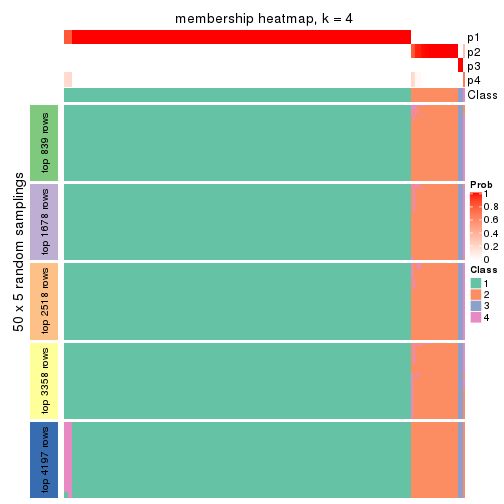</p>

</div>
<div id='tab-ATC-hclust-membership-heatmap-4'>
<pre><code class="r">membership_heatmap(res, k = 5)
</code></pre>

<p></p>

</div>
<div id='tab-ATC-hclust-membership-heatmap-5'>
<pre><code class="r">membership_heatmap(res, k = 6)
</code></pre>

<p></p>

</div>
</div>

As soon as we have had the classes for columns, we can look for signatures
which are significantly different between classes which can be candidate marks
for certain classes. Following are the heatmaps for signatures.


Signature heatmaps where rows are scaled:


<script>
$( function() {
	$( '#tabs-ATC-hclust-get-signatures' ).tabs();
} );
</script>
<div id='tabs-ATC-hclust-get-signatures'>
<ul>
<li><a href='#tab-ATC-hclust-get-signatures-1'>k = 2</a></li>
<li><a href='#tab-ATC-hclust-get-signatures-2'>k = 3</a></li>
<li><a href='#tab-ATC-hclust-get-signatures-3'>k = 4</a></li>
<li><a href='#tab-ATC-hclust-get-signatures-4'>k = 5</a></li>
<li><a href='#tab-ATC-hclust-get-signatures-5'>k = 6</a></li>
</ul>
<div id='tab-ATC-hclust-get-signatures-1'>
<pre><code class="r">get_signatures(res, k = 2)
</code></pre>

<p></p>

</div>
<div id='tab-ATC-hclust-get-signatures-2'>
<pre><code class="r">get_signatures(res, k = 3)
</code></pre>

<p></p>

</div>
<div id='tab-ATC-hclust-get-signatures-3'>
<pre><code class="r">get_signatures(res, k = 4)
</code></pre>

<p></p>

</div>
<div id='tab-ATC-hclust-get-signatures-4'>
<pre><code class="r">get_signatures(res, k = 5)
</code></pre>

<p></p>

</div>
<div id='tab-ATC-hclust-get-signatures-5'>
<pre><code class="r">get_signatures(res, k = 6)
</code></pre>

<p></p>

</div>
</div>


Signature heatmaps where rows are not scaled:


<script>
$( function() {
	$( '#tabs-ATC-hclust-get-signatures-no-scale' ).tabs();
} );
</script>
<div id='tabs-ATC-hclust-get-signatures-no-scale'>
<ul>
<li><a href='#tab-ATC-hclust-get-signatures-no-scale-1'>k = 2</a></li>
<li><a href='#tab-ATC-hclust-get-signatures-no-scale-2'>k = 3</a></li>
<li><a href='#tab-ATC-hclust-get-signatures-no-scale-3'>k = 4</a></li>
<li><a href='#tab-ATC-hclust-get-signatures-no-scale-4'>k = 5</a></li>
<li><a href='#tab-ATC-hclust-get-signatures-no-scale-5'>k = 6</a></li>
</ul>
<div id='tab-ATC-hclust-get-signatures-no-scale-1'>
<pre><code class="r">get_signatures(res, k = 2, scale_rows = FALSE)
</code></pre>

<p></p>

</div>
<div id='tab-ATC-hclust-get-signatures-no-scale-2'>
<pre><code class="r">get_signatures(res, k = 3, scale_rows = FALSE)
</code></pre>

<p></p>

</div>
<div id='tab-ATC-hclust-get-signatures-no-scale-3'>
<pre><code class="r">get_signatures(res, k = 4, scale_rows = FALSE)
</code></pre>

<p></p>

</div>
<div id='tab-ATC-hclust-get-signatures-no-scale-4'>
<pre><code class="r">get_signatures(res, k = 5, scale_rows = FALSE)
</code></pre>

<p></p>

</div>
<div id='tab-ATC-hclust-get-signatures-no-scale-5'>
<pre><code class="r">get_signatures(res, k = 6, scale_rows = FALSE)
</code></pre>

<p></p>

</div>
</div>


Compare the overlap of signatures from different k:

```r
compare_signatures(res)
```


`get_signature()` returns a data frame invisibly. TO get the list of signatures, the function
call should be assigned to a variable explicitly. In following code, if `plot` argument is set
to `FALSE`, no heatmap is plotted while only the differential analysis is performed.

```r
# code only for demonstration
tb = get_signature(res, k = ..., plot = FALSE)
```

An example of the output of `tb` is:

```
#>   which_row         fdr    mean_1    mean_2 scaled_mean_1 scaled_mean_2 km
#> 1        38 0.042760348  8.373488  9.131774    -0.5533452     0.5164555  1
#> 2        40 0.018707592  7.106213  8.469186    -0.6173731     0.5762149  1
#> 3        55 0.019134737 10.221463 11.207825    -0.6159697     0.5749050  1
#> 4        59 0.006059896  5.921854  7.869574    -0.6899429     0.6439467  1
#> 5        60 0.018055526  8.928898 10.211722    -0.6204761     0.5791110  1
#> 6        98 0.009384629 15.714769 14.887706     0.6635654    -0.6193277  2
...
```

The columns in `tb` are:

1. `which_row`: row indices corresponding to the input matrix.
2. `fdr`: FDR for the differential test. 
3. `mean_x`: The mean value in group x.
4. `scaled_mean_x`: The mean value in group x after rows are scaled.
5. `km`: Row groups if k-means clustering is applied to rows.


UMAP plot which shows how samples are separated.


<script>
$( function() {
	$( '#tabs-ATC-hclust-dimension-reduction' ).tabs();
} );
</script>
<div id='tabs-ATC-hclust-dimension-reduction'>
<ul>
<li><a href='#tab-ATC-hclust-dimension-reduction-1'>k = 2</a></li>
<li><a href='#tab-ATC-hclust-dimension-reduction-2'>k = 3</a></li>
<li><a href='#tab-ATC-hclust-dimension-reduction-3'>k = 4</a></li>
<li><a href='#tab-ATC-hclust-dimension-reduction-4'>k = 5</a></li>
<li><a href='#tab-ATC-hclust-dimension-reduction-5'>k = 6</a></li>
</ul>
<div id='tab-ATC-hclust-dimension-reduction-1'>
<pre><code class="r">dimension_reduction(res, k = 2, method = &quot;UMAP&quot;)
</code></pre>

<p></p>

</div>
<div id='tab-ATC-hclust-dimension-reduction-2'>
<pre><code class="r">dimension_reduction(res, k = 3, method = &quot;UMAP&quot;)
</code></pre>

<p></p>

</div>
<div id='tab-ATC-hclust-dimension-reduction-3'>
<pre><code class="r">dimension_reduction(res, k = 4, method = &quot;UMAP&quot;)
</code></pre>

<p></p>

</div>
<div id='tab-ATC-hclust-dimension-reduction-4'>
<pre><code class="r">dimension_reduction(res, k = 5, method = &quot;UMAP&quot;)
</code></pre>

<p></p>

</div>
<div id='tab-ATC-hclust-dimension-reduction-5'>
<pre><code class="r">dimension_reduction(res, k = 6, method = &quot;UMAP&quot;)
</code></pre>

<p></p>

</div>
</div>


Following heatmap shows how subgroups are split when increasing `k`:

```r
collect_classes(res)
```


If matrix rows can be associated to genes, consider to use `GO_Enrichment(res,
...)` to perform function enrichment for the signature genes.


 

---------------------------------------------------


### ATC:kmeans**


The object with results only for a single top-value method and a single partition method 
can be extracted as:

```r
res = res_list["ATC", "kmeans"]
# you can also extract it by
# res = res_list["ATC:kmeans"]
```

A summary of `res` and all the functions that can be applied to it:

```r
res
```

```
#> A 'ConsensusPartition' object with k = 2, 3, 4, 5, 6.
#>   On a matrix with 8394 rows and 194 columns.
#>   Top rows (839, 1678, 2518, 3358, 4197) are extracted by 'ATC' method.
#>   Subgroups are detected by 'kmeans' method.
#>   Performed in total 1250 partitions by row resampling.
#>   Best k for subgroups seems to be 3.
#> 
#> Following methods can be applied to this 'ConsensusPartition' object:
#>  [1] "cola_report"             "collect_classes"         "collect_plots"          
#>  [4] "collect_stats"           "colnames"                "compare_signatures"     
#>  [7] "consensus_heatmap"       "dimension_reduction"     "functional_enrichment"  
#> [10] "get_anno_col"            "get_anno"                "get_classes"            
#> [13] "get_consensus"           "get_matrix"              "get_membership"         
#> [16] "get_param"               "get_signatures"          "get_stats"              
#> [19] "is_best_k"               "is_stable_k"             "membership_heatmap"     
#> [22] "ncol"                    "nrow"                    "plot_ecdf"              
#> [25] "rownames"                "select_partition_number" "show"                   
#> [28] "suggest_best_k"          "test_to_known_factors"
```

`collect_plots()` function collects all the plots made from `res` for all `k` (number of partitions)
into one single page to provide an easy and fast comparison between different `k`.

```r
collect_plots(res)
```


The plots are:

- The first row: a plot of the ECDF (Empirical cumulative distribution
  function) curves of the consensus matrix for each `k` and the heatmap of
  predicted classes for each `k`.
- The second row: heatmaps of the consensus matrix for each `k`.
- The third row: heatmaps of the membership matrix for each `k`.
- The fouth row: heatmaps of the signatures for each `k`.

All the plots in panels can be made by individual functions and they are
plotted later in this section.

`select_partition_number()` produces several plots showing different
statistics for choosing "optimized" `k`. There are following statistics:

- ECDF curves of the consensus matrix for each `k`;
- 1-PAC. [The PAC
  score](https://en.wikipedia.org/wiki/Consensus_clustering#Over-interpretation_potential_of_consensus_clustering)
  measures the proportion of the ambiguous subgrouping.
- Mean silhouette score.
- Concordance. The mean probability of fiting the consensus class ids in all
  partitions.
- Area increased. Denote $A_k$ as the area under the ECDF curve for current
  `k`, the area increased is defined as $A_k - A_{k-1}$.
- Rand index. The percent of pairs of samples that are both in a same cluster
  or both are not in a same cluster in the partition of k and k-1.
- Jaccard index. The ratio of pairs of samples are both in a same cluster in
  the partition of k and k-1 and the pairs of samples are both in a same
  cluster in the partition k or k-1.

The detailed explanations of these statistics can be found in [the cola
vignette](http://bioconductor.org/packages/devel/bioc/vignettes/cola/inst/doc/cola.html#toc_13).

Generally speaking, lower PAC score, higher mean silhouette score or higher
concordance corresponds to better partition. Rand index and Jaccard index
measure how similar the current partition is compared to partition with `k-1`.
If they are too similar, we won't accept `k` is better than `k-1`.

```r
select_partition_number(res)
```


The numeric values for all these statistics can be obtained by `get_stats()`.

```r
get_stats(res)
```

```
#>   k 1-PAC mean_silhouette concordance area_increased  Rand Jaccard
#> 2 2 1.000           1.000       1.000          0.219 0.782   0.782
#> 3 3 0.963           0.977       0.987          0.427 0.899   0.871
#> 4 4 0.695           0.906       0.915          0.270 1.000   1.000
#> 5 5 0.361           0.831       0.850          0.170 0.998   0.997
#> 6 6 0.352           0.705       0.813          0.072 0.982   0.973
```

`suggest_best_k()` suggests the best $k$ based on these statistics. The rules are as follows:

- All $k$ with Jaccard index larger than 0.95 are removed because the increase of
  the partition number does not provides enough extra information. If all $k$ are removed,
  the best $k$ is assigned by `NA`.
- For $k$ with 1-PAC larger than 0.9, the maximal $k$ is taken as the "best k". Other $k$ is called "optional k".
- If it does not fit the second rule. The $k$ with the highest vote of highest
  1-PAC, mean silhouette and concordance is taken as the "best k".

```r
suggest_best_k(res)
```

```
#> [1] 3
#> attr(,"optional")
#> [1] 2
```

There is also optional best $k$ = 2 that is worth to check.

Following shows the table of the partitions (You need to click the **show/hide
code output** link to see it). The membership matrix (columns with name `p*`)
is inferred by
[`clue::cl_consensus()`](https://www.rdocumentation.org/link/cl_consensus?package=clue)
function with the `SE` method. Basically the value in the membership matrix
represents the probability to belong to a certain group. The finall class
label for an item is determined with the group with highest probability it
belongs to.

In `get_classes()` function, the entropy is calculated from the membership
matrix and the silhouette score is calculated from the consensus matrix.


<script>
$( function() {
	$( '#tabs-ATC-kmeans-get-classes' ).tabs();
} );
</script>
<div id='tabs-ATC-kmeans-get-classes'>
<ul>
<li><a href='#tab-ATC-kmeans-get-classes-1'>k = 2</a></li>
<li><a href='#tab-ATC-kmeans-get-classes-2'>k = 3</a></li>
<li><a href='#tab-ATC-kmeans-get-classes-3'>k = 4</a></li>
<li><a href='#tab-ATC-kmeans-get-classes-4'>k = 5</a></li>
<li><a href='#tab-ATC-kmeans-get-classes-5'>k = 6</a></li>
</ul>

<div id='tab-ATC-kmeans-get-classes-1'>
<p><a id='tab-ATC-kmeans-get-classes-1-a' style='color:#0366d6' href='#'>show/hide code output</a></p>
<pre><code class="r">cbind(get_classes(res, k = 2), get_membership(res, k = 2))
</code></pre>

<pre><code>#&gt;           class entropy silhouette p1 p2
#&gt; ERR467487     1       0          1  1  0
#&gt; ERR467498     1       0          1  1  0
#&gt; ERR658998     1       0          1  1  0
#&gt; ERR659094     1       0          1  1  0
#&gt; ERR658999     1       0          1  1  0
#&gt; ERR659095     1       0          1  1  0
#&gt; ERR659000     1       0          1  1  0
#&gt; ERR659096     1       0          1  1  0
#&gt; ERR659001     1       0          1  1  0
#&gt; ERR659097     1       0          1  1  0
#&gt; ERR659002     1       0          1  1  0
#&gt; ERR659098     1       0          1  1  0
#&gt; ERR659003     1       0          1  1  0
#&gt; ERR659099     1       0          1  1  0
#&gt; ERR659004     1       0          1  1  0
#&gt; ERR659100     1       0          1  1  0
#&gt; ERR659005     1       0          1  1  0
#&gt; ERR659101     1       0          1  1  0
#&gt; ERR659006     1       0          1  1  0
#&gt; ERR659102     1       0          1  1  0
#&gt; ERR659007     1       0          1  1  0
#&gt; ERR659103     1       0          1  1  0
#&gt; ERR659008     2       0          1  0  1
#&gt; ERR659104     2       0          1  0  1
#&gt; ERR659009     1       0          1  1  0
#&gt; ERR659105     1       0          1  1  0
#&gt; ERR659010     1       0          1  1  0
#&gt; ERR659106     1       0          1  1  0
#&gt; ERR659011     1       0          1  1  0
#&gt; ERR659107     1       0          1  1  0
#&gt; ERR659012     1       0          1  1  0
#&gt; ERR659108     1       0          1  1  0
#&gt; ERR659013     1       0          1  1  0
#&gt; ERR659109     1       0          1  1  0
#&gt; ERR659014     2       0          1  0  1
#&gt; ERR659110     2       0          1  0  1
#&gt; ERR659015     1       0          1  1  0
#&gt; ERR659111     1       0          1  1  0
#&gt; ERR659016     1       0          1  1  0
#&gt; ERR659112     1       0          1  1  0
#&gt; ERR659017     2       0          1  0  1
#&gt; ERR659113     2       0          1  0  1
#&gt; ERR659018     1       0          1  1  0
#&gt; ERR659114     1       0          1  1  0
#&gt; ERR659019     1       0          1  1  0
#&gt; ERR659115     1       0          1  1  0
#&gt; ERR659020     1       0          1  1  0
#&gt; ERR659116     1       0          1  1  0
#&gt; ERR659021     1       0          1  1  0
#&gt; ERR659117     1       0          1  1  0
#&gt; ERR659022     1       0          1  1  0
#&gt; ERR659118     1       0          1  1  0
#&gt; ERR659023     1       0          1  1  0
#&gt; ERR659119     1       0          1  1  0
#&gt; ERR659024     1       0          1  1  0
#&gt; ERR659120     1       0          1  1  0
#&gt; ERR659025     1       0          1  1  0
#&gt; ERR659121     1       0          1  1  0
#&gt; ERR659026     1       0          1  1  0
#&gt; ERR659122     1       0          1  1  0
#&gt; ERR659027     1       0          1  1  0
#&gt; ERR659123     1       0          1  1  0
#&gt; ERR659028     1       0          1  1  0
#&gt; ERR659124     1       0          1  1  0
#&gt; ERR659029     1       0          1  1  0
#&gt; ERR659125     1       0          1  1  0
#&gt; ERR659030     1       0          1  1  0
#&gt; ERR659126     1       0          1  1  0
#&gt; ERR659031     1       0          1  1  0
#&gt; ERR659127     1       0          1  1  0
#&gt; ERR659032     1       0          1  1  0
#&gt; ERR659128     1       0          1  1  0
#&gt; ERR659033     1       0          1  1  0
#&gt; ERR659129     1       0          1  1  0
#&gt; ERR659034     2       0          1  0  1
#&gt; ERR659130     2       0          1  0  1
#&gt; ERR659035     1       0          1  1  0
#&gt; ERR659131     1       0          1  1  0
#&gt; ERR659036     1       0          1  1  0
#&gt; ERR659132     1       0          1  1  0
#&gt; ERR659037     1       0          1  1  0
#&gt; ERR659133     1       0          1  1  0
#&gt; ERR659038     1       0          1  1  0
#&gt; ERR659134     1       0          1  1  0
#&gt; ERR659039     1       0          1  1  0
#&gt; ERR659135     1       0          1  1  0
#&gt; ERR659040     1       0          1  1  0
#&gt; ERR659136     1       0          1  1  0
#&gt; ERR659041     1       0          1  1  0
#&gt; ERR659137     1       0          1  1  0
#&gt; ERR659042     1       0          1  1  0
#&gt; ERR659138     1       0          1  1  0
#&gt; ERR659043     1       0          1  1  0
#&gt; ERR659139     1       0          1  1  0
#&gt; ERR659044     2       0          1  0  1
#&gt; ERR659140     2       0          1  0  1
#&gt; ERR659045     1       0          1  1  0
#&gt; ERR659141     1       0          1  1  0
#&gt; ERR659046     1       0          1  1  0
#&gt; ERR659142     1       0          1  1  0
#&gt; ERR659047     1       0          1  1  0
#&gt; ERR659143     1       0          1  1  0
#&gt; ERR659048     1       0          1  1  0
#&gt; ERR659144     1       0          1  1  0
#&gt; ERR659049     1       0          1  1  0
#&gt; ERR659145     1       0          1  1  0
#&gt; ERR659050     1       0          1  1  0
#&gt; ERR659146     1       0          1  1  0
#&gt; ERR659051     1       0          1  1  0
#&gt; ERR659147     1       0          1  1  0
#&gt; ERR659052     1       0          1  1  0
#&gt; ERR659148     1       0          1  1  0
#&gt; ERR659053     1       0          1  1  0
#&gt; ERR659149     1       0          1  1  0
#&gt; ERR659054     2       0          1  0  1
#&gt; ERR659150     2       0          1  0  1
#&gt; ERR659055     1       0          1  1  0
#&gt; ERR659151     1       0          1  1  0
#&gt; ERR659056     1       0          1  1  0
#&gt; ERR659152     1       0          1  1  0
#&gt; ERR659057     1       0          1  1  0
#&gt; ERR659153     1       0          1  1  0
#&gt; ERR659058     1       0          1  1  0
#&gt; ERR659154     1       0          1  1  0
#&gt; ERR659059     1       0          1  1  0
#&gt; ERR659155     1       0          1  1  0
#&gt; ERR659060     1       0          1  1  0
#&gt; ERR659156     1       0          1  1  0
#&gt; ERR659061     1       0          1  1  0
#&gt; ERR659157     1       0          1  1  0
#&gt; ERR659062     1       0          1  1  0
#&gt; ERR659158     1       0          1  1  0
#&gt; ERR659063     1       0          1  1  0
#&gt; ERR659159     1       0          1  1  0
#&gt; ERR659064     1       0          1  1  0
#&gt; ERR659160     1       0          1  1  0
#&gt; ERR659065     2       0          1  0  1
#&gt; ERR659161     2       0          1  0  1
#&gt; ERR659066     1       0          1  1  0
#&gt; ERR659162     1       0          1  1  0
#&gt; ERR659067     1       0          1  1  0
#&gt; ERR659163     1       0          1  1  0
#&gt; ERR659068     2       0          1  0  1
#&gt; ERR659164     2       0          1  0  1
#&gt; ERR659069     1       0          1  1  0
#&gt; ERR659165     1       0          1  1  0
#&gt; ERR659070     1       0          1  1  0
#&gt; ERR659166     1       0          1  1  0
#&gt; ERR659071     1       0          1  1  0
#&gt; ERR659167     1       0          1  1  0
#&gt; ERR659072     1       0          1  1  0
#&gt; ERR659168     1       0          1  1  0
#&gt; ERR659073     1       0          1  1  0
#&gt; ERR659169     1       0          1  1  0
#&gt; ERR659074     2       0          1  0  1
#&gt; ERR659170     2       0          1  0  1
#&gt; ERR659075     1       0          1  1  0
#&gt; ERR659171     1       0          1  1  0
#&gt; ERR659076     2       0          1  0  1
#&gt; ERR659172     2       0          1  0  1
#&gt; ERR659077     1       0          1  1  0
#&gt; ERR659173     1       0          1  1  0
#&gt; ERR659078     1       0          1  1  0
#&gt; ERR659174     1       0          1  1  0
#&gt; ERR659079     1       0          1  1  0
#&gt; ERR659175     1       0          1  1  0
#&gt; ERR659080     1       0          1  1  0
#&gt; ERR659176     1       0          1  1  0
#&gt; ERR659081     1       0          1  1  0
#&gt; ERR659177     1       0          1  1  0
#&gt; ERR659082     1       0          1  1  0
#&gt; ERR659178     1       0          1  1  0
#&gt; ERR659083     2       0          1  0  1
#&gt; ERR659179     2       0          1  0  1
#&gt; ERR659084     2       0          1  0  1
#&gt; ERR659180     2       0          1  0  1
#&gt; ERR659085     1       0          1  1  0
#&gt; ERR659181     1       0          1  1  0
#&gt; ERR659086     1       0          1  1  0
#&gt; ERR659182     1       0          1  1  0
#&gt; ERR659087     1       0          1  1  0
#&gt; ERR659183     1       0          1  1  0
#&gt; ERR659088     1       0          1  1  0
#&gt; ERR659184     1       0          1  1  0
#&gt; ERR659089     1       0          1  1  0
#&gt; ERR659185     1       0          1  1  0
#&gt; ERR659090     1       0          1  1  0
#&gt; ERR659186     1       0          1  1  0
#&gt; ERR659091     1       0          1  1  0
#&gt; ERR659187     1       0          1  1  0
#&gt; ERR659092     1       0          1  1  0
#&gt; ERR659188     1       0          1  1  0
#&gt; ERR659093     1       0          1  1  0
#&gt; ERR659189     1       0          1  1  0
</code></pre>

<script>
$('#tab-ATC-kmeans-get-classes-1-a').parent().next().next().hide();
$('#tab-ATC-kmeans-get-classes-1-a').click(function(){
  $('#tab-ATC-kmeans-get-classes-1-a').parent().next().next().toggle();
  return(false);
});
</script>
</div>

<div id='tab-ATC-kmeans-get-classes-2'>
<p><a id='tab-ATC-kmeans-get-classes-2-a' style='color:#0366d6' href='#'>show/hide code output</a></p>
<pre><code class="r">cbind(get_classes(res, k = 3), get_membership(res, k = 3))
</code></pre>

<pre><code>#&gt;           class entropy silhouette    p1    p2    p3
#&gt; ERR467487     3  0.1411      0.758 0.036 0.000 0.964
#&gt; ERR467498     3  0.1411      0.758 0.036 0.000 0.964
#&gt; ERR658998     1  0.0000      0.995 1.000 0.000 0.000
#&gt; ERR659094     1  0.0000      0.995 1.000 0.000 0.000
#&gt; ERR658999     1  0.0237      0.992 0.996 0.000 0.004
#&gt; ERR659095     1  0.0237      0.992 0.996 0.000 0.004
#&gt; ERR659000     1  0.0592      0.982 0.988 0.000 0.012
#&gt; ERR659096     1  0.0592      0.982 0.988 0.000 0.012
#&gt; ERR659001     1  0.0000      0.995 1.000 0.000 0.000
#&gt; ERR659097     1  0.0000      0.995 1.000 0.000 0.000
#&gt; ERR659002     1  0.0000      0.995 1.000 0.000 0.000
#&gt; ERR659098     1  0.0000      0.995 1.000 0.000 0.000
#&gt; ERR659003     1  0.0000      0.995 1.000 0.000 0.000
#&gt; ERR659099     1  0.0000      0.995 1.000 0.000 0.000
#&gt; ERR659004     1  0.0237      0.992 0.996 0.000 0.004
#&gt; ERR659100     1  0.0237      0.992 0.996 0.000 0.004
#&gt; ERR659005     1  0.0000      0.995 1.000 0.000 0.000
#&gt; ERR659101     1  0.0000      0.995 1.000 0.000 0.000
#&gt; ERR659006     1  0.0237      0.992 0.996 0.000 0.004
#&gt; ERR659102     1  0.0237      0.992 0.996 0.000 0.004
#&gt; ERR659007     1  0.0000      0.995 1.000 0.000 0.000
#&gt; ERR659103     1  0.0000      0.995 1.000 0.000 0.000
#&gt; ERR659008     2  0.0000      0.996 0.000 1.000 0.000
#&gt; ERR659104     2  0.0000      0.996 0.000 1.000 0.000
#&gt; ERR659009     1  0.0237      0.992 0.996 0.000 0.004
#&gt; ERR659105     1  0.0237      0.992 0.996 0.000 0.004
#&gt; ERR659010     1  0.0237      0.992 0.996 0.000 0.004
#&gt; ERR659106     1  0.0237      0.992 0.996 0.000 0.004
#&gt; ERR659011     1  0.0237      0.992 0.996 0.000 0.004
#&gt; ERR659107     1  0.0237      0.992 0.996 0.000 0.004
#&gt; ERR659012     1  0.0237      0.992 0.996 0.000 0.004
#&gt; ERR659108     1  0.0237      0.992 0.996 0.000 0.004
#&gt; ERR659013     1  0.0000      0.995 1.000 0.000 0.000
#&gt; ERR659109     1  0.0000      0.995 1.000 0.000 0.000
#&gt; ERR659014     2  0.0237      0.995 0.000 0.996 0.004
#&gt; ERR659110     2  0.0237      0.995 0.000 0.996 0.004
#&gt; ERR659015     1  0.0000      0.995 1.000 0.000 0.000
#&gt; ERR659111     1  0.0000      0.995 1.000 0.000 0.000
#&gt; ERR659016     1  0.0237      0.991 0.996 0.000 0.004
#&gt; ERR659112     1  0.0237      0.991 0.996 0.000 0.004
#&gt; ERR659017     2  0.0000      0.996 0.000 1.000 0.000
#&gt; ERR659113     2  0.0000      0.996 0.000 1.000 0.000
#&gt; ERR659018     1  0.0000      0.995 1.000 0.000 0.000
#&gt; ERR659114     1  0.0000      0.995 1.000 0.000 0.000
#&gt; ERR659019     1  0.0000      0.995 1.000 0.000 0.000
#&gt; ERR659115     1  0.0000      0.995 1.000 0.000 0.000
#&gt; ERR659020     1  0.0000      0.995 1.000 0.000 0.000
#&gt; ERR659116     1  0.0000      0.995 1.000 0.000 0.000
#&gt; ERR659021     1  0.0000      0.995 1.000 0.000 0.000
#&gt; ERR659117     1  0.0000      0.995 1.000 0.000 0.000
#&gt; ERR659022     1  0.0000      0.995 1.000 0.000 0.000
#&gt; ERR659118     1  0.0000      0.995 1.000 0.000 0.000
#&gt; ERR659023     1  0.0000      0.995 1.000 0.000 0.000
#&gt; ERR659119     1  0.0000      0.995 1.000 0.000 0.000
#&gt; ERR659024     1  0.0000      0.995 1.000 0.000 0.000
#&gt; ERR659120     1  0.0000      0.995 1.000 0.000 0.000
#&gt; ERR659025     1  0.0000      0.995 1.000 0.000 0.000
#&gt; ERR659121     1  0.0000      0.995 1.000 0.000 0.000
#&gt; ERR659026     1  0.0237      0.992 0.996 0.000 0.004
#&gt; ERR659122     1  0.0237      0.992 0.996 0.000 0.004
#&gt; ERR659027     1  0.4346      0.734 0.816 0.000 0.184
#&gt; ERR659123     1  0.4346      0.734 0.816 0.000 0.184
#&gt; ERR659028     1  0.0000      0.995 1.000 0.000 0.000
#&gt; ERR659124     1  0.0000      0.995 1.000 0.000 0.000
#&gt; ERR659029     1  0.0000      0.995 1.000 0.000 0.000
#&gt; ERR659125     1  0.0000      0.995 1.000 0.000 0.000
#&gt; ERR659030     1  0.0000      0.995 1.000 0.000 0.000
#&gt; ERR659126     1  0.0000      0.995 1.000 0.000 0.000
#&gt; ERR659031     1  0.0000      0.995 1.000 0.000 0.000
#&gt; ERR659127     1  0.0000      0.995 1.000 0.000 0.000
#&gt; ERR659032     1  0.0000      0.995 1.000 0.000 0.000
#&gt; ERR659128     1  0.0000      0.995 1.000 0.000 0.000
#&gt; ERR659033     1  0.0000      0.995 1.000 0.000 0.000
#&gt; ERR659129     1  0.0000      0.995 1.000 0.000 0.000
#&gt; ERR659034     2  0.0000      0.996 0.000 1.000 0.000
#&gt; ERR659130     2  0.0000      0.996 0.000 1.000 0.000
#&gt; ERR659035     1  0.0000      0.995 1.000 0.000 0.000
#&gt; ERR659131     1  0.0000      0.995 1.000 0.000 0.000
#&gt; ERR659036     1  0.0000      0.995 1.000 0.000 0.000
#&gt; ERR659132     1  0.0000      0.995 1.000 0.000 0.000
#&gt; ERR659037     1  0.0000      0.995 1.000 0.000 0.000
#&gt; ERR659133     1  0.0000      0.995 1.000 0.000 0.000
#&gt; ERR659038     1  0.0237      0.992 0.996 0.000 0.004
#&gt; ERR659134     1  0.0237      0.992 0.996 0.000 0.004
#&gt; ERR659039     1  0.0237      0.992 0.996 0.000 0.004
#&gt; ERR659135     1  0.0237      0.992 0.996 0.000 0.004
#&gt; ERR659040     1  0.0000      0.995 1.000 0.000 0.000
#&gt; ERR659136     1  0.0000      0.995 1.000 0.000 0.000
#&gt; ERR659041     1  0.3192      0.853 0.888 0.000 0.112
#&gt; ERR659137     1  0.3192      0.853 0.888 0.000 0.112
#&gt; ERR659042     1  0.0000      0.995 1.000 0.000 0.000
#&gt; ERR659138     1  0.0000      0.995 1.000 0.000 0.000
#&gt; ERR659043     1  0.0000      0.995 1.000 0.000 0.000
#&gt; ERR659139     1  0.0000      0.995 1.000 0.000 0.000
#&gt; ERR659044     2  0.0000      0.996 0.000 1.000 0.000
#&gt; ERR659140     2  0.0000      0.996 0.000 1.000 0.000
#&gt; ERR659045     1  0.0000      0.995 1.000 0.000 0.000
#&gt; ERR659141     1  0.0000      0.995 1.000 0.000 0.000
#&gt; ERR659046     1  0.0000      0.995 1.000 0.000 0.000
#&gt; ERR659142     1  0.0000      0.995 1.000 0.000 0.000
#&gt; ERR659047     1  0.0000      0.995 1.000 0.000 0.000
#&gt; ERR659143     1  0.0000      0.995 1.000 0.000 0.000
#&gt; ERR659048     1  0.0000      0.995 1.000 0.000 0.000
#&gt; ERR659144     1  0.0000      0.995 1.000 0.000 0.000
#&gt; ERR659049     1  0.0000      0.995 1.000 0.000 0.000
#&gt; ERR659145     1  0.0000      0.995 1.000 0.000 0.000
#&gt; ERR659050     1  0.0000      0.995 1.000 0.000 0.000
#&gt; ERR659146     1  0.0000      0.995 1.000 0.000 0.000
#&gt; ERR659051     3  0.4399      0.815 0.188 0.000 0.812
#&gt; ERR659147     3  0.4399      0.815 0.188 0.000 0.812
#&gt; ERR659052     1  0.0000      0.995 1.000 0.000 0.000
#&gt; ERR659148     1  0.0000      0.995 1.000 0.000 0.000
#&gt; ERR659053     1  0.0000      0.995 1.000 0.000 0.000
#&gt; ERR659149     1  0.0000      0.995 1.000 0.000 0.000
#&gt; ERR659054     2  0.0747      0.990 0.000 0.984 0.016
#&gt; ERR659150     2  0.1163      0.983 0.000 0.972 0.028
#&gt; ERR659055     1  0.0000      0.995 1.000 0.000 0.000
#&gt; ERR659151     1  0.0000      0.995 1.000 0.000 0.000
#&gt; ERR659056     3  0.2796      0.807 0.092 0.000 0.908
#&gt; ERR659152     3  0.2796      0.807 0.092 0.000 0.908
#&gt; ERR659057     1  0.0000      0.995 1.000 0.000 0.000
#&gt; ERR659153     1  0.0000      0.995 1.000 0.000 0.000
#&gt; ERR659058     1  0.0000      0.995 1.000 0.000 0.000
#&gt; ERR659154     1  0.0000      0.995 1.000 0.000 0.000
#&gt; ERR659059     1  0.0000      0.995 1.000 0.000 0.000
#&gt; ERR659155     1  0.0000      0.995 1.000 0.000 0.000
#&gt; ERR659060     1  0.0000      0.995 1.000 0.000 0.000
#&gt; ERR659156     1  0.0000      0.995 1.000 0.000 0.000
#&gt; ERR659061     1  0.0000      0.995 1.000 0.000 0.000
#&gt; ERR659157     1  0.0000      0.995 1.000 0.000 0.000
#&gt; ERR659062     1  0.0000      0.995 1.000 0.000 0.000
#&gt; ERR659158     1  0.0000      0.995 1.000 0.000 0.000
#&gt; ERR659063     1  0.0000      0.995 1.000 0.000 0.000
#&gt; ERR659159     1  0.0000      0.995 1.000 0.000 0.000
#&gt; ERR659064     1  0.0000      0.995 1.000 0.000 0.000
#&gt; ERR659160     1  0.0000      0.995 1.000 0.000 0.000
#&gt; ERR659065     2  0.1163      0.983 0.000 0.972 0.028
#&gt; ERR659161     2  0.0892      0.988 0.000 0.980 0.020
#&gt; ERR659066     1  0.0000      0.995 1.000 0.000 0.000
#&gt; ERR659162     1  0.0000      0.995 1.000 0.000 0.000
#&gt; ERR659067     1  0.0000      0.995 1.000 0.000 0.000
#&gt; ERR659163     1  0.0000      0.995 1.000 0.000 0.000
#&gt; ERR659068     2  0.0000      0.996 0.000 1.000 0.000
#&gt; ERR659164     2  0.0000      0.996 0.000 1.000 0.000
#&gt; ERR659069     1  0.0237      0.992 0.996 0.000 0.004
#&gt; ERR659165     1  0.0237      0.992 0.996 0.000 0.004
#&gt; ERR659070     1  0.0000      0.995 1.000 0.000 0.000
#&gt; ERR659166     1  0.0000      0.995 1.000 0.000 0.000
#&gt; ERR659071     1  0.0000      0.995 1.000 0.000 0.000
#&gt; ERR659167     1  0.0000      0.995 1.000 0.000 0.000
#&gt; ERR659072     1  0.0237      0.992 0.996 0.000 0.004
#&gt; ERR659168     1  0.0237      0.992 0.996 0.000 0.004
#&gt; ERR659073     1  0.0000      0.995 1.000 0.000 0.000
#&gt; ERR659169     1  0.0000      0.995 1.000 0.000 0.000
#&gt; ERR659074     2  0.0000      0.996 0.000 1.000 0.000
#&gt; ERR659170     2  0.0000      0.996 0.000 1.000 0.000
#&gt; ERR659075     3  0.1289      0.751 0.032 0.000 0.968
#&gt; ERR659171     3  0.1289      0.751 0.032 0.000 0.968
#&gt; ERR659076     2  0.0592      0.992 0.000 0.988 0.012
#&gt; ERR659172     2  0.0424      0.994 0.000 0.992 0.008
#&gt; ERR659077     1  0.0000      0.995 1.000 0.000 0.000
#&gt; ERR659173     1  0.0000      0.995 1.000 0.000 0.000
#&gt; ERR659078     1  0.0000      0.995 1.000 0.000 0.000
#&gt; ERR659174     1  0.0000      0.995 1.000 0.000 0.000
#&gt; ERR659079     1  0.0000      0.995 1.000 0.000 0.000
#&gt; ERR659175     1  0.0000      0.995 1.000 0.000 0.000
#&gt; ERR659080     3  0.4654      0.803 0.208 0.000 0.792
#&gt; ERR659176     3  0.4654      0.803 0.208 0.000 0.792
#&gt; ERR659081     1  0.0000      0.995 1.000 0.000 0.000
#&gt; ERR659177     1  0.0000      0.995 1.000 0.000 0.000
#&gt; ERR659082     1  0.0000      0.995 1.000 0.000 0.000
#&gt; ERR659178     1  0.0000      0.995 1.000 0.000 0.000
#&gt; ERR659083     2  0.0000      0.996 0.000 1.000 0.000
#&gt; ERR659179     2  0.0000      0.996 0.000 1.000 0.000
#&gt; ERR659084     2  0.0424      0.994 0.000 0.992 0.008
#&gt; ERR659180     2  0.0000      0.996 0.000 1.000 0.000
#&gt; ERR659085     1  0.0000      0.995 1.000 0.000 0.000
#&gt; ERR659181     1  0.0000      0.995 1.000 0.000 0.000
#&gt; ERR659086     1  0.0000      0.995 1.000 0.000 0.000
#&gt; ERR659182     1  0.0000      0.995 1.000 0.000 0.000
#&gt; ERR659087     1  0.0237      0.992 0.996 0.000 0.004
#&gt; ERR659183     1  0.0237      0.992 0.996 0.000 0.004
#&gt; ERR659088     3  0.5138      0.748 0.252 0.000 0.748
#&gt; ERR659184     3  0.5138      0.748 0.252 0.000 0.748
#&gt; ERR659089     1  0.0000      0.995 1.000 0.000 0.000
#&gt; ERR659185     1  0.0000      0.995 1.000 0.000 0.000
#&gt; ERR659090     1  0.0000      0.995 1.000 0.000 0.000
#&gt; ERR659186     1  0.0000      0.995 1.000 0.000 0.000
#&gt; ERR659091     1  0.0000      0.995 1.000 0.000 0.000
#&gt; ERR659187     1  0.0000      0.995 1.000 0.000 0.000
#&gt; ERR659092     1  0.0000      0.995 1.000 0.000 0.000
#&gt; ERR659188     1  0.0000      0.995 1.000 0.000 0.000
#&gt; ERR659093     1  0.0000      0.995 1.000 0.000 0.000
#&gt; ERR659189     1  0.0000      0.995 1.000 0.000 0.000
</code></pre>

<script>
$('#tab-ATC-kmeans-get-classes-2-a').parent().next().next().hide();
$('#tab-ATC-kmeans-get-classes-2-a').click(function(){
  $('#tab-ATC-kmeans-get-classes-2-a').parent().next().next().toggle();
  return(false);
});
</script>
</div>

<div id='tab-ATC-kmeans-get-classes-3'>
<p><a id='tab-ATC-kmeans-get-classes-3-a' style='color:#0366d6' href='#'>show/hide code output</a></p>
<pre><code class="r">cbind(get_classes(res, k = 4), get_membership(res, k = 4))
</code></pre>

<pre><code>#&gt;           class entropy silhouette    p1    p2    p3 p4
#&gt; ERR467487     3  0.4456      0.743 0.004 0.000 0.716 NA
#&gt; ERR467498     3  0.4456      0.743 0.004 0.000 0.716 NA
#&gt; ERR658998     1  0.2589      0.905 0.884 0.000 0.000 NA
#&gt; ERR659094     1  0.2589      0.905 0.884 0.000 0.000 NA
#&gt; ERR658999     1  0.1557      0.930 0.944 0.000 0.000 NA
#&gt; ERR659095     1  0.1557      0.930 0.944 0.000 0.000 NA
#&gt; ERR659000     1  0.5810      0.656 0.660 0.000 0.064 NA
#&gt; ERR659096     1  0.5810      0.656 0.660 0.000 0.064 NA
#&gt; ERR659001     1  0.0707      0.936 0.980 0.000 0.000 NA
#&gt; ERR659097     1  0.0707      0.936 0.980 0.000 0.000 NA
#&gt; ERR659002     1  0.1022      0.935 0.968 0.000 0.000 NA
#&gt; ERR659098     1  0.1022      0.935 0.968 0.000 0.000 NA
#&gt; ERR659003     1  0.0921      0.939 0.972 0.000 0.000 NA
#&gt; ERR659099     1  0.0921      0.939 0.972 0.000 0.000 NA
#&gt; ERR659004     1  0.3428      0.881 0.844 0.000 0.012 NA
#&gt; ERR659100     1  0.3428      0.881 0.844 0.000 0.012 NA
#&gt; ERR659005     1  0.0921      0.938 0.972 0.000 0.000 NA
#&gt; ERR659101     1  0.0921      0.938 0.972 0.000 0.000 NA
#&gt; ERR659006     1  0.1940      0.933 0.924 0.000 0.000 NA
#&gt; ERR659102     1  0.1940      0.933 0.924 0.000 0.000 NA
#&gt; ERR659007     1  0.0469      0.936 0.988 0.000 0.000 NA
#&gt; ERR659103     1  0.0469      0.936 0.988 0.000 0.000 NA
#&gt; ERR659008     2  0.0188      0.984 0.000 0.996 0.000 NA
#&gt; ERR659104     2  0.0000      0.984 0.000 1.000 0.000 NA
#&gt; ERR659009     1  0.3123      0.886 0.844 0.000 0.000 NA
#&gt; ERR659105     1  0.3123      0.886 0.844 0.000 0.000 NA
#&gt; ERR659010     1  0.1474      0.931 0.948 0.000 0.000 NA
#&gt; ERR659106     1  0.1474      0.931 0.948 0.000 0.000 NA
#&gt; ERR659011     1  0.1716      0.930 0.936 0.000 0.000 NA
#&gt; ERR659107     1  0.1716      0.930 0.936 0.000 0.000 NA
#&gt; ERR659012     1  0.2334      0.929 0.908 0.000 0.004 NA
#&gt; ERR659108     1  0.2334      0.929 0.908 0.000 0.004 NA
#&gt; ERR659013     1  0.3725      0.857 0.812 0.000 0.008 NA
#&gt; ERR659109     1  0.3725      0.857 0.812 0.000 0.008 NA
#&gt; ERR659014     2  0.0000      0.984 0.000 1.000 0.000 NA
#&gt; ERR659110     2  0.0817      0.977 0.000 0.976 0.000 NA
#&gt; ERR659015     1  0.0707      0.937 0.980 0.000 0.000 NA
#&gt; ERR659111     1  0.0707      0.937 0.980 0.000 0.000 NA
#&gt; ERR659016     1  0.4877      0.773 0.752 0.000 0.044 NA
#&gt; ERR659112     1  0.4877      0.773 0.752 0.000 0.044 NA
#&gt; ERR659017     2  0.0000      0.984 0.000 1.000 0.000 NA
#&gt; ERR659113     2  0.0188      0.983 0.000 0.996 0.000 NA
#&gt; ERR659018     1  0.0336      0.936 0.992 0.000 0.000 NA
#&gt; ERR659114     1  0.0336      0.936 0.992 0.000 0.000 NA
#&gt; ERR659019     1  0.1022      0.939 0.968 0.000 0.000 NA
#&gt; ERR659115     1  0.1022      0.939 0.968 0.000 0.000 NA
#&gt; ERR659020     1  0.0336      0.936 0.992 0.000 0.000 NA
#&gt; ERR659116     1  0.0336      0.936 0.992 0.000 0.000 NA
#&gt; ERR659021     1  0.0707      0.937 0.980 0.000 0.000 NA
#&gt; ERR659117     1  0.0707      0.937 0.980 0.000 0.000 NA
#&gt; ERR659022     1  0.1792      0.933 0.932 0.000 0.000 NA
#&gt; ERR659118     1  0.1792      0.933 0.932 0.000 0.000 NA
#&gt; ERR659023     1  0.1474      0.936 0.948 0.000 0.000 NA
#&gt; ERR659119     1  0.1474      0.936 0.948 0.000 0.000 NA
#&gt; ERR659024     1  0.0921      0.938 0.972 0.000 0.000 NA
#&gt; ERR659120     1  0.0921      0.938 0.972 0.000 0.000 NA
#&gt; ERR659025     1  0.2647      0.913 0.880 0.000 0.000 NA
#&gt; ERR659121     1  0.2647      0.913 0.880 0.000 0.000 NA
#&gt; ERR659026     1  0.2408      0.923 0.896 0.000 0.000 NA
#&gt; ERR659122     1  0.2408      0.923 0.896 0.000 0.000 NA
#&gt; ERR659027     1  0.7164      0.352 0.556 0.000 0.204 NA
#&gt; ERR659123     1  0.7164      0.352 0.556 0.000 0.204 NA
#&gt; ERR659028     1  0.2149      0.930 0.912 0.000 0.000 NA
#&gt; ERR659124     1  0.2149      0.930 0.912 0.000 0.000 NA
#&gt; ERR659029     1  0.1211      0.935 0.960 0.000 0.000 NA
#&gt; ERR659125     1  0.1211      0.935 0.960 0.000 0.000 NA
#&gt; ERR659030     1  0.1118      0.937 0.964 0.000 0.000 NA
#&gt; ERR659126     1  0.1118      0.937 0.964 0.000 0.000 NA
#&gt; ERR659031     1  0.1867      0.937 0.928 0.000 0.000 NA
#&gt; ERR659127     1  0.1867      0.937 0.928 0.000 0.000 NA
#&gt; ERR659032     1  0.1557      0.936 0.944 0.000 0.000 NA
#&gt; ERR659128     1  0.1557      0.936 0.944 0.000 0.000 NA
#&gt; ERR659033     1  0.1389      0.938 0.952 0.000 0.000 NA
#&gt; ERR659129     1  0.1389      0.938 0.952 0.000 0.000 NA
#&gt; ERR659034     2  0.0188      0.984 0.000 0.996 0.000 NA
#&gt; ERR659130     2  0.0188      0.984 0.000 0.996 0.000 NA
#&gt; ERR659035     1  0.1637      0.938 0.940 0.000 0.000 NA
#&gt; ERR659131     1  0.1637      0.938 0.940 0.000 0.000 NA
#&gt; ERR659036     1  0.5361      0.717 0.716 0.000 0.060 NA
#&gt; ERR659132     1  0.5361      0.717 0.716 0.000 0.060 NA
#&gt; ERR659037     1  0.0921      0.938 0.972 0.000 0.000 NA
#&gt; ERR659133     1  0.0921      0.938 0.972 0.000 0.000 NA
#&gt; ERR659038     1  0.2011      0.933 0.920 0.000 0.000 NA
#&gt; ERR659134     1  0.2011      0.933 0.920 0.000 0.000 NA
#&gt; ERR659039     1  0.0817      0.937 0.976 0.000 0.000 NA
#&gt; ERR659135     1  0.0817      0.937 0.976 0.000 0.000 NA
#&gt; ERR659040     1  0.1867      0.931 0.928 0.000 0.000 NA
#&gt; ERR659136     1  0.1867      0.931 0.928 0.000 0.000 NA
#&gt; ERR659041     1  0.7336      0.279 0.520 0.000 0.196 NA
#&gt; ERR659137     1  0.7336      0.279 0.520 0.000 0.196 NA
#&gt; ERR659042     1  0.2918      0.905 0.876 0.000 0.008 NA
#&gt; ERR659138     1  0.2918      0.905 0.876 0.000 0.008 NA
#&gt; ERR659043     1  0.2345      0.928 0.900 0.000 0.000 NA
#&gt; ERR659139     1  0.2345      0.928 0.900 0.000 0.000 NA
#&gt; ERR659044     2  0.0000      0.984 0.000 1.000 0.000 NA
#&gt; ERR659140     2  0.0000      0.984 0.000 1.000 0.000 NA
#&gt; ERR659045     1  0.1302      0.939 0.956 0.000 0.000 NA
#&gt; ERR659141     1  0.1302      0.939 0.956 0.000 0.000 NA
#&gt; ERR659046     1  0.1211      0.937 0.960 0.000 0.000 NA
#&gt; ERR659142     1  0.1211      0.937 0.960 0.000 0.000 NA
#&gt; ERR659047     1  0.1867      0.937 0.928 0.000 0.000 NA
#&gt; ERR659143     1  0.1867      0.937 0.928 0.000 0.000 NA
#&gt; ERR659048     1  0.1716      0.933 0.936 0.000 0.000 NA
#&gt; ERR659144     1  0.1716      0.933 0.936 0.000 0.000 NA
#&gt; ERR659049     1  0.2345      0.931 0.900 0.000 0.000 NA
#&gt; ERR659145     1  0.2345      0.931 0.900 0.000 0.000 NA
#&gt; ERR659050     1  0.1716      0.937 0.936 0.000 0.000 NA
#&gt; ERR659146     1  0.1716      0.937 0.936 0.000 0.000 NA
#&gt; ERR659051     3  0.5767      0.792 0.060 0.000 0.660 NA
#&gt; ERR659147     3  0.5767      0.792 0.060 0.000 0.660 NA
#&gt; ERR659052     1  0.1867      0.938 0.928 0.000 0.000 NA
#&gt; ERR659148     1  0.1867      0.938 0.928 0.000 0.000 NA
#&gt; ERR659053     1  0.1389      0.934 0.952 0.000 0.000 NA
#&gt; ERR659149     1  0.1389      0.934 0.952 0.000 0.000 NA
#&gt; ERR659054     2  0.1867      0.953 0.000 0.928 0.000 NA
#&gt; ERR659150     2  0.1867      0.955 0.000 0.928 0.000 NA
#&gt; ERR659055     1  0.0469      0.936 0.988 0.000 0.000 NA
#&gt; ERR659151     1  0.0469      0.936 0.988 0.000 0.000 NA
#&gt; ERR659056     3  0.1824      0.812 0.060 0.000 0.936 NA
#&gt; ERR659152     3  0.1824      0.812 0.060 0.000 0.936 NA
#&gt; ERR659057     1  0.1118      0.939 0.964 0.000 0.000 NA
#&gt; ERR659153     1  0.1118      0.939 0.964 0.000 0.000 NA
#&gt; ERR659058     1  0.1867      0.937 0.928 0.000 0.000 NA
#&gt; ERR659154     1  0.1867      0.937 0.928 0.000 0.000 NA
#&gt; ERR659059     1  0.1792      0.939 0.932 0.000 0.000 NA
#&gt; ERR659155     1  0.1792      0.939 0.932 0.000 0.000 NA
#&gt; ERR659060     1  0.1867      0.937 0.928 0.000 0.000 NA
#&gt; ERR659156     1  0.1867      0.937 0.928 0.000 0.000 NA
#&gt; ERR659061     1  0.2011      0.932 0.920 0.000 0.000 NA
#&gt; ERR659157     1  0.2011      0.932 0.920 0.000 0.000 NA
#&gt; ERR659062     1  0.2281      0.930 0.904 0.000 0.000 NA
#&gt; ERR659158     1  0.2281      0.930 0.904 0.000 0.000 NA
#&gt; ERR659063     1  0.2011      0.936 0.920 0.000 0.000 NA
#&gt; ERR659159     1  0.2011      0.936 0.920 0.000 0.000 NA
#&gt; ERR659064     1  0.1867      0.931 0.928 0.000 0.000 NA
#&gt; ERR659160     1  0.1867      0.931 0.928 0.000 0.000 NA
#&gt; ERR659065     2  0.2081      0.947 0.000 0.916 0.000 NA
#&gt; ERR659161     2  0.1716      0.958 0.000 0.936 0.000 NA
#&gt; ERR659066     1  0.1557      0.938 0.944 0.000 0.000 NA
#&gt; ERR659162     1  0.1557      0.938 0.944 0.000 0.000 NA
#&gt; ERR659067     1  0.1118      0.936 0.964 0.000 0.000 NA
#&gt; ERR659163     1  0.1118      0.936 0.964 0.000 0.000 NA
#&gt; ERR659068     2  0.0188      0.984 0.000 0.996 0.000 NA
#&gt; ERR659164     2  0.0188      0.984 0.000 0.996 0.000 NA
#&gt; ERR659069     1  0.1211      0.939 0.960 0.000 0.000 NA
#&gt; ERR659165     1  0.1211      0.939 0.960 0.000 0.000 NA
#&gt; ERR659070     1  0.2868      0.907 0.864 0.000 0.000 NA
#&gt; ERR659166     1  0.2868      0.907 0.864 0.000 0.000 NA
#&gt; ERR659071     1  0.1792      0.933 0.932 0.000 0.000 NA
#&gt; ERR659167     1  0.1792      0.933 0.932 0.000 0.000 NA
#&gt; ERR659072     1  0.2345      0.923 0.900 0.000 0.000 NA
#&gt; ERR659168     1  0.2345      0.923 0.900 0.000 0.000 NA
#&gt; ERR659073     1  0.2530      0.910 0.888 0.000 0.000 NA
#&gt; ERR659169     1  0.2530      0.910 0.888 0.000 0.000 NA
#&gt; ERR659074     2  0.0000      0.984 0.000 1.000 0.000 NA
#&gt; ERR659170     2  0.0000      0.984 0.000 1.000 0.000 NA
#&gt; ERR659075     3  0.4008      0.739 0.000 0.000 0.756 NA
#&gt; ERR659171     3  0.4008      0.739 0.000 0.000 0.756 NA
#&gt; ERR659076     2  0.1557      0.963 0.000 0.944 0.000 NA
#&gt; ERR659172     2  0.1118      0.972 0.000 0.964 0.000 NA
#&gt; ERR659077     1  0.2469      0.915 0.892 0.000 0.000 NA
#&gt; ERR659173     1  0.2469      0.915 0.892 0.000 0.000 NA
#&gt; ERR659078     1  0.2149      0.928 0.912 0.000 0.000 NA
#&gt; ERR659174     1  0.2149      0.928 0.912 0.000 0.000 NA
#&gt; ERR659079     1  0.2530      0.913 0.888 0.000 0.000 NA
#&gt; ERR659175     1  0.2530      0.913 0.888 0.000 0.000 NA
#&gt; ERR659080     3  0.4898      0.789 0.116 0.000 0.780 NA
#&gt; ERR659176     3  0.4898      0.789 0.116 0.000 0.780 NA
#&gt; ERR659081     1  0.0469      0.936 0.988 0.000 0.000 NA
#&gt; ERR659177     1  0.0469      0.936 0.988 0.000 0.000 NA
#&gt; ERR659082     1  0.2011      0.924 0.920 0.000 0.000 NA
#&gt; ERR659178     1  0.2011      0.924 0.920 0.000 0.000 NA
#&gt; ERR659083     2  0.0000      0.984 0.000 1.000 0.000 NA
#&gt; ERR659179     2  0.0000      0.984 0.000 1.000 0.000 NA
#&gt; ERR659084     2  0.0921      0.976 0.000 0.972 0.000 NA
#&gt; ERR659180     2  0.0000      0.984 0.000 1.000 0.000 NA
#&gt; ERR659085     1  0.0817      0.935 0.976 0.000 0.000 NA
#&gt; ERR659181     1  0.0817      0.935 0.976 0.000 0.000 NA
#&gt; ERR659086     1  0.1637      0.936 0.940 0.000 0.000 NA
#&gt; ERR659182     1  0.1637      0.936 0.940 0.000 0.000 NA
#&gt; ERR659087     1  0.2011      0.925 0.920 0.000 0.000 NA
#&gt; ERR659183     1  0.2011      0.925 0.920 0.000 0.000 NA
#&gt; ERR659088     3  0.5512      0.726 0.172 0.000 0.728 NA
#&gt; ERR659184     3  0.5512      0.726 0.172 0.000 0.728 NA
#&gt; ERR659089     1  0.1716      0.932 0.936 0.000 0.000 NA
#&gt; ERR659185     1  0.1716      0.932 0.936 0.000 0.000 NA
#&gt; ERR659090     1  0.1302      0.936 0.956 0.000 0.000 NA
#&gt; ERR659186     1  0.1302      0.936 0.956 0.000 0.000 NA
#&gt; ERR659091     1  0.0707      0.937 0.980 0.000 0.000 NA
#&gt; ERR659187     1  0.0707      0.937 0.980 0.000 0.000 NA
#&gt; ERR659092     1  0.1637      0.934 0.940 0.000 0.000 NA
#&gt; ERR659188     1  0.1637      0.934 0.940 0.000 0.000 NA
#&gt; ERR659093     1  0.0817      0.935 0.976 0.000 0.000 NA
#&gt; ERR659189     1  0.0817      0.935 0.976 0.000 0.000 NA
</code></pre>

<script>
$('#tab-ATC-kmeans-get-classes-3-a').parent().next().next().hide();
$('#tab-ATC-kmeans-get-classes-3-a').click(function(){
  $('#tab-ATC-kmeans-get-classes-3-a').parent().next().next().toggle();
  return(false);
});
</script>
</div>

<div id='tab-ATC-kmeans-get-classes-4'>
<p><a id='tab-ATC-kmeans-get-classes-4-a' style='color:#0366d6' href='#'>show/hide code output</a></p>
<pre><code class="r">cbind(get_classes(res, k = 5), get_membership(res, k = 5))
</code></pre>

<pre><code>#&gt;           class entropy silhouette    p1    p2    p3    p4 p5
#&gt; ERR467487     3  0.4390     0.6444 0.000 0.000 0.760 0.156 NA
#&gt; ERR467498     3  0.4390     0.6444 0.000 0.000 0.760 0.156 NA
#&gt; ERR658998     1  0.3527     0.8438 0.792 0.000 0.000 0.016 NA
#&gt; ERR659094     1  0.3527     0.8438 0.792 0.000 0.000 0.016 NA
#&gt; ERR658999     1  0.2753     0.8787 0.856 0.000 0.000 0.008 NA
#&gt; ERR659095     1  0.2753     0.8787 0.856 0.000 0.000 0.008 NA
#&gt; ERR659000     1  0.6346     0.4249 0.548 0.000 0.004 0.236 NA
#&gt; ERR659096     1  0.6346     0.4249 0.548 0.000 0.004 0.236 NA
#&gt; ERR659001     1  0.1608     0.8872 0.928 0.000 0.000 0.000 NA
#&gt; ERR659097     1  0.1608     0.8872 0.928 0.000 0.000 0.000 NA
#&gt; ERR659002     1  0.1768     0.8944 0.924 0.000 0.000 0.004 NA
#&gt; ERR659098     1  0.1768     0.8944 0.924 0.000 0.000 0.004 NA
#&gt; ERR659003     1  0.1792     0.8886 0.916 0.000 0.000 0.000 NA
#&gt; ERR659099     1  0.1792     0.8886 0.916 0.000 0.000 0.000 NA
#&gt; ERR659004     1  0.4666     0.7461 0.704 0.000 0.000 0.056 NA
#&gt; ERR659100     1  0.4666     0.7461 0.704 0.000 0.000 0.056 NA
#&gt; ERR659005     1  0.2130     0.8890 0.908 0.000 0.000 0.012 NA
#&gt; ERR659101     1  0.2130     0.8890 0.908 0.000 0.000 0.012 NA
#&gt; ERR659006     1  0.3675     0.8394 0.788 0.000 0.000 0.024 NA
#&gt; ERR659102     1  0.3675     0.8394 0.788 0.000 0.000 0.024 NA
#&gt; ERR659007     1  0.1341     0.8858 0.944 0.000 0.000 0.000 NA
#&gt; ERR659103     1  0.1341     0.8858 0.944 0.000 0.000 0.000 NA
#&gt; ERR659008     2  0.0000     0.9814 0.000 1.000 0.000 0.000 NA
#&gt; ERR659104     2  0.0000     0.9814 0.000 1.000 0.000 0.000 NA
#&gt; ERR659009     1  0.4229     0.7731 0.704 0.000 0.000 0.020 NA
#&gt; ERR659105     1  0.4229     0.7731 0.704 0.000 0.000 0.020 NA
#&gt; ERR659010     1  0.2516     0.8820 0.860 0.000 0.000 0.000 NA
#&gt; ERR659106     1  0.2516     0.8820 0.860 0.000 0.000 0.000 NA
#&gt; ERR659011     1  0.2890     0.8696 0.836 0.000 0.000 0.004 NA
#&gt; ERR659107     1  0.2890     0.8696 0.836 0.000 0.000 0.004 NA
#&gt; ERR659012     1  0.3368     0.8701 0.820 0.000 0.000 0.024 NA
#&gt; ERR659108     1  0.3368     0.8701 0.820 0.000 0.000 0.024 NA
#&gt; ERR659013     1  0.4734     0.7661 0.724 0.000 0.000 0.088 NA
#&gt; ERR659109     1  0.4734     0.7661 0.724 0.000 0.000 0.088 NA
#&gt; ERR659014     2  0.0000     0.9814 0.000 1.000 0.000 0.000 NA
#&gt; ERR659110     2  0.1106     0.9680 0.000 0.964 0.000 0.024 NA
#&gt; ERR659015     1  0.1544     0.8884 0.932 0.000 0.000 0.000 NA
#&gt; ERR659111     1  0.1544     0.8884 0.932 0.000 0.000 0.000 NA
#&gt; ERR659016     1  0.5763     0.5810 0.620 0.000 0.000 0.188 NA
#&gt; ERR659112     1  0.5763     0.5810 0.620 0.000 0.000 0.188 NA
#&gt; ERR659017     2  0.0000     0.9814 0.000 1.000 0.000 0.000 NA
#&gt; ERR659113     2  0.0000     0.9814 0.000 1.000 0.000 0.000 NA
#&gt; ERR659018     1  0.1478     0.8900 0.936 0.000 0.000 0.000 NA
#&gt; ERR659114     1  0.1478     0.8900 0.936 0.000 0.000 0.000 NA
#&gt; ERR659019     1  0.2286     0.8852 0.888 0.000 0.000 0.004 NA
#&gt; ERR659115     1  0.2286     0.8852 0.888 0.000 0.000 0.004 NA
#&gt; ERR659020     1  0.1270     0.8895 0.948 0.000 0.000 0.000 NA
#&gt; ERR659116     1  0.1270     0.8895 0.948 0.000 0.000 0.000 NA
#&gt; ERR659021     1  0.1478     0.8936 0.936 0.000 0.000 0.000 NA
#&gt; ERR659117     1  0.1478     0.8936 0.936 0.000 0.000 0.000 NA
#&gt; ERR659022     1  0.1764     0.8935 0.928 0.000 0.000 0.008 NA
#&gt; ERR659118     1  0.1764     0.8935 0.928 0.000 0.000 0.008 NA
#&gt; ERR659023     1  0.1877     0.8905 0.924 0.000 0.000 0.012 NA
#&gt; ERR659119     1  0.1877     0.8905 0.924 0.000 0.000 0.012 NA
#&gt; ERR659024     1  0.1478     0.8884 0.936 0.000 0.000 0.000 NA
#&gt; ERR659120     1  0.1478     0.8884 0.936 0.000 0.000 0.000 NA
#&gt; ERR659025     1  0.3099     0.8691 0.848 0.000 0.000 0.028 NA
#&gt; ERR659121     1  0.3099     0.8691 0.848 0.000 0.000 0.028 NA
#&gt; ERR659026     1  0.3789     0.8346 0.768 0.000 0.000 0.020 NA
#&gt; ERR659122     1  0.3789     0.8346 0.768 0.000 0.000 0.020 NA
#&gt; ERR659027     1  0.7457    -0.0282 0.440 0.000 0.072 0.340 NA
#&gt; ERR659123     1  0.7457    -0.0282 0.440 0.000 0.072 0.340 NA
#&gt; ERR659028     1  0.2462     0.8819 0.880 0.000 0.000 0.008 NA
#&gt; ERR659124     1  0.2462     0.8819 0.880 0.000 0.000 0.008 NA
#&gt; ERR659029     1  0.1830     0.8905 0.924 0.000 0.000 0.008 NA
#&gt; ERR659125     1  0.1830     0.8905 0.924 0.000 0.000 0.008 NA
#&gt; ERR659030     1  0.1638     0.8884 0.932 0.000 0.000 0.004 NA
#&gt; ERR659126     1  0.1638     0.8884 0.932 0.000 0.000 0.004 NA
#&gt; ERR659031     1  0.2189     0.8938 0.904 0.000 0.000 0.012 NA
#&gt; ERR659127     1  0.2189     0.8938 0.904 0.000 0.000 0.012 NA
#&gt; ERR659032     1  0.1894     0.8876 0.920 0.000 0.000 0.008 NA
#&gt; ERR659128     1  0.1894     0.8876 0.920 0.000 0.000 0.008 NA
#&gt; ERR659033     1  0.2464     0.8921 0.888 0.000 0.000 0.016 NA
#&gt; ERR659129     1  0.2464     0.8921 0.888 0.000 0.000 0.016 NA
#&gt; ERR659034     2  0.0000     0.9814 0.000 1.000 0.000 0.000 NA
#&gt; ERR659130     2  0.0000     0.9814 0.000 1.000 0.000 0.000 NA
#&gt; ERR659035     1  0.2921     0.8785 0.856 0.000 0.000 0.020 NA
#&gt; ERR659131     1  0.2921     0.8785 0.856 0.000 0.000 0.020 NA
#&gt; ERR659036     1  0.5975     0.5180 0.588 0.000 0.000 0.188 NA
#&gt; ERR659132     1  0.5975     0.5180 0.588 0.000 0.000 0.188 NA
#&gt; ERR659037     1  0.1768     0.8950 0.924 0.000 0.000 0.004 NA
#&gt; ERR659133     1  0.1768     0.8950 0.924 0.000 0.000 0.004 NA
#&gt; ERR659038     1  0.3093     0.8692 0.824 0.000 0.000 0.008 NA
#&gt; ERR659134     1  0.3093     0.8692 0.824 0.000 0.000 0.008 NA
#&gt; ERR659039     1  0.1544     0.8920 0.932 0.000 0.000 0.000 NA
#&gt; ERR659135     1  0.1544     0.8920 0.932 0.000 0.000 0.000 NA
#&gt; ERR659040     1  0.2522     0.8855 0.880 0.000 0.000 0.012 NA
#&gt; ERR659136     1  0.2522     0.8855 0.880 0.000 0.000 0.012 NA
#&gt; ERR659041     1  0.7389    -0.1639 0.392 0.000 0.044 0.372 NA
#&gt; ERR659137     1  0.7389    -0.1639 0.392 0.000 0.044 0.372 NA
#&gt; ERR659042     1  0.4252     0.8170 0.764 0.000 0.000 0.064 NA
#&gt; ERR659138     1  0.4252     0.8170 0.764 0.000 0.000 0.064 NA
#&gt; ERR659043     1  0.2470     0.8928 0.884 0.000 0.000 0.012 NA
#&gt; ERR659139     1  0.2470     0.8928 0.884 0.000 0.000 0.012 NA
#&gt; ERR659044     2  0.0000     0.9814 0.000 1.000 0.000 0.000 NA
#&gt; ERR659140     2  0.0000     0.9814 0.000 1.000 0.000 0.000 NA
#&gt; ERR659045     1  0.1732     0.8910 0.920 0.000 0.000 0.000 NA
#&gt; ERR659141     1  0.1732     0.8910 0.920 0.000 0.000 0.000 NA
#&gt; ERR659046     1  0.1952     0.8852 0.912 0.000 0.000 0.004 NA
#&gt; ERR659142     1  0.1952     0.8852 0.912 0.000 0.000 0.004 NA
#&gt; ERR659047     1  0.2411     0.8876 0.884 0.000 0.000 0.008 NA
#&gt; ERR659143     1  0.2411     0.8876 0.884 0.000 0.000 0.008 NA
#&gt; ERR659048     1  0.2249     0.8838 0.896 0.000 0.000 0.008 NA
#&gt; ERR659144     1  0.2249     0.8838 0.896 0.000 0.000 0.008 NA
#&gt; ERR659049     1  0.3958     0.8447 0.780 0.000 0.000 0.044 NA
#&gt; ERR659145     1  0.3958     0.8447 0.780 0.000 0.000 0.044 NA
#&gt; ERR659050     1  0.2248     0.8941 0.900 0.000 0.000 0.012 NA
#&gt; ERR659146     1  0.2248     0.8941 0.900 0.000 0.000 0.012 NA
#&gt; ERR659051     4  0.6096     0.1026 0.008 0.000 0.312 0.560 NA
#&gt; ERR659147     4  0.6096     0.1026 0.008 0.000 0.312 0.560 NA
#&gt; ERR659052     1  0.2660     0.8778 0.864 0.000 0.000 0.008 NA
#&gt; ERR659148     1  0.2660     0.8778 0.864 0.000 0.000 0.008 NA
#&gt; ERR659053     1  0.1831     0.8894 0.920 0.000 0.000 0.004 NA
#&gt; ERR659149     1  0.1831     0.8894 0.920 0.000 0.000 0.004 NA
#&gt; ERR659054     2  0.2139     0.9408 0.000 0.916 0.000 0.052 NA
#&gt; ERR659150     2  0.2522     0.9257 0.000 0.896 0.000 0.052 NA
#&gt; ERR659055     1  0.1270     0.8894 0.948 0.000 0.000 0.000 NA
#&gt; ERR659151     1  0.1270     0.8894 0.948 0.000 0.000 0.000 NA
#&gt; ERR659056     3  0.4442     0.3517 0.016 0.000 0.676 0.304 NA
#&gt; ERR659152     3  0.4442     0.3517 0.016 0.000 0.676 0.304 NA
#&gt; ERR659057     1  0.1952     0.8941 0.912 0.000 0.000 0.004 NA
#&gt; ERR659153     1  0.1952     0.8941 0.912 0.000 0.000 0.004 NA
#&gt; ERR659058     1  0.2843     0.8776 0.848 0.000 0.000 0.008 NA
#&gt; ERR659154     1  0.2843     0.8776 0.848 0.000 0.000 0.008 NA
#&gt; ERR659059     1  0.2488     0.8873 0.872 0.000 0.000 0.004 NA
#&gt; ERR659155     1  0.2488     0.8873 0.872 0.000 0.000 0.004 NA
#&gt; ERR659060     1  0.2674     0.8877 0.868 0.000 0.000 0.012 NA
#&gt; ERR659156     1  0.2674     0.8877 0.868 0.000 0.000 0.012 NA
#&gt; ERR659061     1  0.3163     0.8682 0.824 0.000 0.000 0.012 NA
#&gt; ERR659157     1  0.3163     0.8682 0.824 0.000 0.000 0.012 NA
#&gt; ERR659062     1  0.3264     0.8652 0.820 0.000 0.000 0.016 NA
#&gt; ERR659158     1  0.3264     0.8652 0.820 0.000 0.000 0.016 NA
#&gt; ERR659063     1  0.3053     0.8761 0.828 0.000 0.000 0.008 NA
#&gt; ERR659159     1  0.3053     0.8761 0.828 0.000 0.000 0.008 NA
#&gt; ERR659064     1  0.2249     0.8806 0.896 0.000 0.000 0.008 NA
#&gt; ERR659160     1  0.2249     0.8806 0.896 0.000 0.000 0.008 NA
#&gt; ERR659065     2  0.2304     0.9353 0.000 0.908 0.000 0.044 NA
#&gt; ERR659161     2  0.1750     0.9537 0.000 0.936 0.000 0.028 NA
#&gt; ERR659066     1  0.2624     0.8804 0.872 0.000 0.000 0.012 NA
#&gt; ERR659162     1  0.2624     0.8804 0.872 0.000 0.000 0.012 NA
#&gt; ERR659067     1  0.1544     0.8869 0.932 0.000 0.000 0.000 NA
#&gt; ERR659163     1  0.1544     0.8869 0.932 0.000 0.000 0.000 NA
#&gt; ERR659068     2  0.0000     0.9814 0.000 1.000 0.000 0.000 NA
#&gt; ERR659164     2  0.0000     0.9814 0.000 1.000 0.000 0.000 NA
#&gt; ERR659069     1  0.2011     0.8942 0.908 0.000 0.000 0.004 NA
#&gt; ERR659165     1  0.2011     0.8942 0.908 0.000 0.000 0.004 NA
#&gt; ERR659070     1  0.3061     0.8681 0.844 0.000 0.000 0.020 NA
#&gt; ERR659166     1  0.3061     0.8681 0.844 0.000 0.000 0.020 NA
#&gt; ERR659071     1  0.2719     0.8758 0.852 0.000 0.000 0.004 NA
#&gt; ERR659167     1  0.2719     0.8758 0.852 0.000 0.000 0.004 NA
#&gt; ERR659072     1  0.3003     0.8596 0.812 0.000 0.000 0.000 NA
#&gt; ERR659168     1  0.3003     0.8596 0.812 0.000 0.000 0.000 NA
#&gt; ERR659073     1  0.3970     0.8127 0.744 0.000 0.000 0.020 NA
#&gt; ERR659169     1  0.3970     0.8127 0.744 0.000 0.000 0.020 NA
#&gt; ERR659074     2  0.0000     0.9814 0.000 1.000 0.000 0.000 NA
#&gt; ERR659170     2  0.0000     0.9814 0.000 1.000 0.000 0.000 NA
#&gt; ERR659075     3  0.0807     0.6796 0.000 0.000 0.976 0.012 NA
#&gt; ERR659171     3  0.0807     0.6796 0.000 0.000 0.976 0.012 NA
#&gt; ERR659076     2  0.1741     0.9540 0.000 0.936 0.000 0.040 NA
#&gt; ERR659172     2  0.0807     0.9728 0.000 0.976 0.000 0.012 NA
#&gt; ERR659077     1  0.3391     0.8512 0.800 0.000 0.000 0.012 NA
#&gt; ERR659173     1  0.3391     0.8512 0.800 0.000 0.000 0.012 NA
#&gt; ERR659078     1  0.2997     0.8755 0.840 0.000 0.000 0.012 NA
#&gt; ERR659174     1  0.2997     0.8755 0.840 0.000 0.000 0.012 NA
#&gt; ERR659079     1  0.3209     0.8560 0.812 0.000 0.000 0.008 NA
#&gt; ERR659175     1  0.3209     0.8560 0.812 0.000 0.000 0.008 NA
#&gt; ERR659080     4  0.6141     0.5910 0.084 0.000 0.360 0.536 NA
#&gt; ERR659176     4  0.6141     0.5910 0.084 0.000 0.360 0.536 NA
#&gt; ERR659081     1  0.1544     0.8844 0.932 0.000 0.000 0.000 NA
#&gt; ERR659177     1  0.1544     0.8844 0.932 0.000 0.000 0.000 NA
#&gt; ERR659082     1  0.2777     0.8682 0.864 0.000 0.000 0.016 NA
#&gt; ERR659178     1  0.2777     0.8682 0.864 0.000 0.000 0.016 NA
#&gt; ERR659083     2  0.0000     0.9814 0.000 1.000 0.000 0.000 NA
#&gt; ERR659179     2  0.0000     0.9814 0.000 1.000 0.000 0.000 NA
#&gt; ERR659084     2  0.1281     0.9644 0.000 0.956 0.000 0.032 NA
#&gt; ERR659180     2  0.0000     0.9814 0.000 1.000 0.000 0.000 NA
#&gt; ERR659085     1  0.2233     0.8927 0.892 0.000 0.000 0.004 NA
#&gt; ERR659181     1  0.2233     0.8927 0.892 0.000 0.000 0.004 NA
#&gt; ERR659086     1  0.2462     0.8899 0.880 0.000 0.000 0.008 NA
#&gt; ERR659182     1  0.2462     0.8899 0.880 0.000 0.000 0.008 NA
#&gt; ERR659087     1  0.2806     0.8815 0.844 0.000 0.000 0.004 NA
#&gt; ERR659183     1  0.2806     0.8815 0.844 0.000 0.000 0.004 NA
#&gt; ERR659088     4  0.6674     0.5841 0.116 0.000 0.352 0.500 NA
#&gt; ERR659184     4  0.6674     0.5841 0.116 0.000 0.352 0.500 NA
#&gt; ERR659089     1  0.3098     0.8654 0.836 0.000 0.000 0.016 NA
#&gt; ERR659185     1  0.3098     0.8654 0.836 0.000 0.000 0.016 NA
#&gt; ERR659090     1  0.2563     0.8735 0.872 0.000 0.000 0.008 NA
#&gt; ERR659186     1  0.2563     0.8735 0.872 0.000 0.000 0.008 NA
#&gt; ERR659091     1  0.1478     0.8874 0.936 0.000 0.000 0.000 NA
#&gt; ERR659187     1  0.1478     0.8874 0.936 0.000 0.000 0.000 NA
#&gt; ERR659092     1  0.1732     0.8918 0.920 0.000 0.000 0.000 NA
#&gt; ERR659188     1  0.1732     0.8918 0.920 0.000 0.000 0.000 NA
#&gt; ERR659093     1  0.1894     0.8927 0.920 0.000 0.000 0.008 NA
#&gt; ERR659189     1  0.1894     0.8927 0.920 0.000 0.000 0.008 NA
</code></pre>

<script>
$('#tab-ATC-kmeans-get-classes-4-a').parent().next().next().hide();
$('#tab-ATC-kmeans-get-classes-4-a').click(function(){
  $('#tab-ATC-kmeans-get-classes-4-a').parent().next().next().toggle();
  return(false);
});
</script>
</div>

<div id='tab-ATC-kmeans-get-classes-5'>
<p><a id='tab-ATC-kmeans-get-classes-5-a' style='color:#0366d6' href='#'>show/hide code output</a></p>
<pre><code class="r">cbind(get_classes(res, k = 6), get_membership(res, k = 6))
</code></pre>

<pre><code>#&gt;           class entropy silhouette    p1    p2    p3    p4    p5 p6
#&gt; ERR467487     4  0.5890     0.0807 0.000 0.000 0.004 0.448 0.176 NA
#&gt; ERR467498     4  0.5890     0.0807 0.000 0.000 0.004 0.448 0.176 NA
#&gt; ERR658998     1  0.4271     0.6252 0.712 0.000 0.232 0.000 0.008 NA
#&gt; ERR659094     1  0.4271     0.6252 0.712 0.000 0.232 0.000 0.008 NA
#&gt; ERR658999     1  0.2809     0.7809 0.848 0.000 0.128 0.000 0.004 NA
#&gt; ERR659095     1  0.2809     0.7809 0.848 0.000 0.128 0.000 0.004 NA
#&gt; ERR659000     1  0.7331    -0.5646 0.440 0.000 0.324 0.064 0.116 NA
#&gt; ERR659096     1  0.7331    -0.5646 0.440 0.000 0.324 0.064 0.116 NA
#&gt; ERR659001     1  0.1461     0.7985 0.940 0.000 0.044 0.000 0.000 NA
#&gt; ERR659097     1  0.1461     0.7985 0.940 0.000 0.044 0.000 0.000 NA
#&gt; ERR659002     1  0.1888     0.8082 0.916 0.000 0.068 0.000 0.004 NA
#&gt; ERR659098     1  0.1888     0.8082 0.916 0.000 0.068 0.000 0.004 NA
#&gt; ERR659003     1  0.2288     0.7957 0.896 0.000 0.072 0.000 0.004 NA
#&gt; ERR659099     1  0.2288     0.7957 0.896 0.000 0.072 0.000 0.004 NA
#&gt; ERR659004     1  0.4936     0.4534 0.668 0.000 0.248 0.004 0.060 NA
#&gt; ERR659100     1  0.4936     0.4534 0.668 0.000 0.248 0.004 0.060 NA
#&gt; ERR659005     1  0.2401     0.7960 0.892 0.000 0.060 0.000 0.004 NA
#&gt; ERR659101     1  0.2401     0.7960 0.892 0.000 0.060 0.000 0.004 NA
#&gt; ERR659006     1  0.3415     0.7443 0.808 0.000 0.152 0.000 0.012 NA
#&gt; ERR659102     1  0.3415     0.7443 0.808 0.000 0.152 0.000 0.012 NA
#&gt; ERR659007     1  0.1408     0.7926 0.944 0.000 0.036 0.000 0.000 NA
#&gt; ERR659103     1  0.1408     0.7926 0.944 0.000 0.036 0.000 0.000 NA
#&gt; ERR659008     2  0.0000     0.9647 0.000 1.000 0.000 0.000 0.000 NA
#&gt; ERR659104     2  0.0000     0.9647 0.000 1.000 0.000 0.000 0.000 NA
#&gt; ERR659009     1  0.4923     0.3781 0.608 0.000 0.324 0.000 0.012 NA
#&gt; ERR659105     1  0.4923     0.3781 0.608 0.000 0.324 0.000 0.012 NA
#&gt; ERR659010     1  0.3252     0.7717 0.828 0.000 0.128 0.000 0.012 NA
#&gt; ERR659106     1  0.3252     0.7717 0.828 0.000 0.128 0.000 0.012 NA
#&gt; ERR659011     1  0.2658     0.7922 0.864 0.000 0.112 0.000 0.008 NA
#&gt; ERR659107     1  0.2658     0.7922 0.864 0.000 0.112 0.000 0.008 NA
#&gt; ERR659012     1  0.3208     0.7685 0.832 0.000 0.120 0.000 0.008 NA
#&gt; ERR659108     1  0.3208     0.7685 0.832 0.000 0.120 0.000 0.008 NA
#&gt; ERR659013     1  0.5192     0.4830 0.660 0.000 0.248 0.012 0.036 NA
#&gt; ERR659109     1  0.5192     0.4830 0.660 0.000 0.248 0.012 0.036 NA
#&gt; ERR659014     2  0.0146     0.9638 0.000 0.996 0.000 0.000 0.004 NA
#&gt; ERR659110     2  0.1552     0.9431 0.000 0.940 0.004 0.000 0.020 NA
#&gt; ERR659015     1  0.2088     0.7989 0.904 0.000 0.068 0.000 0.000 NA
#&gt; ERR659111     1  0.2088     0.7989 0.904 0.000 0.068 0.000 0.000 NA
#&gt; ERR659016     1  0.6830    -0.2272 0.540 0.000 0.252 0.064 0.100 NA
#&gt; ERR659112     1  0.6830    -0.2272 0.540 0.000 0.252 0.064 0.100 NA
#&gt; ERR659017     2  0.0000     0.9647 0.000 1.000 0.000 0.000 0.000 NA
#&gt; ERR659113     2  0.0146     0.9639 0.000 0.996 0.000 0.000 0.004 NA
#&gt; ERR659018     1  0.1769     0.8002 0.924 0.000 0.060 0.000 0.004 NA
#&gt; ERR659114     1  0.1769     0.8002 0.924 0.000 0.060 0.000 0.004 NA
#&gt; ERR659019     1  0.1970     0.8016 0.900 0.000 0.092 0.000 0.000 NA
#&gt; ERR659115     1  0.1970     0.8016 0.900 0.000 0.092 0.000 0.000 NA
#&gt; ERR659020     1  0.1320     0.7998 0.948 0.000 0.036 0.000 0.000 NA
#&gt; ERR659116     1  0.1320     0.7998 0.948 0.000 0.036 0.000 0.000 NA
#&gt; ERR659021     1  0.1882     0.8043 0.920 0.000 0.060 0.000 0.008 NA
#&gt; ERR659117     1  0.1882     0.8043 0.920 0.000 0.060 0.000 0.008 NA
#&gt; ERR659022     1  0.1958     0.8006 0.896 0.000 0.100 0.000 0.004 NA
#&gt; ERR659118     1  0.1958     0.8006 0.896 0.000 0.100 0.000 0.004 NA
#&gt; ERR659023     1  0.2588     0.7962 0.876 0.000 0.092 0.000 0.008 NA
#&gt; ERR659119     1  0.2588     0.7962 0.876 0.000 0.092 0.000 0.008 NA
#&gt; ERR659024     1  0.2056     0.7989 0.904 0.000 0.080 0.000 0.004 NA
#&gt; ERR659120     1  0.2056     0.7989 0.904 0.000 0.080 0.000 0.004 NA
#&gt; ERR659025     1  0.3529     0.7463 0.788 0.000 0.176 0.000 0.028 NA
#&gt; ERR659121     1  0.3529     0.7463 0.788 0.000 0.176 0.000 0.028 NA
#&gt; ERR659026     1  0.4322     0.5448 0.680 0.000 0.280 0.000 0.016 NA
#&gt; ERR659122     1  0.4322     0.5448 0.680 0.000 0.280 0.000 0.016 NA
#&gt; ERR659027     1  0.7848    -0.8146 0.372 0.000 0.256 0.232 0.108 NA
#&gt; ERR659123     1  0.7848    -0.8146 0.372 0.000 0.256 0.232 0.108 NA
#&gt; ERR659028     1  0.2714     0.7823 0.848 0.000 0.136 0.000 0.004 NA
#&gt; ERR659124     1  0.2714     0.7823 0.848 0.000 0.136 0.000 0.004 NA
#&gt; ERR659029     1  0.2174     0.7972 0.896 0.000 0.088 0.000 0.008 NA
#&gt; ERR659125     1  0.2174     0.7972 0.896 0.000 0.088 0.000 0.008 NA
#&gt; ERR659030     1  0.1866     0.8017 0.908 0.000 0.084 0.000 0.008 NA
#&gt; ERR659126     1  0.1866     0.8017 0.908 0.000 0.084 0.000 0.008 NA
#&gt; ERR659031     1  0.2373     0.8065 0.888 0.000 0.084 0.000 0.004 NA
#&gt; ERR659127     1  0.2373     0.8065 0.888 0.000 0.084 0.000 0.004 NA
#&gt; ERR659032     1  0.2383     0.7954 0.880 0.000 0.096 0.000 0.000 NA
#&gt; ERR659128     1  0.2383     0.7954 0.880 0.000 0.096 0.000 0.000 NA
#&gt; ERR659033     1  0.2237     0.8068 0.896 0.000 0.080 0.000 0.004 NA
#&gt; ERR659129     1  0.2237     0.8068 0.896 0.000 0.080 0.000 0.004 NA
#&gt; ERR659034     2  0.0000     0.9647 0.000 1.000 0.000 0.000 0.000 NA
#&gt; ERR659130     2  0.0000     0.9647 0.000 1.000 0.000 0.000 0.000 NA
#&gt; ERR659035     1  0.2872     0.7842 0.832 0.000 0.152 0.000 0.012 NA
#&gt; ERR659131     1  0.2872     0.7842 0.832 0.000 0.152 0.000 0.012 NA
#&gt; ERR659036     1  0.6869    -0.2531 0.536 0.000 0.260 0.068 0.080 NA
#&gt; ERR659132     1  0.6869    -0.2531 0.536 0.000 0.260 0.068 0.080 NA
#&gt; ERR659037     1  0.2113     0.8072 0.896 0.000 0.092 0.000 0.008 NA
#&gt; ERR659133     1  0.2113     0.8072 0.896 0.000 0.092 0.000 0.008 NA
#&gt; ERR659038     1  0.3452     0.7446 0.792 0.000 0.176 0.000 0.008 NA
#&gt; ERR659134     1  0.3452     0.7446 0.792 0.000 0.176 0.000 0.008 NA
#&gt; ERR659039     1  0.1888     0.8005 0.916 0.000 0.068 0.000 0.004 NA
#&gt; ERR659135     1  0.1888     0.8005 0.916 0.000 0.068 0.000 0.004 NA
#&gt; ERR659040     1  0.3275     0.7756 0.820 0.000 0.140 0.000 0.008 NA
#&gt; ERR659136     1  0.3275     0.7756 0.820 0.000 0.140 0.000 0.008 NA
#&gt; ERR659041     3  0.7930     1.0000 0.324 0.000 0.340 0.176 0.120 NA
#&gt; ERR659137     3  0.7930     1.0000 0.324 0.000 0.340 0.176 0.120 NA
#&gt; ERR659042     1  0.4025     0.6931 0.760 0.000 0.188 0.004 0.032 NA
#&gt; ERR659138     1  0.4025     0.6931 0.760 0.000 0.188 0.004 0.032 NA
#&gt; ERR659043     1  0.2988     0.7851 0.824 0.000 0.152 0.000 0.000 NA
#&gt; ERR659139     1  0.2988     0.7851 0.824 0.000 0.152 0.000 0.000 NA
#&gt; ERR659044     2  0.0000     0.9647 0.000 1.000 0.000 0.000 0.000 NA
#&gt; ERR659140     2  0.0000     0.9647 0.000 1.000 0.000 0.000 0.000 NA
#&gt; ERR659045     1  0.1882     0.8054 0.920 0.000 0.060 0.000 0.008 NA
#&gt; ERR659141     1  0.1882     0.8054 0.920 0.000 0.060 0.000 0.008 NA
#&gt; ERR659046     1  0.2051     0.7884 0.896 0.000 0.096 0.000 0.004 NA
#&gt; ERR659142     1  0.2051     0.7884 0.896 0.000 0.096 0.000 0.004 NA
#&gt; ERR659047     1  0.2662     0.7760 0.840 0.000 0.152 0.000 0.004 NA
#&gt; ERR659143     1  0.2662     0.7760 0.840 0.000 0.152 0.000 0.004 NA
#&gt; ERR659048     1  0.2611     0.7841 0.864 0.000 0.116 0.000 0.012 NA
#&gt; ERR659144     1  0.2611     0.7841 0.864 0.000 0.116 0.000 0.012 NA
#&gt; ERR659049     1  0.4362     0.6100 0.688 0.000 0.264 0.000 0.012 NA
#&gt; ERR659145     1  0.4362     0.6100 0.688 0.000 0.264 0.000 0.012 NA
#&gt; ERR659050     1  0.2604     0.8088 0.872 0.000 0.096 0.000 0.004 NA
#&gt; ERR659146     1  0.2604     0.8088 0.872 0.000 0.096 0.000 0.004 NA
#&gt; ERR659051     5  0.3885     1.0000 0.004 0.000 0.012 0.300 0.684 NA
#&gt; ERR659147     5  0.3885     1.0000 0.004 0.000 0.012 0.300 0.684 NA
#&gt; ERR659052     1  0.3219     0.7697 0.828 0.000 0.132 0.000 0.012 NA
#&gt; ERR659148     1  0.3219     0.7697 0.828 0.000 0.132 0.000 0.012 NA
#&gt; ERR659053     1  0.1908     0.7949 0.900 0.000 0.096 0.000 0.004 NA
#&gt; ERR659149     1  0.1908     0.7949 0.900 0.000 0.096 0.000 0.004 NA
#&gt; ERR659054     2  0.3216     0.8864 0.000 0.848 0.020 0.000 0.060 NA
#&gt; ERR659150     2  0.3425     0.8764 0.000 0.836 0.032 0.000 0.084 NA
#&gt; ERR659055     1  0.1429     0.8006 0.940 0.000 0.052 0.000 0.004 NA
#&gt; ERR659151     1  0.1429     0.8006 0.940 0.000 0.052 0.000 0.004 NA
#&gt; ERR659056     4  0.1408     0.3407 0.008 0.000 0.008 0.952 0.008 NA
#&gt; ERR659152     4  0.1408     0.3407 0.008 0.000 0.008 0.952 0.008 NA
#&gt; ERR659057     1  0.2113     0.8086 0.908 0.000 0.060 0.000 0.004 NA
#&gt; ERR659153     1  0.2113     0.8086 0.908 0.000 0.060 0.000 0.004 NA
#&gt; ERR659058     1  0.3809     0.7065 0.756 0.000 0.208 0.000 0.016 NA
#&gt; ERR659154     1  0.3809     0.7065 0.756 0.000 0.208 0.000 0.016 NA
#&gt; ERR659059     1  0.2593     0.7820 0.844 0.000 0.148 0.000 0.000 NA
#&gt; ERR659155     1  0.2593     0.7820 0.844 0.000 0.148 0.000 0.000 NA
#&gt; ERR659060     1  0.2768     0.7933 0.832 0.000 0.156 0.000 0.012 NA
#&gt; ERR659156     1  0.2768     0.7933 0.832 0.000 0.156 0.000 0.012 NA
#&gt; ERR659061     1  0.3229     0.7661 0.804 0.000 0.172 0.000 0.004 NA
#&gt; ERR659157     1  0.3229     0.7661 0.804 0.000 0.172 0.000 0.004 NA
#&gt; ERR659062     1  0.3761     0.7045 0.744 0.000 0.228 0.000 0.008 NA
#&gt; ERR659158     1  0.3761     0.7045 0.744 0.000 0.228 0.000 0.008 NA
#&gt; ERR659063     1  0.2882     0.7743 0.812 0.000 0.180 0.000 0.000 NA
#&gt; ERR659159     1  0.2882     0.7743 0.812 0.000 0.180 0.000 0.000 NA
#&gt; ERR659064     1  0.2165     0.7900 0.884 0.000 0.108 0.000 0.000 NA
#&gt; ERR659160     1  0.2165     0.7900 0.884 0.000 0.108 0.000 0.000 NA
#&gt; ERR659065     2  0.3408     0.8735 0.000 0.832 0.016 0.000 0.080 NA
#&gt; ERR659161     2  0.2711     0.9090 0.000 0.880 0.016 0.000 0.056 NA
#&gt; ERR659066     1  0.2613     0.7785 0.848 0.000 0.140 0.000 0.012 NA
#&gt; ERR659162     1  0.2613     0.7785 0.848 0.000 0.140 0.000 0.012 NA
#&gt; ERR659067     1  0.2070     0.7997 0.896 0.000 0.092 0.000 0.000 NA
#&gt; ERR659163     1  0.2070     0.7997 0.896 0.000 0.092 0.000 0.000 NA
#&gt; ERR659068     2  0.0146     0.9638 0.000 0.996 0.000 0.000 0.004 NA
#&gt; ERR659164     2  0.0000     0.9647 0.000 1.000 0.000 0.000 0.000 NA
#&gt; ERR659069     1  0.2290     0.8048 0.892 0.000 0.084 0.000 0.004 NA
#&gt; ERR659165     1  0.2290     0.8048 0.892 0.000 0.084 0.000 0.004 NA
#&gt; ERR659070     1  0.3698     0.6929 0.756 0.000 0.212 0.000 0.028 NA
#&gt; ERR659166     1  0.3698     0.6929 0.756 0.000 0.212 0.000 0.028 NA
#&gt; ERR659071     1  0.3023     0.7595 0.808 0.000 0.180 0.000 0.004 NA
#&gt; ERR659167     1  0.3023     0.7595 0.808 0.000 0.180 0.000 0.004 NA
#&gt; ERR659072     1  0.3613     0.7127 0.772 0.000 0.196 0.000 0.008 NA
#&gt; ERR659168     1  0.3613     0.7127 0.772 0.000 0.196 0.000 0.008 NA
#&gt; ERR659073     1  0.4351     0.5940 0.692 0.000 0.256 0.000 0.008 NA
#&gt; ERR659169     1  0.4351     0.5940 0.692 0.000 0.256 0.000 0.008 NA
#&gt; ERR659074     2  0.0000     0.9647 0.000 1.000 0.000 0.000 0.000 NA
#&gt; ERR659170     2  0.0000     0.9647 0.000 1.000 0.000 0.000 0.000 NA
#&gt; ERR659075     4  0.4750     0.2630 0.000 0.000 0.012 0.608 0.040 NA
#&gt; ERR659171     4  0.4750     0.2630 0.000 0.000 0.012 0.608 0.040 NA
#&gt; ERR659076     2  0.2744     0.9077 0.000 0.876 0.012 0.000 0.052 NA
#&gt; ERR659172     2  0.1922     0.9344 0.000 0.924 0.012 0.000 0.040 NA
#&gt; ERR659077     1  0.4003     0.6520 0.716 0.000 0.248 0.000 0.004 NA
#&gt; ERR659173     1  0.4003     0.6520 0.716 0.000 0.248 0.000 0.004 NA
#&gt; ERR659078     1  0.3826     0.6913 0.736 0.000 0.236 0.000 0.016 NA
#&gt; ERR659174     1  0.3826     0.6913 0.736 0.000 0.236 0.000 0.016 NA
#&gt; ERR659079     1  0.4250     0.6210 0.708 0.000 0.244 0.000 0.012 NA
#&gt; ERR659175     1  0.4250     0.6210 0.708 0.000 0.244 0.000 0.012 NA
#&gt; ERR659080     4  0.5971     0.2974 0.052 0.000 0.104 0.664 0.136 NA
#&gt; ERR659176     4  0.5971     0.2974 0.052 0.000 0.104 0.664 0.136 NA
#&gt; ERR659081     1  0.1829     0.7951 0.920 0.000 0.056 0.000 0.000 NA
#&gt; ERR659177     1  0.1829     0.7951 0.920 0.000 0.056 0.000 0.000 NA
#&gt; ERR659082     1  0.2967     0.7472 0.840 0.000 0.136 0.008 0.012 NA
#&gt; ERR659178     1  0.2967     0.7472 0.840 0.000 0.136 0.008 0.012 NA
#&gt; ERR659083     2  0.0000     0.9647 0.000 1.000 0.000 0.000 0.000 NA
#&gt; ERR659179     2  0.0000     0.9647 0.000 1.000 0.000 0.000 0.000 NA
#&gt; ERR659084     2  0.1408     0.9452 0.000 0.944 0.000 0.000 0.020 NA
#&gt; ERR659180     2  0.0146     0.9639 0.000 0.996 0.000 0.000 0.000 NA
#&gt; ERR659085     1  0.2462     0.8010 0.876 0.000 0.096 0.000 0.000 NA
#&gt; ERR659181     1  0.2462     0.8010 0.876 0.000 0.096 0.000 0.000 NA
#&gt; ERR659086     1  0.3073     0.7700 0.824 0.000 0.152 0.000 0.008 NA
#&gt; ERR659182     1  0.3073     0.7700 0.824 0.000 0.152 0.000 0.008 NA
#&gt; ERR659087     1  0.3141     0.7770 0.828 0.000 0.140 0.000 0.012 NA
#&gt; ERR659183     1  0.3141     0.7770 0.828 0.000 0.140 0.000 0.012 NA
#&gt; ERR659088     4  0.6028     0.3087 0.068 0.000 0.092 0.668 0.120 NA
#&gt; ERR659184     4  0.6028     0.3087 0.068 0.000 0.092 0.668 0.120 NA
#&gt; ERR659089     1  0.3455     0.7393 0.816 0.000 0.132 0.000 0.016 NA
#&gt; ERR659185     1  0.3455     0.7393 0.816 0.000 0.132 0.000 0.016 NA
#&gt; ERR659090     1  0.2776     0.7804 0.860 0.000 0.104 0.000 0.004 NA
#&gt; ERR659186     1  0.2776     0.7804 0.860 0.000 0.104 0.000 0.004 NA
#&gt; ERR659091     1  0.2036     0.7963 0.916 0.000 0.048 0.000 0.008 NA
#&gt; ERR659187     1  0.2036     0.7963 0.916 0.000 0.048 0.000 0.008 NA
#&gt; ERR659092     1  0.2563     0.7919 0.880 0.000 0.076 0.000 0.004 NA
#&gt; ERR659188     1  0.2563     0.7919 0.880 0.000 0.076 0.000 0.004 NA
#&gt; ERR659093     1  0.2162     0.8036 0.896 0.000 0.088 0.000 0.004 NA
#&gt; ERR659189     1  0.2162     0.8036 0.896 0.000 0.088 0.000 0.004 NA
</code></pre>

<script>
$('#tab-ATC-kmeans-get-classes-5-a').parent().next().next().hide();
$('#tab-ATC-kmeans-get-classes-5-a').click(function(){
  $('#tab-ATC-kmeans-get-classes-5-a').parent().next().next().toggle();
  return(false);
});
</script>
</div>
</div>

Heatmaps for the consensus matrix. It visualizes the probability of two
samples to be in a same group.


<script>
$( function() {
	$( '#tabs-ATC-kmeans-consensus-heatmap' ).tabs();
} );
</script>
<div id='tabs-ATC-kmeans-consensus-heatmap'>
<ul>
<li><a href='#tab-ATC-kmeans-consensus-heatmap-1'>k = 2</a></li>
<li><a href='#tab-ATC-kmeans-consensus-heatmap-2'>k = 3</a></li>
<li><a href='#tab-ATC-kmeans-consensus-heatmap-3'>k = 4</a></li>
<li><a href='#tab-ATC-kmeans-consensus-heatmap-4'>k = 5</a></li>
<li><a href='#tab-ATC-kmeans-consensus-heatmap-5'>k = 6</a></li>
</ul>
<div id='tab-ATC-kmeans-consensus-heatmap-1'>
<pre><code class="r">consensus_heatmap(res, k = 2)
</code></pre>

<p></p>

</div>
<div id='tab-ATC-kmeans-consensus-heatmap-2'>
<pre><code class="r">consensus_heatmap(res, k = 3)
</code></pre>

<p></p>

</div>
<div id='tab-ATC-kmeans-consensus-heatmap-3'>
<pre><code class="r">consensus_heatmap(res, k = 4)
</code></pre>

<p></p>

</div>
<div id='tab-ATC-kmeans-consensus-heatmap-4'>
<pre><code class="r">consensus_heatmap(res, k = 5)
</code></pre>

<p></p>

</div>
<div id='tab-ATC-kmeans-consensus-heatmap-5'>
<pre><code class="r">consensus_heatmap(res, k = 6)
</code></pre>

<p></p>

</div>
</div>

Heatmaps for the membership of samples in all partitions to see how consistent they are:


<script>
$( function() {
	$( '#tabs-ATC-kmeans-membership-heatmap' ).tabs();
} );
</script>
<div id='tabs-ATC-kmeans-membership-heatmap'>
<ul>
<li><a href='#tab-ATC-kmeans-membership-heatmap-1'>k = 2</a></li>
<li><a href='#tab-ATC-kmeans-membership-heatmap-2'>k = 3</a></li>
<li><a href='#tab-ATC-kmeans-membership-heatmap-3'>k = 4</a></li>
<li><a href='#tab-ATC-kmeans-membership-heatmap-4'>k = 5</a></li>
<li><a href='#tab-ATC-kmeans-membership-heatmap-5'>k = 6</a></li>
</ul>
<div id='tab-ATC-kmeans-membership-heatmap-1'>
<pre><code class="r">membership_heatmap(res, k = 2)
</code></pre>

<p></p>

</div>
<div id='tab-ATC-kmeans-membership-heatmap-2'>
<pre><code class="r">membership_heatmap(res, k = 3)
</code></pre>

<p></p>

</div>
<div id='tab-ATC-kmeans-membership-heatmap-3'>
<pre><code class="r">membership_heatmap(res, k = 4)
</code></pre>

<p></p>

</div>
<div id='tab-ATC-kmeans-membership-heatmap-4'>
<pre><code class="r">membership_heatmap(res, k = 5)
</code></pre>

<p></p>

</div>
<div id='tab-ATC-kmeans-membership-heatmap-5'>
<pre><code class="r">membership_heatmap(res, k = 6)
</code></pre>

<p></p>

</div>
</div>

As soon as we have had the classes for columns, we can look for signatures
which are significantly different between classes which can be candidate marks
for certain classes. Following are the heatmaps for signatures.


Signature heatmaps where rows are scaled:


<script>
$( function() {
	$( '#tabs-ATC-kmeans-get-signatures' ).tabs();
} );
</script>
<div id='tabs-ATC-kmeans-get-signatures'>
<ul>
<li><a href='#tab-ATC-kmeans-get-signatures-1'>k = 2</a></li>
<li><a href='#tab-ATC-kmeans-get-signatures-2'>k = 3</a></li>
<li><a href='#tab-ATC-kmeans-get-signatures-3'>k = 4</a></li>
<li><a href='#tab-ATC-kmeans-get-signatures-4'>k = 5</a></li>
<li><a href='#tab-ATC-kmeans-get-signatures-5'>k = 6</a></li>
</ul>
<div id='tab-ATC-kmeans-get-signatures-1'>
<pre><code class="r">get_signatures(res, k = 2)
</code></pre>

<p></p>

</div>
<div id='tab-ATC-kmeans-get-signatures-2'>
<pre><code class="r">get_signatures(res, k = 3)
</code></pre>

<p></p>

</div>
<div id='tab-ATC-kmeans-get-signatures-3'>
<pre><code class="r">get_signatures(res, k = 4)
</code></pre>

<p></p>

</div>
<div id='tab-ATC-kmeans-get-signatures-4'>
<pre><code class="r">get_signatures(res, k = 5)
</code></pre>

<p></p>

</div>
<div id='tab-ATC-kmeans-get-signatures-5'>
<pre><code class="r">get_signatures(res, k = 6)
</code></pre>

<p></p>

</div>
</div>


Signature heatmaps where rows are not scaled:


<script>
$( function() {
	$( '#tabs-ATC-kmeans-get-signatures-no-scale' ).tabs();
} );
</script>
<div id='tabs-ATC-kmeans-get-signatures-no-scale'>
<ul>
<li><a href='#tab-ATC-kmeans-get-signatures-no-scale-1'>k = 2</a></li>
<li><a href='#tab-ATC-kmeans-get-signatures-no-scale-2'>k = 3</a></li>
<li><a href='#tab-ATC-kmeans-get-signatures-no-scale-3'>k = 4</a></li>
<li><a href='#tab-ATC-kmeans-get-signatures-no-scale-4'>k = 5</a></li>
<li><a href='#tab-ATC-kmeans-get-signatures-no-scale-5'>k = 6</a></li>
</ul>
<div id='tab-ATC-kmeans-get-signatures-no-scale-1'>
<pre><code class="r">get_signatures(res, k = 2, scale_rows = FALSE)
</code></pre>

<p></p>

</div>
<div id='tab-ATC-kmeans-get-signatures-no-scale-2'>
<pre><code class="r">get_signatures(res, k = 3, scale_rows = FALSE)
</code></pre>

<p></p>

</div>
<div id='tab-ATC-kmeans-get-signatures-no-scale-3'>
<pre><code class="r">get_signatures(res, k = 4, scale_rows = FALSE)
</code></pre>

<p></p>

</div>
<div id='tab-ATC-kmeans-get-signatures-no-scale-4'>
<pre><code class="r">get_signatures(res, k = 5, scale_rows = FALSE)
</code></pre>

<p></p>

</div>
<div id='tab-ATC-kmeans-get-signatures-no-scale-5'>
<pre><code class="r">get_signatures(res, k = 6, scale_rows = FALSE)
</code></pre>

<p></p>

</div>
</div>


Compare the overlap of signatures from different k:

```r
compare_signatures(res)
```


`get_signature()` returns a data frame invisibly. TO get the list of signatures, the function
call should be assigned to a variable explicitly. In following code, if `plot` argument is set
to `FALSE`, no heatmap is plotted while only the differential analysis is performed.

```r
# code only for demonstration
tb = get_signature(res, k = ..., plot = FALSE)
```

An example of the output of `tb` is:

```
#>   which_row         fdr    mean_1    mean_2 scaled_mean_1 scaled_mean_2 km
#> 1        38 0.042760348  8.373488  9.131774    -0.5533452     0.5164555  1
#> 2        40 0.018707592  7.106213  8.469186    -0.6173731     0.5762149  1
#> 3        55 0.019134737 10.221463 11.207825    -0.6159697     0.5749050  1
#> 4        59 0.006059896  5.921854  7.869574    -0.6899429     0.6439467  1
#> 5        60 0.018055526  8.928898 10.211722    -0.6204761     0.5791110  1
#> 6        98 0.009384629 15.714769 14.887706     0.6635654    -0.6193277  2
...
```

The columns in `tb` are:

1. `which_row`: row indices corresponding to the input matrix.
2. `fdr`: FDR for the differential test. 
3. `mean_x`: The mean value in group x.
4. `scaled_mean_x`: The mean value in group x after rows are scaled.
5. `km`: Row groups if k-means clustering is applied to rows.


UMAP plot which shows how samples are separated.


<script>
$( function() {
	$( '#tabs-ATC-kmeans-dimension-reduction' ).tabs();
} );
</script>
<div id='tabs-ATC-kmeans-dimension-reduction'>
<ul>
<li><a href='#tab-ATC-kmeans-dimension-reduction-1'>k = 2</a></li>
<li><a href='#tab-ATC-kmeans-dimension-reduction-2'>k = 3</a></li>
<li><a href='#tab-ATC-kmeans-dimension-reduction-3'>k = 4</a></li>
<li><a href='#tab-ATC-kmeans-dimension-reduction-4'>k = 5</a></li>
<li><a href='#tab-ATC-kmeans-dimension-reduction-5'>k = 6</a></li>
</ul>
<div id='tab-ATC-kmeans-dimension-reduction-1'>
<pre><code class="r">dimension_reduction(res, k = 2, method = &quot;UMAP&quot;)
</code></pre>

<p></p>

</div>
<div id='tab-ATC-kmeans-dimension-reduction-2'>
<pre><code class="r">dimension_reduction(res, k = 3, method = &quot;UMAP&quot;)
</code></pre>

<p></p>

</div>
<div id='tab-ATC-kmeans-dimension-reduction-3'>
<pre><code class="r">dimension_reduction(res, k = 4, method = &quot;UMAP&quot;)
</code></pre>

<p></p>

</div>
<div id='tab-ATC-kmeans-dimension-reduction-4'>
<pre><code class="r">dimension_reduction(res, k = 5, method = &quot;UMAP&quot;)
</code></pre>

<p></p>

</div>
<div id='tab-ATC-kmeans-dimension-reduction-5'>
<pre><code class="r">dimension_reduction(res, k = 6, method = &quot;UMAP&quot;)
</code></pre>

<p></p>

</div>
</div>


Following heatmap shows how subgroups are split when increasing `k`:

```r
collect_classes(res)
```

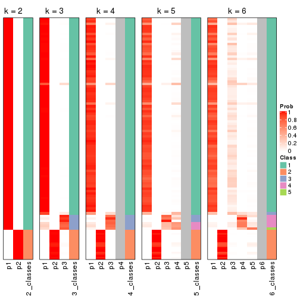


If matrix rows can be associated to genes, consider to use `GO_Enrichment(res,
...)` to perform function enrichment for the signature genes.


 

---------------------------------------------------


### ATC:skmeans**


The object with results only for a single top-value method and a single partition method 
can be extracted as:

```r
res = res_list["ATC", "skmeans"]
# you can also extract it by
# res = res_list["ATC:skmeans"]
```

A summary of `res` and all the functions that can be applied to it:

```r
res
```

```
#> A 'ConsensusPartition' object with k = 2, 3, 4, 5, 6.
#>   On a matrix with 8394 rows and 194 columns.
#>   Top rows (839, 1678, 2518, 3358, 4197) are extracted by 'ATC' method.
#>   Subgroups are detected by 'skmeans' method.
#>   Performed in total 1250 partitions by row resampling.
#>   Best k for subgroups seems to be 2.
#> 
#> Following methods can be applied to this 'ConsensusPartition' object:
#>  [1] "cola_report"             "collect_classes"         "collect_plots"          
#>  [4] "collect_stats"           "colnames"                "compare_signatures"     
#>  [7] "consensus_heatmap"       "dimension_reduction"     "functional_enrichment"  
#> [10] "get_anno_col"            "get_anno"                "get_classes"            
#> [13] "get_consensus"           "get_matrix"              "get_membership"         
#> [16] "get_param"               "get_signatures"          "get_stats"              
#> [19] "is_best_k"               "is_stable_k"             "membership_heatmap"     
#> [22] "ncol"                    "nrow"                    "plot_ecdf"              
#> [25] "rownames"                "select_partition_number" "show"                   
#> [28] "suggest_best_k"          "test_to_known_factors"
```

`collect_plots()` function collects all the plots made from `res` for all `k` (number of partitions)
into one single page to provide an easy and fast comparison between different `k`.

```r
collect_plots(res)
```


The plots are:

- The first row: a plot of the ECDF (Empirical cumulative distribution
  function) curves of the consensus matrix for each `k` and the heatmap of
  predicted classes for each `k`.
- The second row: heatmaps of the consensus matrix for each `k`.
- The third row: heatmaps of the membership matrix for each `k`.
- The fouth row: heatmaps of the signatures for each `k`.

All the plots in panels can be made by individual functions and they are
plotted later in this section.

`select_partition_number()` produces several plots showing different
statistics for choosing "optimized" `k`. There are following statistics:

- ECDF curves of the consensus matrix for each `k`;
- 1-PAC. [The PAC
  score](https://en.wikipedia.org/wiki/Consensus_clustering#Over-interpretation_potential_of_consensus_clustering)
  measures the proportion of the ambiguous subgrouping.
- Mean silhouette score.
- Concordance. The mean probability of fiting the consensus class ids in all
  partitions.
- Area increased. Denote $A_k$ as the area under the ECDF curve for current
  `k`, the area increased is defined as $A_k - A_{k-1}$.
- Rand index. The percent of pairs of samples that are both in a same cluster
  or both are not in a same cluster in the partition of k and k-1.
- Jaccard index. The ratio of pairs of samples are both in a same cluster in
  the partition of k and k-1 and the pairs of samples are both in a same
  cluster in the partition k or k-1.

The detailed explanations of these statistics can be found in [the cola
vignette](http://bioconductor.org/packages/devel/bioc/vignettes/cola/inst/doc/cola.html#toc_13).

Generally speaking, lower PAC score, higher mean silhouette score or higher
concordance corresponds to better partition. Rand index and Jaccard index
measure how similar the current partition is compared to partition with `k-1`.
If they are too similar, we won't accept `k` is better than `k-1`.

```r
select_partition_number(res)
```


The numeric values for all these statistics can be obtained by `get_stats()`.

```r
get_stats(res)
```

```
#>   k 1-PAC mean_silhouette concordance area_increased  Rand Jaccard
#> 2 2 1.000           0.999       1.000         0.3047 0.696   0.696
#> 3 3 0.567           0.851       0.904         0.4495 0.916   0.880
#> 4 4 0.376           0.588       0.783         0.3085 0.943   0.908
#> 5 5 0.383           0.450       0.684         0.1353 0.897   0.818
#> 6 6 0.405           0.443       0.657         0.0785 0.907   0.812
```

`suggest_best_k()` suggests the best $k$ based on these statistics. The rules are as follows:

- All $k$ with Jaccard index larger than 0.95 are removed because the increase of
  the partition number does not provides enough extra information. If all $k$ are removed,
  the best $k$ is assigned by `NA`.
- For $k$ with 1-PAC larger than 0.9, the maximal $k$ is taken as the "best k". Other $k$ is called "optional k".
- If it does not fit the second rule. The $k$ with the highest vote of highest
  1-PAC, mean silhouette and concordance is taken as the "best k".

```r
suggest_best_k(res)
```

```
#> [1] 2
```


Following shows the table of the partitions (You need to click the **show/hide
code output** link to see it). The membership matrix (columns with name `p*`)
is inferred by
[`clue::cl_consensus()`](https://www.rdocumentation.org/link/cl_consensus?package=clue)
function with the `SE` method. Basically the value in the membership matrix
represents the probability to belong to a certain group. The finall class
label for an item is determined with the group with highest probability it
belongs to.

In `get_classes()` function, the entropy is calculated from the membership
matrix and the silhouette score is calculated from the consensus matrix.


<script>
$( function() {
	$( '#tabs-ATC-skmeans-get-classes' ).tabs();
} );
</script>
<div id='tabs-ATC-skmeans-get-classes'>
<ul>
<li><a href='#tab-ATC-skmeans-get-classes-1'>k = 2</a></li>
<li><a href='#tab-ATC-skmeans-get-classes-2'>k = 3</a></li>
<li><a href='#tab-ATC-skmeans-get-classes-3'>k = 4</a></li>
<li><a href='#tab-ATC-skmeans-get-classes-4'>k = 5</a></li>
<li><a href='#tab-ATC-skmeans-get-classes-5'>k = 6</a></li>
</ul>

<div id='tab-ATC-skmeans-get-classes-1'>
<p><a id='tab-ATC-skmeans-get-classes-1-a' style='color:#0366d6' href='#'>show/hide code output</a></p>
<pre><code class="r">cbind(get_classes(res, k = 2), get_membership(res, k = 2))
</code></pre>

<pre><code>#&gt;           class entropy silhouette    p1    p2
#&gt; ERR467487     2  0.0000      1.000 0.000 1.000
#&gt; ERR467498     2  0.0000      1.000 0.000 1.000
#&gt; ERR658998     1  0.0000      1.000 1.000 0.000
#&gt; ERR659094     1  0.0000      1.000 1.000 0.000
#&gt; ERR658999     1  0.0000      1.000 1.000 0.000
#&gt; ERR659095     1  0.0000      1.000 1.000 0.000
#&gt; ERR659000     1  0.0000      1.000 1.000 0.000
#&gt; ERR659096     1  0.0000      1.000 1.000 0.000
#&gt; ERR659001     1  0.0000      1.000 1.000 0.000
#&gt; ERR659097     1  0.0000      1.000 1.000 0.000
#&gt; ERR659002     1  0.0000      1.000 1.000 0.000
#&gt; ERR659098     1  0.0000      1.000 1.000 0.000
#&gt; ERR659003     1  0.0000      1.000 1.000 0.000
#&gt; ERR659099     1  0.0000      1.000 1.000 0.000
#&gt; ERR659004     1  0.0000      1.000 1.000 0.000
#&gt; ERR659100     1  0.0000      1.000 1.000 0.000
#&gt; ERR659005     1  0.0000      1.000 1.000 0.000
#&gt; ERR659101     1  0.0000      1.000 1.000 0.000
#&gt; ERR659006     1  0.0000      1.000 1.000 0.000
#&gt; ERR659102     1  0.0000      1.000 1.000 0.000
#&gt; ERR659007     1  0.0000      1.000 1.000 0.000
#&gt; ERR659103     1  0.0000      1.000 1.000 0.000
#&gt; ERR659008     2  0.0000      1.000 0.000 1.000
#&gt; ERR659104     2  0.0000      1.000 0.000 1.000
#&gt; ERR659009     1  0.0000      1.000 1.000 0.000
#&gt; ERR659105     1  0.0000      1.000 1.000 0.000
#&gt; ERR659010     1  0.0000      1.000 1.000 0.000
#&gt; ERR659106     1  0.0000      1.000 1.000 0.000
#&gt; ERR659011     1  0.0000      1.000 1.000 0.000
#&gt; ERR659107     1  0.0000      1.000 1.000 0.000
#&gt; ERR659012     1  0.0000      1.000 1.000 0.000
#&gt; ERR659108     1  0.0000      1.000 1.000 0.000
#&gt; ERR659013     1  0.0000      1.000 1.000 0.000
#&gt; ERR659109     1  0.0000      1.000 1.000 0.000
#&gt; ERR659014     2  0.0000      1.000 0.000 1.000
#&gt; ERR659110     2  0.0000      1.000 0.000 1.000
#&gt; ERR659015     1  0.0000      1.000 1.000 0.000
#&gt; ERR659111     1  0.0000      1.000 1.000 0.000
#&gt; ERR659016     1  0.0000      1.000 1.000 0.000
#&gt; ERR659112     1  0.0000      1.000 1.000 0.000
#&gt; ERR659017     2  0.0000      1.000 0.000 1.000
#&gt; ERR659113     2  0.0000      1.000 0.000 1.000
#&gt; ERR659018     1  0.0000      1.000 1.000 0.000
#&gt; ERR659114     1  0.0000      1.000 1.000 0.000
#&gt; ERR659019     1  0.0000      1.000 1.000 0.000
#&gt; ERR659115     1  0.0000      1.000 1.000 0.000
#&gt; ERR659020     1  0.0000      1.000 1.000 0.000
#&gt; ERR659116     1  0.0000      1.000 1.000 0.000
#&gt; ERR659021     1  0.0000      1.000 1.000 0.000
#&gt; ERR659117     1  0.0000      1.000 1.000 0.000
#&gt; ERR659022     1  0.0000      1.000 1.000 0.000
#&gt; ERR659118     1  0.0000      1.000 1.000 0.000
#&gt; ERR659023     1  0.0000      1.000 1.000 0.000
#&gt; ERR659119     1  0.0000      1.000 1.000 0.000
#&gt; ERR659024     1  0.0000      1.000 1.000 0.000
#&gt; ERR659120     1  0.0000      1.000 1.000 0.000
#&gt; ERR659025     1  0.0000      1.000 1.000 0.000
#&gt; ERR659121     1  0.0000      1.000 1.000 0.000
#&gt; ERR659026     1  0.0000      1.000 1.000 0.000
#&gt; ERR659122     1  0.0000      1.000 1.000 0.000
#&gt; ERR659027     1  0.1633      0.976 0.976 0.024
#&gt; ERR659123     1  0.1633      0.976 0.976 0.024
#&gt; ERR659028     1  0.0000      1.000 1.000 0.000
#&gt; ERR659124     1  0.0000      1.000 1.000 0.000
#&gt; ERR659029     1  0.0000      1.000 1.000 0.000
#&gt; ERR659125     1  0.0000      1.000 1.000 0.000
#&gt; ERR659030     1  0.0000      1.000 1.000 0.000
#&gt; ERR659126     1  0.0000      1.000 1.000 0.000
#&gt; ERR659031     1  0.0000      1.000 1.000 0.000
#&gt; ERR659127     1  0.0000      1.000 1.000 0.000
#&gt; ERR659032     1  0.0000      1.000 1.000 0.000
#&gt; ERR659128     1  0.0000      1.000 1.000 0.000
#&gt; ERR659033     1  0.0000      1.000 1.000 0.000
#&gt; ERR659129     1  0.0000      1.000 1.000 0.000
#&gt; ERR659034     2  0.0000      1.000 0.000 1.000
#&gt; ERR659130     2  0.0000      1.000 0.000 1.000
#&gt; ERR659035     1  0.0000      1.000 1.000 0.000
#&gt; ERR659131     1  0.0000      1.000 1.000 0.000
#&gt; ERR659036     1  0.0000      1.000 1.000 0.000
#&gt; ERR659132     1  0.0000      1.000 1.000 0.000
#&gt; ERR659037     1  0.0000      1.000 1.000 0.000
#&gt; ERR659133     1  0.0000      1.000 1.000 0.000
#&gt; ERR659038     1  0.0000      1.000 1.000 0.000
#&gt; ERR659134     1  0.0000      1.000 1.000 0.000
#&gt; ERR659039     1  0.0000      1.000 1.000 0.000
#&gt; ERR659135     1  0.0000      1.000 1.000 0.000
#&gt; ERR659040     1  0.0000      1.000 1.000 0.000
#&gt; ERR659136     1  0.0000      1.000 1.000 0.000
#&gt; ERR659041     1  0.0000      1.000 1.000 0.000
#&gt; ERR659137     1  0.0000      1.000 1.000 0.000
#&gt; ERR659042     1  0.0000      1.000 1.000 0.000
#&gt; ERR659138     1  0.0000      1.000 1.000 0.000
#&gt; ERR659043     1  0.0000      1.000 1.000 0.000
#&gt; ERR659139     1  0.0000      1.000 1.000 0.000
#&gt; ERR659044     2  0.0000      1.000 0.000 1.000
#&gt; ERR659140     2  0.0000      1.000 0.000 1.000
#&gt; ERR659045     1  0.0000      1.000 1.000 0.000
#&gt; ERR659141     1  0.0000      1.000 1.000 0.000
#&gt; ERR659046     1  0.0000      1.000 1.000 0.000
#&gt; ERR659142     1  0.0000      1.000 1.000 0.000
#&gt; ERR659047     1  0.0000      1.000 1.000 0.000
#&gt; ERR659143     1  0.0000      1.000 1.000 0.000
#&gt; ERR659048     1  0.0000      1.000 1.000 0.000
#&gt; ERR659144     1  0.0000      1.000 1.000 0.000
#&gt; ERR659049     1  0.0000      1.000 1.000 0.000
#&gt; ERR659145     1  0.0000      1.000 1.000 0.000
#&gt; ERR659050     1  0.0000      1.000 1.000 0.000
#&gt; ERR659146     1  0.0000      1.000 1.000 0.000
#&gt; ERR659051     2  0.0672      0.992 0.008 0.992
#&gt; ERR659147     2  0.0672      0.992 0.008 0.992
#&gt; ERR659052     1  0.0000      1.000 1.000 0.000
#&gt; ERR659148     1  0.0000      1.000 1.000 0.000
#&gt; ERR659053     1  0.0000      1.000 1.000 0.000
#&gt; ERR659149     1  0.0000      1.000 1.000 0.000
#&gt; ERR659054     2  0.0000      1.000 0.000 1.000
#&gt; ERR659150     2  0.0000      1.000 0.000 1.000
#&gt; ERR659055     1  0.0000      1.000 1.000 0.000
#&gt; ERR659151     1  0.0000      1.000 1.000 0.000
#&gt; ERR659056     2  0.0000      1.000 0.000 1.000
#&gt; ERR659152     2  0.0000      1.000 0.000 1.000
#&gt; ERR659057     1  0.0000      1.000 1.000 0.000
#&gt; ERR659153     1  0.0000      1.000 1.000 0.000
#&gt; ERR659058     1  0.0000      1.000 1.000 0.000
#&gt; ERR659154     1  0.0000      1.000 1.000 0.000
#&gt; ERR659059     1  0.0000      1.000 1.000 0.000
#&gt; ERR659155     1  0.0000      1.000 1.000 0.000
#&gt; ERR659060     1  0.0000      1.000 1.000 0.000
#&gt; ERR659156     1  0.0000      1.000 1.000 0.000
#&gt; ERR659061     1  0.0000      1.000 1.000 0.000
#&gt; ERR659157     1  0.0000      1.000 1.000 0.000
#&gt; ERR659062     1  0.0000      1.000 1.000 0.000
#&gt; ERR659158     1  0.0000      1.000 1.000 0.000
#&gt; ERR659063     1  0.0000      1.000 1.000 0.000
#&gt; ERR659159     1  0.0000      1.000 1.000 0.000
#&gt; ERR659064     1  0.0000      1.000 1.000 0.000
#&gt; ERR659160     1  0.0000      1.000 1.000 0.000
#&gt; ERR659065     2  0.0000      1.000 0.000 1.000
#&gt; ERR659161     2  0.0000      1.000 0.000 1.000
#&gt; ERR659066     1  0.0000      1.000 1.000 0.000
#&gt; ERR659162     1  0.0000      1.000 1.000 0.000
#&gt; ERR659067     1  0.0000      1.000 1.000 0.000
#&gt; ERR659163     1  0.0000      1.000 1.000 0.000
#&gt; ERR659068     2  0.0000      1.000 0.000 1.000
#&gt; ERR659164     2  0.0000      1.000 0.000 1.000
#&gt; ERR659069     1  0.0000      1.000 1.000 0.000
#&gt; ERR659165     1  0.0000      1.000 1.000 0.000
#&gt; ERR659070     1  0.0000      1.000 1.000 0.000
#&gt; ERR659166     1  0.0000      1.000 1.000 0.000
#&gt; ERR659071     1  0.0000      1.000 1.000 0.000
#&gt; ERR659167     1  0.0000      1.000 1.000 0.000
#&gt; ERR659072     1  0.0000      1.000 1.000 0.000
#&gt; ERR659168     1  0.0000      1.000 1.000 0.000
#&gt; ERR659073     1  0.0000      1.000 1.000 0.000
#&gt; ERR659169     1  0.0000      1.000 1.000 0.000
#&gt; ERR659074     2  0.0000      1.000 0.000 1.000
#&gt; ERR659170     2  0.0000      1.000 0.000 1.000
#&gt; ERR659075     2  0.0000      1.000 0.000 1.000
#&gt; ERR659171     2  0.0000      1.000 0.000 1.000
#&gt; ERR659076     2  0.0000      1.000 0.000 1.000
#&gt; ERR659172     2  0.0000      1.000 0.000 1.000
#&gt; ERR659077     1  0.0000      1.000 1.000 0.000
#&gt; ERR659173     1  0.0000      1.000 1.000 0.000
#&gt; ERR659078     1  0.0000      1.000 1.000 0.000
#&gt; ERR659174     1  0.0000      1.000 1.000 0.000
#&gt; ERR659079     1  0.0000      1.000 1.000 0.000
#&gt; ERR659175     1  0.0000      1.000 1.000 0.000
#&gt; ERR659080     2  0.0000      1.000 0.000 1.000
#&gt; ERR659176     2  0.0000      1.000 0.000 1.000
#&gt; ERR659081     1  0.0000      1.000 1.000 0.000
#&gt; ERR659177     1  0.0000      1.000 1.000 0.000
#&gt; ERR659082     1  0.0000      1.000 1.000 0.000
#&gt; ERR659178     1  0.0000      1.000 1.000 0.000
#&gt; ERR659083     2  0.0000      1.000 0.000 1.000
#&gt; ERR659179     2  0.0000      1.000 0.000 1.000
#&gt; ERR659084     2  0.0000      1.000 0.000 1.000
#&gt; ERR659180     2  0.0000      1.000 0.000 1.000
#&gt; ERR659085     1  0.0000      1.000 1.000 0.000
#&gt; ERR659181     1  0.0000      1.000 1.000 0.000
#&gt; ERR659086     1  0.0000      1.000 1.000 0.000
#&gt; ERR659182     1  0.0000      1.000 1.000 0.000
#&gt; ERR659087     1  0.0000      1.000 1.000 0.000
#&gt; ERR659183     1  0.0000      1.000 1.000 0.000
#&gt; ERR659088     2  0.0000      1.000 0.000 1.000
#&gt; ERR659184     2  0.0000      1.000 0.000 1.000
#&gt; ERR659089     1  0.0000      1.000 1.000 0.000
#&gt; ERR659185     1  0.0000      1.000 1.000 0.000
#&gt; ERR659090     1  0.0000      1.000 1.000 0.000
#&gt; ERR659186     1  0.0000      1.000 1.000 0.000
#&gt; ERR659091     1  0.0000      1.000 1.000 0.000
#&gt; ERR659187     1  0.0000      1.000 1.000 0.000
#&gt; ERR659092     1  0.0000      1.000 1.000 0.000
#&gt; ERR659188     1  0.0000      1.000 1.000 0.000
#&gt; ERR659093     1  0.0000      1.000 1.000 0.000
#&gt; ERR659189     1  0.0000      1.000 1.000 0.000
</code></pre>

<script>
$('#tab-ATC-skmeans-get-classes-1-a').parent().next().next().hide();
$('#tab-ATC-skmeans-get-classes-1-a').click(function(){
  $('#tab-ATC-skmeans-get-classes-1-a').parent().next().next().toggle();
  return(false);
});
</script>
</div>

<div id='tab-ATC-skmeans-get-classes-2'>
<p><a id='tab-ATC-skmeans-get-classes-2-a' style='color:#0366d6' href='#'>show/hide code output</a></p>
<pre><code class="r">cbind(get_classes(res, k = 3), get_membership(res, k = 3))
</code></pre>

<pre><code>#&gt;           class entropy silhouette    p1    p2    p3
#&gt; ERR467487     2  0.0000      0.952 0.000 1.000 0.000
#&gt; ERR467498     2  0.0000      0.952 0.000 1.000 0.000
#&gt; ERR658998     1  0.3267      0.876 0.884 0.000 0.116
#&gt; ERR659094     1  0.3267      0.876 0.884 0.000 0.116
#&gt; ERR658999     1  0.2625      0.892 0.916 0.000 0.084
#&gt; ERR659095     1  0.2625      0.892 0.916 0.000 0.084
#&gt; ERR659000     3  0.5465      0.719 0.288 0.000 0.712
#&gt; ERR659096     3  0.5465      0.719 0.288 0.000 0.712
#&gt; ERR659001     1  0.0237      0.907 0.996 0.000 0.004
#&gt; ERR659097     1  0.0237      0.907 0.996 0.000 0.004
#&gt; ERR659002     1  0.1163      0.909 0.972 0.000 0.028
#&gt; ERR659098     1  0.1163      0.909 0.972 0.000 0.028
#&gt; ERR659003     1  0.1031      0.906 0.976 0.000 0.024
#&gt; ERR659099     1  0.1031      0.906 0.976 0.000 0.024
#&gt; ERR659004     1  0.5785      0.495 0.668 0.000 0.332
#&gt; ERR659100     1  0.5760      0.506 0.672 0.000 0.328
#&gt; ERR659005     1  0.1031      0.904 0.976 0.000 0.024
#&gt; ERR659101     1  0.1031      0.904 0.976 0.000 0.024
#&gt; ERR659006     1  0.3192      0.882 0.888 0.000 0.112
#&gt; ERR659102     1  0.3192      0.882 0.888 0.000 0.112
#&gt; ERR659007     1  0.0892      0.903 0.980 0.000 0.020
#&gt; ERR659103     1  0.0892      0.903 0.980 0.000 0.020
#&gt; ERR659008     2  0.0000      0.952 0.000 1.000 0.000
#&gt; ERR659104     2  0.0000      0.952 0.000 1.000 0.000
#&gt; ERR659009     1  0.3941      0.850 0.844 0.000 0.156
#&gt; ERR659105     1  0.3941      0.850 0.844 0.000 0.156
#&gt; ERR659010     1  0.2711      0.893 0.912 0.000 0.088
#&gt; ERR659106     1  0.2711      0.893 0.912 0.000 0.088
#&gt; ERR659011     1  0.2356      0.898 0.928 0.000 0.072
#&gt; ERR659107     1  0.2356      0.898 0.928 0.000 0.072
#&gt; ERR659012     1  0.3482      0.870 0.872 0.000 0.128
#&gt; ERR659108     1  0.3482      0.870 0.872 0.000 0.128
#&gt; ERR659013     1  0.5178      0.656 0.744 0.000 0.256
#&gt; ERR659109     1  0.5216      0.647 0.740 0.000 0.260
#&gt; ERR659014     2  0.0000      0.952 0.000 1.000 0.000
#&gt; ERR659110     2  0.0000      0.952 0.000 1.000 0.000
#&gt; ERR659015     1  0.0592      0.905 0.988 0.000 0.012
#&gt; ERR659111     1  0.0592      0.905 0.988 0.000 0.012
#&gt; ERR659016     3  0.6192      0.554 0.420 0.000 0.580
#&gt; ERR659112     3  0.6192      0.554 0.420 0.000 0.580
#&gt; ERR659017     2  0.0000      0.952 0.000 1.000 0.000
#&gt; ERR659113     2  0.0000      0.952 0.000 1.000 0.000
#&gt; ERR659018     1  0.1163      0.907 0.972 0.000 0.028
#&gt; ERR659114     1  0.1163      0.907 0.972 0.000 0.028
#&gt; ERR659019     1  0.1860      0.906 0.948 0.000 0.052
#&gt; ERR659115     1  0.1860      0.906 0.948 0.000 0.052
#&gt; ERR659020     1  0.0592      0.905 0.988 0.000 0.012
#&gt; ERR659116     1  0.0592      0.905 0.988 0.000 0.012
#&gt; ERR659021     1  0.0424      0.905 0.992 0.000 0.008
#&gt; ERR659117     1  0.0424      0.905 0.992 0.000 0.008
#&gt; ERR659022     1  0.2537      0.891 0.920 0.000 0.080
#&gt; ERR659118     1  0.2537      0.891 0.920 0.000 0.080
#&gt; ERR659023     1  0.1964      0.898 0.944 0.000 0.056
#&gt; ERR659119     1  0.1964      0.898 0.944 0.000 0.056
#&gt; ERR659024     1  0.1411      0.903 0.964 0.000 0.036
#&gt; ERR659120     1  0.1411      0.903 0.964 0.000 0.036
#&gt; ERR659025     1  0.5733      0.493 0.676 0.000 0.324
#&gt; ERR659121     1  0.5733      0.493 0.676 0.000 0.324
#&gt; ERR659026     1  0.4346      0.838 0.816 0.000 0.184
#&gt; ERR659122     1  0.4346      0.838 0.816 0.000 0.184
#&gt; ERR659027     3  0.4178      0.679 0.172 0.000 0.828
#&gt; ERR659123     3  0.4178      0.679 0.172 0.000 0.828
#&gt; ERR659028     1  0.3038      0.893 0.896 0.000 0.104
#&gt; ERR659124     1  0.3038      0.893 0.896 0.000 0.104
#&gt; ERR659029     1  0.2066      0.896 0.940 0.000 0.060
#&gt; ERR659125     1  0.2066      0.896 0.940 0.000 0.060
#&gt; ERR659030     1  0.2066      0.900 0.940 0.000 0.060
#&gt; ERR659126     1  0.2066      0.900 0.940 0.000 0.060
#&gt; ERR659031     1  0.2066      0.901 0.940 0.000 0.060
#&gt; ERR659127     1  0.2066      0.901 0.940 0.000 0.060
#&gt; ERR659032     1  0.2356      0.895 0.928 0.000 0.072
#&gt; ERR659128     1  0.2356      0.895 0.928 0.000 0.072
#&gt; ERR659033     1  0.1643      0.902 0.956 0.000 0.044
#&gt; ERR659129     1  0.1643      0.902 0.956 0.000 0.044
#&gt; ERR659034     2  0.0000      0.952 0.000 1.000 0.000
#&gt; ERR659130     2  0.0000      0.952 0.000 1.000 0.000
#&gt; ERR659035     1  0.2959      0.897 0.900 0.000 0.100
#&gt; ERR659131     1  0.2959      0.897 0.900 0.000 0.100
#&gt; ERR659036     3  0.5835      0.663 0.340 0.000 0.660
#&gt; ERR659132     3  0.5835      0.663 0.340 0.000 0.660
#&gt; ERR659037     1  0.1411      0.910 0.964 0.000 0.036
#&gt; ERR659133     1  0.1411      0.910 0.964 0.000 0.036
#&gt; ERR659038     1  0.2878      0.895 0.904 0.000 0.096
#&gt; ERR659134     1  0.2878      0.895 0.904 0.000 0.096
#&gt; ERR659039     1  0.1411      0.908 0.964 0.000 0.036
#&gt; ERR659135     1  0.1411      0.908 0.964 0.000 0.036
#&gt; ERR659040     1  0.3192      0.878 0.888 0.000 0.112
#&gt; ERR659136     1  0.3192      0.878 0.888 0.000 0.112
#&gt; ERR659041     3  0.3482      0.664 0.128 0.000 0.872
#&gt; ERR659137     3  0.3482      0.664 0.128 0.000 0.872
#&gt; ERR659042     1  0.5882      0.366 0.652 0.000 0.348
#&gt; ERR659138     1  0.5882      0.366 0.652 0.000 0.348
#&gt; ERR659043     1  0.3340      0.859 0.880 0.000 0.120
#&gt; ERR659139     1  0.3340      0.859 0.880 0.000 0.120
#&gt; ERR659044     2  0.0000      0.952 0.000 1.000 0.000
#&gt; ERR659140     2  0.0000      0.952 0.000 1.000 0.000
#&gt; ERR659045     1  0.1753      0.908 0.952 0.000 0.048
#&gt; ERR659141     1  0.1753      0.908 0.952 0.000 0.048
#&gt; ERR659046     1  0.2448      0.897 0.924 0.000 0.076
#&gt; ERR659142     1  0.2448      0.897 0.924 0.000 0.076
#&gt; ERR659047     1  0.3038      0.890 0.896 0.000 0.104
#&gt; ERR659143     1  0.3038      0.890 0.896 0.000 0.104
#&gt; ERR659048     1  0.2878      0.892 0.904 0.000 0.096
#&gt; ERR659144     1  0.2878      0.892 0.904 0.000 0.096
#&gt; ERR659049     1  0.5905      0.509 0.648 0.000 0.352
#&gt; ERR659145     1  0.5905      0.509 0.648 0.000 0.352
#&gt; ERR659050     1  0.2066      0.907 0.940 0.000 0.060
#&gt; ERR659146     1  0.2066      0.907 0.940 0.000 0.060
#&gt; ERR659051     2  0.5882      0.611 0.000 0.652 0.348
#&gt; ERR659147     2  0.5882      0.611 0.000 0.652 0.348
#&gt; ERR659052     1  0.3116      0.895 0.892 0.000 0.108
#&gt; ERR659148     1  0.3116      0.895 0.892 0.000 0.108
#&gt; ERR659053     1  0.2261      0.894 0.932 0.000 0.068
#&gt; ERR659149     1  0.2261      0.894 0.932 0.000 0.068
#&gt; ERR659054     2  0.0000      0.952 0.000 1.000 0.000
#&gt; ERR659150     2  0.0000      0.952 0.000 1.000 0.000
#&gt; ERR659055     1  0.0892      0.909 0.980 0.000 0.020
#&gt; ERR659151     1  0.0892      0.909 0.980 0.000 0.020
#&gt; ERR659056     2  0.2625      0.892 0.000 0.916 0.084
#&gt; ERR659152     2  0.2625      0.892 0.000 0.916 0.084
#&gt; ERR659057     1  0.0892      0.908 0.980 0.000 0.020
#&gt; ERR659153     1  0.0892      0.908 0.980 0.000 0.020
#&gt; ERR659058     1  0.3686      0.879 0.860 0.000 0.140
#&gt; ERR659154     1  0.3686      0.879 0.860 0.000 0.140
#&gt; ERR659059     1  0.2878      0.898 0.904 0.000 0.096
#&gt; ERR659155     1  0.2878      0.898 0.904 0.000 0.096
#&gt; ERR659060     1  0.3267      0.887 0.884 0.000 0.116
#&gt; ERR659156     1  0.3267      0.887 0.884 0.000 0.116
#&gt; ERR659061     1  0.2711      0.893 0.912 0.000 0.088
#&gt; ERR659157     1  0.2711      0.893 0.912 0.000 0.088
#&gt; ERR659062     1  0.3482      0.879 0.872 0.000 0.128
#&gt; ERR659158     1  0.3482      0.879 0.872 0.000 0.128
#&gt; ERR659063     1  0.3192      0.893 0.888 0.000 0.112
#&gt; ERR659159     1  0.3192      0.893 0.888 0.000 0.112
#&gt; ERR659064     1  0.1964      0.900 0.944 0.000 0.056
#&gt; ERR659160     1  0.1964      0.900 0.944 0.000 0.056
#&gt; ERR659065     2  0.0000      0.952 0.000 1.000 0.000
#&gt; ERR659161     2  0.0000      0.952 0.000 1.000 0.000
#&gt; ERR659066     1  0.3038      0.885 0.896 0.000 0.104
#&gt; ERR659162     1  0.3038      0.885 0.896 0.000 0.104
#&gt; ERR659067     1  0.2066      0.903 0.940 0.000 0.060
#&gt; ERR659163     1  0.2066      0.903 0.940 0.000 0.060
#&gt; ERR659068     2  0.0000      0.952 0.000 1.000 0.000
#&gt; ERR659164     2  0.0000      0.952 0.000 1.000 0.000
#&gt; ERR659069     1  0.1529      0.907 0.960 0.000 0.040
#&gt; ERR659165     1  0.1529      0.907 0.960 0.000 0.040
#&gt; ERR659070     1  0.3941      0.850 0.844 0.000 0.156
#&gt; ERR659166     1  0.3941      0.850 0.844 0.000 0.156
#&gt; ERR659071     1  0.2537      0.897 0.920 0.000 0.080
#&gt; ERR659167     1  0.2537      0.897 0.920 0.000 0.080
#&gt; ERR659072     1  0.3619      0.865 0.864 0.000 0.136
#&gt; ERR659168     1  0.3619      0.865 0.864 0.000 0.136
#&gt; ERR659073     1  0.3412      0.872 0.876 0.000 0.124
#&gt; ERR659169     1  0.3412      0.872 0.876 0.000 0.124
#&gt; ERR659074     2  0.0000      0.952 0.000 1.000 0.000
#&gt; ERR659170     2  0.0000      0.952 0.000 1.000 0.000
#&gt; ERR659075     2  0.0000      0.952 0.000 1.000 0.000
#&gt; ERR659171     2  0.0000      0.952 0.000 1.000 0.000
#&gt; ERR659076     2  0.0000      0.952 0.000 1.000 0.000
#&gt; ERR659172     2  0.0000      0.952 0.000 1.000 0.000
#&gt; ERR659077     1  0.3267      0.876 0.884 0.000 0.116
#&gt; ERR659173     1  0.3267      0.876 0.884 0.000 0.116
#&gt; ERR659078     1  0.3038      0.886 0.896 0.000 0.104
#&gt; ERR659174     1  0.3038      0.886 0.896 0.000 0.104
#&gt; ERR659079     1  0.3340      0.876 0.880 0.000 0.120
#&gt; ERR659175     1  0.3340      0.876 0.880 0.000 0.120
#&gt; ERR659080     2  0.6192      0.483 0.000 0.580 0.420
#&gt; ERR659176     2  0.6192      0.483 0.000 0.580 0.420
#&gt; ERR659081     1  0.0892      0.903 0.980 0.000 0.020
#&gt; ERR659177     1  0.0892      0.903 0.980 0.000 0.020
#&gt; ERR659082     1  0.2537      0.883 0.920 0.000 0.080
#&gt; ERR659178     1  0.2537      0.883 0.920 0.000 0.080
#&gt; ERR659083     2  0.0000      0.952 0.000 1.000 0.000
#&gt; ERR659179     2  0.0000      0.952 0.000 1.000 0.000
#&gt; ERR659084     2  0.0000      0.952 0.000 1.000 0.000
#&gt; ERR659180     2  0.0000      0.952 0.000 1.000 0.000
#&gt; ERR659085     1  0.1753      0.905 0.952 0.000 0.048
#&gt; ERR659181     1  0.1753      0.905 0.952 0.000 0.048
#&gt; ERR659086     1  0.2356      0.903 0.928 0.000 0.072
#&gt; ERR659182     1  0.2356      0.903 0.928 0.000 0.072
#&gt; ERR659087     1  0.2625      0.898 0.916 0.000 0.084
#&gt; ERR659183     1  0.2625      0.898 0.916 0.000 0.084
#&gt; ERR659088     3  0.6252     -0.224 0.000 0.444 0.556
#&gt; ERR659184     3  0.6252     -0.224 0.000 0.444 0.556
#&gt; ERR659089     1  0.2625      0.877 0.916 0.000 0.084
#&gt; ERR659185     1  0.2625      0.877 0.916 0.000 0.084
#&gt; ERR659090     1  0.1643      0.901 0.956 0.000 0.044
#&gt; ERR659186     1  0.1643      0.901 0.956 0.000 0.044
#&gt; ERR659091     1  0.0592      0.905 0.988 0.000 0.012
#&gt; ERR659187     1  0.0592      0.905 0.988 0.000 0.012
#&gt; ERR659092     1  0.1163      0.908 0.972 0.000 0.028
#&gt; ERR659188     1  0.1163      0.908 0.972 0.000 0.028
#&gt; ERR659093     1  0.1163      0.907 0.972 0.000 0.028
#&gt; ERR659189     1  0.1163      0.907 0.972 0.000 0.028
</code></pre>

<script>
$('#tab-ATC-skmeans-get-classes-2-a').parent().next().next().hide();
$('#tab-ATC-skmeans-get-classes-2-a').click(function(){
  $('#tab-ATC-skmeans-get-classes-2-a').parent().next().next().toggle();
  return(false);
});
</script>
</div>

<div id='tab-ATC-skmeans-get-classes-3'>
<p><a id='tab-ATC-skmeans-get-classes-3-a' style='color:#0366d6' href='#'>show/hide code output</a></p>
<pre><code class="r">cbind(get_classes(res, k = 4), get_membership(res, k = 4))
</code></pre>

<pre><code>#&gt;           class entropy silhouette    p1    p2    p3    p4
#&gt; ERR467487     2   0.000     0.9800 0.000 1.000 0.000 0.000
#&gt; ERR467498     2   0.000     0.9800 0.000 1.000 0.000 0.000
#&gt; ERR658998     1   0.488     0.2770 0.592 0.000 0.000 0.408
#&gt; ERR659094     1   0.488     0.2770 0.592 0.000 0.000 0.408
#&gt; ERR658999     1   0.361     0.6358 0.800 0.000 0.000 0.200
#&gt; ERR659095     1   0.361     0.6358 0.800 0.000 0.000 0.200
#&gt; ERR659000     3   0.725     0.1883 0.160 0.000 0.504 0.336
#&gt; ERR659096     3   0.725     0.1883 0.160 0.000 0.504 0.336
#&gt; ERR659001     1   0.121     0.6925 0.960 0.000 0.000 0.040
#&gt; ERR659097     1   0.121     0.6925 0.960 0.000 0.000 0.040
#&gt; ERR659002     1   0.292     0.6934 0.876 0.000 0.008 0.116
#&gt; ERR659098     1   0.292     0.6934 0.876 0.000 0.008 0.116
#&gt; ERR659003     1   0.309     0.6917 0.864 0.000 0.008 0.128
#&gt; ERR659099     1   0.309     0.6917 0.864 0.000 0.008 0.128
#&gt; ERR659004     1   0.756    -0.4207 0.424 0.000 0.192 0.384
#&gt; ERR659100     1   0.756    -0.4207 0.424 0.000 0.192 0.384
#&gt; ERR659005     1   0.240     0.6937 0.904 0.000 0.004 0.092
#&gt; ERR659101     1   0.240     0.6937 0.904 0.000 0.004 0.092
#&gt; ERR659006     1   0.531     0.3851 0.648 0.000 0.024 0.328
#&gt; ERR659102     1   0.529     0.3921 0.652 0.000 0.024 0.324
#&gt; ERR659007     1   0.140     0.6880 0.956 0.000 0.004 0.040
#&gt; ERR659103     1   0.140     0.6880 0.956 0.000 0.004 0.040
#&gt; ERR659008     2   0.000     0.9800 0.000 1.000 0.000 0.000
#&gt; ERR659104     2   0.000     0.9800 0.000 1.000 0.000 0.000
#&gt; ERR659009     4   0.485     0.3203 0.400 0.000 0.000 0.600
#&gt; ERR659105     4   0.485     0.3203 0.400 0.000 0.000 0.600
#&gt; ERR659010     1   0.376     0.6211 0.784 0.000 0.000 0.216
#&gt; ERR659106     1   0.376     0.6211 0.784 0.000 0.000 0.216
#&gt; ERR659011     1   0.322     0.6647 0.836 0.000 0.000 0.164
#&gt; ERR659107     1   0.322     0.6647 0.836 0.000 0.000 0.164
#&gt; ERR659012     1   0.547     0.3527 0.644 0.000 0.032 0.324
#&gt; ERR659108     1   0.547     0.3527 0.644 0.000 0.032 0.324
#&gt; ERR659013     4   0.684     0.3586 0.448 0.000 0.100 0.452
#&gt; ERR659109     4   0.684     0.3586 0.448 0.000 0.100 0.452
#&gt; ERR659014     2   0.000     0.9800 0.000 1.000 0.000 0.000
#&gt; ERR659110     2   0.000     0.9800 0.000 1.000 0.000 0.000
#&gt; ERR659015     1   0.255     0.6935 0.900 0.000 0.008 0.092
#&gt; ERR659111     1   0.248     0.6940 0.904 0.000 0.008 0.088
#&gt; ERR659016     4   0.768     0.1598 0.220 0.000 0.360 0.420
#&gt; ERR659112     4   0.768     0.1598 0.220 0.000 0.360 0.420
#&gt; ERR659017     2   0.000     0.9800 0.000 1.000 0.000 0.000
#&gt; ERR659113     2   0.000     0.9800 0.000 1.000 0.000 0.000
#&gt; ERR659018     1   0.190     0.6941 0.932 0.000 0.004 0.064
#&gt; ERR659114     1   0.190     0.6941 0.932 0.000 0.004 0.064
#&gt; ERR659019     1   0.331     0.6748 0.840 0.000 0.004 0.156
#&gt; ERR659115     1   0.331     0.6748 0.840 0.000 0.004 0.156
#&gt; ERR659020     1   0.156     0.6950 0.944 0.000 0.000 0.056
#&gt; ERR659116     1   0.156     0.6950 0.944 0.000 0.000 0.056
#&gt; ERR659021     1   0.261     0.6985 0.900 0.000 0.012 0.088
#&gt; ERR659117     1   0.261     0.6985 0.900 0.000 0.012 0.088
#&gt; ERR659022     1   0.411     0.6685 0.812 0.000 0.032 0.156
#&gt; ERR659118     1   0.411     0.6685 0.812 0.000 0.032 0.156
#&gt; ERR659023     1   0.344     0.6741 0.848 0.000 0.016 0.136
#&gt; ERR659119     1   0.344     0.6741 0.848 0.000 0.016 0.136
#&gt; ERR659024     1   0.293     0.6859 0.880 0.000 0.012 0.108
#&gt; ERR659120     1   0.293     0.6859 0.880 0.000 0.012 0.108
#&gt; ERR659025     1   0.713     0.0127 0.520 0.000 0.148 0.332
#&gt; ERR659121     1   0.713     0.0127 0.520 0.000 0.148 0.332
#&gt; ERR659026     1   0.551    -0.0353 0.512 0.000 0.016 0.472
#&gt; ERR659122     1   0.551    -0.0353 0.512 0.000 0.016 0.472
#&gt; ERR659027     3   0.478     0.6136 0.060 0.000 0.776 0.164
#&gt; ERR659123     3   0.478     0.6136 0.060 0.000 0.776 0.164
#&gt; ERR659028     1   0.466     0.6020 0.760 0.000 0.032 0.208
#&gt; ERR659124     1   0.466     0.6020 0.760 0.000 0.032 0.208
#&gt; ERR659029     1   0.386     0.6648 0.828 0.000 0.028 0.144
#&gt; ERR659125     1   0.386     0.6648 0.828 0.000 0.028 0.144
#&gt; ERR659030     1   0.303     0.6823 0.868 0.000 0.008 0.124
#&gt; ERR659126     1   0.303     0.6823 0.868 0.000 0.008 0.124
#&gt; ERR659031     1   0.358     0.6744 0.816 0.000 0.004 0.180
#&gt; ERR659127     1   0.358     0.6744 0.816 0.000 0.004 0.180
#&gt; ERR659032     1   0.374     0.6497 0.824 0.000 0.016 0.160
#&gt; ERR659128     1   0.374     0.6497 0.824 0.000 0.016 0.160
#&gt; ERR659033     1   0.228     0.6929 0.904 0.000 0.000 0.096
#&gt; ERR659129     1   0.228     0.6929 0.904 0.000 0.000 0.096
#&gt; ERR659034     2   0.000     0.9800 0.000 1.000 0.000 0.000
#&gt; ERR659130     2   0.000     0.9800 0.000 1.000 0.000 0.000
#&gt; ERR659035     1   0.528     0.4988 0.668 0.000 0.028 0.304
#&gt; ERR659131     1   0.528     0.4988 0.668 0.000 0.028 0.304
#&gt; ERR659036     4   0.783     0.3845 0.276 0.000 0.320 0.404
#&gt; ERR659132     4   0.783     0.3845 0.276 0.000 0.320 0.404
#&gt; ERR659037     1   0.376     0.6812 0.816 0.000 0.012 0.172
#&gt; ERR659133     1   0.376     0.6812 0.816 0.000 0.012 0.172
#&gt; ERR659038     1   0.439     0.5902 0.740 0.000 0.008 0.252
#&gt; ERR659134     1   0.439     0.5902 0.740 0.000 0.008 0.252
#&gt; ERR659039     1   0.270     0.6807 0.876 0.000 0.000 0.124
#&gt; ERR659135     1   0.270     0.6807 0.876 0.000 0.000 0.124
#&gt; ERR659040     1   0.455     0.6218 0.776 0.000 0.036 0.188
#&gt; ERR659136     1   0.455     0.6218 0.776 0.000 0.036 0.188
#&gt; ERR659041     3   0.450     0.5998 0.072 0.000 0.804 0.124
#&gt; ERR659137     3   0.450     0.5998 0.072 0.000 0.804 0.124
#&gt; ERR659042     1   0.707     0.0525 0.560 0.000 0.172 0.268
#&gt; ERR659138     1   0.707     0.0525 0.560 0.000 0.172 0.268
#&gt; ERR659043     1   0.531     0.5244 0.692 0.000 0.040 0.268
#&gt; ERR659139     1   0.531     0.5244 0.692 0.000 0.040 0.268
#&gt; ERR659044     2   0.000     0.9800 0.000 1.000 0.000 0.000
#&gt; ERR659140     2   0.000     0.9800 0.000 1.000 0.000 0.000
#&gt; ERR659045     1   0.283     0.6914 0.876 0.000 0.004 0.120
#&gt; ERR659141     1   0.283     0.6914 0.876 0.000 0.004 0.120
#&gt; ERR659046     1   0.376     0.6758 0.828 0.000 0.020 0.152
#&gt; ERR659142     1   0.376     0.6758 0.828 0.000 0.020 0.152
#&gt; ERR659047     1   0.464     0.5982 0.740 0.000 0.020 0.240
#&gt; ERR659143     1   0.464     0.5982 0.740 0.000 0.020 0.240
#&gt; ERR659048     1   0.432     0.6283 0.776 0.000 0.020 0.204
#&gt; ERR659144     1   0.432     0.6283 0.776 0.000 0.020 0.204
#&gt; ERR659049     4   0.652     0.5081 0.332 0.000 0.092 0.576
#&gt; ERR659145     4   0.652     0.5081 0.332 0.000 0.092 0.576
#&gt; ERR659050     1   0.428     0.6355 0.764 0.000 0.012 0.224
#&gt; ERR659146     1   0.428     0.6355 0.764 0.000 0.012 0.224
#&gt; ERR659051     3   0.576     0.2258 0.000 0.444 0.528 0.028
#&gt; ERR659147     3   0.576     0.2258 0.000 0.444 0.528 0.028
#&gt; ERR659052     1   0.463     0.5641 0.720 0.000 0.012 0.268
#&gt; ERR659148     1   0.463     0.5641 0.720 0.000 0.012 0.268
#&gt; ERR659053     1   0.339     0.6633 0.852 0.000 0.016 0.132
#&gt; ERR659149     1   0.339     0.6633 0.852 0.000 0.016 0.132
#&gt; ERR659054     2   0.000     0.9800 0.000 1.000 0.000 0.000
#&gt; ERR659150     2   0.000     0.9800 0.000 1.000 0.000 0.000
#&gt; ERR659055     1   0.156     0.6923 0.944 0.000 0.000 0.056
#&gt; ERR659151     1   0.156     0.6923 0.944 0.000 0.000 0.056
#&gt; ERR659056     2   0.404     0.6283 0.000 0.752 0.248 0.000
#&gt; ERR659152     2   0.404     0.6283 0.000 0.752 0.248 0.000
#&gt; ERR659057     1   0.164     0.6997 0.940 0.000 0.000 0.060
#&gt; ERR659153     1   0.164     0.6997 0.940 0.000 0.000 0.060
#&gt; ERR659058     1   0.517     0.2933 0.588 0.000 0.008 0.404
#&gt; ERR659154     1   0.517     0.2933 0.588 0.000 0.008 0.404
#&gt; ERR659059     1   0.429     0.6313 0.772 0.000 0.016 0.212
#&gt; ERR659155     1   0.429     0.6313 0.772 0.000 0.016 0.212
#&gt; ERR659060     1   0.471     0.6233 0.732 0.000 0.020 0.248
#&gt; ERR659156     1   0.471     0.6233 0.732 0.000 0.020 0.248
#&gt; ERR659061     1   0.478     0.4769 0.660 0.000 0.004 0.336
#&gt; ERR659157     1   0.478     0.4769 0.660 0.000 0.004 0.336
#&gt; ERR659062     1   0.498     0.1206 0.540 0.000 0.000 0.460
#&gt; ERR659158     1   0.498     0.1206 0.540 0.000 0.000 0.460
#&gt; ERR659063     1   0.520     0.2811 0.576 0.000 0.008 0.416
#&gt; ERR659159     1   0.520     0.2811 0.576 0.000 0.008 0.416
#&gt; ERR659064     1   0.350     0.6680 0.852 0.000 0.024 0.124
#&gt; ERR659160     1   0.350     0.6680 0.852 0.000 0.024 0.124
#&gt; ERR659065     2   0.000     0.9800 0.000 1.000 0.000 0.000
#&gt; ERR659161     2   0.000     0.9800 0.000 1.000 0.000 0.000
#&gt; ERR659066     1   0.487     0.5747 0.736 0.000 0.032 0.232
#&gt; ERR659162     1   0.487     0.5747 0.736 0.000 0.032 0.232
#&gt; ERR659067     1   0.281     0.6804 0.868 0.000 0.000 0.132
#&gt; ERR659163     1   0.281     0.6804 0.868 0.000 0.000 0.132
#&gt; ERR659068     2   0.000     0.9800 0.000 1.000 0.000 0.000
#&gt; ERR659164     2   0.000     0.9800 0.000 1.000 0.000 0.000
#&gt; ERR659069     1   0.363     0.6598 0.812 0.000 0.004 0.184
#&gt; ERR659165     1   0.363     0.6598 0.812 0.000 0.004 0.184
#&gt; ERR659070     1   0.578     0.1401 0.560 0.000 0.032 0.408
#&gt; ERR659166     1   0.578     0.1401 0.560 0.000 0.032 0.408
#&gt; ERR659071     1   0.463     0.4922 0.688 0.000 0.004 0.308
#&gt; ERR659167     1   0.461     0.4923 0.692 0.000 0.004 0.304
#&gt; ERR659072     1   0.484     0.3018 0.604 0.000 0.000 0.396
#&gt; ERR659168     1   0.484     0.3018 0.604 0.000 0.000 0.396
#&gt; ERR659073     1   0.499     0.0685 0.528 0.000 0.000 0.472
#&gt; ERR659169     1   0.499     0.0685 0.528 0.000 0.000 0.472
#&gt; ERR659074     2   0.000     0.9800 0.000 1.000 0.000 0.000
#&gt; ERR659170     2   0.000     0.9800 0.000 1.000 0.000 0.000
#&gt; ERR659075     2   0.000     0.9800 0.000 1.000 0.000 0.000
#&gt; ERR659171     2   0.000     0.9800 0.000 1.000 0.000 0.000
#&gt; ERR659076     2   0.000     0.9800 0.000 1.000 0.000 0.000
#&gt; ERR659172     2   0.000     0.9800 0.000 1.000 0.000 0.000
#&gt; ERR659077     1   0.512     0.1482 0.556 0.000 0.004 0.440
#&gt; ERR659173     1   0.512     0.1482 0.556 0.000 0.004 0.440
#&gt; ERR659078     1   0.480     0.4111 0.656 0.000 0.004 0.340
#&gt; ERR659174     1   0.480     0.4111 0.656 0.000 0.004 0.340
#&gt; ERR659079     1   0.497     0.1052 0.544 0.000 0.000 0.456
#&gt; ERR659175     1   0.497     0.1052 0.544 0.000 0.000 0.456
#&gt; ERR659080     3   0.401     0.6106 0.000 0.244 0.756 0.000
#&gt; ERR659176     3   0.401     0.6106 0.000 0.244 0.756 0.000
#&gt; ERR659081     1   0.213     0.6863 0.920 0.000 0.004 0.076
#&gt; ERR659177     1   0.213     0.6863 0.920 0.000 0.004 0.076
#&gt; ERR659082     1   0.415     0.6007 0.812 0.000 0.036 0.152
#&gt; ERR659178     1   0.415     0.6007 0.812 0.000 0.036 0.152
#&gt; ERR659083     2   0.000     0.9800 0.000 1.000 0.000 0.000
#&gt; ERR659179     2   0.000     0.9800 0.000 1.000 0.000 0.000
#&gt; ERR659084     2   0.000     0.9800 0.000 1.000 0.000 0.000
#&gt; ERR659180     2   0.000     0.9800 0.000 1.000 0.000 0.000
#&gt; ERR659085     1   0.297     0.6797 0.856 0.000 0.000 0.144
#&gt; ERR659181     1   0.297     0.6797 0.856 0.000 0.000 0.144
#&gt; ERR659086     1   0.409     0.6019 0.764 0.000 0.004 0.232
#&gt; ERR659182     1   0.405     0.6016 0.768 0.000 0.004 0.228
#&gt; ERR659087     1   0.431     0.5769 0.736 0.000 0.004 0.260
#&gt; ERR659183     1   0.431     0.5769 0.736 0.000 0.004 0.260
#&gt; ERR659088     3   0.372     0.6671 0.000 0.180 0.812 0.008
#&gt; ERR659184     3   0.372     0.6671 0.000 0.180 0.812 0.008
#&gt; ERR659089     1   0.492     0.5561 0.736 0.000 0.036 0.228
#&gt; ERR659185     1   0.492     0.5561 0.736 0.000 0.036 0.228
#&gt; ERR659090     1   0.335     0.6549 0.844 0.000 0.008 0.148
#&gt; ERR659186     1   0.335     0.6549 0.844 0.000 0.008 0.148
#&gt; ERR659091     1   0.189     0.6912 0.936 0.000 0.008 0.056
#&gt; ERR659187     1   0.189     0.6912 0.936 0.000 0.008 0.056
#&gt; ERR659092     1   0.330     0.6839 0.848 0.000 0.008 0.144
#&gt; ERR659188     1   0.330     0.6839 0.848 0.000 0.008 0.144
#&gt; ERR659093     1   0.234     0.6933 0.900 0.000 0.000 0.100
#&gt; ERR659189     1   0.234     0.6933 0.900 0.000 0.000 0.100
</code></pre>

<script>
$('#tab-ATC-skmeans-get-classes-3-a').parent().next().next().hide();
$('#tab-ATC-skmeans-get-classes-3-a').click(function(){
  $('#tab-ATC-skmeans-get-classes-3-a').parent().next().next().toggle();
  return(false);
});
</script>
</div>

<div id='tab-ATC-skmeans-get-classes-4'>
<p><a id='tab-ATC-skmeans-get-classes-4-a' style='color:#0366d6' href='#'>show/hide code output</a></p>
<pre><code class="r">cbind(get_classes(res, k = 5), get_membership(res, k = 5))
</code></pre>

<pre><code>#&gt;           class entropy silhouette    p1    p2    p3    p4    p5
#&gt; ERR467487     2  0.0162     0.9614 0.000 0.996 0.000 0.004 0.000
#&gt; ERR467498     2  0.0162     0.9614 0.000 0.996 0.000 0.004 0.000
#&gt; ERR658998     1  0.4965    -0.4078 0.520 0.000 0.452 0.000 0.028
#&gt; ERR659094     1  0.4965    -0.4078 0.520 0.000 0.452 0.000 0.028
#&gt; ERR658999     1  0.4629     0.4042 0.704 0.000 0.244 0.000 0.052
#&gt; ERR659095     1  0.4629     0.4042 0.704 0.000 0.244 0.000 0.052
#&gt; ERR659000     5  0.7711    -0.0334 0.060 0.000 0.228 0.348 0.364
#&gt; ERR659096     5  0.7711    -0.0334 0.060 0.000 0.228 0.348 0.364
#&gt; ERR659001     1  0.1469     0.5669 0.948 0.000 0.036 0.000 0.016
#&gt; ERR659097     1  0.1469     0.5669 0.948 0.000 0.036 0.000 0.016
#&gt; ERR659002     1  0.4277     0.5095 0.768 0.000 0.156 0.000 0.076
#&gt; ERR659098     1  0.4277     0.5095 0.768 0.000 0.156 0.000 0.076
#&gt; ERR659003     1  0.2863     0.5586 0.876 0.000 0.064 0.000 0.060
#&gt; ERR659099     1  0.2863     0.5586 0.876 0.000 0.064 0.000 0.060
#&gt; ERR659004     3  0.7892     0.1725 0.324 0.000 0.372 0.080 0.224
#&gt; ERR659100     3  0.7892     0.1725 0.324 0.000 0.372 0.080 0.224
#&gt; ERR659005     1  0.2676     0.5734 0.884 0.000 0.036 0.000 0.080
#&gt; ERR659101     1  0.2676     0.5734 0.884 0.000 0.036 0.000 0.080
#&gt; ERR659006     1  0.6415     0.1030 0.524 0.000 0.284 0.004 0.188
#&gt; ERR659102     1  0.6415     0.1030 0.524 0.000 0.284 0.004 0.188
#&gt; ERR659007     1  0.1211     0.5669 0.960 0.000 0.016 0.000 0.024
#&gt; ERR659103     1  0.1211     0.5669 0.960 0.000 0.016 0.000 0.024
#&gt; ERR659008     2  0.0000     0.9652 0.000 1.000 0.000 0.000 0.000
#&gt; ERR659104     2  0.0000     0.9652 0.000 1.000 0.000 0.000 0.000
#&gt; ERR659009     3  0.4430     0.4860 0.244 0.000 0.720 0.004 0.032
#&gt; ERR659105     3  0.4430     0.4860 0.244 0.000 0.720 0.004 0.032
#&gt; ERR659010     1  0.5088     0.3789 0.668 0.000 0.252 0.000 0.080
#&gt; ERR659106     1  0.5088     0.3789 0.668 0.000 0.252 0.000 0.080
#&gt; ERR659011     1  0.5329     0.4025 0.656 0.000 0.236 0.000 0.108
#&gt; ERR659107     1  0.5354     0.3946 0.652 0.000 0.240 0.000 0.108
#&gt; ERR659012     1  0.6683    -0.1038 0.480 0.000 0.348 0.016 0.156
#&gt; ERR659108     1  0.6683    -0.1038 0.480 0.000 0.348 0.016 0.156
#&gt; ERR659013     5  0.8026     0.2344 0.284 0.000 0.292 0.084 0.340
#&gt; ERR659109     5  0.8026     0.2344 0.284 0.000 0.292 0.084 0.340
#&gt; ERR659014     2  0.0000     0.9652 0.000 1.000 0.000 0.000 0.000
#&gt; ERR659110     2  0.0000     0.9652 0.000 1.000 0.000 0.000 0.000
#&gt; ERR659015     1  0.2378     0.5671 0.904 0.000 0.048 0.000 0.048
#&gt; ERR659111     1  0.2378     0.5671 0.904 0.000 0.048 0.000 0.048
#&gt; ERR659016     5  0.8206     0.3636 0.160 0.000 0.224 0.208 0.408
#&gt; ERR659112     5  0.8206     0.3636 0.160 0.000 0.224 0.208 0.408
#&gt; ERR659017     2  0.0000     0.9652 0.000 1.000 0.000 0.000 0.000
#&gt; ERR659113     2  0.0000     0.9652 0.000 1.000 0.000 0.000 0.000
#&gt; ERR659018     1  0.2922     0.5796 0.872 0.000 0.056 0.000 0.072
#&gt; ERR659114     1  0.2922     0.5796 0.872 0.000 0.056 0.000 0.072
#&gt; ERR659019     1  0.4926     0.4917 0.716 0.000 0.152 0.000 0.132
#&gt; ERR659115     1  0.4926     0.4917 0.716 0.000 0.152 0.000 0.132
#&gt; ERR659020     1  0.2344     0.5763 0.904 0.000 0.032 0.000 0.064
#&gt; ERR659116     1  0.2344     0.5763 0.904 0.000 0.032 0.000 0.064
#&gt; ERR659021     1  0.2209     0.5734 0.912 0.000 0.032 0.000 0.056
#&gt; ERR659117     1  0.2209     0.5734 0.912 0.000 0.032 0.000 0.056
#&gt; ERR659022     1  0.5032     0.4811 0.688 0.000 0.092 0.000 0.220
#&gt; ERR659118     1  0.4982     0.4802 0.692 0.000 0.088 0.000 0.220
#&gt; ERR659023     1  0.3712     0.5649 0.820 0.000 0.040 0.008 0.132
#&gt; ERR659119     1  0.3712     0.5649 0.820 0.000 0.040 0.008 0.132
#&gt; ERR659024     1  0.2848     0.5814 0.868 0.000 0.028 0.000 0.104
#&gt; ERR659120     1  0.2848     0.5814 0.868 0.000 0.028 0.000 0.104
#&gt; ERR659025     1  0.7233    -0.2132 0.420 0.000 0.152 0.048 0.380
#&gt; ERR659121     1  0.7233    -0.2132 0.420 0.000 0.152 0.048 0.380
#&gt; ERR659026     3  0.6667     0.4158 0.356 0.000 0.456 0.008 0.180
#&gt; ERR659122     3  0.6667     0.4158 0.356 0.000 0.456 0.008 0.180
#&gt; ERR659027     4  0.6090     0.4813 0.020 0.000 0.100 0.588 0.292
#&gt; ERR659123     4  0.6090     0.4813 0.020 0.000 0.100 0.588 0.292
#&gt; ERR659028     1  0.6315     0.2854 0.560 0.000 0.172 0.008 0.260
#&gt; ERR659124     1  0.6315     0.2854 0.560 0.000 0.172 0.008 0.260
#&gt; ERR659029     1  0.4735     0.5374 0.728 0.000 0.072 0.004 0.196
#&gt; ERR659125     1  0.4735     0.5374 0.728 0.000 0.072 0.004 0.196
#&gt; ERR659030     1  0.4466     0.5479 0.748 0.000 0.076 0.000 0.176
#&gt; ERR659126     1  0.4466     0.5479 0.748 0.000 0.076 0.000 0.176
#&gt; ERR659031     1  0.4751     0.5355 0.732 0.000 0.116 0.000 0.152
#&gt; ERR659127     1  0.4751     0.5355 0.732 0.000 0.116 0.000 0.152
#&gt; ERR659032     1  0.4077     0.5461 0.780 0.000 0.044 0.004 0.172
#&gt; ERR659128     1  0.4077     0.5461 0.780 0.000 0.044 0.004 0.172
#&gt; ERR659033     1  0.3375     0.5782 0.840 0.000 0.056 0.000 0.104
#&gt; ERR659129     1  0.3375     0.5782 0.840 0.000 0.056 0.000 0.104
#&gt; ERR659034     2  0.0000     0.9652 0.000 1.000 0.000 0.000 0.000
#&gt; ERR659130     2  0.0000     0.9652 0.000 1.000 0.000 0.000 0.000
#&gt; ERR659035     1  0.6573     0.0659 0.500 0.000 0.224 0.004 0.272
#&gt; ERR659131     1  0.6553     0.0791 0.504 0.000 0.220 0.004 0.272
#&gt; ERR659036     5  0.7874     0.3261 0.104 0.000 0.240 0.212 0.444
#&gt; ERR659132     5  0.7874     0.3261 0.104 0.000 0.240 0.212 0.444
#&gt; ERR659037     1  0.4111     0.5432 0.788 0.000 0.120 0.000 0.092
#&gt; ERR659133     1  0.4111     0.5432 0.788 0.000 0.120 0.000 0.092
#&gt; ERR659038     1  0.6187     0.2497 0.556 0.000 0.284 0.004 0.156
#&gt; ERR659134     1  0.6187     0.2497 0.556 0.000 0.284 0.004 0.156
#&gt; ERR659039     1  0.4808     0.5219 0.724 0.000 0.168 0.000 0.108
#&gt; ERR659135     1  0.4808     0.5219 0.724 0.000 0.168 0.000 0.108
#&gt; ERR659040     1  0.5886     0.3265 0.588 0.000 0.120 0.004 0.288
#&gt; ERR659136     1  0.5886     0.3265 0.588 0.000 0.120 0.004 0.288
#&gt; ERR659041     4  0.6251     0.4113 0.012 0.000 0.112 0.520 0.356
#&gt; ERR659137     4  0.6251     0.4113 0.012 0.000 0.112 0.520 0.356
#&gt; ERR659042     5  0.7228     0.1635 0.332 0.000 0.120 0.072 0.476
#&gt; ERR659138     5  0.7228     0.1635 0.332 0.000 0.120 0.072 0.476
#&gt; ERR659043     1  0.6220     0.2211 0.588 0.000 0.160 0.012 0.240
#&gt; ERR659139     1  0.6220     0.2211 0.588 0.000 0.160 0.012 0.240
#&gt; ERR659044     2  0.0000     0.9652 0.000 1.000 0.000 0.000 0.000
#&gt; ERR659140     2  0.0000     0.9652 0.000 1.000 0.000 0.000 0.000
#&gt; ERR659045     1  0.4617     0.5356 0.744 0.000 0.148 0.000 0.108
#&gt; ERR659141     1  0.4617     0.5356 0.744 0.000 0.148 0.000 0.108
#&gt; ERR659046     1  0.4879     0.4907 0.716 0.000 0.108 0.000 0.176
#&gt; ERR659142     1  0.4879     0.4907 0.716 0.000 0.108 0.000 0.176
#&gt; ERR659047     1  0.5806     0.3993 0.636 0.000 0.144 0.008 0.212
#&gt; ERR659143     1  0.5806     0.3993 0.636 0.000 0.144 0.008 0.212
#&gt; ERR659048     1  0.5288     0.4263 0.656 0.000 0.100 0.000 0.244
#&gt; ERR659144     1  0.5288     0.4263 0.656 0.000 0.100 0.000 0.244
#&gt; ERR659049     3  0.7096     0.3747 0.280 0.000 0.484 0.032 0.204
#&gt; ERR659145     3  0.7096     0.3747 0.280 0.000 0.484 0.032 0.204
#&gt; ERR659050     1  0.5668     0.3027 0.656 0.000 0.188 0.008 0.148
#&gt; ERR659146     1  0.5668     0.3027 0.656 0.000 0.188 0.008 0.148
#&gt; ERR659051     4  0.5940     0.6068 0.000 0.272 0.024 0.616 0.088
#&gt; ERR659147     4  0.5940     0.6068 0.000 0.272 0.024 0.616 0.088
#&gt; ERR659052     1  0.6692     0.1850 0.496 0.000 0.232 0.008 0.264
#&gt; ERR659148     1  0.6692     0.1850 0.496 0.000 0.232 0.008 0.264
#&gt; ERR659053     1  0.3863     0.5504 0.772 0.000 0.028 0.000 0.200
#&gt; ERR659149     1  0.3863     0.5504 0.772 0.000 0.028 0.000 0.200
#&gt; ERR659054     2  0.0000     0.9652 0.000 1.000 0.000 0.000 0.000
#&gt; ERR659150     2  0.0000     0.9652 0.000 1.000 0.000 0.000 0.000
#&gt; ERR659055     1  0.3056     0.5785 0.864 0.000 0.068 0.000 0.068
#&gt; ERR659151     1  0.2992     0.5775 0.868 0.000 0.064 0.000 0.068
#&gt; ERR659056     2  0.4637     0.1432 0.000 0.568 0.004 0.420 0.008
#&gt; ERR659152     2  0.4637     0.1432 0.000 0.568 0.004 0.420 0.008
#&gt; ERR659057     1  0.2813     0.5738 0.876 0.000 0.084 0.000 0.040
#&gt; ERR659153     1  0.2813     0.5738 0.876 0.000 0.084 0.000 0.040
#&gt; ERR659058     1  0.6810    -0.2174 0.412 0.000 0.376 0.008 0.204
#&gt; ERR659154     1  0.6810    -0.2174 0.412 0.000 0.376 0.008 0.204
#&gt; ERR659059     1  0.4844     0.4518 0.720 0.000 0.172 0.000 0.108
#&gt; ERR659155     1  0.4797     0.4545 0.724 0.000 0.172 0.000 0.104
#&gt; ERR659060     1  0.5912     0.3242 0.616 0.000 0.184 0.004 0.196
#&gt; ERR659156     1  0.5912     0.3242 0.616 0.000 0.184 0.004 0.196
#&gt; ERR659061     1  0.5568    -0.1459 0.540 0.000 0.384 0.000 0.076
#&gt; ERR659157     1  0.5568    -0.1459 0.540 0.000 0.384 0.000 0.076
#&gt; ERR659062     3  0.6177     0.4714 0.428 0.000 0.452 0.004 0.116
#&gt; ERR659158     3  0.6177     0.4714 0.428 0.000 0.452 0.004 0.116
#&gt; ERR659063     1  0.6032    -0.4031 0.460 0.000 0.424 0.000 0.116
#&gt; ERR659159     1  0.6032    -0.4031 0.460 0.000 0.424 0.000 0.116
#&gt; ERR659064     1  0.4776     0.5273 0.744 0.000 0.076 0.012 0.168
#&gt; ERR659160     1  0.4776     0.5273 0.744 0.000 0.076 0.012 0.168
#&gt; ERR659065     2  0.0000     0.9652 0.000 1.000 0.000 0.000 0.000
#&gt; ERR659161     2  0.0000     0.9652 0.000 1.000 0.000 0.000 0.000
#&gt; ERR659066     1  0.5814     0.3636 0.612 0.000 0.180 0.000 0.208
#&gt; ERR659162     1  0.5814     0.3636 0.612 0.000 0.180 0.000 0.208
#&gt; ERR659067     1  0.3930     0.5380 0.792 0.000 0.152 0.000 0.056
#&gt; ERR659163     1  0.3930     0.5380 0.792 0.000 0.152 0.000 0.056
#&gt; ERR659068     2  0.0000     0.9652 0.000 1.000 0.000 0.000 0.000
#&gt; ERR659164     2  0.0000     0.9652 0.000 1.000 0.000 0.000 0.000
#&gt; ERR659069     1  0.5435     0.4599 0.672 0.000 0.188 0.004 0.136
#&gt; ERR659165     1  0.5435     0.4599 0.672 0.000 0.188 0.004 0.136
#&gt; ERR659070     1  0.6801    -0.1507 0.480 0.000 0.296 0.012 0.212
#&gt; ERR659166     1  0.6809    -0.1522 0.480 0.000 0.292 0.012 0.216
#&gt; ERR659071     1  0.4873     0.1237 0.644 0.000 0.312 0.000 0.044
#&gt; ERR659167     1  0.4891     0.1068 0.640 0.000 0.316 0.000 0.044
#&gt; ERR659072     1  0.5350    -0.2719 0.488 0.000 0.460 0.000 0.052
#&gt; ERR659168     1  0.5350    -0.2719 0.488 0.000 0.460 0.000 0.052
#&gt; ERR659073     3  0.5092     0.5256 0.440 0.000 0.524 0.000 0.036
#&gt; ERR659169     3  0.5092     0.5256 0.440 0.000 0.524 0.000 0.036
#&gt; ERR659074     2  0.0000     0.9652 0.000 1.000 0.000 0.000 0.000
#&gt; ERR659170     2  0.0000     0.9652 0.000 1.000 0.000 0.000 0.000
#&gt; ERR659075     2  0.0000     0.9652 0.000 1.000 0.000 0.000 0.000
#&gt; ERR659171     2  0.0000     0.9652 0.000 1.000 0.000 0.000 0.000
#&gt; ERR659076     2  0.0000     0.9652 0.000 1.000 0.000 0.000 0.000
#&gt; ERR659172     2  0.0000     0.9652 0.000 1.000 0.000 0.000 0.000
#&gt; ERR659077     3  0.5044     0.5236 0.464 0.000 0.504 0.000 0.032
#&gt; ERR659173     3  0.5044     0.5236 0.464 0.000 0.504 0.000 0.032
#&gt; ERR659078     1  0.5378    -0.2491 0.548 0.000 0.392 0.000 0.060
#&gt; ERR659174     1  0.5378    -0.2491 0.548 0.000 0.392 0.000 0.060
#&gt; ERR659079     3  0.5111     0.4999 0.464 0.000 0.500 0.000 0.036
#&gt; ERR659175     3  0.5111     0.4999 0.464 0.000 0.500 0.000 0.036
#&gt; ERR659080     4  0.3328     0.6804 0.000 0.176 0.004 0.812 0.008
#&gt; ERR659176     4  0.3328     0.6804 0.000 0.176 0.004 0.812 0.008
#&gt; ERR659081     1  0.2054     0.5677 0.920 0.000 0.028 0.000 0.052
#&gt; ERR659177     1  0.2054     0.5677 0.920 0.000 0.028 0.000 0.052
#&gt; ERR659082     1  0.4761     0.4713 0.752 0.000 0.076 0.016 0.156
#&gt; ERR659178     1  0.4761     0.4713 0.752 0.000 0.076 0.016 0.156
#&gt; ERR659083     2  0.0000     0.9652 0.000 1.000 0.000 0.000 0.000
#&gt; ERR659179     2  0.0000     0.9652 0.000 1.000 0.000 0.000 0.000
#&gt; ERR659084     2  0.0000     0.9652 0.000 1.000 0.000 0.000 0.000
#&gt; ERR659180     2  0.0000     0.9652 0.000 1.000 0.000 0.000 0.000
#&gt; ERR659085     1  0.3752     0.5182 0.804 0.000 0.148 0.000 0.048
#&gt; ERR659181     1  0.3752     0.5182 0.804 0.000 0.148 0.000 0.048
#&gt; ERR659086     1  0.4960     0.2993 0.668 0.000 0.268 0.000 0.064
#&gt; ERR659182     1  0.4960     0.2993 0.668 0.000 0.268 0.000 0.064
#&gt; ERR659087     1  0.5505     0.2353 0.604 0.000 0.304 0.000 0.092
#&gt; ERR659183     1  0.5505     0.2353 0.604 0.000 0.304 0.000 0.092
#&gt; ERR659088     4  0.3107     0.6789 0.000 0.124 0.008 0.852 0.016
#&gt; ERR659184     4  0.3107     0.6789 0.000 0.124 0.008 0.852 0.016
#&gt; ERR659089     1  0.5904     0.3316 0.636 0.000 0.156 0.012 0.196
#&gt; ERR659185     1  0.5904     0.3316 0.636 0.000 0.156 0.012 0.196
#&gt; ERR659090     1  0.4703     0.4630 0.744 0.000 0.096 0.004 0.156
#&gt; ERR659186     1  0.4703     0.4630 0.744 0.000 0.096 0.004 0.156
#&gt; ERR659091     1  0.2054     0.5654 0.920 0.000 0.028 0.000 0.052
#&gt; ERR659187     1  0.2054     0.5654 0.920 0.000 0.028 0.000 0.052
#&gt; ERR659092     1  0.3966     0.5023 0.796 0.000 0.132 0.000 0.072
#&gt; ERR659188     1  0.3966     0.5023 0.796 0.000 0.132 0.000 0.072
#&gt; ERR659093     1  0.2645     0.5706 0.888 0.000 0.068 0.000 0.044
#&gt; ERR659189     1  0.2645     0.5706 0.888 0.000 0.068 0.000 0.044
</code></pre>

<script>
$('#tab-ATC-skmeans-get-classes-4-a').parent().next().next().hide();
$('#tab-ATC-skmeans-get-classes-4-a').click(function(){
  $('#tab-ATC-skmeans-get-classes-4-a').parent().next().next().toggle();
  return(false);
});
</script>
</div>

<div id='tab-ATC-skmeans-get-classes-5'>
<p><a id='tab-ATC-skmeans-get-classes-5-a' style='color:#0366d6' href='#'>show/hide code output</a></p>
<pre><code class="r">cbind(get_classes(res, k = 6), get_membership(res, k = 6))
</code></pre>

<pre><code>#&gt;           class entropy silhouette    p1    p2    p3    p4    p5    p6
#&gt; ERR467487     2  0.0000     0.9996 0.000 1.000 0.000 0.000 0.000 0.000
#&gt; ERR467498     2  0.0000     0.9996 0.000 1.000 0.000 0.000 0.000 0.000
#&gt; ERR658998     3  0.4338     0.5209 0.420 0.000 0.560 0.000 0.016 0.004
#&gt; ERR659094     3  0.4338     0.5209 0.420 0.000 0.560 0.000 0.016 0.004
#&gt; ERR658999     1  0.5046     0.2419 0.608 0.000 0.280 0.000 0.112 0.000
#&gt; ERR659095     1  0.5046     0.2419 0.608 0.000 0.280 0.000 0.112 0.000
#&gt; ERR659000     6  0.7689     0.3801 0.096 0.000 0.116 0.160 0.128 0.500
#&gt; ERR659096     6  0.7689     0.3801 0.096 0.000 0.116 0.160 0.128 0.500
#&gt; ERR659001     1  0.2009     0.5272 0.908 0.000 0.068 0.000 0.024 0.000
#&gt; ERR659097     1  0.2009     0.5272 0.908 0.000 0.068 0.000 0.024 0.000
#&gt; ERR659002     1  0.5081     0.4571 0.676 0.000 0.180 0.000 0.124 0.020
#&gt; ERR659098     1  0.5081     0.4571 0.676 0.000 0.180 0.000 0.124 0.020
#&gt; ERR659003     1  0.3759     0.5318 0.796 0.000 0.084 0.000 0.112 0.008
#&gt; ERR659099     1  0.3759     0.5318 0.796 0.000 0.084 0.000 0.112 0.008
#&gt; ERR659004     5  0.8574     0.4789 0.172 0.000 0.252 0.084 0.300 0.192
#&gt; ERR659100     5  0.8574     0.4789 0.172 0.000 0.252 0.084 0.300 0.192
#&gt; ERR659005     1  0.3411     0.5424 0.824 0.000 0.068 0.000 0.100 0.008
#&gt; ERR659101     1  0.3411     0.5424 0.824 0.000 0.068 0.000 0.100 0.008
#&gt; ERR659006     1  0.7191    -0.1606 0.376 0.000 0.264 0.004 0.284 0.072
#&gt; ERR659102     1  0.7191    -0.1606 0.376 0.000 0.264 0.004 0.284 0.072
#&gt; ERR659007     1  0.1807     0.5417 0.920 0.000 0.020 0.000 0.060 0.000
#&gt; ERR659103     1  0.1807     0.5417 0.920 0.000 0.020 0.000 0.060 0.000
#&gt; ERR659008     2  0.0000     0.9996 0.000 1.000 0.000 0.000 0.000 0.000
#&gt; ERR659104     2  0.0000     0.9996 0.000 1.000 0.000 0.000 0.000 0.000
#&gt; ERR659009     3  0.4478     0.3867 0.168 0.000 0.732 0.000 0.084 0.016
#&gt; ERR659105     3  0.4478     0.3867 0.168 0.000 0.732 0.000 0.084 0.016
#&gt; ERR659010     1  0.5701     0.1578 0.536 0.000 0.280 0.000 0.180 0.004
#&gt; ERR659106     1  0.5701     0.1578 0.536 0.000 0.280 0.000 0.180 0.004
#&gt; ERR659011     1  0.5624     0.2671 0.576 0.000 0.228 0.000 0.188 0.008
#&gt; ERR659107     1  0.5624     0.2671 0.576 0.000 0.228 0.000 0.188 0.008
#&gt; ERR659012     1  0.7284    -0.1252 0.364 0.000 0.244 0.012 0.316 0.064
#&gt; ERR659108     1  0.7284    -0.1252 0.364 0.000 0.244 0.012 0.316 0.064
#&gt; ERR659013     5  0.8266     0.4678 0.248 0.000 0.184 0.036 0.276 0.256
#&gt; ERR659109     5  0.8266     0.4678 0.248 0.000 0.184 0.036 0.276 0.256
#&gt; ERR659014     2  0.0000     0.9996 0.000 1.000 0.000 0.000 0.000 0.000
#&gt; ERR659110     2  0.0000     0.9996 0.000 1.000 0.000 0.000 0.000 0.000
#&gt; ERR659015     1  0.3090     0.5411 0.848 0.000 0.056 0.000 0.088 0.008
#&gt; ERR659111     1  0.3090     0.5411 0.848 0.000 0.056 0.000 0.088 0.008
#&gt; ERR659016     6  0.7943     0.3083 0.092 0.000 0.112 0.140 0.204 0.452
#&gt; ERR659112     6  0.7943     0.3083 0.092 0.000 0.112 0.140 0.204 0.452
#&gt; ERR659017     2  0.0000     0.9996 0.000 1.000 0.000 0.000 0.000 0.000
#&gt; ERR659113     2  0.0000     0.9996 0.000 1.000 0.000 0.000 0.000 0.000
#&gt; ERR659018     1  0.2985     0.5212 0.844 0.000 0.100 0.000 0.056 0.000
#&gt; ERR659114     1  0.2985     0.5212 0.844 0.000 0.100 0.000 0.056 0.000
#&gt; ERR659019     1  0.5401     0.4143 0.628 0.000 0.148 0.000 0.208 0.016
#&gt; ERR659115     1  0.5401     0.4143 0.628 0.000 0.148 0.000 0.208 0.016
#&gt; ERR659020     1  0.2000     0.5429 0.916 0.000 0.032 0.000 0.048 0.004
#&gt; ERR659116     1  0.2000     0.5429 0.916 0.000 0.032 0.000 0.048 0.004
#&gt; ERR659021     1  0.3237     0.5329 0.836 0.000 0.100 0.000 0.056 0.008
#&gt; ERR659117     1  0.3237     0.5329 0.836 0.000 0.100 0.000 0.056 0.008
#&gt; ERR659022     1  0.5753     0.4584 0.648 0.000 0.104 0.004 0.172 0.072
#&gt; ERR659118     1  0.5753     0.4584 0.648 0.000 0.104 0.004 0.172 0.072
#&gt; ERR659023     1  0.3468     0.5388 0.808 0.000 0.028 0.000 0.148 0.016
#&gt; ERR659119     1  0.3468     0.5388 0.808 0.000 0.028 0.000 0.148 0.016
#&gt; ERR659024     1  0.3381     0.5487 0.808 0.000 0.040 0.000 0.148 0.004
#&gt; ERR659120     1  0.3381     0.5487 0.808 0.000 0.040 0.000 0.148 0.004
#&gt; ERR659025     1  0.7781    -0.2918 0.336 0.000 0.108 0.024 0.224 0.308
#&gt; ERR659121     1  0.7781    -0.2918 0.336 0.000 0.108 0.024 0.224 0.308
#&gt; ERR659026     3  0.7066     0.1109 0.208 0.000 0.468 0.000 0.192 0.132
#&gt; ERR659122     3  0.7066     0.1109 0.208 0.000 0.468 0.000 0.192 0.132
#&gt; ERR659027     6  0.5760     0.3231 0.016 0.000 0.024 0.416 0.056 0.488
#&gt; ERR659123     6  0.5760     0.3231 0.016 0.000 0.024 0.416 0.056 0.488
#&gt; ERR659028     1  0.7119     0.1104 0.456 0.000 0.160 0.008 0.276 0.100
#&gt; ERR659124     1  0.7119     0.1104 0.456 0.000 0.160 0.008 0.276 0.100
#&gt; ERR659029     1  0.4957     0.4959 0.668 0.000 0.048 0.000 0.244 0.040
#&gt; ERR659125     1  0.4934     0.4990 0.672 0.000 0.048 0.000 0.240 0.040
#&gt; ERR659030     1  0.4335     0.5245 0.756 0.000 0.060 0.000 0.152 0.032
#&gt; ERR659126     1  0.4335     0.5245 0.756 0.000 0.060 0.000 0.152 0.032
#&gt; ERR659031     1  0.4940     0.5079 0.712 0.000 0.092 0.000 0.152 0.044
#&gt; ERR659127     1  0.4940     0.5079 0.712 0.000 0.092 0.000 0.152 0.044
#&gt; ERR659032     1  0.4835     0.5119 0.712 0.000 0.028 0.008 0.192 0.060
#&gt; ERR659128     1  0.4835     0.5119 0.712 0.000 0.028 0.008 0.192 0.060
#&gt; ERR659033     1  0.3603     0.5450 0.804 0.000 0.040 0.000 0.140 0.016
#&gt; ERR659129     1  0.3603     0.5450 0.804 0.000 0.040 0.000 0.140 0.016
#&gt; ERR659034     2  0.0000     0.9996 0.000 1.000 0.000 0.000 0.000 0.000
#&gt; ERR659130     2  0.0000     0.9996 0.000 1.000 0.000 0.000 0.000 0.000
#&gt; ERR659035     1  0.7243     0.0551 0.448 0.000 0.164 0.004 0.244 0.140
#&gt; ERR659131     1  0.7243     0.0551 0.448 0.000 0.164 0.004 0.244 0.140
#&gt; ERR659036     6  0.7442     0.3584 0.060 0.000 0.096 0.116 0.236 0.492
#&gt; ERR659132     6  0.7442     0.3584 0.060 0.000 0.096 0.116 0.236 0.492
#&gt; ERR659037     1  0.5355     0.4490 0.688 0.000 0.152 0.004 0.096 0.060
#&gt; ERR659133     1  0.5355     0.4490 0.688 0.000 0.152 0.004 0.096 0.060
#&gt; ERR659038     1  0.6548    -0.0527 0.436 0.000 0.228 0.004 0.308 0.024
#&gt; ERR659134     1  0.6548    -0.0527 0.436 0.000 0.228 0.004 0.308 0.024
#&gt; ERR659039     1  0.4374     0.4870 0.712 0.000 0.096 0.000 0.192 0.000
#&gt; ERR659135     1  0.4374     0.4870 0.712 0.000 0.096 0.000 0.192 0.000
#&gt; ERR659040     1  0.6608     0.2784 0.544 0.000 0.132 0.004 0.220 0.100
#&gt; ERR659136     1  0.6608     0.2784 0.544 0.000 0.132 0.004 0.220 0.100
#&gt; ERR659041     6  0.6820     0.4091 0.024 0.000 0.052 0.344 0.120 0.460
#&gt; ERR659137     6  0.6820     0.4091 0.024 0.000 0.052 0.344 0.120 0.460
#&gt; ERR659042     1  0.7608    -0.3060 0.308 0.000 0.072 0.024 0.292 0.304
#&gt; ERR659138     1  0.7608    -0.3060 0.308 0.000 0.072 0.024 0.292 0.304
#&gt; ERR659043     1  0.7196     0.2180 0.512 0.000 0.148 0.020 0.148 0.172
#&gt; ERR659139     1  0.7196     0.2180 0.512 0.000 0.148 0.020 0.148 0.172
#&gt; ERR659044     2  0.0000     0.9996 0.000 1.000 0.000 0.000 0.000 0.000
#&gt; ERR659140     2  0.0000     0.9996 0.000 1.000 0.000 0.000 0.000 0.000
#&gt; ERR659045     1  0.4719     0.4672 0.700 0.000 0.120 0.000 0.172 0.008
#&gt; ERR659141     1  0.4719     0.4672 0.700 0.000 0.120 0.000 0.172 0.008
#&gt; ERR659046     1  0.4589     0.4834 0.744 0.000 0.092 0.000 0.128 0.036
#&gt; ERR659142     1  0.4589     0.4834 0.744 0.000 0.092 0.000 0.128 0.036
#&gt; ERR659047     1  0.6511     0.2502 0.556 0.000 0.184 0.008 0.188 0.064
#&gt; ERR659143     1  0.6511     0.2502 0.556 0.000 0.184 0.008 0.188 0.064
#&gt; ERR659048     1  0.6057     0.3525 0.596 0.000 0.128 0.000 0.204 0.072
#&gt; ERR659144     1  0.6057     0.3525 0.596 0.000 0.128 0.000 0.204 0.072
#&gt; ERR659049     3  0.7281     0.0908 0.152 0.000 0.488 0.020 0.124 0.216
#&gt; ERR659145     3  0.7281     0.0908 0.152 0.000 0.488 0.020 0.124 0.216
#&gt; ERR659050     1  0.6388     0.3090 0.580 0.000 0.188 0.008 0.152 0.072
#&gt; ERR659146     1  0.6388     0.3090 0.580 0.000 0.188 0.008 0.152 0.072
#&gt; ERR659051     4  0.6875     0.5045 0.000 0.260 0.036 0.524 0.060 0.120
#&gt; ERR659147     4  0.6875     0.5045 0.000 0.260 0.036 0.524 0.060 0.120
#&gt; ERR659052     1  0.6979     0.0796 0.416 0.000 0.140 0.012 0.360 0.072
#&gt; ERR659148     1  0.6979     0.0796 0.416 0.000 0.140 0.012 0.360 0.072
#&gt; ERR659053     1  0.3572     0.5337 0.792 0.000 0.024 0.000 0.168 0.016
#&gt; ERR659149     1  0.3572     0.5337 0.792 0.000 0.024 0.000 0.168 0.016
#&gt; ERR659054     2  0.0000     0.9996 0.000 1.000 0.000 0.000 0.000 0.000
#&gt; ERR659150     2  0.0000     0.9996 0.000 1.000 0.000 0.000 0.000 0.000
#&gt; ERR659055     1  0.3221     0.5264 0.828 0.000 0.076 0.000 0.096 0.000
#&gt; ERR659151     1  0.3221     0.5264 0.828 0.000 0.076 0.000 0.096 0.000
#&gt; ERR659056     4  0.4122     0.4063 0.000 0.472 0.004 0.520 0.000 0.004
#&gt; ERR659152     4  0.4122     0.4063 0.000 0.472 0.004 0.520 0.000 0.004
#&gt; ERR659057     1  0.3536     0.5133 0.804 0.000 0.132 0.000 0.060 0.004
#&gt; ERR659153     1  0.3576     0.5112 0.800 0.000 0.136 0.000 0.060 0.004
#&gt; ERR659058     3  0.7095     0.3137 0.348 0.000 0.348 0.008 0.244 0.052
#&gt; ERR659154     3  0.7095     0.3137 0.348 0.000 0.348 0.008 0.244 0.052
#&gt; ERR659059     1  0.4861     0.3443 0.676 0.000 0.236 0.000 0.064 0.024
#&gt; ERR659155     1  0.4861     0.3443 0.676 0.000 0.236 0.000 0.064 0.024
#&gt; ERR659060     1  0.6641     0.2728 0.544 0.000 0.200 0.004 0.156 0.096
#&gt; ERR659156     1  0.6641     0.2728 0.544 0.000 0.200 0.004 0.156 0.096
#&gt; ERR659061     1  0.5824    -0.3626 0.456 0.000 0.432 0.000 0.056 0.056
#&gt; ERR659157     1  0.5824    -0.3626 0.456 0.000 0.432 0.000 0.056 0.056
#&gt; ERR659062     3  0.6254     0.5231 0.376 0.000 0.468 0.000 0.084 0.072
#&gt; ERR659158     3  0.6254     0.5231 0.376 0.000 0.468 0.000 0.084 0.072
#&gt; ERR659063     3  0.6466     0.3995 0.392 0.000 0.424 0.000 0.124 0.060
#&gt; ERR659159     3  0.6466     0.3995 0.392 0.000 0.424 0.000 0.124 0.060
#&gt; ERR659064     1  0.4895     0.4925 0.692 0.000 0.064 0.000 0.208 0.036
#&gt; ERR659160     1  0.4895     0.4925 0.692 0.000 0.064 0.000 0.208 0.036
#&gt; ERR659065     2  0.0000     0.9996 0.000 1.000 0.000 0.000 0.000 0.000
#&gt; ERR659161     2  0.0000     0.9996 0.000 1.000 0.000 0.000 0.000 0.000
#&gt; ERR659066     1  0.6796     0.1637 0.488 0.000 0.192 0.004 0.248 0.068
#&gt; ERR659162     1  0.6796     0.1637 0.488 0.000 0.192 0.004 0.248 0.068
#&gt; ERR659067     1  0.4253     0.4329 0.728 0.000 0.196 0.000 0.072 0.004
#&gt; ERR659163     1  0.4253     0.4329 0.728 0.000 0.196 0.000 0.072 0.004
#&gt; ERR659068     2  0.0000     0.9996 0.000 1.000 0.000 0.000 0.000 0.000
#&gt; ERR659164     2  0.0000     0.9996 0.000 1.000 0.000 0.000 0.000 0.000
#&gt; ERR659069     1  0.5674     0.3380 0.588 0.000 0.116 0.004 0.272 0.020
#&gt; ERR659165     1  0.5674     0.3380 0.588 0.000 0.116 0.004 0.272 0.020
#&gt; ERR659070     1  0.7681    -0.1813 0.352 0.000 0.288 0.008 0.176 0.176
#&gt; ERR659166     1  0.7681    -0.1813 0.352 0.000 0.288 0.008 0.176 0.176
#&gt; ERR659071     1  0.5183    -0.1416 0.540 0.000 0.396 0.004 0.040 0.020
#&gt; ERR659167     1  0.5183    -0.1416 0.540 0.000 0.396 0.004 0.040 0.020
#&gt; ERR659072     3  0.5321     0.5351 0.348 0.000 0.552 0.000 0.092 0.008
#&gt; ERR659168     3  0.5321     0.5351 0.348 0.000 0.552 0.000 0.092 0.008
#&gt; ERR659073     3  0.4696     0.6074 0.332 0.000 0.620 0.000 0.024 0.024
#&gt; ERR659169     3  0.4696     0.6074 0.332 0.000 0.620 0.000 0.024 0.024
#&gt; ERR659074     2  0.0000     0.9996 0.000 1.000 0.000 0.000 0.000 0.000
#&gt; ERR659170     2  0.0000     0.9996 0.000 1.000 0.000 0.000 0.000 0.000
#&gt; ERR659075     2  0.0146     0.9949 0.000 0.996 0.000 0.004 0.000 0.000
#&gt; ERR659171     2  0.0146     0.9949 0.000 0.996 0.000 0.004 0.000 0.000
#&gt; ERR659076     2  0.0000     0.9996 0.000 1.000 0.000 0.000 0.000 0.000
#&gt; ERR659172     2  0.0000     0.9996 0.000 1.000 0.000 0.000 0.000 0.000
#&gt; ERR659077     3  0.4917     0.5565 0.300 0.000 0.628 0.000 0.056 0.016
#&gt; ERR659173     3  0.4933     0.5606 0.304 0.000 0.624 0.000 0.056 0.016
#&gt; ERR659078     3  0.5706     0.4786 0.404 0.000 0.492 0.000 0.056 0.048
#&gt; ERR659174     3  0.5706     0.4786 0.404 0.000 0.492 0.000 0.056 0.048
#&gt; ERR659079     3  0.4582     0.5808 0.296 0.000 0.652 0.000 0.040 0.012
#&gt; ERR659175     3  0.4582     0.5808 0.296 0.000 0.652 0.000 0.040 0.012
#&gt; ERR659080     4  0.2822     0.5112 0.000 0.096 0.008 0.868 0.012 0.016
#&gt; ERR659176     4  0.2822     0.5112 0.000 0.096 0.008 0.868 0.012 0.016
#&gt; ERR659081     1  0.3355     0.5373 0.816 0.000 0.048 0.000 0.132 0.004
#&gt; ERR659177     1  0.3355     0.5373 0.816 0.000 0.048 0.000 0.132 0.004
#&gt; ERR659082     1  0.5405     0.4176 0.648 0.000 0.044 0.008 0.240 0.060
#&gt; ERR659178     1  0.5405     0.4176 0.648 0.000 0.044 0.008 0.240 0.060
#&gt; ERR659083     2  0.0000     0.9996 0.000 1.000 0.000 0.000 0.000 0.000
#&gt; ERR659179     2  0.0000     0.9996 0.000 1.000 0.000 0.000 0.000 0.000
#&gt; ERR659084     2  0.0000     0.9996 0.000 1.000 0.000 0.000 0.000 0.000
#&gt; ERR659180     2  0.0000     0.9996 0.000 1.000 0.000 0.000 0.000 0.000
#&gt; ERR659085     1  0.4067     0.4284 0.728 0.000 0.212 0.000 0.060 0.000
#&gt; ERR659181     1  0.4067     0.4284 0.728 0.000 0.212 0.000 0.060 0.000
#&gt; ERR659086     1  0.5530     0.0699 0.564 0.000 0.320 0.000 0.096 0.020
#&gt; ERR659182     1  0.5530     0.0699 0.564 0.000 0.320 0.000 0.096 0.020
#&gt; ERR659087     1  0.6193     0.1642 0.512 0.000 0.276 0.000 0.184 0.028
#&gt; ERR659183     1  0.6193     0.1642 0.512 0.000 0.276 0.000 0.184 0.028
#&gt; ERR659088     4  0.1780     0.4135 0.000 0.048 0.000 0.924 0.000 0.028
#&gt; ERR659184     4  0.1780     0.4135 0.000 0.048 0.000 0.924 0.000 0.028
#&gt; ERR659089     1  0.6596     0.3085 0.556 0.000 0.108 0.012 0.228 0.096
#&gt; ERR659185     1  0.6616     0.3041 0.552 0.000 0.108 0.012 0.232 0.096
#&gt; ERR659090     1  0.5260     0.4505 0.660 0.000 0.072 0.004 0.228 0.036
#&gt; ERR659186     1  0.5260     0.4505 0.660 0.000 0.072 0.004 0.228 0.036
#&gt; ERR659091     1  0.3055     0.5353 0.840 0.000 0.064 0.000 0.096 0.000
#&gt; ERR659187     1  0.3055     0.5353 0.840 0.000 0.064 0.000 0.096 0.000
#&gt; ERR659092     1  0.4218     0.4832 0.736 0.000 0.156 0.000 0.108 0.000
#&gt; ERR659188     1  0.4218     0.4832 0.736 0.000 0.156 0.000 0.108 0.000
#&gt; ERR659093     1  0.3394     0.4824 0.804 0.000 0.144 0.000 0.052 0.000
#&gt; ERR659189     1  0.3394     0.4824 0.804 0.000 0.144 0.000 0.052 0.000
</code></pre>

<script>
$('#tab-ATC-skmeans-get-classes-5-a').parent().next().next().hide();
$('#tab-ATC-skmeans-get-classes-5-a').click(function(){
  $('#tab-ATC-skmeans-get-classes-5-a').parent().next().next().toggle();
  return(false);
});
</script>
</div>
</div>

Heatmaps for the consensus matrix. It visualizes the probability of two
samples to be in a same group.


<script>
$( function() {
	$( '#tabs-ATC-skmeans-consensus-heatmap' ).tabs();
} );
</script>
<div id='tabs-ATC-skmeans-consensus-heatmap'>
<ul>
<li><a href='#tab-ATC-skmeans-consensus-heatmap-1'>k = 2</a></li>
<li><a href='#tab-ATC-skmeans-consensus-heatmap-2'>k = 3</a></li>
<li><a href='#tab-ATC-skmeans-consensus-heatmap-3'>k = 4</a></li>
<li><a href='#tab-ATC-skmeans-consensus-heatmap-4'>k = 5</a></li>
<li><a href='#tab-ATC-skmeans-consensus-heatmap-5'>k = 6</a></li>
</ul>
<div id='tab-ATC-skmeans-consensus-heatmap-1'>
<pre><code class="r">consensus_heatmap(res, k = 2)
</code></pre>

<p></p>

</div>
<div id='tab-ATC-skmeans-consensus-heatmap-2'>
<pre><code class="r">consensus_heatmap(res, k = 3)
</code></pre>

<p></p>

</div>
<div id='tab-ATC-skmeans-consensus-heatmap-3'>
<pre><code class="r">consensus_heatmap(res, k = 4)
</code></pre>

<p></p>

</div>
<div id='tab-ATC-skmeans-consensus-heatmap-4'>
<pre><code class="r">consensus_heatmap(res, k = 5)
</code></pre>

<p></p>

</div>
<div id='tab-ATC-skmeans-consensus-heatmap-5'>
<pre><code class="r">consensus_heatmap(res, k = 6)
</code></pre>

<p></p>

</div>
</div>

Heatmaps for the membership of samples in all partitions to see how consistent they are:


<script>
$( function() {
	$( '#tabs-ATC-skmeans-membership-heatmap' ).tabs();
} );
</script>
<div id='tabs-ATC-skmeans-membership-heatmap'>
<ul>
<li><a href='#tab-ATC-skmeans-membership-heatmap-1'>k = 2</a></li>
<li><a href='#tab-ATC-skmeans-membership-heatmap-2'>k = 3</a></li>
<li><a href='#tab-ATC-skmeans-membership-heatmap-3'>k = 4</a></li>
<li><a href='#tab-ATC-skmeans-membership-heatmap-4'>k = 5</a></li>
<li><a href='#tab-ATC-skmeans-membership-heatmap-5'>k = 6</a></li>
</ul>
<div id='tab-ATC-skmeans-membership-heatmap-1'>
<pre><code class="r">membership_heatmap(res, k = 2)
</code></pre>

<p></p>

</div>
<div id='tab-ATC-skmeans-membership-heatmap-2'>
<pre><code class="r">membership_heatmap(res, k = 3)
</code></pre>

<p></p>

</div>
<div id='tab-ATC-skmeans-membership-heatmap-3'>
<pre><code class="r">membership_heatmap(res, k = 4)
</code></pre>

<p></p>

</div>
<div id='tab-ATC-skmeans-membership-heatmap-4'>
<pre><code class="r">membership_heatmap(res, k = 5)
</code></pre>

<p></p>

</div>
<div id='tab-ATC-skmeans-membership-heatmap-5'>
<pre><code class="r">membership_heatmap(res, k = 6)
</code></pre>

<p></p>

</div>
</div>

As soon as we have had the classes for columns, we can look for signatures
which are significantly different between classes which can be candidate marks
for certain classes. Following are the heatmaps for signatures.


Signature heatmaps where rows are scaled:


<script>
$( function() {
	$( '#tabs-ATC-skmeans-get-signatures' ).tabs();
} );
</script>
<div id='tabs-ATC-skmeans-get-signatures'>
<ul>
<li><a href='#tab-ATC-skmeans-get-signatures-1'>k = 2</a></li>
<li><a href='#tab-ATC-skmeans-get-signatures-2'>k = 3</a></li>
<li><a href='#tab-ATC-skmeans-get-signatures-3'>k = 4</a></li>
<li><a href='#tab-ATC-skmeans-get-signatures-4'>k = 5</a></li>
<li><a href='#tab-ATC-skmeans-get-signatures-5'>k = 6</a></li>
</ul>
<div id='tab-ATC-skmeans-get-signatures-1'>
<pre><code class="r">get_signatures(res, k = 2)
</code></pre>

<p></p>

</div>
<div id='tab-ATC-skmeans-get-signatures-2'>
<pre><code class="r">get_signatures(res, k = 3)
</code></pre>

<p></p>

</div>
<div id='tab-ATC-skmeans-get-signatures-3'>
<pre><code class="r">get_signatures(res, k = 4)
</code></pre>

<p></p>

</div>
<div id='tab-ATC-skmeans-get-signatures-4'>
<pre><code class="r">get_signatures(res, k = 5)
</code></pre>

<p></p>

</div>
<div id='tab-ATC-skmeans-get-signatures-5'>
<pre><code class="r">get_signatures(res, k = 6)
</code></pre>

<p></p>

</div>
</div>


Signature heatmaps where rows are not scaled:


<script>
$( function() {
	$( '#tabs-ATC-skmeans-get-signatures-no-scale' ).tabs();
} );
</script>
<div id='tabs-ATC-skmeans-get-signatures-no-scale'>
<ul>
<li><a href='#tab-ATC-skmeans-get-signatures-no-scale-1'>k = 2</a></li>
<li><a href='#tab-ATC-skmeans-get-signatures-no-scale-2'>k = 3</a></li>
<li><a href='#tab-ATC-skmeans-get-signatures-no-scale-3'>k = 4</a></li>
<li><a href='#tab-ATC-skmeans-get-signatures-no-scale-4'>k = 5</a></li>
<li><a href='#tab-ATC-skmeans-get-signatures-no-scale-5'>k = 6</a></li>
</ul>
<div id='tab-ATC-skmeans-get-signatures-no-scale-1'>
<pre><code class="r">get_signatures(res, k = 2, scale_rows = FALSE)
</code></pre>

<p></p>

</div>
<div id='tab-ATC-skmeans-get-signatures-no-scale-2'>
<pre><code class="r">get_signatures(res, k = 3, scale_rows = FALSE)
</code></pre>

<p></p>

</div>
<div id='tab-ATC-skmeans-get-signatures-no-scale-3'>
<pre><code class="r">get_signatures(res, k = 4, scale_rows = FALSE)
</code></pre>

<p></p>

</div>
<div id='tab-ATC-skmeans-get-signatures-no-scale-4'>
<pre><code class="r">get_signatures(res, k = 5, scale_rows = FALSE)
</code></pre>

<p>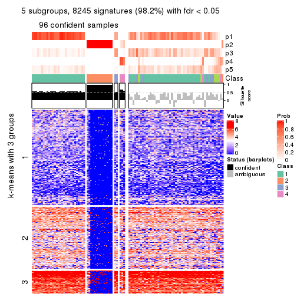</p>

</div>
<div id='tab-ATC-skmeans-get-signatures-no-scale-5'>
<pre><code class="r">get_signatures(res, k = 6, scale_rows = FALSE)
</code></pre>

<p></p>

</div>
</div>


Compare the overlap of signatures from different k:

```r
compare_signatures(res)
```


`get_signature()` returns a data frame invisibly. TO get the list of signatures, the function
call should be assigned to a variable explicitly. In following code, if `plot` argument is set
to `FALSE`, no heatmap is plotted while only the differential analysis is performed.

```r
# code only for demonstration
tb = get_signature(res, k = ..., plot = FALSE)
```

An example of the output of `tb` is:

```
#>   which_row         fdr    mean_1    mean_2 scaled_mean_1 scaled_mean_2 km
#> 1        38 0.042760348  8.373488  9.131774    -0.5533452     0.5164555  1
#> 2        40 0.018707592  7.106213  8.469186    -0.6173731     0.5762149  1
#> 3        55 0.019134737 10.221463 11.207825    -0.6159697     0.5749050  1
#> 4        59 0.006059896  5.921854  7.869574    -0.6899429     0.6439467  1
#> 5        60 0.018055526  8.928898 10.211722    -0.6204761     0.5791110  1
#> 6        98 0.009384629 15.714769 14.887706     0.6635654    -0.6193277  2
...
```

The columns in `tb` are:

1. `which_row`: row indices corresponding to the input matrix.
2. `fdr`: FDR for the differential test. 
3. `mean_x`: The mean value in group x.
4. `scaled_mean_x`: The mean value in group x after rows are scaled.
5. `km`: Row groups if k-means clustering is applied to rows.


UMAP plot which shows how samples are separated.


<script>
$( function() {
	$( '#tabs-ATC-skmeans-dimension-reduction' ).tabs();
} );
</script>
<div id='tabs-ATC-skmeans-dimension-reduction'>
<ul>
<li><a href='#tab-ATC-skmeans-dimension-reduction-1'>k = 2</a></li>
<li><a href='#tab-ATC-skmeans-dimension-reduction-2'>k = 3</a></li>
<li><a href='#tab-ATC-skmeans-dimension-reduction-3'>k = 4</a></li>
<li><a href='#tab-ATC-skmeans-dimension-reduction-4'>k = 5</a></li>
<li><a href='#tab-ATC-skmeans-dimension-reduction-5'>k = 6</a></li>
</ul>
<div id='tab-ATC-skmeans-dimension-reduction-1'>
<pre><code class="r">dimension_reduction(res, k = 2, method = &quot;UMAP&quot;)
</code></pre>

<p></p>

</div>
<div id='tab-ATC-skmeans-dimension-reduction-2'>
<pre><code class="r">dimension_reduction(res, k = 3, method = &quot;UMAP&quot;)
</code></pre>

<p></p>

</div>
<div id='tab-ATC-skmeans-dimension-reduction-3'>
<pre><code class="r">dimension_reduction(res, k = 4, method = &quot;UMAP&quot;)
</code></pre>

<p></p>

</div>
<div id='tab-ATC-skmeans-dimension-reduction-4'>
<pre><code class="r">dimension_reduction(res, k = 5, method = &quot;UMAP&quot;)
</code></pre>

<p></p>

</div>
<div id='tab-ATC-skmeans-dimension-reduction-5'>
<pre><code class="r">dimension_reduction(res, k = 6, method = &quot;UMAP&quot;)
</code></pre>

<p></p>

</div>
</div>


Following heatmap shows how subgroups are split when increasing `k`:

```r
collect_classes(res)
```


If matrix rows can be associated to genes, consider to use `GO_Enrichment(res,
...)` to perform function enrichment for the signature genes.


 

---------------------------------------------------


### ATC:pam**


The object with results only for a single top-value method and a single partition method 
can be extracted as:

```r
res = res_list["ATC", "pam"]
# you can also extract it by
# res = res_list["ATC:pam"]
```

A summary of `res` and all the functions that can be applied to it:

```r
res
```

```
#> A 'ConsensusPartition' object with k = 2, 3, 4, 5, 6.
#>   On a matrix with 8394 rows and 194 columns.
#>   Top rows (839, 1678, 2518, 3358, 4197) are extracted by 'ATC' method.
#>   Subgroups are detected by 'pam' method.
#>   Performed in total 1250 partitions by row resampling.
#>   Best k for subgroups seems to be 2.
#> 
#> Following methods can be applied to this 'ConsensusPartition' object:
#>  [1] "cola_report"             "collect_classes"         "collect_plots"          
#>  [4] "collect_stats"           "colnames"                "compare_signatures"     
#>  [7] "consensus_heatmap"       "dimension_reduction"     "functional_enrichment"  
#> [10] "get_anno_col"            "get_anno"                "get_classes"            
#> [13] "get_consensus"           "get_matrix"              "get_membership"         
#> [16] "get_param"               "get_signatures"          "get_stats"              
#> [19] "is_best_k"               "is_stable_k"             "membership_heatmap"     
#> [22] "ncol"                    "nrow"                    "plot_ecdf"              
#> [25] "rownames"                "select_partition_number" "show"                   
#> [28] "suggest_best_k"          "test_to_known_factors"
```

`collect_plots()` function collects all the plots made from `res` for all `k` (number of partitions)
into one single page to provide an easy and fast comparison between different `k`.

```r
collect_plots(res)
```


The plots are:

- The first row: a plot of the ECDF (Empirical cumulative distribution
  function) curves of the consensus matrix for each `k` and the heatmap of
  predicted classes for each `k`.
- The second row: heatmaps of the consensus matrix for each `k`.
- The third row: heatmaps of the membership matrix for each `k`.
- The fouth row: heatmaps of the signatures for each `k`.

All the plots in panels can be made by individual functions and they are
plotted later in this section.

`select_partition_number()` produces several plots showing different
statistics for choosing "optimized" `k`. There are following statistics:

- ECDF curves of the consensus matrix for each `k`;
- 1-PAC. [The PAC
  score](https://en.wikipedia.org/wiki/Consensus_clustering#Over-interpretation_potential_of_consensus_clustering)
  measures the proportion of the ambiguous subgrouping.
- Mean silhouette score.
- Concordance. The mean probability of fiting the consensus class ids in all
  partitions.
- Area increased. Denote $A_k$ as the area under the ECDF curve for current
  `k`, the area increased is defined as $A_k - A_{k-1}$.
- Rand index. The percent of pairs of samples that are both in a same cluster
  or both are not in a same cluster in the partition of k and k-1.
- Jaccard index. The ratio of pairs of samples are both in a same cluster in
  the partition of k and k-1 and the pairs of samples are both in a same
  cluster in the partition k or k-1.

The detailed explanations of these statistics can be found in [the cola
vignette](http://bioconductor.org/packages/devel/bioc/vignettes/cola/inst/doc/cola.html#toc_13).

Generally speaking, lower PAC score, higher mean silhouette score or higher
concordance corresponds to better partition. Rand index and Jaccard index
measure how similar the current partition is compared to partition with `k-1`.
If they are too similar, we won't accept `k` is better than `k-1`.

```r
select_partition_number(res)
```


The numeric values for all these statistics can be obtained by `get_stats()`.

```r
get_stats(res)
```

```
#>   k 1-PAC mean_silhouette concordance area_increased  Rand Jaccard
#> 2 2 1.000           1.000       1.000         0.2187 0.782   0.782
#> 3 3 1.000           1.000       1.000         0.0820 0.982   0.977
#> 4 4 1.000           1.000       1.000         0.0749 0.982   0.977
#> 5 5 0.982           0.996       0.997         0.0688 0.982   0.977
#> 6 6 1.000           1.000       1.000         0.0636 0.983   0.976
```

`suggest_best_k()` suggests the best $k$ based on these statistics. The rules are as follows:

- All $k$ with Jaccard index larger than 0.95 are removed because the increase of
  the partition number does not provides enough extra information. If all $k$ are removed,
  the best $k$ is assigned by `NA`.
- For $k$ with 1-PAC larger than 0.9, the maximal $k$ is taken as the "best k". Other $k$ is called "optional k".
- If it does not fit the second rule. The $k$ with the highest vote of highest
  1-PAC, mean silhouette and concordance is taken as the "best k".

```r
suggest_best_k(res)
```

```
#> [1] 2
```


Following shows the table of the partitions (You need to click the **show/hide
code output** link to see it). The membership matrix (columns with name `p*`)
is inferred by
[`clue::cl_consensus()`](https://www.rdocumentation.org/link/cl_consensus?package=clue)
function with the `SE` method. Basically the value in the membership matrix
represents the probability to belong to a certain group. The finall class
label for an item is determined with the group with highest probability it
belongs to.

In `get_classes()` function, the entropy is calculated from the membership
matrix and the silhouette score is calculated from the consensus matrix.


<script>
$( function() {
	$( '#tabs-ATC-pam-get-classes' ).tabs();
} );
</script>
<div id='tabs-ATC-pam-get-classes'>
<ul>
<li><a href='#tab-ATC-pam-get-classes-1'>k = 2</a></li>
<li><a href='#tab-ATC-pam-get-classes-2'>k = 3</a></li>
<li><a href='#tab-ATC-pam-get-classes-3'>k = 4</a></li>
<li><a href='#tab-ATC-pam-get-classes-4'>k = 5</a></li>
<li><a href='#tab-ATC-pam-get-classes-5'>k = 6</a></li>
</ul>

<div id='tab-ATC-pam-get-classes-1'>
<p><a id='tab-ATC-pam-get-classes-1-a' style='color:#0366d6' href='#'>show/hide code output</a></p>
<pre><code class="r">cbind(get_classes(res, k = 2), get_membership(res, k = 2))
</code></pre>

<pre><code>#&gt;           class entropy silhouette p1 p2
#&gt; ERR467487     1       0          1  1  0
#&gt; ERR467498     1       0          1  1  0
#&gt; ERR658998     1       0          1  1  0
#&gt; ERR659094     1       0          1  1  0
#&gt; ERR658999     1       0          1  1  0
#&gt; ERR659095     1       0          1  1  0
#&gt; ERR659000     1       0          1  1  0
#&gt; ERR659096     1       0          1  1  0
#&gt; ERR659001     1       0          1  1  0
#&gt; ERR659097     1       0          1  1  0
#&gt; ERR659002     1       0          1  1  0
#&gt; ERR659098     1       0          1  1  0
#&gt; ERR659003     1       0          1  1  0
#&gt; ERR659099     1       0          1  1  0
#&gt; ERR659004     1       0          1  1  0
#&gt; ERR659100     1       0          1  1  0
#&gt; ERR659005     1       0          1  1  0
#&gt; ERR659101     1       0          1  1  0
#&gt; ERR659006     1       0          1  1  0
#&gt; ERR659102     1       0          1  1  0
#&gt; ERR659007     1       0          1  1  0
#&gt; ERR659103     1       0          1  1  0
#&gt; ERR659008     2       0          1  0  1
#&gt; ERR659104     2       0          1  0  1
#&gt; ERR659009     1       0          1  1  0
#&gt; ERR659105     1       0          1  1  0
#&gt; ERR659010     1       0          1  1  0
#&gt; ERR659106     1       0          1  1  0
#&gt; ERR659011     1       0          1  1  0
#&gt; ERR659107     1       0          1  1  0
#&gt; ERR659012     1       0          1  1  0
#&gt; ERR659108     1       0          1  1  0
#&gt; ERR659013     1       0          1  1  0
#&gt; ERR659109     1       0          1  1  0
#&gt; ERR659014     2       0          1  0  1
#&gt; ERR659110     2       0          1  0  1
#&gt; ERR659015     1       0          1  1  0
#&gt; ERR659111     1       0          1  1  0
#&gt; ERR659016     1       0          1  1  0
#&gt; ERR659112     1       0          1  1  0
#&gt; ERR659017     2       0          1  0  1
#&gt; ERR659113     2       0          1  0  1
#&gt; ERR659018     1       0          1  1  0
#&gt; ERR659114     1       0          1  1  0
#&gt; ERR659019     1       0          1  1  0
#&gt; ERR659115     1       0          1  1  0
#&gt; ERR659020     1       0          1  1  0
#&gt; ERR659116     1       0          1  1  0
#&gt; ERR659021     1       0          1  1  0
#&gt; ERR659117     1       0          1  1  0
#&gt; ERR659022     1       0          1  1  0
#&gt; ERR659118     1       0          1  1  0
#&gt; ERR659023     1       0          1  1  0
#&gt; ERR659119     1       0          1  1  0
#&gt; ERR659024     1       0          1  1  0
#&gt; ERR659120     1       0          1  1  0
#&gt; ERR659025     1       0          1  1  0
#&gt; ERR659121     1       0          1  1  0
#&gt; ERR659026     1       0          1  1  0
#&gt; ERR659122     1       0          1  1  0
#&gt; ERR659027     1       0          1  1  0
#&gt; ERR659123     1       0          1  1  0
#&gt; ERR659028     1       0          1  1  0
#&gt; ERR659124     1       0          1  1  0
#&gt; ERR659029     1       0          1  1  0
#&gt; ERR659125     1       0          1  1  0
#&gt; ERR659030     1       0          1  1  0
#&gt; ERR659126     1       0          1  1  0
#&gt; ERR659031     1       0          1  1  0
#&gt; ERR659127     1       0          1  1  0
#&gt; ERR659032     1       0          1  1  0
#&gt; ERR659128     1       0          1  1  0
#&gt; ERR659033     1       0          1  1  0
#&gt; ERR659129     1       0          1  1  0
#&gt; ERR659034     2       0          1  0  1
#&gt; ERR659130     2       0          1  0  1
#&gt; ERR659035     1       0          1  1  0
#&gt; ERR659131     1       0          1  1  0
#&gt; ERR659036     1       0          1  1  0
#&gt; ERR659132     1       0          1  1  0
#&gt; ERR659037     1       0          1  1  0
#&gt; ERR659133     1       0          1  1  0
#&gt; ERR659038     1       0          1  1  0
#&gt; ERR659134     1       0          1  1  0
#&gt; ERR659039     1       0          1  1  0
#&gt; ERR659135     1       0          1  1  0
#&gt; ERR659040     1       0          1  1  0
#&gt; ERR659136     1       0          1  1  0
#&gt; ERR659041     1       0          1  1  0
#&gt; ERR659137     1       0          1  1  0
#&gt; ERR659042     1       0          1  1  0
#&gt; ERR659138     1       0          1  1  0
#&gt; ERR659043     1       0          1  1  0
#&gt; ERR659139     1       0          1  1  0
#&gt; ERR659044     2       0          1  0  1
#&gt; ERR659140     2       0          1  0  1
#&gt; ERR659045     1       0          1  1  0
#&gt; ERR659141     1       0          1  1  0
#&gt; ERR659046     1       0          1  1  0
#&gt; ERR659142     1       0          1  1  0
#&gt; ERR659047     1       0          1  1  0
#&gt; ERR659143     1       0          1  1  0
#&gt; ERR659048     1       0          1  1  0
#&gt; ERR659144     1       0          1  1  0
#&gt; ERR659049     1       0          1  1  0
#&gt; ERR659145     1       0          1  1  0
#&gt; ERR659050     1       0          1  1  0
#&gt; ERR659146     1       0          1  1  0
#&gt; ERR659051     1       0          1  1  0
#&gt; ERR659147     1       0          1  1  0
#&gt; ERR659052     1       0          1  1  0
#&gt; ERR659148     1       0          1  1  0
#&gt; ERR659053     1       0          1  1  0
#&gt; ERR659149     1       0          1  1  0
#&gt; ERR659054     2       0          1  0  1
#&gt; ERR659150     2       0          1  0  1
#&gt; ERR659055     1       0          1  1  0
#&gt; ERR659151     1       0          1  1  0
#&gt; ERR659056     1       0          1  1  0
#&gt; ERR659152     1       0          1  1  0
#&gt; ERR659057     1       0          1  1  0
#&gt; ERR659153     1       0          1  1  0
#&gt; ERR659058     1       0          1  1  0
#&gt; ERR659154     1       0          1  1  0
#&gt; ERR659059     1       0          1  1  0
#&gt; ERR659155     1       0          1  1  0
#&gt; ERR659060     1       0          1  1  0
#&gt; ERR659156     1       0          1  1  0
#&gt; ERR659061     1       0          1  1  0
#&gt; ERR659157     1       0          1  1  0
#&gt; ERR659062     1       0          1  1  0
#&gt; ERR659158     1       0          1  1  0
#&gt; ERR659063     1       0          1  1  0
#&gt; ERR659159     1       0          1  1  0
#&gt; ERR659064     1       0          1  1  0
#&gt; ERR659160     1       0          1  1  0
#&gt; ERR659065     2       0          1  0  1
#&gt; ERR659161     2       0          1  0  1
#&gt; ERR659066     1       0          1  1  0
#&gt; ERR659162     1       0          1  1  0
#&gt; ERR659067     1       0          1  1  0
#&gt; ERR659163     1       0          1  1  0
#&gt; ERR659068     2       0          1  0  1
#&gt; ERR659164     2       0          1  0  1
#&gt; ERR659069     1       0          1  1  0
#&gt; ERR659165     1       0          1  1  0
#&gt; ERR659070     1       0          1  1  0
#&gt; ERR659166     1       0          1  1  0
#&gt; ERR659071     1       0          1  1  0
#&gt; ERR659167     1       0          1  1  0
#&gt; ERR659072     1       0          1  1  0
#&gt; ERR659168     1       0          1  1  0
#&gt; ERR659073     1       0          1  1  0
#&gt; ERR659169     1       0          1  1  0
#&gt; ERR659074     2       0          1  0  1
#&gt; ERR659170     2       0          1  0  1
#&gt; ERR659075     1       0          1  1  0
#&gt; ERR659171     1       0          1  1  0
#&gt; ERR659076     2       0          1  0  1
#&gt; ERR659172     2       0          1  0  1
#&gt; ERR659077     1       0          1  1  0
#&gt; ERR659173     1       0          1  1  0
#&gt; ERR659078     1       0          1  1  0
#&gt; ERR659174     1       0          1  1  0
#&gt; ERR659079     1       0          1  1  0
#&gt; ERR659175     1       0          1  1  0
#&gt; ERR659080     1       0          1  1  0
#&gt; ERR659176     1       0          1  1  0
#&gt; ERR659081     1       0          1  1  0
#&gt; ERR659177     1       0          1  1  0
#&gt; ERR659082     1       0          1  1  0
#&gt; ERR659178     1       0          1  1  0
#&gt; ERR659083     2       0          1  0  1
#&gt; ERR659179     2       0          1  0  1
#&gt; ERR659084     2       0          1  0  1
#&gt; ERR659180     2       0          1  0  1
#&gt; ERR659085     1       0          1  1  0
#&gt; ERR659181     1       0          1  1  0
#&gt; ERR659086     1       0          1  1  0
#&gt; ERR659182     1       0          1  1  0
#&gt; ERR659087     1       0          1  1  0
#&gt; ERR659183     1       0          1  1  0
#&gt; ERR659088     1       0          1  1  0
#&gt; ERR659184     1       0          1  1  0
#&gt; ERR659089     1       0          1  1  0
#&gt; ERR659185     1       0          1  1  0
#&gt; ERR659090     1       0          1  1  0
#&gt; ERR659186     1       0          1  1  0
#&gt; ERR659091     1       0          1  1  0
#&gt; ERR659187     1       0          1  1  0
#&gt; ERR659092     1       0          1  1  0
#&gt; ERR659188     1       0          1  1  0
#&gt; ERR659093     1       0          1  1  0
#&gt; ERR659189     1       0          1  1  0
</code></pre>

<script>
$('#tab-ATC-pam-get-classes-1-a').parent().next().next().hide();
$('#tab-ATC-pam-get-classes-1-a').click(function(){
  $('#tab-ATC-pam-get-classes-1-a').parent().next().next().toggle();
  return(false);
});
</script>
</div>

<div id='tab-ATC-pam-get-classes-2'>
<p><a id='tab-ATC-pam-get-classes-2-a' style='color:#0366d6' href='#'>show/hide code output</a></p>
<pre><code class="r">cbind(get_classes(res, k = 3), get_membership(res, k = 3))
</code></pre>

<pre><code>#&gt;           class entropy silhouette p1 p2 p3
#&gt; ERR467487     1       0          1  1  0  0
#&gt; ERR467498     1       0          1  1  0  0
#&gt; ERR658998     1       0          1  1  0  0
#&gt; ERR659094     1       0          1  1  0  0
#&gt; ERR658999     1       0          1  1  0  0
#&gt; ERR659095     1       0          1  1  0  0
#&gt; ERR659000     1       0          1  1  0  0
#&gt; ERR659096     1       0          1  1  0  0
#&gt; ERR659001     1       0          1  1  0  0
#&gt; ERR659097     1       0          1  1  0  0
#&gt; ERR659002     1       0          1  1  0  0
#&gt; ERR659098     1       0          1  1  0  0
#&gt; ERR659003     1       0          1  1  0  0
#&gt; ERR659099     1       0          1  1  0  0
#&gt; ERR659004     1       0          1  1  0  0
#&gt; ERR659100     1       0          1  1  0  0
#&gt; ERR659005     1       0          1  1  0  0
#&gt; ERR659101     1       0          1  1  0  0
#&gt; ERR659006     1       0          1  1  0  0
#&gt; ERR659102     1       0          1  1  0  0
#&gt; ERR659007     1       0          1  1  0  0
#&gt; ERR659103     1       0          1  1  0  0
#&gt; ERR659008     2       0          1  0  1  0
#&gt; ERR659104     2       0          1  0  1  0
#&gt; ERR659009     1       0          1  1  0  0
#&gt; ERR659105     1       0          1  1  0  0
#&gt; ERR659010     1       0          1  1  0  0
#&gt; ERR659106     1       0          1  1  0  0
#&gt; ERR659011     1       0          1  1  0  0
#&gt; ERR659107     1       0          1  1  0  0
#&gt; ERR659012     1       0          1  1  0  0
#&gt; ERR659108     1       0          1  1  0  0
#&gt; ERR659013     1       0          1  1  0  0
#&gt; ERR659109     1       0          1  1  0  0
#&gt; ERR659014     2       0          1  0  1  0
#&gt; ERR659110     2       0          1  0  1  0
#&gt; ERR659015     1       0          1  1  0  0
#&gt; ERR659111     1       0          1  1  0  0
#&gt; ERR659016     1       0          1  1  0  0
#&gt; ERR659112     1       0          1  1  0  0
#&gt; ERR659017     2       0          1  0  1  0
#&gt; ERR659113     2       0          1  0  1  0
#&gt; ERR659018     1       0          1  1  0  0
#&gt; ERR659114     1       0          1  1  0  0
#&gt; ERR659019     1       0          1  1  0  0
#&gt; ERR659115     1       0          1  1  0  0
#&gt; ERR659020     1       0          1  1  0  0
#&gt; ERR659116     1       0          1  1  0  0
#&gt; ERR659021     1       0          1  1  0  0
#&gt; ERR659117     1       0          1  1  0  0
#&gt; ERR659022     1       0          1  1  0  0
#&gt; ERR659118     1       0          1  1  0  0
#&gt; ERR659023     1       0          1  1  0  0
#&gt; ERR659119     1       0          1  1  0  0
#&gt; ERR659024     1       0          1  1  0  0
#&gt; ERR659120     1       0          1  1  0  0
#&gt; ERR659025     1       0          1  1  0  0
#&gt; ERR659121     1       0          1  1  0  0
#&gt; ERR659026     1       0          1  1  0  0
#&gt; ERR659122     1       0          1  1  0  0
#&gt; ERR659027     1       0          1  1  0  0
#&gt; ERR659123     1       0          1  1  0  0
#&gt; ERR659028     1       0          1  1  0  0
#&gt; ERR659124     1       0          1  1  0  0
#&gt; ERR659029     1       0          1  1  0  0
#&gt; ERR659125     1       0          1  1  0  0
#&gt; ERR659030     1       0          1  1  0  0
#&gt; ERR659126     1       0          1  1  0  0
#&gt; ERR659031     1       0          1  1  0  0
#&gt; ERR659127     1       0          1  1  0  0
#&gt; ERR659032     1       0          1  1  0  0
#&gt; ERR659128     1       0          1  1  0  0
#&gt; ERR659033     1       0          1  1  0  0
#&gt; ERR659129     1       0          1  1  0  0
#&gt; ERR659034     2       0          1  0  1  0
#&gt; ERR659130     2       0          1  0  1  0
#&gt; ERR659035     1       0          1  1  0  0
#&gt; ERR659131     1       0          1  1  0  0
#&gt; ERR659036     1       0          1  1  0  0
#&gt; ERR659132     1       0          1  1  0  0
#&gt; ERR659037     1       0          1  1  0  0
#&gt; ERR659133     1       0          1  1  0  0
#&gt; ERR659038     1       0          1  1  0  0
#&gt; ERR659134     1       0          1  1  0  0
#&gt; ERR659039     1       0          1  1  0  0
#&gt; ERR659135     1       0          1  1  0  0
#&gt; ERR659040     1       0          1  1  0  0
#&gt; ERR659136     1       0          1  1  0  0
#&gt; ERR659041     1       0          1  1  0  0
#&gt; ERR659137     1       0          1  1  0  0
#&gt; ERR659042     1       0          1  1  0  0
#&gt; ERR659138     1       0          1  1  0  0
#&gt; ERR659043     1       0          1  1  0  0
#&gt; ERR659139     1       0          1  1  0  0
#&gt; ERR659044     2       0          1  0  1  0
#&gt; ERR659140     2       0          1  0  1  0
#&gt; ERR659045     1       0          1  1  0  0
#&gt; ERR659141     1       0          1  1  0  0
#&gt; ERR659046     1       0          1  1  0  0
#&gt; ERR659142     1       0          1  1  0  0
#&gt; ERR659047     1       0          1  1  0  0
#&gt; ERR659143     1       0          1  1  0  0
#&gt; ERR659048     1       0          1  1  0  0
#&gt; ERR659144     1       0          1  1  0  0
#&gt; ERR659049     1       0          1  1  0  0
#&gt; ERR659145     1       0          1  1  0  0
#&gt; ERR659050     1       0          1  1  0  0
#&gt; ERR659146     1       0          1  1  0  0
#&gt; ERR659051     1       0          1  1  0  0
#&gt; ERR659147     1       0          1  1  0  0
#&gt; ERR659052     1       0          1  1  0  0
#&gt; ERR659148     1       0          1  1  0  0
#&gt; ERR659053     1       0          1  1  0  0
#&gt; ERR659149     1       0          1  1  0  0
#&gt; ERR659054     2       0          1  0  1  0
#&gt; ERR659150     2       0          1  0  1  0
#&gt; ERR659055     1       0          1  1  0  0
#&gt; ERR659151     1       0          1  1  0  0
#&gt; ERR659056     1       0          1  1  0  0
#&gt; ERR659152     1       0          1  1  0  0
#&gt; ERR659057     1       0          1  1  0  0
#&gt; ERR659153     1       0          1  1  0  0
#&gt; ERR659058     1       0          1  1  0  0
#&gt; ERR659154     1       0          1  1  0  0
#&gt; ERR659059     1       0          1  1  0  0
#&gt; ERR659155     1       0          1  1  0  0
#&gt; ERR659060     1       0          1  1  0  0
#&gt; ERR659156     1       0          1  1  0  0
#&gt; ERR659061     1       0          1  1  0  0
#&gt; ERR659157     1       0          1  1  0  0
#&gt; ERR659062     1       0          1  1  0  0
#&gt; ERR659158     1       0          1  1  0  0
#&gt; ERR659063     1       0          1  1  0  0
#&gt; ERR659159     1       0          1  1  0  0
#&gt; ERR659064     1       0          1  1  0  0
#&gt; ERR659160     1       0          1  1  0  0
#&gt; ERR659065     2       0          1  0  1  0
#&gt; ERR659161     2       0          1  0  1  0
#&gt; ERR659066     1       0          1  1  0  0
#&gt; ERR659162     1       0          1  1  0  0
#&gt; ERR659067     1       0          1  1  0  0
#&gt; ERR659163     1       0          1  1  0  0
#&gt; ERR659068     2       0          1  0  1  0
#&gt; ERR659164     2       0          1  0  1  0
#&gt; ERR659069     1       0          1  1  0  0
#&gt; ERR659165     1       0          1  1  0  0
#&gt; ERR659070     1       0          1  1  0  0
#&gt; ERR659166     1       0          1  1  0  0
#&gt; ERR659071     1       0          1  1  0  0
#&gt; ERR659167     1       0          1  1  0  0
#&gt; ERR659072     1       0          1  1  0  0
#&gt; ERR659168     1       0          1  1  0  0
#&gt; ERR659073     1       0          1  1  0  0
#&gt; ERR659169     1       0          1  1  0  0
#&gt; ERR659074     2       0          1  0  1  0
#&gt; ERR659170     2       0          1  0  1  0
#&gt; ERR659075     3       0          1  0  0  1
#&gt; ERR659171     3       0          1  0  0  1
#&gt; ERR659076     2       0          1  0  1  0
#&gt; ERR659172     2       0          1  0  1  0
#&gt; ERR659077     1       0          1  1  0  0
#&gt; ERR659173     1       0          1  1  0  0
#&gt; ERR659078     1       0          1  1  0  0
#&gt; ERR659174     1       0          1  1  0  0
#&gt; ERR659079     1       0          1  1  0  0
#&gt; ERR659175     1       0          1  1  0  0
#&gt; ERR659080     1       0          1  1  0  0
#&gt; ERR659176     1       0          1  1  0  0
#&gt; ERR659081     1       0          1  1  0  0
#&gt; ERR659177     1       0          1  1  0  0
#&gt; ERR659082     1       0          1  1  0  0
#&gt; ERR659178     1       0          1  1  0  0
#&gt; ERR659083     2       0          1  0  1  0
#&gt; ERR659179     2       0          1  0  1  0
#&gt; ERR659084     2       0          1  0  1  0
#&gt; ERR659180     2       0          1  0  1  0
#&gt; ERR659085     1       0          1  1  0  0
#&gt; ERR659181     1       0          1  1  0  0
#&gt; ERR659086     1       0          1  1  0  0
#&gt; ERR659182     1       0          1  1  0  0
#&gt; ERR659087     1       0          1  1  0  0
#&gt; ERR659183     1       0          1  1  0  0
#&gt; ERR659088     1       0          1  1  0  0
#&gt; ERR659184     1       0          1  1  0  0
#&gt; ERR659089     1       0          1  1  0  0
#&gt; ERR659185     1       0          1  1  0  0
#&gt; ERR659090     1       0          1  1  0  0
#&gt; ERR659186     1       0          1  1  0  0
#&gt; ERR659091     1       0          1  1  0  0
#&gt; ERR659187     1       0          1  1  0  0
#&gt; ERR659092     1       0          1  1  0  0
#&gt; ERR659188     1       0          1  1  0  0
#&gt; ERR659093     1       0          1  1  0  0
#&gt; ERR659189     1       0          1  1  0  0
</code></pre>

<script>
$('#tab-ATC-pam-get-classes-2-a').parent().next().next().hide();
$('#tab-ATC-pam-get-classes-2-a').click(function(){
  $('#tab-ATC-pam-get-classes-2-a').parent().next().next().toggle();
  return(false);
});
</script>
</div>

<div id='tab-ATC-pam-get-classes-3'>
<p><a id='tab-ATC-pam-get-classes-3-a' style='color:#0366d6' href='#'>show/hide code output</a></p>
<pre><code class="r">cbind(get_classes(res, k = 4), get_membership(res, k = 4))
</code></pre>

<pre><code>#&gt;           class entropy silhouette p1 p2 p3 p4
#&gt; ERR467487     4       0          1  0  0  0  1
#&gt; ERR467498     4       0          1  0  0  0  1
#&gt; ERR658998     1       0          1  1  0  0  0
#&gt; ERR659094     1       0          1  1  0  0  0
#&gt; ERR658999     1       0          1  1  0  0  0
#&gt; ERR659095     1       0          1  1  0  0  0
#&gt; ERR659000     1       0          1  1  0  0  0
#&gt; ERR659096     1       0          1  1  0  0  0
#&gt; ERR659001     1       0          1  1  0  0  0
#&gt; ERR659097     1       0          1  1  0  0  0
#&gt; ERR659002     1       0          1  1  0  0  0
#&gt; ERR659098     1       0          1  1  0  0  0
#&gt; ERR659003     1       0          1  1  0  0  0
#&gt; ERR659099     1       0          1  1  0  0  0
#&gt; ERR659004     1       0          1  1  0  0  0
#&gt; ERR659100     1       0          1  1  0  0  0
#&gt; ERR659005     1       0          1  1  0  0  0
#&gt; ERR659101     1       0          1  1  0  0  0
#&gt; ERR659006     1       0          1  1  0  0  0
#&gt; ERR659102     1       0          1  1  0  0  0
#&gt; ERR659007     1       0          1  1  0  0  0
#&gt; ERR659103     1       0          1  1  0  0  0
#&gt; ERR659008     2       0          1  0  1  0  0
#&gt; ERR659104     2       0          1  0  1  0  0
#&gt; ERR659009     1       0          1  1  0  0  0
#&gt; ERR659105     1       0          1  1  0  0  0
#&gt; ERR659010     1       0          1  1  0  0  0
#&gt; ERR659106     1       0          1  1  0  0  0
#&gt; ERR659011     1       0          1  1  0  0  0
#&gt; ERR659107     1       0          1  1  0  0  0
#&gt; ERR659012     1       0          1  1  0  0  0
#&gt; ERR659108     1       0          1  1  0  0  0
#&gt; ERR659013     1       0          1  1  0  0  0
#&gt; ERR659109     1       0          1  1  0  0  0
#&gt; ERR659014     2       0          1  0  1  0  0
#&gt; ERR659110     2       0          1  0  1  0  0
#&gt; ERR659015     1       0          1  1  0  0  0
#&gt; ERR659111     1       0          1  1  0  0  0
#&gt; ERR659016     1       0          1  1  0  0  0
#&gt; ERR659112     1       0          1  1  0  0  0
#&gt; ERR659017     2       0          1  0  1  0  0
#&gt; ERR659113     2       0          1  0  1  0  0
#&gt; ERR659018     1       0          1  1  0  0  0
#&gt; ERR659114     1       0          1  1  0  0  0
#&gt; ERR659019     1       0          1  1  0  0  0
#&gt; ERR659115     1       0          1  1  0  0  0
#&gt; ERR659020     1       0          1  1  0  0  0
#&gt; ERR659116     1       0          1  1  0  0  0
#&gt; ERR659021     1       0          1  1  0  0  0
#&gt; ERR659117     1       0          1  1  0  0  0
#&gt; ERR659022     1       0          1  1  0  0  0
#&gt; ERR659118     1       0          1  1  0  0  0
#&gt; ERR659023     1       0          1  1  0  0  0
#&gt; ERR659119     1       0          1  1  0  0  0
#&gt; ERR659024     1       0          1  1  0  0  0
#&gt; ERR659120     1       0          1  1  0  0  0
#&gt; ERR659025     1       0          1  1  0  0  0
#&gt; ERR659121     1       0          1  1  0  0  0
#&gt; ERR659026     1       0          1  1  0  0  0
#&gt; ERR659122     1       0          1  1  0  0  0
#&gt; ERR659027     1       0          1  1  0  0  0
#&gt; ERR659123     1       0          1  1  0  0  0
#&gt; ERR659028     1       0          1  1  0  0  0
#&gt; ERR659124     1       0          1  1  0  0  0
#&gt; ERR659029     1       0          1  1  0  0  0
#&gt; ERR659125     1       0          1  1  0  0  0
#&gt; ERR659030     1       0          1  1  0  0  0
#&gt; ERR659126     1       0          1  1  0  0  0
#&gt; ERR659031     1       0          1  1  0  0  0
#&gt; ERR659127     1       0          1  1  0  0  0
#&gt; ERR659032     1       0          1  1  0  0  0
#&gt; ERR659128     1       0          1  1  0  0  0
#&gt; ERR659033     1       0          1  1  0  0  0
#&gt; ERR659129     1       0          1  1  0  0  0
#&gt; ERR659034     2       0          1  0  1  0  0
#&gt; ERR659130     2       0          1  0  1  0  0
#&gt; ERR659035     1       0          1  1  0  0  0
#&gt; ERR659131     1       0          1  1  0  0  0
#&gt; ERR659036     1       0          1  1  0  0  0
#&gt; ERR659132     1       0          1  1  0  0  0
#&gt; ERR659037     1       0          1  1  0  0  0
#&gt; ERR659133     1       0          1  1  0  0  0
#&gt; ERR659038     1       0          1  1  0  0  0
#&gt; ERR659134     1       0          1  1  0  0  0
#&gt; ERR659039     1       0          1  1  0  0  0
#&gt; ERR659135     1       0          1  1  0  0  0
#&gt; ERR659040     1       0          1  1  0  0  0
#&gt; ERR659136     1       0          1  1  0  0  0
#&gt; ERR659041     1       0          1  1  0  0  0
#&gt; ERR659137     1       0          1  1  0  0  0
#&gt; ERR659042     1       0          1  1  0  0  0
#&gt; ERR659138     1       0          1  1  0  0  0
#&gt; ERR659043     1       0          1  1  0  0  0
#&gt; ERR659139     1       0          1  1  0  0  0
#&gt; ERR659044     2       0          1  0  1  0  0
#&gt; ERR659140     2       0          1  0  1  0  0
#&gt; ERR659045     1       0          1  1  0  0  0
#&gt; ERR659141     1       0          1  1  0  0  0
#&gt; ERR659046     1       0          1  1  0  0  0
#&gt; ERR659142     1       0          1  1  0  0  0
#&gt; ERR659047     1       0          1  1  0  0  0
#&gt; ERR659143     1       0          1  1  0  0  0
#&gt; ERR659048     1       0          1  1  0  0  0
#&gt; ERR659144     1       0          1  1  0  0  0
#&gt; ERR659049     1       0          1  1  0  0  0
#&gt; ERR659145     1       0          1  1  0  0  0
#&gt; ERR659050     1       0          1  1  0  0  0
#&gt; ERR659146     1       0          1  1  0  0  0
#&gt; ERR659051     1       0          1  1  0  0  0
#&gt; ERR659147     1       0          1  1  0  0  0
#&gt; ERR659052     1       0          1  1  0  0  0
#&gt; ERR659148     1       0          1  1  0  0  0
#&gt; ERR659053     1       0          1  1  0  0  0
#&gt; ERR659149     1       0          1  1  0  0  0
#&gt; ERR659054     2       0          1  0  1  0  0
#&gt; ERR659150     2       0          1  0  1  0  0
#&gt; ERR659055     1       0          1  1  0  0  0
#&gt; ERR659151     1       0          1  1  0  0  0
#&gt; ERR659056     1       0          1  1  0  0  0
#&gt; ERR659152     1       0          1  1  0  0  0
#&gt; ERR659057     1       0          1  1  0  0  0
#&gt; ERR659153     1       0          1  1  0  0  0
#&gt; ERR659058     1       0          1  1  0  0  0
#&gt; ERR659154     1       0          1  1  0  0  0
#&gt; ERR659059     1       0          1  1  0  0  0
#&gt; ERR659155     1       0          1  1  0  0  0
#&gt; ERR659060     1       0          1  1  0  0  0
#&gt; ERR659156     1       0          1  1  0  0  0
#&gt; ERR659061     1       0          1  1  0  0  0
#&gt; ERR659157     1       0          1  1  0  0  0
#&gt; ERR659062     1       0          1  1  0  0  0
#&gt; ERR659158     1       0          1  1  0  0  0
#&gt; ERR659063     1       0          1  1  0  0  0
#&gt; ERR659159     1       0          1  1  0  0  0
#&gt; ERR659064     1       0          1  1  0  0  0
#&gt; ERR659160     1       0          1  1  0  0  0
#&gt; ERR659065     2       0          1  0  1  0  0
#&gt; ERR659161     2       0          1  0  1  0  0
#&gt; ERR659066     1       0          1  1  0  0  0
#&gt; ERR659162     1       0          1  1  0  0  0
#&gt; ERR659067     1       0          1  1  0  0  0
#&gt; ERR659163     1       0          1  1  0  0  0
#&gt; ERR659068     2       0          1  0  1  0  0
#&gt; ERR659164     2       0          1  0  1  0  0
#&gt; ERR659069     1       0          1  1  0  0  0
#&gt; ERR659165     1       0          1  1  0  0  0
#&gt; ERR659070     1       0          1  1  0  0  0
#&gt; ERR659166     1       0          1  1  0  0  0
#&gt; ERR659071     1       0          1  1  0  0  0
#&gt; ERR659167     1       0          1  1  0  0  0
#&gt; ERR659072     1       0          1  1  0  0  0
#&gt; ERR659168     1       0          1  1  0  0  0
#&gt; ERR659073     1       0          1  1  0  0  0
#&gt; ERR659169     1       0          1  1  0  0  0
#&gt; ERR659074     2       0          1  0  1  0  0
#&gt; ERR659170     2       0          1  0  1  0  0
#&gt; ERR659075     3       0          1  0  0  1  0
#&gt; ERR659171     3       0          1  0  0  1  0
#&gt; ERR659076     2       0          1  0  1  0  0
#&gt; ERR659172     2       0          1  0  1  0  0
#&gt; ERR659077     1       0          1  1  0  0  0
#&gt; ERR659173     1       0          1  1  0  0  0
#&gt; ERR659078     1       0          1  1  0  0  0
#&gt; ERR659174     1       0          1  1  0  0  0
#&gt; ERR659079     1       0          1  1  0  0  0
#&gt; ERR659175     1       0          1  1  0  0  0
#&gt; ERR659080     1       0          1  1  0  0  0
#&gt; ERR659176     1       0          1  1  0  0  0
#&gt; ERR659081     1       0          1  1  0  0  0
#&gt; ERR659177     1       0          1  1  0  0  0
#&gt; ERR659082     1       0          1  1  0  0  0
#&gt; ERR659178     1       0          1  1  0  0  0
#&gt; ERR659083     2       0          1  0  1  0  0
#&gt; ERR659179     2       0          1  0  1  0  0
#&gt; ERR659084     2       0          1  0  1  0  0
#&gt; ERR659180     2       0          1  0  1  0  0
#&gt; ERR659085     1       0          1  1  0  0  0
#&gt; ERR659181     1       0          1  1  0  0  0
#&gt; ERR659086     1       0          1  1  0  0  0
#&gt; ERR659182     1       0          1  1  0  0  0
#&gt; ERR659087     1       0          1  1  0  0  0
#&gt; ERR659183     1       0          1  1  0  0  0
#&gt; ERR659088     1       0          1  1  0  0  0
#&gt; ERR659184     1       0          1  1  0  0  0
#&gt; ERR659089     1       0          1  1  0  0  0
#&gt; ERR659185     1       0          1  1  0  0  0
#&gt; ERR659090     1       0          1  1  0  0  0
#&gt; ERR659186     1       0          1  1  0  0  0
#&gt; ERR659091     1       0          1  1  0  0  0
#&gt; ERR659187     1       0          1  1  0  0  0
#&gt; ERR659092     1       0          1  1  0  0  0
#&gt; ERR659188     1       0          1  1  0  0  0
#&gt; ERR659093     1       0          1  1  0  0  0
#&gt; ERR659189     1       0          1  1  0  0  0
</code></pre>

<script>
$('#tab-ATC-pam-get-classes-3-a').parent().next().next().hide();
$('#tab-ATC-pam-get-classes-3-a').click(function(){
  $('#tab-ATC-pam-get-classes-3-a').parent().next().next().toggle();
  return(false);
});
</script>
</div>

<div id='tab-ATC-pam-get-classes-4'>
<p><a id='tab-ATC-pam-get-classes-4-a' style='color:#0366d6' href='#'>show/hide code output</a></p>
<pre><code class="r">cbind(get_classes(res, k = 5), get_membership(res, k = 5))
</code></pre>

<pre><code>#&gt;           class entropy silhouette    p1 p2 p3    p4 p5
#&gt; ERR467487     3   0.000      1.000 0.000  0  1 0.000  0
#&gt; ERR467498     3   0.000      1.000 0.000  0  1 0.000  0
#&gt; ERR658998     1   0.000      0.998 1.000  0  0 0.000  0
#&gt; ERR659094     1   0.000      0.998 1.000  0  0 0.000  0
#&gt; ERR658999     1   0.000      0.998 1.000  0  0 0.000  0
#&gt; ERR659095     1   0.000      0.998 1.000  0  0 0.000  0
#&gt; ERR659000     1   0.000      0.998 1.000  0  0 0.000  0
#&gt; ERR659096     1   0.000      0.998 1.000  0  0 0.000  0
#&gt; ERR659001     1   0.000      0.998 1.000  0  0 0.000  0
#&gt; ERR659097     1   0.000      0.998 1.000  0  0 0.000  0
#&gt; ERR659002     1   0.000      0.998 1.000  0  0 0.000  0
#&gt; ERR659098     1   0.000      0.998 1.000  0  0 0.000  0
#&gt; ERR659003     1   0.000      0.998 1.000  0  0 0.000  0
#&gt; ERR659099     1   0.000      0.998 1.000  0  0 0.000  0
#&gt; ERR659004     1   0.000      0.998 1.000  0  0 0.000  0
#&gt; ERR659100     1   0.000      0.998 1.000  0  0 0.000  0
#&gt; ERR659005     1   0.000      0.998 1.000  0  0 0.000  0
#&gt; ERR659101     1   0.000      0.998 1.000  0  0 0.000  0
#&gt; ERR659006     1   0.000      0.998 1.000  0  0 0.000  0
#&gt; ERR659102     1   0.000      0.998 1.000  0  0 0.000  0
#&gt; ERR659007     1   0.000      0.998 1.000  0  0 0.000  0
#&gt; ERR659103     1   0.000      0.998 1.000  0  0 0.000  0
#&gt; ERR659008     2   0.000      1.000 0.000  1  0 0.000  0
#&gt; ERR659104     2   0.000      1.000 0.000  1  0 0.000  0
#&gt; ERR659009     1   0.000      0.998 1.000  0  0 0.000  0
#&gt; ERR659105     1   0.000      0.998 1.000  0  0 0.000  0
#&gt; ERR659010     1   0.000      0.998 1.000  0  0 0.000  0
#&gt; ERR659106     1   0.000      0.998 1.000  0  0 0.000  0
#&gt; ERR659011     1   0.000      0.998 1.000  0  0 0.000  0
#&gt; ERR659107     1   0.000      0.998 1.000  0  0 0.000  0
#&gt; ERR659012     1   0.000      0.998 1.000  0  0 0.000  0
#&gt; ERR659108     1   0.000      0.998 1.000  0  0 0.000  0
#&gt; ERR659013     1   0.000      0.998 1.000  0  0 0.000  0
#&gt; ERR659109     1   0.000      0.998 1.000  0  0 0.000  0
#&gt; ERR659014     2   0.000      1.000 0.000  1  0 0.000  0
#&gt; ERR659110     2   0.000      1.000 0.000  1  0 0.000  0
#&gt; ERR659015     1   0.000      0.998 1.000  0  0 0.000  0
#&gt; ERR659111     1   0.000      0.998 1.000  0  0 0.000  0
#&gt; ERR659016     1   0.000      0.998 1.000  0  0 0.000  0
#&gt; ERR659112     1   0.000      0.998 1.000  0  0 0.000  0
#&gt; ERR659017     2   0.000      1.000 0.000  1  0 0.000  0
#&gt; ERR659113     2   0.000      1.000 0.000  1  0 0.000  0
#&gt; ERR659018     1   0.000      0.998 1.000  0  0 0.000  0
#&gt; ERR659114     1   0.000      0.998 1.000  0  0 0.000  0
#&gt; ERR659019     1   0.000      0.998 1.000  0  0 0.000  0
#&gt; ERR659115     1   0.000      0.998 1.000  0  0 0.000  0
#&gt; ERR659020     1   0.000      0.998 1.000  0  0 0.000  0
#&gt; ERR659116     1   0.000      0.998 1.000  0  0 0.000  0
#&gt; ERR659021     1   0.000      0.998 1.000  0  0 0.000  0
#&gt; ERR659117     1   0.000      0.998 1.000  0  0 0.000  0
#&gt; ERR659022     1   0.000      0.998 1.000  0  0 0.000  0
#&gt; ERR659118     1   0.000      0.998 1.000  0  0 0.000  0
#&gt; ERR659023     1   0.000      0.998 1.000  0  0 0.000  0
#&gt; ERR659119     1   0.000      0.998 1.000  0  0 0.000  0
#&gt; ERR659024     1   0.000      0.998 1.000  0  0 0.000  0
#&gt; ERR659120     1   0.000      0.998 1.000  0  0 0.000  0
#&gt; ERR659025     1   0.000      0.998 1.000  0  0 0.000  0
#&gt; ERR659121     1   0.000      0.998 1.000  0  0 0.000  0
#&gt; ERR659026     1   0.000      0.998 1.000  0  0 0.000  0
#&gt; ERR659122     1   0.000      0.998 1.000  0  0 0.000  0
#&gt; ERR659027     1   0.000      0.998 1.000  0  0 0.000  0
#&gt; ERR659123     1   0.000      0.998 1.000  0  0 0.000  0
#&gt; ERR659028     1   0.000      0.998 1.000  0  0 0.000  0
#&gt; ERR659124     1   0.000      0.998 1.000  0  0 0.000  0
#&gt; ERR659029     1   0.000      0.998 1.000  0  0 0.000  0
#&gt; ERR659125     1   0.000      0.998 1.000  0  0 0.000  0
#&gt; ERR659030     1   0.000      0.998 1.000  0  0 0.000  0
#&gt; ERR659126     1   0.000      0.998 1.000  0  0 0.000  0
#&gt; ERR659031     1   0.000      0.998 1.000  0  0 0.000  0
#&gt; ERR659127     1   0.000      0.998 1.000  0  0 0.000  0
#&gt; ERR659032     1   0.000      0.998 1.000  0  0 0.000  0
#&gt; ERR659128     1   0.000      0.998 1.000  0  0 0.000  0
#&gt; ERR659033     1   0.000      0.998 1.000  0  0 0.000  0
#&gt; ERR659129     1   0.000      0.998 1.000  0  0 0.000  0
#&gt; ERR659034     2   0.000      1.000 0.000  1  0 0.000  0
#&gt; ERR659130     2   0.000      1.000 0.000  1  0 0.000  0
#&gt; ERR659035     1   0.000      0.998 1.000  0  0 0.000  0
#&gt; ERR659131     1   0.000      0.998 1.000  0  0 0.000  0
#&gt; ERR659036     1   0.000      0.998 1.000  0  0 0.000  0
#&gt; ERR659132     1   0.000      0.998 1.000  0  0 0.000  0
#&gt; ERR659037     1   0.000      0.998 1.000  0  0 0.000  0
#&gt; ERR659133     1   0.000      0.998 1.000  0  0 0.000  0
#&gt; ERR659038     1   0.000      0.998 1.000  0  0 0.000  0
#&gt; ERR659134     1   0.000      0.998 1.000  0  0 0.000  0
#&gt; ERR659039     1   0.000      0.998 1.000  0  0 0.000  0
#&gt; ERR659135     1   0.000      0.998 1.000  0  0 0.000  0
#&gt; ERR659040     1   0.000      0.998 1.000  0  0 0.000  0
#&gt; ERR659136     1   0.000      0.998 1.000  0  0 0.000  0
#&gt; ERR659041     1   0.000      0.998 1.000  0  0 0.000  0
#&gt; ERR659137     1   0.000      0.998 1.000  0  0 0.000  0
#&gt; ERR659042     1   0.000      0.998 1.000  0  0 0.000  0
#&gt; ERR659138     1   0.000      0.998 1.000  0  0 0.000  0
#&gt; ERR659043     1   0.000      0.998 1.000  0  0 0.000  0
#&gt; ERR659139     1   0.000      0.998 1.000  0  0 0.000  0
#&gt; ERR659044     2   0.000      1.000 0.000  1  0 0.000  0
#&gt; ERR659140     2   0.000      1.000 0.000  1  0 0.000  0
#&gt; ERR659045     1   0.000      0.998 1.000  0  0 0.000  0
#&gt; ERR659141     1   0.000      0.998 1.000  0  0 0.000  0
#&gt; ERR659046     1   0.000      0.998 1.000  0  0 0.000  0
#&gt; ERR659142     1   0.000      0.998 1.000  0  0 0.000  0
#&gt; ERR659047     1   0.000      0.998 1.000  0  0 0.000  0
#&gt; ERR659143     1   0.000      0.998 1.000  0  0 0.000  0
#&gt; ERR659048     1   0.000      0.998 1.000  0  0 0.000  0
#&gt; ERR659144     1   0.000      0.998 1.000  0  0 0.000  0
#&gt; ERR659049     1   0.000      0.998 1.000  0  0 0.000  0
#&gt; ERR659145     1   0.000      0.998 1.000  0  0 0.000  0
#&gt; ERR659050     1   0.000      0.998 1.000  0  0 0.000  0
#&gt; ERR659146     1   0.000      0.998 1.000  0  0 0.000  0
#&gt; ERR659051     4   0.247      1.000 0.136  0  0 0.864  0
#&gt; ERR659147     4   0.247      1.000 0.136  0  0 0.864  0
#&gt; ERR659052     1   0.000      0.998 1.000  0  0 0.000  0
#&gt; ERR659148     1   0.000      0.998 1.000  0  0 0.000  0
#&gt; ERR659053     1   0.000      0.998 1.000  0  0 0.000  0
#&gt; ERR659149     1   0.000      0.998 1.000  0  0 0.000  0
#&gt; ERR659054     2   0.000      1.000 0.000  1  0 0.000  0
#&gt; ERR659150     2   0.000      1.000 0.000  1  0 0.000  0
#&gt; ERR659055     1   0.000      0.998 1.000  0  0 0.000  0
#&gt; ERR659151     1   0.000      0.998 1.000  0  0 0.000  0
#&gt; ERR659056     1   0.247      0.816 0.864  0  0 0.136  0
#&gt; ERR659152     1   0.247      0.816 0.864  0  0 0.136  0
#&gt; ERR659057     1   0.000      0.998 1.000  0  0 0.000  0
#&gt; ERR659153     1   0.000      0.998 1.000  0  0 0.000  0
#&gt; ERR659058     1   0.000      0.998 1.000  0  0 0.000  0
#&gt; ERR659154     1   0.000      0.998 1.000  0  0 0.000  0
#&gt; ERR659059     1   0.000      0.998 1.000  0  0 0.000  0
#&gt; ERR659155     1   0.000      0.998 1.000  0  0 0.000  0
#&gt; ERR659060     1   0.000      0.998 1.000  0  0 0.000  0
#&gt; ERR659156     1   0.000      0.998 1.000  0  0 0.000  0
#&gt; ERR659061     1   0.000      0.998 1.000  0  0 0.000  0
#&gt; ERR659157     1   0.000      0.998 1.000  0  0 0.000  0
#&gt; ERR659062     1   0.000      0.998 1.000  0  0 0.000  0
#&gt; ERR659158     1   0.000      0.998 1.000  0  0 0.000  0
#&gt; ERR659063     1   0.000      0.998 1.000  0  0 0.000  0
#&gt; ERR659159     1   0.000      0.998 1.000  0  0 0.000  0
#&gt; ERR659064     1   0.000      0.998 1.000  0  0 0.000  0
#&gt; ERR659160     1   0.000      0.998 1.000  0  0 0.000  0
#&gt; ERR659065     2   0.000      1.000 0.000  1  0 0.000  0
#&gt; ERR659161     2   0.000      1.000 0.000  1  0 0.000  0
#&gt; ERR659066     1   0.000      0.998 1.000  0  0 0.000  0
#&gt; ERR659162     1   0.000      0.998 1.000  0  0 0.000  0
#&gt; ERR659067     1   0.000      0.998 1.000  0  0 0.000  0
#&gt; ERR659163     1   0.000      0.998 1.000  0  0 0.000  0
#&gt; ERR659068     2   0.000      1.000 0.000  1  0 0.000  0
#&gt; ERR659164     2   0.000      1.000 0.000  1  0 0.000  0
#&gt; ERR659069     1   0.000      0.998 1.000  0  0 0.000  0
#&gt; ERR659165     1   0.000      0.998 1.000  0  0 0.000  0
#&gt; ERR659070     1   0.000      0.998 1.000  0  0 0.000  0
#&gt; ERR659166     1   0.000      0.998 1.000  0  0 0.000  0
#&gt; ERR659071     1   0.000      0.998 1.000  0  0 0.000  0
#&gt; ERR659167     1   0.000      0.998 1.000  0  0 0.000  0
#&gt; ERR659072     1   0.000      0.998 1.000  0  0 0.000  0
#&gt; ERR659168     1   0.000      0.998 1.000  0  0 0.000  0
#&gt; ERR659073     1   0.000      0.998 1.000  0  0 0.000  0
#&gt; ERR659169     1   0.000      0.998 1.000  0  0 0.000  0
#&gt; ERR659074     2   0.000      1.000 0.000  1  0 0.000  0
#&gt; ERR659170     2   0.000      1.000 0.000  1  0 0.000  0
#&gt; ERR659075     5   0.000      1.000 0.000  0  0 0.000  1
#&gt; ERR659171     5   0.000      1.000 0.000  0  0 0.000  1
#&gt; ERR659076     2   0.000      1.000 0.000  1  0 0.000  0
#&gt; ERR659172     2   0.000      1.000 0.000  1  0 0.000  0
#&gt; ERR659077     1   0.000      0.998 1.000  0  0 0.000  0
#&gt; ERR659173     1   0.000      0.998 1.000  0  0 0.000  0
#&gt; ERR659078     1   0.000      0.998 1.000  0  0 0.000  0
#&gt; ERR659174     1   0.000      0.998 1.000  0  0 0.000  0
#&gt; ERR659079     1   0.000      0.998 1.000  0  0 0.000  0
#&gt; ERR659175     1   0.000      0.998 1.000  0  0 0.000  0
#&gt; ERR659080     1   0.000      0.998 1.000  0  0 0.000  0
#&gt; ERR659176     1   0.000      0.998 1.000  0  0 0.000  0
#&gt; ERR659081     1   0.000      0.998 1.000  0  0 0.000  0
#&gt; ERR659177     1   0.000      0.998 1.000  0  0 0.000  0
#&gt; ERR659082     1   0.000      0.998 1.000  0  0 0.000  0
#&gt; ERR659178     1   0.000      0.998 1.000  0  0 0.000  0
#&gt; ERR659083     2   0.000      1.000 0.000  1  0 0.000  0
#&gt; ERR659179     2   0.000      1.000 0.000  1  0 0.000  0
#&gt; ERR659084     2   0.000      1.000 0.000  1  0 0.000  0
#&gt; ERR659180     2   0.000      1.000 0.000  1  0 0.000  0
#&gt; ERR659085     1   0.000      0.998 1.000  0  0 0.000  0
#&gt; ERR659181     1   0.000      0.998 1.000  0  0 0.000  0
#&gt; ERR659086     1   0.000      0.998 1.000  0  0 0.000  0
#&gt; ERR659182     1   0.000      0.998 1.000  0  0 0.000  0
#&gt; ERR659087     1   0.000      0.998 1.000  0  0 0.000  0
#&gt; ERR659183     1   0.000      0.998 1.000  0  0 0.000  0
#&gt; ERR659088     1   0.000      0.998 1.000  0  0 0.000  0
#&gt; ERR659184     1   0.000      0.998 1.000  0  0 0.000  0
#&gt; ERR659089     1   0.000      0.998 1.000  0  0 0.000  0
#&gt; ERR659185     1   0.000      0.998 1.000  0  0 0.000  0
#&gt; ERR659090     1   0.000      0.998 1.000  0  0 0.000  0
#&gt; ERR659186     1   0.000      0.998 1.000  0  0 0.000  0
#&gt; ERR659091     1   0.000      0.998 1.000  0  0 0.000  0
#&gt; ERR659187     1   0.000      0.998 1.000  0  0 0.000  0
#&gt; ERR659092     1   0.000      0.998 1.000  0  0 0.000  0
#&gt; ERR659188     1   0.000      0.998 1.000  0  0 0.000  0
#&gt; ERR659093     1   0.000      0.998 1.000  0  0 0.000  0
#&gt; ERR659189     1   0.000      0.998 1.000  0  0 0.000  0
</code></pre>

<script>
$('#tab-ATC-pam-get-classes-4-a').parent().next().next().hide();
$('#tab-ATC-pam-get-classes-4-a').click(function(){
  $('#tab-ATC-pam-get-classes-4-a').parent().next().next().toggle();
  return(false);
});
</script>
</div>

<div id='tab-ATC-pam-get-classes-5'>
<p><a id='tab-ATC-pam-get-classes-5-a' style='color:#0366d6' href='#'>show/hide code output</a></p>
<pre><code class="r">cbind(get_classes(res, k = 6), get_membership(res, k = 6))
</code></pre>

<pre><code>#&gt;           class entropy silhouette p1 p2 p3 p4 p5 p6
#&gt; ERR467487     4       0          1  0  0  0  1  0  0
#&gt; ERR467498     4       0          1  0  0  0  1  0  0
#&gt; ERR658998     1       0          1  1  0  0  0  0  0
#&gt; ERR659094     1       0          1  1  0  0  0  0  0
#&gt; ERR658999     1       0          1  1  0  0  0  0  0
#&gt; ERR659095     1       0          1  1  0  0  0  0  0
#&gt; ERR659000     1       0          1  1  0  0  0  0  0
#&gt; ERR659096     1       0          1  1  0  0  0  0  0
#&gt; ERR659001     1       0          1  1  0  0  0  0  0
#&gt; ERR659097     1       0          1  1  0  0  0  0  0
#&gt; ERR659002     1       0          1  1  0  0  0  0  0
#&gt; ERR659098     1       0          1  1  0  0  0  0  0
#&gt; ERR659003     1       0          1  1  0  0  0  0  0
#&gt; ERR659099     1       0          1  1  0  0  0  0  0
#&gt; ERR659004     1       0          1  1  0  0  0  0  0
#&gt; ERR659100     1       0          1  1  0  0  0  0  0
#&gt; ERR659005     1       0          1  1  0  0  0  0  0
#&gt; ERR659101     1       0          1  1  0  0  0  0  0
#&gt; ERR659006     1       0          1  1  0  0  0  0  0
#&gt; ERR659102     1       0          1  1  0  0  0  0  0
#&gt; ERR659007     1       0          1  1  0  0  0  0  0
#&gt; ERR659103     1       0          1  1  0  0  0  0  0
#&gt; ERR659008     2       0          1  0  1  0  0  0  0
#&gt; ERR659104     2       0          1  0  1  0  0  0  0
#&gt; ERR659009     1       0          1  1  0  0  0  0  0
#&gt; ERR659105     1       0          1  1  0  0  0  0  0
#&gt; ERR659010     1       0          1  1  0  0  0  0  0
#&gt; ERR659106     1       0          1  1  0  0  0  0  0
#&gt; ERR659011     1       0          1  1  0  0  0  0  0
#&gt; ERR659107     1       0          1  1  0  0  0  0  0
#&gt; ERR659012     1       0          1  1  0  0  0  0  0
#&gt; ERR659108     1       0          1  1  0  0  0  0  0
#&gt; ERR659013     1       0          1  1  0  0  0  0  0
#&gt; ERR659109     1       0          1  1  0  0  0  0  0
#&gt; ERR659014     2       0          1  0  1  0  0  0  0
#&gt; ERR659110     2       0          1  0  1  0  0  0  0
#&gt; ERR659015     1       0          1  1  0  0  0  0  0
#&gt; ERR659111     1       0          1  1  0  0  0  0  0
#&gt; ERR659016     1       0          1  1  0  0  0  0  0
#&gt; ERR659112     1       0          1  1  0  0  0  0  0
#&gt; ERR659017     2       0          1  0  1  0  0  0  0
#&gt; ERR659113     2       0          1  0  1  0  0  0  0
#&gt; ERR659018     1       0          1  1  0  0  0  0  0
#&gt; ERR659114     1       0          1  1  0  0  0  0  0
#&gt; ERR659019     1       0          1  1  0  0  0  0  0
#&gt; ERR659115     1       0          1  1  0  0  0  0  0
#&gt; ERR659020     1       0          1  1  0  0  0  0  0
#&gt; ERR659116     1       0          1  1  0  0  0  0  0
#&gt; ERR659021     1       0          1  1  0  0  0  0  0
#&gt; ERR659117     1       0          1  1  0  0  0  0  0
#&gt; ERR659022     1       0          1  1  0  0  0  0  0
#&gt; ERR659118     1       0          1  1  0  0  0  0  0
#&gt; ERR659023     1       0          1  1  0  0  0  0  0
#&gt; ERR659119     1       0          1  1  0  0  0  0  0
#&gt; ERR659024     1       0          1  1  0  0  0  0  0
#&gt; ERR659120     1       0          1  1  0  0  0  0  0
#&gt; ERR659025     1       0          1  1  0  0  0  0  0
#&gt; ERR659121     1       0          1  1  0  0  0  0  0
#&gt; ERR659026     1       0          1  1  0  0  0  0  0
#&gt; ERR659122     1       0          1  1  0  0  0  0  0
#&gt; ERR659027     1       0          1  1  0  0  0  0  0
#&gt; ERR659123     1       0          1  1  0  0  0  0  0
#&gt; ERR659028     1       0          1  1  0  0  0  0  0
#&gt; ERR659124     1       0          1  1  0  0  0  0  0
#&gt; ERR659029     1       0          1  1  0  0  0  0  0
#&gt; ERR659125     1       0          1  1  0  0  0  0  0
#&gt; ERR659030     1       0          1  1  0  0  0  0  0
#&gt; ERR659126     1       0          1  1  0  0  0  0  0
#&gt; ERR659031     1       0          1  1  0  0  0  0  0
#&gt; ERR659127     1       0          1  1  0  0  0  0  0
#&gt; ERR659032     1       0          1  1  0  0  0  0  0
#&gt; ERR659128     1       0          1  1  0  0  0  0  0
#&gt; ERR659033     1       0          1  1  0  0  0  0  0
#&gt; ERR659129     1       0          1  1  0  0  0  0  0
#&gt; ERR659034     2       0          1  0  1  0  0  0  0
#&gt; ERR659130     2       0          1  0  1  0  0  0  0
#&gt; ERR659035     1       0          1  1  0  0  0  0  0
#&gt; ERR659131     1       0          1  1  0  0  0  0  0
#&gt; ERR659036     1       0          1  1  0  0  0  0  0
#&gt; ERR659132     1       0          1  1  0  0  0  0  0
#&gt; ERR659037     1       0          1  1  0  0  0  0  0
#&gt; ERR659133     1       0          1  1  0  0  0  0  0
#&gt; ERR659038     1       0          1  1  0  0  0  0  0
#&gt; ERR659134     1       0          1  1  0  0  0  0  0
#&gt; ERR659039     1       0          1  1  0  0  0  0  0
#&gt; ERR659135     1       0          1  1  0  0  0  0  0
#&gt; ERR659040     1       0          1  1  0  0  0  0  0
#&gt; ERR659136     1       0          1  1  0  0  0  0  0
#&gt; ERR659041     1       0          1  1  0  0  0  0  0
#&gt; ERR659137     1       0          1  1  0  0  0  0  0
#&gt; ERR659042     1       0          1  1  0  0  0  0  0
#&gt; ERR659138     1       0          1  1  0  0  0  0  0
#&gt; ERR659043     1       0          1  1  0  0  0  0  0
#&gt; ERR659139     1       0          1  1  0  0  0  0  0
#&gt; ERR659044     2       0          1  0  1  0  0  0  0
#&gt; ERR659140     2       0          1  0  1  0  0  0  0
#&gt; ERR659045     1       0          1  1  0  0  0  0  0
#&gt; ERR659141     1       0          1  1  0  0  0  0  0
#&gt; ERR659046     1       0          1  1  0  0  0  0  0
#&gt; ERR659142     1       0          1  1  0  0  0  0  0
#&gt; ERR659047     1       0          1  1  0  0  0  0  0
#&gt; ERR659143     1       0          1  1  0  0  0  0  0
#&gt; ERR659048     1       0          1  1  0  0  0  0  0
#&gt; ERR659144     1       0          1  1  0  0  0  0  0
#&gt; ERR659049     1       0          1  1  0  0  0  0  0
#&gt; ERR659145     1       0          1  1  0  0  0  0  0
#&gt; ERR659050     1       0          1  1  0  0  0  0  0
#&gt; ERR659146     1       0          1  1  0  0  0  0  0
#&gt; ERR659051     6       0          1  0  0  0  0  0  1
#&gt; ERR659147     6       0          1  0  0  0  0  0  1
#&gt; ERR659052     1       0          1  1  0  0  0  0  0
#&gt; ERR659148     1       0          1  1  0  0  0  0  0
#&gt; ERR659053     1       0          1  1  0  0  0  0  0
#&gt; ERR659149     1       0          1  1  0  0  0  0  0
#&gt; ERR659054     2       0          1  0  1  0  0  0  0
#&gt; ERR659150     2       0          1  0  1  0  0  0  0
#&gt; ERR659055     1       0          1  1  0  0  0  0  0
#&gt; ERR659151     1       0          1  1  0  0  0  0  0
#&gt; ERR659056     3       0          1  0  0  1  0  0  0
#&gt; ERR659152     3       0          1  0  0  1  0  0  0
#&gt; ERR659057     1       0          1  1  0  0  0  0  0
#&gt; ERR659153     1       0          1  1  0  0  0  0  0
#&gt; ERR659058     1       0          1  1  0  0  0  0  0
#&gt; ERR659154     1       0          1  1  0  0  0  0  0
#&gt; ERR659059     1       0          1  1  0  0  0  0  0
#&gt; ERR659155     1       0          1  1  0  0  0  0  0
#&gt; ERR659060     1       0          1  1  0  0  0  0  0
#&gt; ERR659156     1       0          1  1  0  0  0  0  0
#&gt; ERR659061     1       0          1  1  0  0  0  0  0
#&gt; ERR659157     1       0          1  1  0  0  0  0  0
#&gt; ERR659062     1       0          1  1  0  0  0  0  0
#&gt; ERR659158     1       0          1  1  0  0  0  0  0
#&gt; ERR659063     1       0          1  1  0  0  0  0  0
#&gt; ERR659159     1       0          1  1  0  0  0  0  0
#&gt; ERR659064     1       0          1  1  0  0  0  0  0
#&gt; ERR659160     1       0          1  1  0  0  0  0  0
#&gt; ERR659065     2       0          1  0  1  0  0  0  0
#&gt; ERR659161     2       0          1  0  1  0  0  0  0
#&gt; ERR659066     1       0          1  1  0  0  0  0  0
#&gt; ERR659162     1       0          1  1  0  0  0  0  0
#&gt; ERR659067     1       0          1  1  0  0  0  0  0
#&gt; ERR659163     1       0          1  1  0  0  0  0  0
#&gt; ERR659068     2       0          1  0  1  0  0  0  0
#&gt; ERR659164     2       0          1  0  1  0  0  0  0
#&gt; ERR659069     1       0          1  1  0  0  0  0  0
#&gt; ERR659165     1       0          1  1  0  0  0  0  0
#&gt; ERR659070     1       0          1  1  0  0  0  0  0
#&gt; ERR659166     1       0          1  1  0  0  0  0  0
#&gt; ERR659071     1       0          1  1  0  0  0  0  0
#&gt; ERR659167     1       0          1  1  0  0  0  0  0
#&gt; ERR659072     1       0          1  1  0  0  0  0  0
#&gt; ERR659168     1       0          1  1  0  0  0  0  0
#&gt; ERR659073     1       0          1  1  0  0  0  0  0
#&gt; ERR659169     1       0          1  1  0  0  0  0  0
#&gt; ERR659074     2       0          1  0  1  0  0  0  0
#&gt; ERR659170     2       0          1  0  1  0  0  0  0
#&gt; ERR659075     5       0          1  0  0  0  0  1  0
#&gt; ERR659171     5       0          1  0  0  0  0  1  0
#&gt; ERR659076     2       0          1  0  1  0  0  0  0
#&gt; ERR659172     2       0          1  0  1  0  0  0  0
#&gt; ERR659077     1       0          1  1  0  0  0  0  0
#&gt; ERR659173     1       0          1  1  0  0  0  0  0
#&gt; ERR659078     1       0          1  1  0  0  0  0  0
#&gt; ERR659174     1       0          1  1  0  0  0  0  0
#&gt; ERR659079     1       0          1  1  0  0  0  0  0
#&gt; ERR659175     1       0          1  1  0  0  0  0  0
#&gt; ERR659080     1       0          1  1  0  0  0  0  0
#&gt; ERR659176     1       0          1  1  0  0  0  0  0
#&gt; ERR659081     1       0          1  1  0  0  0  0  0
#&gt; ERR659177     1       0          1  1  0  0  0  0  0
#&gt; ERR659082     1       0          1  1  0  0  0  0  0
#&gt; ERR659178     1       0          1  1  0  0  0  0  0
#&gt; ERR659083     2       0          1  0  1  0  0  0  0
#&gt; ERR659179     2       0          1  0  1  0  0  0  0
#&gt; ERR659084     2       0          1  0  1  0  0  0  0
#&gt; ERR659180     2       0          1  0  1  0  0  0  0
#&gt; ERR659085     1       0          1  1  0  0  0  0  0
#&gt; ERR659181     1       0          1  1  0  0  0  0  0
#&gt; ERR659086     1       0          1  1  0  0  0  0  0
#&gt; ERR659182     1       0          1  1  0  0  0  0  0
#&gt; ERR659087     1       0          1  1  0  0  0  0  0
#&gt; ERR659183     1       0          1  1  0  0  0  0  0
#&gt; ERR659088     1       0          1  1  0  0  0  0  0
#&gt; ERR659184     1       0          1  1  0  0  0  0  0
#&gt; ERR659089     1       0          1  1  0  0  0  0  0
#&gt; ERR659185     1       0          1  1  0  0  0  0  0
#&gt; ERR659090     1       0          1  1  0  0  0  0  0
#&gt; ERR659186     1       0          1  1  0  0  0  0  0
#&gt; ERR659091     1       0          1  1  0  0  0  0  0
#&gt; ERR659187     1       0          1  1  0  0  0  0  0
#&gt; ERR659092     1       0          1  1  0  0  0  0  0
#&gt; ERR659188     1       0          1  1  0  0  0  0  0
#&gt; ERR659093     1       0          1  1  0  0  0  0  0
#&gt; ERR659189     1       0          1  1  0  0  0  0  0
</code></pre>

<script>
$('#tab-ATC-pam-get-classes-5-a').parent().next().next().hide();
$('#tab-ATC-pam-get-classes-5-a').click(function(){
  $('#tab-ATC-pam-get-classes-5-a').parent().next().next().toggle();
  return(false);
});
</script>
</div>
</div>

Heatmaps for the consensus matrix. It visualizes the probability of two
samples to be in a same group.


<script>
$( function() {
	$( '#tabs-ATC-pam-consensus-heatmap' ).tabs();
} );
</script>
<div id='tabs-ATC-pam-consensus-heatmap'>
<ul>
<li><a href='#tab-ATC-pam-consensus-heatmap-1'>k = 2</a></li>
<li><a href='#tab-ATC-pam-consensus-heatmap-2'>k = 3</a></li>
<li><a href='#tab-ATC-pam-consensus-heatmap-3'>k = 4</a></li>
<li><a href='#tab-ATC-pam-consensus-heatmap-4'>k = 5</a></li>
<li><a href='#tab-ATC-pam-consensus-heatmap-5'>k = 6</a></li>
</ul>
<div id='tab-ATC-pam-consensus-heatmap-1'>
<pre><code class="r">consensus_heatmap(res, k = 2)
</code></pre>

<p></p>

</div>
<div id='tab-ATC-pam-consensus-heatmap-2'>
<pre><code class="r">consensus_heatmap(res, k = 3)
</code></pre>

<p></p>

</div>
<div id='tab-ATC-pam-consensus-heatmap-3'>
<pre><code class="r">consensus_heatmap(res, k = 4)
</code></pre>

<p></p>

</div>
<div id='tab-ATC-pam-consensus-heatmap-4'>
<pre><code class="r">consensus_heatmap(res, k = 5)
</code></pre>

<p></p>

</div>
<div id='tab-ATC-pam-consensus-heatmap-5'>
<pre><code class="r">consensus_heatmap(res, k = 6)
</code></pre>

<p></p>

</div>
</div>

Heatmaps for the membership of samples in all partitions to see how consistent they are:


<script>
$( function() {
	$( '#tabs-ATC-pam-membership-heatmap' ).tabs();
} );
</script>
<div id='tabs-ATC-pam-membership-heatmap'>
<ul>
<li><a href='#tab-ATC-pam-membership-heatmap-1'>k = 2</a></li>
<li><a href='#tab-ATC-pam-membership-heatmap-2'>k = 3</a></li>
<li><a href='#tab-ATC-pam-membership-heatmap-3'>k = 4</a></li>
<li><a href='#tab-ATC-pam-membership-heatmap-4'>k = 5</a></li>
<li><a href='#tab-ATC-pam-membership-heatmap-5'>k = 6</a></li>
</ul>
<div id='tab-ATC-pam-membership-heatmap-1'>
<pre><code class="r">membership_heatmap(res, k = 2)
</code></pre>

<p></p>

</div>
<div id='tab-ATC-pam-membership-heatmap-2'>
<pre><code class="r">membership_heatmap(res, k = 3)
</code></pre>

<p></p>

</div>
<div id='tab-ATC-pam-membership-heatmap-3'>
<pre><code class="r">membership_heatmap(res, k = 4)
</code></pre>

<p></p>

</div>
<div id='tab-ATC-pam-membership-heatmap-4'>
<pre><code class="r">membership_heatmap(res, k = 5)
</code></pre>

<p></p>

</div>
<div id='tab-ATC-pam-membership-heatmap-5'>
<pre><code class="r">membership_heatmap(res, k = 6)
</code></pre>

<p></p>

</div>
</div>

As soon as we have had the classes for columns, we can look for signatures
which are significantly different between classes which can be candidate marks
for certain classes. Following are the heatmaps for signatures.


Signature heatmaps where rows are scaled:


<script>
$( function() {
	$( '#tabs-ATC-pam-get-signatures' ).tabs();
} );
</script>
<div id='tabs-ATC-pam-get-signatures'>
<ul>
<li><a href='#tab-ATC-pam-get-signatures-1'>k = 2</a></li>
<li><a href='#tab-ATC-pam-get-signatures-2'>k = 3</a></li>
<li><a href='#tab-ATC-pam-get-signatures-3'>k = 4</a></li>
<li><a href='#tab-ATC-pam-get-signatures-4'>k = 5</a></li>
<li><a href='#tab-ATC-pam-get-signatures-5'>k = 6</a></li>
</ul>
<div id='tab-ATC-pam-get-signatures-1'>
<pre><code class="r">get_signatures(res, k = 2)
</code></pre>

<p></p>

</div>
<div id='tab-ATC-pam-get-signatures-2'>
<pre><code class="r">get_signatures(res, k = 3)
</code></pre>

<p></p>

</div>
<div id='tab-ATC-pam-get-signatures-3'>
<pre><code class="r">get_signatures(res, k = 4)
</code></pre>

<p></p>

</div>
<div id='tab-ATC-pam-get-signatures-4'>
<pre><code class="r">get_signatures(res, k = 5)
</code></pre>

<p></p>

</div>
<div id='tab-ATC-pam-get-signatures-5'>
<pre><code class="r">get_signatures(res, k = 6)
</code></pre>

<p></p>

</div>
</div>


Signature heatmaps where rows are not scaled:


<script>
$( function() {
	$( '#tabs-ATC-pam-get-signatures-no-scale' ).tabs();
} );
</script>
<div id='tabs-ATC-pam-get-signatures-no-scale'>
<ul>
<li><a href='#tab-ATC-pam-get-signatures-no-scale-1'>k = 2</a></li>
<li><a href='#tab-ATC-pam-get-signatures-no-scale-2'>k = 3</a></li>
<li><a href='#tab-ATC-pam-get-signatures-no-scale-3'>k = 4</a></li>
<li><a href='#tab-ATC-pam-get-signatures-no-scale-4'>k = 5</a></li>
<li><a href='#tab-ATC-pam-get-signatures-no-scale-5'>k = 6</a></li>
</ul>
<div id='tab-ATC-pam-get-signatures-no-scale-1'>
<pre><code class="r">get_signatures(res, k = 2, scale_rows = FALSE)
</code></pre>

<p></p>

</div>
<div id='tab-ATC-pam-get-signatures-no-scale-2'>
<pre><code class="r">get_signatures(res, k = 3, scale_rows = FALSE)
</code></pre>

<p></p>

</div>
<div id='tab-ATC-pam-get-signatures-no-scale-3'>
<pre><code class="r">get_signatures(res, k = 4, scale_rows = FALSE)
</code></pre>

<p></p>

</div>
<div id='tab-ATC-pam-get-signatures-no-scale-4'>
<pre><code class="r">get_signatures(res, k = 5, scale_rows = FALSE)
</code></pre>

<p></p>

</div>
<div id='tab-ATC-pam-get-signatures-no-scale-5'>
<pre><code class="r">get_signatures(res, k = 6, scale_rows = FALSE)
</code></pre>

<p></p>

</div>
</div>


Compare the overlap of signatures from different k:

```r
compare_signatures(res)
```


`get_signature()` returns a data frame invisibly. TO get the list of signatures, the function
call should be assigned to a variable explicitly. In following code, if `plot` argument is set
to `FALSE`, no heatmap is plotted while only the differential analysis is performed.

```r
# code only for demonstration
tb = get_signature(res, k = ..., plot = FALSE)
```

An example of the output of `tb` is:

```
#>   which_row         fdr    mean_1    mean_2 scaled_mean_1 scaled_mean_2 km
#> 1        38 0.042760348  8.373488  9.131774    -0.5533452     0.5164555  1
#> 2        40 0.018707592  7.106213  8.469186    -0.6173731     0.5762149  1
#> 3        55 0.019134737 10.221463 11.207825    -0.6159697     0.5749050  1
#> 4        59 0.006059896  5.921854  7.869574    -0.6899429     0.6439467  1
#> 5        60 0.018055526  8.928898 10.211722    -0.6204761     0.5791110  1
#> 6        98 0.009384629 15.714769 14.887706     0.6635654    -0.6193277  2
...
```

The columns in `tb` are:

1. `which_row`: row indices corresponding to the input matrix.
2. `fdr`: FDR for the differential test. 
3. `mean_x`: The mean value in group x.
4. `scaled_mean_x`: The mean value in group x after rows are scaled.
5. `km`: Row groups if k-means clustering is applied to rows.


UMAP plot which shows how samples are separated.


<script>
$( function() {
	$( '#tabs-ATC-pam-dimension-reduction' ).tabs();
} );
</script>
<div id='tabs-ATC-pam-dimension-reduction'>
<ul>
<li><a href='#tab-ATC-pam-dimension-reduction-1'>k = 2</a></li>
<li><a href='#tab-ATC-pam-dimension-reduction-2'>k = 3</a></li>
<li><a href='#tab-ATC-pam-dimension-reduction-3'>k = 4</a></li>
<li><a href='#tab-ATC-pam-dimension-reduction-4'>k = 5</a></li>
<li><a href='#tab-ATC-pam-dimension-reduction-5'>k = 6</a></li>
</ul>
<div id='tab-ATC-pam-dimension-reduction-1'>
<pre><code class="r">dimension_reduction(res, k = 2, method = &quot;UMAP&quot;)
</code></pre>

<p></p>

</div>
<div id='tab-ATC-pam-dimension-reduction-2'>
<pre><code class="r">dimension_reduction(res, k = 3, method = &quot;UMAP&quot;)
</code></pre>

<p></p>

</div>
<div id='tab-ATC-pam-dimension-reduction-3'>
<pre><code class="r">dimension_reduction(res, k = 4, method = &quot;UMAP&quot;)
</code></pre>

<p></p>

</div>
<div id='tab-ATC-pam-dimension-reduction-4'>
<pre><code class="r">dimension_reduction(res, k = 5, method = &quot;UMAP&quot;)
</code></pre>

<p></p>

</div>
<div id='tab-ATC-pam-dimension-reduction-5'>
<pre><code class="r">dimension_reduction(res, k = 6, method = &quot;UMAP&quot;)
</code></pre>

<p></p>

</div>
</div>


Following heatmap shows how subgroups are split when increasing `k`:

```r
collect_classes(res)
```


If matrix rows can be associated to genes, consider to use `GO_Enrichment(res,
...)` to perform function enrichment for the signature genes.


 

---------------------------------------------------


### ATC:mclust**


The object with results only for a single top-value method and a single partition method 
can be extracted as:

```r
res = res_list["ATC", "mclust"]
# you can also extract it by
# res = res_list["ATC:mclust"]
```

A summary of `res` and all the functions that can be applied to it:

```r
res
```

```
#> A 'ConsensusPartition' object with k = 2, 3, 4, 5, 6.
#>   On a matrix with 8394 rows and 194 columns.
#>   Top rows (839, 1678, 2518, 3358, 4197) are extracted by 'ATC' method.
#>   Subgroups are detected by 'mclust' method.
#>   Performed in total 1250 partitions by row resampling.
#>   Best k for subgroups seems to be 2.
#> 
#> Following methods can be applied to this 'ConsensusPartition' object:
#>  [1] "cola_report"             "collect_classes"         "collect_plots"          
#>  [4] "collect_stats"           "colnames"                "compare_signatures"     
#>  [7] "consensus_heatmap"       "dimension_reduction"     "functional_enrichment"  
#> [10] "get_anno_col"            "get_anno"                "get_classes"            
#> [13] "get_consensus"           "get_matrix"              "get_membership"         
#> [16] "get_param"               "get_signatures"          "get_stats"              
#> [19] "is_best_k"               "is_stable_k"             "membership_heatmap"     
#> [22] "ncol"                    "nrow"                    "plot_ecdf"              
#> [25] "rownames"                "select_partition_number" "show"                   
#> [28] "suggest_best_k"          "test_to_known_factors"
```

`collect_plots()` function collects all the plots made from `res` for all `k` (number of partitions)
into one single page to provide an easy and fast comparison between different `k`.

```r
collect_plots(res)
```


The plots are:

- The first row: a plot of the ECDF (Empirical cumulative distribution
  function) curves of the consensus matrix for each `k` and the heatmap of
  predicted classes for each `k`.
- The second row: heatmaps of the consensus matrix for each `k`.
- The third row: heatmaps of the membership matrix for each `k`.
- The fouth row: heatmaps of the signatures for each `k`.

All the plots in panels can be made by individual functions and they are
plotted later in this section.

`select_partition_number()` produces several plots showing different
statistics for choosing "optimized" `k`. There are following statistics:

- ECDF curves of the consensus matrix for each `k`;
- 1-PAC. [The PAC
  score](https://en.wikipedia.org/wiki/Consensus_clustering#Over-interpretation_potential_of_consensus_clustering)
  measures the proportion of the ambiguous subgrouping.
- Mean silhouette score.
- Concordance. The mean probability of fiting the consensus class ids in all
  partitions.
- Area increased. Denote $A_k$ as the area under the ECDF curve for current
  `k`, the area increased is defined as $A_k - A_{k-1}$.
- Rand index. The percent of pairs of samples that are both in a same cluster
  or both are not in a same cluster in the partition of k and k-1.
- Jaccard index. The ratio of pairs of samples are both in a same cluster in
  the partition of k and k-1 and the pairs of samples are both in a same
  cluster in the partition k or k-1.

The detailed explanations of these statistics can be found in [the cola
vignette](http://bioconductor.org/packages/devel/bioc/vignettes/cola/inst/doc/cola.html#toc_13).

Generally speaking, lower PAC score, higher mean silhouette score or higher
concordance corresponds to better partition. Rand index and Jaccard index
measure how similar the current partition is compared to partition with `k-1`.
If they are too similar, we won't accept `k` is better than `k-1`.

```r
select_partition_number(res)
```


The numeric values for all these statistics can be obtained by `get_stats()`.

```r
get_stats(res)
```

```
#>   k 1-PAC mean_silhouette concordance area_increased  Rand Jaccard
#> 2 2 1.000           0.990       0.995          0.310 0.696   0.696
#> 3 3 1.000           0.935       0.972          0.150 0.967   0.952
#> 4 4 0.669           0.865       0.925          0.180 0.980   0.970
#> 5 5 0.531           0.759       0.858          0.263 0.902   0.849
#> 6 6 0.436           0.604       0.799          0.144 0.916   0.848
```

`suggest_best_k()` suggests the best $k$ based on these statistics. The rules are as follows:

- All $k$ with Jaccard index larger than 0.95 are removed because the increase of
  the partition number does not provides enough extra information. If all $k$ are removed,
  the best $k$ is assigned by `NA`.
- For $k$ with 1-PAC larger than 0.9, the maximal $k$ is taken as the "best k". Other $k$ is called "optional k".
- If it does not fit the second rule. The $k$ with the highest vote of highest
  1-PAC, mean silhouette and concordance is taken as the "best k".

```r
suggest_best_k(res)
```

```
#> [1] 2
```


Following shows the table of the partitions (You need to click the **show/hide
code output** link to see it). The membership matrix (columns with name `p*`)
is inferred by
[`clue::cl_consensus()`](https://www.rdocumentation.org/link/cl_consensus?package=clue)
function with the `SE` method. Basically the value in the membership matrix
represents the probability to belong to a certain group. The finall class
label for an item is determined with the group with highest probability it
belongs to.

In `get_classes()` function, the entropy is calculated from the membership
matrix and the silhouette score is calculated from the consensus matrix.


<script>
$( function() {
	$( '#tabs-ATC-mclust-get-classes' ).tabs();
} );
</script>
<div id='tabs-ATC-mclust-get-classes'>
<ul>
<li><a href='#tab-ATC-mclust-get-classes-1'>k = 2</a></li>
<li><a href='#tab-ATC-mclust-get-classes-2'>k = 3</a></li>
<li><a href='#tab-ATC-mclust-get-classes-3'>k = 4</a></li>
<li><a href='#tab-ATC-mclust-get-classes-4'>k = 5</a></li>
<li><a href='#tab-ATC-mclust-get-classes-5'>k = 6</a></li>
</ul>

<div id='tab-ATC-mclust-get-classes-1'>
<p><a id='tab-ATC-mclust-get-classes-1-a' style='color:#0366d6' href='#'>show/hide code output</a></p>
<pre><code class="r">cbind(get_classes(res, k = 2), get_membership(res, k = 2))
</code></pre>

<pre><code>#&gt;           class entropy silhouette    p1    p2
#&gt; ERR467487     2  0.0000      1.000 0.000 1.000
#&gt; ERR467498     2  0.0000      1.000 0.000 1.000
#&gt; ERR658998     1  0.0000      0.994 1.000 0.000
#&gt; ERR659094     1  0.0000      0.994 1.000 0.000
#&gt; ERR658999     1  0.0000      0.994 1.000 0.000
#&gt; ERR659095     1  0.0000      0.994 1.000 0.000
#&gt; ERR659000     1  0.3114      0.940 0.944 0.056
#&gt; ERR659096     1  0.2948      0.944 0.948 0.052
#&gt; ERR659001     1  0.0000      0.994 1.000 0.000
#&gt; ERR659097     1  0.0000      0.994 1.000 0.000
#&gt; ERR659002     1  0.0000      0.994 1.000 0.000
#&gt; ERR659098     1  0.0000      0.994 1.000 0.000
#&gt; ERR659003     1  0.0000      0.994 1.000 0.000
#&gt; ERR659099     1  0.0000      0.994 1.000 0.000
#&gt; ERR659004     1  0.0000      0.994 1.000 0.000
#&gt; ERR659100     1  0.0000      0.994 1.000 0.000
#&gt; ERR659005     1  0.0000      0.994 1.000 0.000
#&gt; ERR659101     1  0.0000      0.994 1.000 0.000
#&gt; ERR659006     1  0.0000      0.994 1.000 0.000
#&gt; ERR659102     1  0.0000      0.994 1.000 0.000
#&gt; ERR659007     1  0.0000      0.994 1.000 0.000
#&gt; ERR659103     1  0.0000      0.994 1.000 0.000
#&gt; ERR659008     2  0.0000      1.000 0.000 1.000
#&gt; ERR659104     2  0.0000      1.000 0.000 1.000
#&gt; ERR659009     1  0.0000      0.994 1.000 0.000
#&gt; ERR659105     1  0.0000      0.994 1.000 0.000
#&gt; ERR659010     1  0.0000      0.994 1.000 0.000
#&gt; ERR659106     1  0.0000      0.994 1.000 0.000
#&gt; ERR659011     1  0.0000      0.994 1.000 0.000
#&gt; ERR659107     1  0.0000      0.994 1.000 0.000
#&gt; ERR659012     1  0.0000      0.994 1.000 0.000
#&gt; ERR659108     1  0.0000      0.994 1.000 0.000
#&gt; ERR659013     1  0.0376      0.991 0.996 0.004
#&gt; ERR659109     1  0.0376      0.991 0.996 0.004
#&gt; ERR659014     2  0.0000      1.000 0.000 1.000
#&gt; ERR659110     2  0.0000      1.000 0.000 1.000
#&gt; ERR659015     1  0.0000      0.994 1.000 0.000
#&gt; ERR659111     1  0.0000      0.994 1.000 0.000
#&gt; ERR659016     1  0.3274      0.936 0.940 0.060
#&gt; ERR659112     1  0.2778      0.949 0.952 0.048
#&gt; ERR659017     2  0.0000      1.000 0.000 1.000
#&gt; ERR659113     2  0.0000      1.000 0.000 1.000
#&gt; ERR659018     1  0.0000      0.994 1.000 0.000
#&gt; ERR659114     1  0.0000      0.994 1.000 0.000
#&gt; ERR659019     1  0.0000      0.994 1.000 0.000
#&gt; ERR659115     1  0.0000      0.994 1.000 0.000
#&gt; ERR659020     1  0.0000      0.994 1.000 0.000
#&gt; ERR659116     1  0.0000      0.994 1.000 0.000
#&gt; ERR659021     1  0.0000      0.994 1.000 0.000
#&gt; ERR659117     1  0.0000      0.994 1.000 0.000
#&gt; ERR659022     1  0.0000      0.994 1.000 0.000
#&gt; ERR659118     1  0.0000      0.994 1.000 0.000
#&gt; ERR659023     1  0.0000      0.994 1.000 0.000
#&gt; ERR659119     1  0.0000      0.994 1.000 0.000
#&gt; ERR659024     1  0.0000      0.994 1.000 0.000
#&gt; ERR659120     1  0.0000      0.994 1.000 0.000
#&gt; ERR659025     1  0.0000      0.994 1.000 0.000
#&gt; ERR659121     1  0.0000      0.994 1.000 0.000
#&gt; ERR659026     1  0.0000      0.994 1.000 0.000
#&gt; ERR659122     1  0.0000      0.994 1.000 0.000
#&gt; ERR659027     1  0.7056      0.771 0.808 0.192
#&gt; ERR659123     1  0.7056      0.771 0.808 0.192
#&gt; ERR659028     1  0.0000      0.994 1.000 0.000
#&gt; ERR659124     1  0.0000      0.994 1.000 0.000
#&gt; ERR659029     1  0.0000      0.994 1.000 0.000
#&gt; ERR659125     1  0.0000      0.994 1.000 0.000
#&gt; ERR659030     1  0.0000      0.994 1.000 0.000
#&gt; ERR659126     1  0.0000      0.994 1.000 0.000
#&gt; ERR659031     1  0.0000      0.994 1.000 0.000
#&gt; ERR659127     1  0.0000      0.994 1.000 0.000
#&gt; ERR659032     1  0.0000      0.994 1.000 0.000
#&gt; ERR659128     1  0.0000      0.994 1.000 0.000
#&gt; ERR659033     1  0.0000      0.994 1.000 0.000
#&gt; ERR659129     1  0.0000      0.994 1.000 0.000
#&gt; ERR659034     2  0.0000      1.000 0.000 1.000
#&gt; ERR659130     2  0.0000      1.000 0.000 1.000
#&gt; ERR659035     1  0.0000      0.994 1.000 0.000
#&gt; ERR659131     1  0.0000      0.994 1.000 0.000
#&gt; ERR659036     1  0.0000      0.994 1.000 0.000
#&gt; ERR659132     1  0.0000      0.994 1.000 0.000
#&gt; ERR659037     1  0.0000      0.994 1.000 0.000
#&gt; ERR659133     1  0.0000      0.994 1.000 0.000
#&gt; ERR659038     1  0.0000      0.994 1.000 0.000
#&gt; ERR659134     1  0.0000      0.994 1.000 0.000
#&gt; ERR659039     1  0.0000      0.994 1.000 0.000
#&gt; ERR659135     1  0.0000      0.994 1.000 0.000
#&gt; ERR659040     1  0.0000      0.994 1.000 0.000
#&gt; ERR659136     1  0.0000      0.994 1.000 0.000
#&gt; ERR659041     1  0.5737      0.848 0.864 0.136
#&gt; ERR659137     1  0.5842      0.842 0.860 0.140
#&gt; ERR659042     1  0.0000      0.994 1.000 0.000
#&gt; ERR659138     1  0.0000      0.994 1.000 0.000
#&gt; ERR659043     1  0.0000      0.994 1.000 0.000
#&gt; ERR659139     1  0.0000      0.994 1.000 0.000
#&gt; ERR659044     2  0.0000      1.000 0.000 1.000
#&gt; ERR659140     2  0.0000      1.000 0.000 1.000
#&gt; ERR659045     1  0.0000      0.994 1.000 0.000
#&gt; ERR659141     1  0.0000      0.994 1.000 0.000
#&gt; ERR659046     1  0.0000      0.994 1.000 0.000
#&gt; ERR659142     1  0.0000      0.994 1.000 0.000
#&gt; ERR659047     1  0.0000      0.994 1.000 0.000
#&gt; ERR659143     1  0.0000      0.994 1.000 0.000
#&gt; ERR659048     1  0.0000      0.994 1.000 0.000
#&gt; ERR659144     1  0.0000      0.994 1.000 0.000
#&gt; ERR659049     1  0.0000      0.994 1.000 0.000
#&gt; ERR659145     1  0.0000      0.994 1.000 0.000
#&gt; ERR659050     1  0.0000      0.994 1.000 0.000
#&gt; ERR659146     1  0.0000      0.994 1.000 0.000
#&gt; ERR659051     2  0.0000      1.000 0.000 1.000
#&gt; ERR659147     2  0.0000      1.000 0.000 1.000
#&gt; ERR659052     1  0.0000      0.994 1.000 0.000
#&gt; ERR659148     1  0.0000      0.994 1.000 0.000
#&gt; ERR659053     1  0.0000      0.994 1.000 0.000
#&gt; ERR659149     1  0.0000      0.994 1.000 0.000
#&gt; ERR659054     2  0.0000      1.000 0.000 1.000
#&gt; ERR659150     2  0.0000      1.000 0.000 1.000
#&gt; ERR659055     1  0.0000      0.994 1.000 0.000
#&gt; ERR659151     1  0.0000      0.994 1.000 0.000
#&gt; ERR659056     2  0.0000      1.000 0.000 1.000
#&gt; ERR659152     2  0.0000      1.000 0.000 1.000
#&gt; ERR659057     1  0.0000      0.994 1.000 0.000
#&gt; ERR659153     1  0.0000      0.994 1.000 0.000
#&gt; ERR659058     1  0.0000      0.994 1.000 0.000
#&gt; ERR659154     1  0.0000      0.994 1.000 0.000
#&gt; ERR659059     1  0.0000      0.994 1.000 0.000
#&gt; ERR659155     1  0.0000      0.994 1.000 0.000
#&gt; ERR659060     1  0.0000      0.994 1.000 0.000
#&gt; ERR659156     1  0.0000      0.994 1.000 0.000
#&gt; ERR659061     1  0.0000      0.994 1.000 0.000
#&gt; ERR659157     1  0.0000      0.994 1.000 0.000
#&gt; ERR659062     1  0.0000      0.994 1.000 0.000
#&gt; ERR659158     1  0.0000      0.994 1.000 0.000
#&gt; ERR659063     1  0.0000      0.994 1.000 0.000
#&gt; ERR659159     1  0.0000      0.994 1.000 0.000
#&gt; ERR659064     1  0.0000      0.994 1.000 0.000
#&gt; ERR659160     1  0.0000      0.994 1.000 0.000
#&gt; ERR659065     2  0.0000      1.000 0.000 1.000
#&gt; ERR659161     2  0.0000      1.000 0.000 1.000
#&gt; ERR659066     1  0.0000      0.994 1.000 0.000
#&gt; ERR659162     1  0.0000      0.994 1.000 0.000
#&gt; ERR659067     1  0.0000      0.994 1.000 0.000
#&gt; ERR659163     1  0.0000      0.994 1.000 0.000
#&gt; ERR659068     2  0.0000      1.000 0.000 1.000
#&gt; ERR659164     2  0.0000      1.000 0.000 1.000
#&gt; ERR659069     1  0.0000      0.994 1.000 0.000
#&gt; ERR659165     1  0.0000      0.994 1.000 0.000
#&gt; ERR659070     1  0.0000      0.994 1.000 0.000
#&gt; ERR659166     1  0.0000      0.994 1.000 0.000
#&gt; ERR659071     1  0.0000      0.994 1.000 0.000
#&gt; ERR659167     1  0.0000      0.994 1.000 0.000
#&gt; ERR659072     1  0.0000      0.994 1.000 0.000
#&gt; ERR659168     1  0.0000      0.994 1.000 0.000
#&gt; ERR659073     1  0.0000      0.994 1.000 0.000
#&gt; ERR659169     1  0.0000      0.994 1.000 0.000
#&gt; ERR659074     2  0.0000      1.000 0.000 1.000
#&gt; ERR659170     2  0.0000      1.000 0.000 1.000
#&gt; ERR659075     2  0.0000      1.000 0.000 1.000
#&gt; ERR659171     2  0.0000      1.000 0.000 1.000
#&gt; ERR659076     2  0.0000      1.000 0.000 1.000
#&gt; ERR659172     2  0.0000      1.000 0.000 1.000
#&gt; ERR659077     1  0.0000      0.994 1.000 0.000
#&gt; ERR659173     1  0.0000      0.994 1.000 0.000
#&gt; ERR659078     1  0.0000      0.994 1.000 0.000
#&gt; ERR659174     1  0.0000      0.994 1.000 0.000
#&gt; ERR659079     1  0.0000      0.994 1.000 0.000
#&gt; ERR659175     1  0.0000      0.994 1.000 0.000
#&gt; ERR659080     2  0.0000      1.000 0.000 1.000
#&gt; ERR659176     2  0.0000      1.000 0.000 1.000
#&gt; ERR659081     1  0.0000      0.994 1.000 0.000
#&gt; ERR659177     1  0.0000      0.994 1.000 0.000
#&gt; ERR659082     1  0.0000      0.994 1.000 0.000
#&gt; ERR659178     1  0.0000      0.994 1.000 0.000
#&gt; ERR659083     2  0.0000      1.000 0.000 1.000
#&gt; ERR659179     2  0.0000      1.000 0.000 1.000
#&gt; ERR659084     2  0.0000      1.000 0.000 1.000
#&gt; ERR659180     2  0.0000      1.000 0.000 1.000
#&gt; ERR659085     1  0.0000      0.994 1.000 0.000
#&gt; ERR659181     1  0.0000      0.994 1.000 0.000
#&gt; ERR659086     1  0.0000      0.994 1.000 0.000
#&gt; ERR659182     1  0.0000      0.994 1.000 0.000
#&gt; ERR659087     1  0.0000      0.994 1.000 0.000
#&gt; ERR659183     1  0.0000      0.994 1.000 0.000
#&gt; ERR659088     2  0.0000      1.000 0.000 1.000
#&gt; ERR659184     2  0.0000      1.000 0.000 1.000
#&gt; ERR659089     1  0.0000      0.994 1.000 0.000
#&gt; ERR659185     1  0.0000      0.994 1.000 0.000
#&gt; ERR659090     1  0.0000      0.994 1.000 0.000
#&gt; ERR659186     1  0.0000      0.994 1.000 0.000
#&gt; ERR659091     1  0.0000      0.994 1.000 0.000
#&gt; ERR659187     1  0.0000      0.994 1.000 0.000
#&gt; ERR659092     1  0.0000      0.994 1.000 0.000
#&gt; ERR659188     1  0.0000      0.994 1.000 0.000
#&gt; ERR659093     1  0.0000      0.994 1.000 0.000
#&gt; ERR659189     1  0.0000      0.994 1.000 0.000
</code></pre>

<script>
$('#tab-ATC-mclust-get-classes-1-a').parent().next().next().hide();
$('#tab-ATC-mclust-get-classes-1-a').click(function(){
  $('#tab-ATC-mclust-get-classes-1-a').parent().next().next().toggle();
  return(false);
});
</script>
</div>

<div id='tab-ATC-mclust-get-classes-2'>
<p><a id='tab-ATC-mclust-get-classes-2-a' style='color:#0366d6' href='#'>show/hide code output</a></p>
<pre><code class="r">cbind(get_classes(res, k = 3), get_membership(res, k = 3))
</code></pre>

<pre><code>#&gt;           class entropy silhouette    p1    p2    p3
#&gt; ERR467487     3  0.1753     0.8532 0.000 0.048 0.952
#&gt; ERR467498     3  0.1753     0.8532 0.000 0.048 0.952
#&gt; ERR658998     1  0.0747     0.9683 0.984 0.000 0.016
#&gt; ERR659094     1  0.0424     0.9710 0.992 0.000 0.008
#&gt; ERR658999     1  0.0000     0.9731 1.000 0.000 0.000
#&gt; ERR659095     1  0.0000     0.9731 1.000 0.000 0.000
#&gt; ERR659000     1  0.6204     0.2597 0.576 0.000 0.424
#&gt; ERR659096     1  0.6192     0.2720 0.580 0.000 0.420
#&gt; ERR659001     1  0.0237     0.9721 0.996 0.000 0.004
#&gt; ERR659097     1  0.0237     0.9721 0.996 0.000 0.004
#&gt; ERR659002     1  0.0000     0.9731 1.000 0.000 0.000
#&gt; ERR659098     1  0.0000     0.9731 1.000 0.000 0.000
#&gt; ERR659003     1  0.0000     0.9731 1.000 0.000 0.000
#&gt; ERR659099     1  0.0000     0.9731 1.000 0.000 0.000
#&gt; ERR659004     1  0.0892     0.9662 0.980 0.000 0.020
#&gt; ERR659100     1  0.0892     0.9662 0.980 0.000 0.020
#&gt; ERR659005     1  0.0000     0.9731 1.000 0.000 0.000
#&gt; ERR659101     1  0.0000     0.9731 1.000 0.000 0.000
#&gt; ERR659006     1  0.0000     0.9731 1.000 0.000 0.000
#&gt; ERR659102     1  0.0000     0.9731 1.000 0.000 0.000
#&gt; ERR659007     1  0.0000     0.9731 1.000 0.000 0.000
#&gt; ERR659103     1  0.0000     0.9731 1.000 0.000 0.000
#&gt; ERR659008     2  0.0000     0.9996 0.000 1.000 0.000
#&gt; ERR659104     2  0.0000     0.9996 0.000 1.000 0.000
#&gt; ERR659009     1  0.1529     0.9544 0.960 0.000 0.040
#&gt; ERR659105     1  0.1289     0.9604 0.968 0.000 0.032
#&gt; ERR659010     1  0.0000     0.9731 1.000 0.000 0.000
#&gt; ERR659106     1  0.0000     0.9731 1.000 0.000 0.000
#&gt; ERR659011     1  0.0000     0.9731 1.000 0.000 0.000
#&gt; ERR659107     1  0.0000     0.9731 1.000 0.000 0.000
#&gt; ERR659012     1  0.0747     0.9683 0.984 0.000 0.016
#&gt; ERR659108     1  0.0747     0.9683 0.984 0.000 0.016
#&gt; ERR659013     1  0.2625     0.9123 0.916 0.000 0.084
#&gt; ERR659109     1  0.2537     0.9167 0.920 0.000 0.080
#&gt; ERR659014     2  0.0000     0.9996 0.000 1.000 0.000
#&gt; ERR659110     2  0.0000     0.9996 0.000 1.000 0.000
#&gt; ERR659015     1  0.0000     0.9731 1.000 0.000 0.000
#&gt; ERR659111     1  0.0000     0.9731 1.000 0.000 0.000
#&gt; ERR659016     1  0.6267     0.1685 0.548 0.000 0.452
#&gt; ERR659112     1  0.6192     0.2734 0.580 0.000 0.420
#&gt; ERR659017     2  0.0000     0.9996 0.000 1.000 0.000
#&gt; ERR659113     2  0.0000     0.9996 0.000 1.000 0.000
#&gt; ERR659018     1  0.0000     0.9731 1.000 0.000 0.000
#&gt; ERR659114     1  0.0000     0.9731 1.000 0.000 0.000
#&gt; ERR659019     1  0.0592     0.9701 0.988 0.000 0.012
#&gt; ERR659115     1  0.0237     0.9722 0.996 0.000 0.004
#&gt; ERR659020     1  0.0000     0.9731 1.000 0.000 0.000
#&gt; ERR659116     1  0.0000     0.9731 1.000 0.000 0.000
#&gt; ERR659021     1  0.0000     0.9731 1.000 0.000 0.000
#&gt; ERR659117     1  0.0000     0.9731 1.000 0.000 0.000
#&gt; ERR659022     1  0.1031     0.9648 0.976 0.000 0.024
#&gt; ERR659118     1  0.1031     0.9648 0.976 0.000 0.024
#&gt; ERR659023     1  0.0000     0.9731 1.000 0.000 0.000
#&gt; ERR659119     1  0.0000     0.9731 1.000 0.000 0.000
#&gt; ERR659024     1  0.0000     0.9731 1.000 0.000 0.000
#&gt; ERR659120     1  0.0000     0.9731 1.000 0.000 0.000
#&gt; ERR659025     1  0.0892     0.9673 0.980 0.000 0.020
#&gt; ERR659121     1  0.1289     0.9606 0.968 0.000 0.032
#&gt; ERR659026     1  0.1031     0.9648 0.976 0.000 0.024
#&gt; ERR659122     1  0.1031     0.9648 0.976 0.000 0.024
#&gt; ERR659027     3  0.5988     0.3863 0.368 0.000 0.632
#&gt; ERR659123     3  0.6079     0.3478 0.388 0.000 0.612
#&gt; ERR659028     1  0.0000     0.9731 1.000 0.000 0.000
#&gt; ERR659124     1  0.0000     0.9731 1.000 0.000 0.000
#&gt; ERR659029     1  0.0000     0.9731 1.000 0.000 0.000
#&gt; ERR659125     1  0.0000     0.9731 1.000 0.000 0.000
#&gt; ERR659030     1  0.0000     0.9731 1.000 0.000 0.000
#&gt; ERR659126     1  0.0000     0.9731 1.000 0.000 0.000
#&gt; ERR659031     1  0.0000     0.9731 1.000 0.000 0.000
#&gt; ERR659127     1  0.0000     0.9731 1.000 0.000 0.000
#&gt; ERR659032     1  0.0000     0.9731 1.000 0.000 0.000
#&gt; ERR659128     1  0.0000     0.9731 1.000 0.000 0.000
#&gt; ERR659033     1  0.0237     0.9721 0.996 0.000 0.004
#&gt; ERR659129     1  0.0237     0.9721 0.996 0.000 0.004
#&gt; ERR659034     2  0.0000     0.9996 0.000 1.000 0.000
#&gt; ERR659130     2  0.0000     0.9996 0.000 1.000 0.000
#&gt; ERR659035     1  0.1163     0.9632 0.972 0.000 0.028
#&gt; ERR659131     1  0.1031     0.9654 0.976 0.000 0.024
#&gt; ERR659036     1  0.1529     0.9544 0.960 0.000 0.040
#&gt; ERR659132     1  0.1529     0.9544 0.960 0.000 0.040
#&gt; ERR659037     1  0.0000     0.9731 1.000 0.000 0.000
#&gt; ERR659133     1  0.0000     0.9731 1.000 0.000 0.000
#&gt; ERR659038     1  0.0000     0.9731 1.000 0.000 0.000
#&gt; ERR659134     1  0.0000     0.9731 1.000 0.000 0.000
#&gt; ERR659039     1  0.0000     0.9731 1.000 0.000 0.000
#&gt; ERR659135     1  0.0000     0.9731 1.000 0.000 0.000
#&gt; ERR659040     1  0.0000     0.9731 1.000 0.000 0.000
#&gt; ERR659136     1  0.0000     0.9731 1.000 0.000 0.000
#&gt; ERR659041     1  0.6305     0.0223 0.516 0.000 0.484
#&gt; ERR659137     1  0.6305     0.0223 0.516 0.000 0.484
#&gt; ERR659042     1  0.0424     0.9714 0.992 0.000 0.008
#&gt; ERR659138     1  0.0424     0.9714 0.992 0.000 0.008
#&gt; ERR659043     1  0.0000     0.9731 1.000 0.000 0.000
#&gt; ERR659139     1  0.0000     0.9731 1.000 0.000 0.000
#&gt; ERR659044     2  0.0000     0.9996 0.000 1.000 0.000
#&gt; ERR659140     2  0.0000     0.9996 0.000 1.000 0.000
#&gt; ERR659045     1  0.0000     0.9731 1.000 0.000 0.000
#&gt; ERR659141     1  0.0000     0.9731 1.000 0.000 0.000
#&gt; ERR659046     1  0.0000     0.9731 1.000 0.000 0.000
#&gt; ERR659142     1  0.0000     0.9731 1.000 0.000 0.000
#&gt; ERR659047     1  0.0000     0.9731 1.000 0.000 0.000
#&gt; ERR659143     1  0.0237     0.9722 0.996 0.000 0.004
#&gt; ERR659048     1  0.0000     0.9731 1.000 0.000 0.000
#&gt; ERR659144     1  0.0000     0.9731 1.000 0.000 0.000
#&gt; ERR659049     1  0.1289     0.9604 0.968 0.000 0.032
#&gt; ERR659145     1  0.1289     0.9604 0.968 0.000 0.032
#&gt; ERR659050     1  0.0424     0.9712 0.992 0.000 0.008
#&gt; ERR659146     1  0.0000     0.9731 1.000 0.000 0.000
#&gt; ERR659051     3  0.1647     0.8604 0.004 0.036 0.960
#&gt; ERR659147     3  0.1647     0.8604 0.004 0.036 0.960
#&gt; ERR659052     1  0.0000     0.9731 1.000 0.000 0.000
#&gt; ERR659148     1  0.0000     0.9731 1.000 0.000 0.000
#&gt; ERR659053     1  0.0000     0.9731 1.000 0.000 0.000
#&gt; ERR659149     1  0.0000     0.9731 1.000 0.000 0.000
#&gt; ERR659054     2  0.0000     0.9996 0.000 1.000 0.000
#&gt; ERR659150     2  0.0424     0.9918 0.000 0.992 0.008
#&gt; ERR659055     1  0.0000     0.9731 1.000 0.000 0.000
#&gt; ERR659151     1  0.0000     0.9731 1.000 0.000 0.000
#&gt; ERR659056     3  0.1765     0.8596 0.004 0.040 0.956
#&gt; ERR659152     3  0.1765     0.8596 0.004 0.040 0.956
#&gt; ERR659057     1  0.0000     0.9731 1.000 0.000 0.000
#&gt; ERR659153     1  0.0000     0.9731 1.000 0.000 0.000
#&gt; ERR659058     1  0.0592     0.9700 0.988 0.000 0.012
#&gt; ERR659154     1  0.0237     0.9722 0.996 0.000 0.004
#&gt; ERR659059     1  0.0000     0.9731 1.000 0.000 0.000
#&gt; ERR659155     1  0.0000     0.9731 1.000 0.000 0.000
#&gt; ERR659060     1  0.0000     0.9731 1.000 0.000 0.000
#&gt; ERR659156     1  0.0000     0.9731 1.000 0.000 0.000
#&gt; ERR659061     1  0.0424     0.9712 0.992 0.000 0.008
#&gt; ERR659157     1  0.0592     0.9699 0.988 0.000 0.012
#&gt; ERR659062     1  0.1289     0.9604 0.968 0.000 0.032
#&gt; ERR659158     1  0.1289     0.9604 0.968 0.000 0.032
#&gt; ERR659063     1  0.0892     0.9666 0.980 0.000 0.020
#&gt; ERR659159     1  0.0892     0.9666 0.980 0.000 0.020
#&gt; ERR659064     1  0.1031     0.9644 0.976 0.000 0.024
#&gt; ERR659160     1  0.1031     0.9644 0.976 0.000 0.024
#&gt; ERR659065     2  0.0000     0.9996 0.000 1.000 0.000
#&gt; ERR659161     2  0.0000     0.9996 0.000 1.000 0.000
#&gt; ERR659066     1  0.1031     0.9644 0.976 0.000 0.024
#&gt; ERR659162     1  0.1031     0.9644 0.976 0.000 0.024
#&gt; ERR659067     1  0.0000     0.9731 1.000 0.000 0.000
#&gt; ERR659163     1  0.0000     0.9731 1.000 0.000 0.000
#&gt; ERR659068     2  0.0000     0.9996 0.000 1.000 0.000
#&gt; ERR659164     2  0.0000     0.9996 0.000 1.000 0.000
#&gt; ERR659069     1  0.0000     0.9731 1.000 0.000 0.000
#&gt; ERR659165     1  0.0000     0.9731 1.000 0.000 0.000
#&gt; ERR659070     1  0.1411     0.9578 0.964 0.000 0.036
#&gt; ERR659166     1  0.1529     0.9550 0.960 0.000 0.040
#&gt; ERR659071     1  0.0892     0.9666 0.980 0.000 0.020
#&gt; ERR659167     1  0.0747     0.9683 0.984 0.000 0.016
#&gt; ERR659072     1  0.0747     0.9683 0.984 0.000 0.016
#&gt; ERR659168     1  0.0892     0.9666 0.980 0.000 0.020
#&gt; ERR659073     1  0.0892     0.9666 0.980 0.000 0.020
#&gt; ERR659169     1  0.0892     0.9666 0.980 0.000 0.020
#&gt; ERR659074     2  0.0000     0.9996 0.000 1.000 0.000
#&gt; ERR659170     2  0.0000     0.9996 0.000 1.000 0.000
#&gt; ERR659075     3  0.1753     0.8532 0.000 0.048 0.952
#&gt; ERR659171     3  0.1753     0.8532 0.000 0.048 0.952
#&gt; ERR659076     2  0.0000     0.9996 0.000 1.000 0.000
#&gt; ERR659172     2  0.0000     0.9996 0.000 1.000 0.000
#&gt; ERR659077     1  0.1031     0.9648 0.976 0.000 0.024
#&gt; ERR659173     1  0.1031     0.9648 0.976 0.000 0.024
#&gt; ERR659078     1  0.1289     0.9604 0.968 0.000 0.032
#&gt; ERR659174     1  0.1289     0.9604 0.968 0.000 0.032
#&gt; ERR659079     1  0.1031     0.9648 0.976 0.000 0.024
#&gt; ERR659175     1  0.1031     0.9648 0.976 0.000 0.024
#&gt; ERR659080     3  0.1399     0.8574 0.004 0.028 0.968
#&gt; ERR659176     3  0.1399     0.8574 0.004 0.028 0.968
#&gt; ERR659081     1  0.0000     0.9731 1.000 0.000 0.000
#&gt; ERR659177     1  0.0000     0.9731 1.000 0.000 0.000
#&gt; ERR659082     1  0.1289     0.9589 0.968 0.000 0.032
#&gt; ERR659178     1  0.1289     0.9589 0.968 0.000 0.032
#&gt; ERR659083     2  0.0000     0.9996 0.000 1.000 0.000
#&gt; ERR659179     2  0.0000     0.9996 0.000 1.000 0.000
#&gt; ERR659084     2  0.0000     0.9996 0.000 1.000 0.000
#&gt; ERR659180     2  0.0000     0.9996 0.000 1.000 0.000
#&gt; ERR659085     1  0.0000     0.9731 1.000 0.000 0.000
#&gt; ERR659181     1  0.0000     0.9731 1.000 0.000 0.000
#&gt; ERR659086     1  0.0000     0.9731 1.000 0.000 0.000
#&gt; ERR659182     1  0.0000     0.9731 1.000 0.000 0.000
#&gt; ERR659087     1  0.0892     0.9669 0.980 0.000 0.020
#&gt; ERR659183     1  0.0892     0.9669 0.980 0.000 0.020
#&gt; ERR659088     3  0.1525     0.8598 0.004 0.032 0.964
#&gt; ERR659184     3  0.1525     0.8598 0.004 0.032 0.964
#&gt; ERR659089     1  0.0747     0.9683 0.984 0.000 0.016
#&gt; ERR659185     1  0.0747     0.9683 0.984 0.000 0.016
#&gt; ERR659090     1  0.0000     0.9731 1.000 0.000 0.000
#&gt; ERR659186     1  0.0000     0.9731 1.000 0.000 0.000
#&gt; ERR659091     1  0.0000     0.9731 1.000 0.000 0.000
#&gt; ERR659187     1  0.0000     0.9731 1.000 0.000 0.000
#&gt; ERR659092     1  0.0592     0.9700 0.988 0.000 0.012
#&gt; ERR659188     1  0.0592     0.9700 0.988 0.000 0.012
#&gt; ERR659093     1  0.0000     0.9731 1.000 0.000 0.000
#&gt; ERR659189     1  0.0000     0.9731 1.000 0.000 0.000
</code></pre>

<script>
$('#tab-ATC-mclust-get-classes-2-a').parent().next().next().hide();
$('#tab-ATC-mclust-get-classes-2-a').click(function(){
  $('#tab-ATC-mclust-get-classes-2-a').parent().next().next().toggle();
  return(false);
});
</script>
</div>

<div id='tab-ATC-mclust-get-classes-3'>
<p><a id='tab-ATC-mclust-get-classes-3-a' style='color:#0366d6' href='#'>show/hide code output</a></p>
<pre><code class="r">cbind(get_classes(res, k = 4), get_membership(res, k = 4))
</code></pre>

<pre><code>#&gt;           class entropy silhouette    p1    p2    p3    p4
#&gt; ERR467487     3  0.5645      0.948 0.000 0.032 0.604 0.364
#&gt; ERR467498     3  0.5645      0.948 0.000 0.032 0.604 0.364
#&gt; ERR658998     1  0.1022      0.918 0.968 0.000 0.032 0.000
#&gt; ERR659094     1  0.0469      0.923 0.988 0.000 0.012 0.000
#&gt; ERR658999     1  0.0000      0.926 1.000 0.000 0.000 0.000
#&gt; ERR659095     1  0.0000      0.926 1.000 0.000 0.000 0.000
#&gt; ERR659000     1  0.6340      0.476 0.580 0.000 0.344 0.076
#&gt; ERR659096     1  0.6340      0.476 0.580 0.000 0.344 0.076
#&gt; ERR659001     1  0.0336      0.925 0.992 0.000 0.008 0.000
#&gt; ERR659097     1  0.0336      0.925 0.992 0.000 0.008 0.000
#&gt; ERR659002     1  0.0000      0.926 1.000 0.000 0.000 0.000
#&gt; ERR659098     1  0.0000      0.926 1.000 0.000 0.000 0.000
#&gt; ERR659003     1  0.0000      0.926 1.000 0.000 0.000 0.000
#&gt; ERR659099     1  0.0000      0.926 1.000 0.000 0.000 0.000
#&gt; ERR659004     1  0.5557      0.611 0.652 0.000 0.308 0.040
#&gt; ERR659100     1  0.5344      0.636 0.668 0.000 0.300 0.032
#&gt; ERR659005     1  0.0000      0.926 1.000 0.000 0.000 0.000
#&gt; ERR659101     1  0.0000      0.926 1.000 0.000 0.000 0.000
#&gt; ERR659006     1  0.1211      0.915 0.960 0.000 0.040 0.000
#&gt; ERR659102     1  0.1557      0.909 0.944 0.000 0.056 0.000
#&gt; ERR659007     1  0.0000      0.926 1.000 0.000 0.000 0.000
#&gt; ERR659103     1  0.0000      0.926 1.000 0.000 0.000 0.000
#&gt; ERR659008     2  0.0000      1.000 0.000 1.000 0.000 0.000
#&gt; ERR659104     2  0.0000      1.000 0.000 1.000 0.000 0.000
#&gt; ERR659009     1  0.6123      0.644 0.676 0.000 0.192 0.132
#&gt; ERR659105     1  0.6086      0.649 0.680 0.000 0.188 0.132
#&gt; ERR659010     1  0.0000      0.926 1.000 0.000 0.000 0.000
#&gt; ERR659106     1  0.0000      0.926 1.000 0.000 0.000 0.000
#&gt; ERR659011     1  0.0000      0.926 1.000 0.000 0.000 0.000
#&gt; ERR659107     1  0.0000      0.926 1.000 0.000 0.000 0.000
#&gt; ERR659012     1  0.1637      0.908 0.940 0.000 0.060 0.000
#&gt; ERR659108     1  0.1637      0.908 0.940 0.000 0.060 0.000
#&gt; ERR659013     1  0.5898      0.527 0.604 0.000 0.348 0.048
#&gt; ERR659109     1  0.5898      0.527 0.604 0.000 0.348 0.048
#&gt; ERR659014     2  0.0000      1.000 0.000 1.000 0.000 0.000
#&gt; ERR659110     2  0.0000      1.000 0.000 1.000 0.000 0.000
#&gt; ERR659015     1  0.0000      0.926 1.000 0.000 0.000 0.000
#&gt; ERR659111     1  0.0000      0.926 1.000 0.000 0.000 0.000
#&gt; ERR659016     1  0.6483      0.480 0.584 0.000 0.324 0.092
#&gt; ERR659112     1  0.6483      0.480 0.584 0.000 0.324 0.092
#&gt; ERR659017     2  0.0000      1.000 0.000 1.000 0.000 0.000
#&gt; ERR659113     2  0.0000      1.000 0.000 1.000 0.000 0.000
#&gt; ERR659018     1  0.0000      0.926 1.000 0.000 0.000 0.000
#&gt; ERR659114     1  0.0000      0.926 1.000 0.000 0.000 0.000
#&gt; ERR659019     1  0.2081      0.895 0.916 0.000 0.084 0.000
#&gt; ERR659115     1  0.1474      0.910 0.948 0.000 0.052 0.000
#&gt; ERR659020     1  0.0000      0.926 1.000 0.000 0.000 0.000
#&gt; ERR659116     1  0.0000      0.926 1.000 0.000 0.000 0.000
#&gt; ERR659021     1  0.0000      0.926 1.000 0.000 0.000 0.000
#&gt; ERR659117     1  0.0000      0.926 1.000 0.000 0.000 0.000
#&gt; ERR659022     1  0.3123      0.849 0.844 0.000 0.156 0.000
#&gt; ERR659118     1  0.3024      0.855 0.852 0.000 0.148 0.000
#&gt; ERR659023     1  0.0000      0.926 1.000 0.000 0.000 0.000
#&gt; ERR659119     1  0.0000      0.926 1.000 0.000 0.000 0.000
#&gt; ERR659024     1  0.0000      0.926 1.000 0.000 0.000 0.000
#&gt; ERR659120     1  0.0000      0.926 1.000 0.000 0.000 0.000
#&gt; ERR659025     1  0.3710      0.817 0.804 0.000 0.192 0.004
#&gt; ERR659121     1  0.4420      0.755 0.748 0.000 0.240 0.012
#&gt; ERR659026     1  0.2593      0.891 0.904 0.000 0.080 0.016
#&gt; ERR659122     1  0.2796      0.884 0.892 0.000 0.092 0.016
#&gt; ERR659027     4  0.6620      0.486 0.104 0.000 0.320 0.576
#&gt; ERR659123     4  0.6620      0.486 0.104 0.000 0.320 0.576
#&gt; ERR659028     1  0.0336      0.923 0.992 0.000 0.008 0.000
#&gt; ERR659124     1  0.0188      0.925 0.996 0.000 0.004 0.000
#&gt; ERR659029     1  0.0000      0.926 1.000 0.000 0.000 0.000
#&gt; ERR659125     1  0.0000      0.926 1.000 0.000 0.000 0.000
#&gt; ERR659030     1  0.0000      0.926 1.000 0.000 0.000 0.000
#&gt; ERR659126     1  0.0000      0.926 1.000 0.000 0.000 0.000
#&gt; ERR659031     1  0.0000      0.926 1.000 0.000 0.000 0.000
#&gt; ERR659127     1  0.0000      0.926 1.000 0.000 0.000 0.000
#&gt; ERR659032     1  0.0000      0.926 1.000 0.000 0.000 0.000
#&gt; ERR659128     1  0.0000      0.926 1.000 0.000 0.000 0.000
#&gt; ERR659033     1  0.0000      0.926 1.000 0.000 0.000 0.000
#&gt; ERR659129     1  0.0188      0.925 0.996 0.000 0.004 0.000
#&gt; ERR659034     2  0.0000      1.000 0.000 1.000 0.000 0.000
#&gt; ERR659130     2  0.0000      1.000 0.000 1.000 0.000 0.000
#&gt; ERR659035     1  0.3257      0.852 0.844 0.000 0.152 0.004
#&gt; ERR659131     1  0.2944      0.869 0.868 0.000 0.128 0.004
#&gt; ERR659036     1  0.7504      0.132 0.464 0.000 0.344 0.192
#&gt; ERR659132     1  0.7478      0.147 0.468 0.000 0.344 0.188
#&gt; ERR659037     1  0.0000      0.926 1.000 0.000 0.000 0.000
#&gt; ERR659133     1  0.0000      0.926 1.000 0.000 0.000 0.000
#&gt; ERR659038     1  0.0336      0.925 0.992 0.000 0.008 0.000
#&gt; ERR659134     1  0.0188      0.925 0.996 0.000 0.004 0.000
#&gt; ERR659039     1  0.0000      0.926 1.000 0.000 0.000 0.000
#&gt; ERR659135     1  0.0000      0.926 1.000 0.000 0.000 0.000
#&gt; ERR659040     1  0.0188      0.925 0.996 0.000 0.004 0.000
#&gt; ERR659136     1  0.0000      0.926 1.000 0.000 0.000 0.000
#&gt; ERR659041     4  0.7113      0.453 0.152 0.000 0.316 0.532
#&gt; ERR659137     4  0.7113      0.453 0.152 0.000 0.316 0.532
#&gt; ERR659042     1  0.3806      0.813 0.824 0.000 0.156 0.020
#&gt; ERR659138     1  0.3806      0.811 0.824 0.000 0.156 0.020
#&gt; ERR659043     1  0.0469      0.924 0.988 0.000 0.012 0.000
#&gt; ERR659139     1  0.0469      0.924 0.988 0.000 0.012 0.000
#&gt; ERR659044     2  0.0000      1.000 0.000 1.000 0.000 0.000
#&gt; ERR659140     2  0.0000      1.000 0.000 1.000 0.000 0.000
#&gt; ERR659045     1  0.0000      0.926 1.000 0.000 0.000 0.000
#&gt; ERR659141     1  0.0000      0.926 1.000 0.000 0.000 0.000
#&gt; ERR659046     1  0.0000      0.926 1.000 0.000 0.000 0.000
#&gt; ERR659142     1  0.0000      0.926 1.000 0.000 0.000 0.000
#&gt; ERR659047     1  0.0000      0.926 1.000 0.000 0.000 0.000
#&gt; ERR659143     1  0.0000      0.926 1.000 0.000 0.000 0.000
#&gt; ERR659048     1  0.0000      0.926 1.000 0.000 0.000 0.000
#&gt; ERR659144     1  0.0000      0.926 1.000 0.000 0.000 0.000
#&gt; ERR659049     1  0.3494      0.836 0.824 0.000 0.172 0.004
#&gt; ERR659145     1  0.3668      0.821 0.808 0.000 0.188 0.004
#&gt; ERR659050     1  0.0469      0.923 0.988 0.000 0.012 0.000
#&gt; ERR659146     1  0.0592      0.921 0.984 0.000 0.016 0.000
#&gt; ERR659051     3  0.4730      0.962 0.000 0.000 0.636 0.364
#&gt; ERR659147     3  0.4730      0.962 0.000 0.000 0.636 0.364
#&gt; ERR659052     1  0.0336      0.925 0.992 0.000 0.008 0.000
#&gt; ERR659148     1  0.0188      0.925 0.996 0.000 0.004 0.000
#&gt; ERR659053     1  0.0000      0.926 1.000 0.000 0.000 0.000
#&gt; ERR659149     1  0.0000      0.926 1.000 0.000 0.000 0.000
#&gt; ERR659054     2  0.0000      1.000 0.000 1.000 0.000 0.000
#&gt; ERR659150     2  0.0000      1.000 0.000 1.000 0.000 0.000
#&gt; ERR659055     1  0.0000      0.926 1.000 0.000 0.000 0.000
#&gt; ERR659151     1  0.0000      0.926 1.000 0.000 0.000 0.000
#&gt; ERR659056     4  0.0469      0.413 0.000 0.000 0.012 0.988
#&gt; ERR659152     4  0.0469      0.413 0.000 0.000 0.012 0.988
#&gt; ERR659057     1  0.0000      0.926 1.000 0.000 0.000 0.000
#&gt; ERR659153     1  0.0000      0.926 1.000 0.000 0.000 0.000
#&gt; ERR659058     1  0.0707      0.922 0.980 0.000 0.020 0.000
#&gt; ERR659154     1  0.0592      0.923 0.984 0.000 0.016 0.000
#&gt; ERR659059     1  0.0000      0.926 1.000 0.000 0.000 0.000
#&gt; ERR659155     1  0.0000      0.926 1.000 0.000 0.000 0.000
#&gt; ERR659060     1  0.0000      0.926 1.000 0.000 0.000 0.000
#&gt; ERR659156     1  0.0000      0.926 1.000 0.000 0.000 0.000
#&gt; ERR659061     1  0.1211      0.915 0.960 0.000 0.040 0.000
#&gt; ERR659157     1  0.1302      0.914 0.956 0.000 0.044 0.000
#&gt; ERR659062     1  0.3355      0.843 0.836 0.000 0.160 0.004
#&gt; ERR659158     1  0.3355      0.843 0.836 0.000 0.160 0.004
#&gt; ERR659063     1  0.2469      0.884 0.892 0.000 0.108 0.000
#&gt; ERR659159     1  0.2216      0.893 0.908 0.000 0.092 0.000
#&gt; ERR659064     1  0.3266      0.838 0.832 0.000 0.168 0.000
#&gt; ERR659160     1  0.3266      0.838 0.832 0.000 0.168 0.000
#&gt; ERR659065     2  0.0000      1.000 0.000 1.000 0.000 0.000
#&gt; ERR659161     2  0.0000      1.000 0.000 1.000 0.000 0.000
#&gt; ERR659066     1  0.3024      0.854 0.852 0.000 0.148 0.000
#&gt; ERR659162     1  0.3024      0.854 0.852 0.000 0.148 0.000
#&gt; ERR659067     1  0.0000      0.926 1.000 0.000 0.000 0.000
#&gt; ERR659163     1  0.0000      0.926 1.000 0.000 0.000 0.000
#&gt; ERR659068     2  0.0000      1.000 0.000 1.000 0.000 0.000
#&gt; ERR659164     2  0.0000      1.000 0.000 1.000 0.000 0.000
#&gt; ERR659069     1  0.0000      0.926 1.000 0.000 0.000 0.000
#&gt; ERR659165     1  0.0000      0.926 1.000 0.000 0.000 0.000
#&gt; ERR659070     1  0.3444      0.825 0.816 0.000 0.184 0.000
#&gt; ERR659166     1  0.3444      0.825 0.816 0.000 0.184 0.000
#&gt; ERR659071     1  0.0921      0.919 0.972 0.000 0.028 0.000
#&gt; ERR659167     1  0.0469      0.924 0.988 0.000 0.012 0.000
#&gt; ERR659072     1  0.1557      0.908 0.944 0.000 0.056 0.000
#&gt; ERR659168     1  0.1637      0.907 0.940 0.000 0.060 0.000
#&gt; ERR659073     1  0.2610      0.888 0.900 0.000 0.088 0.012
#&gt; ERR659169     1  0.2610      0.888 0.900 0.000 0.088 0.012
#&gt; ERR659074     2  0.0000      1.000 0.000 1.000 0.000 0.000
#&gt; ERR659170     2  0.0000      1.000 0.000 1.000 0.000 0.000
#&gt; ERR659075     3  0.4746      0.964 0.000 0.000 0.632 0.368
#&gt; ERR659171     3  0.4746      0.964 0.000 0.000 0.632 0.368
#&gt; ERR659076     2  0.0000      1.000 0.000 1.000 0.000 0.000
#&gt; ERR659172     2  0.0000      1.000 0.000 1.000 0.000 0.000
#&gt; ERR659077     1  0.3123      0.847 0.844 0.000 0.156 0.000
#&gt; ERR659173     1  0.3074      0.850 0.848 0.000 0.152 0.000
#&gt; ERR659078     1  0.3448      0.837 0.828 0.000 0.168 0.004
#&gt; ERR659174     1  0.3448      0.837 0.828 0.000 0.168 0.004
#&gt; ERR659079     1  0.3172      0.847 0.840 0.000 0.160 0.000
#&gt; ERR659175     1  0.3219      0.844 0.836 0.000 0.164 0.000
#&gt; ERR659080     4  0.0000      0.420 0.000 0.000 0.000 1.000
#&gt; ERR659176     4  0.0000      0.420 0.000 0.000 0.000 1.000
#&gt; ERR659081     1  0.0000      0.926 1.000 0.000 0.000 0.000
#&gt; ERR659177     1  0.0000      0.926 1.000 0.000 0.000 0.000
#&gt; ERR659082     1  0.6248      0.595 0.644 0.000 0.252 0.104
#&gt; ERR659178     1  0.6139      0.616 0.656 0.000 0.244 0.100
#&gt; ERR659083     2  0.0000      1.000 0.000 1.000 0.000 0.000
#&gt; ERR659179     2  0.0000      1.000 0.000 1.000 0.000 0.000
#&gt; ERR659084     2  0.0000      1.000 0.000 1.000 0.000 0.000
#&gt; ERR659180     2  0.0000      1.000 0.000 1.000 0.000 0.000
#&gt; ERR659085     1  0.0000      0.926 1.000 0.000 0.000 0.000
#&gt; ERR659181     1  0.0000      0.926 1.000 0.000 0.000 0.000
#&gt; ERR659086     1  0.0000      0.926 1.000 0.000 0.000 0.000
#&gt; ERR659182     1  0.0000      0.926 1.000 0.000 0.000 0.000
#&gt; ERR659087     1  0.2271      0.897 0.916 0.000 0.076 0.008
#&gt; ERR659183     1  0.2546      0.888 0.900 0.000 0.092 0.008
#&gt; ERR659088     4  0.0921      0.385 0.000 0.000 0.028 0.972
#&gt; ERR659184     4  0.0921      0.385 0.000 0.000 0.028 0.972
#&gt; ERR659089     1  0.3172      0.847 0.840 0.000 0.160 0.000
#&gt; ERR659185     1  0.3123      0.850 0.844 0.000 0.156 0.000
#&gt; ERR659090     1  0.0188      0.925 0.996 0.000 0.004 0.000
#&gt; ERR659186     1  0.0188      0.925 0.996 0.000 0.004 0.000
#&gt; ERR659091     1  0.0000      0.926 1.000 0.000 0.000 0.000
#&gt; ERR659187     1  0.0000      0.926 1.000 0.000 0.000 0.000
#&gt; ERR659092     1  0.1211      0.915 0.960 0.000 0.040 0.000
#&gt; ERR659188     1  0.0469      0.924 0.988 0.000 0.012 0.000
#&gt; ERR659093     1  0.0000      0.926 1.000 0.000 0.000 0.000
#&gt; ERR659189     1  0.0000      0.926 1.000 0.000 0.000 0.000
</code></pre>

<script>
$('#tab-ATC-mclust-get-classes-3-a').parent().next().next().hide();
$('#tab-ATC-mclust-get-classes-3-a').click(function(){
  $('#tab-ATC-mclust-get-classes-3-a').parent().next().next().toggle();
  return(false);
});
</script>
</div>

<div id='tab-ATC-mclust-get-classes-4'>
<p><a id='tab-ATC-mclust-get-classes-4-a' style='color:#0366d6' href='#'>show/hide code output</a></p>
<pre><code class="r">cbind(get_classes(res, k = 5), get_membership(res, k = 5))
</code></pre>

<pre><code>#&gt;           class entropy silhouette    p1    p2    p3    p4    p5
#&gt; ERR467487     4  0.2256    0.90687 0.000 0.016 0.032 0.920 0.032
#&gt; ERR467498     4  0.2256    0.90687 0.000 0.016 0.032 0.920 0.032
#&gt; ERR658998     1  0.2992    0.81652 0.868 0.000 0.068 0.000 0.064
#&gt; ERR659094     1  0.2661    0.82750 0.888 0.000 0.056 0.000 0.056
#&gt; ERR658999     1  0.2278    0.84375 0.908 0.000 0.060 0.000 0.032
#&gt; ERR659095     1  0.2260    0.84093 0.908 0.000 0.064 0.000 0.028
#&gt; ERR659000     3  0.4073    0.53816 0.104 0.000 0.800 0.004 0.092
#&gt; ERR659096     3  0.4073    0.53816 0.104 0.000 0.800 0.004 0.092
#&gt; ERR659001     1  0.2773    0.81651 0.868 0.000 0.112 0.000 0.020
#&gt; ERR659097     1  0.2773    0.81651 0.868 0.000 0.112 0.000 0.020
#&gt; ERR659002     1  0.1195    0.84947 0.960 0.000 0.012 0.000 0.028
#&gt; ERR659098     1  0.1195    0.85044 0.960 0.000 0.012 0.000 0.028
#&gt; ERR659003     1  0.0955    0.85256 0.968 0.000 0.028 0.000 0.004
#&gt; ERR659099     1  0.0992    0.85334 0.968 0.000 0.024 0.000 0.008
#&gt; ERR659004     3  0.5029    0.64165 0.292 0.000 0.648 0.000 0.060
#&gt; ERR659100     3  0.5006    0.62836 0.328 0.000 0.624 0.000 0.048
#&gt; ERR659005     1  0.1281    0.84728 0.956 0.000 0.032 0.000 0.012
#&gt; ERR659101     1  0.1281    0.84772 0.956 0.000 0.032 0.000 0.012
#&gt; ERR659006     1  0.3130    0.82437 0.856 0.000 0.096 0.000 0.048
#&gt; ERR659102     1  0.3184    0.82120 0.852 0.000 0.100 0.000 0.048
#&gt; ERR659007     1  0.1121    0.85273 0.956 0.000 0.044 0.000 0.000
#&gt; ERR659103     1  0.1043    0.85295 0.960 0.000 0.040 0.000 0.000
#&gt; ERR659008     2  0.0000    1.00000 0.000 1.000 0.000 0.000 0.000
#&gt; ERR659104     2  0.0000    1.00000 0.000 1.000 0.000 0.000 0.000
#&gt; ERR659009     1  0.5877    0.38886 0.596 0.000 0.244 0.000 0.160
#&gt; ERR659105     1  0.5899    0.37739 0.592 0.000 0.248 0.000 0.160
#&gt; ERR659010     1  0.1399    0.84969 0.952 0.000 0.020 0.000 0.028
#&gt; ERR659106     1  0.1300    0.84835 0.956 0.000 0.016 0.000 0.028
#&gt; ERR659011     1  0.1549    0.85113 0.944 0.000 0.016 0.000 0.040
#&gt; ERR659107     1  0.1725    0.85065 0.936 0.000 0.020 0.000 0.044
#&gt; ERR659012     1  0.4482    0.37538 0.636 0.000 0.348 0.000 0.016
#&gt; ERR659108     1  0.4356    0.41016 0.648 0.000 0.340 0.000 0.012
#&gt; ERR659013     3  0.4098    0.64081 0.156 0.000 0.780 0.000 0.064
#&gt; ERR659109     3  0.4098    0.64081 0.156 0.000 0.780 0.000 0.064
#&gt; ERR659014     2  0.0000    1.00000 0.000 1.000 0.000 0.000 0.000
#&gt; ERR659110     2  0.0000    1.00000 0.000 1.000 0.000 0.000 0.000
#&gt; ERR659015     1  0.0963    0.85374 0.964 0.000 0.036 0.000 0.000
#&gt; ERR659111     1  0.0794    0.85314 0.972 0.000 0.028 0.000 0.000
#&gt; ERR659016     3  0.4250    0.59620 0.128 0.000 0.784 0.004 0.084
#&gt; ERR659112     3  0.4250    0.59620 0.128 0.000 0.784 0.004 0.084
#&gt; ERR659017     2  0.0000    1.00000 0.000 1.000 0.000 0.000 0.000
#&gt; ERR659113     2  0.0000    1.00000 0.000 1.000 0.000 0.000 0.000
#&gt; ERR659018     1  0.1469    0.85400 0.948 0.000 0.036 0.000 0.016
#&gt; ERR659114     1  0.1549    0.85352 0.944 0.000 0.040 0.000 0.016
#&gt; ERR659019     1  0.2719    0.83736 0.884 0.000 0.068 0.000 0.048
#&gt; ERR659115     1  0.2426    0.84590 0.900 0.000 0.064 0.000 0.036
#&gt; ERR659020     1  0.2079    0.83978 0.916 0.000 0.064 0.000 0.020
#&gt; ERR659116     1  0.2079    0.83978 0.916 0.000 0.064 0.000 0.020
#&gt; ERR659021     1  0.1403    0.84937 0.952 0.000 0.024 0.000 0.024
#&gt; ERR659117     1  0.1403    0.84937 0.952 0.000 0.024 0.000 0.024
#&gt; ERR659022     1  0.3992    0.65336 0.720 0.000 0.268 0.000 0.012
#&gt; ERR659118     1  0.4157    0.65144 0.716 0.000 0.264 0.000 0.020
#&gt; ERR659023     1  0.0992    0.85291 0.968 0.000 0.024 0.000 0.008
#&gt; ERR659119     1  0.0898    0.85240 0.972 0.000 0.020 0.000 0.008
#&gt; ERR659024     1  0.1012    0.85325 0.968 0.000 0.020 0.000 0.012
#&gt; ERR659120     1  0.1195    0.85264 0.960 0.000 0.028 0.000 0.012
#&gt; ERR659025     3  0.4718    0.37290 0.444 0.000 0.540 0.000 0.016
#&gt; ERR659121     3  0.4588    0.53775 0.380 0.000 0.604 0.000 0.016
#&gt; ERR659026     1  0.3810    0.75557 0.792 0.000 0.168 0.000 0.040
#&gt; ERR659122     1  0.3958    0.73371 0.776 0.000 0.184 0.000 0.040
#&gt; ERR659027     5  0.5029    0.52078 0.024 0.000 0.444 0.004 0.528
#&gt; ERR659123     5  0.5029    0.52078 0.024 0.000 0.444 0.004 0.528
#&gt; ERR659028     1  0.2020    0.82532 0.900 0.000 0.100 0.000 0.000
#&gt; ERR659124     1  0.1965    0.82837 0.904 0.000 0.096 0.000 0.000
#&gt; ERR659029     1  0.1671    0.83888 0.924 0.000 0.076 0.000 0.000
#&gt; ERR659125     1  0.1671    0.83888 0.924 0.000 0.076 0.000 0.000
#&gt; ERR659030     1  0.1836    0.84897 0.932 0.000 0.032 0.000 0.036
#&gt; ERR659126     1  0.1836    0.84967 0.932 0.000 0.036 0.000 0.032
#&gt; ERR659031     1  0.1012    0.85154 0.968 0.000 0.020 0.000 0.012
#&gt; ERR659127     1  0.0807    0.84994 0.976 0.000 0.012 0.000 0.012
#&gt; ERR659032     1  0.2136    0.83148 0.904 0.000 0.088 0.000 0.008
#&gt; ERR659128     1  0.2130    0.83522 0.908 0.000 0.080 0.000 0.012
#&gt; ERR659033     1  0.2104    0.84187 0.916 0.000 0.060 0.000 0.024
#&gt; ERR659129     1  0.2171    0.84115 0.912 0.000 0.064 0.000 0.024
#&gt; ERR659034     2  0.0000    1.00000 0.000 1.000 0.000 0.000 0.000
#&gt; ERR659130     2  0.0000    1.00000 0.000 1.000 0.000 0.000 0.000
#&gt; ERR659035     1  0.4653   -0.09591 0.516 0.000 0.472 0.000 0.012
#&gt; ERR659131     1  0.4565    0.22979 0.580 0.000 0.408 0.000 0.012
#&gt; ERR659036     3  0.4766    0.51103 0.132 0.000 0.732 0.000 0.136
#&gt; ERR659132     3  0.4723    0.50418 0.128 0.000 0.736 0.000 0.136
#&gt; ERR659037     1  0.0798    0.85031 0.976 0.000 0.016 0.000 0.008
#&gt; ERR659133     1  0.0807    0.85019 0.976 0.000 0.012 0.000 0.012
#&gt; ERR659038     1  0.2813    0.83322 0.876 0.000 0.084 0.000 0.040
#&gt; ERR659134     1  0.2813    0.83343 0.876 0.000 0.084 0.000 0.040
#&gt; ERR659039     1  0.0693    0.85031 0.980 0.000 0.012 0.000 0.008
#&gt; ERR659135     1  0.0566    0.84956 0.984 0.000 0.012 0.000 0.004
#&gt; ERR659040     1  0.2890    0.76123 0.836 0.000 0.160 0.000 0.004
#&gt; ERR659136     1  0.2763    0.77629 0.848 0.000 0.148 0.000 0.004
#&gt; ERR659041     5  0.5420    0.50853 0.052 0.000 0.396 0.004 0.548
#&gt; ERR659137     5  0.5428    0.50885 0.052 0.000 0.400 0.004 0.544
#&gt; ERR659042     1  0.4830   -0.32905 0.492 0.000 0.488 0.000 0.020
#&gt; ERR659138     3  0.4747    0.29918 0.484 0.000 0.500 0.000 0.016
#&gt; ERR659043     1  0.2953    0.78546 0.844 0.000 0.144 0.000 0.012
#&gt; ERR659139     1  0.2909    0.78916 0.848 0.000 0.140 0.000 0.012
#&gt; ERR659044     2  0.0000    1.00000 0.000 1.000 0.000 0.000 0.000
#&gt; ERR659140     2  0.0000    1.00000 0.000 1.000 0.000 0.000 0.000
#&gt; ERR659045     1  0.1661    0.85110 0.940 0.000 0.024 0.000 0.036
#&gt; ERR659141     1  0.1661    0.85110 0.940 0.000 0.024 0.000 0.036
#&gt; ERR659046     1  0.1106    0.85123 0.964 0.000 0.024 0.000 0.012
#&gt; ERR659142     1  0.1106    0.85123 0.964 0.000 0.024 0.000 0.012
#&gt; ERR659047     1  0.1216    0.85053 0.960 0.000 0.020 0.000 0.020
#&gt; ERR659143     1  0.1216    0.85087 0.960 0.000 0.020 0.000 0.020
#&gt; ERR659048     1  0.0671    0.85177 0.980 0.000 0.016 0.000 0.004
#&gt; ERR659144     1  0.0771    0.85231 0.976 0.000 0.020 0.000 0.004
#&gt; ERR659049     1  0.5083    0.00608 0.532 0.000 0.432 0.000 0.036
#&gt; ERR659145     1  0.5227   -0.09361 0.508 0.000 0.448 0.000 0.044
#&gt; ERR659050     1  0.3551    0.66191 0.772 0.000 0.220 0.000 0.008
#&gt; ERR659146     1  0.3728    0.61221 0.748 0.000 0.244 0.000 0.008
#&gt; ERR659051     4  0.0865    0.92711 0.000 0.000 0.004 0.972 0.024
#&gt; ERR659147     4  0.0865    0.92711 0.000 0.000 0.004 0.972 0.024
#&gt; ERR659052     1  0.2707    0.80011 0.860 0.000 0.132 0.000 0.008
#&gt; ERR659148     1  0.2583    0.80175 0.864 0.000 0.132 0.000 0.004
#&gt; ERR659053     1  0.1282    0.85267 0.952 0.000 0.044 0.000 0.004
#&gt; ERR659149     1  0.1282    0.85300 0.952 0.000 0.044 0.000 0.004
#&gt; ERR659054     2  0.0000    1.00000 0.000 1.000 0.000 0.000 0.000
#&gt; ERR659150     2  0.0000    1.00000 0.000 1.000 0.000 0.000 0.000
#&gt; ERR659055     1  0.1485    0.85194 0.948 0.000 0.020 0.000 0.032
#&gt; ERR659151     1  0.1836    0.85067 0.932 0.000 0.036 0.000 0.032
#&gt; ERR659056     5  0.4920    0.53143 0.000 0.000 0.048 0.308 0.644
#&gt; ERR659152     5  0.4920    0.53143 0.000 0.000 0.048 0.308 0.644
#&gt; ERR659057     1  0.0693    0.85188 0.980 0.000 0.008 0.000 0.012
#&gt; ERR659153     1  0.0693    0.85188 0.980 0.000 0.008 0.000 0.012
#&gt; ERR659058     1  0.2519    0.84095 0.884 0.000 0.100 0.000 0.016
#&gt; ERR659154     1  0.1892    0.85005 0.916 0.000 0.080 0.000 0.004
#&gt; ERR659059     1  0.1106    0.85356 0.964 0.000 0.012 0.000 0.024
#&gt; ERR659155     1  0.1195    0.85525 0.960 0.000 0.012 0.000 0.028
#&gt; ERR659060     1  0.2012    0.84613 0.920 0.000 0.060 0.000 0.020
#&gt; ERR659156     1  0.1845    0.84753 0.928 0.000 0.056 0.000 0.016
#&gt; ERR659061     1  0.3116    0.81376 0.860 0.000 0.076 0.000 0.064
#&gt; ERR659157     1  0.3051    0.81634 0.864 0.000 0.076 0.000 0.060
#&gt; ERR659062     1  0.4386    0.71353 0.764 0.000 0.140 0.000 0.096
#&gt; ERR659158     1  0.4428    0.71317 0.760 0.000 0.144 0.000 0.096
#&gt; ERR659063     1  0.4509    0.70403 0.752 0.000 0.152 0.000 0.096
#&gt; ERR659159     1  0.4255    0.72971 0.776 0.000 0.128 0.000 0.096
#&gt; ERR659064     1  0.3821    0.75514 0.800 0.000 0.148 0.000 0.052
#&gt; ERR659160     1  0.3804    0.73862 0.796 0.000 0.160 0.000 0.044
#&gt; ERR659065     2  0.0000    1.00000 0.000 1.000 0.000 0.000 0.000
#&gt; ERR659161     2  0.0000    1.00000 0.000 1.000 0.000 0.000 0.000
#&gt; ERR659066     1  0.3975    0.75094 0.792 0.000 0.144 0.000 0.064
#&gt; ERR659162     1  0.4017    0.74615 0.788 0.000 0.148 0.000 0.064
#&gt; ERR659067     1  0.1195    0.85047 0.960 0.000 0.028 0.000 0.012
#&gt; ERR659163     1  0.1195    0.85047 0.960 0.000 0.028 0.000 0.012
#&gt; ERR659068     2  0.0000    1.00000 0.000 1.000 0.000 0.000 0.000
#&gt; ERR659164     2  0.0000    1.00000 0.000 1.000 0.000 0.000 0.000
#&gt; ERR659069     1  0.1557    0.85106 0.940 0.000 0.052 0.000 0.008
#&gt; ERR659165     1  0.1557    0.85106 0.940 0.000 0.052 0.000 0.008
#&gt; ERR659070     1  0.4436    0.32632 0.596 0.000 0.396 0.000 0.008
#&gt; ERR659166     1  0.4383    0.23897 0.572 0.000 0.424 0.000 0.004
#&gt; ERR659071     1  0.2054    0.84509 0.920 0.000 0.052 0.000 0.028
#&gt; ERR659167     1  0.1549    0.85188 0.944 0.000 0.040 0.000 0.016
#&gt; ERR659072     1  0.2719    0.82910 0.884 0.000 0.048 0.000 0.068
#&gt; ERR659168     1  0.3102    0.80901 0.860 0.000 0.056 0.000 0.084
#&gt; ERR659073     1  0.4376    0.71305 0.764 0.000 0.144 0.000 0.092
#&gt; ERR659169     1  0.4334    0.71802 0.768 0.000 0.140 0.000 0.092
#&gt; ERR659074     2  0.0000    1.00000 0.000 1.000 0.000 0.000 0.000
#&gt; ERR659170     2  0.0000    1.00000 0.000 1.000 0.000 0.000 0.000
#&gt; ERR659075     4  0.1638    0.90809 0.000 0.000 0.004 0.932 0.064
#&gt; ERR659171     4  0.1638    0.90809 0.000 0.000 0.004 0.932 0.064
#&gt; ERR659076     2  0.0000    1.00000 0.000 1.000 0.000 0.000 0.000
#&gt; ERR659172     2  0.0000    1.00000 0.000 1.000 0.000 0.000 0.000
#&gt; ERR659077     1  0.4333    0.71046 0.752 0.000 0.188 0.000 0.060
#&gt; ERR659173     1  0.4367    0.70852 0.748 0.000 0.192 0.000 0.060
#&gt; ERR659078     1  0.4058    0.73287 0.784 0.000 0.152 0.000 0.064
#&gt; ERR659174     1  0.4058    0.73287 0.784 0.000 0.152 0.000 0.064
#&gt; ERR659079     1  0.4844    0.65772 0.720 0.000 0.172 0.000 0.108
#&gt; ERR659175     1  0.4844    0.65761 0.720 0.000 0.172 0.000 0.108
#&gt; ERR659080     5  0.4498    0.55272 0.000 0.000 0.032 0.280 0.688
#&gt; ERR659176     5  0.4498    0.55272 0.000 0.000 0.032 0.280 0.688
#&gt; ERR659081     1  0.1668    0.85406 0.940 0.000 0.028 0.000 0.032
#&gt; ERR659177     1  0.1485    0.85436 0.948 0.000 0.020 0.000 0.032
#&gt; ERR659082     1  0.6232    0.15662 0.552 0.000 0.280 0.004 0.164
#&gt; ERR659178     1  0.6049    0.19403 0.564 0.000 0.272 0.000 0.164
#&gt; ERR659083     2  0.0000    1.00000 0.000 1.000 0.000 0.000 0.000
#&gt; ERR659179     2  0.0000    1.00000 0.000 1.000 0.000 0.000 0.000
#&gt; ERR659084     2  0.0000    1.00000 0.000 1.000 0.000 0.000 0.000
#&gt; ERR659180     2  0.0000    1.00000 0.000 1.000 0.000 0.000 0.000
#&gt; ERR659085     1  0.1168    0.85153 0.960 0.000 0.008 0.000 0.032
#&gt; ERR659181     1  0.1281    0.85206 0.956 0.000 0.012 0.000 0.032
#&gt; ERR659086     1  0.1403    0.85165 0.952 0.000 0.024 0.000 0.024
#&gt; ERR659182     1  0.1750    0.85045 0.936 0.000 0.036 0.000 0.028
#&gt; ERR659087     1  0.3921    0.75156 0.784 0.000 0.172 0.000 0.044
#&gt; ERR659183     1  0.3958    0.74670 0.780 0.000 0.176 0.000 0.044
#&gt; ERR659088     5  0.4638    0.49766 0.000 0.000 0.028 0.324 0.648
#&gt; ERR659184     5  0.4638    0.49766 0.000 0.000 0.028 0.324 0.648
#&gt; ERR659089     1  0.5000    0.18145 0.576 0.000 0.388 0.000 0.036
#&gt; ERR659185     1  0.4886    0.25761 0.596 0.000 0.372 0.000 0.032
#&gt; ERR659090     1  0.1894    0.84990 0.920 0.000 0.072 0.000 0.008
#&gt; ERR659186     1  0.1894    0.85360 0.920 0.000 0.072 0.000 0.008
#&gt; ERR659091     1  0.0671    0.84917 0.980 0.000 0.016 0.000 0.004
#&gt; ERR659187     1  0.0865    0.85138 0.972 0.000 0.024 0.000 0.004
#&gt; ERR659092     1  0.2179    0.84356 0.896 0.000 0.100 0.000 0.004
#&gt; ERR659188     1  0.1831    0.85319 0.920 0.000 0.076 0.000 0.004
#&gt; ERR659093     1  0.1907    0.84643 0.928 0.000 0.044 0.000 0.028
#&gt; ERR659189     1  0.1753    0.84959 0.936 0.000 0.032 0.000 0.032
</code></pre>

<script>
$('#tab-ATC-mclust-get-classes-4-a').parent().next().next().hide();
$('#tab-ATC-mclust-get-classes-4-a').click(function(){
  $('#tab-ATC-mclust-get-classes-4-a').parent().next().next().toggle();
  return(false);
});
</script>
</div>

<div id='tab-ATC-mclust-get-classes-5'>
<p><a id='tab-ATC-mclust-get-classes-5-a' style='color:#0366d6' href='#'>show/hide code output</a></p>
<pre><code class="r">cbind(get_classes(res, k = 6), get_membership(res, k = 6))
</code></pre>

<pre><code>#&gt;           class entropy silhouette    p1    p2    p3    p4    p5    p6
#&gt; ERR467487     5  0.2567     0.8219 0.000 0.004 0.036 0.036 0.896 0.028
#&gt; ERR467498     5  0.2567     0.8219 0.000 0.004 0.036 0.036 0.896 0.028
#&gt; ERR658998     1  0.3161     0.6232 0.776 0.000 0.000 0.008 0.000 0.216
#&gt; ERR659094     1  0.2915     0.6636 0.808 0.000 0.000 0.008 0.000 0.184
#&gt; ERR658999     1  0.2361     0.7503 0.896 0.000 0.032 0.008 0.000 0.064
#&gt; ERR659095     1  0.2302     0.7502 0.900 0.000 0.032 0.008 0.000 0.060
#&gt; ERR659000     3  0.2583     0.3827 0.008 0.000 0.884 0.056 0.000 0.052
#&gt; ERR659096     3  0.2583     0.3827 0.008 0.000 0.884 0.056 0.000 0.052
#&gt; ERR659001     1  0.2900     0.7301 0.860 0.000 0.044 0.008 0.000 0.088
#&gt; ERR659097     1  0.2833     0.7323 0.864 0.000 0.040 0.008 0.000 0.088
#&gt; ERR659002     1  0.1555     0.7403 0.932 0.000 0.004 0.004 0.000 0.060
#&gt; ERR659098     1  0.1429     0.7433 0.940 0.000 0.004 0.004 0.000 0.052
#&gt; ERR659003     1  0.1577     0.7496 0.940 0.000 0.016 0.008 0.000 0.036
#&gt; ERR659099     1  0.1806     0.7497 0.928 0.000 0.020 0.008 0.000 0.044
#&gt; ERR659004     3  0.5188     0.3387 0.224 0.000 0.664 0.052 0.000 0.060
#&gt; ERR659100     3  0.5336     0.3148 0.240 0.000 0.644 0.056 0.000 0.060
#&gt; ERR659005     1  0.1957     0.7412 0.912 0.000 0.008 0.008 0.000 0.072
#&gt; ERR659101     1  0.1841     0.7437 0.920 0.000 0.008 0.008 0.000 0.064
#&gt; ERR659006     1  0.4866     0.6227 0.716 0.000 0.148 0.036 0.000 0.100
#&gt; ERR659102     1  0.4917     0.6219 0.712 0.000 0.144 0.036 0.000 0.108
#&gt; ERR659007     1  0.1528     0.7502 0.944 0.000 0.016 0.012 0.000 0.028
#&gt; ERR659103     1  0.1409     0.7502 0.948 0.000 0.012 0.008 0.000 0.032
#&gt; ERR659008     2  0.0000     1.0000 0.000 1.000 0.000 0.000 0.000 0.000
#&gt; ERR659104     2  0.0000     1.0000 0.000 1.000 0.000 0.000 0.000 0.000
#&gt; ERR659009     6  0.5202     0.3942 0.176 0.000 0.132 0.024 0.000 0.668
#&gt; ERR659105     6  0.5172     0.3911 0.172 0.000 0.132 0.024 0.000 0.672
#&gt; ERR659010     1  0.1812     0.7357 0.912 0.000 0.000 0.008 0.000 0.080
#&gt; ERR659106     1  0.1866     0.7351 0.908 0.000 0.000 0.008 0.000 0.084
#&gt; ERR659011     1  0.1957     0.7411 0.912 0.000 0.008 0.008 0.000 0.072
#&gt; ERR659107     1  0.1957     0.7397 0.912 0.000 0.008 0.008 0.000 0.072
#&gt; ERR659012     1  0.5001     0.1948 0.548 0.000 0.396 0.024 0.000 0.032
#&gt; ERR659108     1  0.4904     0.2499 0.568 0.000 0.380 0.024 0.000 0.028
#&gt; ERR659013     3  0.3478     0.4535 0.060 0.000 0.836 0.040 0.000 0.064
#&gt; ERR659109     3  0.3536     0.4571 0.064 0.000 0.832 0.040 0.000 0.064
#&gt; ERR659014     2  0.0000     1.0000 0.000 1.000 0.000 0.000 0.000 0.000
#&gt; ERR659110     2  0.0000     1.0000 0.000 1.000 0.000 0.000 0.000 0.000
#&gt; ERR659015     1  0.1938     0.7472 0.920 0.000 0.052 0.008 0.000 0.020
#&gt; ERR659111     1  0.1592     0.7501 0.940 0.000 0.032 0.008 0.000 0.020
#&gt; ERR659016     3  0.3517     0.3651 0.020 0.000 0.832 0.084 0.004 0.060
#&gt; ERR659112     3  0.3575     0.3646 0.020 0.000 0.828 0.084 0.004 0.064
#&gt; ERR659017     2  0.0000     1.0000 0.000 1.000 0.000 0.000 0.000 0.000
#&gt; ERR659113     2  0.0000     1.0000 0.000 1.000 0.000 0.000 0.000 0.000
#&gt; ERR659018     1  0.2721     0.7339 0.868 0.000 0.040 0.004 0.000 0.088
#&gt; ERR659114     1  0.2721     0.7339 0.868 0.000 0.040 0.004 0.000 0.088
#&gt; ERR659019     1  0.4527     0.6289 0.748 0.000 0.096 0.032 0.000 0.124
#&gt; ERR659115     1  0.4187     0.6625 0.776 0.000 0.084 0.028 0.000 0.112
#&gt; ERR659020     1  0.2393     0.7280 0.884 0.000 0.020 0.004 0.000 0.092
#&gt; ERR659116     1  0.2443     0.7251 0.880 0.000 0.020 0.004 0.000 0.096
#&gt; ERR659021     1  0.1732     0.7339 0.920 0.000 0.004 0.004 0.000 0.072
#&gt; ERR659117     1  0.1674     0.7355 0.924 0.000 0.004 0.004 0.000 0.068
#&gt; ERR659022     1  0.4813     0.5071 0.672 0.000 0.228 0.008 0.000 0.092
#&gt; ERR659118     1  0.4545     0.5656 0.704 0.000 0.208 0.008 0.000 0.080
#&gt; ERR659023     1  0.1737     0.7457 0.932 0.000 0.020 0.008 0.000 0.040
#&gt; ERR659119     1  0.1718     0.7460 0.932 0.000 0.016 0.008 0.000 0.044
#&gt; ERR659024     1  0.1750     0.7510 0.932 0.000 0.016 0.012 0.000 0.040
#&gt; ERR659120     1  0.2020     0.7524 0.920 0.000 0.020 0.020 0.000 0.040
#&gt; ERR659025     3  0.5344     0.1019 0.384 0.000 0.532 0.020 0.000 0.064
#&gt; ERR659121     3  0.5070     0.2286 0.300 0.000 0.620 0.024 0.000 0.056
#&gt; ERR659026     1  0.5892    -0.4530 0.432 0.000 0.140 0.012 0.000 0.416
#&gt; ERR659122     6  0.6029     0.4095 0.412 0.000 0.164 0.012 0.000 0.412
#&gt; ERR659027     3  0.5455    -0.1509 0.000 0.000 0.532 0.356 0.008 0.104
#&gt; ERR659123     3  0.5553    -0.1661 0.000 0.000 0.524 0.360 0.012 0.104
#&gt; ERR659028     1  0.4030     0.6224 0.748 0.000 0.172 0.000 0.000 0.080
#&gt; ERR659124     1  0.3700     0.6627 0.780 0.000 0.152 0.000 0.000 0.068
#&gt; ERR659029     1  0.2308     0.7336 0.896 0.000 0.076 0.012 0.000 0.016
#&gt; ERR659125     1  0.2308     0.7336 0.896 0.000 0.076 0.012 0.000 0.016
#&gt; ERR659030     1  0.3817     0.6796 0.792 0.000 0.048 0.020 0.000 0.140
#&gt; ERR659126     1  0.3930     0.6663 0.780 0.000 0.048 0.020 0.000 0.152
#&gt; ERR659031     1  0.2474     0.7321 0.884 0.000 0.032 0.004 0.000 0.080
#&gt; ERR659127     1  0.2373     0.7303 0.888 0.000 0.024 0.004 0.000 0.084
#&gt; ERR659032     1  0.3384     0.7059 0.828 0.000 0.116 0.028 0.000 0.028
#&gt; ERR659128     1  0.3202     0.7167 0.844 0.000 0.100 0.028 0.000 0.028
#&gt; ERR659033     1  0.2794     0.6891 0.840 0.000 0.012 0.004 0.000 0.144
#&gt; ERR659129     1  0.2872     0.6819 0.832 0.000 0.012 0.004 0.000 0.152
#&gt; ERR659034     2  0.0000     1.0000 0.000 1.000 0.000 0.000 0.000 0.000
#&gt; ERR659130     2  0.0000     1.0000 0.000 1.000 0.000 0.000 0.000 0.000
#&gt; ERR659035     3  0.5029    -0.0222 0.448 0.000 0.492 0.008 0.000 0.052
#&gt; ERR659131     3  0.5035    -0.0536 0.468 0.000 0.472 0.008 0.000 0.052
#&gt; ERR659036     3  0.4411     0.4438 0.080 0.000 0.776 0.084 0.004 0.056
#&gt; ERR659132     3  0.4479     0.4466 0.076 0.000 0.772 0.080 0.004 0.068
#&gt; ERR659037     1  0.1232     0.7446 0.956 0.000 0.024 0.004 0.000 0.016
#&gt; ERR659133     1  0.1148     0.7468 0.960 0.000 0.016 0.004 0.000 0.020
#&gt; ERR659038     1  0.5420     0.4586 0.640 0.000 0.124 0.028 0.000 0.208
#&gt; ERR659134     1  0.5452     0.4609 0.640 0.000 0.120 0.032 0.000 0.208
#&gt; ERR659039     1  0.1149     0.7472 0.960 0.000 0.008 0.008 0.000 0.024
#&gt; ERR659135     1  0.0976     0.7476 0.968 0.000 0.008 0.008 0.000 0.016
#&gt; ERR659040     1  0.3280     0.6799 0.812 0.000 0.152 0.004 0.000 0.032
#&gt; ERR659136     1  0.3166     0.6789 0.816 0.000 0.156 0.004 0.000 0.024
#&gt; ERR659041     3  0.5965    -0.1510 0.004 0.000 0.448 0.352 0.000 0.196
#&gt; ERR659137     3  0.6087    -0.1504 0.004 0.000 0.448 0.348 0.004 0.196
#&gt; ERR659042     3  0.5120    -0.0069 0.460 0.000 0.476 0.012 0.000 0.052
#&gt; ERR659138     3  0.5120    -0.0069 0.460 0.000 0.476 0.012 0.000 0.052
#&gt; ERR659043     1  0.4051     0.6208 0.752 0.000 0.184 0.008 0.000 0.056
#&gt; ERR659139     1  0.3835     0.6484 0.772 0.000 0.164 0.004 0.000 0.060
#&gt; ERR659044     2  0.0000     1.0000 0.000 1.000 0.000 0.000 0.000 0.000
#&gt; ERR659140     2  0.0000     1.0000 0.000 1.000 0.000 0.000 0.000 0.000
#&gt; ERR659045     1  0.4206     0.6521 0.764 0.000 0.056 0.028 0.000 0.152
#&gt; ERR659141     1  0.3973     0.6714 0.784 0.000 0.048 0.028 0.000 0.140
#&gt; ERR659046     1  0.1692     0.7444 0.932 0.000 0.012 0.008 0.000 0.048
#&gt; ERR659142     1  0.1624     0.7456 0.936 0.000 0.012 0.008 0.000 0.044
#&gt; ERR659047     1  0.2237     0.7459 0.896 0.000 0.020 0.004 0.000 0.080
#&gt; ERR659143     1  0.2237     0.7462 0.896 0.000 0.020 0.004 0.000 0.080
#&gt; ERR659048     1  0.2258     0.7523 0.896 0.000 0.060 0.000 0.000 0.044
#&gt; ERR659144     1  0.2263     0.7532 0.896 0.000 0.056 0.000 0.000 0.048
#&gt; ERR659049     1  0.5829    -0.0760 0.460 0.000 0.396 0.012 0.000 0.132
#&gt; ERR659145     1  0.5866    -0.1258 0.440 0.000 0.412 0.012 0.000 0.136
#&gt; ERR659050     1  0.4289     0.5067 0.696 0.000 0.256 0.008 0.000 0.040
#&gt; ERR659146     1  0.4489     0.4198 0.656 0.000 0.296 0.008 0.000 0.040
#&gt; ERR659051     5  0.2170     0.8312 0.000 0.000 0.012 0.100 0.888 0.000
#&gt; ERR659147     5  0.2170     0.8312 0.000 0.000 0.012 0.100 0.888 0.000
#&gt; ERR659052     1  0.4166     0.5696 0.728 0.000 0.216 0.008 0.000 0.048
#&gt; ERR659148     1  0.4020     0.5883 0.744 0.000 0.204 0.008 0.000 0.044
#&gt; ERR659053     1  0.2317     0.7391 0.900 0.000 0.064 0.016 0.000 0.020
#&gt; ERR659149     1  0.2317     0.7391 0.900 0.000 0.064 0.016 0.000 0.020
#&gt; ERR659054     2  0.0000     1.0000 0.000 1.000 0.000 0.000 0.000 0.000
#&gt; ERR659150     2  0.0000     1.0000 0.000 1.000 0.000 0.000 0.000 0.000
#&gt; ERR659055     1  0.3527     0.6954 0.820 0.000 0.048 0.020 0.000 0.112
#&gt; ERR659151     1  0.3325     0.7064 0.836 0.000 0.044 0.020 0.000 0.100
#&gt; ERR659056     4  0.3343     0.9285 0.000 0.000 0.024 0.796 0.176 0.004
#&gt; ERR659152     4  0.3343     0.9285 0.000 0.000 0.024 0.796 0.176 0.004
#&gt; ERR659057     1  0.1226     0.7484 0.952 0.000 0.004 0.004 0.000 0.040
#&gt; ERR659153     1  0.1080     0.7470 0.960 0.000 0.004 0.004 0.000 0.032
#&gt; ERR659058     1  0.4647     0.5872 0.708 0.000 0.116 0.008 0.000 0.168
#&gt; ERR659154     1  0.4508     0.5958 0.716 0.000 0.116 0.004 0.000 0.164
#&gt; ERR659059     1  0.1900     0.7380 0.916 0.000 0.008 0.008 0.000 0.068
#&gt; ERR659155     1  0.1841     0.7387 0.920 0.000 0.008 0.008 0.000 0.064
#&gt; ERR659060     1  0.2915     0.7070 0.848 0.000 0.024 0.008 0.000 0.120
#&gt; ERR659156     1  0.2915     0.7070 0.848 0.000 0.024 0.008 0.000 0.120
#&gt; ERR659061     1  0.3011     0.6292 0.800 0.000 0.004 0.004 0.000 0.192
#&gt; ERR659157     1  0.2979     0.6366 0.804 0.000 0.004 0.004 0.000 0.188
#&gt; ERR659062     1  0.5243    -0.2590 0.512 0.000 0.084 0.004 0.000 0.400
#&gt; ERR659158     1  0.5258    -0.1299 0.540 0.000 0.092 0.004 0.000 0.364
#&gt; ERR659063     6  0.5142     0.5033 0.428 0.000 0.084 0.000 0.000 0.488
#&gt; ERR659159     1  0.4856    -0.4548 0.476 0.000 0.056 0.000 0.000 0.468
#&gt; ERR659064     1  0.4552     0.5943 0.740 0.000 0.160 0.052 0.000 0.048
#&gt; ERR659160     1  0.4815     0.5742 0.720 0.000 0.164 0.052 0.000 0.064
#&gt; ERR659065     2  0.0000     1.0000 0.000 1.000 0.000 0.000 0.000 0.000
#&gt; ERR659161     2  0.0000     1.0000 0.000 1.000 0.000 0.000 0.000 0.000
#&gt; ERR659066     1  0.5041     0.5564 0.700 0.000 0.172 0.056 0.000 0.072
#&gt; ERR659162     1  0.5103     0.5419 0.692 0.000 0.180 0.056 0.000 0.072
#&gt; ERR659067     1  0.1649     0.7476 0.936 0.000 0.016 0.008 0.000 0.040
#&gt; ERR659163     1  0.1515     0.7470 0.944 0.000 0.020 0.008 0.000 0.028
#&gt; ERR659068     2  0.0000     1.0000 0.000 1.000 0.000 0.000 0.000 0.000
#&gt; ERR659164     2  0.0000     1.0000 0.000 1.000 0.000 0.000 0.000 0.000
#&gt; ERR659069     1  0.2765     0.7340 0.876 0.000 0.064 0.016 0.000 0.044
#&gt; ERR659165     1  0.2706     0.7352 0.880 0.000 0.060 0.016 0.000 0.044
#&gt; ERR659070     1  0.5303     0.1198 0.532 0.000 0.388 0.020 0.000 0.060
#&gt; ERR659166     1  0.5312    -0.0302 0.488 0.000 0.436 0.020 0.000 0.056
#&gt; ERR659071     1  0.2039     0.7450 0.904 0.000 0.020 0.000 0.000 0.076
#&gt; ERR659167     1  0.1686     0.7482 0.924 0.000 0.012 0.000 0.000 0.064
#&gt; ERR659072     1  0.2810     0.6891 0.832 0.000 0.008 0.004 0.000 0.156
#&gt; ERR659168     1  0.2920     0.6741 0.820 0.000 0.008 0.004 0.000 0.168
#&gt; ERR659073     1  0.4335    -0.3430 0.508 0.000 0.020 0.000 0.000 0.472
#&gt; ERR659169     1  0.4258    -0.3115 0.516 0.000 0.016 0.000 0.000 0.468
#&gt; ERR659074     2  0.0000     1.0000 0.000 1.000 0.000 0.000 0.000 0.000
#&gt; ERR659170     2  0.0000     1.0000 0.000 1.000 0.000 0.000 0.000 0.000
#&gt; ERR659075     5  0.3054     0.7987 0.000 0.000 0.000 0.136 0.828 0.036
#&gt; ERR659171     5  0.3054     0.7987 0.000 0.000 0.000 0.136 0.828 0.036
#&gt; ERR659076     2  0.0000     1.0000 0.000 1.000 0.000 0.000 0.000 0.000
#&gt; ERR659172     2  0.0000     1.0000 0.000 1.000 0.000 0.000 0.000 0.000
#&gt; ERR659077     1  0.4655     0.4333 0.680 0.000 0.112 0.000 0.000 0.208
#&gt; ERR659173     1  0.4668     0.4356 0.680 0.000 0.116 0.000 0.000 0.204
#&gt; ERR659078     1  0.4203     0.5045 0.716 0.000 0.068 0.000 0.000 0.216
#&gt; ERR659174     1  0.4176     0.5064 0.720 0.000 0.068 0.000 0.000 0.212
#&gt; ERR659079     6  0.5153     0.4652 0.456 0.000 0.084 0.000 0.000 0.460
#&gt; ERR659175     6  0.5153     0.4652 0.456 0.000 0.084 0.000 0.000 0.460
#&gt; ERR659080     4  0.3054     0.9320 0.000 0.000 0.036 0.828 0.136 0.000
#&gt; ERR659176     4  0.3054     0.9320 0.000 0.000 0.036 0.828 0.136 0.000
#&gt; ERR659081     1  0.2858     0.7334 0.864 0.000 0.028 0.016 0.000 0.092
#&gt; ERR659177     1  0.3091     0.7304 0.852 0.000 0.036 0.020 0.000 0.092
#&gt; ERR659082     6  0.7252     0.2248 0.296 0.000 0.300 0.088 0.000 0.316
#&gt; ERR659178     6  0.7252     0.2322 0.300 0.000 0.296 0.088 0.000 0.316
#&gt; ERR659083     2  0.0000     1.0000 0.000 1.000 0.000 0.000 0.000 0.000
#&gt; ERR659179     2  0.0000     1.0000 0.000 1.000 0.000 0.000 0.000 0.000
#&gt; ERR659084     2  0.0000     1.0000 0.000 1.000 0.000 0.000 0.000 0.000
#&gt; ERR659180     2  0.0000     1.0000 0.000 1.000 0.000 0.000 0.000 0.000
#&gt; ERR659085     1  0.2213     0.7364 0.888 0.000 0.008 0.004 0.000 0.100
#&gt; ERR659181     1  0.2101     0.7355 0.892 0.000 0.004 0.004 0.000 0.100
#&gt; ERR659086     1  0.2051     0.7263 0.896 0.000 0.004 0.004 0.000 0.096
#&gt; ERR659182     1  0.2001     0.7296 0.900 0.000 0.004 0.004 0.000 0.092
#&gt; ERR659087     1  0.5502    -0.4581 0.480 0.000 0.112 0.004 0.000 0.404
#&gt; ERR659183     1  0.5498    -0.4438 0.484 0.000 0.112 0.004 0.000 0.400
#&gt; ERR659088     4  0.3600     0.9068 0.000 0.000 0.020 0.776 0.192 0.012
#&gt; ERR659184     4  0.3600     0.9068 0.000 0.000 0.020 0.776 0.192 0.012
#&gt; ERR659089     1  0.5876     0.0637 0.528 0.000 0.328 0.028 0.000 0.116
#&gt; ERR659185     1  0.5865     0.0785 0.532 0.000 0.324 0.028 0.000 0.116
#&gt; ERR659090     1  0.3317     0.7197 0.836 0.000 0.104 0.024 0.000 0.036
#&gt; ERR659186     1  0.3339     0.7201 0.836 0.000 0.100 0.024 0.000 0.040
#&gt; ERR659091     1  0.1555     0.7466 0.940 0.000 0.012 0.008 0.000 0.040
#&gt; ERR659187     1  0.1555     0.7466 0.940 0.000 0.012 0.008 0.000 0.040
#&gt; ERR659092     1  0.2420     0.7483 0.892 0.000 0.068 0.008 0.000 0.032
#&gt; ERR659188     1  0.2138     0.7539 0.908 0.000 0.052 0.004 0.000 0.036
#&gt; ERR659093     1  0.2657     0.7381 0.880 0.000 0.024 0.020 0.000 0.076
#&gt; ERR659189     1  0.2629     0.7363 0.880 0.000 0.020 0.020 0.000 0.080
</code></pre>

<script>
$('#tab-ATC-mclust-get-classes-5-a').parent().next().next().hide();
$('#tab-ATC-mclust-get-classes-5-a').click(function(){
  $('#tab-ATC-mclust-get-classes-5-a').parent().next().next().toggle();
  return(false);
});
</script>
</div>
</div>

Heatmaps for the consensus matrix. It visualizes the probability of two
samples to be in a same group.


<script>
$( function() {
	$( '#tabs-ATC-mclust-consensus-heatmap' ).tabs();
} );
</script>
<div id='tabs-ATC-mclust-consensus-heatmap'>
<ul>
<li><a href='#tab-ATC-mclust-consensus-heatmap-1'>k = 2</a></li>
<li><a href='#tab-ATC-mclust-consensus-heatmap-2'>k = 3</a></li>
<li><a href='#tab-ATC-mclust-consensus-heatmap-3'>k = 4</a></li>
<li><a href='#tab-ATC-mclust-consensus-heatmap-4'>k = 5</a></li>
<li><a href='#tab-ATC-mclust-consensus-heatmap-5'>k = 6</a></li>
</ul>
<div id='tab-ATC-mclust-consensus-heatmap-1'>
<pre><code class="r">consensus_heatmap(res, k = 2)
</code></pre>

<p></p>

</div>
<div id='tab-ATC-mclust-consensus-heatmap-2'>
<pre><code class="r">consensus_heatmap(res, k = 3)
</code></pre>

<p></p>

</div>
<div id='tab-ATC-mclust-consensus-heatmap-3'>
<pre><code class="r">consensus_heatmap(res, k = 4)
</code></pre>

<p></p>

</div>
<div id='tab-ATC-mclust-consensus-heatmap-4'>
<pre><code class="r">consensus_heatmap(res, k = 5)
</code></pre>

<p></p>

</div>
<div id='tab-ATC-mclust-consensus-heatmap-5'>
<pre><code class="r">consensus_heatmap(res, k = 6)
</code></pre>

<p>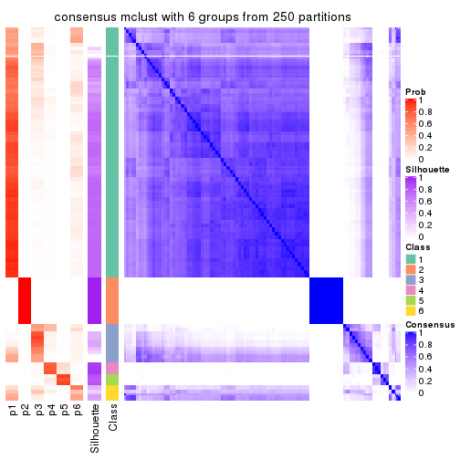</p>

</div>
</div>

Heatmaps for the membership of samples in all partitions to see how consistent they are:


<script>
$( function() {
	$( '#tabs-ATC-mclust-membership-heatmap' ).tabs();
} );
</script>
<div id='tabs-ATC-mclust-membership-heatmap'>
<ul>
<li><a href='#tab-ATC-mclust-membership-heatmap-1'>k = 2</a></li>
<li><a href='#tab-ATC-mclust-membership-heatmap-2'>k = 3</a></li>
<li><a href='#tab-ATC-mclust-membership-heatmap-3'>k = 4</a></li>
<li><a href='#tab-ATC-mclust-membership-heatmap-4'>k = 5</a></li>
<li><a href='#tab-ATC-mclust-membership-heatmap-5'>k = 6</a></li>
</ul>
<div id='tab-ATC-mclust-membership-heatmap-1'>
<pre><code class="r">membership_heatmap(res, k = 2)
</code></pre>

<p></p>

</div>
<div id='tab-ATC-mclust-membership-heatmap-2'>
<pre><code class="r">membership_heatmap(res, k = 3)
</code></pre>

<p></p>

</div>
<div id='tab-ATC-mclust-membership-heatmap-3'>
<pre><code class="r">membership_heatmap(res, k = 4)
</code></pre>

<p></p>

</div>
<div id='tab-ATC-mclust-membership-heatmap-4'>
<pre><code class="r">membership_heatmap(res, k = 5)
</code></pre>

<p></p>

</div>
<div id='tab-ATC-mclust-membership-heatmap-5'>
<pre><code class="r">membership_heatmap(res, k = 6)
</code></pre>

<p></p>

</div>
</div>

As soon as we have had the classes for columns, we can look for signatures
which are significantly different between classes which can be candidate marks
for certain classes. Following are the heatmaps for signatures.


Signature heatmaps where rows are scaled:


<script>
$( function() {
	$( '#tabs-ATC-mclust-get-signatures' ).tabs();
} );
</script>
<div id='tabs-ATC-mclust-get-signatures'>
<ul>
<li><a href='#tab-ATC-mclust-get-signatures-1'>k = 2</a></li>
<li><a href='#tab-ATC-mclust-get-signatures-2'>k = 3</a></li>
<li><a href='#tab-ATC-mclust-get-signatures-3'>k = 4</a></li>
<li><a href='#tab-ATC-mclust-get-signatures-4'>k = 5</a></li>
<li><a href='#tab-ATC-mclust-get-signatures-5'>k = 6</a></li>
</ul>
<div id='tab-ATC-mclust-get-signatures-1'>
<pre><code class="r">get_signatures(res, k = 2)
</code></pre>

<p></p>

</div>
<div id='tab-ATC-mclust-get-signatures-2'>
<pre><code class="r">get_signatures(res, k = 3)
</code></pre>

<p></p>

</div>
<div id='tab-ATC-mclust-get-signatures-3'>
<pre><code class="r">get_signatures(res, k = 4)
</code></pre>

<p></p>

</div>
<div id='tab-ATC-mclust-get-signatures-4'>
<pre><code class="r">get_signatures(res, k = 5)
</code></pre>

<p></p>

</div>
<div id='tab-ATC-mclust-get-signatures-5'>
<pre><code class="r">get_signatures(res, k = 6)
</code></pre>

<p></p>

</div>
</div>


Signature heatmaps where rows are not scaled:


<script>
$( function() {
	$( '#tabs-ATC-mclust-get-signatures-no-scale' ).tabs();
} );
</script>
<div id='tabs-ATC-mclust-get-signatures-no-scale'>
<ul>
<li><a href='#tab-ATC-mclust-get-signatures-no-scale-1'>k = 2</a></li>
<li><a href='#tab-ATC-mclust-get-signatures-no-scale-2'>k = 3</a></li>
<li><a href='#tab-ATC-mclust-get-signatures-no-scale-3'>k = 4</a></li>
<li><a href='#tab-ATC-mclust-get-signatures-no-scale-4'>k = 5</a></li>
<li><a href='#tab-ATC-mclust-get-signatures-no-scale-5'>k = 6</a></li>
</ul>
<div id='tab-ATC-mclust-get-signatures-no-scale-1'>
<pre><code class="r">get_signatures(res, k = 2, scale_rows = FALSE)
</code></pre>

<p></p>

</div>
<div id='tab-ATC-mclust-get-signatures-no-scale-2'>
<pre><code class="r">get_signatures(res, k = 3, scale_rows = FALSE)
</code></pre>

<p></p>

</div>
<div id='tab-ATC-mclust-get-signatures-no-scale-3'>
<pre><code class="r">get_signatures(res, k = 4, scale_rows = FALSE)
</code></pre>

<p></p>

</div>
<div id='tab-ATC-mclust-get-signatures-no-scale-4'>
<pre><code class="r">get_signatures(res, k = 5, scale_rows = FALSE)
</code></pre>

<p></p>

</div>
<div id='tab-ATC-mclust-get-signatures-no-scale-5'>
<pre><code class="r">get_signatures(res, k = 6, scale_rows = FALSE)
</code></pre>

<p></p>

</div>
</div>


Compare the overlap of signatures from different k:

```r
compare_signatures(res)
```


`get_signature()` returns a data frame invisibly. TO get the list of signatures, the function
call should be assigned to a variable explicitly. In following code, if `plot` argument is set
to `FALSE`, no heatmap is plotted while only the differential analysis is performed.

```r
# code only for demonstration
tb = get_signature(res, k = ..., plot = FALSE)
```

An example of the output of `tb` is:

```
#>   which_row         fdr    mean_1    mean_2 scaled_mean_1 scaled_mean_2 km
#> 1        38 0.042760348  8.373488  9.131774    -0.5533452     0.5164555  1
#> 2        40 0.018707592  7.106213  8.469186    -0.6173731     0.5762149  1
#> 3        55 0.019134737 10.221463 11.207825    -0.6159697     0.5749050  1
#> 4        59 0.006059896  5.921854  7.869574    -0.6899429     0.6439467  1
#> 5        60 0.018055526  8.928898 10.211722    -0.6204761     0.5791110  1
#> 6        98 0.009384629 15.714769 14.887706     0.6635654    -0.6193277  2
...
```

The columns in `tb` are:

1. `which_row`: row indices corresponding to the input matrix.
2. `fdr`: FDR for the differential test. 
3. `mean_x`: The mean value in group x.
4. `scaled_mean_x`: The mean value in group x after rows are scaled.
5. `km`: Row groups if k-means clustering is applied to rows.


UMAP plot which shows how samples are separated.


<script>
$( function() {
	$( '#tabs-ATC-mclust-dimension-reduction' ).tabs();
} );
</script>
<div id='tabs-ATC-mclust-dimension-reduction'>
<ul>
<li><a href='#tab-ATC-mclust-dimension-reduction-1'>k = 2</a></li>
<li><a href='#tab-ATC-mclust-dimension-reduction-2'>k = 3</a></li>
<li><a href='#tab-ATC-mclust-dimension-reduction-3'>k = 4</a></li>
<li><a href='#tab-ATC-mclust-dimension-reduction-4'>k = 5</a></li>
<li><a href='#tab-ATC-mclust-dimension-reduction-5'>k = 6</a></li>
</ul>
<div id='tab-ATC-mclust-dimension-reduction-1'>
<pre><code class="r">dimension_reduction(res, k = 2, method = &quot;UMAP&quot;)
</code></pre>

<p></p>

</div>
<div id='tab-ATC-mclust-dimension-reduction-2'>
<pre><code class="r">dimension_reduction(res, k = 3, method = &quot;UMAP&quot;)
</code></pre>

<p></p>

</div>
<div id='tab-ATC-mclust-dimension-reduction-3'>
<pre><code class="r">dimension_reduction(res, k = 4, method = &quot;UMAP&quot;)
</code></pre>

<p></p>

</div>
<div id='tab-ATC-mclust-dimension-reduction-4'>
<pre><code class="r">dimension_reduction(res, k = 5, method = &quot;UMAP&quot;)
</code></pre>

<p></p>

</div>
<div id='tab-ATC-mclust-dimension-reduction-5'>
<pre><code class="r">dimension_reduction(res, k = 6, method = &quot;UMAP&quot;)
</code></pre>

<p></p>

</div>
</div>


Following heatmap shows how subgroups are split when increasing `k`:

```r
collect_classes(res)
```


If matrix rows can be associated to genes, consider to use `GO_Enrichment(res,
...)` to perform function enrichment for the signature genes.


 

---------------------------------------------------


### ATC:NMF**


The object with results only for a single top-value method and a single partition method 
can be extracted as:

```r
res = res_list["ATC", "NMF"]
# you can also extract it by
# res = res_list["ATC:NMF"]
```

A summary of `res` and all the functions that can be applied to it:

```r
res
```

```
#> A 'ConsensusPartition' object with k = 2, 3, 4, 5, 6.
#>   On a matrix with 8394 rows and 194 columns.
#>   Top rows (839, 1678, 2518, 3358, 4197) are extracted by 'ATC' method.
#>   Subgroups are detected by 'NMF' method.
#>   Performed in total 1250 partitions by row resampling.
#>   Best k for subgroups seems to be 3.
#> 
#> Following methods can be applied to this 'ConsensusPartition' object:
#>  [1] "cola_report"             "collect_classes"         "collect_plots"          
#>  [4] "collect_stats"           "colnames"                "compare_signatures"     
#>  [7] "consensus_heatmap"       "dimension_reduction"     "functional_enrichment"  
#> [10] "get_anno_col"            "get_anno"                "get_classes"            
#> [13] "get_consensus"           "get_matrix"              "get_membership"         
#> [16] "get_param"               "get_signatures"          "get_stats"              
#> [19] "is_best_k"               "is_stable_k"             "membership_heatmap"     
#> [22] "ncol"                    "nrow"                    "plot_ecdf"              
#> [25] "rownames"                "select_partition_number" "show"                   
#> [28] "suggest_best_k"          "test_to_known_factors"
```

`collect_plots()` function collects all the plots made from `res` for all `k` (number of partitions)
into one single page to provide an easy and fast comparison between different `k`.

```r
collect_plots(res)
```


The plots are:

- The first row: a plot of the ECDF (Empirical cumulative distribution
  function) curves of the consensus matrix for each `k` and the heatmap of
  predicted classes for each `k`.
- The second row: heatmaps of the consensus matrix for each `k`.
- The third row: heatmaps of the membership matrix for each `k`.
- The fouth row: heatmaps of the signatures for each `k`.

All the plots in panels can be made by individual functions and they are
plotted later in this section.

`select_partition_number()` produces several plots showing different
statistics for choosing "optimized" `k`. There are following statistics:

- ECDF curves of the consensus matrix for each `k`;
- 1-PAC. [The PAC
  score](https://en.wikipedia.org/wiki/Consensus_clustering#Over-interpretation_potential_of_consensus_clustering)
  measures the proportion of the ambiguous subgrouping.
- Mean silhouette score.
- Concordance. The mean probability of fiting the consensus class ids in all
  partitions.
- Area increased. Denote $A_k$ as the area under the ECDF curve for current
  `k`, the area increased is defined as $A_k - A_{k-1}$.
- Rand index. The percent of pairs of samples that are both in a same cluster
  or both are not in a same cluster in the partition of k and k-1.
- Jaccard index. The ratio of pairs of samples are both in a same cluster in
  the partition of k and k-1 and the pairs of samples are both in a same
  cluster in the partition k or k-1.

The detailed explanations of these statistics can be found in [the cola
vignette](http://bioconductor.org/packages/devel/bioc/vignettes/cola/inst/doc/cola.html#toc_13).

Generally speaking, lower PAC score, higher mean silhouette score or higher
concordance corresponds to better partition. Rand index and Jaccard index
measure how similar the current partition is compared to partition with `k-1`.
If they are too similar, we won't accept `k` is better than `k-1`.

```r
select_partition_number(res)
```


The numeric values for all these statistics can be obtained by `get_stats()`.

```r
get_stats(res)
```

```
#>   k 1-PAC mean_silhouette concordance area_increased  Rand Jaccard
#> 2 2 1.000           1.000       1.000          0.219 0.782   0.782
#> 3 3 0.966           0.948       0.977          0.254 0.947   0.933
#> 4 4 0.823           0.895       0.933          0.243 0.966   0.953
#> 5 5 0.582           0.860       0.892          0.150 0.982   0.975
#> 6 6 0.417           0.779       0.855          0.128 0.965   0.948
```

`suggest_best_k()` suggests the best $k$ based on these statistics. The rules are as follows:

- All $k$ with Jaccard index larger than 0.95 are removed because the increase of
  the partition number does not provides enough extra information. If all $k$ are removed,
  the best $k$ is assigned by `NA`.
- For $k$ with 1-PAC larger than 0.9, the maximal $k$ is taken as the "best k". Other $k$ is called "optional k".
- If it does not fit the second rule. The $k$ with the highest vote of highest
  1-PAC, mean silhouette and concordance is taken as the "best k".

```r
suggest_best_k(res)
```

```
#> [1] 3
#> attr(,"optional")
#> [1] 2
```

There is also optional best $k$ = 2 that is worth to check.

Following shows the table of the partitions (You need to click the **show/hide
code output** link to see it). The membership matrix (columns with name `p*`)
is inferred by
[`clue::cl_consensus()`](https://www.rdocumentation.org/link/cl_consensus?package=clue)
function with the `SE` method. Basically the value in the membership matrix
represents the probability to belong to a certain group. The finall class
label for an item is determined with the group with highest probability it
belongs to.

In `get_classes()` function, the entropy is calculated from the membership
matrix and the silhouette score is calculated from the consensus matrix.


<script>
$( function() {
	$( '#tabs-ATC-NMF-get-classes' ).tabs();
} );
</script>
<div id='tabs-ATC-NMF-get-classes'>
<ul>
<li><a href='#tab-ATC-NMF-get-classes-1'>k = 2</a></li>
<li><a href='#tab-ATC-NMF-get-classes-2'>k = 3</a></li>
<li><a href='#tab-ATC-NMF-get-classes-3'>k = 4</a></li>
<li><a href='#tab-ATC-NMF-get-classes-4'>k = 5</a></li>
<li><a href='#tab-ATC-NMF-get-classes-5'>k = 6</a></li>
</ul>

<div id='tab-ATC-NMF-get-classes-1'>
<p><a id='tab-ATC-NMF-get-classes-1-a' style='color:#0366d6' href='#'>show/hide code output</a></p>
<pre><code class="r">cbind(get_classes(res, k = 2), get_membership(res, k = 2))
</code></pre>

<pre><code>#&gt;           class entropy silhouette p1 p2
#&gt; ERR467487     1       0          1  1  0
#&gt; ERR467498     1       0          1  1  0
#&gt; ERR658998     1       0          1  1  0
#&gt; ERR659094     1       0          1  1  0
#&gt; ERR658999     1       0          1  1  0
#&gt; ERR659095     1       0          1  1  0
#&gt; ERR659000     1       0          1  1  0
#&gt; ERR659096     1       0          1  1  0
#&gt; ERR659001     1       0          1  1  0
#&gt; ERR659097     1       0          1  1  0
#&gt; ERR659002     1       0          1  1  0
#&gt; ERR659098     1       0          1  1  0
#&gt; ERR659003     1       0          1  1  0
#&gt; ERR659099     1       0          1  1  0
#&gt; ERR659004     1       0          1  1  0
#&gt; ERR659100     1       0          1  1  0
#&gt; ERR659005     1       0          1  1  0
#&gt; ERR659101     1       0          1  1  0
#&gt; ERR659006     1       0          1  1  0
#&gt; ERR659102     1       0          1  1  0
#&gt; ERR659007     1       0          1  1  0
#&gt; ERR659103     1       0          1  1  0
#&gt; ERR659008     2       0          1  0  1
#&gt; ERR659104     2       0          1  0  1
#&gt; ERR659009     1       0          1  1  0
#&gt; ERR659105     1       0          1  1  0
#&gt; ERR659010     1       0          1  1  0
#&gt; ERR659106     1       0          1  1  0
#&gt; ERR659011     1       0          1  1  0
#&gt; ERR659107     1       0          1  1  0
#&gt; ERR659012     1       0          1  1  0
#&gt; ERR659108     1       0          1  1  0
#&gt; ERR659013     1       0          1  1  0
#&gt; ERR659109     1       0          1  1  0
#&gt; ERR659014     2       0          1  0  1
#&gt; ERR659110     2       0          1  0  1
#&gt; ERR659015     1       0          1  1  0
#&gt; ERR659111     1       0          1  1  0
#&gt; ERR659016     1       0          1  1  0
#&gt; ERR659112     1       0          1  1  0
#&gt; ERR659017     2       0          1  0  1
#&gt; ERR659113     2       0          1  0  1
#&gt; ERR659018     1       0          1  1  0
#&gt; ERR659114     1       0          1  1  0
#&gt; ERR659019     1       0          1  1  0
#&gt; ERR659115     1       0          1  1  0
#&gt; ERR659020     1       0          1  1  0
#&gt; ERR659116     1       0          1  1  0
#&gt; ERR659021     1       0          1  1  0
#&gt; ERR659117     1       0          1  1  0
#&gt; ERR659022     1       0          1  1  0
#&gt; ERR659118     1       0          1  1  0
#&gt; ERR659023     1       0          1  1  0
#&gt; ERR659119     1       0          1  1  0
#&gt; ERR659024     1       0          1  1  0
#&gt; ERR659120     1       0          1  1  0
#&gt; ERR659025     1       0          1  1  0
#&gt; ERR659121     1       0          1  1  0
#&gt; ERR659026     1       0          1  1  0
#&gt; ERR659122     1       0          1  1  0
#&gt; ERR659027     1       0          1  1  0
#&gt; ERR659123     1       0          1  1  0
#&gt; ERR659028     1       0          1  1  0
#&gt; ERR659124     1       0          1  1  0
#&gt; ERR659029     1       0          1  1  0
#&gt; ERR659125     1       0          1  1  0
#&gt; ERR659030     1       0          1  1  0
#&gt; ERR659126     1       0          1  1  0
#&gt; ERR659031     1       0          1  1  0
#&gt; ERR659127     1       0          1  1  0
#&gt; ERR659032     1       0          1  1  0
#&gt; ERR659128     1       0          1  1  0
#&gt; ERR659033     1       0          1  1  0
#&gt; ERR659129     1       0          1  1  0
#&gt; ERR659034     2       0          1  0  1
#&gt; ERR659130     2       0          1  0  1
#&gt; ERR659035     1       0          1  1  0
#&gt; ERR659131     1       0          1  1  0
#&gt; ERR659036     1       0          1  1  0
#&gt; ERR659132     1       0          1  1  0
#&gt; ERR659037     1       0          1  1  0
#&gt; ERR659133     1       0          1  1  0
#&gt; ERR659038     1       0          1  1  0
#&gt; ERR659134     1       0          1  1  0
#&gt; ERR659039     1       0          1  1  0
#&gt; ERR659135     1       0          1  1  0
#&gt; ERR659040     1       0          1  1  0
#&gt; ERR659136     1       0          1  1  0
#&gt; ERR659041     1       0          1  1  0
#&gt; ERR659137     1       0          1  1  0
#&gt; ERR659042     1       0          1  1  0
#&gt; ERR659138     1       0          1  1  0
#&gt; ERR659043     1       0          1  1  0
#&gt; ERR659139     1       0          1  1  0
#&gt; ERR659044     2       0          1  0  1
#&gt; ERR659140     2       0          1  0  1
#&gt; ERR659045     1       0          1  1  0
#&gt; ERR659141     1       0          1  1  0
#&gt; ERR659046     1       0          1  1  0
#&gt; ERR659142     1       0          1  1  0
#&gt; ERR659047     1       0          1  1  0
#&gt; ERR659143     1       0          1  1  0
#&gt; ERR659048     1       0          1  1  0
#&gt; ERR659144     1       0          1  1  0
#&gt; ERR659049     1       0          1  1  0
#&gt; ERR659145     1       0          1  1  0
#&gt; ERR659050     1       0          1  1  0
#&gt; ERR659146     1       0          1  1  0
#&gt; ERR659051     1       0          1  1  0
#&gt; ERR659147     1       0          1  1  0
#&gt; ERR659052     1       0          1  1  0
#&gt; ERR659148     1       0          1  1  0
#&gt; ERR659053     1       0          1  1  0
#&gt; ERR659149     1       0          1  1  0
#&gt; ERR659054     2       0          1  0  1
#&gt; ERR659150     2       0          1  0  1
#&gt; ERR659055     1       0          1  1  0
#&gt; ERR659151     1       0          1  1  0
#&gt; ERR659056     1       0          1  1  0
#&gt; ERR659152     1       0          1  1  0
#&gt; ERR659057     1       0          1  1  0
#&gt; ERR659153     1       0          1  1  0
#&gt; ERR659058     1       0          1  1  0
#&gt; ERR659154     1       0          1  1  0
#&gt; ERR659059     1       0          1  1  0
#&gt; ERR659155     1       0          1  1  0
#&gt; ERR659060     1       0          1  1  0
#&gt; ERR659156     1       0          1  1  0
#&gt; ERR659061     1       0          1  1  0
#&gt; ERR659157     1       0          1  1  0
#&gt; ERR659062     1       0          1  1  0
#&gt; ERR659158     1       0          1  1  0
#&gt; ERR659063     1       0          1  1  0
#&gt; ERR659159     1       0          1  1  0
#&gt; ERR659064     1       0          1  1  0
#&gt; ERR659160     1       0          1  1  0
#&gt; ERR659065     2       0          1  0  1
#&gt; ERR659161     2       0          1  0  1
#&gt; ERR659066     1       0          1  1  0
#&gt; ERR659162     1       0          1  1  0
#&gt; ERR659067     1       0          1  1  0
#&gt; ERR659163     1       0          1  1  0
#&gt; ERR659068     2       0          1  0  1
#&gt; ERR659164     2       0          1  0  1
#&gt; ERR659069     1       0          1  1  0
#&gt; ERR659165     1       0          1  1  0
#&gt; ERR659070     1       0          1  1  0
#&gt; ERR659166     1       0          1  1  0
#&gt; ERR659071     1       0          1  1  0
#&gt; ERR659167     1       0          1  1  0
#&gt; ERR659072     1       0          1  1  0
#&gt; ERR659168     1       0          1  1  0
#&gt; ERR659073     1       0          1  1  0
#&gt; ERR659169     1       0          1  1  0
#&gt; ERR659074     2       0          1  0  1
#&gt; ERR659170     2       0          1  0  1
#&gt; ERR659075     1       0          1  1  0
#&gt; ERR659171     1       0          1  1  0
#&gt; ERR659076     2       0          1  0  1
#&gt; ERR659172     2       0          1  0  1
#&gt; ERR659077     1       0          1  1  0
#&gt; ERR659173     1       0          1  1  0
#&gt; ERR659078     1       0          1  1  0
#&gt; ERR659174     1       0          1  1  0
#&gt; ERR659079     1       0          1  1  0
#&gt; ERR659175     1       0          1  1  0
#&gt; ERR659080     1       0          1  1  0
#&gt; ERR659176     1       0          1  1  0
#&gt; ERR659081     1       0          1  1  0
#&gt; ERR659177     1       0          1  1  0
#&gt; ERR659082     1       0          1  1  0
#&gt; ERR659178     1       0          1  1  0
#&gt; ERR659083     2       0          1  0  1
#&gt; ERR659179     2       0          1  0  1
#&gt; ERR659084     2       0          1  0  1
#&gt; ERR659180     2       0          1  0  1
#&gt; ERR659085     1       0          1  1  0
#&gt; ERR659181     1       0          1  1  0
#&gt; ERR659086     1       0          1  1  0
#&gt; ERR659182     1       0          1  1  0
#&gt; ERR659087     1       0          1  1  0
#&gt; ERR659183     1       0          1  1  0
#&gt; ERR659088     1       0          1  1  0
#&gt; ERR659184     1       0          1  1  0
#&gt; ERR659089     1       0          1  1  0
#&gt; ERR659185     1       0          1  1  0
#&gt; ERR659090     1       0          1  1  0
#&gt; ERR659186     1       0          1  1  0
#&gt; ERR659091     1       0          1  1  0
#&gt; ERR659187     1       0          1  1  0
#&gt; ERR659092     1       0          1  1  0
#&gt; ERR659188     1       0          1  1  0
#&gt; ERR659093     1       0          1  1  0
#&gt; ERR659189     1       0          1  1  0
</code></pre>

<script>
$('#tab-ATC-NMF-get-classes-1-a').parent().next().next().hide();
$('#tab-ATC-NMF-get-classes-1-a').click(function(){
  $('#tab-ATC-NMF-get-classes-1-a').parent().next().next().toggle();
  return(false);
});
</script>
</div>

<div id='tab-ATC-NMF-get-classes-2'>
<p><a id='tab-ATC-NMF-get-classes-2-a' style='color:#0366d6' href='#'>show/hide code output</a></p>
<pre><code class="r">cbind(get_classes(res, k = 3), get_membership(res, k = 3))
</code></pre>

<pre><code>#&gt;           class entropy silhouette    p1    p2    p3
#&gt; ERR467487     1  0.1964      0.921 0.944 0.000 0.056
#&gt; ERR467498     1  0.1964      0.921 0.944 0.000 0.056
#&gt; ERR658998     1  0.0000      0.980 1.000 0.000 0.000
#&gt; ERR659094     1  0.0000      0.980 1.000 0.000 0.000
#&gt; ERR658999     1  0.0000      0.980 1.000 0.000 0.000
#&gt; ERR659095     1  0.0000      0.980 1.000 0.000 0.000
#&gt; ERR659000     1  0.1529      0.941 0.960 0.000 0.040
#&gt; ERR659096     1  0.1643      0.936 0.956 0.000 0.044
#&gt; ERR659001     1  0.0000      0.980 1.000 0.000 0.000
#&gt; ERR659097     1  0.0237      0.978 0.996 0.000 0.004
#&gt; ERR659002     1  0.0000      0.980 1.000 0.000 0.000
#&gt; ERR659098     1  0.0000      0.980 1.000 0.000 0.000
#&gt; ERR659003     1  0.0000      0.980 1.000 0.000 0.000
#&gt; ERR659099     1  0.0000      0.980 1.000 0.000 0.000
#&gt; ERR659004     1  0.0747      0.967 0.984 0.000 0.016
#&gt; ERR659100     1  0.0592      0.971 0.988 0.000 0.012
#&gt; ERR659005     1  0.0237      0.978 0.996 0.000 0.004
#&gt; ERR659101     1  0.0237      0.978 0.996 0.000 0.004
#&gt; ERR659006     1  0.0000      0.980 1.000 0.000 0.000
#&gt; ERR659102     1  0.0000      0.980 1.000 0.000 0.000
#&gt; ERR659007     1  0.0000      0.980 1.000 0.000 0.000
#&gt; ERR659103     1  0.0237      0.978 0.996 0.000 0.004
#&gt; ERR659008     2  0.0747      0.994 0.000 0.984 0.016
#&gt; ERR659104     2  0.0237      0.993 0.000 0.996 0.004
#&gt; ERR659009     1  0.0000      0.980 1.000 0.000 0.000
#&gt; ERR659105     1  0.0000      0.980 1.000 0.000 0.000
#&gt; ERR659010     1  0.0000      0.980 1.000 0.000 0.000
#&gt; ERR659106     1  0.0000      0.980 1.000 0.000 0.000
#&gt; ERR659011     1  0.0000      0.980 1.000 0.000 0.000
#&gt; ERR659107     1  0.0000      0.980 1.000 0.000 0.000
#&gt; ERR659012     1  0.1031      0.958 0.976 0.000 0.024
#&gt; ERR659108     1  0.1163      0.953 0.972 0.000 0.028
#&gt; ERR659013     1  0.2165      0.910 0.936 0.000 0.064
#&gt; ERR659109     1  0.2165      0.910 0.936 0.000 0.064
#&gt; ERR659014     2  0.0747      0.993 0.000 0.984 0.016
#&gt; ERR659110     2  0.0592      0.993 0.000 0.988 0.012
#&gt; ERR659015     1  0.0000      0.980 1.000 0.000 0.000
#&gt; ERR659111     1  0.0000      0.980 1.000 0.000 0.000
#&gt; ERR659016     1  0.3267      0.822 0.884 0.000 0.116
#&gt; ERR659112     1  0.3267      0.822 0.884 0.000 0.116
#&gt; ERR659017     2  0.1031      0.993 0.000 0.976 0.024
#&gt; ERR659113     2  0.0892      0.993 0.000 0.980 0.020
#&gt; ERR659018     1  0.0000      0.980 1.000 0.000 0.000
#&gt; ERR659114     1  0.0000      0.980 1.000 0.000 0.000
#&gt; ERR659019     1  0.0000      0.980 1.000 0.000 0.000
#&gt; ERR659115     1  0.0000      0.980 1.000 0.000 0.000
#&gt; ERR659020     1  0.0000      0.980 1.000 0.000 0.000
#&gt; ERR659116     1  0.0000      0.980 1.000 0.000 0.000
#&gt; ERR659021     1  0.0237      0.978 0.996 0.000 0.004
#&gt; ERR659117     1  0.0237      0.978 0.996 0.000 0.004
#&gt; ERR659022     1  0.0237      0.978 0.996 0.000 0.004
#&gt; ERR659118     1  0.0000      0.980 1.000 0.000 0.000
#&gt; ERR659023     1  0.0237      0.978 0.996 0.000 0.004
#&gt; ERR659119     1  0.0237      0.978 0.996 0.000 0.004
#&gt; ERR659024     1  0.0000      0.980 1.000 0.000 0.000
#&gt; ERR659120     1  0.0000      0.980 1.000 0.000 0.000
#&gt; ERR659025     1  0.0000      0.980 1.000 0.000 0.000
#&gt; ERR659121     1  0.0000      0.980 1.000 0.000 0.000
#&gt; ERR659026     1  0.0000      0.980 1.000 0.000 0.000
#&gt; ERR659122     1  0.0237      0.977 0.996 0.000 0.004
#&gt; ERR659027     1  0.3340      0.816 0.880 0.000 0.120
#&gt; ERR659123     1  0.3340      0.819 0.880 0.000 0.120
#&gt; ERR659028     1  0.0000      0.980 1.000 0.000 0.000
#&gt; ERR659124     1  0.0000      0.980 1.000 0.000 0.000
#&gt; ERR659029     1  0.0000      0.980 1.000 0.000 0.000
#&gt; ERR659125     1  0.0000      0.980 1.000 0.000 0.000
#&gt; ERR659030     1  0.0000      0.980 1.000 0.000 0.000
#&gt; ERR659126     1  0.0000      0.980 1.000 0.000 0.000
#&gt; ERR659031     1  0.0237      0.978 0.996 0.000 0.004
#&gt; ERR659127     1  0.0237      0.978 0.996 0.000 0.004
#&gt; ERR659032     1  0.0747      0.966 0.984 0.000 0.016
#&gt; ERR659128     1  0.0592      0.970 0.988 0.000 0.012
#&gt; ERR659033     1  0.0237      0.978 0.996 0.000 0.004
#&gt; ERR659129     1  0.0237      0.978 0.996 0.000 0.004
#&gt; ERR659034     2  0.0424      0.993 0.000 0.992 0.008
#&gt; ERR659130     2  0.0747      0.993 0.000 0.984 0.016
#&gt; ERR659035     1  0.0592      0.972 0.988 0.000 0.012
#&gt; ERR659131     1  0.0424      0.975 0.992 0.000 0.008
#&gt; ERR659036     1  0.0892      0.964 0.980 0.000 0.020
#&gt; ERR659132     1  0.0592      0.972 0.988 0.000 0.012
#&gt; ERR659037     1  0.0000      0.980 1.000 0.000 0.000
#&gt; ERR659133     1  0.0000      0.980 1.000 0.000 0.000
#&gt; ERR659038     1  0.0000      0.980 1.000 0.000 0.000
#&gt; ERR659134     1  0.0000      0.980 1.000 0.000 0.000
#&gt; ERR659039     1  0.0000      0.980 1.000 0.000 0.000
#&gt; ERR659135     1  0.0000      0.980 1.000 0.000 0.000
#&gt; ERR659040     1  0.0000      0.980 1.000 0.000 0.000
#&gt; ERR659136     1  0.0000      0.980 1.000 0.000 0.000
#&gt; ERR659041     1  0.2261      0.901 0.932 0.000 0.068
#&gt; ERR659137     1  0.2356      0.895 0.928 0.000 0.072
#&gt; ERR659042     1  0.1289      0.951 0.968 0.000 0.032
#&gt; ERR659138     1  0.1411      0.946 0.964 0.000 0.036
#&gt; ERR659043     1  0.0237      0.978 0.996 0.000 0.004
#&gt; ERR659139     1  0.0237      0.978 0.996 0.000 0.004
#&gt; ERR659044     2  0.0237      0.993 0.000 0.996 0.004
#&gt; ERR659140     2  0.0592      0.993 0.000 0.988 0.012
#&gt; ERR659045     1  0.0000      0.980 1.000 0.000 0.000
#&gt; ERR659141     1  0.0000      0.980 1.000 0.000 0.000
#&gt; ERR659046     1  0.0000      0.980 1.000 0.000 0.000
#&gt; ERR659142     1  0.0000      0.980 1.000 0.000 0.000
#&gt; ERR659047     1  0.0000      0.980 1.000 0.000 0.000
#&gt; ERR659143     1  0.0000      0.980 1.000 0.000 0.000
#&gt; ERR659048     1  0.0000      0.980 1.000 0.000 0.000
#&gt; ERR659144     1  0.0000      0.980 1.000 0.000 0.000
#&gt; ERR659049     1  0.0000      0.980 1.000 0.000 0.000
#&gt; ERR659145     1  0.0000      0.980 1.000 0.000 0.000
#&gt; ERR659050     1  0.0237      0.977 0.996 0.000 0.004
#&gt; ERR659146     1  0.0237      0.977 0.996 0.000 0.004
#&gt; ERR659051     1  0.4399      0.677 0.812 0.000 0.188
#&gt; ERR659147     1  0.4399      0.677 0.812 0.000 0.188
#&gt; ERR659052     1  0.0000      0.980 1.000 0.000 0.000
#&gt; ERR659148     1  0.0000      0.980 1.000 0.000 0.000
#&gt; ERR659053     1  0.0000      0.980 1.000 0.000 0.000
#&gt; ERR659149     1  0.0000      0.980 1.000 0.000 0.000
#&gt; ERR659054     2  0.0424      0.994 0.000 0.992 0.008
#&gt; ERR659150     2  0.0747      0.993 0.000 0.984 0.016
#&gt; ERR659055     1  0.0000      0.980 1.000 0.000 0.000
#&gt; ERR659151     1  0.0000      0.980 1.000 0.000 0.000
#&gt; ERR659056     3  0.5785      0.652 0.332 0.000 0.668
#&gt; ERR659152     3  0.5733      0.649 0.324 0.000 0.676
#&gt; ERR659057     1  0.0000      0.980 1.000 0.000 0.000
#&gt; ERR659153     1  0.0237      0.978 0.996 0.000 0.004
#&gt; ERR659058     1  0.0000      0.980 1.000 0.000 0.000
#&gt; ERR659154     1  0.0000      0.980 1.000 0.000 0.000
#&gt; ERR659059     1  0.0000      0.980 1.000 0.000 0.000
#&gt; ERR659155     1  0.0000      0.980 1.000 0.000 0.000
#&gt; ERR659060     1  0.0237      0.978 0.996 0.000 0.004
#&gt; ERR659156     1  0.0237      0.978 0.996 0.000 0.004
#&gt; ERR659061     1  0.0000      0.980 1.000 0.000 0.000
#&gt; ERR659157     1  0.0237      0.978 0.996 0.000 0.004
#&gt; ERR659062     1  0.0000      0.980 1.000 0.000 0.000
#&gt; ERR659158     1  0.0000      0.980 1.000 0.000 0.000
#&gt; ERR659063     1  0.0237      0.978 0.996 0.000 0.004
#&gt; ERR659159     1  0.0237      0.978 0.996 0.000 0.004
#&gt; ERR659064     1  0.0424      0.974 0.992 0.000 0.008
#&gt; ERR659160     1  0.0000      0.980 1.000 0.000 0.000
#&gt; ERR659065     2  0.0592      0.993 0.000 0.988 0.012
#&gt; ERR659161     2  0.0747      0.993 0.000 0.984 0.016
#&gt; ERR659066     1  0.0000      0.980 1.000 0.000 0.000
#&gt; ERR659162     1  0.0000      0.980 1.000 0.000 0.000
#&gt; ERR659067     1  0.0000      0.980 1.000 0.000 0.000
#&gt; ERR659163     1  0.0000      0.980 1.000 0.000 0.000
#&gt; ERR659068     2  0.0424      0.993 0.000 0.992 0.008
#&gt; ERR659164     2  0.0747      0.994 0.000 0.984 0.016
#&gt; ERR659069     1  0.0000      0.980 1.000 0.000 0.000
#&gt; ERR659165     1  0.0000      0.980 1.000 0.000 0.000
#&gt; ERR659070     1  0.0000      0.980 1.000 0.000 0.000
#&gt; ERR659166     1  0.0000      0.980 1.000 0.000 0.000
#&gt; ERR659071     1  0.0000      0.980 1.000 0.000 0.000
#&gt; ERR659167     1  0.0000      0.980 1.000 0.000 0.000
#&gt; ERR659072     1  0.0000      0.980 1.000 0.000 0.000
#&gt; ERR659168     1  0.0000      0.980 1.000 0.000 0.000
#&gt; ERR659073     1  0.0000      0.980 1.000 0.000 0.000
#&gt; ERR659169     1  0.0000      0.980 1.000 0.000 0.000
#&gt; ERR659074     2  0.0747      0.993 0.000 0.984 0.016
#&gt; ERR659170     2  0.1031      0.992 0.000 0.976 0.024
#&gt; ERR659075     3  0.1643      0.271 0.044 0.000 0.956
#&gt; ERR659171     3  0.1643      0.271 0.044 0.000 0.956
#&gt; ERR659076     2  0.0892      0.991 0.000 0.980 0.020
#&gt; ERR659172     2  0.0592      0.993 0.000 0.988 0.012
#&gt; ERR659077     1  0.0237      0.978 0.996 0.000 0.004
#&gt; ERR659173     1  0.0237      0.978 0.996 0.000 0.004
#&gt; ERR659078     1  0.0000      0.980 1.000 0.000 0.000
#&gt; ERR659174     1  0.0000      0.980 1.000 0.000 0.000
#&gt; ERR659079     1  0.0237      0.978 0.996 0.000 0.004
#&gt; ERR659175     1  0.0237      0.978 0.996 0.000 0.004
#&gt; ERR659080     1  0.5560      0.322 0.700 0.000 0.300
#&gt; ERR659176     1  0.5591      0.306 0.696 0.000 0.304
#&gt; ERR659081     1  0.0000      0.980 1.000 0.000 0.000
#&gt; ERR659177     1  0.0000      0.980 1.000 0.000 0.000
#&gt; ERR659082     1  0.0747      0.967 0.984 0.000 0.016
#&gt; ERR659178     1  0.0592      0.971 0.988 0.000 0.012
#&gt; ERR659083     2  0.0747      0.992 0.000 0.984 0.016
#&gt; ERR659179     2  0.0237      0.994 0.000 0.996 0.004
#&gt; ERR659084     2  0.0747      0.993 0.000 0.984 0.016
#&gt; ERR659180     2  0.0424      0.994 0.000 0.992 0.008
#&gt; ERR659085     1  0.0000      0.980 1.000 0.000 0.000
#&gt; ERR659181     1  0.0000      0.980 1.000 0.000 0.000
#&gt; ERR659086     1  0.0000      0.980 1.000 0.000 0.000
#&gt; ERR659182     1  0.0000      0.980 1.000 0.000 0.000
#&gt; ERR659087     1  0.0237      0.978 0.996 0.000 0.004
#&gt; ERR659183     1  0.0237      0.978 0.996 0.000 0.004
#&gt; ERR659088     3  0.6309      0.464 0.500 0.000 0.500
#&gt; ERR659184     3  0.6309      0.475 0.496 0.000 0.504
#&gt; ERR659089     1  0.1643      0.934 0.956 0.000 0.044
#&gt; ERR659185     1  0.1289      0.948 0.968 0.000 0.032
#&gt; ERR659090     1  0.0237      0.977 0.996 0.000 0.004
#&gt; ERR659186     1  0.0237      0.977 0.996 0.000 0.004
#&gt; ERR659091     1  0.0000      0.980 1.000 0.000 0.000
#&gt; ERR659187     1  0.0000      0.980 1.000 0.000 0.000
#&gt; ERR659092     1  0.0237      0.977 0.996 0.000 0.004
#&gt; ERR659188     1  0.0237      0.977 0.996 0.000 0.004
#&gt; ERR659093     1  0.0000      0.980 1.000 0.000 0.000
#&gt; ERR659189     1  0.0000      0.980 1.000 0.000 0.000
</code></pre>

<script>
$('#tab-ATC-NMF-get-classes-2-a').parent().next().next().hide();
$('#tab-ATC-NMF-get-classes-2-a').click(function(){
  $('#tab-ATC-NMF-get-classes-2-a').parent().next().next().toggle();
  return(false);
});
</script>
</div>

<div id='tab-ATC-NMF-get-classes-3'>
<p><a id='tab-ATC-NMF-get-classes-3-a' style='color:#0366d6' href='#'>show/hide code output</a></p>
<pre><code class="r">cbind(get_classes(res, k = 4), get_membership(res, k = 4))
</code></pre>

<pre><code>#&gt;           class entropy silhouette    p1    p2    p3    p4
#&gt; ERR467487     3  0.4857      0.836 0.324 0.000 0.668 0.008
#&gt; ERR467498     3  0.4857      0.836 0.324 0.000 0.668 0.008
#&gt; ERR658998     1  0.1302      0.935 0.956 0.000 0.044 0.000
#&gt; ERR659094     1  0.1118      0.938 0.964 0.000 0.036 0.000
#&gt; ERR658999     1  0.0921      0.945 0.972 0.000 0.028 0.000
#&gt; ERR659095     1  0.1118      0.944 0.964 0.000 0.036 0.000
#&gt; ERR659000     1  0.2859      0.859 0.880 0.000 0.112 0.008
#&gt; ERR659096     1  0.2859      0.859 0.880 0.000 0.112 0.008
#&gt; ERR659001     1  0.0707      0.940 0.980 0.000 0.020 0.000
#&gt; ERR659097     1  0.0921      0.941 0.972 0.000 0.028 0.000
#&gt; ERR659002     1  0.0707      0.941 0.980 0.000 0.020 0.000
#&gt; ERR659098     1  0.0817      0.943 0.976 0.000 0.024 0.000
#&gt; ERR659003     1  0.1211      0.945 0.960 0.000 0.040 0.000
#&gt; ERR659099     1  0.1118      0.945 0.964 0.000 0.036 0.000
#&gt; ERR659004     1  0.2480      0.898 0.904 0.000 0.088 0.008
#&gt; ERR659100     1  0.1902      0.929 0.932 0.000 0.064 0.004
#&gt; ERR659005     1  0.1557      0.938 0.944 0.000 0.056 0.000
#&gt; ERR659101     1  0.1557      0.938 0.944 0.000 0.056 0.000
#&gt; ERR659006     1  0.1389      0.936 0.952 0.000 0.048 0.000
#&gt; ERR659102     1  0.1302      0.938 0.956 0.000 0.044 0.000
#&gt; ERR659007     1  0.0921      0.942 0.972 0.000 0.028 0.000
#&gt; ERR659103     1  0.1118      0.940 0.964 0.000 0.036 0.000
#&gt; ERR659008     2  0.1743      0.976 0.000 0.940 0.056 0.004
#&gt; ERR659104     2  0.1305      0.976 0.000 0.960 0.036 0.004
#&gt; ERR659009     1  0.1940      0.907 0.924 0.000 0.076 0.000
#&gt; ERR659105     1  0.1867      0.912 0.928 0.000 0.072 0.000
#&gt; ERR659010     1  0.0592      0.944 0.984 0.000 0.016 0.000
#&gt; ERR659106     1  0.0921      0.944 0.972 0.000 0.028 0.000
#&gt; ERR659011     1  0.0592      0.943 0.984 0.000 0.016 0.000
#&gt; ERR659107     1  0.0592      0.943 0.984 0.000 0.016 0.000
#&gt; ERR659012     1  0.1398      0.942 0.956 0.000 0.040 0.004
#&gt; ERR659108     1  0.1398      0.942 0.956 0.000 0.040 0.004
#&gt; ERR659013     1  0.3479      0.804 0.840 0.000 0.148 0.012
#&gt; ERR659109     1  0.3597      0.794 0.836 0.000 0.148 0.016
#&gt; ERR659014     2  0.2124      0.973 0.000 0.924 0.068 0.008
#&gt; ERR659110     2  0.1489      0.976 0.000 0.952 0.044 0.004
#&gt; ERR659015     1  0.1209      0.945 0.964 0.000 0.032 0.004
#&gt; ERR659111     1  0.1209      0.944 0.964 0.000 0.032 0.004
#&gt; ERR659016     1  0.3863      0.776 0.828 0.000 0.144 0.028
#&gt; ERR659112     1  0.3962      0.764 0.820 0.000 0.152 0.028
#&gt; ERR659017     2  0.1474      0.977 0.000 0.948 0.052 0.000
#&gt; ERR659113     2  0.1890      0.974 0.000 0.936 0.056 0.008
#&gt; ERR659018     1  0.1211      0.941 0.960 0.000 0.040 0.000
#&gt; ERR659114     1  0.1209      0.943 0.964 0.000 0.032 0.004
#&gt; ERR659019     1  0.1305      0.939 0.960 0.000 0.036 0.004
#&gt; ERR659115     1  0.1305      0.939 0.960 0.000 0.036 0.004
#&gt; ERR659020     1  0.1118      0.942 0.964 0.000 0.036 0.000
#&gt; ERR659116     1  0.1022      0.941 0.968 0.000 0.032 0.000
#&gt; ERR659021     1  0.0817      0.943 0.976 0.000 0.024 0.000
#&gt; ERR659117     1  0.0921      0.942 0.972 0.000 0.028 0.000
#&gt; ERR659022     1  0.1474      0.935 0.948 0.000 0.052 0.000
#&gt; ERR659118     1  0.1302      0.939 0.956 0.000 0.044 0.000
#&gt; ERR659023     1  0.0707      0.946 0.980 0.000 0.020 0.000
#&gt; ERR659119     1  0.0707      0.945 0.980 0.000 0.020 0.000
#&gt; ERR659024     1  0.1211      0.939 0.960 0.000 0.040 0.000
#&gt; ERR659120     1  0.1211      0.940 0.960 0.000 0.040 0.000
#&gt; ERR659025     1  0.1004      0.946 0.972 0.000 0.024 0.004
#&gt; ERR659121     1  0.1109      0.946 0.968 0.000 0.028 0.004
#&gt; ERR659026     1  0.1474      0.936 0.948 0.000 0.052 0.000
#&gt; ERR659122     1  0.1557      0.935 0.944 0.000 0.056 0.000
#&gt; ERR659027     1  0.3787      0.810 0.840 0.000 0.124 0.036
#&gt; ERR659123     1  0.3674      0.815 0.848 0.000 0.116 0.036
#&gt; ERR659028     1  0.0817      0.942 0.976 0.000 0.024 0.000
#&gt; ERR659124     1  0.0817      0.942 0.976 0.000 0.024 0.000
#&gt; ERR659029     1  0.1807      0.933 0.940 0.000 0.052 0.008
#&gt; ERR659125     1  0.2101      0.924 0.928 0.000 0.060 0.012
#&gt; ERR659030     1  0.1489      0.938 0.952 0.000 0.044 0.004
#&gt; ERR659126     1  0.1489      0.938 0.952 0.000 0.044 0.004
#&gt; ERR659031     1  0.0921      0.942 0.972 0.000 0.028 0.000
#&gt; ERR659127     1  0.0707      0.942 0.980 0.000 0.020 0.000
#&gt; ERR659032     1  0.1807      0.936 0.940 0.000 0.052 0.008
#&gt; ERR659128     1  0.1722      0.937 0.944 0.000 0.048 0.008
#&gt; ERR659033     1  0.1792      0.915 0.932 0.000 0.068 0.000
#&gt; ERR659129     1  0.1867      0.912 0.928 0.000 0.072 0.000
#&gt; ERR659034     2  0.1661      0.975 0.000 0.944 0.052 0.004
#&gt; ERR659130     2  0.1474      0.976 0.000 0.948 0.052 0.000
#&gt; ERR659035     1  0.1824      0.933 0.936 0.000 0.060 0.004
#&gt; ERR659131     1  0.1637      0.936 0.940 0.000 0.060 0.000
#&gt; ERR659036     1  0.1902      0.929 0.932 0.000 0.064 0.004
#&gt; ERR659132     1  0.1716      0.931 0.936 0.000 0.064 0.000
#&gt; ERR659037     1  0.0592      0.942 0.984 0.000 0.016 0.000
#&gt; ERR659133     1  0.0707      0.943 0.980 0.000 0.020 0.000
#&gt; ERR659038     1  0.0921      0.942 0.972 0.000 0.028 0.000
#&gt; ERR659134     1  0.0817      0.943 0.976 0.000 0.024 0.000
#&gt; ERR659039     1  0.0707      0.944 0.980 0.000 0.020 0.000
#&gt; ERR659135     1  0.0592      0.944 0.984 0.000 0.016 0.000
#&gt; ERR659040     1  0.0817      0.944 0.976 0.000 0.024 0.000
#&gt; ERR659136     1  0.0592      0.944 0.984 0.000 0.016 0.000
#&gt; ERR659041     1  0.3325      0.842 0.864 0.000 0.112 0.024
#&gt; ERR659137     1  0.3325      0.841 0.864 0.000 0.112 0.024
#&gt; ERR659042     1  0.2271      0.911 0.916 0.000 0.076 0.008
#&gt; ERR659138     1  0.2480      0.904 0.904 0.000 0.088 0.008
#&gt; ERR659043     1  0.0469      0.944 0.988 0.000 0.012 0.000
#&gt; ERR659139     1  0.0592      0.943 0.984 0.000 0.016 0.000
#&gt; ERR659044     2  0.1398      0.976 0.000 0.956 0.040 0.004
#&gt; ERR659140     2  0.1661      0.976 0.000 0.944 0.052 0.004
#&gt; ERR659045     1  0.0817      0.943 0.976 0.000 0.024 0.000
#&gt; ERR659141     1  0.0921      0.942 0.972 0.000 0.028 0.000
#&gt; ERR659046     1  0.1022      0.943 0.968 0.000 0.032 0.000
#&gt; ERR659142     1  0.0921      0.944 0.972 0.000 0.028 0.000
#&gt; ERR659047     1  0.1022      0.944 0.968 0.000 0.032 0.000
#&gt; ERR659143     1  0.1022      0.944 0.968 0.000 0.032 0.000
#&gt; ERR659048     1  0.0707      0.943 0.980 0.000 0.020 0.000
#&gt; ERR659144     1  0.0707      0.943 0.980 0.000 0.020 0.000
#&gt; ERR659049     1  0.1118      0.943 0.964 0.000 0.036 0.000
#&gt; ERR659145     1  0.1118      0.943 0.964 0.000 0.036 0.000
#&gt; ERR659050     1  0.1637      0.941 0.940 0.000 0.060 0.000
#&gt; ERR659146     1  0.1474      0.942 0.948 0.000 0.052 0.000
#&gt; ERR659051     3  0.5814      0.814 0.300 0.000 0.644 0.056
#&gt; ERR659147     3  0.5769      0.808 0.292 0.000 0.652 0.056
#&gt; ERR659052     1  0.0817      0.944 0.976 0.000 0.024 0.000
#&gt; ERR659148     1  0.0817      0.944 0.976 0.000 0.024 0.000
#&gt; ERR659053     1  0.1488      0.939 0.956 0.000 0.032 0.012
#&gt; ERR659149     1  0.1677      0.937 0.948 0.000 0.040 0.012
#&gt; ERR659054     2  0.1305      0.976 0.000 0.960 0.036 0.004
#&gt; ERR659150     2  0.1716      0.974 0.000 0.936 0.064 0.000
#&gt; ERR659055     1  0.1022      0.942 0.968 0.000 0.032 0.000
#&gt; ERR659151     1  0.0817      0.942 0.976 0.000 0.024 0.000
#&gt; ERR659056     4  0.6546      0.352 0.172 0.000 0.192 0.636
#&gt; ERR659152     4  0.6617      0.342 0.176 0.000 0.196 0.628
#&gt; ERR659057     1  0.0707      0.944 0.980 0.000 0.020 0.000
#&gt; ERR659153     1  0.0707      0.944 0.980 0.000 0.020 0.000
#&gt; ERR659058     1  0.0817      0.943 0.976 0.000 0.024 0.000
#&gt; ERR659154     1  0.0817      0.944 0.976 0.000 0.024 0.000
#&gt; ERR659059     1  0.0707      0.943 0.980 0.000 0.020 0.000
#&gt; ERR659155     1  0.0592      0.942 0.984 0.000 0.016 0.000
#&gt; ERR659060     1  0.1389      0.939 0.952 0.000 0.048 0.000
#&gt; ERR659156     1  0.1211      0.941 0.960 0.000 0.040 0.000
#&gt; ERR659061     1  0.1022      0.942 0.968 0.000 0.032 0.000
#&gt; ERR659157     1  0.1302      0.939 0.956 0.000 0.044 0.000
#&gt; ERR659062     1  0.1118      0.938 0.964 0.000 0.036 0.000
#&gt; ERR659158     1  0.1118      0.938 0.964 0.000 0.036 0.000
#&gt; ERR659063     1  0.1637      0.925 0.940 0.000 0.060 0.000
#&gt; ERR659159     1  0.1716      0.920 0.936 0.000 0.064 0.000
#&gt; ERR659064     1  0.1938      0.926 0.936 0.000 0.052 0.012
#&gt; ERR659160     1  0.1938      0.926 0.936 0.000 0.052 0.012
#&gt; ERR659065     2  0.2266      0.968 0.000 0.912 0.084 0.004
#&gt; ERR659161     2  0.1398      0.977 0.000 0.956 0.040 0.004
#&gt; ERR659066     1  0.1677      0.934 0.948 0.000 0.040 0.012
#&gt; ERR659162     1  0.1488      0.937 0.956 0.000 0.032 0.012
#&gt; ERR659067     1  0.0336      0.941 0.992 0.000 0.008 0.000
#&gt; ERR659163     1  0.0592      0.942 0.984 0.000 0.016 0.000
#&gt; ERR659068     2  0.1489      0.973 0.000 0.952 0.044 0.004
#&gt; ERR659164     2  0.1807      0.975 0.000 0.940 0.052 0.008
#&gt; ERR659069     1  0.1022      0.943 0.968 0.000 0.032 0.000
#&gt; ERR659165     1  0.1118      0.942 0.964 0.000 0.036 0.000
#&gt; ERR659070     1  0.1256      0.945 0.964 0.000 0.028 0.008
#&gt; ERR659166     1  0.1635      0.941 0.948 0.000 0.044 0.008
#&gt; ERR659071     1  0.0921      0.944 0.972 0.000 0.028 0.000
#&gt; ERR659167     1  0.0817      0.944 0.976 0.000 0.024 0.000
#&gt; ERR659072     1  0.0707      0.944 0.980 0.000 0.020 0.000
#&gt; ERR659168     1  0.1118      0.940 0.964 0.000 0.036 0.000
#&gt; ERR659073     1  0.2345      0.876 0.900 0.000 0.100 0.000
#&gt; ERR659169     1  0.2345      0.876 0.900 0.000 0.100 0.000
#&gt; ERR659074     2  0.1118      0.976 0.000 0.964 0.036 0.000
#&gt; ERR659170     2  0.2300      0.973 0.000 0.920 0.064 0.016
#&gt; ERR659075     4  0.0804      0.410 0.012 0.000 0.008 0.980
#&gt; ERR659171     4  0.0804      0.410 0.012 0.000 0.008 0.980
#&gt; ERR659076     2  0.2256      0.966 0.000 0.924 0.056 0.020
#&gt; ERR659172     2  0.2101      0.972 0.000 0.928 0.060 0.012
#&gt; ERR659077     1  0.1867      0.919 0.928 0.000 0.072 0.000
#&gt; ERR659173     1  0.1716      0.926 0.936 0.000 0.064 0.000
#&gt; ERR659078     1  0.0921      0.940 0.972 0.000 0.028 0.000
#&gt; ERR659174     1  0.0921      0.940 0.972 0.000 0.028 0.000
#&gt; ERR659079     1  0.1867      0.916 0.928 0.000 0.072 0.000
#&gt; ERR659175     1  0.2011      0.909 0.920 0.000 0.080 0.000
#&gt; ERR659080     1  0.7289     -0.338 0.532 0.000 0.200 0.268
#&gt; ERR659176     1  0.7456     -0.468 0.492 0.000 0.200 0.308
#&gt; ERR659081     1  0.1109      0.941 0.968 0.000 0.028 0.004
#&gt; ERR659177     1  0.1004      0.942 0.972 0.000 0.024 0.004
#&gt; ERR659082     1  0.2473      0.901 0.908 0.000 0.080 0.012
#&gt; ERR659178     1  0.2329      0.910 0.916 0.000 0.072 0.012
#&gt; ERR659083     2  0.0921      0.977 0.000 0.972 0.028 0.000
#&gt; ERR659179     2  0.1302      0.976 0.000 0.956 0.044 0.000
#&gt; ERR659084     2  0.1661      0.974 0.000 0.944 0.052 0.004
#&gt; ERR659180     2  0.1661      0.975 0.000 0.944 0.052 0.004
#&gt; ERR659085     1  0.0707      0.942 0.980 0.000 0.020 0.000
#&gt; ERR659181     1  0.0817      0.941 0.976 0.000 0.024 0.000
#&gt; ERR659086     1  0.0921      0.941 0.972 0.000 0.028 0.000
#&gt; ERR659182     1  0.1118      0.940 0.964 0.000 0.036 0.000
#&gt; ERR659087     1  0.2814      0.851 0.868 0.000 0.132 0.000
#&gt; ERR659183     1  0.2814      0.851 0.868 0.000 0.132 0.000
#&gt; ERR659088     4  0.6732     -0.154 0.336 0.000 0.108 0.556
#&gt; ERR659184     4  0.6584     -0.139 0.336 0.000 0.096 0.568
#&gt; ERR659089     1  0.2450      0.905 0.912 0.000 0.072 0.016
#&gt; ERR659185     1  0.2450      0.904 0.912 0.000 0.072 0.016
#&gt; ERR659090     1  0.1635      0.934 0.948 0.000 0.044 0.008
#&gt; ERR659186     1  0.1452      0.937 0.956 0.000 0.036 0.008
#&gt; ERR659091     1  0.0817      0.943 0.976 0.000 0.024 0.000
#&gt; ERR659187     1  0.0707      0.944 0.980 0.000 0.020 0.000
#&gt; ERR659092     1  0.1022      0.942 0.968 0.000 0.032 0.000
#&gt; ERR659188     1  0.0921      0.942 0.972 0.000 0.028 0.000
#&gt; ERR659093     1  0.0707      0.943 0.980 0.000 0.020 0.000
#&gt; ERR659189     1  0.0817      0.943 0.976 0.000 0.024 0.000
</code></pre>

<script>
$('#tab-ATC-NMF-get-classes-3-a').parent().next().next().hide();
$('#tab-ATC-NMF-get-classes-3-a').click(function(){
  $('#tab-ATC-NMF-get-classes-3-a').parent().next().next().toggle();
  return(false);
});
</script>
</div>

<div id='tab-ATC-NMF-get-classes-4'>
<p><a id='tab-ATC-NMF-get-classes-4-a' style='color:#0366d6' href='#'>show/hide code output</a></p>
<pre><code class="r">cbind(get_classes(res, k = 5), get_membership(res, k = 5))
</code></pre>

<pre><code>#&gt;           class entropy silhouette    p1    p2 p3    p4    p5
#&gt; ERR467487     4  0.4276     0.7007 0.164 0.000 NA 0.780 0.036
#&gt; ERR467498     4  0.4276     0.7007 0.164 0.000 NA 0.780 0.036
#&gt; ERR658998     1  0.1544     0.9138 0.932 0.000 NA 0.068 0.000
#&gt; ERR659094     1  0.1544     0.9138 0.932 0.000 NA 0.068 0.000
#&gt; ERR658999     1  0.1281     0.9241 0.956 0.000 NA 0.032 0.012
#&gt; ERR659095     1  0.1082     0.9229 0.964 0.000 NA 0.028 0.008
#&gt; ERR659000     1  0.4650     0.6707 0.724 0.000 NA 0.056 0.216
#&gt; ERR659096     1  0.4305     0.7149 0.748 0.000 NA 0.052 0.200
#&gt; ERR659001     1  0.1341     0.9172 0.944 0.000 NA 0.056 0.000
#&gt; ERR659097     1  0.1502     0.9182 0.940 0.000 NA 0.056 0.004
#&gt; ERR659002     1  0.1408     0.9239 0.948 0.000 NA 0.044 0.008
#&gt; ERR659098     1  0.1205     0.9228 0.956 0.000 NA 0.040 0.004
#&gt; ERR659003     1  0.1124     0.9199 0.960 0.000 NA 0.004 0.036
#&gt; ERR659099     1  0.1364     0.9227 0.952 0.000 NA 0.012 0.036
#&gt; ERR659004     1  0.3351     0.8369 0.828 0.000 NA 0.020 0.148
#&gt; ERR659100     1  0.3061     0.8575 0.844 0.000 NA 0.020 0.136
#&gt; ERR659005     1  0.1493     0.9226 0.948 0.000 NA 0.028 0.024
#&gt; ERR659101     1  0.1493     0.9229 0.948 0.000 NA 0.024 0.028
#&gt; ERR659006     1  0.1981     0.9137 0.920 0.000 NA 0.016 0.064
#&gt; ERR659102     1  0.2012     0.9139 0.920 0.000 NA 0.020 0.060
#&gt; ERR659007     1  0.1357     0.9175 0.948 0.000 NA 0.004 0.048
#&gt; ERR659103     1  0.1430     0.9165 0.944 0.000 NA 0.004 0.052
#&gt; ERR659008     2  0.2077     0.9402 0.000 0.908 NA 0.008 0.000
#&gt; ERR659104     2  0.1608     0.9399 0.000 0.928 NA 0.000 0.000
#&gt; ERR659009     1  0.2020     0.8918 0.900 0.000 NA 0.100 0.000
#&gt; ERR659105     1  0.1965     0.8953 0.904 0.000 NA 0.096 0.000
#&gt; ERR659010     1  0.0992     0.9241 0.968 0.000 NA 0.024 0.008
#&gt; ERR659106     1  0.1106     0.9238 0.964 0.000 NA 0.024 0.012
#&gt; ERR659011     1  0.1121     0.9214 0.956 0.000 NA 0.044 0.000
#&gt; ERR659107     1  0.1197     0.9203 0.952 0.000 NA 0.048 0.000
#&gt; ERR659012     1  0.1943     0.9203 0.924 0.000 NA 0.020 0.056
#&gt; ERR659108     1  0.1872     0.9212 0.928 0.000 NA 0.020 0.052
#&gt; ERR659013     1  0.3845     0.8146 0.812 0.000 NA 0.124 0.060
#&gt; ERR659109     1  0.3814     0.8191 0.816 0.000 NA 0.116 0.064
#&gt; ERR659014     2  0.2798     0.9271 0.000 0.852 NA 0.008 0.000
#&gt; ERR659110     2  0.2753     0.9342 0.000 0.856 NA 0.008 0.000
#&gt; ERR659015     1  0.1041     0.9236 0.964 0.000 NA 0.032 0.004
#&gt; ERR659111     1  0.0880     0.9228 0.968 0.000 NA 0.032 0.000
#&gt; ERR659016     1  0.5548     0.5144 0.652 0.000 NA 0.124 0.220
#&gt; ERR659112     1  0.5517     0.5126 0.652 0.000 NA 0.116 0.228
#&gt; ERR659017     2  0.2074     0.9392 0.000 0.896 NA 0.000 0.000
#&gt; ERR659113     2  0.2612     0.9349 0.000 0.868 NA 0.008 0.000
#&gt; ERR659018     1  0.1661     0.9212 0.940 0.000 NA 0.024 0.036
#&gt; ERR659114     1  0.1668     0.9234 0.940 0.000 NA 0.028 0.032
#&gt; ERR659019     1  0.2208     0.9045 0.908 0.000 NA 0.020 0.072
#&gt; ERR659115     1  0.1981     0.9109 0.920 0.000 NA 0.016 0.064
#&gt; ERR659020     1  0.1493     0.9217 0.948 0.000 NA 0.028 0.024
#&gt; ERR659116     1  0.1579     0.9217 0.944 0.000 NA 0.032 0.024
#&gt; ERR659021     1  0.0798     0.9239 0.976 0.000 NA 0.008 0.016
#&gt; ERR659117     1  0.0771     0.9236 0.976 0.000 NA 0.004 0.020
#&gt; ERR659022     1  0.1877     0.9131 0.924 0.000 NA 0.064 0.012
#&gt; ERR659118     1  0.1522     0.9188 0.944 0.000 NA 0.044 0.012
#&gt; ERR659023     1  0.1211     0.9255 0.960 0.000 NA 0.016 0.024
#&gt; ERR659119     1  0.1281     0.9233 0.956 0.000 NA 0.012 0.032
#&gt; ERR659024     1  0.1571     0.9151 0.936 0.000 NA 0.004 0.060
#&gt; ERR659120     1  0.1956     0.9069 0.916 0.000 NA 0.008 0.076
#&gt; ERR659025     1  0.2193     0.9004 0.900 0.000 NA 0.008 0.092
#&gt; ERR659121     1  0.2136     0.9029 0.904 0.000 NA 0.008 0.088
#&gt; ERR659026     1  0.1671     0.9123 0.924 0.000 NA 0.076 0.000
#&gt; ERR659122     1  0.1892     0.9113 0.916 0.000 NA 0.080 0.004
#&gt; ERR659027     1  0.4956     0.4893 0.644 0.000 NA 0.040 0.312
#&gt; ERR659123     1  0.4678     0.5398 0.668 0.000 NA 0.028 0.300
#&gt; ERR659028     1  0.0865     0.9226 0.972 0.000 NA 0.004 0.024
#&gt; ERR659124     1  0.0955     0.9216 0.968 0.000 NA 0.004 0.028
#&gt; ERR659029     1  0.2012     0.9166 0.920 0.000 NA 0.020 0.060
#&gt; ERR659125     1  0.2079     0.9144 0.916 0.000 NA 0.020 0.064
#&gt; ERR659030     1  0.2331     0.8995 0.900 0.000 NA 0.020 0.080
#&gt; ERR659126     1  0.2331     0.8995 0.900 0.000 NA 0.020 0.080
#&gt; ERR659031     1  0.1168     0.9244 0.960 0.000 NA 0.032 0.008
#&gt; ERR659127     1  0.0992     0.9248 0.968 0.000 NA 0.024 0.008
#&gt; ERR659032     1  0.2293     0.9004 0.900 0.000 NA 0.016 0.084
#&gt; ERR659128     1  0.2331     0.9031 0.900 0.000 NA 0.020 0.080
#&gt; ERR659033     1  0.1544     0.9124 0.932 0.000 NA 0.068 0.000
#&gt; ERR659129     1  0.1544     0.9125 0.932 0.000 NA 0.068 0.000
#&gt; ERR659034     2  0.2777     0.9349 0.000 0.864 NA 0.016 0.000
#&gt; ERR659130     2  0.1981     0.9402 0.000 0.920 NA 0.016 0.000
#&gt; ERR659035     1  0.2344     0.9101 0.904 0.000 NA 0.032 0.064
#&gt; ERR659131     1  0.2054     0.9171 0.920 0.000 NA 0.028 0.052
#&gt; ERR659036     1  0.2694     0.8974 0.884 0.000 NA 0.040 0.076
#&gt; ERR659132     1  0.2616     0.9006 0.888 0.000 NA 0.036 0.076
#&gt; ERR659037     1  0.1251     0.9223 0.956 0.000 NA 0.008 0.036
#&gt; ERR659133     1  0.1168     0.9229 0.960 0.000 NA 0.008 0.032
#&gt; ERR659038     1  0.1469     0.9228 0.948 0.000 NA 0.036 0.016
#&gt; ERR659134     1  0.1386     0.9224 0.952 0.000 NA 0.032 0.016
#&gt; ERR659039     1  0.1195     0.9253 0.960 0.000 NA 0.028 0.012
#&gt; ERR659135     1  0.1195     0.9253 0.960 0.000 NA 0.028 0.012
#&gt; ERR659040     1  0.1579     0.9255 0.944 0.000 NA 0.024 0.032
#&gt; ERR659136     1  0.1668     0.9251 0.940 0.000 NA 0.028 0.032
#&gt; ERR659041     1  0.4819     0.4188 0.620 0.000 NA 0.024 0.352
#&gt; ERR659137     1  0.4735     0.4299 0.624 0.000 NA 0.020 0.352
#&gt; ERR659042     1  0.3115     0.8778 0.852 0.000 NA 0.036 0.112
#&gt; ERR659138     1  0.3134     0.8704 0.848 0.000 NA 0.032 0.120
#&gt; ERR659043     1  0.1211     0.9233 0.960 0.000 NA 0.024 0.016
#&gt; ERR659139     1  0.1117     0.9220 0.964 0.000 NA 0.020 0.016
#&gt; ERR659044     2  0.1764     0.9413 0.000 0.928 NA 0.008 0.000
#&gt; ERR659140     2  0.2172     0.9415 0.000 0.908 NA 0.016 0.000
#&gt; ERR659045     1  0.1386     0.9213 0.952 0.000 NA 0.016 0.032
#&gt; ERR659141     1  0.1579     0.9219 0.944 0.000 NA 0.024 0.032
#&gt; ERR659046     1  0.0898     0.9229 0.972 0.000 NA 0.008 0.020
#&gt; ERR659142     1  0.1012     0.9235 0.968 0.000 NA 0.012 0.020
#&gt; ERR659047     1  0.1012     0.9240 0.968 0.000 NA 0.012 0.020
#&gt; ERR659143     1  0.0898     0.9246 0.972 0.000 NA 0.008 0.020
#&gt; ERR659048     1  0.0865     0.9237 0.972 0.000 NA 0.004 0.024
#&gt; ERR659144     1  0.0807     0.9258 0.976 0.000 NA 0.012 0.012
#&gt; ERR659049     1  0.1893     0.9208 0.928 0.000 NA 0.024 0.048
#&gt; ERR659145     1  0.1992     0.9203 0.924 0.000 NA 0.032 0.044
#&gt; ERR659050     1  0.2482     0.8992 0.892 0.000 NA 0.024 0.084
#&gt; ERR659146     1  0.2740     0.8870 0.876 0.000 NA 0.028 0.096
#&gt; ERR659051     4  0.6861     0.6756 0.112 0.000 NA 0.584 0.216
#&gt; ERR659147     4  0.6819     0.6721 0.108 0.000 NA 0.588 0.216
#&gt; ERR659052     1  0.1106     0.9260 0.964 0.000 NA 0.024 0.012
#&gt; ERR659148     1  0.1117     0.9261 0.964 0.000 NA 0.020 0.016
#&gt; ERR659053     1  0.2723     0.8725 0.864 0.000 NA 0.012 0.124
#&gt; ERR659149     1  0.2825     0.8726 0.860 0.000 NA 0.016 0.124
#&gt; ERR659054     2  0.2390     0.9400 0.000 0.896 NA 0.020 0.000
#&gt; ERR659150     2  0.3495     0.9123 0.000 0.816 NA 0.032 0.000
#&gt; ERR659055     1  0.1836     0.9188 0.932 0.000 NA 0.032 0.036
#&gt; ERR659151     1  0.1753     0.9193 0.936 0.000 NA 0.032 0.032
#&gt; ERR659056     5  0.5267     0.2418 0.120 0.000 NA 0.112 0.732
#&gt; ERR659152     5  0.5295     0.2342 0.116 0.000 NA 0.112 0.732
#&gt; ERR659057     1  0.1124     0.9235 0.960 0.000 NA 0.036 0.004
#&gt; ERR659153     1  0.1282     0.9229 0.952 0.000 NA 0.044 0.004
#&gt; ERR659058     1  0.0963     0.9224 0.964 0.000 NA 0.036 0.000
#&gt; ERR659154     1  0.0880     0.9221 0.968 0.000 NA 0.032 0.000
#&gt; ERR659059     1  0.1043     0.9204 0.960 0.000 NA 0.040 0.000
#&gt; ERR659155     1  0.0963     0.9216 0.964 0.000 NA 0.036 0.000
#&gt; ERR659060     1  0.1281     0.9220 0.956 0.000 NA 0.032 0.012
#&gt; ERR659156     1  0.1364     0.9209 0.952 0.000 NA 0.036 0.012
#&gt; ERR659061     1  0.1357     0.9169 0.948 0.000 NA 0.048 0.004
#&gt; ERR659157     1  0.1502     0.9155 0.940 0.000 NA 0.056 0.004
#&gt; ERR659062     1  0.1544     0.9146 0.932 0.000 NA 0.068 0.000
#&gt; ERR659158     1  0.1410     0.9158 0.940 0.000 NA 0.060 0.000
#&gt; ERR659063     1  0.1544     0.9128 0.932 0.000 NA 0.068 0.000
#&gt; ERR659159     1  0.1478     0.9142 0.936 0.000 NA 0.064 0.000
#&gt; ERR659064     1  0.2358     0.8883 0.888 0.000 NA 0.008 0.104
#&gt; ERR659160     1  0.2573     0.8847 0.880 0.000 NA 0.016 0.104
#&gt; ERR659065     2  0.3409     0.9116 0.000 0.816 NA 0.024 0.000
#&gt; ERR659161     2  0.2351     0.9367 0.000 0.896 NA 0.016 0.000
#&gt; ERR659066     1  0.2616     0.8838 0.880 0.000 NA 0.020 0.100
#&gt; ERR659162     1  0.2722     0.8777 0.872 0.000 NA 0.020 0.108
#&gt; ERR659067     1  0.1430     0.9200 0.944 0.000 NA 0.052 0.004
#&gt; ERR659163     1  0.1282     0.9206 0.952 0.000 NA 0.044 0.004
#&gt; ERR659068     2  0.3531     0.9124 0.000 0.816 NA 0.036 0.000
#&gt; ERR659164     2  0.2017     0.9406 0.000 0.912 NA 0.008 0.000
#&gt; ERR659069     1  0.1568     0.9216 0.944 0.000 NA 0.020 0.036
#&gt; ERR659165     1  0.1485     0.9223 0.948 0.000 NA 0.020 0.032
#&gt; ERR659070     1  0.2110     0.9064 0.912 0.000 NA 0.016 0.072
#&gt; ERR659166     1  0.2597     0.8887 0.884 0.000 NA 0.024 0.092
#&gt; ERR659071     1  0.1168     0.9234 0.960 0.000 NA 0.032 0.008
#&gt; ERR659167     1  0.1082     0.9238 0.964 0.000 NA 0.028 0.008
#&gt; ERR659072     1  0.0963     0.9210 0.964 0.000 NA 0.036 0.000
#&gt; ERR659168     1  0.1197     0.9205 0.952 0.000 NA 0.048 0.000
#&gt; ERR659073     1  0.2280     0.8793 0.880 0.000 NA 0.120 0.000
#&gt; ERR659169     1  0.2280     0.8793 0.880 0.000 NA 0.120 0.000
#&gt; ERR659074     2  0.1830     0.9415 0.000 0.924 NA 0.008 0.000
#&gt; ERR659170     2  0.1892     0.9413 0.000 0.916 NA 0.004 0.000
#&gt; ERR659075     5  0.4559    -0.0588 0.000 0.000 NA 0.008 0.512
#&gt; ERR659171     5  0.4559    -0.0588 0.000 0.000 NA 0.008 0.512
#&gt; ERR659076     2  0.4165     0.8674 0.000 0.756 NA 0.032 0.004
#&gt; ERR659172     2  0.2707     0.9313 0.000 0.860 NA 0.008 0.000
#&gt; ERR659077     1  0.1704     0.9110 0.928 0.000 NA 0.068 0.004
#&gt; ERR659173     1  0.1768     0.9129 0.924 0.000 NA 0.072 0.004
#&gt; ERR659078     1  0.1282     0.9203 0.952 0.000 NA 0.044 0.004
#&gt; ERR659174     1  0.1282     0.9203 0.952 0.000 NA 0.044 0.004
#&gt; ERR659079     1  0.2280     0.8803 0.880 0.000 NA 0.120 0.000
#&gt; ERR659175     1  0.2280     0.8811 0.880 0.000 NA 0.120 0.000
#&gt; ERR659080     5  0.5157     0.2480 0.324 0.000 NA 0.036 0.628
#&gt; ERR659176     5  0.5146     0.2750 0.300 0.000 NA 0.036 0.648
#&gt; ERR659081     1  0.2450     0.9039 0.896 0.000 NA 0.028 0.076
#&gt; ERR659177     1  0.2208     0.9064 0.908 0.000 NA 0.020 0.072
#&gt; ERR659082     1  0.4080     0.6806 0.728 0.000 NA 0.020 0.252
#&gt; ERR659178     1  0.3999     0.7025 0.740 0.000 NA 0.020 0.240
#&gt; ERR659083     2  0.2104     0.9419 0.000 0.916 NA 0.024 0.000
#&gt; ERR659179     2  0.1830     0.9410 0.000 0.924 NA 0.008 0.000
#&gt; ERR659084     2  0.2929     0.9274 0.000 0.840 NA 0.008 0.000
#&gt; ERR659180     2  0.2411     0.9397 0.000 0.884 NA 0.008 0.000
#&gt; ERR659085     1  0.1168     0.9227 0.960 0.000 NA 0.032 0.008
#&gt; ERR659181     1  0.1331     0.9223 0.952 0.000 NA 0.040 0.008
#&gt; ERR659086     1  0.1197     0.9189 0.952 0.000 NA 0.048 0.000
#&gt; ERR659182     1  0.1197     0.9189 0.952 0.000 NA 0.048 0.000
#&gt; ERR659087     1  0.3085     0.8526 0.852 0.000 NA 0.116 0.032
#&gt; ERR659183     1  0.3134     0.8482 0.848 0.000 NA 0.120 0.032
#&gt; ERR659088     5  0.4446     0.3687 0.192 0.000 NA 0.008 0.752
#&gt; ERR659184     5  0.4443     0.3697 0.200 0.000 NA 0.008 0.748
#&gt; ERR659089     1  0.3659     0.7482 0.768 0.000 NA 0.012 0.220
#&gt; ERR659185     1  0.3582     0.7412 0.768 0.000 NA 0.008 0.224
#&gt; ERR659090     1  0.2624     0.8773 0.872 0.000 NA 0.012 0.116
#&gt; ERR659186     1  0.2677     0.8814 0.872 0.000 NA 0.016 0.112
#&gt; ERR659091     1  0.0807     0.9226 0.976 0.000 NA 0.012 0.012
#&gt; ERR659187     1  0.1012     0.9227 0.968 0.000 NA 0.012 0.020
#&gt; ERR659092     1  0.1626     0.9261 0.940 0.000 NA 0.044 0.016
#&gt; ERR659188     1  0.1522     0.9252 0.944 0.000 NA 0.044 0.012
#&gt; ERR659093     1  0.1893     0.9190 0.928 0.000 NA 0.048 0.024
#&gt; ERR659189     1  0.1818     0.9201 0.932 0.000 NA 0.044 0.024
</code></pre>

<script>
$('#tab-ATC-NMF-get-classes-4-a').parent().next().next().hide();
$('#tab-ATC-NMF-get-classes-4-a').click(function(){
  $('#tab-ATC-NMF-get-classes-4-a').parent().next().next().toggle();
  return(false);
});
</script>
</div>

<div id='tab-ATC-NMF-get-classes-5'>
<p><a id='tab-ATC-NMF-get-classes-5-a' style='color:#0366d6' href='#'>show/hide code output</a></p>
<pre><code class="r">cbind(get_classes(res, k = 6), get_membership(res, k = 6))
</code></pre>

<pre><code>#&gt;           class entropy silhouette    p1    p2    p3    p4    p5    p6
#&gt; ERR467487     6  0.5494    1.00000 0.076 0.000 0.172 0.088 0.000 0.664
#&gt; ERR467498     6  0.5494    1.00000 0.076 0.000 0.172 0.088 0.000 0.664
#&gt; ERR658998     1  0.2255    0.84117 0.892 0.000 0.000 0.028 0.000 0.080
#&gt; ERR659094     1  0.2331    0.83824 0.888 0.000 0.000 0.032 0.000 0.080
#&gt; ERR658999     1  0.1480    0.86141 0.940 0.000 0.000 0.020 0.000 0.040
#&gt; ERR659095     1  0.1492    0.86125 0.940 0.000 0.000 0.024 0.000 0.036
#&gt; ERR659000     1  0.5312   -0.00988 0.552 0.000 0.032 0.368 0.000 0.048
#&gt; ERR659096     1  0.5200    0.00368 0.556 0.000 0.028 0.372 0.000 0.044
#&gt; ERR659001     1  0.1265    0.86035 0.948 0.000 0.000 0.008 0.000 0.044
#&gt; ERR659097     1  0.1434    0.85975 0.940 0.000 0.000 0.012 0.000 0.048
#&gt; ERR659002     1  0.1003    0.86385 0.964 0.000 0.000 0.016 0.000 0.020
#&gt; ERR659098     1  0.1003    0.86385 0.964 0.000 0.000 0.016 0.000 0.020
#&gt; ERR659003     1  0.1719    0.86601 0.924 0.000 0.000 0.060 0.000 0.016
#&gt; ERR659099     1  0.1719    0.86601 0.924 0.000 0.000 0.060 0.000 0.016
#&gt; ERR659004     1  0.4263    0.49457 0.684 0.000 0.008 0.276 0.000 0.032
#&gt; ERR659100     1  0.4026    0.56655 0.712 0.000 0.004 0.252 0.000 0.032
#&gt; ERR659005     1  0.2306    0.85613 0.888 0.000 0.016 0.092 0.000 0.004
#&gt; ERR659101     1  0.2070    0.85776 0.896 0.000 0.012 0.092 0.000 0.000
#&gt; ERR659006     1  0.2418    0.85432 0.884 0.000 0.016 0.092 0.000 0.008
#&gt; ERR659102     1  0.2262    0.85792 0.896 0.000 0.016 0.080 0.000 0.008
#&gt; ERR659007     1  0.1858    0.85581 0.904 0.000 0.004 0.092 0.000 0.000
#&gt; ERR659103     1  0.1970    0.84747 0.900 0.000 0.008 0.092 0.000 0.000
#&gt; ERR659008     2  0.3067    0.90531 0.000 0.872 0.040 0.024 0.016 0.048
#&gt; ERR659104     2  0.2973    0.90562 0.000 0.872 0.048 0.012 0.012 0.056
#&gt; ERR659009     1  0.3023    0.77428 0.828 0.000 0.000 0.032 0.000 0.140
#&gt; ERR659105     1  0.3094    0.76876 0.824 0.000 0.000 0.036 0.000 0.140
#&gt; ERR659010     1  0.1418    0.86522 0.944 0.000 0.000 0.024 0.000 0.032
#&gt; ERR659106     1  0.1644    0.86844 0.932 0.000 0.000 0.040 0.000 0.028
#&gt; ERR659011     1  0.1408    0.86173 0.944 0.000 0.000 0.020 0.000 0.036
#&gt; ERR659107     1  0.1320    0.86154 0.948 0.000 0.000 0.016 0.000 0.036
#&gt; ERR659012     1  0.2450    0.84079 0.868 0.000 0.000 0.116 0.000 0.016
#&gt; ERR659108     1  0.2218    0.85210 0.884 0.000 0.000 0.104 0.000 0.012
#&gt; ERR659013     1  0.4848    0.53885 0.700 0.000 0.072 0.196 0.000 0.032
#&gt; ERR659109     1  0.4582    0.62132 0.732 0.000 0.068 0.168 0.000 0.032
#&gt; ERR659014     2  0.3755    0.89522 0.000 0.820 0.068 0.012 0.016 0.084
#&gt; ERR659110     2  0.3177    0.90310 0.000 0.856 0.040 0.024 0.004 0.076
#&gt; ERR659015     1  0.1500    0.86875 0.936 0.000 0.000 0.052 0.000 0.012
#&gt; ERR659111     1  0.1719    0.86867 0.932 0.000 0.004 0.032 0.000 0.032
#&gt; ERR659016     1  0.5715   -0.36403 0.488 0.000 0.016 0.388 0.000 0.108
#&gt; ERR659112     1  0.5566   -0.30100 0.508 0.000 0.016 0.384 0.000 0.092
#&gt; ERR659017     2  0.3533    0.90174 0.000 0.840 0.040 0.024 0.016 0.080
#&gt; ERR659113     2  0.3633    0.89756 0.004 0.828 0.056 0.012 0.008 0.092
#&gt; ERR659018     1  0.1807    0.86632 0.920 0.000 0.000 0.060 0.000 0.020
#&gt; ERR659114     1  0.1719    0.86636 0.924 0.000 0.000 0.060 0.000 0.016
#&gt; ERR659019     1  0.2308    0.84065 0.880 0.000 0.004 0.108 0.000 0.008
#&gt; ERR659115     1  0.2051    0.84781 0.896 0.000 0.004 0.096 0.000 0.004
#&gt; ERR659020     1  0.0972    0.86649 0.964 0.000 0.000 0.028 0.000 0.008
#&gt; ERR659116     1  0.1049    0.86691 0.960 0.000 0.000 0.032 0.000 0.008
#&gt; ERR659021     1  0.0922    0.86514 0.968 0.000 0.004 0.024 0.000 0.004
#&gt; ERR659117     1  0.1194    0.86534 0.956 0.000 0.004 0.032 0.000 0.008
#&gt; ERR659022     1  0.2350    0.85367 0.888 0.000 0.000 0.076 0.000 0.036
#&gt; ERR659118     1  0.2179    0.85948 0.900 0.000 0.000 0.064 0.000 0.036
#&gt; ERR659023     1  0.1615    0.86080 0.928 0.000 0.004 0.064 0.000 0.004
#&gt; ERR659119     1  0.1555    0.86264 0.932 0.000 0.004 0.060 0.000 0.004
#&gt; ERR659024     1  0.2170    0.84749 0.888 0.000 0.012 0.100 0.000 0.000
#&gt; ERR659120     1  0.2357    0.83862 0.872 0.000 0.012 0.116 0.000 0.000
#&gt; ERR659025     1  0.2491    0.81107 0.836 0.000 0.000 0.164 0.000 0.000
#&gt; ERR659121     1  0.2597    0.80048 0.824 0.000 0.000 0.176 0.000 0.000
#&gt; ERR659026     1  0.1723    0.85753 0.928 0.000 0.000 0.036 0.000 0.036
#&gt; ERR659122     1  0.2201    0.84789 0.900 0.000 0.000 0.052 0.000 0.048
#&gt; ERR659027     4  0.4165    0.55956 0.420 0.000 0.004 0.568 0.000 0.008
#&gt; ERR659123     4  0.4199    0.51429 0.444 0.000 0.004 0.544 0.000 0.008
#&gt; ERR659028     1  0.1563    0.86892 0.932 0.000 0.000 0.056 0.000 0.012
#&gt; ERR659124     1  0.1500    0.86825 0.936 0.000 0.000 0.052 0.000 0.012
#&gt; ERR659029     1  0.2473    0.82090 0.856 0.000 0.008 0.136 0.000 0.000
#&gt; ERR659125     1  0.2653    0.81056 0.844 0.000 0.012 0.144 0.000 0.000
#&gt; ERR659030     1  0.2146    0.83855 0.880 0.000 0.000 0.116 0.000 0.004
#&gt; ERR659126     1  0.2234    0.83388 0.872 0.000 0.000 0.124 0.000 0.004
#&gt; ERR659031     1  0.1789    0.86794 0.924 0.000 0.000 0.044 0.000 0.032
#&gt; ERR659127     1  0.1408    0.86993 0.944 0.000 0.000 0.036 0.000 0.020
#&gt; ERR659032     1  0.2431    0.81972 0.860 0.000 0.008 0.132 0.000 0.000
#&gt; ERR659128     1  0.2500    0.83505 0.868 0.000 0.012 0.116 0.000 0.004
#&gt; ERR659033     1  0.2331    0.84014 0.888 0.000 0.000 0.032 0.000 0.080
#&gt; ERR659129     1  0.2509    0.83380 0.876 0.000 0.000 0.036 0.000 0.088
#&gt; ERR659034     2  0.3607    0.89588 0.000 0.828 0.076 0.016 0.008 0.072
#&gt; ERR659130     2  0.2973    0.90493 0.000 0.868 0.040 0.012 0.008 0.072
#&gt; ERR659035     1  0.2737    0.83180 0.868 0.000 0.012 0.096 0.000 0.024
#&gt; ERR659131     1  0.2637    0.84417 0.876 0.000 0.012 0.088 0.000 0.024
#&gt; ERR659036     1  0.3164    0.78888 0.824 0.000 0.032 0.140 0.000 0.004
#&gt; ERR659132     1  0.3084    0.79838 0.832 0.000 0.032 0.132 0.000 0.004
#&gt; ERR659037     1  0.1897    0.85742 0.908 0.000 0.004 0.084 0.000 0.004
#&gt; ERR659133     1  0.1788    0.85933 0.916 0.000 0.004 0.076 0.000 0.004
#&gt; ERR659038     1  0.1716    0.86351 0.932 0.000 0.004 0.036 0.000 0.028
#&gt; ERR659134     1  0.1642    0.86184 0.936 0.000 0.004 0.028 0.000 0.032
#&gt; ERR659039     1  0.0914    0.86323 0.968 0.000 0.000 0.016 0.000 0.016
#&gt; ERR659135     1  0.0914    0.86323 0.968 0.000 0.000 0.016 0.000 0.016
#&gt; ERR659040     1  0.1908    0.85347 0.900 0.000 0.000 0.096 0.000 0.004
#&gt; ERR659136     1  0.1908    0.85307 0.900 0.000 0.000 0.096 0.000 0.004
#&gt; ERR659041     4  0.4731    0.45050 0.472 0.000 0.020 0.492 0.000 0.016
#&gt; ERR659137     4  0.4732    0.42262 0.480 0.000 0.020 0.484 0.000 0.016
#&gt; ERR659042     1  0.2814    0.79335 0.820 0.000 0.008 0.172 0.000 0.000
#&gt; ERR659138     1  0.3087    0.77941 0.808 0.000 0.012 0.176 0.000 0.004
#&gt; ERR659043     1  0.1686    0.86877 0.924 0.000 0.000 0.064 0.000 0.012
#&gt; ERR659139     1  0.1787    0.86701 0.920 0.000 0.004 0.068 0.000 0.008
#&gt; ERR659044     2  0.3161    0.90468 0.000 0.864 0.036 0.016 0.020 0.064
#&gt; ERR659140     2  0.3366    0.90179 0.000 0.848 0.072 0.024 0.008 0.048
#&gt; ERR659045     1  0.0993    0.86497 0.964 0.000 0.000 0.024 0.000 0.012
#&gt; ERR659141     1  0.0909    0.86322 0.968 0.000 0.000 0.020 0.000 0.012
#&gt; ERR659046     1  0.0935    0.86594 0.964 0.000 0.000 0.032 0.000 0.004
#&gt; ERR659142     1  0.1116    0.86531 0.960 0.000 0.008 0.028 0.000 0.004
#&gt; ERR659047     1  0.1082    0.86551 0.956 0.000 0.000 0.040 0.000 0.004
#&gt; ERR659143     1  0.1265    0.86676 0.948 0.000 0.000 0.044 0.000 0.008
#&gt; ERR659048     1  0.0858    0.86421 0.968 0.000 0.000 0.028 0.000 0.004
#&gt; ERR659144     1  0.0858    0.86421 0.968 0.000 0.000 0.028 0.000 0.004
#&gt; ERR659049     1  0.2312    0.84863 0.876 0.000 0.012 0.112 0.000 0.000
#&gt; ERR659145     1  0.2312    0.84951 0.876 0.000 0.012 0.112 0.000 0.000
#&gt; ERR659050     1  0.2553    0.81690 0.848 0.000 0.000 0.144 0.000 0.008
#&gt; ERR659146     1  0.2773    0.80645 0.836 0.000 0.004 0.152 0.000 0.008
#&gt; ERR659051     3  0.4851    0.91720 0.100 0.000 0.672 0.220 0.000 0.008
#&gt; ERR659147     3  0.4924    0.91599 0.088 0.000 0.672 0.224 0.000 0.016
#&gt; ERR659052     1  0.1230    0.86938 0.956 0.000 0.008 0.028 0.000 0.008
#&gt; ERR659148     1  0.1230    0.86938 0.956 0.000 0.008 0.028 0.000 0.008
#&gt; ERR659053     1  0.2738    0.78184 0.820 0.000 0.000 0.176 0.000 0.004
#&gt; ERR659149     1  0.2902    0.75388 0.800 0.000 0.000 0.196 0.000 0.004
#&gt; ERR659054     2  0.3259    0.90345 0.000 0.848 0.052 0.016 0.004 0.080
#&gt; ERR659150     2  0.4331    0.86892 0.000 0.776 0.120 0.032 0.008 0.064
#&gt; ERR659055     1  0.1480    0.86653 0.940 0.000 0.000 0.040 0.000 0.020
#&gt; ERR659151     1  0.1492    0.86664 0.940 0.000 0.000 0.036 0.000 0.024
#&gt; ERR659056     4  0.4789    0.06037 0.112 0.000 0.012 0.748 0.088 0.040
#&gt; ERR659152     4  0.4794    0.03988 0.108 0.000 0.012 0.748 0.092 0.040
#&gt; ERR659057     1  0.1053    0.86597 0.964 0.000 0.004 0.012 0.000 0.020
#&gt; ERR659153     1  0.1269    0.86790 0.956 0.000 0.012 0.012 0.000 0.020
#&gt; ERR659058     1  0.1313    0.86337 0.952 0.000 0.004 0.016 0.000 0.028
#&gt; ERR659154     1  0.1168    0.86231 0.956 0.000 0.000 0.016 0.000 0.028
#&gt; ERR659059     1  0.1480    0.86297 0.940 0.000 0.000 0.020 0.000 0.040
#&gt; ERR659155     1  0.1408    0.86352 0.944 0.000 0.000 0.020 0.000 0.036
#&gt; ERR659060     1  0.1801    0.86888 0.924 0.000 0.004 0.056 0.000 0.016
#&gt; ERR659156     1  0.1769    0.86803 0.924 0.000 0.004 0.060 0.000 0.012
#&gt; ERR659061     1  0.1789    0.85731 0.924 0.000 0.000 0.032 0.000 0.044
#&gt; ERR659157     1  0.1856    0.85602 0.920 0.000 0.000 0.032 0.000 0.048
#&gt; ERR659062     1  0.2277    0.84022 0.892 0.000 0.000 0.032 0.000 0.076
#&gt; ERR659158     1  0.2221    0.84343 0.896 0.000 0.000 0.032 0.000 0.072
#&gt; ERR659063     1  0.2249    0.84150 0.900 0.000 0.004 0.032 0.000 0.064
#&gt; ERR659159     1  0.2249    0.84150 0.900 0.000 0.004 0.032 0.000 0.064
#&gt; ERR659064     1  0.3073    0.77373 0.816 0.000 0.016 0.164 0.000 0.004
#&gt; ERR659160     1  0.2805    0.78357 0.828 0.000 0.012 0.160 0.000 0.000
#&gt; ERR659065     2  0.4878    0.84373 0.000 0.740 0.096 0.032 0.016 0.116
#&gt; ERR659161     2  0.3925    0.89763 0.000 0.800 0.084 0.008 0.012 0.096
#&gt; ERR659066     1  0.2790    0.80517 0.840 0.000 0.000 0.140 0.000 0.020
#&gt; ERR659162     1  0.2907    0.79416 0.828 0.000 0.000 0.152 0.000 0.020
#&gt; ERR659067     1  0.1408    0.85854 0.944 0.000 0.000 0.020 0.000 0.036
#&gt; ERR659163     1  0.1492    0.85832 0.940 0.000 0.000 0.024 0.000 0.036
#&gt; ERR659068     2  0.4579    0.86459 0.000 0.764 0.108 0.028 0.016 0.084
#&gt; ERR659164     2  0.3021    0.90384 0.000 0.860 0.072 0.004 0.008 0.056
#&gt; ERR659069     1  0.1757    0.86086 0.916 0.000 0.000 0.076 0.000 0.008
#&gt; ERR659165     1  0.1643    0.86384 0.924 0.000 0.000 0.068 0.000 0.008
#&gt; ERR659070     1  0.2544    0.84285 0.864 0.000 0.004 0.120 0.000 0.012
#&gt; ERR659166     1  0.2884    0.79501 0.824 0.000 0.004 0.164 0.000 0.008
#&gt; ERR659071     1  0.0993    0.86597 0.964 0.000 0.000 0.024 0.000 0.012
#&gt; ERR659167     1  0.1370    0.86786 0.948 0.000 0.004 0.036 0.000 0.012
#&gt; ERR659072     1  0.1492    0.86386 0.940 0.000 0.000 0.024 0.000 0.036
#&gt; ERR659168     1  0.1418    0.86313 0.944 0.000 0.000 0.024 0.000 0.032
#&gt; ERR659073     1  0.2890    0.78536 0.844 0.000 0.004 0.024 0.000 0.128
#&gt; ERR659169     1  0.2892    0.78267 0.840 0.000 0.004 0.020 0.000 0.136
#&gt; ERR659074     2  0.2973    0.90405 0.000 0.868 0.040 0.012 0.008 0.072
#&gt; ERR659170     2  0.3190    0.90051 0.000 0.860 0.052 0.016 0.012 0.060
#&gt; ERR659075     5  0.1141    1.00000 0.000 0.000 0.000 0.052 0.948 0.000
#&gt; ERR659171     5  0.1141    1.00000 0.000 0.000 0.000 0.052 0.948 0.000
#&gt; ERR659076     2  0.4798    0.82662 0.000 0.728 0.144 0.016 0.012 0.100
#&gt; ERR659172     2  0.4711    0.86426 0.000 0.756 0.064 0.020 0.036 0.124
#&gt; ERR659077     1  0.3557    0.74178 0.800 0.000 0.004 0.056 0.000 0.140
#&gt; ERR659173     1  0.3473    0.74772 0.804 0.000 0.004 0.048 0.000 0.144
#&gt; ERR659078     1  0.2201    0.85656 0.896 0.000 0.000 0.028 0.000 0.076
#&gt; ERR659174     1  0.2221    0.85782 0.896 0.000 0.000 0.032 0.000 0.072
#&gt; ERR659079     1  0.2872    0.77989 0.836 0.000 0.000 0.024 0.000 0.140
#&gt; ERR659175     1  0.2831    0.78612 0.840 0.000 0.000 0.024 0.000 0.136
#&gt; ERR659080     4  0.4529    0.48521 0.240 0.000 0.016 0.704 0.016 0.024
#&gt; ERR659176     4  0.4475    0.45175 0.220 0.000 0.012 0.720 0.024 0.024
#&gt; ERR659081     1  0.2165    0.84931 0.884 0.000 0.000 0.108 0.000 0.008
#&gt; ERR659177     1  0.2070    0.85190 0.892 0.000 0.000 0.100 0.000 0.008
#&gt; ERR659082     1  0.4214   -0.25422 0.528 0.000 0.004 0.460 0.000 0.008
#&gt; ERR659178     1  0.4542   -0.22345 0.532 0.000 0.008 0.440 0.000 0.020
#&gt; ERR659083     2  0.2469    0.90482 0.000 0.904 0.028 0.012 0.020 0.036
#&gt; ERR659179     2  0.2699    0.90454 0.000 0.888 0.036 0.016 0.008 0.052
#&gt; ERR659084     2  0.4365    0.87505 0.000 0.772 0.108 0.024 0.008 0.088
#&gt; ERR659180     2  0.3610    0.89855 0.000 0.828 0.072 0.024 0.004 0.072
#&gt; ERR659085     1  0.1829    0.85973 0.920 0.000 0.000 0.024 0.000 0.056
#&gt; ERR659181     1  0.1765    0.86032 0.924 0.000 0.000 0.024 0.000 0.052
#&gt; ERR659086     1  0.2030    0.85443 0.908 0.000 0.000 0.028 0.000 0.064
#&gt; ERR659182     1  0.2009    0.85327 0.908 0.000 0.000 0.024 0.000 0.068
#&gt; ERR659087     1  0.3888    0.73584 0.792 0.000 0.016 0.076 0.000 0.116
#&gt; ERR659183     1  0.3956    0.73461 0.792 0.000 0.024 0.072 0.000 0.112
#&gt; ERR659088     4  0.4962    0.40555 0.192 0.000 0.000 0.676 0.120 0.012
#&gt; ERR659184     4  0.4943    0.40291 0.192 0.000 0.000 0.672 0.128 0.008
#&gt; ERR659089     1  0.4218   -0.14568 0.556 0.000 0.000 0.428 0.000 0.016
#&gt; ERR659185     1  0.4224   -0.17389 0.552 0.000 0.000 0.432 0.000 0.016
#&gt; ERR659090     1  0.3476    0.60411 0.732 0.000 0.004 0.260 0.000 0.004
#&gt; ERR659186     1  0.3411    0.67014 0.756 0.000 0.008 0.232 0.000 0.004
#&gt; ERR659091     1  0.1429    0.86850 0.940 0.000 0.004 0.052 0.000 0.004
#&gt; ERR659187     1  0.1152    0.86731 0.952 0.000 0.000 0.044 0.000 0.004
#&gt; ERR659092     1  0.2308    0.86124 0.892 0.000 0.000 0.068 0.000 0.040
#&gt; ERR659188     1  0.2250    0.86192 0.896 0.000 0.000 0.064 0.000 0.040
#&gt; ERR659093     1  0.1257    0.86564 0.952 0.000 0.000 0.028 0.000 0.020
#&gt; ERR659189     1  0.1257    0.86564 0.952 0.000 0.000 0.028 0.000 0.020
</code></pre>

<script>
$('#tab-ATC-NMF-get-classes-5-a').parent().next().next().hide();
$('#tab-ATC-NMF-get-classes-5-a').click(function(){
  $('#tab-ATC-NMF-get-classes-5-a').parent().next().next().toggle();
  return(false);
});
</script>
</div>
</div>

Heatmaps for the consensus matrix. It visualizes the probability of two
samples to be in a same group.


<script>
$( function() {
	$( '#tabs-ATC-NMF-consensus-heatmap' ).tabs();
} );
</script>
<div id='tabs-ATC-NMF-consensus-heatmap'>
<ul>
<li><a href='#tab-ATC-NMF-consensus-heatmap-1'>k = 2</a></li>
<li><a href='#tab-ATC-NMF-consensus-heatmap-2'>k = 3</a></li>
<li><a href='#tab-ATC-NMF-consensus-heatmap-3'>k = 4</a></li>
<li><a href='#tab-ATC-NMF-consensus-heatmap-4'>k = 5</a></li>
<li><a href='#tab-ATC-NMF-consensus-heatmap-5'>k = 6</a></li>
</ul>
<div id='tab-ATC-NMF-consensus-heatmap-1'>
<pre><code class="r">consensus_heatmap(res, k = 2)
</code></pre>

<p></p>

</div>
<div id='tab-ATC-NMF-consensus-heatmap-2'>
<pre><code class="r">consensus_heatmap(res, k = 3)
</code></pre>

<p></p>

</div>
<div id='tab-ATC-NMF-consensus-heatmap-3'>
<pre><code class="r">consensus_heatmap(res, k = 4)
</code></pre>

<p></p>

</div>
<div id='tab-ATC-NMF-consensus-heatmap-4'>
<pre><code class="r">consensus_heatmap(res, k = 5)
</code></pre>

<p></p>

</div>
<div id='tab-ATC-NMF-consensus-heatmap-5'>
<pre><code class="r">consensus_heatmap(res, k = 6)
</code></pre>

<p></p>

</div>
</div>

Heatmaps for the membership of samples in all partitions to see how consistent they are:


<script>
$( function() {
	$( '#tabs-ATC-NMF-membership-heatmap' ).tabs();
} );
</script>
<div id='tabs-ATC-NMF-membership-heatmap'>
<ul>
<li><a href='#tab-ATC-NMF-membership-heatmap-1'>k = 2</a></li>
<li><a href='#tab-ATC-NMF-membership-heatmap-2'>k = 3</a></li>
<li><a href='#tab-ATC-NMF-membership-heatmap-3'>k = 4</a></li>
<li><a href='#tab-ATC-NMF-membership-heatmap-4'>k = 5</a></li>
<li><a href='#tab-ATC-NMF-membership-heatmap-5'>k = 6</a></li>
</ul>
<div id='tab-ATC-NMF-membership-heatmap-1'>
<pre><code class="r">membership_heatmap(res, k = 2)
</code></pre>

<p></p>

</div>
<div id='tab-ATC-NMF-membership-heatmap-2'>
<pre><code class="r">membership_heatmap(res, k = 3)
</code></pre>

<p></p>

</div>
<div id='tab-ATC-NMF-membership-heatmap-3'>
<pre><code class="r">membership_heatmap(res, k = 4)
</code></pre>

<p></p>

</div>
<div id='tab-ATC-NMF-membership-heatmap-4'>
<pre><code class="r">membership_heatmap(res, k = 5)
</code></pre>

<p></p>

</div>
<div id='tab-ATC-NMF-membership-heatmap-5'>
<pre><code class="r">membership_heatmap(res, k = 6)
</code></pre>

<p></p>

</div>
</div>

As soon as we have had the classes for columns, we can look for signatures
which are significantly different between classes which can be candidate marks
for certain classes. Following are the heatmaps for signatures.


Signature heatmaps where rows are scaled:


<script>
$( function() {
	$( '#tabs-ATC-NMF-get-signatures' ).tabs();
} );
</script>
<div id='tabs-ATC-NMF-get-signatures'>
<ul>
<li><a href='#tab-ATC-NMF-get-signatures-1'>k = 2</a></li>
<li><a href='#tab-ATC-NMF-get-signatures-2'>k = 3</a></li>
<li><a href='#tab-ATC-NMF-get-signatures-3'>k = 4</a></li>
<li><a href='#tab-ATC-NMF-get-signatures-4'>k = 5</a></li>
<li><a href='#tab-ATC-NMF-get-signatures-5'>k = 6</a></li>
</ul>
<div id='tab-ATC-NMF-get-signatures-1'>
<pre><code class="r">get_signatures(res, k = 2)
</code></pre>

<p></p>

</div>
<div id='tab-ATC-NMF-get-signatures-2'>
<pre><code class="r">get_signatures(res, k = 3)
</code></pre>

<p></p>

</div>
<div id='tab-ATC-NMF-get-signatures-3'>
<pre><code class="r">get_signatures(res, k = 4)
</code></pre>

<p></p>

</div>
<div id='tab-ATC-NMF-get-signatures-4'>
<pre><code class="r">get_signatures(res, k = 5)
</code></pre>

<p></p>

</div>
<div id='tab-ATC-NMF-get-signatures-5'>
<pre><code class="r">get_signatures(res, k = 6)
</code></pre>

<p></p>

</div>
</div>


Signature heatmaps where rows are not scaled:


<script>
$( function() {
	$( '#tabs-ATC-NMF-get-signatures-no-scale' ).tabs();
} );
</script>
<div id='tabs-ATC-NMF-get-signatures-no-scale'>
<ul>
<li><a href='#tab-ATC-NMF-get-signatures-no-scale-1'>k = 2</a></li>
<li><a href='#tab-ATC-NMF-get-signatures-no-scale-2'>k = 3</a></li>
<li><a href='#tab-ATC-NMF-get-signatures-no-scale-3'>k = 4</a></li>
<li><a href='#tab-ATC-NMF-get-signatures-no-scale-4'>k = 5</a></li>
<li><a href='#tab-ATC-NMF-get-signatures-no-scale-5'>k = 6</a></li>
</ul>
<div id='tab-ATC-NMF-get-signatures-no-scale-1'>
<pre><code class="r">get_signatures(res, k = 2, scale_rows = FALSE)
</code></pre>

<p></p>

</div>
<div id='tab-ATC-NMF-get-signatures-no-scale-2'>
<pre><code class="r">get_signatures(res, k = 3, scale_rows = FALSE)
</code></pre>

<p></p>

</div>
<div id='tab-ATC-NMF-get-signatures-no-scale-3'>
<pre><code class="r">get_signatures(res, k = 4, scale_rows = FALSE)
</code></pre>

<p></p>

</div>
<div id='tab-ATC-NMF-get-signatures-no-scale-4'>
<pre><code class="r">get_signatures(res, k = 5, scale_rows = FALSE)
</code></pre>

<p></p>

</div>
<div id='tab-ATC-NMF-get-signatures-no-scale-5'>
<pre><code class="r">get_signatures(res, k = 6, scale_rows = FALSE)
</code></pre>

<p></p>

</div>
</div>


Compare the overlap of signatures from different k:

```r
compare_signatures(res)
```


`get_signature()` returns a data frame invisibly. TO get the list of signatures, the function
call should be assigned to a variable explicitly. In following code, if `plot` argument is set
to `FALSE`, no heatmap is plotted while only the differential analysis is performed.

```r
# code only for demonstration
tb = get_signature(res, k = ..., plot = FALSE)
```

An example of the output of `tb` is:

```
#>   which_row         fdr    mean_1    mean_2 scaled_mean_1 scaled_mean_2 km
#> 1        38 0.042760348  8.373488  9.131774    -0.5533452     0.5164555  1
#> 2        40 0.018707592  7.106213  8.469186    -0.6173731     0.5762149  1
#> 3        55 0.019134737 10.221463 11.207825    -0.6159697     0.5749050  1
#> 4        59 0.006059896  5.921854  7.869574    -0.6899429     0.6439467  1
#> 5        60 0.018055526  8.928898 10.211722    -0.6204761     0.5791110  1
#> 6        98 0.009384629 15.714769 14.887706     0.6635654    -0.6193277  2
...
```

The columns in `tb` are:

1. `which_row`: row indices corresponding to the input matrix.
2. `fdr`: FDR for the differential test. 
3. `mean_x`: The mean value in group x.
4. `scaled_mean_x`: The mean value in group x after rows are scaled.
5. `km`: Row groups if k-means clustering is applied to rows.


UMAP plot which shows how samples are separated.


<script>
$( function() {
	$( '#tabs-ATC-NMF-dimension-reduction' ).tabs();
} );
</script>
<div id='tabs-ATC-NMF-dimension-reduction'>
<ul>
<li><a href='#tab-ATC-NMF-dimension-reduction-1'>k = 2</a></li>
<li><a href='#tab-ATC-NMF-dimension-reduction-2'>k = 3</a></li>
<li><a href='#tab-ATC-NMF-dimension-reduction-3'>k = 4</a></li>
<li><a href='#tab-ATC-NMF-dimension-reduction-4'>k = 5</a></li>
<li><a href='#tab-ATC-NMF-dimension-reduction-5'>k = 6</a></li>
</ul>
<div id='tab-ATC-NMF-dimension-reduction-1'>
<pre><code class="r">dimension_reduction(res, k = 2, method = &quot;UMAP&quot;)
</code></pre>

<p></p>

</div>
<div id='tab-ATC-NMF-dimension-reduction-2'>
<pre><code class="r">dimension_reduction(res, k = 3, method = &quot;UMAP&quot;)
</code></pre>

<p></p>

</div>
<div id='tab-ATC-NMF-dimension-reduction-3'>
<pre><code class="r">dimension_reduction(res, k = 4, method = &quot;UMAP&quot;)
</code></pre>

<p></p>

</div>
<div id='tab-ATC-NMF-dimension-reduction-4'>
<pre><code class="r">dimension_reduction(res, k = 5, method = &quot;UMAP&quot;)
</code></pre>

<p></p>

</div>
<div id='tab-ATC-NMF-dimension-reduction-5'>
<pre><code class="r">dimension_reduction(res, k = 6, method = &quot;UMAP&quot;)
</code></pre>

<p></p>

</div>
</div>


Following heatmap shows how subgroups are split when increasing `k`:

```r
collect_classes(res)
```


If matrix rows can be associated to genes, consider to use `GO_Enrichment(res,
...)` to perform function enrichment for the signature genes.


 

## Session info


```r
sessionInfo()
```

```
#> R version 3.6.0 (2019-04-26)
#> Platform: x86_64-pc-linux-gnu (64-bit)
#> Running under: CentOS Linux 7 (Core)
#> 
#> Matrix products: default
#> BLAS:   /usr/lib64/libblas.so.3.4.2
#> LAPACK: /usr/lib64/liblapack.so.3.4.2
#> 
#> locale:
#>  [1] LC_CTYPE=en_GB.UTF-8       LC_NUMERIC=C               LC_TIME=en_GB.UTF-8       
#>  [4] LC_COLLATE=en_GB.UTF-8     LC_MONETARY=en_GB.UTF-8    LC_MESSAGES=en_GB.UTF-8   
#>  [7] LC_PAPER=en_GB.UTF-8       LC_NAME=C                  LC_ADDRESS=C              
#> [10] LC_TELEPHONE=C             LC_MEASUREMENT=en_GB.UTF-8 LC_IDENTIFICATION=C       
#> 
#> attached base packages:
#>  [1] grid      parallel  stats4    stats     graphics  grDevices utils     datasets  methods  
#> [10] base     
#> 
#> other attached packages:
#>  [1] genefilter_1.66.0           ComplexHeatmap_2.1.1        markdown_1.1               
#>  [4] knitr_1.26                  cola_1.3.2                  SummarizedExperiment_1.14.1
#>  [7] DelayedArray_0.10.0         BiocParallel_1.18.1         matrixStats_0.55.0         
#> [10] Biobase_2.44.0              GenomicRanges_1.36.1        GenomeInfoDb_1.20.0        
#> [13] IRanges_2.18.3              S4Vectors_0.22.1            BiocGenerics_0.30.0        
#> [16] GetoptLong_0.1.7           
#> 
#> loaded via a namespace (and not attached):
#>  [1] bitops_1.0-6           bit64_0.9-7            doParallel_1.0.15      RColorBrewer_1.1-2    
#>  [5] httr_1.4.1             backports_1.1.5        tools_3.6.0            R6_2.4.1              
#>  [9] DBI_1.0.0              lazyeval_0.2.2         colorspace_1.4-1       withr_2.1.2           
#> [13] tidyselect_0.2.5       gridExtra_2.3          bit_1.1-14             compiler_3.6.0        
#> [17] xml2_1.2.2             microbenchmark_1.4-7   pkgmaker_0.28          slam_0.1-46           
#> [21] scales_1.1.0           NMF_0.23.6             stringr_1.4.0          digest_0.6.23         
#> [25] XVector_0.24.0         pkgconfig_2.0.3        bibtex_0.4.2           highr_0.8             
#> [29] rlang_0.4.2            GlobalOptions_0.1.1    RSQLite_2.1.2          impute_1.58.0         
#> [33] shape_1.4.4            mclust_5.4.5           dendextend_1.12.0      dplyr_0.8.3           
#> [37] RCurl_1.95-4.12        magrittr_1.5           GenomeInfoDbData_1.2.1 Matrix_1.2-17         
#> [41] Rcpp_1.0.3             munsell_0.5.0          viridis_0.5.1          lifecycle_0.1.0       
#> [45] stringi_1.4.3          zlibbioc_1.30.0        plyr_1.8.4             blob_1.2.0            
#> [49] crayon_1.3.4           lattice_0.20-38        splines_3.6.0          annotate_1.62.0       
#> [53] circlize_0.4.9         zeallot_0.1.0          pillar_1.4.2           rjson_0.2.20          
#> [57] rngtools_1.4           reshape2_1.4.3         codetools_0.2-16       XML_3.98-1.20         
#> [61] glue_1.3.1             evaluate_0.14          vctrs_0.2.0            png_0.1-7             
#> [65] foreach_1.4.7          polyclip_1.10-0        gtable_0.3.0           purrr_0.3.3           
#> [69] clue_0.3-57            assertthat_0.2.1       ggplot2_3.2.1          xfun_0.11             
#> [73] gridBase_0.4-7         eulerr_6.0.0           xtable_1.8-4           skmeans_0.2-11        
#> [77] survival_2.44-1.1      viridisLite_0.3.0      tibble_2.1.3           iterators_1.0.12      
#> [81] memoise_1.1.0          AnnotationDbi_1.46.1   registry_0.5-1         GTF_0.0.1             
#> [85] cluster_2.1.0          brew_1.0-6
```


